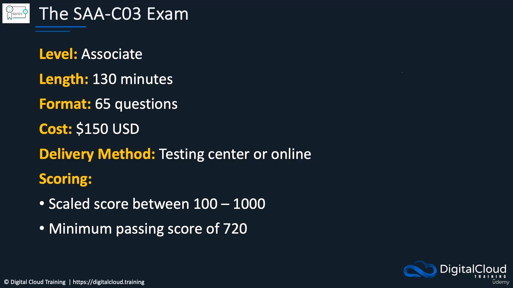
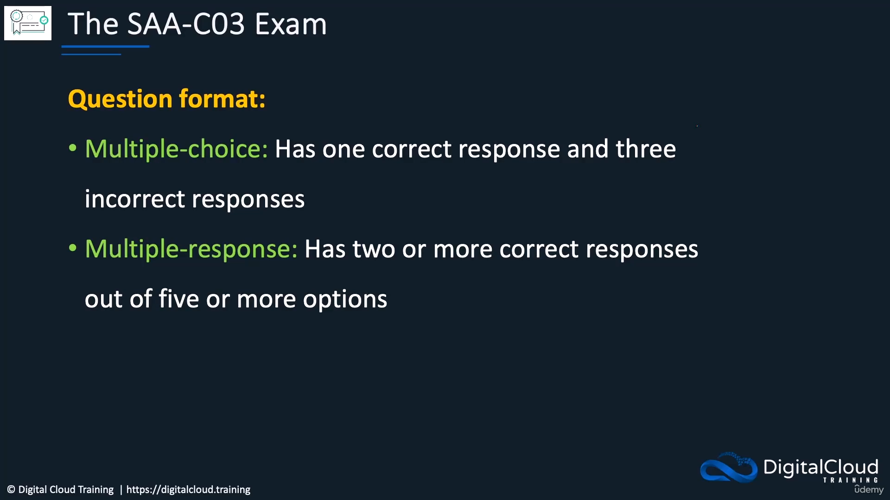

# 2. The SAA-C03 Exam

**Course:** [AWS Certified Solutions Architect Associate (SAA-C03) – Neal Davis](https://www.udemy.com/course/aws-certified-solutions-architect-associate-hands-on/)  
**Lecture:** [The SAA-C03 Exam](https://www.udemy.com/course/aws-certified-solutions-architect-associate-hands-on/learn/lecture/33349752#content)  
**Transcript:** [`udemy/notes/2-The-SAA-C03-Exam.txt`](../notes/2-The-SAA-C03-Exam.txt)

---

## Introduction

**SAA-C03** is the exam code for the **AWS Certified Solutions Architect Associate**. It sits at the **associate** level—between **foundational** and **professional**. The exam is **130 minutes**, **65 questions**, **$150**, scored **100–1000** with a pass mark of **720** (~72%). Questions are **scenario-based** multiple choice and multiple response only (no hands-on). Content is grouped into **four domains** that match architectural priorities: **security**, **resilience**, **performance**, and **cost**.

This lesson is your exam-logistics chapter. You will not create AWS resources here. You will learn how the test is structured so later technical lessons connect to “what the exam actually asks.”

If you are new to certifications, read this like a textbook chapter: first the facts (time, cost, score), then the question style, then the four domains. Memorize the domain names. They become the table of contents for the rest of the course.

## Detailed Explanation

### Step 1 — Place SAA-C03 on the AWS certification ladder

- [x] **What SAA-C03 is**
  - Exam code for **AWS Certified Solutions Architect Associate**.
  - **Associate** level: between **foundational** and **professional**.
  - AWS expects some **AWS knowledge** and **industry experience**.
  - This course still starts from the beginning if you lack that background.
  - Prior understanding of **compute**, **storage**, **networking**, and **databases** makes study easier.

**Novice note:** “Associate” does not mean easy. It means the questions assume you can choose an architecture, not only define a service. Foundational exams test vocabulary; this exam tests **trade-offs**.

### Step 2 — Learn the logistics: time, questions, and exam-day tactics

- [x] **Length, question count, and style**
  - **130 minutes** and **65 questions**.
  - Associate questions are **scenario-based**; some scenarios are complex and answers are tricky.
  - Often **two answers look very tempting**; one is still clearly wrong—you must work out which.
  - You may spend a few minutes on a hard question; **watch the timer**.
  - Do not get stuck: **mark for review** and come back; other questions will go faster.

**How to think about time:** 130 minutes / 65 questions is about **2 minutes per question**. If a scenario is still unclear after that, mark it and move on.

- [x] **Cost and discount**
  - Exam cost is **$150**.
  - If you already passed another AWS certification, use your **voucher** for a **50% discount**.

**Figure 1.** Exam facts slide: duration, question count, cost, delivery, scoring, and pass mark.



*Figure 1 description:* The slide lists **Length 130 minutes**, **65 questions**, **Cost $150**, **Delivery method Testing Center or Online**, **Scoring 100–1000**, and **Pass mark 720**. Use this figure as a one-page cheat sheet for exam logistics.

### Step 3 — Choose a delivery method and prepare the room

- [x] **Delivery method**
  - **Testing center** or **online** (if you meet the basic requirements).
  - Online: **quiet room**, no one else around, **no noise**, **clutter-free desk**.
  - After signup they email details; complete a **technical check** for **network**, **camera**, and **microphone**.

**Novice checklist for online testing:**

1. Book a quiet room where nobody will walk in.
2. Clear the desk of phones, notes, and extra monitors if the proctor forbids them.
3. Run the technical check days before the exam, not 10 minutes before.
4. Confirm camera and microphone work.

### Step 4 — Understand scoring and question formats

- [x] **Scoring**
  - **Scaled score** from **100 to 1000**.
  - AWS does not publish more scoring detail—it is a **black box**.
  - Pass mark is **720 / 1000**, about **72%**.
- [x] **Question format**
  - **Multiple choice:** **4** options, **1** correct, **3** incorrect.
  - **Multiple response:** **2 or more** correct answers from **5 or more** options.
  - **No hands-on** component—purely multiple choice and multiple response.

**Figure 2.** Question format and exam domains. This is the most important visual in the lesson.



*Figure 2 description:* The left side explains **multiple choice** (4 answers, 1 correct) and **multiple response** (2+ correct from 5+ options). The right side lists the four domains: **Design secure architectures**, **Design resilient architectures**, **Design high-performing architectures**, and **Design cost-optimized architectures**. There is no lab on the real exam.

### Step 5 — Memorize the four domains (the exam’s table of contents)

- [x] **Four domains (security, resilience, performance, cost)**
  - Domain 1: **Design secure architectures**
    - Design **secure access** to AWS resources (security controls on resources).
    - Design **secure workloads and applications**.
    - Determine appropriate **data security controls** (customer responsibility in AWS).
  - Domain 2: **Design resilient architectures**
    - Design **scalable** and **loosely coupled** architectures.
    - Design **highly available** and/or **fault-tolerant** architectures.
  - Domain 3: **Design high-performing architectures**
    - Scalable, performant **storage** solutions.
    - Performant **elastic compute** solutions (methods, controls, deployment options to meet requirements).
    - Task **3.3:** high-performing **database** solutions (e.g. scalable storage, **caching**).
    - Task **3.4:** high-performing and/or scalable **network** architectures.
    - Task **3.5:** high-performing **data ingestion and transformation** solutions.
  - Domain 4: **Design cost-optimized architectures**
    - Cost-optimized **storage**.
    - Cost-optimized **compute**.
    - Cost-optimized **database**.
    - Cost-optimized **network** architectures.

**Novice translation of the four domains:**

| Domain | Everyday question the exam is asking |
| --- | --- |
| Secure | Who can access this, and how is data protected? |
| Resilient | What happens if a component or Availability Zone fails? |
| High-performing | Will storage, compute, database, and network meet the speed/scale need? |
| Cost-optimized | Is there a cheaper design that still meets the requirement? |

### Step 6 — Use the official exam guide for in-scope services

- [x] **Exam guide and in-scope services**
  - For more detail, including **in-scope AWS services**, use the official **AWS exam guide** (linked from this lesson).
  - This course covers those services and is **updated** so you have what you need for the exam.

The lesson resources include the official exam page: [AWS Certified Solutions Architect – Associate](https://aws.amazon.com/certification/certified-solutions-architect-associate/).

<details>
  <summary>Lab</summary>

## Lab

No labs in this topic; the content is conceptual only. This lesson is an exam overview, not a console walkthrough.

### **Overview**

- [ ] Review the **SAA-C03** exam logistics (time, questions, cost, scoring, format).
- [ ] Memorize the **four domains** and their task themes.
- [ ] Open the official **AWS exam guide** for in-scope services.

</details>

<details>
  <summary>Terminal Commands</summary>

## Terminal Commands

No terminal commands in this exam-overview lesson.

```bash
# No commands in this topic; the lesson is exam logistics and domains only.
```

</details>

<details>
  <summary>Code</summary>

## Code

No code in this exam-overview lesson.

```text
# No code snippets in this topic.
```

</details>

<details>
  <summary>Questions and Answers</summary>

## Questions and Answers

### Question 1: What does the exam code **SAA-C03** stand for?

<details>
<summary>Answer</summary>

- [x] **AWS Certified Solutions Architect Associate**.

</details>

### Question 2: Where does the associate exam sit relative to other AWS certification levels?

<details>
<summary>Answer</summary>

- [x] It is **associate** level.
- [x] That is between **foundational** and **professional**.

</details>

### Question 3: How long is the exam, and how many questions are there?

<details>
<summary>Answer</summary>

- [x] **130 minutes**
- [x] **65 questions**

</details>

### Question 4: What style of questions should you expect at associate level?

<details>
<summary>Answer</summary>

- [x] **Scenario-based** questions.
- [x] Scenarios can be complex and answers can be tricky.
- [x] Often **two options look tempting**; one is still wrong.

</details>

### Question 5: What should you do if you are stuck on a question?

<details>
<summary>Answer</summary>

- [x] Do **not** spend too long on it.
- [x] **Mark it for review** and come back later.
- [x] Watch the **timer** so you have enough time for the rest of the exam.

</details>

### Question 6: How much does the exam cost, and when can you get 50% off?

<details>
<summary>Answer</summary>

- [x] Cost is **$150**.
- [x] If you already **passed** another AWS certification, use your **voucher** for a **50% discount**.

</details>

### Question 7: How can you take the exam, and what does online delivery require?

<details>
<summary>Answer</summary>

- [x] **Testing center** or **online**.
- [x] Online needs a **quiet room**, no one else around, **no noise**, and a **clutter-free desk**.
- [x] Complete a **technical check** for **network**, **camera**, and **microphone**.

</details>

### Question 8: How is the exam scored, and what is the pass mark?

<details>
<summary>Answer</summary>

- [x] **Scaled scoring** from **100 to 1000**.
- [x] Scoring detail is a **black box**; AWS does not publish more than that.
- [x] You need **720 / 1000** (~**72%**) to pass.

</details>

### Question 9: What is the difference between multiple choice and multiple response on this exam?

<details>
<summary>Answer</summary>

- [x] **Multiple choice:** **4** answers, **1** correct, **3** incorrect.
- [x] **Multiple response:** **2 or more** correct answers from **5 or more** options.

</details>

### Question 10: Is there a hands-on lab component on the SAA-C03 exam?

<details>
<summary>Answer</summary>

- [x] **No.** It is purely **multiple choice** and **multiple response**.

</details>

### Question 11: What four architectural themes do the exam domains reflect?

<details>
<summary>Answer</summary>

- [x] **Security**
- [x] **Resilience**
- [x] **Performance**
- [x] **Cost**

</details>

### Question 12: What is Domain 1, and what must you be able to design?

<details>
<summary>Answer</summary>

- [x] Domain 1 is **Design secure architectures**.
- [x] Design **secure access** to AWS resources.
- [x] Design **secure workloads and applications**.
- [x] Determine appropriate **data security controls** (customer responsibility in AWS).

</details>

### Question 13: What is Domain 2, and what kinds of architectures does it cover?

<details>
<summary>Answer</summary>

- [x] Domain 2 is **Design resilient architectures**.
- [x] **Scalable** and **loosely coupled** architectures.
- [x] **Highly available** and/or **fault-tolerant** architectures.

</details>

### Question 14: What is Domain 3, and which task numbers cover databases, networking, and data pipelines?

<details>
<summary>Answer</summary>

- [x] Domain 3 is **Design high-performing architectures**.
- [x] Task **3.3:** high-performing **database** solutions (e.g. scalable storage, **caching**).
- [x] Task **3.4:** high-performing and/or scalable **network** architectures.
- [x] Task **3.5:** high-performing **data ingestion and transformation** solutions.

</details>

### Question 15: What else must you know for high-performing architectures besides databases and networks?

<details>
<summary>Answer</summary>

- [x] Scalable, performant **storage** solutions.
- [x] Performant **elastic compute** solutions.
- [x] The **methods**, **controls**, and **deployment options** that meet specified performance requirements.

</details>

### Question 16: What is Domain 4, and which four solution types must you cost-optimize?

<details>
<summary>Answer</summary>

- [x] Domain 4 is **Design cost-optimized architectures**.
- [x] Cost-optimized **storage**
- [x] Cost-optimized **compute**
- [x] Cost-optimized **database**
- [x] Cost-optimized **network** architectures

</details>

### Question 17: Where do you review which AWS services are in scope for the exam?

<details>
<summary>Answer</summary>

- [x] The official **AWS exam guide** (linked from this lesson).
- [x] This course also covers those services and is **updated** for the exam.

</details>

### Question 18: Do you need prior AWS experience to start this course?

<details>
<summary>Answer</summary>

- [x] AWS expects some **experience and knowledge**, which makes the exam easier.
- [x] If you do not have it, this course still **starts from the beginning**.
- [x] Background in **compute**, **storage**, **networking**, and **databases** helps.

</details>

</details>

## Summary

**SAA-C03** is the associate Solutions Architect exam: **130 minutes**, **65** scenario questions, **$150** (50% off with a prior-cert voucher), **720/1000** to pass, testing center or online. Format is **multiple choice** (1 of 4) and **multiple response** (2+ of 5+), with **no hands-on**. Four domains cover **secure**, **resilient**, **high-performing**, and **cost-optimized** architectures. Use the **AWS exam guide** for in-scope services; do not linger on hard questions—**mark for review** and move on.

## References

- [AWS Certified Solutions Architect Associate (SAA-C03) Course – Neal Davis (Udemy)](https://www.udemy.com/course/aws-certified-solutions-architect-associate-hands-on/)
- [The SAA-C03 Exam (lecture 2)](https://www.udemy.com/course/aws-certified-solutions-architect-associate-hands-on/learn/lecture/33349752#content)
- [AWS Certified Solutions Architect – Associate (official exam page)](https://aws.amazon.com/certification/certified-solutions-architect-associate/)
- [AWS Certified Solutions Architect – Associate (SAA-C03) Exam Guide (PDF)](https://d1.awsstatic.com/training-and-certification/docs-sa-assoc/AWS-Certified-Solutions-Architect-Associate_Exam-Guide.pdf)
- Transcript: [`../notes/2-The-SAA-C03-Exam.txt`](../notes/2-The-SAA-C03-Exam.txt)
