[← Course contents](../../01.md)

# 20. Amazon EC2 Overview

**Course:** [AWS Certified Solutions Architect Associate (SAA-C03) – Neal Davis](https://www.udemy.com/course/aws-certified-solutions-architect-associate-hands-on/)
**Lecture:** [Amazon EC2 Overview](https://www.udemy.com/course/aws-certified-solutions-architect-associate-hands-on/learn/lecture/43065346#content)
**Transcript:** [`udemy/notes/20-Amazon-EC2-Overview.txt`](../notes/20-Amazon-EC2-Overview.txt)

---

## Introduction

**Amazon Elastic Compute Cloud (EC2)** is one of the original AWS services, and it is still one of the most important. EC2 lets you launch **virtual servers** (called **instances**) in AWS data centers on demand. Those instances can run **Linux** or **Windows**. There is also a **macOS** option, but that runs on **dedicated hardware**, not on the same virtual-server model as Linux and Windows.

This lesson is the map for the whole EC2 section. You will later launch instances, attach storage, assign IP addresses, and choose pricing models. Before those labs, you need a clear picture of five building blocks:

1. The **instance** itself (a virtual machine you manage).
2. The **VPC** and **subnets** it lives in, plus the **elastic network interface (ENI)** that plugs it into the network.
3. **Public, private, and Elastic IP** addresses.
4. **Elastic Block Store (EBS)** persistent disks versus **instance store** (fast but ephemeral).
5. **Instance families and types**, plus the stop / start / terminate billing rules.

There is no console lab in this video. Treat it as the theory chapter you will reuse in every later EC2 HOL.

**Figure 1.** Opening title of lecture 20: Amazon EC2 Overview.

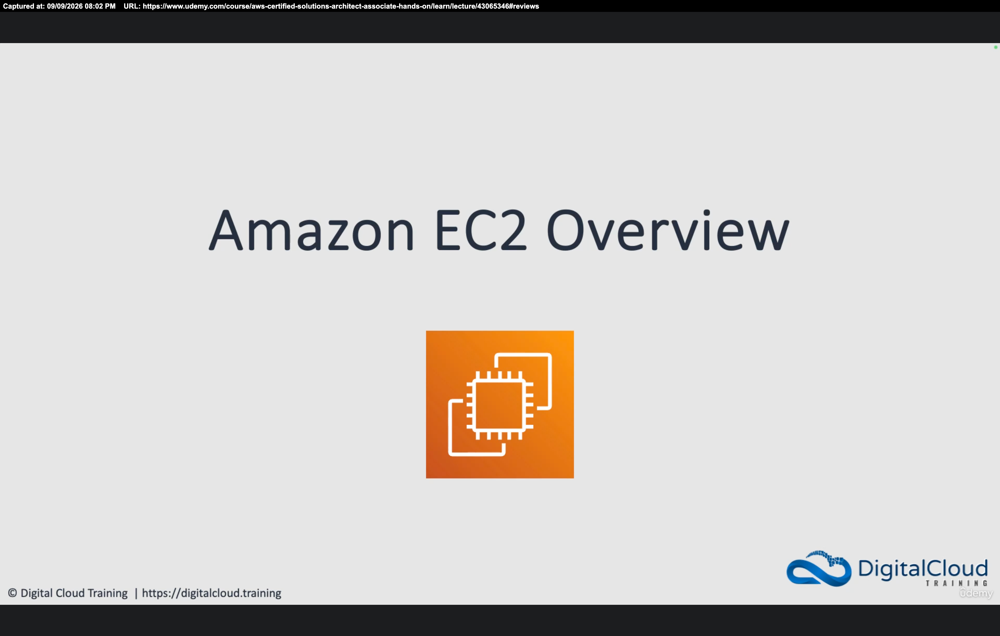

_Figure 1 description:_ Digital Cloud Training title card. The heading is **Amazon EC2 Overview**, with the orange EC2 chip icon. This is a theory overview, not a hands-on launch lab.

## Detailed Explanation

<details>
  <summary>Step 1 — Define EC2: virtual servers, OS options, ENI, VPC, and EBS</summary>

### Step 1 — Define EC2: virtual servers, OS options, ENI, VPC, and EBS

- [x] **What Amazon EC2 is**
  - **EC2** = **Amazon Elastic Compute Cloud**.
  - You launch **on-demand EC2 instances** in the cloud.
  - An **instance** is a **virtual server** (a virtual machine) running in AWS data centers.
  - You provision these virtual servers **on demand** at any time.
- [x] **Operating systems**
  - Instances can run **Windows** or **Linux**.
  - There is a **macOS** option, but it uses **dedicated hardware**, not virtual servers the way Windows and Linux do.
  - Dedicated hardware options also exist for Windows and Linux. **macOS is always dedicated hardware.**
- [x] **Network attachment**
  - Instances attach to the network in a **VPC** through an **elastic network interface (ENI)**.
  - Every instance has **at least one ENI**. You can add more network adapters.
  - You get a lot of control over networking configuration in AWS.
- [x] **Where instances launch**
  - Instances launch into **subnets** inside an **Amazon Virtual Private Cloud (VPC)**.
  - AWS already provisions some VPCs in each region. You can also create and configure your own.
  - Every VPC is a **private networking space** for your environment, whether AWS created it or you did.
  - Attach an **internet gateway** for public connectivity. That is what a **public subnet** is for.
  - You choose: private-only communication among instances, **internet** connectivity, or connectivity to **on-premises** networks.
- [x] **Main storage**
  - The main storage for an EC2 instance is **Amazon Elastic Block Store (EBS)**.
  - EBS volumes are **persistent** block storage: hard disks or SSDs in the cloud.

**Figure 2.** Four EC2 building blocks: virtual servers, OS options, ENI, VPC subnets, and EBS.

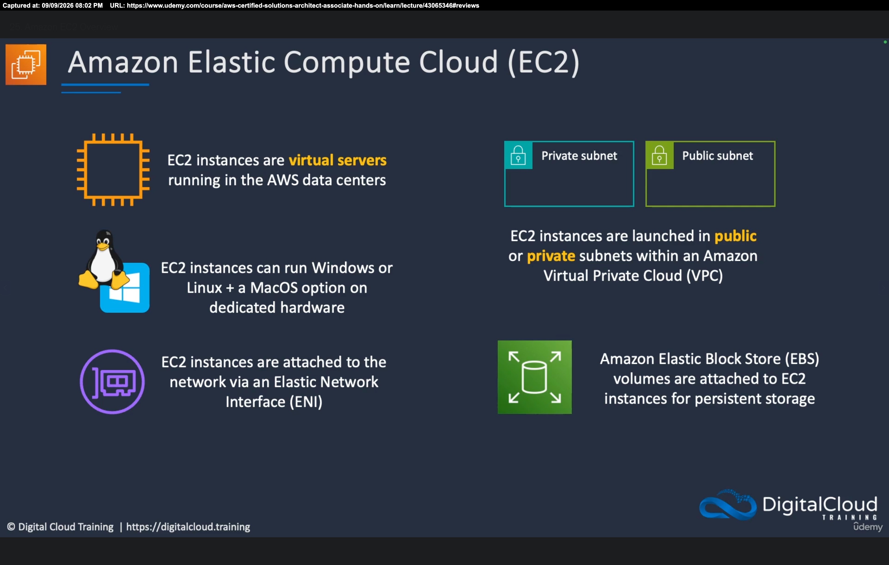

_Figure 2 description:_ Left column: EC2 instances are **virtual servers** in AWS data centers; they can run **Windows or Linux**, plus a **macOS option on dedicated hardware**; they attach to the network via an **ENI**. Right column: instances launch in **public or private subnets** inside a **VPC**; **EBS** volumes attach for **persistent storage**.

</details>

<details>
  <summary>Step 2 — Split AWS host management from your instance management</summary>

### Step 2 — Split AWS host management from your instance management

- [x] **Physical hosts vs virtual instances**
  - EC2 instances run on **servers in AWS data centers**.
  - **Many instances** can run on each physical host.
  - Those **hosts are managed by AWS**.
  - The **virtual instances** are **managed by you**.
- [x] **Customer responsibility inside the VM**
  - You choose the **operating system**, **hardware profile**, and **applications**.
  - You update your **application stack** and **OS patches**.
  - You **secure** the servers.
  - **Everything inside the virtual machine** is the customer’s responsibility.
- [x] **Instance types are hardware combinations**
  - A selection of **instance types** gives different mixes of **CPU**, **memory**, **storage**, and **networking**.
  - Choose the mix that matches each workload.

**Figure 3.** Many customer-managed instances run on AWS-managed host servers.

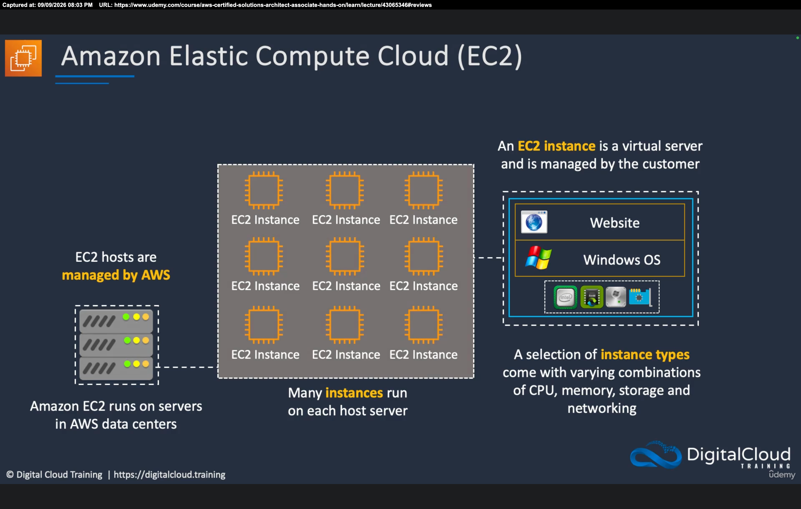

_Figure 3 description:_ Left: a physical **Amazon EC2** host server, **managed by AWS**. Center: many **EC2 instances** on that host. Right: one instance callout — a virtual server **managed by the customer**, here a **Windows** guest running a **website**, with a mix of CPU, memory, storage, and networking. **Instance types** are those hardware combinations.

</details>

<details>
  <summary>Step 3 — Use stop, start, and terminate to control cost</summary>

### Step 3 — Use stop, start, and terminate to control cost

- [x] **Instances are flexible and on demand**
  - You can **stop** an instance when it is not needed and **start** it again later.
  - You pay for the **instance** while it is **running**, not while it is **stopped**.
  - Example: shut down overnight if the workload is only used during business hours.
  - You pay **different rates** based on **instance type**.
  - Start and stop can be done in the **console**, from the **CLI**, or through an **SDK** / automation.
- [x] **EBS billing caveat**
  - **Storage volumes are always charged** for the **capacity you provision**, not for how much data you store.
  - Example: a **100 GB** EBS volume is billed as **100 GB** whether it is full or empty.
  - Stopping the instance **does not** stop EBS storage charges.
- [x] **Terminate deletes the instance**
  - When you no longer need an instance, **terminate** it and it is **completely deleted**.

**Figure 4.** Stop and start an instance to save compute cost, or terminate it to delete it.

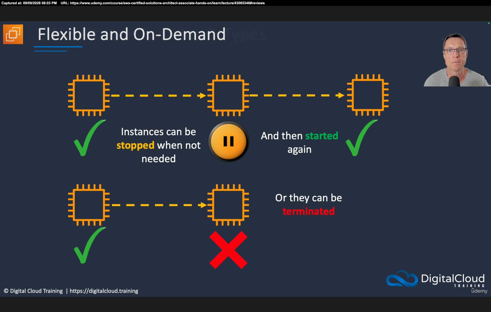

_Figure 4 description:_ Top row: a running instance can be **stopped** (pause), then **started** again. Bottom row: a running instance can be **terminated** (red X) and is gone. Memorize: **stop** = still exists, no instance-hour charge; **terminate** = deleted.

**Novice rule:** stopping saves **compute** money. It does **not** make attached **EBS** volumes free.

</details>

<details>
  <summary>Step 4 — Choose an instance family, generation, and size</summary>

### Step 4 — Choose an instance family, generation, and size

- [x] **Families vs types**
  - EC2 provides **instance families** and **instance types**.
  - Families are hardware mixes **optimized for different compute workloads**.
  - Common families in this lesson:
    - **General purpose**
    - **Compute optimized**
    - **Memory optimized**
    - **Accelerated computing**
    - **Storage optimized**
  - There are more families than these five, and **hundreds** of instance types.
- [x] **CPU-to-memory ratio**
  - **Compute optimized:** higher ratio of **CPU compared to memory**.
  - **Memory optimized:** higher ratio of **memory compared to CPU**.
  - Pick the ratio that matches the workload so you **optimize cost**.
- [x] **Larger sizes cost more and do more**
  - Larger sizes give more CPU, memory, and related capacity.
  - You **pay** for that extra hardware.
- [x] **How names are written**
  - Example: **m5.large**.
  - **m** = family name.
  - **5** = generation number.
  - **large** = size.
  - The lecture uses this name to teach the **family + generation + size** pattern.

**Exam note:** on the SAA-C03 family list, **M** is usually **general purpose** and **R** is the classic **memory optimized** family. Keep **m5.large** as the **naming** example, then map workload to the five-family list above.

**Figure 5.** Instance families: general purpose, compute, memory, accelerated, and storage.

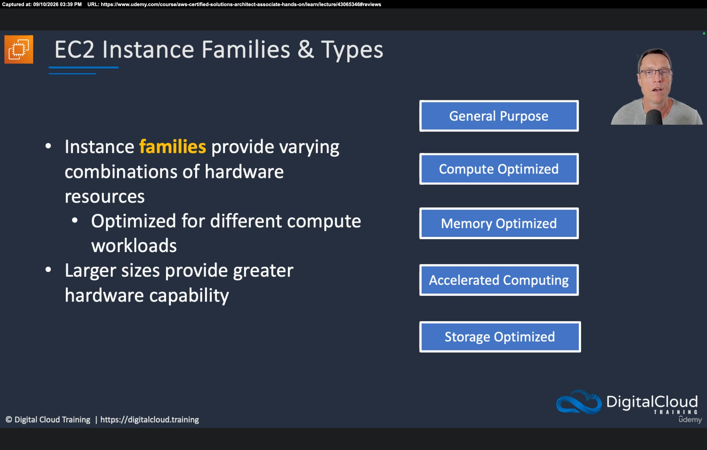

_Figure 5 description:_ Slide **EC2 Instance Families & Types**. Families provide varying hardware combinations optimized for different workloads. Larger sizes provide greater hardware capability. The five buttons are **General Purpose**, **Compute Optimized**, **Memory Optimized**, **Accelerated Computing**, and **Storage Optimized**.

**Figure 6.** Decode **m5.large**: family, generation, and size.

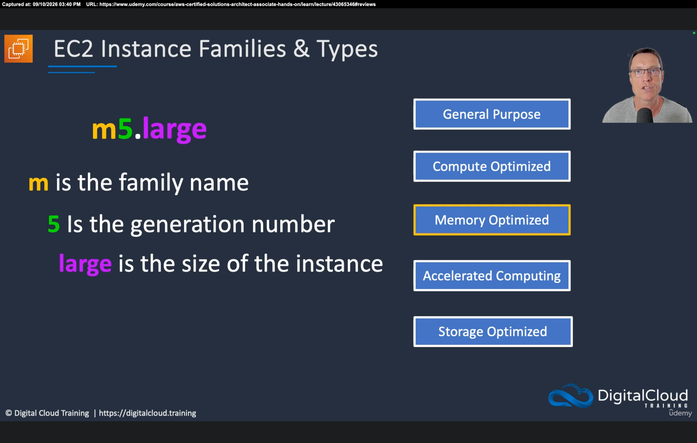

_Figure 6 description:_ **m** is the family name, **5** is the generation, **large** is the size. Memory Optimized is highlighted on the family list while this naming example is explained.

- [x] **Relative size and price examples**
  - **t2.micro:** 1 vCPU, 1 GiB memory, about **0.0116 USD/hr**.
  - **c3.xlarge:** 4 vCPUs, 7.5 GiB memory, about **0.21 USD/hr**.
  - **m4.16xlarge:** 64 vCPUs, 256 GiB memory, about **3.2 USD/hr**.
  - Prices are for **relative comparison** and change over time. Do not memorize the dollar amounts.
  - Choose the right size for the use case so you do not overpay.

**Figure 7.** Three instance sizes compared by vCPU, memory, and relative hourly price.

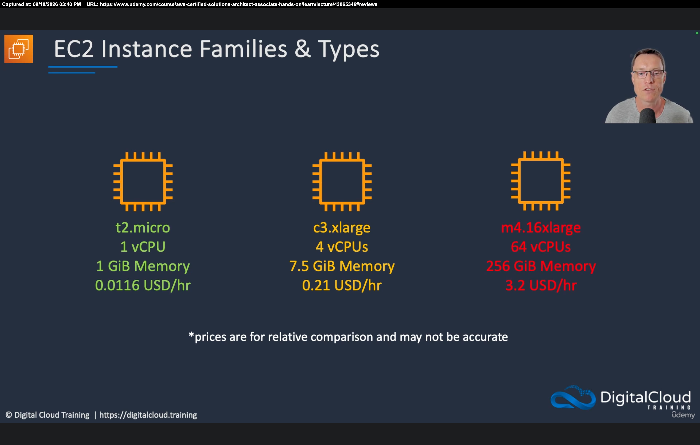

_Figure 7 description:_ Left **t2.micro** (1 vCPU, 1 GiB, 0.0116 USD/hr). Middle **c3.xlarge** (4 vCPUs, 7.5 GiB, 0.21 USD/hr). Right **m4.16xlarge** (64 vCPUs, 256 GiB, 3.2 USD/hr). Footer: prices are for relative comparison and may not be accurate.

</details>

<details>
  <summary>Step 5 — Place instances in subnets and assign public, private, and Elastic IPs</summary>

### Step 5 — Place instances in subnets and assign public, private, and Elastic IPs

- [x] **ENIs live in a VPC**
  - Instances connect to the network via **elastic network interfaces**.
  - They always deploy inside a **VPC**.
  - Every AWS region has **Availability Zones** (data-center groupings).
  - You create VPCs and **subnets**. Each subnet **maps to one Availability Zone**.
  - The subnet is a **logical** construct mapped to the physical AZ.
- [x] **Public vs private subnets**
  - **Public subnet:** the instance can have a **private IP** and an optional **public IP**. You need a public IP for public connectivity.
  - On Linux the first Ethernet interface is **eth0** (Windows labels it differently). That is the first ENI.
  - **Private subnet:** instances have **private IP addresses only**. No public IP is needed there.
- [x] **Multiple ENIs**
  - An instance can have **multiple interfaces**.
  - Extra ENIs can be in the **same subnet** or **different subnets**, as long as they are in the **same Availability Zone**.

**Figure 8.** ENIs in public and private subnets, including a dual-ENI instance in one AZ.

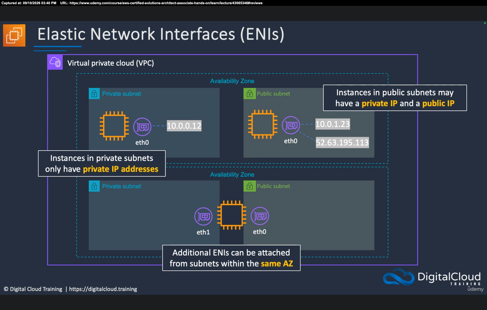

_Figure 8 description:_ One **VPC** with two Availability Zones. Top AZ: a **private** instance at **10.0.0.12** on **eth0** (private IP only); a **public** instance with **eth0** at **10.0.1.23** (private) and **52.63.195.113** (public). Bottom AZ: one instance with **eth1** in a private subnet and **eth0** in a public subnet. Caption: additional ENIs can be attached from subnets in the **same AZ**.

- [x] **Public IP address**
  - A **dynamic** address assigned with DHCP.
  - **Released** if the instance is **stopped and started**.
  - Used in **public subnets**.
  - There is a **charge** for using a public IP.
  - It is **associated** with the instance’s **private IP**.
  - Inside the OS, **ifconfig** / **ipconfig** do **not** show the public IP. The guest only sees the private IP on the ENI. The public mapping is **outside** the instance.
  - You **cannot move** a public IP between instances.
- [x] **Private IP address**
  - **Retained** if the instance is stopped and started.
  - Used in **public and private** subnets.
  - An instance **always** has a private IP.
- [x] **Elastic IP address**
  - A **static public** IP.
  - Use it when you must keep the **same** public address.
  - **Chargeable**.
  - Also associated with the private IP on the instance.
  - **Can be moved** between instances and elastic network adapters.

```bash
# Linux: the guest OS only lists the private IP on the ENI
ifconfig

# Windows
ipconfig
```

**Figure 9.** Public vs private vs Elastic IP: stop behavior, subnets, cost, and move rules.

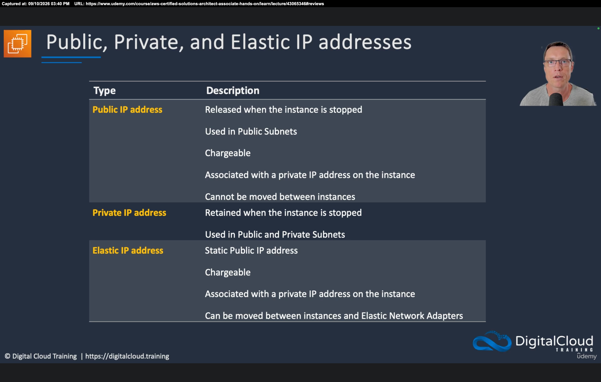

_Figure 9 description:_ Table from the lecture. **Public IP:** released when the instance is stopped; used in public subnets; chargeable; associated with a private IP; cannot be moved between instances. **Private IP:** retained when stopped; used in public and private subnets. **Elastic IP:** static public IP; chargeable; associated with a private IP; can be moved between instances and elastic network adapters.

| Type | Stop/start | Where used | Cost | Visible in OS? | Move between instances? |
| --- | --- | --- | --- | --- | --- |
| **Public IP** | **Released** | Public subnets | Chargeable | No (mapped outside the instance) | No |
| **Private IP** | **Retained** | Public and private subnets | Always present | Yes, on the ENI | N/A (primary private IP stays with the instance) |
| **Elastic IP** | **Kept** (static public) | When you need a stable public IP | Chargeable | No (mapped to the private IP) | **Yes** |

</details>

<details>
  <summary>Step 6 — Pick ENI, ENA, or EFA for the performance you need</summary>

### Step 6 — Pick ENI, ENA, or EFA for the performance you need

- [x] **Three network interface types**
  - **Elastic Network Interface (ENI)** — basic adapter when you do **not** have high-performance requirements. Works with **all instance types**.
  - **Elastic Network Adapter (ENA)** — **enhanced networking**: higher performance, higher bandwidth, **lower inter-instance latency**. You must choose a **supported instance type**.
  - **Elastic Fabric Adapter (EFA)** — **high performance computing (HPC)**, **MPI**, and **machine learning**. Good for **tightly coupled** apps that need very low inter-instance latency. The lecture slide lists it as usable with all instance types.

**Figure 10.** ENI (basic), ENA (enhanced networking), and EFA (HPC / MPI / ML).

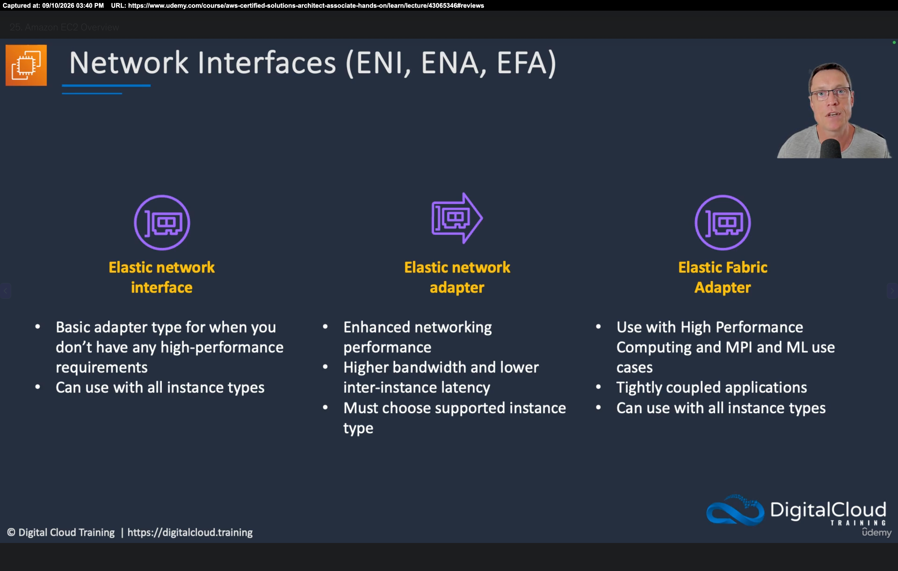

_Figure 10 description:_ Three columns. **Elastic network interface:** basic adapter, all instance types. **Elastic network adapter:** enhanced networking, higher bandwidth and lower inter-instance latency, must choose a supported instance type. **Elastic Fabric Adapter:** HPC, MPI, and ML; tightly coupled applications.

</details>

<details>
  <summary>Step 7 — Attach EBS volumes in the same AZ and choose a volume type</summary>

### Step 7 — Attach EBS volumes in the same AZ and choose a volume type

- [x] **What EBS is**
  - Principal storage for EC2 is **Elastic Block Store**.
  - It is **block-based persistent** storage, **attached directly** to the instance.
  - On Windows you see EBS as **local drives**, not network drives. It is **not** a remote file system.
  - The volume is attached **over the network**, but the OS treats it like a local HDD or SSD.
- [x] **Availability Zone rules**
  - EBS volumes exist **within an Availability Zone**.
  - The volume and the instance must be in the **same AZ**.
  - Volumes are **automatically replicated within the AZ** for durability.

**Figure 11.** EBS volumes live in an AZ, attach over the network, and appear as local disks.

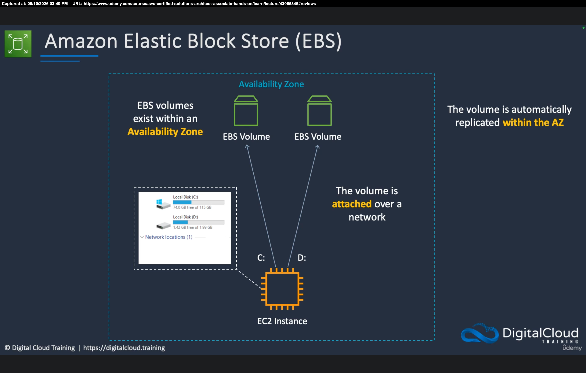

_Figure 11 description:_ One Availability Zone with two **EBS volumes** attaching over the network to an EC2 instance as Windows **C:** and **D:** local disks. Captions: volumes exist within an AZ; attached over a network; **automatically replicated within the AZ**.

- [x] **Volume types in this lesson**
  - **gp3** — general purpose SSD (current default-style choice).
  - **gp2** — older general purpose SSD.
  - **io2** and **io1** — **provisioned IOPS** SSDs for much higher **IOPS** (input/output operations per second: lots of read/write transactions).
  - **st1** — **throughput-optimized HDD**.
  - **sc1** — **cold HDD**, lower performance, lower cost.
  - **Magnetic (standard)** — older HDD; rarely used now.
  - You pay different rates based on the performance the volume provides.
- [x] **Multi-Attach**
  - **Multi-Attach** lets **multiple instances** attach to **one** EBS volume.
  - In this table, **only io2 and io1** support Multi-Attach.
  - Use it for some **clustering** designs. It is **still block storage**, not a shared file system.
  - For a shared file system use **Amazon EFS** (Linux) or **Amazon FSx** (Windows).
  - Multi-Attach has **restrictions**. Do not treat it as a drop-in NAS.

**Figure 12.** EBS volume types: durability, size, IOPS, throughput, and Multi-Attach.

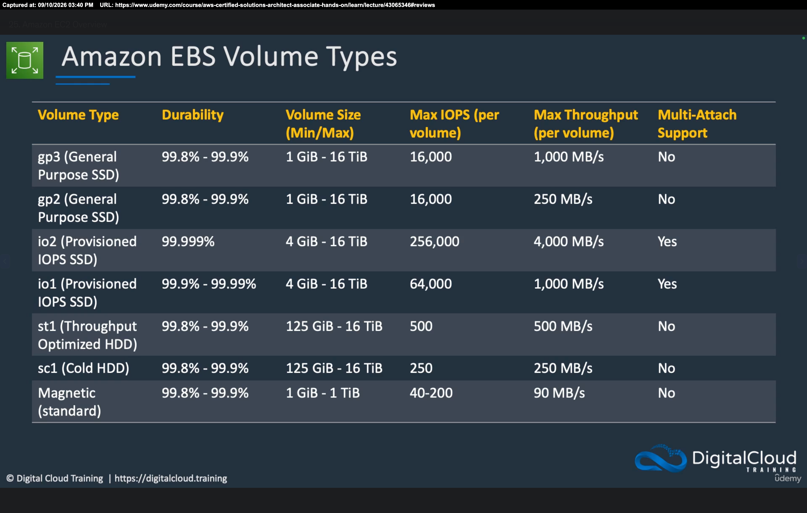

_Figure 12 description:_ Comparison table. **gp3 / gp2:** ~99.8–99.9% durability, 1 GiB–16 TiB, max 16,000 IOPS; gp3 max throughput 1,000 MB/s vs gp2 250 MB/s; Multi-Attach **No**. **io2:** 99.999% durability, 4 GiB–16 TiB, 256,000 IOPS, 4,000 MB/s, Multi-Attach **Yes**. **io1:** 99.9–99.99%, 4 GiB–16 TiB, 64,000 IOPS, 1,000 MB/s, Multi-Attach **Yes**. **st1:** throughput-optimized HDD, 125 GiB–16 TiB, 500 IOPS, 500 MB/s. **sc1:** cold HDD, 125 GiB–16 TiB, 250 IOPS, 250 MB/s. **Magnetic:** 1 GiB–1 TiB, 40–200 IOPS, 90 MB/s. Only **io1** and **io2** show Multi-Attach **Yes**.

- [x] **Use cases**
  - **gp3:** most workloads, including databases and dev/test.
  - **gp2:** older gp3; boot volumes, dev/test, general use.
  - **io2 / io1:** high-performance databases and apps that need high IOPS.
  - **st1:** streaming, big data, log processing (throughput).
  - **sc1:** archival / infrequent access; lower cost per GB.
  - **Magnetic:** legacy; not used much anymore.

**Figure 13.** Typical use cases for each EBS volume type.

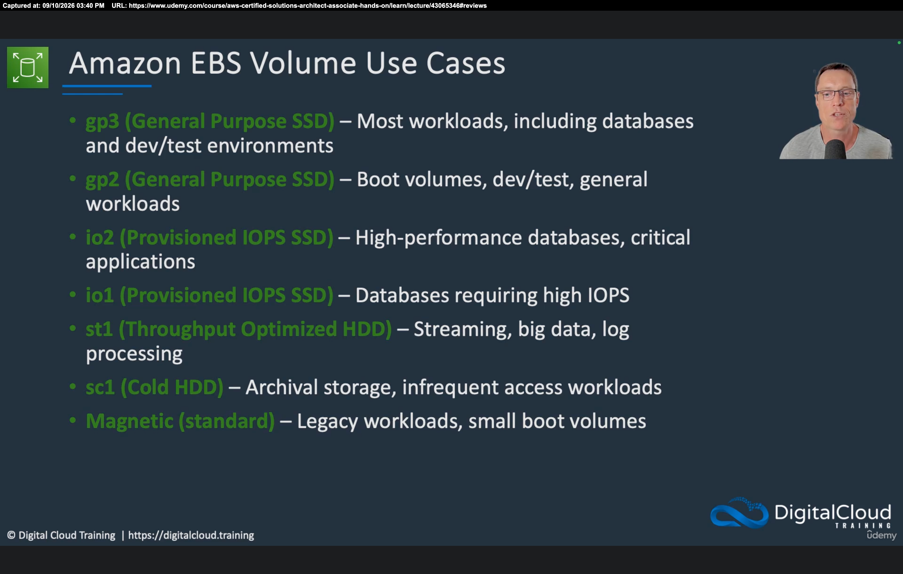

_Figure 13 description:_ **gp3** — most workloads, databases, dev/test. **gp2** — boot volumes, dev/test, general workloads. **io2** — high-performance databases, critical applications. **io1** — databases requiring high IOPS. **st1** — streaming, big data, log processing. **sc1** — archival storage, infrequent access. **Magnetic (standard)** — legacy workloads, small boot volumes.

</details>

<details>
  <summary>Step 8 — Keep persistent data on EBS, not on instance store</summary>

### Step 8 — Keep persistent data on EBS, not on instance store

- [x] **EBS is network-attached persistent storage**
  - Host servers run many instances.
  - Networking extends into the VM with an **ENI**.
  - Hosts connect **across the network** to the EBS storage system.
  - EBS is the right place for **persistent** data.
- [x] **Instance store is physically attached and ephemeral**
  - **Instance store** volumes are disks **physically attached to the host**.
  - They offer **very high performance**.
  - They are **not persistent**. They are **ephemeral**.
  - Data is lost when **power is lost** (like RAM: pull power and the contents are gone).
  - Do **not** store anything on instance store that you cannot recreate or that has long-term value.
- [x] **When instance store still makes sense**
  - Temporary files.
  - Data that is **replicated many times**, so losing one copy does not matter.
  - Workloads that need that extra local performance.
  - For **all persistent data, use EBS**.

**Figure 14.** EBS volumes attach over the network; instance store disks sit on the host and are ephemeral.

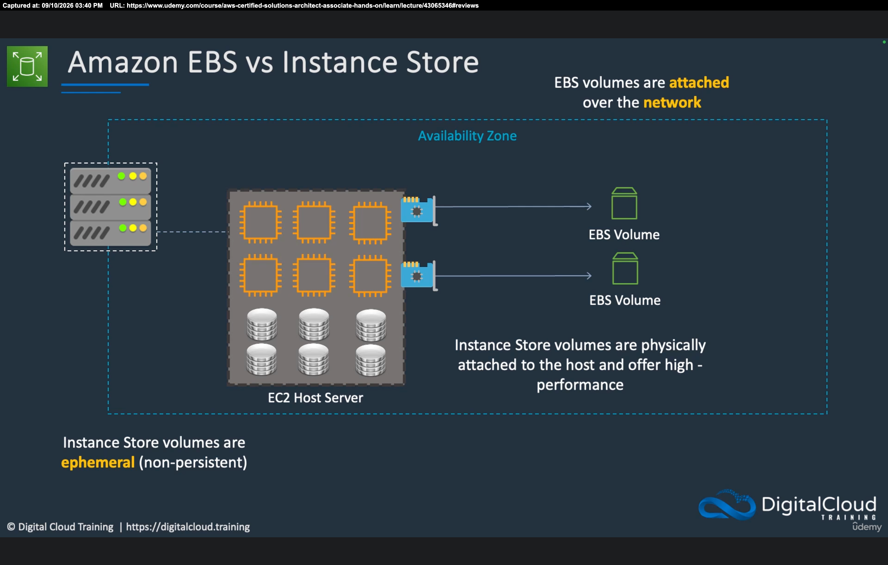

_Figure 14 description:_ Inside an Availability Zone, an **EC2 host** runs several instances. Network adapters on the host point to **EBS volumes** (attached **over the network**). Silver disks on the host are **instance store** volumes: physically attached, high performance, and **ephemeral (non-persistent)**.

</details>

<details>
  <summary>Lab</summary>

## Lab

No console lab in this topic. This lesson is a theory overview of EC2. Later HOL lessons in this section launch instances, attach volumes, and configure networking in your own account.

### **Overview**

- [ ] You will **not** launch an instance in this video.
- [ ] Memorize the model before the labs:
  - [ ] An **instance** is a virtual server you manage; AWS manages the **host**.
  - [ ] Every instance has at least one **ENI** and launches in a **VPC subnet**.
  - [ ] **Stop** saves instance-hour cost; **EBS** is still billed for **provisioned GB**; **terminate** deletes the instance.
  - [ ] Names look like `m5.large` (**family + generation + size**).
  - [ ] **Public IP** is dropped on stop and is not visible in the OS; **private IP** is kept; **Elastic IP** is a movable static public IP.
  - [ ] **EBS** = persistent, same AZ, replicated in the AZ. **Instance store** = fast and **ephemeral**.
  - [ ] **Multi-Attach** is **io1/io2** only and is **not** a shared file system (use **EFS** or **FSx** for that).

Study the guest-OS view of addressing. The public IP is associated **outside** the instance, so these commands show the **private** address only:

```bash
# Linux: the guest OS only lists the private IP on the ENI
ifconfig

# Windows
ipconfig
```

</details>

<details>
  <summary>Questions and Answers</summary>

## Questions and Answers

### Question 1: What is an Amazon EC2 instance?

<details>
<summary>Answer</summary>

- [x] A **virtual server** (virtual machine) you launch **on demand** in AWS data centers.

</details>

### Question 2: How is macOS on EC2 different from Linux and Windows?

<details>
<summary>Answer</summary>

- [x] **macOS always runs on dedicated hardware.**
- [x] Linux and Windows usually run as **virtual servers** (dedicated hardware is optional for them).

</details>

### Question 3: How does an EC2 instance attach to the network?

<details>
<summary>Answer</summary>

- [x] Through an **elastic network interface (ENI)** inside a **VPC**.
- [x] Every instance has **at least one ENI**. You can add more.

</details>

### Question 4: Who manages the physical EC2 host, and who manages the guest OS?

<details>
<summary>Answer</summary>

- [x] **AWS** manages the **physical host servers**.
- [x] **You** manage the **instance**: OS, patches, applications, and security **inside** the VM.

</details>

### Question 5: Do you pay for an EC2 instance while it is stopped?

<details>
<summary>Answer</summary>

- [x] **No** instance-hour charge while it is **stopped**. You pay when it is **running**.
- [x] **EBS volumes still cost money** for the **provisioned capacity**, even if the instance is stopped and even if the disk is mostly empty.

</details>

### Question 6: What is the difference between stop and terminate?

<details>
<summary>Answer</summary>

- [x] **Stop:** the instance still exists; you can **start** it later.
- [x] **Terminate:** the instance is **deleted**.

</details>

### Question 7: How do you read a name like m5.large?

<details>
<summary>Answer</summary>

- [x] **m** = family, **5** = generation, **large** = size.
- [x] Larger sizes have more CPU/memory and cost more. Choose the family for the workload (general purpose, compute, memory, accelerated, or storage).

</details>

### Question 8: What is the difference between compute-optimized and memory-optimized instance types?

<details>
<summary>Answer</summary>

- [x] **Compute optimized:** higher **CPU-to-memory** ratio.
- [x] **Memory optimized:** higher **memory-to-CPU** ratio.

</details>

### Question 9: Can extra ENIs be in different Availability Zones from the instance?

<details>
<summary>Answer</summary>

- [x] **No.** Additional ENIs can be in the same subnet or different subnets, but they must stay in the **same Availability Zone**.

</details>

### Question 10: What happens to a public IP if you stop and start the instance?

<details>
<summary>Answer</summary>

- [x] A normal **public IP is released** (it is dynamic).
- [x] Use an **Elastic IP** if you need a **static** public address that can also be **moved** to another instance.

</details>

### Question 11: Why does ifconfig or ipconfig not show the public IP?

<details>
<summary>Answer</summary>

- [x] The OS only sees the **private IP** on the ENI.
- [x] The public IP is **associated outside** the instance.

</details>

### Question 12: When do you choose ENI vs ENA vs EFA?

<details>
<summary>Answer</summary>

- [x] **ENI:** basic networking; all instance types.
- [x] **ENA:** **enhanced networking** (higher bandwidth, lower inter-instance latency); **supported instance types** only.
- [x] **EFA:** **HPC**, **MPI**, and **ML** for tightly coupled, low-latency apps.

</details>

### Question 13: Where must an EBS volume live relative to the instance?

<details>
<summary>Answer</summary>

- [x] In the **same Availability Zone**.
- [x] The volume is **replicated within that AZ** for durability, and it attaches **over the network** but appears as a **local disk**.

</details>

### Question 14: Which EBS types support Multi-Attach, and is Multi-Attach a shared file system?

<details>
<summary>Answer</summary>

- [x] Only **io1** and **io2** in this lesson’s table.
- [x] Multi-Attach is still **block storage**, not a shared file system. For shared files use **Amazon EFS** (Linux) or **Amazon FSx** (Windows).

</details>

### Question 15: Which EBS type is the usual default for most workloads, including databases and dev/test?

<details>
<summary>Answer</summary>

- [x] **gp3** (general purpose SSD).
- [x] Use **io1/io2** when you need **provisioned high IOPS**; use **st1/sc1** for HDD throughput or cold/archival cost.

</details>

### Question 16: Why must you not put persistent data on instance store?

<details>
<summary>Answer</summary>

- [x] Instance store is **ephemeral**: physically attached to the host, very fast, but data is **lost** if power is lost (and when the instance is gone).
- [x] Put persistent data on **EBS**. Instance store is for temp files or data you can recreate / already replicate.

</details>

</details>

## Summary

**EC2** launches **virtual servers** you manage on **AWS-managed hosts**. Instances sit in **VPC subnets**, always have at least one **ENI**, and use **EBS** for persistent disks. **Stop** avoids instance-hour charges but **not** EBS (or IP) charges; **terminate** deletes the instance. Pick an **instance family and size** for the CPU/memory mix. Remember **public** (dynamic, dropped on stop), **private** (always there, kept on stop), and **Elastic IP** (static, movable). Use **ENA/EFA** only when you need extra network performance. **EBS** stays in one **AZ**; **io1/io2** can **Multi-Attach** but that is not a file share. **Instance store** is fast and **ephemeral** — persistent data belongs on **EBS**.

## References

- [AWS Certified Solutions Architect Associate (SAA-C03) Course – Neal Davis (Udemy)](https://www.udemy.com/course/aws-certified-solutions-architect-associate-hands-on/)
- [Amazon EC2 Overview (lecture 20)](https://www.udemy.com/course/aws-certified-solutions-architect-associate-hands-on/learn/lecture/43065346#content)
- [Amazon EC2](https://docs.aws.amazon.com/AWSEC2/latest/UserGuide/concepts.html)
- [Amazon EC2 instance types](https://aws.amazon.com/ec2/instance-types/)
- [Elastic network interfaces (ENI)](https://docs.aws.amazon.com/AWSEC2/latest/UserGuide/using-eni.html)
- [Elastic IP addresses](https://docs.aws.amazon.com/AWSEC2/latest/UserGuide/elastic-ip-addresses-eip.html)
- [Amazon EBS volume types](https://docs.aws.amazon.com/ebs/latest/userguide/ebs-volume-types.html)
- [Amazon EC2 instance store](https://docs.aws.amazon.com/AWSEC2/latest/UserGuide/InstanceStorage.html)
- Transcript: [`../notes/20-Amazon-EC2-Overview.txt`](../notes/20-Amazon-EC2-Overview.txt)
