[← Course contents](../../01.md)

# 21. Launching Amazon EC2 Instances

**Course:** [AWS Certified Solutions Architect Associate (SAA-C03) – Neal Davis](https://www.udemy.com/course/aws-certified-solutions-architect-associate-hands-on/)
**Lecture:** [Launching Amazon EC2 Instances](https://www.udemy.com/course/aws-certified-solutions-architect-associate-hands-on/learn/lecture/43065352#content)
**Transcript:** [`udemy/notes/21-Launching-Amazon-EC2-Instances.txt`](../notes/21-Launching-Amazon-EC2-Instances.txt)

---

## Introduction

This **HOL** is the first time you actually **launch virtual servers** with **Amazon EC2**. Lecture 20 explained the pieces. This video puts them together in the console: you launch a **Linux** instance and a **Windows** instance in **US East (N. Virginia)**, using **Free Tier** defaults where the wizard offers them.

You make four choices every time you launch:

1. **Instance type** — the hardware profile (CPU, memory, storage) and therefore the **cost**. This course uses **t2.micro**.
2. **Amazon Machine Image (AMI)** — the operating system and software template, including how the **EBS** root volume is defined.
3. **Key pair** — the cryptographic keys used to connect (SSH for Linux; decrypting the Windows Administrator password).
4. **Security group** — the **firewall** that allows inbound traffic (SSH on **TCP 22**, later RDP on **TCP 3389**).

You will leave both instances **running**. The next lesson shows how to connect: **SSH** to Linux and **Remote Desktop** to Windows.

**Figure 1.** Opening title of lecture 21: Launching Amazon EC2 Instances.

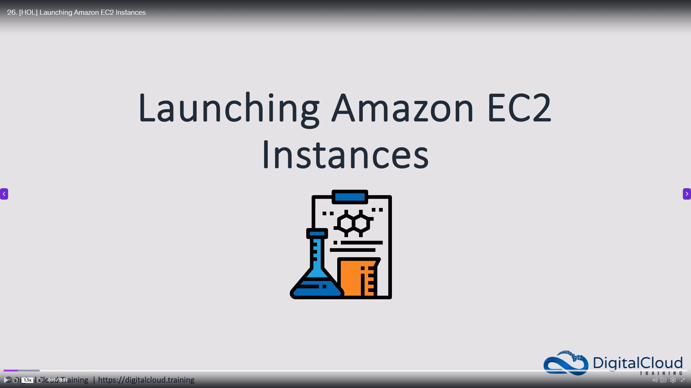

_Figure 1 description:_ Digital Cloud Training title card. The heading is **Launching Amazon EC2 Instances**, with a flask and clipboard graphic. The player overlay labels this course item **[HOL] Launching Amazon EC2 Instances**.

## Detailed Explanation

<details>
  <summary>Step 1 — Choose instance type, AMI, snapshot, and a custom AMI</summary>

### Step 1 — Choose instance type, AMI, snapshot, and a custom AMI

- [x] **What this HOL builds**
  - Launch **virtual servers** on AWS using **Amazon EC2**.
  - Launch **one Linux instance** and **one Windows instance**.
- [x] **Instance type = hardware profile and cost**
  - There are many instance types, with different amounts of **CPU**, **memory**, and **storage**.
  - You **pay** for the resources you require.
  - For most (if not all) labs in this course, use **t2.micro**.
  - **t2.micro** is a **general purpose** instance type and is **Free Tier eligible**.
  - The instance type defines the **hardware profile** and therefore the **cost**.
- [x] **AMI = configuration of the instance**
  - An **Amazon Machine Image (AMI)** defines which **operating system** you want and how the instance is configured.
  - An AMI can have an application **pre-installed** (example: **Windows** with **Microsoft SQL Server**).
  - The AMI also defines how the virtual drives (**EBS volumes**) are laid out.
- [x] **Snapshots back the AMI data**
  - AMI disk data is backed by an **EBS snapshot**.
  - Snapshots are taken from **live instances** as a kind of **backup**.
  - You then **create an AMI from the snapshot** and can keep launching instances that match the original.
  - A **snapshot** is a **point-in-time backup** of an EC2 instance.
- [x] **Custom AMIs**
  - Launch an existing AMI, make **customizations**, then create **your own AMI**.
  - Later you launch more instances from that customized image.

**Figure 2.** Launch flow: pick an instance type, an AMI (Linux or Windows), optional snapshot, and a custom AMI.

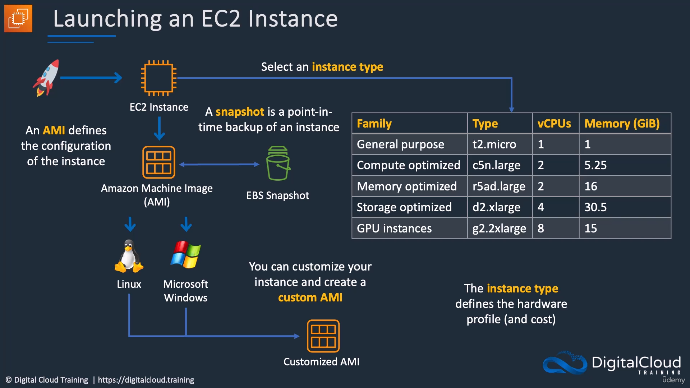

_Figure 2 description:_ Slide **Launching an EC2 Instance**. Left: an AMI defines the instance configuration (Linux or Microsoft Windows); a snapshot is a point-in-time backup; you can customize an instance and create a **custom AMI**. Right table of example types: **t2.micro** (general purpose, 1 vCPU, 1 GiB), **c5n.large**, **r5ad.large**, **d2.xlarge**, **g2.2xlarge**. Footer: the **instance type** defines the hardware profile and cost.

**Exam note:** AMI = **software template** (OS + installed software + volume layout). Instance type = **hardware + price**. Snapshot = **point-in-time backup** that can become a new AMI.

</details>

<details>
  <summary>Step 2 — Open the EC2 console and start Launch instance</summary>

### Step 2 — Open the EC2 console and start Launch instance

- [x] **Find EC2 in the Management Console**
  - Search **EC2**, add it to **favorites**, then open **EC2**.
- [x] **EC2 Dashboard**
  - The left menu lists features (instances, AMIs, security groups, and so on).
  - The main page shows **summary** counts for resources in the current region.
  - A tile in the top right shows **Free Tier** usage — useful so you can see how much of the allowance you have used.
- [x] **Launch instance**
  - Click **Launch instance** on the dashboard.
  - That is the same as **Instances** → **Launch instance**.

**Figure 3.** Search for EC2 in the AWS Management Console and open the service.

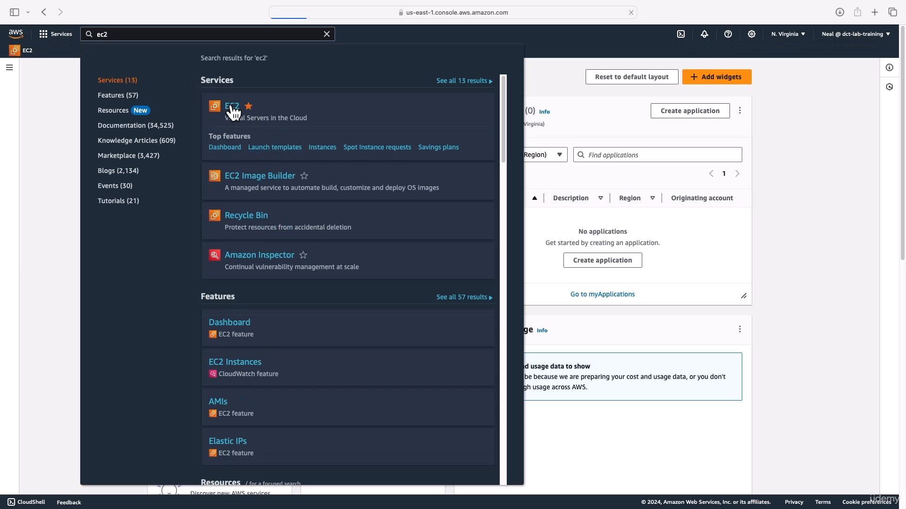

_Figure 3 description:_ AWS console in **N. Virginia**, account **Neal @ dct-lab-training**. The Services search for **ec2** lists **EC2** (Virtual Servers in the Cloud), plus **EC2 Image Builder**, **Recycle Bin**, and **Amazon Inspector**. The instructor stars EC2 as a favorite.

**Figure 4.** EC2 Dashboard with resource counts, Free Tier tile, and Launch instance.

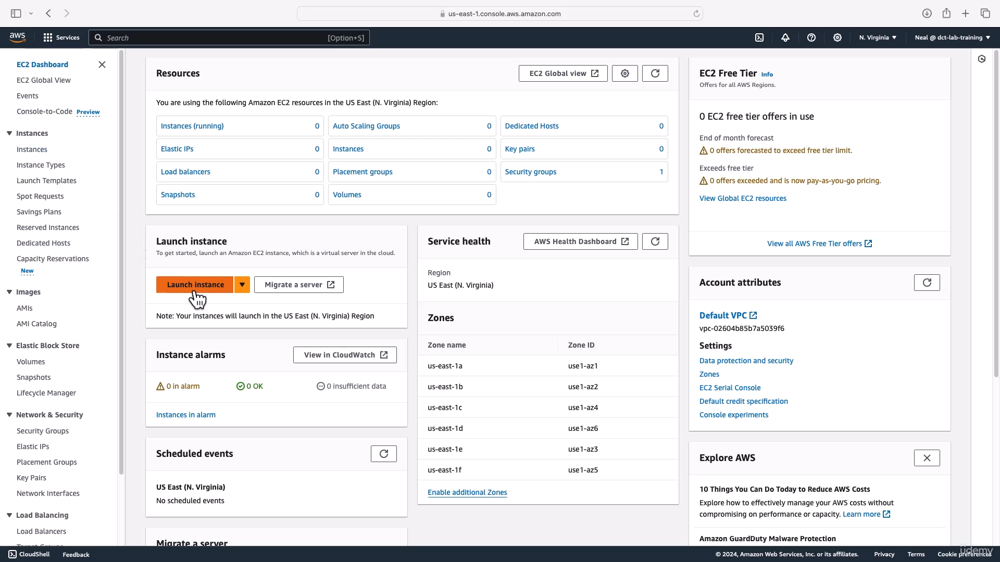

_Figure 4 description:_ **EC2 Dashboard** for **US East (N. Virginia)**. Resource counts are mostly **0**, with **1 security group**. The **Launch instance** orange button is highlighted. **EC2 Free Tier** shows **0 EC2 free tier offers in use**. **Account attributes** lists the **Default VPC**. Note: instances will launch in **US East (N. Virginia)**.

</details>

<details>
  <summary>Step 3 — Name the Linux instance and keep Amazon Linux 2023 on t2.micro</summary>

### Step 3 — Name the Linux instance and keep Amazon Linux 2023 on t2.micro

- [x] **Name (optional)**
  - Naming the instance is **optional**.
  - Instructor name: **Linux-Server**.
- [x] **Application and OS images (AMI)**
  - Default Quick Start AMI is **Amazon Linux**.
  - **Amazon Linux** is a Linux distribution **customized by AWS**.
  - It includes certain **agents** and the **AWS Command Line Interface (AWS CLI)** — useful for labs.
  - Selected image: **Amazon Linux 2023 AMI**, marked **Free tier eligible**.
- [x] **Instance type**
  - Default: **t2.micro**, **Free tier eligible**.
  - You can open the dropdown to pick other types. Leave **t2.micro**.

**Figure 5.** Launch an instance wizard: name Linux-Server and Amazon Linux 2023 AMI.

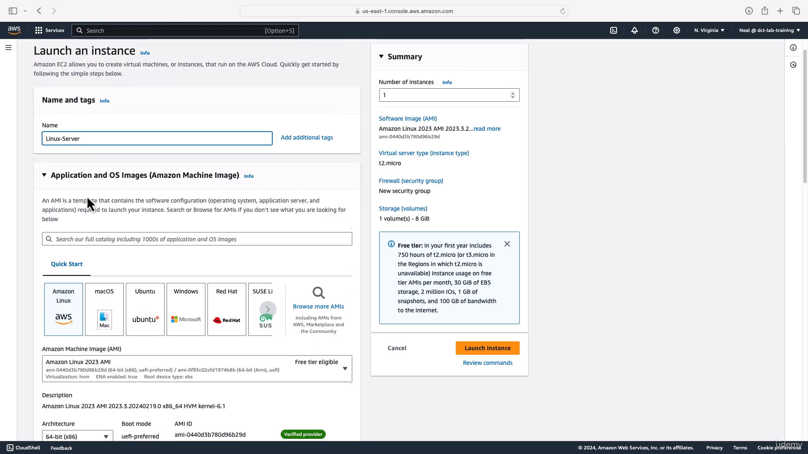

_Figure 5 description:_ **Launch an instance**. **Name** is **Linux-Server**. **Quick Start** shows Amazon Linux, macOS, Ubuntu, Windows, Red Hat, SUSE, and **Browse more AMIs**. Selected AMI: **Amazon Linux 2023 AMI** (`ami-0440d35b780d96b29d`), **64-bit (x86)**, **Free tier eligible**, **Verified provider**. Summary: **1** instance, **t2.micro**, new security group, **1 volume — 8 GiB**.

**Figure 6.** Instance type stays t2.micro, Free Tier eligible.

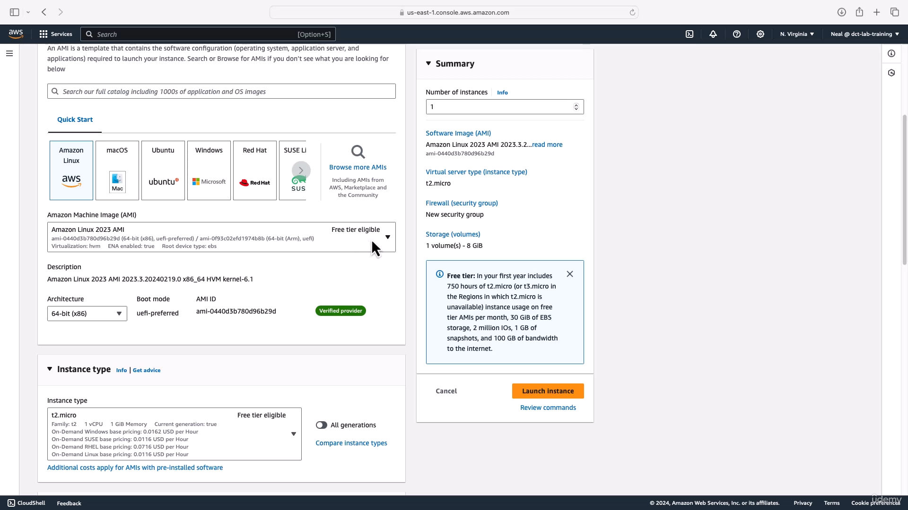

_Figure 6 description:_ **Instance type** dropdown on **t2.micro**: family **t2**, **1 vCPU**, **1 GiB** memory, **Free tier eligible**. On-Demand prices are listed for Windows, SUSE, RHEL, and Linux. Summary still shows **Amazon Linux 2023** and **t2.micro**.

**Novice rule:** Amazon Linux 2023 is a good default for this course because AWS already baked in **agents** and the **CLI**. You are not stuck with it — Quick Start also offers Ubuntu, Windows, and others.

</details>

<details>
  <summary>Step 4 — Create a key pair, name the WebAccess security group, and launch Linux</summary>

### Step 4 — Create a key pair, name the WebAccess security group, and launch Linux

- [x] **Key pair (login)**
  - Key pairs are used to connect with **SSH** from **outside AWS**.
  - If you have no key pairs yet, **create a new one**.
  - Leave defaults: **RSA** and **.pem** (OpenSSH).
  - Instructor name: **dct-lab-training-us-east-1** (descriptive: account + region).
  - **Create key pair** downloads the **private key** to your computer (usually **Downloads**).
  - This is **public/private key cryptography**. The **private key** is **sensitive**.
  - **Move the file** somewhere you can find later and keep it **secure**.
  - **Anyone with that file can connect to and manage your instances.**
  - After create, the wizard selects that key pair for you.
- [x] **Network settings — do not keep the auto-generated security group name**
  - Leave VPC / subnet / auto-assign public IP on defaults for now.
  - You **do** need a **new security group**.
  - Creating it without **Edit** gives a **weird default name** (example: `launch-wizard-1`).
  - Click **Edit**, then name it **WebAccess**.
  - Copy the same text into **Description**.
  - Inbound rule: **SSH**, **TCP 22**, source **Anywhere** (`0.0.0.0/0`) — any source IPv4 address.
  - That is what lets you connect with SSH in this lab.
- [x] **Storage and launch**
  - Leave **Configure storage** on defaults (**8 GiB gp3** root volume for this Amazon Linux AMI).
  - Advanced options are for a **later lesson**.
  - Number of instances: **1**.
  - Review the summary, then **Launch instance**.

**Figure 7.** Create key pair dialog: RSA .pem named dct-lab-training-us-east-1.

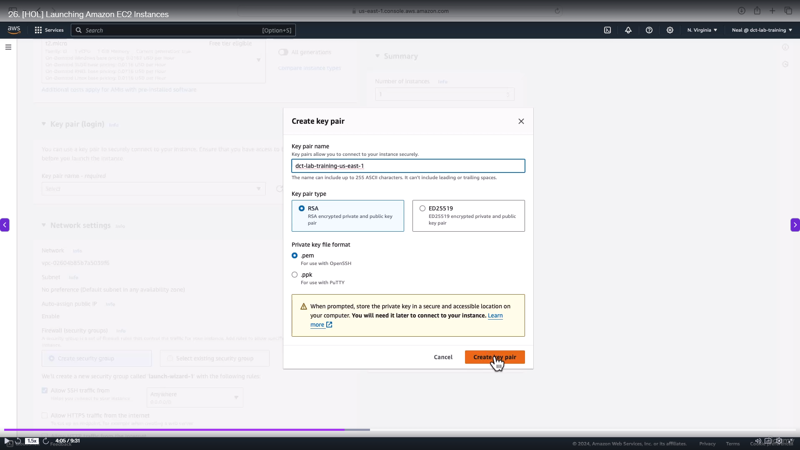

_Figure 7 description:_ **Create key pair** modal. **Key pair name:** `dct-lab-training-us-east-1`. **Key pair type:** **RSA**. **Private key file format:** **.pem** (OpenSSH), not **.ppk** (PuTTY). Yellow warning: store the private key in a **secure, accessible** location; you will need it later to connect. Cursor on **Create key pair**.

**Figure 8.** Default network settings before Edit: launch-wizard security group and SSH from Anywhere.

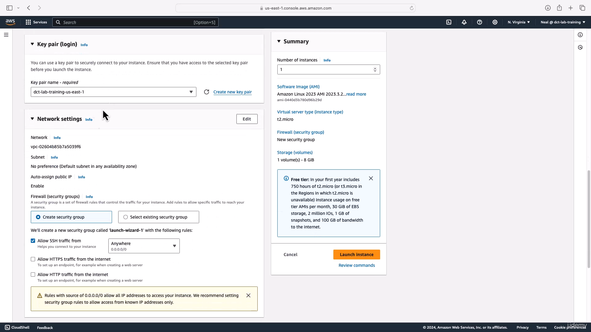

_Figure 8 description:_ **Key pair** is now **dct-lab-training-us-east-1**. **Network settings** still on **Create security group**, which would name it **launch-wizard-1**. **Allow SSH traffic from Anywhere (`0.0.0.0/0`)** is checked. AWS warns that `0.0.0.0/0` allows **all IP addresses** and recommends known IPs for real use. This lab follows the instructor and leaves SSH open so you can connect.

**Figure 9.** Edited network settings: security group name WebAccess, SSH on TCP 22.

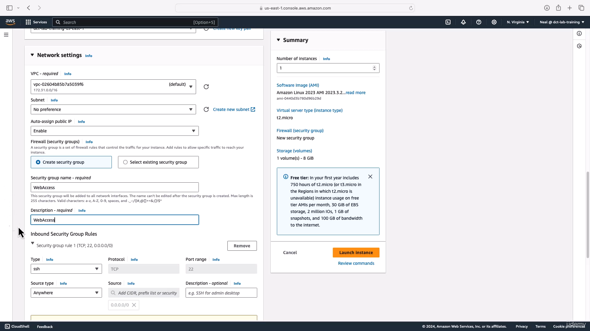

_Figure 9 description:_ After **Edit**: **VPC** is the **default** VPC. **Security group name** and **Description** are **WebAccess**. Inbound rule 1: type **ssh**, protocol **TCP**, port **22**, source type **Anywhere**, source **0.0.0.0/0**. Summary still shows **t2.micro** and a new security group.

**Figure 10.** Default 8 GiB gp3 root volume; click Launch instance.

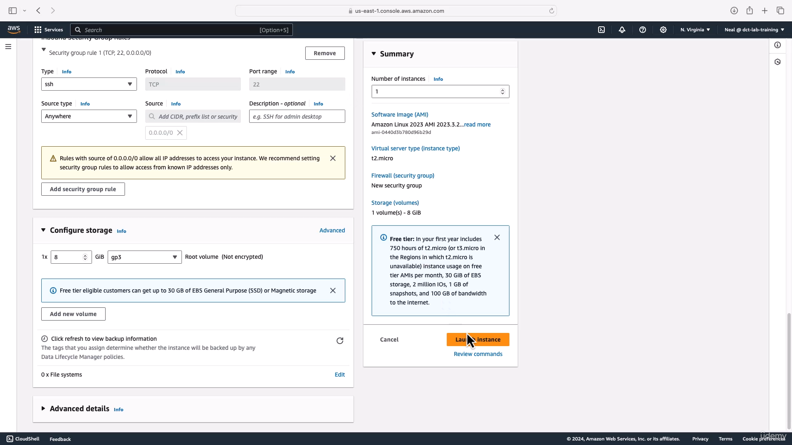

_Figure 10 description:_ **Configure storage:** **1x 8 GiB gp3**, **Root volume (Not encrypted)**. Free Tier note: eligible customers can get up to **30 GB** of EBS General Purpose (SSD) or Magnetic storage. Cursor on orange **Launch instance**. Advanced details stay collapsed.

**Figure 11.** Success: Linux instance launch initiated.

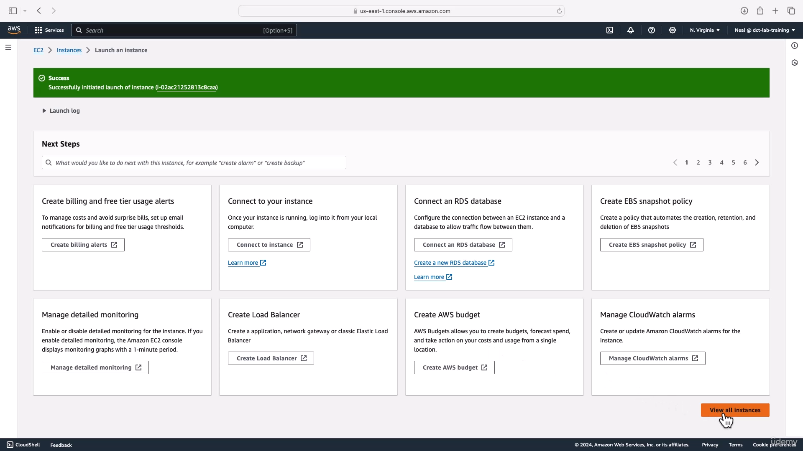

_Figure 11 description:_ Green banner: **Successfully initiated launch of instance** `i-02ac21252813c8caa`. Next-steps cards include billing alerts, connect, RDS, snapshot policy, monitoring, load balancer, budget, and CloudWatch alarms. Cursor on **View all instances**.

</details>

<details>
  <summary>Step 5 — Confirm Linux is running and read instance, IP, and AZ details</summary>

### Step 5 — Confirm Linux is running and read instance, IP, and AZ details

- [x] **Instance state**
  - **View all instances**: the new instance starts as **Pending**, then becomes **Running**.
- [x] **Details worth reading**
  - **Instance ID** — unique identifier (example: `i-02ac21252813c8caa`).
  - **Public IPv4 address** and **private IPv4 address**.
  - **Public IPv4 DNS** and **private IPv4 DNS** names.
  - Tabs for **monitoring**, **security**, **networking**, **storage**, and **tags**.
- [x] **Security group is the firewall**
  - The assigned security group allows access on **port 22** (SSH).
  - The lecture audio says “port 20” once; the console and the exam fact are **TCP 22**.
- [x] **Placement**
  - This Linux instance landed in Availability Zone **us-east-1d**.
  - It is in the **default VPC**, which is fine for this lab. VPC design comes later.

**Figure 12.** Running Linux-Server: public and private IPs, DNS names, AZ, and default VPC.

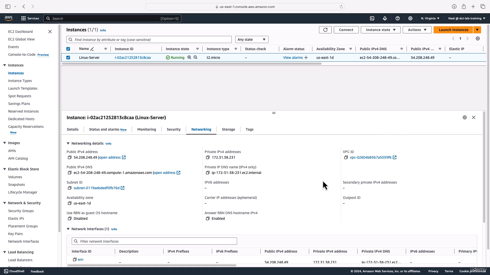

_Figure 12 description:_ Instances table: **Linux-Server**, `i-02ac21252813c8caa`, **Running**, **t2.micro**, AZ **us-east-1d**, public IPv4 **54.208.248.49**. **Networking** tab: public IPv4 **54.208.248.49**, private IPv4 **172.31.58.231**, public DNS `ec2-54-208-248-49.compute-1.amazonaws.com`, private DNS `ip-172-31-58-231.ec2.internal`, subnet in **us-east-1d**, **VPC** `vpc-02604b85b7a5039f6`. Primary ENI **eni-…** has the same public/private pair.

**Novice rule:** the **public IP** is how you reach the instance from the internet (if the security group allows it). The **private IP** is how other resources in the VPC talk to it. Lecture 20 already covered that the OS itself only sees the private address.

</details>

<details>
  <summary>Step 6 — Launch Windows Server 2022, reuse the key pair, and attach WebAccess</summary>

### Step 6 — Launch Windows Server 2022, reuse the key pair, and attach WebAccess

- [x] **Start a second launch**
  - Name: **Windows-Server**.
- [x] **Browse more AMIs (catalogs)**
  - **Quick Start** — commonly used AMIs (Amazon Linux, Windows, Ubuntu, and so on).
  - **My AMIs** — **your** custom AMIs, if you have created any.
  - **AWS Marketplace AMIs** — third-party images with extra software (VPN servers, backup, firewalls such as **Palo Alto**, **Splunk**, OpenVPN, and so on).
  - Marketplace images often cost **more** because **software charges** can be included (not always, but often).
  - **Community AMIs** — images people in the community created and shared.
  - Cancel out of the catalog and return to Quick Start for this lab.
- [x] **Windows AMI**
  - Click **Windows**.
  - Wizard selects **Microsoft Windows Server 2022 Base**, **Free tier eligible**.
  - Instance type stays **t2.micro**.
- [x] **Key pair is required for Windows**
  - You do **not** always need a key pair for **Linux** if you will connect with **AWS CloudShell** / Instance Connect (shown in a later lesson).
  - For **Windows**, you **must** assign a key pair so you can **retrieve / decrypt the Administrator password**.
  - Select the same key pair: **dct-lab-training-us-east-1**.
- [x] **Reuse WebAccess (SSH only for now)**
  - Network settings: **Select existing security group** → **WebAccess**.
  - **WebAccess does not yet have the rule Windows needs** (RDP). You will add it after launch.
  - Storage for this Windows AMI defaults to **30 GiB gp2** (root volume). Leave defaults.
  - **Launch instance**.

**Figure 13.** Second launch: name Windows-Server and open Browse more AMIs.

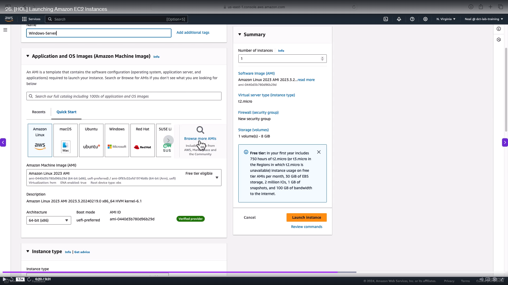

_Figure 13 description:_ Launch wizard **Name** is **Windows-Server**. Cursor on **Browse more AMIs**. Quick Start still shows Amazon Linux selected until you change OS. Summary on the right still reflects the previous Linux defaults until Windows is chosen.

**Figure 14.** AMI catalog: Quick Start, My AMIs, AWS Marketplace, and Community AMIs.

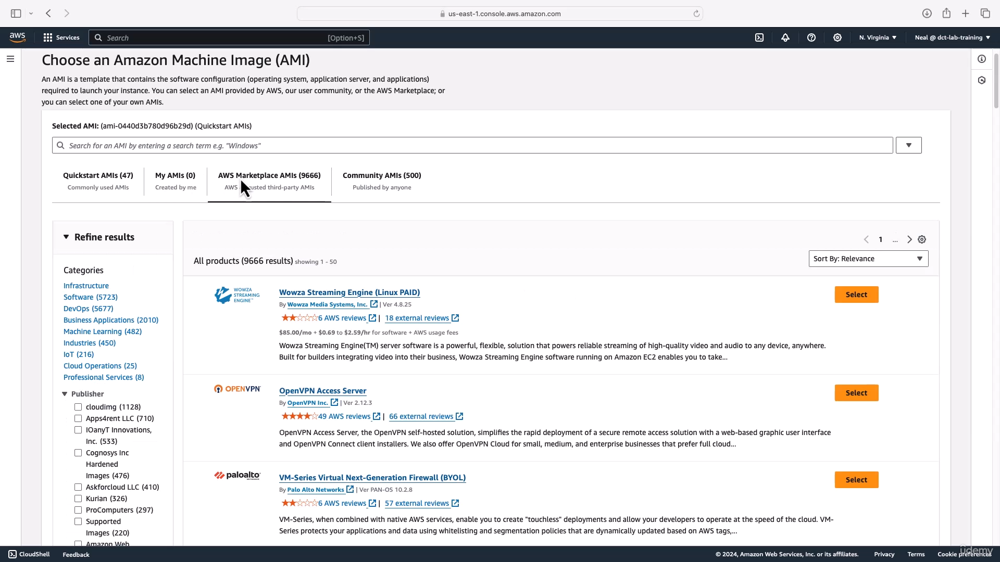

_Figure 14 description:_ **Choose an Amazon Machine Image (AMI)**. Tabs: **Quickstart AMIs (47)**, **My AMIs (0)**, **AWS Marketplace AMIs (9666)**, **Community AMIs (500)**. Marketplace examples: Wowza Streaming Engine (Linux PAID), OpenVPN Access Server, Palo Alto VM-Series firewall. This is where software-included (often paid) images live.

**Figure 15.** Quick Start Windows: Microsoft Windows Server 2022 Base.

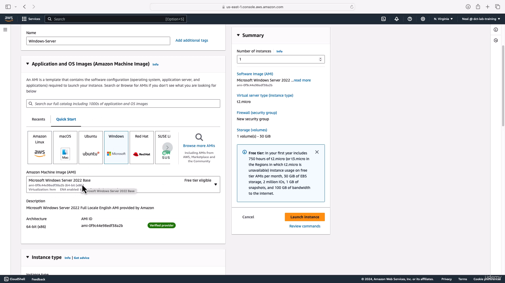

_Figure 15 description:_ **Windows** Quick Start selected. AMI: **Microsoft Windows Server 2022 Base** (`ami-0f9c44e98edf58a2b`), **Free tier eligible**, **Verified provider**, 64-bit (x86). Summary now shows **Microsoft Windows Server 2022** and **1 volume(s) — 30 GiB**.

**Figure 16.** Windows still on t2.micro; key pair required to decrypt the Administrator password.

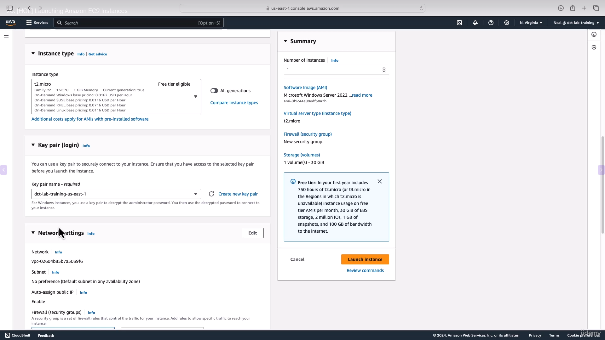

_Figure 16 description:_ **t2.micro** remains **Free tier eligible**. **Key pair (login):** `dct-lab-training-us-east-1`. Console note: **For Windows instances, you use a key pair to decrypt the administrator password.** Then you use that password to connect.

**Figure 17.** Select existing security group WebAccess.

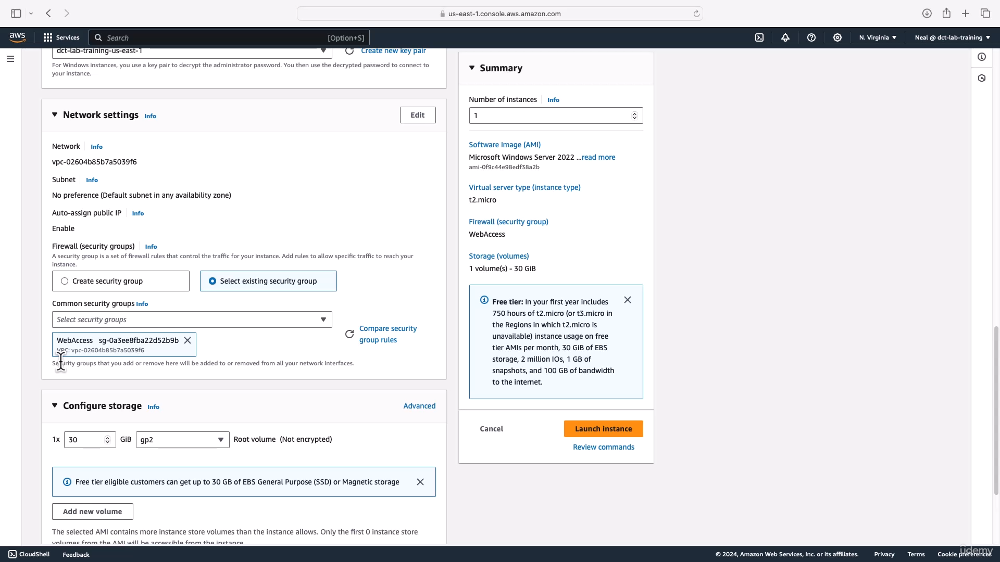

_Figure 17 description:_ **Firewall (security groups):** **Select existing security group**. Chosen group: **WebAccess** `sg-0a3ee8fba22d52b9b` in the default VPC. **Configure storage:** **1x 30 GiB gp2**, **Root volume (Not encrypted)**. Summary firewall line now says **WebAccess**.

**Figure 18.** Launch the Windows instance with 30 GiB gp2 storage.

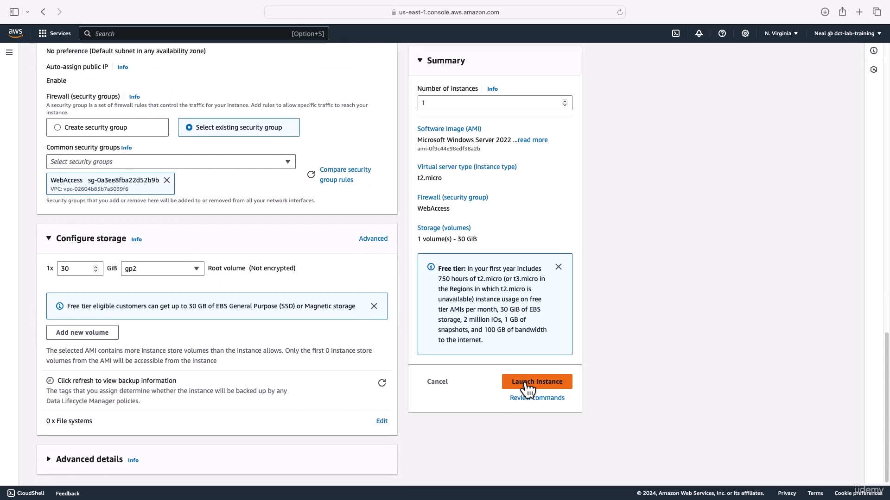

_Figure 18 description:_ Same WebAccess group and **30 GiB gp2** root volume. Cursor on **Launch instance**. Advanced details still collapsed.

**Figure 19.** Success: Windows instance launch initiated.

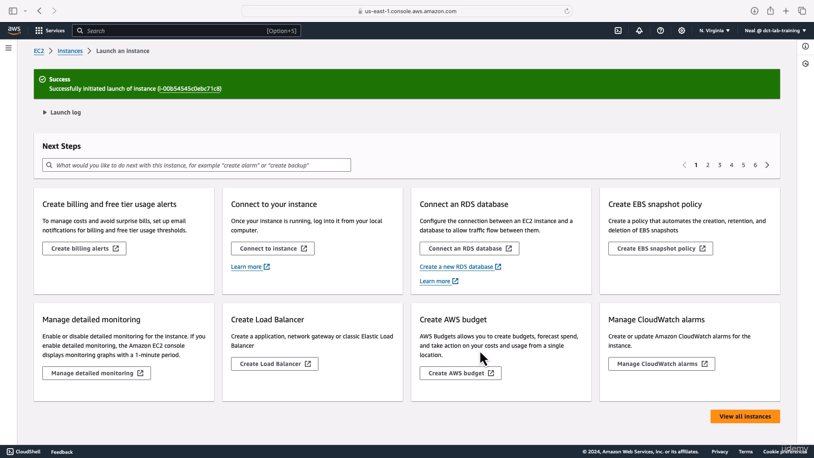

_Figure 19 description:_ Green banner: **Successfully initiated launch of instance** `i-00b54545c0ebc71c8`. Same next-steps cards as the Linux launch. **View all instances** is on the page.

**Exam note:** Marketplace AMIs can add a **software charge on top of EC2**. Community AMIs are shared by others — treat them as untrusted unless you have a reason to use a specific one. This lab stays on **Quick Start** AWS-provided images.

</details>

<details>
  <summary>Step 7 — Filter instances, add RDP to WebAccess, and leave both running</summary>

### Step 7 — Filter instances, add RDP to WebAccess, and leave both running

- [x] **Two instances on the list**
  - Refresh: **Linux-Server** and **Windows-Server**.
  - You can **filter by instance state** (for example **Running**).
  - That filter sometimes applies **by default**. If you do not see what you expect, set it to **All states**.
- [x] **Windows needs RDP, not SSH**
  - To connect to Windows you want **Remote Desktop Protocol (RDP)**.
  - On the instance **Security** tab, **WebAccess** currently allows **port 22** only — that is **SSH** for the Linux server, **not** RDP.
- [x] **Edit the security group inbound rules**
  - Open the security group from the instance **Security** tab, **or** go to **Network & Security → Security groups** in the left menu.
  - Click the **WebAccess** security group ID.
  - **Inbound** vs **outbound** rules: edit **inbound** only for now.
  - **Edit inbound rules** → **Add rule**.
  - Type **RDP** (easy search) — **TCP 3389**.
  - Source: **Anywhere-IPv4** (`0.0.0.0/0`).
  - **Save rules**.
- [x] **Leave them running**
  - Both instances are launched.
  - Wait a couple of minutes before Windows is ready to connect; Linux is ready sooner.
  - Connecting is the **next lesson**: Linux with **SSH**, Windows with **RDP**.
  - **Do not terminate** these two instances yet.

```text
WebAccess inbound (after this step)
SSH  TCP  22    0.0.0.0/0
RDP  TCP  3389  0.0.0.0/0
```

**Figure 20.** Both instances running; Windows Security tab still shows only SSH on port 22.

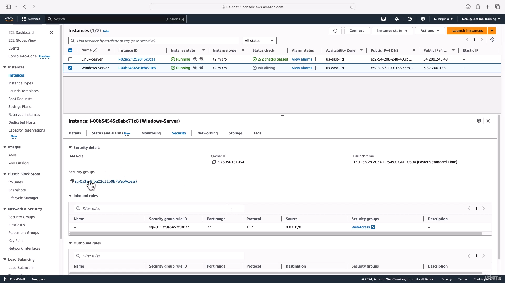

_Figure 20 description:_ Instances **(1/2)** with **All states**. **Linux-Server** is **Running**, **2/2 checks passed**, AZ **us-east-1d**. **Windows-Server** `i-00b54545c0ebc71c8` is **Running**, status check **Initializing**, AZ **us-east-1b**, public IPv4 **3.87.200.135**. **Security** tab: security group **WebAccess** `sg-0a3ee8fba22d52b9b`. Inbound: **TCP 22** from **0.0.0.0/0**. That is SSH, not RDP.

**Figure 21.** Security groups list: WebAccess and the default VPC group.

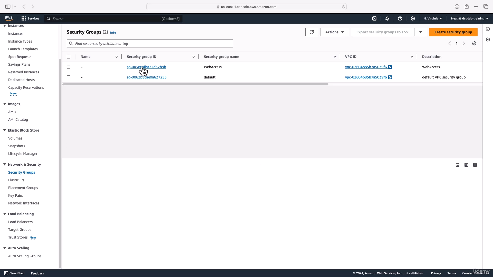

_Figure 21 description:_ **Network & Security → Security groups**. Two groups: **WebAccess** `sg-0a3ee8fba22d52b9b`, and **default** `sg-0062b8eae0a627255`, both in VPC `vpc-02604b85b7a5039f6`. Cursor on the **WebAccess** ID.

**Figure 22.** WebAccess details: one inbound SSH rule; Edit inbound rules.

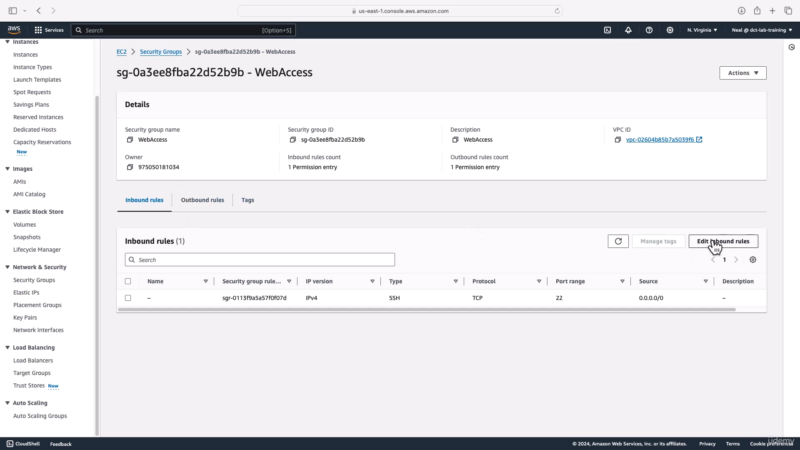

_Figure 22 description:_ Security group **sg-0a3ee8fba22d52b9b - WebAccess**. Inbound rules count **1**. The one rule is **SSH**, **TCP**, port **22**, source **0.0.0.0/0**. Cursor on **Edit inbound rules**.

**Figure 23.** Add RDP on TCP 3389 from Anywhere IPv4 and save.

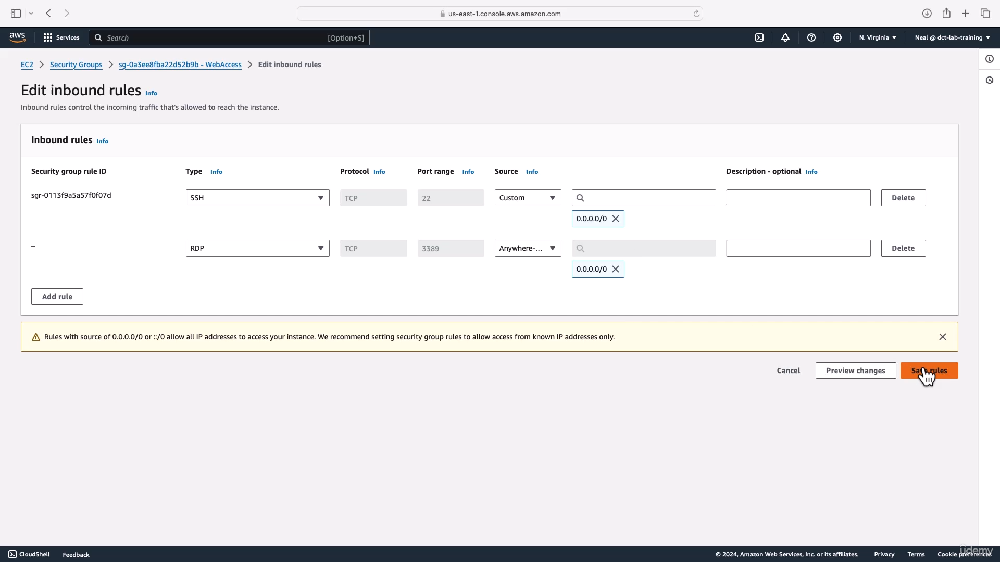

_Figure 23 description:_ **Edit inbound rules**. Existing rule: **SSH**, TCP **22**, source custom **0.0.0.0/0**. New rule: **RDP**, TCP **3389**, source **Anywhere-IPv4**, **0.0.0.0/0**. AWS warning again: `0.0.0.0/0` or `::/0` allows **all IP addresses**. Cursor on **Save rules**.

**Figure 24.** Linux-Server and Windows-Server both listed as Running.

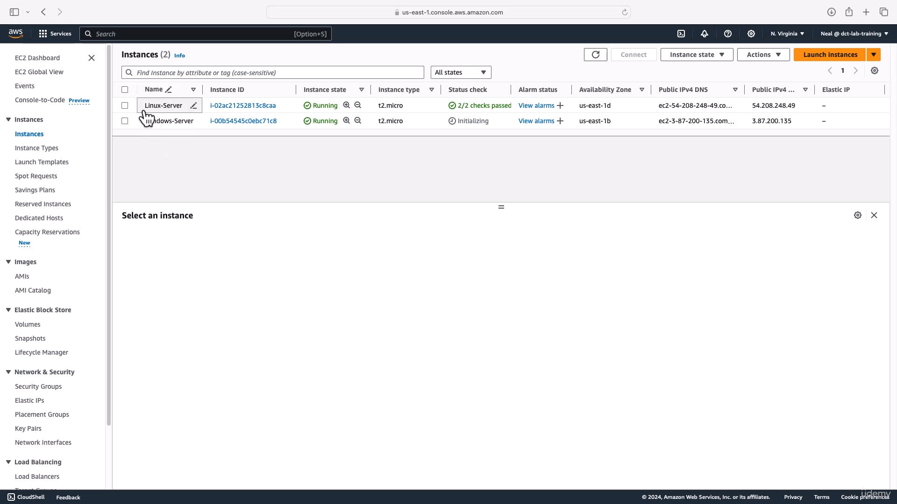

_Figure 24 description:_ Instances **(2)**, filter **All states**. **Linux-Server** running, checks passed, AZ **us-east-1d**, public IP **54.208.248.49**. **Windows-Server** running, **Initializing**, AZ **us-east-1b**, public IP **3.87.200.135**. Cursor on **Linux-Server**. These are the two servers you will connect to in the next HOL.

**Novice rule:** a security group is **stateful firewall rules attached to the ENI**. Opening **22** does not open **3389**. Shared groups mean a rule you add for Windows also applies to Linux on that group — that is acceptable for this lab.

</details>

<details>
  <summary>Lab</summary>

## Lab

Follow this HOL in **your** AWS account in **US East (N. Virginia)**. Use **t2.micro** and Free Tier–eligible AMIs. Names can match the instructor or use your own, as long as you remember them. Keep the **.pem** private key; the next lesson uses it.

Work as your **IAM user**, not root. Stop or terminate these instances after the **connecting** lesson unless a later lab still needs them. They cost instance-hours while **running**.

### **Overview**

- [ ] Launch a **Linux** instance and a **Windows** instance, share one key pair and one security group, then add **RDP**.
- [ ] You will:
  - [ ] Open **EC2** and start **Launch instance**.
  - [ ] Launch **Linux-Server** from **Amazon Linux 2023**, **t2.micro**.
  - [ ] Create key pair **dct-lab-training-us-east-1** (RSA, `.pem`) and store the private key safely.
  - [ ] Create security group **WebAccess** with **SSH / TCP 22** from `0.0.0.0/0`.
  - [ ] Launch **Windows-Server** from **Windows Server 2022 Base**, same type and key pair, existing **WebAccess**.
  - [ ] Add **RDP / TCP 3389** from `0.0.0.0/0` to **WebAccess**.
- [ ] Success: two **Running** instances; **WebAccess** has SSH **and** RDP; you still have the `.pem` file. Leave both running for the next lesson.

### **Task 1: Open EC2**

- [ ] Sign in to the **AWS Management Console** as your IAM user.
- [ ] Confirm the region is **US East (N. Virginia)** `us-east-1`.
- [ ] Search **EC2**, optionally add it to **favorites**, and open **EC2**.
- [ ] On the **EC2 Dashboard**, note the **Free Tier** tile and resource summary.
- [ ] Click **Launch instance** (dashboard button or **Instances** → **Launch instance**).

### **Task 2: Launch Linux-Server (AMI and type)**

- [ ] **Name:** `Linux-Server`.
- [ ] Under **Application and OS Images**, keep **Amazon Linux** / **Amazon Linux 2023 AMI** (**Free tier eligible**).
- [ ] Confirm **Instance type** is **t2.micro** (**Free tier eligible**).

### **Task 3: Create the key pair**

- [ ] Under **Key pair (login)**, choose **Create new key pair**.
- [ ] **Key pair name:** `dct-lab-training-us-east-1` (or a name you will recognize).
- [ ] **Key pair type:** **RSA**.
- [ ] **Private key file format:** **.pem**.
- [ ] Click **Create key pair**.
- [ ] Move the downloaded `.pem` out of **Downloads** to a secure folder you can find later.
- [ ] Treat the file as a secret: anyone who has it can connect to instances that use this key pair.

### **Task 4: Create WebAccess and launch Linux**

- [ ] Under **Network settings**, click **Edit** (do not keep the `launch-wizard-1` name).
- [ ] **Security group name:** `WebAccess`.
- [ ] **Description:** `WebAccess`.
- [ ] Inbound rule: **SSH**, **TCP**, port **22**, source **Anywhere** `0.0.0.0/0`.
- [ ] Leave **Configure storage** at the default (**8 GiB gp3** for Amazon Linux 2023 in this demo).
- [ ] Number of instances: **1**.
- [ ] Click **Launch instance**, then **View all instances**.
- [ ] Wait until **Linux-Server** is **Running**.
- [ ] Open the instance and note **instance ID**, **public IP**, **private IP**, **public/private DNS**, **security group**, **Availability Zone**, and **VPC**.

### **Task 5: Launch Windows-Server**

- [ ] **Launch instance** again.
- [ ] **Name:** `Windows-Server`.
- [ ] Optionally open **Browse more AMIs** and look at **Quick Start**, **My AMIs**, **AWS Marketplace**, and **Community AMIs**, then cancel back.
- [ ] On Quick Start, click **Windows** and confirm **Microsoft Windows Server 2022 Base** (**Free tier eligible**).
- [ ] Instance type: **t2.micro**.
- [ ] Key pair: **dct-lab-training-us-east-1** (required so you can decrypt the Windows Administrator password later).
- [ ] Network: **Select existing security group** → **WebAccess**.
- [ ] Leave storage defaults (**30 GiB gp2** root in this demo).
- [ ] Click **Launch instance**.

### **Task 6: Add RDP to WebAccess**

- [ ] Open **Instances**. If the list looks empty, set the state filter to **All states**.
- [ ] Select **Windows-Server** → **Security** tab.
- [ ] Confirm inbound is still **TCP 22** only.
- [ ] Open **WebAccess** (from the Security tab or **Network & Security → Security groups**).
- [ ] **Edit inbound rules** → **Add rule**.
- [ ] Type **RDP** (port **3389**), source **Anywhere-IPv4** `0.0.0.0/0`.
- [ ] **Save rules**.

```text
WebAccess inbound (after this step)
SSH  TCP  22    0.0.0.0/0
RDP  TCP  3389  0.0.0.0/0
```

- [ ] Confirm both **Linux-Server** and **Windows-Server** are **Running**.
- [ ] Leave them running. Connecting with SSH and RDP is the next HOL.
- [ ] Windows may sit on **Initializing** status checks for a few minutes; wait before you try RDP.

**Lab warning:** `0.0.0.0/0` on SSH and RDP is what this course demo uses so you can connect from any network. The console warns that this allows **all IPv4 addresses**. For anything outside a throwaway lab, restrict the source to **your** IP.

</details>

<details>
  <summary>Questions and Answers</summary>

## Questions and Answers

### Question 1: What does the EC2 instance type define?

<details>
<summary>Answer</summary>

- [x] The **hardware profile** (CPU, memory, storage) and therefore the **cost**.
- [x] This course uses **t2.micro**: **general purpose** and **Free Tier eligible**.

</details>

### Question 2: What does an AMI define?

<details>
<summary>Answer</summary>

- [x] The **configuration** of the instance: **operating system**, installed **software**, and how **EBS volumes** are defined.
- [x] Example: Windows with **Microsoft SQL Server** pre-installed.

</details>

### Question 3: What is an EBS snapshot in this launch story?

<details>
<summary>Answer</summary>

- [x] A **point-in-time backup** of an EC2 instance (the disk data behind an AMI).
- [x] Snapshots are taken from **live instances**; you create an **AMI** from them and launch matching instances later.

</details>

### Question 4: How do you create a custom AMI?

<details>
<summary>Answer</summary>

- [x] Launch an existing AMI, **customize** the instance, then **create your own AMI** from it.
- [x] Launch later instances from that customized image.

</details>

### Question 5: Why does this course default to Amazon Linux 2023?

<details>
<summary>Answer</summary>

- [x] It is **customized by AWS**, **Free Tier eligible**, and includes **agents** plus the **AWS CLI**.

</details>

### Question 6: What is a key pair used for, and why is the .pem file sensitive?

<details>
<summary>Answer</summary>

- [x] Key pairs are used to **connect** (SSH from outside AWS; on Windows, to **decrypt the Administrator password**).
- [x] Creating the pair downloads the **private key** (`.pem`). **Anyone with that file can connect to and manage your instances.** Store it securely.

</details>

### Question 7: Do Linux and Windows have the same key-pair requirement?

<details>
<summary>Answer</summary>

- [x] **Windows: yes, you must assign a key pair** to retrieve the password.
- [x] **Linux: not always** for this course — you can often connect with **CloudShell** / similar without SSH from your laptop (shown later). If you want SSH from outside AWS, you still need the key.

</details>

### Question 8: What is a security group in this lab?

<details>
<summary>Answer</summary>

- [x] The **firewall** attached to the instance that allows inbound traffic you specify.
- [x] Instructor group name: **WebAccess**. SSH is **TCP 22**. RDP is **TCP 3389**.

</details>

### Question 9: What does source 0.0.0.0/0 mean?

<details>
<summary>Answer</summary>

- [x] **Any IPv4 address** (Anywhere).
- [x] AWS warns you to prefer **known IPs**. The demo uses Anywhere so the instructor can connect.

</details>

### Question 10: Why did WebAccess need an extra rule after the Windows instance launched?

<details>
<summary>Answer</summary>

- [x] It only had **SSH / port 22** (Linux).
- [x] Windows Remote Desktop needs **RDP / TCP 3389**. Opening 22 does **not** open 3389.

</details>

### Question 11: What are Quick Start, My AMIs, Marketplace, and Community AMIs?

<details>
<summary>Answer</summary>

- [x] **Quick Start:** common AWS-provided images (Amazon Linux, Windows, Ubuntu, …).
- [x] **My AMIs:** AMIs **you** created.
- [x] **AWS Marketplace:** third-party images, often with extra software and **extra software charges**.
- [x] **Community AMIs:** images shared by the community.

</details>

### Question 12: If your instance list looks empty, what should you check first?

<details>
<summary>Answer</summary>

- [x] The **instance state** filter (for example **Running** vs **All states**).
- [x] It may default to a filter that hides pending/stopped instances.

</details>

### Question 13: Which identifiers should you be able to find on a running instance?

<details>
<summary>Answer</summary>

- [x] **Instance ID**, **public IP**, **private IP**, **public and private DNS** names, **security group**, **Availability Zone**, and **VPC**.
- [x] This lab used the **default VPC**.

</details>

### Question 14: After this HOL, should you terminate the two instances immediately?

<details>
<summary>Answer</summary>

- [x] **No.** Leave them **running** for the next lesson (SSH to Linux, RDP to Windows).
- [x] Windows may need a few extra minutes before it is ready. Linux is typically ready sooner.

</details>

</details>

## Summary

Launching EC2 always means picking an **instance type** (here **t2.micro**) and an **AMI** (here **Amazon Linux 2023** and **Windows Server 2022 Base**). AMI data sits on **snapshots**; you can customize an instance and save a **custom AMI**. In the console you name the instance, create a **key pair** (RSA `.pem` — keep the private key secret), and create a **security group** with a real name (**WebAccess**) instead of `launch-wizard-1`. Linux needed **SSH / TCP 22**. Windows needed the same key pair to decrypt its password, reused **WebAccess**, then gained **RDP / TCP 3389**. Marketplace AMIs can include software charges; this lab stayed on Quick Start. Filter instances by **All states** if the list looks wrong. Leave both servers running for the connecting HOL.

## References

- [AWS Certified Solutions Architect Associate (SAA-C03) Course – Neal Davis (Udemy)](https://www.udemy.com/course/aws-certified-solutions-architect-associate-hands-on/)
- [Launching Amazon EC2 Instances (lecture 21)](https://www.udemy.com/course/aws-certified-solutions-architect-associate-hands-on/learn/lecture/43065352#content)
- [Tutorial: Get started with Amazon EC2 Linux instances](https://docs.aws.amazon.com/AWSEC2/latest/UserGuide/EC2_GetStarted.html)
- [Launch an Amazon EC2 instance](https://docs.aws.amazon.com/AWSEC2/latest/UserGuide/ec2-launch-instance-wizard.html)
- [Amazon Machine Images (AMI)](https://docs.aws.amazon.com/AWSEC2/latest/UserGuide/AMIs.html)
- [Amazon EBS snapshots](https://docs.aws.amazon.com/ebs/latest/userguide/ebs-snapshots.html)
- [Amazon EC2 key pairs and Amazon EC2 instances](https://docs.aws.amazon.com/AWSEC2/latest/UserGuide/ec2-key-pairs.html)
- [Control traffic to your AWS resources using security groups](https://docs.aws.amazon.com/vpc/latest/userguide/vpc-security-groups.html)
- [Amazon Linux 2023](https://docs.aws.amazon.com/linux/al2023/ug/what-is-amazon-linux.html)
- [Connect to your Windows instance using RDP](https://docs.aws.amazon.com/AWSEC2/latest/WindowsGuide/connecting_to_windows_instance.html)
- Transcript: [`../notes/21-Launching-Amazon-EC2-Instances.txt`](../notes/21-Launching-Amazon-EC2-Instances.txt)
