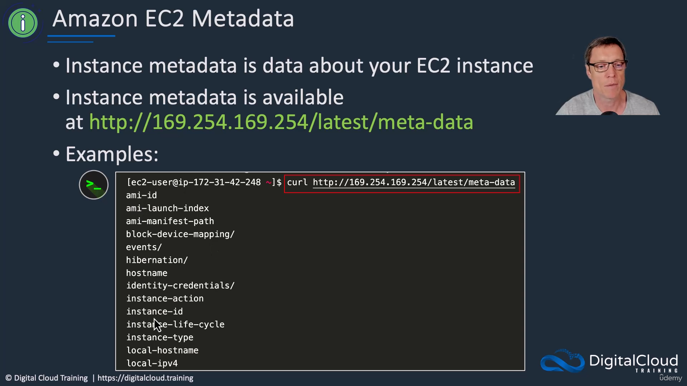
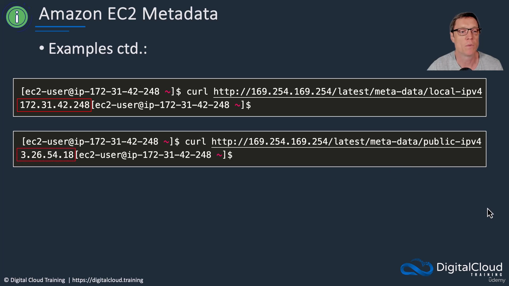
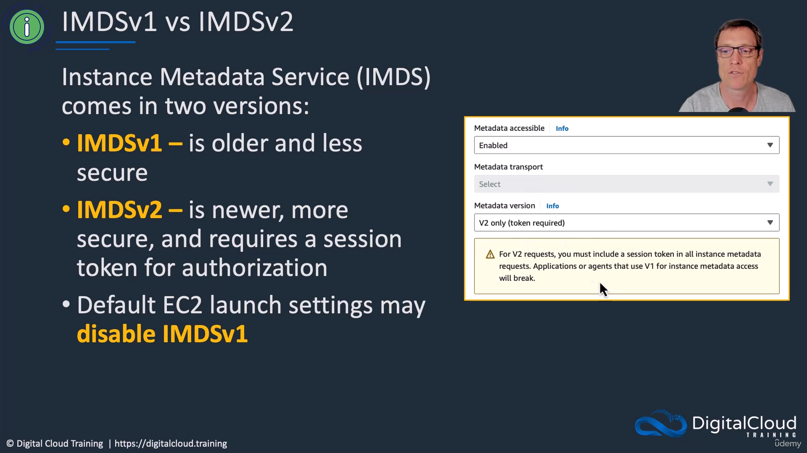
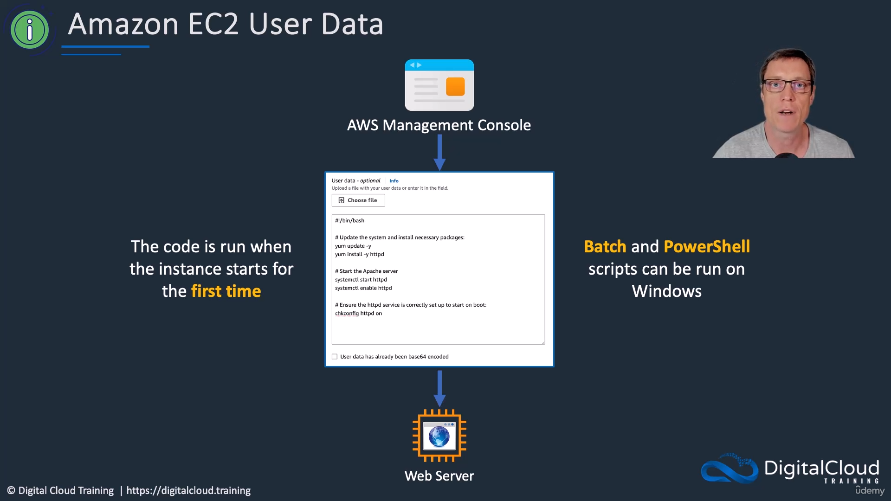
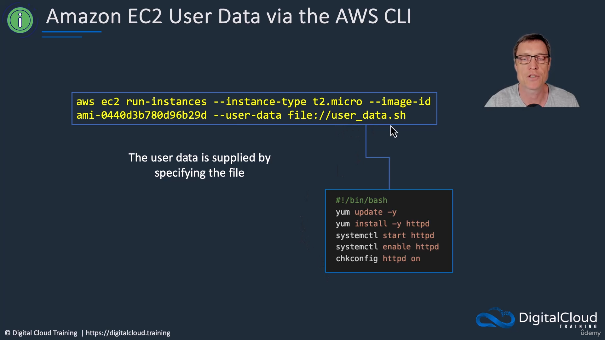
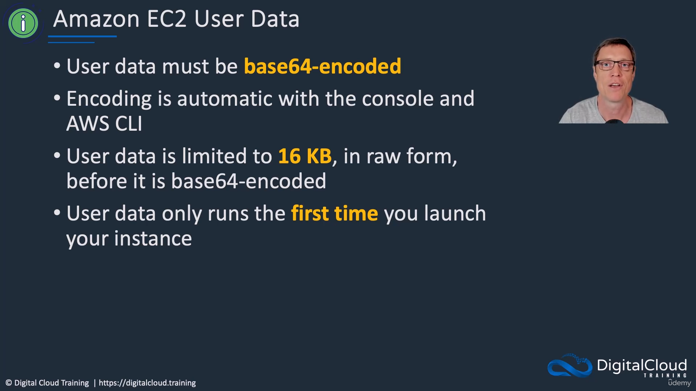

[← Course contents](../../01.md)

# 23. Amazon EC2 User Data and Metadata

**Course**: [AWS Certified Solutions Architect Associate (SAA-C03)](https://www.udemy.com/course/aws-certified-solutions-architect-associate-hands-on/learn/)
**Transcript**: [`../notes/23-Amazon-EC2-user-Data-and-Metadata.txt`](../notes/23-Amazon-EC2-user-Data-and-Metadata.txt)

## Introduction

In this lesson, we cover Amazon EC2 user data and metadata. Instance metadata provides data about your running instance, such as its IP addresses and AMI ID, which you can query from within the instance. User data allows you to run bootstrap scripts when the instance first launches, perfect for automating software installations and configuration.

## Detailed Explanation

<details>
  <summary>Step 1 — Understand EC2 instance metadata and IMDS versions</summary>

### Step 1 — Understand EC2 instance metadata and IMDS versions

- [x] **What is instance metadata?**
  - Metadata is data about your instance, such as the AMI ID, hostname, and IP addresses.
  - It is available from within the instance using a special local IP address: `169.254.169.254`.
  - You can retrieve it using the `curl` utility on Linux. For example:
    ```bash
    curl http://169.254.169.254/latest/meta-data/
    curl http://169.254.169.254/latest/meta-data/local-ipv4
    curl http://169.254.169.254/latest/meta-data/public-ipv4
    ```



- [x] **IMDSv1 vs IMDSv2**
  - There are two versions of the Instance Metadata Service (IMDS).
  - **IMDSv1**: Older, less secure, and does not require authentication to return information.
  - **IMDSv2**: Newer, more secure, and requires a session token for authorization in all metadata requests.



- [x] **Launch settings for metadata**
  - Recent AMIs default to IMDSv2.
  - In the EC2 Launch Wizard under Advanced Settings, you can configure metadata accessibility and enforce "V2 only (token required)."



</details>

<details>
  <summary>Step 2 — Automate startup tasks using EC2 user data</summary>

### Step 2 — Automate startup tasks using EC2 user data

- [x] **What is user data?**
  - User data is the ability to run code or scripts automatically when the instance starts for the very first time.
  - It supports bash scripts on Linux and batch/PowerShell scripts on Windows.
- [x] **Providing user data in the Management Console**
  - You can define a bootstrap script in the User data field during the launch process.
  - Example use case: Updating OS patches, installing a web server (like Apache), and starting the service automatically so the instance boots up ready to serve traffic.



- [x] **Providing user data via the AWS CLI**
  - You can also supply user data from a local file when launching an instance from the command line:
    ```bash
    aws ec2 run-instances --image-id ami-12345678 --user-data file://my_script.txt
    ```



</details>

<details>
  <summary>Step 3 — Learn key limits and behaviors of user data</summary>

### Step 3 — Learn key limits and behaviors of user data

- [x] **Encoding and size limits**
  - User data must be **Base64 encoded**. (The console and CLI handle this automatically).
  - It is limited to **16 KB** in raw form (before Base64 encoding).
- [x] **Execution frequency**
  - User data scripts only run the **first time** you launch your instance.
  - You can view and edit user data on a stopped instance, but modifying it will not cause it to run again on subsequent boots.



</details>

<details>
  <summary>Lab</summary>

## Lab

There is no dedicated console lab for this theory lesson, but the concepts introduced are:

### Concept 1: Querying Metadata

From inside a running EC2 instance, you query metadata using the `169.254.169.254` local IP:

```bash
curl http://169.254.169.254/latest/meta-data/
```

### Concept 2: Supplying User Data via CLI

When launching an instance programmatically, you can pass a script file:

```bash
aws ec2 run-instances --image-id ami-12345678 --user-data file://my_script.txt
```

_(Note: We will perform hands-on practice combining user data and metadata in a subsequent lecture)._

</details>

<details>
  <summary>Questions and Answers</summary>

## Questions and Answers

### Question 1: What is the special IP address used to query EC2 instance metadata?

<details>
<summary>Answer</summary>

- [x] `169.254.169.254` (e.g., `http://169.254.169.254/latest/meta-data/`).

</details>

### Question 2: Does the user data script execute every time you stop and start an EC2 instance?

<details>
<summary>Answer</summary>

- [x] No, user data only runs the very first time the instance is launched.

</details>

### Question 3: What is the main security difference between IMDSv1 and IMDSv2?

<details>
<summary>Answer</summary>

- [x] IMDSv2 is newer, more secure, and requires a session token for authorization to return metadata, while IMDSv1 does not require a token.

</details>

### Question 4: What is the size limit for EC2 user data?

<details>
<summary>Answer</summary>

- [x] User data is limited to 16 KB in raw form (before being Base64 encoded).

</details>

</details>

## Summary

Amazon EC2 instance metadata provides valuable information about a running instance, accessible internally at `169.254.169.254`. While IMDSv1 allows direct querying, IMDSv2 enforces security by requiring a session token. EC2 user data complements metadata by allowing you to execute bootstrap scripts (up to 16 KB) on the very first launch, which is highly useful for automating software installation like web servers.

## References

- [AWS Certified Solutions Architect Associate (SAA-C03)](https://www.udemy.com/course/aws-certified-solutions-architect-associate-hands-on/learn/)
- Transcript: [`../notes/23-Amazon-EC2-user-Data-and-Metadata.txt`](../notes/23-Amazon-EC2-user-Data-and-Metadata.txt)
