[← Course contents](../../01.md)

# 25. Access Keys and IAM Roles with EC2

**Course:** [AWS Certified Solutions Architect Associate (SAA-C03) – Neal Davis](https://www.udemy.com/course/aws-certified-solutions-architect-associate-hands-on/)
**Lecture:** [Access Keys and IAM Roles with EC2](https://www.udemy.com/course/aws-certified-solutions-architect-associate-hands-on/learn/)
**Transcript:** [`../notes/25-Access-Keys -and-IAM-roles-with-EC2.txt`](../notes/25-Access-Keys%20-and-IAM-roles-with-EC2.txt)

---

## Introduction

An Amazon EC2 instance does **not** inherit the IAM permissions of the person who launched it. If you connect as `ec2-user` and run AWS CLI commands, the instance has **no AWS credentials** until you give it some. This lesson covers the two ways to do that.

**Access keys** are **long-term** credentials tied to an **IAM user**. You paste them onto the instance with `aws configure`. They work, but they sit in **plaintext** on disk. If the instance is compromised, the attacker inherits that user's permissions.

**IAM roles** are the better option. You attach a role to the instance. The instance **assumes** the role. **AWS STS** (Security Token Service) issues **short-term** credentials and the instance **refreshes** them automatically. Nothing is stored on the hard drive.

The video starts with that comparison, then a **HOL** on a running **Amazon Linux 2023** server: prove there are no credentials, try access keys, delete them, attach an `S3ReadOnly` role, and terminate the instance. Keep the role — later labs reuse it.

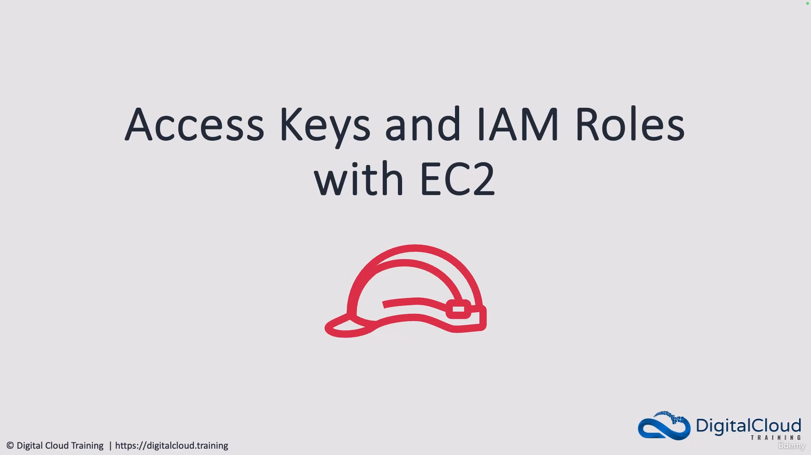

---

## Detailed Explanation

<details>
  <summary>Step 1 — See why access keys on EC2 are long-term and risky</summary>

### Step 1 — See why access keys on EC2 are long-term and risky

- [x] **The problem this lesson solves**
  - You have an instance in a **public subnet** and you want to work with an **S3 bucket** from the command line on that instance.
  - The AWS CLI needs **credentials**. Two ways to supply them: **access keys** or an **IAM role**.
- [x] **How access keys work on an instance**
  - Access keys are associated with an **IAM user** (the account that created them).
  - They pick up the **permissions policies** attached to that user.
  - You run `aws configure` on the instance and paste the access key ID and secret access key.
  - After that, CLI commands on the instance have the **same permissions as that IAM user**.
- [x] **Why this is a poor design**
  - Access keys are **long-term credentials**. Avoid them whenever you can.
  - If they are **compromised**, the attacker can call APIs with that user's permissions — essentially access to the account at that user's privilege level.
  - They are stored in **plaintext** on the instance (`~/.aws/credentials`). That is not a secure configuration.

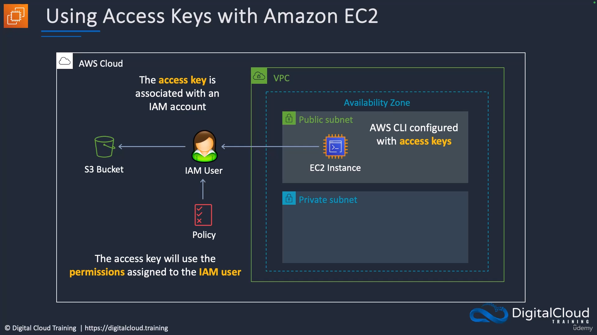

</details>

<details>
  <summary>Step 2 — Prefer an IAM role and short-term STS credentials</summary>

### Step 2 — Prefer an IAM role and short-term STS credentials

- [x] **Attach a role instead of storing keys**
  - An **IAM role** has **policies** that define the permissions the instance should have (for example, access to S3).
  - The instance **assumes** the role and gets those permissions.
  - **No credentials are stored on the instance**, so you do not have the plaintext exposure of access keys.
- [x] **STS issues temporary credentials in the background**
  - Assuming a role uses **AWS STS** (`sts:AssumeRole`).
  - STS still issues credentials that look like access keys, but they have a **much shorter expiration**.
  - The instance **renegotiates** with STS and gets new credentials **before they expire**. That refresh is automatic.
  - Short-term credentials that never sit in a file on disk are more secure than long-term keys in plaintext.
- [x] **Exam takeaway**
  - Both methods can let an instance call AWS APIs.
  - The **role** is the method to use whenever you can.

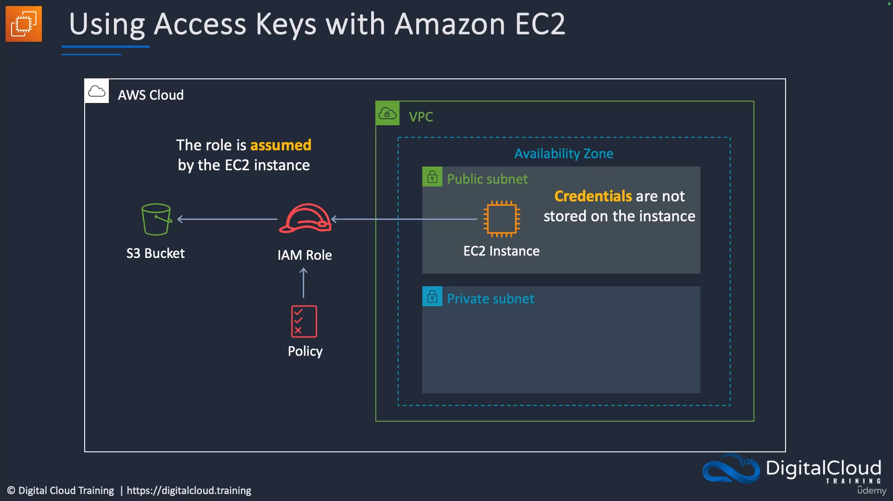

</details>

<details>
  <summary>Step 3 — Connect and prove the instance has no AWS credentials</summary>

### Step 3 — Connect and prove the instance has no AWS credentials

- [x] **Start from a running Linux instance**
  - In the EC2 console, a **Linux-Server** is **Running**, with a **public IPv4** address, so you can connect from outside.
  - Connect with **EC2 Instance Connect** (browser-based CLI). Username is `ec2-user`.
- [x] **Amazon Linux 2023 already has the AWS CLI**
  - You can run commands such as `aws s3 ls` immediately.
  - That does **not** mean the instance has permission. The CLI is installed; **credentials** are a separate issue.
- [x] **`aws s3 ls` fails until you supply credentials**
  - The CLI returns: `Unable to locate credentials. You can configure credentials by running "aws configure".`
  - Your **console IAM user** may have plenty of permissions. The **operating system** does not inherit them. That is intentional.
  - You are logged in as **`ec2-user`**, which has no permissions to AWS services.
- [x] **Two ways to supply those permissions**
  - **Access keys** via `aws configure`.
  - An **IAM role** attached to the instance.

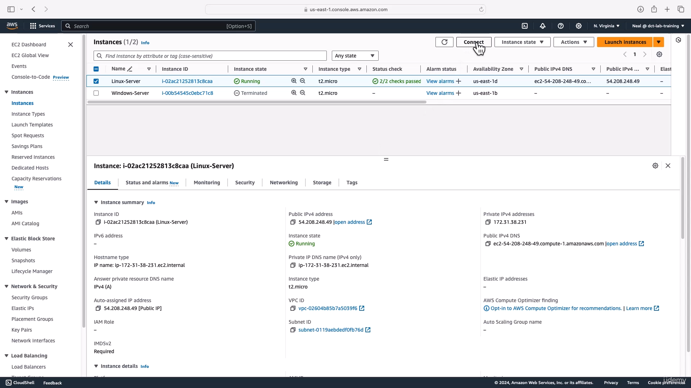

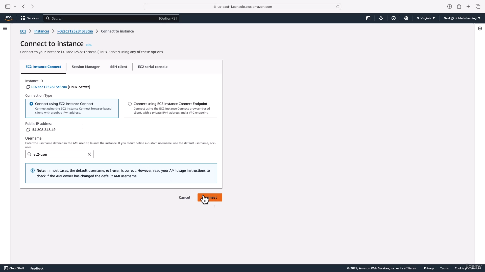


```bash
aws s3 ls
```

</details>

<details>
  <summary>Step 4 — Create access keys and configure the CLI (demo only)</summary>

### Step 4 — Create access keys and configure the CLI (demo only)

- [x] **Create an access key on your IAM user**
  - Open **IAM** → **Users** → your user (here **Neal**) → **Security credentials**.
  - Under **Access keys**, click **Create access key**.
  - Use case: **Command Line Interface (CLI)**.
  - AWS shows a warning: there are **better alternatives** (CloudShell, IAM Identity Center). An **instance role** is the better way to give servers permissions. Continue only to see why keys are dangerous.
- [x] **The secret is shown once**
  - After creation you see the **access key ID** and **secret access key**.
  - You can retrieve the access key ID later. You can retrieve the **secret only now** (or from a CSV you download at this moment).
  - Treat the pair like a **username and password**. Anyone with both can perform API actions as that user.
- [x] **Configure the CLI on the instance**
  - Run `aws configure`.
  - Paste the access key ID, then the secret access key.
  - **Default region:** `us-east-1` (dashes, not spaces).
  - Leave default output format empty (press Enter).
- [x] **Prove the instance now has that user's permissions**
  - `aws s3 ls` no longer errors (empty output still means success if you have no buckets yet).
  - `aws s3 mb s3://mybucket-<unique>` creates a bucket. Listing then shows it.

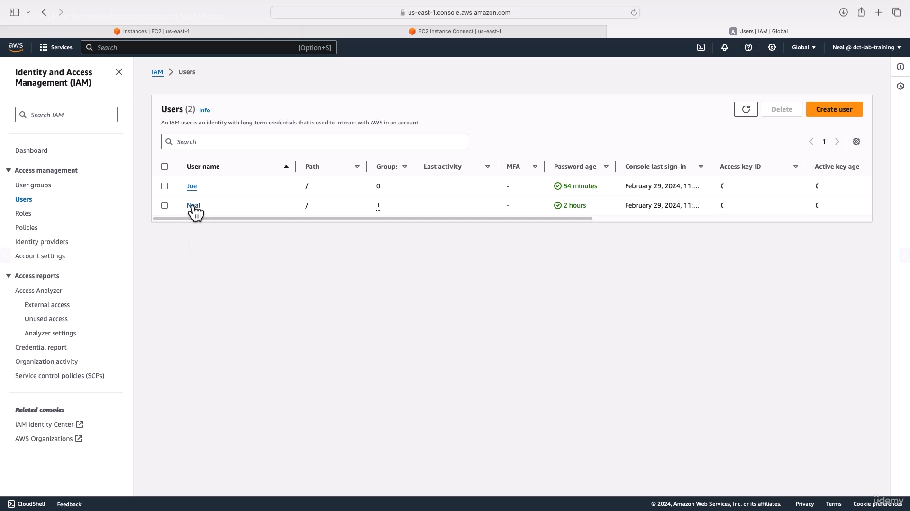

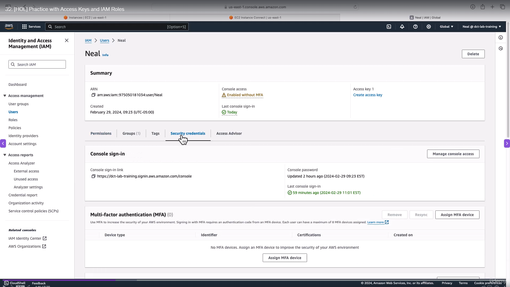

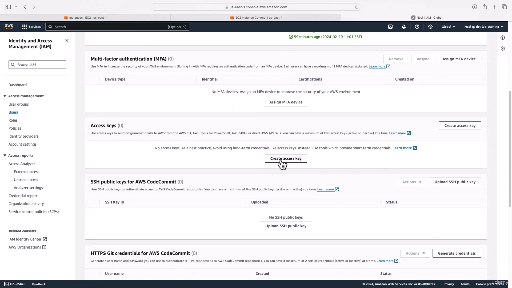

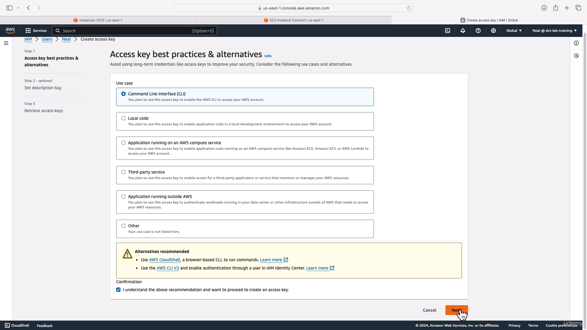

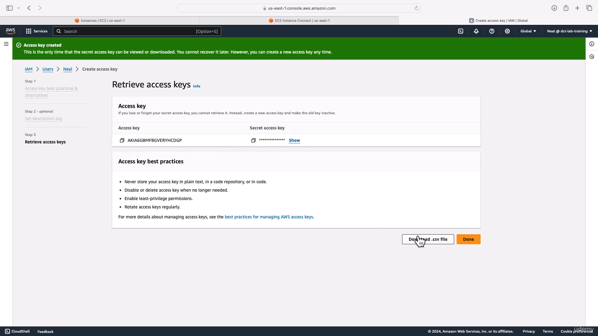

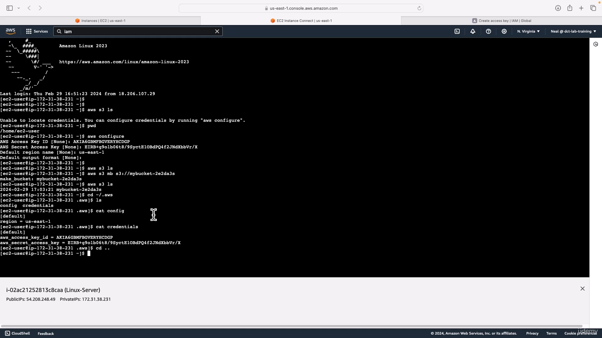

```bash
aws configure
```

Interactive prompts (use **your** keys in a throwaway lab, never paste real secrets into notes):

```text
AWS Access Key ID [None]: <your-access-key-id>
AWS Secret Access Key [None]: <your-secret-access-key>
Default region name [None]: us-east-1
Default output format [None]:
```

```bash
aws s3 ls
aws s3 mb s3://mybucket-<unique-suffix>
aws s3 ls
```

**Do not copy keys from course screenshots.** Those values are long-term credentials. In this demo they were deactivated and deleted immediately afterward.

</details>

<details>
  <summary>Step 5 — Remove plaintext credentials and delete the access key</summary>

### Step 5 — Remove plaintext credentials and delete the access key

- [x] **Where the keys live on disk**
  - `~/.aws` contains **`config`** (default region) and **`credentials`** (access key ID and secret in **plaintext**).
  - Anyone who can log in as that OS user can read them. A compromised instance then compromises the IAM user — and often the account at that user's privilege level.
- [x] **Delete the local files**
  - Remove the contents of `~/.aws`.
  - `aws s3 ls` fails again with **Unable to locate credentials**.
- [x] **Deactivate, then delete, the IAM access key**
  - Because the demo displayed the keys, deactivate the key first, then **Delete**.
  - Confirm by typing the access key ID. After deletion it is no use to anyone.


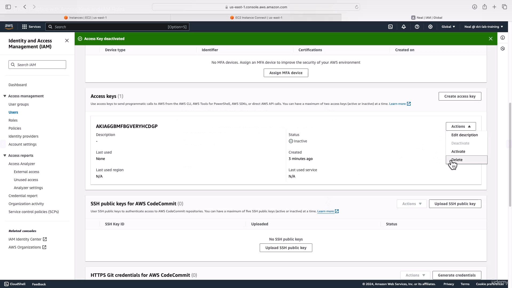

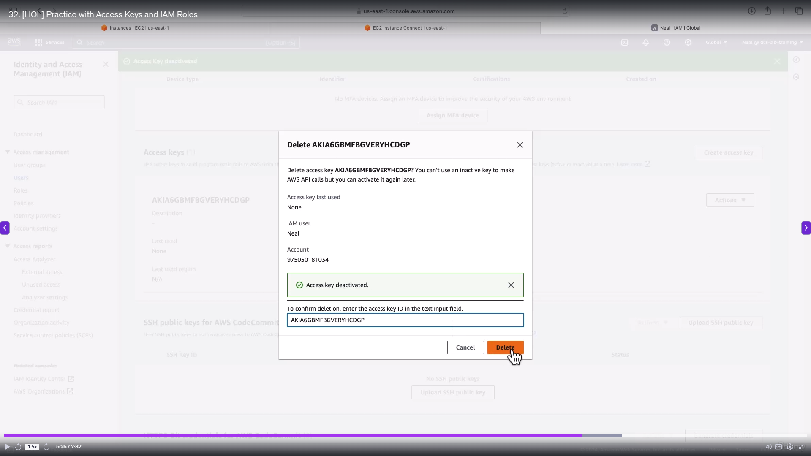

```bash
cd ~/.aws
ls
cat config
cat credentials
cd ~
rm -rf ~/.aws/*
aws s3 ls
```

</details>

<details>
  <summary>Step 6 — Create an EC2 role with S3 read-only access</summary>

### Step 6 — Create an EC2 role with S3 read-only access

- [x] **Create a role for EC2**
  - IAM → **Roles** → **Create role**.
  - Trusted entity: **AWS service**.
  - Use case: **EC2** (EC2 instances call AWS services on your behalf). Click **Next**.
- [x] **Attach a permissions policy**
  - Search **s3** and attach **AmazonS3ReadOnlyAccess** (AWS managed: read-only access to all buckets).
  - Role name: **S3ReadOnly**.
- [x] **Read the trust policy before you create the role**
  - The **trust policy** defines **who is allowed to assume the role** (`sts:AssumeRole`).
  - Here the **principal** is a **service**: `ec2.amazonaws.com`.
  - When EC2 assumes this role, the instance gets the attached permissions (**AmazonS3ReadOnlyAccess**).
  - Create the role.

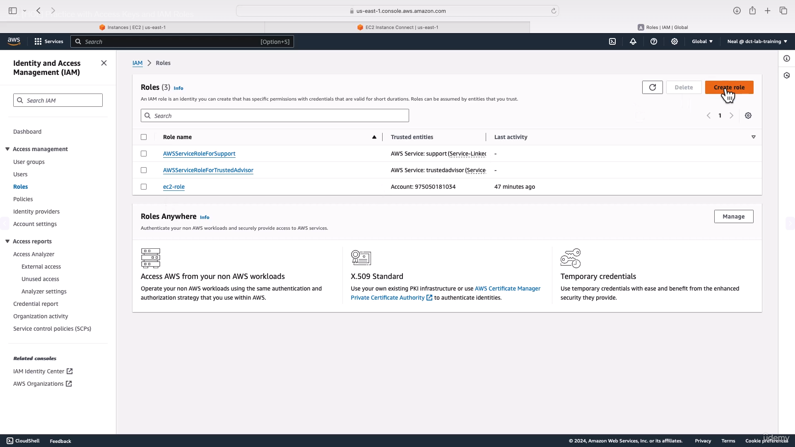

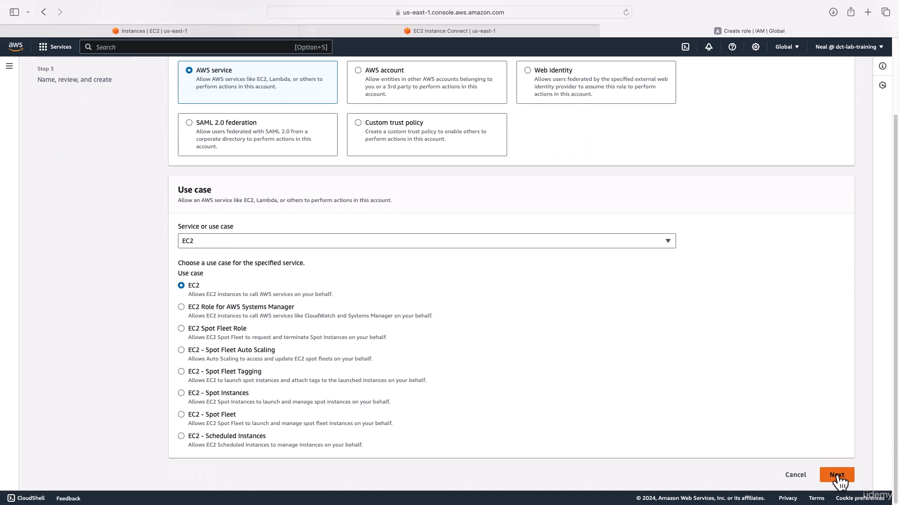

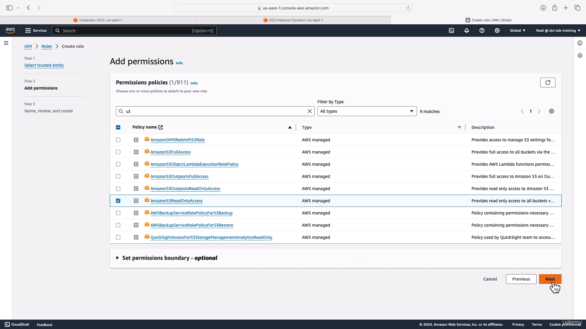

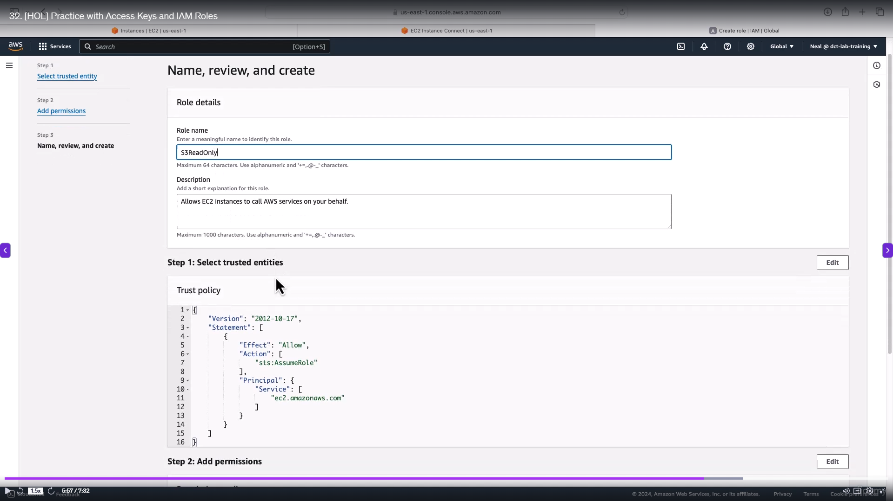

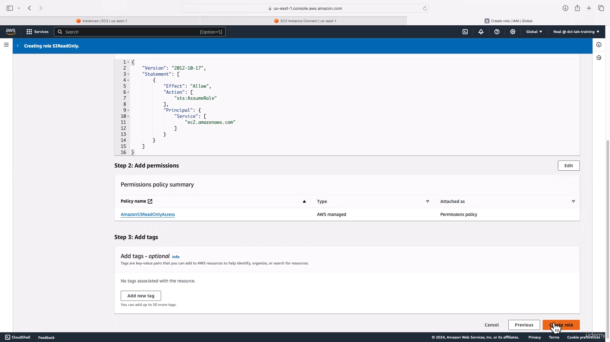

```json
{
  "Version": "2012-10-17",
  "Statement": [
    {
      "Effect": "Allow",
      "Action": ["sts:AssumeRole"],
      "Principal": {
        "Service": ["ec2.amazonaws.com"]
      }
    }
  ]
}
```

</details>

<details>
  <summary>Step 7 — Attach the role, verify S3 access, and terminate the instance</summary>

### Step 7 — Attach the role, verify S3 access, and terminate the instance

- [x] **Modify the instance IAM role**
  - EC2 → select the instance → **Actions** → **Security** → **Modify IAM role**.
  - The dropdown lists only roles whose **trust policy** allows EC2. Choose **S3ReadOnly**.
  - **Update IAM role**. A banner confirms the role is attached. The change takes effect immediately.
- [x] **CLI works again with nothing on disk**
  - Rerun `aws s3 ls`. The bucket list returns.
  - `~/.aws` does **not** exist anymore. There is **no plaintext credential file** on the instance.
  - STS temporary credentials are used in the background and are not stored on the computer.
- [x] **Cleanup**
  - Leave the **S3ReadOnly** role; later labs reuse it.
  - **Terminate** this Linux instance when the HOL is finished (confirm in the terminate dialog). Root EBS is deleted by default.

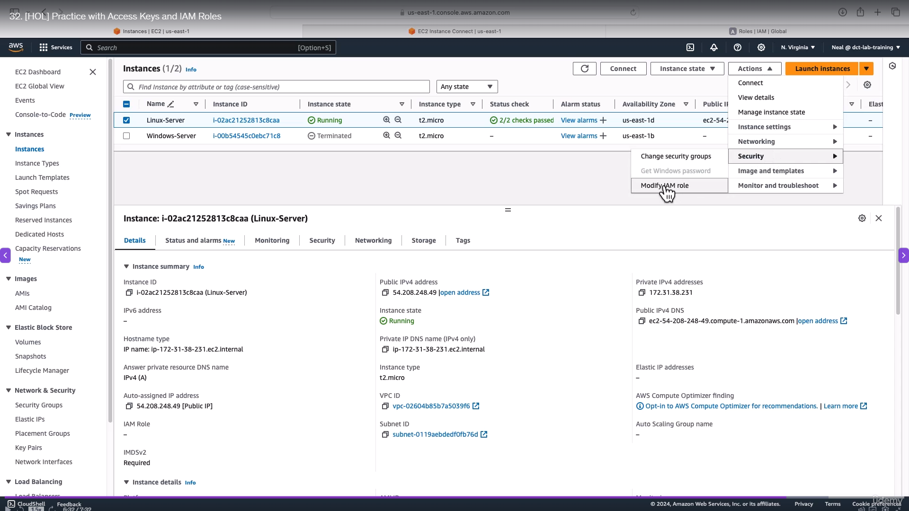

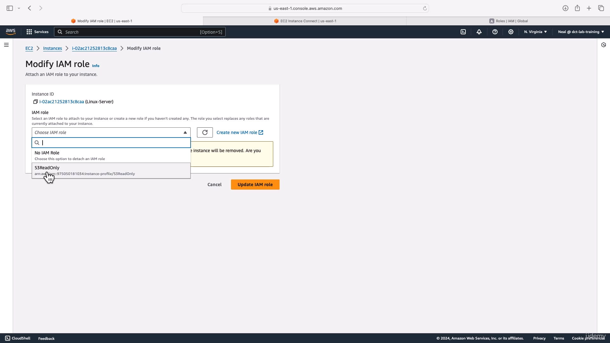

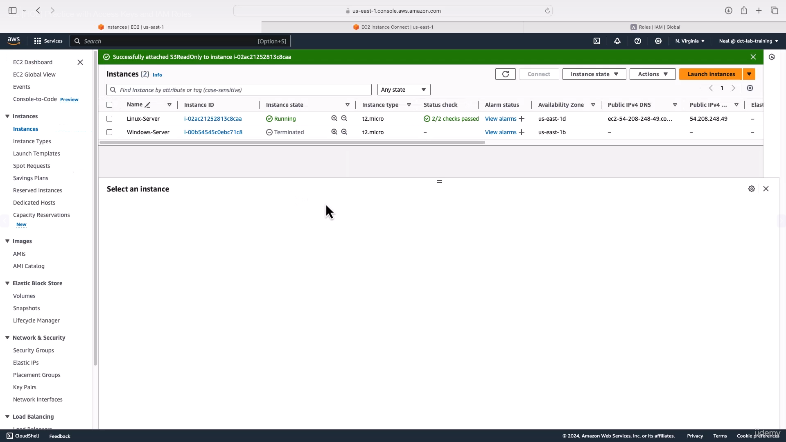


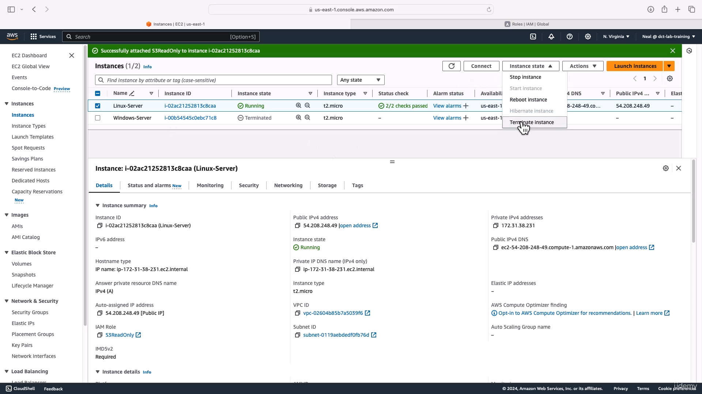

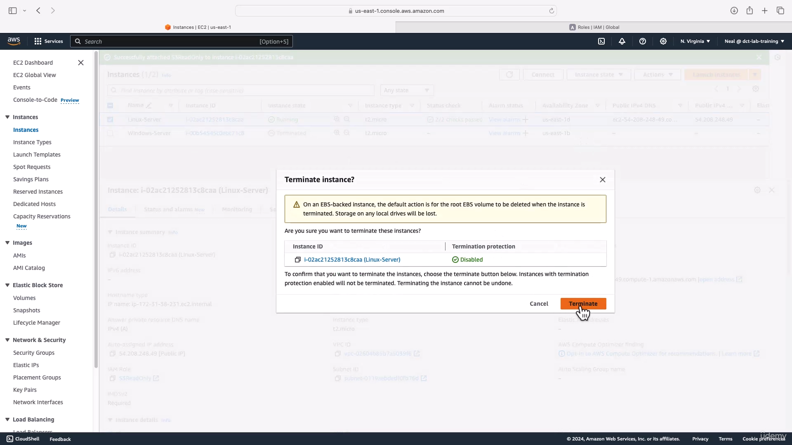

```bash
aws s3 ls
```

</details>

<details>
  <summary>Lab</summary>

## Lab

This is a **HOL**. You need a **running Amazon Linux 2023** instance with a **public IPv4** address and a security group that allows **EC2 Instance Connect** / SSH (from earlier EC2 labs). Region: **US East (N. Virginia)** `us-east-1`.

**Goal:** prove the instance has no credentials, try access keys once (then delete them), attach an **S3ReadOnly** instance role, and terminate the server. **Do not leave access keys on the instance.**

### Task 1: Connect and prove there are no credentials

- [ ] Open **EC2** → **Instances**. Select your Linux instance (must be **Running** with a public IP).
- [ ] **Connect** → **EC2 Instance Connect** → username `ec2-user` → **Connect**.
- [ ] Run:

```bash
aws s3 ls
```

- [ ] Expect: `Unable to locate credentials. You can configure credentials by running "aws configure".`
- [ ] You are `ec2-user`. The OS does **not** inherit your console IAM user's permissions.

### Task 2: Create access keys (demo only) and configure the CLI

- [ ] In a new tab, open **IAM** → **Users** → your IAM user → **Security credentials**.
- [ ] **Create access key** → use case **Command Line Interface (CLI)** → acknowledge the warning → **Create access key**.
- [ ] Copy the access key ID and secret. The **secret is shown only this once**.
- [ ] On the instance:

```bash
aws configure
```

```text
AWS Access Key ID [None]: <your-access-key-id>
AWS Secret Access Key [None]: <your-secret-access-key>
Default region name [None]: us-east-1
Default output format [None]:
```

- [ ] Create a uniquely named bucket (S3 bucket names are global):

```bash
aws s3 ls
aws s3 mb s3://mybucket-<unique-suffix>
aws s3 ls
```

- [ ] Empty output on the first `ls` can still mean success (no buckets yet). After `mb`, the list should include your bucket.

### Task 3: See the plaintext files, then remove them

- [ ] Inspect where the CLI stored the keys:

```bash
cd ~/.aws
ls
cat config
cat credentials
cd ~
```

- [ ] Confirm `config` has `region = us-east-1` and `credentials` has the access key ID and secret in **plaintext**.
- [ ] Delete the local files and confirm the CLI is blind again:

```bash
rm -rf ~/.aws/*
aws s3 ls
```

- [ ] Expect **Unable to locate credentials** again.

### Task 4: Deactivate and delete the IAM access key

- [ ] IAM → your user → **Security credentials** → the access key → **Actions** → **Deactivate**.
- [ ] **Actions** → **Delete**. Type the access key ID to confirm.
- [ ] Do not keep a demo key that was displayed on screen.

### Task 5: Create the S3ReadOnly instance role

- [ ] IAM → **Roles** → **Create role**.
- [ ] Trusted entity **AWS service** → use case **EC2** → **Next**.
- [ ] Attach **AmazonS3ReadOnlyAccess** → **Next**.
- [ ] Role name: `S3ReadOnly`.
- [ ] Confirm the trust policy allows `ec2.amazonaws.com` to call `sts:AssumeRole`:

```json
{
  "Version": "2012-10-17",
  "Statement": [
    {
      "Effect": "Allow",
      "Action": ["sts:AssumeRole"],
      "Principal": {
        "Service": ["ec2.amazonaws.com"]
      }
    }
  ]
}
```

- [ ] **Create role**.

### Task 6: Attach the role, verify, and terminate

- [ ] EC2 → select the instance → **Actions** → **Security** → **Modify IAM role**.
- [ ] Choose **S3ReadOnly** (only roles that trust EC2 appear) → **Update IAM role**.
- [ ] On the instance, with **no** `~/.aws/credentials` file:

```bash
aws s3 ls
```

- [ ] Expect the bucket list to succeed. Temporary credentials come from **STS**, not from disk.
- [ ] Leave the **S3ReadOnly** role in the account for later labs.
- [ ] **Instance state** → **Terminate instance** → confirm. Default: the root **EBS** volume is deleted.

**Lab warning:** Never put long-term access keys on EC2 for real workloads. If you created keys for this demo, deactivate and delete them. Do not commit `~/.aws/credentials` or paste secrets into chat, tickets, or git.

</details>

<details>
  <summary>Questions and Answers</summary>

## Questions and Answers

### Question 1: An application on EC2 must call S3. What is the recommended way to grant permission?

<details>
<summary>Answer</summary>

- [x] Attach an **IAM role** to the instance (instance profile).
- [x] Do **not** store IAM user **access keys** on the instance.

</details>

### Question 2: Why are access keys on an EC2 instance considered a security problem?

<details>
<summary>Answer</summary>

- [x] They are **long-term** credentials associated with an **IAM user**.
- [x] They are stored in **plaintext** (typically `~/.aws/credentials`).
- [x] If the instance is compromised, the attacker inherits that user's API permissions.

</details>

### Question 3: You log into an instance with EC2 Instance Connect using the same IAM user that has S3 access in the console. Why does `aws s3 ls` still fail?

<details>
<summary>Answer</summary>

- [x] The instance OS (`ec2-user`) does **not** inherit the console user's IAM permissions.
- [x] The AWS CLI looks for **credentials on the instance** (or an instance role). By default there are none, so you get **Unable to locate credentials**.

</details>

### Question 4: How does an EC2 instance role actually get credentials?

<details>
<summary>Answer</summary>

- [x] The instance **assumes** the role using **AWS STS** (`sts:AssumeRole`).
- [x] STS issues **short-term** credentials.
- [x] The instance **automatically refreshes** them before they expire. They are **not** stored as a file on disk.

</details>

### Question 5: When you create an IAM access key, when can you see the secret access key?

<details>
<summary>Answer</summary>

- [x] **Only at creation time** (on screen or in the downloaded CSV).
- [x] You can look up the **access key ID** later, but you cannot retrieve the secret again. Create a new key if it is lost.

</details>

### Question 6: What does the trust policy on an EC2 instance role define?

<details>
<summary>Answer</summary>

- [x] **Who or what is allowed to assume the role** (`sts:AssumeRole`).
- [x] For this lab the **principal** is the **EC2 service** (`ec2.amazonaws.com`), not an IAM user.

</details>

### Question 7: You open Actions → Security → Modify IAM role, but your new role is missing. Why?

<details>
<summary>Answer</summary>

- [x] That list shows only roles whose **trust policy** allows **EC2** to assume them.
- [x] A role that trusts a different service (or an IAM user) will not appear.

</details>

### Question 8: After you delete `~/.aws` and attach an S3 read-only instance role, why does `aws s3 ls` succeed?

<details>
<summary>Answer</summary>

- [x] The CLI uses the **instance role** credentials from the metadata/STS path, not a local file.
- [x] Success without `~/.aws/credentials` is the point of the role design.

</details>

### Question 9: Amazon Linux 2023 already has the AWS CLI. Does that mean the instance can call AWS APIs?

<details>
<summary>Answer</summary>

- [x] **No.** The CLI being installed is not the same as having **credentials** or an **instance role**.
- [x] Until you configure keys or attach a role, commands fail with **Unable to locate credentials**.

</details>

### Question 10: You showed an access key on screen during a demo. What should you do next?

<details>
<summary>Answer</summary>

- [x] **Deactivate** the key, then **delete** it.
- [x] Removing `~/.aws` on the instance is not enough if the key still exists in IAM.

</details>

</details>

## Summary

EC2 does not inherit the IAM user's console permissions. To call AWS APIs from the instance you either paste **long-term access keys** with `aws configure` (plaintext in `~/.aws/credentials` — avoid this) or attach an **IAM role**. The role's **trust policy** lets **EC2** call **`sts:AssumeRole`**. **STS** hands out **temporary** credentials and refreshes them automatically, with **nothing stored on disk**. In the HOL, `aws s3 ls` failed with no credentials, worked after `aws configure`, failed again after deleting `~/.aws`, then worked after attaching **S3ReadOnly** (`AmazonS3ReadOnlyAccess`). Delete demo access keys. Leave the role; terminate the instance.

## References

- [AWS Certified Solutions Architect Associate (SAA-C03) Course – Neal Davis (Udemy)](https://www.udemy.com/course/aws-certified-solutions-architect-associate-hands-on/)
- [Access Keys and IAM Roles with EC2 (lecture 25)](https://www.udemy.com/course/aws-certified-solutions-architect-associate-hands-on/learn/)
- [IAM roles for Amazon EC2](https://docs.aws.amazon.com/AWSEC2/latest/UserGuide/iam-roles-for-amazon-ec2.html)
- [Use IAM roles instead of long-term access keys](https://docs.aws.amazon.com/IAM/latest/UserGuide/id_credentials_temp.html)
- [AWS STS AssumeRole](https://docs.aws.amazon.com/STS/latest/APIReference/API_AssumeRole.html)
- [Managing access keys for IAM users](https://docs.aws.amazon.com/IAM/latest/UserGuide/id_credentials_access-keys.html)
- [Configure the AWS CLI](https://docs.aws.amazon.com/cli/latest/userguide/cli-configure-files.html)
- [AmazonS3ReadOnlyAccess](https://docs.aws.amazon.com/aws-managed-policy/latest/reference/AmazonS3ReadOnlyAccess.html)
- Transcript: [`../notes/25-Access-Keys -and-IAM-roles-with-EC2.txt`](../notes/25-Access-Keys%20-and-IAM-roles-with-EC2.txt)
