[← Course contents](../../01.md)

# 26. Status Checks and Monitoring

**Course:** [AWS Certified Solutions Architect Associate (SAA-C03) – Neal Davis](https://www.udemy.com/course/aws-certified-solutions-architect-associate-hands-on/)
**Lecture:** [Status Checks and Monitoring](https://www.udemy.com/course/aws-certified-solutions-architect-associate-hands-on/learn/)
**Transcript:** [`../notes/26-Status-Checks-and-Monitoring.txt`](../notes/26-Status-Checks-and-Monitoring.txt)

---

## Introduction

Amazon EC2 tells you two different stories about a running instance. **Status checks** answer “is this instance actually able to run my application?” **Monitoring** answers “how is it performing?”

Status checks live on the instance’s **Status and alarms** tab. There are two of them. A **system status check** watches the AWS-owned host: the hypervisor, the physical server, and the network layer underneath your VM. An **instance status check** watches *your* guest: the operating system and the instance’s own network stack. AWS owns the first kind of failure. You own the second.

**Monitoring** is Amazon CloudWatch. Basic EC2 metrics (CPU, network) are collected automatically and shown on the instance **Monitoring** tab. **Basic monitoring** is free at **5-minute** granularity. **Detailed monitoring** is paid and gives **1-minute** data. Memory, swap, disk, and process metrics are **not** in that default set — you install the **CloudWatch agent** if you need them. You can also open the CloudWatch console, browse **EC2** per-instance metrics and **EBS** per-volume metrics, and attach **alarms** that notify you or take action when a check fails.

This lesson is a console HOL. Launch an **Amazon Linux 2023** instance in the **default VPC** if you want to click along.

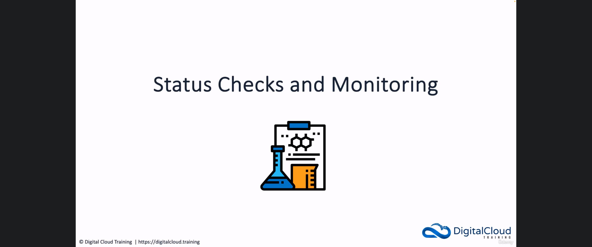

---

## Detailed Explanation

  
Step 1 — Open Status and alarms on a running instance

### Step 1 — Open Status and alarms on a running instance

- [x] **Start from a running instance**
  - Open the **EC2** console. You need an instance that is **Running**.
  - To follow along: launch with the **Amazon Linux 2023** AMI, default settings, in the **default VPC**.
- [x] **Two tabs this lesson uses**
  - **Status and alarms** — reachability checks and any CloudWatch alarms tied to those checks.
  - **Monitoring** — CloudWatch performance graphs for this instance.
- [x] **What status checks are for**
  - They detect problems that might **impair** the instance so it cannot run your applications.
  - On a healthy instance the list shows **2/2 checks passed**.
  - The two checks are **System status checks** and **Instance status checks** (the console labels them **System reachability check** and **Instance reachability check**).

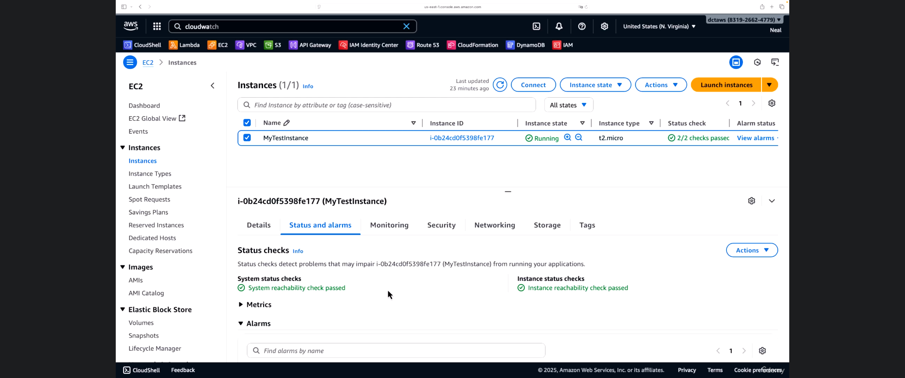

  
Step 2 — Separate system status checks from instance status checks

### Step 2 — Separate system status checks from instance status checks

- [x] **System status checks (AWS’s problem)**
  - These watch the **underlying infrastructure** your instance runs on — the host, the **hypervisor**, and the **network layer**.
  - That hardware and hypervisor are **inside AWS’s control**, not yours as the customer.
  - A failed system check often means the host has a problem, or the network path to the host does. **AWS** needs to resolve that.
- [x] **Instance status checks (your problem)**
  - These watch whether the **operating system** is running and whether **networking on the instance** is working.
  - A failure in the instance’s **network stack** (kernel panic, exhausted CPU, misconfigured networking, failed boot) can mark the instance check as impaired.
  - Those problems are **inside your control** as an AWS customer: reboot, fix the OS, change security groups or routes, replace the AMI, and so on.
- [x] **Exam distinction**
  - **System** = AWS-owned host. **Instance** = guest OS and instance networking.
  - Both must pass for the instance to be considered fully reachable.

  
Step 3 — Read status-check history and attach CloudWatch alarms

### Step 3 — Read status-check history and attach CloudWatch alarms

- [x] **History graphs on the same tab**
  - Expand the metrics under **Status and alarms** to see history for **Status check failed for system** and **Status check failed for instance**.
  - A healthy instance shows a flat **0** (no failures) across the time range.
- [x] **Alarms for impaired instances**
  - The **Alarms** section lists CloudWatch alarms associated with this instance.
  - A new lab instance often shows **Instance has no associated alarms**.
  - You **can** create alarms on those status-check metrics so that a failure **triggers an action** (notification, or another automated response) when the instance becomes impaired.

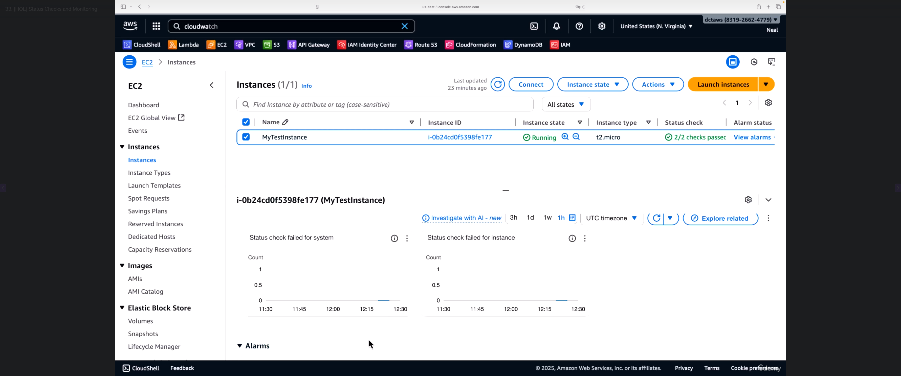

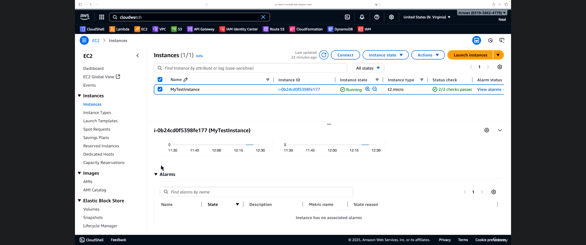

  
Step 4 — Read the Monitoring tab and choose detailed monitoring

### Step 4 — Read the Monitoring tab and choose detailed monitoring

- [x] **Where the graphs come from**
  - Open the **Monitoring** tab. You see metrics immediately: **CPU utilization**, **Network in**, **Network out**, **Network packets**, and related EC2 graphs.
  - The instance is sending this data to **CloudWatch**. The EC2 console is just surfacing it.
- [x] **Basic vs detailed monitoring**
  - Use **Manage detailed monitoring** on this tab.
  - **Detailed monitoring** makes data available in **1-minute** periods instead of **5-minute** periods.
  - You **pay** for detailed monitoring. **Basic** monitoring is included (no extra charge).
- [x] **Default EC2 metrics vs extra metrics**
  - Default graphs cover **CPU** and **networking**. Storage-style data for the attached disk shows up as **EBS** metrics (you will see those in CloudWatch next).
  - **Memory** is **not** in this default set, whether you use basic or detailed monitoring.

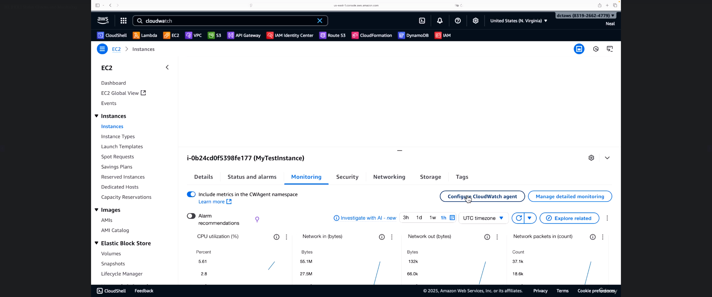

  
Step 5 — Use the CloudWatch agent for memory and other guest metrics

### Step 5 — Use the CloudWatch agent for memory and other guest metrics

- [x] **Why the agent exists**
  - **Configure CloudWatch agent** opens a wizard on the instance.
  - The agent can collect metrics that **basic and detailed monitoring do not**, especially **memory**.
  - CPU is already collected by default; the agent still offers extra CPU, **swap**, **process**, and **disk** options.
- [x] **What the wizard needs**
  - The instance needs an **IAM role** with permissions for the agent. The instructor already had a role attached so the wizard could continue.
  - Step **Validate CloudWatch agent** checks whether the agent is installed and responding, and can install it if it is missing.
- [x] **You do not have to install it**
  - Default EC2 metrics work without the agent.
  - Use the agent when you need guest-level data (memory used percent, disk used percent, and similar) that CloudWatch cannot see from outside the OS.
  - This lesson only **shows** the wizard. It does not finish the configuration.

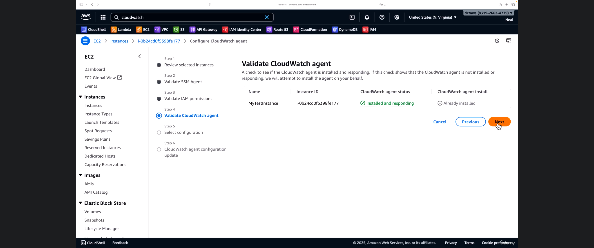

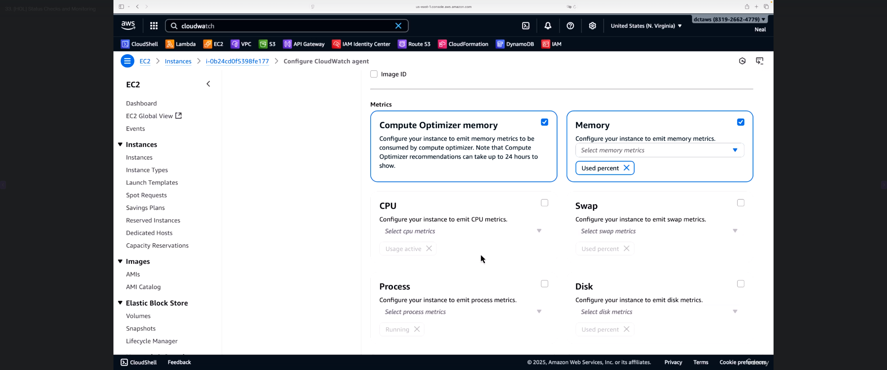

  
Step 6 — Browse EC2 per-instance metrics in CloudWatch

### Step 6 — Browse EC2 per-instance metrics in CloudWatch

- [x] **Open CloudWatch → All metrics**
  - Search for **CloudWatch** in the console search bar and open it (a new tab is fine).
  - Left nav: **Metrics** → **All metrics**.
  - The service tiles you see depend on **which services have actually sent metrics**. Your screen may differ from the instructor’s.
- [x] **EC2 namespace**
  - Open **EC2**. You can slice metrics **By Auto Scaling Group** or **Per-Instance Metrics**.
  - An instance that is **not** in an Auto Scaling group uses **Per-Instance Metrics**.
- [x] **Find your instance, then plot**
  - Search by **instance ID** (the demo instance is `i-0b24cd0f5398fe177` / **MyTestInstance** — use **your** ID).
  - Select the rows you care about. CPU metrics such as **CPUUtilization**, **CPUCreditBalance**, and **CPUCreditUsage** graph immediately.
  - The same per-instance list also includes **EBS** read/write style metrics for the instance and **networking** metrics.

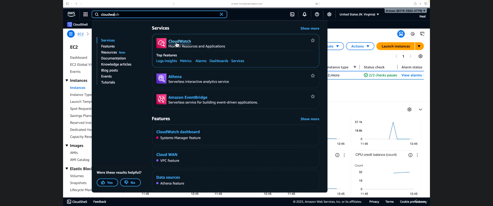

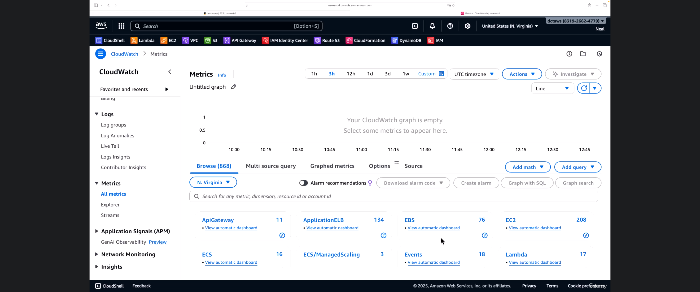

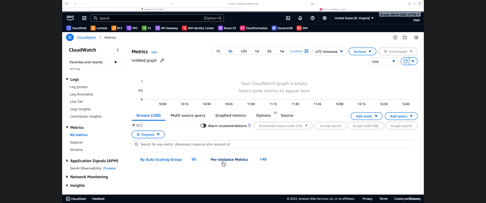

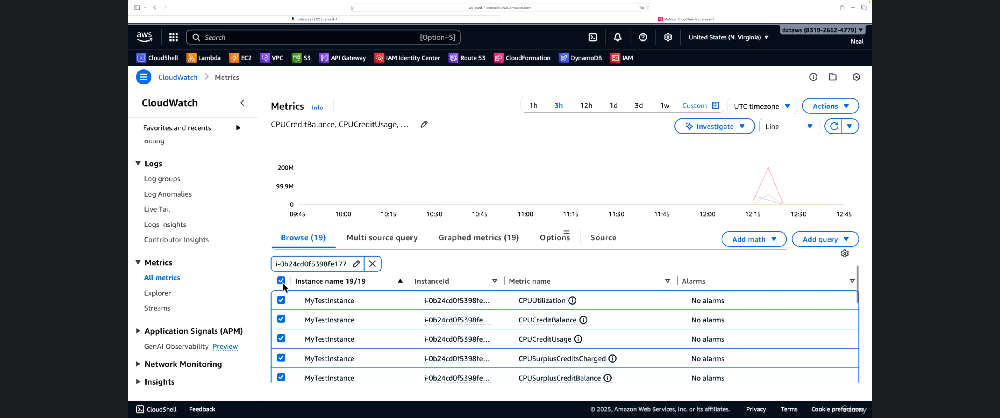

  
Step 7 — Browse EBS per-volume metrics and recap the two views

### Step 7 — Browse EBS per-volume metrics and recap the two views

- [x] **EBS is its own CloudWatch namespace**
  - From **All metrics**, open **EBS** instead of EC2.
  - Use **per-volume metrics**, then search by **volume ID**.
- [x] **Get the volume ID from EC2**
  - On the instance, open **Storage** (or **Elastic Block Store** → **Volumes**) and copy the **volume ID** of the attached disk.
  - Paste that ID into the CloudWatch search. You should see metrics for **that** volume (for example **VolumeTotalReadTime**, **VolumeReadOps**, **VolumeWriteOps**).
- [x] **Status checks vs monitoring**
  - **Status checks:** is the instance up, and is the AWS host underneath it healthy?
  - **Monitoring:** specific **performance** metrics (CPU, network, EBS I/O) so you can see how the instance is behaving.
  - **CloudWatch alarms** can sit on either kind of signal and trigger **notifications** or **other actions**.

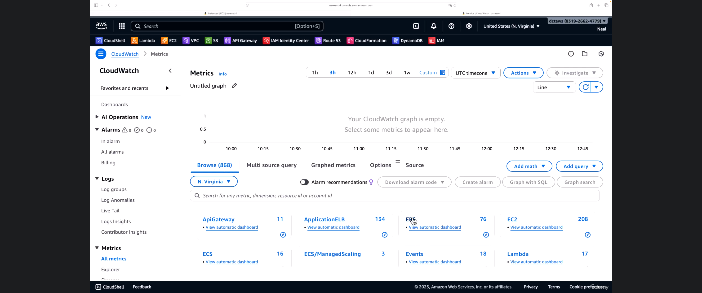

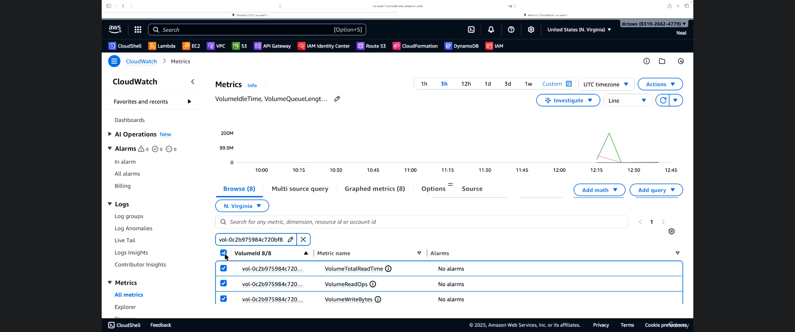

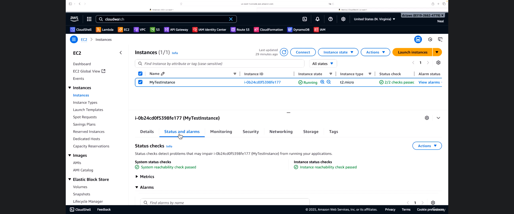

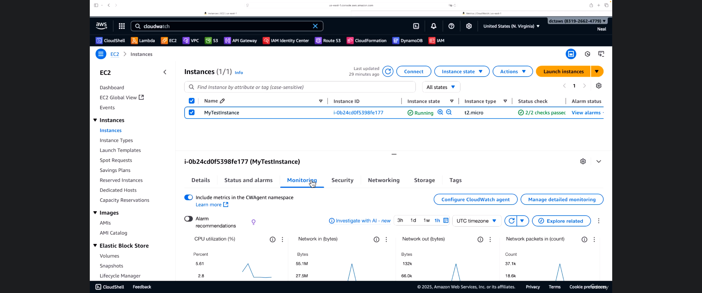

  
Lab

## Lab

This is a **HOL** in the AWS console. Region in the video is **US East (N. Virginia)** `us-east-1`. You need permission to view EC2, EBS, and CloudWatch metrics.

**Goal:** confirm both status checks pass, see that there are no status-check alarms yet, read the Monitoring tab, glance at the CloudWatch agent wizard, then plot **EC2** and **EBS** metrics in CloudWatch.

You do **not** need to finish installing or configuring the CloudWatch agent.

### Task 1: Launch or select a running instance

- [ ] Open **EC2** → **Instances**.
- [ ] If you have no instance: **Launch instances**.
  - AMI: **Amazon Linux 2023**.
  - Default instance type is fine (`t2.micro` / `t3.micro` if the Free Tier still applies).
  - Network: **default VPC**.
  - Launch and wait until **Instance state** is **Running**.
- [ ] Select the instance. Note the **Instance ID** (you will search for it in CloudWatch).

### Task 2: Read Status and alarms

- [ ] Open the **Status and alarms** tab.
- [ ] Confirm **System status checks** show **System reachability check passed**.
- [ ] Confirm **Instance status checks** show **Instance reachability check passed**.
- [ ] The instance list should show **2/2 checks passed**.
- [ ] Expand the status-check **Metrics**. **Status check failed for system** and **Status check failed for instance** should sit at **0** if the instance is healthy.
- [ ] Expand **Alarms**. A new instance often shows **Instance has no associated alarms**. That is expected.

### Task 3: Read the Monitoring tab

- [ ] Open the **Monitoring** tab.
- [ ] Identify the default graphs: **CPU utilization**, **Network in**, **Network out**, **Network packets**.
- [ ] Find **Manage detailed monitoring**. Know that turning it on changes the period from **5 minutes** (basic, included) to **1 minute** (detailed, **paid**). Leave basic monitoring on unless you intend to pay.
- [ ] Find **Configure CloudWatch agent**. You do not have to complete it.

### Task 4 (optional): Open the CloudWatch agent wizard

- [ ] Click **Configure CloudWatch agent**.
- [ ] The wizard needs an instance **IAM role** with agent permissions. If the role is missing, the wizard will stop — skip the rest of this task.
- [ ] Advance to **Validate CloudWatch agent**. Note whether the agent is **Installed and responding** or still needs install.
- [ ] On the metrics page, notice **Memory** (for example **Used percent**). Memory is **not** a default EC2 metric.
- [ ] Click **Cancel**. Do not apply a configuration in this lab unless you are deliberately installing the agent.

### Task 5: Plot EC2 per-instance metrics in CloudWatch

- [ ] Open **CloudWatch** (console search is fine).
- [ ] **Metrics** → **All metrics**.
- [ ] Open **EC2** → **Per-Instance Metrics** (use **By Auto Scaling Group** only if this instance is in a group).
- [ ] Search for **your** instance ID. Select CPU metrics such as **CPUUtilization**.
- [ ] Confirm the graph is no longer empty.

### Task 6: Plot EBS per-volume metrics

- [ ] Back in **EC2**, select the instance → **Storage**, or open **Elastic Block Store** → **Volumes**.
- [ ] Copy the **Volume ID** of the attached volume.
- [ ] CloudWatch → **All metrics** → **EBS** → per-volume metrics.
- [ ] Paste the volume ID. Select metrics such as **VolumeReadOps** and **VolumeWriteOps**.
- [ ] Confirm you are looking at **this** volume, not another instance’s disk.

**Lab note:** Status checks tell you the instance and its AWS host are reachable. Monitoring tells you how hard the instance is working. Attach CloudWatch alarms later if you want email or an automated action when a check fails.

  
Questions and Answers

## Questions and Answers

### Question 1: What are the two types of EC2 status checks?

Answer

- [x] **System status checks** (system reachability).
- [x] **Instance status checks** (instance reachability).

### Question 2: A system status check fails. Who is responsible, and what is being checked?

Answer

- [x] **AWS** is responsible.
- [x] The check covers the **underlying host**: hypervisor, physical server, and the AWS **network layer** — not your guest OS.

### Question 3: An instance status check fails. Who is responsible?

Answer

- [x] **You** (the AWS customer).
- [x] The check covers the **operating system** and **networking on the instance** (for example a failed network stack, a hung OS, or a boot problem).

### Question 4: What do status checks detect?

Answer

- [x] Problems that might **impair** the instance so it cannot run your applications.
- [x] They are a **health / reachability** signal, not a CPU or memory performance graph.

### Question 5: What is the difference between basic monitoring and detailed monitoring for EC2?

Answer

- [x] **Basic** monitoring: metrics in **5-minute** periods, **no extra charge**.
- [x] **Detailed** monitoring: metrics in **1-minute** periods, **you pay** for it.

### Question 6: Why is memory utilization missing from the default EC2 Monitoring graphs?

Answer

- [x] Memory is **not** a standard EC2 CloudWatch metric.
- [x] Basic and detailed monitoring still do **not** include it.
- [x] Install and configure the **CloudWatch agent** (and give the instance a role with the right permissions) to collect memory and similar guest metrics.

### Question 7: Where do the graphs on the EC2 Monitoring tab actually come from?

Answer

- [x] The instance sends metrics to **Amazon CloudWatch**.
- [x] The EC2 console **surfaces** those CloudWatch metrics on the **Monitoring** tab.

### Question 8: In CloudWatch All metrics, how do you find metrics for one EC2 instance that is not in an Auto Scaling group?

Answer

- [x] Open the **EC2** namespace → **Per-Instance Metrics**.
- [x] Search by **instance ID** (or instance name) and select the metrics to graph.

### Question 9: How do you view disk I/O for the EBS volume attached to an instance?

Answer

- [x] Copy the **volume ID** from EC2 (**Storage** or **Volumes**).
- [x] In CloudWatch, open the **EBS** namespace → **per-volume metrics** and search for that volume ID.

### Question 10: Status checks passed, but you still want to be notified if the instance becomes impaired. What do you add?

Answer

- [x] A **CloudWatch alarm** on the status-check metrics (the **Alarms** section on **Status and alarms**).
- [x] The alarm can trigger **notifications** or **other actions** when the instance is impaired.

### Question 11: Status checks vs monitoring — what should you use each for?

Answer

- [x] **Status checks:** is the instance **up** and is the **underlying AWS infrastructure** operating correctly?
- [x] **Monitoring:** **performance** metrics (CPU, network, EBS, and optional agent metrics such as memory).

### Question 12: Must you install the CloudWatch agent for every EC2 instance?

Answer

- [x] **No.** Default CPU and network metrics work without it.
- [x] Use the agent when you need **additional** guest metrics (especially **memory**) that AWS cannot collect from outside the OS.

## Summary

EC2 **status checks** watch reachability. **System** checks cover the AWS host (hypervisor, hardware, network layer) — AWS’s problem. **Instance** checks cover the guest OS and instance networking — your problem. Both should pass (**2/2**). You can graph failure history and attach **CloudWatch alarms** that fire when a check becomes impaired.

**Monitoring** is CloudWatch performance data. The EC2 **Monitoring** tab shows default CPU and network graphs. **Basic** monitoring is **5 minutes** and included; **detailed** monitoring is **1 minute** and **paid**. **Memory** requires the **CloudWatch agent**. In the CloudWatch console, use **EC2** → **Per-Instance Metrics** and **EBS** → per-volume metrics (search by instance ID and volume ID). Alarms can notify you or take action on either health or performance.

## References

- [AWS Certified Solutions Architect Associate (SAA-C03) Course – Neal Davis (Udemy)](https://www.udemy.com/course/aws-certified-solutions-architect-associate-hands-on/)
- [Status Checks and Monitoring (lecture 26)](https://www.udemy.com/course/aws-certified-solutions-architect-associate-hands-on/learn/)
- [Status checks for Amazon EC2 instances](https://docs.aws.amazon.com/AWSEC2/latest/UserGuide/monitoring-system-instance-status-check.html)
- [Monitor your instances using CloudWatch](https://docs.aws.amazon.com/AWSEC2/latest/UserGuide/using-cloudwatch.html)
- [Enable or turn off detailed monitoring for your instances](https://docs.aws.amazon.com/AWSEC2/latest/UserGuide/using-cloudwatch-new.html)
- [Collect metrics, logs, and traces with the CloudWatch agent](https://docs.aws.amazon.com/AmazonCloudWatch/latest/monitoring/Install-CloudWatch-Agent.html)
- [Amazon EBS metrics](https://docs.aws.amazon.com/AWSEC2/latest/UserGuide/using_cloudwatch_ebs.html)
- Transcript: [`../notes/26-Status-Checks-and-Monitoring.txt`](../notes/26-Status-Checks-and-Monitoring.txt)
