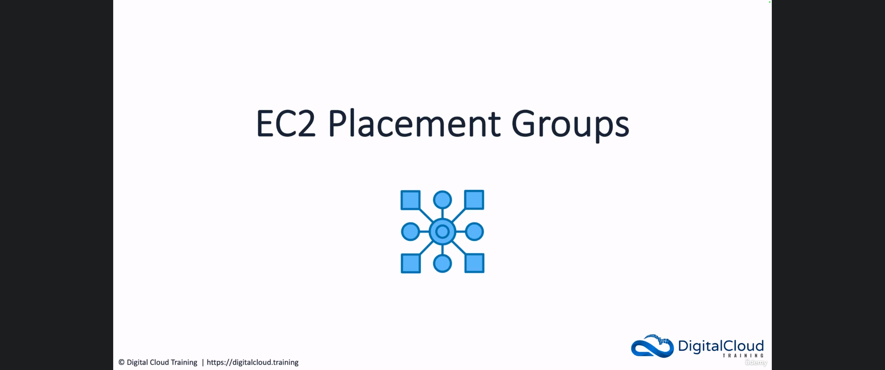
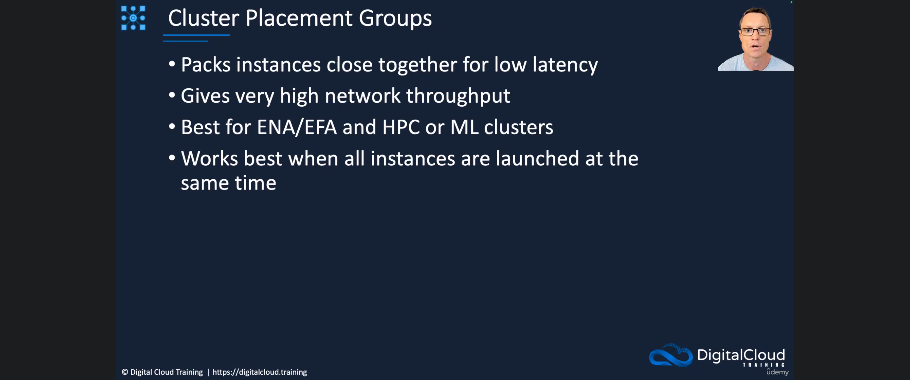
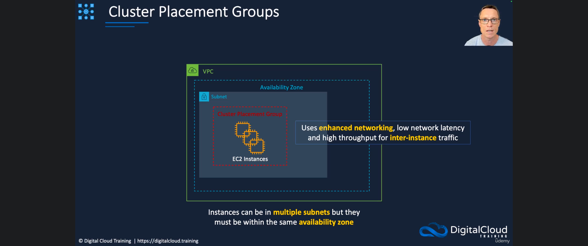
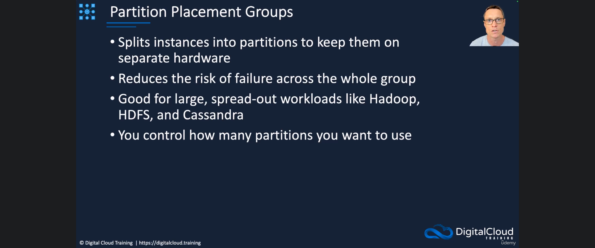
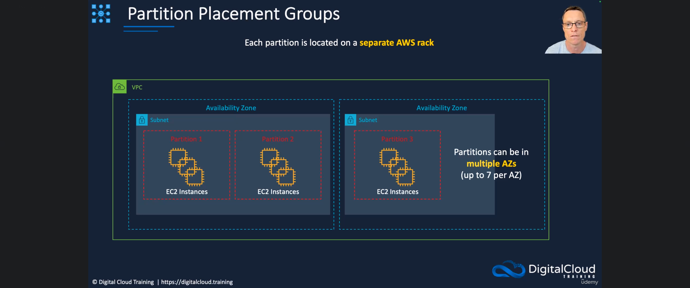
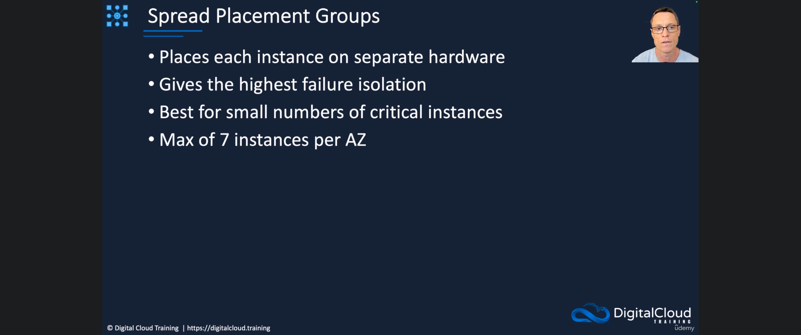
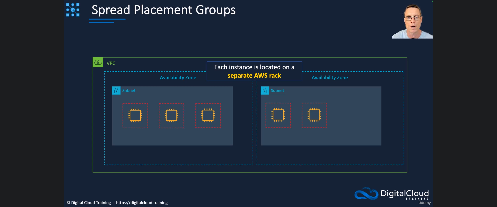
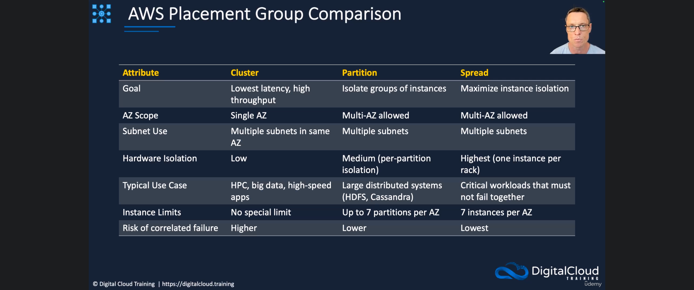
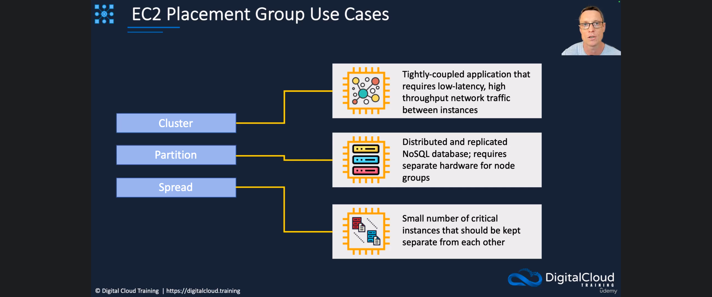

[← Course contents](../../01.md)

# 27. EC2 Placement Groups

**Course:** [AWS Certified Solutions Architect Associate (SAA-C03) – Neal Davis](https://www.udemy.com/course/aws-certified-solutions-architect-associate-hands-on/)
**Lecture:** [EC2 Placement Groups](https://www.udemy.com/course/aws-certified-solutions-architect-associate-hands-on/learn/)
**Transcript:** [`../notes/27-EC2-Placement-Groups.txt`](../notes/27-EC2-Placement-Groups.txt)

---

## Introduction

When you launch Amazon EC2 instances, AWS normally decides which physical hosts they land on. That default is fine for most workloads. **Placement groups** exist for the cases where you care about that decision: you either want instances **packed together** for speed, or **spread apart** so they do not fail together.

There are **three** types:

1. **Cluster** — pack instances close together in **one Availability Zone** for **low latency** and **high throughput**.
2. **Partition** — split instances into **partitions**, each on a **separate AWS rack**, so a hardware failure does not take down the whole group.
3. **Spread** — put **each instance** on **separate hardware** (one instance per rack). Highest isolation, smallest capacity.

This lesson is theory. There is no console HOL. The exam will give you a workload description and expect you to pick the matching placement group.

---

## Detailed Explanation

  
Step 1 — Know why placement groups exist and that there are three types

### Step 1 — Know why placement groups exist and that there are three types

- [x] **What a placement group controls**
  - Placement groups are about **how you deploy instances across Availability Zones** and onto **underlying hardware** (AWS racks).
  - Without one, AWS can place instances wherever capacity exists. With one, you choose a **placement strategy**.
- [x] **Three types to memorize**
  - **Cluster** placement group.
  - **Partition** placement group.
  - **Spread** placement group.
- [x] **The exam trade-off**
  - Cluster optimizes **network performance** (speed) and accepts **higher correlated-failure risk**.
  - Partition and spread optimize **failure isolation** and accept **limits** on how many partitions or instances you can put in an AZ.

  
Step 2 — Pack instances with a cluster placement group

### Step 2 — Pack instances with a cluster placement group

- [x] **What cluster does**
  - Packs instances **close together** so they talk to each other with **low latency**.
  - Also gives **very high network throughput** (fast networks between those instances).
- [x] **When to use it**
  - Best with **Elastic Network Adapters (ENA)** and **Elastic Fabric Adapters (EFA)**.
  - Typical workloads: **high-performance computing (HPC)**, **machine learning** clusters, and other tightly coupled compute.
- [x] **Launch timing**
  - Works **best when all instances are launched at the same time**. Filling a cluster later can be harder because the remaining capacity on that packed hardware may be gone.
- [x] **AZ and subnet rules**
  - A cluster lives in a **single Availability Zone**.
  - Instances **can** sit in **multiple subnets**, but those subnets must still be in **that same AZ**.
- [x] **Why the network is so fast**
  - Cluster placement uses **enhanced networking**.
  - That is what delivers **low latency** and **high throughput** for **inter-instance traffic** (traffic between the instances in the group).

  
Step 3 — Isolate groups of instances with partition placement groups

### Step 3 — Isolate groups of instances with partition placement groups

- [x] **What partition does**
  - Splits instances into **partitions** so those groups stay on **separate hardware**.
  - The goal is to **reduce correlation** of failures: if one rack dies, only that partition is affected, not the whole fleet.
- [x] **Typical workloads**
  - Large, spread-out systems such as **Hadoop**, **HDFS**, and **Cassandra**.
  - Think **distributed / replicated** software that already has **node groups** and can survive losing one group.
- [x] **You choose the partition count**
  - You control **how many partitions** you want to use.
  - **Each partition** sits on a **separate AWS rack**.
  - Several instances can live **inside** one partition — they share that rack.
- [x] **AZ and capacity**
  - Partitions **can span multiple Availability Zones** and **multiple subnets**.
  - Maximum: **7 partitions per Availability Zone**.

  
Step 4 — Put each instance on its own rack with spread placement groups

### Step 4 — Put each instance on its own rack with spread placement groups

- [x] **How spread differs from partition**
  - Partition isolates **groups** of instances (a partition = one rack, many instances).
  - Spread places **every individual instance** on **separate hardware**.
- [x] **Isolation level**
  - **Highest failure isolation** of the three types.
  - Further reduces correlated hardware failure because **one instance per AWS rack**.
- [x] **When to use it**
  - **Small numbers of critical instances** that must not fail together (for example a few important nodes you cannot afford to lose at once).
- [x] **Hard limit**
  - Maximum **7 instances per Availability Zone**.
  - Spread **can** use **multiple AZs** and **multiple subnets**, so total capacity is 7 × number of AZs you use.

  
Step 5 — Compare cluster, partition, and spread side by side

### Step 5 — Compare cluster, partition, and spread side by side

- [x] **Goal**
  - **Cluster:** lowest latency and high throughput.
  - **Partition:** isolate **groups** of instances.
  - **Spread:** maximize **instance** isolation from underlying hardware.
- [x] **AZ scope**
  - **Cluster:** **single AZ**.
  - **Partition** and **spread:** **multi-AZ allowed**.
- [x] **Subnet use**
  - **Cluster:** multiple subnets, but they must be in the **same AZ**.
  - **Partition** and **spread:** multiple subnets **and** multiple AZs.
- [x] **Hardware isolation**
  - **Cluster:** **low**. If the packed hardware fails, you can lose a **large number** of instances at once.
  - **Partition:** **medium**. Each partition is on a **separate rack**.
  - **Spread:** **highest**. **One instance per rack**.
- [x] **Typical use cases**
  - **Cluster:** HPC, big data, high-speed applications that need low latency and high bandwidth.
  - **Partition:** large distributed systems such as **HDFS** or **Cassandra**.
  - **Spread:** critical workloads that **must not fail together**.
- [x] **Limits**
  - **Cluster:** no special instance-count limit called out in this lesson.
  - **Partition:** **7 partitions per AZ**.
  - **Spread:** **7 instances per AZ**.
- [x] **Risk of correlated failure**
  - **Cluster:** **higher**.
  - **Partition:** **lower**.
  - **Spread:** **lowest**.

  
Step 6 — Match a workload to the right placement group

### Step 6 — Match a workload to the right placement group

- [x] **Tightly coupled, chatty instances → cluster**
  - Need **low latency** and **high throughput** network traffic **between** instances.
  - That is a **cluster** placement group.
- [x] **Distributed, replicated NoSQL with node groups → partition**
  - The database needs **separate hardware for node groups**.
  - That is a **partition** placement group (each partition = a node group on its own rack).
- [x] **A few critical instances that must stay apart → spread**
  - Small count, must not share fate on the same rack.
  - That is a **spread** placement group.

  
Lab

## Lab

There is **no console lab** in this lecture. Placement groups are created in the EC2 console (or with the CLI) under **Network & Security → Placement Groups**, then you launch instances into the group. This video only covers the three strategies.

### Overview

- [ ] You will **not** create a placement group in AWS for this lesson.
- [ ] Use the comparison table as a study card. For each type, be able to say:
  - [ ] **Goal** (speed vs isolation).
  - [ ] **AZ scope** (single vs multi).
  - [ ] **Hardware isolation** (low / medium / highest).
  - [ ] **Limit** (none special / 7 partitions per AZ / 7 instances per AZ).
- [ ] Practice the three exam mappings:
  - [ ] Tightly coupled + low latency + high throughput → **cluster**.
  - [ ] Hadoop / HDFS / Cassandra / replicated NoSQL node groups → **partition**.
  - [ ] Small number of critical instances that must not fail together → **spread**.

### Study check (no AWS account required)

| If the question says…                                             | Pick          |
| ----------------------------------------------------------------- | ------------- |
| Single AZ, ENA/EFA, HPC or ML, launch together                    | **Cluster**   |
| Separate racks for **groups** of nodes, up to 7 partitions per AZ | **Partition** |
| **Each** instance on a separate rack, max 7 instances per AZ      | **Spread**    |

  
Questions and Answers

## Questions and Answers

### Question 1: What are the three types of EC2 placement group?

Answer

- [x] **Cluster**
- [x] **Partition**
- [x] **Spread**

### Question 2: What does a cluster placement group optimize, and where can its instances live?

Answer

- [x] It packs instances close together for **low latency** and **very high network throughput**.
- [x] Instances must stay in a **single Availability Zone**.
- [x] They **can** use **multiple subnets**, but those subnets must be in **that same AZ**.

### Question 3: Which adapters and workloads go with cluster placement groups?

Answer

- [x] **Elastic Network Adapter (ENA)** and **Elastic Fabric Adapter (EFA)**.
- [x] **HPC**, **machine learning** clusters, and other tightly coupled / high-speed applications.
- [x] It works **best when all instances are launched at the same time**.

### Question 4: Why is the risk of correlated failure highest with a cluster placement group?

Answer

- [x] Hardware isolation is **low**: instances are packed onto nearby hardware.
- [x] If that underlying hardware fails, a **large number of instances** can go down together.

### Question 5: What problem does a partition placement group solve?

Answer

- [x] It splits instances into **partitions** so groups stay on **separate hardware** (each partition on a **separate AWS rack**).
- [x] That **reduces the risk** that one rack failure takes down the **entire** group.

### Question 6: What are typical partition placement group workloads, and what is the AZ limit?

Answer

- [x] Large distributed systems such as **Hadoop**, **HDFS**, and **Cassandra**.
- [x] You choose how many partitions to use.
- [x] Partitions **can span multiple AZs**.
- [x] Maximum **7 partitions per Availability Zone**.

### Question 7: How is a spread placement group different from a partition placement group?

Answer

- [x] **Partition:** several instances can share a partition, and that partition sits on **one rack**.
- [x] **Spread:** **every instance** is on **separate hardware** (one instance per rack).
- [x] Spread gives the **highest failure isolation**.

### Question 8: What is the instance limit for a spread placement group, and when do you use it?

Answer

- [x] Maximum **7 instances per Availability Zone**.
- [x] Best for a **small number of critical instances** that must not fail together.
- [x] Spread **can** use **multiple AZs** (so you can have more than 7 instances in total if you use more than one AZ).

### Question 9: An application is tightly coupled and needs low-latency, high-throughput traffic between instances. Which placement group?

Answer

- [x] **Cluster**.

### Question 10: A distributed, replicated NoSQL database needs separate hardware for its node groups. Which placement group?

Answer

- [x] **Partition**.

### Question 11: You have a small number of critical instances that must be kept on separate hardware. Which placement group?

Answer

- [x] **Spread**.

### Question 12: Which placement group types can span multiple Availability Zones?

Answer

- [x] **Partition** and **spread**.
- [x] **Cluster** is **single AZ only**.

## Summary

**Placement groups** tell AWS how to place EC2 instances on physical hardware.

**Cluster** packs instances in **one AZ** for **lowest latency** and **highest throughput** (ENA/EFA, HPC, ML). Multiple subnets are allowed only inside that AZ. Hardware isolation is **low**; correlated-failure risk is **higher**. Launch the instances **together**.

**Partition** puts each **partition** on a **separate rack**. Use it for **Hadoop / HDFS / Cassandra** style node groups. Multi-AZ is allowed. Limit: **7 partitions per AZ**. Isolation is **medium**.

**Spread** puts **each instance** on a **separate rack**. Use it for a **few critical** instances that must not fail together. Multi-AZ is allowed. Limit: **7 instances per AZ**. Isolation is **highest**; correlated-failure risk is **lowest**.

## References

- [AWS Certified Solutions Architect Associate (SAA-C03) Course – Neal Davis (Udemy)](https://www.udemy.com/course/aws-certified-solutions-architect-associate-hands-on/)
- [EC2 Placement Groups (lecture 27)](https://www.udemy.com/course/aws-certified-solutions-architect-associate-hands-on/learn/)
- [Placement groups for your Amazon EC2 instances](https://docs.aws.amazon.com/AWSEC2/latest/UserGuide/placement-groups.html)
- [Elastic Fabric Adapter](https://docs.aws.amazon.com/AWSEC2/latest/UserGuide/efa.html)
- Transcript: [`../notes/27-EC2-Placement-Groups.txt`](../notes/27-EC2-Placement-Groups.txt)
