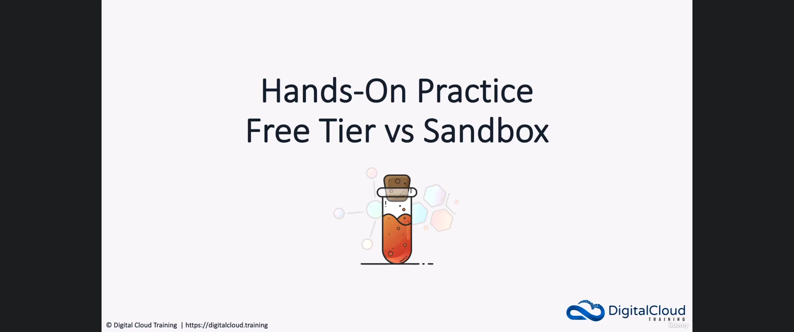
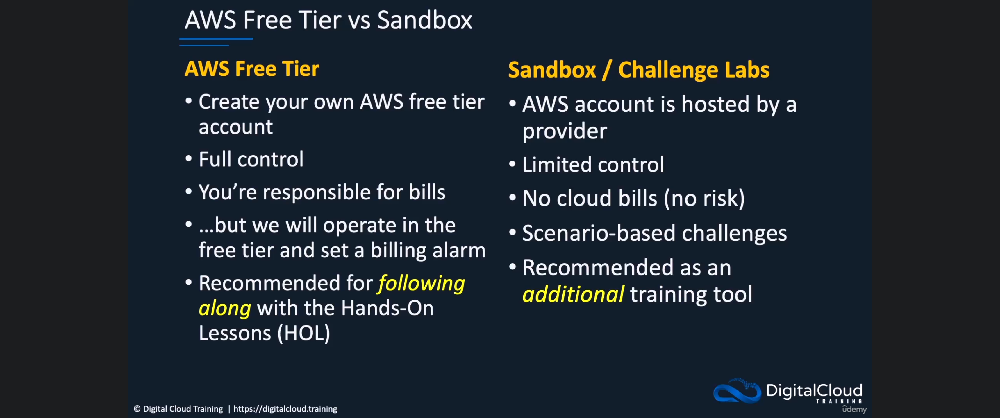
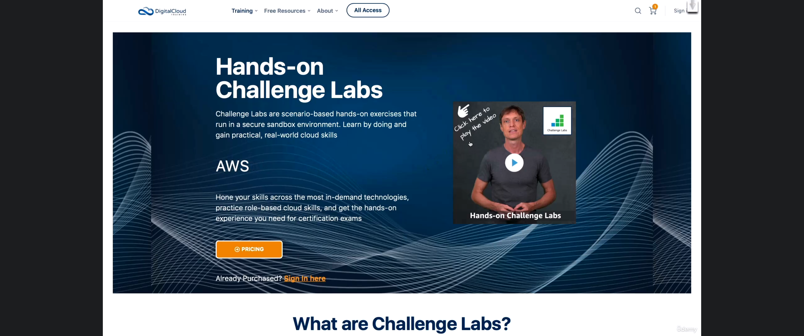
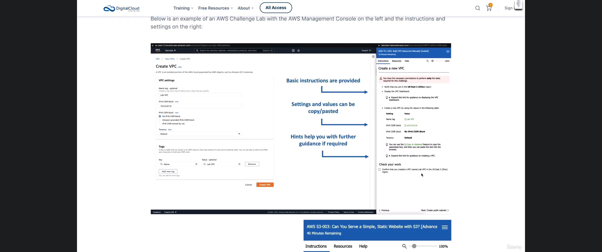

# 3. Hands-On Practice: Free Tier vs Sandbox

**Course:** [AWS Certified Solutions Architect Associate (SAA-C03) – Neal Davis](https://www.udemy.com/course/aws-certified-solutions-architect-associate-hands-on/)
**Lecture:** [Hands-On Practice: Free Tier vs Sandbox](https://www.udemy.com/course/aws-certified-solutions-architect-associate-hands-on/learn/lecture/28667198#content)
**Transcript:** [`udemy/notes/3-Hands-On-Practice-Free-Tier-vs-Sandbox.txt`](../notes/3-Hands-On-Practice-Free-Tier-vs-Sandbox.txt)

---

## Introduction

Hands-on practice is the best way to learn any technology. For this course, Neal recommends you create **your own AWS Free Tier account** and follow along in the HOL lessons. There is a second option called a **Sandbox** (also called a **Challenge Lab**): a provider-hosted AWS account with limited control, no cloud bills, and scenario-based labs. Sandboxes are **optional** and **not required** for this course.

If you are new to AWS, use this lesson as a decision chapter:

1. Open a **Free Tier** account for this course (full control, you pay any bills).
2. Treat **Challenge Labs / sandboxes** as extra practice later if you want more scenarios.

You do not create an account in this 3-minute video. Later HOL lessons walk through signup, budgets, and the CLI.

**Figure 1.** Opening title of lecture 3: Hands-On Practice, Free Tier vs Sandbox.



_Figure 1 description:_ Digital Cloud Training title card. The heading is **Hands-On Practice / Free Tier vs Sandbox**, with a test-tube graphic. This is the comparison lesson, not a console lab.

## Detailed Explanation

### Step 1 — Why hands-on practice matters

- [x] **There is no substitute for using the technology**
  - Whatever you are learning, practice by actually using it.
  - Hands-on work is the **best way to learn**.
- [x] **This course has two practice models**
  - **Primary recommendation:** your own **AWS Free Tier** account.
  - **Optional extra:** a **Sandbox / Challenge Lab**.

### Step 2 — AWS Free Tier: your account, full control, you own the bill

- [x] **You create your own Free Tier account**
  - Later lessons show how to sign up.
  - You get **full control**. It is **your** account.
  - You can do anything the account allows.
- [x] **You are responsible for bills**
  - You add a **credit card** at signup.
  - You pay any charges you run up.
- [x] **How this course stays cheap**
  - HOL work stays in the **Free Tier** when possible.
  - If a step goes **outside Free Tier**, the instructor **warns you**.
  - You must **follow instructions** and **shut down resources** to avoid bills.
  - You will set a **billing alarm** so you get a notification at a spend threshold.
- [x] **Recommendation for this course**
  - Open your own Free Tier account.
  - Use it to follow HOL lessons as you go.

**Novice rule:** Free Tier is not “always free.” It is a **limited free allowance** plus paid usage if you leave that allowance. Treat every resource as something you must stop or delete when the lab is done.

### Step 3 — Sandbox / Challenge Lab: hosted account, no cloud bill, limited control

- [x] **What a sandbox is**
  - Also called a **Challenge Lab**.
  - The AWS account is **hosted by a provider**. It is **not** your account.
- [x] **Limits**
  - You have **limited control**.
  - On advanced courses you often **cannot** do **cross-account** work, because you have **one** hosted account.
- [x] **Benefits**
  - **No cloud bills** from AWS usage in that lab.
  - You do **not** take billing risk or responsibility for that account.
  - You **pay the lab service upfront**.
  - There is **no extra AWS bill** from leaving resources running in that hosted account.
- [x] **What Challenge Labs feel like**
  - **Scenario-based** challenges.
  - The environment is **pre-configured** for that challenge.
  - Good for **testing skills** and learning from a designed scenario.

**Figure 2.** Side-by-side comparison: AWS Free Tier vs Sandbox / Challenge Labs.



_Figure 2 description:_ Memorize this table. **Free Tier:** create your own account, **full control**, **you are responsible for bills**, operate in Free Tier and set a **billing alarm**, **recommended for following along** with HOL lessons. **Sandbox / Challenge Labs:** provider-hosted account, **limited control**, **no cloud bills**, scenario-based challenges, **recommended as an additional training tool**.

| Topic              | Free Tier (this course) | Sandbox / Challenge Lab                    |
| ------------------ | ----------------------- | ------------------------------------------ |
| Whose account?     | **Yours**               | **Provider-hosted**                        |
| Control            | **Full**                | **Limited**                                |
| Cross-account labs | Possible later          | Often **not** possible                     |
| Credit card        | Required at AWS signup  | You pay the **lab service**, not AWS usage |
| AWS bill risk      | **You** pay any overage | **No** AWS cloud bill from the lab         |
| Best use           | Follow **HOL** lessons  | Extra **scenario** practice                |

### Step 4 — Challenge Labs are optional extra practice

- [x] **Optional, not required**
  - Neal recommends Challenge Labs as an **additional** tool.
  - They are **not required** for this SAA-C03 video course.
- [x] **How to get them**
  - Some labs are on the instructor **website**.
  - They need **registration** and an **additional fee**.
  - The lecture page has a video showing them in action.
  - One catalog example: **700+ labs** across many cloud platforms (not AWS-only).

**Figure 3.** Instructor website: Hands-on Challenge Labs (sandbox product page).



_Figure 3 description:_ Digital Cloud Training page for **Hands-on Challenge Labs**. The copy says labs are scenario-based exercises that run in a **secure sandbox environment**. This is an optional extra product, not this Udemy course. You register and pay a fee on the instructor site.

- [x] **AWS-only Challenge Labs**
  - If you are focused on AWS, use **AWS Challenge Labs**.
  - Layout: **AWS Management Console on the left**, **instructions on the right**.
  - **SysOps** exam labs look like this.
  - AWS uses the **same provider** for those exam labs (Skillable).
  - Advanced labs and the exam may give only a **scenario and hints**, then **verify** your work.

**Figure 4.** AWS Challenge Lab layout: console on the left, instructions on the right.



_Figure 4 description:_ Example lab **AWS-CL-002: Build VPC Resources Manually [Guided]**. Left pane is the AWS console (**Create VPC**, name `Lab VPC`, CIDR `10.0.0.0/16`). Right pane is the lab guide: steps, a table of values you can copy/paste, and hints. A second lab timer bar sits at the bottom. **SAA-C03** itself is multiple choice, not a lab exam. This UI is what **SysOps** exam labs look like.

### Step 5 — What you should do next

1. Plan to create a **Free Tier** account in the next HOL lessons.
2. Do **not** skip shutdown and billing-alarm steps.
3. Ignore Challenge Labs until you want extra practice; they are optional.

<details>
  <summary>Lab</summary>

## Lab

No console lab in this topic. This lesson is a comparison of practice options. Account creation starts in **[HOL] Create your AWS Account**.

### **Overview**

- [ ] Decide to use a **Free Tier** account for this course.
- [ ] Remember: **you** pay any bills; shut down resources; set a **billing alarm**.
- [ ] Treat **Sandbox / Challenge Labs** as optional extra practice, not a replacement for HOL.

</details>

<details>
  <summary>Terminal Commands</summary>

## Terminal Commands

No terminal commands in this lesson.

```bash
# No commands in this topic; the lesson is Free Tier vs Sandbox only.
```

</details>

<details>
  <summary>Code</summary>

## Code

No code in this lesson.

```text
# No code snippets in this topic.
```

</details>

<details>
  <summary>Questions and Answers</summary>

## Questions and Answers

### Question 1: What is the best way to learn a technology, according to this lesson?

<details>
<summary>Answer</summary>

- [x] **Hands-on practice** actually using the technology. There is no substitute.

</details>

### Question 2: Which hands-on option does the instructor recommend for this course?

<details>
<summary>Answer</summary>

- [x] Open **your own AWS Free Tier account** and follow the HOL lessons.

</details>

### Question 3: Who owns a Free Tier account, and how much control do you have?

<details>
<summary>Answer</summary>

- [x] **You** own it.
- [x] You have **full control** and can do anything the account allows.

</details>

### Question 4: Why is a credit card required for Free Tier?

<details>
<summary>Answer</summary>

- [x] AWS needs a card at signup.
- [x] **You pay any bills** you run up.

</details>

### Question 5: How does this course try to keep Free Tier costs under control?

<details>
<summary>Answer</summary>

- [x] Work in the **Free Tier** when possible.
- [x] The instructor **warns** you if a step goes outside Free Tier.
- [x] **Follow instructions** and **shut down resources**.
- [x] Set a **billing alarm** for a spend threshold.

</details>

### Question 6: What is a Sandbox / Challenge Lab?

<details>
<summary>Answer</summary>

- [x] A **provider-hosted** AWS account, **not** yours.
- [x] You have **limited control**.
- [x] You pay the **lab service upfront** and do **not** get AWS cloud bills from that lab.

</details>

### Question 7: Why might a sandbox be a poor fit for advanced, multi-account work?

<details>
<summary>Answer</summary>

- [x] You typically have **one** hosted account and **limited control**.
- [x] **Cross-account access** is often not possible.

</details>

### Question 8: Are Challenge Labs required for this SAA-C03 course?

<details>
<summary>Answer</summary>

- [x] **No.** They are **optional** extra practice.
- [x] They need **registration** and an **additional fee**.

</details>

### Question 9: About how many labs does the instructor mention in the catalog example?

<details>
<summary>Answer</summary>

- [x] **Over 700 labs** across many cloud platforms and technologies.

</details>

### Question 10: What does an AWS Challenge Lab screen look like?

<details>
<summary>Answer</summary>

- [x] **Console on the left**, **instructions on the right**.
- [x] Advanced labs or exam-style labs may give only a **scenario and hints**, then **validate** your work.

</details>

### Question 11: Who uses this Challenge Lab style on an AWS exam?

<details>
<summary>Answer</summary>

- [x] People taking the **SysOps** exam.
- [x] AWS uses the **same provider** for those exam labs.
- [x] **SAA-C03** itself is multiple choice / multiple response, not a lab exam.

</details>

### Question 12: If you only want to complete this video course, what should you do?

<details>
<summary>Answer</summary>

- [x] Create a **Free Tier** account and follow the HOL lessons.
- [x] Skip Challenge Labs unless you later want extra paid scenario practice.

</details>

</details>

## Summary

Use **hands-on practice**. For this course, create **your own AWS Free Tier account**: full control, you pay bills, follow HOL steps, shut down resources, and set a **billing alarm**. A **Sandbox / Challenge Lab** is a **provider-hosted** account with limited control, prepaid lab access, and **no AWS usage bill**. Challenge Labs are **optional** extra scenario practice, not required here.

## References

- [AWS Certified Solutions Architect Associate (SAA-C03) Course – Neal Davis (Udemy)](https://www.udemy.com/course/aws-certified-solutions-architect-associate-hands-on/)
- [Hands-On Practice: Free Tier vs Sandbox (lecture 3)](https://www.udemy.com/course/aws-certified-solutions-architect-associate-hands-on/learn/lecture/28667198#content)
- [AWS Free Tier](https://aws.amazon.com/free/)
- [Hands-On Challenge Labs – Digital Cloud Training](https://digitalcloud.training/hands-on-challenge-labs/)
- [AWS Hands-On Challenge Labs – Digital Cloud Training](https://digitalcloud.training/aws-hands-on-challenge-labs/)
- Transcript: [`../notes/3-Hands-On-Practice-Free-Tier-vs-Sandbox.txt`](../notes/3-Hands-On-Practice-Free-Tier-vs-Sandbox.txt)
