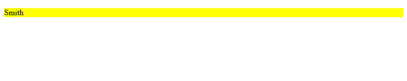
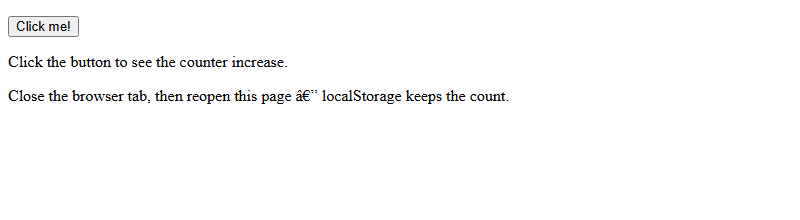
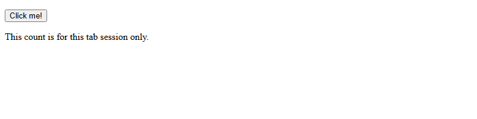
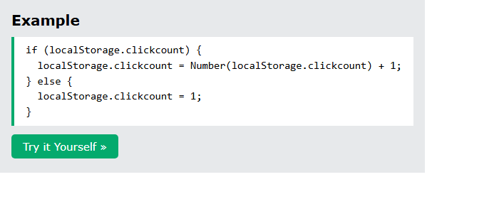
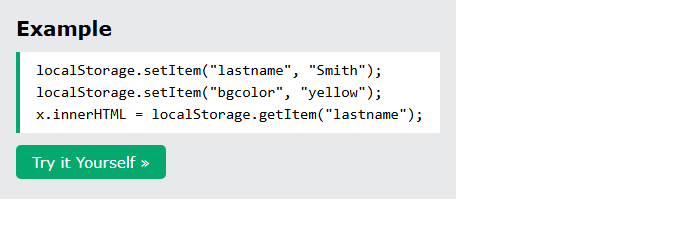
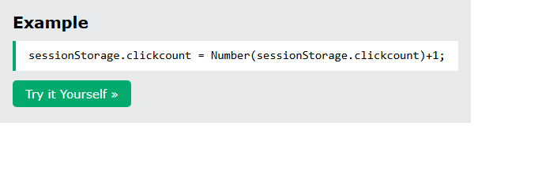
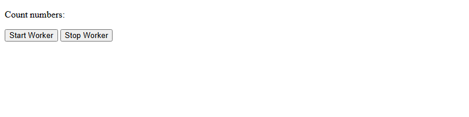
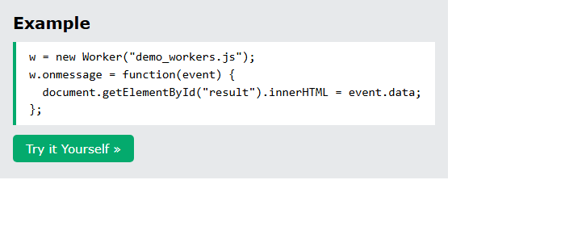
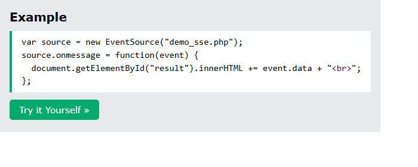

<details>
  <summary>HTML Web Storage</summary>

## Introduction

**Web Storage** keeps key/value data in the browser. It is **more secure** than cookies, **at least 5MB**, and is **never sent to the server**. This chapter covers **`localStorage`** (no expiry) and **`sessionStorage`** (one tab session).

## Detailed Explanation

- [x] **Per origin** (domain + protocol). All pages of that origin share the same store.
- [x] **`window.localStorage`** — data **survives** closing the tab.
- [x] **`window.sessionStorage`** — data is **deleted** when that tab closes.
- [x] **Feature detect:** `typeof(Storage) !== "undefined"`.
- [x] **setItem / getItem**
  - `localStorage.setItem("lastname", "Smith")` and `bgcolor` yellow.
  - Values are always **strings** — convert when you need a number.
  - Remove: `localStorage.removeItem("lastname")`.
  - Sandbox: `code_sandbox/html-web-storage/names.html`.



- [x] **Click counter (`localStorage.clickcount`)**
  - Convert with `Number(...)` then add 1.
  - Sandbox: `index.html`.



- [x] **sessionStorage counter** — same idea; count is “in this session”.
  - Sandbox: `session.html`.



<details>
  <summary>Lab</summary>

## Lab

Store Smith/yellow, then click the localStorage and sessionStorage counters.

### **Overview**

- [ ] Serve `code_sandbox` and open each `html-web-storage` file.
- [ ] Success: **Smith** on a yellow background; local count survives a tab close; session count resets when the tab closes.

### **Task 1: Serve and open**

- [ ] From `Personal/Files/html/code_sandbox`:

```bash
python -m http.server 8766 --bind 127.0.0.1
```

- [ ] `http://127.0.0.1:8766/html-web-storage/`
- [ ] `http://127.0.0.1:8766/html-web-storage/names.html`
- [ ] `http://127.0.0.1:8766/html-web-storage/session.html`


The storage examples match the chapter.

</details>

<details>
  <summary>Terminal Commands</summary>

## Terminal Commands

```bash
# from Personal/Files/html/code_sandbox
python -m http.server 8766 --bind 127.0.0.1
```

Then open `http://127.0.0.1:8766/html-web-storage/`.

</details>

<details>
  <summary>Code</summary>

## Code

Click counter (`index.html`):



```javascript
if (localStorage.clickcount) {
  localStorage.clickcount = Number(localStorage.clickcount) + 1;
} else {
  localStorage.clickcount = 1;
}
```


setItem (`names.html`):



```javascript
localStorage.setItem("lastname", "Smith");
localStorage.setItem("bgcolor", "yellow");
x.innerHTML = localStorage.getItem("lastname");
```


sessionStorage (`session.html`):



```javascript
sessionStorage.clickcount = Number(sessionStorage.clickcount) + 1;
```


</details>

<details>
  <summary>Questions and Answers</summary>

## Questions and Answers

### Question 1: How is web storage better than cookies here?

<details>
<summary>Answer</summary>

- [x] **Larger** (at least **5MB**).
- [x] **Never transferred** to the server with every request.

</details>

### Question 2: localStorage vs sessionStorage?

<details>
<summary>Answer</summary>

- [x] localStorage: **no expiry** (survives tab close).
- [x] sessionStorage: **one tab session**.

</details>

### Question 3: How do you store and read a pair?

<details>
<summary>Answer</summary>

- [x] `setItem(name, value)` and `getItem(name)`.
- [x] Values are **strings**.

</details>

### Question 4: How do you delete one item?

<details>
<summary>Answer</summary>

- [x] `localStorage.removeItem("lastname")`.

</details>

</details>

## Summary

Web storage is per-origin key/value data. localStorage lasts; sessionStorage dies with the tab. Detect `Storage`, use setItem/getItem, and convert strings to numbers when counting.

## References

- [HTML Web Storage API (W3Schools)](https://www.w3schools.com/html/html5_webstorage.asp)
- [MDN: Web Storage API](https://developer.mozilla.org/en-US/docs/Web/API/Web_Storage_API)
- [MDN: `Window.localStorage`](https://developer.mozilla.org/en-US/docs/Web/API/Window/localStorage)

</details>

<details>
  <summary>HTML Web Workers</summary>

## Introduction

A **web worker** is an **external JavaScript file** that runs in the **background** so a heavy script does not freeze the page. This chapter builds `demo_workers.js` (a counter via **`postMessage`**), starts it with **`new Worker`**, listens with **`onmessage`**, and stops it with **`terminate()`**.

## Detailed Explanation

- [x] Scripts on the main page block UI until they finish. A worker runs **independently** — you can still click and select.
- [x] Use workers for **CPU-heavy** work, not for a simple counter (the demo is simplified).
- [x] **Detect:** `typeof(Worker) !== "undefined"`.
- [x] **Worker file** `demo_workers.js`:
  - Increment `i`, `postMessage(i)`, `setTimeout` every 500 ms.
  - The page shows `setTimeout("timedCount()",500)` (string). The sandbox uses `setTimeout(timedCount, 500)` — same timing, current JS style.
- [x] **Main page**
  - Create once: `if (typeof(w) == "undefined") { w = new Worker("demo_workers.js"); }`
  - Both sides talk with **`postMessage`** / **`onmessage`**. Data is `event.data`.
  - **Stop:** `w.terminate()`. **Reuse:** `w = undefined` then start again.
  - Sandbox: `code_sandbox/html-web-workers/index.html`.



- [x] **Workers cannot use** `window`, `document`, or `parent`.

<details>
  <summary>Lab</summary>

## Lab

Start the counter worker, watch the number rise, then stop it.

### **Overview**

- [ ] Serve `code_sandbox` and open `html-web-workers/`.
- [ ] Click **Start Worker**, then **Stop Worker**.
- [ ] Success: the count increases about twice a second until Stop.

### **Task 1: Serve and open**

- [ ] From `Personal/Files/html/code_sandbox`:

```bash
python -m http.server 8766 --bind 127.0.0.1
```

- [ ] `http://127.0.0.1:8766/html-web-workers/`


The worker example matches the chapter.

</details>

<details>
  <summary>Terminal Commands</summary>

## Terminal Commands

```bash
# from Personal/Files/html/code_sandbox
python -m http.server 8766 --bind 127.0.0.1
```

Then open `http://127.0.0.1:8766/html-web-workers/`.

</details>

<details>
  <summary>Code</summary>

## Code

`index.html`:



```javascript
w = new Worker("demo_workers.js");
w.onmessage = function (event) {
  document.getElementById("result").innerHTML = event.data;
};
```


`demo_workers.js`:

```javascript
var i = 0;
function timedCount() {
  i = i + 1;
  postMessage(i);
  setTimeout(timedCount, 500);
}
timedCount();
```

</details>

<details>
  <summary>Questions and Answers</summary>

## Questions and Answers

### Question 1: What problem do web workers solve?

<details>
<summary>Answer</summary>

- [x] Long scripts on the main thread make the page **unresponsive**.
- [x] A worker runs in the **background**.

</details>

### Question 2: How does the worker send data to the page?

<details>
<summary>Answer</summary>

- [x] **`postMessage(value)`**.
- [x] The page reads **`event.data`** in **`onmessage`**.

</details>

### Question 3: How do you stop and reuse a worker?

<details>
<summary>Answer</summary>

- [x] `terminate()` stops it.
- [x] Set the variable to **`undefined`** to create it again.

</details>

### Question 4: Can a worker touch the DOM?

<details>
<summary>Answer</summary>

- [x] **No.** No `window`, `document`, or `parent`.

</details>

</details>

## Summary

Put heavy work in an external `.js` worker. `new Worker`, `postMessage`/`onmessage`, `terminate`. Workers have no DOM. The demo counter is for learning, not a typical worker job.

## References

- [HTML Web Workers API (W3Schools)](https://www.w3schools.com/html/html5_webworkers.asp)
- [MDN: Using Web Workers](https://developer.mozilla.org/en-US/docs/Web/API/Web_Workers_API/Using_web_workers)
- [MDN: `Worker`](https://developer.mozilla.org/en-US/docs/Web/API/Worker)

</details>

<details>
  <summary>HTML SSE</summary>

## Introduction

**Server-Sent Events (SSE)** let the **server push** updates to the page over HTTP. The page does not poll. This chapter uses **`EventSource`**, `onmessage`, and a server that sends `text/event-stream` lines starting with **`data:`**. Examples: feeds, stocks, scores.

## Detailed Explanation

- [x] **One-way messaging** — server → page. Facebook/Twitter-style updates, news, sports.
- [x] **Browser:** `new EventSource("demo_sse.php")` then `source.onmessage`.
  - Check: `typeof(EventSource) !== "undefined"`.
  - Each message appends `event.data` into `#result`.
- [x] **Server**
  - Header **`Content-Type: text/event-stream`**, no cache.
  - Each event: `data: The server time is: …` then a **blank line**.
  - The page shows **PHP** and **ASP**. This sandbox has **no PHP**, so `sse_server.py` on **port 8767** sends the same `data:` stream and the page uses `EventSource("/sse")`.
  - Sandbox: `code_sandbox/html-sse/index.html`.


- [x] **EventSource events:** `onopen` (connected), `onmessage` (data), `onerror` (error).

<details>
  <summary>Lab</summary>

## Lab

Run the small SSE server (not the static 8766 server) and watch the time lines appear.

### **Overview**

- [ ] Start `sse_server.py` from `html-sse`.
- [ ] Open `http://127.0.0.1:8767/`.
- [ ] Success: **Getting server updates** plus repeating “The server time is: …”.

### **Task 1: Serve SSE and open**

- [ ] From `Personal/Files/html/code_sandbox/html-sse`:

```bash
python sse_server.py
```

- [ ] `http://127.0.0.1:8767/`
- [ ] The static `python -m http.server 8766` **cannot** send `text/event-stream` (the page’s PHP `demo_sse.php` is the same idea on a real PHP host).


The SSE demo matches the chapter.

</details>

<details>
  <summary>Terminal Commands</summary>

## Terminal Commands

```bash
# from Personal/Files/html/code_sandbox/html-sse
python sse_server.py
```

Then open `http://127.0.0.1:8767/`.

</details>

<details>
  <summary>Code</summary>

## Code

Page (`index.html`):



```javascript
var source = new EventSource("demo_sse.php");
source.onmessage = function (event) {
  document.getElementById("result").innerHTML += event.data + "<br>";
};
```


PHP from the chapter (`demo_sse.php`):

```php
<?php
header('Content-Type: text/event-stream');
header('Cache-Control: no-cache');
$time = date('r');
echo "data: The server time is: {$time}\n\n";
flush();
?>
```

Python stand-in used in the sandbox (`sse_server.py`): streams `data: The server time is: …` every second on `GET /sse`.

</details>

<details>
  <summary>Questions and Answers</summary>

## Questions and Answers

### Question 1: How is SSE different from a normal page request?

<details>
<summary>Answer</summary>

- [x] The page does **not** keep asking.
- [x] The **server pushes** updates over HTTP.

</details>

### Question 2: Which JS object receives events?

<details>
<summary>Answer</summary>

- [x] **`EventSource`**.
- [x] Handle **`onmessage`** and read **`event.data`**.

</details>

### Question 3: What Content-Type must the server send?

<details>
<summary>Answer</summary>

- [x] **`text/event-stream`**.
- [x] Each message starts with **`data:`** and ends with a blank line.

</details>

### Question 4: Which EventSource events are listed?

<details>
<summary>Answer</summary>

- [x] **`onopen`**, **`onmessage`**, **`onerror`**.

</details>

### Question 5: Why doesn’t `http.server 8766` run this demo?

<details>
<summary>Answer</summary>

- [x] It only serves **static files**.
- [x] SSE needs a process that keeps the connection and writes **event-stream** data (PHP on the page; `sse_server.py` here).

</details>

</details>

## Summary

SSE is one-way server push. Use `EventSource` and `onmessage`. The server sets `text/event-stream` and writes `data: …` lines. The tutorial uses PHP/ASP; this sandbox uses a small Python streamer on port 8767.

## References

- [HTML Server-Sent Events API (W3Schools)](https://www.w3schools.com/html/html5_serversentevents.asp)
- [MDN: Using server-sent events](https://developer.mozilla.org/en-US/docs/Web/API/Server-sent_events/Using_server-sent_events)
- [MDN: `EventSource`](https://developer.mozilla.org/en-US/docs/Web/API/EventSource)
- [WHATWG: Server-sent events](https://html.spec.whatwg.org/multipage/server-sent-events.html)

</details>
