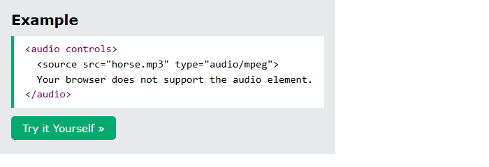
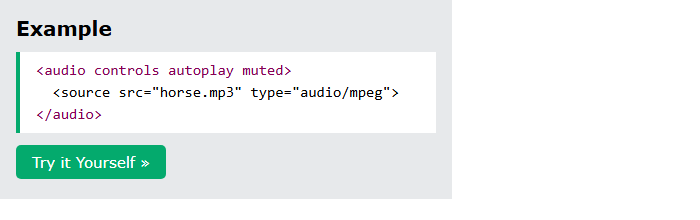

# HTML Audio

[Back to HTML Tutorial](../tutorial_main.md)

## Introduction

The HTML **`<audio>`** element plays a sound file. This chapter covers **`controls`**, **`<source>`** fallbacks, **autoplay** (and **muted** autoplay in Chromium), formats (**MP3, WAV, OGG**), media types, and the Audio/Video **DOM**.

This section has **2** examples:

- [x] **Example 1:** Controls [View](#html-audio-example-01)
- [x] **Example 2:** Muted autoplay [View](#html-audio-example-02)

## Detailed Explanation

- [x] **Formats** — MP3 (`audio/mpeg`), WAV (`audio/wav`), OGG (`audio/ogg`). Safari: MP3 and WAV yes, **OGG no**. Edge/IE: WAV and OGG from **Edge 79**.
- [x] **DOM** — load, play, pause, duration, volume, play/pause events (same family as `<video>`).
- [x] **Tags:** `<audio>` sound; `<source>` alternate files.

<a id="html-audio-example-01"></a>

### **Example 1: Controls**

- [x] **Markup**
  - `controls` adds play, pause, and volume.
  - `<source>` lists alternatives; the browser uses the **first recognized** format.
  - Inner text shows only if `<audio>` is **unsupported**.

Sandbox: `code_sandbox/html-audio/index.html`

```html
<audio controls>
  <source src="horse.mp3" type="audio/mpeg" />
  Your browser does not support the audio element.
</audio>
```




- [x] **Outcome:** an audio player with native **controls** for `horse.mp3`.

<a id="html-audio-example-02"></a>

### **Example 2: Muted autoplay**

- [x] **Autoplay**
  - `autoplay` starts playback automatically.
  - Chromium usually **blocks** autoplay with sound. **Muted autoplay is allowed**: `controls autoplay muted`.
  - Sandbox: `autoplay.html`.

Sandbox: `code_sandbox/html-audio/autoplay.html`

```html
<audio controls autoplay muted>
  <source src="horse.mp3" type="audio/mpeg" />
</audio>
```




- [x] **Outcome:** the sound starts by itself because **`autoplay muted`** is set.

<details>
  <summary>Terminal Commands</summary>

## Terminal Commands

```bash
# from Personal/Files/html/code_sandbox
python -m http.server 8766 --bind 127.0.0.1
```

Then open `http://127.0.0.1:8766/html-audio/`.

</details>

<details>
  <summary>Questions and Answers</summary>

## Questions and Answers

### Question 1: What does `controls` add on `<audio>`?

<details>
<summary>Answer</summary>

- [x] Play, pause, and volume.

</details>

### Question 2: Which audio formats does HTML support?

<details>
<summary>Answer</summary>

- [x] **MP3**, **WAV**, and **OGG**.
- [x] Safari: **no OGG** in this table.

</details>

### Question 3: What is the media type for MP3?

<details>
<summary>Answer</summary>

- [x] **`audio/mpeg`**.

</details>

### Question 4: How do you autoplay in Chromium?

<details>
<summary>Answer</summary>

- [x] Use **`autoplay muted`**.
- [x] Autoplay **with sound** is usually blocked.

</details>

### Question 5: What tags are listed for audio?

<details>
<summary>Answer</summary>

- [x] `<audio>` and `<source>`.

</details>

</details>

## Summary

`<audio controls>` plus `<source>` fallbacks plays MP3/WAV/OGG. Autoplay in Chromium needs `muted`. Safari skips OGG. The Audio/Video DOM can play, pause, and report events.

## References

- [HTML Audio (W3Schools)](https://www.w3schools.com/html/html5_audio.asp)
- [HTML Audio/Video DOM](https://www.w3schools.com/tags/ref_av_dom.asp)
- [MDN: `<audio>`](https://developer.mozilla.org/en-US/docs/Web/HTML/Element/audio)
