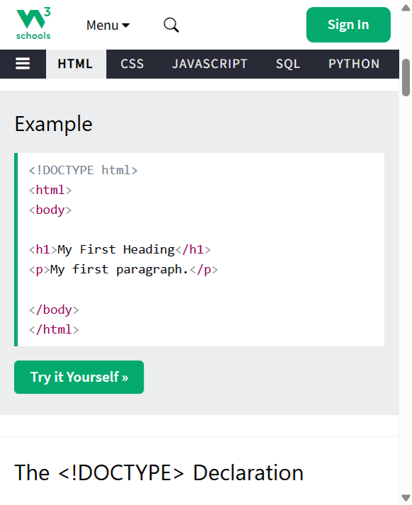
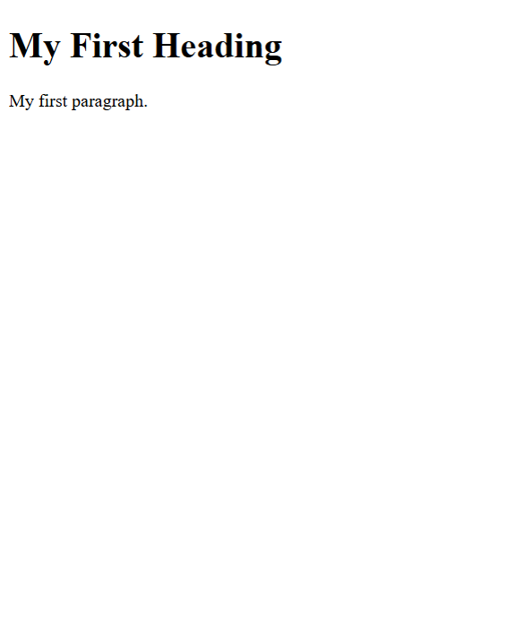
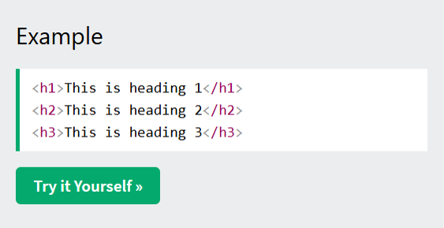
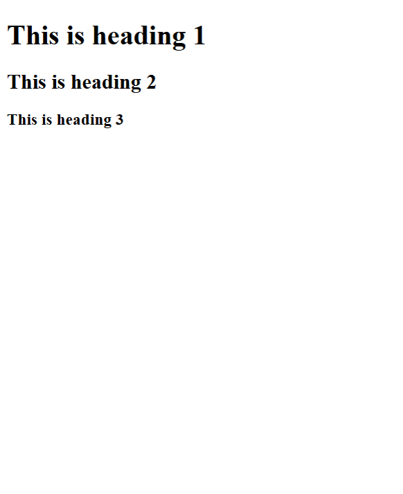
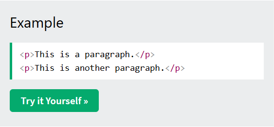
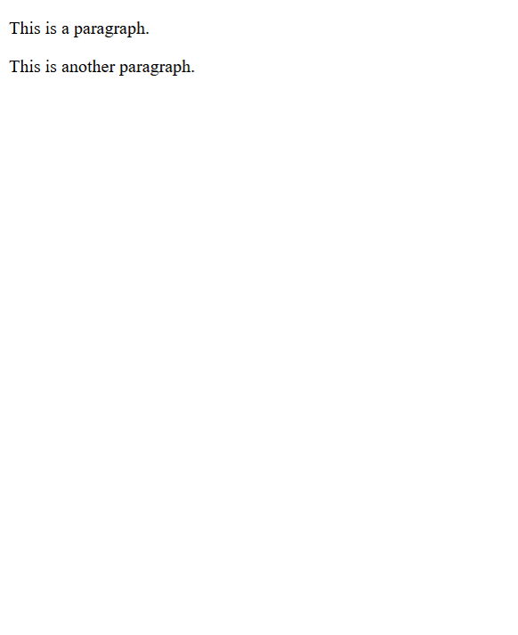
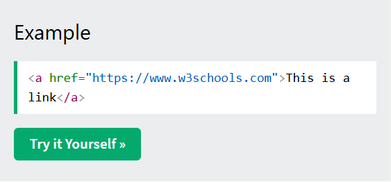
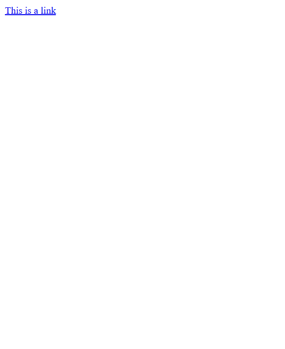
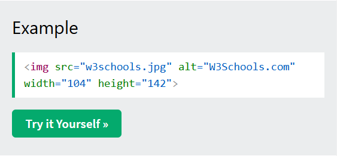

# HTML Basic

[Back to HTML Tutorial](../tutorial_main.md)

## Introduction

This chapter shows **basic HTML examples**: a full document, the `<!DOCTYPE html>` declaration, **headings**, **paragraphs**, **links**, and **images**. The tags may be new; the point is to see the pattern. You can also **view page source** and **inspect** elements in the browser.

This section has **5** examples:

- [x] **Example 1:** A full document [View](#html-basic-example-01)
- [x] **Example 2:** Headings [View](#html-basic-example-02)
- [x] **Example 3:** Paragraphs [View](#html-basic-example-03)
- [x] **Example 4:** Link [View](#html-basic-example-04)
- [x] **Example 5:** Image [View](#html-basic-example-05)

## Detailed Explanation

- [x] **The `<!DOCTYPE>` declaration**
  - Represents the **document type** and helps browsers **display pages correctly**.
  - Must appear **once**, at the **top** of the page (before any HTML tags).
  - It is **not case sensitive**.
  - HTML5 doctype is: `<!DOCTYPE html>`.
- [x] **How to view HTML source**
  - **View Page Source:** `Ctrl`+`U`, or right-click the page → **View Page Source**. Opens a tab with the HTML source.
  - **Inspect an element:** right-click an element (or a blank area) → **Inspect**. Shows HTML and CSS; you can edit them on the fly in the Elements / Styles panel.

<a id="html-basic-example-01"></a>

### **Example 1: A full document**

- [x] **HTML documents**
  - Every document starts with a document type declaration: `<!DOCTYPE html>`.
  - The document itself starts with `<html>` and ends with `</html>`.
  - Visible content sits between `<body>` and `</body>`.

Sandbox: `code_sandbox/html-basic/index.html`

```html
<!DOCTYPE html>
<html>
  <body>
    <h1>My First Heading</h1>
    <p>My first paragraph.</p>
  </body>
</html>
```





- [x] **Outcome:** the browser shows **My First Heading**, **My first paragraph.**.

<a id="html-basic-example-02"></a>

### **Example 2: Headings**

- [x] **HTML headings**
  - Defined with `<h1>` through `<h6>`.
  - `<h1>` is the **most important**; `<h6>` is the **least important**.

Sandbox: `code_sandbox/html-basic/headings.html`

```html
<h1>This is heading 1</h1>
<h2>This is heading 2</h2>
<h3>This is heading 3</h3>
```





- [x] **Outcome:** the browser shows **This is heading 1**, **This is heading 2**, **This is heading 3**.

<a id="html-basic-example-03"></a>

### **Example 3: Paragraphs**

- [x] **HTML paragraphs**
  - Defined with the `<p>` tag.

Sandbox: `code_sandbox/html-basic/paragraphs.html`

```html
<p>This is a paragraph.</p>
<p>This is another paragraph.</p>
```





- [x] **Outcome:** the browser shows **This is a paragraph.**, **This is another paragraph.**.

<a id="html-basic-example-04"></a>

### **Example 4: Link**

- [x] **HTML links**
  - Defined with the `<a>` tag.
  - The destination is the **`href` attribute**.
  - Attributes add extra information about an element (covered in a later chapter).

Sandbox: `code_sandbox/html-basic/link.html`

```html
<a href="https://www.w3schools.com">This is a link</a>
```





- [x] **Outcome:** the browser shows **This is a link**.

<a id="html-basic-example-05"></a>

### **Example 5: Image**

- [x] **HTML images**
  - Defined with the `` tag.
  - Attributes: **`src`** (file), **`alt`** (alternative text), **`width`**, **`height`**.

Sandbox: `code_sandbox/html-basic/img.html`

```html

```




- [x] **Outcome:** the browser shows **W3Schools.com**.

<details>
  <summary>Terminal Commands</summary>

## Terminal Commands

```bash
# from Personal/Files/html/code_sandbox
python -m http.server 8766 --bind 127.0.0.1
```

Then open `http://127.0.0.1:8766/html-basic/` and the other files in that folder.

</details>

<details>
  <summary>Questions and Answers</summary>

## Questions and Answers

### Question 1: What must every HTML document start with?

<details>
<summary>Answer</summary>

- [x] A document type declaration: `<!DOCTYPE html>`.

</details>

### Question 2: Where does visible content go?

<details>
<summary>Answer</summary>

- [x] Between `<body>` and `</body>`.

</details>

### Question 3: How many times may `<!DOCTYPE>` appear, and where?

<details>
<summary>Answer</summary>

- [x] **Once**.
- [x] At the **top** of the page, **before any HTML tags**.

</details>

### Question 4: Is `<!DOCTYPE>` case sensitive?

<details>
<summary>Answer</summary>

- [x] **No.**

</details>

### Question 5: Which tags define headings, and which is most important?

<details>
<summary>Answer</summary>

- [x] `<h1>` through `<h6>`.
- [x] `<h1>` is the **most important**; `<h6>` is the **least important**.

</details>

### Question 6: Which tag defines a paragraph?

<details>
<summary>Answer</summary>

- [x] `<p>`.

</details>

### Question 7: How do you write a link, and where is the URL?

<details>
<summary>Answer</summary>

- [x] Use the `<a>` tag.
- [x] Put the destination in the **`href` attribute**.

</details>

### Question 8: Which attributes does the image example use?

<details>
<summary>Answer</summary>

- [x] **`src`** — the image file.
- [x] **`alt`** — alternative text.
- [x] **`width`** and **`height`**.

</details>

### Question 9: How do you view a page’s HTML source?

<details>
<summary>Answer</summary>

- [x] Press **`Ctrl`+`U`**, or right-click → **View Page Source**.
- [x] That opens a tab with the HTML source.

</details>

### Question 10: What does Inspect show you?

<details>
<summary>Answer</summary>

- [x] Right-click an element → **Inspect**.
- [x] You see the **HTML and CSS**.
- [x] You can edit them **on the fly** in Elements / Styles.

</details>

</details>

## Summary

A page starts with `<!DOCTYPE html>`, then `<html>` / `<body>`. Headings are `<h1>`–`<h6>`, paragraphs `<p>`, links `<a href="...">`, images ``. The doctype appears **once at the top** and is **not case sensitive**. Use **View Source** (`Ctrl`+`U`) or **Inspect** to study a page.

## References

- [HTML Basic (W3Schools)](https://www.w3schools.com/html/html_basic.asp)
- [Try it Yourself: tryhtml_basic_document](https://www.w3schools.com/html/tryit.asp?filename=tryhtml_basic_document)
- [Try it Yourself: tryhtml_basic_headings](https://www.w3schools.com/html/tryit.asp?filename=tryhtml_basic_headings)
- [Try it Yourself: tryhtml_basic_paragraphs](https://www.w3schools.com/html/tryit.asp?filename=tryhtml_basic_paragraphs)
- [Try it Yourself: tryhtml_basic_link](https://www.w3schools.com/html/tryit.asp?filename=tryhtml_basic_link)
- [Try it Yourself: tryhtml_basic_img](https://www.w3schools.com/html/tryit.asp?filename=tryhtml_basic_img)
- [MDN: DOCTYPE](https://developer.mozilla.org/en-US/docs/Glossary/Doctype)
- [MDN: `<a>`](https://developer.mozilla.org/en-US/docs/Web/HTML/Element/a)
- [MDN: ``](https://developer.mozilla.org/en-US/docs/Web/HTML/Element/img)
