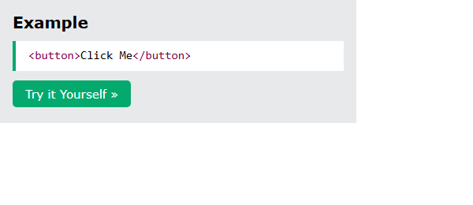
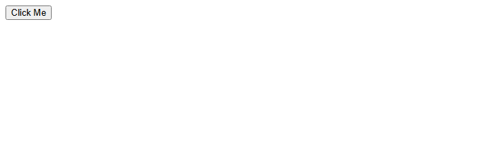
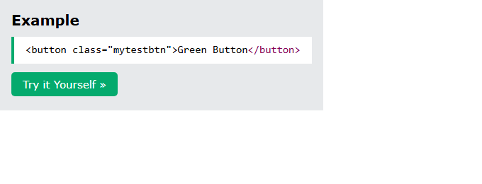
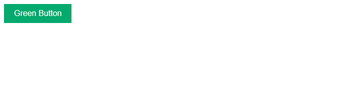
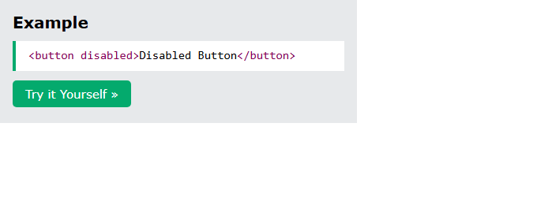
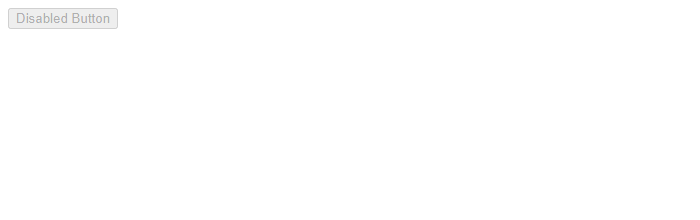
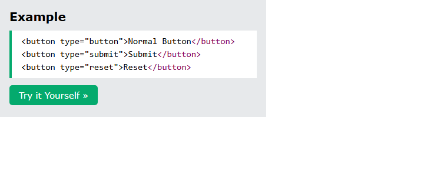
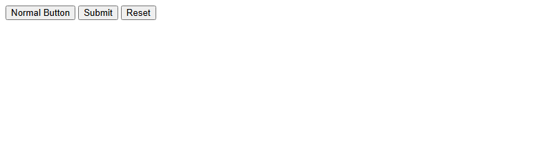
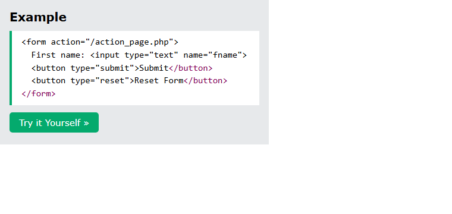
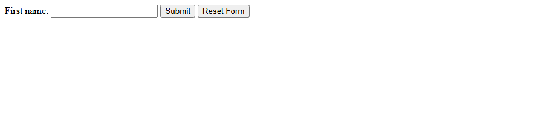

# HTML Buttons

[Back to HTML Tutorial](../tutorial_main.md)

## Introduction

Buttons let users **interact** with a page: submit forms, run JavaScript, or trigger actions. This chapter covers the **`<button>`** element, CSS styling, **`disabled`**, **`onclick`**, and the **`type`** values **`button`**, **`submit`**, and **`reset`**.

This section has **6** examples:

- [x] **Example 1:** Basic [View](#html-buttons-example-01)
- [x] **Example 2:** Styled [View](#html-buttons-example-02)
- [x] **Example 3:** Disabled [View](#html-buttons-example-03)
- [x] **Example 4:** JavaScript [View](#html-buttons-example-04)
- [x] **Example 5:** Types [View](#html-buttons-example-05)
- [x] **Example 6:** Form [View](#html-buttons-example-06)

## Detailed Explanation

<a id="html-buttons-example-01"></a>

### **Example 1: Basic**

- [x] **HTML button**
  - `<button>` defines a **clickable** button.
  - By itself it **does nothing** until you add an action.
  - Example: `<button>Click Me</button>`.

Sandbox: `code_sandbox/html-buttons/index.html`

```html
<button>Click Me</button>
```





- [x] **Outcome:** the browser shows **Click Me**.

<a id="html-buttons-example-02"></a>

### **Example 2: Styled**

- [x] **Styling HTML buttons**
  - Buttons are often styled with **CSS**.
  - Example: `<button class="mytestbtn">Green Button</button>` (sandbox uses W3Schools green `#04AA6D`).
  - Sandbox: `styled.html`.

Sandbox: `code_sandbox/html-buttons/styled.html`

```html
<button class="mytestbtn">Green Button</button>
```





- [x] **Outcome:** the browser shows **Green Button**.

<a id="html-buttons-example-03"></a>

### **Example 3: Disabled**

- [x] **Disabled buttons**
  - The **`disabled`** attribute makes a button **unclickable**.
  - Disabled buttons usually appear **faded**.
  - Example: `<button disabled>Disabled Button</button>`.
  - Sandbox: `disabled.html`.

Sandbox: `code_sandbox/html-buttons/disabled.html`

```html
<button disabled>Disabled Button</button>
```





- [x] **Outcome:** the browser shows **Disabled Button**.

<a id="html-buttons-example-04"></a>

### **Example 4: JavaScript**

- [x] **Button with JavaScript**
  - Run JS on click with **`onclick`**.
  - Example: `<button onclick="alert('Hello!')">Click Me</button>`.
  - Sandbox: `js.html`. More JS in the HTML JavaScript chapter.

Sandbox: `code_sandbox/html-buttons/js.html`

```html
<button onclick="alert('Hello!')">Click Me</button>
```


- [x] **Outcome:** the browser shows **Click Me**.

<a id="html-buttons-example-05"></a>

### **Example 5: Types**

- [x] **Button types**
  - **`type="button"`** — normal clickable button (does nothing by default).
  - **`type="submit"`** — submits a form.
  - **`type="reset"`** — resets all form fields.
  - Sandbox: `types.html`.

Sandbox: `code_sandbox/html-buttons/types.html`

```html
<button type="button">Normal Button</button>
<button type="submit">Submit</button>
<button type="reset">Reset</button>
```





- [x] **Outcome:** the browser shows **Normal Button**, **Submit**, **Reset**.

<a id="html-buttons-example-06"></a>

### **Example 6: Form**

- [x] **Buttons in a form**
  - Submit sends form data to the server; reset clears the fields.
  - Example: first-name input, **Submit**, **Reset Form**, `action="/action_page.php"`.
  - **Always specify `type`**. Inside a form, the **default type is submit**, and browsers may differ if `type` is omitted.
  - Sandbox: `form.html`. Forms are covered in a later chapter.
    | Tag | Description |
    | ---------- | -------------------------- |
    | `<button>` | Defines a clickable button |

Sandbox: `code_sandbox/html-buttons/form.html`

```html
<form action="/action_page.php">
  First name: <input type="text" name="fname" />
  <button type="submit">Submit</button>
  <button type="reset">Reset Form</button>
</form>
```





- [x] **Outcome:** the browser shows **First name: Submit**, **Reset Form**.

<details>
  <summary>Terminal Commands</summary>

## Terminal Commands

```bash
# from Personal/Files/html/code_sandbox
python -m http.server 8766 --bind 127.0.0.1
```

Then open `http://127.0.0.1:8766/html-buttons/`.

</details>

<details>
  <summary>Questions and Answers</summary>

## Questions and Answers

### Question 1: What does `<button>` define, and what happens with no action?

<details>
<summary>Answer</summary>

- [x] A **clickable** button.
- [x] By itself it **does nothing** until you add an action.

</details>

### Question 2: How do you make a button unclickable?

<details>
<summary>Answer</summary>

- [x] Add the **`disabled`** attribute.
- [x] It usually appears **faded**.

</details>

### Question 3: How does this chapter run JavaScript on a click?

<details>
<summary>Answer</summary>

- [x] The **`onclick`** attribute.
- [x] Example: `onclick="alert('Hello!')"`.

</details>

### Question 4: What are the three `type` values?

<details>
<summary>Answer</summary>

- [x] **`button`** — normal; does nothing by default.
- [x] **`submit`** — submits a form.
- [x] **`reset`** — resets form fields.

</details>

### Question 5: Why should you always specify `type` on a button?

<details>
<summary>Answer</summary>

- [x] Inside a form, the **default type is submit**.
- [x] Browsers may **behave differently** if `type` is omitted.

</details>

### Question 6: What do submit and reset do in a form?

<details>
<summary>Answer</summary>

- [x] **Submit** sends the form data to the server.
- [x] **Reset** clears the form fields.

</details>

</details>

## Summary

`<button>` is a clickable control. Style it with CSS, disable it with `disabled`, and run JS with `onclick`. Always set `type`: `button`, `submit`, or `reset`. Inside a form the default is submit.

## References

- [HTML Buttons (W3Schools)](https://www.w3schools.com/html/html_buttons.asp)
- [Try it Yourself: tryhtml_buttons_basic](https://www.w3schools.com/html/tryit.asp?filename=tryhtml_buttons_basic)
- [Try it Yourself: tryhtml_buttons_styled](https://www.w3schools.com/html/tryit.asp?filename=tryhtml_buttons_styled)
- [Try it Yourself: tryhtml_buttons_disabled](https://www.w3schools.com/html/tryit.asp?filename=tryhtml_buttons_disabled)
- [Try it Yourself: tryhtml_buttons_javascript](https://www.w3schools.com/html/tryit.asp?filename=tryhtml_buttons_javascript)
- [Try it Yourself: tryhtml_buttons_form](https://www.w3schools.com/html/tryit.asp?filename=tryhtml_buttons_form)
- [HTML Tag Reference](https://www.w3schools.com/tags/default.asp)
- [MDN: `<button>`](https://developer.mozilla.org/en-US/docs/Web/HTML/Element/button)
