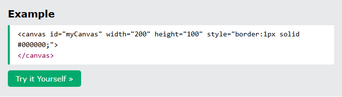
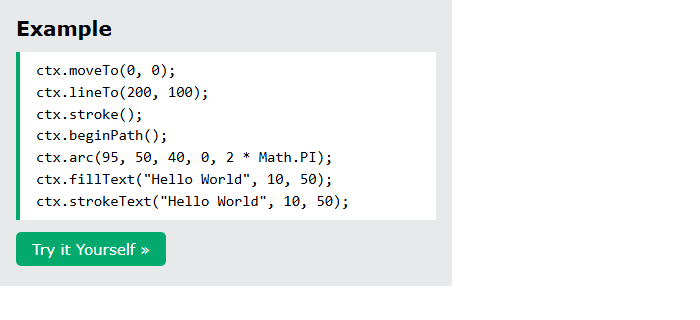
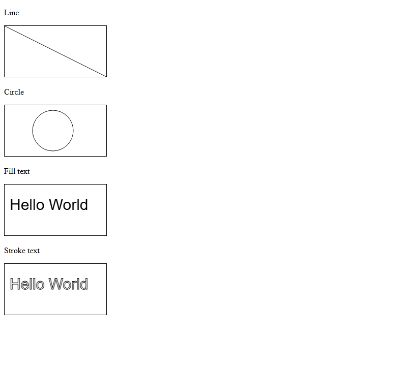
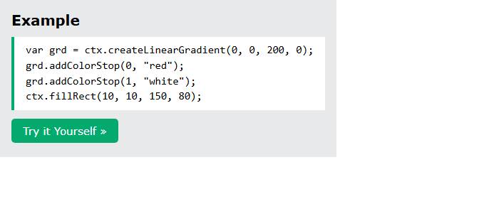
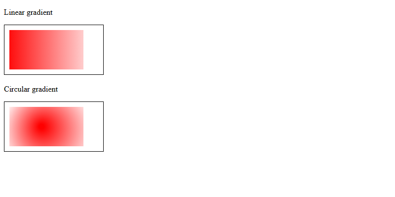
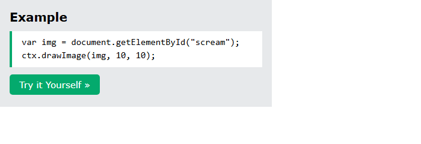
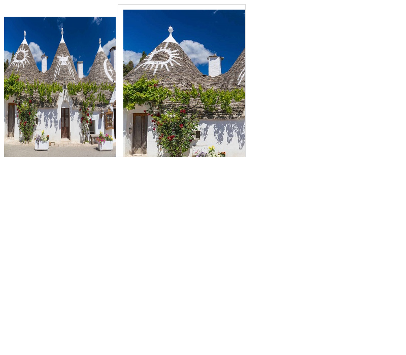

# HTML Canvas

[Back to HTML Tutorial](../tutorial_main.md)

## Introduction

The HTML **`<canvas>`** element is a **container** for graphics drawn **on the fly with JavaScript**. This chapter shows an empty canvas, a **line**, a **circle**, **fill/stroke text**, **linear and radial gradients**, and **`drawImage`**. Canvas is supported by all major browsers.

This section has **4** examples:

- [x] **Example 1:** Empty canvas [View](#html-canvas-example-01)
- [x] **Example 2:** Shapes [View](#html-canvas-example-02)
- [x] **Example 3:** Gradients [View](#html-canvas-example-03)
- [x] **Example 4:** Image [View](#html-canvas-example-04)

## Detailed Explanation

- [x] More in the **HTML Canvas Tutorial**.

<a id="html-canvas-example-01"></a>

### **Example 1: Empty canvas**

- [x] **What canvas is**
  - Draw paths, boxes, circles, text, and images with JS.
  - Markup: `<canvas id="myCanvas" width="200" height="100"></canvas>`.
  - Always set **`id`**, **`width`**, and **`height`**. Add a border with **`style`**. Default: no border, no content.

Sandbox: `code_sandbox/html-canvas/index.html`

```html
<canvas
  id="myCanvas"
  width="200"
  height="100"
  style="border:1px solid #000000;"
>
</canvas>
```




- [x] **Outcome:** the page demonstrates **Empty canvas** as shown in the result snap.

<a id="html-canvas-example-02"></a>

### **Example 2: Shapes**

- [x] **JavaScript drawing** — `getElementById` → `getContext("2d")`.
  - **Line:** `moveTo(0, 0); lineTo(200, 100); stroke();`
  - **Circle:** `beginPath(); arc(95, 50, 40, 0, 2 * Math.PI); stroke();`
  - **Fill text:** `font = "30px Arial"; fillText("Hello World", 10, 50);`
  - **Stroke text:** `strokeText("Hello World", 10, 50);`
  - Sandbox: `shapes.html`.

Sandbox: `code_sandbox/html-canvas/shapes.html`

```javascript
ctx.moveTo(0, 0);
ctx.lineTo(200, 100);
ctx.stroke();
ctx.beginPath();
ctx.arc(95, 50, 40, 0, 2 * Math.PI);
ctx.fillText("Hello World", 10, 50);
ctx.strokeText("Hello World", 10, 50);
```





- [x] **Outcome:** the browser shows **ctx.moveTo(0, 0); ctx.lineTo(200, 100); ctx.stroke(); ctx.beginPath(); ctx.arc(95, 50, 40, 0, 2 \* Math.PI); ctx.fillText("Hello World", 10, 50); ctx.strokeText("Hello World", 10, 50);**.

<a id="html-canvas-example-03"></a>

### **Example 3: Gradients**

- [x] **Gradients**
  - Linear: `createLinearGradient(0, 0, 200, 0)` red → white, then `fillRect(10, 10, 150, 80)`.
  - Circular: `createRadialGradient(75, 50, 5, 90, 60, 100)`.
  - Sandbox: `gradient.html`.

Sandbox: `code_sandbox/html-canvas/gradient.html`

```javascript
var grd = ctx.createLinearGradient(0, 0, 200, 0);
grd.addColorStop(0, "red");
grd.addColorStop(1, "white");
ctx.fillRect(10, 10, 150, 80);
```





- [x] **Outcome:** the browser shows **var grd = ctx.createLinearGradient(0, 0, 200, 0); grd.addColorStop(0, "red"); grd.addColorStop(1, "white"); ctx.fillRect(10, 10, 150, 80);**.

<a id="html-canvas-example-04"></a>

### **Example 4: Image**

- [x] **Draw image**
  - `ctx.drawImage(img, 10, 10)` after reading an ``.
  - The page script assumes the image is already loaded. The sandbox uses **`window.onload`** so `drawImage` runs after the file is ready (current browsers; otherwise the canvas can stay blank).
  - Sandbox: `image.html` (local `picture.jpg` stands in for W3Schools’ The Scream).

Sandbox: `code_sandbox/html-canvas/image.html`

```javascript
var img = document.getElementById("scream");
ctx.drawImage(img, 10, 10);
```





- [x] **Outcome:** the browser shows **var img = document.getElementById("scream"); ctx.drawImage(img, 10, 10);**.

<details>
  <summary>Terminal Commands</summary>

## Terminal Commands

```bash
# from Personal/Files/html/code_sandbox
python -m http.server 8766 --bind 127.0.0.1
```

Then open `http://127.0.0.1:8766/html-canvas/`.

</details>

<details>
  <summary>Questions and Answers</summary>

## Questions and Answers

### Question 1: Does `<canvas>` draw by itself?

<details>
<summary>Answer</summary>

- [x] **No.** It is only a **container**.
- [x] You draw with **JavaScript**.

</details>

### Question 2: Which attributes should you always set?

<details>
<summary>Answer</summary>

- [x] **`id`** (for the script), **`width`**, and **`height`**.

</details>

### Question 3: How do you start drawing?

<details>
<summary>Answer</summary>

- [x] `document.getElementById("myCanvas")`.
- [x] `getContext("2d")`.

</details>

### Question 4: How do you draw a circle?

<details>
<summary>Answer</summary>

- [x] `beginPath()` then `arc(x, y, r, 0, 2 * Math.PI)` then `stroke()` (or fill).

</details>

### Question 5: `fillText` vs `strokeText`?

<details>
<summary>Answer</summary>

- [x] `fillText` — solid glyphs.
- [x] `strokeText` — outlined glyphs.

</details>

### Question 6: Linear vs radial gradient?

<details>
<summary>Answer</summary>

- [x] `createLinearGradient` — along a line.
- [x] `createRadialGradient` — from one circle to another.
- [x] `addColorStop` then `fillStyle` + `fillRect`.

</details>

### Question 7: Why might `drawImage` show a blank canvas?

<details>
<summary>Answer</summary>

- [x] The image may **not have loaded** yet.
- [x] Wait for **`load` / `window.onload`** before drawing.

</details>

</details>

## Summary

Canvas is a JS drawing surface. Set id, width, and height; get a 2D context; then stroke paths, arcs, text, gradients, or images. Wait for images to load before `drawImage`.

## References

- [HTML Canvas Graphics (W3Schools)](https://www.w3schools.com/html/html5_canvas.asp)
- [HTML Canvas Tutorial](https://www.w3schools.com/graphics/canvas_intro.asp)
- [MDN: `<canvas>`](https://developer.mozilla.org/en-US/docs/Web/HTML/Element/canvas)
- [MDN: Canvas API](https://developer.mozilla.org/en-US/docs/Web/API/Canvas_API)
