# HTML Classes

[Back to HTML Tutorial](../tutorial_main.md)

## Introduction

The HTML **`class`** attribute names a class for an element. **Multiple elements can share** the same class. CSS uses a **period** plus the class name (`.city`) to style them; JavaScript can select them with **`getElementsByClassName()`**.

This section has **6** examples:

- [x] **Example 1:** Shared `.city` boxes [View](#html-classes-example-01)
- [x] **Example 2:** `.note` spans [View](#html-classes-example-02)
- [x] **Example 3:** Class syntax [View](#html-classes-example-03)
- [x] **Example 4:** Multiple classes [View](#html-classes-example-04)
- [x] **Example 5:** Shared class on different tags [View](#html-classes-example-05)
- [x] **Example 6:** JavaScript [View](#html-classes-example-06)

## Detailed Explanation

- [x] **Tips from the page**
  - The `class` attribute can be used on **any HTML element**.
  - The class name is **case sensitive**.
- [x] **Chapter summary from the page**
  - `class` specifies **one or more** class names.
  - CSS and JavaScript **select** elements by class.
  - Usable on **any** element; **case sensitive**; different tags can share a class; JS uses **`getElementsByClassName()`**.

<a id="html-classes-example-01"></a>

### **Example 1: Shared `.city` boxes**

- [x] **The `class` attribute**
  - Specifies a **class** for an HTML element.
  - Often points to a **class name in a style sheet**.
  - JavaScript can also **access and manipulate** elements with that class name.
  - Example: three `<div class="city">` boxes (London, Paris, Tokyo) share `.city` — tomato background, white text, black border, margin and padding.

Sandbox: `code_sandbox/html-classes/index.html`

```html
<style>
  .city {
    background-color: tomato;
    color: white;
    border: 2px solid black;
    margin: 20px;
    padding: 20px;
  }
</style>
<div class="city">
  <h2>London</h2>
  <p>London is the capital of England.</p>
</div>
```

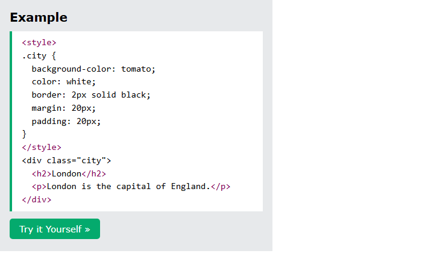

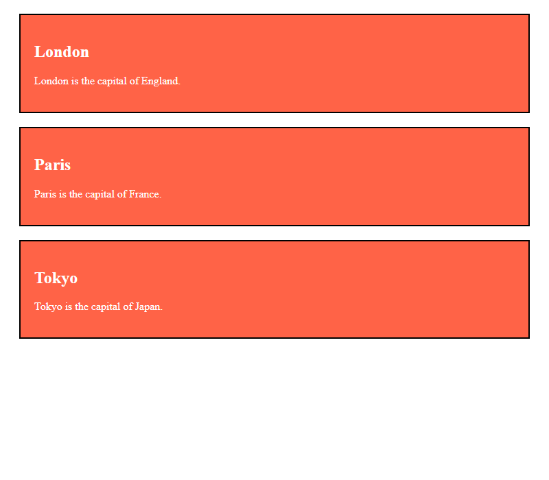

- [x] **Outcome:** the browser shows **.city { background-color: tomato; color: white; border: 2px solid black; margin: 20px; padding: 20px; } London**, **London is the capital of England.**.

<a id="html-classes-example-02"></a>

### **Example 2: `.note` spans**

- [x] **Same class on `<span>`**
  - Two `<span class="note">` elements share `.note` (`font-size: 120%`, `color: red`).
  - Example: **Important** in the heading and **important** in the paragraph.
  - Sandbox: `note.html`.

Sandbox: `code_sandbox/html-classes/note.html`

```html
<h1>My <span class="note">Important</span> Heading</h1>
<p>This is some <span class="note">important</span> text.</p>
```

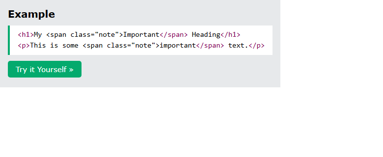


- [x] **Outcome:** the browser shows **My Important Heading**, **This is some important text.**.

<a id="html-classes-example-03"></a>

### **Example 3: Class syntax**

- [x] **Syntax for a class**
  - Write a **period (`.`)** then the class name, then CSS in **curly braces**.
  - Example: `.city { background-color: tomato; color: white; padding: 10px; }` on three `<h2 class="city">` headings.
  - Sandbox: `syntax.html`.

Sandbox: `code_sandbox/html-classes/syntax.html`

```css
.city {
  background-color: tomato;
  color: white;
  padding: 10px;
}
```

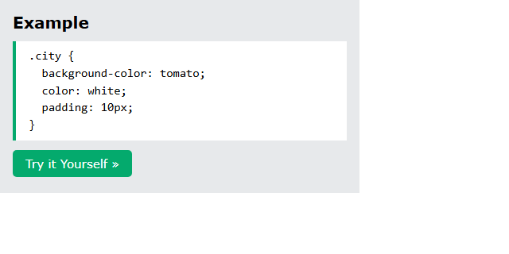

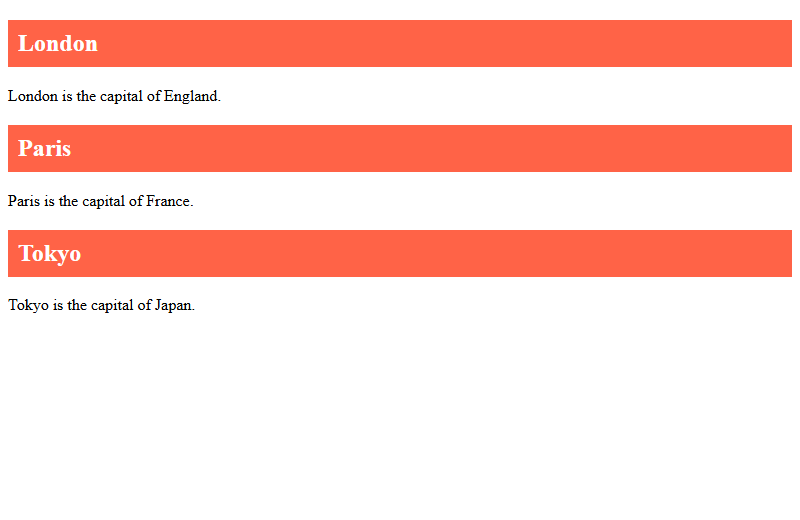

- [x] **Outcome:** the browser shows **.city { background-color: tomato; color: white; padding: 10px; }**.

<a id="html-classes-example-04"></a>

### **Example 4: Multiple classes**

- [x] **Multiple classes**
  - An element can belong to **more than one** class.
  - Separate names with a **space**: `<div class="city main">`.
  - The element gets styles from **all** listed classes.
  - Example: London has `city main` (centered); Paris and Tokyo have only `city`.
  - Sandbox: `multiple.html`.

Sandbox: `code_sandbox/html-classes/multiple.html`

```html
<h2 class="city main">London</h2>
<h2 class="city">Paris</h2>
<h2 class="city">Tokyo</h2>
```

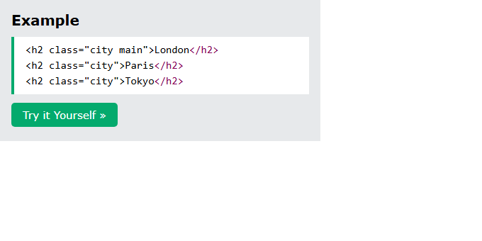

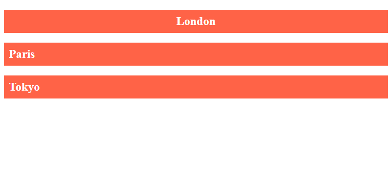

- [x] **Outcome:** the browser shows **London**, **Paris**, **Tokyo**.

<a id="html-classes-example-05"></a>

### **Example 5: Shared class on different tags**

- [x] **Different elements can share the same class**
  - Example: `<h2>` and `<p>` both use `class="city"` and share the style.
  - Sandbox: `share.html`.

Sandbox: `code_sandbox/html-classes/share.html`

```html
<h2 class="city">Paris</h2>
<p class="city">Paris is the capital of France</p>
```

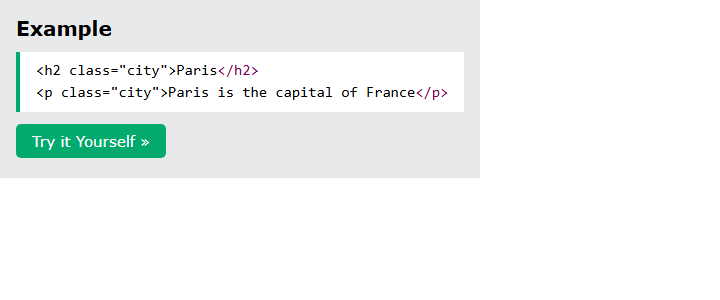

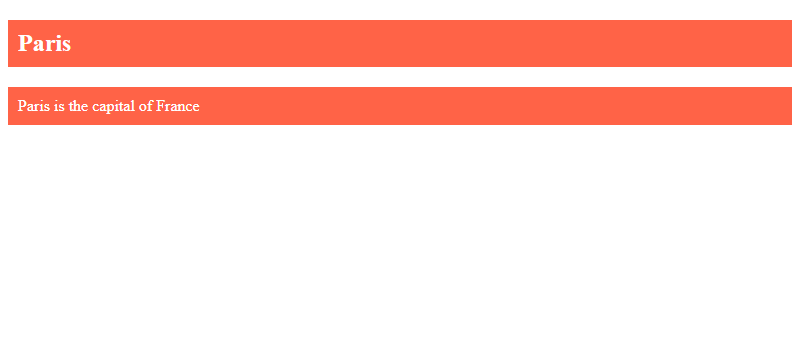

- [x] **Outcome:** the browser shows **Paris**, **Paris is the capital of France**.

<a id="html-classes-example-06"></a>

### **Example 6: JavaScript**

- [x] **JavaScript and classes**
  - `document.getElementsByClassName("city")` returns those elements.
  - Example: a button hides every `.city` (`display: none` in a loop).
  - Sandbox: `js.html`. More JavaScript is in a later chapter.

Sandbox: `code_sandbox/html-classes/js.html`

```html
<script>
  function myFunction() {
    var x = document.getElementsByClassName("city");
    for (var i = 0; i < x.length; i++) {
      x[i].style.display = "none";
    }
  }
</script>
```

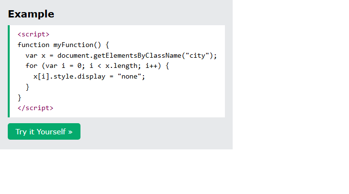

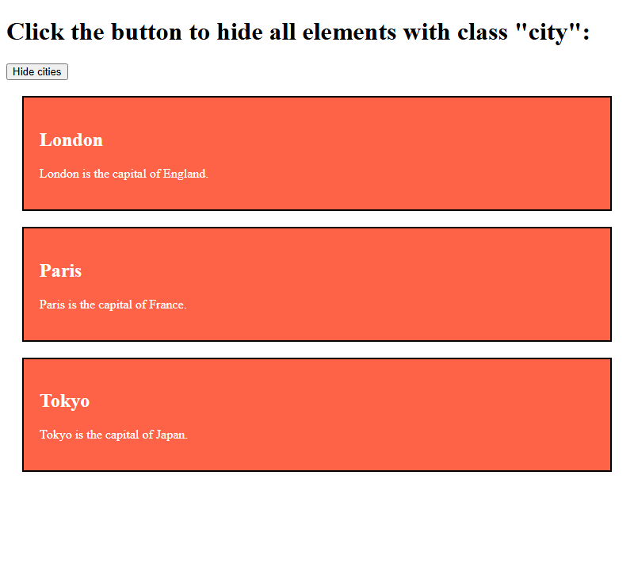

- [x] **Outcome:** the browser shows **function myFunction() { var x = document.getElementsByClassName("city"); for (var i = 0; i**.

<details>
  <summary>Terminal Commands</summary>

## Terminal Commands

```bash
# from Personal/Files/html/code_sandbox
python -m http.server 8766 --bind 127.0.0.1
```

Then open `http://127.0.0.1:8766/html-classes/`.

</details>

<details>
  <summary>Questions and Answers</summary>

## Questions and Answers

### Question 1: What does the HTML `class` attribute do?

<details>
<summary>Answer</summary>

- [x] Specifies a **class** for an element.
- [x] **Multiple** elements can share the same class.

</details>

### Question 2: How do you write a CSS class selector?

<details>
<summary>Answer</summary>

- [x] A **period (`.`)** then the class name.
- [x] Then properties inside **curly braces** `{}`.

</details>

### Question 3: Can you put `class` on any HTML element, and is the name case sensitive?

<details>
<summary>Answer</summary>

- [x] **Yes**, it can be used on any HTML element.
- [x] The class name is **case sensitive**.

</details>

### Question 4: How do you assign multiple classes to one element?

<details>
<summary>Answer</summary>

- [x] Separate class names with a **space**.
- [x] Example: `<div class="city main">`.
- [x] The element gets styles from **all** of those classes.

</details>

### Question 5: Can different tags share one class name?

<details>
<summary>Answer</summary>

- [x] **Yes.** Example: `<h2>` and `<p>` both with `class="city"`.

</details>

### Question 6: How does JavaScript select elements by class in this chapter?

<details>
<summary>Answer</summary>

- [x] **`document.getElementsByClassName("city")`**.
- [x] Then loop and change each element (example: `display = "none"`).

</details>

</details>

## Summary

`class` names one or more classes on any element (case sensitive). CSS targets them with `.classname`. Several elements — even different tags — can share a class; one element can have several classes separated by spaces. JavaScript uses `getElementsByClassName()` to find those elements.

## References

- [HTML class Attribute (W3Schools)](https://www.w3schools.com/html/html_classes.asp)
- [Try it Yourself: tryhtml_classes_capitals](https://www.w3schools.com/html/tryit.asp?filename=tryhtml_classes_capitals)
- [Try it Yourself: tryhtml_classes_span](https://www.w3schools.com/html/tryit.asp?filename=tryhtml_classes_span)
- [Try it Yourself: tryhtml_classes_css](https://www.w3schools.com/html/tryit.asp?filename=tryhtml_classes_css)
- [Try it Yourself: tryhtml_classes_multiple](https://www.w3schools.com/html/tryit.asp?filename=tryhtml_classes_multiple)
- [Try it Yourself: tryhtml_classes_tags](https://www.w3schools.com/html/tryit.asp?filename=tryhtml_classes_tags)
- [Try it Yourself: tryhtml_classes_js](https://www.w3schools.com/html/tryit.asp?filename=tryhtml_classes_js)
- [CSS Tutorial](https://www.w3schools.com/css/default.asp)
- [HTML JavaScript](https://www.w3schools.com/html/html_scripts.asp)
- [MDN: class](https://developer.mozilla.org/en-US/docs/Web/HTML/Global_attributes/class)
- [MDN: `getElementsByClassName()`](https://developer.mozilla.org/en-US/docs/Web/API/Document/getElementsByClassName)
