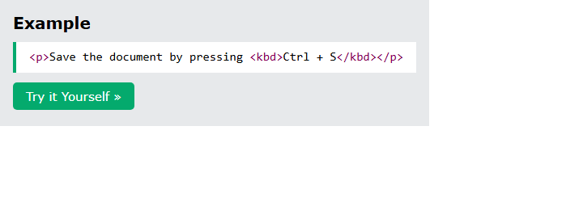
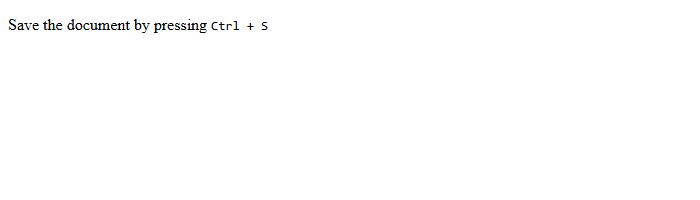
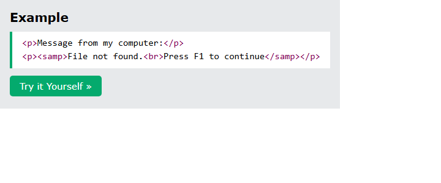
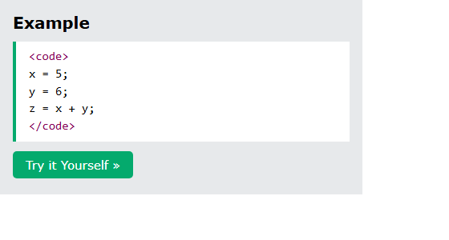
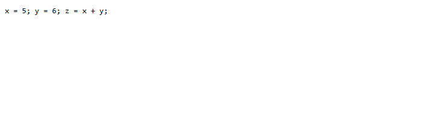
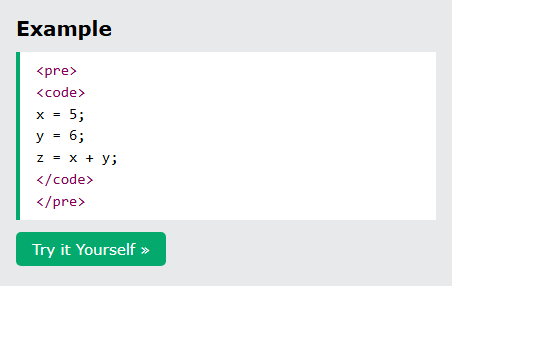
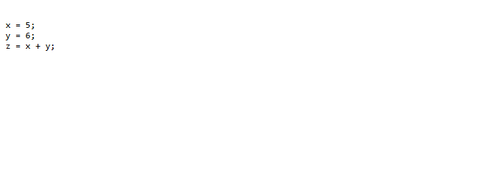
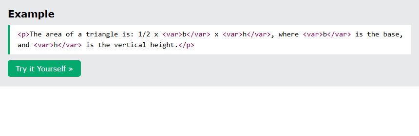
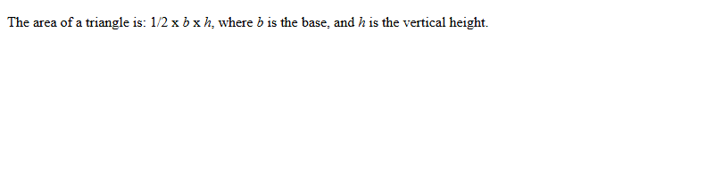

# HTML Computercode

[Back to HTML Tutorial](../tutorial_main.md)

## Introduction

HTML has elements for **user input and computer code**: `<kbd>`, `<samp>`, `<code>`, `<var>`, and `<pre>`. `<kbd>`, `<samp>`, and `<code>` use the browser’s **monospace** font. `<code>` does **not** keep extra whitespace; wrap it in `<pre>` to preserve line breaks.

This section has **5** examples:

- [x] **Example 1:** `<kbd>` [View](#html-computercode-example-01)
- [x] **Example 2:** `<samp>` [View](#html-computercode-example-02)
- [x] **Example 3:** `<code>` [View](#html-computercode-example-03)
- [x] **Example 4:** `<pre><code>` [View](#html-computercode-example-04)
- [x] **Example 5:** `<var>` [View](#html-computercode-example-05)

## Detailed Explanation

<a id="html-computercode-example-01"></a>

### **Example 1: `<kbd>`**

- [x] **`<kbd>` — keyboard input**
  - Example: Save the document by pressing **Ctrl + S**.

Sandbox: `code_sandbox/html-computercode/index.html`

```html
<p>Save the document by pressing <kbd>Ctrl + S</kbd></p>
```





- [x] **Outcome:** the browser shows **Save the document by pressing Ctrl + S**.

<a id="html-computercode-example-02"></a>

### **Example 2: `<samp>`**

- [x] **`<samp>` — program output**
  - Example: **File not found. Press F1 to continue**.
  - Sandbox: `samp.html`.

Sandbox: `code_sandbox/html-computercode/samp.html`

```html
<p>
  <samp>File not found.<br />Press F1 to continue</samp>
</p>
```




- [x] **Outcome:** the browser shows **File not found. Press F1 to continue**.

<a id="html-computercode-example-03"></a>

### **Example 3: `<code>`**

- [x] **`<code>` — computer code**
  - Example: `x = 5; y = 6; z = x + y;` (newlines **collapse**).
  - Sandbox: `code.html`.

Sandbox: `code_sandbox/html-computercode/code.html`

```html
<code> x = 5; y = 6; z = x + y; </code>
```





- [x] **Outcome:** the browser shows **x = 5; y = 6; z = x + y;**.

<a id="html-computercode-example-04"></a>

### **Example 4: `<pre><code>`**

- [x] **Preserve line-breaks with `<pre>`**
  - Put `<code>` inside `<pre>` to keep whitespace and line breaks.
  - Sandbox: `pre.html`.

Sandbox: `code_sandbox/html-computercode/pre.html`

```html
<pre>
<code>
x = 5;
y = 6;
z = x + y;
</code>
</pre>
```





- [x] **Outcome:** the browser shows **x = 5; y = 6; z = x + y;**.

<a id="html-computercode-example-05"></a>

### **Example 5: `<var>`**

- [x] **`<var>` — variables**
  - Programming or math. Typically **italic**.
  - Example: area of a triangle 1/2 × **b** × **h**.
  - Sandbox: `var.html`.
    | Tag | Description |
    | -------- | ----------------- |
    | `<code>` | Programming code |
    | `<kbd>` | Keyboard input |
    | `<samp>` | Computer output |
    | `<var>` | A variable |
    | `<pre>` | Preformatted text |

Sandbox: `code_sandbox/html-computercode/var.html`

```html
<p>
  The area of a triangle is: 1/2 x <var>b</var> x <var>h</var>, where
  <var>b</var> is the base, and <var>h</var> is the vertical height.
</p>
```





- [x] **Outcome:** the browser shows **The area of a triangle is: 1/2 x b x h , where b is the base, and h is the vertical height.**.

<details>
  <summary>Terminal Commands</summary>

## Terminal Commands

```bash
# from Personal/Files/html/code_sandbox
python -m http.server 8766 --bind 127.0.0.1
```

Then open `http://127.0.0.1:8766/html-computercode/`.

</details>

<details>
  <summary>Questions and Answers</summary>

## Questions and Answers

### Question 1: What is `<kbd>` for?

<details>
<summary>Answer</summary>

- [x] **Keyboard input**.
- [x] Displayed in the default **monospace** font.

</details>

### Question 2: What is `<samp>` for?

<details>
<summary>Answer</summary>

- [x] **Sample output** from a computer program.
- [x] Also monospace.

</details>

### Question 3: Why wrap `<code>` in `<pre>`?

<details>
<summary>Answer</summary>

- [x] `<code>` does **not** keep extra whitespace or line-breaks.
- [x] `<pre>` **preserves** them.

</details>

### Question 4: What is `<var>` for, and how does it usually look?

<details>
<summary>Answer</summary>

- [x] A **variable** in programming or math.
- [x] Typically displayed in **italic**.

</details>

</details>

## Summary

Use `<kbd>` for keys, `<samp>` for program output, `<code>` for snippets, and `<var>` for variables. Wrap `<code>` in `<pre>` when you need the original line breaks.

## References

- [HTML Computer Code Elements (W3Schools)](https://www.w3schools.com/html/html_computercode_elements.asp)
- [Try it Yourself: tryhtml_formatting_intro3](https://www.w3schools.com/html/tryit.asp?filename=tryhtml_formatting_intro3)
- [Try it Yourself: tryhtml_formatting_kbd](https://www.w3schools.com/html/tryit.asp?filename=tryhtml_formatting_kbd)
- [Try it Yourself: tryhtml_formatting_samp](https://www.w3schools.com/html/tryit.asp?filename=tryhtml_formatting_samp)
- [Try it Yourself: tryhtml_formatting_code](https://www.w3schools.com/html/tryit.asp?filename=tryhtml_formatting_code)
- [Try it Yourself: tryhtml_formatting_codepre](https://www.w3schools.com/html/tryit.asp?filename=tryhtml_formatting_codepre)
- [Try it Yourself: tryhtml_formatting_var](https://www.w3schools.com/html/tryit.asp?filename=tryhtml_formatting_var)
- [MDN: `<code>`](https://developer.mozilla.org/en-US/docs/Web/HTML/Element/code)
- [MDN: `<pre>`](https://developer.mozilla.org/en-US/docs/Web/HTML/Element/pre)
