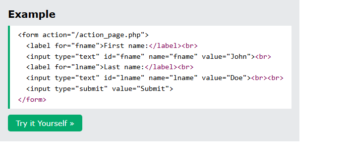
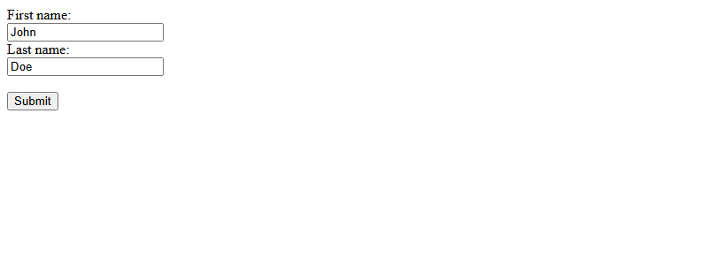
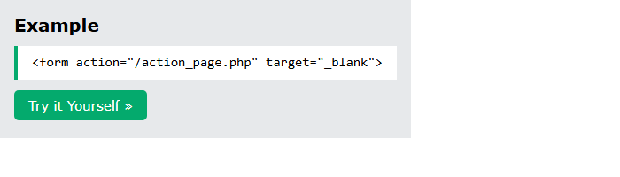
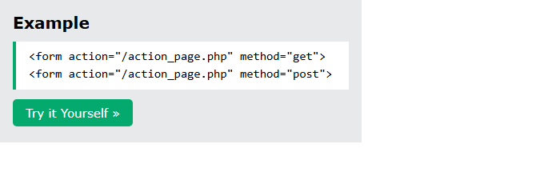
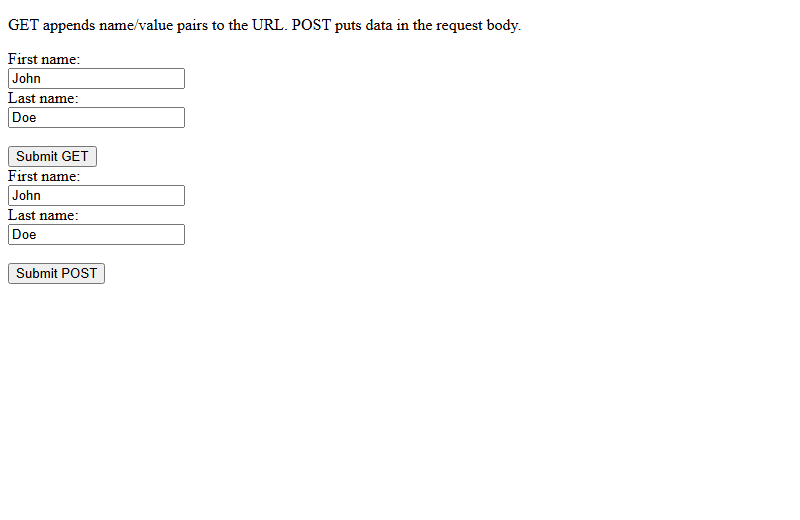
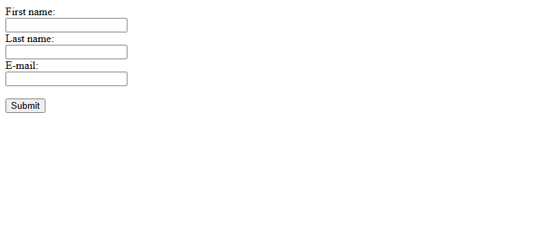
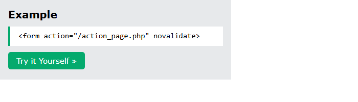

# HTML Form Attributes

[Back to HTML Tutorial](../tutorial_main.md)

## Introduction

This chapter covers attributes of **`<form>`**: **`action`**, **`target`**, **`method`** (GET vs POST), **`autocomplete`**, and **`novalidate`**, plus a short list of the other form attributes.

This section has **5** examples:

- [x] **Example 1:** `action` [View](#html-form-attributes-example-01)
- [x] **Example 2:** `target` [View](#html-form-attributes-example-02)
- [x] **Example 3:** `method` [View](#html-form-attributes-example-03)
- [x] **Example 4:** `autocomplete` [View](#html-form-attributes-example-04)
- [x] **Example 5:** `novalidate` [View](#html-form-attributes-example-05)

## Detailed Explanation

- [x] **All `<form>` attributes** (from the page)

| Attribute        | Description                               |
| ---------------- | ----------------------------------------- |
| `accept-charset` | Character encodings for submission        |
| `action`         | Where to send the form-data               |
| `autocomplete`   | Autocomplete on or off                    |
| `enctype`        | How to encode data (`method="post"` only) |
| `method`         | HTTP method                               |
| `name`           | Name of the form                          |
| `novalidate`     | Skip validation on submit                 |
| `rel`            | Relationship to a linked resource         |
| `target`         | Where to display the response             |

<a id="html-form-attributes-example-01"></a>

### **Example 1: `action`**

- [x] **`action`**
  - What to do when the form is **submitted**. Usually a **server file** that handles the data.
  - Example: `action="/action_page.php"` with John / Doe.
  - **Tip:** If `action` is omitted, it is the **current page**.

Sandbox: `code_sandbox/html-form-attributes/index.html`

```html
<form action="/action_page.php">
  <label for="fname">First name:</label><br />
  <input type="text" id="fname" name="fname" value="John" /><br />
  <label for="lname">Last name:</label><br />
  <input type="text" id="lname" name="lname" value="Doe" /><br /><br />
  <input type="submit" value="Submit" />
</form>
```





- [x] **Outcome:** the browser shows **First name: Last name:**.

<a id="html-form-attributes-example-02"></a>

### **Example 2: `target`**

- [x] **`target`** — where to show the response
      | Value | Description |
      | ----------- | ------------------------------ |
      | `_blank` | New window or tab |
      | `_self` | Current window (**default**) |
      | `_parent` | Parent frame |
      | `_top` | Full body of the window |
      | `framename` | A named iframe |
  - Example: `target="_blank"`.
  - Sandbox: `target.html`.

Sandbox: `code_sandbox/html-form-attributes/target.html`

```html
<form action="/action_page.php" target="_blank"></form>
```




- [x] **Outcome:** the page demonstrates **`target`** as shown in the result snap.

<a id="html-form-attributes-example-03"></a>

### **Example 3: `method`**

- [x] **`method`** — HTTP method (default **GET**)
  - **GET:** data appended to the **URL** as name/value pairs. Visible in the address bar. URL length limit (~**2048** characters). Can be **bookmarked**. Never use GET for **sensitive** data. Good for search-style queries.
  - **POST:** data in the **HTTP request body**, not in the URL. **No size limit**. Cannot bookmark the submission.
  - **Tip:** Always use **POST** for sensitive or personal information.
  - The page uses `action="/action_page.php"`. The sandbox GET/POST demo uses `action=""` so Submit GET shows `?fname=John&lname=Doe` locally.
  - Sandbox: `method.html`.

Sandbox: `code_sandbox/html-form-attributes/method.html`

```html
<form action="/action_page.php" method="get">
  <form action="/action_page.php" method="post"></form>
</form>
```





- [x] **Outcome:** the page demonstrates **`method`** as shown in the result snap.

<a id="html-form-attributes-example-04"></a>

### **Example 4: `autocomplete`**

- [x] **`autocomplete`**
  - `on` or `off` for the whole form. `on` fills values the user entered before.
  - A field can override: `autocomplete="off"` on the email input.
  - Sandbox: `autocomplete.html`.

Sandbox: `code_sandbox/html-form-attributes/autocomplete.html`

```html
<form action="/action_page.php" autocomplete="on"></form>
```




- [x] **Outcome:** the page demonstrates **`autocomplete`** as shown in the result snap.

<a id="html-form-attributes-example-05"></a>

### **Example 5: `novalidate`**

- [x] **`novalidate`**
  - Boolean. When present, the browser **does not validate** inputs on submit (so an invalid email can still submit).
  - Sandbox: `novalidate.html`.

Sandbox: `code_sandbox/html-form-attributes/novalidate.html`

```html
<form action="/action_page.php" novalidate></form>
```




- [x] **Outcome:** the page demonstrates **`novalidate`** as shown in the result snap.

<details>
  <summary>Terminal Commands</summary>

## Terminal Commands

```bash
# from Personal/Files/html/code_sandbox
python -m http.server 8766 --bind 127.0.0.1
```

Then open `http://127.0.0.1:8766/html-form-attributes/`.

</details>

<details>
  <summary>Questions and Answers</summary>

## Questions and Answers

### Question 1: What does `action` do?

<details>
<summary>Answer</summary>

- [x] Sets the **form-handler** (usually a server file).
- [x] If omitted, the action is the **current page**.

</details>

### Question 2: What is the default `target`?

<details>
<summary>Answer</summary>

- [x] **`_self`** — the response opens in the **current window**.
- [x] `_blank` opens a **new tab**.

</details>

### Question 3: What is the default HTTP method for a form?

<details>
<summary>Answer</summary>

- [x] **GET**.

</details>

### Question 4: Why avoid GET for passwords?

<details>
<summary>Answer</summary>

- [x] GET puts data in the **URL**, so it is **visible**.
- [x] URLs are also limited (~**2048** characters).

</details>

### Question 5: When should you use POST?

<details>
<summary>Answer</summary>

- [x] For **sensitive or personal** data.
- [x] For **large** payloads (no size limit like GET).
- [x] POST submissions **cannot be bookmarked**.

</details>

### Question 6: What does `autocomplete="on"` do?

<details>
<summary>Answer</summary>

- [x] The browser can **fill values** the user entered before.
- [x] A single input can set `autocomplete="off"` to override.

</details>

### Question 7: What does `novalidate` do?

<details>
<summary>Answer</summary>

- [x] It is a **boolean** attribute.
- [x] When present, the form is **not validated** on submit.

</details>

### Question 8: Which form attribute sets encoding for POST?

<details>
<summary>Answer</summary>

- [x] **`enctype`** — how form-data is encoded (POST only).

</details>

</details>

## Summary

`action` is the handler (current page if omitted). `target` defaults to `_self`. `method` defaults to GET (URL, bookmarkable, not for secrets); use POST for sensitive or large data. `autocomplete` can be on/off; `novalidate` skips checking.

## References

- [HTML Form Attributes (W3Schools)](https://www.w3schools.com/html/html_forms_attributes.asp)
- [HTML Forms](https://www.w3schools.com/html/html_forms.asp)
- [MDN: `<form>`](https://developer.mozilla.org/en-US/docs/Web/HTML/Element/form)
- [MDN: HTTP GET vs POST](https://developer.mozilla.org/en-US/docs/Learn_web_development/Extensions/Forms/Sending_and_retrieving_form_data)
