# HTML Form Elements

[Back to HTML Tutorial](../tutorial_main.md)

## Introduction

This chapter lists every common control you can put in a `<form>`: `<input>`, `<label>`, `<select>` / `<option>` / `<optgroup>`, `<textarea>`, `<button>`, `<fieldset>` / `<legend>`, `<datalist>`, and `<output>`.

This section has **7** examples:

- [x] **Example 1:** Input + select [View](#html-form-elements-example-01)
- [x] **Example 2:** Size / multiple [View](#html-form-elements-example-02)
- [x] **Example 3:** Textarea [View](#html-form-elements-example-03)
- [x] **Example 4:** Button [View](#html-form-elements-example-04)
- [x] **Example 5:** Fieldset [View](#html-form-elements-example-05)
- [x] **Example 6:** Datalist [View](#html-form-elements-example-06)
- [x] **Example 7:** Output [View](#html-form-elements-example-07)

## Detailed Explanation

- [x] **`<form>` can contain** `<input>` `<label>` `<select>` `<textarea>` `<button>` `<fieldset>` `<legend>` `<datalist>` `<output>` `<option>` `<optgroup>`.
- [x] **`<label>`** — `for` must match the control’s `id`. Helps screen readers and makes small radios/checkboxes easier to click.
- [x] **Tag list** from the page: `<form>` form; `<input>` control; `<textarea>` multiline; `<label>` label; `<fieldset>` group; `<legend>` caption; `<select>` drop-down; `<optgroup>` option group; `<option>` option; `<button>` button; `<datalist>` suggestions; `<output>` calculation result.

<a id="html-form-elements-example-01"></a>

### **Example 1: Input + select**

- [x] This example runs the tested markup in `code_sandbox/html-form-elements/index.html`.

Sandbox: `code_sandbox/html-form-elements/index.html`

```html
<label for="fname">First name:</label>
<input type="text" id="fname" name="fname" />
<select id="cars" name="cars">
  <option value="fiat" selected>Fiat</option>
</select>
```

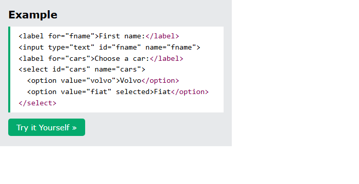

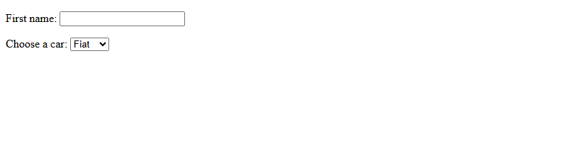

- [x] **Outcome:** the browser shows **First name: Fiat**.

<a id="html-form-elements-example-02"></a>

### **Example 2: Size / multiple**

- [x] **`<select>` / `<option>`**
  - Drop-down. First option is selected unless another has **`selected`**.
  - **`size`** — how many options are visible.
  - **`multiple`** — select more than one.
  - Sandbox: `select.html`.

Sandbox: `code_sandbox/html-form-elements/select.html`

```html
<select id="cars" name="cars" size="3">
  <select id="cars" name="cars" size="4" multiple></select>
</select>
```

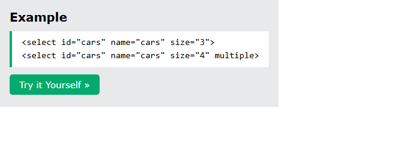

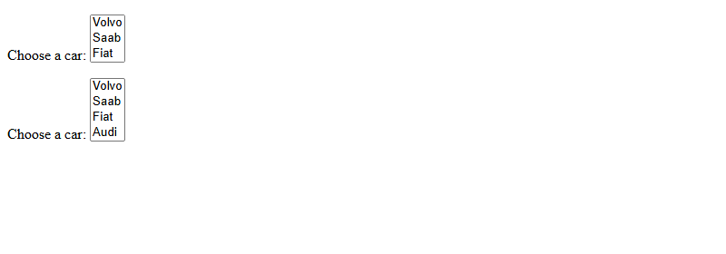

- [x] **Outcome:** the page demonstrates **Size / multiple** as shown in the result snap.

<a id="html-form-elements-example-03"></a>

### **Example 3: Textarea**

- [x] **`<textarea>`**
  - Multi-line field. **`rows`** = visible lines, **`cols`** = visible width.
  - Example text: **The cat was playing in the garden.**
  - Size can also be set with CSS (`width` / `height`).
  - Sandbox: `textarea.html`.

Sandbox: `code_sandbox/html-form-elements/textarea.html`

```html
<textarea name="message" rows="10" cols="30">
The cat was playing in the garden.
</textarea>
```

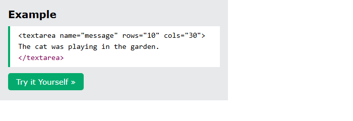

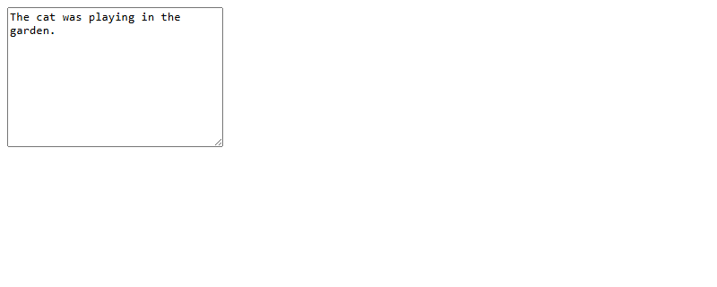

- [x] **Outcome:** the browser shows **The cat was playing in the garden.**.

<a id="html-form-elements-example-04"></a>

### **Example 4: Button**

- [x] **`<button>`**
  - Example: `onclick="alert('Hello World!')"` — **Click Me!**
  - **Always set `type`**. Browsers disagree on the default (`submit` vs `button`).
  - Sandbox: `button.html`.

Sandbox: `code_sandbox/html-form-elements/button.html`

```html
<button type="button" onclick="alert('Hello World!')">Click Me!</button>
```

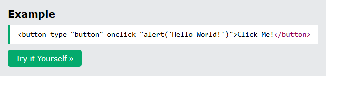


- [x] **Outcome:** the browser shows **Click Me!**.

<a id="html-form-elements-example-05"></a>

### **Example 5: Fieldset**

- [x] **`<fieldset>` and `<legend>`**
  - Group related fields; legend is the caption (**Personalia:**).
  - Sandbox: `fieldset.html`.

Sandbox: `code_sandbox/html-form-elements/fieldset.html`

```html
<fieldset>
  <legend>Personalia:</legend>
  ...
</fieldset>
```

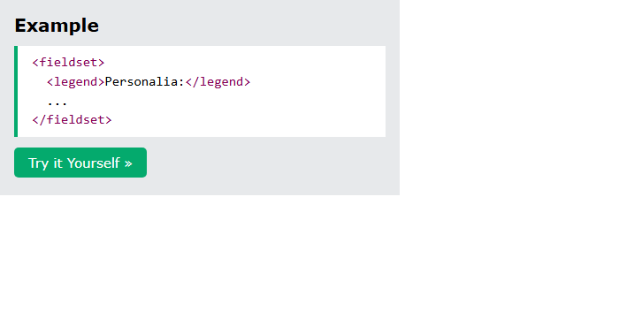

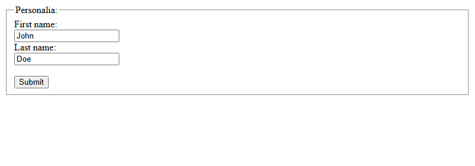

- [x] **Outcome:** the browser shows **Personalia: ...**.

<a id="html-form-elements-example-06"></a>

### **Example 6: Datalist**

- [x] **`<datalist>`**
  - Predefined suggestions. Input **`list`** must match datalist **`id`**.
  - Browsers: Edge, Firefox, Chrome, Opera, Safari.
  - Sandbox: `datalist.html`.

Sandbox: `code_sandbox/html-form-elements/datalist.html`

```html
<input list="browsers" />
<datalist id="browsers">
  <option value="Edge"></option>
</datalist>
```

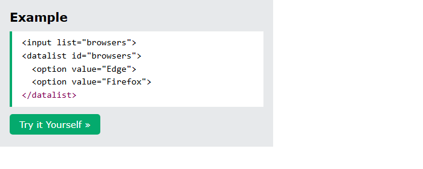


- [x] **Outcome:** the page demonstrates **Datalist** as shown in the result snap.

<a id="html-form-elements-example-07"></a>

### **Example 7: Output**

- [x] **`<output>`**
  - Shows a calculation. `oninput="x.value=parseInt(a.value)+parseInt(b.value)"` — range + number.
  - The sum updates when you move the slider or change the number (starts empty until input).
  - Sandbox: `output.html`.

Sandbox: `code_sandbox/html-form-elements/output.html`

```html
<form oninput="x.value=parseInt(a.value)+parseInt(b.value)">
  0 <input type="range" id="a" name="a" value="50" /> 100 +
  <input type="number" id="b" name="b" value="50" />
  = <output name="x" for="a b"></output>
</form>
```

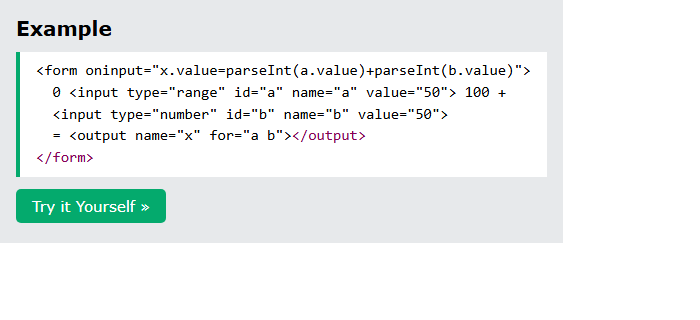

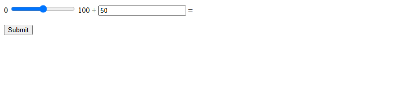

- [x] **Outcome:** the browser shows **0 100 + =**.

<details>
  <summary>Terminal Commands</summary>

## Terminal Commands

```bash
# from Personal/Files/html/code_sandbox
python -m http.server 8766 --bind 127.0.0.1
```

Then open `http://127.0.0.1:8766/html-form-elements/`.

</details>

<details>
  <summary>Questions and Answers</summary>

## Questions and Answers

### Question 1: Which elements can live in a `<form>`?

<details>
<summary>Answer</summary>

- [x] `<input>` `<label>` `<select>` `<textarea>` `<button>` `<fieldset>` `<legend>` `<datalist>` `<output>` `<option>` `<optgroup>`.

</details>

### Question 2: How do you pre-select a drop-down option?

<details>
<summary>Answer</summary>

- [x] Add the **`selected`** attribute on that `<option>`.
- [x] Otherwise the **first** option is selected.

</details>

### Question 3: What do `size` and `multiple` do on `<select>`?

<details>
<summary>Answer</summary>

- [x] `size` — number of **visible** options.
- [x] `multiple` — allow **more than one** selection.

</details>

### Question 4: What do `rows` and `cols` mean on `<textarea>`?

<details>
<summary>Answer</summary>

- [x] `rows` — visible **lines**.
- [x] `cols` — visible **width**.
- [x] You can also size it with **CSS**.

</details>

### Question 5: Why set `type` on `<button>`?

<details>
<summary>Answer</summary>

- [x] Browsers may use **different default types**.
- [x] Always specify `type` (`button`, `submit`, or `reset`).

</details>

### Question 6: What are `<fieldset>` and `<legend>` for?

<details>
<summary>Answer</summary>

- [x] `<fieldset>` **groups** related controls.
- [x] `<legend>` is the **caption** for that group.

</details>

### Question 7: How do you hook an input to a `<datalist>`?

<details>
<summary>Answer</summary>

- [x] Set the input’s **`list`** to the datalist’s **`id`**.

</details>

### Question 8: What does `<output>` show?

<details>
<summary>Answer</summary>

- [x] The **result of a calculation** (often from a script / `oninput`).

</details>

</details>

## Summary

Forms are built from input, label, select/option, textarea, button, fieldset/legend, datalist, and output. Pre-select with `selected`; show more options with `size`/`multiple`. Always set button `type`. Bind datalist with `list`/`id`. Use `<output>` for live totals.

## References

- [HTML Form Elements (W3Schools)](https://www.w3schools.com/html/html_form_elements.asp)
- [HTML Input Types](https://www.w3schools.com/html/html_form_input_types.asp)
- [HTML Tag Reference](https://www.w3schools.com/tags/default.asp)
- [MDN: `<select>`](https://developer.mozilla.org/en-US/docs/Web/HTML/Element/select)
- [MDN: `<datalist>`](https://developer.mozilla.org/en-US/docs/Web/HTML/Element/datalist)
- [MDN: `<output>`](https://developer.mozilla.org/en-US/docs/Web/HTML/Element/output)
