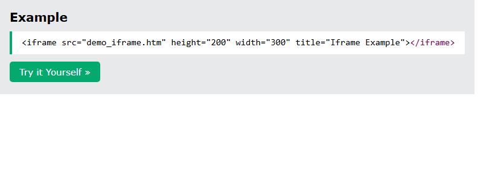
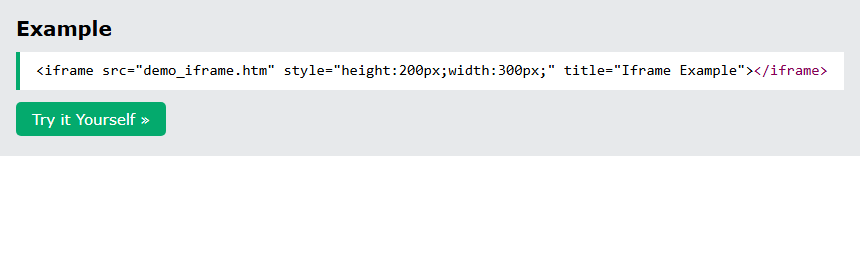
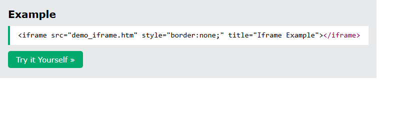
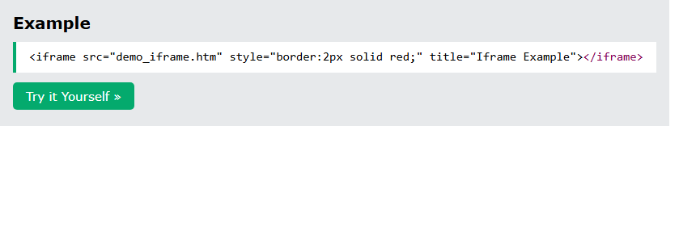
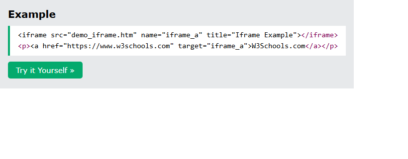

# HTML Iframes

[Back to HTML Tutorial](../tutorial_main.md)

## Introduction

An HTML **iframe** displays a **web page inside a web page**. `<iframe>` is an **inline frame** that embeds another document. This chapter covers **`src`**, **`title`**, **height/width**, **borders**, and using an iframe as a **link target**.

This section has **5** examples:

- [x] **Example 1:** Size attributes [View](#html-iframes-example-01)
- [x] **Example 2:** CSS size [View](#html-iframes-example-02)
- [x] **Example 3:** No border [View](#html-iframes-example-03)
- [x] **Example 4:** Red border [View](#html-iframes-example-04)
- [x] **Example 5:** Target [View](#html-iframes-example-05)

## Detailed Explanation

- [x] **Syntax**
  - `<iframe src="url" title="description"></iframe>`
  - **`src`** is the URL of the page to embed.
  - Always include **`title`** so screen readers can describe the iframe.
  - Local demo page: `demo_iframe.htm` (the W3Schools examples use the same filename).
- [x] **Chapter summary from the page**
  - `<iframe>` = inline frame; **`src`** = URL; always **`title`**; **height/width** set size; **`border:none;`** removes the border.

| Tag        | Description             |
| ---------- | ----------------------- |
| `<iframe>` | Defines an inline frame |

<a id="html-iframes-example-01"></a>

### **Example 1: Size attributes**

- [x] **Height and width**
  - Default unit is **pixels**.
  - Attributes: `height="200" width="300"`.
  - Or CSS: `style="height:200px;width:300px;"`.

Sandbox: `code_sandbox/html-iframes/index.html`

```html
<iframe
  src="demo_iframe.htm"
  height="200"
  width="300"
  title="Iframe Example"
></iframe>
```




- [x] **Outcome:** the page demonstrates **Size attributes** as shown in the result snap.

<a id="html-iframes-example-02"></a>

### **Example 2: CSS size**

- [x] **Height and width**
  - Default unit is **pixels**.
  - Attributes: `height="200" width="300"`.
  - Or CSS: `style="height:200px;width:300px;"`.

Sandbox: `code_sandbox/html-iframes/css-size.html`

```html
<iframe
  src="demo_iframe.htm"
  style="height:200px;width:300px;"
  title="Iframe Example"
></iframe>
```




- [x] **Outcome:** the page demonstrates **CSS size** as shown in the result snap.

<a id="html-iframes-example-03"></a>

### **Example 3: No border**

- [x] **Remove or style the border**
  - An iframe has a **border by default**.
  - Remove it: `style="border:none;"`.
  - Change it: `style="border:2px solid red;"`.
  - Sandbox: `noborder.html` and `redborder.html`.

Sandbox: `code_sandbox/html-iframes/noborder.html`

```html
<iframe
  src="demo_iframe.htm"
  style="border:none;"
  title="Iframe Example"
></iframe>
```




- [x] **Outcome:** the page demonstrates **No border** as shown in the result snap.

<a id="html-iframes-example-04"></a>

### **Example 4: Red border**

- [x] **Remove or style the border**
  - An iframe has a **border by default**.
  - Remove it: `style="border:none;"`.
  - Change it: `style="border:2px solid red;"`.
  - Sandbox: `noborder.html` and `redborder.html`.

Sandbox: `code_sandbox/html-iframes/redborder.html`

```html
<iframe
  src="demo_iframe.htm"
  style="border:2px solid red;"
  title="Iframe Example"
></iframe>
```




- [x] **Outcome:** the page demonstrates **Red border** as shown in the result snap.

<a id="html-iframes-example-05"></a>

### **Example 5: Target**

- [x] **Iframe as a link target**
  - The link’s **`target`** must match the iframe’s **`name`**.
  - Example: `name="iframe_a"` and `<a href="https://www.w3schools.com" target="iframe_a">W3Schools.com</a>`.
  - Sandbox: `target.html`.

Sandbox: `code_sandbox/html-iframes/target.html`

```html
<iframe src="demo_iframe.htm" name="iframe_a" title="Iframe Example"></iframe>
<p><a href="https://www.w3schools.com" target="iframe_a">W3Schools.com</a></p>
```




- [x] **Outcome:** the browser shows **W3Schools.com**.

<details>
  <summary>Terminal Commands</summary>

## Terminal Commands

```bash
# from Personal/Files/html/code_sandbox
python -m http.server 8766 --bind 127.0.0.1
```

Then open `http://127.0.0.1:8766/html-iframes/`.

</details>

<details>
  <summary>Questions and Answers</summary>

## Questions and Answers

### Question 1: What is an HTML iframe for?

<details>
<summary>Answer</summary>

- [x] To display a **web page within a web page**.
- [x] `<iframe>` embeds another document in the current one.

</details>

### Question 2: Which attributes set the page URL and the accessible name?

<details>
<summary>Answer</summary>

- [x] **`src`** — URL to embed.
- [x] **`title`** — description for **screen readers** (always include it).

</details>

### Question 3: How do you set iframe size?

<details>
<summary>Answer</summary>

- [x] `height` and `width` attributes (pixels by default).
- [x] Or CSS `height` and `width` in the **`style`** attribute.

</details>

### Question 4: How do you remove the default iframe border?

<details>
<summary>Answer</summary>

- [x] `style="border:none;"`.

</details>

### Question 5: How do you open a link inside an iframe?

<details>
<summary>Answer</summary>

- [x] Give the iframe a **`name`**.
- [x] Set the link’s **`target`** to that same name.

</details>

</details>

## Summary

`<iframe src="..." title="...">` embeds another document. Set size with `height`/`width` or CSS. Remove the default border with `border:none`, or restyle it. Point a link at the iframe with matching `name` and `target`.

## References

- [HTML Iframes (W3Schools)](https://www.w3schools.com/html/html_iframe.asp)
- [Try it Yourself: tryhtml_iframe_height_width](https://www.w3schools.com/html/tryit.asp?filename=tryhtml_iframe_height_width)
- [Try it Yourself: tryhtml_iframe_height_width_css](https://www.w3schools.com/html/tryit.asp?filename=tryhtml_iframe_height_width_css)
- [Try it Yourself: tryhtml_iframe_frameborder](https://www.w3schools.com/html/tryit.asp?filename=tryhtml_iframe_frameborder)
- [Try it Yourself: tryhtml_iframe_border2](https://www.w3schools.com/html/tryit.asp?filename=tryhtml_iframe_border2)
- [Try it Yourself: tryhtml_iframe_target](https://www.w3schools.com/html/tryit.asp?filename=tryhtml_iframe_target)
- [HTML Tag Reference](https://www.w3schools.com/tags/default.asp)
- [MDN: `<iframe>`](https://developer.mozilla.org/en-US/docs/Web/HTML/Element/iframe)
