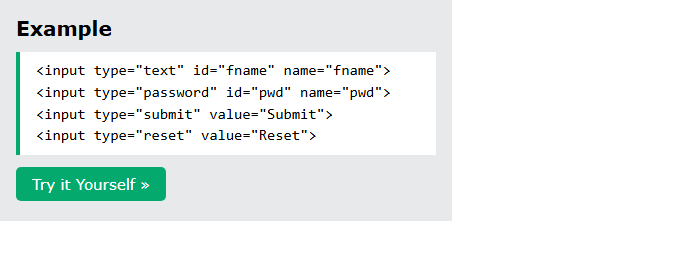
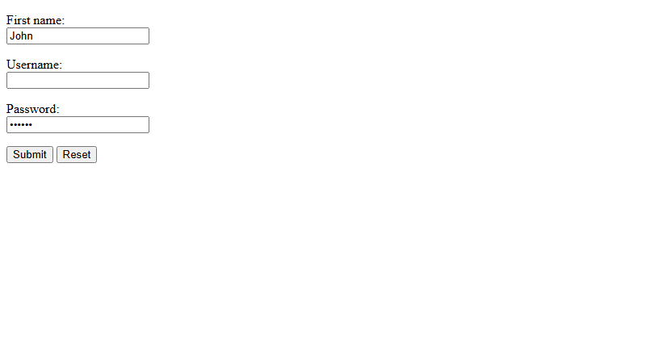
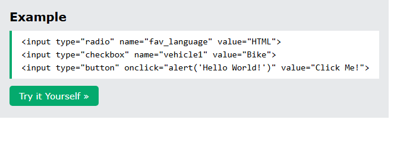
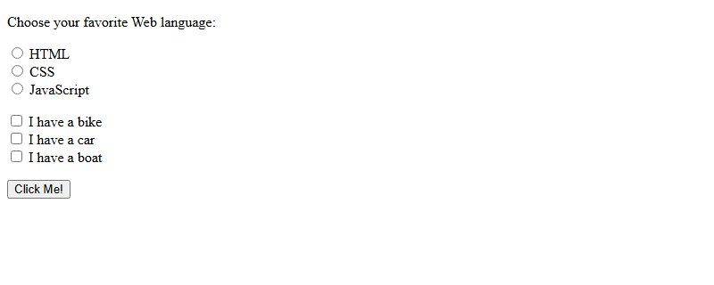
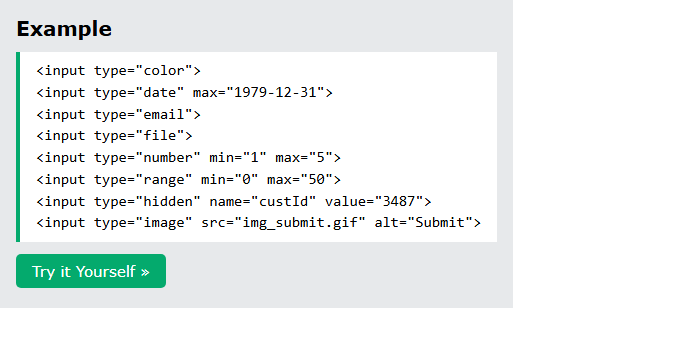
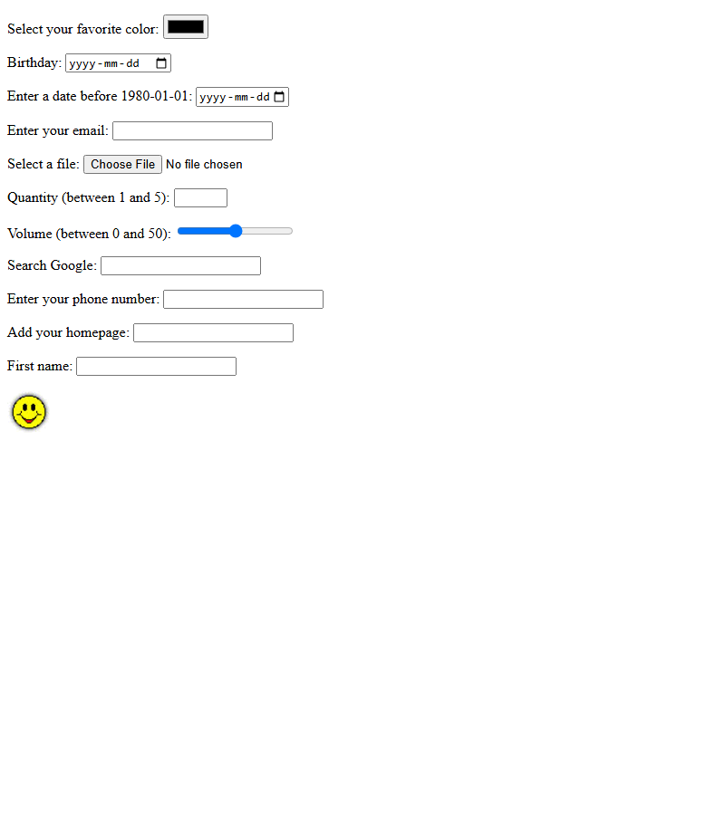
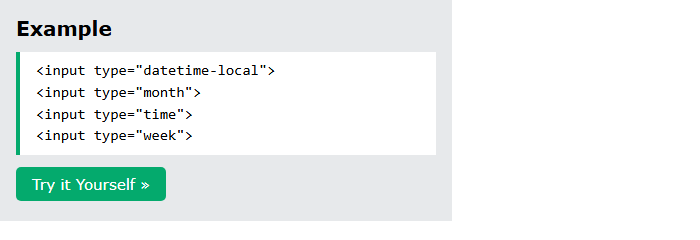
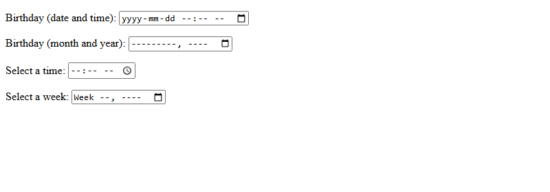

# HTML Input Types

[Back to HTML Tutorial](../tutorial_main.md)

## Introduction

This chapter lists every HTML **`<input type="...">`**. The default type is **`text`**. Many HTML5 types (color, date, email, and so on) show a picker or extra keyboard when the browser supports them.

This section has **4** examples:

- [x] **Example 1:** Text / password / submit / reset [View](#html-input-types-example-01)
- [x] **Example 2:** Choices [View](#html-input-types-example-02)
- [x] **Example 3:** HTML5 types [View](#html-input-types-example-03)
- [x] **Example 4:** Pickers [View](#html-input-types-example-04)

## Detailed Explanation

- [x] **All types:** `button` `checkbox` `color` `date` `datetime-local` `email` `file` `hidden` `image` `month` `number` `password` `radio` `range` `reset` `search` `submit` `tel` `text` `time` `url` `week`.
- [x] **`text`** — single-line field (default).
- [x] **`password`** — characters are **masked** (asterisks or dots).
- [x] **`submit`** — sends data to `action`. If **`value` is omitted**, the button gets **default text**.
- [x] **Input restrictions** (preview of the next chapter): `checked` `disabled` `max` `maxlength` `min` `pattern` `readonly` `required` `size` `step` `value`.

<a id="html-input-types-example-01"></a>

### **Example 1: Text / password / submit / reset**

- [x] **`reset`** — restores **default values**.

Sandbox: `code_sandbox/html-input-types/index.html`

```html
<input type="text" id="fname" name="fname" />
<input type="password" id="pwd" name="pwd" />
<input type="submit" value="Submit" />
<input type="reset" value="Reset" />
```





- [x] **Outcome:** the page demonstrates **Text / password / submit / reset** as shown in the result snap.

<a id="html-input-types-example-02"></a>

### **Example 2: Choices**

- [x] **`radio`** — **ONLY ONE** of a set. **`checkbox`** — **ZERO or MORE**. **`button`** — clickable (`onclick` alert).
  - Sandbox: `choices.html`.

Sandbox: `code_sandbox/html-input-types/choices.html`

```html
<input type="radio" name="fav_language" value="HTML" />
<input type="checkbox" name="vehicle1" value="Bike" />
<input type="button" onclick="alert('Hello World!')" value="Click Me!" />
```





- [x] **Outcome:** the page demonstrates **Choices** as shown in the result snap.

<a id="html-input-types-example-03"></a>

### **Example 3: HTML5 types**

- [x] **HTML5 types** (sandbox: `html5.html`)
  - **`color`** — color picker (if supported).
  - **`date`** — date picker; **`min` / `max`** can restrict (before 1980-01-01 / after 2000-01-01).
  - **`email`** — may validate on submit; phones often add **.com** to the keyboard.
  - **`file`** — Browse for uploads.
  - **`image`** — image used as a **submit** button (`src`, `alt`, width/height).
  - **`number`** — numeric; example **min 1 max 5**. Also `step`/`value` (0–100 step 10, default 30).
  - **`range`** — slider; default 0–100. Example volume 0–50.
  - **`search`** — search field (behaves like text).
  - **`tel`** — telephone; example `pattern="[0-9]{3}-[0-9]{2}-[0-9]{3}"`.
  - **`url`** — URL; may validate; phones may add **.com**.
  - **`hidden`** — not shown. Example `custId=3487`. **Not security** — still visible in View Source / DevTools.

Sandbox: `code_sandbox/html-input-types/html5.html`

```html
<input type="color" />
<input type="date" max="1979-12-31" />
<input type="email" />
<input type="file" />
<input type="number" min="1" max="5" />
<input type="range" min="0" max="50" />
<input type="hidden" name="custId" value="3487" />
<input type="image" src="img_submit.gif" alt="Submit" />
```





- [x] **Outcome:** the browser shows **Submit**.

<a id="html-input-types-example-04"></a>

### **Example 4: Pickers**

- [x] **More pickers** (`pickers.html`): **`datetime-local`** (date+time, no time zone), **`month`**, **`time`**, **`week`**.

Sandbox: `code_sandbox/html-input-types/pickers.html`

```html
<input type="datetime-local" />
<input type="month" />
<input type="time" />
<input type="week" />
```





- [x] **Outcome:** the page demonstrates **Pickers** as shown in the result snap.

<details>
  <summary>Terminal Commands</summary>

## Terminal Commands

```bash
# from Personal/Files/html/code_sandbox
python -m http.server 8766 --bind 127.0.0.1
```

Then open `http://127.0.0.1:8766/html-input-types/`.

</details>

<details>
  <summary>Questions and Answers</summary>

## Questions and Answers

### Question 1: What is the default `type` if you omit it?

<details>
<summary>Answer</summary>

- [x] **`text`**.

</details>

### Question 2: How does `password` differ from `text`?

<details>
<summary>Answer</summary>

- [x] The characters are **masked** (asterisks or circles).

</details>

### Question 3: What if a submit button has no `value`?

<details>
<summary>Answer</summary>

- [x] The button uses the browser’s **default text**.

</details>

### Question 4: Radio vs checkbox?

<details>
<summary>Answer</summary>

- [x] Radio: **only one** of a set.
- [x] Checkbox: **zero or more**.

</details>

### Question 5: Is `type="hidden"` a security feature?

<details>
<summary>Answer</summary>

- [x] **No.** The value is still in the HTML and DevTools.
- [x] Do **not** treat hidden fields as secret.

</details>

### Question 6: What does `type="image"` do?

<details>
<summary>Answer</summary>

- [x] Uses an **image as a submit button**.
- [x] Path is **`src`**; include **`alt`**.

</details>

### Question 7: Which types often show a picker?

<details>
<summary>Answer</summary>

- [x] `color`, `date`, `datetime-local`, `month`, `time`, `week` (browser support varies).

</details>

### Question 8: What do `min`, `max`, and `step` restrict?

<details>
<summary>Answer</summary>

- [x] Allowed numbers (and dates) and the **interval** (`step`).
- [x] Example: number 0–100 step 10, default 30.

</details>

</details>

## Summary

`type` chooses the control. Default is text; password masks; submit/reset/image send or restore; radio vs checkbox; HTML5 adds color, dates, email, file, hidden, number, range, search, tel, url, and week. Hidden is not security. Restrictions such as min/max/pattern are covered next.

## References

- [HTML Input Types (W3Schools)](https://www.w3schools.com/html/html_form_input_types.asp)
- [HTML Input Attributes](https://www.w3schools.com/html/html_form_attributes.asp)
- [MDN: `<input>` types](https://developer.mozilla.org/en-US/docs/Web/HTML/Element/input#input_types)
