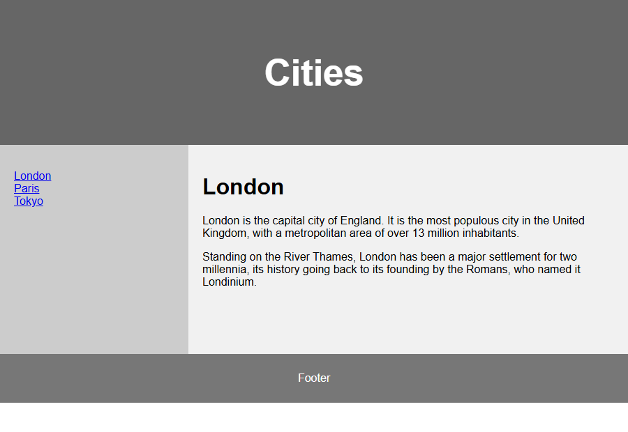
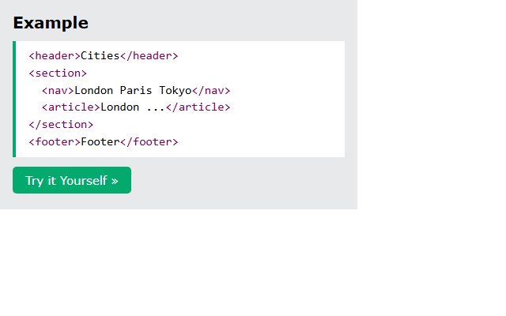
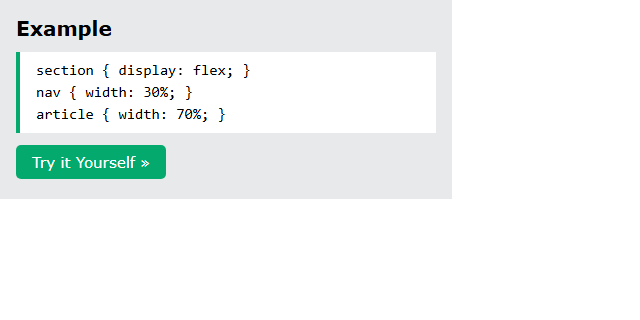
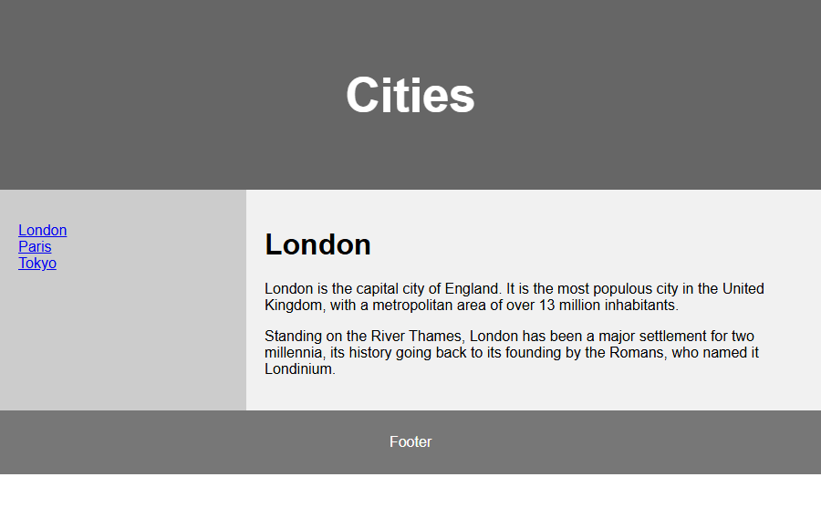

# HTML Layout

[Back to HTML Tutorial](../tutorial_main.md)

## Introduction

Sites often show content in **multiple columns** (magazine/newspaper). HTML has **semantic** layout tags (`<header>`, `<nav>`, `<section>`, `<article>`, `<aside>`, `<footer>`, plus `<details>`/`<summary>`). This chapter also lists four **multicolumn techniques**: CSS **frameworks**, **float**, **flexbox**, and **grid**.

This section has **2** examples:

- [x] **Example 1:** Semantic skeleton (float page `index.html` [View](#html-layout-example-01)
- [x] **Example 2:** Flex [View](#html-layout-example-02)

## Detailed Explanation

- [x] **Example layout**
  - Header **Cities**, a nav of London/Paris/Tokyo, an article about London, and a **Footer**.
  - Sandbox float version: `code_sandbox/html-layout/index.html`.


- [x] **HTML layout elements**
  - `<header>` — header for a document or section.
  - `<nav>` — a set of navigation links.
  - `<section>` — a section in a document.
  - `<article>` — independent, self-contained content.
  - `<aside>` — content aside from the main content (sidebar).
  - `<footer>` — footer for a document or section.
  - `<details>` — extra details the user can open/close.
  - `<summary>` — heading for `<details>`.
  - More in the HTML Semantics chapter.
- [x] **Four layout techniques**
  - **CSS frameworks** (fast: W3.CSS or Bootstrap).
  - **CSS float** — easy (`float` and `clear`); elements stay in document flow, which can limit flexibility.
  - **CSS flexbox** — predictable when the layout must fit **different screen sizes**.
  - **CSS grid** — rows and columns without floats/positioning.

<a id="html-layout-example-01"></a>

### **Example 1: Semantic skeleton (float page `index.html`**

- [x] This example runs the tested markup.

```html
<header>Cities</header>
<section>
  <nav>London Paris Tokyo</nav>
  <article>London ...</article>
</section>
<footer>Footer</footer>
```




- [x] **Outcome:** the browser shows **Cities London Paris Tokyo London ... Footer**.

<a id="html-layout-example-02"></a>

### **Example 2: Flex**

- [x] **Float vs flex in the sandbox**
  - Float: `nav` 30% left, `article` 70% left, `section::after` clears.
  - Flex: `section { display: flex; }` with the same 30%/70% widths.
  - Sandbox: `flex.html`.

Sandbox: `code_sandbox/html-layout/flex.html`

```css
section {
  display: flex;
}
nav {
  width: 30%;
}
article {
  width: 70%;
}
```





- [x] **Outcome:** the browser shows **section { display: flex; } nav { width: 30%; } article { width: 70%; }**.

<details>
  <summary>Terminal Commands</summary>

## Terminal Commands

```bash
# from Personal/Files/html/code_sandbox
python -m http.server 8766 --bind 127.0.0.1
```

Then open `http://127.0.0.1:8766/html-layout/`.

</details>

<details>
  <summary>Questions and Answers</summary>

## Questions and Answers

### Question 1: Which tags define header, nav, main article, sidebar, and footer?

<details>
<summary>Answer</summary>

- [x] `<header>`, `<nav>`, `<article>`, `<aside>`, `<footer>`.
- [x] Also `<section>` for a document section.

</details>

### Question 2: What are `<details>` and `<summary>`?

<details>
<summary>Answer</summary>

- [x] `<details>` — extra content the user can **open/close**.
- [x] `<summary>` — the **heading** for that details box.

</details>

### Question 3: Which four techniques create multicolumn layouts here?

<details>
<summary>Answer</summary>

- [x] CSS **frameworks**.
- [x] CSS **float**.
- [x] CSS **flexbox**.
- [x] CSS **grid**.

</details>

### Question 4: What is a disadvantage of float layouts?

<details>
<summary>Answer</summary>

- [x] Floated elements are tied to the **document flow**, which may hurt **flexibility**.

</details>

### Question 5: Why use flexbox for layout?

<details>
<summary>Answer</summary>

- [x] Elements behave **predictably** across **screen sizes** and devices.

</details>

</details>

## Summary

Use semantic tags for page regions. Build columns with a framework, float, flexbox, or grid. Float is simple but less flexible; flexbox adapts to screen size; grid is rows and columns without floats.

## References

- [HTML Layout Elements and Techniques (W3Schools)](https://www.w3schools.com/html/html_layout.asp)
- [Try it Yourself: tryhtml_layout_float](https://www.w3schools.com/html/tryit.asp?filename=tryhtml_layout_float)
- [Try it Yourself: tryhtml_layout_flexbox](https://www.w3schools.com/html/tryit.asp?filename=tryhtml_layout_flexbox)
- [HTML Semantics](https://www.w3schools.com/html/html5_semantic_elements.asp)
- [CSS Float](https://www.w3schools.com/css/css_float.asp)
- [CSS Flexbox](https://www.w3schools.com/css/css3_flexbox.asp)
- [CSS Grid Intro](https://www.w3schools.com/css/css_grid.asp)
- [W3.CSS](https://www.w3schools.com/w3css/default.asp)
- [Bootstrap](https://www.w3schools.com/bootstrap/bootstrap_ver.asp)
- [MDN: Document and website structure](https://developer.mozilla.org/en-US/docs/Learn_web_development/Core/Structuring_content/Document_and_website_structure)
