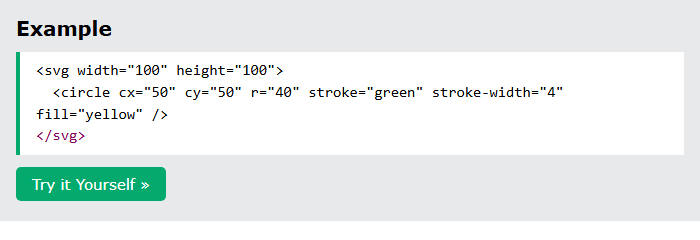
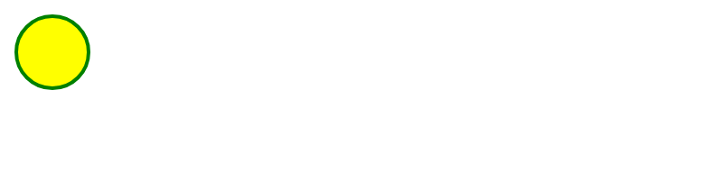
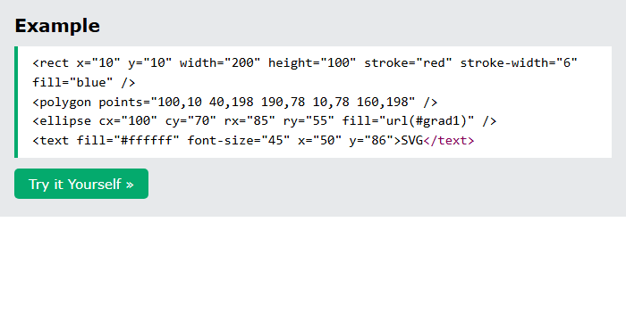
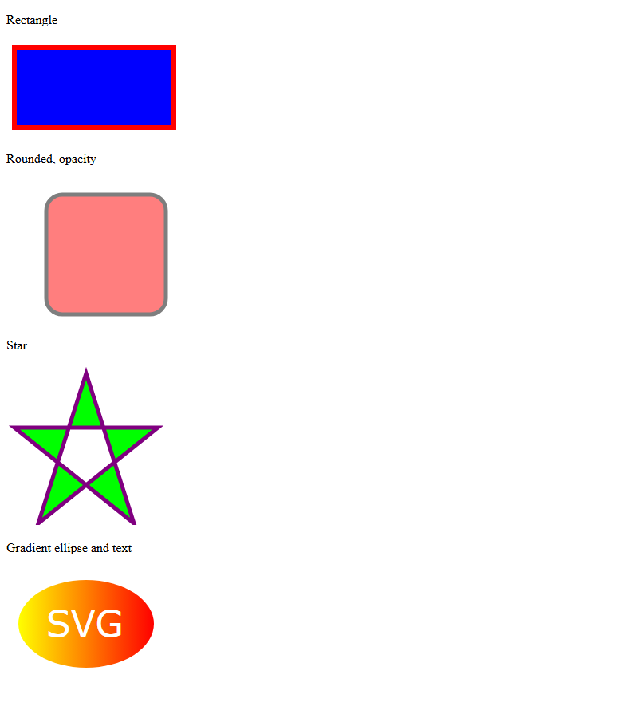

# HTML SVG

[Back to HTML Tutorial](../tutorial_main.md)

## Introduction

**SVG** (Scalable Vector Graphics) describes **2D graphics in XML** and can be **embedded in HTML**. Graphics stay sharp when zoomed. This chapter draws a **circle**, **rectangles**, a **star**, a **gradient ellipse with text**, and compares SVG with **canvas**.

This section has **2** examples:

- [x] **Example 1:** Circle [View](#html-svg-example-01)
- [x] **Example 2:** Shapes [View](#html-svg-example-02)

## Detailed Explanation

- [x] **What is SVG?**
  - Vector graphics for the Web, in **XML**.
  - Elements and attributes can be **animated**.
  - A **W3C recommendation**; works with CSS, DOM, XSL, and JavaScript.
  - Supported by all major browsers.
- [x] **`<svg>`** — container for paths, rectangles, circles, polygons, text, and more.
- [x] **SVG vs Canvas**

| SVG                    | Canvas                                  |
| ---------------------- | --------------------------------------- |
| Resolution independent | Resolution dependent                    |
| Event handlers         | No event handlers                       |
| Good text rendering    | Poor text rendering                     |
| Slow if complex        | Can save as .png / .jpg                 |
| Not suited for games   | Well suited for graphic-intensive games |

- SVG: each shape is an **object** in the DOM; change an attribute and the browser **re-renders**.
- Canvas: **pixel by pixel**; once drawn it is **forgotten** — move something and **redraw the whole scene**.

<a id="html-svg-example-01"></a>

### **Example 1: Circle**

- [x] **Circle** — `cx` `cy` `r`, green stroke, yellow fill.

Sandbox: `code_sandbox/html-svg/index.html`

```html
<svg width="100" height="100">
  <circle
    cx="50"
    cy="50"
    r="40"
    stroke="green"
    stroke-width="4"
    fill="yellow"
  />
</svg>
```





- [x] **Outcome:** the page demonstrates **Circle** as shown in the result snap.

<a id="html-svg-example-02"></a>

### **Example 2: Shapes**

- [x] **More shapes** (`shapes.html`)
  - Blue rectangle, red stroke.
  - Rounded rect (`rx` `ry`) with **opacity 0.5**.
  - Lime/purple **star** polygon, `fill-rule: evenodd`.
  - Yellow→red **linearGradient** on an ellipse, white **SVG** text. Fallback: “Sorry, your browser does not support inline SVG.”

Sandbox: `code_sandbox/html-svg/shapes.html`

```html
<rect
  x="10"
  y="10"
  width="200"
  height="100"
  stroke="red"
  stroke-width="6"
  fill="blue"
/>
<polygon points="100,10 40,198 190,78 10,78 160,198" />
<ellipse cx="100" cy="70" rx="85" ry="55" fill="url(#grad1)" />
<text fill="#ffffff" font-size="45" x="50" y="86">SVG</text>
```





- [x] **Outcome:** the browser shows **SVG**.

<details>
  <summary>Terminal Commands</summary>

## Terminal Commands

```bash
# from Personal/Files/html/code_sandbox
python -m http.server 8766 --bind 127.0.0.1
```

Then open `http://127.0.0.1:8766/html-svg/`.

</details>

<details>
  <summary>Questions and Answers</summary>

## Questions and Answers

### Question 1: What does SVG stand for?

<details>
<summary>Answer</summary>

- [x] **Scalable Vector Graphics**.
- [x] Vector graphics in **XML**, embeddable in HTML.

</details>

### Question 2: Do SVG graphics lose quality when zoomed?

<details>
<summary>Answer</summary>

- [x] **No.** They are **scalable**.

</details>

### Question 3: What is `<svg>`?

<details>
<summary>Answer</summary>

- [x] A **container** for SVG graphics (paths, rects, circles, polygons, text).

</details>

### Question 4: Which attributes draw a circle?

<details>
<summary>Answer</summary>

- [x] **`cx`**, **`cy`**, **`r`**, plus stroke/fill.

</details>

### Question 5: How is SVG different from canvas in the DOM?

<details>
<summary>Answer</summary>

- [x] SVG shapes stay as **objects**; you can attach **event handlers**.
- [x] Canvas is **pixels**; after drawing, the browser **forgets** the shapes.

</details>

### Question 6: Which is better for games?

<details>
<summary>Answer</summary>

- [x] **Canvas** — suited to graphic-intensive games.
- [x] SVG is **not** well suited for games and can be slow if complex.

</details>

</details>

## Summary

SVG is XML vector graphics inside `<svg>`. Draw circles, rects, polygons, and gradient text. SVG stays sharp and stays in the DOM; canvas is a pixel buffer you must redraw. Prefer SVG for scalable UI art; canvas for games.

## References

- [HTML SVG Graphics (W3Schools)](https://www.w3schools.com/html/html5_svg.asp)
- [SVG Tutorial](https://www.w3schools.com/graphics/svg_intro.asp)
- [MDN: SVG](https://developer.mozilla.org/en-US/docs/Web/SVG)
- [MDN: `<svg>`](https://developer.mozilla.org/en-US/docs/Web/SVG/Element/svg)
