# HTML Tutorial

Section-by-section notes. Each accordion is one tutorial page: explained, coded in `code_sandbox`, run in the browser, and snapped.

<details>
  <summary>HTML Introduction</summary>

## Introduction

HTML is the **standard markup language** for creating Web pages. This section defines what HTML is, walks through a **simple HTML document**, explains **elements** (including empty ones like `<br>`), shows how **browsers** use tags without displaying them, outlines **page structure** (`<html>`, `<head>`, `<body>`), and sketches **HTML history** up to HTML5. This tutorial follows the **latest HTML5 standard**.

## Detailed Explanation

- [x] **What is HTML?**
  - **H**yper **T**ext **M**arkup **L**anguage.
  - The **standard markup language** for creating Web pages.
  - Describes the **structure** of a Web page.
  - Consists of a **series of elements**.
  - Elements tell the **browser how to display** the content.
  - Elements **label** pieces of content: heading, paragraph, link, and so on.
- [x] **A simple HTML document**
  - The page example is a full HTML5 file: doctype, `html`, `head`/`title`, and `body` with one heading and one paragraph.
  - Sandbox file: `code_sandbox/html-introduction/index.html`.
  - Running it in the browser shows **My First Heading** and **My first paragraph.** The tab title is **Page Title**.


- [x] **Example explained**
  - `<!DOCTYPE html>` declares an **HTML5** document.
  - `<html>` is the **root** element of the page.
  - `<head>` holds **meta information** about the page.
  - `<title>` sets the title in the **browser tab / title bar**.
  - `<body>` is the container for **all visible content** (headings, paragraphs, images, links, tables, lists, and so on).
  - `<h1>` defines a **large heading**.
  - `<p>` defines a **paragraph**.
- [x] **What is an HTML element?**
  - An element is a **start tag**, **content**, and an **end tag**: `<tagname> Content goes here... </tagname>`.
  - The element is **everything** from the start tag through the end tag.
  - Examples: `<h1>My First Heading</h1>` and `<p>My first paragraph.</p>`.
- [x] **Start tag, content, end tag**

| Start tag | Element content     | End tag |
| --------- | ------------------- | ------- |
| `<h1>`    | My First Heading    | `</h1>` |
| `<p>`     | My first paragraph. | `</p>`  |
| `<br>`    | none                | none    |

- [x] **Empty elements**
  - Some elements have **no content** (for example `<br>`).
  - These are **empty elements**.
  - Empty elements **do not have an end tag**.
- [x] **Web browsers**
  - Chrome, Edge, Firefox, Safari **read HTML documents** and **display them correctly**.
  - A browser **does not show the tags**; it uses them to decide **how** to display the document.
- [x] **HTML page structure**
  - Typical nesting: `<html>` → `<head>` (`<title>`) and `<body>` (headings and paragraphs).
  - Content inside **`<body>`** is what you **see in the page**.
  - Content inside **`<title>`** is what you **see in the tab / title bar**.
- [x] **HTML history (high level)**
  - **1989:** Tim Berners-Lee invented **www**.
  - **1991:** Tim Berners-Lee invented **HTML**.
  - Later versions include HTML 2.0, 3.2, 4.01, XHTML 1.0, then **HTML5**.
  - **2012:** WHATWG **HTML5 Living Standard**.
  - **2014:** W3C Recommendation: **HTML5**.
  - This tutorial follows the **latest HTML5 standard**.

Sandbox: `code_sandbox/html-introduction/index.html`

Tested source (W3Schools **A Simple HTML Document**):


```html
<!DOCTYPE html>
<html>
  <head>
    <title>Page Title</title>
  </head>
  <body>
    <h1>My First Heading</h1>
    <p>My first paragraph.</p>
  </body>
</html>
```

Rendered result (browser uses the tags; it does not print them):


<details>
  <summary>Terminal Commands</summary>

## Terminal Commands

Serve the sandbox so the Cursor browser can load the example (it cannot open `file://`).

```bash
# from Personal/Files/html/code_sandbox
python -m http.server 8766 --bind 127.0.0.1
```

Then open `http://127.0.0.1:8766/html-introduction/`.

</details>

<details>
  <summary>Questions and Answers</summary>

## Questions and Answers

### Question 1: What does HTML stand for?

<details>
<summary>Answer</summary>

- [x] **Hyper Text Markup Language**.

</details>

### Question 2: What is HTML used for?

<details>
<summary>Answer</summary>

- [x] It is the **standard markup language** for creating **Web pages**.
- [x] It describes the **structure** of a page using **elements**.

</details>

### Question 3: What do HTML elements do?

<details>
<summary>Answer</summary>

- [x] They tell the **browser how to display** the content.
- [x] They **label** pieces of content (heading, paragraph, link, and so on).

</details>

### Question 4: What does `<!DOCTYPE html>` mean?

<details>
<summary>Answer</summary>

- [x] It declares that the document is an **HTML5** document.

</details>

### Question 5: What is the `<html>` element?

<details>
<summary>Answer</summary>

- [x] It is the **root** element of an HTML page.

</details>

### Question 6: What belongs in `<head>` vs `<body>`?

<details>
<summary>Answer</summary>

- [x] `<head>` contains **meta information** about the page.
- [x] `<body>` contains **all visible contents** (headings, paragraphs, images, links, tables, lists, and so on).

</details>

### Question 7: What does the `<title>` element control?

<details>
<summary>Answer</summary>

- [x] The title shown in the **browser title bar** or the **page tab**.
- [x] In this example it is **Page Title**.

</details>

### Question 8: What do `<h1>` and `<p>` define in the example?

<details>
<summary>Answer</summary>

- [x] `<h1>` defines a **large heading** (**My First Heading**).
- [x] `<p>` defines a **paragraph** (**My first paragraph.**).

</details>

### Question 9: How is an HTML element defined?

<details>
<summary>Answer</summary>

- [x] A **start tag**, some **content**, and an **end tag**.
- [x] Pattern: `<tagname> Content goes here... </tagname>`.
- [x] The element is **everything** from the start tag to the end tag.

</details>

### Question 10: What is an empty HTML element?

<details>
<summary>Answer</summary>

- [x] An element with **no content**, such as `<br>`.
- [x] Empty elements **do not have an end tag**.

</details>

### Question 11: What is the purpose of a web browser?

<details>
<summary>Answer</summary>

- [x] To **read HTML documents** and **display them correctly**.
- [x] Examples: Chrome, Edge, Firefox, Safari.

</details>

### Question 12: Does the browser show HTML tags on the page?

<details>
<summary>Answer</summary>

- [x] **No.** It does **not** display the tags.
- [x] It **uses** the tags to decide **how** to display the document.

</details>

### Question 13: What appears in the page vs in the tab?

<details>
<summary>Answer</summary>

- [x] **`<body>`** content is displayed **in the browser page**.
- [x] **`<title>`** content is shown in the **title bar / tab**.

</details>

### Question 14: Who invented the www and HTML, and in which years?

<details>
<summary>Answer</summary>

- [x] **Tim Berners-Lee** invented **www** in **1989**.
- [x] **Tim Berners-Lee** invented **HTML** in **1991**.

</details>

### Question 15: Which HTML standard does this tutorial follow?

<details>
<summary>Answer</summary>

- [x] The **latest HTML5** standard.
- [x] HTML5 became a W3C Recommendation in **2014**.
- [x] WHATWG maintains an **HTML5 Living Standard** (from **2012**).

</details>

### Question 16: In the element table, why does `<br>` show “none” for content and end tag?

<details>
<summary>Answer</summary>

- [x] `<br>` is an **empty element**.
- [x] It has **no content** and **no end tag**.

</details>

</details>

## Summary

HTML is **Hyper Text Markup Language**: elements describe page **structure** and tell the browser **how to display** content. A minimal HTML5 page uses `<!DOCTYPE html>`, a root `<html>`, `<head>` with `<title>` (tab text), and `<body>` for what you **see**. An element is start tag + content + end tag, except **empty** elements like `<br>`, which have **no end tag**. Browsers **hide tags** and render the result. This tutorial uses **HTML5**.

## References

- [HTML Introduction (W3Schools)](https://www.w3schools.com/html/html_intro.asp)
- [Try it Yourself: tryhtml_intro](https://www.w3schools.com/html/tryit.asp?filename=tryhtml_intro)
- [WHATWG HTML Living Standard](https://whatwg.org/html/)
- [W3C HTML5 Recommendation](https://www.w3.org/TR/html5/)
- [W3C HTML5.1 2nd Edition](https://www.w3.org/TR/html51/)
- [W3C HTML5.2 Recommendation](https://www.w3.org/TR/html52/)

</details>

<details>
  <summary>HTML Editors</summary>

## Introduction

You do not need a professional IDE to learn HTML. A **simple text editor**—**Notepad** on Windows or **TextEdit** on Mac—is enough to write a page, save it as **`.htm` / `.html`** with **UTF-8** encoding, and open it in a browser. This section walks through that workflow and also points to W3Schools’ **online editor** (“Try it Yourself”) for fast tests.

## Detailed Explanation

- [x] **A simple text editor is enough**
  - Web pages _can_ be built with professional HTML editors.
  - For **learning**, the tutorial recommends **Notepad** (PC) or **TextEdit** (Mac).
  - Writing tags by hand in a plain editor is a good way to learn HTML.
- [x] **Step 1 (PC): Open Notepad**
  - **Windows 8 or later:** open the **Start** screen (Windows logo, bottom left) and type **Notepad**.
  - **Windows 7 or earlier:** **Start** → **Programs** → **Accessories** → **Notepad**.
- [x] **Step 1 (Mac): Open TextEdit and set it to plain HTML**
  - **Finder** → **Applications** → **TextEdit**.
  - **Preferences** → **Format** → choose **Plain Text** so files save correctly.
  - Under **Open and Save**, check **Display HTML files as HTML code instead of formatted text**.
  - Then open a **new document** for the code.
- [x] **Step 2: Write some HTML**
  - Copy this document into the editor (sandbox: `code_sandbox/html-editors/index.html`).


- [x] **Step 3: Save the HTML page**
  - **File** → **Save as**.
  - Name it **`index.htm`** (or **`index.html`**—the extensions are equivalent).
  - Set encoding to **UTF-8** (preferred for HTML files).
- [x] **Step 4: View it in a browser**
  - Double-click the file, or right-click → **Open with** your browser.
  - The browser shows **My First Heading** and **My first paragraph.** (it does not print the tags).


- [x] **W3Schools online editor (“Try it Yourself”)**
  - Edit HTML and see the result in the browser.
  - Useful for **fast tests**; it has **color coding** and can **save / share** code.
  - That example uses a `<title>` (**Page Title**), heading **This is a Heading**, and paragraph **This is a paragraph.** Sandbox: `code_sandbox/html-editors/tryit.html`.

Sandbox: `code_sandbox/html-editors/index.html` (Notepad / save-as `index.htm` example)


```html
<!DOCTYPE html>
<html>
  <body>
    <h1>My First Heading</h1>

    <p>My first paragraph.</p>
  </body>
</html>
```


Sandbox: `code_sandbox/html-editors/tryit.html` (online editor example)


```html
<!DOCTYPE html>
<html>
  <head>
    <title>Page Title</title>
  </head>
  <body>
    <h1>This is a Heading</h1>
    <p>This is a paragraph.</p>
  </body>
</html>
```


<details>
  <summary>Terminal Commands</summary>

## Terminal Commands

Serve the sandbox so the Cursor browser can load the examples (it cannot open `file://`).

```bash
# from Personal/Files/html/code_sandbox
python -m http.server 8766 --bind 127.0.0.1
```

Then open `http://127.0.0.1:8766/html-editors/` and `http://127.0.0.1:8766/html-editors/tryit.html`.

</details>

<details>
  <summary>Questions and Answers</summary>

## Questions and Answers

### Question 1: Do you need a professional HTML editor to learn HTML?

<details>
<summary>Answer</summary>

- [x] **No.** A **simple text editor** is enough.
- [x] The tutorial recommends **Notepad** (PC) or **TextEdit** (Mac).

</details>

### Question 2: How do you open Notepad on Windows 8 or later?

<details>
<summary>Answer</summary>

- [x] Open the **Start** screen (Windows logo, bottom left).
- [x] Type **Notepad**.

</details>

### Question 3: What TextEdit settings are required on Mac?

<details>
<summary>Answer</summary>

- [x] **Preferences** → **Format** → **Plain Text**.
- [x] Under **Open and Save**, check **Display HTML files as HTML code instead of formatted text**.

</details>

### Question 4: What filename and encoding should you use when saving?

<details>
<summary>Answer</summary>

- [x] Name the file **`index.htm`** (or **`index.html`**).
- [x] Set encoding to **UTF-8**.

</details>

### Question 5: Is there a difference between `.htm` and `.html`?

<details>
<summary>Answer</summary>

- [x] **No.** Either extension works.
- [x] The choice is up to you.

</details>

### Question 6: How do you view the saved HTML page?

<details>
<summary>Answer</summary>

- [x] Open the file in a **browser**.
- [x] Double-click it, or right-click and choose **Open with**.

</details>

### Question 7: What does the Notepad example display in the browser?

<details>
<summary>Answer</summary>

- [x] A heading: **My First Heading**.
- [x] A paragraph: **My first paragraph.**

</details>

### Question 8: What is the W3Schools “Try it Yourself” editor for?

<details>
<summary>Answer</summary>

- [x] Edit HTML and **view the result** in the browser.
- [x] It is useful for **testing code fast**.
- [x] It has **color coding** and can **save and share** code.

</details>

### Question 9: What extra markup does the Try it Yourself example add compared with the Notepad snippet?

<details>
<summary>Answer</summary>

- [x] A `<head>` with `<title>Page Title</title>`.
- [x] Different body text: **This is a Heading** and **This is a paragraph.**

</details>

### Question 10: Why is UTF-8 mentioned when saving?

<details>
<summary>Answer</summary>

- [x] **UTF-8** is the **preferred encoding** for HTML files.

</details>

</details>

## Summary

Learn HTML in a **plain text editor** (Notepad or TextEdit). Write a basic document, save it as **`index.htm` / `.html`** with **UTF-8**, and open it in a browser. **`.htm` and `.html` are the same.** On Mac, TextEdit must use **Plain Text** and must show HTML as **code**. The **Try it Yourself** online editor is for quick tests with color coding. The Notepad sample renders **My First Heading**; the online sample adds a **Page Title** tab and **This is a Heading**.

## References

- [HTML Editors (W3Schools)](https://www.w3schools.com/html/html_editors.asp)
- [Try it Yourself: tryhtml_editors](https://www.w3schools.com/html/tryit.asp?filename=tryhtml_editors)

</details>

<details>
  <summary>HTML Basic</summary>

## Introduction

This chapter shows **basic HTML examples**: a full document, the `<!DOCTYPE html>` declaration, **headings**, **paragraphs**, **links**, and **images**. The tags may be new; the point is to see the pattern. You can also **view page source** and **inspect** elements in the browser.

## Detailed Explanation

- [x] **HTML documents**
  - Every document starts with a document type declaration: `<!DOCTYPE html>`.
  - The document itself starts with `<html>` and ends with `</html>`.
  - Visible content sits between `<body>` and `</body>`.
  - Sandbox: `code_sandbox/html-basic/index.html`.


- [x] **The `<!DOCTYPE>` declaration**
  - Represents the **document type** and helps browsers **display pages correctly**.
  - Must appear **once**, at the **top** of the page (before any HTML tags).
  - It is **not case sensitive**.
  - HTML5 doctype is: `<!DOCTYPE html>`.
- [x] **HTML headings**
  - Defined with `<h1>` through `<h6>`.
  - `<h1>` is the **most important**; `<h6>` is the **least important**.
  - Sandbox: `code_sandbox/html-basic/headings.html`.


- [x] **HTML paragraphs**
  - Defined with the `<p>` tag.
  - Sandbox: `code_sandbox/html-basic/paragraphs.html`.


- [x] **HTML links**
  - Defined with the `<a>` tag.
  - The destination is the **`href` attribute**.
  - Attributes add extra information about an element (covered in a later chapter).
  - Sandbox: `code_sandbox/html-basic/link.html`.


- [x] **HTML images**
  - Defined with the `` tag.
  - Attributes: **`src`** (file), **`alt`** (alternative text), **`width`**, **`height`**.
  - Sandbox: `code_sandbox/html-basic/img.html` (local `w3schools.jpg`, 104×142).


- [x] **How to view HTML source**
  - **View Page Source:** `Ctrl`+`U`, or right-click the page → **View Page Source**. Opens a tab with the HTML source.
  - **Inspect an element:** right-click an element (or a blank area) → **Inspect**. Shows HTML and CSS; you can edit them on the fly in the Elements / Styles panel.

Sandbox: `code_sandbox/html-basic/index.html`


```html
<!DOCTYPE html>
<html>
  <body>
    <h1>My First Heading</h1>
    <p>My first paragraph.</p>
  </body>
</html>
```


Headings (`headings.html`):


```html
<h1>This is heading 1</h1>
<h2>This is heading 2</h2>
<h3>This is heading 3</h3>
```


Paragraphs (`paragraphs.html`):


```html
<p>This is a paragraph.</p>
<p>This is another paragraph.</p>
```


Link (`link.html`):


```html
<a href="https://www.w3schools.com">This is a link</a>
```


Image (`img.html`):


```html

```


<details>
  <summary>Terminal Commands</summary>

## Terminal Commands

```bash
# from Personal/Files/html/code_sandbox
python -m http.server 8766 --bind 127.0.0.1
```

Then open `http://127.0.0.1:8766/html-basic/` and the other files in that folder.

</details>

<details>
  <summary>Questions and Answers</summary>

## Questions and Answers

### Question 1: What must every HTML document start with?

<details>
<summary>Answer</summary>

- [x] A document type declaration: `<!DOCTYPE html>`.

</details>

### Question 2: Where does visible content go?

<details>
<summary>Answer</summary>

- [x] Between `<body>` and `</body>`.

</details>

### Question 3: How many times may `<!DOCTYPE>` appear, and where?

<details>
<summary>Answer</summary>

- [x] **Once**.
- [x] At the **top** of the page, **before any HTML tags**.

</details>

### Question 4: Is `<!DOCTYPE>` case sensitive?

<details>
<summary>Answer</summary>

- [x] **No.**

</details>

### Question 5: Which tags define headings, and which is most important?

<details>
<summary>Answer</summary>

- [x] `<h1>` through `<h6>`.
- [x] `<h1>` is the **most important**; `<h6>` is the **least important**.

</details>

### Question 6: Which tag defines a paragraph?

<details>
<summary>Answer</summary>

- [x] `<p>`.

</details>

### Question 7: How do you write a link, and where is the URL?

<details>
<summary>Answer</summary>

- [x] Use the `<a>` tag.
- [x] Put the destination in the **`href` attribute**.

</details>

### Question 8: Which attributes does the image example use?

<details>
<summary>Answer</summary>

- [x] **`src`** — the image file.
- [x] **`alt`** — alternative text.
- [x] **`width`** and **`height`**.

</details>

### Question 9: How do you view a page’s HTML source?

<details>
<summary>Answer</summary>

- [x] Press **`Ctrl`+`U`**, or right-click → **View Page Source**.
- [x] That opens a tab with the HTML source.

</details>

### Question 10: What does Inspect show you?

<details>
<summary>Answer</summary>

- [x] Right-click an element → **Inspect**.
- [x] You see the **HTML and CSS**.
- [x] You can edit them **on the fly** in Elements / Styles.

</details>

</details>

## Summary

A page starts with `<!DOCTYPE html>`, then `<html>` / `<body>`. Headings are `<h1>`–`<h6>`, paragraphs `<p>`, links `<a href="...">`, images ``. The doctype appears **once at the top** and is **not case sensitive**. Use **View Source** (`Ctrl`+`U`) or **Inspect** to study a page.

## References

- [HTML Basic (W3Schools)](https://www.w3schools.com/html/html_basic.asp)
- [Try it Yourself: tryhtml_basic_document](https://www.w3schools.com/html/tryit.asp?filename=tryhtml_basic_document)
- [Try it Yourself: tryhtml_basic_headings](https://www.w3schools.com/html/tryit.asp?filename=tryhtml_basic_headings)
- [Try it Yourself: tryhtml_basic_paragraphs](https://www.w3schools.com/html/tryit.asp?filename=tryhtml_basic_paragraphs)
- [Try it Yourself: tryhtml_basic_link](https://www.w3schools.com/html/tryit.asp?filename=tryhtml_basic_link)
- [Try it Yourself: tryhtml_basic_img](https://www.w3schools.com/html/tryit.asp?filename=tryhtml_basic_img)
- [MDN: DOCTYPE](https://developer.mozilla.org/en-US/docs/Glossary/Doctype)
- [MDN: `<a>`](https://developer.mozilla.org/en-US/docs/Web/HTML/Element/a)
- [MDN: ``](https://developer.mozilla.org/en-US/docs/Web/HTML/Element/img)

</details>

<details>
  <summary>HTML Elements</summary>

## Introduction

An HTML **element** is a **start tag**, **content**, and an **end tag**. Elements can be **nested**. Some elements are **empty** (no content, no end tag), such as `<br>`. Tags are **not case sensitive**, but this tutorial (and W3C) prefers **lowercase**.

## Detailed Explanation

- [x] **What is an HTML element?**
  - Start tag + content + end tag: `<tagname> Content goes here... </tagname>`.
  - The element is **everything** from the start tag through the end tag.

| Start tag | Element content     | End tag |
| --------- | ------------------- | ------- |
| `<h1>`    | My First Heading    | `</h1>` |
| `<p>`     | My first paragraph. | `</p>`  |
| `<br>`    | none                | none    |

- [x] **Empty elements**
  - No content (example: `<br>`).
  - **No end tag**.
- [x] **Nested HTML elements**
  - Elements can contain other elements.
  - A whole document is nested: `<html>` → `<body>` → `<h1>` and `<p>`.
  - `<html>` is the **root** (whole document). `<body>` is the **visible body**. `<h1>` is a heading. `<p>` is a paragraph.
  - Sandbox: `code_sandbox/html-elements/index.html`.


- [x] **Never skip the end tag**
  - Some elements still **display** if you omit `</p>`.
  - **Do not rely on that.** Missing end tags can cause unexpected results and errors.
  - WHATWG HTML does allow **optional end tags** for a few elements (including `<p>` in some contexts). The tutorial’s advice still stands for learning: **write the end tag**.
  - Sandbox: `code_sandbox/html-elements/no-endtag.html` (two paragraphs, no `</p>` — the browser still shows two blocks).


- [x] **Empty HTML elements (`<br>`)**
  - `<br>` is a **line break** with no closing tag.
  - Sandbox: `code_sandbox/html-elements/br.html`.


- [x] **HTML is not case sensitive**
  - `<P>` means the same as `<p>`.
  - The HTML standard does not require lowercase, but **W3C recommends lowercase**, and **XHTML requires it**.
  - W3Schools always uses **lowercase** tag names.

Nested document: `code_sandbox/html-elements/index.html`


```html
<!DOCTYPE html>
<html>
  <body>
    <h1>My First Heading</h1>
    <p>My first paragraph.</p>
  </body>
</html>
```


Omitted end tags: `code_sandbox/html-elements/no-endtag.html`


```html
<html>
  <body>
    <p>This is a paragraph</p>
    <p>This is a paragraph</p>
  </body>
</html>
```


Line break: `code_sandbox/html-elements/br.html`


```html
<p>
  This is a <br />
  paragraph with a line break.
</p>
```


<details>
  <summary>Terminal Commands</summary>

## Terminal Commands

```bash
# from Personal/Files/html/code_sandbox
python -m http.server 8766 --bind 127.0.0.1
```

Then open `http://127.0.0.1:8766/html-elements/`.

</details>

<details>
  <summary>Questions and Answers</summary>

## Questions and Answers

### Question 1: What is an HTML element?

<details>
<summary>Answer</summary>

- [x] A **start tag**, some **content**, and an **end tag**.
- [x] The element is everything from the start tag to the end tag.

</details>

### Question 2: What is a nested element?

<details>
<summary>Answer</summary>

- [x] An element **inside** another element.
- [x] A whole HTML document is nested (`<html>` contains `<body>`, which contains headings and paragraphs).

</details>

### Question 3: What is the root element?

<details>
<summary>Answer</summary>

- [x] `<html>` — it defines the **whole HTML document**.

</details>

### Question 4: Should you skip end tags if the page still looks OK?

<details>
<summary>Answer</summary>

- [x] **No.** Never rely on omitted end tags.
- [x] You can get **unexpected results and errors**.

</details>

### Question 5: What is an empty HTML element?

<details>
<summary>Answer</summary>

- [x] An element with **no content**.
- [x] Example: `<br>` (line break).
- [x] Empty elements **do not have an end tag**.

</details>

### Question 6: Are HTML tags case sensitive?

<details>
<summary>Answer</summary>

- [x] **No.** `<P>` means the same as `<p>`.
- [x] W3C **recommends lowercase**; XHTML **requires** it.
- [x] W3Schools always uses **lowercase**.

</details>

### Question 7: In the element table, why does `<br>` show “none”?

<details>
<summary>Answer</summary>

- [x] `<br>` is **empty**.
- [x] It has **no content** and **no end tag**.

</details>

### Question 8: What does the WHATWG spec say about omitted `</p>`?

<details>
<summary>Answer</summary>

- [x] Some end tags (including `<p>` in certain cases) are **optional** in the HTML living standard.
- [x] For learning, still **write the end tag**, as the tutorial warns.

</details>

</details>

## Summary

An element is **start tag + content + end tag**, except **empty** elements like `<br>`. Documents are **nested** (`<html>` / `<body>` / headings and paragraphs). Browsers may forgive a missing `</p>`, but **do not skip end tags**. Tags are **case-insensitive**; use **lowercase**.

## References

- [HTML Elements (W3Schools)](https://www.w3schools.com/html/html_elements.asp)
- [Try it Yourself: tryhtml_elements](https://www.w3schools.com/html/tryit.asp?filename=tryhtml_elements)
- [Try it Yourself: tryhtml_no_endtag](https://www.w3schools.com/html/tryit.asp?filename=tryhtml_no_endtag)
- [Try it Yourself: tryhtml_elements_br](https://www.w3schools.com/html/tryit.asp?filename=tryhtml_elements_br)
- [HTML Tag Reference (W3Schools)](https://www.w3schools.com/tags/default.asp)
- [WHATWG: optional tags](https://html.spec.whatwg.org/multipage/syntax.html#optional-tags)
- [MDN: HTML elements](https://developer.mozilla.org/en-US/docs/Web/HTML/Element)

</details>

<details>
  <summary>HTML Attributes</summary>

## Introduction

HTML **attributes** add extra information about an element. They go in the **start tag**, usually as `name="value"`. This chapter covers **`href`**, **`src`**, **`width`/`height`**, **`alt`**, **`style`**, **`lang`**, and **`title`**, plus quoting and lowercase conventions.

## Detailed Explanation

- [x] **Attribute rules**
  - All HTML elements can have attributes.
  - Attributes provide **additional information** about elements.
  - Always specified in the **start tag**.
  - Usually **name/value** pairs: `name="value"`.
- [x] **The `href` attribute**
  - `<a>` is a hyperlink. **`href`** is the URL it goes to.
  - Sandbox: `code_sandbox/html-attributes/href.html`.


- [x] **The `src` attribute**
  - `` embeds an image. **`src`** is the path.
  - **Absolute URL:** full address, e.g. `https://www.w3schools.com/images/img_girl.jpg`. External images can be copyrighted or disappear.
  - **Relative URL:** no domain. `img_girl.jpg` is relative to the **current page**; `/images/img_girl.jpg` is relative to the **domain**.
  - Prefer **relative** URLs so they do not break if the domain changes.
- [x] **`width` and `height`**
  - Size the image in **pixels**.
  - Example: `width="500"` `height="600"` with `src="img_girl.jpg"`.
  - Sandbox: `code_sandbox/html-attributes/img.html`.


- [x] **The `alt` attribute**
  - **Required** on ``. Alternate text if the image cannot be shown (slow connection, bad `src`, or a screen reader).
  - Broken `src` (`img_typo.jpg`) still shows **Girl with a jacket**.
  - Sandbox: `code_sandbox/html-attributes/alt-error.html`.


- [x] **The `style` attribute**
  - Adds styles (color, font, size, and more).
  - Example: red paragraph.
  - Sandbox: `code_sandbox/html-attributes/style.html`.


- [x] **The `lang` attribute**
  - Put **`lang`** on `<html>` to declare the page language (helps search engines and browsers).
  - English: `<html lang="en">`. Country: `<html lang="en-US">` (language + country).
- [x] **The `title` attribute**
  - Extra information about an element.
  - Shown as a **tooltip** on mouse over.
  - Sandbox: `code_sandbox/html-attributes/title.html` (`title="I'm a tooltip"`).


- [x] **Lowercase and quotes**
  - The HTML standard does not require lowercase names or quotes, but **W3C recommends** both; **XHTML requires** them.
  - W3Schools always uses **lowercase names** and **quoted values**.
  - Quotes are **required** when the value has a **space** (`title=Description of W3Schools` fails).
  - Double quotes are most common; use single quotes if the value itself contains double quotes (or the reverse).

`href` (`href.html`):


```html
<a href="https://www.w3schools.com">Visit W3Schools</a>
```


Image size (`img.html`):


```html

```


Broken image + `alt` (`alt-error.html`):


```html

```


`style` (`style.html`):


```html
<p style="color:red;">This is a red paragraph.</p>
```


`title` (`title.html`):


```html
<p title="I'm a tooltip">This is a paragraph.</p>
```


`lang` on the document (used on these sandbox files):

```html
<!DOCTYPE html>
<html lang="en">
  <body>
    ...
  </body>
</html>
```

<details>
  <summary>Terminal Commands</summary>

## Terminal Commands

```bash
# from Personal/Files/html/code_sandbox
python -m http.server 8766 --bind 127.0.0.1
```

Then open `http://127.0.0.1:8766/html-attributes/href.html`.

</details>

<details>
  <summary>Questions and Answers</summary>

## Questions and Answers

### Question 1: Where do you put attributes, and in what form?

<details>
<summary>Answer</summary>

- [x] In the **start tag**.
- [x] Usually **name/value** pairs: `name="value"`.

</details>

### Question 2: What does `href` on `<a>` do?

<details>
<summary>Answer</summary>

- [x] It specifies the **URL** of the page the link goes to.

</details>

### Question 3: Absolute vs relative `src` — which is safer for your own images?

<details>
<summary>Answer</summary>

- [x] **Relative** URLs (no domain).
- [x] They do not break if you **change domain**.
- [x] Absolute URLs point at another site and can vanish or be copyrighted.

</details>

### Question 4: Why set `width` and `height` on ``?

<details>
<summary>Answer</summary>

- [x] They specify the image size in **pixels**.

</details>

### Question 5: Why is `alt` required?

<details>
<summary>Answer</summary>

- [x] It is the **alternate text** if the image cannot be displayed.
- [x] Used for slow connections, bad `src`, and **screen readers**.

</details>

### Question 6: What does `lang` on `<html>` do?

<details>
<summary>Answer</summary>

- [x] Declares the **language** of the page.
- [x] Helps **search engines** and **browsers**.
- [x] Example: `lang="en"` or `lang="en-US"`.

</details>

### Question 7: What does `title` show?

<details>
<summary>Answer</summary>

- [x] Extra information as a **tooltip** when you mouse over the element.

</details>

### Question 8: Must attribute names be lowercase and values quoted?

<details>
<summary>Answer</summary>

- [x] HTML does **not require** either.
- [x] **W3C recommends** lowercase and quotes; **XHTML requires** them.
- [x] Quotes are needed when the value contains a **space**.

</details>

### Question 9: When do you use single quotes around an attribute value?

<details>
<summary>Answer</summary>

- [x] When the value itself contains **double quotes**.
- [x] Or use double quotes if the value contains **single quotes**.

</details>

</details>

## Summary

Attributes live in the **start tag** as `name="value"`. **`href`** is the link URL, **`src`** the image path (prefer **relative**), **`width`/`height`** size in pixels, **`alt`** fallback text, **`style`** inline CSS, **`lang`** the page language, **`title`** a tooltip. Use **lowercase names** and **quoted values**.

## References

- [HTML Attributes (W3Schools)](https://www.w3schools.com/html/html_attributes.asp)
- [Try it Yourself: tryhtml_attributes_link](https://www.w3schools.com/html/tryit.asp?filename=tryhtml_attributes_link)
- [Try it Yourself: tryhtml_attributes_img](https://www.w3schools.com/html/tryit.asp?filename=tryhtml_attributes_img)
- [Try it Yourself: tryhtml_attributes_alt_error](https://www.w3schools.com/html/tryit.asp?filename=tryhtml_attributes_alt_error)
- [Try it Yourself: tryhtml_attributes_style](https://www.w3schools.com/html/tryit.asp?filename=tryhtml_attributes_style)
- [Try it Yourself: tryhtml_attributes_title](https://www.w3schools.com/html/tryit.asp?filename=tryhtml_attributes_title)
- [HTML Attribute Reference](https://www.w3schools.com/tags/ref_attributes.asp)
- [HTML Language Code Reference](https://www.w3schools.com/tags/ref_language_codes.asp)
- [MDN: HTML attribute reference](https://developer.mozilla.org/en-US/docs/Web/HTML/Reference/Attributes)

</details>

<details>
  <summary>HTML Headings</summary>

## Introduction

HTML **headings** are titles and subtitles on a page. They use `<h1>` through `<h6>`: **`<h1>` is most important**, **`<h6>` least**. Search engines and skimmers use them for **structure**. Use headings for **headings**, not just to make text big.

## Detailed Explanation

- [x] **`<h1>` to `<h6>`**
  - Headings are titles or subtitles you want on a webpage.
  - `<h1>` = most important; `<h6>` = least important.
  - Browsers add **margin** (white space) before and after a heading.
  - Sandbox: `code_sandbox/html-headings/index.html`.


- [x] **Headings are important**
  - Search engines **index** structure and content from headings.
  - Users often **skim** by headings, so headings should show the **document structure**.
  - Use `<h1>` for the **main** heading, then `<h2>`, then less important `<h3>`, and so on.
  - Example outline: **Travel Guide** (`h1`) → **Europe** / **Asia** (`h2`) → countries (`h3`).
  - **Tip:** use **only one `<h1>` per page** — it is the main topic or title.
  - **Note:** use heading tags for headings only. **Do not** use them just to make text BIG or bold.
  - Sandbox: `code_sandbox/html-headings/structure.html`.


- [x] **Bigger headings**
  - Each heading has a **default size**.
  - You can change size with the **`style`** attribute and CSS **`font-size`**.
  - Example: `<h1 style="font-size:60px;">Heading 1</h1>`.
  - That still **is** a heading (for structure); the style only changes how large it looks.
  - Sandbox: `code_sandbox/html-headings/size.html`.

Levels 1–6 (`index.html`):


```html
<h1>Heading 1</h1>
<h2>Heading 2</h2>
<h3>Heading 3</h3>
<h4>Heading 4</h4>
<h5>Heading 5</h5>
<h6>Heading 6</h6>
```


Document structure (`structure.html`):


```html
<h1>Travel Guide</h1>

<h2>Europe</h2>
<h3>France</h3>
<h3>Italy</h3>

<h2>Asia</h2>
<h3>India</h3>
<h3>Thailand</h3>
```


Custom size (`size.html`):


```html
<h1 style="font-size:60px;">Heading 1</h1>
```


<details>
  <summary>Terminal Commands</summary>

## Terminal Commands

```bash
# from Personal/Files/html/code_sandbox
python -m http.server 8766 --bind 127.0.0.1
```

Then open `http://127.0.0.1:8766/html-headings/`.

</details>

<details>
  <summary>Questions and Answers</summary>

## Questions and Answers

### Question 1: Which tags define HTML headings?

<details>
<summary>Answer</summary>

- [x] `<h1>` through `<h6>`.
- [x] `<h1>` is the **most important**; `<h6>` is the **least important**.

</details>

### Question 2: Do browsers add space around headings?

<details>
<summary>Answer</summary>

- [x] **Yes.** They add **margin** (white space) before and after a heading.

</details>

### Question 3: Why do search engines care about headings?

<details>
<summary>Answer</summary>

- [x] They use headings to **index** the **structure and content** of the page.

</details>

### Question 4: How should you order heading levels?

<details>
<summary>Answer</summary>

- [x] `<h1>` for the **main** heading.
- [x] Then `<h2>`, then less important `<h3>`, and so on.

</details>

### Question 5: How many `<h1>` elements should a page have, according to this chapter?

<details>
<summary>Answer</summary>

- [x] **Only one** `<h1>` per page.
- [x] It represents the **main topic or title**.

</details>

### Question 6: Should you use heading tags just to make text look big?

<details>
<summary>Answer</summary>

- [x] **No.** Use headings for **headings only**.
- [x] Do not use them just to make text **BIG** or **bold**.

</details>

### Question 7: How do you change a heading’s visual size without changing its level?

<details>
<summary>Answer</summary>

- [x] Use the **`style`** attribute with CSS **`font-size`**.
- [x] Example: `<h1 style="font-size:60px;">Heading 1</h1>`.

</details>

### Question 8: In the Travel Guide example, what is `<h1>` vs `<h2>` vs `<h3>`?

<details>
<summary>Answer</summary>

- [x] `<h1>`: **Travel Guide** (page topic).
- [x] `<h2>`: **Europe** and **Asia** (regions).
- [x] `<h3>`: countries (**France**, **Italy**, **India**, **Thailand**).

</details>

</details>

## Summary

Headings are `<h1>`–`<h6>`: **h1 most important**, **h6 least**. They outline the page for **search engines** and **skimmers**. Use **one `<h1>`**, then `<h2>`, then `<h3>`. Do **not** fake size with heading tags; if you need a larger look, keep the heading and set **`font-size`** with **`style`**. Browsers add **margin** around headings.

## References

- [HTML Headings (W3Schools)](https://www.w3schools.com/html/html_headings.asp)
- [Try it Yourself: tryhtml_headings](https://www.w3schools.com/html/tryit.asp?filename=tryhtml_headings)
- [Try it Yourself: tryhtml_headings_structure](https://www.w3schools.com/html/tryit.asp?filename=tryhtml_headings_structure)
- [Try it Yourself: tryhtml_headings_size](https://www.w3schools.com/html/tryit.asp?filename=tryhtml_headings_size)
- [HTML headings tag reference](https://www.w3schools.com/tags/tag_hn.asp)
- [MDN: Heading elements](https://developer.mozilla.org/en-US/docs/Web/HTML/Element/Heading_Elements)

</details>

<details>
  <summary>HTML Paragraphs</summary>

## Introduction

A **paragraph** (`<p>`) is a block of text that **starts on a new line**. Browsers add **margin** around it. Extra spaces and line breaks in the source **collapse**. Use `<hr>` for a thematic break, `<br>` for a line break inside a paragraph, and `<pre>` when you must keep the source layout (poems, code).

## Detailed Explanation

- [x] **HTML paragraphs**
  - `<p>` defines a paragraph.
  - A paragraph always starts on a **new line**.
  - Browsers add **white space (margin)** before and after it.
  - Sandbox: `code_sandbox/html-paragraphs/index.html`.


- [x] **HTML display (whitespace)**
  - You cannot be sure how HTML will look: screen size and window size change the wrap.
  - Extra **spaces** or **lines** in the source do **not** change the display.
  - The browser **removes extra spaces and lines**; many spaces or newlines count as **one space**.
  - Sandbox: `code_sandbox/html-paragraphs/display.html`.


- [x] **HTML horizontal rules**
  - `<hr>` is a **thematic break**, usually shown as a horizontal line.
  - Use it to **separate** content or mark a change.
  - `<hr>` is **empty** (no end tag).
  - Sandbox: `code_sandbox/html-paragraphs/hr.html`.


- [x] **HTML line breaks**
  - `<br>` starts a **new line** without a new paragraph.
  - `<br>` is **empty** (no end tag).
  - Sandbox: `code_sandbox/html-paragraphs/br.html`.


- [x] **The poem problem**
  - A poem in `<p>` with blank lines in the source still **renders on one flow** (one paragraph).
  - Sandbox: `code_sandbox/html-paragraphs/poem.html`.


- [x] **Solution: `<pre>`**
  - `<pre>` is **preformatted** text: spaces and line breaks in the source are **kept**.
  - Browsers typically show it in a **monospace** font.
  - Sandbox: `code_sandbox/html-paragraphs/pre.html`.

Two paragraphs (`index.html`):


```html
<p>This is a paragraph.</p>
<p>This is another paragraph.</p>
```


Collapsed whitespace (`display.html`):


```html
<p>
  This paragraph contains a lot of lines in the source code, but the browser
  ignores it.
</p>
```


Horizontal rules (`hr.html`):


```html
<h1>This is heading 1</h1>
<p>This is some text.</p>
<hr />
<h2>This is heading 2</h2>
<p>This is some other text.</p>
<hr />
```


Line breaks (`br.html`):


```html
<p>This is<br />a paragraph<br />with line breaks.</p>
```


Poem in `<p>` (`poem.html`):


```html
<p>
  My Bonnie lies over the ocean. My Bonnie lies over the sea. My Bonnie lies
  over the ocean. Oh, bring back my Bonnie to me.
</p>
```


Poem in `<pre>` (`pre.html`):


```html
<pre>
  My Bonnie lies over the ocean.

  My Bonnie lies over the sea.

  My Bonnie lies over the ocean.

  Oh, bring back my Bonnie to me.
</pre>
```


<details>
  <summary>Terminal Commands</summary>

## Terminal Commands

```bash
# from Personal/Files/html/code_sandbox
python -m http.server 8766 --bind 127.0.0.1
```

Then open `http://127.0.0.1:8766/html-paragraphs/`.

</details>

<details>
  <summary>Questions and Answers</summary>

## Questions and Answers

### Question 1: What does `<p>` define, and where does it start?

<details>
<summary>Answer</summary>

- [x] A **paragraph**.
- [x] It always starts on a **new line**.
- [x] Browsers add **margin** before and after it.

</details>

### Question 2: Do extra spaces and blank lines in the HTML source show on the page?

<details>
<summary>Answer</summary>

- [x] **No.** The browser **collapses** extra spaces and lines.
- [x] Many spaces or newlines count as **one space**.

</details>

### Question 3: What is `<hr>` for?

<details>
<summary>Answer</summary>

- [x] A **thematic break**, usually a **horizontal rule**.
- [x] It **separates** content (or marks a change).
- [x] It is an **empty** tag (no end tag).

</details>

### Question 4: When do you use `<br>` instead of a new `<p>`?

<details>
<summary>Answer</summary>

- [x] When you want a **new line** without starting a **new paragraph**.
- [x] `<br>` is **empty** (no end tag).

</details>

### Question 5: Why does a poem in `<p>` appear as one block?

<details>
<summary>Answer</summary>

- [x] `<p>` **ignores** extra line breaks in the source.
- [x] The lines collapse into **one paragraph**.

</details>

### Question 6: How do you keep a poem’s line breaks?

<details>
<summary>Answer</summary>

- [x] Use the `<pre>` element (**preformatted** text).
- [x] Spaces and line breaks in the source are **preserved**.

</details>

### Question 7: Can you control wrapping by adding spaces in the HTML file?

<details>
<summary>Answer</summary>

- [x] **No.** Screen size and window size change the wrap.
- [x] Extra spaces in the source do **not** control the layout.

</details>

</details>

## Summary

`<p>` starts a new paragraph with automatic **margin**. Extra source **spaces/newlines collapse**. `<hr>` is an empty **thematic break**; `<br>` is an empty **line break**. A poem in `<p>` becomes one flow; `<pre>` keeps the layout.

## References

- [HTML Paragraphs (W3Schools)](https://www.w3schools.com/html/html_paragraphs.asp)
- [Try it Yourself: tryhtml_paragraphs1](https://www.w3schools.com/html/tryit.asp?filename=tryhtml_paragraphs1)
- [Try it Yourself: tryhtml_paragraphs2](https://www.w3schools.com/html/tryit.asp?filename=tryhtml_paragraphs2)
- [Try it Yourself: tryhtml_headings_hr](https://www.w3schools.com/html/tryit.asp?filename=tryhtml_headings_hr)
- [Try it Yourself: tryhtml_paragraphs](https://www.w3schools.com/html/tryit.asp?filename=tryhtml_paragraphs)
- [Try it Yourself: tryhtml_poem](https://www.w3schools.com/html/tryit.asp?filename=tryhtml_poem)
- [Try it Yourself: tryhtml_pre](https://www.w3schools.com/html/tryit.asp?filename=tryhtml_pre)
- [MDN: `<p>`](https://developer.mozilla.org/en-US/docs/Web/HTML/Element/p)
- [MDN: `<pre>`](https://developer.mozilla.org/en-US/docs/Web/HTML/Element/pre)
- [MDN: `<hr>`](https://developer.mozilla.org/en-US/docs/Web/HTML/Element/hr)
- [MDN: `<br>`](https://developer.mozilla.org/en-US/docs/Web/HTML/Element/br)

</details>

<details>
  <summary>HTML Styles</summary>

## Introduction

The HTML **`style`** attribute adds CSS to an element: **color**, **font**, **size**, alignment, and more. The syntax is `<tagname style="property:value;">`. You will learn more CSS later; this chapter is the inline `style` attribute.

## Detailed Explanation

- [x] **The `style` attribute**
  - Setting the style of an HTML element can be done with **`style`**.
  - Syntax: `<tagname style="property:value;">`.
  - The **property** is a CSS property; the **value** is a CSS value.
  - Intro demo: normal, red, blue, and 50px text.
  - Sandbox: `code_sandbox/html-styles/index.html`.


- [x] **Background color (`background-color`)**
  - Defines the **background color** for an HTML element.
  - Page background: `<body style="background-color:powderblue;">`.
  - Sandbox: `code_sandbox/html-styles/background.html`.


- [x] **Background color on individual elements**
  - The same property can style **different** elements (`h1` powderblue, `p` tomato).
  - Sandbox: `code_sandbox/html-styles/background2.html`.


- [x] **Text color (`color`)**
  - Defines the **text color** for an HTML element.
  - Sandbox: `code_sandbox/html-styles/color.html`.


- [x] **Fonts (`font-family`)**
  - Defines the **font** for an HTML element (Verdana heading, Courier paragraph).
  - Sandbox: `code_sandbox/html-styles/font.html`.


- [x] **Text size (`font-size`)**
  - Defines the **text size**. Percentages are relative to the parent (here `300%` / `160%`).
  - Sandbox: `code_sandbox/html-styles/size.html`.


- [x] **Text alignment (`text-align`)**
  - Defines **horizontal** text alignment (`center` in the example).
  - Sandbox: `code_sandbox/html-styles/align.html`.

Intro colors and size (`index.html`):


```html
<p>I am normal</p>
<p style="color:red;">I am red</p>
<p style="color:blue;">I am blue</p>
<p style="font-size:50px;">I am big</p>
```


Page background (`background.html`):


```html
<body style="background-color:powderblue;">
  <h1>This is a heading</h1>
  <p>This is a paragraph.</p>
</body>
```


Element backgrounds (`background2.html`):


```html
<h1 style="background-color:powderblue;">This is a heading</h1>
<p style="background-color:tomato;">This is a paragraph.</p>
```


Text color (`color.html`):


```html
<h1 style="color:blue;">This is a heading</h1>
<p style="color:red;">This is a paragraph.</p>
```


Fonts (`font.html`):


```html
<h1 style="font-family:verdana;">This is a heading</h1>
<p style="font-family:courier;">This is a paragraph.</p>
```


Text size (`size.html`):


```html
<h1 style="font-size:300%;">This is a heading</h1>
<p style="font-size:160%;">This is a paragraph.</p>
```


Text alignment (`align.html`):


```html
<h1 style="text-align:center;">Centered Heading</h1>
<p style="text-align:center;">Centered paragraph.</p>
```


<details>
  <summary>Terminal Commands</summary>

## Terminal Commands

```bash
# from Personal/Files/html/code_sandbox
python -m http.server 8766 --bind 127.0.0.1
```

Then open `http://127.0.0.1:8766/html-styles/`.

</details>

<details>
  <summary>Questions and Answers</summary>

## Questions and Answers

### Question 1: What is the syntax of the HTML `style` attribute?

<details>
<summary>Answer</summary>

- [x] `<tagname style="property:value;">`.
- [x] The **property** is a CSS property; the **value** is a CSS value.

</details>

### Question 2: Which CSS property sets a page or element background color?

<details>
<summary>Answer</summary>

- [x] **`background-color`**.
- [x] Example: `<body style="background-color:powderblue;">`.

</details>

### Question 3: Which property sets text color?

<details>
<summary>Answer</summary>

- [x] **`color`**.
- [x] Example: `<h1 style="color:blue;">`.

</details>

### Question 4: Which property chooses the font?

<details>
<summary>Answer</summary>

- [x] **`font-family`**.
- [x] Example: `font-family:verdana` or `font-family:courier`.

</details>

### Question 5: How do you change text size with the style attribute?

<details>
<summary>Answer</summary>

- [x] Use **`font-size`**.
- [x] The chapter uses percentages such as `300%` and `160%`.

</details>

### Question 6: How do you center text?

<details>
<summary>Answer</summary>

- [x] Use **`text-align:center`**.
- [x] It sets **horizontal** alignment.

</details>

### Question 7: Is inline `style` the only way to style HTML?

<details>
<summary>Answer</summary>

- [x] **No.** This chapter uses the **`style` attribute**.
- [x] You will learn more about **CSS** later in the tutorial.

</details>

</details>

## Summary

Use the **`style`** attribute for styling HTML elements. Use **`background-color`** for backgrounds, **`color`** for text colors, **`font-family`** for fonts, **`font-size`** for sizes, and **`text-align`** for alignment.

## References

- [HTML Styles (W3Schools)](https://www.w3schools.com/html/html_styles.asp)
- [Try it Yourself: tryhtml_styles_intro](https://www.w3schools.com/html/tryit.asp?filename=tryhtml_styles_intro)
- [Try it Yourself: tryhtml_styles_background-color](https://www.w3schools.com/html/tryit.asp?filename=tryhtml_styles_background-color)
- [Try it Yourself: tryhtml_styles_background-color2](https://www.w3schools.com/html/tryit.asp?filename=tryhtml_styles_background-color2)
- [Try it Yourself: tryhtml_styles_color](https://www.w3schools.com/html/tryit.asp?filename=tryhtml_styles_color)
- [Try it Yourself: tryhtml_styles_font-family](https://www.w3schools.com/html/tryit.asp?filename=tryhtml_styles_font-family)
- [Try it Yourself: tryhtml_styles_font-size](https://www.w3schools.com/html/tryit.asp?filename=tryhtml_styles_font-size)
- [Try it Yourself: tryhtml_styles_text-align](https://www.w3schools.com/html/tryit.asp?filename=tryhtml_styles_text-align)
- [MDN: style](https://developer.mozilla.org/en-US/docs/Web/HTML/Global_attributes/style)
- [MDN: CSS background-color](https://developer.mozilla.org/en-US/docs/Web/CSS/background-color)
- [MDN: CSS color](https://developer.mozilla.org/en-US/docs/Web/CSS/color)
- [MDN: CSS font-family](https://developer.mozilla.org/en-US/docs/Web/CSS/font-family)
- [MDN: CSS font-size](https://developer.mozilla.org/en-US/docs/Web/CSS/font-size)
- [MDN: CSS text-align](https://developer.mozilla.org/en-US/docs/Web/CSS/text-align)

</details>
<details>
  <summary>HTML Formatting</summary>

## Introduction

HTML has several elements for text with a **special meaning**: bold, important, italic, emphasized, small, marked, deleted, inserted, subscript, and superscript. Some tags change **look** (`<b>`, `<i>`); others add **meaning** (`<strong>`, `<em>`).

## Detailed Explanation

- [x] **Formatting elements**
  - `<b>` bold (no extra importance)
  - `<strong>` important (usually bold)
  - `<i>` italic / alternate voice or mood
  - `<em>` emphasized (usually italic; screen readers stress it)
  - `<small>` smaller text
  - `<mark>` marked / highlighted
  - `<del>` deleted (usually strikethrough)
  - `<ins>` inserted (usually underlined)
  - `<sub>` subscript (e.g. H₂O)
  - `<sup>` superscript (e.g. footnotes)
  - Intro demo: bold, italic, subscript, and superscript.
  - Sandbox: `code_sandbox/html-formatting/index.html`.


- [x] **`<b>` and `<strong>`**
  - `<b>` is **bold** without extra importance.
  - `<strong>` is **strong importance**; typically displayed bold.
  - Sandbox: `code_sandbox/html-formatting/b.html`, `strong.html`.


- [x] **`<i>` and `<em>`**
  - `<i>` is an **alternate voice or mood** (technical term, other language, thought, ship name); typically italic.
  - `<em>` is **emphasized**; typically italic. A screen reader stresses the words.
  - Sandbox: `code_sandbox/html-formatting/i.html`, `em.html`.


- [x] **`<small>`**
  - Defines **smaller** text.
  - Sandbox: `code_sandbox/html-formatting/small.html`.


- [x] **`<mark>`**
  - Defines text that should be **marked or highlighted**.
  - Sandbox: `code_sandbox/html-formatting/mark.html`.


- [x] **`<del>` and `<ins>`**
  - `<del>` is **deleted** text; browsers usually **strike through**.
  - `<ins>` is **inserted** text; browsers usually **underline**.
  - Sandbox: `code_sandbox/html-formatting/del.html`, `ins.html`.


- [x] **`<sub>` and `<sup>`**
  - `<sub>` sits **half a character below** the line (chemical formulas).
  - `<sup>` sits **half a character above** the line (footnotes).
  - Sandbox: `code_sandbox/html-formatting/sub.html`, `sup.html`.


Intro (`index.html`):


```html
<p><b>This text is bold</b></p>
<p><i>This text is italic</i></p>
<p>This is<sub> subscript</sub> and <sup>superscript</sup></p>
```


Bold (`b.html`):


```html
<b>This text is bold</b>
```


Strong (`strong.html`):


```html
<strong>This text is important!</strong>
```


Italic (`i.html`):


```html
<i>This text is italic</i>
```


Emphasized (`em.html`):


```html
<em>This text is emphasized</em>
```


Small (`small.html`):


```html
<small>This is some smaller text.</small>
```


Mark (`mark.html`):


```html
<p>Do not forget to buy <mark>milk</mark> today.</p>
```


Deleted (`del.html`):


```html
<p>My favorite color is <del>blue</del> red.</p>
```


Inserted (`ins.html`):


```html
<p>My favorite color is <del>blue</del> <ins>red</ins>.</p>
```


Subscript (`sub.html`):


```html
<p>This is <sub>subscripted</sub> text.</p>
```


Superscript (`sup.html`):


```html
<p>This is <sup>superscripted</sup> text.</p>
```


<details>
  <summary>Terminal Commands</summary>

## Terminal Commands

```bash
# from Personal/Files/html/code_sandbox
python -m http.server 8766 --bind 127.0.0.1
```

Then open `http://127.0.0.1:8766/html-formatting/`.

</details>

<details>
  <summary>Questions and Answers</summary>

## Questions and Answers

### Question 1: What is the difference between `<b>` and `<strong>`?

<details>
<summary>Answer</summary>

- [x] `<b>` is **bold** without extra importance.
- [x] `<strong>` marks **strong importance** (usually displayed bold).

</details>

### Question 2: What is the difference between `<i>` and `<em>`?

<details>
<summary>Answer</summary>

- [x] `<i>` is an **alternate voice or mood** (typically italic).
- [x] `<em>` is **emphasized** text (typically italic).
- [x] A screen reader **stresses** words in `<em>`.

</details>

### Question 3: What does `<mark>` do?

<details>
<summary>Answer</summary>

- [x] It **marks or highlights** text.
- [x] Example: “Do not forget to buy **milk** today.”

</details>

### Question 4: How do browsers usually show `<del>` and `<ins>`?

<details>
<summary>Answer</summary>

- [x] `<del>`: **strikethrough** (deleted).
- [x] `<ins>`: **underline** (inserted).

</details>

### Question 5: When do you use `<sub>` vs `<sup>`?

<details>
<summary>Answer</summary>

- [x] `<sub>`: **below** the line (chemical formulas such as H₂O).
- [x] `<sup>`: **above** the line (footnotes).

</details>

### Question 6: What does `<small>` define?

<details>
<summary>Answer</summary>

- [x] **Smaller** text.

</details>

### Question 7: Name the ten formatting elements from this chapter.

<details>
<summary>Answer</summary>

- [x] `<b>`, `<strong>`, `<i>`, `<em>`, `<small>`, `<mark>`, `<del>`, `<ins>`, `<sub>`, `<sup>`.

</details>

</details>

## Summary

Use formatting tags for **meaning** and look: `<b>`/`<strong>`, `<i>`/`<em>`, `<small>`, `<mark>`, `<del>`/`<ins>`, `<sub>`/`<sup>`. Prefer `<strong>` and `<em>` when importance or emphasis is the point.

## References

- [HTML Text Formatting (W3Schools)](https://www.w3schools.com/html/html_formatting.asp)
- [Try it Yourself: tryhtml_formatting_intro](https://www.w3schools.com/html/tryit.asp?filename=tryhtml_formatting_intro)
- [Try it Yourself: tryhtml_formatting_b](https://www.w3schools.com/html/tryit.asp?filename=tryhtml_formatting_b)
- [Try it Yourself: tryhtml_formatting_strong](https://www.w3schools.com/html/tryit.asp?filename=tryhtml_formatting_strong)
- [Try it Yourself: tryhtml_formatting_i](https://www.w3schools.com/html/tryit.asp?filename=tryhtml_formatting_i)
- [Try it Yourself: tryhtml_formatting_em](https://www.w3schools.com/html/tryit.asp?filename=tryhtml_formatting_em)
- [Try it Yourself: tryhtml_formatting_small](https://www.w3schools.com/html/tryit.asp?filename=tryhtml_formatting_small)
- [Try it Yourself: tryhtml_formatting_mark](https://www.w3schools.com/html/tryit.asp?filename=tryhtml_formatting_mark)
- [Try it Yourself: tryhtml_formatting_del](https://www.w3schools.com/html/tryit.asp?filename=tryhtml_formatting_del)
- [Try it Yourself: tryhtml_formatting_del_ins](https://www.w3schools.com/html/tryit.asp?filename=tryhtml_formatting_del_ins)
- [Try it Yourself: tryhtml_formatting_sub](https://www.w3schools.com/html/tryit.asp?filename=tryhtml_formatting_sub)
- [Try it Yourself: tryhtml_formatting_sup](https://www.w3schools.com/html/tryit.asp?filename=tryhtml_formatting_sup)
- [MDN: `<b>`](https://developer.mozilla.org/en-US/docs/Web/HTML/Element/b)
- [MDN: `<strong>`](https://developer.mozilla.org/en-US/docs/Web/HTML/Element/strong)
- [MDN: `<i>`](https://developer.mozilla.org/en-US/docs/Web/HTML/Element/i)
- [MDN: `<em>`](https://developer.mozilla.org/en-US/docs/Web/HTML/Element/em)
- [MDN: `<mark>`](https://developer.mozilla.org/en-US/docs/Web/HTML/Element/mark)
- [MDN: `<del>`](https://developer.mozilla.org/en-US/docs/Web/HTML/Element/del)
- [MDN: `<ins>`](https://developer.mozilla.org/en-US/docs/Web/HTML/Element/ins)
- [MDN: `<sub>`](https://developer.mozilla.org/en-US/docs/Web/HTML/Element/sub)
- [MDN: `<sup>`](https://developer.mozilla.org/en-US/docs/Web/HTML/Element/sup)

</details>
<details>
  <summary>HTML Quotations</summary>

## Introduction

This chapter covers **quotation and citation** elements: `<blockquote>`, `<q>`, `<abbr>`, `<address>`, `<cite>`, and `<bdo>`. They mark quotes, abbreviations, contact info, work titles, and text direction.

## Detailed Explanation

- [x] **`<blockquote>` for quotations**
  - Defines a section **quoted from another source**.
  - Browsers usually **indent** it.
  - Optional `cite` URL (here WWF).
  - Sandbox: `code_sandbox/html-quotations/index.html`.


- [x] **`<q>` for short quotations**
  - Defines a **short** quotation.
  - Browsers normally insert **quotation marks**.
  - Sandbox: `code_sandbox/html-quotations/q.html`.


- [x] **`<abbr>` for abbreviations**
  - Defines an **abbreviation or acronym** (HTML, CSS, Mr., Dr., ASAP, ATM).
  - Helps browsers, translation systems, and search engines.
  - Use the global **`title`** attribute so the description shows on **mouse over**.
  - Sandbox: `code_sandbox/html-quotations/abbr.html`.


- [x] **`<address>` for contact information**
  - Contact info for the **author/owner** of a document or article (email, URL, physical address, phone, social handle).
  - Usually **italic**. Browsers add a **line break** before and after.
  - Sandbox: `code_sandbox/html-quotations/address.html`.


- [x] **`<cite>` for work title**
  - Title of a **creative work** (book, poem, song, movie, painting, sculpture).
  - A person’s name is **not** the title of a work.
  - Usually **italic**.
  - Sandbox: `code_sandbox/html-quotations/cite.html`.


- [x] **`<bdo>` for bi-directional override**
  - BDO = **Bi-Directional Override**.
  - Overrides the current **text direction** (`dir="rtl"` in the example).
  - Sandbox: `code_sandbox/html-quotations/bdo.html`.

Intro / blockquote (`index.html`):


```html
<p>Here is a quote from WWF's website:</p>
<blockquote cite="http://www.worldwildlife.org/who/index.html">
  For 60 years, WWF has worked to help people and nature thrive. As the world's
  leading conservation organization, WWF works in nearly 100 countries. At every
  level, we collaborate with people around the world to develop and deliver
  innovative solutions that protect communities, wildlife, and the places in
  which they live.
</blockquote>
```


Short quotation (`q.html`):


```html
<p>
  WWF's goal is to:
  <q>Build a future where people live in harmony with nature.</q>
</p>
```


Abbreviation (`abbr.html`):


```html
<p>
  The <abbr title="World Health Organization">WHO</abbr> was founded in 1948.
</p>
```


Address (`address.html`):


```html
<address>
  Written by John Doe.<br />
  Visit us at:<br />
  Example.com<br />
  Box 564, Disneyland<br />
  USA
</address>
```


Cite (`cite.html`):


```html
<p><cite>The Scream</cite> by Edvard Munch. Painted in 1893.</p>
```


Bi-directional override (`bdo.html`):


```html
<bdo dir="rtl">This text will be written from right to left</bdo>
```


<details>
  <summary>Terminal Commands</summary>

## Terminal Commands

```bash
# from Personal/Files/html/code_sandbox
python -m http.server 8766 --bind 127.0.0.1
```

Then open `http://127.0.0.1:8766/html-quotations/`.

</details>

<details>
  <summary>Questions and Answers</summary>

## Questions and Answers

### Question 1: What does `<blockquote>` do, and how do browsers show it?

<details>
<summary>Answer</summary>

- [x] It marks a section **quoted from another source**.
- [x] Browsers usually **indent** it.
- [x] You can add a **`cite`** URL for the source.

</details>

### Question 2: How is `<q>` different from `<blockquote>`?

<details>
<summary>Answer</summary>

- [x] `<q>` is a **short** (inline) quotation.
- [x] Browsers normally add **quotation marks**.

</details>

### Question 3: Why use `<abbr>` with `title`?

<details>
<summary>Answer</summary>

- [x] It marks an **abbreviation or acronym**.
- [x] **`title`** shows the full description on **mouse over**.
- [x] It can help browsers, translation systems, and search engines.

</details>

### Question 4: What belongs in `<address>`?

<details>
<summary>Answer</summary>

- [x] **Contact information** for the author/owner of a document or article.
- [x] Email, URL, physical address, phone, social handle, etc.
- [x] Usually **italic**, with a line break before and after.

</details>

### Question 5: What should `<cite>` wrap?

<details>
<summary>Answer</summary>

- [x] The **title of a creative work**.
- [x] A person’s name is **not** the title of a work.
- [x] Usually rendered in **italic**.

</details>

### Question 6: What does `<bdo dir="rtl">` do?

<details>
<summary>Answer</summary>

- [x] **BDO** means Bi-Directional Override.
- [x] It **overrides** the current text direction (here **right-to-left**).

</details>

### Question 7: Name the six quotation/citation elements from this chapter.

<details>
<summary>Answer</summary>

- [x] `<blockquote>`, `<q>`, `<abbr>`, `<address>`, `<cite>`, `<bdo>`.

</details>

</details>

## Summary

Use `<blockquote>` for a sourced block quote (usually indented), `<q>` for a short quote with marks, `<abbr title="...">` for acronyms, `<address>` for contact info, `<cite>` for a work’s title, and `<bdo>` to override text direction.

## References

- [HTML Quotation Elements (W3Schools)](https://www.w3schools.com/html/html_quotation_elements.asp)
- [Try it Yourself: tryhtml_formatting_intro2](https://www.w3schools.com/html/tryit.asp?filename=tryhtml_formatting_intro2)
- [Try it Yourself: tryhtml_formatting_blockquote](https://www.w3schools.com/html/tryit.asp?filename=tryhtml_formatting_blockquote)
- [Try it Yourself: tryhtml_formatting_q](https://www.w3schools.com/html/tryit.asp?filename=tryhtml_formatting_q)
- [Try it Yourself: tryhtml_formatting_abbr](https://www.w3schools.com/html/tryit.asp?filename=tryhtml_formatting_abbr)
- [Try it Yourself: tryhtml_formatting_address](https://www.w3schools.com/html/tryit.asp?filename=tryhtml_formatting_address)
- [Try it Yourself: tryhtml_formatting_cite](https://www.w3schools.com/html/tryit.asp?filename=tryhtml_formatting_cite)
- [Try it Yourself: tryhtml_formatting_bdo](https://www.w3schools.com/html/tryit.asp?filename=tryhtml_formatting_bdo)
- [MDN: `<blockquote>`](https://developer.mozilla.org/en-US/docs/Web/HTML/Element/blockquote)
- [MDN: `<q>`](https://developer.mozilla.org/en-US/docs/Web/HTML/Element/q)
- [MDN: `<abbr>`](https://developer.mozilla.org/en-US/docs/Web/HTML/Element/abbr)
- [MDN: `<address>`](https://developer.mozilla.org/en-US/docs/Web/HTML/Element/address)
- [MDN: `<cite>`](https://developer.mozilla.org/en-US/docs/Web/HTML/Element/cite)
- [MDN: `<bdo>`](https://developer.mozilla.org/en-US/docs/Web/HTML/Element/bdo)

</details>
<details>
  <summary>HTML Comments</summary>

## Introduction

HTML **comments** are **not displayed** in the browser. They document the source, hold reminders, and can **hide** content (temporarily, for debugging, or in the middle of a line). Syntax: `<!-- Write your comments here -->`. There is an **exclamation point** in the start tag, not the end tag.

## Detailed Explanation

- [x] **Comment syntax**
  - `<!-- Write your comments here -->`
  - `!` is only on the **start** tag.
  - Comments do **not** show in the browser; they document the source.


- [x] **Add comments (notifications and reminders)**
  - Place notes in the HTML: `<!-- This is a comment -->` and `<!-- Remember to add more information here -->`.
  - Only the paragraph is visible.
  - Sandbox: `code_sandbox/html-comments/index.html`.


- [x] **Hide content**
  - Comment out markup to hide it **temporarily**.
  - Everything between `<!--` and `-->` is hidden from display.
  - Useful for **debugging**: comment out lines one at a time to find errors.
  - Sandbox: `code_sandbox/html-comments/hide.html` (one paragraph commented out).


- [x] **Hide more than one line**
  - A whole block (paragraph + image) can sit inside one comment.
  - Sandbox: `code_sandbox/html-comments/hide-block.html`.


- [x] **Hide inline content**
  - Comments can hide a **part of a line**.
  - `This <!-- great text --> is a paragraph.` displays as “This is a paragraph.”
  - Sandbox: `code_sandbox/html-comments/inline.html`.

Syntax:


```html
<!-- Write your comments here -->
```

Add comments (`index.html`):


```html
<!-- This is a comment -->

<p>This is a paragraph.</p>

<!-- Remember to add more information here -->
```


Hide content (`hide.html`):


```html
<p>This is a paragraph.</p>

<!-- <p>This is another paragraph </p> -->

<p>This is a paragraph too.</p>
```


Hide a section (`hide-block.html`):


```html
<p>This is a paragraph.</p>
<!--
<p>Look at this cool image:</p>

-->
<p>This is a paragraph too.</p>
```


Hide inline (`inline.html`):


```html
<p>
  This
  <!-- great text -->
  is a paragraph.
</p>
```


<details>
  <summary>Terminal Commands</summary>

## Terminal Commands

```bash
# from Personal/Files/html/code_sandbox
python -m http.server 8766 --bind 127.0.0.1
```

Then open `http://127.0.0.1:8766/html-comments/`.

</details>

<details>
  <summary>Questions and Answers</summary>

## Questions and Answers

### Question 1: Are HTML comments shown in the browser?

<details>
<summary>Answer</summary>

- [x] **No.** They are not displayed.
- [x] They can **document** the HTML source.

</details>

### Question 2: What is the comment syntax, and where is the `!`?

<details>
<summary>Answer</summary>

- [x] `<!-- Write your comments here -->`.
- [x] There is an **exclamation point** in the **start** tag, not the end tag.

</details>

### Question 3: Why add comments besides documentation?

<details>
<summary>Answer</summary>

- [x] **Notifications** and **reminders** in the source.
- [x] **Hide** content temporarily.
- [x] **Debug** by commenting out lines one at a time.

</details>

### Question 4: What is hidden when you wrap markup in `<!--` … `-->`?

<details>
<summary>Answer</summary>

- [x] **Everything** between the start and end of the comment.
- [x] That can be one tag, several lines, or part of a line.

</details>

### Question 5: What does `This <!-- great text --> is a paragraph.` display?

<details>
<summary>Answer</summary>

- [x] **This is a paragraph.**
- [x] The words **great text** are commented out.

</details>

### Question 6: Can you hide an image and a paragraph in one comment?

<details>
<summary>Answer</summary>

- [x] **Yes.** A multi-line comment can wrap several elements.
- [x] The chapter example comments out a paragraph and an ``.

</details>

</details>

## Summary

Comments use `<!-- … -->` (`!` only on the start tag). They do **not** display. Use them for notes, to **hide** markup (one line, a block, or part of a line), and to **debug** by commenting code out.

## References

- [HTML Comments (W3Schools)](https://www.w3schools.com/html/html_comments.asp)
- [Try it Yourself: tryhtml_comment](https://www.w3schools.com/html/tryit.asp?filename=tryhtml_comment)
- [Try it Yourself: tryhtml_comment_hide](https://www.w3schools.com/html/tryit.asp?filename=tryhtml_comment_hide)
- [Try it Yourself: tryhtml_comment_out](https://www.w3schools.com/html/tryit.asp?filename=tryhtml_comment_out)
- [Try it Yourself: tryhtml_comment_inline](https://www.w3schools.com/html/tryit.asp?filename=tryhtml_comment_inline)
- [MDN: Comments](https://developer.mozilla.org/en-US/docs/Web/HTML/Guides/Comments)
- [WHATWG: Comments](https://html.spec.whatwg.org/multipage/syntax.html#comments)

</details>
<details>
  <summary>HTML Colors</summary>

## Introduction

HTML colors are specified with **predefined color names**, or with **RGB**, **HEX**, **HSL**, **RGBA**, or **HSLA** values. This chapter shows named colors on backgrounds, then the same idea for **text** and **borders**, and finally the numeric color-value forms (including 50% transparency).

## Detailed Explanation

- [x] **Color names**
  - A color can be a **name** such as Tomato, Orange, DodgerBlue, MediumSeaGreen, Gray, SlateBlue, Violet, LightGray.
  - HTML supports **140 standard color names**.
  - Sandbox: `code_sandbox/html-colors/index.html`.


- [x] **Background color**
  - Set an element’s background with `style="background-color:…"` (DodgerBlue heading, Tomato paragraph).
  - Sandbox: `code_sandbox/html-colors/background.html`.


- [x] **Text color**
  - Set text with `style="color:…"` (Tomato heading, DodgerBlue and MediumSeaGreen paragraphs).
  - Sandbox: `code_sandbox/html-colors/text.html`.


- [x] **Border color**
  - Set a border with `style="border:2px solid …"` (Tomato, DodgerBlue, Violet).
  - Sandbox: `code_sandbox/html-colors/border.html`.


- [x] **Color values**
  - Besides names, use **RGB**, **HEX**, **HSL**, **RGBA**, and **HSLA**.
  - `rgb(255, 99, 71)`, `#ff6347`, and `hsl(9, 100%, 64%)` are the same as **Tomato**.
  - RGBA / HSLA add an **alpha** channel; `0.5` is **50% transparent**.
  - RGB, HEX, and HSL are covered in more depth on the following color pages.
  - Sandbox: `code_sandbox/html-colors/values.html`.

Color names (`index.html`):


```html
<h1 style="background-color:Tomato;">Tomato</h1>
<h1 style="background-color:Orange;">Orange</h1>
<h1 style="background-color:DodgerBlue;">DodgerBlue</h1>
<h1 style="background-color:MediumSeaGreen;">MediumSeaGreen</h1>
<h1 style="background-color:Gray;">Gray</h1>
<h1 style="background-color:SlateBlue;">SlateBlue</h1>
<h1 style="background-color:Violet;">Violet</h1>
<h1 style="background-color:LightGray;">LightGray</h1>
```


Background color (`background.html`):


```html
<h1 style="background-color:DodgerBlue;">Hello World</h1>

<p style="background-color:Tomato;">
  Lorem ipsum dolor sit amet, consectetuer adipiscing elit, sed diam nonummy
  nibh euismod tincidunt ut laoreet dolore magna aliquam erat volutpat. Ut wisi
  enim ad minim veniam, quis nostrud exerci tation ullamcorper suscipit lobortis
  nisl ut aliquip ex ea commodo consequat.
</p>
```


Text color (`text.html`):


```html
<h3 style="color:Tomato;">Hello World</h3>

<p style="color:DodgerBlue;">
  Lorem ipsum dolor sit amet, consectetuer adipiscing elit, sed diam nonummy
  nibh euismod tincidunt ut laoreet dolore magna aliquam erat volutpat.
</p>

<p style="color:MediumSeaGreen;">
  Ut wisi enim ad minim veniam, quis nostrud exerci tation ullamcorper suscipit
  lobortis nisl ut aliquip ex ea commodo consequat.
</p>
```


Border color (`border.html`):


```html
<h1 style="border: 2px solid Tomato;">Hello World</h1>

<h1 style="border: 2px solid DodgerBlue;">Hello World</h1>

<h1 style="border: 2px solid Violet;">Hello World</h1>
```


Color values (`values.html`):


```html
<p>Same as color name "Tomato":</p>

<h1 style="background-color:rgb(255, 99, 71);">rgb(255, 99, 71)</h1>
<h1 style="background-color:#ff6347;">#ff6347</h1>
<h1 style="background-color:hsl(9, 100%, 64%);">hsl(9, 100%, 64%)</h1>

<p>Same as color name "Tomato", but 50% transparent:</p>
<h1 style="background-color:rgba(255, 99, 71, 0.5);">rgba(255, 99, 71, 0.5)</h1>
<h1 style="background-color:hsla(9, 100%, 64%, 0.5);">
  hsla(9, 100%, 64%, 0.5)
</h1>
```


<details>
  <summary>Terminal Commands</summary>

## Terminal Commands

```bash
# from Personal/Files/html/code_sandbox
python -m http.server 8766 --bind 127.0.0.1
```

Then open `http://127.0.0.1:8766/html-colors/`.

</details>

<details>
  <summary>Questions and Answers</summary>

## Questions and Answers

### Question 1: How can you specify a color in HTML?

<details>
<summary>Answer</summary>

- [x] With a **predefined color name**.
- [x] Or with **RGB**, **HEX**, **HSL**, **RGBA**, or **HSLA** values.

</details>

### Question 2: How many standard color names does HTML support?

<details>
<summary>Answer</summary>

- [x] **140** standard color names.

</details>

### Question 3: Which CSS property sets an element’s background color?

<details>
<summary>Answer</summary>

- [x] `background-color` (for example `style="background-color:DodgerBlue;"`).

</details>

### Question 4: Which CSS property sets text color?

<details>
<summary>Answer</summary>

- [x] `color` (for example `style="color:Tomato;"`).

</details>

### Question 5: How does the chapter set a colored border?

<details>
<summary>Answer</summary>

- [x] `style="border:2px solid Tomato;"` (or DodgerBlue / Violet).

</details>

### Question 6: Name three value forms that match the color Tomato.

<details>
<summary>Answer</summary>

- [x] `rgb(255, 99, 71)`
- [x] `#ff6347`
- [x] `hsl(9, 100%, 64%)`

</details>

### Question 7: What do RGBA and HSLA add compared with RGB and HSL?

<details>
<summary>Answer</summary>

- [x] An **alpha** channel (transparency).
- [x] In the example, `0.5` is **50% transparent**.

</details>

### Question 8: Where does this chapter send you for more on RGB, HEX, and HSL?

<details>
<summary>Answer</summary>

- [x] The **next chapters** (RGB, HEX, HSL pages).

</details>

</details>

## Summary

Specify colors with **names** (140 standard names) or with **RGB / HEX / HSL / RGBA / HSLA**. Use `background-color` for backgrounds, `color` for text, and `border` for borders. `rgb(255, 99, 71)`, `#ff6347`, and `hsl(9, 100%, 64%)` equal Tomato; RGBA and HSLA add transparency.

## References

- [HTML Colors (W3Schools)](https://www.w3schools.com/html/html_colors.asp)
- [HTML Color Names](https://www.w3schools.com/colors/colors_names.asp)
- [Try it Yourself: tryhtml_color_names](https://www.w3schools.com/html/tryit.asp?filename=tryhtml_color_names)
- [Try it Yourself: tryhtml_color_background](https://www.w3schools.com/html/tryit.asp?filename=tryhtml_color_background)
- [Try it Yourself: tryhtml_color_text](https://www.w3schools.com/html/tryit.asp?filename=tryhtml_color_text)
- [Try it Yourself: tryhtml_color_border](https://www.w3schools.com/html/tryit.asp?filename=tryhtml_color_border)
- [Try it Yourself: tryhtml_color_values](https://www.w3schools.com/html/tryit.asp?filename=tryhtml_color_values)
- [HTML RGB](https://www.w3schools.com/html/html_colors_rgb.asp)
- [HTML HEX](https://www.w3schools.com/html/html_colors_hex.asp)
- [HTML HSL](https://www.w3schools.com/html/html_colors_hsl.asp)
- [MDN: color](https://developer.mozilla.org/en-US/docs/Web/CSS/color)
- [MDN: background-color](https://developer.mozilla.org/en-US/docs/Web/CSS/background-color)

</details>
<details>
  <summary>HTML CSS</summary>

## Introduction

**CSS** (Cascading Style Sheets) formats the layout of a webpage: color, font, size, spacing, position, backgrounds, and different displays for different devices. You can add CSS in **three** ways: **inline**, **internal**, and **external**. Cascading means a style on a parent also applies to children unless you override it.

## Detailed Explanation

- [x] **What is CSS?**
  - Cascading Style Sheets.
  - Saves work: one sheet can control **many** pages.
  - Formats layout: color, font, text size, spacing, positioning, backgrounds, responsive displays.
- [x] **Three ways to add CSS**
  - **Inline** — `style` attribute on one element.
  - **Internal** — `<style>` in the page `<head>`.
  - **External** — `<link rel="stylesheet" href="…">` to a `.css` file.
  - External files are the usual way for a site. This chapter uses inline and internal a lot because they are easier to try.
- [x] **Inline CSS**
  - Unique style on a **single** element.
  - Example: blue `<h1>`, red `<p>`.
  - Sandbox: `code_sandbox/html-css/index.html`.


- [x] **Internal CSS**
  - Style for a **single page**, inside `<style>` in `<head>`.
  - Example: powderblue `body`, blue headings, red paragraphs (all `h1` / `p` on that page).
  - Sandbox: `code_sandbox/html-css/internal.html`.


- [x] **External CSS**
  - One sheet for **many** pages.
  - Link it from each page’s `<head>`: `<link rel="stylesheet" href="styles.css">`.
  - The `.css` file is plain CSS only (no HTML).
  - Changing that one file can restyle a whole site.
  - Sandbox: `code_sandbox/html-css/external.html` + `styles.css` (looks the same as internal).


- [x] **CSS colors, fonts, and sizes**
  - `color` — text color.
  - `font-family` — font (verdana heading, courier paragraph).
  - `font-size` — size (`300%` / `160%` in the example).
  - Sandbox: `code_sandbox/html-css/fonts.html`.


- [x] **Border, padding, and margin**
  - `border` — a border around an element (almost any element).
  - `padding` — space **inside** the border (text to border).
  - `margin` — space **outside** the border.
  - Sandbox: `border.html`, `padding.html`, `margin.html`.


- [x] **Linking to an external sheet (paths)**
  - Full URL: `href="https://www.w3schools.com/html/styles.css"`.
  - Site path: `href="/html/styles.css"`.
  - Same folder: `href="styles.css"`.
  - File paths are covered later in **HTML File Paths**.
- [x] **Cascade tip**
  - A style on a parent applies to children. If `body` text is blue, headings and paragraphs inherit it unless you set something else.
- [x] **HTML style tags**

| Tag       | Description                                        |
| --------- | -------------------------------------------------- |
| `<style>` | Style information for an HTML document             |
| `<link>`  | A link between a document and an external resource |

Inline (`index.html`):


```html
<h1 style="color:blue;">A Blue Heading</h1>

<p style="color:red;">A red paragraph.</p>
```


Internal (`internal.html`):


```html
<head>
  <style>
    body {
      background-color: powderblue;
    }
    h1 {
      color: blue;
    }
    p {
      color: red;
    }
  </style>
</head>
<body>
  <h1>This is a heading</h1>
  <p>This is a paragraph.</p>
</body>
```


External HTML (`external.html`):


```html
<head>
  <link rel="stylesheet" href="styles.css" />
</head>
```

`styles.css`:


```css
body {
  background-color: powderblue;
}
h1 {
  color: blue;
}
p {
  color: red;
}
```


Fonts (`fonts.html`):


```css
h1 {
  color: blue;
  font-family: verdana;
  font-size: 300%;
}
p {
  color: red;
  font-family: courier;
  font-size: 160%;
}
```


Border (`border.html`):


```css
p {
  border: 2px solid powderblue;
}
```


Padding (`padding.html`):


```css
p {
  border: 2px solid powderblue;
  padding: 30px;
}
```


Margin (`margin.html`):


```css
p {
  border: 2px solid powderblue;
  margin: 50px;
}
```


<details>
  <summary>Terminal Commands</summary>

## Terminal Commands

```bash
# from Personal/Files/html/code_sandbox
python -m http.server 8766 --bind 127.0.0.1
```

Then open `http://127.0.0.1:8766/html-css/`.

</details>

<details>
  <summary>Questions and Answers</summary>

## Questions and Answers

### Question 1: What does CSS stand for, and what is it for?

<details>
<summary>Answer</summary>

- [x] **Cascading Style Sheets**.
- [x] It formats the **layout** of a webpage (color, font, size, spacing, position, backgrounds, devices).

</details>

### Question 2: What are the three ways to add CSS to HTML?

<details>
<summary>Answer</summary>

- [x] **Inline** — `style` attribute.
- [x] **Internal** — `<style>` in `<head>`.
- [x] **External** — `<link>` to a `.css` file.

</details>

### Question 3: What does “cascading” mean here?

<details>
<summary>Answer</summary>

- [x] A style on a **parent** also applies to **children**.
- [x] You can still override it on a child.

</details>

### Question 4: When do you use inline CSS?

<details>
<summary>Answer</summary>

- [x] For a **unique** style on a **single** HTML element.
- [x] It uses the **`style`** attribute.

</details>

### Question 5: Where does internal CSS go?

<details>
<summary>Answer</summary>

- [x] In the **`<head>`**, inside a **`<style>`** element.
- [x] It styles **that page** (for example all `h1` and `p` elements).

</details>

### Question 6: How do you attach an external style sheet?

<details>
<summary>Answer</summary>

- [x] `<link rel="stylesheet" href="styles.css">` in `<head>`.
- [x] The file must be **CSS only** and end with **`.css`**.
- [x] One file can change the look of a **whole site**.

</details>

### Question 7: Which properties set text color, font, and size?

<details>
<summary>Answer</summary>

- [x] `color`
- [x] `font-family`
- [x] `font-size`

</details>

### Question 8: What is the difference between padding and margin?

<details>
<summary>Answer</summary>

- [x] **Padding** is space **inside** the border (text to border).
- [x] **Margin** is space **outside** the border.

</details>

### Question 9: Which tags belong in `<head>` for CSS?

<details>
<summary>Answer</summary>

- [x] `<style>` for internal CSS.
- [x] `<link>` for an external sheet.

</details>

### Question 10: How can you point `href` at an external sheet?

<details>
<summary>Answer</summary>

- [x] A **full URL**.
- [x] A **path** on the site (for example `/html/styles.css`).
- [x] A **same-folder** filename (`styles.css`).

</details>

</details>

## Summary

Add CSS inline (`style`), internally (`<style>` in `<head>`), or externally (`<link>` to a `.css` file). External sheets scale to a whole site. Use `color`, `font-family`, and `font-size` for text; `border`, `padding` (inside), and `margin` (outside) for boxes. Styles cascade from parent to child unless overridden.

## References

- [HTML Styles CSS (W3Schools)](https://www.w3schools.com/html/html_css.asp)
- [Try it Yourself: tryhtml_css_inline](https://www.w3schools.com/html/tryit.asp?filename=tryhtml_css_inline)
- [Try it Yourself: tryhtml_css_internal](https://www.w3schools.com/html/tryit.asp?filename=tryhtml_css_internal)
- [Try it Yourself: tryhtml_css_external](https://www.w3schools.com/html/tryit.asp?filename=tryhtml_css_external)
- [Try it Yourself: tryhtml_css_fonts](https://www.w3schools.com/html/tryit.asp?filename=tryhtml_css_fonts)
- [Try it Yourself: tryhtml_css_borders](https://www.w3schools.com/html/tryit.asp?filename=tryhtml_css_borders)
- [Try it Yourself: tryhtml_css_padding](https://www.w3schools.com/html/tryit.asp?filename=tryhtml_css_padding)
- [Try it Yourself: tryhtml_css_margin](https://www.w3schools.com/html/tryit.asp?filename=tryhtml_css_margin)
- [Try it Yourself: tryhtml_css_external_url](https://www.w3schools.com/html/tryit.asp?filename=tryhtml_css_external_url)
- [CSS Tutorial (W3Schools)](https://www.w3schools.com/css/default.asp)
- [MDN: Getting started with CSS](https://developer.mozilla.org/en-US/docs/Learn_web_development/Core/Styling_basics/Getting_started)
- [MDN: `<style>`](https://developer.mozilla.org/en-US/docs/Web/HTML/Element/style)
- [MDN: `<link>`](https://developer.mozilla.org/en-US/docs/Web/HTML/Element/link)

</details>
<details>
  <summary>HTML Links</summary>

## Introduction

HTML links are **hyperlinks**. Click one to jump to another document. The mouse pointer becomes a **hand** over a link. A link can be **text**, an **image**, or another element. The `<a>` tag defines a hyperlink; **`href`** is the destination.

## Detailed Explanation

- [x] **Syntax**
  - `<a href="url">link text</a>`
  - The **link text** is what the reader sees; clicking it goes to the URL.


- [x] **Default look**
  - Unvisited: underlined **blue**.
  - Visited: underlined **purple**.
  - Active: underlined **red**.
  - You can restyle links with CSS.
- [x] **A basic link**
  - Example: Visit W3Schools.com.
  - Sandbox: `code_sandbox/html-links/index.html`.


- [x] **The `target` attribute**
  - Where to open the document.
  - `_self` — same window/tab (default).
  - `_blank` — new window or tab.
  - `_parent` — parent frame.
  - `_top` — full window.
  - Sandbox: `code_sandbox/html-links/target.html`.


- [x] **Absolute vs relative URLs**
  - **Absolute** — full address (`https://www.w3.org/`, Google).
  - **Relative** — a page on the same site (no `https://www` part).
  - The chapter uses `html_images.asp` and `/css/default.asp`. The sandbox uses local `images.html` and `css.html` so the relative links run offline.
  - Sandbox: `code_sandbox/html-links/urls.html`.


- [x] **Image as a link**
  - Put `` inside `<a>`.
  - The page uses `smiley.gif` and `href="default.asp"`. The sandbox uses `smiley.png` and `href="index.html"` (the gif URL was blocked; the image is a local 42×42 smiley).
  - Sandbox: `code_sandbox/html-links/image.html`.


- [x] **Email link**
  - `href="mailto:someone@example.com"` opens the user’s mail program.
  - Sandbox: `code_sandbox/html-links/email.html`.


- [x] **Button as a link**
  - A `<button>` needs **JavaScript** for the click (`onclick` + `document.location`).
  - The page uses `default.asp`; the sandbox uses `index.html`.
  - Sandbox: `code_sandbox/html-links/button.html`.


- [x] **Link titles**
  - The `title` attribute is extra info, usually a **tooltip** on hover.
  - Sandbox: `code_sandbox/html-links/title.html`.


- [x] **More path forms**
  - Full URL, site path (`/html/default.asp`), or same-folder file (`default.asp`).
  - File paths are covered in **HTML File Paths**. Link **colors** and **bookmarks** are the next sidebar pages.

| Tag   | Description         |
| ----- | ------------------- |
| `<a>` | Defines a hyperlink |

Syntax:


```html
<a href="url">link text</a>
```

Basic link (`index.html`):


```html
<a href="https://www.w3schools.com/">Visit W3Schools.com!</a>
```


Target (`target.html`):


```html
<a href="https://www.w3schools.com/" target="_blank">Visit W3Schools!</a>
```


Absolute vs relative (`urls.html`):


```html
<h2>Absolute URLs</h2>
<p><a href="https://www.w3.org/">W3C</a></p>
<p><a href="https://www.google.com/">Google</a></p>

<h2>Relative URLs</h2>
<p><a href="images.html">HTML Images</a></p>
<p><a href="css.html">CSS Tutorial</a></p>
```


Image as a link (`image.html`):


```html
<a href="index.html">
  
</a>
```


Email (`email.html`):


```html
<a href="mailto:someone@example.com">Send email</a>
```


Button (`button.html`):


```html
<button onclick="document.location='index.html'">HTML Tutorial</button>
```


Title (`title.html`):


```html
<a href="https://www.w3schools.com/html/" title="Go to W3Schools HTML section"
  >Visit our HTML Tutorial</a
>
```


<details>
  <summary>Terminal Commands</summary>

## Terminal Commands

```bash
# from Personal/Files/html/code_sandbox
python -m http.server 8766 --bind 127.0.0.1
```

Then open `http://127.0.0.1:8766/html-links/`.

</details>

<details>
  <summary>Questions and Answers</summary>

## Questions and Answers

### Question 1: Which tag defines a hyperlink, and which attribute is the destination?

<details>
<summary>Answer</summary>

- [x] The **`<a>`** tag.
- [x] The **`href`** attribute.

</details>

### Question 2: How do unvisited, visited, and active links look by default?

<details>
<summary>Answer</summary>

- [x] Unvisited: underlined **blue**.
- [x] Visited: underlined **purple**.
- [x] Active: underlined **red**.

</details>

### Question 3: What does `target="_blank"` do?

<details>
<summary>Answer</summary>

- [x] Opens the document in a **new** window or tab.
- [x] `_self` is the default (same window/tab).

</details>

### Question 4: What is the difference between an absolute URL and a relative URL?

<details>
<summary>Answer</summary>

- [x] **Absolute** is a full web address (`https://…`).
- [x] **Relative** is a page on the **same site** (no `https://www` part).

</details>

### Question 5: How do you make an image a link?

<details>
<summary>Answer</summary>

- [x] Put the **``** tag **inside** the **`<a>`** tag.

</details>

### Question 6: How do you create an email link?

<details>
<summary>Answer</summary>

- [x] Use **`mailto:`** in `href` (for example `mailto:someone@example.com`).

</details>

### Question 7: How do you make a button act as a link?

<details>
<summary>Answer</summary>

- [x] Add **JavaScript** on the click (`onclick` and `document.location`).
- [x] A button is **not** a link by itself.

</details>

### Question 8: What does the `title` attribute show on a link?

<details>
<summary>Answer</summary>

- [x] Extra information, usually as a **tooltip** when the mouse is over the element.

</details>

</details>

## Summary

Use `<a href="…">` for hyperlinks. `target` chooses the window (`_blank` for a new tab). Absolute URLs are full addresses; relative URLs stay on the site. Wrap `` in `<a>` for an image link, use `mailto:` for email, JavaScript for a button, and `title` for a tooltip.

## References

- [HTML Links Hyperlinks (W3Schools)](https://www.w3schools.com/html/html_links.asp)
- [Try it Yourself: tryhtml_links_w3schools](https://www.w3schools.com/html/tryit.asp?filename=tryhtml_links_w3schools)
- [Try it Yourself: tryhtml_links_target](https://www.w3schools.com/html/tryit.asp?filename=tryhtml_links_target)
- [Try it Yourself: tryhtml_links](https://www.w3schools.com/html/tryit.asp?filename=tryhtml_links)
- [Try it Yourself: tryhtml_links_image](https://www.w3schools.com/html/tryit.asp?filename=tryhtml_links_image)
- [Try it Yourself: tryhtml_links_email](https://www.w3schools.com/html/tryit.asp?filename=tryhtml_links_email)
- [Try it Yourself: tryhtml_links_button_element](https://www.w3schools.com/html/tryit.asp?filename=tryhtml_links_button_element)
- [Try it Yourself: tryhtml_links_title](https://www.w3schools.com/html/tryit.asp?filename=tryhtml_links_title)
- [HTML Link Colors](https://www.w3schools.com/html/html_links_colors.asp)
- [HTML Link Bookmarks](https://www.w3schools.com/html/html_links_bookmarks.asp)
- [MDN: `<a>`](https://developer.mozilla.org/en-US/docs/Web/HTML/Element/a)

</details>
<details>
  <summary>HTML Images</summary>

## Introduction

Images improve how a page looks. The empty `` tag **links** an image into the page (it is a holding space, not “inserted” bytes). Required attributes: **`src`** (path) and **`alt`** (alternate text). Nested sidebar pages cover **image maps**, **background images**, and **`<picture>`**.

## Detailed Explanation

- [x] **Syntax**
  - ``
  - No end tag. Only attributes.


- [x] **`src`**
  - Path (URL) to the image.
  - The **browser** fetches it when the page loads, so the file must stay where `src` points.
  - If it cannot find the image: broken-link icon + **alt** text.
  - Examples on the page: `pic_trulli.jpg`, `img_girl.jpg`, `img_chania.jpg`.
  - Sandbox: `code_sandbox/html-images/index.html` (Trulli).


- [x] **`alt`**
  - Required. Shown if the image cannot be viewed (slow connection, bad `src`, or a **screen reader**).
  - The value should **describe** the image.
  - Wrong filename example: `wrongname.gif` with `alt="Flowers in Chania"`.
  - Sandbox: `code_sandbox/html-images/wrong.html`.


- [x] **Width and height**
  - Prefer `style="width:…;height:…"` (pixels).
  - Or `width` and `height` attributes (always pixels).
  - Always set size so the page does not **flicker** while the image loads.
  - Prefer **style** so a stylesheet cannot override the size (`width: 100%` in a sheet would stretch the `width`/`height` attributes, not the style).
  - Sandbox: `size.html` (style 500×600), `attributes.html` (width/height attributes), `style.html` (html5.gif).


- [x] **Other folders and other servers**
  - Sub-folder: include the folder in `src` (`images/html5.gif` in the sandbox; the page shows `/images/html5.gif`).
  - Another server: **absolute URL**. External images may be copyrighted, and you cannot control if they disappear.
  - Sandbox: `folder.html`, `external.html`.
- [x] **Animated GIFs**
  - HTML allows animated GIFs (`programming.gif`).
  - Sandbox: `animated.html`.
- [x] **Image as a link**
  - Put `` inside `<a>` (same idea as the Links chapter).
  - Sandbox: `link.html`.
- [x] **Image floating**
  - CSS `float:right` / `float:left` beside text.
  - Sandbox: `float.html`.


- [x] **Common formats** (all major browsers): APNG, GIF, ICO, JPEG, PNG, SVG.
- [x] **Caution:** large images slow the page. Use them carefully.

| Tag         | Description                            |
| ----------- | -------------------------------------- |
| ``     | Defines an image                       |
| `<map>`     | Defines an image map                   |
| `<area>`    | Clickable area inside an image map     |
| `<picture>` | Container for multiple image resources |

Syntax:


```html

```

Trulli (`index.html`):


```html

```


Broken `src` / alt (`wrong.html`):


```html

```


Size (`size.html`):

```html

```


Float (`float.html`):


```html
<p>
  
  The image will float to the right of the text.
</p>

<p>
  
  The image will float to the left of the text.
</p>
```


<details>
  <summary>Terminal Commands</summary>

## Terminal Commands

```bash
# from Personal/Files/html/code_sandbox
python -m http.server 8766 --bind 127.0.0.1
```

Then open `http://127.0.0.1:8766/html-images/`.

</details>

<details>
  <summary>Questions and Answers</summary>

## Questions and Answers

### Question 1: Is `` empty, and which two attributes are required?

<details>
<summary>Answer</summary>

- [x] **Yes.** It has **no** end tag.
- [x] **`src`** (path) and **`alt`** (alternate text).

</details>

### Question 2: What happens if the browser cannot find the image?

<details>
<summary>Answer</summary>

- [x] It shows a **broken-link** icon and the **alt** text.

</details>

### Question 3: Why set width and height, and why prefer `style`?

<details>
<summary>Answer</summary>

- [x] So the page does not **flicker** while the image loads.
- [x] **`style`** keeps a stylesheet from changing the size.

</details>

### Question 4: How do you load an image from a sub-folder or another server?

<details>
<summary>Answer</summary>

- [x] Sub-folder: include the **folder name** in `src`.
- [x] Other server: an **absolute URL**. Watch copyright and that the file can vanish.

</details>

### Question 5: How do you make an image a link, or float it beside text?

<details>
<summary>Answer</summary>

- [x] Put `` **inside** `<a>`.
- [x] Use CSS **`float:left`** or **`float:right`**.

</details>

### Question 6: Name common image formats all major browsers support.

<details>
<summary>Answer</summary>

- [x] APNG, GIF, ICO, JPEG, PNG, SVG.

</details>

</details>

## Summary

`` embeds an image (empty tag). Always set **alt** and a size (`style` preferred). Sub-folders and absolute URLs work for `src`. GIFs can animate. Wrap `` in `<a>` for a link; use `float` to sit beside text. Large images slow the page.

## References

- [HTML Images (W3Schools)](https://www.w3schools.com/html/html_images.asp)
- [Try it Yourself: tryhtml_images_trulli](https://www.w3schools.com/html/tryit.asp?filename=tryhtml_images_trulli)
- [Try it Yourself: tryhtml_images_wrongname](https://www.w3schools.com/html/tryit.asp?filename=tryhtml_images_wrongname)
- [Try it Yourself: tryhtml_images_size](https://www.w3schools.com/html/tryit.asp?filename=tryhtml_images_size)
- [Try it Yourself: tryhtml_images_float](https://www.w3schools.com/html/tryit.asp?filename=tryhtml_images_float)
- [HTML Image Map](https://www.w3schools.com/html/html_images_imagemap.asp)
- [HTML Background Images](https://www.w3schools.com/html/html_images_background.asp)
- [The Picture Element](https://www.w3schools.com/html/html_images_picture.asp)
- [MDN: ``](https://developer.mozilla.org/en-US/docs/Web/HTML/Element/img)

</details>
<details>
  <summary>HTML Project</summary>

## Introduction

**HTML Project: Personal Page** is a guided, in-browser project (not a static example page). You build a **personal bio** with formatted text, a list, an image, and links, one step at a time in W3Schools’ editor. Difficulty: Easy. Reward: **+70 XP**.

## Detailed Explanation

- [x] **What you build**
  - Your first real HTML page: a personal bio.
  - Skills: **text formatting**, **`<ul>` / `<li>`**, **`<a>`**, **``**.
- [x] **How it works**
  - Follow steps on the left (each stepper dot is one chunk). Read instructions, the “What to do” checklist, and hints.
  - Write code on the right. Files auto-save. Use **Preview** to see the page.
  - Click **Check code** to grade that step against the rubric.
  - Pass a step to move on. Pass **every** step to finish and earn the XP.
- [x] **How it’s graded**
  - The project is **5 steps**, each with its own pass criterion.
  - Example criteria: the page has **exactly one `<h1>`**; the page has **at least one intro paragraph**.
  - Click **Check code** on every step.
- [x] **Start Building Now**
  - Opens an **embedded editor** in a new tab. No installs.
  - File: `index.html`.
  - There is no local sandbox copy of the interactive grader.

No tested sandbox files. The runnable example is the site’s editor. Skills to use:

```html
<h1>Your name</h1>
<p>Intro paragraph.</p>
<ul>
  <li>List item</li>
</ul>

<a href="https://example.com">A link</a>
```


<details>
  <summary>Terminal Commands</summary>

## Terminal Commands

No local server for this chapter. The project runs in the W3Schools editor.

```text
# No local commands. Use Start Building Now on the project page.
```

</details>

<details>
  <summary>Questions and Answers</summary>

## Questions and Answers

### Question 1: What do you build in this project?

<details>
<summary>Answer</summary>

- [x] A **personal bio** page.
- [x] With formatted text, a **list**, an **image**, and **links**.

</details>

### Question 2: How many steps are there, and what is the XP?

<details>
<summary>Answer</summary>

- [x] **5** steps.
- [x] **+70 XP** if you pass them all.

</details>

### Question 3: How do you check a step?

<details>
<summary>Answer</summary>

- [x] Click **Check code**.
- [x] The site grades that step’s rubric.

</details>

### Question 4: Give two example pass criteria from the page.

<details>
<summary>Answer</summary>

- [x] The page has **exactly one `<h1>`**.
- [x] The page has **at least one intro paragraph**.

</details>

### Question 5: Which HTML features does the bio page use?

<details>
<summary>Answer</summary>

- [x] Formatted **text**, a **list**, an **image**, and **links**.

</details>

</details>

## Summary

This sidebar item is a **5-step** interactive project: build a personal bio using formatting, lists, images, and links in the W3Schools editor. Check each step; pass all five for +70 XP. There is no local sandbox example.

## References

- [HTML Project: Personal Page (W3Schools)](https://www.w3schools.com/html/html_project_bio.php)

</details>
<details>
  <summary>HTML Favicon</summary>

## Introduction

A **favicon** is a small image next to the page title in the **browser tab**. Add it with `<link rel="icon">` in `<head>` after `<title>`. Keep the image **simple** and **high contrast**. A common filename is `favicon.ico`.

## Detailed Explanation

- [x] **Where it shows**
  - Left of the page title in the tab.
- [x] **How to add it**
  - Save the image in the site root, or in an `images` folder.
  - In `index.html`, after `<title>`: `<link rel="icon" type="image/x-icon" href="/images/favicon.ico">`.
  - Reload; the tab should show the icon.
  - You can make a favicon on sites like favicon.cc.
  - The sandbox uses a local `favicon.ico` and `href="favicon.ico"`.
  - Sandbox: `code_sandbox/html-favicon/index.html`. Tab title: **My Page Title**.


- [x] **Format support**
  - Edge, Chrome, Firefox, Opera, and Safari all support **ICO, PNG, GIF, JPEG, and SVG**.
- [x] **Chapter summary**
  - Use the HTML `<link>` element to insert a favicon.

| Tag      | Description                                              |
| -------- | -------------------------------------------------------- |
| `<link>` | Relationship between a document and an external resource |

Sandbox: `code_sandbox/html-favicon/index.html`


```html
<!DOCTYPE html>
<html>
  <head>
    <title>My Page Title</title>
    <link rel="icon" type="image/x-icon" href="favicon.ico" />
  </head>
  <body>
    <h1>This is a Heading</h1>
    <p>This is a paragraph.</p>
  </body>
</html>
```


The chapter example used `href="/images/favicon.ico"`. The sandbox uses a local `favicon.ico` so it loads offline.

<details>
  <summary>Terminal Commands</summary>

## Terminal Commands

```bash
# from Personal/Files/html/code_sandbox
python -m http.server 8766 --bind 127.0.0.1
```

Then open `http://127.0.0.1:8766/html-favicon/`.

</details>

<details>
  <summary>Questions and Answers</summary>

## Questions and Answers

### Question 1: What is a favicon?

<details>
<summary>Answer</summary>

- [x] A **small image** next to the page title in the **browser tab**.

</details>

### Question 2: Which tag adds a favicon?

<details>
<summary>Answer</summary>

- [x] `<link rel="icon" type="image/x-icon" href="…">` in **`<head>`**, after **`<title>`**.

</details>

### Question 3: What kind of image works well?

<details>
<summary>Answer</summary>

- [x] A **simple** image with **high contrast**.
- [x] A common name is **`favicon.ico`**.

</details>

### Question 4: Which formats do major browsers support?

<details>
<summary>Answer</summary>

- [x] **ICO, PNG, GIF, JPEG, SVG** (Edge, Chrome, Firefox, Opera, Safari).

</details>

### Question 5: Where do you save the favicon file?

<details>
<summary>Answer</summary>

- [x] In the **site root**, or in an **`images`** folder.
- [x] Then point `href` at that file.

</details>

</details>

## Summary

Add a favicon with `<link rel="icon">` in `<head>` after `<title>`. Store `favicon.ico` in the root or an images folder. Use a simple high-contrast image. ICO, PNG, GIF, JPEG, and SVG work in current major browsers.

## References

- [HTML Favicon (W3Schools)](https://www.w3schools.com/html/html_favicon.asp)
- [favicon.cc](https://www.favicon.cc)
- [MDN: Adding a favicon](https://developer.mozilla.org/en-US/docs/Learn_web_development/Core/Structuring_content/Webpage_metadata#adding_custom_icons_to_your_site)
- [MDN: `<link>`](https://developer.mozilla.org/en-US/docs/Web/HTML/Element/link)

</details>
<details>
  <summary>HTML Page Title</summary>

## Introduction

Every page should have a **`<title>`** that describes what the page means. The title appears in the **browser tab**, in **favorites**, and in **search results**. It matters for **SEO**.

## Detailed Explanation

- [x] **The title element**
  - Goes in `<head>`.
  - Example title: **HTML Tutorial**.
  - Body: `The content of the document......`
  - Sandbox: `code_sandbox/html-page-title/index.html`. Tab title: **HTML Tutorial**.


- [x] **What is a good title?**
  - Describe the **content and meaning** of the page.
  - Search engines use it when **ranking** results.
  - `<title>` also: toolbar title, favorites name, search-result title.
  - Make it **accurate and meaningful**.

| Tag       | Description                       |
| --------- | --------------------------------- |
| `<title>` | Defines the title of the document |

Sandbox: `code_sandbox/html-page-title/index.html`


```html
<!DOCTYPE html>
<html>
  <head>
    <title>HTML Tutorial</title>
  </head>
  <body>
    The content of the document......
  </body>
</html>
```


<details>
  <summary>Terminal Commands</summary>

## Terminal Commands

```bash
# from Personal/Files/html/code_sandbox
python -m http.server 8766 --bind 127.0.0.1
```

Then open `http://127.0.0.1:8766/html-page-title/`.

</details>

<details>
  <summary>Questions and Answers</summary>

## Questions and Answers

### Question 1: Where does `<title>` go, and where is it shown?

<details>
<summary>Answer</summary>

- [x] In the **`<head>`**.
- [x] In the browser **title bar / tab**.

</details>

### Question 2: Why is the page title important for SEO?

<details>
<summary>Answer</summary>

- [x] Search engines use it when **ordering** results.
- [x] It also appears as the **search-result** title.

</details>

### Question 3: What else uses the title besides the tab?

<details>
<summary>Answer</summary>

- [x] The name when the page is added to **favorites**.
- [x] The title in **search engine** listings.

</details>

### Question 4: What makes a good title?

<details>
<summary>Answer</summary>

- [x] It describes the **content and meaning** of the page.
- [x] It is **accurate and meaningful**.

</details>

### Question 5: What title does the chapter example use?

<details>
<summary>Answer</summary>

- [x] **HTML Tutorial**.

</details>

</details>

## Summary

Put a meaningful `<title>` in `<head>`. It labels the tab, favorites, and search results, and it feeds SEO. The chapter example title is **HTML Tutorial**.

## References

- [HTML Page Title (W3Schools)](https://www.w3schools.com/html/html_page_title.asp)
- [MDN: `<title>`](https://developer.mozilla.org/en-US/docs/Web/HTML/Element/title)
- [Google: Title links](https://developers.google.com/search/docs/appearance/title-link)

</details>
<details>
  <summary>HTML Tables</summary>

## Introduction

HTML tables arrange data in **rows** and **columns**. A table is cells inside rows. Nested sidebar pages cover borders, sizes, headers in more depth, padding, colspan/rowspan, styling, and colgroup. This chapter is the **HTML Tables** overview.

## Detailed Explanation

- [x] **Define a table**
  - `<table>` wraps the grid.
  - Example: Company / Contact / Country with Alfreds Futterkiste (Germany) and Centro comercial Moctezuma (Mexico).
  - Sandbox: `code_sandbox/html-tables/index.html` (with a 1px black border so the grid is visible, as in the Try it examples).


- [x] **Table cells (`<td>`)**
  - **td** = table data. Content is between `<td>` and `</td>`.
  - A cell can hold text, images, lists, links, even other tables.
  - Example: Emil, Tobias, Linus in one row.
  - Sandbox: `cells.html`.


- [x] **Table rows (`<tr>`)**
  - **tr** = table row. Starts with `<tr>`, ends with `</tr>`.
  - You can have as many rows as you like; keep the **same number of cells** in each row (uneven rows come in a later chapter).
  - Example: names row plus 16 / 14 / 10.
  - Sandbox: `rows.html`.


- [x] **Table headers (`<th>`)**
  - Use `<th>` instead of `<td>` for header cells.
  - **th** = table header. Default: **bold** and **centered** (changeable with CSS).
  - Example: Person 1 / 2 / 3, then names, then ages.
  - Sandbox: `headers.html`.


| Tag          | Description                           |
| ------------ | ------------------------------------- |
| `<table>`    | Defines a table                       |
| `<th>`       | Defines a header cell                 |
| `<tr>`       | Defines a row                         |
| `<td>`       | Defines a cell                        |
| `<caption>`  | Defines a table caption               |
| `<colgroup>` | Group of columns for formatting       |
| `<col>`      | Column properties inside `<colgroup>` |
| `<thead>`    | Groups header content                 |
| `<tbody>`    | Groups body content                   |
| `<tfoot>`    | Groups footer content                 |

Company table (`index.html`):


```html
<table>
  <tr>
    <th>Company</th>
    <th>Contact</th>
    <th>Country</th>
  </tr>
  <tr>
    <td>Alfreds Futterkiste</td>
    <td>Maria Anders</td>
    <td>Germany</td>
  </tr>
  <tr>
    <td>Centro comercial Moctezuma</td>
    <td>Francisco Chang</td>
    <td>Mexico</td>
  </tr>
</table>
```


Cells (`cells.html`):


```html
<table>
  <tr>
    <td>Emil</td>
    <td>Tobias</td>
    <td>Linus</td>
  </tr>
</table>
```


Rows (`rows.html`):


```html
<table>
  <tr>
    <td>Emil</td>
    <td>Tobias</td>
    <td>Linus</td>
  </tr>
  <tr>
    <td>16</td>
    <td>14</td>
    <td>10</td>
  </tr>
</table>
```


Headers (`headers.html`):


```html
<table>
  <tr>
    <th>Person 1</th>
    <th>Person 2</th>
    <th>Person 3</th>
  </tr>
  <tr>
    <td>Emil</td>
    <td>Tobias</td>
    <td>Linus</td>
  </tr>
  <tr>
    <td>16</td>
    <td>14</td>
    <td>10</td>
  </tr>
</table>
```


<details>
  <summary>Terminal Commands</summary>

## Terminal Commands

```bash
# from Personal/Files/html/code_sandbox
python -m http.server 8766 --bind 127.0.0.1
```

Then open `http://127.0.0.1:8766/html-tables/`.

</details>

<details>
  <summary>Questions and Answers</summary>

## Questions and Answers

### Question 1: What does an HTML table consist of?

<details>
<summary>Answer</summary>

- [x] **Table cells** inside **rows** and **columns**.
- [x] Wrapped in **`<table>`**.

</details>

### Question 2: What does `<td>` stand for, and what can a cell contain?

<details>
<summary>Answer</summary>

- [x] **Table data**.
- [x] Text, images, lists, links, other tables, and more.

</details>

### Question 3: What does `<tr>` stand for, and how many cells per row?

<details>
<summary>Answer</summary>

- [x] **Table row**.
- [x] Keep the **same number of cells** in each row (exceptions later).

</details>

### Question 4: How do header cells differ from data cells?

<details>
<summary>Answer</summary>

- [x] Use **`<th>`** instead of **`<td>`**.
- [x] Default look: **bold** and **centered**.

</details>

### Question 5: Which extra table tags does this chapter list?

<details>
<summary>Answer</summary>

- [x] `<caption>`, `<colgroup>`, `<col>`.
- [x] `<thead>`, `<tbody>`, `<tfoot>`.

</details>

### Question 6: How did the Try it examples make the grid visible?

<details>
<summary>Answer</summary>

- [x] CSS: `table, th, td { border: 1px solid black; }`.

</details>

</details>

## Summary

Use `<table>` with `<tr>` rows and `<td>` cells. `<th>` is a header cell (bold, centered by default). Keep cell counts even across rows unless a later chapter covers spanning.

## References

- [HTML Tables (W3Schools)](https://www.w3schools.com/html/html_tables.asp)
- [Try it Yourself: tryhtml_table_intro](https://www.w3schools.com/html/tryit.asp?filename=tryhtml_table_intro)
- [Try it Yourself: tryhtml_table3](https://www.w3schools.com/html/tryit.asp?filename=tryhtml_table3)
- [Try it Yourself: tryhtml_table4](https://www.w3schools.com/html/tryit.asp?filename=tryhtml_table4)
- [Try it Yourself: tryhtml_table5](https://www.w3schools.com/html/tryit.asp?filename=tryhtml_table5)
- [Try it Yourself: tryhtml_table6](https://www.w3schools.com/html/tryit.asp?filename=tryhtml_table6)
- [Table Borders](https://www.w3schools.com/html/html_table_borders.asp)
- [MDN: `<table>`](https://developer.mozilla.org/en-US/docs/Web/HTML/Element/table)
- [MDN: `<th>`](https://developer.mozilla.org/en-US/docs/Web/HTML/Element/th)
- [MDN: `<td>`](https://developer.mozilla.org/en-US/docs/Web/HTML/Element/td)

</details>
<details>
  <summary>HTML Lists</summary>

## Introduction

HTML lists group related items. This chapter covers **unordered** lists (`<ul>`), **ordered** lists (`<ol>`), and **description** lists (`<dl>` / `<dt>` / `<dd>`). Nested sidebar pages cover unordered, ordered, and other lists in more detail.

## Detailed Explanation

- [x] **Unordered list**
  - Starts with `<ul>`. Each item is `<li>`.
  - Default marker: **bullets** (small black circles).
  - Example: Coffee, Tea, Milk.
  - Sandbox: `code_sandbox/html-lists/index.html`.


- [x] **Ordered list**
  - Starts with `<ol>`. Each item is `<li>`.
  - Default marker: **numbers**.
  - Same three drinks, numbered.
  - Sandbox: `ordered.html`.


- [x] **Description list**
  - A list of **terms** with a **description** of each.
  - `<dl>` — the list. `<dt>` — the term. `<dd>` — the description.
  - Example: Coffee — black hot drink; Milk — white cold drink.
  - Sandbox: `description.html`.


| Tag    | Description                              |
| ------ | ---------------------------------------- |
| `<ul>` | Defines an unordered list                |
| `<ol>` | Defines an ordered list                  |
| `<li>` | Defines a list item                      |
| `<dl>` | Defines a description list               |
| `<dt>` | Defines a term in a description list     |
| `<dd>` | Describes the term in a description list |

Unordered (`index.html`):


```html
<ul>
  <li>Coffee</li>
  <li>Tea</li>
  <li>Milk</li>
</ul>
```


Ordered (`ordered.html`):


```html
<ol>
  <li>Coffee</li>
  <li>Tea</li>
  <li>Milk</li>
</ol>
```


Description (`description.html`):


```html
<dl>
  <dt>Coffee</dt>
  <dd>- black hot drink</dd>
  <dt>Milk</dt>
  <dd>- white cold drink</dd>
</dl>
```


<details>
  <summary>Terminal Commands</summary>

## Terminal Commands

```bash
# from Personal/Files/html/code_sandbox
python -m http.server 8766 --bind 127.0.0.1
```

Then open `http://127.0.0.1:8766/html-lists/`.

</details>

<details>
  <summary>Questions and Answers</summary>

## Questions and Answers

### Question 1: Which tags make an unordered list, and what is the default marker?

<details>
<summary>Answer</summary>

- [x] `<ul>` with `<li>` items.
- [x] Default marker: **bullets** (small black circles).

</details>

### Question 2: Which tags make an ordered list, and what is the default marker?

<details>
<summary>Answer</summary>

- [x] `<ol>` with `<li>` items.
- [x] Default marker: **numbers**.

</details>

### Question 3: Which three tags make a description list?

<details>
<summary>Answer</summary>

- [x] `<dl>` — the list.
- [x] `<dt>` — the term.
- [x] `<dd>` — the description.

</details>

### Question 4: What is a description list for?

<details>
<summary>Answer</summary>

- [x] A list of **terms**, each with a **description**.

</details>

### Question 5: Which tag is a list item in both unordered and ordered lists?

<details>
<summary>Answer</summary>

- [x] **`<li>`**.

</details>

### Question 6: Where does this chapter send you for more list detail?

<details>
<summary>Answer</summary>

- [x] **Unordered Lists**, **Ordered Lists**, and **Other Lists**.

</details>

</details>

## Summary

Use `<ul>` for bullets, `<ol>` for numbers, and `<li>` for items in both. Use `<dl>`, `<dt>`, and `<dd>` for terms and their descriptions.

## References

- [HTML Lists (W3Schools)](https://www.w3schools.com/html/html_lists.asp)
- [Try it Yourself: tryhtml_lists_unordered](https://www.w3schools.com/html/tryit.asp?filename=tryhtml_lists_unordered)
- [Try it Yourself: tryhtml_lists_ordered](https://www.w3schools.com/html/tryit.asp?filename=tryhtml_lists_ordered)
- [Try it Yourself: tryhtml_lists_description](https://www.w3schools.com/html/tryit.asp?filename=tryhtml_lists_description)
- [Unordered Lists](https://www.w3schools.com/html/html_lists_unordered.asp)
- [Ordered Lists](https://www.w3schools.com/html/html_lists_ordered.asp)
- [Other Lists](https://www.w3schools.com/html/html_lists_other.asp)
- [MDN: `<ul>`](https://developer.mozilla.org/en-US/docs/Web/HTML/Element/ul)
- [MDN: `<ol>`](https://developer.mozilla.org/en-US/docs/Web/HTML/Element/ol)
- [MDN: `<dl>`](https://developer.mozilla.org/en-US/docs/Web/HTML/Element/dl)

</details>

<details>
  <summary>HTML Block & Inline</summary>

## Introduction

Every HTML element has a default **display** value. The two most common are **block** and **inline**. This chapter compares those display types, lists the tags in each group, and shows **`<div>`** (block container) and **`<span>`** (inline container) with CSS.

## Detailed Explanation

- [x] **Default display**
  - The browser assigns a default `display` depending on the element type.
  - The two most common values: **block** and **inline**.
- [x] **Block-level elements**
  - Always **start on a new line**.
  - Browsers add some **margin** before and after.
  - Take up the **full width** available (stretch left to right).
  - Two common examples: `<p>` (paragraph) and `<div>` (division / section).
  - Sandbox: `code_sandbox/html-block-inline/index.html`.

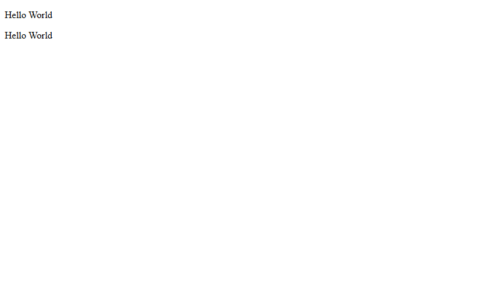

- [x] **Block-level tags listed on the page**
  - `<address>` `<article>` `<aside>` `<blockquote>` `<canvas>` `<dd>` `<div>` `<dl>` `<dt>` `<fieldset>` `<figcaption>` `<figure>` `<footer>` `<form>` `<h1>`–`<h6>` `<header>` `<hr>` `<li>` `<main>` `<nav>` `<noscript>` `<ol>` `<p>` `<pre>` `<section>` `<table>` `<tfoot>` `<ul>` `<video>`
- [x] **Inline elements**
  - Do **not** start on a new line.
  - Take up only as much **width as necessary**.
  - Example: a `<span>` by itself sits on one line.
  - **Note:** an inline element **cannot contain** a block-level element.
  - Sandbox: `span.html`.


- [x] **Inline tags listed on the page**
  - `<a>` `<abbr>` `<acronym>` `<b>` `<bdo>` `<big>` `<br>` `<button>` `<cite>` `<code>` `<dfn>` `<em>` `<i>` `` `<input>` `<kbd>` `<label>` `<map>` `<object>` `<output>` `<q>` `<samp>` `<script>` `<select>` `<small>` `<span>` `<strong>` `<sub>` `<sup>` `<textarea>` `<time>` `<tt>` `<var>`
  - HTML5 treats **`<acronym>`**, **`<big>`**, and **`<tt>`** as obsolete (use `<abbr>`, CSS `font-size`, and `<code>` / `<kbd>` / `<samp>` instead). The other tags on the list remain valid.
- [x] **The `<div>` element**
  - A **block-level** container for other HTML elements.
  - No required attributes; **`style`**, **`class`**, and **`id`** are common.
  - With CSS it can style a **block of content** (example: black background, white text, padding, heading **London** plus a paragraph).
  - Sandbox: `div.html`. More on `<div>` in the next chapter.

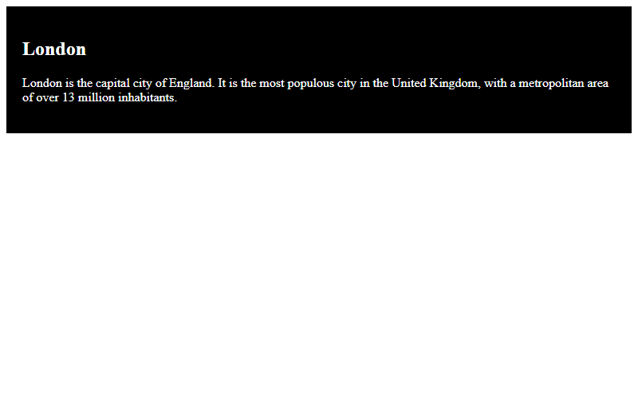

- [x] **The `<span>` element**
  - An **inline** container for a part of text or a part of a document.
  - No required attributes; **`style`**, **`class`**, and **`id`** are common.
  - With CSS it can style **parts of the text** (example: **blue** and **dark green** eye colors).
  - Sandbox: `span-style.html`.

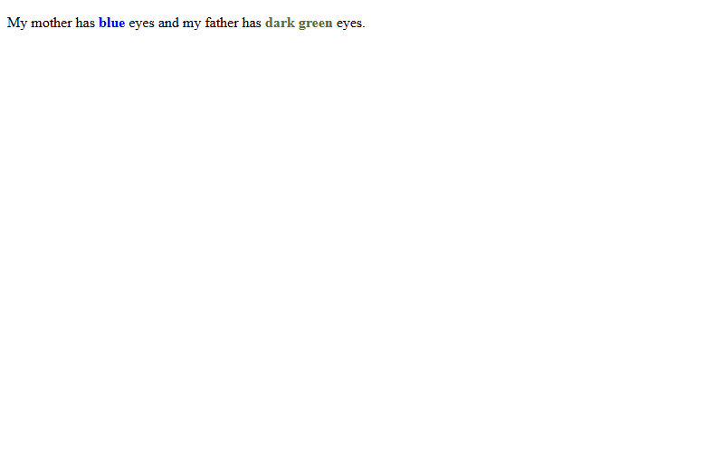

- [x] **Chapter summary from the page**
  - Block: new line + full width.
  - Inline: same line + width as needed.
  - `<div>` is a block container; `<span>` is an inline container.

| Tag      | Description                                   |
| -------- | --------------------------------------------- |
| `<div>`  | Defines a section in a document (block-level) |
| `<span>` | Defines a section in a document (inline)      |

Block `<p>` and `<div>` (`index.html`):

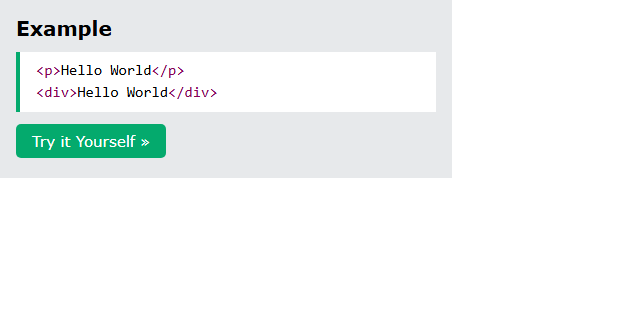

```html
<p>Hello World</p>
<div>Hello World</div>
```


Inline `<span>` (`span.html`):

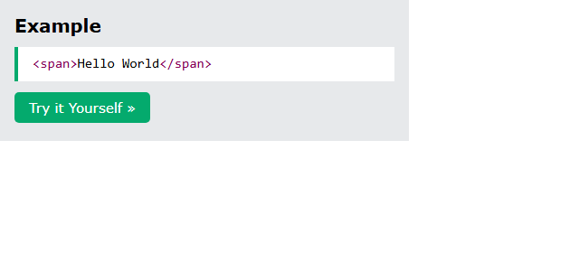

```html
<span>Hello World</span>
```


Styled `<div>` (`div.html`):

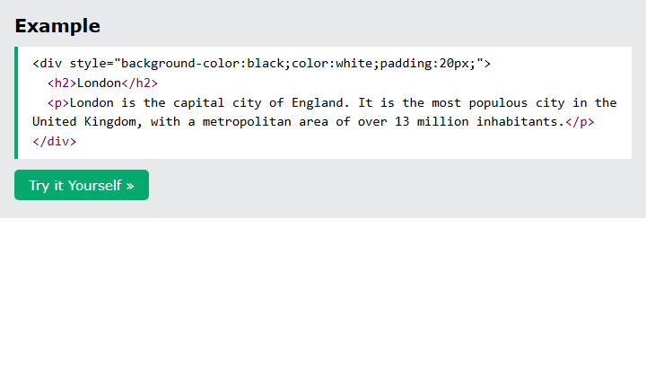

```html
<div style="background-color:black;color:white;padding:20px;">
  <h2>London</h2>
  <p>
    London is the capital city of England. It is the most populous city in the
    United Kingdom, with a metropolitan area of over 13 million inhabitants.
  </p>
</div>
```


Styled `<span>` (`span-style.html`):

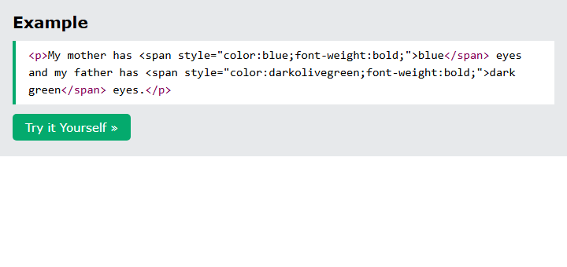

```html
<p>
  My mother has <span style="color:blue;font-weight:bold;">blue</span> eyes and
  my father has
  <span style="color:darkolivegreen;font-weight:bold;">dark green</span> eyes.
</p>
```


<details>
  <summary>Terminal Commands</summary>

## Terminal Commands

```bash
# from Personal/Files/html/code_sandbox
python -m http.server 8766 --bind 127.0.0.1
```

Then open `http://127.0.0.1:8766/html-block-inline/`.

</details>

<details>
  <summary>Questions and Answers</summary>

## Questions and Answers

### Question 1: What are the two most common default display values?

<details>
<summary>Answer</summary>

- [x] **Block**.
- [x] **Inline**.

</details>

### Question 2: How does a block-level element lay out?

<details>
<summary>Answer</summary>

- [x] It **starts on a new line**.
- [x] The browser adds **margin** before and after.
- [x] It takes the **full width** available.

</details>

### Question 3: Which two common tags are block-level in this chapter?

<details>
<summary>Answer</summary>

- [x] **`<p>`** (paragraph).
- [x] **`<div>`** (division / section).

</details>

### Question 4: How does an inline element lay out?

<details>
<summary>Answer</summary>

- [x] It does **not** start on a new line.
- [x] It takes only as much **width as necessary**.

</details>

### Question 5: Can an inline element contain a block-level element?

<details>
<summary>Answer</summary>

- [x] **No.**

</details>

### Question 6: What is `<div>` used for, and which attributes are common?

<details>
<summary>Answer</summary>

- [x] A **block-level container** for other HTML elements.
- [x] Common attributes: **`style`**, **`class`**, **`id`**.

</details>

### Question 7: What is `<span>` used for?

<details>
<summary>Answer</summary>

- [x] An **inline container** for a part of text or a part of a document.
- [x] With CSS it styles **parts of the text**.

</details>

### Question 8: Which listed inline tags are obsolete in HTML5?

<details>
<summary>Answer</summary>

- [x] **`<acronym>`** — use **`<abbr>`**.
- [x] **`<big>`** — use CSS **`font-size`**.
- [x] **`<tt>`** — use **`<code>`**, **`<kbd>`**, or **`<samp>`**.

</details>

</details>

## Summary

Block elements start on a new line and fill the available width (`<p>`, `<div>`, headings, lists, tables). Inline elements stay in the line and shrink to their content (`<span>`, `<a>`, ``). `<div>` is the generic block container; `<span>` is the generic inline container. Do not nest a block inside an inline element.

## References

- [HTML Block and Inline Elements (W3Schools)](https://www.w3schools.com/html/html_blocks.asp)
- [Try it Yourself: tryhtml_block_div](https://www.w3schools.com/html/tryit.asp?filename=tryhtml_block_div)
- [Try it Yourself: tryhtml_inline_span](https://www.w3schools.com/html/tryit.asp?filename=tryhtml_inline_span)
- [Try it Yourself: tryhtml_div](https://www.w3schools.com/html/tryit.asp?filename=tryhtml_div)
- [Try it Yourself: tryhtml_span](https://www.w3schools.com/html/tryit.asp?filename=tryhtml_span)
- [HTML Tag Reference](https://www.w3schools.com/tags/default.asp)
- [MDN: Block-level elements](https://developer.mozilla.org/en-US/docs/Glossary/Block-level_content)
- [MDN: Inline elements](https://developer.mozilla.org/en-US/docs/Glossary/Inline-level_content)
- [MDN: `<div>`](https://developer.mozilla.org/en-US/docs/Web/HTML/Element/div)
- [MDN: `<span>`](https://developer.mozilla.org/en-US/docs/Web/HTML/Element/span)

</details>

<details>
  <summary>HTML Div</summary>

## Introduction

The **`<div>`** element is a **block-level container** for other HTML elements. This chapter shows a full-width `<div>`, grouping content, **centering** with `margin: auto`, **multiple** containers, and four ways to put divs **side by side**: **float**, **inline-block**, **flex**, and **grid**.

## Detailed Explanation

- [x] **The `<div>` element**
  - Used as a **container** for other HTML elements.
  - Default: **block** — takes **all available width**, with **line breaks** before and after.
  - Example: `Lorem Ipsum <div>I am a div</div> dolor sit amet.` renders as three lines because the div breaks the sentence.
  - No required attributes; **`style`**, **`class`**, and **`id`** are common.
  - Sandbox: `code_sandbox/html-div/index.html`.

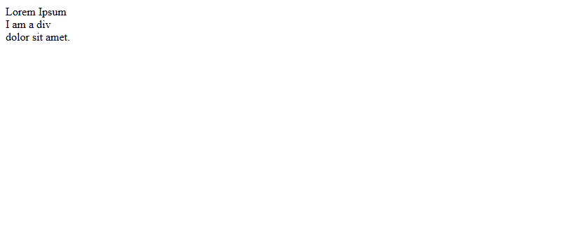

- [x] **`<div>` as a container**
  - Often used to **group sections** of a page.
  - Example: heading **London** plus two paragraphs inside one `<div>`.
  - Sandbox: `container.html`.

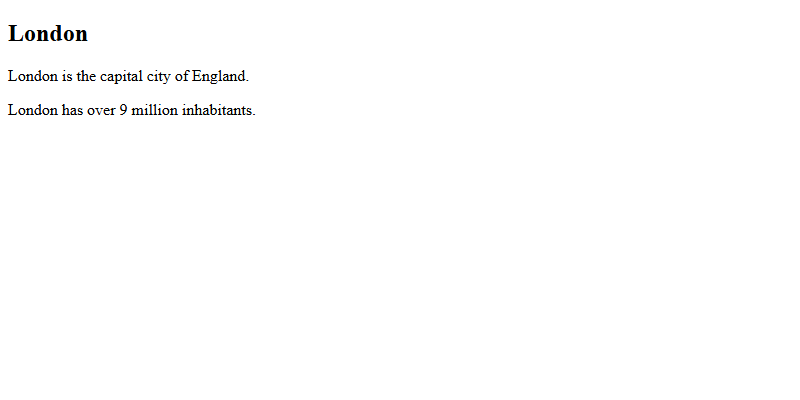

- [x] **Center-align a `<div>`**
  - If the div is **not 100% wide**, set CSS **`margin: auto`** to center it.
  - Example: `div { width: 300px; margin: auto; }`.
  - Sandbox: `center.html`.

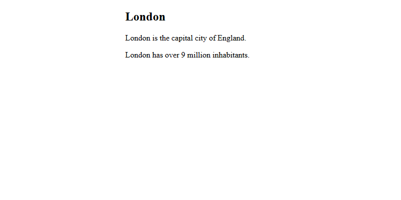

- [x] **Multiple `<div>` elements**
  - You can have **many** `<div>` containers on the same page.
  - Example: London, Oslo, and Rome stacked as three separate divs.
  - Sandbox: `multiple.html`.

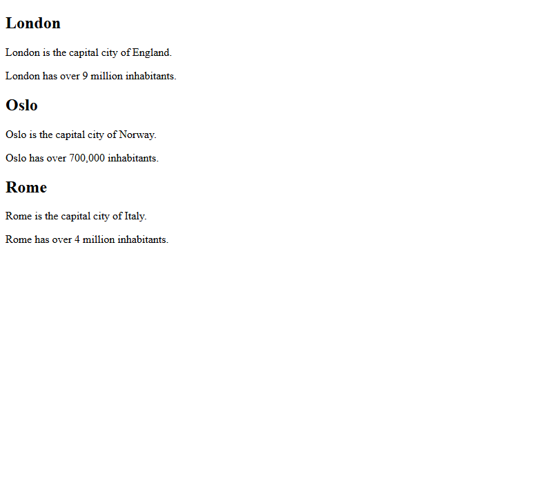

- [x] **Side by side — overview**
  - Pages often need two or more divs **in a row**.
  - Common CSS methods: **float**, **inline-block**, **flex**, **grid**.
- [x] **Float**
  - `float` was not originally for aligning divs, but has been used that way for years.
  - Positions content **horizontally** instead of only vertically.
  - Wrap columns in `.mycontainer` with `width: 100%; overflow: auto;` and `float: left; width: 33%;` on the inner divs.
  - Sandbox: `float.html`.


- [x] **Inline-block**
  - Change `display` from **block** to **`inline-block`**.
  - The div **no longer adds a line break** before and after, so siblings sit **side by side**.
  - Example: `div { width: 30%; display: inline-block; }`.
  - Sandbox: `inline-block.html`.

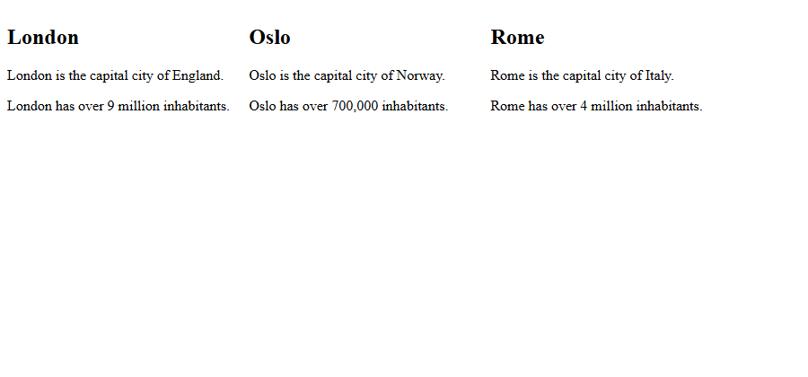

- [x] **Flex**
  - **Flexbox** is for flexible responsive layout **without float or positioning**.
  - Surround the column divs with a container and set **`display: flex`**.
  - Example: `.mycontainer { display: flex; }` and `.mycontainer > div { width: 33%; }`.
  - Sandbox: `flex.html`.


- [x] **Grid**
  - **CSS Grid** is rows and columns without floats/positioning.
  - Similar to flex, but you can define **more than one row** and position each row.
  - Surround columns with a grid container and set **column widths**.
  - Example: `.grid-container { display: grid; grid-template-columns: 33% 33% 33%; }`.
  - Sandbox: `grid.html`.

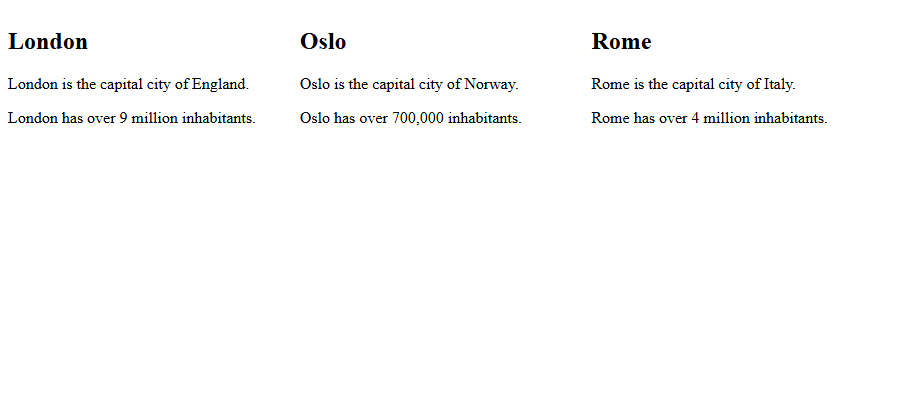

| Tag     | Description                                   |
| ------- | --------------------------------------------- |
| `<div>` | Defines a section in a document (block-level) |

Full-width break (`index.html`):

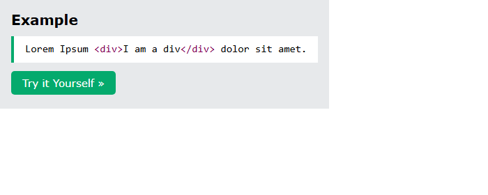

```html
Lorem Ipsum
<div>I am a div</div>
dolor sit amet.
```


Container (`container.html`):

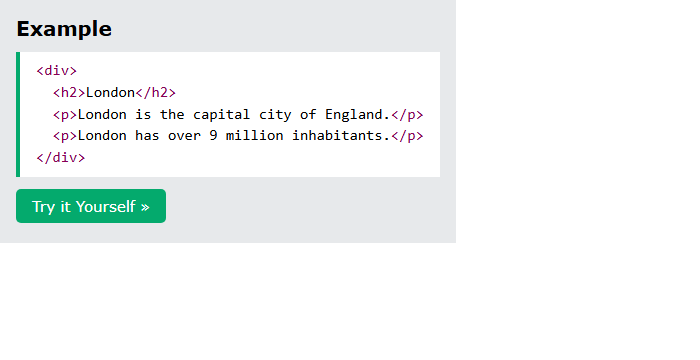

```html
<div>
  <h2>London</h2>
  <p>London is the capital city of England.</p>
  <p>London has over 9 million inhabitants.</p>
</div>
```


Center (`center.html`):

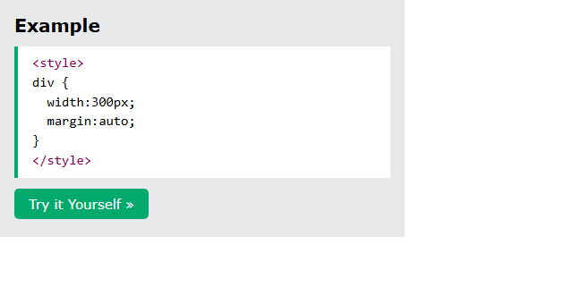

```css
div {
  width: 300px;
  margin: auto;
}
```


Multiple (`multiple.html`):

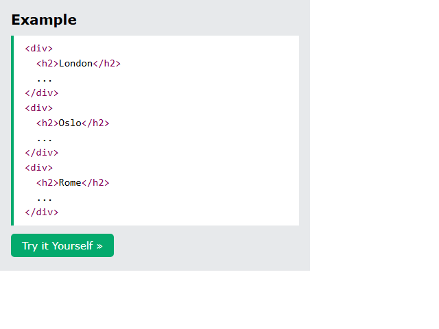

```html
<div><!-- London --></div>
<div><!-- Oslo --></div>
<div><!-- Rome --></div>
```


Float (`float.html`):

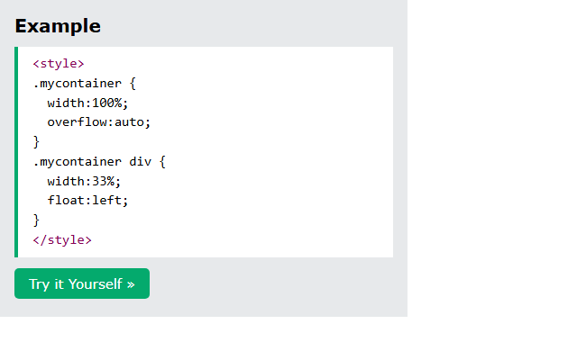

```css
.mycontainer {
  width: 100%;
  overflow: auto;
}
.mycontainer div {
  width: 33%;
  float: left;
}
```


Inline-block (`inline-block.html`):

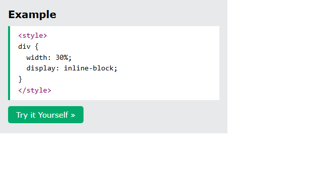

```css
div {
  width: 30%;
  display: inline-block;
}
```


Flex (`flex.html`):

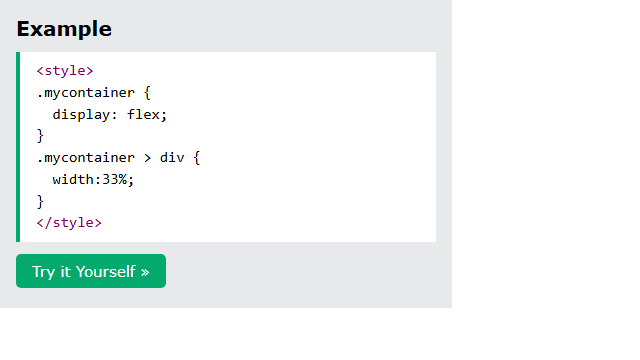

```css
.mycontainer {
  display: flex;
}
.mycontainer > div {
  width: 33%;
}
```


Grid (`grid.html`):

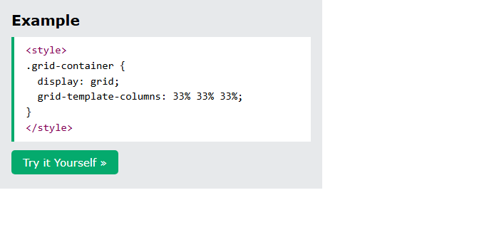

```css
.grid-container {
  display: grid;
  grid-template-columns: 33% 33% 33%;
}
```


<details>
  <summary>Terminal Commands</summary>

## Terminal Commands

```bash
# from Personal/Files/html/code_sandbox
python -m http.server 8766 --bind 127.0.0.1
```

Then open `http://127.0.0.1:8766/html-div/`.

</details>

<details>
  <summary>Questions and Answers</summary>

## Questions and Answers

### Question 1: What is a `<div>` for, and what is its default display?

<details>
<summary>Answer</summary>

- [x] A **container** for other HTML elements.
- [x] Default **block**: full width, line breaks before and after.

</details>

### Question 2: Which attributes are common on `<div>`?

<details>
<summary>Answer</summary>

- [x] **`style`**, **`class`**, and **`id`**.
- [x] None are required.

</details>

### Question 3: How do you center a `<div>` that is not 100% wide?

<details>
<summary>Answer</summary>

- [x] Set CSS **`margin: auto`**.
- [x] Example: `width: 300px; margin: auto;`.

</details>

### Question 4: Why does `Lorem Ipsum <div>I am a div</div> dolor sit amet.` become three lines?

<details>
<summary>Answer</summary>

- [x] The `<div>` is **block-level**.
- [x] It inserts **line breaks** before and after.

</details>

### Question 5: Which four CSS methods does this chapter use to put divs side by side?

<details>
<summary>Answer</summary>

- [x] **Float**.
- [x] **Inline-block**.
- [x] **Flex**.
- [x] **Grid**.

</details>

### Question 6: How does `display: inline-block` change a div?

<details>
<summary>Answer</summary>

- [x] It **stops** adding a line break before and after.
- [x] Sibling divs can sit **side by side**.

</details>

### Question 7: What extra wrapper do flex and grid need?

<details>
<summary>Answer</summary>

- [x] An outer `<div>` that is the **flex** or **grid** container.
- [x] Flex: `display: flex`. Grid: `display: grid` plus **column widths**.

</details>

### Question 8: How does grid differ from flex in this chapter?

<details>
<summary>Answer</summary>

- [x] Grid can define **more than one row**.
- [x] You can **position each row** individually.

</details>

</details>

## Summary

`<div>` is a full-width block container for grouping page sections. Center a narrower div with `margin: auto`. Use many divs on one page. To place them in a row, use float, `inline-block`, flexbox (`display: flex` on a wrapper), or grid (`display: grid` and `grid-template-columns`).

## References

- [HTML Div Element (W3Schools)](https://www.w3schools.com/html/html_div.asp)
- [Try it Yourself: tryhtml_div1](https://www.w3schools.com/html/tryit.asp?filename=tryhtml_div1)
- [Try it Yourself: tryhtml_div2](https://www.w3schools.com/html/tryit.asp?filename=tryhtml_div2)
- [Try it Yourself: tryhtml_div3](https://www.w3schools.com/html/tryit.asp?filename=tryhtml_div3)
- [Try it Yourself: tryhtml_div4](https://www.w3schools.com/html/tryit.asp?filename=tryhtml_div4)
- [Try it Yourself: tryhtml_div_float](https://www.w3schools.com/html/tryit.asp?filename=tryhtml_div_float)
- [Try it Yourself: tryhtml_div_inline-block](https://www.w3schools.com/html/tryit.asp?filename=tryhtml_div_inline-block)
- [Try it Yourself: tryhtml_div_flex](https://www.w3schools.com/html/tryit.asp?filename=tryhtml_div_flex)
- [Try it Yourself: tryhtml_div_grid](https://www.w3schools.com/html/tryit.asp?filename=tryhtml_div_grid)
- [CSS Float](https://www.w3schools.com/css/css_float.asp)
- [CSS Flexbox](https://www.w3schools.com/css/css3_flexbox.asp)
- [CSS Grid](https://www.w3schools.com/css/css_grid.asp)
- [MDN: `<div>`](https://developer.mozilla.org/en-US/docs/Web/HTML/Element/div)

</details>

<details>
  <summary>HTML Classes</summary>

## Introduction

The HTML **`class`** attribute names a class for an element. **Multiple elements can share** the same class. CSS uses a **period** plus the class name (`.city`) to style them; JavaScript can select them with **`getElementsByClassName()`**.

## Detailed Explanation

- [x] **The `class` attribute**
  - Specifies a **class** for an HTML element.
  - Often points to a **class name in a style sheet**.
  - JavaScript can also **access and manipulate** elements with that class name.
  - Example: three `<div class="city">` boxes (London, Paris, Tokyo) share `.city` — tomato background, white text, black border, margin and padding.
  - Sandbox: `code_sandbox/html-classes/index.html`.


- [x] **Same class on `<span>`**
  - Two `<span class="note">` elements share `.note` (`font-size: 120%`, `color: red`).
  - Example: **Important** in the heading and **important** in the paragraph.
  - Sandbox: `note.html`.


- [x] **Tips from the page**
  - The `class` attribute can be used on **any HTML element**.
  - The class name is **case sensitive**.
- [x] **Syntax for a class**
  - Write a **period (`.`)** then the class name, then CSS in **curly braces**.
  - Example: `.city { background-color: tomato; color: white; padding: 10px; }` on three `<h2 class="city">` headings.
  - Sandbox: `syntax.html`.


- [x] **Multiple classes**
  - An element can belong to **more than one** class.
  - Separate names with a **space**: `<div class="city main">`.
  - The element gets styles from **all** listed classes.
  - Example: London has `city main` (centered); Paris and Tokyo have only `city`.
  - Sandbox: `multiple.html`.


- [x] **Different elements can share the same class**
  - Example: `<h2>` and `<p>` both use `class="city"` and share the style.
  - Sandbox: `share.html`.


- [x] **JavaScript and classes**
  - `document.getElementsByClassName("city")` returns those elements.
  - Example: a button hides every `.city` (`display: none` in a loop).
  - Sandbox: `js.html`. More JavaScript is in a later chapter.


- [x] **Chapter summary from the page**
  - `class` specifies **one or more** class names.
  - CSS and JavaScript **select** elements by class.
  - Usable on **any** element; **case sensitive**; different tags can share a class; JS uses **`getElementsByClassName()`**.

Shared `.city` boxes (`index.html`):


```html
<style>
  .city {
    background-color: tomato;
    color: white;
    border: 2px solid black;
    margin: 20px;
    padding: 20px;
  }
</style>
<div class="city">
  <h2>London</h2>
  <p>London is the capital of England.</p>
</div>
```


`.note` spans (`note.html`):


```html
<h1>My <span class="note">Important</span> Heading</h1>
<p>This is some <span class="note">important</span> text.</p>
```


Class syntax (`syntax.html`):


```css
.city {
  background-color: tomato;
  color: white;
  padding: 10px;
}
```


Multiple classes (`multiple.html`):


```html
<h2 class="city main">London</h2>
<h2 class="city">Paris</h2>
<h2 class="city">Tokyo</h2>
```


Shared class on different tags (`share.html`):


```html
<h2 class="city">Paris</h2>
<p class="city">Paris is the capital of France</p>
```


JavaScript (`js.html`):


```html
<script>
  function myFunction() {
    var x = document.getElementsByClassName("city");
    for (var i = 0; i < x.length; i++) {
      x[i].style.display = "none";
    }
  }
</script>
```


<details>
  <summary>Terminal Commands</summary>

## Terminal Commands

```bash
# from Personal/Files/html/code_sandbox
python -m http.server 8766 --bind 127.0.0.1
```

Then open `http://127.0.0.1:8766/html-classes/`.

</details>

<details>
  <summary>Questions and Answers</summary>

## Questions and Answers

### Question 1: What does the HTML `class` attribute do?

<details>
<summary>Answer</summary>

- [x] Specifies a **class** for an element.
- [x] **Multiple** elements can share the same class.

</details>

### Question 2: How do you write a CSS class selector?

<details>
<summary>Answer</summary>

- [x] A **period (`.`)** then the class name.
- [x] Then properties inside **curly braces** `{}`.

</details>

### Question 3: Can you put `class` on any HTML element, and is the name case sensitive?

<details>
<summary>Answer</summary>

- [x] **Yes**, it can be used on any HTML element.
- [x] The class name is **case sensitive**.

</details>

### Question 4: How do you assign multiple classes to one element?

<details>
<summary>Answer</summary>

- [x] Separate class names with a **space**.
- [x] Example: `<div class="city main">`.
- [x] The element gets styles from **all** of those classes.

</details>

### Question 5: Can different tags share one class name?

<details>
<summary>Answer</summary>

- [x] **Yes.** Example: `<h2>` and `<p>` both with `class="city"`.

</details>

### Question 6: How does JavaScript select elements by class in this chapter?

<details>
<summary>Answer</summary>

- [x] **`document.getElementsByClassName("city")`**.
- [x] Then loop and change each element (example: `display = "none"`).

</details>

</details>

## Summary

`class` names one or more classes on any element (case sensitive). CSS targets them with `.classname`. Several elements — even different tags — can share a class; one element can have several classes separated by spaces. JavaScript uses `getElementsByClassName()` to find those elements.

## References

- [HTML class Attribute (W3Schools)](https://www.w3schools.com/html/html_classes.asp)
- [Try it Yourself: tryhtml_classes_capitals](https://www.w3schools.com/html/tryit.asp?filename=tryhtml_classes_capitals)
- [Try it Yourself: tryhtml_classes_span](https://www.w3schools.com/html/tryit.asp?filename=tryhtml_classes_span)
- [Try it Yourself: tryhtml_classes_css](https://www.w3schools.com/html/tryit.asp?filename=tryhtml_classes_css)
- [Try it Yourself: tryhtml_classes_multiple](https://www.w3schools.com/html/tryit.asp?filename=tryhtml_classes_multiple)
- [Try it Yourself: tryhtml_classes_tags](https://www.w3schools.com/html/tryit.asp?filename=tryhtml_classes_tags)
- [Try it Yourself: tryhtml_classes_js](https://www.w3schools.com/html/tryit.asp?filename=tryhtml_classes_js)
- [CSS Tutorial](https://www.w3schools.com/css/default.asp)
- [HTML JavaScript](https://www.w3schools.com/html/html_scripts.asp)
- [MDN: class](https://developer.mozilla.org/en-US/docs/Web/HTML/Global_attributes/class)
- [MDN: `getElementsByClassName()`](https://developer.mozilla.org/en-US/docs/Web/API/Document/getElementsByClassName)

</details>

<details>
  <summary>HTML Id</summary>

## Introduction

The HTML **`id`** attribute gives an element a **unique** name in the document. CSS targets it with a **hash** (`#myHeader`). The same value also makes **bookmarks** (`href="#C4"`) and lets JavaScript use **`getElementById()`**. A **class** may be reused; an **id** may not.

## Detailed Explanation

- [x] **The `id` attribute**
  - Specifies a **unique id** for an HTML element.
  - You **cannot** have more than one element with the same `id` in a document.
  - Used to point to a **specific style** in a style sheet, and by JavaScript to access that element.
  - CSS syntax: **hash (`#`)** + id name + properties in `{}`.
  - Example: `<h1 id="myHeader">` styled by `#myHeader` (light blue, padding, centered).
  - Sandbox: `code_sandbox/html-id/index.html`.


- [x] **Id name rules (from the page)**
  - The id name is **case sensitive**.
  - Must contain **at least one character**.
  - **Cannot start with a number**.
  - Must **not contain whitespaces** (spaces, tabs, and so on).
- [x] **Difference between class and id**
  - A **class** name can be used by **multiple** elements.
  - An **id** name must be used by **only one** element on the page.
  - Example: unique `#myHeader` (“My Cities”) plus shared `.city` on London, Paris, Tokyo.
  - Sandbox: `class.html`.

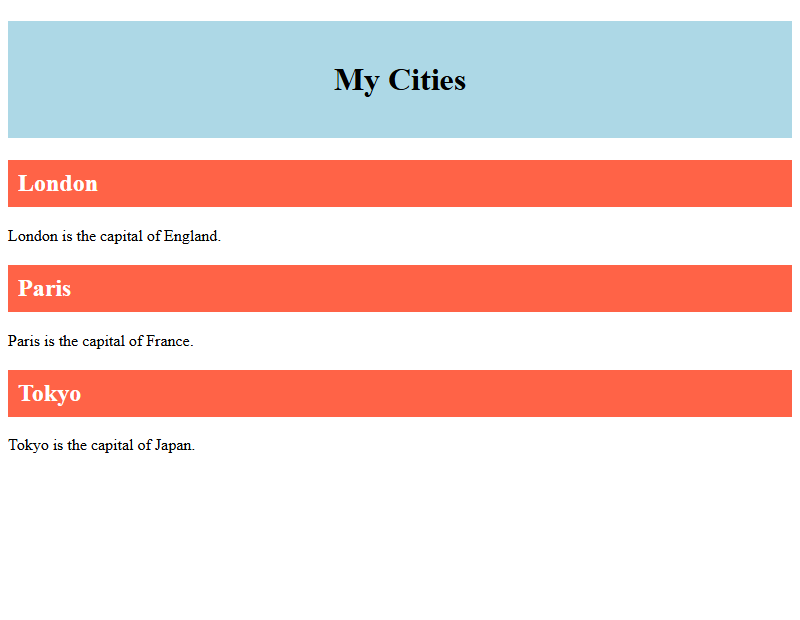

- [x] **HTML bookmarks with id and links**
  - Bookmarks let readers **jump** to a part of a (often long) page.
  - Create the bookmark: `<h2 id="C4">Chapter 4</h2>`.
  - Same-page link: `<a href="#C4">Jump to Chapter 4</a>`.
  - Other-page link: `<a href="html_demo.html#C4">Jump to Chapter 4</a>`.
  - Sandbox: `bookmark.html`.

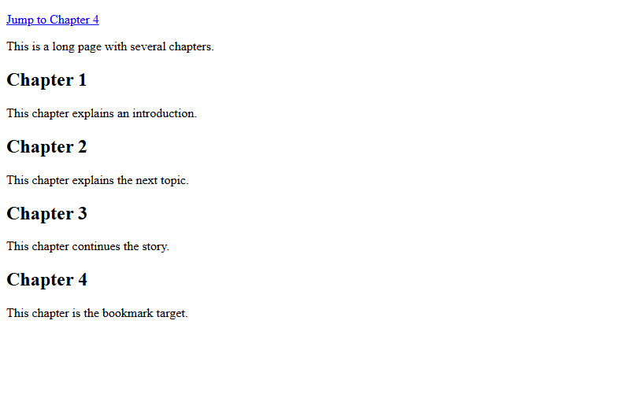

- [x] **JavaScript and id**
  - `document.getElementById("myHeader")` accesses that one element.
  - Example: set `innerHTML` to **Have a nice day!**.
  - Sandbox: `js.html`.

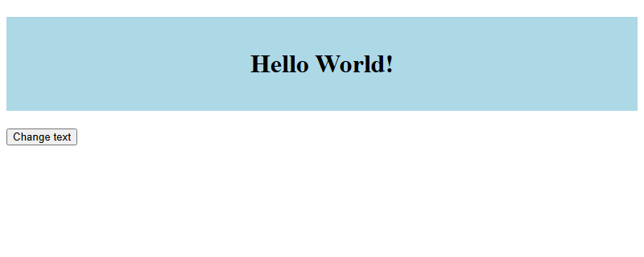

- [x] **Chapter summary from the page**
  - Unique id per document; CSS and JS select it; **case sensitive**; also used for **bookmarks**; JS uses **`getElementById()`**.

Unique id (`index.html`):

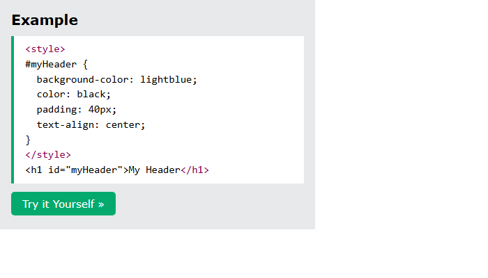

```html
<style>
  #myHeader {
    background-color: lightblue;
    color: black;
    padding: 40px;
    text-align: center;
  }
</style>
<h1 id="myHeader">My Header</h1>
```


Class vs id (`class.html`):

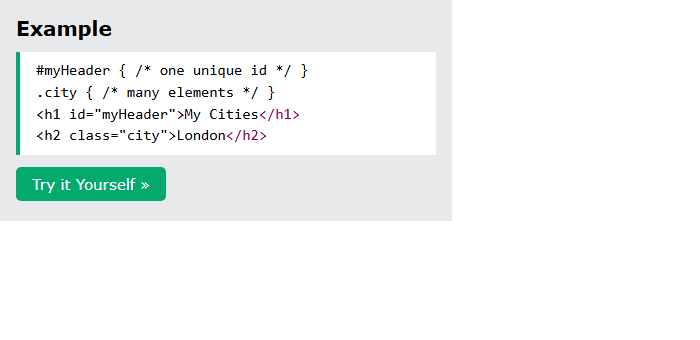

```css
#myHeader {
  /* one unique id */
}
.city {
  /* many elements */
}
```


Bookmark (`bookmark.html`):

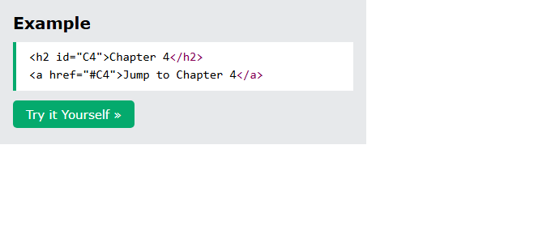

```html
<h2 id="C4">Chapter 4</h2>
<a href="#C4">Jump to Chapter 4</a>
```


JavaScript (`js.html`):

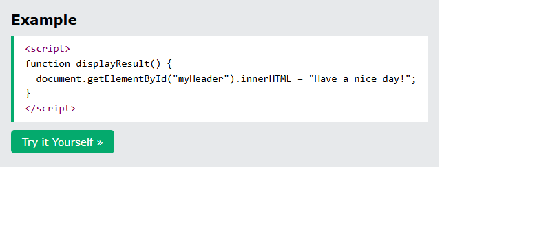

```html
<script>
  function displayResult() {
    document.getElementById("myHeader").innerHTML = "Have a nice day!";
  }
</script>
```


<details>
  <summary>Terminal Commands</summary>

## Terminal Commands

```bash
# from Personal/Files/html/code_sandbox
python -m http.server 8766 --bind 127.0.0.1
```

Then open `http://127.0.0.1:8766/html-id/`.

</details>

<details>
  <summary>Questions and Answers</summary>

## Questions and Answers

### Question 1: What does the `id` attribute specify, and how many elements may share it?

<details>
<summary>Answer</summary>

- [x] A **unique id** for an HTML element.
- [x] **Only one** element per document may use that value.

</details>

### Question 2: How do you write a CSS id selector?

<details>
<summary>Answer</summary>

- [x] A **hash (`#`)** then the id name.
- [x] Then properties inside **curly braces**.

</details>

### Question 3: What rules apply to an id name?

<details>
<summary>Answer</summary>

- [x] **Case sensitive**.
- [x] At least **one character**.
- [x] **Cannot start with a number**.
- [x] **No whitespaces**.

</details>

### Question 4: How does `class` differ from `id`?

<details>
<summary>Answer</summary>

- [x] A **class** can be used by **multiple** elements.
- [x] An **id** must be used by **only one** element on the page.

</details>

### Question 5: How do you create a same-page bookmark?

<details>
<summary>Answer</summary>

- [x] Put `id` on the target: `<h2 id="C4">Chapter 4</h2>`.
- [x] Link with `<a href="#C4">Jump to Chapter 4</a>`.

</details>

### Question 6: How do you link to a bookmark on another page?

<details>
<summary>Answer</summary>

- [x] Use the filename plus the hash: `html_demo.html#C4`.

</details>

### Question 7: How does JavaScript select one element by id?

<details>
<summary>Answer</summary>

- [x] **`document.getElementById("myHeader")`**.

</details>

</details>

## Summary

`id` is unique, case sensitive, and cannot start with a number or contain spaces. CSS uses `#id`. Class can be reused; id cannot. Use `id` plus `href="#id"` for bookmarks, and `getElementById()` in JavaScript.

## References

- [HTML id Attribute (W3Schools)](https://www.w3schools.com/html/html_id.asp)
- [Try it Yourself: tryhtml_id_css](https://www.w3schools.com/html/tryit.asp?filename=tryhtml_id_css)
- [Try it Yourself: tryhtml_id_class](https://www.w3schools.com/html/tryit.asp?filename=tryhtml_id_class)
- [Try it Yourself: tryhtml_id_bookmark](https://www.w3schools.com/html/tryit.asp?filename=tryhtml_id_bookmark)
- [Try it Yourself: tryhtml_id_js](https://www.w3schools.com/html/tryit.asp?filename=tryhtml_id_js)
- [CSS Tutorial](https://www.w3schools.com/css/default.asp)
- [HTML JavaScript](https://www.w3schools.com/html/html_scripts.asp)
- [MDN: id](https://developer.mozilla.org/en-US/docs/Web/HTML/Global_attributes/id)
- [MDN: `getElementById()`](https://developer.mozilla.org/en-US/docs/Web/API/Document/getElementById)

</details>

<details>
  <summary>HTML Buttons</summary>

## Introduction

Buttons let users **interact** with a page: submit forms, run JavaScript, or trigger actions. This chapter covers the **`<button>`** element, CSS styling, **`disabled`**, **`onclick`**, and the **`type`** values **`button`**, **`submit`**, and **`reset`**.

## Detailed Explanation

- [x] **HTML button**
  - `<button>` defines a **clickable** button.
  - By itself it **does nothing** until you add an action.
  - Example: `<button>Click Me</button>`.
  - Sandbox: `code_sandbox/html-buttons/index.html`.


- [x] **Styling HTML buttons**
  - Buttons are often styled with **CSS**.
  - Example: `<button class="mytestbtn">Green Button</button>` (sandbox uses W3Schools green `#04AA6D`).
  - Sandbox: `styled.html`.


- [x] **Disabled buttons**
  - The **`disabled`** attribute makes a button **unclickable**.
  - Disabled buttons usually appear **faded**.
  - Example: `<button disabled>Disabled Button</button>`.
  - Sandbox: `disabled.html`.


- [x] **Button with JavaScript**
  - Run JS on click with **`onclick`**.
  - Example: `<button onclick="alert('Hello!')">Click Me</button>`.
  - Sandbox: `js.html`. More JS in the HTML JavaScript chapter.


- [x] **Button types**
  - **`type="button"`** — normal clickable button (does nothing by default).
  - **`type="submit"`** — submits a form.
  - **`type="reset"`** — resets all form fields.
  - Sandbox: `types.html`.


- [x] **Buttons in a form**
  - Submit sends form data to the server; reset clears the fields.
  - Example: first-name input, **Submit**, **Reset Form**, `action="/action_page.php"`.
  - **Always specify `type`**. Inside a form, the **default type is submit**, and browsers may differ if `type` is omitted.
  - Sandbox: `form.html`. Forms are covered in a later chapter.


| Tag        | Description                |
| ---------- | -------------------------- |
| `<button>` | Defines a clickable button |

Basic (`index.html`):


```html
<button>Click Me</button>
```


Styled (`styled.html`):


```html
<button class="mytestbtn">Green Button</button>
```


Disabled (`disabled.html`):


```html
<button disabled>Disabled Button</button>
```


JavaScript (`js.html`):


```html
<button onclick="alert('Hello!')">Click Me</button>
```


Types (`types.html`):


```html
<button type="button">Normal Button</button>
<button type="submit">Submit</button>
<button type="reset">Reset</button>
```


Form (`form.html`):


```html
<form action="/action_page.php">
  First name: <input type="text" name="fname" />
  <button type="submit">Submit</button>
  <button type="reset">Reset Form</button>
</form>
```


<details>
  <summary>Terminal Commands</summary>

## Terminal Commands

```bash
# from Personal/Files/html/code_sandbox
python -m http.server 8766 --bind 127.0.0.1
```

Then open `http://127.0.0.1:8766/html-buttons/`.

</details>

<details>
  <summary>Questions and Answers</summary>

## Questions and Answers

### Question 1: What does `<button>` define, and what happens with no action?

<details>
<summary>Answer</summary>

- [x] A **clickable** button.
- [x] By itself it **does nothing** until you add an action.

</details>

### Question 2: How do you make a button unclickable?

<details>
<summary>Answer</summary>

- [x] Add the **`disabled`** attribute.
- [x] It usually appears **faded**.

</details>

### Question 3: How does this chapter run JavaScript on a click?

<details>
<summary>Answer</summary>

- [x] The **`onclick`** attribute.
- [x] Example: `onclick="alert('Hello!')"`.

</details>

### Question 4: What are the three `type` values?

<details>
<summary>Answer</summary>

- [x] **`button`** — normal; does nothing by default.
- [x] **`submit`** — submits a form.
- [x] **`reset`** — resets form fields.

</details>

### Question 5: Why should you always specify `type` on a button?

<details>
<summary>Answer</summary>

- [x] Inside a form, the **default type is submit**.
- [x] Browsers may **behave differently** if `type` is omitted.

</details>

### Question 6: What do submit and reset do in a form?

<details>
<summary>Answer</summary>

- [x] **Submit** sends the form data to the server.
- [x] **Reset** clears the form fields.

</details>

</details>

## Summary

`<button>` is a clickable control. Style it with CSS, disable it with `disabled`, and run JS with `onclick`. Always set `type`: `button`, `submit`, or `reset`. Inside a form the default is submit.

## References

- [HTML Buttons (W3Schools)](https://www.w3schools.com/html/html_buttons.asp)
- [Try it Yourself: tryhtml_buttons_basic](https://www.w3schools.com/html/tryit.asp?filename=tryhtml_buttons_basic)
- [Try it Yourself: tryhtml_buttons_styled](https://www.w3schools.com/html/tryit.asp?filename=tryhtml_buttons_styled)
- [Try it Yourself: tryhtml_buttons_disabled](https://www.w3schools.com/html/tryit.asp?filename=tryhtml_buttons_disabled)
- [Try it Yourself: tryhtml_buttons_javascript](https://www.w3schools.com/html/tryit.asp?filename=tryhtml_buttons_javascript)
- [Try it Yourself: tryhtml_buttons_form](https://www.w3schools.com/html/tryit.asp?filename=tryhtml_buttons_form)
- [HTML Tag Reference](https://www.w3schools.com/tags/default.asp)
- [MDN: `<button>`](https://developer.mozilla.org/en-US/docs/Web/HTML/Element/button)

</details>

<details>
  <summary>HTML Iframes</summary>

## Introduction

An HTML **iframe** displays a **web page inside a web page**. `<iframe>` is an **inline frame** that embeds another document. This chapter covers **`src`**, **`title`**, **height/width**, **borders**, and using an iframe as a **link target**.

## Detailed Explanation

- [x] **Syntax**
  - `<iframe src="url" title="description"></iframe>`
  - **`src`** is the URL of the page to embed.
  - Always include **`title`** so screen readers can describe the iframe.
  - Local demo page: `demo_iframe.htm` (the W3Schools examples use the same filename).
- [x] **Height and width**
  - Default unit is **pixels**.
  - Attributes: `height="200" width="300"`.
  - Or CSS: `style="height:200px;width:300px;"`.
  - Sandbox: `code_sandbox/html-iframes/index.html` and `css-size.html`.


- [x] **Remove or style the border**
  - An iframe has a **border by default**.
  - Remove it: `style="border:none;"`.
  - Change it: `style="border:2px solid red;"`.
  - Sandbox: `noborder.html` and `redborder.html`.


- [x] **Iframe as a link target**
  - The link’s **`target`** must match the iframe’s **`name`**.
  - Example: `name="iframe_a"` and `<a href="https://www.w3schools.com" target="iframe_a">W3Schools.com</a>`.
  - Sandbox: `target.html`.


- [x] **Chapter summary from the page**
  - `<iframe>` = inline frame; **`src`** = URL; always **`title`**; **height/width** set size; **`border:none;`** removes the border.

| Tag        | Description             |
| ---------- | ----------------------- |
| `<iframe>` | Defines an inline frame |

Size attributes (`index.html`):


```html
<iframe
  src="demo_iframe.htm"
  height="200"
  width="300"
  title="Iframe Example"
></iframe>
```


CSS size (`css-size.html`):


```html
<iframe
  src="demo_iframe.htm"
  style="height:200px;width:300px;"
  title="Iframe Example"
></iframe>
```


No border (`noborder.html`):


```html
<iframe
  src="demo_iframe.htm"
  style="border:none;"
  title="Iframe Example"
></iframe>
```


Red border (`redborder.html`):


```html
<iframe
  src="demo_iframe.htm"
  style="border:2px solid red;"
  title="Iframe Example"
></iframe>
```


Target (`target.html`):


```html
<iframe src="demo_iframe.htm" name="iframe_a" title="Iframe Example"></iframe>
<p><a href="https://www.w3schools.com" target="iframe_a">W3Schools.com</a></p>
```


<details>
  <summary>Terminal Commands</summary>

## Terminal Commands

```bash
# from Personal/Files/html/code_sandbox
python -m http.server 8766 --bind 127.0.0.1
```

Then open `http://127.0.0.1:8766/html-iframes/`.

</details>

<details>
  <summary>Questions and Answers</summary>

## Questions and Answers

### Question 1: What is an HTML iframe for?

<details>
<summary>Answer</summary>

- [x] To display a **web page within a web page**.
- [x] `<iframe>` embeds another document in the current one.

</details>

### Question 2: Which attributes set the page URL and the accessible name?

<details>
<summary>Answer</summary>

- [x] **`src`** — URL to embed.
- [x] **`title`** — description for **screen readers** (always include it).

</details>

### Question 3: How do you set iframe size?

<details>
<summary>Answer</summary>

- [x] `height` and `width` attributes (pixels by default).
- [x] Or CSS `height` and `width` in the **`style`** attribute.

</details>

### Question 4: How do you remove the default iframe border?

<details>
<summary>Answer</summary>

- [x] `style="border:none;"`.

</details>

### Question 5: How do you open a link inside an iframe?

<details>
<summary>Answer</summary>

- [x] Give the iframe a **`name`**.
- [x] Set the link’s **`target`** to that same name.

</details>

</details>

## Summary

`<iframe src="..." title="...">` embeds another document. Set size with `height`/`width` or CSS. Remove the default border with `border:none`, or restyle it. Point a link at the iframe with matching `name` and `target`.

## References

- [HTML Iframes (W3Schools)](https://www.w3schools.com/html/html_iframe.asp)
- [Try it Yourself: tryhtml_iframe_height_width](https://www.w3schools.com/html/tryit.asp?filename=tryhtml_iframe_height_width)
- [Try it Yourself: tryhtml_iframe_height_width_css](https://www.w3schools.com/html/tryit.asp?filename=tryhtml_iframe_height_width_css)
- [Try it Yourself: tryhtml_iframe_frameborder](https://www.w3schools.com/html/tryit.asp?filename=tryhtml_iframe_frameborder)
- [Try it Yourself: tryhtml_iframe_border2](https://www.w3schools.com/html/tryit.asp?filename=tryhtml_iframe_border2)
- [Try it Yourself: tryhtml_iframe_target](https://www.w3schools.com/html/tryit.asp?filename=tryhtml_iframe_target)
- [HTML Tag Reference](https://www.w3schools.com/tags/default.asp)
- [MDN: `<iframe>`](https://developer.mozilla.org/en-US/docs/Web/HTML/Element/iframe)

</details>

<details>
  <summary>HTML JavaScript</summary>

## Introduction

**JavaScript** makes HTML pages more **dynamic and interactive**. This chapter covers the **`<script>`** tag, `getElementById()`, changing **content**, **styles**, and **attributes**, and **`<noscript>`** for browsers without scripts.

## Detailed Explanation

- [x] **My First JavaScript**
  - A button writes the current **date and time** into a paragraph.
  - Sandbox: `code_sandbox/html-javascript/index.html`.

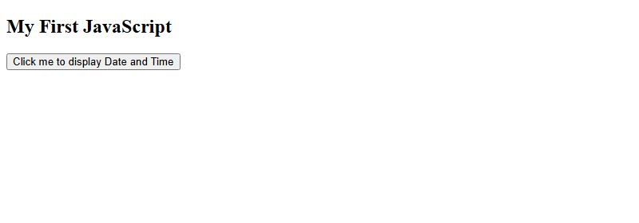

- [x] **The `<script>` tag**
  - Defines a **client-side script** (JavaScript).
  - Either contains statements, or points to an external file with **`src`**.
  - Common uses: image manipulation, form validation, dynamic content.
  - Selecting an element: **`document.getElementById()`**.
  - Example: write **Hello JavaScript!** into `id="demo"`.
  - Sandbox: `content.html`.

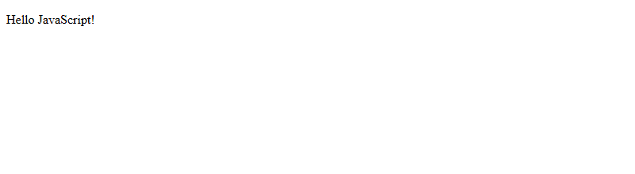

- [x] **A taste of JavaScript**
  - **Change content:** `innerHTML = "Hello JavaScript!"`.
  - **Change styles:** `fontSize`, `color`, `backgroundColor`.
  - **Change attributes:** `src` on an image (`picture.gif` in the sandbox).
  - Sandbox: `styles.html` and `attribute.html`.

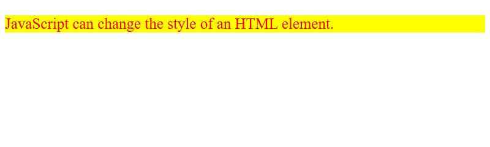


- [x] **The `<noscript>` tag**
  - Alternate content if scripts are **disabled** or unsupported.
  - Example: `Sorry, your browser does not support JavaScript!`
  - With JS on, the script runs and noscript is hidden.
  - Sandbox: `noscript.html`.


| Tag          | Description                                                         |
| ------------ | ------------------------------------------------------------------- |
| `<script>`   | Defines a client-side script                                        |
| `<noscript>` | Alternate content for users that do not support client-side scripts |

Date button (`index.html`):

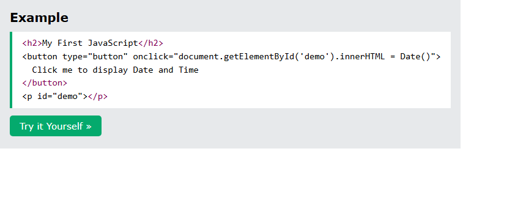

```html
<button
  type="button"
  onclick="document.getElementById('demo').innerHTML = Date()"
>
  Click me to display Date and Time
</button>
<p id="demo"></p>
```


Change content (`content.html`):

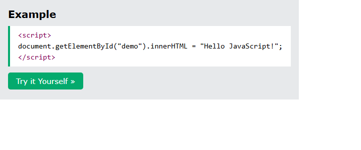

```html
<script>
  document.getElementById("demo").innerHTML = "Hello JavaScript!";
</script>
```


Change styles (`styles.html`):

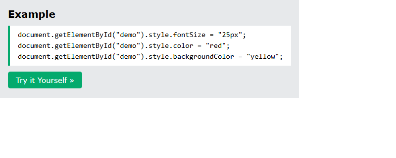

```js
document.getElementById("demo").style.fontSize = "25px";
document.getElementById("demo").style.color = "red";
document.getElementById("demo").style.backgroundColor = "yellow";
```


Change attributes (`attribute.html`):

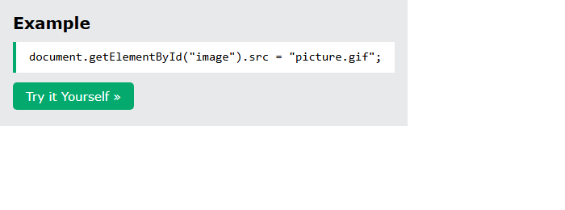

```js
document.getElementById("image").src = "picture.gif";
```


Noscript (`noscript.html`):

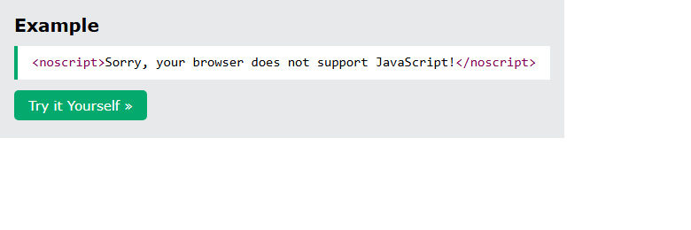

```html
<noscript>Sorry, your browser does not support JavaScript!</noscript>
```


<details>
  <summary>Terminal Commands</summary>

## Terminal Commands

```bash
# from Personal/Files/html/code_sandbox
python -m http.server 8766 --bind 127.0.0.1
```

Then open `http://127.0.0.1:8766/html-javascript/`.

</details>

<details>
  <summary>Questions and Answers</summary>

## Questions and Answers

### Question 1: What does JavaScript add to HTML pages?

<details>
<summary>Answer</summary>

- [x] It makes pages more **dynamic and interactive**.

</details>

### Question 2: What does the `<script>` tag do?

<details>
<summary>Answer</summary>

- [x] Defines a **client-side script** (JavaScript).
- [x] It can contain statements, or load a file with **`src`**.

</details>

### Question 3: How does this chapter select an HTML element?

<details>
<summary>Answer</summary>

- [x] **`document.getElementById()`**.

</details>

### Question 4: How can JavaScript change content, style, and an attribute?

<details>
<summary>Answer</summary>

- [x] Content: **`innerHTML`**.
- [x] Style: properties like **`fontSize`**, **`color`**, **`backgroundColor`**.
- [x] Attribute: example **`src`** on an image.

</details>

### Question 5: What is `<noscript>` for?

<details>
<summary>Answer</summary>

- [x] Alternate content if scripts are **disabled** or **unsupported**.

</details>

</details>

## Summary

`<script>` holds or loads JavaScript. Use `getElementById()` to change `innerHTML`, CSS styles, or attributes. `<noscript>` is fallback text when JS is off.

## References

- [HTML JavaScript (W3Schools)](https://www.w3schools.com/html/html_scripts.asp)
- [Try it Yourself: tryhtml_scripts_intro](https://www.w3schools.com/html/tryit.asp?filename=tryhtml_scripts_intro)
- [Try it Yourself: tryhtml_script](https://www.w3schools.com/html/tryit.asp?filename=tryhtml_script)
- [Try it Yourself: tryhtml_script_html](https://www.w3schools.com/html/tryit.asp?filename=tryhtml_script_html)
- [Try it Yourself: tryhtml_script_styles](https://www.w3schools.com/html/tryit.asp?filename=tryhtml_script_styles)
- [Try it Yourself: tryhtml_script_attribute](https://www.w3schools.com/html/tryit.asp?filename=tryhtml_script_attribute)
- [Try it Yourself: tryhtml_noscript](https://www.w3schools.com/html/tryit.asp?filename=tryhtml_noscript)
- [JavaScript Tutorial](https://www.w3schools.com/js/default.asp)
- [MDN: `<script>`](https://developer.mozilla.org/en-US/docs/Web/HTML/Element/script)
- [MDN: `<noscript>`](https://developer.mozilla.org/en-US/docs/Web/HTML/Element/noscript)

</details>

<details>
  <summary>HTML File Paths</summary>

## Introduction

A **file path** is the location of a file in a site’s folder structure. Paths are used for pages, images, style sheets, and scripts. This chapter compares **absolute** (full URL) and **relative** paths, and recommends relative paths when possible.

## Detailed Explanation

- [x] **File path examples (from the page)**

| Path                              | Description                                        |
| --------------------------------- | -------------------------------------------------- |
| ``         | Same folder as the current page                    |
| ``  | `images` folder in the current folder              |
| `` | `images` folder at the **root** of the current web |
| ``      | Folder **one level up**                            |

- [x] **Used when linking to**
  - Web pages, images, style sheets, JavaScripts.
- [x] **Absolute file paths**
  - The **full URL** to a file.
  - Example: `https://www.w3schools.com/images/picture.jpg` (alt **Mountain**).
  - Sandbox: `code_sandbox/html-filepaths/absolute.html`.


- [x] **Relative file paths**
  - Point to a file **relative to the current page**.
  - Root of the site: `/images/picture.jpg` (sandbox serves this from `code_sandbox/images/`).
  - Current folder: `images/picture.jpg`.
  - One level up (example on the page): `../images/picture.jpg` (sandbox: `nested/up.html`).
  - Sandbox: `root.html`, `folder.html`, `nested/up.html`. Same-folder also: `index.html` (`picture.jpg`).


- [x] **Best practice**
  - Prefer **relative** file paths when possible.
  - Then pages are **not bound** to the current base URL.
  - Links work on **localhost**, the current public domain, and **future** domains.

Absolute (`absolute.html`):

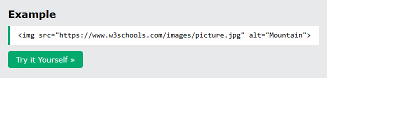

```html

```


Root-relative (`root.html`):

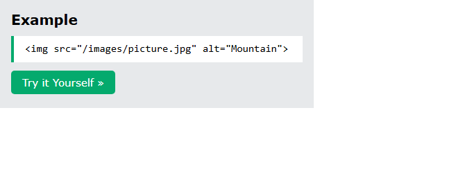

```html

```


Current folder (`folder.html`):


```html

```


Parent folder (`nested/up.html`):

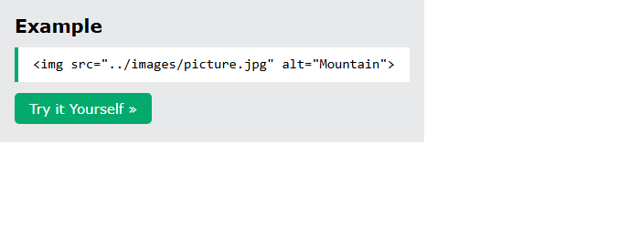

```html

```


<details>
  <summary>Terminal Commands</summary>

## Terminal Commands

```bash
# from Personal/Files/html/code_sandbox
python -m http.server 8766 --bind 127.0.0.1
```

Then open `http://127.0.0.1:8766/html-filepaths/`.

</details>

<details>
  <summary>Questions and Answers</summary>

## Questions and Answers

### Question 1: What is a file path?

<details>
<summary>Answer</summary>

- [x] The **location** of a file in a website’s folder structure.

</details>

### Question 2: What does `src="picture.jpg"` mean?

<details>
<summary>Answer</summary>

- [x] The file is in the **same folder** as the current page.

</details>

### Question 3: What is the difference between `images/` and `/images/`?

<details>
<summary>Answer</summary>

- [x] `images/` is inside the **current folder**.
- [x] `/images/` is at the **root** of the current web.

</details>

### Question 4: What does `../` mean in a path?

<details>
<summary>Answer</summary>

- [x] The folder **one level up**.

</details>

### Question 5: What is an absolute file path?

<details>
<summary>Answer</summary>

- [x] The **full URL** to a file.

</details>

### Question 6: Why prefer relative paths?

<details>
<summary>Answer</summary>

- [x] Pages are **not bound** to the current base URL.
- [x] Links work on **localhost**, the current domain, and **future** domains.

</details>

</details>

## Summary

Use file paths to locate pages, images, CSS, and JS. Absolute paths are full URLs. Relative paths are same folder, `images/`, `/images/` (site root), or `../` (parent). Prefer relative paths so the site is portable.

## References

- [HTML File Paths (W3Schools)](https://www.w3schools.com/html/html_filepaths.asp)
- [Try it Yourself: tryhtml_files_absoulute](https://www.w3schools.com/html/tryit.asp?filename=tryhtml_files_absoulute)
- [Try it Yourself: tryhtml_files_relative](https://www.w3schools.com/html/tryit.asp?filename=tryhtml_files_relative)
- [Try it Yourself: tryhtml_files_relative_1](https://www.w3schools.com/html/tryit.asp?filename=tryhtml_files_relative_1)
- [Try it Yourself: tryhtml_files_relative_2](https://www.w3schools.com/html/tryit.asp?filename=tryhtml_files_relative_2)
- [HTML Images](https://www.w3schools.com/html/html_images.asp)
- [MDN: URLs and paths](https://developer.mozilla.org/en-US/docs/Learn_web_development/Howto/Web_mechanics/What_is_a_URL)

</details>

<details>
  <summary>HTML Head</summary>

## Introduction

The HTML **`<head>`** element holds **metadata** (data about data): `<title>`, `<style>`, `<meta>`, `<link>`, `<script>`, and `<base>`. Metadata sits between `<html>` and `<body>` and is **not shown** as page content.

## Detailed Explanation

- [x] **The `<head>` element**
  - Container for metadata between `<html>` and `<body>`.
  - Typical metadata: document **title**, **character set**, **styles**, **scripts**, other meta information.
- [x] **The `<title>` element**
  - **Required.** Text-only title in the **tab / title bar**.
  - Important for **SEO** (search engines use it in rankings and result titles).
  - Also used in the toolbar and when the page is added to **favorites**.
  - Make the title **accurate and meaningful**.
  - Example: **A Meaningful Page Title**.
  - Sandbox: `code_sandbox/html-head/index.html`.

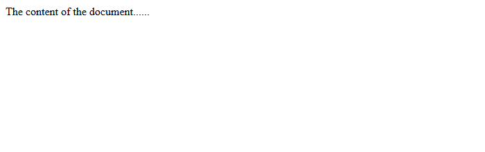

- [x] **The `<style>` element**
  - Style information for a **single** page.
  - Example: powderblue body, red `h1`, blue `p`.
  - Sandbox: `style.html`.


- [x] **The `<link>` element**
  - Relationship to an **external resource**.
  - Most often: `<link rel="stylesheet" href="mystyle.css">`.
  - Sandbox: `link.html` + `mystyle.css`.


- [x] **The `<meta>` element**
  - Character set, description, keywords, author, viewport; not displayed.
  - Used by browsers, search engines, and other services.
  - Examples from the page: `charset="UTF-8"`; keywords; description **Free Web tutorials**; author **John Doe**; `http-equiv="refresh" content="30"` (reload every 30 seconds — omitted from the sandbox so it does not auto-refresh); viewport (below).
  - Sandbox: `meta.html`.

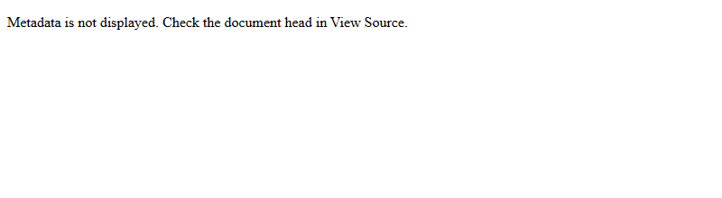

- [x] **Setting the viewport**
  - Viewport = the user’s **visible area** (smaller on a phone).
  - Include on **all** pages: `<meta name="viewport" content="width=device-width, initial-scale=1.0">`.
  - `width=device-width` follows the device screen width; `initial-scale=1.0` is the initial zoom.
- [x] **The `<script>` element**
  - Client-side JavaScript.
  - Example: `myFunction()` writes **Hello JavaScript!** into `#demo`.
  - Sandbox: `script.html`.

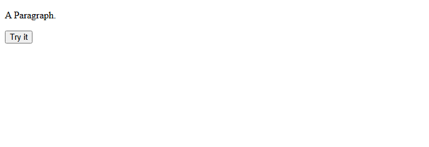

- [x] **The `<base>` element**
  - Default **URL and/or target** for relative URLs.
  - Must have **`href` or `target` or both**.
  - **Only one** `<base>` per document.
  - Example: `href="https://www.w3schools.com/" target="_blank"` so `images/stickman.gif` and `tags/tag_base.asp` resolve on W3Schools and open in a new tab.
  - Sandbox: `base.html`.

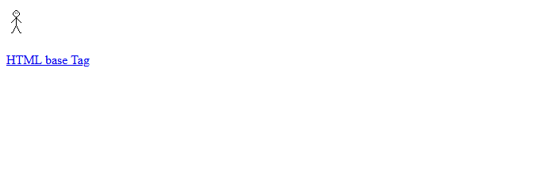

| Tag        | Description                                              |
| ---------- | -------------------------------------------------------- |
| `<head>`   | Defines information about the document                   |
| `<title>`  | Defines the title of a document                          |
| `<base>`   | Default address or target for all links on a page        |
| `<link>`   | Relationship between a document and an external resource |
| `<meta>`   | Metadata about an HTML document                          |
| `<script>` | A client-side script                                     |
| `<style>`  | Style information for a document                         |

Title (`index.html`):

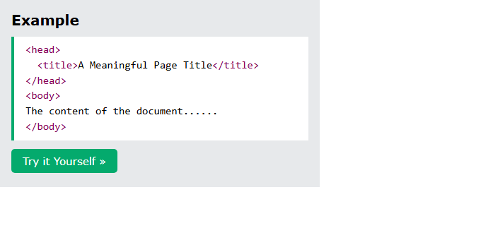

```html
<title>A Meaningful Page Title</title>
```


Style (`style.html`):

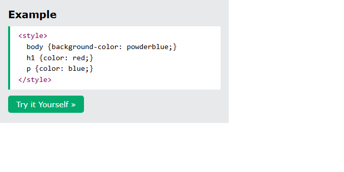

```html
<style>
  body {
    background-color: powderblue;
  }
  h1 {
    color: red;
  }
  p {
    color: blue;
  }
</style>
```


Link (`link.html`):

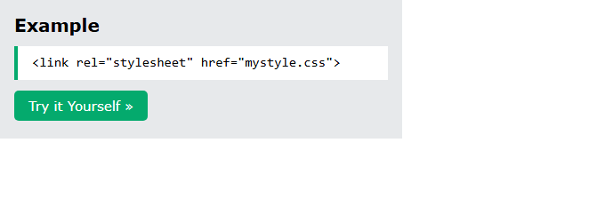

```html
<link rel="stylesheet" href="mystyle.css" />
```


Meta (`meta.html`):

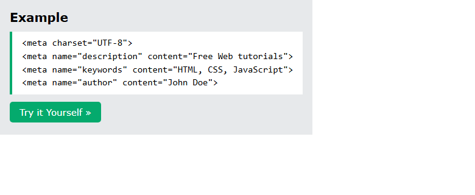

```html
<meta charset="UTF-8" />
<meta name="description" content="Free Web tutorials" />
<meta name="keywords" content="HTML, CSS, JavaScript" />
<meta name="author" content="John Doe" />
```


Script (`script.html`):

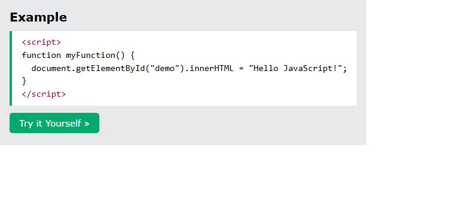

```html
<script>
  function myFunction() {
    document.getElementById("demo").innerHTML = "Hello JavaScript!";
  }
</script>
```


Base (`base.html`):

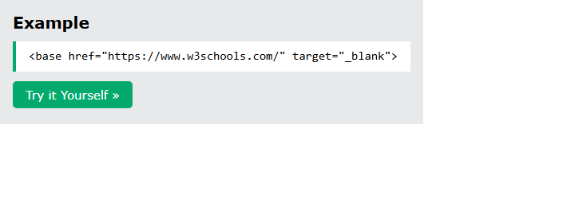

```html
<base href="https://www.w3schools.com/" target="_blank" />
```


<details>
  <summary>Terminal Commands</summary>

## Terminal Commands

```bash
# from Personal/Files/html/code_sandbox
python -m http.server 8766 --bind 127.0.0.1
```

Then open `http://127.0.0.1:8766/html-head/`.

</details>

<details>
  <summary>Questions and Answers</summary>

## Questions and Answers

### Question 1: What does `<head>` contain, and is that content shown on the page?

<details>
<summary>Answer</summary>

- [x] **Metadata** (title, charset, styles, scripts, and so on).
- [x] Metadata is **not displayed** as page content.

</details>

### Question 2: Why is `<title>` required, and why does it matter for SEO?

<details>
<summary>Answer</summary>

- [x] It is **required** and appears in the **tab / title bar**.
- [x] Search engines use it in **rankings** and **result titles**.

</details>

### Question 3: When do you use `<style>` vs `<link>`?

<details>
<summary>Answer</summary>

- [x] `<style>` — CSS for a **single** page.
- [x] `<link rel="stylesheet">` — an **external** style sheet.

</details>

### Question 4: What viewport meta should every page include?

<details>
<summary>Answer</summary>

- [x] `<meta name="viewport" content="width=device-width, initial-scale=1.0">`.

</details>

### Question 5: What are the rules for `<base>`?

<details>
<summary>Answer</summary>

- [x] Sets the default **URL and/or target** for relative URLs.
- [x] Needs **`href` or `target` or both**.
- [x] **Only one** `<base>` per document.

</details>

</details>

## Summary

`<head>` holds metadata between `<html>` and `<body>`. `<title>` is required and matters for tabs and SEO. Use `<style>` or `<link>` for CSS, `<meta>` for charset/description/keywords/author/viewport, `<script>` for JS, and one `<base>` for default URLs.

## References

- [HTML The Head Element (W3Schools)](https://www.w3schools.com/html/html_head.asp)
- [Try it Yourself: tryhtml_head_title](https://www.w3schools.com/html/tryit.asp?filename=tryhtml_head_title)
- [Try it Yourself: tryhtml_head_style](https://www.w3schools.com/html/tryit.asp?filename=tryhtml_head_style)
- [Try it Yourself: tryhtml_head_link](https://www.w3schools.com/html/tryit.asp?filename=tryhtml_head_link)
- [Try it Yourself: tryhtml_head_meta](https://www.w3schools.com/html/tryit.asp?filename=tryhtml_head_meta)
- [Try it Yourself: tryhtml_head_script](https://www.w3schools.com/html/tryit.asp?filename=tryhtml_head_script)
- [Try it Yourself: tryhtml_head_base](https://www.w3schools.com/html/tryit.asp?filename=tryhtml_head_base)
- [CSS Tutorial](https://www.w3schools.com/css/default.asp)
- [JavaScript Tutorial](https://www.w3schools.com/js/default.asp)
- [MDN: `<head>`](https://developer.mozilla.org/en-US/docs/Web/HTML/Element/head)
- [MDN: viewport meta](https://developer.mozilla.org/en-US/docs/Web/HTML/Viewport_meta_tag)

</details>

<details>
  <summary>HTML Layout</summary>

## Introduction

Sites often show content in **multiple columns** (magazine/newspaper). HTML has **semantic** layout tags (`<header>`, `<nav>`, `<section>`, `<article>`, `<aside>`, `<footer>`, plus `<details>`/`<summary>`). This chapter also lists four **multicolumn techniques**: CSS **frameworks**, **float**, **flexbox**, and **grid**.

## Detailed Explanation

- [x] **Example layout**
  - Header **Cities**, a nav of London/Paris/Tokyo, an article about London, and a **Footer**.
  - Sandbox float version: `code_sandbox/html-layout/index.html`.


- [x] **HTML layout elements**
  - `<header>` — header for a document or section.
  - `<nav>` — a set of navigation links.
  - `<section>` — a section in a document.
  - `<article>` — independent, self-contained content.
  - `<aside>` — content aside from the main content (sidebar).
  - `<footer>` — footer for a document or section.
  - `<details>` — extra details the user can open/close.
  - `<summary>` — heading for `<details>`.
  - More in the HTML Semantics chapter.
- [x] **Four layout techniques**
  - **CSS frameworks** (fast: W3.CSS or Bootstrap).
  - **CSS float** — easy (`float` and `clear`); elements stay in document flow, which can limit flexibility.
  - **CSS flexbox** — predictable when the layout must fit **different screen sizes**.
  - **CSS grid** — rows and columns without floats/positioning.
- [x] **Float vs flex in the sandbox**
  - Float: `nav` 30% left, `article` 70% left, `section::after` clears.
  - Flex: `section { display: flex; }` with the same 30%/70% widths.
  - Sandbox: `flex.html`.

Semantic skeleton (float page `index.html`):


```html
<header>Cities</header>
<section>
  <nav>London Paris Tokyo</nav>
  <article>London ...</article>
</section>
<footer>Footer</footer>
```


Flex (`flex.html`):


```css
section {
  display: flex;
}
nav {
  width: 30%;
}
article {
  width: 70%;
}
```


<details>
  <summary>Terminal Commands</summary>

## Terminal Commands

```bash
# from Personal/Files/html/code_sandbox
python -m http.server 8766 --bind 127.0.0.1
```

Then open `http://127.0.0.1:8766/html-layout/`.

</details>

<details>
  <summary>Questions and Answers</summary>

## Questions and Answers

### Question 1: Which tags define header, nav, main article, sidebar, and footer?

<details>
<summary>Answer</summary>

- [x] `<header>`, `<nav>`, `<article>`, `<aside>`, `<footer>`.
- [x] Also `<section>` for a document section.

</details>

### Question 2: What are `<details>` and `<summary>`?

<details>
<summary>Answer</summary>

- [x] `<details>` — extra content the user can **open/close**.
- [x] `<summary>` — the **heading** for that details box.

</details>

### Question 3: Which four techniques create multicolumn layouts here?

<details>
<summary>Answer</summary>

- [x] CSS **frameworks**.
- [x] CSS **float**.
- [x] CSS **flexbox**.
- [x] CSS **grid**.

</details>

### Question 4: What is a disadvantage of float layouts?

<details>
<summary>Answer</summary>

- [x] Floated elements are tied to the **document flow**, which may hurt **flexibility**.

</details>

### Question 5: Why use flexbox for layout?

<details>
<summary>Answer</summary>

- [x] Elements behave **predictably** across **screen sizes** and devices.

</details>

</details>

## Summary

Use semantic tags for page regions. Build columns with a framework, float, flexbox, or grid. Float is simple but less flexible; flexbox adapts to screen size; grid is rows and columns without floats.

## References

- [HTML Layout Elements and Techniques (W3Schools)](https://www.w3schools.com/html/html_layout.asp)
- [Try it Yourself: tryhtml_layout_float](https://www.w3schools.com/html/tryit.asp?filename=tryhtml_layout_float)
- [Try it Yourself: tryhtml_layout_flexbox](https://www.w3schools.com/html/tryit.asp?filename=tryhtml_layout_flexbox)
- [HTML Semantics](https://www.w3schools.com/html/html5_semantic_elements.asp)
- [CSS Float](https://www.w3schools.com/css/css_float.asp)
- [CSS Flexbox](https://www.w3schools.com/css/css3_flexbox.asp)
- [CSS Grid Intro](https://www.w3schools.com/css/css_grid.asp)
- [W3.CSS](https://www.w3schools.com/w3css/default.asp)
- [Bootstrap](https://www.w3schools.com/bootstrap/bootstrap_ver.asp)
- [MDN: Document and website structure](https://developer.mozilla.org/en-US/docs/Learn_web_development/Core/Structuring_content/Document_and_website_structure)

</details>

<details>
  <summary>HTML Responsive</summary>

## Introduction

**Responsive web design** makes pages look good on **all devices**. HTML and CSS **resize, hide, shrink, or enlarge** content for desktops, tablets, and phones. This chapter covers the **viewport** meta tag, **responsive images**, **vw** text, **media queries**, and CSS **frameworks** (W3.CSS, Bootstrap).

## Detailed Explanation

- [x] **Viewport**
  - Add to **all** pages: `<meta name="viewport" content="width=device-width, initial-scale=1.0">`.
  - Tells the browser how to control **dimensions and scaling**.
  - Sandbox: `code_sandbox/html-responsive/index.html` (also shows `font-size:10vw`).

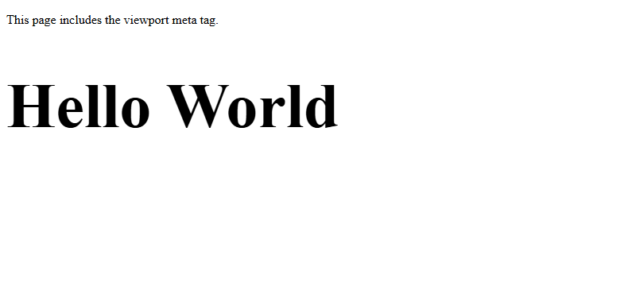

- [x] **Responsive images — `width: 100%`**
  - The image scales up and down with the browser.
  - It can grow **larger than the original**.
  - Sandbox: `width.html`.


- [x] **Responsive images — `max-width: 100%`**
  - Scales **down** if needed, but **never larger** than the original.
  - Often the **better** choice. Use with `height: auto`.
  - Sandbox: `maxwidth.html`.


- [x] **`<picture>` (from the page)**
  - Different images for different window sizes (`srcset` + `media`).
  - Example sources: small flower at max 600px, flowers at max 1500px, then a default.
- [x] **Responsive text size**
  - Unit **`vw`** = viewport width. `1vw` = 1% of the viewport width.
  - Example: `<h1 style="font-size:10vw">Hello World</h1>`.
- [x] **Media queries**
  - Completely different styles for different sizes.
  - Example: `.left`/`.right` 20%, `.main` 60% floated; at **max-width 800px** all become **100%** (stack).
  - Sandbox: `media.html`.

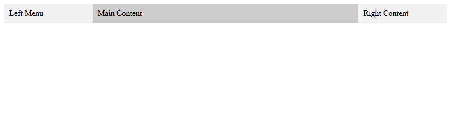

- [x] **Frameworks**
  - Popular CSS frameworks include responsive design (free, easy).
  - **W3.CSS** — desktop/tablet/mobile by default; smaller/faster; no jQuery required.
  - **Bootstrap** — example uses Bootstrap 5 CDN and a three-column row.

Viewport (`index.html`):

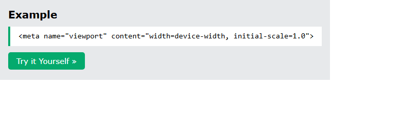

```html
<meta name="viewport" content="width=device-width, initial-scale=1.0" />
```


`width: 100%` (`width.html`):

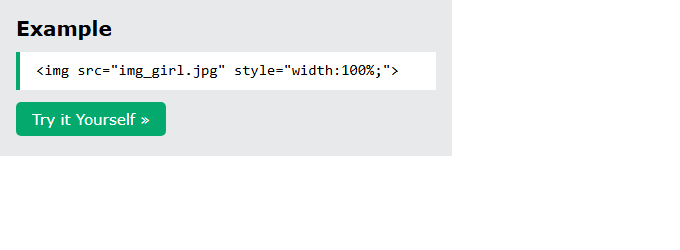

```html

```


`max-width: 100%` (`maxwidth.html`):

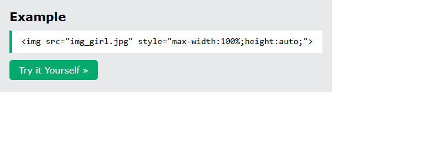

```html

```


Media query (`media.html`):

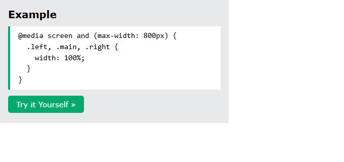

```css
@media screen and (max-width: 800px) {
  .left,
  .main,
  .right {
    width: 100%;
  }
}
```


<details>
  <summary>Terminal Commands</summary>

## Terminal Commands

```bash
# from Personal/Files/html/code_sandbox
python -m http.server 8766 --bind 127.0.0.1
```

Then open `http://127.0.0.1:8766/html-responsive/`.

</details>

<details>
  <summary>Questions and Answers</summary>

## Questions and Answers

### Question 1: What is responsive web design?

<details>
<summary>Answer</summary>

- [x] Pages that **look good on all devices**.
- [x] HTML/CSS **resize, hide, shrink, or enlarge** the layout.

</details>

### Question 2: Which meta tag should every responsive page include?

<details>
<summary>Answer</summary>

- [x] `<meta name="viewport" content="width=device-width, initial-scale=1.0">`.

</details>

### Question 3: Why prefer `max-width: 100%` over `width: 100%` on images?

<details>
<summary>Answer</summary>

- [x] `width: 100%` can scale **larger than the original**.
- [x] `max-width: 100%` scales **down only**.

</details>

### Question 4: What does `10vw` mean?

<details>
<summary>Answer</summary>

- [x] **10% of the viewport width**.
- [x] `1vw` = 1% of the browser window width.

</details>

### Question 5: What do media queries do in this chapter?

<details>
<summary>Answer</summary>

- [x] Apply **different styles** at different browser sizes.
- [x] Example: stack columns at **800px** or smaller.

</details>

</details>

## Summary

Add the viewport meta tag. Make images fluid with `max-width: 100%` (or `width: 100%`). Size text with `vw` if you want it to follow the window. Use media queries (and optionally W3.CSS or Bootstrap) for different layouts at different widths.

## References

- [HTML Responsive Web Design (W3Schools)](https://www.w3schools.com/html/html_responsive.asp)
- [Try it Yourself: tryhtml_responsive_viewport](https://www.w3schools.com/html/tryit.asp?filename=tryhtml_responsive_viewport)
- [Try it Yourself: tryhtml_responsive_image](https://www.w3schools.com/html/tryit.asp?filename=tryhtml_responsive_image)
- [Try it Yourself: tryhtml_responsive_image_maxwidth](https://www.w3schools.com/html/tryit.asp?filename=tryhtml_responsive_image_maxwidth)
- [Try it Yourself: tryhtml_responsive_picture](https://www.w3schools.com/html/tryit.asp?filename=tryhtml_responsive_picture)
- [Try it Yourself: tryhtml_responsive_text](https://www.w3schools.com/html/tryit.asp?filename=tryhtml_responsive_text)
- [Try it Yourself: tryhtml_responsive_media_query](https://www.w3schools.com/html/tryit.asp?filename=tryhtml_responsive_media_query)
- [RWD Tutorial](https://www.w3schools.com/css/css_rwd_intro.asp)
- [W3.CSS Tutorial](https://www.w3schools.com/w3css/default.asp)
- [Bootstrap Tutorial](https://www.w3schools.com/bootstrap/bootstrap_ver.asp)
- [MDN: Responsive design](https://developer.mozilla.org/en-US/docs/Learn_web_development/Core/CSS_layout/Responsive_Design)

</details>

<details>
  <summary>HTML Computercode</summary>

## Introduction

HTML has elements for **user input and computer code**: `<kbd>`, `<samp>`, `<code>`, `<var>`, and `<pre>`. `<kbd>`, `<samp>`, and `<code>` use the browser’s **monospace** font. `<code>` does **not** keep extra whitespace; wrap it in `<pre>` to preserve line breaks.

## Detailed Explanation

- [x] **`<kbd>` — keyboard input**
  - Example: Save the document by pressing **Ctrl + S**.
  - Sandbox: `code_sandbox/html-computercode/index.html`.


- [x] **`<samp>` — program output**
  - Example: **File not found. Press F1 to continue**.
  - Sandbox: `samp.html`.


- [x] **`<code>` — computer code**
  - Example: `x = 5; y = 6; z = x + y;` (newlines **collapse**).
  - Sandbox: `code.html`.


- [x] **Preserve line-breaks with `<pre>`**
  - Put `<code>` inside `<pre>` to keep whitespace and line breaks.
  - Sandbox: `pre.html`.


- [x] **`<var>` — variables**
  - Programming or math. Typically **italic**.
  - Example: area of a triangle 1/2 × **b** × **h**.
  - Sandbox: `var.html`.


| Tag      | Description       |
| -------- | ----------------- |
| `<code>` | Programming code  |
| `<kbd>`  | Keyboard input    |
| `<samp>` | Computer output   |
| `<var>`  | A variable        |
| `<pre>`  | Preformatted text |

`<kbd>` (`index.html`):


```html
<p>Save the document by pressing <kbd>Ctrl + S</kbd></p>
```


`<samp>` (`samp.html`):


```html
<p>
  <samp>File not found.<br />Press F1 to continue</samp>
</p>
```


`<code>` (`code.html`):


```html
<code> x = 5; y = 6; z = x + y; </code>
```


`<pre><code>` (`pre.html`):


```html
<pre>
<code>
x = 5;
y = 6;
z = x + y;
</code>
</pre>
```


`<var>` (`var.html`):


```html
<p>
  The area of a triangle is: 1/2 x <var>b</var> x <var>h</var>, where
  <var>b</var> is the base, and <var>h</var> is the vertical height.
</p>
```


<details>
  <summary>Terminal Commands</summary>

## Terminal Commands

```bash
# from Personal/Files/html/code_sandbox
python -m http.server 8766 --bind 127.0.0.1
```

Then open `http://127.0.0.1:8766/html-computercode/`.

</details>

<details>
  <summary>Questions and Answers</summary>

## Questions and Answers

### Question 1: What is `<kbd>` for?

<details>
<summary>Answer</summary>

- [x] **Keyboard input**.
- [x] Displayed in the default **monospace** font.

</details>

### Question 2: What is `<samp>` for?

<details>
<summary>Answer</summary>

- [x] **Sample output** from a computer program.
- [x] Also monospace.

</details>

### Question 3: Why wrap `<code>` in `<pre>`?

<details>
<summary>Answer</summary>

- [x] `<code>` does **not** keep extra whitespace or line-breaks.
- [x] `<pre>` **preserves** them.

</details>

### Question 4: What is `<var>` for, and how does it usually look?

<details>
<summary>Answer</summary>

- [x] A **variable** in programming or math.
- [x] Typically displayed in **italic**.

</details>

</details>

## Summary

Use `<kbd>` for keys, `<samp>` for program output, `<code>` for snippets, and `<var>` for variables. Wrap `<code>` in `<pre>` when you need the original line breaks.

## References

- [HTML Computer Code Elements (W3Schools)](https://www.w3schools.com/html/html_computercode_elements.asp)
- [Try it Yourself: tryhtml_formatting_intro3](https://www.w3schools.com/html/tryit.asp?filename=tryhtml_formatting_intro3)
- [Try it Yourself: tryhtml_formatting_kbd](https://www.w3schools.com/html/tryit.asp?filename=tryhtml_formatting_kbd)
- [Try it Yourself: tryhtml_formatting_samp](https://www.w3schools.com/html/tryit.asp?filename=tryhtml_formatting_samp)
- [Try it Yourself: tryhtml_formatting_code](https://www.w3schools.com/html/tryit.asp?filename=tryhtml_formatting_code)
- [Try it Yourself: tryhtml_formatting_codepre](https://www.w3schools.com/html/tryit.asp?filename=tryhtml_formatting_codepre)
- [Try it Yourself: tryhtml_formatting_var](https://www.w3schools.com/html/tryit.asp?filename=tryhtml_formatting_var)
- [MDN: `<code>`](https://developer.mozilla.org/en-US/docs/Web/HTML/Element/code)
- [MDN: `<pre>`](https://developer.mozilla.org/en-US/docs/Web/HTML/Element/pre)

</details>

<details>
  <summary>HTML Semantics</summary>

## Introduction

**Semantic** elements have **meaning** for the browser and the developer (`<article>` vs a meaningless `<div>`). This chapter covers `<section>`, `<article>`, `<header>`, `<footer>`, `<nav>`, `<aside>`, and `<figure>`/`<figcaption>`, plus why the semantic web matters.

## Detailed Explanation

- [x] **What are semantic elements?**
  - They **clearly describe** their content.
  - Non-semantic: `<div>`, `<span>` (tell nothing about content).
  - Semantic: ``, `<table>`, `<article>` (define the content).
  - Sites used to fake structure with `<div id="nav">`, `<div class="header">`, `<div id="footer">`. HTML now has real tags for those parts.
- [x] **`<section>`**
  - A **thematic grouping**, typically with a heading (W3C).
  - Uses: chapters, introduction, news, contact.
  - Example: two WWF sections.
  - Sandbox: `code_sandbox/html-semantics/index.html`.

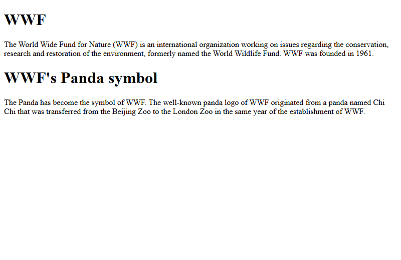

- [x] **`<article>`**
  - Independent, self-contained content you could **distribute alone**.
  - Uses: forum posts, blogs, comments, product cards, newspaper articles.
  - Nested styled browsers example (Chrome, Firefox, Edge).
  - Sandbox: `article.html`.
  - You **cannot** decide nesting from the definitions alone: pages nest `<section>` in `<article>` and the reverse.

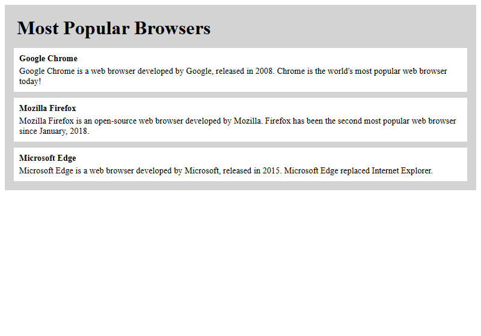

- [x] **`<header>`**
  - Introductory content or navigational links: headings, logo, authorship.
  - Several headers per document are OK.
  - **Cannot** nest inside `<footer>`, `<address>`, or another `<header>`.
- [x] **`<footer>`**
  - Authorship, copyright, contact, sitemap, back-to-top, related docs.
  - Several footers per document are OK.
- [x] **`<nav>`**
  - **Major** navigation blocks only (not every link).
  - Helps screen readers skip or find nav.
  - Sandbox: `nav-footer.html`.

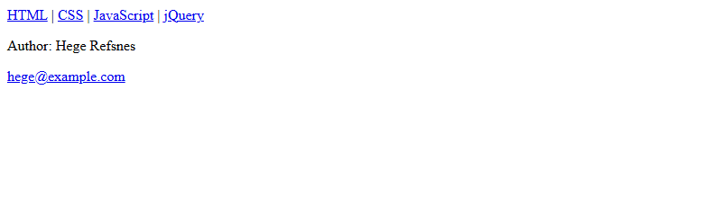

- [x] **`<aside>`**
  - Sidebar-like content **indirectly related** to the surroundings.
  - Example: Epcot paragraph with a floated gray aside.
  - Sandbox: `aside.html`.

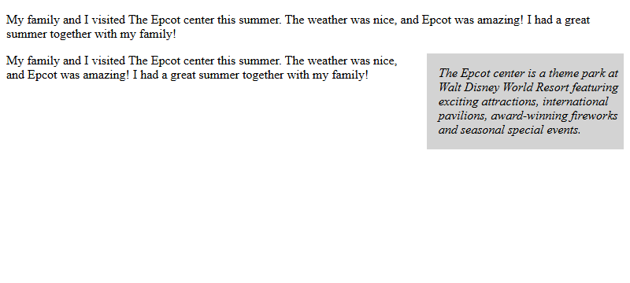

- [x] **`<figure>` and `<figcaption>`**
  - Self-contained illustrations, diagrams, photos, code listings.
  - Caption is first or last child of `<figure>`.
  - Example: Trulli photo, **Fig1. - Trulli, Puglia, Italy.**
  - Sandbox: `figure.html`.

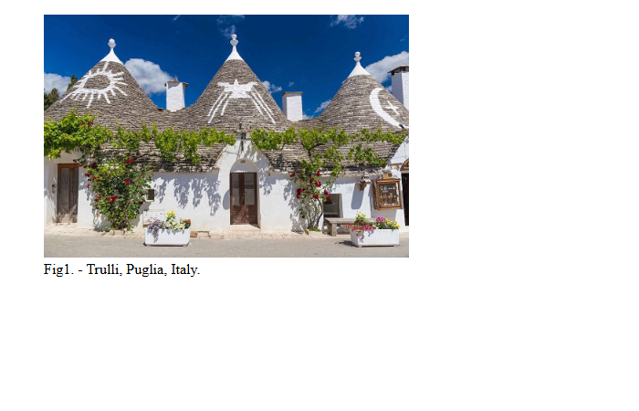

- [x] **Why semantic elements?**
  - W3C: a semantic Web lets data be **shared and reused** across applications, enterprises, and communities.

| Tag            | Description                                   |
| -------------- | --------------------------------------------- |
| `<article>`    | Independent, self-contained content           |
| `<aside>`      | Content aside from the page content           |
| `<details>`    | Extra details the user can view or hide       |
| `<figcaption>` | Caption for a `<figure>`                      |
| `<figure>`     | Self-contained illustration / photo / listing |
| `<footer>`     | Footer for a document or section              |
| `<header>`     | Header for a document or section              |
| `<main>`       | Main content of a document                    |
| `<mark>`       | Marked / highlighted text                     |
| `<nav>`        | Navigation links                              |
| `<section>`    | A section in a document                       |
| `<summary>`    | Visible heading for `<details>`               |
| `<time>`       | A date/time                                   |

Section (`index.html`):

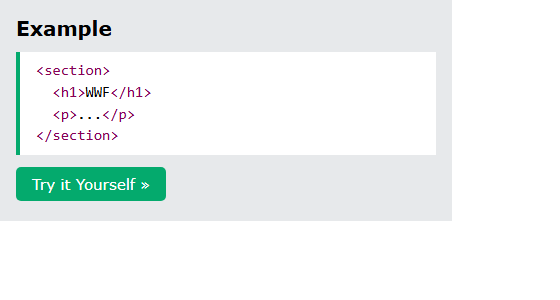

```html
<section>
  <h1>WWF</h1>
  <p>...</p>
</section>
```


Article (`article.html`):

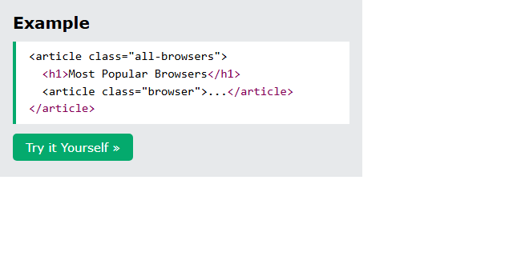

```html
<article class="all-browsers">
  <h1>Most Popular Browsers</h1>
  <article class="browser">...</article>
</article>
```


Nav and footer (`nav-footer.html`):

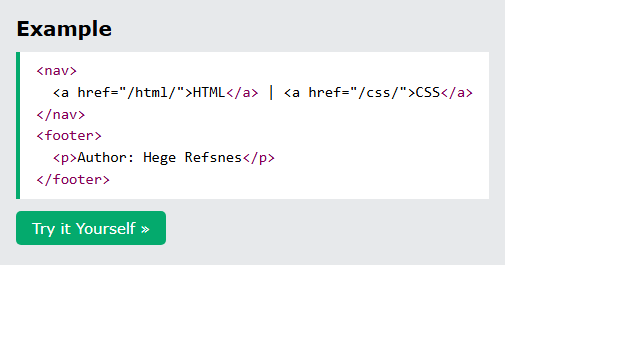

```html
<nav><a href="/html/">HTML</a> | <a href="/css/">CSS</a></nav>
<footer>
  <p>Author: Hege Refsnes</p>
</footer>
```


Aside (`aside.html`):

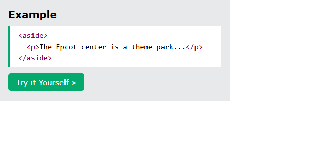

```html
<aside>
  <p>The Epcot center is a theme park...</p>
</aside>
```


Figure (`figure.html`):

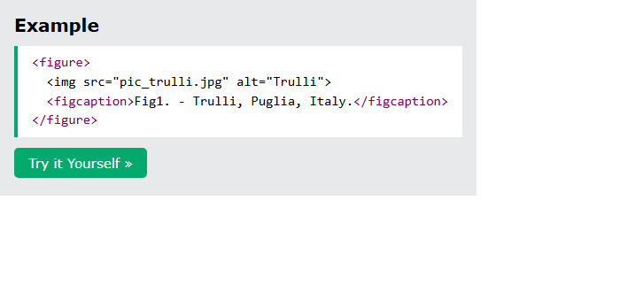

```html
<figure>
  
  <figcaption>Fig1. - Trulli, Puglia, Italy.</figcaption>
</figure>
```


<details>
  <summary>Terminal Commands</summary>

## Terminal Commands

```bash
# from Personal/Files/html/code_sandbox
python -m http.server 8766 --bind 127.0.0.1
```

Then open `http://127.0.0.1:8766/html-semantics/`.

</details>

<details>
  <summary>Questions and Answers</summary>

## Questions and Answers

### Question 1: What makes an element semantic?

<details>
<summary>Answer</summary>

- [x] It **clearly describes** its meaning to the browser and the developer.
- [x] `<div>`/`<span>` are **non-semantic**.

</details>

### Question 2: How does `<section>` differ from `<article>`?

<details>
<summary>Answer</summary>

- [x] `<section>` — thematic grouping, typically with a **heading**.
- [x] `<article>` — **independent** content you could publish alone.
- [x] Either may nest inside the other.

</details>

### Question 3: What belongs in `<nav>` vs ordinary links?

<details>
<summary>Answer</summary>

- [x] **Major** navigation blocks only.
- [x] Not every link on the page.

</details>

### Question 4: Where can you **not** put `<header>`?

<details>
<summary>Answer</summary>

- [x] Not inside `<footer>`, `<address>`, or another `<header>`.

</details>

### Question 5: What are `<figure>` and `<figcaption>` for?

<details>
<summary>Answer</summary>

- [x] `<figure>` — self-contained illustration, photo, diagram, or listing.
- [x] `<figcaption>` — caption as the first or last child.

</details>

</details>

## Summary

Prefer semantic tags over anonymous divs. `<section>` groups themes; `<article>` is standalone; `<header>`/`<footer>`/`<nav>`/`<aside>` mark page regions; `<figure>` captions media. Semantics help people, tools, and reuse of data.

## References

- [HTML Semantic Elements (W3Schools)](https://www.w3schools.com/html/html5_semantic_elements.asp)
- [Try it Yourself: tryhtml5_section](https://www.w3schools.com/html/tryit.asp?filename=tryhtml5_section)
- [Try it Yourself: tryhtml5_article](https://www.w3schools.com/html/tryit.asp?filename=tryhtml5_article)
- [Try it Yourself: tryhtml5_article2](https://www.w3schools.com/html/tryit.asp?filename=tryhtml5_article2)
- [Try it Yourself: tryhtml5_header](https://www.w3schools.com/html/tryit.asp?filename=tryhtml5_header)
- [Try it Yourself: tryhtml5_footer](https://www.w3schools.com/html/tryit.asp?filename=tryhtml5_footer)
- [Try it Yourself: tryhtml5_nav](https://www.w3schools.com/html/tryit.asp?filename=tryhtml5_nav)
- [Try it Yourself: tryhtml5_aside](https://www.w3schools.com/html/tryit.asp?filename=tryhtml5_aside)
- [Try it Yourself: tryhtml5_aside2](https://www.w3schools.com/html/tryit.asp?filename=tryhtml5_aside2)
- [Try it Yourself: tryhtml_figcaption](https://www.w3schools.com/html/tryit.asp?filename=tryhtml_figcaption)
- [MDN: Semantics](https://developer.mozilla.org/en-US/docs/Glossary/Semantics)

</details>

<details>
  <summary>HTML Style Guide</summary>

## Introduction

**Consistent, clean, tidy** HTML is easier for others to read. This chapter is W3Schools’ **coding conventions**: doctype, lowercase names, quoted attributes, titles, `lang`, charset, viewport, comments, CSS/JS loading, and **lowercase file names**.

## Detailed Explanation

- [x] **Always declare document type** first: `<!DOCTYPE html>`.
- [x] **Lowercase element names** (mixing case looks bad; lowercase is cleaner and easier to type).
- [x] **Close all elements** even when optional (`<p>...</p>`).
- [x] **Lowercase attribute names**; **always quote** values (required if the value has spaces). `class=table striped` is invalid.
- [x] **Images:** always `alt`, plus **width and height** (or CSS size) so the browser can reserve space and reduce flicker.
- [x] **No spaces around `=`** (`rel="stylesheet"` not `rel = "stylesheet"`).
- [x] **Avoid long lines**; indent with **two spaces**, not Tab; blank lines only to separate logical blocks.
- [x] **Never skip `<title>`** (required; SEO; tab; favorites). Example title: **HTML Style Guide and Coding Conventions**.
- [x] Pages can **validate without** `<html>`/`<body>`/`<head>`, but **always include them**. Omitting `<body>` can break older browsers; omitting html/body can crash DOM/XML tools.
- [x] Empty elements: `<meta charset="utf-8">` or with a trailing slash. Keep `/` if XML/XHTML software will read the page.
- [x] Always **`lang`** on `<html>` (search engines and browsers). Example: `lang="en-us"`.
- [x] Put **`lang` and `charset` as early as possible**. Include the **viewport** meta on every page.
- [x] Comments: one line `<!-- ... -->`; long comments indented two spaces inside a block comment.
- [x] Style sheets: `<link rel="stylesheet" href="styles.css">` (`type` not needed). Short CSS can be one line; long rules: `{` on the same line as the selector, two-space indent, semicolon including the last property, quotes only if the value has spaces.
- [x] Scripts: `<script src="myscript.js">` (`type` not needed). Untidy HTML can cause JS errors: `Demo` vs `demo` are **different** ids.
- [x] **Lowercase file names** (Apache/Unix are case-sensitive; IIS is not). Extensions: `.html`/`.htm`, `.css`, `.js`. `.htm` and `.html` are the same to browsers. Default filenames: `index.html`, `index.htm`, `default.html`, `default.htm` depending on the server.
- [x] Sandbox good example: `code_sandbox/html-style-guide/index.html`.

Good document (`index.html`):

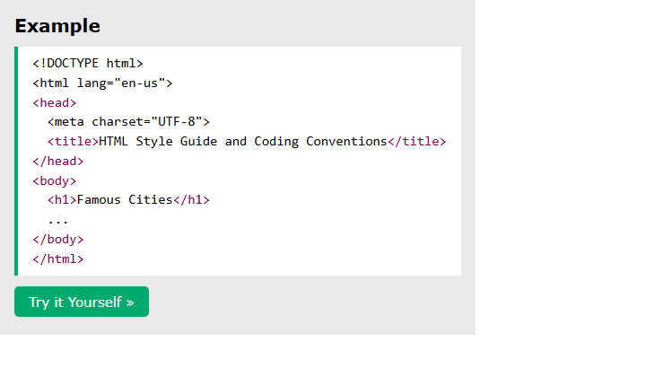

```html
<!DOCTYPE html>
<html lang="en-us">
  <head>
    <meta charset="UTF-8" />
    <title>HTML Style Guide and Coding Conventions</title>
  </head>
  <body>
    <h1>Famous Cities</h1>
    ...
  </body>
</html>
```

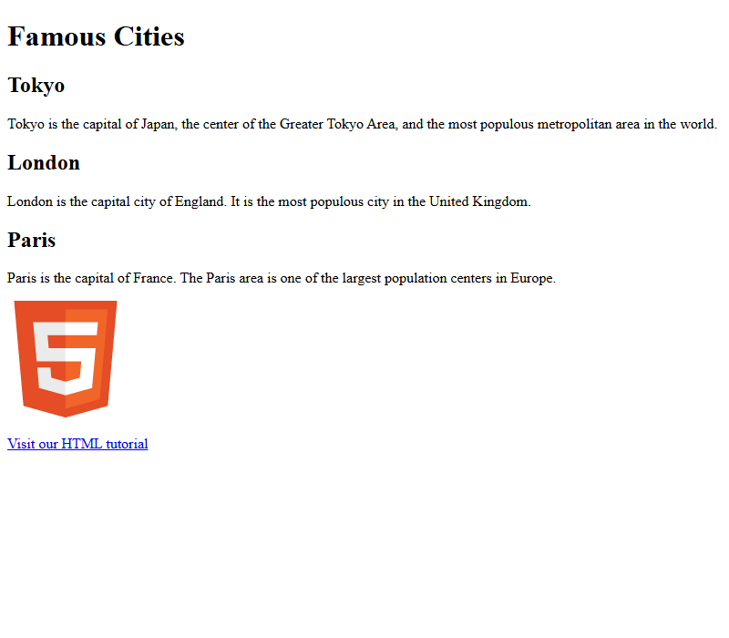

<details>
  <summary>Terminal Commands</summary>

## Terminal Commands

```bash
# from Personal/Files/html/code_sandbox
python -m http.server 8766 --bind 127.0.0.1
```

Then open `http://127.0.0.1:8766/html-style-guide/`.

</details>

<details>
  <summary>Questions and Answers</summary>

## Questions and Answers

### Question 1: What should be the first line of an HTML file?

<details>
<summary>Answer</summary>

- [x] `<!DOCTYPE html>`.

</details>

### Question 2: Should you close optional tags like `<p>`?

<details>
<summary>Answer</summary>

- [x] **Yes.** Strongly recommended to close **all** elements.

</details>

### Question 3: When must attribute values be quoted?

<details>
<summary>Answer</summary>

- [x] Always, by this guide.
- [x] **Required** if the value contains **spaces**.

</details>

### Question 4: Why set `alt`, width, and height on images?

<details>
<summary>Answer</summary>

- [x] `alt` if the image **cannot be displayed**.
- [x] Size lets the browser **reserve space** and reduce flicker.

</details>

### Question 5: Why keep `<html>`, `<head>`, and `<body>` even if validators allow omitting them?

<details>
<summary>Answer</summary>

- [x] Omitting `<body>` can break **older browsers**.
- [x] Omitting html/body can crash **DOM and XML** software.

</details>

### Question 6: Why use lowercase file names?

<details>
<summary>Answer</summary>

- [x] Unix/Apache servers are **case sensitive**.
- [x] Mixing case can **break the site** after a move to a case-sensitive host.

</details>

</details>

## Summary

Start with `<!DOCTYPE html>`, use lowercase quoted markup, close tags, keep `title`/`lang`/charset/viewport, size images, indent two spaces, load CSS/JS without `type`, and name files in lowercase `.html`.

## References

- [HTML Style Guide (W3Schools)](https://www.w3schools.com/html/html5_syntax.asp)
- [Try it Yourself: tryhtml_syntax_nobody](https://www.w3schools.com/html/tryit.asp?filename=tryhtml_syntax_nobody)
- [Try it Yourself: tryhtml_syntax_nohead](https://www.w3schools.com/html/tryit.asp?filename=tryhtml_syntax_nohead)
- [Try it Yourself: tryhtml_syntax_body](https://www.w3schools.com/html/tryit.asp?filename=tryhtml_syntax_body)
- [Try it Yourself: tryhtml_syntax_javascript](https://www.w3schools.com/html/tryit.asp?filename=tryhtml_syntax_javascript)
- [JavaScript Style Guide](https://www.w3schools.com/js/js_conventions.asp)
- [MDN: HTML: A good basis for accessibility](https://developer.mozilla.org/en-US/docs/Learn_web_development/Core/Accessibility/HTML)

</details>

<details>
  <summary>HTML Entities</summary>

## Introduction

Reserved characters in HTML must be replaced with **character entities**. This chapter covers entity **names** (`&lt;`) and **numbers** (`&#60;`), the **non-breaking space**, a table of useful entities, and **combining diacritical marks**.

## Detailed Explanation

- [x] **Reserved characters**
  - `<` (less than) and `>` (greater than) can be mixed up with tags if you type them as text.
  - Replace them: `<` → `&lt;` or `&#60;`; `>` → `&gt;`.
- [x] **Two forms**
  - Name: `&entity_name;`
  - Number: `&#entity_number;`
  - Names are easier to remember. **Entity names are case sensitive.**
- [x] **Non-breaking space (`&nbsp;` / `&#160;`)**
  - A space that will **not** wrap to a new line (handy for `§ 10`, `10 km/h`, `10 PM`).
  - Browsers collapse extra spaces: ten typed spaces become one. Use `&nbsp;` for extra spaces.
  - Non-breaking hyphen: `&#8209;` (`‑`).
- [x] **Useful entities** (name / number)
  - `&lt;` / `&#60;` — less than
  - `&gt;` / `&#62;` — greater than
  - `&amp;` / `&#38;` — ampersand
  - `&quot;` / `&#34;` — double quote
  - `&apos;` / `&#39;` — single quote
  - `&copy;` / `&#169;` — copyright
  - Also: `&cent;` `&pound;` `&yen;` `&euro;` `&reg;` `&trade;`
- [x] **Combining diacritical marks**
  - A glyph added to a letter (grave `` ` ``, acute ´). Combine with a letter: `a&#768;` → à, `a&#769;` → á, `a&#770;` → â, `a&#771;` → ã (same for `O`).
- [x] Sandbox: `code_sandbox/html-entities/index.html`.

Sandbox: `code_sandbox/html-entities/index.html`

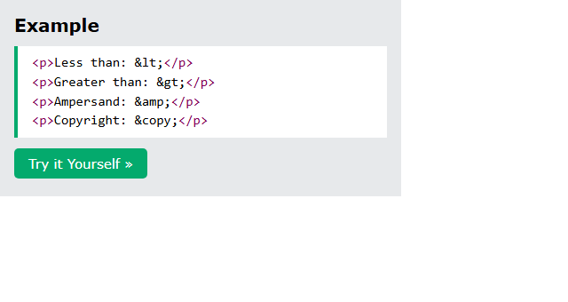

```html
<p>Less than: &lt;</p>
<p>Greater than: &gt;</p>
<p>Ampersand: &amp;</p>
<p>Copyright: &copy; W3Schools.com</p>
<p>10&nbsp;km/h &nbsp; 10&nbsp;PM</p>
<p>a grave: a&#768; &nbsp; a acute: a&#769;</p>
```

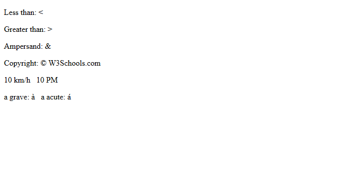

<details>
  <summary>Terminal Commands</summary>

## Terminal Commands

```bash
# from Personal/Files/html/code_sandbox
python -m http.server 8766 --bind 127.0.0.1
```

Then open `http://127.0.0.1:8766/html-entities/`.

</details>

<details>
  <summary>Questions and Answers</summary>

## Questions and Answers

### Question 1: How do you write a less-than sign as text?

<details>
<summary>Answer</summary>

- [x] `&lt;` or `&#60;`.

</details>

### Question 2: What is the difference between `&entity_name;` and `&#entity_number;`?

<details>
<summary>Answer</summary>

- [x] Names are easier to remember.
- [x] Numbers always work; names are **case sensitive**.

</details>

### Question 3: What does `&nbsp;` do?

<details>
<summary>Answer</summary>

- [x] A space that will **not** break onto a new line.
- [x] Also keeps extra spaces the browser would otherwise collapse.

</details>

### Question 4: What is the entity for ampersand?

<details>
<summary>Answer</summary>

- [x] `&amp;` or `&#38;`.

</details>

### Question 5: How do you combine a grave accent with the letter a?

<details>
<summary>Answer</summary>

- [x] `a&#768;` → à.

</details>

### Question 6: Are entity names case sensitive?

<details>
<summary>Answer</summary>

- [x] **Yes.**

</details>

</details>

## Summary

Use `&lt;` `&gt;` `&amp;` for reserved characters, `&nbsp;` for sticky or extra spaces, and named or numbered entities for symbols. Combining marks like `&#768;` add accents to letters.

## References

- [HTML Entities (W3Schools)](https://www.w3schools.com/html/html_entities.asp)
- [Try it Yourself: tryhtml_ent_lt](https://www.w3schools.com/html/tryit.asp?filename=tryhtml_ent_lt)
- [Try it Yourself: tryhtml_ent_nbsp](https://www.w3schools.com/html/tryit.asp?filename=tryhtml_ent_nbsp)
- [Try it Yourself: tryhtml_ent_copy](https://www.w3schools.com/html/tryit.asp?filename=tryhtml_ent_copy)
- [HTML Character Sets](https://www.w3schools.com/charsets/default.asp)
- [MDN: Character references](https://developer.mozilla.org/en-US/docs/Glossary/Entity)

</details>

<details>
  <summary>HTML Symbols</summary>

## Introduction

Symbols that are **not on the keyboard** can be added with entity **names**, **decimal** numbers, or **hex** numbers. This chapter shows the euro sign three ways, then tables of common symbols, math operators, and Greek letters.

## Detailed Explanation

- [x] **Three ways to write a symbol** (euro example)
  - Name: `&euro;`
  - Decimal: `&#8364;`
  - Hex: `&#x20AC;`
  - All three display **€**.
- [x] **Common symbol entities**
  - `&copy;` ©, `&reg;` ®, `&trade;` ™, `&euro;` €
  - Arrows: `&larr;` `&uarr;` `&rarr;` `&darr;`
  - Cards: `&spades;` `&clubs;` `&hearts;` `&diams;`
- [x] **Math entities** (examples): `&forall;` `&part;` `&exist;` `&empty;` `&nabla;` `&isin;` `&notin;` `&ni;` `&prod;` `&sum;`
- [x] **Greek letters** (examples): `&Alpha;` `&Beta;` `&Gamma;` `&Delta;` `&Epsilon;` `&Zeta;`
- [x] The page also shows more Unicode groups (currency, arrows, weather, chess, music, and so on) as a gallery, with links to full charset references.
- [x] Sandbox: `code_sandbox/html-symbols/index.html`.

Sandbox: `code_sandbox/html-symbols/index.html`

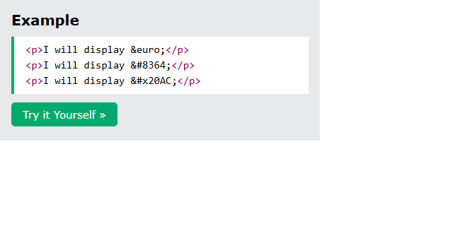

```html
<p>I will display &euro;</p>
<p>I will display &#8364;</p>
<p>I will display &#x20AC;</p>
<p>&copy; &reg; &trade; &larr; &uarr; &rarr; &darr;</p>
<p>&spades; &clubs; &hearts; &diams;</p>
<p>&sum; &infin; &Alpha; &Omega;</p>
```

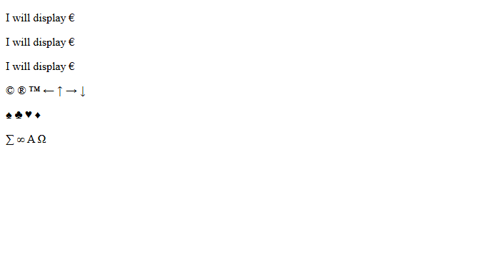

<details>
  <summary>Terminal Commands</summary>

## Terminal Commands

```bash
# from Personal/Files/html/code_sandbox
python -m http.server 8766 --bind 127.0.0.1
```

Then open `http://127.0.0.1:8766/html-symbols/`.

</details>

<details>
  <summary>Questions and Answers</summary>

## Questions and Answers

### Question 1: How can you write the euro sign in HTML?

<details>
<summary>Answer</summary>

- [x] `&euro;` (name), `&#8364;` (decimal), or `&#x20AC;` (hex).

</details>

### Question 2: Why use entities for symbols?

<details>
<summary>Answer</summary>

- [x] Many symbols are **not on the keyboard**.
- [x] Names, decimal numbers, or hex numbers all work.

</details>

### Question 3: What entities are ©, ®, and ™?

<details>
<summary>Answer</summary>

- [x] `&copy;`, `&reg;`, `&trade;`.

</details>

### Question 4: What entities are the four card suits?

<details>
<summary>Answer</summary>

- [x] `&spades;` `&clubs;` `&hearts;` `&diams;`.

</details>

### Question 5: What is `&sum;`?

<details>
<summary>Answer</summary>

- [x] N-ary summation (Σ).

</details>

### Question 6: What is `&Alpha;`?

<details>
<summary>Answer</summary>

- [x] Greek capital letter Alpha (Α).

</details>

</details>

## Summary

Add off-keyboard symbols with a name, a decimal (`&#8364;`), or a hex (`&#x20AC;`) entity. The same pattern covers arrows, cards, math, and Greek letters.

## References

- [HTML Symbols (W3Schools)](https://www.w3schools.com/html/html_symbols.asp)
- [Try it Yourself: tryhtml_utf_euro](https://www.w3schools.com/html/tryit.asp?filename=tryhtml_utf_euro)
- [Full Symbols Reference](https://www.w3schools.com/charsets/ref_utf_symbols_intro.asp)
- [Full Math Symbols Reference](https://www.w3schools.com/charsets/ref_utf_math.asp)
- [Full Greek Reference](https://www.w3schools.com/charsets/ref_utf_greek.asp)
- [MDN: Named character references](https://developer.mozilla.org/en-US/docs/Glossary/Entity)

</details>

<details>
  <summary>HTML Emojis</summary>

## Introduction

Emojis look like images, but they are **UTF-8 characters**. This chapter sets `charset="UTF-8"`, shows entity numbers for letters and emojis, and sizes emojis with CSS `font-size` like any other character.

## Detailed Explanation

- [x] **Emojis are characters**, not images — they come from the UTF-8 (Unicode) set (😄 😍 💗). UTF-8 covers almost all characters and symbols.
- [x] **`charset`**: `<meta charset="UTF-8">`. If omitted, **UTF-8 is the HTML default**.
- [x] **Entity numbers** for characters you cannot type: start with `&#` and end with `;`.
  - A is 65, B is 66, C is 67 → `&#65; &#66; &#67;` displays **A B C**.
- [x] **Emoji numbers** (examples)
  - 😀 `&#128512;`
  - 😄 `&#128516;`
  - 😍 `&#128525;`
  - 💗 `&#128151;`
- [x] **Size like text**: `font-size:48px` on a paragraph of emoji entities.
- [x] Sandbox: `code_sandbox/html-emojis/index.html` (first emoji, sized row, and A B C vs `&#65; &#66; &#67;`).

Sandbox: `code_sandbox/html-emojis/index.html`

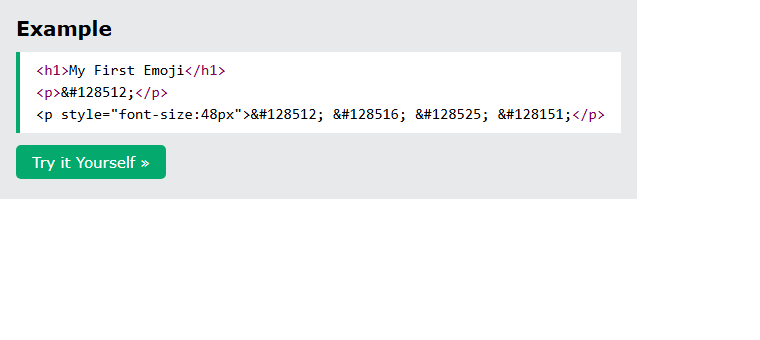

```html
<h1>My First Emoji</h1>
<p>&#128512;</p>
<h1>Sized Emojis</h1>
<p style="font-size: 48px">&#128512; &#128516; &#128525; &#128151;</p>
<p>I will display A B C</p>
<p>I will display &#65; &#66; &#67;</p>
```

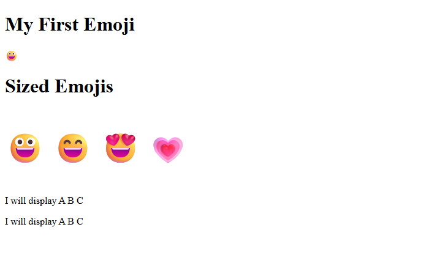

<details>
  <summary>Terminal Commands</summary>

## Terminal Commands

```bash
# from Personal/Files/html/code_sandbox
python -m http.server 8766 --bind 127.0.0.1
```

Then open `http://127.0.0.1:8766/html-emojis/`.

</details>

<details>
  <summary>Questions and Answers</summary>

## Questions and Answers

### Question 1: Are emojis images?

<details>
<summary>Answer</summary>

- [x] **No.** They look like images but are **UTF-8 characters**.

</details>

### Question 2: How do you declare UTF-8 on the page?

<details>
<summary>Answer</summary>

- [x] `<meta charset="UTF-8">`.
- [x] UTF-8 is already the **HTML default** if you omit it.

</details>

### Question 3: How must an entity number be written?

<details>
<summary>Answer</summary>

- [x] Start with `&#` and end with `;` (example: `&#65;` is A).

</details>

### Question 4: What entity is the grinning face 😀?

<details>
<summary>Answer</summary>

- [x] `&#128512;`.

</details>

### Question 5: How do you make emojis larger?

<details>
<summary>Answer</summary>

- [x] Treat them as text: set **`font-size`** (the chapter uses `48px`).

</details>

### Question 6: What numbers are A, B, and C?

<details>
<summary>Answer</summary>

- [x] 65, 66, and 67.

</details>

</details>

## Summary

Emojis are UTF-8 letters. Declare `charset="UTF-8"`, write them as `&#number;`, and size them with CSS like any other character.

## References

- [HTML Emojis (W3Schools)](https://www.w3schools.com/html/html_emojis.asp)
- [Full HTML Emoji Reference](https://www.w3schools.com/charsets/ref_emoji.asp)
- [Try it Yourself: tryhtml_emoji_128512](https://www.w3schools.com/html/tryit.asp?filename=tryhtml_emoji_128512)
- [Unicode Emoji Charts](https://unicode.org/emoji/charts/full-emoji-list.html)
- [MDN: Unicode](https://developer.mozilla.org/en-US/docs/Glossary/Unicode)

</details>

<details>
  <summary>HTML Charsets</summary>

## Introduction

A browser must know the **character set** to display a page correctly. This chapter sets `charset` in `<meta>`, compares **ASCII**, **ANSI (Windows-1252)**, **ISO-8859-1**, and **UTF-8**, and shows why UTF-8 is the HTML recommendation.

## Detailed Explanation

- [x] **Specify the set** in a meta tag: `<meta charset="UTF-8">`.
- [x] The HTML spec encourages **UTF-8** — it covers almost all characters and symbols in the world.
- [x] **ASCII** — first web encoding; **128** Latin characters: a–z A–Z, 0–9, and some punctuation (`! $ + - ( ) @ < > . # ?`).
- [x] **ANSI (Windows-1252)** — first Windows set: ASCII for 0–127, extra characters 128–159, same as UTF-8 from 160–255. `<meta charset="Windows-1252">`.
- [x] **ISO-8859-1** — default for **HTML 4**; 256 characters. ASCII for 0–127, unused 128–159, same as ANSI/UTF-8 from 160–255.
  - HTML 4: `<meta http-equiv="Content-Type" content="text/html;charset=ISO-8859-1">`
  - HTML 5: `<meta charset="ISO-8859-1">`
- [x] **UTF-8**
  - Same as ASCII for 0–127; unused 128–159; same as ANSI and 8859-1 for 160–255; then continues from 256 to **10 000+** characters.
  - `<meta charset="UTF-8">`
- [x] The page galleries **HTML UTF-8 Characters** (Basic Latin, Latin Extended A–E, IPA, punctuation, super/subscript, Braille). Sandbox: `code_sandbox/html-charsets/index.html`.

Declare UTF-8, then put Unicode in the file:

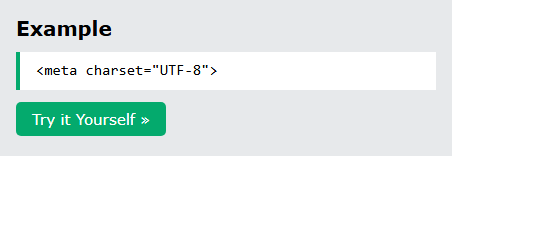

```html
<meta charset="UTF-8" />
```

Sandbox body (`html-charsets/index.html`):

```html
<p>Basic Latin: ABCD abcd 0123 ?#$%</p>
<p>Latin Extended: Ā Ć Ē</p>
<p>Punctuation: ‰ ‼ ⁇</p>
<p>Diacritics: à á â ã</p>
```

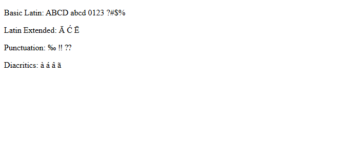

<details>
  <summary>Terminal Commands</summary>

## Terminal Commands

```bash
# from Personal/Files/html/code_sandbox
python -m http.server 8766 --bind 127.0.0.1
```

Then open `http://127.0.0.1:8766/html-charsets/`.

</details>

<details>
  <summary>Questions and Answers</summary>

## Questions and Answers

### Question 1: How do you tell the browser the character set?

<details>
<summary>Answer</summary>

- [x] `<meta charset="UTF-8">` (or another set name).

</details>

### Question 2: Which character set does the HTML spec encourage?

<details>
<summary>Answer</summary>

- [x] **UTF-8**.

</details>

### Question 3: How many characters did ASCII define?

<details>
<summary>Answer</summary>

- [x] **128** Latin characters.

</details>

### Question 4: What was the default character set for HTML 4?

<details>
<summary>Answer</summary>

- [x] **ISO-8859-1**.

</details>

### Question 5: How did HTML 4 vs HTML 5 declare ISO-8859-1?

<details>
<summary>Answer</summary>

- [x] HTML 4: `<meta http-equiv="Content-Type" content="text/html;charset=ISO-8859-1">`.
- [x] HTML 5: `<meta charset="ISO-8859-1">`.

</details>

### Question 6: How does UTF-8 relate to ASCII?

<details>
<summary>Answer</summary>

- [x] Identical to ASCII for values **0–127**.
- [x] Then it continues from 256 to thousands more characters.

</details>

</details>

## Summary

Put `<meta charset="UTF-8">` in the head. ASCII, ANSI, and ISO-8859-1 cover a small Latin range; UTF-8 includes those values and almost every other character.

## References

- [HTML Encoding / Charsets (W3Schools)](https://www.w3schools.com/html/html_charset.asp)
- [Full UTF-8 Reference](https://www.w3schools.com/charsets/ref_html_utf8.asp)
- [HTML Character Sets](https://www.w3schools.com/charsets/default.asp)
- [MDN: `<meta>` charset](https://developer.mozilla.org/en-US/docs/Web/HTML/Element/meta#charset)
- [WHATWG: Encoding](https://html.spec.whatwg.org/multipage/semantics.html#character-encoding-declaration)

</details>

<details>
  <summary>HTML URL Encode</summary>

## Introduction

A **URL** is a web address. This chapter explains URL **syntax**, common **schemes**, and **URL encoding**: non-ASCII characters become `%` plus hex, and spaces become `+` or `%20`.

## Detailed Explanation

- [x] **URL = web address** — words (`w3schools.com`) or an IP (`192.68.20.50`). Names are easier to remember.
- [x] Browsers request pages with a URL. Example: `https://www.w3schools.com/html/default.asp`.
- [x] **Syntax:** `scheme://prefix.domain:port/path/filename`
  - **scheme** — service type (`http` or `https`)
  - **prefix** — domain prefix (default `www` for http)
  - **domain** — name like `w3schools.com`
  - **port** — host port (default **80** for http)
  - **path** — path on the server (omit = site root)
  - **filename** — document or resource name
- [x] **Common schemes**

| Scheme  | Short for                          | Used for                        |
| ------- | ---------------------------------- | ------------------------------- |
| `http`  | HyperText Transfer Protocol        | Common web pages. Not encrypted |
| `https` | Secure HyperText Transfer Protocol | Secure web pages. Encrypted     |
| `ftp`   | File Transfer Protocol             | Downloading or uploading files  |
| `file`  |                                    | A file on your computer         |

- [x] **URL encoding**
  - URLs can only be sent using the **ASCII** character set. Non-ASCII must be converted.
  - Encoding replaces non-ASCII with **`%` + hexadecimal digits**.
  - URLs cannot contain spaces: a space becomes **`+`** or **`%20`**.
- [x] **Try It Yourself:** a form `GET`s the input; the browser encodes it before the request. After Submit, the query string shows `+` / `%20` (and UTF-8 sequences such as `%E2%82%AC` for €).
- [x] **ASCII encoding examples** (page charset is UTF-8 by default in HTML5)

| Character | From Windows-1252 | From UTF-8  |
| --------- | ----------------- | ----------- |
| €         | `%80`             | `%E2%82%AC` |
| £         | `%A3`             | `%C2%A3`    |
| ©         | `%A9`             | `%C2%A9`    |
| ®         | `%AE`             | `%C2%AE`    |
| À         | `%C0`             | `%C3%80`    |
| Á         | `%C1`             | `%C3%81`    |
| Â         | `%C2`             | `%C3%82`    |
| Ã         | `%C3`             | `%C3%83`    |
| Ä         | `%C4`             | `%C3%84`    |
| Å         | `%C5`             | `%C3%85`    |

- [x] Sandbox: `code_sandbox/html-url-encode/index.html` (syntax notes + local GET form; the live W3Schools form posts to their server).

Sandbox: `code_sandbox/html-url-encode/index.html`

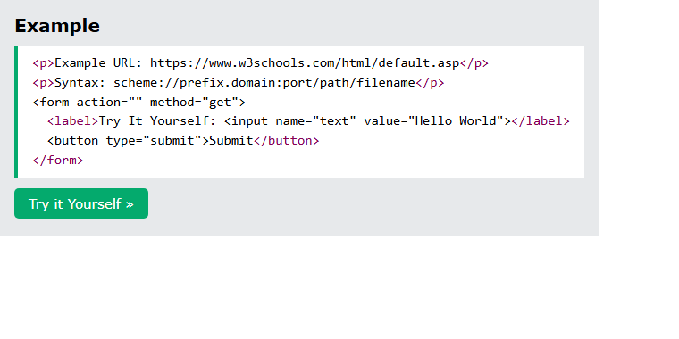

```html
<p>Example URL: https://www.w3schools.com/html/default.asp</p>
<p>Syntax: scheme://prefix.domain:port/path/filename</p>
<p>Spaces become + or %20. Euro in UTF-8 is %E2%82%AC.</p>
<form action="" method="get">
  <label>Try It Yourself: <input name="text" value="Hello World" /></label>
  <button type="submit">Submit</button>
</form>
```

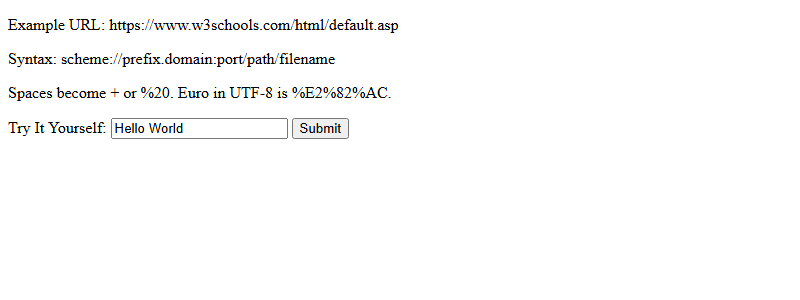

<details>
  <summary>Terminal Commands</summary>

## Terminal Commands

```bash
# from Personal/Files/html/code_sandbox
python -m http.server 8766 --bind 127.0.0.1
```

Then open `http://127.0.0.1:8766/html-url-encode/`.

</details>

<details>
  <summary>Questions and Answers</summary>

## Questions and Answers

### Question 1: What is a URL?

<details>
<summary>Answer</summary>

- [x] Another word for a **web address**.
- [x] Browsers use it to request a page from a server.

</details>

### Question 2: What is the URL syntax pattern?

<details>
<summary>Answer</summary>

- [x] `scheme://prefix.domain:port/path/filename`.

</details>

### Question 3: What is the difference between `http` and `https`?

<details>
<summary>Answer</summary>

- [x] `http` — common web pages, **not encrypted**.
- [x] `https` — secure web pages, **encrypted**.

</details>

### Question 4: Why encode URLs?

<details>
<summary>Answer</summary>

- [x] URLs may only use the **ASCII** character set.
- [x] Non-ASCII characters are replaced with `%` plus hex digits.

</details>

### Question 5: How is a space encoded in a URL?

<details>
<summary>Answer</summary>

- [x] As a plus (`+`) or as `%20`.

</details>

### Question 6: How is € encoded in UTF-8 vs Windows-1252?

<details>
<summary>Answer</summary>

- [x] UTF-8: `%E2%82%AC`.
- [x] Windows-1252: `%80`.

</details>

</details>

## Summary

A URL is `scheme://prefix.domain:port/path/filename`. Use `https` for encrypted pages. Encode non-ASCII as `%HH` and spaces as `+` or `%20`; the encoding depends on the page charset (HTML5 default: UTF-8).

## References

- [HTML URL Encoding (W3Schools)](https://www.w3schools.com/html/html_urlencode.asp)
- [URL Encoding Reference](https://www.w3schools.com/tags/ref_urlencode.asp)
- [MDN: URLs](https://developer.mozilla.org/en-US/docs/Learn_web_development/Howto/Web_mechanics/What_is_a_URL)
- [MDN: `encodeURIComponent()`](https://developer.mozilla.org/en-US/docs/Web/JavaScript/Reference/Global_Objects/encodeURIComponent)

</details>

<details>
  <summary>HTML vs. XHTML</summary>

## Introduction

**XHTML** is a **stricter, XML-based** version of HTML. This chapter defines XHTML, why it exists (well-formed markup and stricter error handling), and the rules that differ from HTML: a mandatory XHTML doctype and `xmlns`, required document elements, proper nesting, closed tags (including empty elements), lowercase names, quoted attributes, and **no attribute minimization**.

## Detailed Explanation

- [x] **What is XHTML?**
  - **X**HTML = **EX**tensible **H**yper**T**ext **M**arkup **L**anguage.
  - A **stricter**, more **XML-based** version of HTML.
  - HTML defined as an **XML application**.
  - Supported by all major browsers.
- [x] **Why XHTML?**
  - XML documents must be **well-formed**.
  - XHTML makes HTML more **extensible** and easier to mix with other data formats (such as XML).
  - Browsers **ignore many HTML errors** and still try to display the page. XHTML uses **much stricter error handling**.
- [x] **Most important differences from HTML**
  - `<!DOCTYPE>` is **mandatory**.
  - The **`xmlns`** attribute on `<html>` is **mandatory**.
  - `<html>`, `<head>`, `<title>`, and `<body>` are **mandatory**.
  - Elements must always be **properly nested**.
  - Elements must always be **closed**.
  - Elements must always be in **lowercase**.
  - Attribute names must always be in **lowercase**.
  - Attribute values must always be **quoted**.
  - Attribute **minimization is forbidden**.
- [x] **Minimum XHTML document**
  - Use an **XHTML 1.1** doctype and `xmlns="http://www.w3.org/1999/xhtml"` on `<html>`.
  - Sandbox: `code_sandbox/html-xhtml/index.html`.
  - The page shows **some content here...** (tab title: **Title of document**).
  - Served here as `text/html` so Chrome still displays it. True XHTML is `application/xhtml+xml` and **stops on well-formedness errors**.

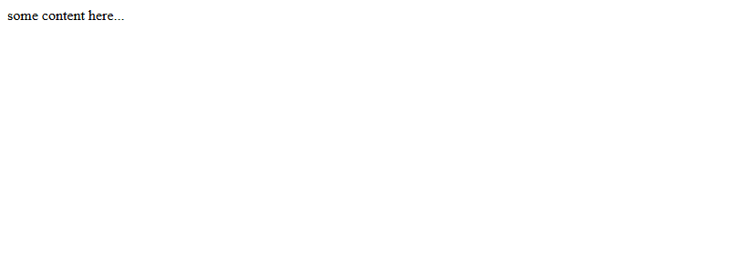

- [x] **Proper nesting and closed elements**
  - Correct: `<b><i>Some text</i></b>`. Wrong: `<b><i>Some text</b></i>`.
  - Every `<p>` needs `</p>`. Unclosed paragraphs are invalid XHTML.
  - Sandbox: `nested.html`.

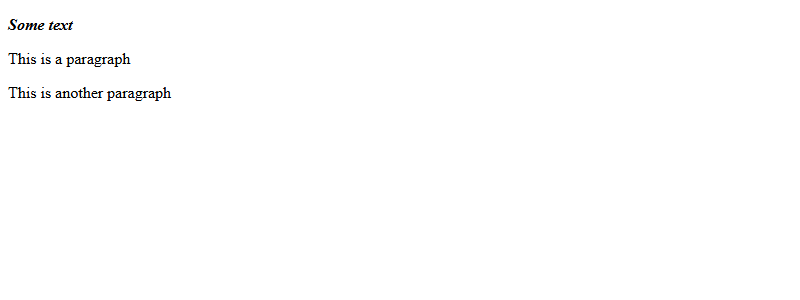

- [x] **Empty elements must be closed**
  - Correct: `<br />`, `<hr />`, ``.
  - Wrong in XHTML: `<br>`, `<hr>`, ``.
  - Sandbox: `empty.html`.

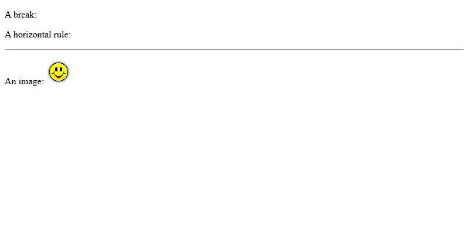

- [x] **Lowercase names, quoted values, no minimization**
  - Use `<body>` / `<p>` / `href`, not `<BODY>` / `<P>` / `HREF`.
  - Quote values: `href="https://www.w3schools.com/html/"` — not `href=https://www.w3schools.com/html/`.
  - Write `checked="checked"` and `disabled="disabled"`, not bare `checked` / `disabled`.
  - Sandbox: `attributes.html`.

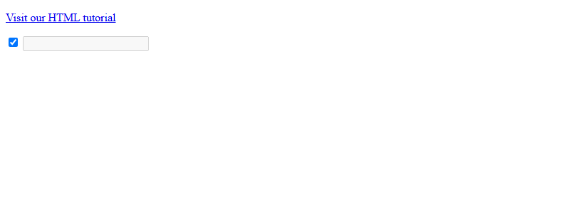

- [x] **Validate**
  - The chapter links a **W3C Markup Validation Service** box for checking a URL.

Minimum document (`index.html`):

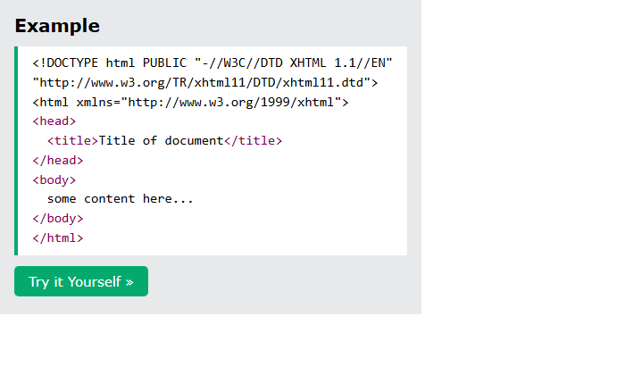

```html
<!DOCTYPE html PUBLIC "-//W3C//DTD XHTML 1.1//EN"
"http://www.w3.org/TR/xhtml11/DTD/xhtml11.dtd">
<html xmlns="http://www.w3.org/1999/xhtml">
<head>
  <title>Title of document</title>
</head>
<body>
  some content here...
</body>
</html>
```


Nested and closed (`nested.html`):

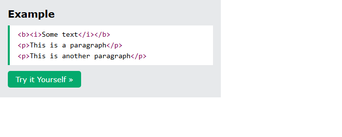

```html
<b><i>Some text</i></b>
<p>This is a paragraph</p>
<p>This is another paragraph</p>
```


Empty elements (`empty.html`):

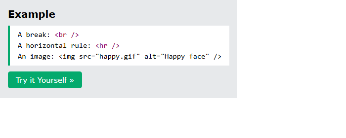

```html
A break: <br />
A horizontal rule: <hr />
An image: 
```


Attributes (`attributes.html`):

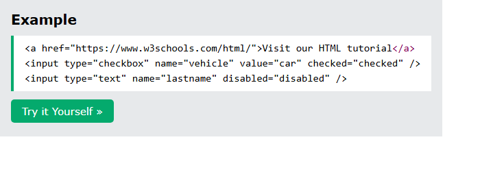

```html
<a href="https://www.w3schools.com/html/">Visit our HTML tutorial</a>
<input type="checkbox" name="vehicle" value="car" checked="checked" />
<input type="text" name="lastname" disabled="disabled" />
```


<details>
  <summary>Terminal Commands</summary>

## Terminal Commands

```bash
# from Personal/Files/html/code_sandbox
python -m http.server 8766 --bind 127.0.0.1
```

Then open `http://127.0.0.1:8766/html-xhtml/`.

</details>

<details>
  <summary>Questions and Answers</summary>

## Questions and Answers

### Question 1: What does XHTML stand for?

<details>
<summary>Answer</summary>

- [x] **EXtensible HyperText Markup Language**.
- [x] A stricter, more **XML-based** version of HTML.

</details>

### Question 2: How is XHTML related to XML?

<details>
<summary>Answer</summary>

- [x] XHTML is HTML defined as an **XML application**.
- [x] XML documents must be **well-formed**.

</details>

### Question 3: Why was XHTML developed?

<details>
<summary>Answer</summary>

- [x] To make HTML more **extensible** and flexible with other formats (such as XML).
- [x] HTML browsers often **ignore errors**; XHTML uses **stricter error handling**.

</details>

### Question 4: Which doctype and namespace does the minimum example use?

<details>
<summary>Answer</summary>

- [x] XHTML **1.1** doctype: `-//W3C//DTD XHTML 1.1//EN`.
- [x] `xmlns="http://www.w3.org/1999/xhtml"` on `<html>`.

</details>

### Question 5: Which elements are mandatory in XHTML?

<details>
<summary>Answer</summary>

- [x] `<!DOCTYPE>`, `<html>` with **`xmlns`**, `<head>`, `<title>`, and `<body>`.

</details>

### Question 6: What is wrong with `<b><i>Some text</b></i>`?

<details>
<summary>Answer</summary>

- [x] The tags **cross**; they are not properly nested.
- [x] Correct: `<b><i>Some text</i></b>`.

</details>

### Question 7: How must empty elements be written?

<details>
<summary>Answer</summary>

- [x] They must be **closed**: `<br />`, `<hr />`, ``.
- [x] Bare `<br>` / `<hr>` / `` is wrong in XHTML.

</details>

### Question 8: Must element and attribute names be lowercase?

<details>
<summary>Answer</summary>

- [x] **Yes.** `<BODY>` and `HREF` are invalid XHTML.
- [x] Use `<body>` and `href`.

</details>

### Question 9: Must attribute values be quoted?

<details>
<summary>Answer</summary>

- [x] **Yes.** `href="https://www.w3schools.com/html/"` is correct.
- [x] Unquoted `href=https://www.w3schools.com/html/` is wrong.

</details>

### Question 10: What is attribute minimization, and is it allowed?

<details>
<summary>Answer</summary>

- [x] Writing `checked` or `disabled` with **no value**.
- [x] **Forbidden** in XHTML: use `checked="checked"` and `disabled="disabled"`.

</details>

</details>

## Summary

XHTML is HTML as XML: well-formed, lowercase, fully nested and closed (including `<br />`), with quoted attributes and no minimization. A valid document needs the XHTML doctype, `xmlns` on `<html>`, plus `<head>`, `<title>`, and `<body>`. Browsers forgive HTML errors; XHTML does not.

## References

- [HTML Versus XHTML (W3Schools)](https://www.w3schools.com/html/html_xhtml.asp)
- [XML Tutorial (W3Schools)](https://www.w3schools.com/xml/default.asp)
- [W3C Markup Validation Service](https://validator.w3.org/)
- [MDN: XHTML](https://developer.mozilla.org/en-US/docs/Glossary/XHTML)
- [XHTML 1.1 (W3C)](https://www.w3.org/TR/xhtml11/)

</details>

<details>
  <summary>HTML Forms</summary>

## Introduction

An HTML **form** collects **user input**, most often sent to a **server** for processing. This chapter introduces `<form>` and `<input>`, **text fields**, `<label>`, **radio buttons**, **checkboxes**, the **submit** button (`action`), and why every submitted field needs a **`name`**.

## Detailed Explanation

- [x] **`<form>`**
  - Container for input elements: text fields, checkboxes, radio buttons, submit buttons, and more.
  - Form elements are covered in **HTML Form Elements**.
- [x] **`<input>`**
  - The most used form element. Appearance depends on **`type`**.

| Type                    | Description                                      |
| ----------------------- | ------------------------------------------------ |
| `type="text"`           | Single-line text field                           |
| `type="radio"`          | One of many choices                              |
| `type="checkbox"`       | Zero or more of many choices                     |
| `type="submit"`         | Submit the form                                  |
| `type="button"`         | Clickable button                                 |

  - All types: **HTML Input Types**.
- [x] **Text fields**
  - `<input type="text">` is a **single-line** field. Default width is **20 characters**.
  - The form box itself is **not visible**.
  - Sandbox: `code_sandbox/html-forms/index.html`.

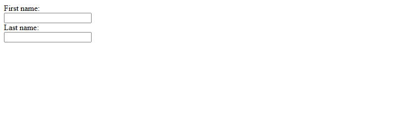

- [x] **`<label>`**
  - Labels a form control. Screen readers read the label when the control is focused.
  - Clicking the label text also activates small controls (radio/checkbox).
  - Bind with **`for`** on `<label>` equal to **`id`** on `<input>`.
- [x] **Radio buttons**
  - `<input type="radio">` — select **ONE** of a limited set.
  - Same **`name`** (`fav_language`) groups the options.
  - Sandbox: `radio.html`.

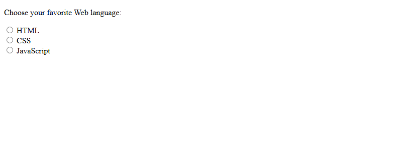

- [x] **Checkboxes**
  - `<input type="checkbox">` — select **ZERO or MORE** options.
  - Sandbox: `checkbox.html`.

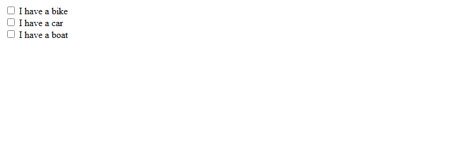

- [x] **Submit button**
  - `<input type="submit">` sends data to the **form-handler** in **`action`** (here `/action_page.php`).
  - Example values: **John** / **Doe**.
  - Sandbox: `submit.html`.

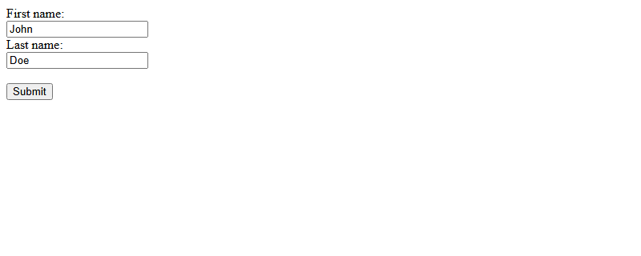

- [x] **`name` is required to submit**
  - If **`name` is omitted**, that field is **not sent**.
  - Sandbox: `no-name.html` — First name has `id` and `value="John"` but **no `name`**.

Text fields (`index.html`):

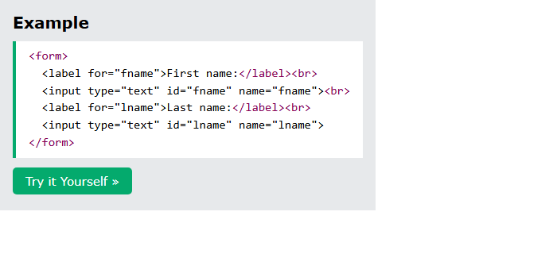

```html
<form>
  <label for="fname">First name:</label><br>
  <input type="text" id="fname" name="fname"><br>
  <label for="lname">Last name:</label><br>
  <input type="text" id="lname" name="lname">
</form>
```


Radio (`radio.html`):

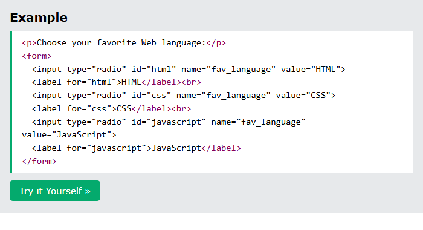

```html
<p>Choose your favorite Web language:</p>
<form>
  <input type="radio" id="html" name="fav_language" value="HTML">
  <label for="html">HTML</label><br>
  <input type="radio" id="css" name="fav_language" value="CSS">
  <label for="css">CSS</label><br>
  <input type="radio" id="javascript" name="fav_language" value="JavaScript">
  <label for="javascript">JavaScript</label>
</form>
```


Checkboxes (`checkbox.html`):

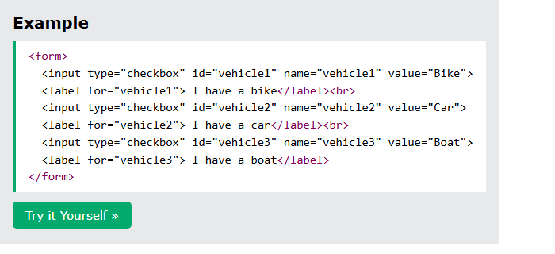

```html
<form>
  <input type="checkbox" id="vehicle1" name="vehicle1" value="Bike">
  <label for="vehicle1"> I have a bike</label><br>
  <input type="checkbox" id="vehicle2" name="vehicle2" value="Car">
  <label for="vehicle2"> I have a car</label><br>
  <input type="checkbox" id="vehicle3" name="vehicle3" value="Boat">
  <label for="vehicle3"> I have a boat</label>
</form>
```


Submit (`submit.html`):

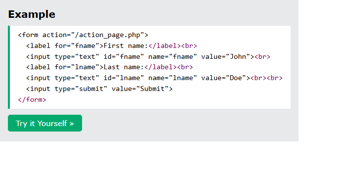

```html
<form action="/action_page.php">
  <label for="fname">First name:</label><br>
  <input type="text" id="fname" name="fname" value="John"><br>
  <label for="lname">Last name:</label><br>
  <input type="text" id="lname" name="lname" value="Doe"><br><br>
  <input type="submit" value="Submit">
</form>
```


Missing `name` (`no-name.html`):

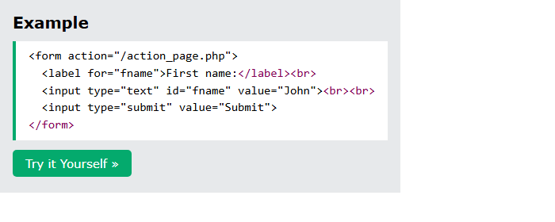

```html
<form action="/action_page.php">
  <label for="fname">First name:</label><br>
  <input type="text" id="fname" value="John"><br><br>
  <input type="submit" value="Submit">
</form>
```

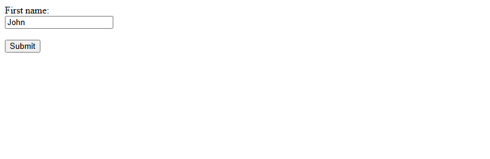

<details>
  <summary>Terminal Commands</summary>

## Terminal Commands

```bash
# from Personal/Files/html/code_sandbox
python -m http.server 8766 --bind 127.0.0.1
```

Then open `http://127.0.0.1:8766/html-forms/`.

</details>

<details>
  <summary>Questions and Answers</summary>

## Questions and Answers

### Question 1: What is an HTML form for?

<details>
<summary>Answer</summary>

- [x] To **collect user input**.
- [x] The input is most often sent to a **server** for processing.

</details>

### Question 2: What does `<form>` contain?

<details>
<summary>Answer</summary>

- [x] Input elements: text fields, checkboxes, radio buttons, submit buttons, and so on.

</details>

### Question 3: Which attribute changes how `<input>` looks?

<details>
<summary>Answer</summary>

- [x] **`type`** — for example `text`, `radio`, `checkbox`, `submit`, `button`.

</details>

### Question 4: What is the default width of a text field?

<details>
<summary>Answer</summary>

- [x] **20 characters**.
- [x] The form container itself is **not visible**.

</details>

### Question 5: How do you bind a `<label>` to an input?

<details>
<summary>Answer</summary>

- [x] Set **`for`** on the label equal to the input’s **`id`**.

</details>

### Question 6: Why use `<label>` besides visible text?

<details>
<summary>Answer</summary>

- [x] Screen readers **read the label** when the control is focused.
- [x] Clicking the label toggles small controls (radio/checkbox).

</details>

### Question 7: Radio vs checkbox?

<details>
<summary>Answer</summary>

- [x] Radio: select **ONE** of a limited set (same `name` groups them).
- [x] Checkbox: select **ZERO or MORE** options.

</details>

### Question 8: How does submit know where to send data?

<details>
<summary>Answer</summary>

- [x] The form’s **`action`** attribute (the form-handler, often a server script).

</details>

### Question 9: What happens if an input has no `name`?

<details>
<summary>Answer</summary>

- [x] That field’s value is **not submitted** at all.

</details>

</details>

## Summary

`<form>` holds controls. `<input type="text|radio|checkbox|submit|button">` covers the common cases. Pair `<label for>` with `id`. Radios pick one; checkboxes pick any. Submit uses `action`. Every field you want sent needs a **`name`**.

## References

- [HTML Forms (W3Schools)](https://www.w3schools.com/html/html_forms.asp)
- [Try it Yourself: tryhtml_form_text](https://www.w3schools.com/html/tryit.asp?filename=tryhtml_form_text)
- [Try it Yourself: tryhtml_form_radio](https://www.w3schools.com/html/tryit.asp?filename=tryhtml_form_radio)
- [Try it Yourself: tryhtml_input_checkbox](https://www.w3schools.com/html/tryit.asp?filename=tryhtml_input_checkbox)
- [Try it Yourself: tryhtml_form_submit](https://www.w3schools.com/html/tryit.asp?filename=tryhtml_form_submit)
- [Try it Yourself: tryhtml_form_submit_id](https://www.w3schools.com/html/tryit.asp?filename=tryhtml_form_submit_id)
- [HTML Form Elements](https://www.w3schools.com/html/html_form_elements.asp)
- [HTML Input Types](https://www.w3schools.com/html/html_form_input_types.asp)
- [MDN: `<form>`](https://developer.mozilla.org/en-US/docs/Web/HTML/Element/form)
- [MDN: `<input>`](https://developer.mozilla.org/en-US/docs/Web/HTML/Element/input)

</details>

<details>
  <summary>HTML Form Attributes</summary>

## Introduction

This chapter covers attributes of **`<form>`**: **`action`**, **`target`**, **`method`** (GET vs POST), **`autocomplete`**, and **`novalidate`**, plus a short list of the other form attributes.

## Detailed Explanation

- [x] **`action`**
  - What to do when the form is **submitted**. Usually a **server file** that handles the data.
  - Example: `action="/action_page.php"` with John / Doe.
  - **Tip:** If `action` is omitted, it is the **current page**.
  - Sandbox: `code_sandbox/html-form-attributes/index.html`.


- [x] **`target`** — where to show the response

| Value       | Description                    |
| ----------- | ------------------------------ |
| `_blank`    | New window or tab              |
| `_self`     | Current window (**default**)   |
| `_parent`   | Parent frame                   |
| `_top`      | Full body of the window        |
| `framename` | A named iframe                 |

  - Example: `target="_blank"`.
  - Sandbox: `target.html`.


- [x] **`method`** — HTTP method (default **GET**)
  - **GET:** data appended to the **URL** as name/value pairs. Visible in the address bar. URL length limit (~**2048** characters). Can be **bookmarked**. Never use GET for **sensitive** data. Good for search-style queries.
  - **POST:** data in the **HTTP request body**, not in the URL. **No size limit**. Cannot bookmark the submission.
  - **Tip:** Always use **POST** for sensitive or personal information.
  - The page uses `action="/action_page.php"`. The sandbox GET/POST demo uses `action=""` so Submit GET shows `?fname=John&lname=Doe` locally.
  - Sandbox: `method.html`.


- [x] **`autocomplete`**
  - `on` or `off` for the whole form. `on` fills values the user entered before.
  - A field can override: `autocomplete="off"` on the email input.
  - Sandbox: `autocomplete.html`.


- [x] **`novalidate`**
  - Boolean. When present, the browser **does not validate** inputs on submit (so an invalid email can still submit).
  - Sandbox: `novalidate.html`.


- [x] **All `<form>` attributes** (from the page)

| Attribute         | Description                                              |
| ----------------- | -------------------------------------------------------- |
| `accept-charset`  | Character encodings for submission                       |
| `action`          | Where to send the form-data                              |
| `autocomplete`    | Autocomplete on or off                                   |
| `enctype`         | How to encode data (`method="post"` only)                |
| `method`          | HTTP method                                              |
| `name`            | Name of the form                                         |
| `novalidate`      | Skip validation on submit                                |
| `rel`             | Relationship to a linked resource                        |
| `target`          | Where to display the response                            |

`action` (`index.html`):


```html
<form action="/action_page.php">
  <label for="fname">First name:</label><br>
  <input type="text" id="fname" name="fname" value="John"><br>
  <label for="lname">Last name:</label><br>
  <input type="text" id="lname" name="lname" value="Doe"><br><br>
  <input type="submit" value="Submit">
</form>
```


`target` (`target.html`):


```html
<form action="/action_page.php" target="_blank">
```


`method` (`method.html`):


```html
<form action="/action_page.php" method="get">
<form action="/action_page.php" method="post">
```


`autocomplete` (`autocomplete.html`):


```html
<form action="/action_page.php" autocomplete="on">
```


`novalidate` (`novalidate.html`):


```html
<form action="/action_page.php" novalidate>
```


<details>
  <summary>Terminal Commands</summary>

## Terminal Commands

```bash
# from Personal/Files/html/code_sandbox
python -m http.server 8766 --bind 127.0.0.1
```

Then open `http://127.0.0.1:8766/html-form-attributes/`.

</details>

<details>
  <summary>Questions and Answers</summary>

## Questions and Answers

### Question 1: What does `action` do?

<details>
<summary>Answer</summary>

- [x] Sets the **form-handler** (usually a server file).
- [x] If omitted, the action is the **current page**.

</details>

### Question 2: What is the default `target`?

<details>
<summary>Answer</summary>

- [x] **`_self`** — the response opens in the **current window**.
- [x] `_blank` opens a **new tab**.

</details>

### Question 3: What is the default HTTP method for a form?

<details>
<summary>Answer</summary>

- [x] **GET**.

</details>

### Question 4: Why avoid GET for passwords?

<details>
<summary>Answer</summary>

- [x] GET puts data in the **URL**, so it is **visible**.
- [x] URLs are also limited (~**2048** characters).

</details>

### Question 5: When should you use POST?

<details>
<summary>Answer</summary>

- [x] For **sensitive or personal** data.
- [x] For **large** payloads (no size limit like GET).
- [x] POST submissions **cannot be bookmarked**.

</details>

### Question 6: What does `autocomplete="on"` do?

<details>
<summary>Answer</summary>

- [x] The browser can **fill values** the user entered before.
- [x] A single input can set `autocomplete="off"` to override.

</details>

### Question 7: What does `novalidate` do?

<details>
<summary>Answer</summary>

- [x] It is a **boolean** attribute.
- [x] When present, the form is **not validated** on submit.

</details>

### Question 8: Which form attribute sets encoding for POST?

<details>
<summary>Answer</summary>

- [x] **`enctype`** — how form-data is encoded (POST only).

</details>

</details>

## Summary

`action` is the handler (current page if omitted). `target` defaults to `_self`. `method` defaults to GET (URL, bookmarkable, not for secrets); use POST for sensitive or large data. `autocomplete` can be on/off; `novalidate` skips checking.

## References

- [HTML Form Attributes (W3Schools)](https://www.w3schools.com/html/html_forms_attributes.asp)
- [HTML Forms](https://www.w3schools.com/html/html_forms.asp)
- [MDN: `<form>`](https://developer.mozilla.org/en-US/docs/Web/HTML/Element/form)
- [MDN: HTTP GET vs POST](https://developer.mozilla.org/en-US/docs/Learn_web_development/Extensions/Forms/Sending_and_retrieving_form_data)

</details>

<details>
  <summary>HTML Form Elements</summary>

## Introduction

This chapter lists every common control you can put in a `<form>`: `<input>`, `<label>`, `<select>` / `<option>` / `<optgroup>`, `<textarea>`, `<button>`, `<fieldset>` / `<legend>`, `<datalist>`, and `<output>`.

## Detailed Explanation

- [x] **`<form>` can contain** `<input>` `<label>` `<select>` `<textarea>` `<button>` `<fieldset>` `<legend>` `<datalist>` `<output>` `<option>` `<optgroup>`.
- [x] **`<input>`** — most used; `type` changes the control. Sandbox: `code_sandbox/html-form-elements/index.html` (text field plus a car `<select>` with **Fiat** pre-selected).


- [x] **`<label>`** — `for` must match the control’s `id`. Helps screen readers and makes small radios/checkboxes easier to click.
- [x] **`<select>` / `<option>`**
  - Drop-down. First option is selected unless another has **`selected`**.
  - **`size`** — how many options are visible.
  - **`multiple`** — select more than one.
  - Sandbox: `select.html`.


- [x] **`<textarea>`**
  - Multi-line field. **`rows`** = visible lines, **`cols`** = visible width.
  - Example text: **The cat was playing in the garden.**
  - Size can also be set with CSS (`width` / `height`).
  - Sandbox: `textarea.html`.


- [x] **`<button>`**
  - Example: `onclick="alert('Hello World!')"` — **Click Me!**
  - **Always set `type`**. Browsers disagree on the default (`submit` vs `button`).
  - Sandbox: `button.html`.


- [x] **`<fieldset>` and `<legend>`**
  - Group related fields; legend is the caption (**Personalia:**).
  - Sandbox: `fieldset.html`.


- [x] **`<datalist>`**
  - Predefined suggestions. Input **`list`** must match datalist **`id`**.
  - Browsers: Edge, Firefox, Chrome, Opera, Safari.
  - Sandbox: `datalist.html`.


- [x] **`<output>`**
  - Shows a calculation. `oninput="x.value=parseInt(a.value)+parseInt(b.value)"` — range + number.
  - The sum updates when you move the slider or change the number (starts empty until input).
  - Sandbox: `output.html`.


- [x] **Tag list** from the page: `<form>` form; `<input>` control; `<textarea>` multiline; `<label>` label; `<fieldset>` group; `<legend>` caption; `<select>` drop-down; `<optgroup>` option group; `<option>` option; `<button>` button; `<datalist>` suggestions; `<output>` calculation result.

Input + select (`index.html`):


```html
<label for="fname">First name:</label>
<input type="text" id="fname" name="fname">
<select id="cars" name="cars">
  <option value="fiat" selected>Fiat</option>
</select>
```


Size / multiple (`select.html`):


```html
<select id="cars" name="cars" size="3">
<select id="cars" name="cars" size="4" multiple>
```


Textarea (`textarea.html`):


```html
<textarea name="message" rows="10" cols="30">
The cat was playing in the garden.
</textarea>
```


Button (`button.html`):


```html
<button type="button" onclick="alert('Hello World!')">Click Me!</button>
```


Fieldset (`fieldset.html`):


```html
<fieldset>
  <legend>Personalia:</legend>
  ...
</fieldset>
```


Datalist (`datalist.html`):


```html
<input list="browsers">
<datalist id="browsers">
  <option value="Edge">
</datalist>
```


Output (`output.html`):


```html
<form oninput="x.value=parseInt(a.value)+parseInt(b.value)">
  0 <input type="range" id="a" name="a" value="50"> 100 +
  <input type="number" id="b" name="b" value="50">
  = <output name="x" for="a b"></output>
</form>
```


<details>
  <summary>Terminal Commands</summary>

## Terminal Commands

```bash
# from Personal/Files/html/code_sandbox
python -m http.server 8766 --bind 127.0.0.1
```

Then open `http://127.0.0.1:8766/html-form-elements/`.

</details>

<details>
  <summary>Questions and Answers</summary>

## Questions and Answers

### Question 1: Which elements can live in a `<form>`?

<details>
<summary>Answer</summary>

- [x] `<input>` `<label>` `<select>` `<textarea>` `<button>` `<fieldset>` `<legend>` `<datalist>` `<output>` `<option>` `<optgroup>`.

</details>

### Question 2: How do you pre-select a drop-down option?

<details>
<summary>Answer</summary>

- [x] Add the **`selected`** attribute on that `<option>`.
- [x] Otherwise the **first** option is selected.

</details>

### Question 3: What do `size` and `multiple` do on `<select>`?

<details>
<summary>Answer</summary>

- [x] `size` — number of **visible** options.
- [x] `multiple` — allow **more than one** selection.

</details>

### Question 4: What do `rows` and `cols` mean on `<textarea>`?

<details>
<summary>Answer</summary>

- [x] `rows` — visible **lines**.
- [x] `cols` — visible **width**.
- [x] You can also size it with **CSS**.

</details>

### Question 5: Why set `type` on `<button>`?

<details>
<summary>Answer</summary>

- [x] Browsers may use **different default types**.
- [x] Always specify `type` (`button`, `submit`, or `reset`).

</details>

### Question 6: What are `<fieldset>` and `<legend>` for?

<details>
<summary>Answer</summary>

- [x] `<fieldset>` **groups** related controls.
- [x] `<legend>` is the **caption** for that group.

</details>

### Question 7: How do you hook an input to a `<datalist>`?

<details>
<summary>Answer</summary>

- [x] Set the input’s **`list`** to the datalist’s **`id`**.

</details>

### Question 8: What does `<output>` show?

<details>
<summary>Answer</summary>

- [x] The **result of a calculation** (often from a script / `oninput`).

</details>

</details>

## Summary

Forms are built from input, label, select/option, textarea, button, fieldset/legend, datalist, and output. Pre-select with `selected`; show more options with `size`/`multiple`. Always set button `type`. Bind datalist with `list`/`id`. Use `<output>` for live totals.

## References

- [HTML Form Elements (W3Schools)](https://www.w3schools.com/html/html_form_elements.asp)
- [HTML Input Types](https://www.w3schools.com/html/html_form_input_types.asp)
- [HTML Tag Reference](https://www.w3schools.com/tags/default.asp)
- [MDN: `<select>`](https://developer.mozilla.org/en-US/docs/Web/HTML/Element/select)
- [MDN: `<datalist>`](https://developer.mozilla.org/en-US/docs/Web/HTML/Element/datalist)
- [MDN: `<output>`](https://developer.mozilla.org/en-US/docs/Web/HTML/Element/output)

</details>

<details>
  <summary>HTML Input Types</summary>

## Introduction

This chapter lists every HTML **`<input type="...">`**. The default type is **`text`**. Many HTML5 types (color, date, email, and so on) show a picker or extra keyboard when the browser supports them.

## Detailed Explanation

- [x] **All types:** `button` `checkbox` `color` `date` `datetime-local` `email` `file` `hidden` `image` `month` `number` `password` `radio` `range` `reset` `search` `submit` `tel` `text` `time` `url` `week`.
- [x] **`text`** — single-line field (default).
- [x] **`password`** — characters are **masked** (asterisks or dots).
- [x] **`submit`** — sends data to `action`. If **`value` is omitted**, the button gets **default text**.
- [x] **`reset`** — restores **default values**.
  - Sandbox: `code_sandbox/html-input-types/index.html`.


- [x] **`radio`** — **ONLY ONE** of a set. **`checkbox`** — **ZERO or MORE**. **`button`** — clickable (`onclick` alert).
  - Sandbox: `choices.html`.


- [x] **HTML5 types** (sandbox: `html5.html`)
  - **`color`** — color picker (if supported).
  - **`date`** — date picker; **`min` / `max`** can restrict (before 1980-01-01 / after 2000-01-01).
  - **`email`** — may validate on submit; phones often add **.com** to the keyboard.
  - **`file`** — Browse for uploads.
  - **`image`** — image used as a **submit** button (`src`, `alt`, width/height).
  - **`number`** — numeric; example **min 1 max 5**. Also `step`/`value` (0–100 step 10, default 30).
  - **`range`** — slider; default 0–100. Example volume 0–50.
  - **`search`** — search field (behaves like text).
  - **`tel`** — telephone; example `pattern="[0-9]{3}-[0-9]{2}-[0-9]{3}"`.
  - **`url`** — URL; may validate; phones may add **.com**.
  - **`hidden`** — not shown. Example `custId=3487`. **Not security** — still visible in View Source / DevTools.


- [x] **More pickers** (`pickers.html`): **`datetime-local`** (date+time, no time zone), **`month`**, **`time`**, **`week`**.


- [x] **Input restrictions** (preview of the next chapter): `checked` `disabled` `max` `maxlength` `min` `pattern` `readonly` `required` `size` `step` `value`.

Text / password / submit / reset (`index.html`):


```html
<input type="text" id="fname" name="fname">
<input type="password" id="pwd" name="pwd">
<input type="submit" value="Submit">
<input type="reset" value="Reset">
```


Choices (`choices.html`):


```html
<input type="radio" name="fav_language" value="HTML">
<input type="checkbox" name="vehicle1" value="Bike">
<input type="button" onclick="alert('Hello World!')" value="Click Me!">
```


HTML5 types (`html5.html`):


```html
<input type="color">
<input type="date" max="1979-12-31">
<input type="email">
<input type="file">
<input type="number" min="1" max="5">
<input type="range" min="0" max="50">
<input type="hidden" name="custId" value="3487">
<input type="image" src="img_submit.gif" alt="Submit">
```


Pickers (`pickers.html`):


```html
<input type="datetime-local">
<input type="month">
<input type="time">
<input type="week">
```


<details>
  <summary>Terminal Commands</summary>

## Terminal Commands

```bash
# from Personal/Files/html/code_sandbox
python -m http.server 8766 --bind 127.0.0.1
```

Then open `http://127.0.0.1:8766/html-input-types/`.

</details>

<details>
  <summary>Questions and Answers</summary>

## Questions and Answers

### Question 1: What is the default `type` if you omit it?

<details>
<summary>Answer</summary>

- [x] **`text`**.

</details>

### Question 2: How does `password` differ from `text`?

<details>
<summary>Answer</summary>

- [x] The characters are **masked** (asterisks or circles).

</details>

### Question 3: What if a submit button has no `value`?

<details>
<summary>Answer</summary>

- [x] The button uses the browser’s **default text**.

</details>

### Question 4: Radio vs checkbox?

<details>
<summary>Answer</summary>

- [x] Radio: **only one** of a set.
- [x] Checkbox: **zero or more**.

</details>

### Question 5: Is `type="hidden"` a security feature?

<details>
<summary>Answer</summary>

- [x] **No.** The value is still in the HTML and DevTools.
- [x] Do **not** treat hidden fields as secret.

</details>

### Question 6: What does `type="image"` do?

<details>
<summary>Answer</summary>

- [x] Uses an **image as a submit button**.
- [x] Path is **`src`**; include **`alt`**.

</details>

### Question 7: Which types often show a picker?

<details>
<summary>Answer</summary>

- [x] `color`, `date`, `datetime-local`, `month`, `time`, `week` (browser support varies).

</details>

### Question 8: What do `min`, `max`, and `step` restrict?

<details>
<summary>Answer</summary>

- [x] Allowed numbers (and dates) and the **interval** (`step`).
- [x] Example: number 0–100 step 10, default 30.

</details>

</details>

## Summary

`type` chooses the control. Default is text; password masks; submit/reset/image send or restore; radio vs checkbox; HTML5 adds color, dates, email, file, hidden, number, range, search, tel, url, and week. Hidden is not security. Restrictions such as min/max/pattern are covered next.

## References

- [HTML Input Types (W3Schools)](https://www.w3schools.com/html/html_form_input_types.asp)
- [HTML Input Attributes](https://www.w3schools.com/html/html_form_attributes.asp)
- [MDN: `<input>` types](https://developer.mozilla.org/en-US/docs/Web/HTML/Element/input#input_types)

</details>

<details>
  <summary>HTML Input Attributes</summary>

## Introduction

This chapter covers attributes of **`<input>`**: **`value`**, **`readonly`**, **`disabled`**, **`size`**, **`maxlength`**, **`min`/`max`**, **`multiple`**, **`pattern`**, **`placeholder`**, **`required`**, **`step`**, **`autofocus`**, **`height`/`width`**, **`list`**, and **`autocomplete`**. Browser checks are **not** enough — the **server** must validate too.

## Detailed Explanation

- [x] **`value`** — initial/default text (John / Doe).
- [x] **`readonly`** — cannot edit; **can** tab, highlight, copy; **is submitted**.
- [x] **`disabled`** — unusable / un-clickable; **not submitted**.
  - Sandbox: `code_sandbox/html-input-attributes/index.html`.

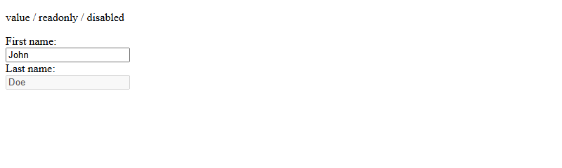

- [x] **`size`** — visible width in **characters** (default **20**). Works with text, search, tel, url, email, password.
- [x] **`maxlength`** — max characters; the field **stops accepting** more, but gives **no message** (use JS to alert).
- [x] **`min` / `max`** — number, range, date, datetime-local, month, time, week.
- [x] **`multiple`** — more than one value (`email`, `file`).
- [x] **`pattern`** — regex checked on submit (text, date, search, url, tel, email, password). Use **`title`** to explain (three-letter country code).
- [x] **`placeholder`** — hint before typing (`123-45-678`).
- [x] **`required`** — must be filled (text, search, url, tel, email, password, date pickers, number, checkbox, radio, file).
- [x] **`step`** — legal intervals (`step="3"` → -3, 0, 3, 6…).
  - Sandbox: `limits.html`.

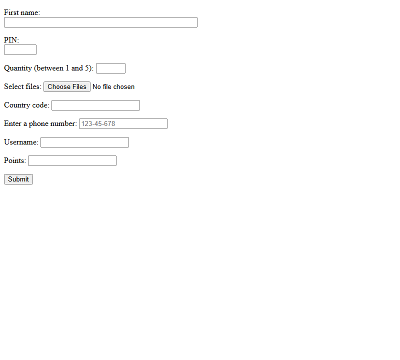

- [x] **`autofocus`** — focus on load (omitted from the sandbox so snapping does not steal focus).
- [x] **`height` / `width`** — size of `type="image"`. Set both so layout does not jump while the image loads.
- [x] **`list`** — points at a `<datalist>` `id`.
- [x] **`autocomplete`** — on/off for a form or field (text, search, url, tel, email, password, date pickers, range, color). Some browsers need autocomplete enabled in Preferences.
  - Sandbox: `extra.html`.

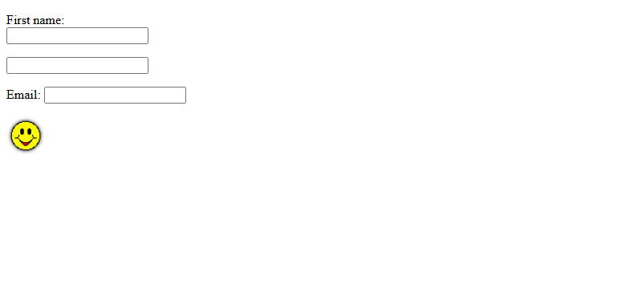

- [x] **Note:** Restrictions are **not foolproof**. Check again on the **server**.

Readonly / disabled (`index.html`):

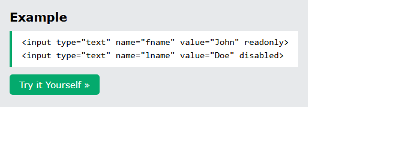

```html
<input type="text" name="fname" value="John" readonly>
<input type="text" name="lname" value="Doe" disabled>
```


Limits (`limits.html`):

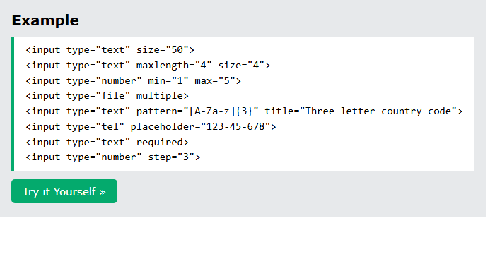

```html
<input type="text" size="50">
<input type="text" maxlength="4" size="4">
<input type="number" min="1" max="5">
<input type="file" multiple>
<input type="text" pattern="[A-Za-z]{3}" title="Three letter country code">
<input type="tel" placeholder="123-45-678">
<input type="text" required>
<input type="number" step="3">
```


List / autocomplete / image (`extra.html`):

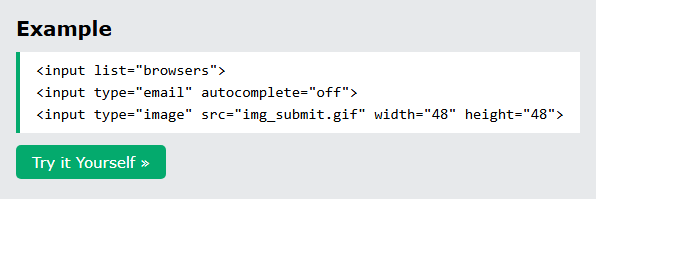

```html
<input list="browsers">
<input type="email" autocomplete="off">
<input type="image" src="img_submit.gif" width="48" height="48">
```


<details>
  <summary>Terminal Commands</summary>

## Terminal Commands

```bash
# from Personal/Files/html/code_sandbox
python -m http.server 8766 --bind 127.0.0.1
```

Then open `http://127.0.0.1:8766/html-input-attributes/`.

</details>

<details>
  <summary>Questions and Answers</summary>

## Questions and Answers

### Question 1: Is a readonly field submitted? A disabled field?

<details>
<summary>Answer</summary>

- [x] **Readonly: yes** (and you can copy the text).
- [x] **Disabled: no.**

</details>

### Question 2: What is the default `size`?

<details>
<summary>Answer</summary>

- [x] **20** characters.
- [x] `size` applies to text, search, tel, url, email, password.

</details>

### Question 3: Does `maxlength` show an error message?

<details>
<summary>Answer</summary>

- [x] **No.** Extra characters are blocked silently.
- [x] Use **JavaScript** if you want an alert.

</details>

### Question 4: Which types support `multiple`?

<details>
<summary>Answer</summary>

- [x] **`email`** and **`file`**.

</details>

### Question 5: How do you explain a `pattern` to the user?

<details>
<summary>Answer</summary>

- [x] Set the global **`title`** attribute (for example “Three letter country code”).

</details>

### Question 6: What does `step="3"` allow?

<details>
<summary>Answer</summary>

- [x] Legal numbers such as **-3, 0, 3, 6**, …

</details>

### Question 7: Why set both `height` and `width` on `type="image"`?

<details>
<summary>Answer</summary>

- [x] The browser **reserves space** so the layout does not jump while the image loads.

</details>

### Question 8: Are these attributes enough to secure a form?

<details>
<summary>Answer</summary>

- [x] **No.** Check the values again on the **server**.

</details>

</details>

## Summary

`value` sets defaults. Readonly submits; disabled does not. `size`/`maxlength` shape text; `min`/`max`/`step` shape numbers and dates. Use `pattern`+`title`, `placeholder`, `required`, `multiple`, `list`, and `autocomplete`. Always validate on the server.

## References

- [HTML Input Attributes (W3Schools)](https://www.w3schools.com/html/html_form_attributes.asp)
- [HTML Input Types](https://www.w3schools.com/html/html_form_input_types.asp)
- [MDN: `<input>` attributes](https://developer.mozilla.org/en-US/docs/Web/HTML/Element/input#attributes)

</details>

<details>
  <summary>Input Form Attributes</summary>

## Introduction

W3Schools page title: **HTML Input form\* Attributes**. These `form*` attributes on **`<input>`** override the parent `<form>`, or associate a control **outside** the form. Covered: **`form`**, **`formaction`**, **`formenctype`**, **`formmethod`**, **`formtarget`**, **`formnovalidate`**, plus form-level **`novalidate`**.

## Detailed Explanation

- [x] **`form`**
  - Which `<form>` this input belongs to.
  - Value must equal that form’s **`id`**.
  - Last name can sit **outside** the form and still submit with `form="form1"`.
  - Sandbox: `code_sandbox/html-input-form-attributes/index.html`.

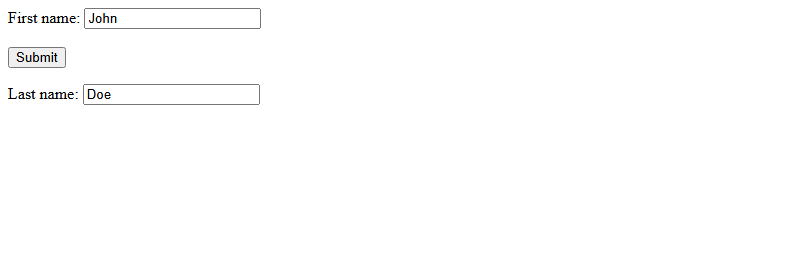

- [x] **Overrides on `type="submit"` and `type="image"`** (except `formnovalidate`: submit only)
  - **`formaction`** — overrides `action` (example: **Submit as Admin** → `/action_page2.php`).
  - **`formenctype`** — overrides `enctype` (POST only). Second button: `multipart/form-data`.
  - **`formmethod`** — overrides `method` (`get` vs `post`). GET is bookmarkable but visible in the URL and size-limited; POST is more robust.
  - **`formtarget`** — overrides `target` (example: `_blank`).
  - Sandbox: `override.html`.

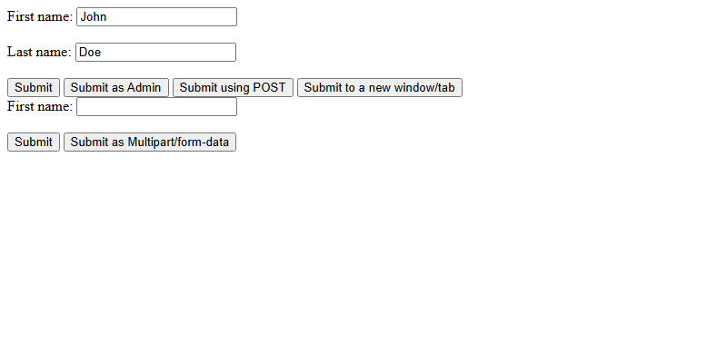

- [x] **`formnovalidate` vs `novalidate`**
  - `formnovalidate` on a **submit** button skips validation for that click.
  - `novalidate` on **`<form>`** skips validation for the whole form.
  - Sandbox: `novalidate.html`.

`form` (`index.html`):

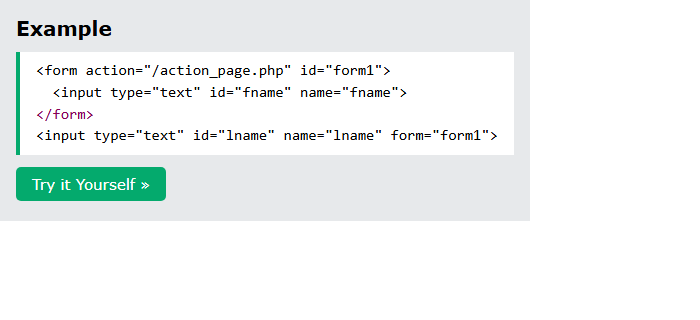

```html
<form action="/action_page.php" id="form1">
  <input type="text" id="fname" name="fname">
</form>
<input type="text" id="lname" name="lname" form="form1">
```


Overrides (`override.html`):

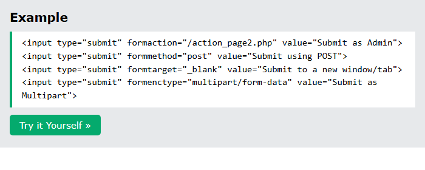

```html
<input type="submit" formaction="/action_page2.php" value="Submit as Admin">
<input type="submit" formmethod="post" value="Submit using POST">
<input type="submit" formtarget="_blank" value="Submit to a new window/tab">
<input type="submit" formenctype="multipart/form-data" value="Submit as Multipart">
```


Novalidate (`novalidate.html`):

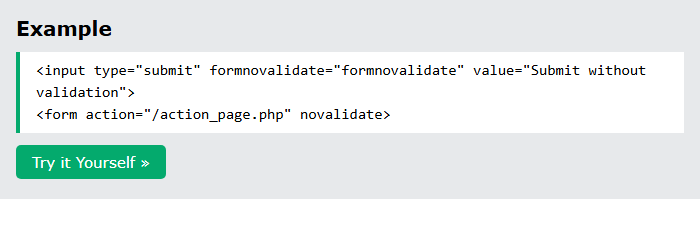

```html
<input type="submit" formnovalidate="formnovalidate" value="Submit without validation">
<form action="/action_page.php" novalidate>
```

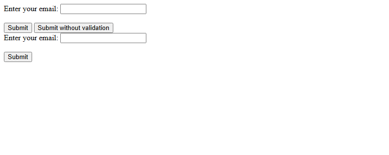

<details>
  <summary>Terminal Commands</summary>

## Terminal Commands

```bash
# from Personal/Files/html/code_sandbox
python -m http.server 8766 --bind 127.0.0.1
```

Then open `http://127.0.0.1:8766/html-input-form-attributes/`.

</details>

<details>
  <summary>Questions and Answers</summary>

## Questions and Answers

### Question 1: How can an input outside `<form>` still submit?

<details>
<summary>Answer</summary>

- [x] Set **`form="theFormId"`** equal to the form’s **`id`**.

</details>

### Question 2: What does `formaction` override?

<details>
<summary>Answer</summary>

- [x] The form’s **`action`**.
- [x] Works on **`submit`** and **`image`**.

</details>

### Question 3: When does `formenctype` apply?

<details>
<summary>Answer</summary>

- [x] Only with **`method="post"`**.
- [x] It overrides the form’s **`enctype`**.

</details>

### Question 4: GET vs POST on a submit button?

<details>
<summary>Answer</summary>

- [x] `formmethod="get"` — data in the **URL** (bookmarkable, visible, size-limited).
- [x] `formmethod="post"` — request **body** (not bookmarkable, more robust).

</details>

### Question 5: What does `formtarget="_blank"` do?

<details>
<summary>Answer</summary>

- [x] Shows the response in a **new window or tab**.
- [x] Overrides the form’s **`target`**.

</details>

### Question 6: `formnovalidate` vs `novalidate`?

<details>
<summary>Answer</summary>

- [x] `formnovalidate` — skip validation for **that submit button**.
- [x] `novalidate` — skip validation for the **whole form**.

</details>

</details>

## Summary

`form` ties an outside input to a form `id`. On submit/image buttons, `formaction`, `formenctype`, `formmethod`, and `formtarget` override the parent form. `formnovalidate` skips checks for one button; `novalidate` skips them for the form.

## References

- [HTML Input form* Attributes (W3Schools)](https://www.w3schools.com/html/html_form_attributes_form.asp)
- [HTML Form Attributes](https://www.w3schools.com/html/html_forms_attributes.asp)
- [MDN: `<input>` form attribute](https://developer.mozilla.org/en-US/docs/Web/HTML/Element/input#form)
- [MDN: `formaction`](https://developer.mozilla.org/en-US/docs/Web/HTML/Element/input#formaction)

</details>

<details>
  <summary>HTML Canvas</summary>

## Introduction

The HTML **`<canvas>`** element is a **container** for graphics drawn **on the fly with JavaScript**. This chapter shows an empty canvas, a **line**, a **circle**, **fill/stroke text**, **linear and radial gradients**, and **`drawImage`**. Canvas is supported by all major browsers.

## Detailed Explanation

- [x] **What canvas is**
  - Draw paths, boxes, circles, text, and images with JS.
  - Markup: `<canvas id="myCanvas" width="200" height="100"></canvas>`.
  - Always set **`id`**, **`width`**, and **`height`**. Add a border with **`style`**. Default: no border, no content.
  - Sandbox: `code_sandbox/html-canvas/index.html`.


- [x] **JavaScript drawing** — `getElementById` → `getContext("2d")`.
  - **Line:** `moveTo(0, 0); lineTo(200, 100); stroke();`
  - **Circle:** `beginPath(); arc(95, 50, 40, 0, 2 * Math.PI); stroke();`
  - **Fill text:** `font = "30px Arial"; fillText("Hello World", 10, 50);`
  - **Stroke text:** `strokeText("Hello World", 10, 50);`
  - Sandbox: `shapes.html`.


- [x] **Gradients**
  - Linear: `createLinearGradient(0, 0, 200, 0)` red → white, then `fillRect(10, 10, 150, 80)`.
  - Circular: `createRadialGradient(75, 50, 5, 90, 60, 100)`.
  - Sandbox: `gradient.html`.


- [x] **Draw image**
  - `ctx.drawImage(img, 10, 10)` after reading an ``.
  - The page script assumes the image is already loaded. The sandbox uses **`window.onload`** so `drawImage` runs after the file is ready (current browsers; otherwise the canvas can stay blank).
  - Sandbox: `image.html` (local `picture.jpg` stands in for W3Schools’ The Scream).


- [x] More in the **HTML Canvas Tutorial**.

Empty canvas (`index.html`):


```html
<canvas id="myCanvas" width="200" height="100" style="border:1px solid #000000;">
</canvas>
```


Shapes (`shapes.html`):


```javascript
ctx.moveTo(0, 0);
ctx.lineTo(200, 100);
ctx.stroke();
ctx.beginPath();
ctx.arc(95, 50, 40, 0, 2 * Math.PI);
ctx.fillText("Hello World", 10, 50);
ctx.strokeText("Hello World", 10, 50);
```


Gradients (`gradient.html`):


```javascript
var grd = ctx.createLinearGradient(0, 0, 200, 0);
grd.addColorStop(0, "red");
grd.addColorStop(1, "white");
ctx.fillRect(10, 10, 150, 80);
```


Image (`image.html`):


```javascript
var img = document.getElementById("scream");
ctx.drawImage(img, 10, 10);
```


<details>
  <summary>Terminal Commands</summary>

## Terminal Commands

```bash
# from Personal/Files/html/code_sandbox
python -m http.server 8766 --bind 127.0.0.1
```

Then open `http://127.0.0.1:8766/html-canvas/`.

</details>

<details>
  <summary>Questions and Answers</summary>

## Questions and Answers

### Question 1: Does `<canvas>` draw by itself?

<details>
<summary>Answer</summary>

- [x] **No.** It is only a **container**.
- [x] You draw with **JavaScript**.

</details>

### Question 2: Which attributes should you always set?

<details>
<summary>Answer</summary>

- [x] **`id`** (for the script), **`width`**, and **`height`**.

</details>

### Question 3: How do you start drawing?

<details>
<summary>Answer</summary>

- [x] `document.getElementById("myCanvas")`.
- [x] `getContext("2d")`.

</details>

### Question 4: How do you draw a circle?

<details>
<summary>Answer</summary>

- [x] `beginPath()` then `arc(x, y, r, 0, 2 * Math.PI)` then `stroke()` (or fill).

</details>

### Question 5: `fillText` vs `strokeText`?

<details>
<summary>Answer</summary>

- [x] `fillText` — solid glyphs.
- [x] `strokeText` — outlined glyphs.

</details>

### Question 6: Linear vs radial gradient?

<details>
<summary>Answer</summary>

- [x] `createLinearGradient` — along a line.
- [x] `createRadialGradient` — from one circle to another.
- [x] `addColorStop` then `fillStyle` + `fillRect`.

</details>

### Question 7: Why might `drawImage` show a blank canvas?

<details>
<summary>Answer</summary>

- [x] The image may **not have loaded** yet.
- [x] Wait for **`load` / `window.onload`** before drawing.

</details>

</details>

## Summary

Canvas is a JS drawing surface. Set id, width, and height; get a 2D context; then stroke paths, arcs, text, gradients, or images. Wait for images to load before `drawImage`.

## References

- [HTML Canvas Graphics (W3Schools)](https://www.w3schools.com/html/html5_canvas.asp)
- [HTML Canvas Tutorial](https://www.w3schools.com/graphics/canvas_intro.asp)
- [MDN: `<canvas>`](https://developer.mozilla.org/en-US/docs/Web/HTML/Element/canvas)
- [MDN: Canvas API](https://developer.mozilla.org/en-US/docs/Web/API/Canvas_API)

</details>

<details>
  <summary>HTML SVG</summary>

## Introduction

**SVG** (Scalable Vector Graphics) describes **2D graphics in XML** and can be **embedded in HTML**. Graphics stay sharp when zoomed. This chapter draws a **circle**, **rectangles**, a **star**, a **gradient ellipse with text**, and compares SVG with **canvas**.

## Detailed Explanation

- [x] **What is SVG?**
  - Vector graphics for the Web, in **XML**.
  - Elements and attributes can be **animated**.
  - A **W3C recommendation**; works with CSS, DOM, XSL, and JavaScript.
  - Supported by all major browsers.
- [x] **`<svg>`** — container for paths, rectangles, circles, polygons, text, and more.
- [x] **Circle** — `cx` `cy` `r`, green stroke, yellow fill.
  - Sandbox: `code_sandbox/html-svg/index.html`.


- [x] **More shapes** (`shapes.html`)
  - Blue rectangle, red stroke.
  - Rounded rect (`rx` `ry`) with **opacity 0.5**.
  - Lime/purple **star** polygon, `fill-rule: evenodd`.
  - Yellow→red **linearGradient** on an ellipse, white **SVG** text. Fallback: “Sorry, your browser does not support inline SVG.”


- [x] **SVG vs Canvas**

| SVG                                         | Canvas                                      |
| ------------------------------------------- | ------------------------------------------- |
| Resolution independent                      | Resolution dependent                        |
| Event handlers                              | No event handlers                           |
| Good text rendering                         | Poor text rendering                         |
| Slow if complex                             | Can save as .png / .jpg                     |
| Not suited for games                        | Well suited for graphic-intensive games     |

  - SVG: each shape is an **object** in the DOM; change an attribute and the browser **re-renders**.
  - Canvas: **pixel by pixel**; once drawn it is **forgotten** — move something and **redraw the whole scene**.

Circle (`index.html`):


```html
<svg width="100" height="100">
  <circle cx="50" cy="50" r="40" stroke="green" stroke-width="4" fill="yellow" />
</svg>
```


Shapes (`shapes.html`):


```html
<rect x="10" y="10" width="200" height="100" stroke="red" stroke-width="6" fill="blue" />
<polygon points="100,10 40,198 190,78 10,78 160,198" />
<ellipse cx="100" cy="70" rx="85" ry="55" fill="url(#grad1)" />
<text fill="#ffffff" font-size="45" x="50" y="86">SVG</text>
```


<details>
  <summary>Terminal Commands</summary>

## Terminal Commands

```bash
# from Personal/Files/html/code_sandbox
python -m http.server 8766 --bind 127.0.0.1
```

Then open `http://127.0.0.1:8766/html-svg/`.

</details>

<details>
  <summary>Questions and Answers</summary>

## Questions and Answers

### Question 1: What does SVG stand for?

<details>
<summary>Answer</summary>

- [x] **Scalable Vector Graphics**.
- [x] Vector graphics in **XML**, embeddable in HTML.

</details>

### Question 2: Do SVG graphics lose quality when zoomed?

<details>
<summary>Answer</summary>

- [x] **No.** They are **scalable**.

</details>

### Question 3: What is `<svg>`?

<details>
<summary>Answer</summary>

- [x] A **container** for SVG graphics (paths, rects, circles, polygons, text).

</details>

### Question 4: Which attributes draw a circle?

<details>
<summary>Answer</summary>

- [x] **`cx`**, **`cy`**, **`r`**, plus stroke/fill.

</details>

### Question 5: How is SVG different from canvas in the DOM?

<details>
<summary>Answer</summary>

- [x] SVG shapes stay as **objects**; you can attach **event handlers**.
- [x] Canvas is **pixels**; after drawing, the browser **forgets** the shapes.

</details>

### Question 6: Which is better for games?

<details>
<summary>Answer</summary>

- [x] **Canvas** — suited to graphic-intensive games.
- [x] SVG is **not** well suited for games and can be slow if complex.

</details>

</details>

## Summary

SVG is XML vector graphics inside `<svg>`. Draw circles, rects, polygons, and gradient text. SVG stays sharp and stays in the DOM; canvas is a pixel buffer you must redraw. Prefer SVG for scalable UI art; canvas for games.

## References

- [HTML SVG Graphics (W3Schools)](https://www.w3schools.com/html/html5_svg.asp)
- [SVG Tutorial](https://www.w3schools.com/graphics/svg_intro.asp)
- [MDN: SVG](https://developer.mozilla.org/en-US/docs/Web/SVG)
- [MDN: `<svg>`](https://developer.mozilla.org/en-US/docs/Web/SVG/Element/svg)

</details>

<details>
  <summary>HTML Media</summary>

## Introduction

**Multimedia** on the web is sound, music, videos, movies, and animations. This chapter lists common **file extensions**, which **video and audio formats HTML supports**, and which older formats do **not** play in browsers. There is **no Try it Yourself** example on this page.

## Detailed Explanation

- [x] **What is multimedia?**
  - Almost anything you can **hear or see**: images, music, sound, videos, films, animations.
  - Pages mix **different types and formats**.
- [x] **Browser support**
  - Early browsers: **text only**, one font, one color.
  - Later: colors, fonts, images, and multimedia.
- [x] **Formats**
  - Media lives in **files**. The usual hint is the **extension**: `.wav` `.mp3` `.mp4` `.mpg` `.wmv` `.avi`.
- [x] **Video formats** (page table)

| Format    | File        | Notes                                                                 |
| --------- | ----------- | --------------------------------------------------------------------- |
| MPEG      | `.mpg/.mpeg`| First popular web video. **Not supported in HTML** anymore.           |
| AVI       | `.avi`      | Microsoft. Cameras/TV. Windows, **not browsers**.                     |
| WMV       | `.wmv`      | Microsoft. **Not browsers**.                                          |
| QuickTime | `.mov`      | Apple. **Not browsers**.                                              |
| RealVideo | `.rm/.ram`  | Streaming. **Does not play in browsers**.                             |
| Flash     | `.swf/.flv` | Often needs a **plug-in**.                                            |
| Ogg       | `.ogg`      | Theora Ogg. **Supported by HTML**.                                    |
| WebM      | `.webm`     | Mozilla, Opera, Adobe, Google. **Supported by HTML**.                 |
| MPEG-4 / MP4 | `.mp4`   | **All browsers**. **Recommended by YouTube**.                         |

  - **Note:** Only **MP4, WebM, and Ogg** video are supported by the HTML standard.
- [x] **Audio formats**

| Format    | File        | Notes                                                                 |
| --------- | ----------- | --------------------------------------------------------------------- |
| MIDI      | `.mid/.midi`| Notes, not recorded sound. **Not browsers**.                          |
| RealAudio | `.rm/.ram`  | **Does not play in browsers**.                                        |
| WMA       | `.wma`      | Microsoft. **Not browsers**.                                          |
| AAC       | `.aac`      | Apple / iTunes. **Not browsers** (as a raw `.aac` type on this page). |
| WAV       | `.wav`      | IBM/Microsoft. **Supported by HTML**.                                 |
| Ogg       | `.ogg`      | **Supported by HTML**.                                                |
| MP3       | `.mp3`      | Best compressed recorded music. **All browsers**.                     |
| MP4       | `.mp4`      | Video container that can hold audio. **All browsers**.                |

  - **Note:** Only **MP3, WAV, and Ogg** audio are supported by the HTML standard.
  - If the site is **recorded music**, choose **MP3**.

No tested sandbox files. The chapter has **no code example** — only format tables. Video and audio markup are in the next chapters.

```text
# No code snippets in this topic.
```

<details>
  <summary>Terminal Commands</summary>

## Terminal Commands

No server was started for this section (no sandbox page to open).

```bash
# none
```

</details>

<details>
  <summary>Questions and Answers</summary>

## Questions and Answers

### Question 1: What counts as multimedia here?

<details>
<summary>Answer</summary>

- [x] Sound, music, videos, movies, animations — anything you can **hear or see**.

</details>

### Question 2: How do you usually tell a media file’s type?

<details>
<summary>Answer</summary>

- [x] By the **file extension** (`.mp3`, `.mp4`, `.wav`, …).

</details>

### Question 3: Which video formats does HTML support?

<details>
<summary>Answer</summary>

- [x] **MP4**, **WebM**, and **Ogg**.

</details>

### Question 4: Which video format does YouTube recommend?

<details>
<summary>Answer</summary>

- [x] **MP4**.

</details>

### Question 5: Which audio formats does HTML support?

<details>
<summary>Answer</summary>

- [x] **MP3**, **WAV**, and **Ogg**.

</details>

### Question 6: What should a recorded-music site use?

<details>
<summary>Answer</summary>

- [x] **MP3** — compressed, high quality, all browsers.

</details>

### Question 7: Do AVI, WMV, and MOV play in the HTML video element?

<details>
<summary>Answer</summary>

- [x] **No** (per this chapter). They play on desktop hardware/OS players, not as HTML-standard video types.

</details>

</details>

## Summary

HTML video is **MP4, WebM, Ogg** (YouTube: MP4). HTML audio is **MP3, WAV, Ogg** (music: MP3). Older types (MPEG, AVI, WMV, MOV, Flash, MIDI, WMA) are not the HTML media standard.

## References

- [HTML Multimedia (W3Schools)](https://www.w3schools.com/html/html_media.asp)
- [HTML Video](https://www.w3schools.com/html/html5_video.asp)
- [HTML Audio](https://www.w3schools.com/html/html5_audio.asp)
- [MDN: Media type and format guide](https://developer.mozilla.org/en-US/docs/Web/Media/Formats)

</details>

<details>
  <summary>HTML Video</summary>

## Introduction

The HTML **`<video>`** element shows a video on a page. This chapter covers **`controls`**, **`<source>`** fallbacks, **width/height**, **autoplay** (and **muted** autoplay in Chromium), formats (**MP4, WebM, Ogg**), and a small **JavaScript** play/pause/size demo. Sample clip: **Big Buck Bunny**.

## Detailed Explanation

- [x] **Markup**
  - `controls` adds play, pause, and volume.
  - Always set **width and height** so the page does not flicker while the video loads.
  - `<source>` lists alternatives; the browser uses the **first recognized** format.
  - Text between the tags shows only if `<video>` is **unsupported**.
  - Sandbox: `code_sandbox/html-video/index.html` (`movie.mp4`).

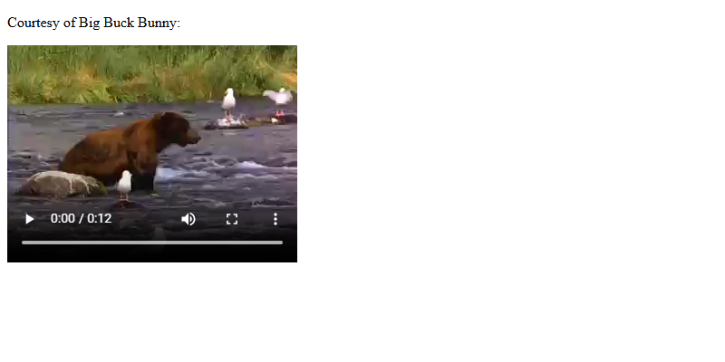

- [x] **Autoplay**
  - `autoplay` starts the video automatically.
  - **Chromium** usually blocks autoplay **with sound**. **Muted autoplay is allowed**: `autoplay muted`.
  - Sandbox: `autoplay.html`.

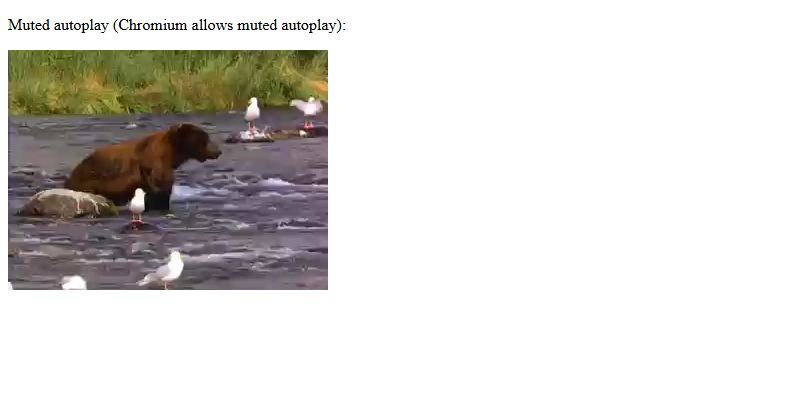

- [x] **Formats** — MP4 (`video/mp4`), WebM (`video/webm`), Ogg (`video/ogg`). Safari: MP4 and WebM yes, **Ogg no**. Other listed browsers: all three.
- [x] **DOM** — methods/properties/events to load, play, pause, set duration and volume.
  - Buttons: **Play/Pause**, **Big**, **Small**, **Normal**.
  - Sandbox: `js.html`.

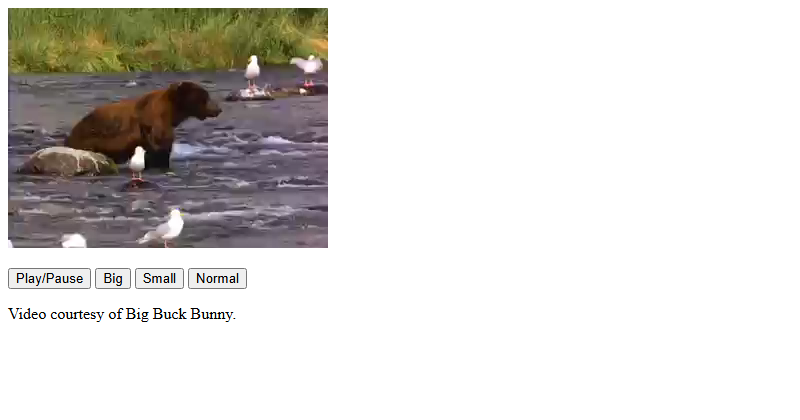

- [x] **Tags:** `<video>` video; `<source>` alternate files; `<track>` text tracks.

Controls (`index.html`):

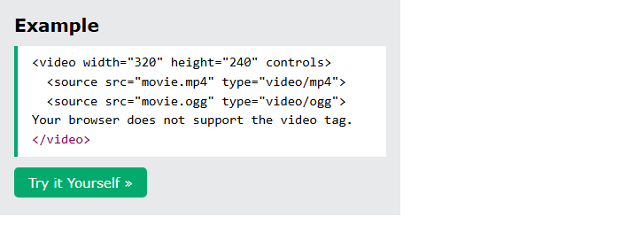

```html
<video width="320" height="240" controls>
  <source src="movie.mp4" type="video/mp4">
  <source src="movie.ogg" type="video/ogg">
Your browser does not support the video tag.
</video>
```


Muted autoplay (`autoplay.html`):

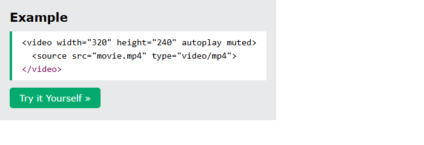

```html
<video width="320" height="240" autoplay muted>
  <source src="movie.mp4" type="video/mp4">
</video>
```


JavaScript (`js.html`):

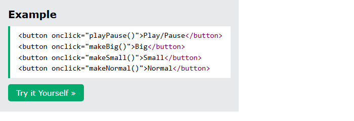

```html
<button onclick="playPause()">Play/Pause</button>
<button onclick="makeBig()">Big</button>
<button onclick="makeSmall()">Small</button>
<button onclick="makeNormal()">Normal</button>
```


<details>
  <summary>Terminal Commands</summary>

## Terminal Commands

```bash
# from Personal/Files/html/code_sandbox
python -m http.server 8766 --bind 127.0.0.1
```

Then open `http://127.0.0.1:8766/html-video/`.

</details>

<details>
  <summary>Questions and Answers</summary>

## Questions and Answers

### Question 1: What does `controls` add?

<details>
<summary>Answer</summary>

- [x] Play, pause, and volume (and the rest of the native control bar).

</details>

### Question 2: Why set width and height on `<video>`?

<details>
<summary>Answer</summary>

- [x] So the page does not **flicker** while the video loads.

</details>

### Question 3: How do `<source>` elements work?

<details>
<summary>Answer</summary>

- [x] They list **alternative files**.
- [x] The browser uses the **first format it recognizes**.

</details>

### Question 4: How do you autoplay in Chrome?

<details>
<summary>Answer</summary>

- [x] Use **`autoplay muted`**.
- [x] Chromium often **blocks** autoplay with sound.

</details>

### Question 5: Which video formats does HTML support?

<details>
<summary>Answer</summary>

- [x] **MP4**, **WebM**, **Ogg**.
- [x] Safari does **not** support Ogg in this table.

</details>

### Question 6: Which tags go with video?

<details>
<summary>Answer</summary>

- [x] `<video>`, `<source>`, `<track>`.

</details>

</details>

## Summary

Use `<video>` with `controls`, width/height, and `<source>` fallbacks. Autoplay in Chromium needs `muted`. Formats: MP4, WebM, Ogg. The DOM can play, pause, and resize.

## References

- [HTML Video (W3Schools)](https://www.w3schools.com/html/html5_video.asp)
- [HTML Audio/Video DOM](https://www.w3schools.com/tags/ref_av_dom.asp)
- [MDN: `<video>`](https://developer.mozilla.org/en-US/docs/Web/HTML/Element/video)
- [MDN: Autoplay guide](https://developer.mozilla.org/en-US/docs/Web/Media/Autoplay_guide)

</details>

<details>
  <summary>HTML Audio</summary>

## Introduction

The HTML **`<audio>`** element plays a sound file. This chapter covers **`controls`**, **`<source>`** fallbacks, **autoplay** (and **muted** autoplay in Chromium), formats (**MP3, WAV, OGG**), media types, and the Audio/Video **DOM**.

## Detailed Explanation

- [x] **Markup**
  - `controls` adds play, pause, and volume.
  - `<source>` lists alternatives; the browser uses the **first recognized** format.
  - Inner text shows only if `<audio>` is **unsupported**.
  - Sandbox: `code_sandbox/html-audio/index.html` (`horse.mp3`; the page also lists `horse.ogg`).


- [x] **Autoplay**
  - `autoplay` starts playback automatically.
  - Chromium usually **blocks** autoplay with sound. **Muted autoplay is allowed**: `controls autoplay muted`.
  - Sandbox: `autoplay.html`.


- [x] **Formats** — MP3 (`audio/mpeg`), WAV (`audio/wav`), OGG (`audio/ogg`). Safari: MP3 and WAV yes, **OGG no**. Edge/IE: WAV and OGG from **Edge 79**.
- [x] **DOM** — load, play, pause, duration, volume, play/pause events (same family as `<video>`).
- [x] **Tags:** `<audio>` sound; `<source>` alternate files.

Controls (`index.html`):


```html
<audio controls>
  <source src="horse.mp3" type="audio/mpeg">
  Your browser does not support the audio element.
</audio>
```


Muted autoplay (`autoplay.html`):


```html
<audio controls autoplay muted>
  <source src="horse.mp3" type="audio/mpeg">
</audio>
```


<details>
  <summary>Terminal Commands</summary>

## Terminal Commands

```bash
# from Personal/Files/html/code_sandbox
python -m http.server 8766 --bind 127.0.0.1
```

Then open `http://127.0.0.1:8766/html-audio/`.

</details>

<details>
  <summary>Questions and Answers</summary>

## Questions and Answers

### Question 1: What does `controls` add on `<audio>`?

<details>
<summary>Answer</summary>

- [x] Play, pause, and volume.

</details>

### Question 2: Which audio formats does HTML support?

<details>
<summary>Answer</summary>

- [x] **MP3**, **WAV**, and **OGG**.
- [x] Safari: **no OGG** in this table.

</details>

### Question 3: What is the media type for MP3?

<details>
<summary>Answer</summary>

- [x] **`audio/mpeg`**.

</details>

### Question 4: How do you autoplay in Chromium?

<details>
<summary>Answer</summary>

- [x] Use **`autoplay muted`**.
- [x] Autoplay **with sound** is usually blocked.

</details>

### Question 5: What tags are listed for audio?

<details>
<summary>Answer</summary>

- [x] `<audio>` and `<source>`.

</details>

</details>

## Summary

`<audio controls>` plus `<source>` fallbacks plays MP3/WAV/OGG. Autoplay in Chromium needs `muted`. Safari skips OGG. The Audio/Video DOM can play, pause, and report events.

## References

- [HTML Audio (W3Schools)](https://www.w3schools.com/html/html5_audio.asp)
- [HTML Audio/Video DOM](https://www.w3schools.com/tags/ref_av_dom.asp)
- [MDN: `<audio>`](https://developer.mozilla.org/en-US/docs/Web/HTML/Element/audio)

</details>

<details>
  <summary>HTML Plug-ins</summary>

## Introduction

**Plug-ins** extend the browser (Java applets, ActiveX, Flash, maps, virus scanners, bank IDs). **Most browsers no longer support** applets, plug-ins, ActiveX, or Shockwave Flash. This chapter still shows **`<object>`** and **`<embed>`** for including HTML or images.

## Detailed Explanation

- [x] **Warning**
  - Java Applets and plug-ins: **mostly gone**.
  - **ActiveX**: no longer supported in any browsers.
  - **Shockwave Flash**: turned off in modern browsers.
- [x] **`<object>`**
  - Supported by all browsers. Defines an **embedded object**.
  - Designed for plug-ins (applets, PDF, Flash) but can include **HTML in HTML** or an **image**.
  - Examples: `data="snippet.html"` (page used height **500px**; sandbox uses **200px** so the snap fits) and `data="audi.jpeg"`.
  - Sandbox: `code_sandbox/html-plug-ins/index.html`.

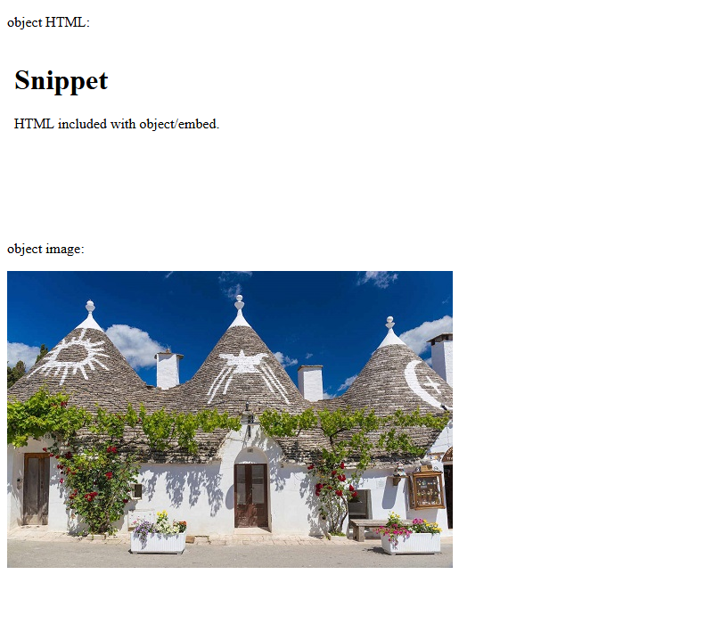

- [x] **`<embed>`**
  - Supported in all major browsers. Was used for years but only became part of the spec in **HTML5**.
  - **No closing tag**; **cannot** contain alternative text.
  - Examples: `src="audi.jpeg"` and `src="snippet.html"`.
  - Sandbox: `embed.html`.

Object (`index.html`):

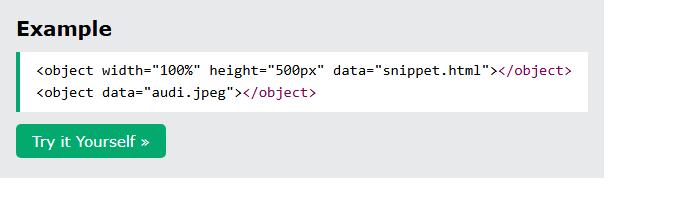

```html
<object width="100%" height="500px" data="snippet.html"></object>
<object data="audi.jpeg"></object>
```


Embed (`embed.html`):

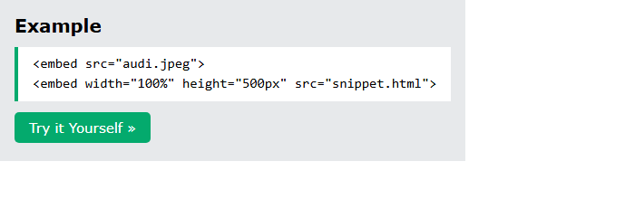

```html
<embed src="audi.jpeg">
<embed width="100%" height="500px" src="snippet.html">
```

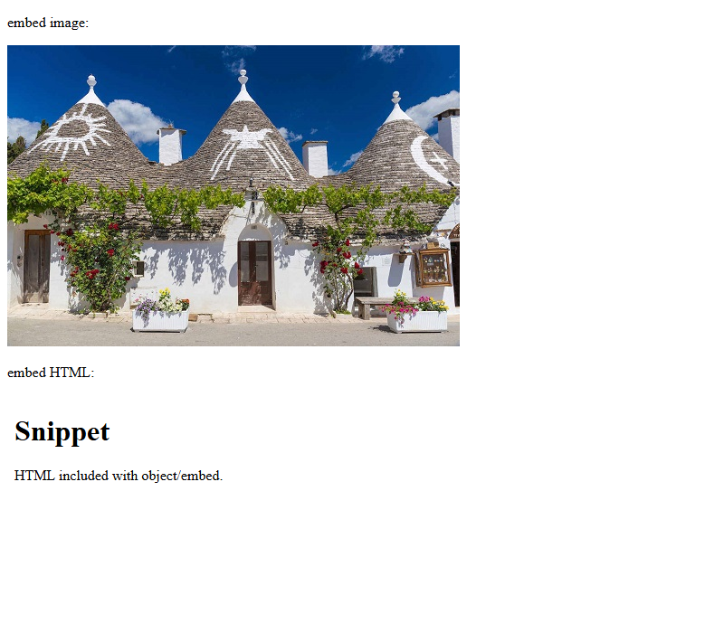

<details>
  <summary>Terminal Commands</summary>

## Terminal Commands

```bash
# from Personal/Files/html/code_sandbox
python -m http.server 8766 --bind 127.0.0.1
```

Then open `http://127.0.0.1:8766/html-plug-ins/`.

</details>

<details>
  <summary>Questions and Answers</summary>

## Questions and Answers

### Question 1: What were plug-ins for?

<details>
<summary>Answer</summary>

- [x] Extra programs: Java applets, ActiveX, Flash, maps, virus scans, bank IDs.

</details>

### Question 2: Do modern browsers still run Flash and ActiveX?

<details>
<summary>Answer</summary>

- [x] **No.** ActiveX is gone; Flash is turned off; applets/plug-ins are largely unsupported.

</details>

### Question 3: What can `<object>` embed today in this chapter?

<details>
<summary>Answer</summary>

- [x] HTML in HTML (`data="snippet.html"`).
- [x] An image (`data="audi.jpeg"`).

</details>

### Question 4: How does `<embed>` differ from `<object>`?

<details>
<summary>Answer</summary>

- [x] `<embed>` has **no closing tag**.
- [x] It **cannot** hold alternative text.
- [x] It joined the HTML spec in **HTML5**.

</details>

</details>

## Summary

Plug-ins (Java, ActiveX, Flash) are obsolete. Use `<object>` or `<embed>` to include HTML or images. `<embed>` is empty (no end tag, no fallback text).

## References

- [HTML Plug-ins (W3Schools)](https://www.w3schools.com/html/html_object.asp)
- [MDN: `<object>`](https://developer.mozilla.org/en-US/docs/Web/HTML/Element/object)
- [MDN: `<embed>`](https://developer.mozilla.org/en-US/docs/Web/HTML/Element/embed)

</details>

<details>
  <summary>HTML YouTube</summary>

## Introduction

The easiest way to play video in HTML is **YouTube**. Skip local format conversion: upload the clip, copy the **video id**, and embed an **`<iframe>`**. This chapter covers the embed URL, **autoplay+mute**, **loop**, and **controls=0**.

## Detailed Explanation

- [x] **Why YouTube?** Converting files is slow. Let YouTube play the video on your page.
- [x] **Video id** — YouTube shows an id such as **`tgbNymZ7vqY`** when you save or play a video. Use that id in HTML.
- [x] **Embed steps:** upload → note the id → `<iframe>` → `src` = video URL → `width` / `height` → extra query params.
  - `src="https://www.youtube.com/embed/tgbNymZ7vqY"`
  - Sandbox: `code_sandbox/html-youtube/index.html`.

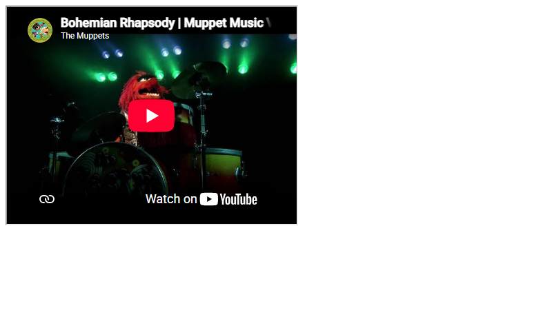

- [x] **Autoplay + mute**
  - `autoplay=1` starts on visit — **annoying** for visitors.
  - Chromium blocks most autoplay; **muted autoplay is allowed**: `autoplay=1&mute=1`.
- [x] **Playlist / loop**
  - Playlist: comma-separated extra ids.
  - Loop forever: `playlist=videoID` **and** `loop=1`. `loop=0` (default) plays once.
- [x] **Controls**
  - `controls=0` hides the player controls. Default `controls=1` shows them.
  - Sandbox: `params.html`.

Embed (`index.html`):

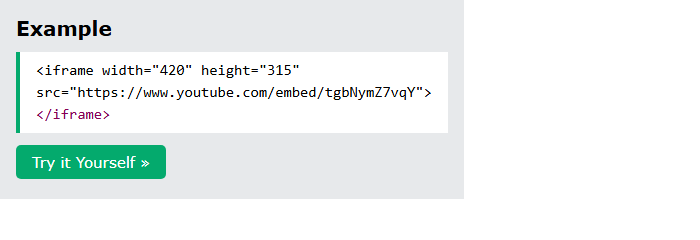

```html
<iframe width="420" height="315"
src="https://www.youtube.com/embed/tgbNymZ7vqY">
</iframe>
```


URL parameters (`params.html`):

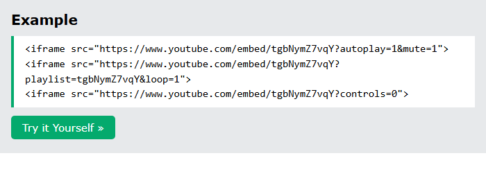

```html
<iframe src="https://www.youtube.com/embed/tgbNymZ7vqY?autoplay=1&mute=1">
<iframe src="https://www.youtube.com/embed/tgbNymZ7vqY?playlist=tgbNymZ7vqY&loop=1">
<iframe src="https://www.youtube.com/embed/tgbNymZ7vqY?controls=0">
```

<details>
  <summary>Terminal Commands</summary>

## Terminal Commands

```bash
# from Personal/Files/html/code_sandbox
python -m http.server 8766 --bind 127.0.0.1
```

Then open `http://127.0.0.1:8766/html-youtube/`.

</details>

<details>
  <summary>Questions and Answers</summary>

## Questions and Answers

### Question 1: Why embed YouTube instead of hosting the file?

<details>
<summary>Answer</summary>

- [x] Converting formats is **difficult and time-consuming**.
- [x] YouTube plays the video for you.

</details>

### Question 2: What is a YouTube video id?

<details>
<summary>Answer</summary>

- [x] A string such as **`tgbNymZ7vqY`**.
- [x] You use it in the embed URL.

</details>

### Question 3: Which element embeds the player?

<details>
<summary>Answer</summary>

- [x] **`<iframe>`** with `src="https://www.youtube.com/embed/ID"`.

</details>

### Question 4: How do you muted-autoplay a YouTube embed?

<details>
<summary>Answer</summary>

- [x] Add **`autoplay=1&mute=1`**.
- [x] Autoplay with sound is often **blocked** and is annoying.

</details>

### Question 5: How do you loop a YouTube video?

<details>
<summary>Answer</summary>

- [x] `loop=1` **and** `playlist=` the same video id.

</details>

### Question 6: How do you hide player controls?

<details>
<summary>Answer</summary>

- [x] **`controls=0`**. Default is `controls=1`.

</details>

</details>

## Summary

Upload to YouTube, copy the id, embed `youtube.com/embed/ID` in an iframe. Optional query params: muted autoplay, playlist+loop, controls=0.

## References

- [HTML YouTube Videos (W3Schools)](https://www.w3schools.com/html/html_youtube.asp)
- [YouTube IFrame Player API](https://developers.google.com/youtube/iframe_api_reference)
- [MDN: `<iframe>`](https://developer.mozilla.org/en-US/docs/Web/HTML/Element/iframe)

</details>

<details>
  <summary>HTML Web APIs</summary>

## Introduction

A **Web API** is an **Application Programming Interface for the Web**: functions that let you use browser features or data with simpler syntax. This chapter lists the main **HTML5 APIs**, how to use them safely, and **third-party** APIs. There is **no Try it Yourself** demo on this page.

## Detailed Explanation

- [x] **Why APIs?** They can extend the browser, simplify complex work, and hide messy code behind easy syntax.
- [x] **API** = interface of functions/subroutines to reach features or data of an app, OS, or service.
- [x] **HTML5 APIs** (built into browsers)
  1. **Geolocation** — latitude and longitude (user’s current location).
  2. **Drag and Drop** — drag-and-drop in the browser.
  3. **Web Storage** — key/value storage (clearer than cookies).
  4. **Web Workers** — JavaScript in the **background** without freezing the page (user can still click and select).
  5. **Server-Sent Events** — the page **automatically** gets updates from a server.
  6. **Canvas** — draw graphics with JavaScript.
- [x] **When you implement an API**
  - **Check browser capability** — always test support; provide a fallback script or message.
  - **Robust error handling** — APIs can fail; keep the UX intact.
  - **Request user permission** — for sensitive data (Geolocation), **ask consent** first.
- [x] **Third-party APIs** are **not** built into the browser. Download their code from the web. Examples: **YouTube** (videos), **Twitter** (tweets), **Facebook** (profile info).

No tested sandbox files. The chapter has **no code example**.

```text
# No code snippets in this topic.
```

<details>
  <summary>Terminal Commands</summary>

## Terminal Commands

No server was started for this section (no sandbox page to open).

```bash
# none
```

</details>

<details>
  <summary>Questions and Answers</summary>

## Questions and Answers

### Question 1: What does API stand for?

<details>
<summary>Answer</summary>

- [x] **Application Programming Interface**.
- [x] A set of functions to access features or data.

</details>

### Question 2: Name the six HTML5 APIs listed here.

<details>
<summary>Answer</summary>

- [x] Geolocation, Drag and Drop, Web Storage, Web Workers, Server-Sent Events, Canvas.

</details>

### Question 3: What is a Web Worker for?

<details>
<summary>Answer</summary>

- [x] Run JavaScript in the **background**.
- [x] The page stays usable (click, select) while it runs.

</details>

### Question 4: What three practices should you always follow?

<details>
<summary>Answer</summary>

- [x] Check **browser support** (and fallback).
- [x] Add **error handling**.
- [x] **Ask permission** before sensitive data (Geolocation).

</details>

### Question 5: Are YouTube/Twitter/Facebook APIs built into the browser?

<details>
<summary>Answer</summary>

- [x] **No.** They are **third-party**; you download their code.

</details>

</details>

## Summary

Web APIs wrap browser features. HTML5 highlights Geolocation, Drag and Drop, Web Storage, Workers, SSE, and Canvas. Check support, handle errors, and ask permission. Third-party APIs are downloaded, not built-in.

## References

- [HTML - What is a Web API? (W3Schools)](https://www.w3schools.com/html/html5_api_whatis.asp)
- [MDN: Web APIs](https://developer.mozilla.org/en-US/docs/Web/API)

</details>

<details>
  <summary>HTML Geolocation</summary>

## Introduction

The **Geolocation API** reads the user’s **current location**. Because that is private, the browser **asks permission**. This chapter covers `navigator.geolocation`, **`getCurrentPosition()`**, **error codes**, returned **coords**, and **`watchPosition()` / `clearWatch()`**. It works on **secure contexts** (HTTPS or localhost).

## Detailed Explanation

- [x] **Privacy** — location is unavailable until the user **approves**.
- [x] **Secure context** — HTTPS (localhost/`127.0.0.1` also counts). Most accurate on **GPS** devices.
- [x] **`navigator.geolocation.getCurrentPosition(success, error)`**
  - If unsupported: “Geolocation is not supported by this browser.”
  - Success: **Latitude** and **Longitude** from `position.coords`.
  - Sandbox: `code_sandbox/html-geolocation/index.html` (button **Try It**). Headless snaps will not grant permission.

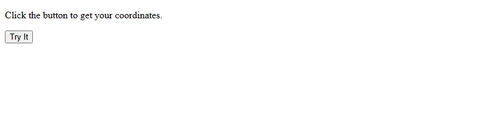

- [x] **Error `code`:** `PERMISSION_DENIED`, `POSITION_UNAVAILABLE`, `TIMEOUT`, `UNKNOWN_ERROR`.
- [x] **Uses:** local info, nearby points of interest, turn-by-turn GPS.
- [x] **Always returned:** `coords.latitude`, `coords.longitude`, `coords.accuracy`. Optional: altitude, altitudeAccuracy, heading, speed, timestamp.
- [x] **`watchPosition()`** — keeps updating as the user moves (needs a GPS device). **`clearWatch()`** stops it.

`index.html`:

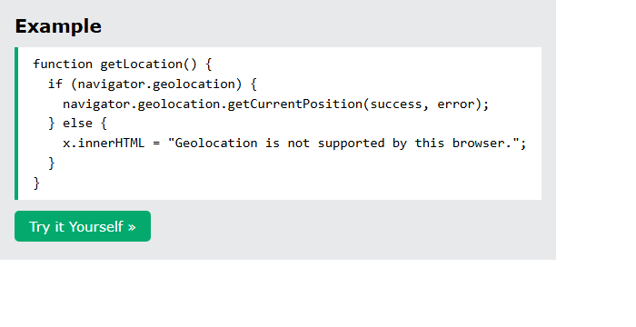

```javascript
function getLocation() {
  if (navigator.geolocation) {
    navigator.geolocation.getCurrentPosition(success, error);
  } else {
    x.innerHTML = "Geolocation is not supported by this browser.";
  }
}
```


<details>
  <summary>Terminal Commands</summary>

## Terminal Commands

```bash
# from Personal/Files/html/code_sandbox
python -m http.server 8766 --bind 127.0.0.1
```

Then open `http://127.0.0.1:8766/html-geolocation/`.

</details>

<details>
  <summary>Questions and Answers</summary>

## Questions and Answers

### Question 1: Why does the browser ask before sharing location?

<details>
<summary>Answer</summary>

- [x] Location can **compromise privacy**.
- [x] Data is available only if the user **approves**.

</details>

### Question 2: Does Geolocation work on plain `http://` sites?

<details>
<summary>Answer</summary>

- [x] **No** on the public web — it needs a **secure context** (HTTPS).
- [x] **localhost** / `127.0.0.1` is treated as secure.

</details>

### Question 3: Which method returns the current position once?

<details>
<summary>Answer</summary>

- [x] **`getCurrentPosition(success, error)`**.

</details>

### Question 4: Which coords are always returned?

<details>
<summary>Answer</summary>

- [x] **latitude**, **longitude**, and **accuracy**.

</details>

### Question 5: `watchPosition` vs `getCurrentPosition`?

<details>
<summary>Answer</summary>

- [x] `watchPosition` **keeps updating** as the user moves.
- [x] Stop it with **`clearWatch()`**.

</details>

</details>

## Summary

Ask permission, then `getCurrentPosition` (or `watchPosition`) on a secure context. Always get lat/long/accuracy. Handle denied, unavailable, timeout, and unknown errors.

## References

- [HTML Geolocation API (W3Schools)](https://www.w3schools.com/html/html5_geolocation.asp)
- [MDN: Geolocation API](https://developer.mozilla.org/en-US/docs/Web/API/Geolocation_API)
- [MDN: `getCurrentPosition()`](https://developer.mozilla.org/en-US/docs/Web/API/Geolocation/getCurrentPosition)

</details>

<details>
  <summary>HTML Drag and Drop</summary>

## Introduction

The **HTML Drag and Drop API** lets you **grab** an element and drop it somewhere else. This chapter sets **`draggable="true"`**, sends an id with **`dataTransfer.setData`**, allows a drop with **`preventDefault` on dragover**, and **appends** the node on **drop**.

## Detailed Explanation

- [x] **Make it draggable:** `draggable="true"` on an image, paragraph, heading, or link.
- [x] **`ondragstart` / `setData`**
  - `ev.dataTransfer.setData("text", ev.target.id)` — type `"text"`, value the element **id** (`img1`).
- [x] **`ondragover`**
  - Drops are **blocked by default**. Call **`preventDefault()`** so the target can accept the drop.
- [x] **`ondrop`**
  - `preventDefault()` so the browser does not treat the drop as opening a link.
  - `getData("text")` returns the id; **`appendChild`** moves that element into the drop target.
  - Sandbox: `code_sandbox/html-drag-and-drop/index.html`.

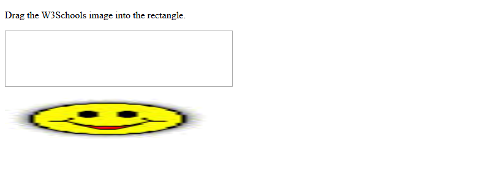

- [x] **More examples on the page:** drag an `<h1>`, drag an `<a>`, drag an image **back and forth** between two divs.

`index.html`:

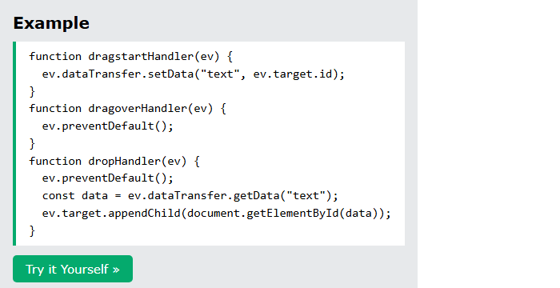

```javascript
function dragstartHandler(ev) {
  ev.dataTransfer.setData("text", ev.target.id);
}
function dragoverHandler(ev) {
  ev.preventDefault();
}
function dropHandler(ev) {
  ev.preventDefault();
  const data = ev.dataTransfer.getData("text");
  ev.target.appendChild(document.getElementById(data));
}
```


<details>
  <summary>Terminal Commands</summary>

## Terminal Commands

```bash
# from Personal/Files/html/code_sandbox
python -m http.server 8766 --bind 127.0.0.1
```

Then open `http://127.0.0.1:8766/html-drag-and-drop/`.

</details>

<details>
  <summary>Questions and Answers</summary>

## Questions and Answers

### Question 1: How do you make an element draggable?

<details>
<summary>Answer</summary>

- [x] Set **`draggable="true"`**.

</details>

### Question 2: What does `setData` store in the example?

<details>
<summary>Answer</summary>

- [x] Type **`"text"`**.
- [x] Value = the dragged element’s **`id`**.

</details>

### Question 3: Why call `preventDefault` on dragover?

<details>
<summary>Answer</summary>

- [x] Browsers **forbid drops** by default.
- [x] `preventDefault` **allows** the drop.

</details>

### Question 4: What happens in `dropHandler`?

<details>
<summary>Answer</summary>

- [x] Prevent default (don’t open as a link).
- [x] `getData("text")` then **`appendChild`** into the target.

</details>

</details>

## Summary

Mark the source `draggable`, put its id in `dataTransfer` on dragstart, `preventDefault` on dragover, and append the node on drop.

## References

- [HTML Drag and Drop API (W3Schools)](https://www.w3schools.com/html/html5_draganddrop.asp)
- [MDN: HTML Drag and Drop API](https://developer.mozilla.org/en-US/docs/Web/API/HTML_Drag_and_Drop_API)

</details>

<details>
  <summary>HTML Web Storage</summary>

## Introduction

**Web Storage** keeps key/value data in the browser. It is **more secure** than cookies, **at least 5MB**, and is **never sent to the server**. This chapter covers **`localStorage`** (no expiry) and **`sessionStorage`** (one tab session).

## Detailed Explanation

- [x] **Per origin** (domain + protocol). All pages of that origin share the same store.
- [x] **`window.localStorage`** — data **survives** closing the tab.
- [x] **`window.sessionStorage`** — data is **deleted** when that tab closes.
- [x] **Feature detect:** `typeof(Storage) !== "undefined"`.
- [x] **setItem / getItem**
  - `localStorage.setItem("lastname", "Smith")` and `bgcolor` yellow.
  - Values are always **strings** — convert when you need a number.
  - Remove: `localStorage.removeItem("lastname")`.
  - Sandbox: `code_sandbox/html-web-storage/names.html`.


- [x] **Click counter (`localStorage.clickcount`)**
  - Convert with `Number(...)` then add 1.
  - Sandbox: `index.html`.


- [x] **sessionStorage counter** — same idea; count is “in this session”.
  - Sandbox: `session.html`.

Click counter (`index.html`):


```javascript
if (localStorage.clickcount) {
  localStorage.clickcount = Number(localStorage.clickcount) + 1;
} else {
  localStorage.clickcount = 1;
}
```


setItem (`names.html`):


```javascript
localStorage.setItem("lastname", "Smith");
localStorage.setItem("bgcolor", "yellow");
x.innerHTML = localStorage.getItem("lastname");
```


sessionStorage (`session.html`):


```javascript
sessionStorage.clickcount = Number(sessionStorage.clickcount)+1;
```


<details>
  <summary>Terminal Commands</summary>

## Terminal Commands

```bash
# from Personal/Files/html/code_sandbox
python -m http.server 8766 --bind 127.0.0.1
```

Then open `http://127.0.0.1:8766/html-web-storage/`.

</details>

<details>
  <summary>Questions and Answers</summary>

## Questions and Answers

### Question 1: How is web storage better than cookies here?

<details>
<summary>Answer</summary>

- [x] **Larger** (at least **5MB**).
- [x] **Never transferred** to the server with every request.

</details>

### Question 2: localStorage vs sessionStorage?

<details>
<summary>Answer</summary>

- [x] localStorage: **no expiry** (survives tab close).
- [x] sessionStorage: **one tab session**.

</details>

### Question 3: How do you store and read a pair?

<details>
<summary>Answer</summary>

- [x] `setItem(name, value)` and `getItem(name)`.
- [x] Values are **strings**.

</details>

### Question 4: How do you delete one item?

<details>
<summary>Answer</summary>

- [x] `localStorage.removeItem("lastname")`.

</details>

</details>

## Summary

Web storage is per-origin key/value data. localStorage lasts; sessionStorage dies with the tab. Detect `Storage`, use setItem/getItem, and convert strings to numbers when counting.

## References

- [HTML Web Storage API (W3Schools)](https://www.w3schools.com/html/html5_webstorage.asp)
- [MDN: Web Storage API](https://developer.mozilla.org/en-US/docs/Web/API/Web_Storage_API)
- [MDN: `Window.localStorage`](https://developer.mozilla.org/en-US/docs/Web/API/Window/localStorage)

</details>

<details>
  <summary>HTML Web Workers</summary>

## Introduction

A **web worker** is an **external JavaScript file** that runs in the **background** so a heavy script does not freeze the page. This chapter builds `demo_workers.js` (a counter via **`postMessage`**), starts it with **`new Worker`**, listens with **`onmessage`**, and stops it with **`terminate()`**.

## Detailed Explanation

- [x] Scripts on the main page block UI until they finish. A worker runs **independently** — you can still click and select.
- [x] Use workers for **CPU-heavy** work, not for a simple counter (the demo is simplified).
- [x] **Detect:** `typeof(Worker) !== "undefined"`.
- [x] **Worker file** `demo_workers.js`:
  - Increment `i`, `postMessage(i)`, `setTimeout` every 500 ms.
  - The page shows `setTimeout("timedCount()",500)` (string). The sandbox uses `setTimeout(timedCount, 500)` — same timing, current JS style.
- [x] **Main page**
  - Create once: `if (typeof(w) == "undefined") { w = new Worker("demo_workers.js"); }`
  - Both sides talk with **`postMessage`** / **`onmessage`**. Data is `event.data`.
  - **Stop:** `w.terminate()`. **Reuse:** `w = undefined` then start again.
  - Sandbox: `code_sandbox/html-web-workers/index.html`.


- [x] **Workers cannot use** `window`, `document`, or `parent`.

`index.html`:


```javascript
w = new Worker("demo_workers.js");
w.onmessage = function(event) {
  document.getElementById("result").innerHTML = event.data;
};
```


`demo_workers.js`:

```javascript
var i = 0;
function timedCount() {
  i = i + 1;
  postMessage(i);
  setTimeout(timedCount, 500);
}
timedCount();
```

<details>
  <summary>Terminal Commands</summary>

## Terminal Commands

```bash
# from Personal/Files/html/code_sandbox
python -m http.server 8766 --bind 127.0.0.1
```

Then open `http://127.0.0.1:8766/html-web-workers/`.

</details>

<details>
  <summary>Questions and Answers</summary>

## Questions and Answers

### Question 1: What problem do web workers solve?

<details>
<summary>Answer</summary>

- [x] Long scripts on the main thread make the page **unresponsive**.
- [x] A worker runs in the **background**.

</details>

### Question 2: How does the worker send data to the page?

<details>
<summary>Answer</summary>

- [x] **`postMessage(value)`**.
- [x] The page reads **`event.data`** in **`onmessage`**.

</details>

### Question 3: How do you stop and reuse a worker?

<details>
<summary>Answer</summary>

- [x] `terminate()` stops it.
- [x] Set the variable to **`undefined`** to create it again.

</details>

### Question 4: Can a worker touch the DOM?

<details>
<summary>Answer</summary>

- [x] **No.** No `window`, `document`, or `parent`.

</details>

</details>

## Summary

Put heavy work in an external `.js` worker. `new Worker`, `postMessage`/`onmessage`, `terminate`. Workers have no DOM. The demo counter is for learning, not a typical worker job.

## References

- [HTML Web Workers API (W3Schools)](https://www.w3schools.com/html/html5_webworkers.asp)
- [MDN: Using Web Workers](https://developer.mozilla.org/en-US/docs/Web/API/Web_Workers_API/Using_web_workers)
- [MDN: `Worker`](https://developer.mozilla.org/en-US/docs/Web/API/Worker)

</details>

<details>
  <summary>HTML SSE</summary>

## Introduction

**Server-Sent Events (SSE)** let the **server push** updates to the page over HTTP. The page does not poll. This chapter uses **`EventSource`**, `onmessage`, and a server that sends `text/event-stream` lines starting with **`data:`**. Examples: feeds, stocks, scores.

## Detailed Explanation

- [x] **One-way messaging** — server → page. Facebook/Twitter-style updates, news, sports.
- [x] **Browser:** `new EventSource("demo_sse.php")` then `source.onmessage`.
  - Check: `typeof(EventSource) !== "undefined"`.
  - Each message appends `event.data` into `#result`.
- [x] **Server**
  - Header **`Content-Type: text/event-stream`**, no cache.
  - Each event: `data: The server time is: …` then a **blank line**.
  - The page shows **PHP** and **ASP**. This sandbox has **no PHP**, so `sse_server.py` on **port 8767** sends the same `data:` stream and the page uses `EventSource("/sse")`.
  - Sandbox: `code_sandbox/html-sse/index.html`.


- [x] **EventSource events:** `onopen` (connected), `onmessage` (data), `onerror` (error).

Page (`index.html`):


```javascript
var source = new EventSource("demo_sse.php");
source.onmessage = function(event) {
  document.getElementById("result").innerHTML += event.data + "<br>";
};
```


PHP from the chapter (`demo_sse.php`):

```php
<?php
header('Content-Type: text/event-stream');
header('Cache-Control: no-cache');
$time = date('r');
echo "data: The server time is: {$time}\n\n";
flush();
?>
```

Python stand-in used in the sandbox (`sse_server.py`): streams `data: The server time is: …` every second on `GET /sse`.

<details>
  <summary>Terminal Commands</summary>

## Terminal Commands

```bash
# from Personal/Files/html/code_sandbox/html-sse
python sse_server.py
```

Then open `http://127.0.0.1:8767/`.

</details>

<details>
  <summary>Questions and Answers</summary>

## Questions and Answers

### Question 1: How is SSE different from a normal page request?

<details>
<summary>Answer</summary>

- [x] The page does **not** keep asking.
- [x] The **server pushes** updates over HTTP.

</details>

### Question 2: Which JS object receives events?

<details>
<summary>Answer</summary>

- [x] **`EventSource`**.
- [x] Handle **`onmessage`** and read **`event.data`**.

</details>

### Question 3: What Content-Type must the server send?

<details>
<summary>Answer</summary>

- [x] **`text/event-stream`**.
- [x] Each message starts with **`data:`** and ends with a blank line.

</details>

### Question 4: Which EventSource events are listed?

<details>
<summary>Answer</summary>

- [x] **`onopen`**, **`onmessage`**, **`onerror`**.

</details>

### Question 5: Why doesn’t `http.server 8766` run this demo?

<details>
<summary>Answer</summary>

- [x] It only serves **static files**.
- [x] SSE needs a process that keeps the connection and writes **event-stream** data (PHP on the page; `sse_server.py` here).

</details>

</details>

## Summary

SSE is one-way server push. Use `EventSource` and `onmessage`. The server sets `text/event-stream` and writes `data: …` lines. The tutorial uses PHP/ASP; this sandbox uses a small Python streamer on port 8767.

## References

- [HTML Server-Sent Events API (W3Schools)](https://www.w3schools.com/html/html5_serversentevents.asp)
- [MDN: Using server-sent events](https://developer.mozilla.org/en-US/docs/Web/API/Server-sent_events/Using_server-sent_events)
- [MDN: `EventSource`](https://developer.mozilla.org/en-US/docs/Web/API/EventSource)
- [WHATWG: Server-sent events](https://html.spec.whatwg.org/multipage/server-sent-events.html)

</details>
