# HTML Tutorial

Section-by-section notes. Each accordion is one tutorial page: explained, coded in `code_sandbox`, run in the browser, and snapped.

<details>
  <summary>HTML Introduction</summary>

## Introduction

HTML is the **standard markup language** for creating Web pages. This section defines what HTML is, walks through a **simple HTML document**, explains **elements** (including empty ones like `<br>`), shows how **browsers** use tags without displaying them, outlines **page structure** (`<html>`, `<head>`, `<body>`), and sketches **HTML history** up to HTML5. This tutorial follows the **latest HTML5 standard**.

## Detailed Explanation

- [x] **What is HTML?**
  - **H**yper **T**ext **M**arkup **L**anguage.
  - The **standard markup language** for creating Web pages.
  - Describes the **structure** of a Web page.
  - Consists of a **series of elements**.
  - Elements tell the **browser how to display** the content.
  - Elements **label** pieces of content: heading, paragraph, link, and so on.
- [x] **A simple HTML document**
  - The page example is a full HTML5 file: doctype, `html`, `head`/`title`, and `body` with one heading and one paragraph.
  - Sandbox file: `code_sandbox/html-introduction/index.html`.
  - Running it in the browser shows **My First Heading** and **My first paragraph.** The tab title is **Page Title**.

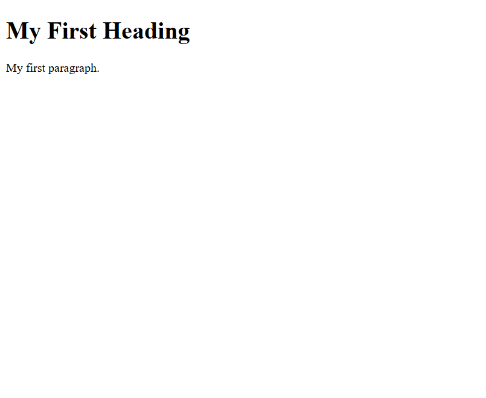

- [x] **Example explained**
  - `<!DOCTYPE html>` declares an **HTML5** document.
  - `<html>` is the **root** element of the page.
  - `<head>` holds **meta information** about the page.
  - `<title>` sets the title in the **browser tab / title bar**.
  - `<body>` is the container for **all visible content** (headings, paragraphs, images, links, tables, lists, and so on).
  - `<h1>` defines a **large heading**.
  - `<p>` defines a **paragraph**.
- [x] **What is an HTML element?**
  - An element is a **start tag**, **content**, and an **end tag**: `<tagname> Content goes here... </tagname>`.
  - The element is **everything** from the start tag through the end tag.
  - Examples: `<h1>My First Heading</h1>` and `<p>My first paragraph.</p>`.
- [x] **Start tag, content, end tag**

| Start tag | Element content     | End tag |
| --------- | ------------------- | ------- |
| `<h1>`    | My First Heading    | `</h1>` |
| `<p>`     | My first paragraph. | `</p>`  |
| `<br>`    | none                | none    |

- [x] **Empty elements**
  - Some elements have **no content** (for example `<br>`).
  - These are **empty elements**.
  - Empty elements **do not have an end tag**.
- [x] **Web browsers**
  - Chrome, Edge, Firefox, Safari **read HTML documents** and **display them correctly**.
  - A browser **does not show the tags**; it uses them to decide **how** to display the document.
- [x] **HTML page structure**
  - Typical nesting: `<html>` → `<head>` (`<title>`) and `<body>` (headings and paragraphs).
  - Content inside **`<body>`** is what you **see in the page**.
  - Content inside **`<title>`** is what you **see in the tab / title bar**.
- [x] **HTML history (high level)**
  - **1989:** Tim Berners-Lee invented **www**.
  - **1991:** Tim Berners-Lee invented **HTML**.
  - Later versions include HTML 2.0, 3.2, 4.01, XHTML 1.0, then **HTML5**.
  - **2012:** WHATWG **HTML5 Living Standard**.
  - **2014:** W3C Recommendation: **HTML5**.
  - This tutorial follows the **latest HTML5 standard**.

<details>
  <summary>Lab</summary>

## Lab

Recreate the W3Schools **HTML Introduction** example locally, serve it, and confirm the heading, paragraph, and tab title.

### **Overview**

- [ ] Build `code_sandbox/html-introduction/index.html` from the section example.
- [ ] You will:
  - [ ] Write the HTML5 doctype, `html`, `head`/`title`, and `body` with `<h1>` and `<p>`.
  - [ ] Serve `code_sandbox` over HTTP (Cursor browser blocks `file://`).
  - [ ] Open `http://127.0.0.1:8766/html-introduction/`.
  - [ ] Confirm the tab title is **Page Title**, the heading is **My First Heading**, and the paragraph is **My first paragraph.**
- [ ] Success: the running page matches the snapped result below.

### **Task 1: Create the sandbox file**

- [ ] Open `Personal/Files/html/code_sandbox/html-introduction/index.html`.
- [ ] Use this document (same as the W3Schools example):

```html
<!DOCTYPE html>
<html>
  <head>
    <title>Page Title</title>
  </head>
  <body>
    <h1>My First Heading</h1>
    <p>My first paragraph.</p>
  </body>
</html>
```

### **Task 2: Serve and open the page**

- [ ] From `Personal/Files/html/code_sandbox`, start a static server:

```bash
python -m http.server 8766 --bind 127.0.0.1
```

- [ ] In the browser, open `http://127.0.0.1:8766/html-introduction/`.
- [ ] Check:
  - [ ] Tab / title: **Page Title**
  - [ ] Large heading: **My First Heading**
  - [ ] Paragraph: **My first paragraph.**
  - [ ] You should **not** see the tags `<h1>` or `<p>` on the page.


The sandbox example is running and matches the Introduction document.

</details>

<details>
  <summary>Terminal Commands</summary>

## Terminal Commands

Serve the sandbox so the Cursor browser can load the example (it cannot open `file://`).

```bash
# from Personal/Files/html/code_sandbox
python -m http.server 8766 --bind 127.0.0.1
```

Then open `http://127.0.0.1:8766/html-introduction/`.

</details>

<details>
  <summary>Code</summary>

## Code

Sandbox: `code_sandbox/html-introduction/index.html`

Tested source (W3Schools **A Simple HTML Document**):

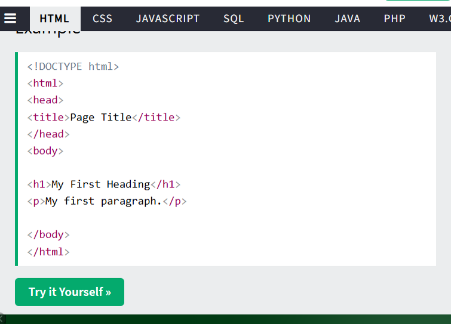

```html
<!DOCTYPE html>
<html>
  <head>
    <title>Page Title</title>
  </head>
  <body>
    <h1>My First Heading</h1>
    <p>My first paragraph.</p>
  </body>
</html>
```

Rendered result (browser uses the tags; it does not print them):


</details>

<details>
  <summary>Questions and Answers</summary>

## Questions and Answers

### Question 1: What does HTML stand for?

<details>
<summary>Answer</summary>

- [x] **Hyper Text Markup Language**.

</details>

### Question 2: What is HTML used for?

<details>
<summary>Answer</summary>

- [x] It is the **standard markup language** for creating **Web pages**.
- [x] It describes the **structure** of a page using **elements**.

</details>

### Question 3: What do HTML elements do?

<details>
<summary>Answer</summary>

- [x] They tell the **browser how to display** the content.
- [x] They **label** pieces of content (heading, paragraph, link, and so on).

</details>

### Question 4: What does `<!DOCTYPE html>` mean?

<details>
<summary>Answer</summary>

- [x] It declares that the document is an **HTML5** document.

</details>

### Question 5: What is the `<html>` element?

<details>
<summary>Answer</summary>

- [x] It is the **root** element of an HTML page.

</details>

### Question 6: What belongs in `<head>` vs `<body>`?

<details>
<summary>Answer</summary>

- [x] `<head>` contains **meta information** about the page.
- [x] `<body>` contains **all visible contents** (headings, paragraphs, images, links, tables, lists, and so on).

</details>

### Question 7: What does the `<title>` element control?

<details>
<summary>Answer</summary>

- [x] The title shown in the **browser title bar** or the **page tab**.
- [x] In this example it is **Page Title**.

</details>

### Question 8: What do `<h1>` and `<p>` define in the example?

<details>
<summary>Answer</summary>

- [x] `<h1>` defines a **large heading** (**My First Heading**).
- [x] `<p>` defines a **paragraph** (**My first paragraph.**).

</details>

### Question 9: How is an HTML element defined?

<details>
<summary>Answer</summary>

- [x] A **start tag**, some **content**, and an **end tag**.
- [x] Pattern: `<tagname> Content goes here... </tagname>`.
- [x] The element is **everything** from the start tag to the end tag.

</details>

### Question 10: What is an empty HTML element?

<details>
<summary>Answer</summary>

- [x] An element with **no content**, such as `<br>`.
- [x] Empty elements **do not have an end tag**.

</details>

### Question 11: What is the purpose of a web browser?

<details>
<summary>Answer</summary>

- [x] To **read HTML documents** and **display them correctly**.
- [x] Examples: Chrome, Edge, Firefox, Safari.

</details>

### Question 12: Does the browser show HTML tags on the page?

<details>
<summary>Answer</summary>

- [x] **No.** It does **not** display the tags.
- [x] It **uses** the tags to decide **how** to display the document.

</details>

### Question 13: What appears in the page vs in the tab?

<details>
<summary>Answer</summary>

- [x] **`<body>`** content is displayed **in the browser page**.
- [x] **`<title>`** content is shown in the **title bar / tab**.

</details>

### Question 14: Who invented the www and HTML, and in which years?

<details>
<summary>Answer</summary>

- [x] **Tim Berners-Lee** invented **www** in **1989**.
- [x] **Tim Berners-Lee** invented **HTML** in **1991**.

</details>

### Question 15: Which HTML standard does this tutorial follow?

<details>
<summary>Answer</summary>

- [x] The **latest HTML5** standard.
- [x] HTML5 became a W3C Recommendation in **2014**.
- [x] WHATWG maintains an **HTML5 Living Standard** (from **2012**).

</details>

### Question 16: In the element table, why does `<br>` show “none” for content and end tag?

<details>
<summary>Answer</summary>

- [x] `<br>` is an **empty element**.
- [x] It has **no content** and **no end tag**.

</details>

</details>

## Summary

HTML is **Hyper Text Markup Language**: elements describe page **structure** and tell the browser **how to display** content. A minimal HTML5 page uses `<!DOCTYPE html>`, a root `<html>`, `<head>` with `<title>` (tab text), and `<body>` for what you **see**. An element is start tag + content + end tag, except **empty** elements like `<br>`, which have **no end tag**. Browsers **hide tags** and render the result. This tutorial uses **HTML5**.

## References

- [HTML Introduction (W3Schools)](https://www.w3schools.com/html/html_intro.asp)
- [Try it Yourself: tryhtml_intro](https://www.w3schools.com/html/tryit.asp?filename=tryhtml_intro)
- [WHATWG HTML Living Standard](https://whatwg.org/html/)
- [W3C HTML5 Recommendation](https://www.w3.org/TR/html5/)
- [W3C HTML5.1 2nd Edition](https://www.w3.org/TR/html51/)
- [W3C HTML5.2 Recommendation](https://www.w3.org/TR/html52/)

</details>

<details>
  <summary>HTML Editors</summary>

## Introduction

You do not need a professional IDE to learn HTML. A **simple text editor**—**Notepad** on Windows or **TextEdit** on Mac—is enough to write a page, save it as **`.htm` / `.html`** with **UTF-8** encoding, and open it in a browser. This section walks through that workflow and also points to W3Schools’ **online editor** (“Try it Yourself”) for fast tests.

## Detailed Explanation

- [x] **A simple text editor is enough**
  - Web pages _can_ be built with professional HTML editors.
  - For **learning**, the tutorial recommends **Notepad** (PC) or **TextEdit** (Mac).
  - Writing tags by hand in a plain editor is a good way to learn HTML.
- [x] **Step 1 (PC): Open Notepad**
  - **Windows 8 or later:** open the **Start** screen (Windows logo, bottom left) and type **Notepad**.
  - **Windows 7 or earlier:** **Start** → **Programs** → **Accessories** → **Notepad**.
- [x] **Step 1 (Mac): Open TextEdit and set it to plain HTML**
  - **Finder** → **Applications** → **TextEdit**.
  - **Preferences** → **Format** → choose **Plain Text** so files save correctly.
  - Under **Open and Save**, check **Display HTML files as HTML code instead of formatted text**.
  - Then open a **new document** for the code.
- [x] **Step 2: Write some HTML**
  - Copy this document into the editor (sandbox: `code_sandbox/html-editors/index.html`).

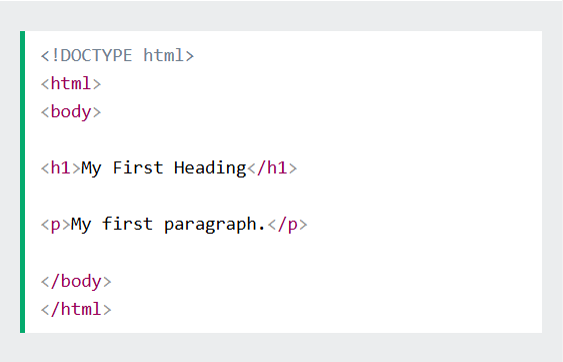

- [x] **Step 3: Save the HTML page**
  - **File** → **Save as**.
  - Name it **`index.htm`** (or **`index.html`**—the extensions are equivalent).
  - Set encoding to **UTF-8** (preferred for HTML files).
- [x] **Step 4: View it in a browser**
  - Double-click the file, or right-click → **Open with** your browser.
  - The browser shows **My First Heading** and **My first paragraph.** (it does not print the tags).


- [x] **W3Schools online editor (“Try it Yourself”)**
  - Edit HTML and see the result in the browser.
  - Useful for **fast tests**; it has **color coding** and can **save / share** code.
  - That example uses a `<title>` (**Page Title**), heading **This is a Heading**, and paragraph **This is a paragraph.** Sandbox: `code_sandbox/html-editors/tryit.html`.


<details>
  <summary>Lab</summary>

## Lab

Write the Notepad example locally, serve it (Cursor blocks `file://`), and confirm the heading and paragraph. Optionally open the Try it Yourself copy.

### **Overview**

- [ ] Recreate both section examples in `code_sandbox/html-editors/` and open them in the browser.
- [ ] You will:
  - [ ] Save the Notepad document as `index.html`.
  - [ ] Save the online-editor document as `tryit.html`.
  - [ ] Serve `code_sandbox` over HTTP.
  - [ ] Confirm **My First Heading** / **My first paragraph.** on `index.html`.
  - [ ] Confirm tab **Page Title**, **This is a Heading**, and **This is a paragraph.** on `tryit.html`.
- [ ] Success: both pages match the snapped results.

### **Task 1: Create the Notepad example**

- [ ] Open `Personal/Files/html/code_sandbox/html-editors/index.html`.
- [ ] Use this document (same as the W3Schools Notepad step):

```html
<!DOCTYPE html>
<html>
  <body>
    <h1>My First Heading</h1>

    <p>My first paragraph.</p>
  </body>
</html>
```

### **Task 2: Create the Try it Yourself example**

- [ ] Open `Personal/Files/html/code_sandbox/html-editors/tryit.html`.
- [ ] Use this document:

```html
<!DOCTYPE html>
<html>
  <head>
    <title>Page Title</title>
  </head>
  <body>
    <h1>This is a Heading</h1>
    <p>This is a paragraph.</p>
  </body>
</html>
```

### **Task 3: Serve and open the pages**

- [ ] From `Personal/Files/html/code_sandbox`, start a static server:

```bash
python -m http.server 8766 --bind 127.0.0.1
```

- [ ] Open `http://127.0.0.1:8766/html-editors/`.
- [ ] Check: **My First Heading** and **My first paragraph.**


- [ ] Open `http://127.0.0.1:8766/html-editors/tryit.html`.
- [ ] Check: tab **Page Title**, heading **This is a Heading**, paragraph **This is a paragraph.**


Both editor examples are running and match the section.

</details>

<details>
  <summary>Terminal Commands</summary>

## Terminal Commands

Serve the sandbox so the Cursor browser can load the examples (it cannot open `file://`).

```bash
# from Personal/Files/html/code_sandbox
python -m http.server 8766 --bind 127.0.0.1
```

Then open `http://127.0.0.1:8766/html-editors/` and `http://127.0.0.1:8766/html-editors/tryit.html`.

</details>

<details>
  <summary>Code</summary>

## Code

Sandbox: `code_sandbox/html-editors/index.html` (Notepad / save-as `index.htm` example)


```html
<!DOCTYPE html>
<html>
  <body>
    <h1>My First Heading</h1>

    <p>My first paragraph.</p>
  </body>
</html>
```


Sandbox: `code_sandbox/html-editors/tryit.html` (online editor example)

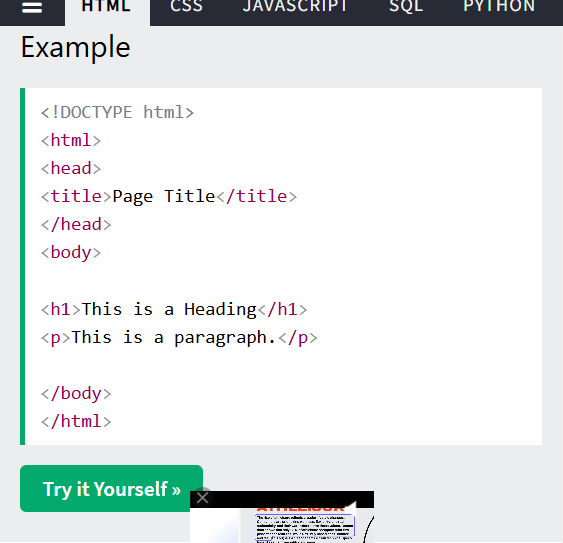

```html
<!DOCTYPE html>
<html>
  <head>
    <title>Page Title</title>
  </head>
  <body>
    <h1>This is a Heading</h1>
    <p>This is a paragraph.</p>
  </body>
</html>
```


</details>

<details>
  <summary>Questions and Answers</summary>

## Questions and Answers

### Question 1: Do you need a professional HTML editor to learn HTML?

<details>
<summary>Answer</summary>

- [x] **No.** A **simple text editor** is enough.
- [x] The tutorial recommends **Notepad** (PC) or **TextEdit** (Mac).

</details>

### Question 2: How do you open Notepad on Windows 8 or later?

<details>
<summary>Answer</summary>

- [x] Open the **Start** screen (Windows logo, bottom left).
- [x] Type **Notepad**.

</details>

### Question 3: What TextEdit settings are required on Mac?

<details>
<summary>Answer</summary>

- [x] **Preferences** → **Format** → **Plain Text**.
- [x] Under **Open and Save**, check **Display HTML files as HTML code instead of formatted text**.

</details>

### Question 4: What filename and encoding should you use when saving?

<details>
<summary>Answer</summary>

- [x] Name the file **`index.htm`** (or **`index.html`**).
- [x] Set encoding to **UTF-8**.

</details>

### Question 5: Is there a difference between `.htm` and `.html`?

<details>
<summary>Answer</summary>

- [x] **No.** Either extension works.
- [x] The choice is up to you.

</details>

### Question 6: How do you view the saved HTML page?

<details>
<summary>Answer</summary>

- [x] Open the file in a **browser**.
- [x] Double-click it, or right-click and choose **Open with**.

</details>

### Question 7: What does the Notepad example display in the browser?

<details>
<summary>Answer</summary>

- [x] A heading: **My First Heading**.
- [x] A paragraph: **My first paragraph.**

</details>

### Question 8: What is the W3Schools “Try it Yourself” editor for?

<details>
<summary>Answer</summary>

- [x] Edit HTML and **view the result** in the browser.
- [x] It is useful for **testing code fast**.
- [x] It has **color coding** and can **save and share** code.

</details>

### Question 9: What extra markup does the Try it Yourself example add compared with the Notepad snippet?

<details>
<summary>Answer</summary>

- [x] A `<head>` with `<title>Page Title</title>`.
- [x] Different body text: **This is a Heading** and **This is a paragraph.**

</details>

### Question 10: Why is UTF-8 mentioned when saving?

<details>
<summary>Answer</summary>

- [x] **UTF-8** is the **preferred encoding** for HTML files.

</details>

</details>

## Summary

Learn HTML in a **plain text editor** (Notepad or TextEdit). Write a basic document, save it as **`index.htm` / `.html`** with **UTF-8**, and open it in a browser. **`.htm` and `.html` are the same.** On Mac, TextEdit must use **Plain Text** and must show HTML as **code**. The **Try it Yourself** online editor is for quick tests with color coding. The Notepad sample renders **My First Heading**; the online sample adds a **Page Title** tab and **This is a Heading**.

## References

- [HTML Editors (W3Schools)](https://www.w3schools.com/html/html_editors.asp)
- [Try it Yourself: tryhtml_editors](https://www.w3schools.com/html/tryit.asp?filename=tryhtml_editors)

</details>

<details>
  <summary>HTML Basic</summary>

## Introduction

This chapter shows **basic HTML examples**: a full document, the `<!DOCTYPE html>` declaration, **headings**, **paragraphs**, **links**, and **images**. The tags may be new; the point is to see the pattern. You can also **view page source** and **inspect** elements in the browser.

## Detailed Explanation

- [x] **HTML documents**
  - Every document starts with a document type declaration: `<!DOCTYPE html>`.
  - The document itself starts with `<html>` and ends with `</html>`.
  - Visible content sits between `<body>` and `</body>`.
  - Sandbox: `code_sandbox/html-basic/index.html`.


- [x] **The `<!DOCTYPE>` declaration**
  - Represents the **document type** and helps browsers **display pages correctly**.
  - Must appear **once**, at the **top** of the page (before any HTML tags).
  - It is **not case sensitive**.
  - HTML5 doctype is: `<!DOCTYPE html>`.
- [x] **HTML headings**
  - Defined with `<h1>` through `<h6>`.
  - `<h1>` is the **most important**; `<h6>` is the **least important**.
  - Sandbox: `code_sandbox/html-basic/headings.html`.


- [x] **HTML paragraphs**
  - Defined with the `<p>` tag.
  - Sandbox: `code_sandbox/html-basic/paragraphs.html`.


- [x] **HTML links**
  - Defined with the `<a>` tag.
  - The destination is the **`href` attribute**.
  - Attributes add extra information about an element (covered in a later chapter).
  - Sandbox: `code_sandbox/html-basic/link.html`.


- [x] **HTML images**
  - Defined with the `` tag.
  - Attributes: **`src`** (file), **`alt`** (alternative text), **`width`**, **`height`**.
  - Sandbox: `code_sandbox/html-basic/img.html` (local `w3schools.jpg`, 104×142).


- [x] **How to view HTML source**
  - **View Page Source:** `Ctrl`+`U`, or right-click the page → **View Page Source**. Opens a tab with the HTML source.
  - **Inspect an element:** right-click an element (or a blank area) → **Inspect**. Shows HTML and CSS; you can edit them on the fly in the Elements / Styles panel.

<details>
  <summary>Lab</summary>

## Lab

Run each Basic example from `code_sandbox/html-basic/` and match the snaps.

### **Overview**

- [ ] Recreate the document, headings, paragraphs, link, and image examples.
- [ ] You will:
  - [ ] Serve `code_sandbox` over HTTP.
  - [ ] Open each sandbox file and confirm the output.
- [ ] Success: the five pages match the snapped results.

### **Task 1: Serve the sandbox**

- [ ] From `Personal/Files/html/code_sandbox`:

```bash
python -m http.server 8766 --bind 127.0.0.1
```

### **Task 2: Open each example**

- [ ] Document: `http://127.0.0.1:8766/html-basic/` — **My First Heading** / **My first paragraph.**
- [ ] Headings: `http://127.0.0.1:8766/html-basic/headings.html` — heading 1, 2, and 3.
- [ ] Paragraphs: `http://127.0.0.1:8766/html-basic/paragraphs.html` — two paragraphs.
- [ ] Link: `http://127.0.0.1:8766/html-basic/link.html` — blue underlined **This is a link**.
- [ ] Image: `http://127.0.0.1:8766/html-basic/img.html` — W3Schools logo at 104×142 with alt **W3Schools.com**.


The Basic examples are running and match the chapter.

</details>

<details>
  <summary>Terminal Commands</summary>

## Terminal Commands

```bash
# from Personal/Files/html/code_sandbox
python -m http.server 8766 --bind 127.0.0.1
```

Then open `http://127.0.0.1:8766/html-basic/` and the other files in that folder.

</details>

<details>
  <summary>Code</summary>

## Code

Sandbox: `code_sandbox/html-basic/index.html`


```html
<!DOCTYPE html>
<html>
  <body>
    <h1>My First Heading</h1>
    <p>My first paragraph.</p>
  </body>
</html>
```


Headings (`headings.html`):


```html
<h1>This is heading 1</h1>
<h2>This is heading 2</h2>
<h3>This is heading 3</h3>
```


Paragraphs (`paragraphs.html`):


```html
<p>This is a paragraph.</p>
<p>This is another paragraph.</p>
```


Link (`link.html`):


```html
<a href="https://www.w3schools.com">This is a link</a>
```


Image (`img.html`):


```html

```


</details>

<details>
  <summary>Questions and Answers</summary>

## Questions and Answers

### Question 1: What must every HTML document start with?

<details>
<summary>Answer</summary>

- [x] A document type declaration: `<!DOCTYPE html>`.

</details>

### Question 2: Where does visible content go?

<details>
<summary>Answer</summary>

- [x] Between `<body>` and `</body>`.

</details>

### Question 3: How many times may `<!DOCTYPE>` appear, and where?

<details>
<summary>Answer</summary>

- [x] **Once**.
- [x] At the **top** of the page, **before any HTML tags**.

</details>

### Question 4: Is `<!DOCTYPE>` case sensitive?

<details>
<summary>Answer</summary>

- [x] **No.**

</details>

### Question 5: Which tags define headings, and which is most important?

<details>
<summary>Answer</summary>

- [x] `<h1>` through `<h6>`.
- [x] `<h1>` is the **most important**; `<h6>` is the **least important**.

</details>

### Question 6: Which tag defines a paragraph?

<details>
<summary>Answer</summary>

- [x] `<p>`.

</details>

### Question 7: How do you write a link, and where is the URL?

<details>
<summary>Answer</summary>

- [x] Use the `<a>` tag.
- [x] Put the destination in the **`href` attribute**.

</details>

### Question 8: Which attributes does the image example use?

<details>
<summary>Answer</summary>

- [x] **`src`** — the image file.
- [x] **`alt`** — alternative text.
- [x] **`width`** and **`height`**.

</details>

### Question 9: How do you view a page’s HTML source?

<details>
<summary>Answer</summary>

- [x] Press **`Ctrl`+`U`**, or right-click → **View Page Source**.
- [x] That opens a tab with the HTML source.

</details>

### Question 10: What does Inspect show you?

<details>
<summary>Answer</summary>

- [x] Right-click an element → **Inspect**.
- [x] You see the **HTML and CSS**.
- [x] You can edit them **on the fly** in Elements / Styles.

</details>

</details>

## Summary

A page starts with `<!DOCTYPE html>`, then `<html>` / `<body>`. Headings are `<h1>`–`<h6>`, paragraphs `<p>`, links `<a href="...">`, images ``. The doctype appears **once at the top** and is **not case sensitive**. Use **View Source** (`Ctrl`+`U`) or **Inspect** to study a page.

## References

- [HTML Basic (W3Schools)](https://www.w3schools.com/html/html_basic.asp)
- [Try it Yourself: tryhtml_basic_document](https://www.w3schools.com/html/tryit.asp?filename=tryhtml_basic_document)
- [Try it Yourself: tryhtml_basic_headings](https://www.w3schools.com/html/tryit.asp?filename=tryhtml_basic_headings)
- [Try it Yourself: tryhtml_basic_paragraphs](https://www.w3schools.com/html/tryit.asp?filename=tryhtml_basic_paragraphs)
- [Try it Yourself: tryhtml_basic_link](https://www.w3schools.com/html/tryit.asp?filename=tryhtml_basic_link)
- [Try it Yourself: tryhtml_basic_img](https://www.w3schools.com/html/tryit.asp?filename=tryhtml_basic_img)
- [MDN: DOCTYPE](https://developer.mozilla.org/en-US/docs/Glossary/Doctype)
- [MDN: `<a>`](https://developer.mozilla.org/en-US/docs/Web/HTML/Element/a)
- [MDN: ``](https://developer.mozilla.org/en-US/docs/Web/HTML/Element/img)

</details>

<details>
  <summary>HTML Elements</summary>

## Introduction

An HTML **element** is a **start tag**, **content**, and an **end tag**. Elements can be **nested**. Some elements are **empty** (no content, no end tag), such as `<br>`. Tags are **not case sensitive**, but this tutorial (and W3C) prefers **lowercase**.

## Detailed Explanation

- [x] **What is an HTML element?**
  - Start tag + content + end tag: `<tagname> Content goes here... </tagname>`.
  - The element is **everything** from the start tag through the end tag.

| Start tag | Element content     | End tag |
| --------- | ------------------- | ------- |
| `<h1>`    | My First Heading    | `</h1>` |
| `<p>`     | My first paragraph. | `</p>`  |
| `<br>`    | none                | none    |

- [x] **Empty elements**
  - No content (example: `<br>`).
  - **No end tag**.
- [x] **Nested HTML elements**
  - Elements can contain other elements.
  - A whole document is nested: `<html>` → `<body>` → `<h1>` and `<p>`.
  - `<html>` is the **root** (whole document). `<body>` is the **visible body**. `<h1>` is a heading. `<p>` is a paragraph.
  - Sandbox: `code_sandbox/html-elements/index.html`.


- [x] **Never skip the end tag**
  - Some elements still **display** if you omit `</p>`.
  - **Do not rely on that.** Missing end tags can cause unexpected results and errors.
  - WHATWG HTML does allow **optional end tags** for a few elements (including `<p>` in some contexts). The tutorial’s advice still stands for learning: **write the end tag**.
  - Sandbox: `code_sandbox/html-elements/no-endtag.html` (two paragraphs, no `</p>` — the browser still shows two blocks).

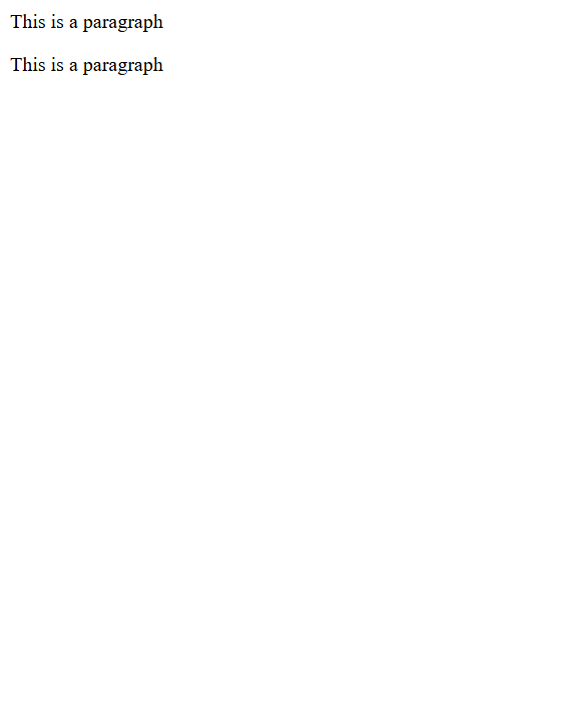

- [x] **Empty HTML elements (`<br>`)**
  - `<br>` is a **line break** with no closing tag.
  - Sandbox: `code_sandbox/html-elements/br.html`.

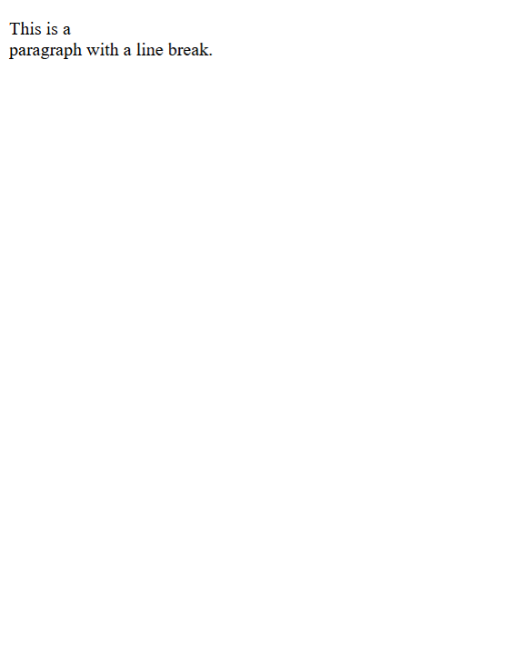

- [x] **HTML is not case sensitive**
  - `<P>` means the same as `<p>`.
  - The HTML standard does not require lowercase, but **W3C recommends lowercase**, and **XHTML requires it**.
  - W3Schools always uses **lowercase** tag names.

<details>
  <summary>Lab</summary>

## Lab

Run the nested document, the omitted-end-tag demo, and the `<br>` demo.

### **Overview**

- [ ] Recreate the three sandbox files and open them over HTTP.
- [ ] Success: nested page shows heading + paragraph; omitted `</p>` still shows two paragraphs; `<br>` splits one paragraph onto two lines.

### **Task 1: Serve and open**

- [ ] From `Personal/Files/html/code_sandbox`:

```bash
python -m http.server 8766 --bind 127.0.0.1
```

- [ ] Open `http://127.0.0.1:8766/html-elements/`.
- [ ] Open `http://127.0.0.1:8766/html-elements/no-endtag.html`.
- [ ] Open `http://127.0.0.1:8766/html-elements/br.html`.


The three element examples match the chapter.

</details>

<details>
  <summary>Terminal Commands</summary>

## Terminal Commands

```bash
# from Personal/Files/html/code_sandbox
python -m http.server 8766 --bind 127.0.0.1
```

Then open `http://127.0.0.1:8766/html-elements/`.

</details>

<details>
  <summary>Code</summary>

## Code

Nested document: `code_sandbox/html-elements/index.html`

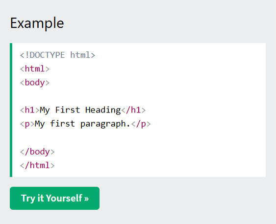

```html
<!DOCTYPE html>
<html>
  <body>
    <h1>My First Heading</h1>
    <p>My first paragraph.</p>
  </body>
</html>
```


Omitted end tags: `code_sandbox/html-elements/no-endtag.html`

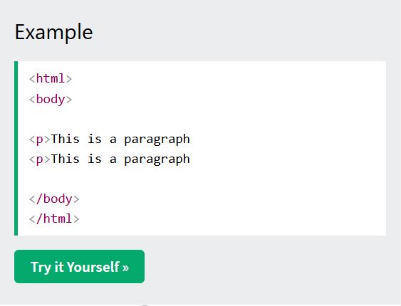

```html
<html>
  <body>
    <p>This is a paragraph</p>
    <p>This is a paragraph</p>
  </body>
</html>
```


Line break: `code_sandbox/html-elements/br.html`

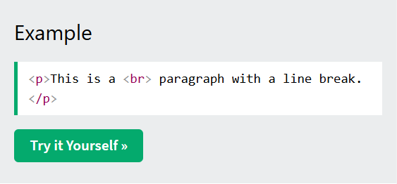

```html
<p>
  This is a <br />
  paragraph with a line break.
</p>
```


</details>

<details>
  <summary>Questions and Answers</summary>

## Questions and Answers

### Question 1: What is an HTML element?

<details>
<summary>Answer</summary>

- [x] A **start tag**, some **content**, and an **end tag**.
- [x] The element is everything from the start tag to the end tag.

</details>

### Question 2: What is a nested element?

<details>
<summary>Answer</summary>

- [x] An element **inside** another element.
- [x] A whole HTML document is nested (`<html>` contains `<body>`, which contains headings and paragraphs).

</details>

### Question 3: What is the root element?

<details>
<summary>Answer</summary>

- [x] `<html>` — it defines the **whole HTML document**.

</details>

### Question 4: Should you skip end tags if the page still looks OK?

<details>
<summary>Answer</summary>

- [x] **No.** Never rely on omitted end tags.
- [x] You can get **unexpected results and errors**.

</details>

### Question 5: What is an empty HTML element?

<details>
<summary>Answer</summary>

- [x] An element with **no content**.
- [x] Example: `<br>` (line break).
- [x] Empty elements **do not have an end tag**.

</details>

### Question 6: Are HTML tags case sensitive?

<details>
<summary>Answer</summary>

- [x] **No.** `<P>` means the same as `<p>`.
- [x] W3C **recommends lowercase**; XHTML **requires** it.
- [x] W3Schools always uses **lowercase**.

</details>

### Question 7: In the element table, why does `<br>` show “none”?

<details>
<summary>Answer</summary>

- [x] `<br>` is **empty**.
- [x] It has **no content** and **no end tag**.

</details>

### Question 8: What does the WHATWG spec say about omitted `</p>`?

<details>
<summary>Answer</summary>

- [x] Some end tags (including `<p>` in certain cases) are **optional** in the HTML living standard.
- [x] For learning, still **write the end tag**, as the tutorial warns.

</details>

</details>

## Summary

An element is **start tag + content + end tag**, except **empty** elements like `<br>`. Documents are **nested** (`<html>` / `<body>` / headings and paragraphs). Browsers may forgive a missing `</p>`, but **do not skip end tags**. Tags are **case-insensitive**; use **lowercase**.

## References

- [HTML Elements (W3Schools)](https://www.w3schools.com/html/html_elements.asp)
- [Try it Yourself: tryhtml_elements](https://www.w3schools.com/html/tryit.asp?filename=tryhtml_elements)
- [Try it Yourself: tryhtml_no_endtag](https://www.w3schools.com/html/tryit.asp?filename=tryhtml_no_endtag)
- [Try it Yourself: tryhtml_elements_br](https://www.w3schools.com/html/tryit.asp?filename=tryhtml_elements_br)
- [HTML Tag Reference (W3Schools)](https://www.w3schools.com/tags/default.asp)
- [WHATWG: optional tags](https://html.spec.whatwg.org/multipage/syntax.html#optional-tags)
- [MDN: HTML elements](https://developer.mozilla.org/en-US/docs/Web/HTML/Element)

</details>

<details>
  <summary>HTML Attributes</summary>

## Introduction

HTML **attributes** add extra information about an element. They go in the **start tag**, usually as `name="value"`. This chapter covers **`href`**, **`src`**, **`width`/`height`**, **`alt`**, **`style`**, **`lang`**, and **`title`**, plus quoting and lowercase conventions.

## Detailed Explanation

- [x] **Attribute rules**
  - All HTML elements can have attributes.
  - Attributes provide **additional information** about elements.
  - Always specified in the **start tag**.
  - Usually **name/value** pairs: `name="value"`.
- [x] **The `href` attribute**
  - `<a>` is a hyperlink. **`href`** is the URL it goes to.
  - Sandbox: `code_sandbox/html-attributes/href.html`.


- [x] **The `src` attribute**
  - `` embeds an image. **`src`** is the path.
  - **Absolute URL:** full address, e.g. `https://www.w3schools.com/images/img_girl.jpg`. External images can be copyrighted or disappear.
  - **Relative URL:** no domain. `img_girl.jpg` is relative to the **current page**; `/images/img_girl.jpg` is relative to the **domain**.
  - Prefer **relative** URLs so they do not break if the domain changes.
- [x] **`width` and `height`**
  - Size the image in **pixels**.
  - Example: `width="500"` `height="600"` with `src="img_girl.jpg"`.
  - Sandbox: `code_sandbox/html-attributes/img.html`.


- [x] **The `alt` attribute**
  - **Required** on ``. Alternate text if the image cannot be shown (slow connection, bad `src`, or a screen reader).
  - Broken `src` (`img_typo.jpg`) still shows **Girl with a jacket**.
  - Sandbox: `code_sandbox/html-attributes/alt-error.html`.

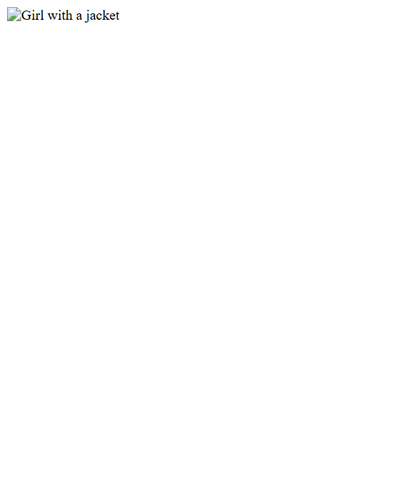

- [x] **The `style` attribute**
  - Adds styles (color, font, size, and more).
  - Example: red paragraph.
  - Sandbox: `code_sandbox/html-attributes/style.html`.

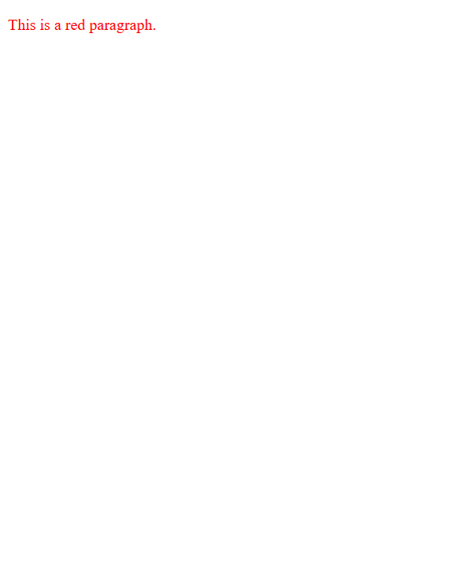

- [x] **The `lang` attribute**
  - Put **`lang`** on `<html>` to declare the page language (helps search engines and browsers).
  - English: `<html lang="en">`. Country: `<html lang="en-US">` (language + country).
- [x] **The `title` attribute**
  - Extra information about an element.
  - Shown as a **tooltip** on mouse over.
  - Sandbox: `code_sandbox/html-attributes/title.html` (`title="I'm a tooltip"`).


- [x] **Lowercase and quotes**
  - The HTML standard does not require lowercase names or quotes, but **W3C recommends** both; **XHTML requires** them.
  - W3Schools always uses **lowercase names** and **quoted values**.
  - Quotes are **required** when the value has a **space** (`title=Description of W3Schools` fails).
  - Double quotes are most common; use single quotes if the value itself contains double quotes (or the reverse).

<details>
  <summary>Lab</summary>

## Lab

Run the href, sized image, broken-image alt, style, and title sandboxes.

### **Overview**

- [ ] Serve `code_sandbox` and open each `html-attributes` example.
- [ ] Success: blue **Visit W3Schools** link; 500×600 photo; alt text **Girl with a jacket** on a missing file; red paragraph; tooltip paragraph.

### **Task 1: Serve and open**

- [ ] From `Personal/Files/html/code_sandbox`:

```bash
python -m http.server 8766 --bind 127.0.0.1
```

- [ ] `http://127.0.0.1:8766/html-attributes/href.html`
- [ ] `http://127.0.0.1:8766/html-attributes/img.html`
- [ ] `http://127.0.0.1:8766/html-attributes/alt-error.html`
- [ ] `http://127.0.0.1:8766/html-attributes/style.html`
- [ ] `http://127.0.0.1:8766/html-attributes/title.html` (hover for the tooltip)


The attribute examples match the chapter.

</details>

<details>
  <summary>Terminal Commands</summary>

## Terminal Commands

```bash
# from Personal/Files/html/code_sandbox
python -m http.server 8766 --bind 127.0.0.1
```

Then open `http://127.0.0.1:8766/html-attributes/href.html`.

</details>

<details>
  <summary>Code</summary>

## Code

`href` (`href.html`):

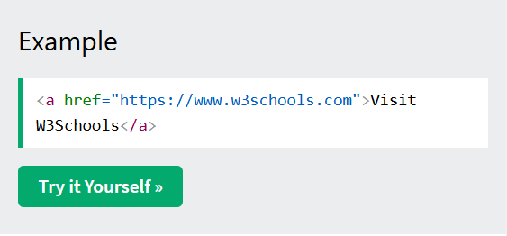

```html
<a href="https://www.w3schools.com">Visit W3Schools</a>
```


Image size (`img.html`):

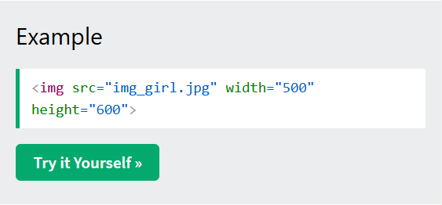

```html

```


Broken image + `alt` (`alt-error.html`):

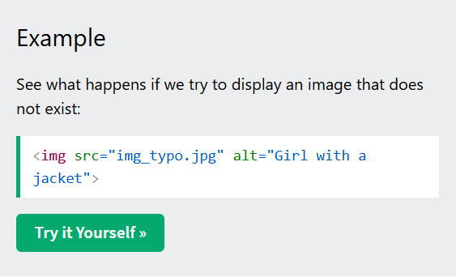

```html

```


`style` (`style.html`):

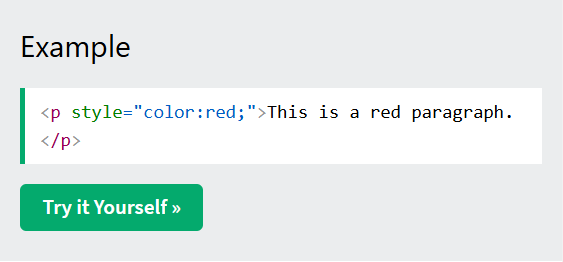

```html
<p style="color:red;">This is a red paragraph.</p>
```


`title` (`title.html`):

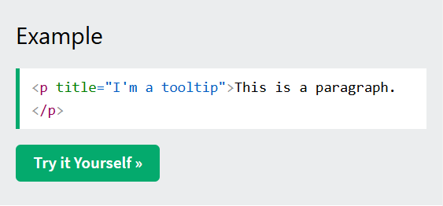

```html
<p title="I'm a tooltip">This is a paragraph.</p>
```


`lang` on the document (used on these sandbox files):

```html
<!DOCTYPE html>
<html lang="en">
  <body>
    ...
  </body>
</html>
```

</details>

<details>
  <summary>Questions and Answers</summary>

## Questions and Answers

### Question 1: Where do you put attributes, and in what form?

<details>
<summary>Answer</summary>

- [x] In the **start tag**.
- [x] Usually **name/value** pairs: `name="value"`.

</details>

### Question 2: What does `href` on `<a>` do?

<details>
<summary>Answer</summary>

- [x] It specifies the **URL** of the page the link goes to.

</details>

### Question 3: Absolute vs relative `src` — which is safer for your own images?

<details>
<summary>Answer</summary>

- [x] **Relative** URLs (no domain).
- [x] They do not break if you **change domain**.
- [x] Absolute URLs point at another site and can vanish or be copyrighted.

</details>

### Question 4: Why set `width` and `height` on ``?

<details>
<summary>Answer</summary>

- [x] They specify the image size in **pixels**.

</details>

### Question 5: Why is `alt` required?

<details>
<summary>Answer</summary>

- [x] It is the **alternate text** if the image cannot be displayed.
- [x] Used for slow connections, bad `src`, and **screen readers**.

</details>

### Question 6: What does `lang` on `<html>` do?

<details>
<summary>Answer</summary>

- [x] Declares the **language** of the page.
- [x] Helps **search engines** and **browsers**.
- [x] Example: `lang="en"` or `lang="en-US"`.

</details>

### Question 7: What does `title` show?

<details>
<summary>Answer</summary>

- [x] Extra information as a **tooltip** when you mouse over the element.

</details>

### Question 8: Must attribute names be lowercase and values quoted?

<details>
<summary>Answer</summary>

- [x] HTML does **not require** either.
- [x] **W3C recommends** lowercase and quotes; **XHTML requires** them.
- [x] Quotes are needed when the value contains a **space**.

</details>

### Question 9: When do you use single quotes around an attribute value?

<details>
<summary>Answer</summary>

- [x] When the value itself contains **double quotes**.
- [x] Or use double quotes if the value contains **single quotes**.

</details>

</details>

## Summary

Attributes live in the **start tag** as `name="value"`. **`href`** is the link URL, **`src`** the image path (prefer **relative**), **`width`/`height`** size in pixels, **`alt`** fallback text, **`style`** inline CSS, **`lang`** the page language, **`title`** a tooltip. Use **lowercase names** and **quoted values**.

## References

- [HTML Attributes (W3Schools)](https://www.w3schools.com/html/html_attributes.asp)
- [Try it Yourself: tryhtml_attributes_link](https://www.w3schools.com/html/tryit.asp?filename=tryhtml_attributes_link)
- [Try it Yourself: tryhtml_attributes_img](https://www.w3schools.com/html/tryit.asp?filename=tryhtml_attributes_img)
- [Try it Yourself: tryhtml_attributes_alt_error](https://www.w3schools.com/html/tryit.asp?filename=tryhtml_attributes_alt_error)
- [Try it Yourself: tryhtml_attributes_style](https://www.w3schools.com/html/tryit.asp?filename=tryhtml_attributes_style)
- [Try it Yourself: tryhtml_attributes_title](https://www.w3schools.com/html/tryit.asp?filename=tryhtml_attributes_title)
- [HTML Attribute Reference](https://www.w3schools.com/tags/ref_attributes.asp)
- [HTML Language Code Reference](https://www.w3schools.com/tags/ref_language_codes.asp)
- [MDN: HTML attribute reference](https://developer.mozilla.org/en-US/docs/Web/HTML/Reference/Attributes)

</details>

<details>
  <summary>HTML Headings</summary>

## Introduction

HTML **headings** are titles and subtitles on a page. They use `<h1>` through `<h6>`: **`<h1>` is most important**, **`<h6>` least**. Search engines and skimmers use them for **structure**. Use headings for **headings**, not just to make text big.

## Detailed Explanation

- [x] **`<h1>` to `<h6>`**
  - Headings are titles or subtitles you want on a webpage.
  - `<h1>` = most important; `<h6>` = least important.
  - Browsers add **margin** (white space) before and after a heading.
  - Sandbox: `code_sandbox/html-headings/index.html`.

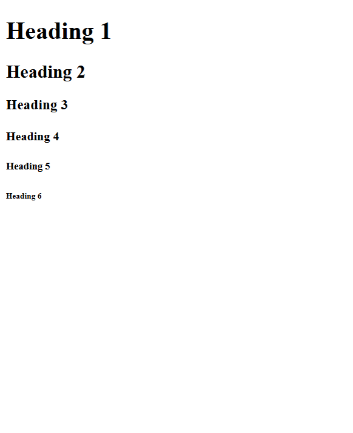

- [x] **Headings are important**
  - Search engines **index** structure and content from headings.
  - Users often **skim** by headings, so headings should show the **document structure**.
  - Use `<h1>` for the **main** heading, then `<h2>`, then less important `<h3>`, and so on.
  - Example outline: **Travel Guide** (`h1`) → **Europe** / **Asia** (`h2`) → countries (`h3`).
  - **Tip:** use **only one `<h1>` per page** — it is the main topic or title.
  - **Note:** use heading tags for headings only. **Do not** use them just to make text BIG or bold.
  - Sandbox: `code_sandbox/html-headings/structure.html`.

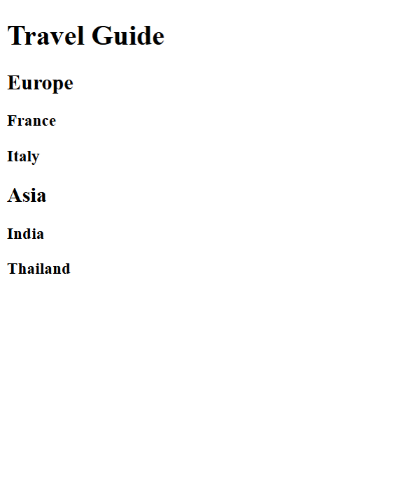

- [x] **Bigger headings**
  - Each heading has a **default size**.
  - You can change size with the **`style`** attribute and CSS **`font-size`**.
  - Example: `<h1 style="font-size:60px;">Heading 1</h1>`.
  - That still **is** a heading (for structure); the style only changes how large it looks.
  - Sandbox: `code_sandbox/html-headings/size.html`.

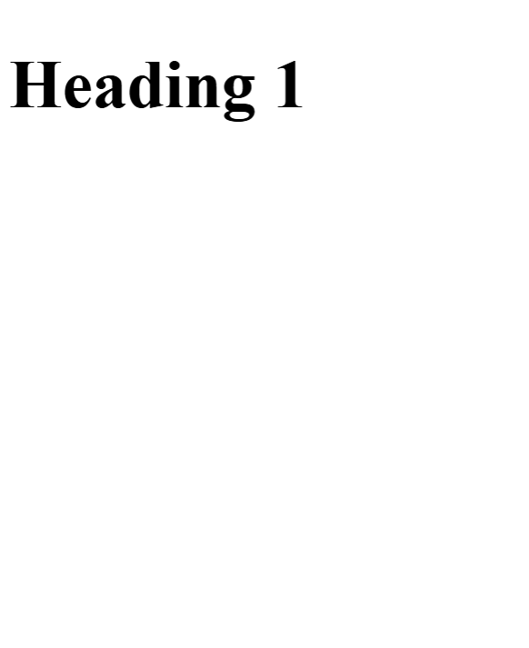

<details>
  <summary>Lab</summary>

## Lab

Run the six heading levels, the Travel Guide outline, and the 60px `<h1>`.

### **Overview**

- [ ] Serve `code_sandbox` and open the three `html-headings` files.
- [ ] Success: Heading 1–6 shrink in size; Travel Guide nests continents under one `h1`; the sized `h1` is visually larger than the default.

### **Task 1: Serve and open**

- [ ] From `Personal/Files/html/code_sandbox`:

```bash
python -m http.server 8766 --bind 127.0.0.1
```

- [ ] `http://127.0.0.1:8766/html-headings/`
- [ ] `http://127.0.0.1:8766/html-headings/structure.html`
- [ ] `http://127.0.0.1:8766/html-headings/size.html`


The heading examples match the chapter.

</details>

<details>
  <summary>Terminal Commands</summary>

## Terminal Commands

```bash
# from Personal/Files/html/code_sandbox
python -m http.server 8766 --bind 127.0.0.1
```

Then open `http://127.0.0.1:8766/html-headings/`.

</details>

<details>
  <summary>Code</summary>

## Code

Levels 1–6 (`index.html`):

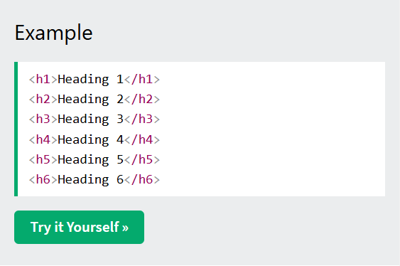

```html
<h1>Heading 1</h1>
<h2>Heading 2</h2>
<h3>Heading 3</h3>
<h4>Heading 4</h4>
<h5>Heading 5</h5>
<h6>Heading 6</h6>
```


Document structure (`structure.html`):

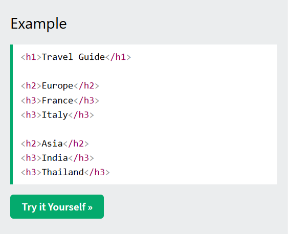

```html
<h1>Travel Guide</h1>

<h2>Europe</h2>
<h3>France</h3>
<h3>Italy</h3>

<h2>Asia</h2>
<h3>India</h3>
<h3>Thailand</h3>
```


Custom size (`size.html`):

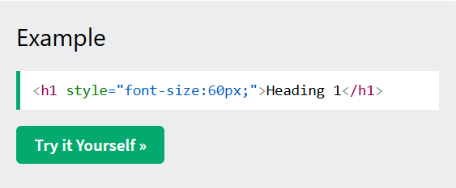

```html
<h1 style="font-size:60px;">Heading 1</h1>
```


</details>

<details>
  <summary>Questions and Answers</summary>

## Questions and Answers

### Question 1: Which tags define HTML headings?

<details>
<summary>Answer</summary>

- [x] `<h1>` through `<h6>`.
- [x] `<h1>` is the **most important**; `<h6>` is the **least important**.

</details>

### Question 2: Do browsers add space around headings?

<details>
<summary>Answer</summary>

- [x] **Yes.** They add **margin** (white space) before and after a heading.

</details>

### Question 3: Why do search engines care about headings?

<details>
<summary>Answer</summary>

- [x] They use headings to **index** the **structure and content** of the page.

</details>

### Question 4: How should you order heading levels?

<details>
<summary>Answer</summary>

- [x] `<h1>` for the **main** heading.
- [x] Then `<h2>`, then less important `<h3>`, and so on.

</details>

### Question 5: How many `<h1>` elements should a page have, according to this chapter?

<details>
<summary>Answer</summary>

- [x] **Only one** `<h1>` per page.
- [x] It represents the **main topic or title**.

</details>

### Question 6: Should you use heading tags just to make text look big?

<details>
<summary>Answer</summary>

- [x] **No.** Use headings for **headings only**.
- [x] Do not use them just to make text **BIG** or **bold**.

</details>

### Question 7: How do you change a heading’s visual size without changing its level?

<details>
<summary>Answer</summary>

- [x] Use the **`style`** attribute with CSS **`font-size`**.
- [x] Example: `<h1 style="font-size:60px;">Heading 1</h1>`.

</details>

### Question 8: In the Travel Guide example, what is `<h1>` vs `<h2>` vs `<h3>`?

<details>
<summary>Answer</summary>

- [x] `<h1>`: **Travel Guide** (page topic).
- [x] `<h2>`: **Europe** and **Asia** (regions).
- [x] `<h3>`: countries (**France**, **Italy**, **India**, **Thailand**).

</details>

</details>

## Summary

Headings are `<h1>`–`<h6>`: **h1 most important**, **h6 least**. They outline the page for **search engines** and **skimmers**. Use **one `<h1>`**, then `<h2>`, then `<h3>`. Do **not** fake size with heading tags; if you need a larger look, keep the heading and set **`font-size`** with **`style`**. Browsers add **margin** around headings.

## References

- [HTML Headings (W3Schools)](https://www.w3schools.com/html/html_headings.asp)
- [Try it Yourself: tryhtml_headings](https://www.w3schools.com/html/tryit.asp?filename=tryhtml_headings)
- [Try it Yourself: tryhtml_headings_structure](https://www.w3schools.com/html/tryit.asp?filename=tryhtml_headings_structure)
- [Try it Yourself: tryhtml_headings_size](https://www.w3schools.com/html/tryit.asp?filename=tryhtml_headings_size)
- [HTML headings tag reference](https://www.w3schools.com/tags/tag_hn.asp)
- [MDN: Heading elements](https://developer.mozilla.org/en-US/docs/Web/HTML/Element/Heading_Elements)

</details>

<details>
  <summary>HTML Paragraphs</summary>

## Introduction

A **paragraph** (`<p>`) is a block of text that **starts on a new line**. Browsers add **margin** around it. Extra spaces and line breaks in the source **collapse**. Use `<hr>` for a thematic break, `<br>` for a line break inside a paragraph, and `<pre>` when you must keep the source layout (poems, code).

## Detailed Explanation

- [x] **HTML paragraphs**
  - `<p>` defines a paragraph.
  - A paragraph always starts on a **new line**.
  - Browsers add **white space (margin)** before and after it.
  - Sandbox: `code_sandbox/html-paragraphs/index.html`.


- [x] **HTML display (whitespace)**
  - You cannot be sure how HTML will look: screen size and window size change the wrap.
  - Extra **spaces** or **lines** in the source do **not** change the display.
  - The browser **removes extra spaces and lines**; many spaces or newlines count as **one space**.
  - Sandbox: `code_sandbox/html-paragraphs/display.html`.

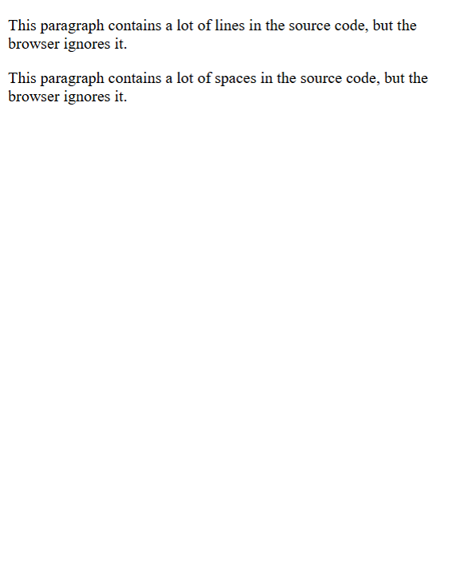

- [x] **HTML horizontal rules**
  - `<hr>` is a **thematic break**, usually shown as a horizontal line.
  - Use it to **separate** content or mark a change.
  - `<hr>` is **empty** (no end tag).
  - Sandbox: `code_sandbox/html-paragraphs/hr.html`.

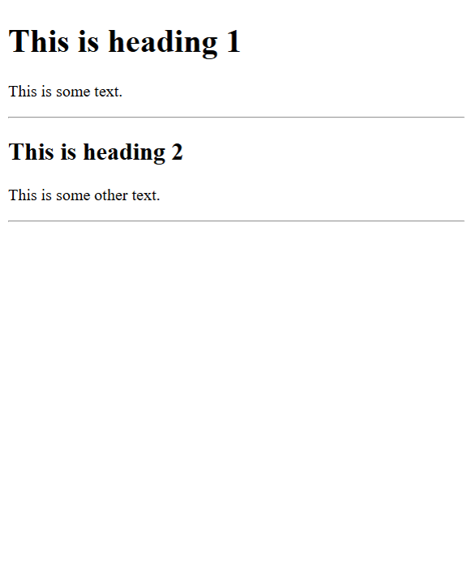

- [x] **HTML line breaks**
  - `<br>` starts a **new line** without a new paragraph.
  - `<br>` is **empty** (no end tag).
  - Sandbox: `code_sandbox/html-paragraphs/br.html`.

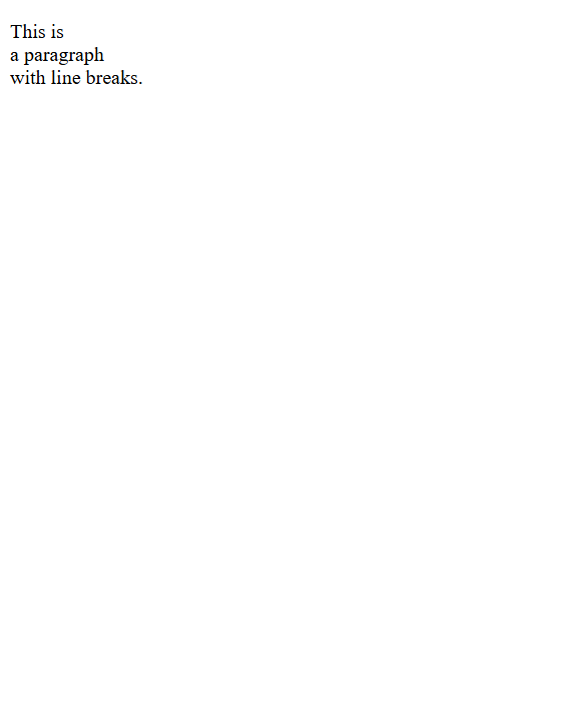

- [x] **The poem problem**
  - A poem in `<p>` with blank lines in the source still **renders on one flow** (one paragraph).
  - Sandbox: `code_sandbox/html-paragraphs/poem.html`.

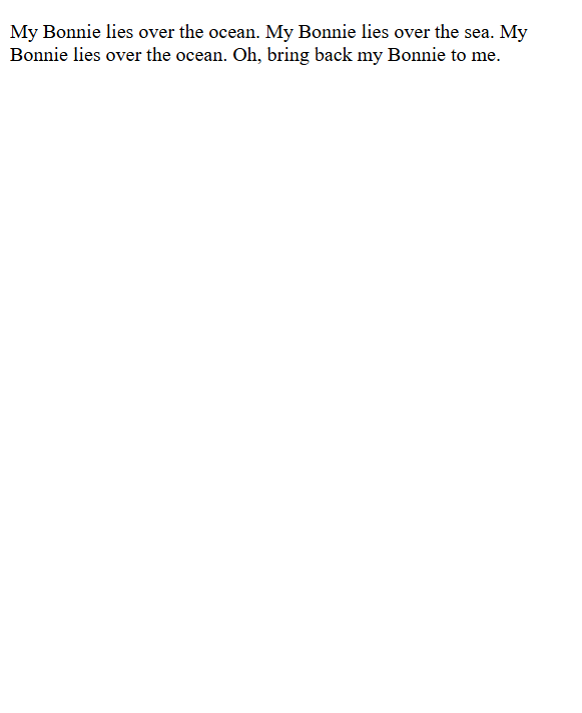

- [x] **Solution: `<pre>`**
  - `<pre>` is **preformatted** text: spaces and line breaks in the source are **kept**.
  - Browsers typically show it in a **monospace** font.
  - Sandbox: `code_sandbox/html-paragraphs/pre.html`.

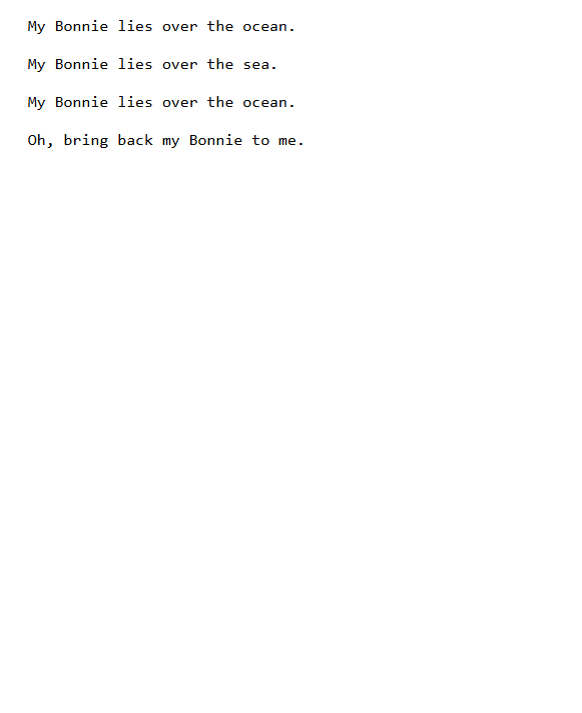

<details>
  <summary>Lab</summary>

## Lab

Run the six paragraph examples: two `<p>`s, collapsed whitespace, `<hr>`, `<br>`, poem in `<p>`, poem in `<pre>`.

### **Overview**

- [ ] Serve `code_sandbox` and open each `html-paragraphs` file.
- [ ] Success: two spaced paragraphs; extra source spaces collapsed; two `hr` lines; three-line `<br>` paragraph; poem as one flow in `<p>`; poem layout kept in `<pre>`.

### **Task 1: Serve and open**

- [ ] From `Personal/Files/html/code_sandbox`:

```bash
python -m http.server 8766 --bind 127.0.0.1
```

- [ ] `http://127.0.0.1:8766/html-paragraphs/`
- [ ] `http://127.0.0.1:8766/html-paragraphs/display.html`
- [ ] `http://127.0.0.1:8766/html-paragraphs/hr.html`
- [ ] `http://127.0.0.1:8766/html-paragraphs/br.html`
- [ ] `http://127.0.0.1:8766/html-paragraphs/poem.html`
- [ ] `http://127.0.0.1:8766/html-paragraphs/pre.html`


The paragraph examples match the chapter.

</details>

<details>
  <summary>Terminal Commands</summary>

## Terminal Commands

```bash
# from Personal/Files/html/code_sandbox
python -m http.server 8766 --bind 127.0.0.1
```

Then open `http://127.0.0.1:8766/html-paragraphs/`.

</details>

<details>
  <summary>Code</summary>

## Code

Two paragraphs (`index.html`):

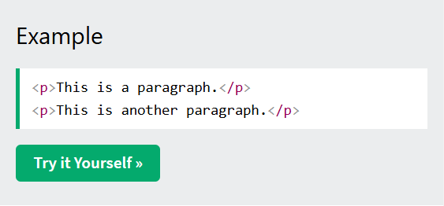

```html
<p>This is a paragraph.</p>
<p>This is another paragraph.</p>
```


Collapsed whitespace (`display.html`):

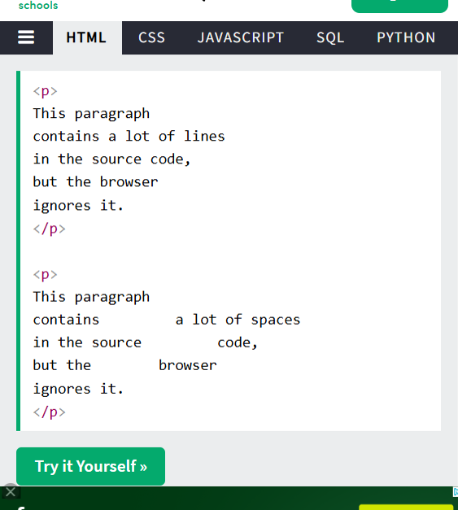

```html
<p>
  This paragraph contains a lot of lines in the source code, but the browser
  ignores it.
</p>
```


Horizontal rules (`hr.html`):

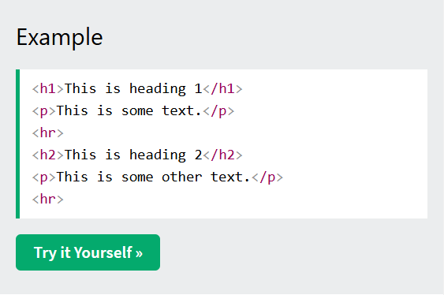

```html
<h1>This is heading 1</h1>
<p>This is some text.</p>
<hr />
<h2>This is heading 2</h2>
<p>This is some other text.</p>
<hr />
```


Line breaks (`br.html`):

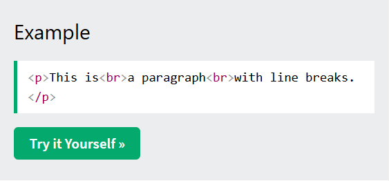

```html
<p>This is<br />a paragraph<br />with line breaks.</p>
```


Poem in `<p>` (`poem.html`):

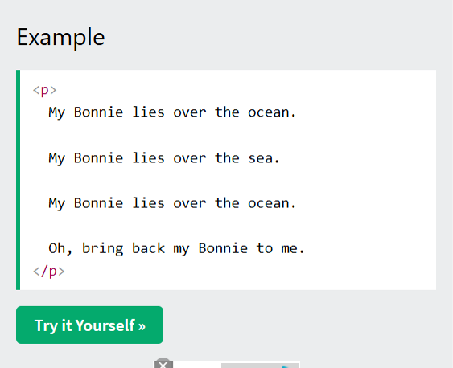

```html
<p>
  My Bonnie lies over the ocean. My Bonnie lies over the sea. My Bonnie lies
  over the ocean. Oh, bring back my Bonnie to me.
</p>
```


Poem in `<pre>` (`pre.html`):


```html
<pre>
  My Bonnie lies over the ocean.

  My Bonnie lies over the sea.

  My Bonnie lies over the ocean.

  Oh, bring back my Bonnie to me.
</pre>
```


</details>

<details>
  <summary>Questions and Answers</summary>

## Questions and Answers

### Question 1: What does `<p>` define, and where does it start?

<details>
<summary>Answer</summary>

- [x] A **paragraph**.
- [x] It always starts on a **new line**.
- [x] Browsers add **margin** before and after it.

</details>

### Question 2: Do extra spaces and blank lines in the HTML source show on the page?

<details>
<summary>Answer</summary>

- [x] **No.** The browser **collapses** extra spaces and lines.
- [x] Many spaces or newlines count as **one space**.

</details>

### Question 3: What is `<hr>` for?

<details>
<summary>Answer</summary>

- [x] A **thematic break**, usually a **horizontal rule**.
- [x] It **separates** content (or marks a change).
- [x] It is an **empty** tag (no end tag).

</details>

### Question 4: When do you use `<br>` instead of a new `<p>`?

<details>
<summary>Answer</summary>

- [x] When you want a **new line** without starting a **new paragraph**.
- [x] `<br>` is **empty** (no end tag).

</details>

### Question 5: Why does a poem in `<p>` appear as one block?

<details>
<summary>Answer</summary>

- [x] `<p>` **ignores** extra line breaks in the source.
- [x] The lines collapse into **one paragraph**.

</details>

### Question 6: How do you keep a poem’s line breaks?

<details>
<summary>Answer</summary>

- [x] Use the `<pre>` element (**preformatted** text).
- [x] Spaces and line breaks in the source are **preserved**.

</details>

### Question 7: Can you control wrapping by adding spaces in the HTML file?

<details>
<summary>Answer</summary>

- [x] **No.** Screen size and window size change the wrap.
- [x] Extra spaces in the source do **not** control the layout.

</details>

</details>

## Summary

`<p>` starts a new paragraph with automatic **margin**. Extra source **spaces/newlines collapse**. `<hr>` is an empty **thematic break**; `<br>` is an empty **line break**. A poem in `<p>` becomes one flow; `<pre>` keeps the layout.

## References

- [HTML Paragraphs (W3Schools)](https://www.w3schools.com/html/html_paragraphs.asp)
- [Try it Yourself: tryhtml_paragraphs1](https://www.w3schools.com/html/tryit.asp?filename=tryhtml_paragraphs1)
- [Try it Yourself: tryhtml_paragraphs2](https://www.w3schools.com/html/tryit.asp?filename=tryhtml_paragraphs2)
- [Try it Yourself: tryhtml_headings_hr](https://www.w3schools.com/html/tryit.asp?filename=tryhtml_headings_hr)
- [Try it Yourself: tryhtml_paragraphs](https://www.w3schools.com/html/tryit.asp?filename=tryhtml_paragraphs)
- [Try it Yourself: tryhtml_poem](https://www.w3schools.com/html/tryit.asp?filename=tryhtml_poem)
- [Try it Yourself: tryhtml_pre](https://www.w3schools.com/html/tryit.asp?filename=tryhtml_pre)
- [MDN: `<p>`](https://developer.mozilla.org/en-US/docs/Web/HTML/Element/p)
- [MDN: `<pre>`](https://developer.mozilla.org/en-US/docs/Web/HTML/Element/pre)
- [MDN: `<hr>`](https://developer.mozilla.org/en-US/docs/Web/HTML/Element/hr)
- [MDN: `<br>`](https://developer.mozilla.org/en-US/docs/Web/HTML/Element/br)

</details>

<details>
  <summary>HTML Styles</summary>

## Introduction

The HTML **`style`** attribute adds CSS to an element: **color**, **font**, **size**, alignment, and more. The syntax is `<tagname style="property:value;">`. You will learn more CSS later; this chapter is the inline `style` attribute.

## Detailed Explanation

- [x] **The `style` attribute**
  - Setting the style of an HTML element can be done with **`style`**.
  - Syntax: `<tagname style="property:value;">`.
  - The **property** is a CSS property; the **value** is a CSS value.
  - Intro demo: normal, red, blue, and 50px text.
  - Sandbox: `code_sandbox/html-styles/index.html`.

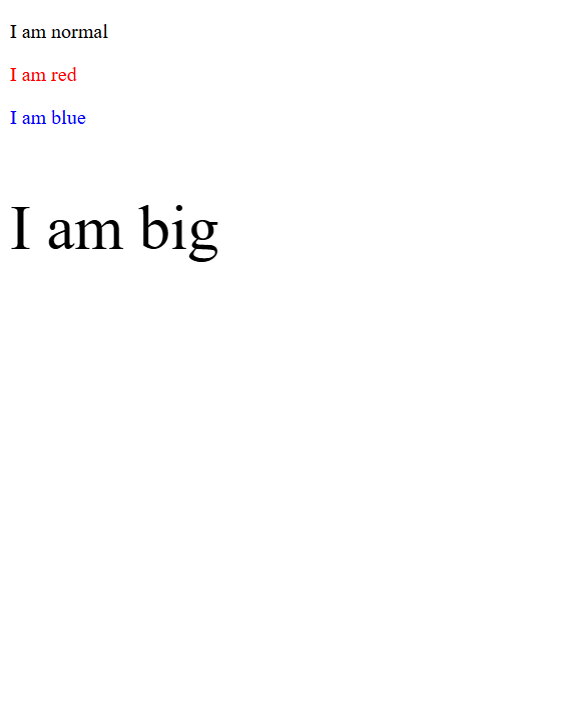

- [x] **Background color (`background-color`)**
  - Defines the **background color** for an HTML element.
  - Page background: `<body style="background-color:powderblue;">`.
  - Sandbox: `code_sandbox/html-styles/background.html`.

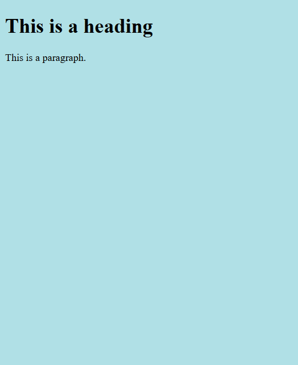

- [x] **Background color on individual elements**
  - The same property can style **different** elements (`h1` powderblue, `p` tomato).
  - Sandbox: `code_sandbox/html-styles/background2.html`.

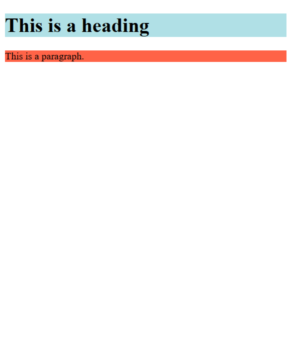

- [x] **Text color (`color`)**
  - Defines the **text color** for an HTML element.
  - Sandbox: `code_sandbox/html-styles/color.html`.

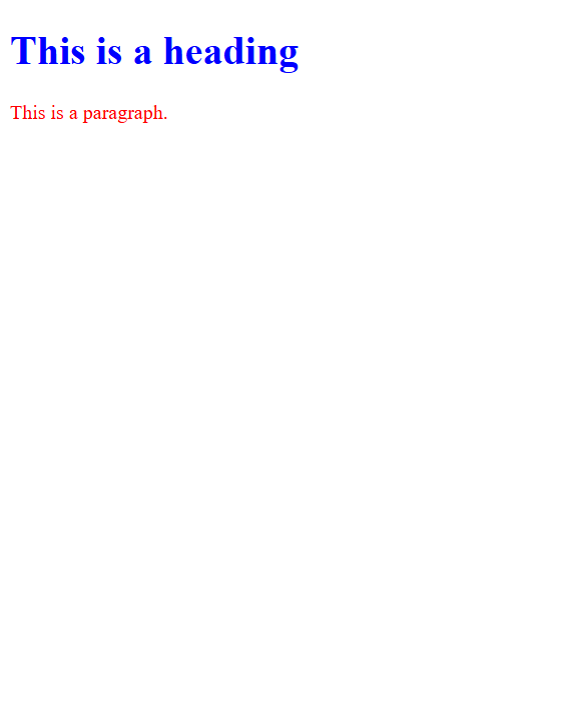

- [x] **Fonts (`font-family`)**
  - Defines the **font** for an HTML element (Verdana heading, Courier paragraph).
  - Sandbox: `code_sandbox/html-styles/font.html`.

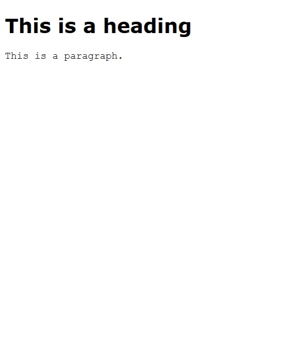

- [x] **Text size (`font-size`)**
  - Defines the **text size**. Percentages are relative to the parent (here `300%` / `160%`).
  - Sandbox: `code_sandbox/html-styles/size.html`.

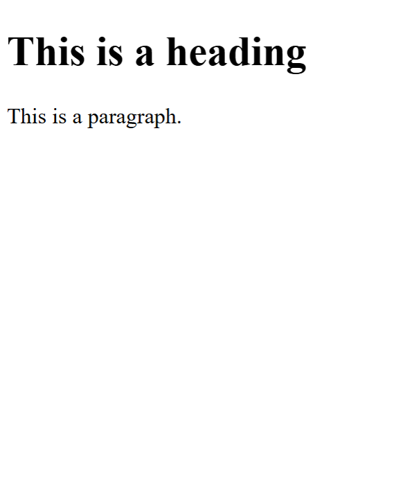

- [x] **Text alignment (`text-align`)**
  - Defines **horizontal** text alignment (`center` in the example).
  - Sandbox: `code_sandbox/html-styles/align.html`.


<details>
  <summary>Lab</summary>

## Lab

Run the seven style examples: intro colors/size, body background, element backgrounds, text color, font-family, font-size, and text-align.

### **Overview**

- [ ] Serve `code_sandbox` and open each `html-styles` file.
- [ ] Success: red/blue/big intro; powderblue page; powderblue heading and tomato paragraph; blue heading and red paragraph; Verdana/Courier; larger percent sizes; centered heading and paragraph.

### **Task 1: Serve and open**

- [ ] From `Personal/Files/html/code_sandbox`:

```bash
python -m http.server 8766 --bind 127.0.0.1
```

- [ ] `http://127.0.0.1:8766/html-styles/`
- [ ] `http://127.0.0.1:8766/html-styles/background.html`
- [ ] `http://127.0.0.1:8766/html-styles/background2.html`
- [ ] `http://127.0.0.1:8766/html-styles/color.html`
- [ ] `http://127.0.0.1:8766/html-styles/font.html`
- [ ] `http://127.0.0.1:8766/html-styles/size.html`
- [ ] `http://127.0.0.1:8766/html-styles/align.html`


The style examples match the chapter.

</details>

<details>
  <summary>Terminal Commands</summary>

## Terminal Commands

```bash
# from Personal/Files/html/code_sandbox
python -m http.server 8766 --bind 127.0.0.1
```

Then open `http://127.0.0.1:8766/html-styles/`.

</details>

<details>
  <summary>Code</summary>

## Code

Intro colors and size (`index.html`):

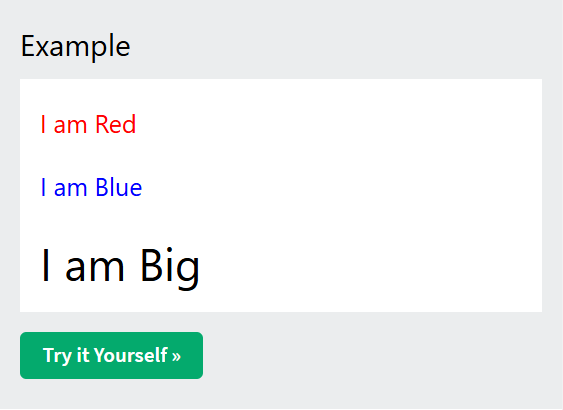

```html
<p>I am normal</p>
<p style="color:red;">I am red</p>
<p style="color:blue;">I am blue</p>
<p style="font-size:50px;">I am big</p>
```


Page background (`background.html`):

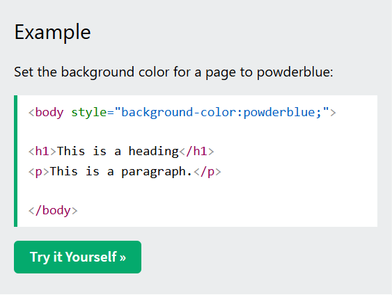

```html
<body style="background-color:powderblue;">
  <h1>This is a heading</h1>
  <p>This is a paragraph.</p>
</body>
```


Element backgrounds (`background2.html`):

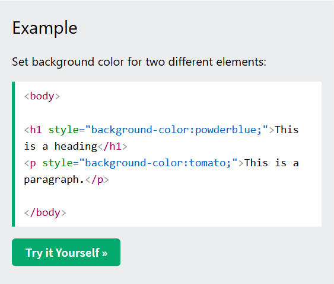

```html
<h1 style="background-color:powderblue;">This is a heading</h1>
<p style="background-color:tomato;">This is a paragraph.</p>
```


Text color (`color.html`):

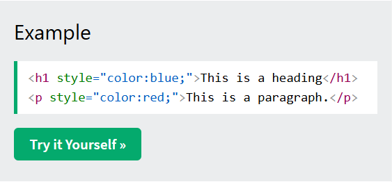

```html
<h1 style="color:blue;">This is a heading</h1>
<p style="color:red;">This is a paragraph.</p>
```


Fonts (`font.html`):

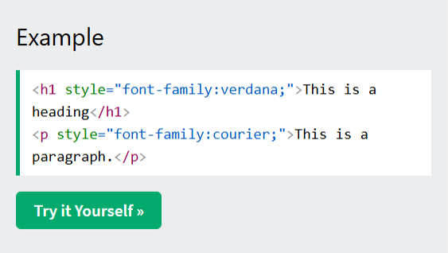

```html
<h1 style="font-family:verdana;">This is a heading</h1>
<p style="font-family:courier;">This is a paragraph.</p>
```


Text size (`size.html`):

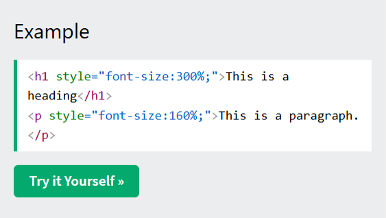

```html
<h1 style="font-size:300%;">This is a heading</h1>
<p style="font-size:160%;">This is a paragraph.</p>
```


Text alignment (`align.html`):

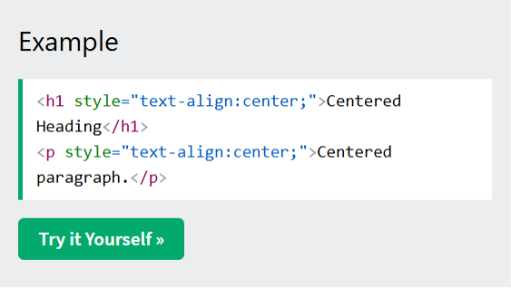

```html
<h1 style="text-align:center;">Centered Heading</h1>
<p style="text-align:center;">Centered paragraph.</p>
```


</details>

<details>
  <summary>Questions and Answers</summary>

## Questions and Answers

### Question 1: What is the syntax of the HTML `style` attribute?

<details>
<summary>Answer</summary>

- [x] `<tagname style="property:value;">`.
- [x] The **property** is a CSS property; the **value** is a CSS value.

</details>

### Question 2: Which CSS property sets a page or element background color?

<details>
<summary>Answer</summary>

- [x] **`background-color`**.
- [x] Example: `<body style="background-color:powderblue;">`.

</details>

### Question 3: Which property sets text color?

<details>
<summary>Answer</summary>

- [x] **`color`**.
- [x] Example: `<h1 style="color:blue;">`.

</details>

### Question 4: Which property chooses the font?

<details>
<summary>Answer</summary>

- [x] **`font-family`**.
- [x] Example: `font-family:verdana` or `font-family:courier`.

</details>

### Question 5: How do you change text size with the style attribute?

<details>
<summary>Answer</summary>

- [x] Use **`font-size`**.
- [x] The chapter uses percentages such as `300%` and `160%`.

</details>

### Question 6: How do you center text?

<details>
<summary>Answer</summary>

- [x] Use **`text-align:center`**.
- [x] It sets **horizontal** alignment.

</details>

### Question 7: Is inline `style` the only way to style HTML?

<details>
<summary>Answer</summary>

- [x] **No.** This chapter uses the **`style` attribute**.
- [x] You will learn more about **CSS** later in the tutorial.

</details>

</details>

## Summary

Use the **`style`** attribute for styling HTML elements. Use **`background-color`** for backgrounds, **`color`** for text colors, **`font-family`** for fonts, **`font-size`** for sizes, and **`text-align`** for alignment.

## References

- [HTML Styles (W3Schools)](https://www.w3schools.com/html/html_styles.asp)
- [Try it Yourself: tryhtml_styles_intro](https://www.w3schools.com/html/tryit.asp?filename=tryhtml_styles_intro)
- [Try it Yourself: tryhtml_styles_background-color](https://www.w3schools.com/html/tryit.asp?filename=tryhtml_styles_background-color)
- [Try it Yourself: tryhtml_styles_background-color2](https://www.w3schools.com/html/tryit.asp?filename=tryhtml_styles_background-color2)
- [Try it Yourself: tryhtml_styles_color](https://www.w3schools.com/html/tryit.asp?filename=tryhtml_styles_color)
- [Try it Yourself: tryhtml_styles_font-family](https://www.w3schools.com/html/tryit.asp?filename=tryhtml_styles_font-family)
- [Try it Yourself: tryhtml_styles_font-size](https://www.w3schools.com/html/tryit.asp?filename=tryhtml_styles_font-size)
- [Try it Yourself: tryhtml_styles_text-align](https://www.w3schools.com/html/tryit.asp?filename=tryhtml_styles_text-align)
- [MDN: style](https://developer.mozilla.org/en-US/docs/Web/HTML/Global_attributes/style)
- [MDN: CSS background-color](https://developer.mozilla.org/en-US/docs/Web/CSS/background-color)
- [MDN: CSS color](https://developer.mozilla.org/en-US/docs/Web/CSS/color)
- [MDN: CSS font-family](https://developer.mozilla.org/en-US/docs/Web/CSS/font-family)
- [MDN: CSS font-size](https://developer.mozilla.org/en-US/docs/Web/CSS/font-size)
- [MDN: CSS text-align](https://developer.mozilla.org/en-US/docs/Web/CSS/text-align)

</details>
<details>
  <summary>HTML Formatting</summary>

## Introduction

HTML has several elements for text with a **special meaning**: bold, important, italic, emphasized, small, marked, deleted, inserted, subscript, and superscript. Some tags change **look** (`<b>`, `<i>`); others add **meaning** (`<strong>`, `<em>`).

## Detailed Explanation

- [x] **Formatting elements**
  - `<b>` bold (no extra importance)
  - `<strong>` important (usually bold)
  - `<i>` italic / alternate voice or mood
  - `<em>` emphasized (usually italic; screen readers stress it)
  - `<small>` smaller text
  - `<mark>` marked / highlighted
  - `<del>` deleted (usually strikethrough)
  - `<ins>` inserted (usually underlined)
  - `<sub>` subscript (e.g. H₂O)
  - `<sup>` superscript (e.g. footnotes)
  - Intro demo: bold, italic, subscript, and superscript.
  - Sandbox: `code_sandbox/html-formatting/index.html`.

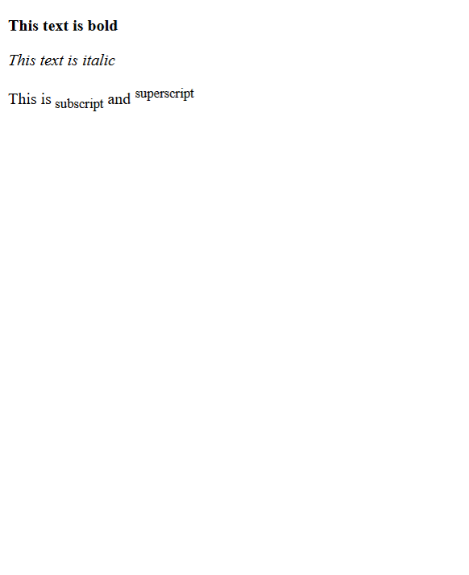

- [x] **`<b>` and `<strong>`**
  - `<b>` is **bold** without extra importance.
  - `<strong>` is **strong importance**; typically displayed bold.
  - Sandbox: `code_sandbox/html-formatting/b.html`, `strong.html`.


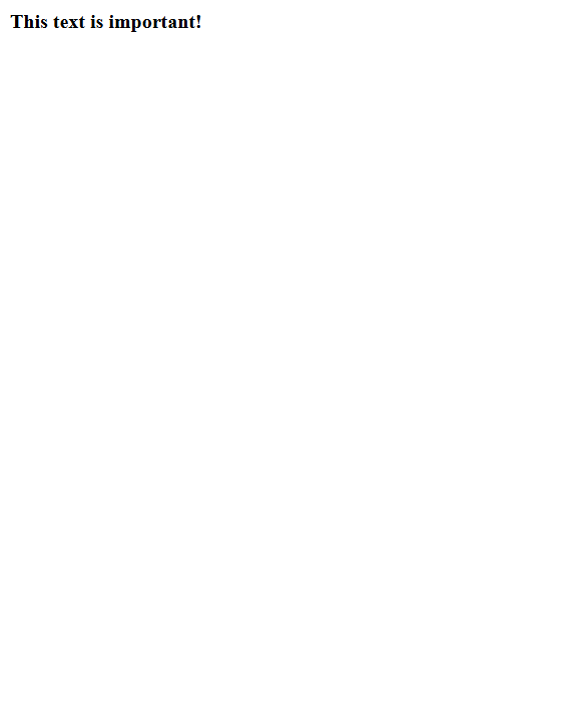

- [x] **`<i>` and `<em>`**
  - `<i>` is an **alternate voice or mood** (technical term, other language, thought, ship name); typically italic.
  - `<em>` is **emphasized**; typically italic. A screen reader stresses the words.
  - Sandbox: `code_sandbox/html-formatting/i.html`, `em.html`.

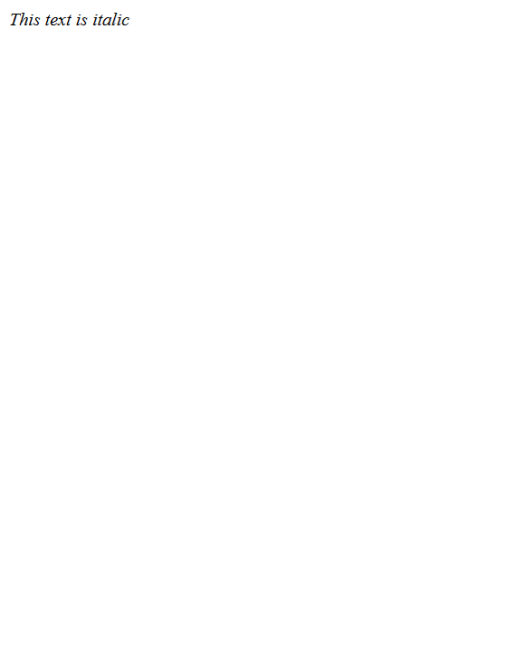

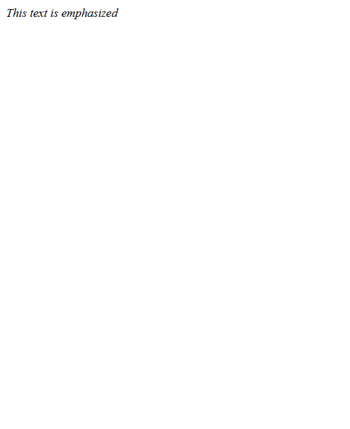

- [x] **`<small>`**
  - Defines **smaller** text.
  - Sandbox: `code_sandbox/html-formatting/small.html`.

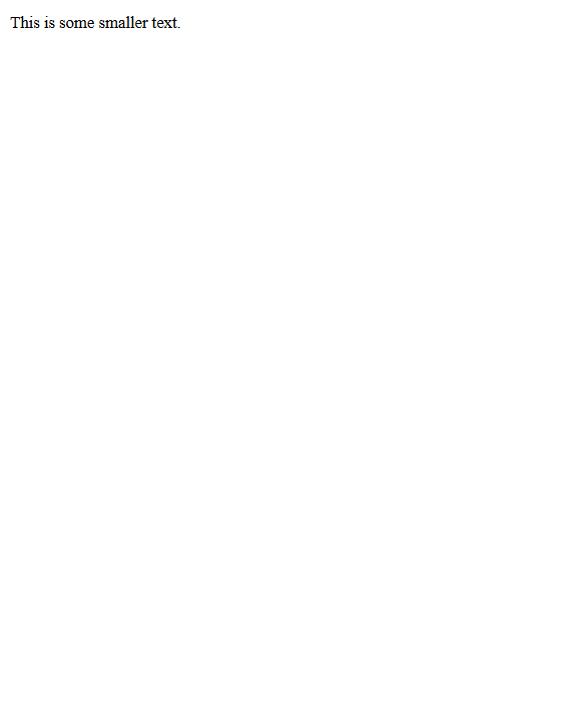

- [x] **`<mark>`**
  - Defines text that should be **marked or highlighted**.
  - Sandbox: `code_sandbox/html-formatting/mark.html`.

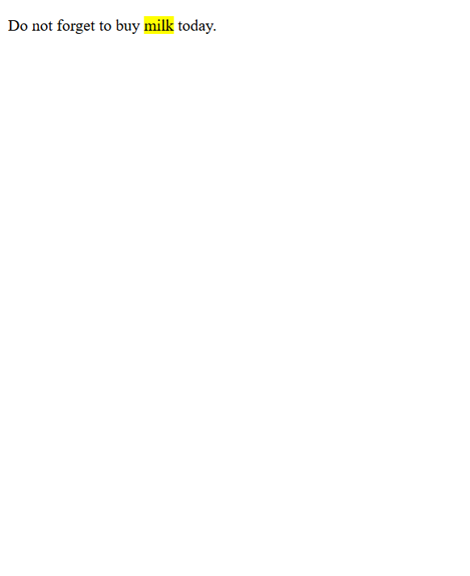

- [x] **`<del>` and `<ins>`**
  - `<del>` is **deleted** text; browsers usually **strike through**.
  - `<ins>` is **inserted** text; browsers usually **underline**.
  - Sandbox: `code_sandbox/html-formatting/del.html`, `ins.html`.


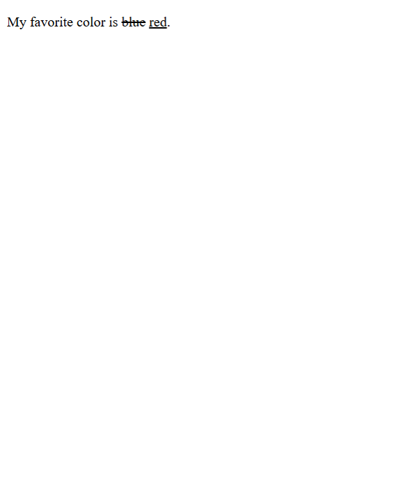

- [x] **`<sub>` and `<sup>`**
  - `<sub>` sits **half a character below** the line (chemical formulas).
  - `<sup>` sits **half a character above** the line (footnotes).
  - Sandbox: `code_sandbox/html-formatting/sub.html`, `sup.html`.

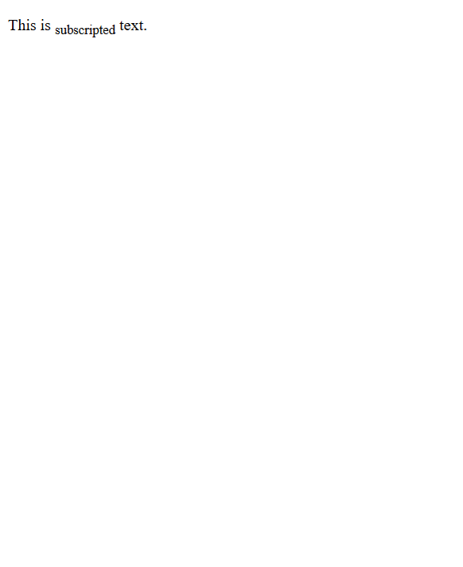


<details>
  <summary>Lab</summary>

## Lab

Run the formatting examples: intro combo, then each tag (`b`, `strong`, `i`, `em`, `small`, `mark`, `del`, `ins`, `sub`, `sup`).

### **Overview**

- [ ] Serve `code_sandbox` and open each `html-formatting` file.
- [ ] Success: bold/italic/sub/sup intro; bold vs important; italic vs emphasized; smaller text; yellow highlight on “milk”; strikethrough “blue”; strikethrough plus underlined “red”; subscript; superscript.

### **Task 1: Serve and open**

- [ ] From `Personal/Files/html/code_sandbox`:

```bash
python -m http.server 8766 --bind 127.0.0.1
```

- [ ] `http://127.0.0.1:8766/html-formatting/`
- [ ] `http://127.0.0.1:8766/html-formatting/b.html`
- [ ] `http://127.0.0.1:8766/html-formatting/strong.html`
- [ ] `http://127.0.0.1:8766/html-formatting/i.html`
- [ ] `http://127.0.0.1:8766/html-formatting/em.html`
- [ ] `http://127.0.0.1:8766/html-formatting/small.html`
- [ ] `http://127.0.0.1:8766/html-formatting/mark.html`
- [ ] `http://127.0.0.1:8766/html-formatting/del.html`
- [ ] `http://127.0.0.1:8766/html-formatting/ins.html`
- [ ] `http://127.0.0.1:8766/html-formatting/sub.html`
- [ ] `http://127.0.0.1:8766/html-formatting/sup.html`


The formatting examples match the chapter.

</details>

<details>
  <summary>Terminal Commands</summary>

## Terminal Commands

```bash
# from Personal/Files/html/code_sandbox
python -m http.server 8766 --bind 127.0.0.1
```

Then open `http://127.0.0.1:8766/html-formatting/`.

</details>

<details>
  <summary>Code</summary>

## Code

Intro (`index.html`):

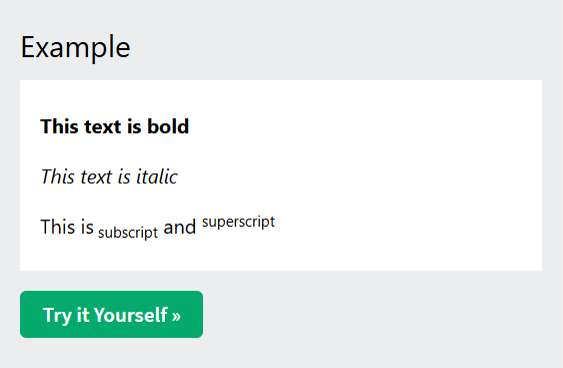

```html
<p><b>This text is bold</b></p>
<p><i>This text is italic</i></p>
<p>This is<sub> subscript</sub> and <sup>superscript</sup></p>
```


Bold (`b.html`):

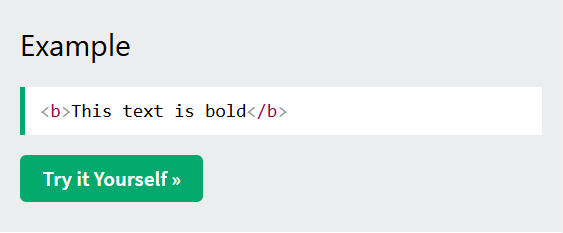

```html
<b>This text is bold</b>
```


Strong (`strong.html`):

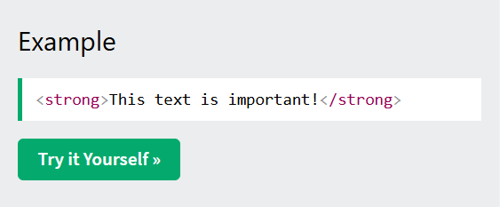

```html
<strong>This text is important!</strong>
```


Italic (`i.html`):

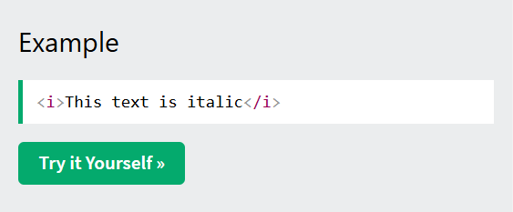

```html
<i>This text is italic</i>
```


Emphasized (`em.html`):

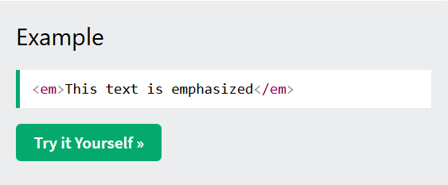

```html
<em>This text is emphasized</em>
```


Small (`small.html`):

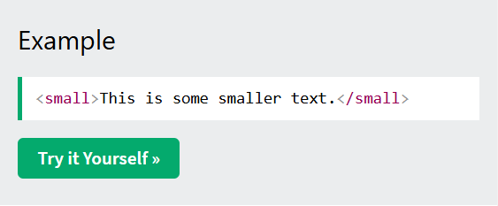

```html
<small>This is some smaller text.</small>
```


Mark (`mark.html`):

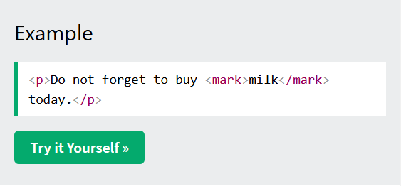

```html
<p>Do not forget to buy <mark>milk</mark> today.</p>
```


Deleted (`del.html`):

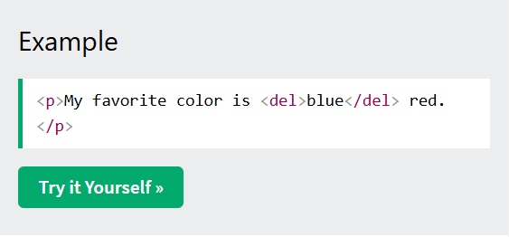

```html
<p>My favorite color is <del>blue</del> red.</p>
```


Inserted (`ins.html`):

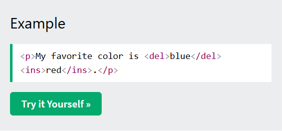

```html
<p>My favorite color is <del>blue</del> <ins>red</ins>.</p>
```


Subscript (`sub.html`):

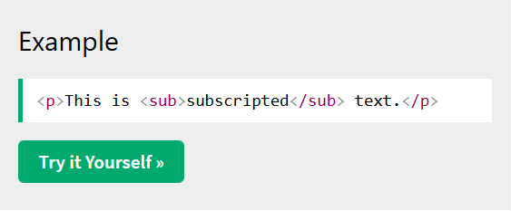

```html
<p>This is <sub>subscripted</sub> text.</p>
```


Superscript (`sup.html`):

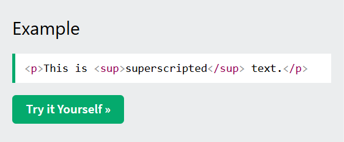

```html
<p>This is <sup>superscripted</sup> text.</p>
```


</details>

<details>
  <summary>Questions and Answers</summary>

## Questions and Answers

### Question 1: What is the difference between `<b>` and `<strong>`?

<details>
<summary>Answer</summary>

- [x] `<b>` is **bold** without extra importance.
- [x] `<strong>` marks **strong importance** (usually displayed bold).

</details>

### Question 2: What is the difference between `<i>` and `<em>`?

<details>
<summary>Answer</summary>

- [x] `<i>` is an **alternate voice or mood** (typically italic).
- [x] `<em>` is **emphasized** text (typically italic).
- [x] A screen reader **stresses** words in `<em>`.

</details>

### Question 3: What does `<mark>` do?

<details>
<summary>Answer</summary>

- [x] It **marks or highlights** text.
- [x] Example: “Do not forget to buy **milk** today.”

</details>

### Question 4: How do browsers usually show `<del>` and `<ins>`?

<details>
<summary>Answer</summary>

- [x] `<del>`: **strikethrough** (deleted).
- [x] `<ins>`: **underline** (inserted).

</details>

### Question 5: When do you use `<sub>` vs `<sup>`?

<details>
<summary>Answer</summary>

- [x] `<sub>`: **below** the line (chemical formulas such as H₂O).
- [x] `<sup>`: **above** the line (footnotes).

</details>

### Question 6: What does `<small>` define?

<details>
<summary>Answer</summary>

- [x] **Smaller** text.

</details>

### Question 7: Name the ten formatting elements from this chapter.

<details>
<summary>Answer</summary>

- [x] `<b>`, `<strong>`, `<i>`, `<em>`, `<small>`, `<mark>`, `<del>`, `<ins>`, `<sub>`, `<sup>`.

</details>

</details>

## Summary

Use formatting tags for **meaning** and look: `<b>`/`<strong>`, `<i>`/`<em>`, `<small>`, `<mark>`, `<del>`/`<ins>`, `<sub>`/`<sup>`. Prefer `<strong>` and `<em>` when importance or emphasis is the point.

## References

- [HTML Text Formatting (W3Schools)](https://www.w3schools.com/html/html_formatting.asp)
- [Try it Yourself: tryhtml_formatting_intro](https://www.w3schools.com/html/tryit.asp?filename=tryhtml_formatting_intro)
- [Try it Yourself: tryhtml_formatting_b](https://www.w3schools.com/html/tryit.asp?filename=tryhtml_formatting_b)
- [Try it Yourself: tryhtml_formatting_strong](https://www.w3schools.com/html/tryit.asp?filename=tryhtml_formatting_strong)
- [Try it Yourself: tryhtml_formatting_i](https://www.w3schools.com/html/tryit.asp?filename=tryhtml_formatting_i)
- [Try it Yourself: tryhtml_formatting_em](https://www.w3schools.com/html/tryit.asp?filename=tryhtml_formatting_em)
- [Try it Yourself: tryhtml_formatting_small](https://www.w3schools.com/html/tryit.asp?filename=tryhtml_formatting_small)
- [Try it Yourself: tryhtml_formatting_mark](https://www.w3schools.com/html/tryit.asp?filename=tryhtml_formatting_mark)
- [Try it Yourself: tryhtml_formatting_del](https://www.w3schools.com/html/tryit.asp?filename=tryhtml_formatting_del)
- [Try it Yourself: tryhtml_formatting_del_ins](https://www.w3schools.com/html/tryit.asp?filename=tryhtml_formatting_del_ins)
- [Try it Yourself: tryhtml_formatting_sub](https://www.w3schools.com/html/tryit.asp?filename=tryhtml_formatting_sub)
- [Try it Yourself: tryhtml_formatting_sup](https://www.w3schools.com/html/tryit.asp?filename=tryhtml_formatting_sup)
- [MDN: `<b>`](https://developer.mozilla.org/en-US/docs/Web/HTML/Element/b)
- [MDN: `<strong>`](https://developer.mozilla.org/en-US/docs/Web/HTML/Element/strong)
- [MDN: `<i>`](https://developer.mozilla.org/en-US/docs/Web/HTML/Element/i)
- [MDN: `<em>`](https://developer.mozilla.org/en-US/docs/Web/HTML/Element/em)
- [MDN: `<mark>`](https://developer.mozilla.org/en-US/docs/Web/HTML/Element/mark)
- [MDN: `<del>`](https://developer.mozilla.org/en-US/docs/Web/HTML/Element/del)
- [MDN: `<ins>`](https://developer.mozilla.org/en-US/docs/Web/HTML/Element/ins)
- [MDN: `<sub>`](https://developer.mozilla.org/en-US/docs/Web/HTML/Element/sub)
- [MDN: `<sup>`](https://developer.mozilla.org/en-US/docs/Web/HTML/Element/sup)

</details>
<details>
  <summary>HTML Quotations</summary>

## Introduction

This chapter covers **quotation and citation** elements: `<blockquote>`, `<q>`, `<abbr>`, `<address>`, `<cite>`, and `<bdo>`. They mark quotes, abbreviations, contact info, work titles, and text direction.

## Detailed Explanation

- [x] **`<blockquote>` for quotations**
  - Defines a section **quoted from another source**.
  - Browsers usually **indent** it.
  - Optional `cite` URL (here WWF).
  - Sandbox: `code_sandbox/html-quotations/index.html`.

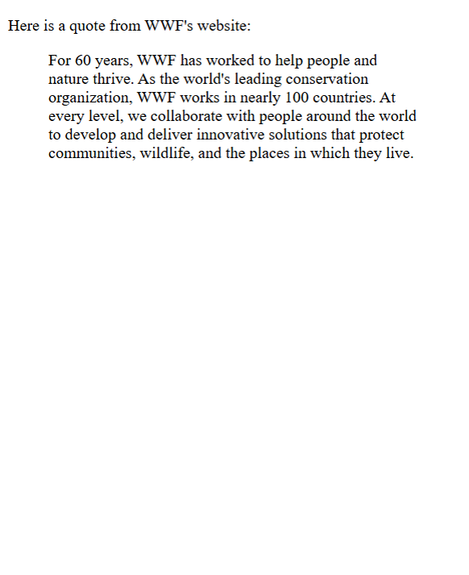

- [x] **`<q>` for short quotations**
  - Defines a **short** quotation.
  - Browsers normally insert **quotation marks**.
  - Sandbox: `code_sandbox/html-quotations/q.html`.

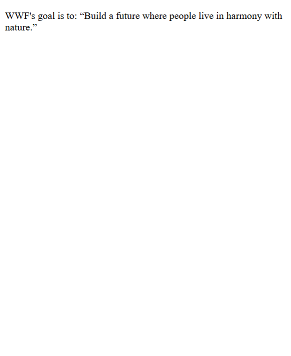

- [x] **`<abbr>` for abbreviations**
  - Defines an **abbreviation or acronym** (HTML, CSS, Mr., Dr., ASAP, ATM).
  - Helps browsers, translation systems, and search engines.
  - Use the global **`title`** attribute so the description shows on **mouse over**.
  - Sandbox: `code_sandbox/html-quotations/abbr.html`.

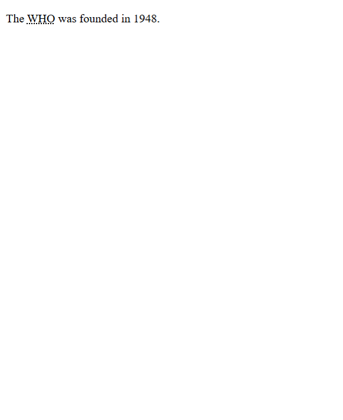

- [x] **`<address>` for contact information**
  - Contact info for the **author/owner** of a document or article (email, URL, physical address, phone, social handle).
  - Usually **italic**. Browsers add a **line break** before and after.
  - Sandbox: `code_sandbox/html-quotations/address.html`.

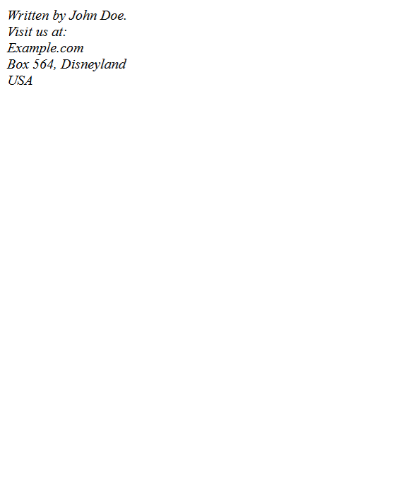

- [x] **`<cite>` for work title**
  - Title of a **creative work** (book, poem, song, movie, painting, sculpture).
  - A person’s name is **not** the title of a work.
  - Usually **italic**.
  - Sandbox: `code_sandbox/html-quotations/cite.html`.

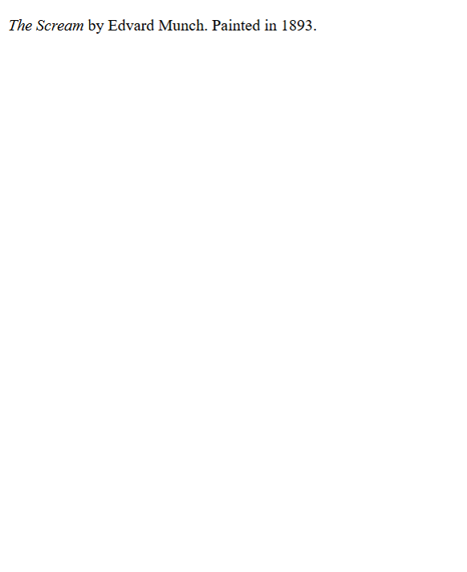

- [x] **`<bdo>` for bi-directional override**
  - BDO = **Bi-Directional Override**.
  - Overrides the current **text direction** (`dir="rtl"` in the example).
  - Sandbox: `code_sandbox/html-quotations/bdo.html`.

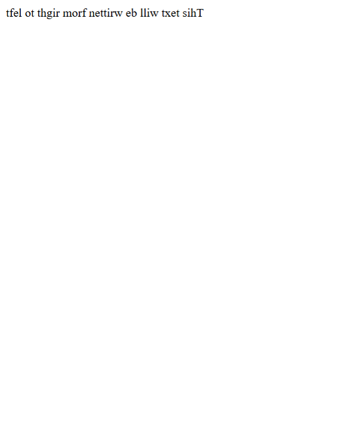

<details>
  <summary>Lab</summary>

## Lab

Run the quotation examples: indented WWF blockquote, short `<q>` with quote marks, WHO abbreviation, italic address, _The Scream_ citation, and RTL `<bdo>`.

### **Overview**

- [ ] Serve `code_sandbox` and open each `html-quotations` file.
- [ ] Success: indented WWF quote; quoted WWF goal; dotted WHO (tooltip “World Health Organization”); italic John Doe address; italic _The Scream_; reversed RTL sentence.

### **Task 1: Serve and open**

- [ ] From `Personal/Files/html/code_sandbox`:

```bash
python -m http.server 8766 --bind 127.0.0.1
```

- [ ] `http://127.0.0.1:8766/html-quotations/`
- [ ] `http://127.0.0.1:8766/html-quotations/q.html`
- [ ] `http://127.0.0.1:8766/html-quotations/abbr.html`
- [ ] `http://127.0.0.1:8766/html-quotations/address.html`
- [ ] `http://127.0.0.1:8766/html-quotations/cite.html`
- [ ] `http://127.0.0.1:8766/html-quotations/bdo.html`


The quotation examples match the chapter.

</details>

<details>
  <summary>Terminal Commands</summary>

## Terminal Commands

```bash
# from Personal/Files/html/code_sandbox
python -m http.server 8766 --bind 127.0.0.1
```

Then open `http://127.0.0.1:8766/html-quotations/`.

</details>

<details>
  <summary>Code</summary>

## Code

Intro / blockquote (`index.html`):

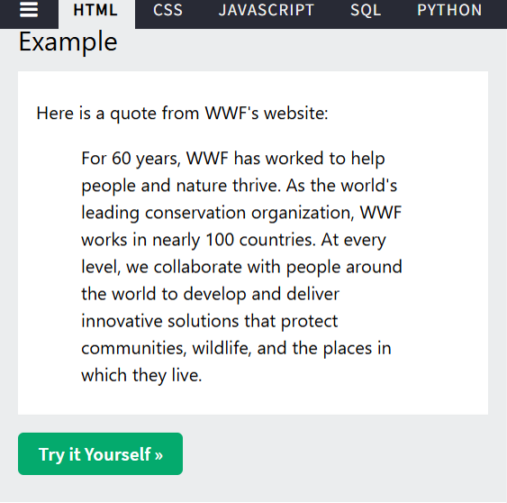

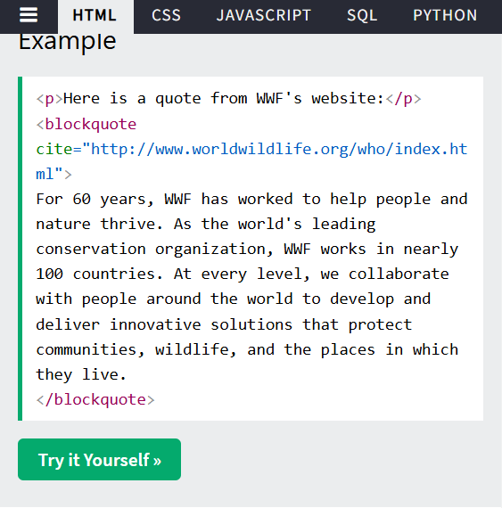

```html
<p>Here is a quote from WWF's website:</p>
<blockquote cite="http://www.worldwildlife.org/who/index.html">
  For 60 years, WWF has worked to help people and nature thrive. As the world's
  leading conservation organization, WWF works in nearly 100 countries. At every
  level, we collaborate with people around the world to develop and deliver
  innovative solutions that protect communities, wildlife, and the places in
  which they live.
</blockquote>
```


Short quotation (`q.html`):

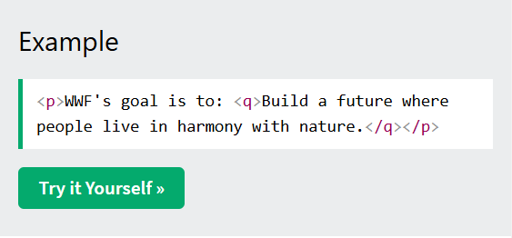

```html
<p>
  WWF's goal is to:
  <q>Build a future where people live in harmony with nature.</q>
</p>
```


Abbreviation (`abbr.html`):

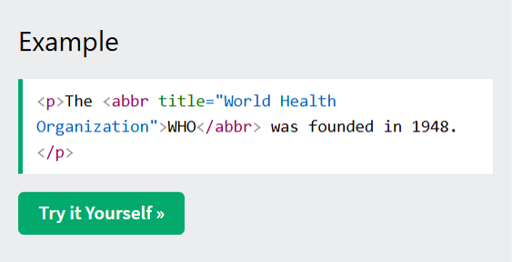

```html
<p>
  The <abbr title="World Health Organization">WHO</abbr> was founded in 1948.
</p>
```


Address (`address.html`):

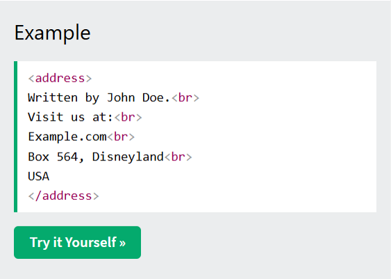

```html
<address>
  Written by John Doe.<br />
  Visit us at:<br />
  Example.com<br />
  Box 564, Disneyland<br />
  USA
</address>
```


Cite (`cite.html`):

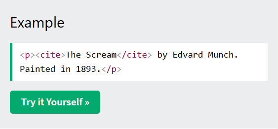

```html
<p><cite>The Scream</cite> by Edvard Munch. Painted in 1893.</p>
```


Bi-directional override (`bdo.html`):

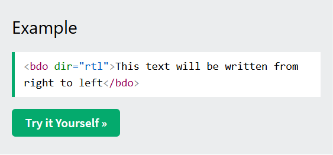

```html
<bdo dir="rtl">This text will be written from right to left</bdo>
```


</details>

<details>
  <summary>Questions and Answers</summary>

## Questions and Answers

### Question 1: What does `<blockquote>` do, and how do browsers show it?

<details>
<summary>Answer</summary>

- [x] It marks a section **quoted from another source**.
- [x] Browsers usually **indent** it.
- [x] You can add a **`cite`** URL for the source.

</details>

### Question 2: How is `<q>` different from `<blockquote>`?

<details>
<summary>Answer</summary>

- [x] `<q>` is a **short** (inline) quotation.
- [x] Browsers normally add **quotation marks**.

</details>

### Question 3: Why use `<abbr>` with `title`?

<details>
<summary>Answer</summary>

- [x] It marks an **abbreviation or acronym**.
- [x] **`title`** shows the full description on **mouse over**.
- [x] It can help browsers, translation systems, and search engines.

</details>

### Question 4: What belongs in `<address>`?

<details>
<summary>Answer</summary>

- [x] **Contact information** for the author/owner of a document or article.
- [x] Email, URL, physical address, phone, social handle, etc.
- [x] Usually **italic**, with a line break before and after.

</details>

### Question 5: What should `<cite>` wrap?

<details>
<summary>Answer</summary>

- [x] The **title of a creative work**.
- [x] A person’s name is **not** the title of a work.
- [x] Usually rendered in **italic**.

</details>

### Question 6: What does `<bdo dir="rtl">` do?

<details>
<summary>Answer</summary>

- [x] **BDO** means Bi-Directional Override.
- [x] It **overrides** the current text direction (here **right-to-left**).

</details>

### Question 7: Name the six quotation/citation elements from this chapter.

<details>
<summary>Answer</summary>

- [x] `<blockquote>`, `<q>`, `<abbr>`, `<address>`, `<cite>`, `<bdo>`.

</details>

</details>

## Summary

Use `<blockquote>` for a sourced block quote (usually indented), `<q>` for a short quote with marks, `<abbr title="...">` for acronyms, `<address>` for contact info, `<cite>` for a work’s title, and `<bdo>` to override text direction.

## References

- [HTML Quotation Elements (W3Schools)](https://www.w3schools.com/html/html_quotation_elements.asp)
- [Try it Yourself: tryhtml_formatting_intro2](https://www.w3schools.com/html/tryit.asp?filename=tryhtml_formatting_intro2)
- [Try it Yourself: tryhtml_formatting_blockquote](https://www.w3schools.com/html/tryit.asp?filename=tryhtml_formatting_blockquote)
- [Try it Yourself: tryhtml_formatting_q](https://www.w3schools.com/html/tryit.asp?filename=tryhtml_formatting_q)
- [Try it Yourself: tryhtml_formatting_abbr](https://www.w3schools.com/html/tryit.asp?filename=tryhtml_formatting_abbr)
- [Try it Yourself: tryhtml_formatting_address](https://www.w3schools.com/html/tryit.asp?filename=tryhtml_formatting_address)
- [Try it Yourself: tryhtml_formatting_cite](https://www.w3schools.com/html/tryit.asp?filename=tryhtml_formatting_cite)
- [Try it Yourself: tryhtml_formatting_bdo](https://www.w3schools.com/html/tryit.asp?filename=tryhtml_formatting_bdo)
- [MDN: `<blockquote>`](https://developer.mozilla.org/en-US/docs/Web/HTML/Element/blockquote)
- [MDN: `<q>`](https://developer.mozilla.org/en-US/docs/Web/HTML/Element/q)
- [MDN: `<abbr>`](https://developer.mozilla.org/en-US/docs/Web/HTML/Element/abbr)
- [MDN: `<address>`](https://developer.mozilla.org/en-US/docs/Web/HTML/Element/address)
- [MDN: `<cite>`](https://developer.mozilla.org/en-US/docs/Web/HTML/Element/cite)
- [MDN: `<bdo>`](https://developer.mozilla.org/en-US/docs/Web/HTML/Element/bdo)

</details>
<details>
  <summary>HTML Comments</summary>

## Introduction

HTML **comments** are **not displayed** in the browser. They document the source, hold reminders, and can **hide** content (temporarily, for debugging, or in the middle of a line). Syntax: `<!-- Write your comments here -->`. There is an **exclamation point** in the start tag, not the end tag.

## Detailed Explanation

- [x] **Comment syntax**
  - `<!-- Write your comments here -->`
  - `!` is only on the **start** tag.
  - Comments do **not** show in the browser; they document the source.

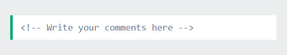

- [x] **Add comments (notifications and reminders)**
  - Place notes in the HTML: `<!-- This is a comment -->` and `<!-- Remember to add more information here -->`.
  - Only the paragraph is visible.
  - Sandbox: `code_sandbox/html-comments/index.html`.


- [x] **Hide content**
  - Comment out markup to hide it **temporarily**.
  - Everything between `<!--` and `-->` is hidden from display.
  - Useful for **debugging**: comment out lines one at a time to find errors.
  - Sandbox: `code_sandbox/html-comments/hide.html` (one paragraph commented out).


- [x] **Hide more than one line**
  - A whole block (paragraph + image) can sit inside one comment.
  - Sandbox: `code_sandbox/html-comments/hide-block.html`.

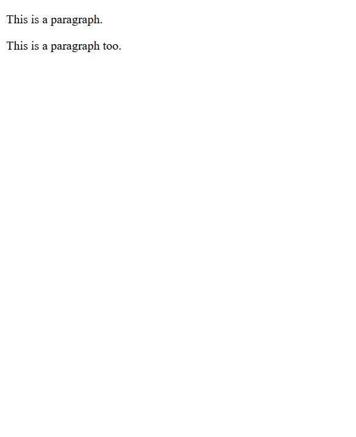

- [x] **Hide inline content**
  - Comments can hide a **part of a line**.
  - `This <!-- great text --> is a paragraph.` displays as “This is a paragraph.”
  - Sandbox: `code_sandbox/html-comments/inline.html`.


<details>
  <summary>Lab</summary>

## Lab

Run the comment examples: reminders around a paragraph, a hidden extra paragraph, a hidden image block, and an inline hidden phrase.

### **Overview**

- [ ] Serve `code_sandbox` and open each `html-comments` file.
- [ ] Success: one visible paragraph (comments hidden); two paragraphs with the middle one commented out; two paragraphs with the image block commented out; “This is a paragraph.” without “great text”.

### **Task 1: Serve and open**

- [ ] From `Personal/Files/html/code_sandbox`:

```bash
python -m http.server 8766 --bind 127.0.0.1
```

- [ ] `http://127.0.0.1:8766/html-comments/`
- [ ] `http://127.0.0.1:8766/html-comments/hide.html`
- [ ] `http://127.0.0.1:8766/html-comments/hide-block.html`
- [ ] `http://127.0.0.1:8766/html-comments/inline.html`


The comment examples match the chapter.

</details>

<details>
  <summary>Terminal Commands</summary>

## Terminal Commands

```bash
# from Personal/Files/html/code_sandbox
python -m http.server 8766 --bind 127.0.0.1
```

Then open `http://127.0.0.1:8766/html-comments/`.

</details>

<details>
  <summary>Code</summary>

## Code

Syntax:


```html
<!-- Write your comments here -->
```

Add comments (`index.html`):

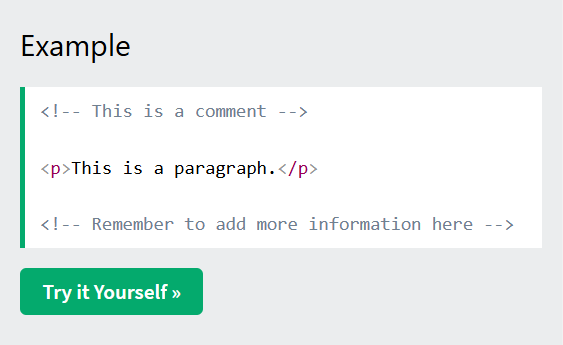

```html
<!-- This is a comment -->

<p>This is a paragraph.</p>

<!-- Remember to add more information here -->
```


Hide content (`hide.html`):

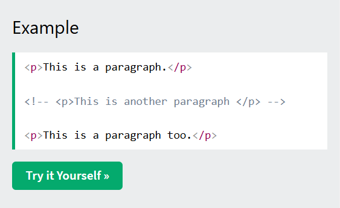

```html
<p>This is a paragraph.</p>

<!-- <p>This is another paragraph </p> -->

<p>This is a paragraph too.</p>
```


Hide a section (`hide-block.html`):

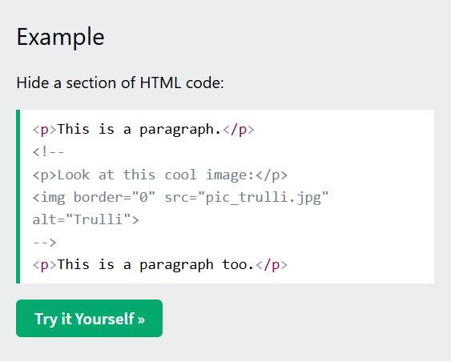

```html
<p>This is a paragraph.</p>
<!--
<p>Look at this cool image:</p>

-->
<p>This is a paragraph too.</p>
```


Hide inline (`inline.html`):

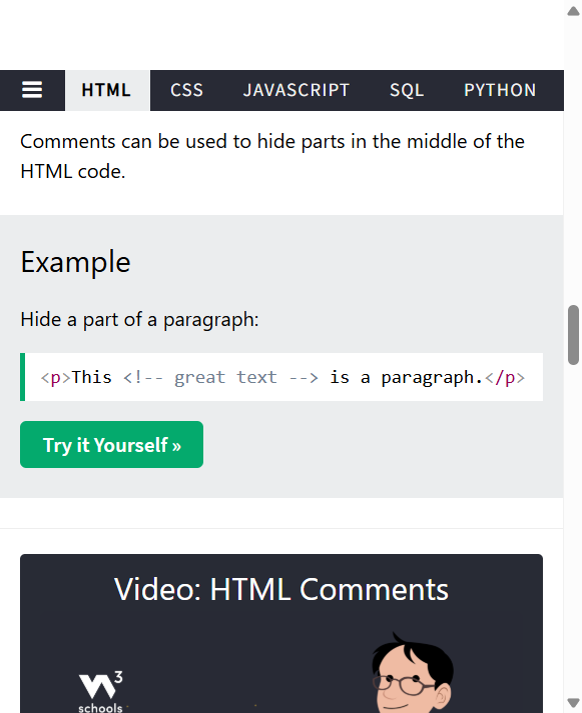

```html
<p>
  This
  <!-- great text -->
  is a paragraph.
</p>
```


</details>

<details>
  <summary>Questions and Answers</summary>

## Questions and Answers

### Question 1: Are HTML comments shown in the browser?

<details>
<summary>Answer</summary>

- [x] **No.** They are not displayed.
- [x] They can **document** the HTML source.

</details>

### Question 2: What is the comment syntax, and where is the `!`?

<details>
<summary>Answer</summary>

- [x] `<!-- Write your comments here -->`.
- [x] There is an **exclamation point** in the **start** tag, not the end tag.

</details>

### Question 3: Why add comments besides documentation?

<details>
<summary>Answer</summary>

- [x] **Notifications** and **reminders** in the source.
- [x] **Hide** content temporarily.
- [x] **Debug** by commenting out lines one at a time.

</details>

### Question 4: What is hidden when you wrap markup in `<!--` … `-->`?

<details>
<summary>Answer</summary>

- [x] **Everything** between the start and end of the comment.
- [x] That can be one tag, several lines, or part of a line.

</details>

### Question 5: What does `This <!-- great text --> is a paragraph.` display?

<details>
<summary>Answer</summary>

- [x] **This is a paragraph.**
- [x] The words **great text** are commented out.

</details>

### Question 6: Can you hide an image and a paragraph in one comment?

<details>
<summary>Answer</summary>

- [x] **Yes.** A multi-line comment can wrap several elements.
- [x] The chapter example comments out a paragraph and an ``.

</details>

</details>

## Summary

Comments use `<!-- … -->` (`!` only on the start tag). They do **not** display. Use them for notes, to **hide** markup (one line, a block, or part of a line), and to **debug** by commenting code out.

## References

- [HTML Comments (W3Schools)](https://www.w3schools.com/html/html_comments.asp)
- [Try it Yourself: tryhtml_comment](https://www.w3schools.com/html/tryit.asp?filename=tryhtml_comment)
- [Try it Yourself: tryhtml_comment_hide](https://www.w3schools.com/html/tryit.asp?filename=tryhtml_comment_hide)
- [Try it Yourself: tryhtml_comment_out](https://www.w3schools.com/html/tryit.asp?filename=tryhtml_comment_out)
- [Try it Yourself: tryhtml_comment_inline](https://www.w3schools.com/html/tryit.asp?filename=tryhtml_comment_inline)
- [MDN: Comments](https://developer.mozilla.org/en-US/docs/Web/HTML/Guides/Comments)
- [WHATWG: Comments](https://html.spec.whatwg.org/multipage/syntax.html#comments)

</details>
<details>
  <summary>HTML Colors</summary>

## Introduction

HTML colors are specified with **predefined color names**, or with **RGB**, **HEX**, **HSL**, **RGBA**, or **HSLA** values. This chapter shows named colors on backgrounds, then the same idea for **text** and **borders**, and finally the numeric color-value forms (including 50% transparency).

## Detailed Explanation

- [x] **Color names**
  - A color can be a **name** such as Tomato, Orange, DodgerBlue, MediumSeaGreen, Gray, SlateBlue, Violet, LightGray.
  - HTML supports **140 standard color names**.
  - Sandbox: `code_sandbox/html-colors/index.html`.

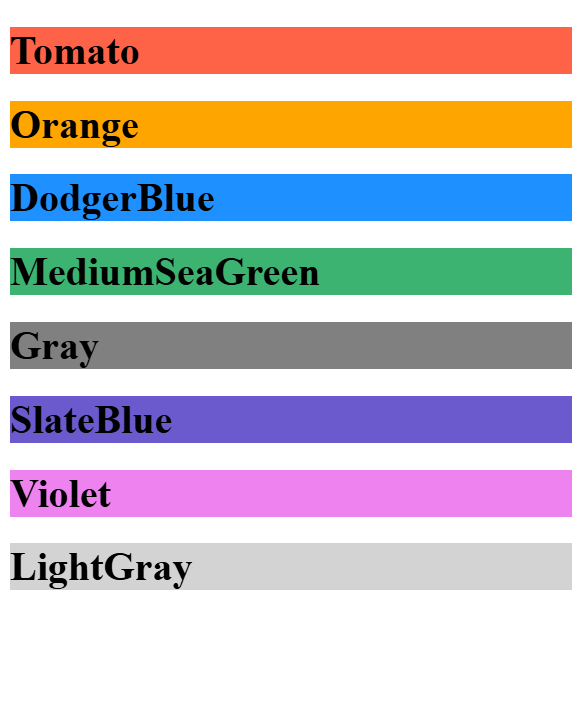

- [x] **Background color**
  - Set an element’s background with `style="background-color:…"` (DodgerBlue heading, Tomato paragraph).
  - Sandbox: `code_sandbox/html-colors/background.html`.

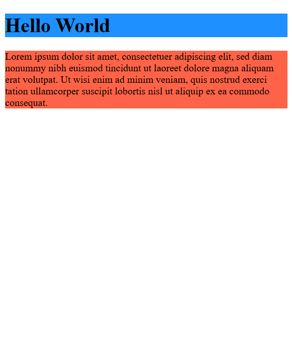

- [x] **Text color**
  - Set text with `style="color:…"` (Tomato heading, DodgerBlue and MediumSeaGreen paragraphs).
  - Sandbox: `code_sandbox/html-colors/text.html`.

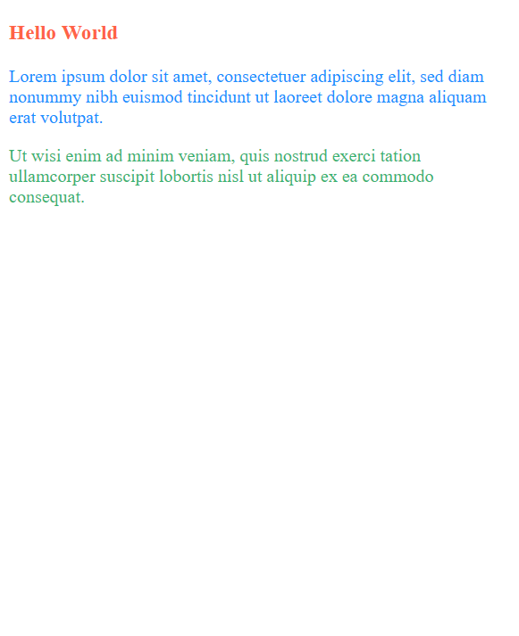

- [x] **Border color**
  - Set a border with `style="border:2px solid …"` (Tomato, DodgerBlue, Violet).
  - Sandbox: `code_sandbox/html-colors/border.html`.

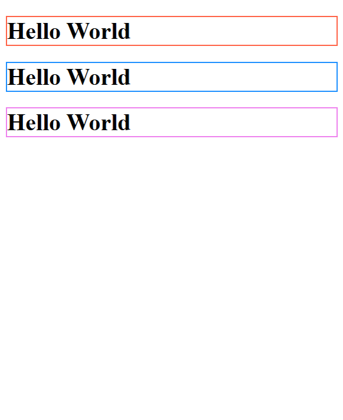

- [x] **Color values**
  - Besides names, use **RGB**, **HEX**, **HSL**, **RGBA**, and **HSLA**.
  - `rgb(255, 99, 71)`, `#ff6347`, and `hsl(9, 100%, 64%)` are the same as **Tomato**.
  - RGBA / HSLA add an **alpha** channel; `0.5` is **50% transparent**.
  - RGB, HEX, and HSL are covered in more depth on the following color pages.
  - Sandbox: `code_sandbox/html-colors/values.html`.

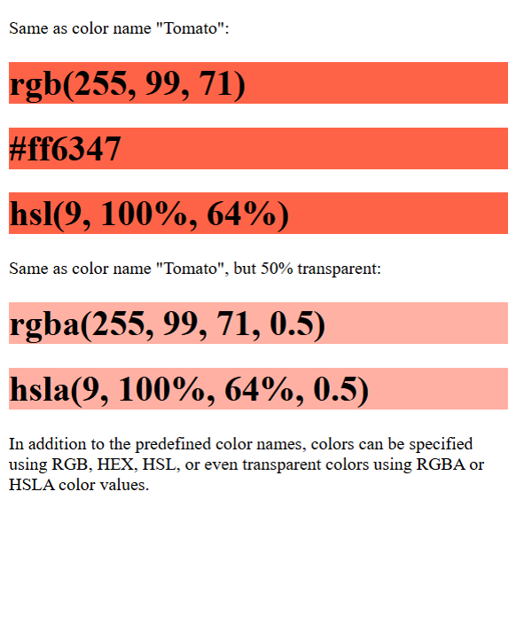

<details>
  <summary>Lab</summary>

## Lab

Run the color examples: named color bars, background and text colors, colored borders, and Tomato as RGB / HEX / HSL / RGBA / HSLA.

### **Overview**

- [ ] Serve `code_sandbox` and open each `html-colors` file.
- [ ] Success: eight named color headings; DodgerBlue heading + Tomato paragraph; Tomato / DodgerBlue / MediumSeaGreen text; three bordered Hello World headings; five Tomato-equivalent value bars (two semi-transparent).

### **Task 1: Serve and open**

- [ ] From `Personal/Files/html/code_sandbox`:

```bash
python -m http.server 8766 --bind 127.0.0.1
```

- [ ] `http://127.0.0.1:8766/html-colors/`
- [ ] `http://127.0.0.1:8766/html-colors/background.html`
- [ ] `http://127.0.0.1:8766/html-colors/text.html`
- [ ] `http://127.0.0.1:8766/html-colors/border.html`
- [ ] `http://127.0.0.1:8766/html-colors/values.html`


The color examples match the chapter.

</details>

<details>
  <summary>Terminal Commands</summary>

## Terminal Commands

```bash
# from Personal/Files/html/code_sandbox
python -m http.server 8766 --bind 127.0.0.1
```

Then open `http://127.0.0.1:8766/html-colors/`.

</details>

<details>
  <summary>Code</summary>

## Code

Color names (`index.html`):

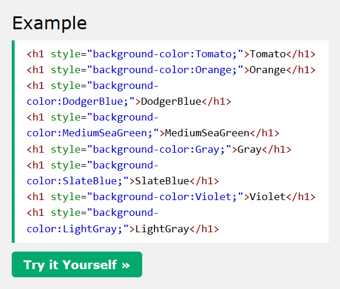

```html
<h1 style="background-color:Tomato;">Tomato</h1>
<h1 style="background-color:Orange;">Orange</h1>
<h1 style="background-color:DodgerBlue;">DodgerBlue</h1>
<h1 style="background-color:MediumSeaGreen;">MediumSeaGreen</h1>
<h1 style="background-color:Gray;">Gray</h1>
<h1 style="background-color:SlateBlue;">SlateBlue</h1>
<h1 style="background-color:Violet;">Violet</h1>
<h1 style="background-color:LightGray;">LightGray</h1>
```


Background color (`background.html`):

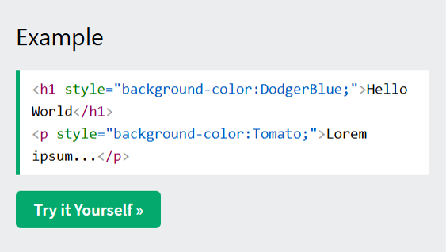

```html
<h1 style="background-color:DodgerBlue;">Hello World</h1>

<p style="background-color:Tomato;">
  Lorem ipsum dolor sit amet, consectetuer adipiscing elit, sed diam nonummy
  nibh euismod tincidunt ut laoreet dolore magna aliquam erat volutpat. Ut wisi
  enim ad minim veniam, quis nostrud exerci tation ullamcorper suscipit lobortis
  nisl ut aliquip ex ea commodo consequat.
</p>
```


Text color (`text.html`):

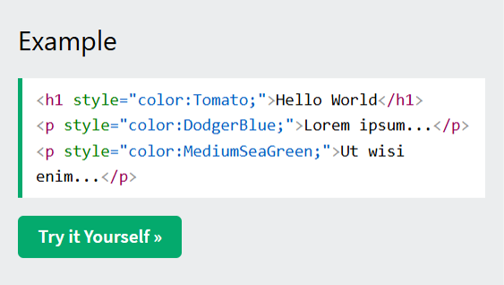

```html
<h3 style="color:Tomato;">Hello World</h3>

<p style="color:DodgerBlue;">
  Lorem ipsum dolor sit amet, consectetuer adipiscing elit, sed diam nonummy
  nibh euismod tincidunt ut laoreet dolore magna aliquam erat volutpat.
</p>

<p style="color:MediumSeaGreen;">
  Ut wisi enim ad minim veniam, quis nostrud exerci tation ullamcorper suscipit
  lobortis nisl ut aliquip ex ea commodo consequat.
</p>
```


Border color (`border.html`):

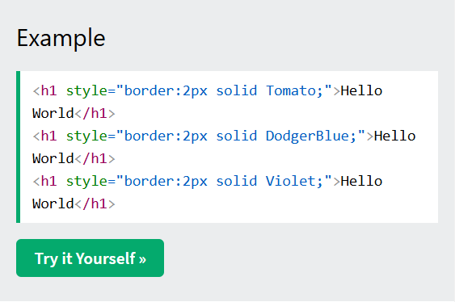

```html
<h1 style="border: 2px solid Tomato;">Hello World</h1>

<h1 style="border: 2px solid DodgerBlue;">Hello World</h1>

<h1 style="border: 2px solid Violet;">Hello World</h1>
```


Color values (`values.html`):

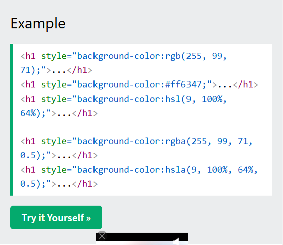

```html
<p>Same as color name "Tomato":</p>

<h1 style="background-color:rgb(255, 99, 71);">rgb(255, 99, 71)</h1>
<h1 style="background-color:#ff6347;">#ff6347</h1>
<h1 style="background-color:hsl(9, 100%, 64%);">hsl(9, 100%, 64%)</h1>

<p>Same as color name "Tomato", but 50% transparent:</p>
<h1 style="background-color:rgba(255, 99, 71, 0.5);">rgba(255, 99, 71, 0.5)</h1>
<h1 style="background-color:hsla(9, 100%, 64%, 0.5);">
  hsla(9, 100%, 64%, 0.5)
</h1>
```


</details>

<details>
  <summary>Questions and Answers</summary>

## Questions and Answers

### Question 1: How can you specify a color in HTML?

<details>
<summary>Answer</summary>

- [x] With a **predefined color name**.
- [x] Or with **RGB**, **HEX**, **HSL**, **RGBA**, or **HSLA** values.

</details>

### Question 2: How many standard color names does HTML support?

<details>
<summary>Answer</summary>

- [x] **140** standard color names.

</details>

### Question 3: Which CSS property sets an element’s background color?

<details>
<summary>Answer</summary>

- [x] `background-color` (for example `style="background-color:DodgerBlue;"`).

</details>

### Question 4: Which CSS property sets text color?

<details>
<summary>Answer</summary>

- [x] `color` (for example `style="color:Tomato;"`).

</details>

### Question 5: How does the chapter set a colored border?

<details>
<summary>Answer</summary>

- [x] `style="border:2px solid Tomato;"` (or DodgerBlue / Violet).

</details>

### Question 6: Name three value forms that match the color Tomato.

<details>
<summary>Answer</summary>

- [x] `rgb(255, 99, 71)`
- [x] `#ff6347`
- [x] `hsl(9, 100%, 64%)`

</details>

### Question 7: What do RGBA and HSLA add compared with RGB and HSL?

<details>
<summary>Answer</summary>

- [x] An **alpha** channel (transparency).
- [x] In the example, `0.5` is **50% transparent**.

</details>

### Question 8: Where does this chapter send you for more on RGB, HEX, and HSL?

<details>
<summary>Answer</summary>

- [x] The **next chapters** (RGB, HEX, HSL pages).

</details>

</details>

## Summary

Specify colors with **names** (140 standard names) or with **RGB / HEX / HSL / RGBA / HSLA**. Use `background-color` for backgrounds, `color` for text, and `border` for borders. `rgb(255, 99, 71)`, `#ff6347`, and `hsl(9, 100%, 64%)` equal Tomato; RGBA and HSLA add transparency.

## References

- [HTML Colors (W3Schools)](https://www.w3schools.com/html/html_colors.asp)
- [HTML Color Names](https://www.w3schools.com/colors/colors_names.asp)
- [Try it Yourself: tryhtml_color_names](https://www.w3schools.com/html/tryit.asp?filename=tryhtml_color_names)
- [Try it Yourself: tryhtml_color_background](https://www.w3schools.com/html/tryit.asp?filename=tryhtml_color_background)
- [Try it Yourself: tryhtml_color_text](https://www.w3schools.com/html/tryit.asp?filename=tryhtml_color_text)
- [Try it Yourself: tryhtml_color_border](https://www.w3schools.com/html/tryit.asp?filename=tryhtml_color_border)
- [Try it Yourself: tryhtml_color_values](https://www.w3schools.com/html/tryit.asp?filename=tryhtml_color_values)
- [HTML RGB](https://www.w3schools.com/html/html_colors_rgb.asp)
- [HTML HEX](https://www.w3schools.com/html/html_colors_hex.asp)
- [HTML HSL](https://www.w3schools.com/html/html_colors_hsl.asp)
- [MDN: color](https://developer.mozilla.org/en-US/docs/Web/CSS/color)
- [MDN: background-color](https://developer.mozilla.org/en-US/docs/Web/CSS/background-color)

</details>
<details>
  <summary>HTML CSS</summary>

## Introduction

**CSS** (Cascading Style Sheets) formats the layout of a webpage: color, font, size, spacing, position, backgrounds, and different displays for different devices. You can add CSS in **three** ways: **inline**, **internal**, and **external**. Cascading means a style on a parent also applies to children unless you override it.

## Detailed Explanation

- [x] **What is CSS?**
  - Cascading Style Sheets.
  - Saves work: one sheet can control **many** pages.
  - Formats layout: color, font, text size, spacing, positioning, backgrounds, responsive displays.
- [x] **Three ways to add CSS**
  - **Inline** — `style` attribute on one element.
  - **Internal** — `<style>` in the page `<head>`.
  - **External** — `<link rel="stylesheet" href="…">` to a `.css` file.
  - External files are the usual way for a site. This chapter uses inline and internal a lot because they are easier to try.
- [x] **Inline CSS**
  - Unique style on a **single** element.
  - Example: blue `<h1>`, red `<p>`.
  - Sandbox: `code_sandbox/html-css/index.html`.

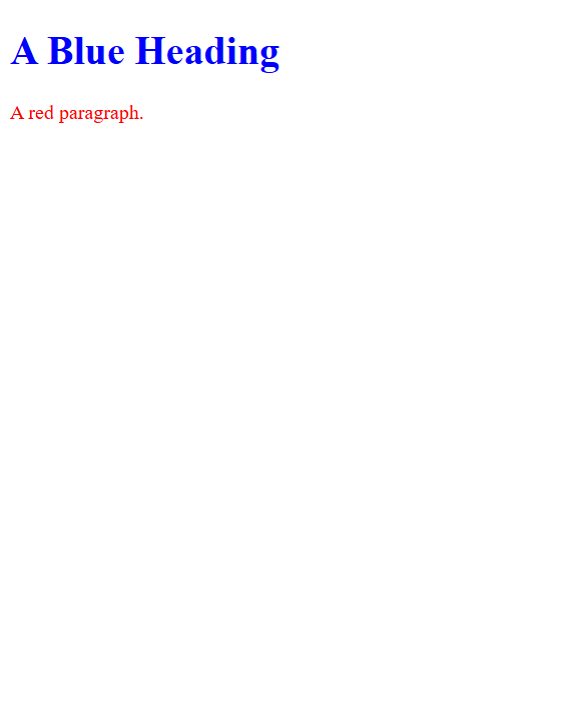

- [x] **Internal CSS**
  - Style for a **single page**, inside `<style>` in `<head>`.
  - Example: powderblue `body`, blue headings, red paragraphs (all `h1` / `p` on that page).
  - Sandbox: `code_sandbox/html-css/internal.html`.

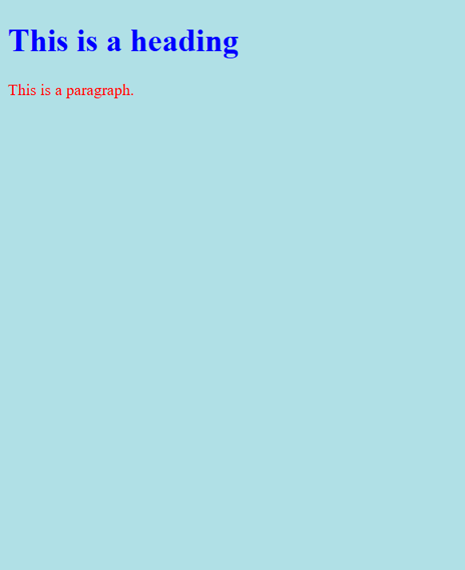

- [x] **External CSS**
  - One sheet for **many** pages.
  - Link it from each page’s `<head>`: `<link rel="stylesheet" href="styles.css">`.
  - The `.css` file is plain CSS only (no HTML).
  - Changing that one file can restyle a whole site.
  - Sandbox: `code_sandbox/html-css/external.html` + `styles.css` (looks the same as internal).


- [x] **CSS colors, fonts, and sizes**
  - `color` — text color.
  - `font-family` — font (verdana heading, courier paragraph).
  - `font-size` — size (`300%` / `160%` in the example).
  - Sandbox: `code_sandbox/html-css/fonts.html`.

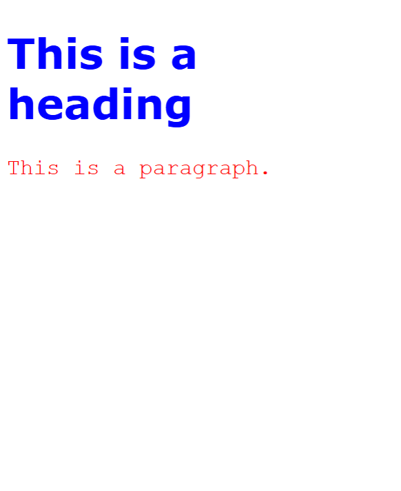

- [x] **Border, padding, and margin**
  - `border` — a border around an element (almost any element).
  - `padding` — space **inside** the border (text to border).
  - `margin` — space **outside** the border.
  - Sandbox: `border.html`, `padding.html`, `margin.html`.

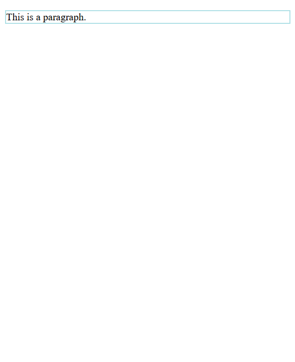

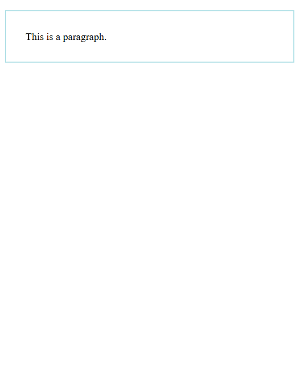

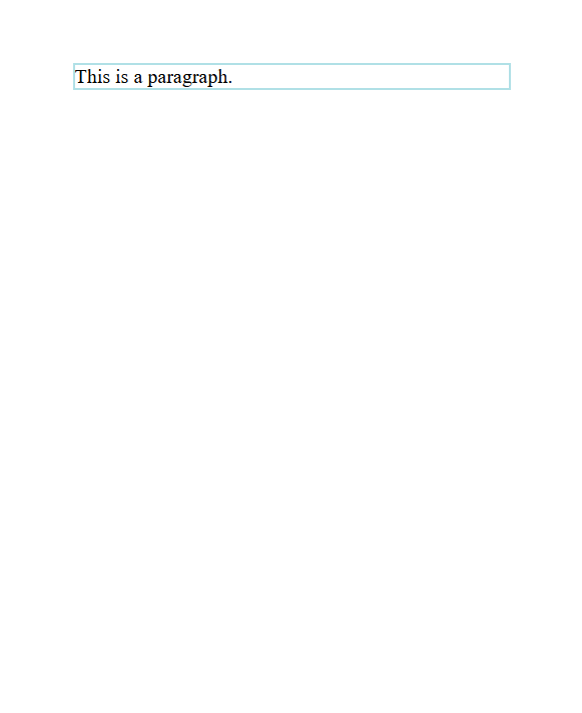

- [x] **Linking to an external sheet (paths)**
  - Full URL: `href="https://www.w3schools.com/html/styles.css"`.
  - Site path: `href="/html/styles.css"`.
  - Same folder: `href="styles.css"`.
  - File paths are covered later in **HTML File Paths**.
- [x] **Cascade tip**
  - A style on a parent applies to children. If `body` text is blue, headings and paragraphs inherit it unless you set something else.
- [x] **HTML style tags**

| Tag       | Description                                        |
| --------- | -------------------------------------------------- |
| `<style>` | Style information for an HTML document             |
| `<link>`  | A link between a document and an external resource |

<details>
  <summary>Lab</summary>

## Lab

Run inline, internal, and external CSS, then fonts, border, padding, and margin.

### **Overview**

- [ ] Serve `code_sandbox` and open each `html-css` file.
- [ ] Success: blue heading + red paragraph (inline); powderblue page with blue heading and red paragraph (internal and external); large verdana heading + larger courier paragraph; powderblue-bordered paragraph; extra inner space (padding); extra outer space (margin).

### **Task 1: Serve and open**

- [ ] From `Personal/Files/html/code_sandbox`:

```bash
python -m http.server 8766 --bind 127.0.0.1
```

- [ ] `http://127.0.0.1:8766/html-css/`
- [ ] `http://127.0.0.1:8766/html-css/internal.html`
- [ ] `http://127.0.0.1:8766/html-css/external.html`
- [ ] `http://127.0.0.1:8766/html-css/fonts.html`
- [ ] `http://127.0.0.1:8766/html-css/border.html`
- [ ] `http://127.0.0.1:8766/html-css/padding.html`
- [ ] `http://127.0.0.1:8766/html-css/margin.html`


The CSS examples match the chapter.

</details>

<details>
  <summary>Terminal Commands</summary>

## Terminal Commands

```bash
# from Personal/Files/html/code_sandbox
python -m http.server 8766 --bind 127.0.0.1
```

Then open `http://127.0.0.1:8766/html-css/`.

</details>

<details>
  <summary>Code</summary>

## Code

Inline (`index.html`):

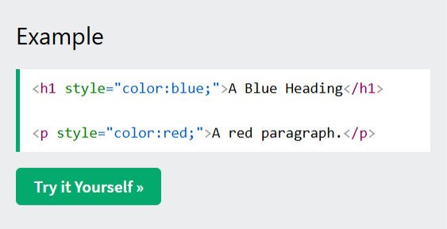

```html
<h1 style="color:blue;">A Blue Heading</h1>

<p style="color:red;">A red paragraph.</p>
```


Internal (`internal.html`):

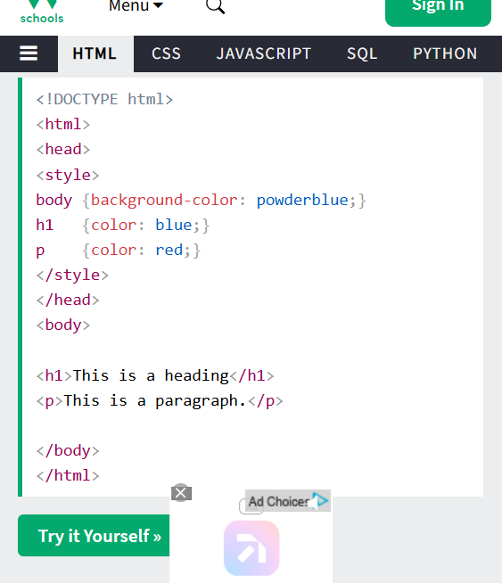

```html
<head>
  <style>
    body {
      background-color: powderblue;
    }
    h1 {
      color: blue;
    }
    p {
      color: red;
    }
  </style>
</head>
<body>
  <h1>This is a heading</h1>
  <p>This is a paragraph.</p>
</body>
```


External HTML (`external.html`):

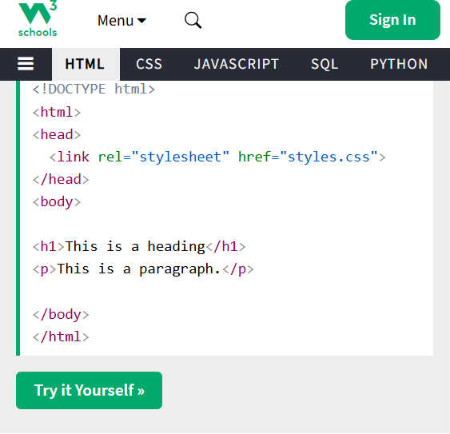

```html
<head>
  <link rel="stylesheet" href="styles.css" />
</head>
```

`styles.css`:

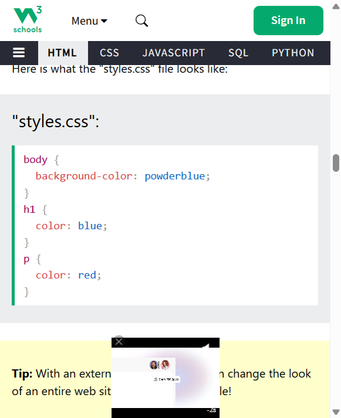

```css
body {
  background-color: powderblue;
}
h1 {
  color: blue;
}
p {
  color: red;
}
```


Fonts (`fonts.html`):

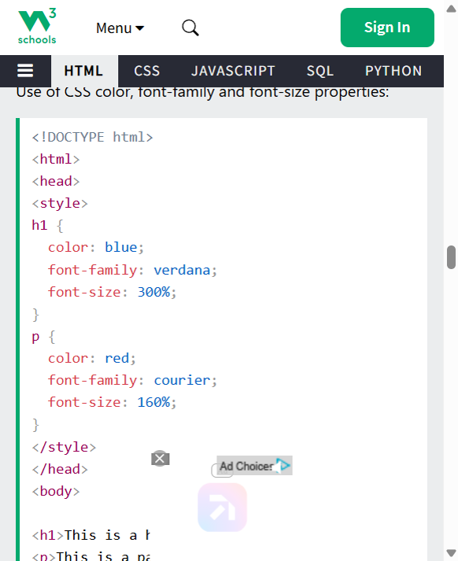

```css
h1 {
  color: blue;
  font-family: verdana;
  font-size: 300%;
}
p {
  color: red;
  font-family: courier;
  font-size: 160%;
}
```


Border (`border.html`):

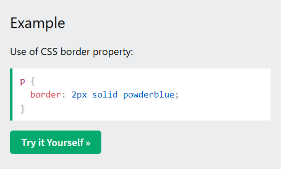

```css
p {
  border: 2px solid powderblue;
}
```


Padding (`padding.html`):

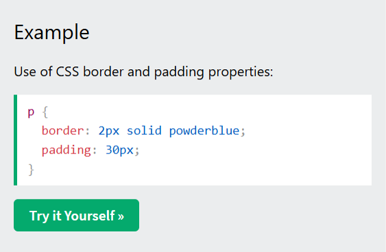

```css
p {
  border: 2px solid powderblue;
  padding: 30px;
}
```


Margin (`margin.html`):

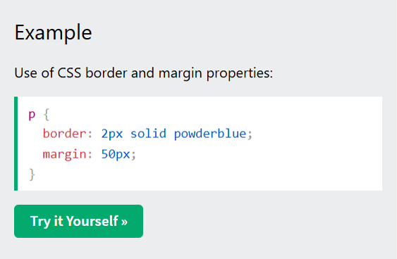

```css
p {
  border: 2px solid powderblue;
  margin: 50px;
}
```


</details>

<details>
  <summary>Questions and Answers</summary>

## Questions and Answers

### Question 1: What does CSS stand for, and what is it for?

<details>
<summary>Answer</summary>

- [x] **Cascading Style Sheets**.
- [x] It formats the **layout** of a webpage (color, font, size, spacing, position, backgrounds, devices).

</details>

### Question 2: What are the three ways to add CSS to HTML?

<details>
<summary>Answer</summary>

- [x] **Inline** — `style` attribute.
- [x] **Internal** — `<style>` in `<head>`.
- [x] **External** — `<link>` to a `.css` file.

</details>

### Question 3: What does “cascading” mean here?

<details>
<summary>Answer</summary>

- [x] A style on a **parent** also applies to **children**.
- [x] You can still override it on a child.

</details>

### Question 4: When do you use inline CSS?

<details>
<summary>Answer</summary>

- [x] For a **unique** style on a **single** HTML element.
- [x] It uses the **`style`** attribute.

</details>

### Question 5: Where does internal CSS go?

<details>
<summary>Answer</summary>

- [x] In the **`<head>`**, inside a **`<style>`** element.
- [x] It styles **that page** (for example all `h1` and `p` elements).

</details>

### Question 6: How do you attach an external style sheet?

<details>
<summary>Answer</summary>

- [x] `<link rel="stylesheet" href="styles.css">` in `<head>`.
- [x] The file must be **CSS only** and end with **`.css`**.
- [x] One file can change the look of a **whole site**.

</details>

### Question 7: Which properties set text color, font, and size?

<details>
<summary>Answer</summary>

- [x] `color`
- [x] `font-family`
- [x] `font-size`

</details>

### Question 8: What is the difference between padding and margin?

<details>
<summary>Answer</summary>

- [x] **Padding** is space **inside** the border (text to border).
- [x] **Margin** is space **outside** the border.

</details>

### Question 9: Which tags belong in `<head>` for CSS?

<details>
<summary>Answer</summary>

- [x] `<style>` for internal CSS.
- [x] `<link>` for an external sheet.

</details>

### Question 10: How can you point `href` at an external sheet?

<details>
<summary>Answer</summary>

- [x] A **full URL**.
- [x] A **path** on the site (for example `/html/styles.css`).
- [x] A **same-folder** filename (`styles.css`).

</details>

</details>

## Summary

Add CSS inline (`style`), internally (`<style>` in `<head>`), or externally (`<link>` to a `.css` file). External sheets scale to a whole site. Use `color`, `font-family`, and `font-size` for text; `border`, `padding` (inside), and `margin` (outside) for boxes. Styles cascade from parent to child unless overridden.

## References

- [HTML Styles CSS (W3Schools)](https://www.w3schools.com/html/html_css.asp)
- [Try it Yourself: tryhtml_css_inline](https://www.w3schools.com/html/tryit.asp?filename=tryhtml_css_inline)
- [Try it Yourself: tryhtml_css_internal](https://www.w3schools.com/html/tryit.asp?filename=tryhtml_css_internal)
- [Try it Yourself: tryhtml_css_external](https://www.w3schools.com/html/tryit.asp?filename=tryhtml_css_external)
- [Try it Yourself: tryhtml_css_fonts](https://www.w3schools.com/html/tryit.asp?filename=tryhtml_css_fonts)
- [Try it Yourself: tryhtml_css_borders](https://www.w3schools.com/html/tryit.asp?filename=tryhtml_css_borders)
- [Try it Yourself: tryhtml_css_padding](https://www.w3schools.com/html/tryit.asp?filename=tryhtml_css_padding)
- [Try it Yourself: tryhtml_css_margin](https://www.w3schools.com/html/tryit.asp?filename=tryhtml_css_margin)
- [Try it Yourself: tryhtml_css_external_url](https://www.w3schools.com/html/tryit.asp?filename=tryhtml_css_external_url)
- [CSS Tutorial (W3Schools)](https://www.w3schools.com/css/default.asp)
- [MDN: Getting started with CSS](https://developer.mozilla.org/en-US/docs/Learn_web_development/Core/Styling_basics/Getting_started)
- [MDN: `<style>`](https://developer.mozilla.org/en-US/docs/Web/HTML/Element/style)
- [MDN: `<link>`](https://developer.mozilla.org/en-US/docs/Web/HTML/Element/link)

</details>
<details>
  <summary>HTML Links</summary>

## Introduction

HTML links are **hyperlinks**. Click one to jump to another document. The mouse pointer becomes a **hand** over a link. A link can be **text**, an **image**, or another element. The `<a>` tag defines a hyperlink; **`href`** is the destination.

## Detailed Explanation

- [x] **Syntax**
  - `<a href="url">link text</a>`
  - The **link text** is what the reader sees; clicking it goes to the URL.

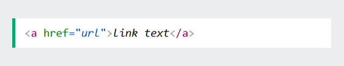

- [x] **Default look**
  - Unvisited: underlined **blue**.
  - Visited: underlined **purple**.
  - Active: underlined **red**.
  - You can restyle links with CSS.
- [x] **A basic link**
  - Example: Visit W3Schools.com.
  - Sandbox: `code_sandbox/html-links/index.html`.


- [x] **The `target` attribute**
  - Where to open the document.
  - `_self` — same window/tab (default).
  - `_blank` — new window or tab.
  - `_parent` — parent frame.
  - `_top` — full window.
  - Sandbox: `code_sandbox/html-links/target.html`.


- [x] **Absolute vs relative URLs**
  - **Absolute** — full address (`https://www.w3.org/`, Google).
  - **Relative** — a page on the same site (no `https://www` part).
  - The chapter uses `html_images.asp` and `/css/default.asp`. The sandbox uses local `images.html` and `css.html` so the relative links run offline.
  - Sandbox: `code_sandbox/html-links/urls.html`.

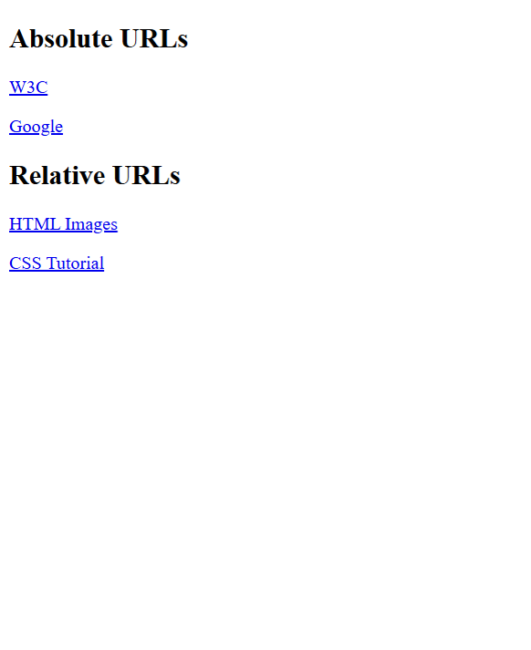

- [x] **Image as a link**
  - Put `` inside `<a>`.
  - The page uses `smiley.gif` and `href="default.asp"`. The sandbox uses `smiley.png` and `href="index.html"` (the gif URL was blocked; the image is a local 42×42 smiley).
  - Sandbox: `code_sandbox/html-links/image.html`.


- [x] **Email link**
  - `href="mailto:someone@example.com"` opens the user’s mail program.
  - Sandbox: `code_sandbox/html-links/email.html`.


- [x] **Button as a link**
  - A `<button>` needs **JavaScript** for the click (`onclick` + `document.location`).
  - The page uses `default.asp`; the sandbox uses `index.html`.
  - Sandbox: `code_sandbox/html-links/button.html`.


- [x] **Link titles**
  - The `title` attribute is extra info, usually a **tooltip** on hover.
  - Sandbox: `code_sandbox/html-links/title.html`.

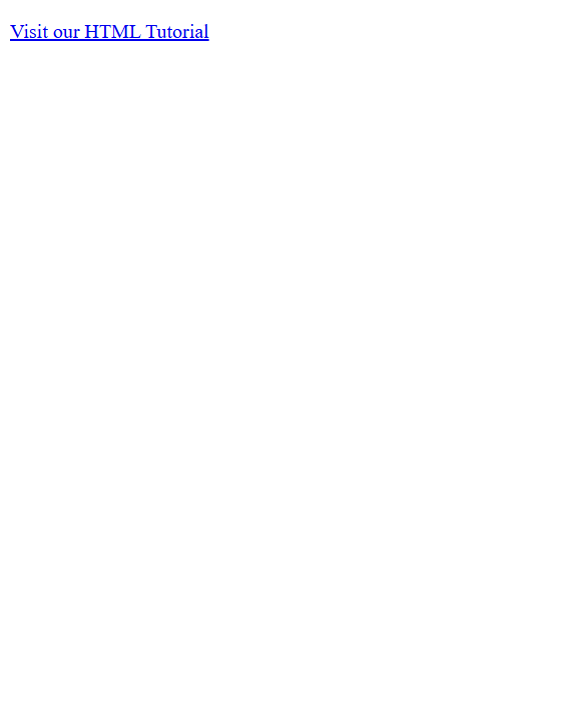

- [x] **More path forms**
  - Full URL, site path (`/html/default.asp`), or same-folder file (`default.asp`).
  - File paths are covered in **HTML File Paths**. Link **colors** and **bookmarks** are the next sidebar pages.

| Tag   | Description         |
| ----- | ------------------- |
| `<a>` | Defines a hyperlink |

<details>
  <summary>Lab</summary>

## Lab

Run the link examples: a W3Schools link, `_blank`, absolute vs relative URLs, an image link, mailto, a button, and a titled tooltip link.

### **Overview**

- [ ] Serve `code_sandbox` and open each `html-links` file.
- [ ] Success: blue underlined Visit W3Schools.com; Visit W3Schools! opens a new tab; W3C/Google plus local Images/CSS links; yellow smiley is a link; Send email; HTML Tutorial button; Visit our HTML Tutorial (tooltip on hover).

### **Task 1: Serve and open**

- [ ] From `Personal/Files/html/code_sandbox`:

```bash
python -m http.server 8766 --bind 127.0.0.1
```

- [ ] `http://127.0.0.1:8766/html-links/`
- [ ] `http://127.0.0.1:8766/html-links/target.html`
- [ ] `http://127.0.0.1:8766/html-links/urls.html`
- [ ] `http://127.0.0.1:8766/html-links/image.html`
- [ ] `http://127.0.0.1:8766/html-links/email.html`
- [ ] `http://127.0.0.1:8766/html-links/button.html`
- [ ] `http://127.0.0.1:8766/html-links/title.html`


The link examples match the chapter.

</details>

<details>
  <summary>Terminal Commands</summary>

## Terminal Commands

```bash
# from Personal/Files/html/code_sandbox
python -m http.server 8766 --bind 127.0.0.1
```

Then open `http://127.0.0.1:8766/html-links/`.

</details>

<details>
  <summary>Code</summary>

## Code

Syntax:


```html
<a href="url">link text</a>
```

Basic link (`index.html`):

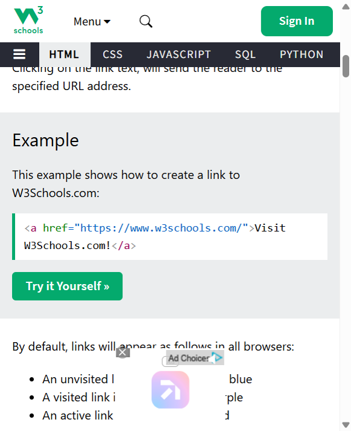

```html
<a href="https://www.w3schools.com/">Visit W3Schools.com!</a>
```


Target (`target.html`):

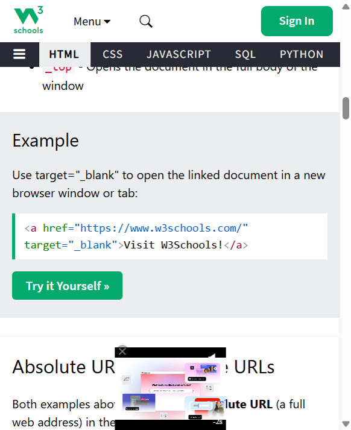

```html
<a href="https://www.w3schools.com/" target="_blank">Visit W3Schools!</a>
```


Absolute vs relative (`urls.html`):

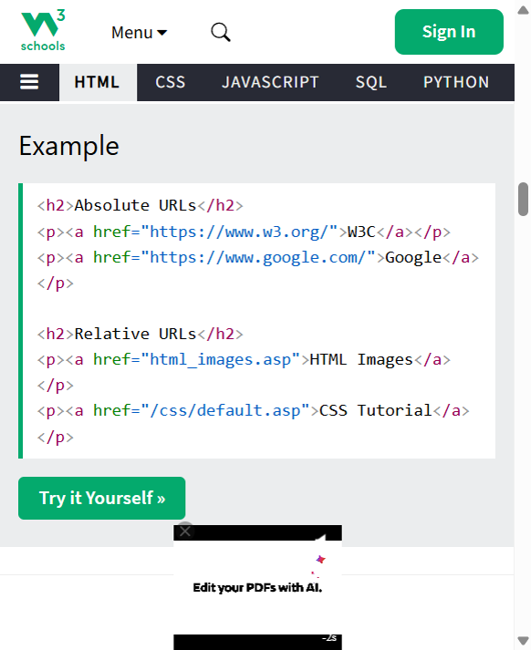

```html
<h2>Absolute URLs</h2>
<p><a href="https://www.w3.org/">W3C</a></p>
<p><a href="https://www.google.com/">Google</a></p>

<h2>Relative URLs</h2>
<p><a href="images.html">HTML Images</a></p>
<p><a href="css.html">CSS Tutorial</a></p>
```


Image as a link (`image.html`):

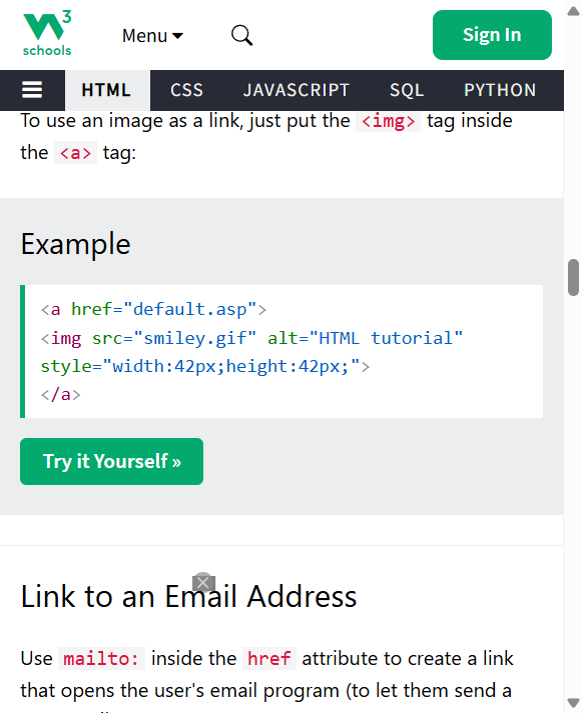

```html
<a href="index.html">
  
</a>
```


Email (`email.html`):

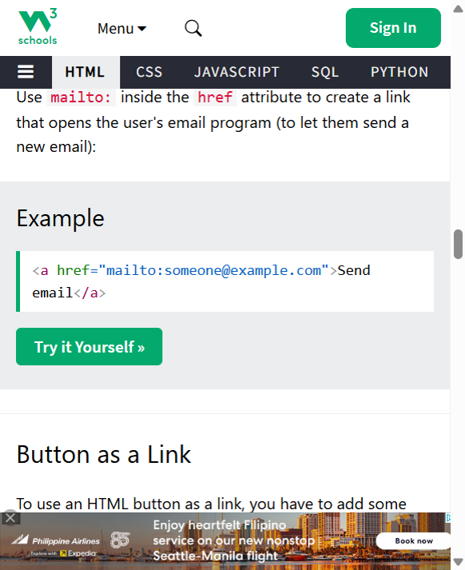

```html
<a href="mailto:someone@example.com">Send email</a>
```


Button (`button.html`):

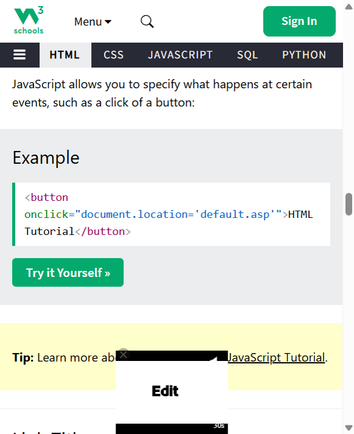

```html
<button onclick="document.location='index.html'">HTML Tutorial</button>
```


Title (`title.html`):

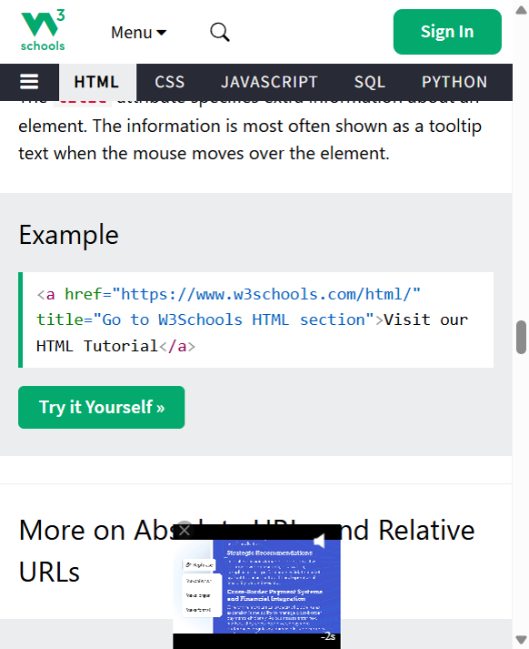

```html
<a href="https://www.w3schools.com/html/" title="Go to W3Schools HTML section"
  >Visit our HTML Tutorial</a
>
```


</details>

<details>
  <summary>Questions and Answers</summary>

## Questions and Answers

### Question 1: Which tag defines a hyperlink, and which attribute is the destination?

<details>
<summary>Answer</summary>

- [x] The **`<a>`** tag.
- [x] The **`href`** attribute.

</details>

### Question 2: How do unvisited, visited, and active links look by default?

<details>
<summary>Answer</summary>

- [x] Unvisited: underlined **blue**.
- [x] Visited: underlined **purple**.
- [x] Active: underlined **red**.

</details>

### Question 3: What does `target="_blank"` do?

<details>
<summary>Answer</summary>

- [x] Opens the document in a **new** window or tab.
- [x] `_self` is the default (same window/tab).

</details>

### Question 4: What is the difference between an absolute URL and a relative URL?

<details>
<summary>Answer</summary>

- [x] **Absolute** is a full web address (`https://…`).
- [x] **Relative** is a page on the **same site** (no `https://www` part).

</details>

### Question 5: How do you make an image a link?

<details>
<summary>Answer</summary>

- [x] Put the **``** tag **inside** the **`<a>`** tag.

</details>

### Question 6: How do you create an email link?

<details>
<summary>Answer</summary>

- [x] Use **`mailto:`** in `href` (for example `mailto:someone@example.com`).

</details>

### Question 7: How do you make a button act as a link?

<details>
<summary>Answer</summary>

- [x] Add **JavaScript** on the click (`onclick` and `document.location`).
- [x] A button is **not** a link by itself.

</details>

### Question 8: What does the `title` attribute show on a link?

<details>
<summary>Answer</summary>

- [x] Extra information, usually as a **tooltip** when the mouse is over the element.

</details>

</details>

## Summary

Use `<a href="…">` for hyperlinks. `target` chooses the window (`_blank` for a new tab). Absolute URLs are full addresses; relative URLs stay on the site. Wrap `` in `<a>` for an image link, use `mailto:` for email, JavaScript for a button, and `title` for a tooltip.

## References

- [HTML Links Hyperlinks (W3Schools)](https://www.w3schools.com/html/html_links.asp)
- [Try it Yourself: tryhtml_links_w3schools](https://www.w3schools.com/html/tryit.asp?filename=tryhtml_links_w3schools)
- [Try it Yourself: tryhtml_links_target](https://www.w3schools.com/html/tryit.asp?filename=tryhtml_links_target)
- [Try it Yourself: tryhtml_links](https://www.w3schools.com/html/tryit.asp?filename=tryhtml_links)
- [Try it Yourself: tryhtml_links_image](https://www.w3schools.com/html/tryit.asp?filename=tryhtml_links_image)
- [Try it Yourself: tryhtml_links_email](https://www.w3schools.com/html/tryit.asp?filename=tryhtml_links_email)
- [Try it Yourself: tryhtml_links_button_element](https://www.w3schools.com/html/tryit.asp?filename=tryhtml_links_button_element)
- [Try it Yourself: tryhtml_links_title](https://www.w3schools.com/html/tryit.asp?filename=tryhtml_links_title)
- [HTML Link Colors](https://www.w3schools.com/html/html_links_colors.asp)
- [HTML Link Bookmarks](https://www.w3schools.com/html/html_links_bookmarks.asp)
- [MDN: `<a>`](https://developer.mozilla.org/en-US/docs/Web/HTML/Element/a)

</details>
<details>
  <summary>HTML Images</summary>

## Introduction

Images improve how a page looks. The empty `` tag **links** an image into the page (it is a holding space, not “inserted” bytes). Required attributes: **`src`** (path) and **`alt`** (alternate text). Nested sidebar pages cover **image maps**, **background images**, and **`<picture>`**.

## Detailed Explanation

- [x] **Syntax**
  - ``
  - No end tag. Only attributes.

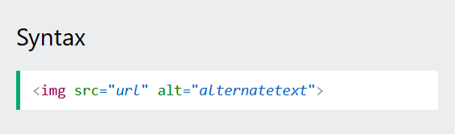

- [x] **`src`**
  - Path (URL) to the image.
  - The **browser** fetches it when the page loads, so the file must stay where `src` points.
  - If it cannot find the image: broken-link icon + **alt** text.
  - Examples on the page: `pic_trulli.jpg`, `img_girl.jpg`, `img_chania.jpg`.
  - Sandbox: `code_sandbox/html-images/index.html` (Trulli).


- [x] **`alt`**
  - Required. Shown if the image cannot be viewed (slow connection, bad `src`, or a **screen reader**).
  - The value should **describe** the image.
  - Wrong filename example: `wrongname.gif` with `alt="Flowers in Chania"`.
  - Sandbox: `code_sandbox/html-images/wrong.html`.

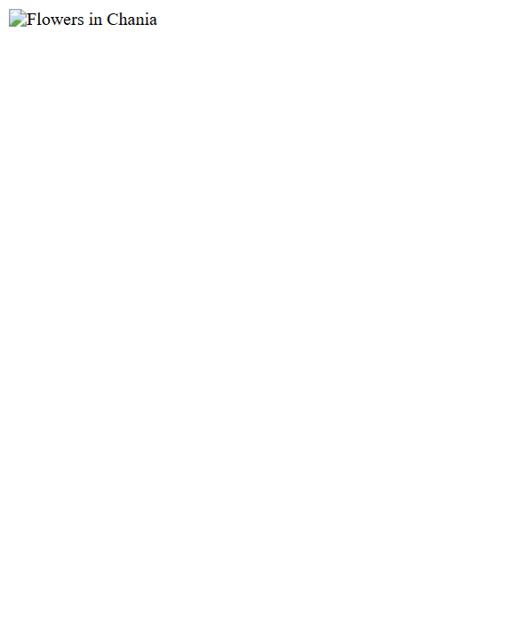

- [x] **Width and height**
  - Prefer `style="width:…;height:…"` (pixels).
  - Or `width` and `height` attributes (always pixels).
  - Always set size so the page does not **flicker** while the image loads.
  - Prefer **style** so a stylesheet cannot override the size (`width: 100%` in a sheet would stretch the `width`/`height` attributes, not the style).
  - Sandbox: `size.html` (style 500×600), `attributes.html` (width/height attributes), `style.html` (html5.gif).


- [x] **Other folders and other servers**
  - Sub-folder: include the folder in `src` (`images/html5.gif` in the sandbox; the page shows `/images/html5.gif`).
  - Another server: **absolute URL**. External images may be copyrighted, and you cannot control if they disappear.
  - Sandbox: `folder.html`, `external.html`.
- [x] **Animated GIFs**
  - HTML allows animated GIFs (`programming.gif`).
  - Sandbox: `animated.html`.
- [x] **Image as a link**
  - Put `` inside `<a>` (same idea as the Links chapter).
  - Sandbox: `link.html`.
- [x] **Image floating**
  - CSS `float:right` / `float:left` beside text.
  - Sandbox: `float.html`.

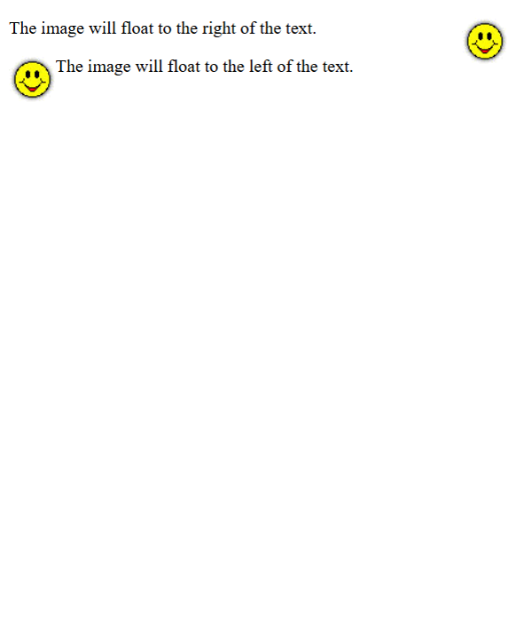

- [x] **Common formats** (all major browsers): APNG, GIF, ICO, JPEG, PNG, SVG.
- [x] **Caution:** large images slow the page. Use them carefully.

| Tag         | Description                            |
| ----------- | -------------------------------------- |
| ``     | Defines an image                       |
| `<map>`     | Defines an image map                   |
| `<area>`    | Clickable area inside an image map     |
| `<picture>` | Container for multiple image resources |

<details>
  <summary>Lab</summary>

## Lab

Run the image examples: Trulli photo, broken `src` with alt text, sized girl photo, and floated smileys.

### **Overview**

- [ ] Serve `code_sandbox` and open the `html-images` files.
- [ ] Success: Trulli photo; broken icon + “Flowers in Chania”; large girl-in-jacket photo; smileys floated right then left of the sentences.

### **Task 1: Serve and open**

- [ ] From `Personal/Files/html/code_sandbox`:

```bash
python -m http.server 8766 --bind 127.0.0.1
```

- [ ] `http://127.0.0.1:8766/html-images/`
- [ ] `http://127.0.0.1:8766/html-images/wrong.html`
- [ ] `http://127.0.0.1:8766/html-images/size.html`
- [ ] `http://127.0.0.1:8766/html-images/float.html`
- [ ] Also: `girl.html`, `chania.html`, `style.html`, `folder.html`, `external.html`, `animated.html`, `link.html`.


The image examples match the chapter.

</details>

<details>
  <summary>Terminal Commands</summary>

## Terminal Commands

```bash
# from Personal/Files/html/code_sandbox
python -m http.server 8766 --bind 127.0.0.1
```

Then open `http://127.0.0.1:8766/html-images/`.

</details>

<details>
  <summary>Code</summary>

## Code

Syntax:


```html

```

Trulli (`index.html`):

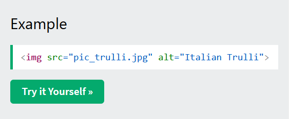

```html

```


Broken `src` / alt (`wrong.html`):

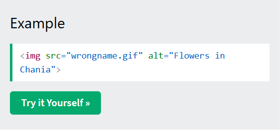

```html

```


Size (`size.html`):

```html

```


Float (`float.html`):

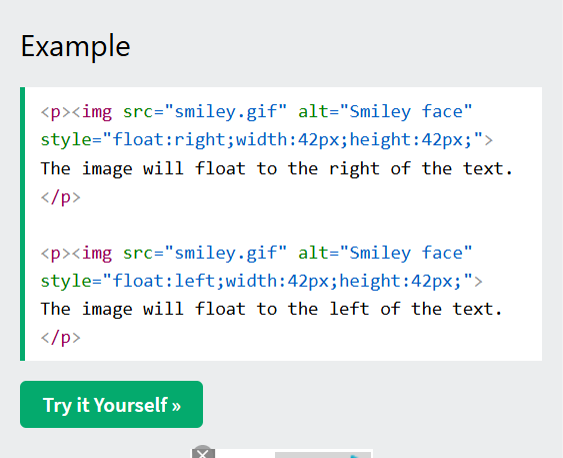

```html
<p>
  
  The image will float to the right of the text.
</p>

<p>
  
  The image will float to the left of the text.
</p>
```


</details>

<details>
  <summary>Questions and Answers</summary>

## Questions and Answers

### Question 1: Is `` empty, and which two attributes are required?

<details>
<summary>Answer</summary>

- [x] **Yes.** It has **no** end tag.
- [x] **`src`** (path) and **`alt`** (alternate text).

</details>

### Question 2: What happens if the browser cannot find the image?

<details>
<summary>Answer</summary>

- [x] It shows a **broken-link** icon and the **alt** text.

</details>

### Question 3: Why set width and height, and why prefer `style`?

<details>
<summary>Answer</summary>

- [x] So the page does not **flicker** while the image loads.
- [x] **`style`** keeps a stylesheet from changing the size.

</details>

### Question 4: How do you load an image from a sub-folder or another server?

<details>
<summary>Answer</summary>

- [x] Sub-folder: include the **folder name** in `src`.
- [x] Other server: an **absolute URL**. Watch copyright and that the file can vanish.

</details>

### Question 5: How do you make an image a link, or float it beside text?

<details>
<summary>Answer</summary>

- [x] Put `` **inside** `<a>`.
- [x] Use CSS **`float:left`** or **`float:right`**.

</details>

### Question 6: Name common image formats all major browsers support.

<details>
<summary>Answer</summary>

- [x] APNG, GIF, ICO, JPEG, PNG, SVG.

</details>

</details>

## Summary

`` embeds an image (empty tag). Always set **alt** and a size (`style` preferred). Sub-folders and absolute URLs work for `src`. GIFs can animate. Wrap `` in `<a>` for a link; use `float` to sit beside text. Large images slow the page.

## References

- [HTML Images (W3Schools)](https://www.w3schools.com/html/html_images.asp)
- [Try it Yourself: tryhtml_images_trulli](https://www.w3schools.com/html/tryit.asp?filename=tryhtml_images_trulli)
- [Try it Yourself: tryhtml_images_wrongname](https://www.w3schools.com/html/tryit.asp?filename=tryhtml_images_wrongname)
- [Try it Yourself: tryhtml_images_size](https://www.w3schools.com/html/tryit.asp?filename=tryhtml_images_size)
- [Try it Yourself: tryhtml_images_float](https://www.w3schools.com/html/tryit.asp?filename=tryhtml_images_float)
- [HTML Image Map](https://www.w3schools.com/html/html_images_imagemap.asp)
- [HTML Background Images](https://www.w3schools.com/html/html_images_background.asp)
- [The Picture Element](https://www.w3schools.com/html/html_images_picture.asp)
- [MDN: ``](https://developer.mozilla.org/en-US/docs/Web/HTML/Element/img)

</details>
<details>
  <summary>HTML Project</summary>

## Introduction

**HTML Project: Personal Page** is a guided, in-browser project (not a static example page). You build a **personal bio** with formatted text, a list, an image, and links, one step at a time in W3Schools’ editor. Difficulty: Easy. Reward: **+70 XP**.

## Detailed Explanation

- [x] **What you build**
  - Your first real HTML page: a personal bio.
  - Skills: **text formatting**, **`<ul>` / `<li>`**, **`<a>`**, **``**.
- [x] **How it works**
  - Follow steps on the left (each stepper dot is one chunk). Read instructions, the “What to do” checklist, and hints.
  - Write code on the right. Files auto-save. Use **Preview** to see the page.
  - Click **Check code** to grade that step against the rubric.
  - Pass a step to move on. Pass **every** step to finish and earn the XP.
- [x] **How it’s graded**
  - The project is **5 steps**, each with its own pass criterion.
  - Example criteria: the page has **exactly one `<h1>`**; the page has **at least one intro paragraph**.
  - Click **Check code** on every step.
- [x] **Start Building Now**
  - Opens an **embedded editor** in a new tab. No installs.
  - File: `index.html`.
  - There is no local sandbox copy of the interactive grader.

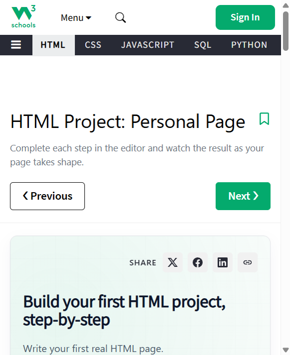

<details>
  <summary>Lab</summary>

## Lab

Complete the W3Schools **Personal Page** project in their editor.

### **Overview**

- [ ] Open the project page and start the embedded editor.
- [ ] Success: all 5 steps pass Check code (one `<h1>`, intro paragraph, list, image, links) and you earn +70 XP.

### **Task 1: Run the official project**

- [ ] Open `https://www.w3schools.com/html/html_project_bio.php`.
- [ ] Click **Start Building Now**.
- [ ] Complete each of the **5 steps**. Click **Check code** on every step.

No local sandbox folder: this chapter is the interactive editor, not a static example.

</details>

<details>
  <summary>Terminal Commands</summary>

## Terminal Commands

No local server for this chapter. The project runs in the W3Schools editor.

```text
# No local commands. Use Start Building Now on the project page.
```

</details>

<details>
  <summary>Code</summary>

## Code

No tested sandbox files. The runnable example is the site’s editor. Skills to use:

```html
<h1>Your name</h1>
<p>Intro paragraph.</p>
<ul>
  <li>List item</li>
</ul>

<a href="https://example.com">A link</a>
```


</details>

<details>
  <summary>Questions and Answers</summary>

## Questions and Answers

### Question 1: What do you build in this project?

<details>
<summary>Answer</summary>

- [x] A **personal bio** page.
- [x] With formatted text, a **list**, an **image**, and **links**.

</details>

### Question 2: How many steps are there, and what is the XP?

<details>
<summary>Answer</summary>

- [x] **5** steps.
- [x] **+70 XP** if you pass them all.

</details>

### Question 3: How do you check a step?

<details>
<summary>Answer</summary>

- [x] Click **Check code**.
- [x] The site grades that step’s rubric.

</details>

### Question 4: Give two example pass criteria from the page.

<details>
<summary>Answer</summary>

- [x] The page has **exactly one `<h1>`**.
- [x] The page has **at least one intro paragraph**.

</details>

### Question 5: Which HTML features does the bio page use?

<details>
<summary>Answer</summary>

- [x] Formatted **text**, a **list**, an **image**, and **links**.

</details>

</details>

## Summary

This sidebar item is a **5-step** interactive project: build a personal bio using formatting, lists, images, and links in the W3Schools editor. Check each step; pass all five for +70 XP. There is no local sandbox example.

## References

- [HTML Project: Personal Page (W3Schools)](https://www.w3schools.com/html/html_project_bio.php)

</details>
<details>
  <summary>HTML Favicon</summary>

## Introduction

A **favicon** is a small image next to the page title in the **browser tab**. Add it with `<link rel="icon">` in `<head>` after `<title>`. Keep the image **simple** and **high contrast**. A common filename is `favicon.ico`.

## Detailed Explanation

- [x] **Where it shows**
  - Left of the page title in the tab.
- [x] **How to add it**
  - Save the image in the site root, or in an `images` folder.
  - In `index.html`, after `<title>`: `<link rel="icon" type="image/x-icon" href="/images/favicon.ico">`.
  - Reload; the tab should show the icon.
  - You can make a favicon on sites like favicon.cc.
  - The sandbox uses a local `favicon.ico` and `href="favicon.ico"`.
  - Sandbox: `code_sandbox/html-favicon/index.html`. Tab title: **My Page Title**.

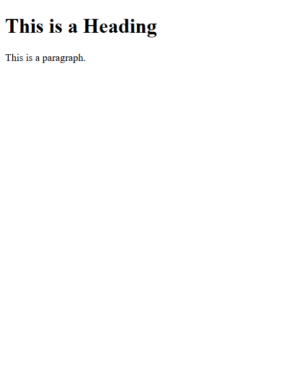

- [x] **Format support**
  - Edge, Chrome, Firefox, Opera, and Safari all support **ICO, PNG, GIF, JPEG, and SVG**.
- [x] **Chapter summary**
  - Use the HTML `<link>` element to insert a favicon.

| Tag      | Description                                              |
| -------- | -------------------------------------------------------- |
| `<link>` | Relationship between a document and an external resource |

<details>
  <summary>Lab</summary>

## Lab

Serve the favicon sandbox and confirm the heading, paragraph, and tab title **My Page Title**.

### **Overview**

- [ ] Open `html-favicon/index.html` over HTTP.
- [ ] Success: “This is a Heading”, “This is a paragraph.”, tab title **My Page Title**.

### **Task 1: Serve and open**

- [ ] From `Personal/Files/html/code_sandbox`:

```bash
python -m http.server 8766 --bind 127.0.0.1
```

- [ ] `http://127.0.0.1:8766/html-favicon/`


The favicon example matches the chapter.

</details>

<details>
  <summary>Terminal Commands</summary>

## Terminal Commands

```bash
# from Personal/Files/html/code_sandbox
python -m http.server 8766 --bind 127.0.0.1
```

Then open `http://127.0.0.1:8766/html-favicon/`.

</details>

<details>
  <summary>Code</summary>

## Code

Sandbox: `code_sandbox/html-favicon/index.html`

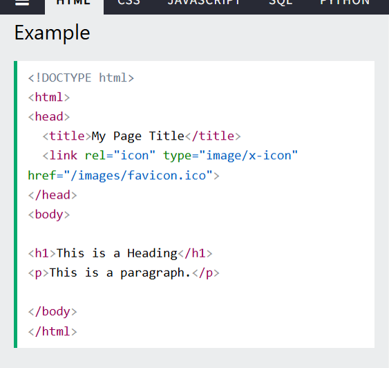

```html
<!DOCTYPE html>
<html>
  <head>
    <title>My Page Title</title>
    <link rel="icon" type="image/x-icon" href="favicon.ico" />
  </head>
  <body>
    <h1>This is a Heading</h1>
    <p>This is a paragraph.</p>
  </body>
</html>
```


The chapter example used `href="/images/favicon.ico"`. The sandbox uses a local `favicon.ico` so it loads offline.

</details>

<details>
  <summary>Questions and Answers</summary>

## Questions and Answers

### Question 1: What is a favicon?

<details>
<summary>Answer</summary>

- [x] A **small image** next to the page title in the **browser tab**.

</details>

### Question 2: Which tag adds a favicon?

<details>
<summary>Answer</summary>

- [x] `<link rel="icon" type="image/x-icon" href="…">` in **`<head>`**, after **`<title>`**.

</details>

### Question 3: What kind of image works well?

<details>
<summary>Answer</summary>

- [x] A **simple** image with **high contrast**.
- [x] A common name is **`favicon.ico`**.

</details>

### Question 4: Which formats do major browsers support?

<details>
<summary>Answer</summary>

- [x] **ICO, PNG, GIF, JPEG, SVG** (Edge, Chrome, Firefox, Opera, Safari).

</details>

### Question 5: Where do you save the favicon file?

<details>
<summary>Answer</summary>

- [x] In the **site root**, or in an **`images`** folder.
- [x] Then point `href` at that file.

</details>

</details>

## Summary

Add a favicon with `<link rel="icon">` in `<head>` after `<title>`. Store `favicon.ico` in the root or an images folder. Use a simple high-contrast image. ICO, PNG, GIF, JPEG, and SVG work in current major browsers.

## References

- [HTML Favicon (W3Schools)](https://www.w3schools.com/html/html_favicon.asp)
- [favicon.cc](https://www.favicon.cc)
- [MDN: Adding a favicon](https://developer.mozilla.org/en-US/docs/Learn_web_development/Core/Structuring_content/Webpage_metadata#adding_custom_icons_to_your_site)
- [MDN: `<link>`](https://developer.mozilla.org/en-US/docs/Web/HTML/Element/link)

</details>
<details>
  <summary>HTML Page Title</summary>

## Introduction

Every page should have a **`<title>`** that describes what the page means. The title appears in the **browser tab**, in **favorites**, and in **search results**. It matters for **SEO**.

## Detailed Explanation

- [x] **The title element**
  - Goes in `<head>`.
  - Example title: **HTML Tutorial**.
  - Body: `The content of the document......`
  - Sandbox: `code_sandbox/html-page-title/index.html`. Tab title: **HTML Tutorial**.

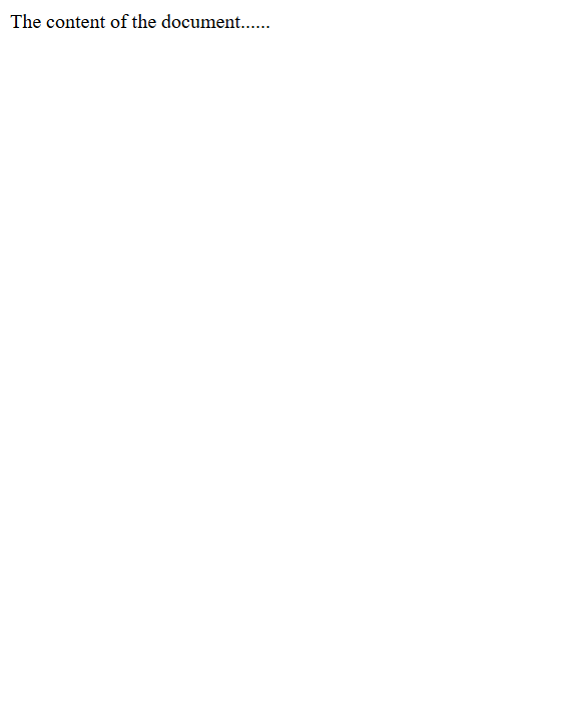

- [x] **What is a good title?**
  - Describe the **content and meaning** of the page.
  - Search engines use it when **ranking** results.
  - `<title>` also: toolbar title, favorites name, search-result title.
  - Make it **accurate and meaningful**.

| Tag       | Description                       |
| --------- | --------------------------------- |
| `<title>` | Defines the title of the document |

<details>
  <summary>Lab</summary>

## Lab

Serve the page-title sandbox and confirm the tab title is **HTML Tutorial**.

### **Overview**

- [ ] Open `html-page-title/index.html` over HTTP.
- [ ] Success: tab title **HTML Tutorial**; body “The content of the document......”

### **Task 1: Serve and open**

- [ ] From `Personal/Files/html/code_sandbox`:

```bash
python -m http.server 8766 --bind 127.0.0.1
```

- [ ] `http://127.0.0.1:8766/html-page-title/`


The page-title example matches the chapter.

</details>

<details>
  <summary>Terminal Commands</summary>

## Terminal Commands

```bash
# from Personal/Files/html/code_sandbox
python -m http.server 8766 --bind 127.0.0.1
```

Then open `http://127.0.0.1:8766/html-page-title/`.

</details>

<details>
  <summary>Code</summary>

## Code

Sandbox: `code_sandbox/html-page-title/index.html`

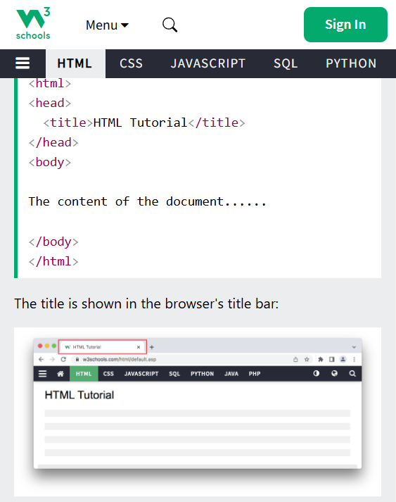

```html
<!DOCTYPE html>
<html>
  <head>
    <title>HTML Tutorial</title>
  </head>
  <body>
    The content of the document......
  </body>
</html>
```


</details>

<details>
  <summary>Questions and Answers</summary>

## Questions and Answers

### Question 1: Where does `<title>` go, and where is it shown?

<details>
<summary>Answer</summary>

- [x] In the **`<head>`**.
- [x] In the browser **title bar / tab**.

</details>

### Question 2: Why is the page title important for SEO?

<details>
<summary>Answer</summary>

- [x] Search engines use it when **ordering** results.
- [x] It also appears as the **search-result** title.

</details>

### Question 3: What else uses the title besides the tab?

<details>
<summary>Answer</summary>

- [x] The name when the page is added to **favorites**.
- [x] The title in **search engine** listings.

</details>

### Question 4: What makes a good title?

<details>
<summary>Answer</summary>

- [x] It describes the **content and meaning** of the page.
- [x] It is **accurate and meaningful**.

</details>

### Question 5: What title does the chapter example use?

<details>
<summary>Answer</summary>

- [x] **HTML Tutorial**.

</details>

</details>

## Summary

Put a meaningful `<title>` in `<head>`. It labels the tab, favorites, and search results, and it feeds SEO. The chapter example title is **HTML Tutorial**.

## References

- [HTML Page Title (W3Schools)](https://www.w3schools.com/html/html_page_title.asp)
- [MDN: `<title>`](https://developer.mozilla.org/en-US/docs/Web/HTML/Element/title)
- [Google: Title links](https://developers.google.com/search/docs/appearance/title-link)

</details>
<details>
  <summary>HTML Tables</summary>

## Introduction

HTML tables arrange data in **rows** and **columns**. A table is cells inside rows. Nested sidebar pages cover borders, sizes, headers in more depth, padding, colspan/rowspan, styling, and colgroup. This chapter is the **HTML Tables** overview.

## Detailed Explanation

- [x] **Define a table**
  - `<table>` wraps the grid.
  - Example: Company / Contact / Country with Alfreds Futterkiste (Germany) and Centro comercial Moctezuma (Mexico).
  - Sandbox: `code_sandbox/html-tables/index.html` (with a 1px black border so the grid is visible, as in the Try it examples).

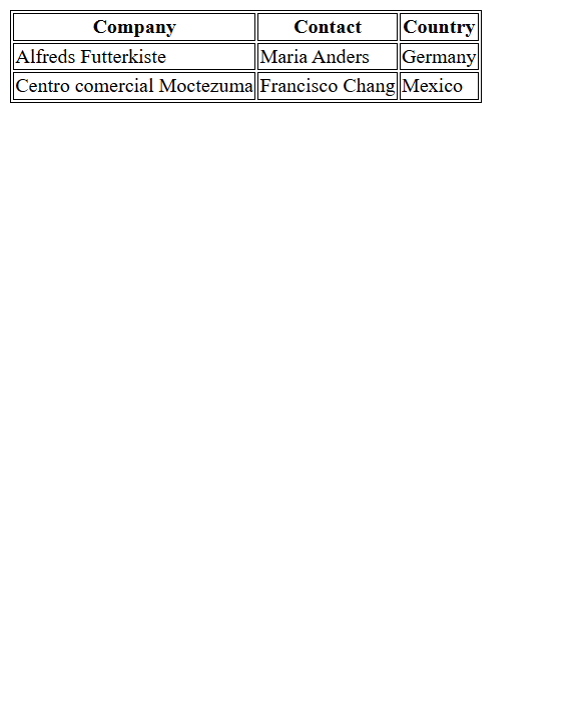

- [x] **Table cells (`<td>`)**
  - **td** = table data. Content is between `<td>` and `</td>`.
  - A cell can hold text, images, lists, links, even other tables.
  - Example: Emil, Tobias, Linus in one row.
  - Sandbox: `cells.html`.

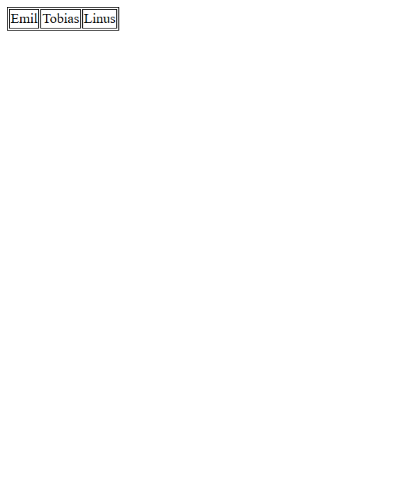

- [x] **Table rows (`<tr>`)**
  - **tr** = table row. Starts with `<tr>`, ends with `</tr>`.
  - You can have as many rows as you like; keep the **same number of cells** in each row (uneven rows come in a later chapter).
  - Example: names row plus 16 / 14 / 10.
  - Sandbox: `rows.html`.

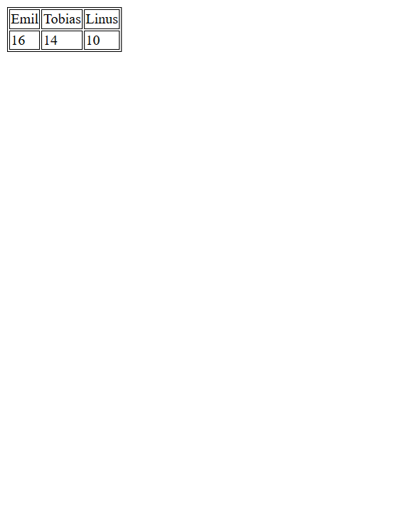

- [x] **Table headers (`<th>`)**
  - Use `<th>` instead of `<td>` for header cells.
  - **th** = table header. Default: **bold** and **centered** (changeable with CSS).
  - Example: Person 1 / 2 / 3, then names, then ages.
  - Sandbox: `headers.html`.

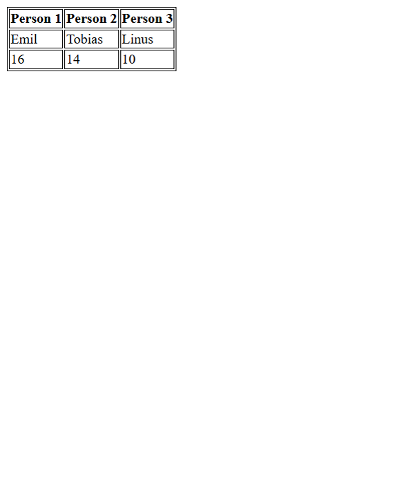

| Tag          | Description                           |
| ------------ | ------------------------------------- |
| `<table>`    | Defines a table                       |
| `<th>`       | Defines a header cell                 |
| `<tr>`       | Defines a row                         |
| `<td>`       | Defines a cell                        |
| `<caption>`  | Defines a table caption               |
| `<colgroup>` | Group of columns for formatting       |
| `<col>`      | Column properties inside `<colgroup>` |
| `<thead>`    | Groups header content                 |
| `<tbody>`    | Groups body content                   |
| `<tfoot>`    | Groups footer content                 |

<details>
  <summary>Lab</summary>

## Lab

Run the table examples: company table, one-row cells, two data rows, and a header row.

### **Overview**

- [ ] Serve `code_sandbox` and open each `html-tables` file.
- [ ] Success: bordered Company/Contact/Country table; Emil Tobias Linus; names plus ages; Person 1–3 headers bold and centered.

### **Task 1: Serve and open**

- [ ] From `Personal/Files/html/code_sandbox`:

```bash
python -m http.server 8766 --bind 127.0.0.1
```

- [ ] `http://127.0.0.1:8766/html-tables/`
- [ ] `http://127.0.0.1:8766/html-tables/cells.html`
- [ ] `http://127.0.0.1:8766/html-tables/rows.html`
- [ ] `http://127.0.0.1:8766/html-tables/headers.html`


The table examples match the chapter.

</details>

<details>
  <summary>Terminal Commands</summary>

## Terminal Commands

```bash
# from Personal/Files/html/code_sandbox
python -m http.server 8766 --bind 127.0.0.1
```

Then open `http://127.0.0.1:8766/html-tables/`.

</details>

<details>
  <summary>Code</summary>

## Code

Company table (`index.html`):

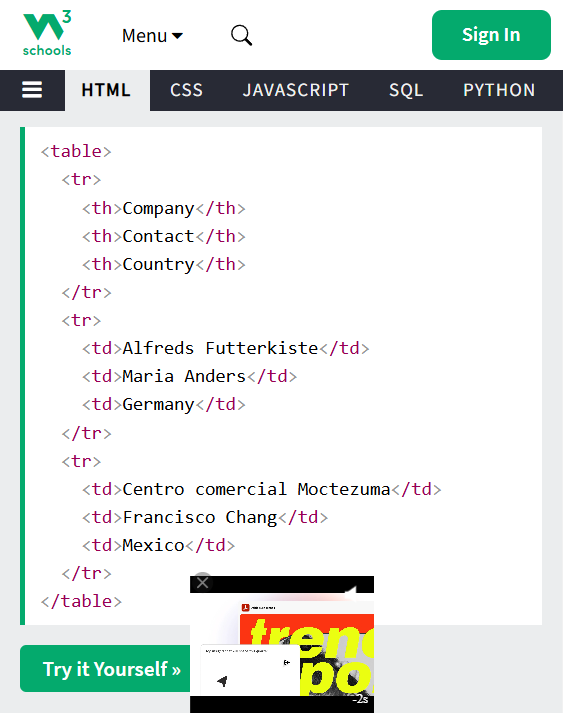

```html
<table>
  <tr>
    <th>Company</th>
    <th>Contact</th>
    <th>Country</th>
  </tr>
  <tr>
    <td>Alfreds Futterkiste</td>
    <td>Maria Anders</td>
    <td>Germany</td>
  </tr>
  <tr>
    <td>Centro comercial Moctezuma</td>
    <td>Francisco Chang</td>
    <td>Mexico</td>
  </tr>
</table>
```


Cells (`cells.html`):

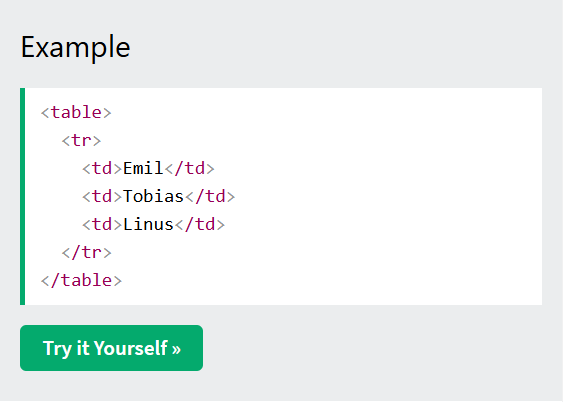

```html
<table>
  <tr>
    <td>Emil</td>
    <td>Tobias</td>
    <td>Linus</td>
  </tr>
</table>
```


Rows (`rows.html`):

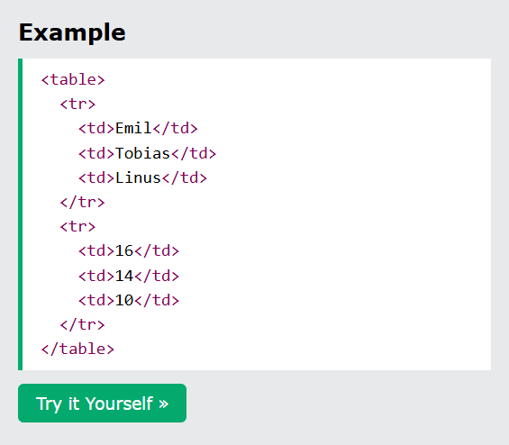

```html
<table>
  <tr>
    <td>Emil</td>
    <td>Tobias</td>
    <td>Linus</td>
  </tr>
  <tr>
    <td>16</td>
    <td>14</td>
    <td>10</td>
  </tr>
</table>
```


Headers (`headers.html`):

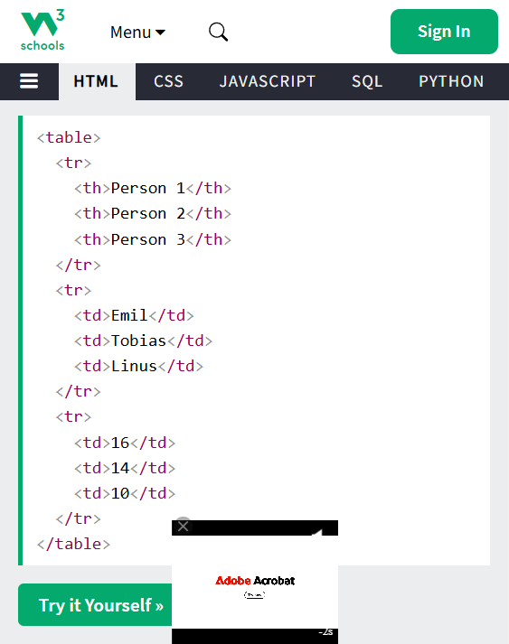

```html
<table>
  <tr>
    <th>Person 1</th>
    <th>Person 2</th>
    <th>Person 3</th>
  </tr>
  <tr>
    <td>Emil</td>
    <td>Tobias</td>
    <td>Linus</td>
  </tr>
  <tr>
    <td>16</td>
    <td>14</td>
    <td>10</td>
  </tr>
</table>
```


</details>

<details>
  <summary>Questions and Answers</summary>

## Questions and Answers

### Question 1: What does an HTML table consist of?

<details>
<summary>Answer</summary>

- [x] **Table cells** inside **rows** and **columns**.
- [x] Wrapped in **`<table>`**.

</details>

### Question 2: What does `<td>` stand for, and what can a cell contain?

<details>
<summary>Answer</summary>

- [x] **Table data**.
- [x] Text, images, lists, links, other tables, and more.

</details>

### Question 3: What does `<tr>` stand for, and how many cells per row?

<details>
<summary>Answer</summary>

- [x] **Table row**.
- [x] Keep the **same number of cells** in each row (exceptions later).

</details>

### Question 4: How do header cells differ from data cells?

<details>
<summary>Answer</summary>

- [x] Use **`<th>`** instead of **`<td>`**.
- [x] Default look: **bold** and **centered**.

</details>

### Question 5: Which extra table tags does this chapter list?

<details>
<summary>Answer</summary>

- [x] `<caption>`, `<colgroup>`, `<col>`.
- [x] `<thead>`, `<tbody>`, `<tfoot>`.

</details>

### Question 6: How did the Try it examples make the grid visible?

<details>
<summary>Answer</summary>

- [x] CSS: `table, th, td { border: 1px solid black; }`.

</details>

</details>

## Summary

Use `<table>` with `<tr>` rows and `<td>` cells. `<th>` is a header cell (bold, centered by default). Keep cell counts even across rows unless a later chapter covers spanning.

## References

- [HTML Tables (W3Schools)](https://www.w3schools.com/html/html_tables.asp)
- [Try it Yourself: tryhtml_table_intro](https://www.w3schools.com/html/tryit.asp?filename=tryhtml_table_intro)
- [Try it Yourself: tryhtml_table3](https://www.w3schools.com/html/tryit.asp?filename=tryhtml_table3)
- [Try it Yourself: tryhtml_table4](https://www.w3schools.com/html/tryit.asp?filename=tryhtml_table4)
- [Try it Yourself: tryhtml_table5](https://www.w3schools.com/html/tryit.asp?filename=tryhtml_table5)
- [Try it Yourself: tryhtml_table6](https://www.w3schools.com/html/tryit.asp?filename=tryhtml_table6)
- [Table Borders](https://www.w3schools.com/html/html_table_borders.asp)
- [MDN: `<table>`](https://developer.mozilla.org/en-US/docs/Web/HTML/Element/table)
- [MDN: `<th>`](https://developer.mozilla.org/en-US/docs/Web/HTML/Element/th)
- [MDN: `<td>`](https://developer.mozilla.org/en-US/docs/Web/HTML/Element/td)

</details>
<details>
  <summary>HTML Lists</summary>

## Introduction

HTML lists group related items. This chapter covers **unordered** lists (`<ul>`), **ordered** lists (`<ol>`), and **description** lists (`<dl>` / `<dt>` / `<dd>`). Nested sidebar pages cover unordered, ordered, and other lists in more detail.

## Detailed Explanation

- [x] **Unordered list**
  - Starts with `<ul>`. Each item is `<li>`.
  - Default marker: **bullets** (small black circles).
  - Example: Coffee, Tea, Milk.
  - Sandbox: `code_sandbox/html-lists/index.html`.


- [x] **Ordered list**
  - Starts with `<ol>`. Each item is `<li>`.
  - Default marker: **numbers**.
  - Same three drinks, numbered.
  - Sandbox: `ordered.html`.

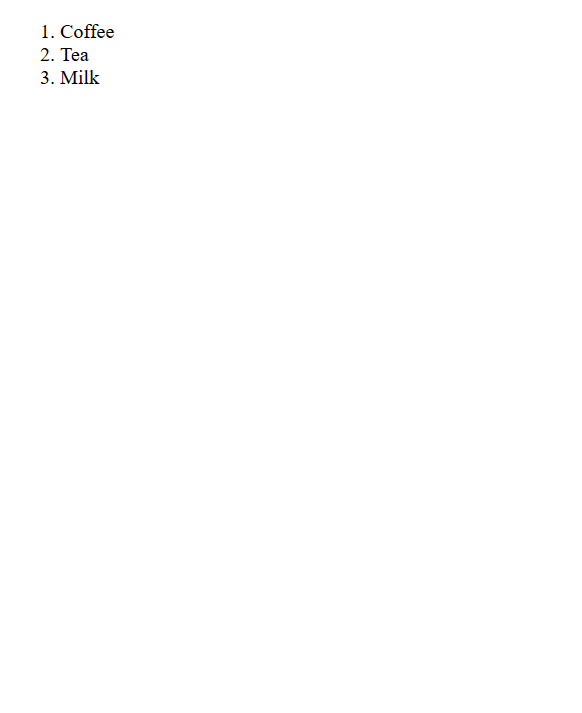

- [x] **Description list**
  - A list of **terms** with a **description** of each.
  - `<dl>` — the list. `<dt>` — the term. `<dd>` — the description.
  - Example: Coffee — black hot drink; Milk — white cold drink.
  - Sandbox: `description.html`.

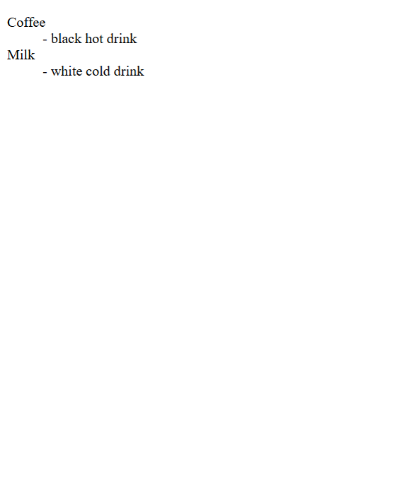

| Tag    | Description                              |
| ------ | ---------------------------------------- |
| `<ul>` | Defines an unordered list                |
| `<ol>` | Defines an ordered list                  |
| `<li>` | Defines a list item                      |
| `<dl>` | Defines a description list               |
| `<dt>` | Defines a term in a description list     |
| `<dd>` | Describes the term in a description list |

<details>
  <summary>Lab</summary>

## Lab

Run the three list types: bullets, numbers, and term/description pairs.

### **Overview**

- [ ] Serve `code_sandbox` and open each `html-lists` file.
- [ ] Success: Coffee/Tea/Milk as bullets; the same three numbered; Coffee and Milk with indented descriptions.

### **Task 1: Serve and open**

- [ ] From `Personal/Files/html/code_sandbox`:

```bash
python -m http.server 8766 --bind 127.0.0.1
```

- [ ] `http://127.0.0.1:8766/html-lists/`
- [ ] `http://127.0.0.1:8766/html-lists/ordered.html`
- [ ] `http://127.0.0.1:8766/html-lists/description.html`


The list examples match the chapter.

</details>

<details>
  <summary>Terminal Commands</summary>

## Terminal Commands

```bash
# from Personal/Files/html/code_sandbox
python -m http.server 8766 --bind 127.0.0.1
```

Then open `http://127.0.0.1:8766/html-lists/`.

</details>

<details>
  <summary>Code</summary>

## Code

Unordered (`index.html`):

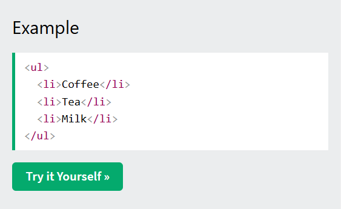

```html
<ul>
  <li>Coffee</li>
  <li>Tea</li>
  <li>Milk</li>
</ul>
```


Ordered (`ordered.html`):


```html
<ol>
  <li>Coffee</li>
  <li>Tea</li>
  <li>Milk</li>
</ol>
```


Description (`description.html`):

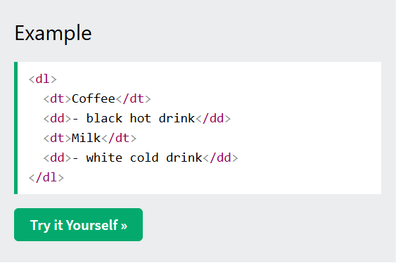

```html
<dl>
  <dt>Coffee</dt>
  <dd>- black hot drink</dd>
  <dt>Milk</dt>
  <dd>- white cold drink</dd>
</dl>
```


</details>

<details>
  <summary>Questions and Answers</summary>

## Questions and Answers

### Question 1: Which tags make an unordered list, and what is the default marker?

<details>
<summary>Answer</summary>

- [x] `<ul>` with `<li>` items.
- [x] Default marker: **bullets** (small black circles).

</details>

### Question 2: Which tags make an ordered list, and what is the default marker?

<details>
<summary>Answer</summary>

- [x] `<ol>` with `<li>` items.
- [x] Default marker: **numbers**.

</details>

### Question 3: Which three tags make a description list?

<details>
<summary>Answer</summary>

- [x] `<dl>` — the list.
- [x] `<dt>` — the term.
- [x] `<dd>` — the description.

</details>

### Question 4: What is a description list for?

<details>
<summary>Answer</summary>

- [x] A list of **terms**, each with a **description**.

</details>

### Question 5: Which tag is a list item in both unordered and ordered lists?

<details>
<summary>Answer</summary>

- [x] **`<li>`**.

</details>

### Question 6: Where does this chapter send you for more list detail?

<details>
<summary>Answer</summary>

- [x] **Unordered Lists**, **Ordered Lists**, and **Other Lists**.

</details>

</details>

## Summary

Use `<ul>` for bullets, `<ol>` for numbers, and `<li>` for items in both. Use `<dl>`, `<dt>`, and `<dd>` for terms and their descriptions.

## References

- [HTML Lists (W3Schools)](https://www.w3schools.com/html/html_lists.asp)
- [Try it Yourself: tryhtml_lists_unordered](https://www.w3schools.com/html/tryit.asp?filename=tryhtml_lists_unordered)
- [Try it Yourself: tryhtml_lists_ordered](https://www.w3schools.com/html/tryit.asp?filename=tryhtml_lists_ordered)
- [Try it Yourself: tryhtml_lists_description](https://www.w3schools.com/html/tryit.asp?filename=tryhtml_lists_description)
- [Unordered Lists](https://www.w3schools.com/html/html_lists_unordered.asp)
- [Ordered Lists](https://www.w3schools.com/html/html_lists_ordered.asp)
- [Other Lists](https://www.w3schools.com/html/html_lists_other.asp)
- [MDN: `<ul>`](https://developer.mozilla.org/en-US/docs/Web/HTML/Element/ul)
- [MDN: `<ol>`](https://developer.mozilla.org/en-US/docs/Web/HTML/Element/ol)
- [MDN: `<dl>`](https://developer.mozilla.org/en-US/docs/Web/HTML/Element/dl)

</details>
