# API Validation

[Back to JavaScript Tutorial](../tutorial_main.md)

## Introduction

The Constraint Validation API exposes `checkValidity`, `setCustomValidity`, `validity`, `validationMessage`, and `willValidate`. ValidityState flags tell you *why* a field failed (`rangeOverflow`, `valueMissing`, …) without parsing the localized message.

This section has **13** examples:

- [x] **Example 1:** checkValidity() method [View](#api-validation-example-01)
- [x] **Example 2:** setCustomValidity() method [View](#api-validation-example-02)
- [x] **Example 3:** validity property [View](#api-validation-example-03)
- [x] **Example 4:** validationMessage property [View](#api-validation-example-04)
- [x] **Example 5:** willValidate property [View](#api-validation-example-05)
- [x] **Example 6:** validity.rangeOverflow [View](#api-validation-example-06)
- [x] **Example 7:** validity.rangeUnderflow [View](#api-validation-example-07)
- [x] **Example 8:** validity.patternMismatch [View](#api-validation-example-08)
- [x] **Example 9:** validity.stepMismatch [View](#api-validation-example-09)
- [x] **Example 10:** validity.tooLong [View](#api-validation-example-10)
- [x] **Example 11:** validity.typeMismatch [View](#api-validation-example-11)
- [x] **Example 12:** validity.valueMissing [View](#api-validation-example-12)
- [x] **Example 13:** validity.valid [View](#api-validation-example-13)

## Detailed Explanation

- [x] checkValidity + validationMessage.
- [x] Boolean flags on validity.
- [x] rangeOverflow / rangeUnderflow match the page Tryits.

<a id="api-validation-example-01"></a>

### **Example 1: checkValidity() method**

- [x] `input.checkValidity()` returns **true** if the control meets its constraints.
- [x] W3Schools: number `min=100` `max=300` `required`, then show `validationMessage` if invalid.
- [x] The snapshot leaves the field empty so it is **invalid**.

Sandbox: `code_sandbox/api-validation/check-validity.html`

```html
<input id="id1" type="number" min="100" max="300" required>
<button onclick="myFunction()">OK</button>
<script>
function myFunction() {
  const inpObj = document.getElementById("id1");
  if (!inpObj.checkValidity()) {
    document.getElementById("demo").innerHTML = inpObj.validationMessage;
  }
}
</script>
```

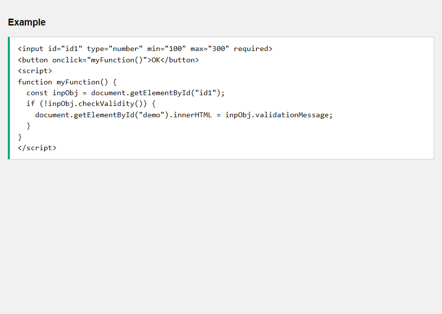

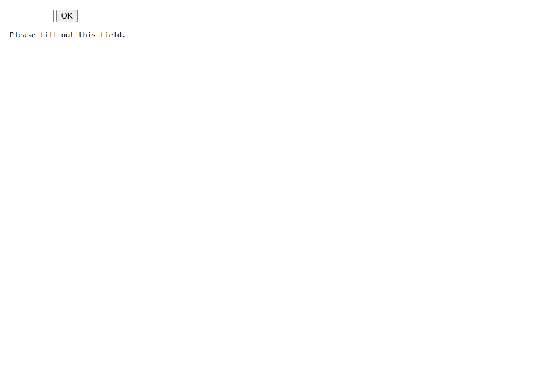

- [x] **Outcome:** `checkValidity()` is **false** on the empty required field, and `validationMessage` is a non-empty browser string.

<a id="api-validation-example-02"></a>

### **Example 2: setCustomValidity() method**

- [x] `setCustomValidity(message)` sets a **custom** error.
- [x] Empty string **clears** it.
- [x] `validity.customError` becomes true while a message is set.

Sandbox: `code_sandbox/api-validation/set-custom.html`

```html
input.setCustomValidity("Choose a different name")
```

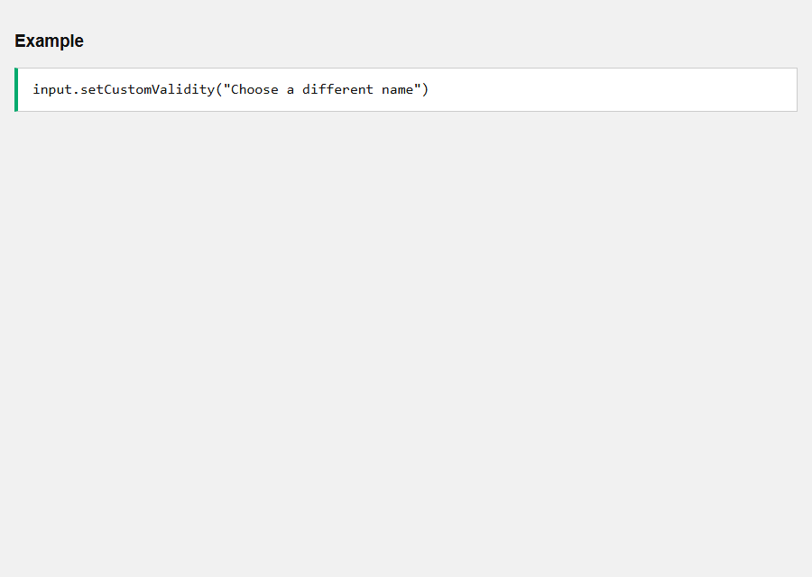

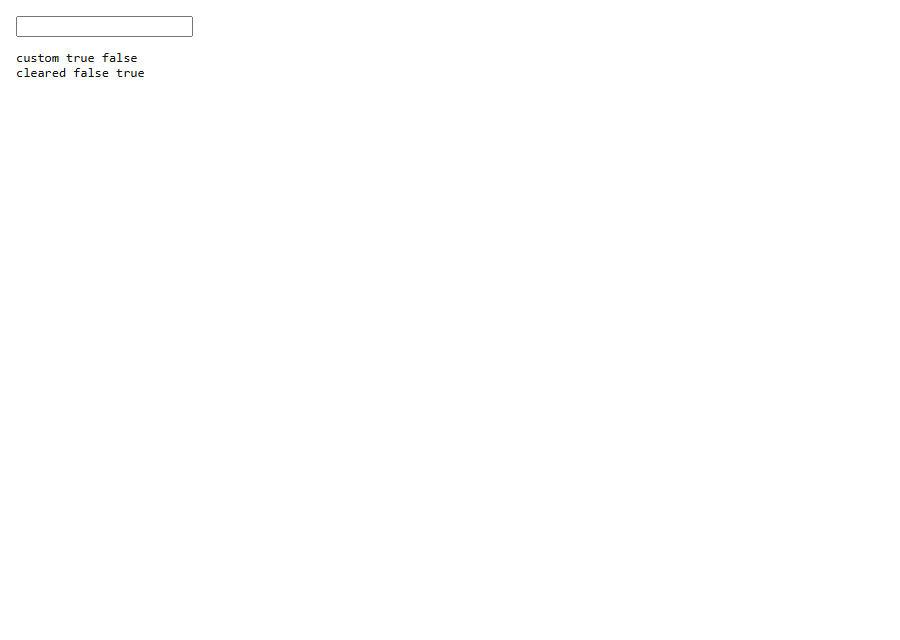

- [x] **Outcome:** After setCustomValidity, `customError` is **true** and `checkValidity()` is **false**. Clearing with `""` makes it valid (empty optional text field).

<a id="api-validation-example-03"></a>

### **Example 3: validity property**

- [x] `input.validity` is a **ValidityState** object of booleans.
- [x] Use it instead of parsing `validationMessage` (messages are localized).

Sandbox: `code_sandbox/api-validation/validity-obj.html`

```html
input.validity
```

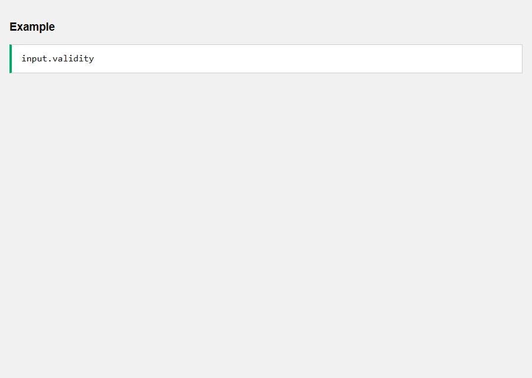

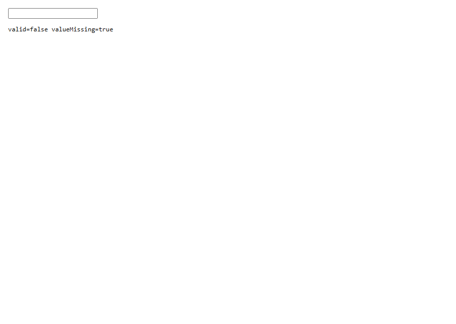

- [x] **Outcome:** `validity.valid` is **false** for the empty required number; `valueMissing` is **true**.

<a id="api-validation-example-04"></a>

### **Example 4: validationMessage property**

- [x] The string the browser **would show** in the native tooltip.
- [x] Language depends on the browser locale.
- [x] Empty when the field is valid.

Sandbox: `code_sandbox/api-validation/validation-message.html`

```html
input.validationMessage
```

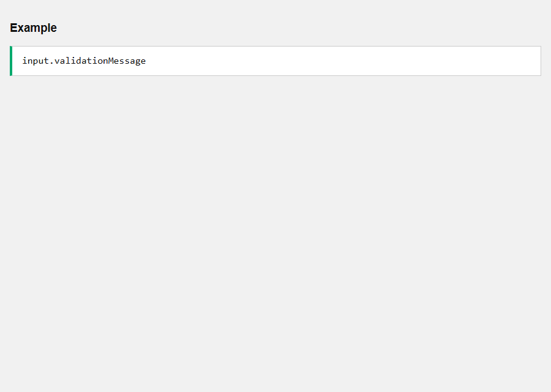

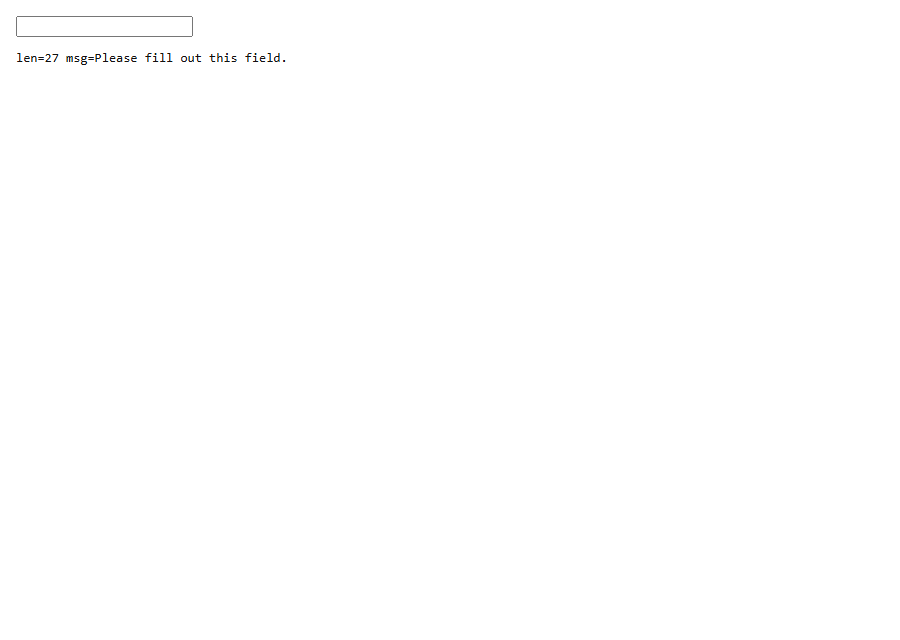

- [x] **Outcome:** For the empty required input, `validationMessage` **length > 0**.

<a id="api-validation-example-05"></a>

### **Example 5: willValidate property**

- [x] **true** if the element is a candidate for constraint validation (not disabled, not a non-validating button, etc.).

Sandbox: `code_sandbox/api-validation/will-validate.html`

```html
input.willValidate
```


- [x] **Outcome:** A normal required number input: **willValidate=true**.

<a id="api-validation-example-06"></a>

### **Example 6: validity.rangeOverflow**

- [x] **true** when the value is **greater than max**.
- [x] W3Schools: `type=number` `max=100`, if overflow then “Value too large”.

Sandbox: `code_sandbox/api-validation/range-overflow.html`

```html
<input id="id1" type="number" max="100">
if (document.getElementById("id1").validity.rangeOverflow) {
  text = "Value too large";
}
```

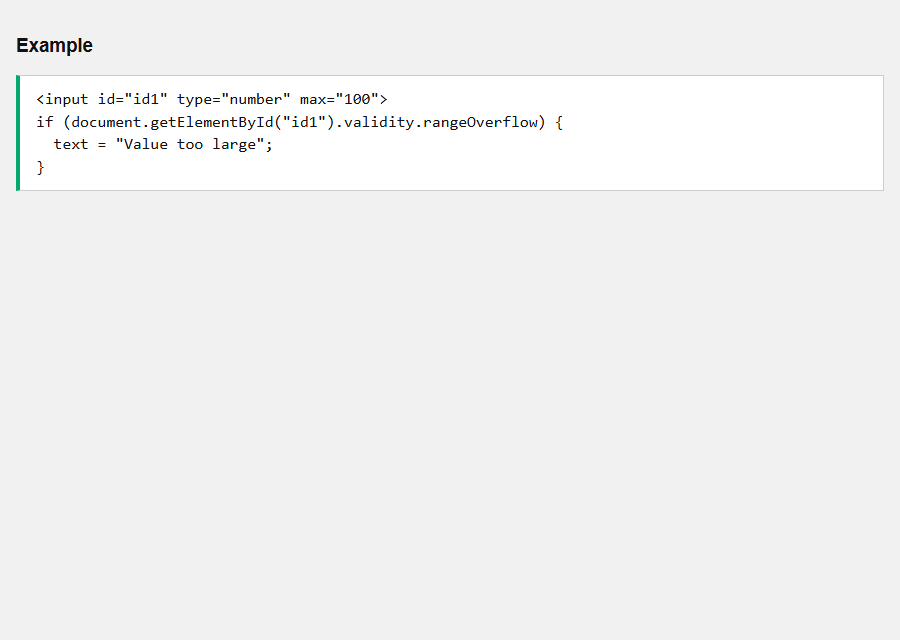

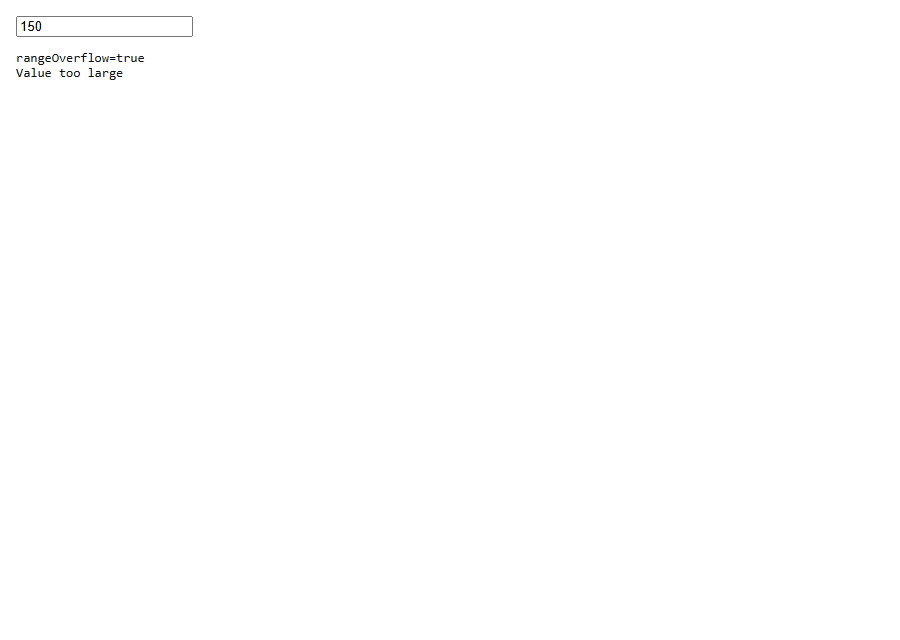

- [x] **Outcome:** Value **150** with max **100**: **rangeOverflow** is true → **Value too large**.

<a id="api-validation-example-07"></a>

### **Example 7: validity.rangeUnderflow**

- [x] **true** when the value is **less than min**.
- [x] Page: min=100, “Value too small”.

Sandbox: `code_sandbox/api-validation/range-underflow.html`

```html
<input id="id1" type="number" min="100">
if (document.getElementById("id1").validity.rangeUnderflow) {
  text = "Value too small";
}
```

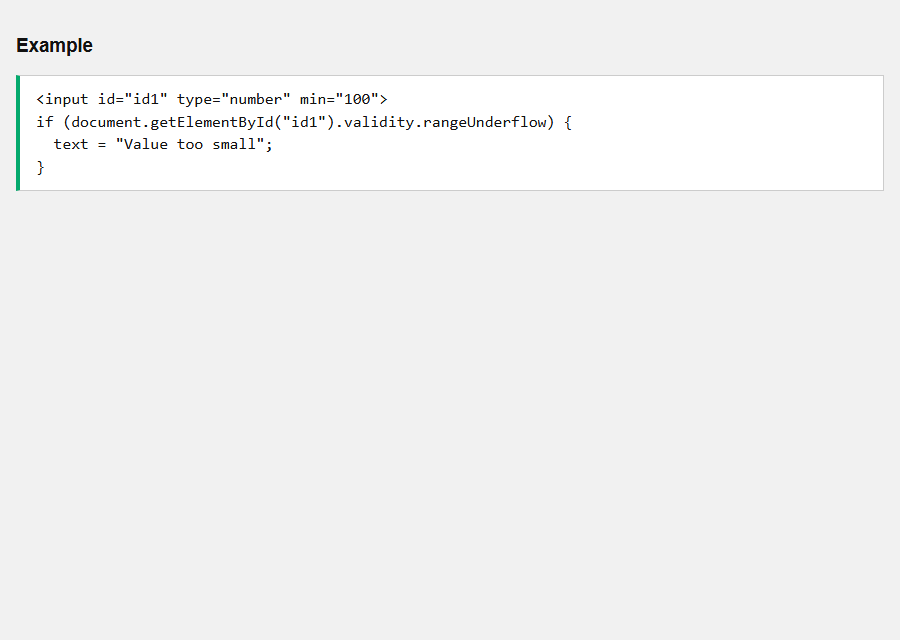


- [x] **Outcome:** Value **50** with min **100**: **Value too small**.

<a id="api-validation-example-08"></a>

### **Example 8: validity.patternMismatch**

- [x] **true** when the value does not match **`pattern`**.

Sandbox: `code_sandbox/api-validation/pattern-mismatch.html`

```html
input.validity.patternMismatch
```

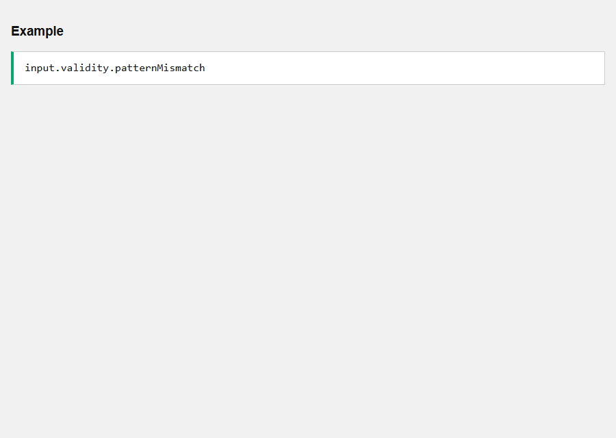

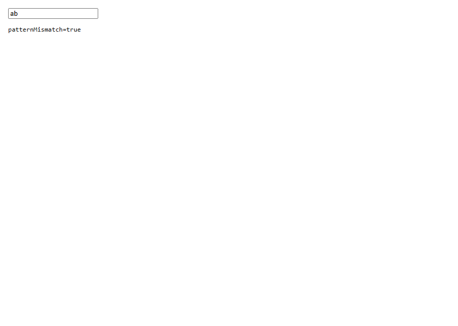

- [x] **Outcome:** `pattern="[A-Z]{3}"` with value **ab** → **patternMismatch=true**.

<a id="api-validation-example-09"></a>

### **Example 9: validity.stepMismatch**

- [x] **true** when the value is not on the **step** grid (e.g. step=2, value=3).

Sandbox: `code_sandbox/api-validation/step-mismatch.html`

```html
input.validity.stepMismatch
```


- [x] **Outcome:** `step=2` `min=0` value **3** → **stepMismatch=true**.

<a id="api-validation-example-10"></a>

### **Example 10: validity.tooLong**

- [x] **true** when the value is longer than **`maxLength`** *and* the user changed it (browsers often block typing past maxLength, so this can stay false unless you set `.value` in script).
- [x] We set a long `.value` in JS to demonstrate the flag where the engine supports it.

Sandbox: `code_sandbox/api-validation/too-long.html`

```html
input.validity.tooLong
```

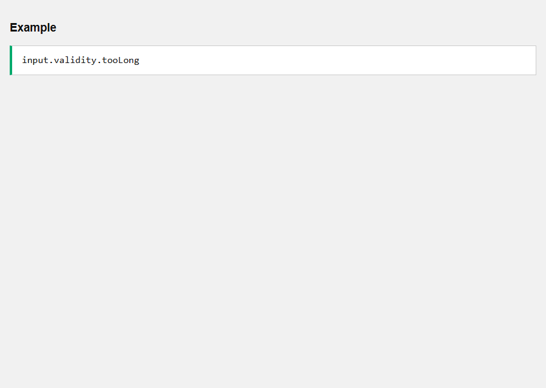


- [x] **Outcome:** After setting a 5-char value on `maxLength=3`, `tooLong` is **true** or the engine clamps; the snapshot reports the actual flag plus `value.length`.

<a id="api-validation-example-11"></a>

### **Example 11: validity.typeMismatch**

- [x] **true** when `type=email`/`url` cannot parse the value.

Sandbox: `code_sandbox/api-validation/type-mismatch.html`

```html
input.validity.typeMismatch
```

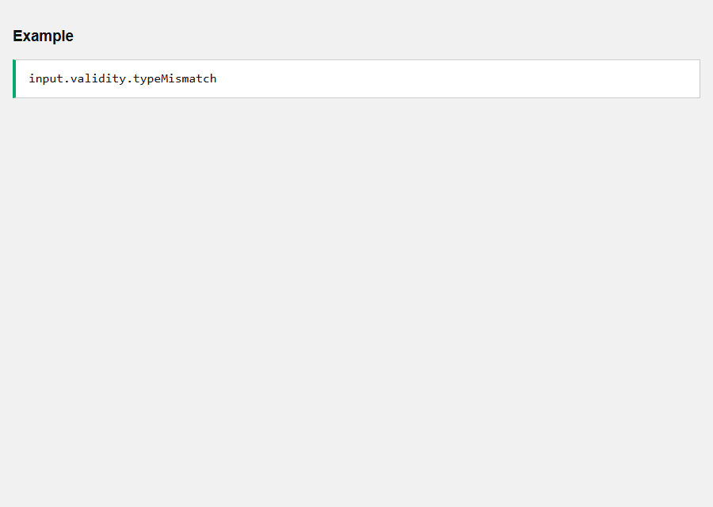


- [x] **Outcome:** `type=email` value **not-an-email** → **typeMismatch=true**.

<a id="api-validation-example-12"></a>

### **Example 12: validity.valueMissing**

- [x] **true** when **`required`** and the value is empty.

Sandbox: `code_sandbox/api-validation/value-missing.html`

```html
input.validity.valueMissing
```

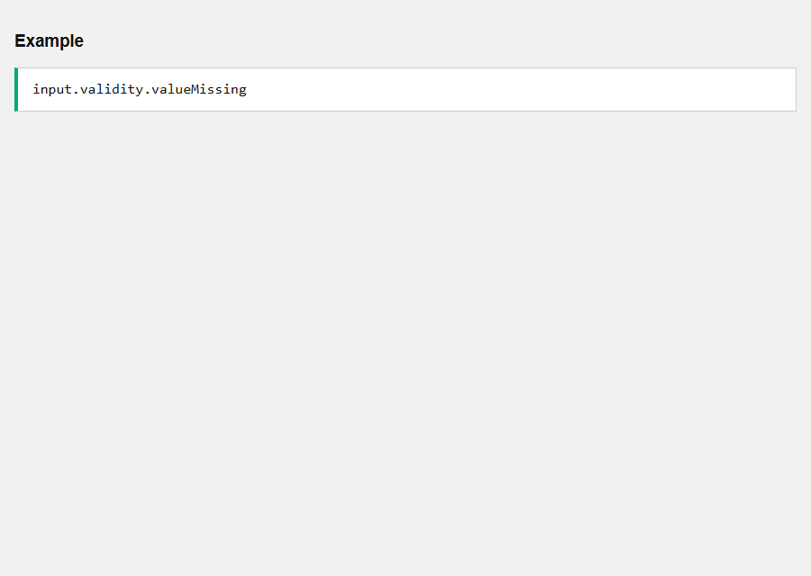

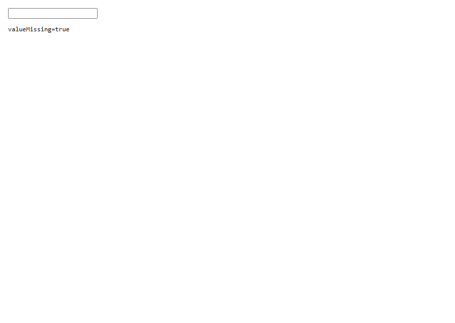

- [x] **Outcome:** Empty required input: **valueMissing=true**.

<a id="api-validation-example-13"></a>

### **Example 13: validity.valid**

- [x] **true** when **no** constraint is failing.
- [x] Opposite of “any error flag is true”.

Sandbox: `code_sandbox/api-validation/valid-flag.html`

```html
input.validity.valid
```

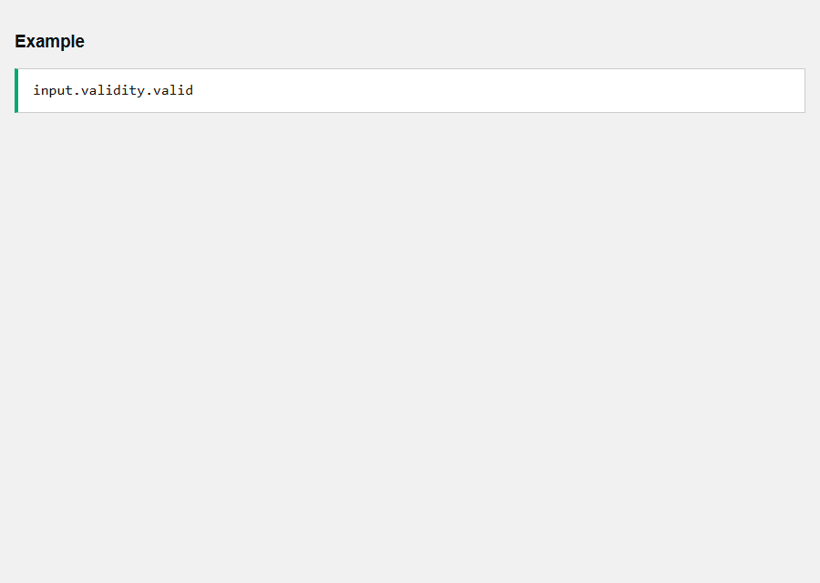

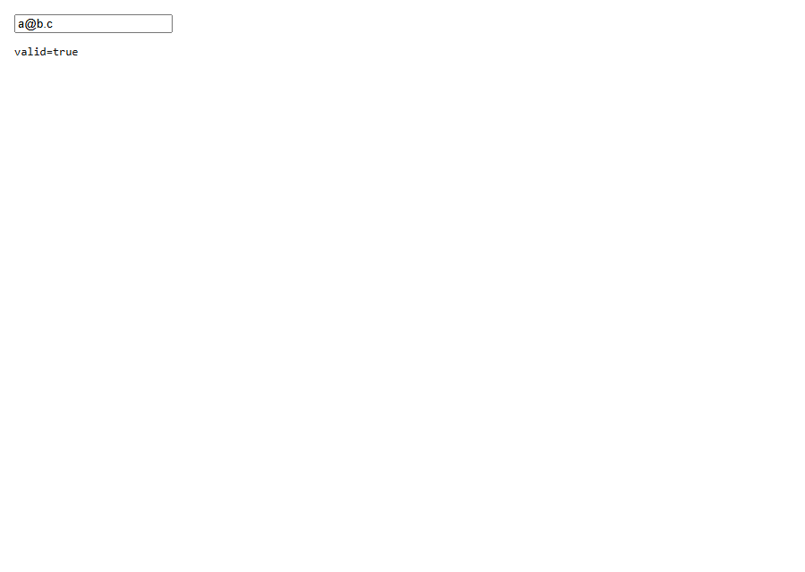

- [x] **Outcome:** A filled email `a@b.c` is **valid=true**.

<details>
  <summary>Terminal Commands</summary>

## Terminal Commands

```bash
# from Personal/Files/javascript/code_sandbox
py -3 -m http.server 8770 --bind 127.0.0.1
```

Then open `http://127.0.0.1:8770/api-validation/`.

</details>

<details>
  <summary>Questions and Answers</summary>

## Questions and Answers

### Question 1: What does `checkValidity()` return?

<details>
<summary>Answer</summary>

- [x] **true** if the input meets all constraints.

</details>

### Question 2: Where is the native tooltip text?

<details>
<summary>Answer</summary>

- [x] **`validationMessage`**.

</details>

### Question 3: How do you set a custom error?

<details>
<summary>Answer</summary>

- [x] **`setCustomValidity("message")`**; clear with **`""`**.

</details>

### Question 4: When is `rangeOverflow` true?

<details>
<summary>Answer</summary>

- [x] Value **> max**.

</details>

### Question 5: When is `rangeUnderflow` true?

<details>
<summary>Answer</summary>

- [x] Value **< min**.

</details>

### Question 6: When is `valueMissing` true?

<details>
<summary>Answer</summary>

- [x] **required** and empty.

</details>

### Question 7: When is `typeMismatch` true?

<details>
<summary>Answer</summary>

- [x] Value does not match **`type`** (email/url).

</details>

### Question 8: What is `validity`?

<details>
<summary>Answer</summary>

- [x] A **ValidityState** object of booleans.

</details>

### Question 9: What is `willValidate`?

<details>
<summary>Answer</summary>

- [x] Whether the element **participates** in constraint validation.

</details>

### Question 10: Should you parse `validationMessage` in code?

<details>
<summary>Answer</summary>

- [x] **No** — it is localized; use the **boolean flags**.

</details>

### Question 11: W3Schools overflow demo message?

<details>
<summary>Answer</summary>

- [x] **Value too large**.

</details>


</details>

## Summary

Call checkValidity and read validity.* flags. Use setCustomValidity for custom rules. Prefer flags over validationMessage text because messages are translated.

## References

- [API Validation](https://www.w3schools.com/js/js_validation_api.asp)
- [MDN ValidityState](https://developer.mozilla.org/en-US/docs/Web/API/ValidityState)
