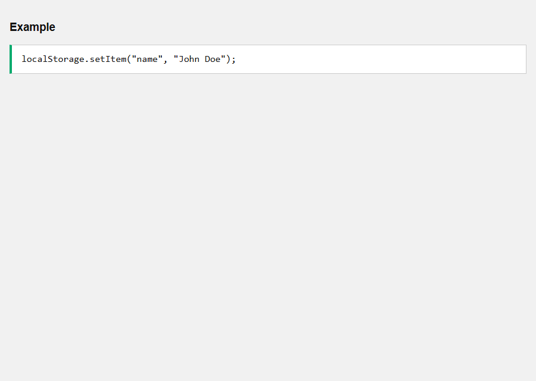
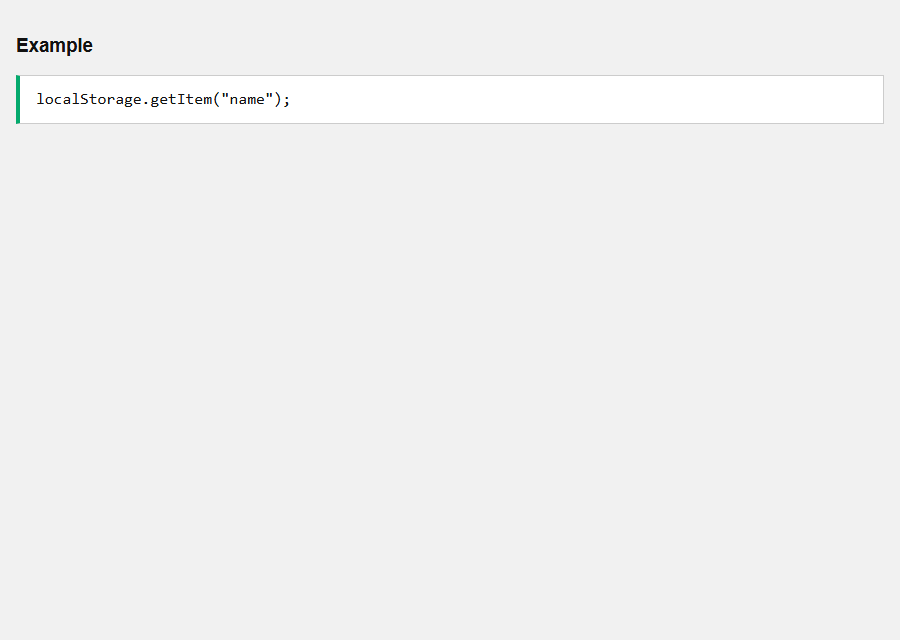
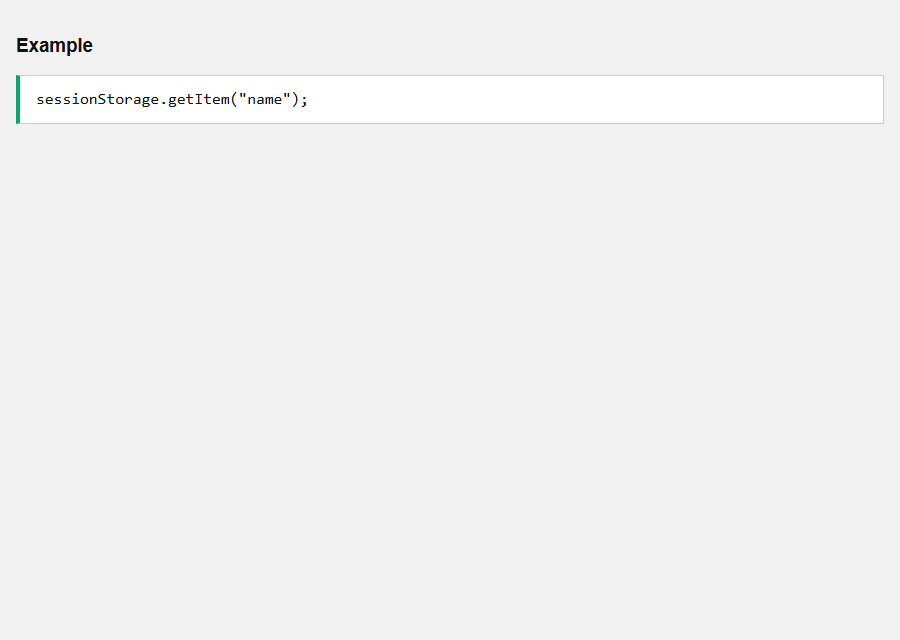
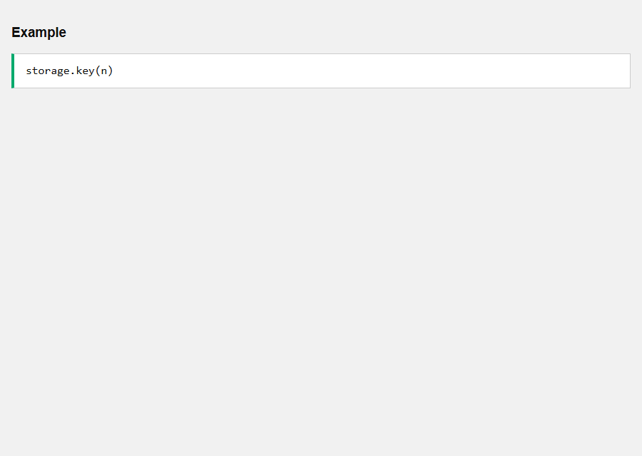
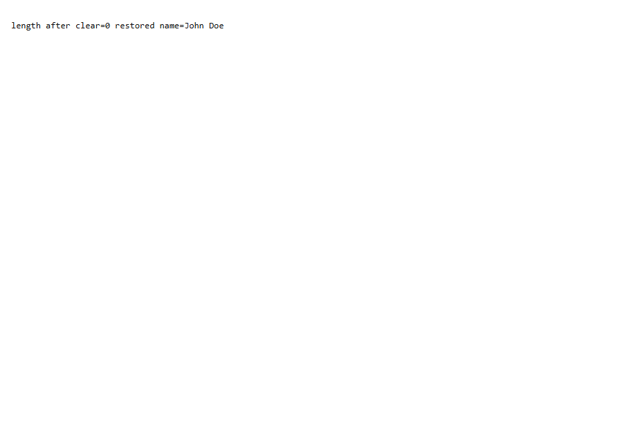
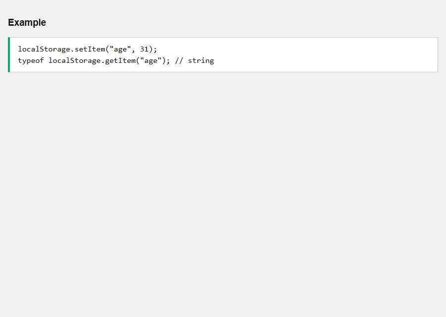

# API Web Storage

[Back to JavaScript Tutorial](../tutorial_main.md)

## Introduction

Web Storage is `localStorage` (no expiry) and `sessionStorage` (one tab session). Both have setItem, getItem, removeItem, clear, key, and length. Values are strings.

This section has **9** examples:

- [x] **Example 1:** localStorage.setItem(key, value) [View](#api-web-storage-example-01)
- [x] **Example 2:** localStorage.getItem(key) [View](#api-web-storage-example-02)
- [x] **Example 3:** sessionStorage.setItem(key, value) [View](#api-web-storage-example-03)
- [x] **Example 4:** sessionStorage.getItem(key) [View](#api-web-storage-example-04)
- [x] **Example 5:** key(n) — name of the nth key [View](#api-web-storage-example-05)
- [x] **Example 6:** length — number of keys [View](#api-web-storage-example-06)
- [x] **Example 7:** removeItem(key) — delete one key [View](#api-web-storage-example-07)
- [x] **Example 8:** clear() — delete all keys for this origin in that store [View](#api-web-storage-example-08)
- [x] **Example 9:** Values are strings — JSON for objects [View](#api-web-storage-example-09)

## Detailed Explanation

- [x] setItem / getItem.
- [x] clear wipes the origin’s store.
- [x] JSON.stringify objects before storing.

<a id="api-web-storage-example-01"></a>

### **Example 1: localStorage.setItem(key, value)**

- [x] `localStorage` stores strings with **no expiry** (until you remove them or the user clears site data).
- [x] `setItem("name", "John Doe")` writes the pair.
- [x] Quota is per origin (often several MB).

Sandbox: `code_sandbox/api-web-storage/set-local.html`

```html
localStorage.setItem("name", "John Doe");
```




- [x] **Outcome:** After setItem, `getItem("name")` is **John Doe**.

<a id="api-web-storage-example-02"></a>

### **Example 2: localStorage.getItem(key)**

- [x] `getItem` returns the string, or **`null`** if missing (not `""` unless you stored empty).

Sandbox: `code_sandbox/api-web-storage/get-local.html`

```html
localStorage.getItem("name");
```




- [x] **Outcome:** **John Doe** (from the previous write, or set again here).

<a id="api-web-storage-example-03"></a>

### **Example 3: sessionStorage.setItem(key, value)**

- [x] `sessionStorage` lasts for **one tab session** (survives reload, dies when the tab closes).
- [x] Same `setItem` / `getItem` surface as localStorage.

Sandbox: `code_sandbox/api-web-storage/set-session.html`

```html
sessionStorage.setItem("name", "John Doe");
```


- [x] **Outcome:** sessionStorage name is **John Doe**.

<a id="api-web-storage-example-04"></a>

### **Example 4: sessionStorage.getItem(key)**

- [x] Read back the session value.

Sandbox: `code_sandbox/api-web-storage/get-session.html`

```html
sessionStorage.getItem("name");
```




- [x] **Outcome:** **John Doe**.

<a id="api-web-storage-example-05"></a>

### **Example 5: key(n) — name of the nth key**

- [x] `key(0)` is the first key in **unspecified** order.
- [x] Use it to iterate with `length`.

Sandbox: `code_sandbox/api-web-storage/key-n.html`

```html
storage.key(n)
```




- [x] **Outcome:** After storing `name`, `key(0)` is **name** (when it is the only/first key we care about).

<a id="api-web-storage-example-06"></a>

### **Example 6: length — number of keys**

- [x] `storage.length` is how many keys this origin has in that store.
- [x] Other examples on this origin may add keys, so we report ≥ 1 after setItem.

Sandbox: `code_sandbox/api-web-storage/length.html`

```html
storage.length
```


- [x] **Outcome:** `localStorage.length` is an integer **≥ 1** after writing `name`.

<a id="api-web-storage-example-07"></a>

### **Example 7: removeItem(key) — delete one key**

- [x] Removes that key only.
- [x] `getItem` then returns **null**.

Sandbox: `code_sandbox/api-web-storage/remove.html`

```html
storage.removeItem(keyname)
```


- [x] **Outcome:** After `removeItem("tmp")`, getItem is **null**.

<a id="api-web-storage-example-08"></a>

### **Example 8: clear() — delete all keys for this origin in that store**

- [x] `clear()` empties **localStorage** (or sessionStorage) for this site.
- [x] The snapshot writes two keys, clears, then restores `name` so later examples still work.
- [x] Do not call `clear()` in production unless you mean to wipe the store.

Sandbox: `code_sandbox/api-web-storage/clear.html`

```html
storage.clear()
```




- [x] **Outcome:** Immediately after `clear()`, `length` is **0**. The example then restores a `name` key.

<a id="api-web-storage-example-09"></a>

### **Example 9: Values are strings — JSON for objects**

- [x] Storage only holds **strings**. Objects need `JSON.stringify` / `parse`.
- [x] Numbers come back as strings (`"31"`).

Sandbox: `code_sandbox/api-web-storage/only-strings.html`

```html
localStorage.setItem("age", 31);
typeof localStorage.getItem("age"); // string
```




- [x] **Outcome:** `getItem("age")` is string **31**, not a number.

<details>
  <summary>Terminal Commands</summary>

## Terminal Commands

```bash
# from Personal/Files/javascript/code_sandbox
py -3 -m http.server 8770 --bind 127.0.0.1
```

Then open `http://127.0.0.1:8770/api-web-storage/`.

</details>

<details>
  <summary>Questions and Answers</summary>

## Questions and Answers

### Question 1: Does localStorage expire?

<details>
<summary>Answer</summary>

- [x] **No** — it lasts until removed or the user clears site data.

</details>

### Question 2: When does sessionStorage die?

<details>
<summary>Answer</summary>

- [x] When the **tab/session** closes (reload is OK).

</details>

### Question 3: What does `getItem` return if missing?

<details>
<summary>Answer</summary>

- [x] **`null`**.

</details>

### Question 4: What does `key(n)` return?

<details>
<summary>Answer</summary>

- [x] The **name** of the nth key.

</details>

### Question 5: What does `clear()` do?

<details>
<summary>Answer</summary>

- [x] Removes **all** keys in that store for this origin.

</details>

### Question 6: Are values typed?

<details>
<summary>Answer</summary>

- [x] **No** — everything is a **string** (stringify objects).

</details>

### Question 7: How do you update a key?

<details>
<summary>Answer</summary>

- [x] **`setItem`** with the same key.

</details>

### Question 8: localStorage vs cookies for 2MB of data?

<details>
<summary>Answer</summary>

- [x] **localStorage** — cookies are small and sent to the server.

</details>

### Question 9: Is storage shared across tabs?

<details>
<summary>Answer</summary>

- [x] **localStorage** yes (same origin). **sessionStorage** is per tab.

</details>

### Question 10: What is `length`?

<details>
<summary>Answer</summary>

- [x] How many **keys** are stored.

</details>


</details>

## Summary

Use localStorage for durable key/value data and sessionStorage for tab-scoped data. Store strings (JSON for objects). removeItem deletes one key; clear deletes all.

## References

- [API Web Storage](https://www.w3schools.com/js/js_api_web_storage.asp)
- [MDN Window.localStorage](https://developer.mozilla.org/en-US/docs/Web/API/Window/localStorage)
