# JS Date Methods

[Back to JavaScript Tutorial](../tutorial_main.md)

## Introduction

The Date reference table (revised April 2026) lists every constructor, getter, setter, formatter, and static. Each row is its own Example on a fixed instant 2021-03-25T15:30:45.123Z so snaps stay stable, except new Date() and Date.now() which must show the browser’s current clock. The table lists constructor twice: creating a Date, and reading the prototype constructor function. getYear, setYear, and toGMTString still run and must not be used. A tiny Date.prototype helper is confined to that one sandbox page.

This section has **53** examples:

- [x] **Example 1:** new Date() — current date and time [View](#js-date-methods-example-01)
- [x] **Example 2:** constructor — creates a new Date object [View](#js-date-methods-example-02)
- [x] **Example 3:** constructor — function that created Date.prototype [View](#js-date-methods-example-03)
- [x] **Example 4:** getDate() [View](#js-date-methods-example-04)
- [x] **Example 5:** getDay() [View](#js-date-methods-example-05)
- [x] **Example 6:** getFullYear() [View](#js-date-methods-example-06)
- [x] **Example 7:** getHours() [View](#js-date-methods-example-07)
- [x] **Example 8:** getMilliseconds() [View](#js-date-methods-example-08)
- [x] **Example 9:** getMinutes() [View](#js-date-methods-example-09)
- [x] **Example 10:** getMonth() [View](#js-date-methods-example-10)
- [x] **Example 11:** getSeconds() [View](#js-date-methods-example-11)
- [x] **Example 12:** getTime() [View](#js-date-methods-example-12)
- [x] **Example 13:** getTimezoneOffset() [View](#js-date-methods-example-13)
- [x] **Example 14:** getUTCDate() [View](#js-date-methods-example-14)
- [x] **Example 15:** getUTCDay() [View](#js-date-methods-example-15)
- [x] **Example 16:** getUTCFullYear() [View](#js-date-methods-example-16)
- [x] **Example 17:** getUTCHours() [View](#js-date-methods-example-17)
- [x] **Example 18:** getUTCMilliseconds() [View](#js-date-methods-example-18)
- [x] **Example 19:** getUTCMinutes() [View](#js-date-methods-example-19)
- [x] **Example 20:** getUTCMonth() [View](#js-date-methods-example-20)
- [x] **Example 21:** getUTCSeconds() [View](#js-date-methods-example-21)
- [x] **Example 22:** getYear() — deprecated; use getFullYear() [View](#js-date-methods-example-22)
- [x] **Example 23:** now() — Date.now() [View](#js-date-methods-example-23)
- [x] **Example 24:** parse() — Date.parse() [View](#js-date-methods-example-24)
- [x] **Example 25:** prototype — tiny add-on (this page only) [View](#js-date-methods-example-25)
- [x] **Example 26:** setDate(1) [View](#js-date-methods-example-26)
- [x] **Example 27:** setFullYear(2020) [View](#js-date-methods-example-27)
- [x] **Example 28:** setHours(0) [View](#js-date-methods-example-28)
- [x] **Example 29:** setMilliseconds(0) [View](#js-date-methods-example-29)
- [x] **Example 30:** setMinutes(0) [View](#js-date-methods-example-30)
- [x] **Example 31:** setMonth(0) [View](#js-date-methods-example-31)
- [x] **Example 32:** setSeconds(0) [View](#js-date-methods-example-32)
- [x] **Example 33:** setTime(0) [View](#js-date-methods-example-33)
- [x] **Example 34:** setUTCDate(1) [View](#js-date-methods-example-34)
- [x] **Example 35:** setUTCFullYear(2020) [View](#js-date-methods-example-35)
- [x] **Example 36:** setUTCHours(0) [View](#js-date-methods-example-36)
- [x] **Example 37:** setUTCMilliseconds(0) [View](#js-date-methods-example-37)
- [x] **Example 38:** setUTCMinutes(0) [View](#js-date-methods-example-38)
- [x] **Example 39:** setUTCMonth(0) [View](#js-date-methods-example-39)
- [x] **Example 40:** setUTCSeconds(0) [View](#js-date-methods-example-40)
- [x] **Example 41:** setYear(99) — deprecated; use setFullYear() [View](#js-date-methods-example-41)
- [x] **Example 42:** toDateString() [View](#js-date-methods-example-42)
- [x] **Example 43:** toGMTString() — deprecated; use toUTCString() [View](#js-date-methods-example-43)
- [x] **Example 44:** toISOString() [View](#js-date-methods-example-44)
- [x] **Example 45:** toJSON() [View](#js-date-methods-example-45)
- [x] **Example 46:** toLocaleDateString() [View](#js-date-methods-example-46)
- [x] **Example 47:** toLocaleTimeString() [View](#js-date-methods-example-47)
- [x] **Example 48:** toLocaleString() [View](#js-date-methods-example-48)
- [x] **Example 49:** toString() [View](#js-date-methods-example-49)
- [x] **Example 50:** toTimeString() [View](#js-date-methods-example-50)
- [x] **Example 51:** toUTCString() [View](#js-date-methods-example-51)
- [x] **Example 52:** UTC() — Date.UTC static [View](#js-date-methods-example-52)
- [x] **Example 53:** valueOf() [View](#js-date-methods-example-53)

## Detailed Explanation

- [x] **Every table row is an Example** — including the two different `constructor` descriptions.
- [x] Fixed instant **`2021-03-25T15:30:45.123Z`** = local **Thu Mar 25 2021 09:30:45 GMT-0600**.
- [x] **Deprecated still run:** `getYear()` → **121**, `setYear(99)` → **1999**, `toGMTString()` matches `toUTCString()`. Do not use them.
- [x] **Statics:** `Date.now()`, `Date.parse()`, `Date.UTC()` — not instance methods.
- [x] `valueOf()` equals `getTime()`. `toJSON()` equals `toISOString()`.
- [x] `Date.prototype` add-ons belong in a demo file only — do not ship pollution.

<a id="js-date-methods-example-01"></a>

### **Example 1: new Date() — current date and time**

- [x] `new Date()` creates a Date for **now**.

Sandbox: `code_sandbox/js-date-methods/new-date-now.html`

```javascript
const d = new Date();
```


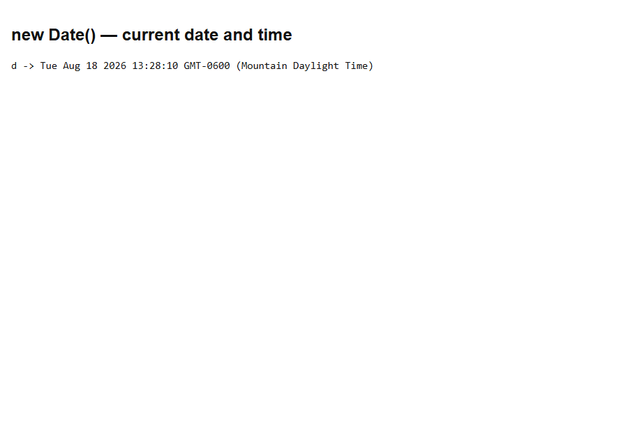

- [x] **Outcome:** The snap shows the **browser's current local** date/time.

<a id="js-date-methods-example-02"></a>

### **Example 2: constructor — creates a new Date object**

- [x] The **Date constructor** creates a Date from a string, numbers, or ms.
- [x] This row is the “creates a new Date object” meaning of `constructor`.

Sandbox: `code_sandbox/js-date-methods/constructor-create.html`

```javascript
const d = new Date("2021-03-25T15:30:45.123Z");
d instanceof Date;
```


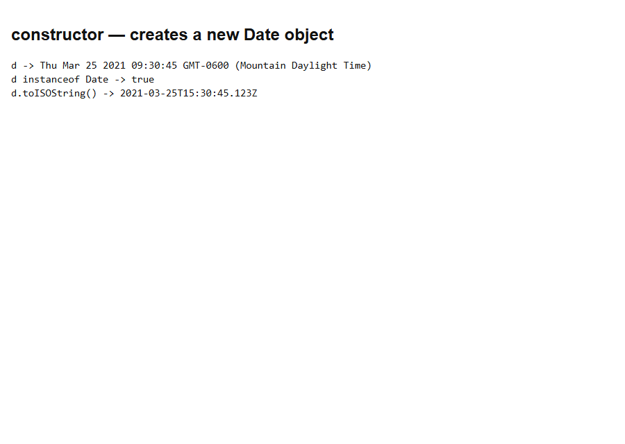

- [x] **Outcome:** d is a Date for **2021-03-25T15:30:45.123Z**. `instanceof Date` is **true**. Local print is **Thu Mar 25 2021 09:30:45 GMT-0600**.

<a id="js-date-methods-example-03"></a>

### **Example 3: constructor — function that created Date.prototype**

- [x] Instance **`constructor`** is the function that created the prototype: **`Date`**.
- [x] This is the second `constructor` row on the table (revised April 2026).

Sandbox: `code_sandbox/js-date-methods/constructor-prototype-fn.html`

```javascript
const d = new Date("2021-03-25T15:30:45.123Z");
d.constructor;
d.constructor === Date;
```

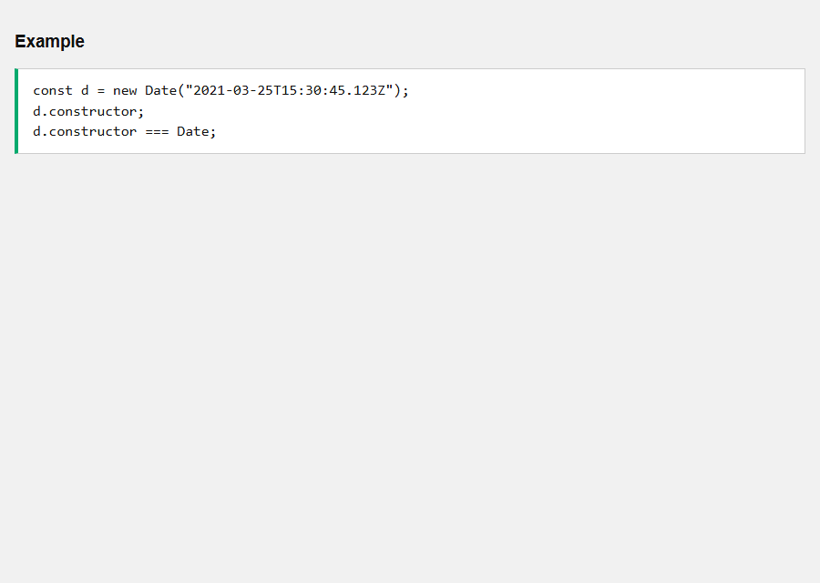

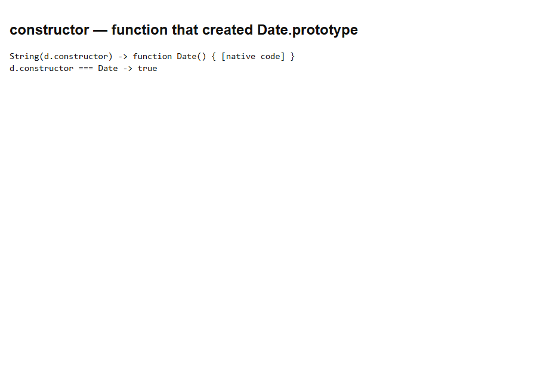

- [x] **Outcome:** `d.constructor` prints **function Date() { [native code] }**. `d.constructor === Date` is **true**.

<a id="js-date-methods-example-04"></a>

### **Example 4: getDate()**

- [x] `getDate()` returns the local day of month (1–31).

Sandbox: `code_sandbox/js-date-methods/get-date.html`

```javascript
const d = new Date("2021-03-25T15:30:45.123Z");
d.getDate();
```

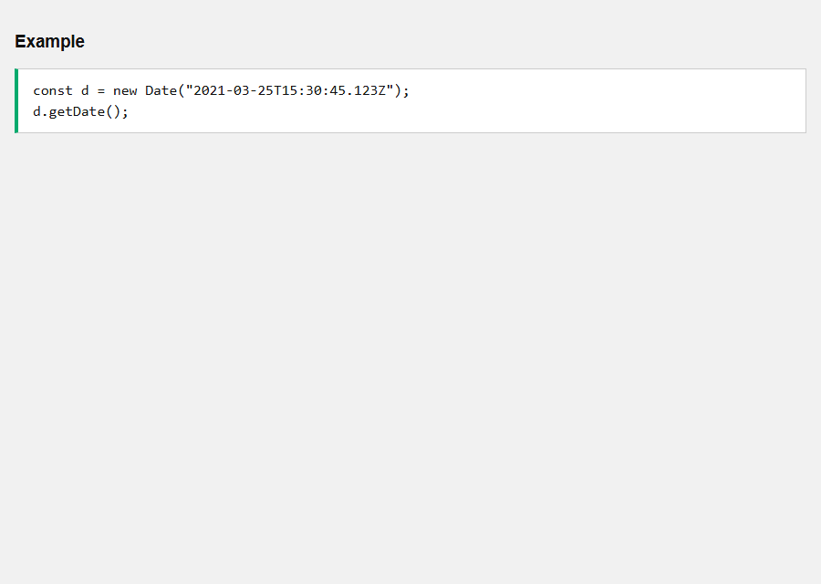


- [x] **Outcome:** `getDate()` is **25** on `2021-03-25T15:30:45.123Z` (local **Thu Mar 25 2021 09:30:45 GMT-0600**).

<a id="js-date-methods-example-05"></a>

### **Example 5: getDay()**

- [x] `getDay()` returns the local weekday (0–6, Sunday = 0).
- [x] March 25 2021 local was **Thursday**.

Sandbox: `code_sandbox/js-date-methods/get-day.html`

```javascript
const d = new Date("2021-03-25T15:30:45.123Z");
d.getDay();
```


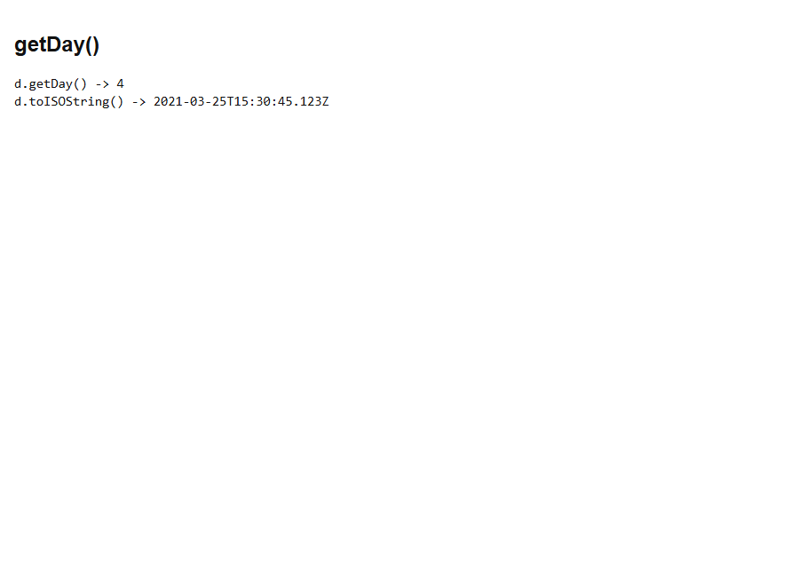

- [x] **Outcome:** `getDay()` is **4** on `2021-03-25T15:30:45.123Z` (local **Thu Mar 25 2021 09:30:45 GMT-0600**).

<a id="js-date-methods-example-06"></a>

### **Example 6: getFullYear()**

- [x] `getFullYear()` returns the local four-digit year.

Sandbox: `code_sandbox/js-date-methods/get-full-year.html`

```javascript
const d = new Date("2021-03-25T15:30:45.123Z");
d.getFullYear();
```


- [x] **Outcome:** `getFullYear()` is **2021** on `2021-03-25T15:30:45.123Z` (local **Thu Mar 25 2021 09:30:45 GMT-0600**).

<a id="js-date-methods-example-07"></a>

### **Example 7: getHours()**

- [x] `getHours()` returns the local hour (0–23).

Sandbox: `code_sandbox/js-date-methods/get-hours.html`

```javascript
const d = new Date("2021-03-25T15:30:45.123Z");
d.getHours();
```


- [x] **Outcome:** `getHours()` is **9** on `2021-03-25T15:30:45.123Z` (local **Thu Mar 25 2021 09:30:45 GMT-0600**).

<a id="js-date-methods-example-08"></a>

### **Example 8: getMilliseconds()**

- [x] `getMilliseconds()` returns local milliseconds (0–999).

Sandbox: `code_sandbox/js-date-methods/get-milliseconds.html`

```javascript
const d = new Date("2021-03-25T15:30:45.123Z");
d.getMilliseconds();
```


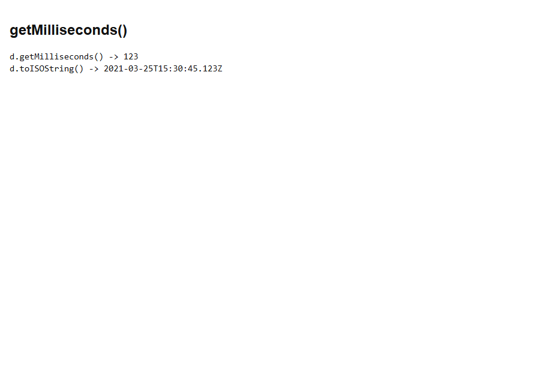

- [x] **Outcome:** `getMilliseconds()` is **123** on `2021-03-25T15:30:45.123Z` (local **Thu Mar 25 2021 09:30:45 GMT-0600**).

<a id="js-date-methods-example-09"></a>

### **Example 9: getMinutes()**

- [x] `getMinutes()` returns the local minutes (0–59).

Sandbox: `code_sandbox/js-date-methods/get-minutes.html`

```javascript
const d = new Date("2021-03-25T15:30:45.123Z");
d.getMinutes();
```


- [x] **Outcome:** `getMinutes()` is **30** on `2021-03-25T15:30:45.123Z` (local **Thu Mar 25 2021 09:30:45 GMT-0600**).

<a id="js-date-methods-example-10"></a>

### **Example 10: getMonth()**

- [x] `getMonth()` returns the local month (0–11).
- [x] March is **2**.

Sandbox: `code_sandbox/js-date-methods/get-month.html`

```javascript
const d = new Date("2021-03-25T15:30:45.123Z");
d.getMonth();
```


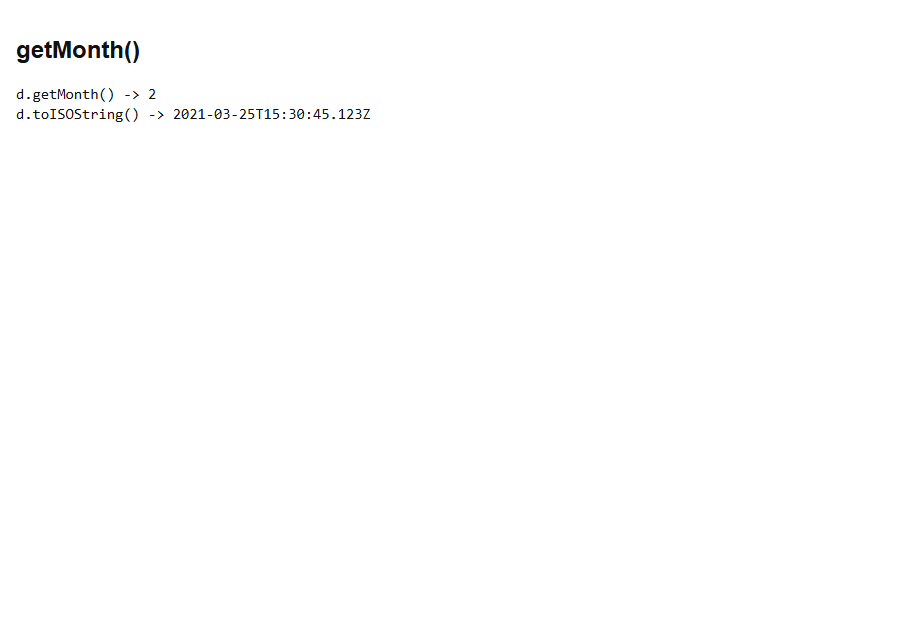

- [x] **Outcome:** `getMonth()` is **2** on `2021-03-25T15:30:45.123Z` (local **Thu Mar 25 2021 09:30:45 GMT-0600**).

<a id="js-date-methods-example-11"></a>

### **Example 11: getSeconds()**

- [x] `getSeconds()` returns the local seconds (0–59).

Sandbox: `code_sandbox/js-date-methods/get-seconds.html`

```javascript
const d = new Date("2021-03-25T15:30:45.123Z");
d.getSeconds();
```


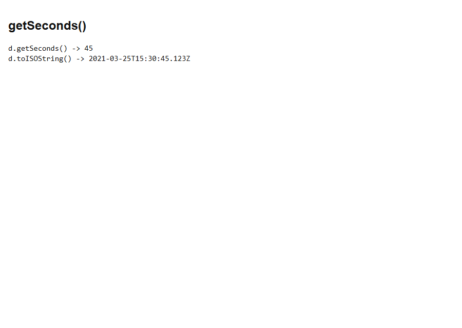

- [x] **Outcome:** `getSeconds()` is **45** on `2021-03-25T15:30:45.123Z` (local **Thu Mar 25 2021 09:30:45 GMT-0600**).

<a id="js-date-methods-example-12"></a>

### **Example 12: getTime()**

- [x] `getTime()` returns ms since 1 Jan 1970 UTC.

Sandbox: `code_sandbox/js-date-methods/get-time.html`

```javascript
const d = new Date("2021-03-25T15:30:45.123Z");
d.getTime();
```


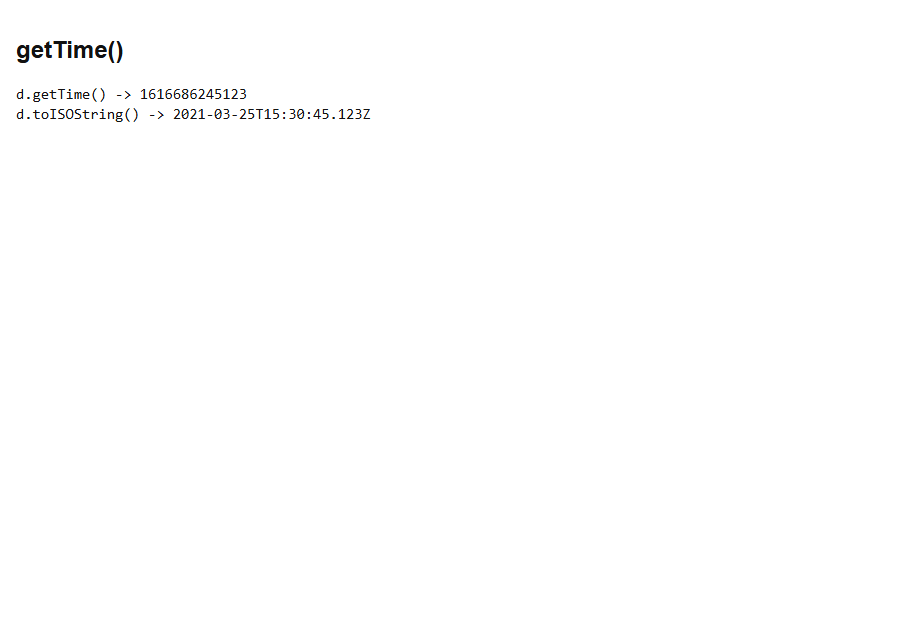

- [x] **Outcome:** `getTime()` is **1616686245123** on `2021-03-25T15:30:45.123Z` (local **Thu Mar 25 2021 09:30:45 GMT-0600**).

<a id="js-date-methods-example-13"></a>

### **Example 13: getTimezoneOffset()**

- [x] `getTimezoneOffset()` returns minutes to add to local time to get UTC.
- [x] This Mountain daylight zone is UTC−6, so **360**.

Sandbox: `code_sandbox/js-date-methods/get-timezone-offset.html`

```javascript
const d = new Date("2021-03-25T15:30:45.123Z");
d.getTimezoneOffset();
```


- [x] **Outcome:** `getTimezoneOffset()` is **360** on `2021-03-25T15:30:45.123Z` (local **Thu Mar 25 2021 09:30:45 GMT-0600**).

<a id="js-date-methods-example-14"></a>

### **Example 14: getUTCDate()**

- [x] `getUTCDate()` returns the UTC day of month (1–31).

Sandbox: `code_sandbox/js-date-methods/get-utc-date.html`

```javascript
const d = new Date("2021-03-25T15:30:45.123Z");
d.getUTCDate();
```


- [x] **Outcome:** `getUTCDate()` is **25** on `2021-03-25T15:30:45.123Z` (local **Thu Mar 25 2021 09:30:45 GMT-0600**).

<a id="js-date-methods-example-15"></a>

### **Example 15: getUTCDay()**

- [x] `getUTCDay()` returns the UTC weekday (0–6).

Sandbox: `code_sandbox/js-date-methods/get-utc-day.html`

```javascript
const d = new Date("2021-03-25T15:30:45.123Z");
d.getUTCDay();
```


- [x] **Outcome:** `getUTCDay()` is **4** on `2021-03-25T15:30:45.123Z` (local **Thu Mar 25 2021 09:30:45 GMT-0600**).

<a id="js-date-methods-example-16"></a>

### **Example 16: getUTCFullYear()**

- [x] `getUTCFullYear()` returns the UTC year.

Sandbox: `code_sandbox/js-date-methods/get-utc-full-year.html`

```javascript
const d = new Date("2021-03-25T15:30:45.123Z");
d.getUTCFullYear();
```


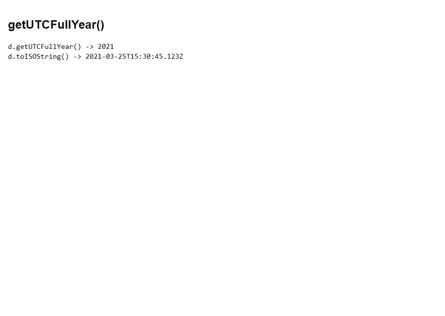

- [x] **Outcome:** `getUTCFullYear()` is **2021** on `2021-03-25T15:30:45.123Z` (local **Thu Mar 25 2021 09:30:45 GMT-0600**).

<a id="js-date-methods-example-17"></a>

### **Example 17: getUTCHours()**

- [x] `getUTCHours()` returns the UTC hour (0–23).

Sandbox: `code_sandbox/js-date-methods/get-utc-hours.html`

```javascript
const d = new Date("2021-03-25T15:30:45.123Z");
d.getUTCHours();
```


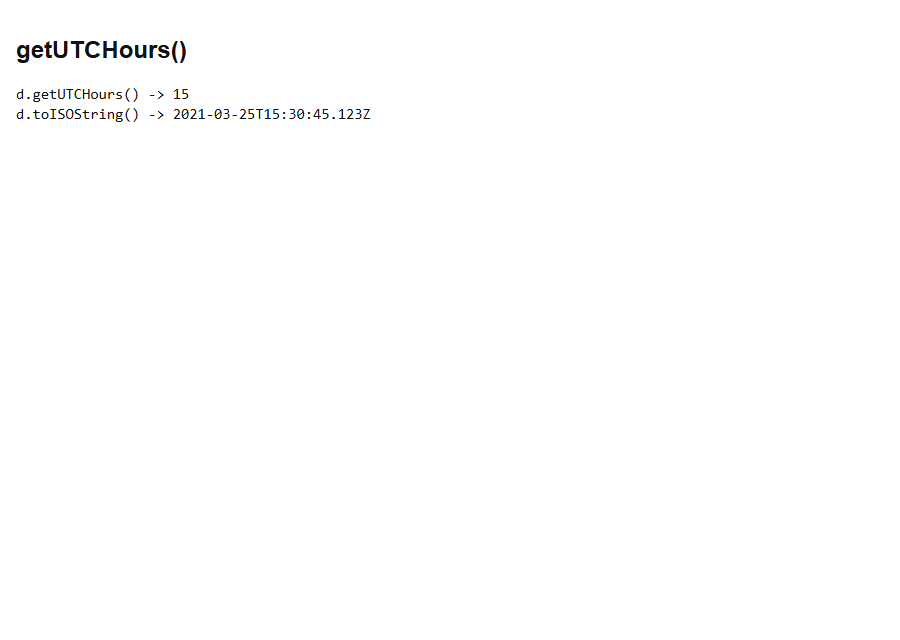

- [x] **Outcome:** `getUTCHours()` is **15** on `2021-03-25T15:30:45.123Z` (local **Thu Mar 25 2021 09:30:45 GMT-0600**).

<a id="js-date-methods-example-18"></a>

### **Example 18: getUTCMilliseconds()**

- [x] `getUTCMilliseconds()` returns UTC milliseconds (0–999).

Sandbox: `code_sandbox/js-date-methods/get-utc-milliseconds.html`

```javascript
const d = new Date("2021-03-25T15:30:45.123Z");
d.getUTCMilliseconds();
```


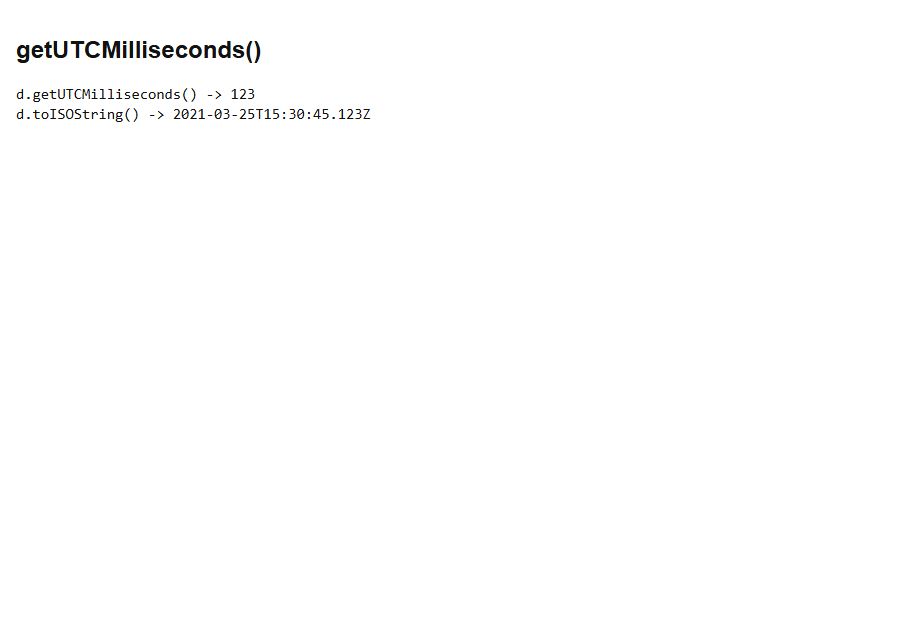

- [x] **Outcome:** `getUTCMilliseconds()` is **123** on `2021-03-25T15:30:45.123Z` (local **Thu Mar 25 2021 09:30:45 GMT-0600**).

<a id="js-date-methods-example-19"></a>

### **Example 19: getUTCMinutes()**

- [x] `getUTCMinutes()` returns UTC minutes (0–59).

Sandbox: `code_sandbox/js-date-methods/get-utc-minutes.html`

```javascript
const d = new Date("2021-03-25T15:30:45.123Z");
d.getUTCMinutes();
```

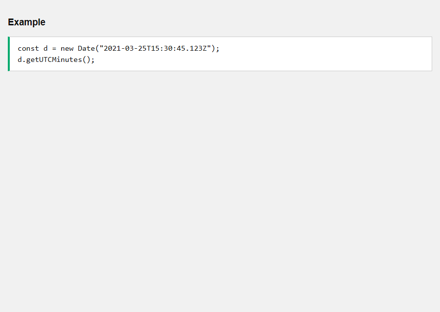

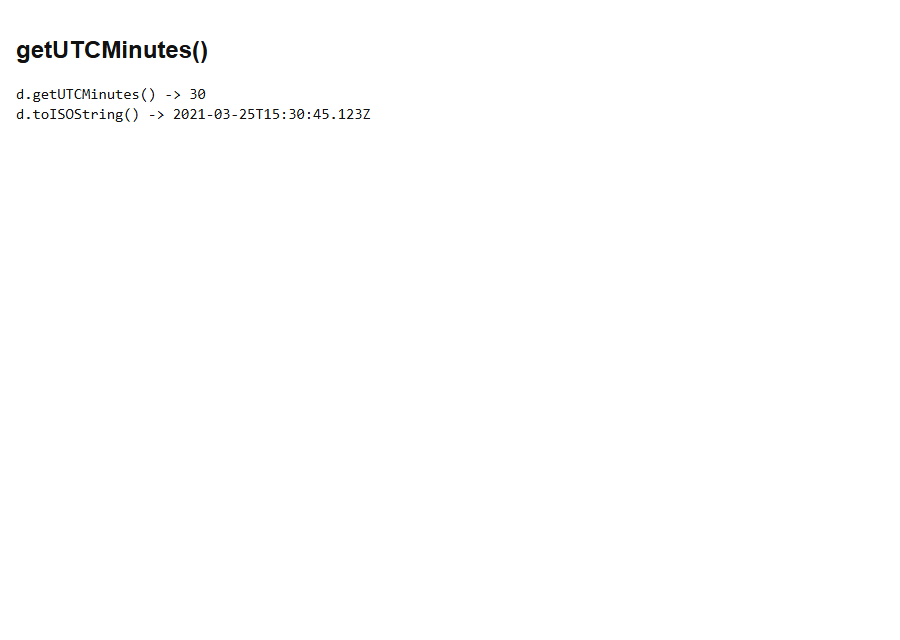

- [x] **Outcome:** `getUTCMinutes()` is **30** on `2021-03-25T15:30:45.123Z` (local **Thu Mar 25 2021 09:30:45 GMT-0600**).

<a id="js-date-methods-example-20"></a>

### **Example 20: getUTCMonth()**

- [x] `getUTCMonth()` returns the UTC month (0–11).

Sandbox: `code_sandbox/js-date-methods/get-utc-month.html`

```javascript
const d = new Date("2021-03-25T15:30:45.123Z");
d.getUTCMonth();
```

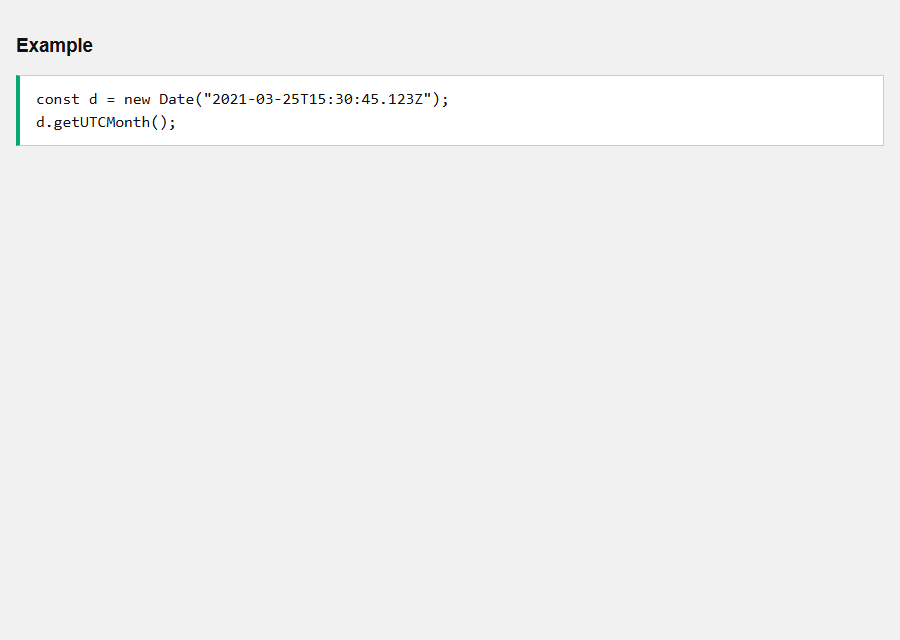

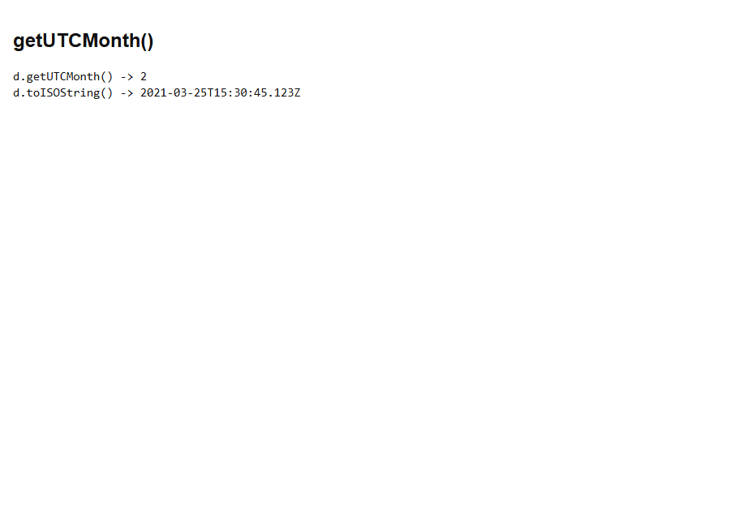

- [x] **Outcome:** `getUTCMonth()` is **2** on `2021-03-25T15:30:45.123Z` (local **Thu Mar 25 2021 09:30:45 GMT-0600**).

<a id="js-date-methods-example-21"></a>

### **Example 21: getUTCSeconds()**

- [x] `getUTCSeconds()` returns UTC seconds (0–59).

Sandbox: `code_sandbox/js-date-methods/get-utc-seconds.html`

```javascript
const d = new Date("2021-03-25T15:30:45.123Z");
d.getUTCSeconds();
```


- [x] **Outcome:** `getUTCSeconds()` is **45** on `2021-03-25T15:30:45.123Z` (local **Thu Mar 25 2021 09:30:45 GMT-0600**).

<a id="js-date-methods-example-22"></a>

### **Example 22: getYear() — deprecated; use getFullYear()**

- [x] **Deprecated.** Often returns **year − 1900**. **Do not use.** Use **`getFullYear()`**.

Sandbox: `code_sandbox/js-date-methods/get-year-deprecated.html`

```javascript
const d = new Date("2021-03-25T15:30:45.123Z");
d.getYear();
d.getFullYear();
```

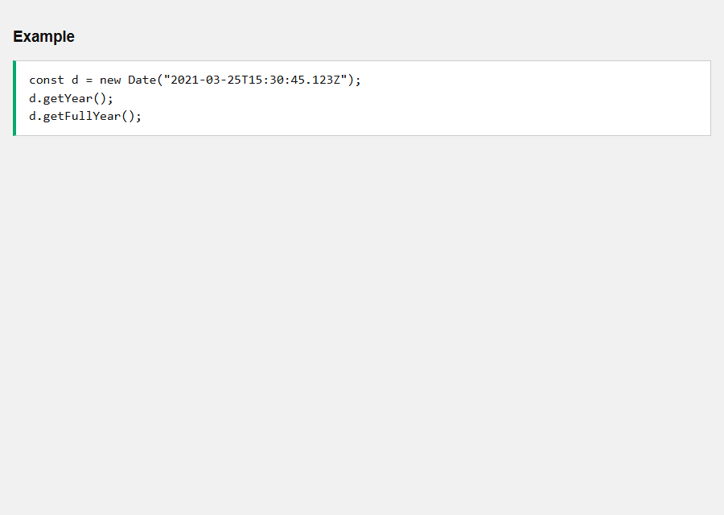


- [x] **Outcome:** `getYear()` is **121**. `getFullYear()` is **2021**. Do **not** use `getYear()`.

<a id="js-date-methods-example-23"></a>

### **Example 23: now() — Date.now()**

- [x] `Date.now()` is **static**: ms since the epoch **right now**.
- [x] Call it on **Date**, not on an instance.

Sandbox: `code_sandbox/js-date-methods/date-now.html`

```javascript
let ms = Date.now();
```


- [x] **Outcome:** The snap shows the **browser's current** `Date.now()` millisecond count.

<a id="js-date-methods-example-24"></a>

### **Example 24: parse() — Date.parse()**

- [x] `Date.parse(string)` returns ms since the epoch, or **NaN** if it cannot parse.

Sandbox: `code_sandbox/js-date-methods/date-parse.html`

```javascript
let msec = Date.parse("2021-03-25T15:30:45.123Z");
```

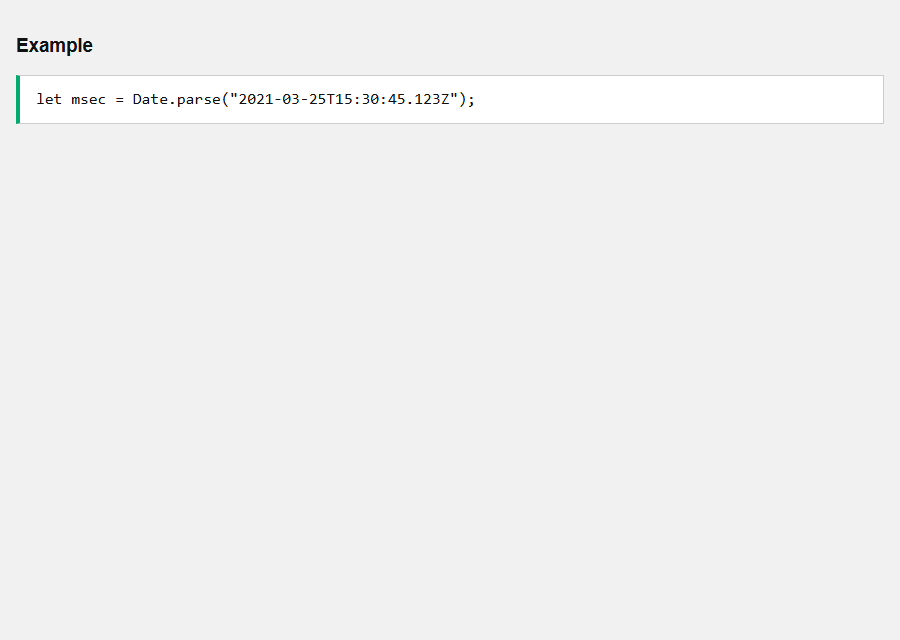

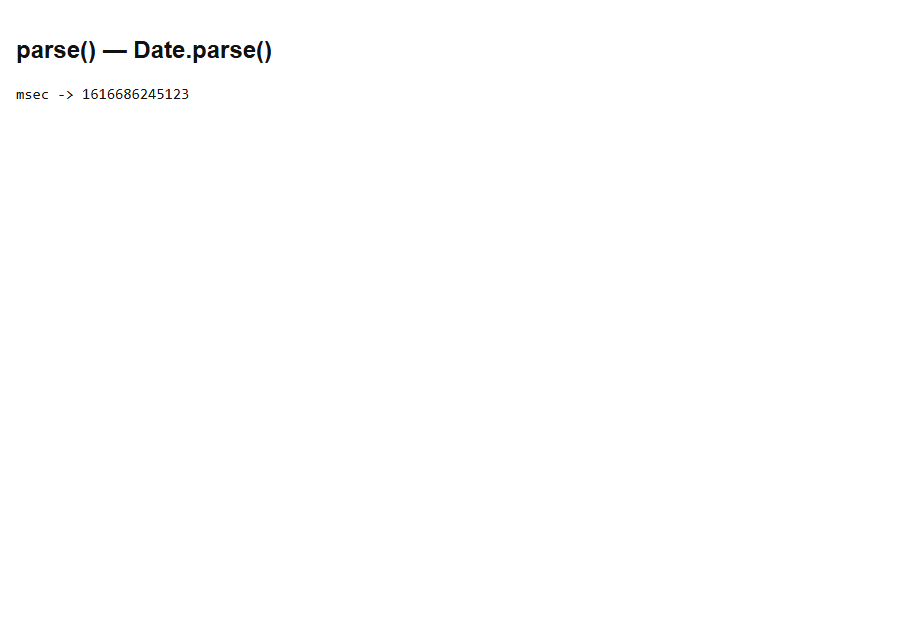

- [x] **Outcome:** `Date.parse` of this ISO UTC string is **1616686245123** (same as `getTime()` on that instant).

<a id="js-date-methods-example-25"></a>

### **Example 25: prototype — tiny add-on (this page only)**

- [x] `Date.prototype` lets you add methods. Prefer **not** to ship prototype pollution.
- [x] A function on `Date.prototype` **in this page only** is OK as a demo.

Sandbox: `code_sandbox/js-date-methods/date-prototype.html`

```javascript
Date.prototype.toISODate = function () {
  return this.toISOString().slice(0, 10);
};
const d = new Date("2021-03-25T15:30:45.123Z");
d.toISODate();
```

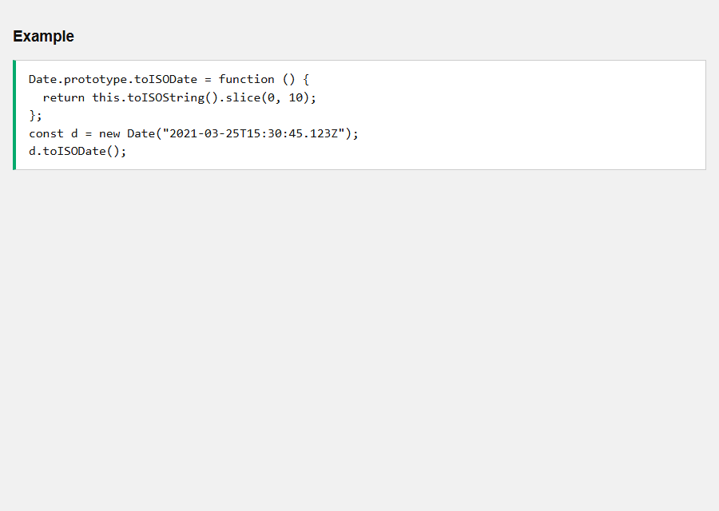

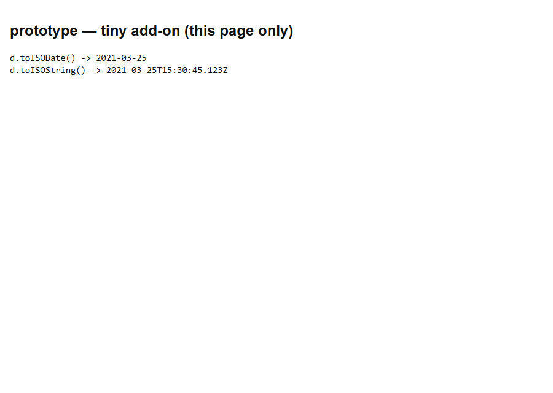

- [x] **Outcome:** `toISODate()` is **"2021-03-25"** (UTC calendar date). Isolated to this sandbox file.

<a id="js-date-methods-example-26"></a>

### **Example 26: setDate(1)**

- [x] `setDate(1)` sets the local day of month.
- [x] Fixed start: `new Date("2021-03-25T15:30:45.123Z")`. Show the date **after** the set.

Sandbox: `code_sandbox/js-date-methods/set-date.html`

```javascript
const d = new Date("2021-03-25T15:30:45.123Z");
d.setDate(1);
```

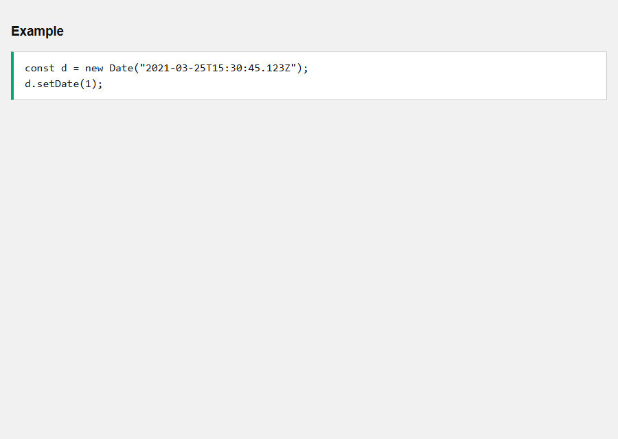

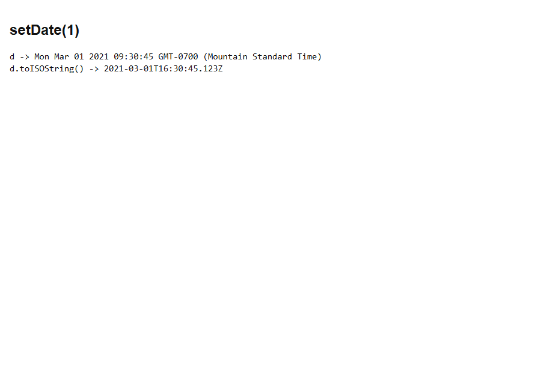

- [x] **Outcome:** After `setDate(1)`, local print is **Mon Mar 01 2021 09:30:45 GMT-0700 (Mountain Standard Time)**. ISO is **2021-03-01T16:30:45.123Z**.

<a id="js-date-methods-example-27"></a>

### **Example 27: setFullYear(2020)**

- [x] `setFullYear(2020)` sets the local year.
- [x] Fixed start: `new Date("2021-03-25T15:30:45.123Z")`. Show the date **after** the set.

Sandbox: `code_sandbox/js-date-methods/set-full-year.html`

```javascript
const d = new Date("2021-03-25T15:30:45.123Z");
d.setFullYear(2020);
```


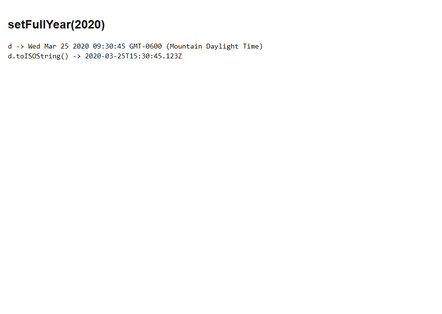

- [x] **Outcome:** After `setFullYear(2020)`, local print is **Wed Mar 25 2020 09:30:45 GMT-0600 (Mountain Daylight Time)**. ISO is **2020-03-25T15:30:45.123Z**.

<a id="js-date-methods-example-28"></a>

### **Example 28: setHours(0)**

- [x] `setHours(0)` sets the local hour (0–23).
- [x] Fixed start: `new Date("2021-03-25T15:30:45.123Z")`. Show the date **after** the set.

Sandbox: `code_sandbox/js-date-methods/set-hours.html`

```javascript
const d = new Date("2021-03-25T15:30:45.123Z");
d.setHours(0);
```


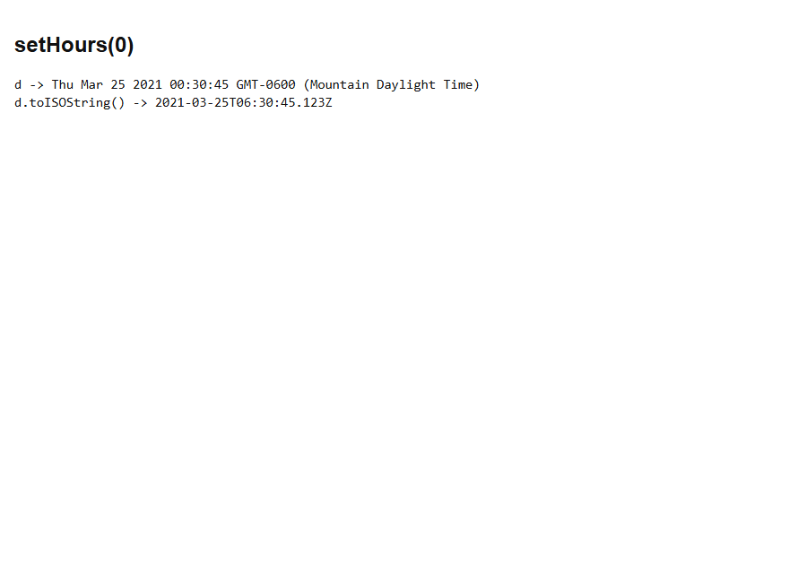

- [x] **Outcome:** After `setHours(0)`, local print is **Thu Mar 25 2021 00:30:45 GMT-0600 (Mountain Daylight Time)**. ISO is **2021-03-25T06:30:45.123Z**.

<a id="js-date-methods-example-29"></a>

### **Example 29: setMilliseconds(0)**

- [x] `setMilliseconds(0)` sets local milliseconds.
- [x] Fixed start: `new Date("2021-03-25T15:30:45.123Z")`. Show the date **after** the set.

Sandbox: `code_sandbox/js-date-methods/set-milliseconds.html`

```javascript
const d = new Date("2021-03-25T15:30:45.123Z");
d.setMilliseconds(0);
```


- [x] **Outcome:** After `setMilliseconds(0)`, local print is **Thu Mar 25 2021 09:30:45 GMT-0600 (Mountain Daylight Time)**. ISO is **2021-03-25T15:30:45.000Z**.

<a id="js-date-methods-example-30"></a>

### **Example 30: setMinutes(0)**

- [x] `setMinutes(0)` sets local minutes.
- [x] Fixed start: `new Date("2021-03-25T15:30:45.123Z")`. Show the date **after** the set.

Sandbox: `code_sandbox/js-date-methods/set-minutes.html`

```javascript
const d = new Date("2021-03-25T15:30:45.123Z");
d.setMinutes(0);
```


- [x] **Outcome:** After `setMinutes(0)`, local print is **Thu Mar 25 2021 09:00:45 GMT-0600 (Mountain Daylight Time)**. ISO is **2021-03-25T15:00:45.123Z**.

<a id="js-date-methods-example-31"></a>

### **Example 31: setMonth(0)**

- [x] `setMonth(0)` sets the local month (0–11); 0 is January.
- [x] Fixed start: `new Date("2021-03-25T15:30:45.123Z")`. Show the date **after** the set.

Sandbox: `code_sandbox/js-date-methods/set-month.html`

```javascript
const d = new Date("2021-03-25T15:30:45.123Z");
d.setMonth(0);
```


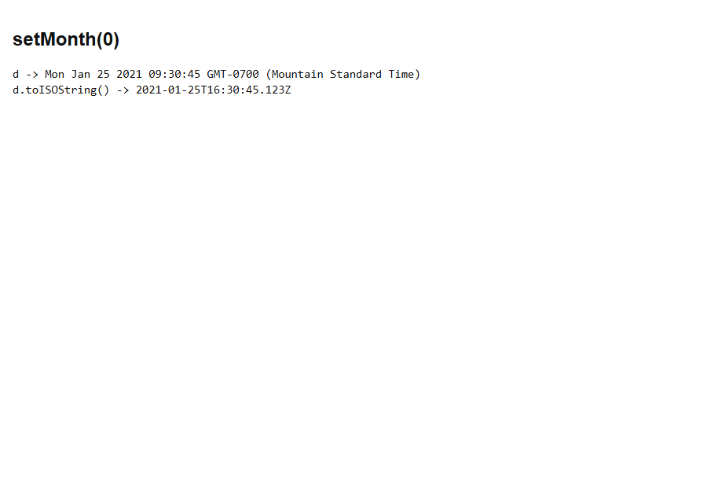

- [x] **Outcome:** After `setMonth(0)`, local print is **Mon Jan 25 2021 09:30:45 GMT-0700 (Mountain Standard Time)**. ISO is **2021-01-25T16:30:45.123Z**.

<a id="js-date-methods-example-32"></a>

### **Example 32: setSeconds(0)**

- [x] `setSeconds(0)` sets local seconds.
- [x] Fixed start: `new Date("2021-03-25T15:30:45.123Z")`. Show the date **after** the set.

Sandbox: `code_sandbox/js-date-methods/set-seconds.html`

```javascript
const d = new Date("2021-03-25T15:30:45.123Z");
d.setSeconds(0);
```


- [x] **Outcome:** After `setSeconds(0)`, local print is **Thu Mar 25 2021 09:30:00 GMT-0600 (Mountain Daylight Time)**. ISO is **2021-03-25T15:30:00.123Z**.

<a id="js-date-methods-example-33"></a>

### **Example 33: setTime(0)**

- [x] `setTime(0)` sets ms since 1 Jan 1970 UTC; 0 is the epoch.
- [x] Fixed start: `new Date("2021-03-25T15:30:45.123Z")`. Show the date **after** the set.

Sandbox: `code_sandbox/js-date-methods/set-time.html`

```javascript
const d = new Date("2021-03-25T15:30:45.123Z");
d.setTime(0);
```


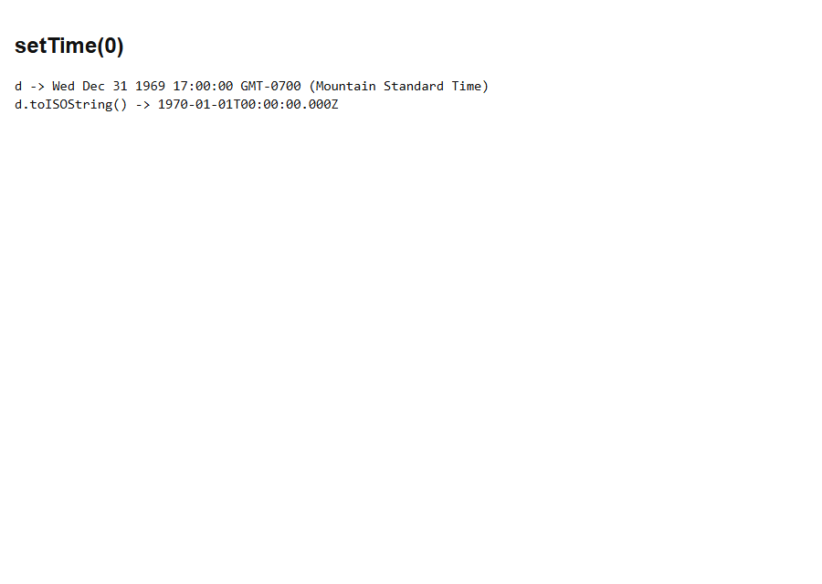

- [x] **Outcome:** After `setTime(0)`, local print is **Wed Dec 31 1969 17:00:00 GMT-0700 (Mountain Standard Time)**. ISO is **1970-01-01T00:00:00.000Z**.

<a id="js-date-methods-example-34"></a>

### **Example 34: setUTCDate(1)**

- [x] `setUTCDate(1)` sets the UTC day of month.
- [x] Fixed start: `new Date("2021-03-25T15:30:45.123Z")`. Show the date **after** the set.

Sandbox: `code_sandbox/js-date-methods/set-utc-date.html`

```javascript
const d = new Date("2021-03-25T15:30:45.123Z");
d.setUTCDate(1);
```


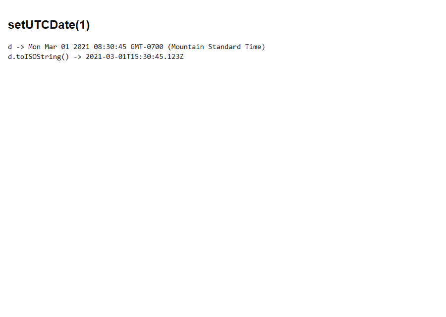

- [x] **Outcome:** After `setUTCDate(1)`, local print is **Mon Mar 01 2021 08:30:45 GMT-0700 (Mountain Standard Time)**. ISO is **2021-03-01T15:30:45.123Z**.

<a id="js-date-methods-example-35"></a>

### **Example 35: setUTCFullYear(2020)**

- [x] `setUTCFullYear(2020)` sets the UTC year.
- [x] Fixed start: `new Date("2021-03-25T15:30:45.123Z")`. Show the date **after** the set.

Sandbox: `code_sandbox/js-date-methods/set-utc-full-year.html`

```javascript
const d = new Date("2021-03-25T15:30:45.123Z");
d.setUTCFullYear(2020);
```

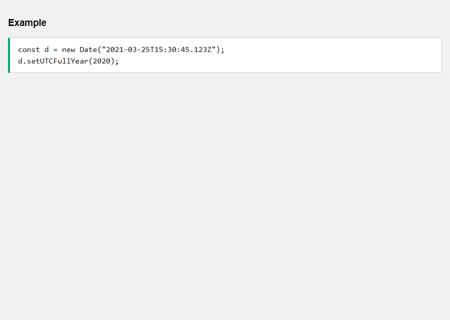


- [x] **Outcome:** After `setUTCFullYear(2020)`, local print is **Wed Mar 25 2020 09:30:45 GMT-0600 (Mountain Daylight Time)**. ISO is **2020-03-25T15:30:45.123Z**.

<a id="js-date-methods-example-36"></a>

### **Example 36: setUTCHours(0)**

- [x] `setUTCHours(0)` sets the UTC hour.
- [x] Fixed start: `new Date("2021-03-25T15:30:45.123Z")`. Show the date **after** the set.

Sandbox: `code_sandbox/js-date-methods/set-utc-hours.html`

```javascript
const d = new Date("2021-03-25T15:30:45.123Z");
d.setUTCHours(0);
```


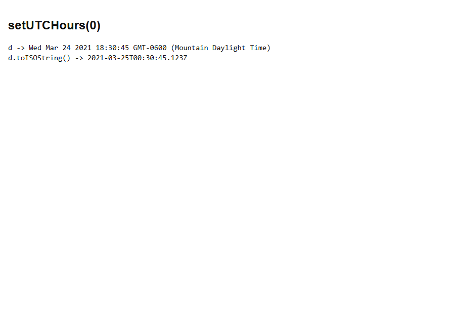

- [x] **Outcome:** After `setUTCHours(0)`, local print is **Wed Mar 24 2021 18:30:45 GMT-0600 (Mountain Daylight Time)**. ISO is **2021-03-25T00:30:45.123Z**.

<a id="js-date-methods-example-37"></a>

### **Example 37: setUTCMilliseconds(0)**

- [x] `setUTCMilliseconds(0)` sets UTC milliseconds.
- [x] Fixed start: `new Date("2021-03-25T15:30:45.123Z")`. Show the date **after** the set.

Sandbox: `code_sandbox/js-date-methods/set-utc-milliseconds.html`

```javascript
const d = new Date("2021-03-25T15:30:45.123Z");
d.setUTCMilliseconds(0);
```


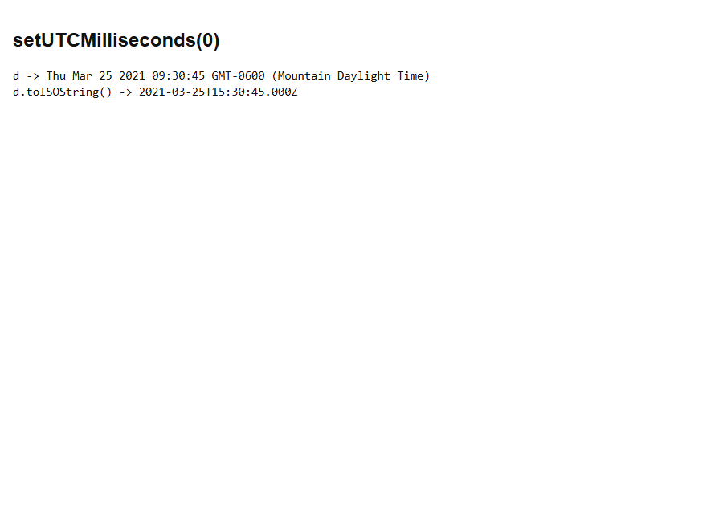

- [x] **Outcome:** After `setUTCMilliseconds(0)`, local print is **Thu Mar 25 2021 09:30:45 GMT-0600 (Mountain Daylight Time)**. ISO is **2021-03-25T15:30:45.000Z**.

<a id="js-date-methods-example-38"></a>

### **Example 38: setUTCMinutes(0)**

- [x] `setUTCMinutes(0)` sets UTC minutes.
- [x] Fixed start: `new Date("2021-03-25T15:30:45.123Z")`. Show the date **after** the set.

Sandbox: `code_sandbox/js-date-methods/set-utc-minutes.html`

```javascript
const d = new Date("2021-03-25T15:30:45.123Z");
d.setUTCMinutes(0);
```


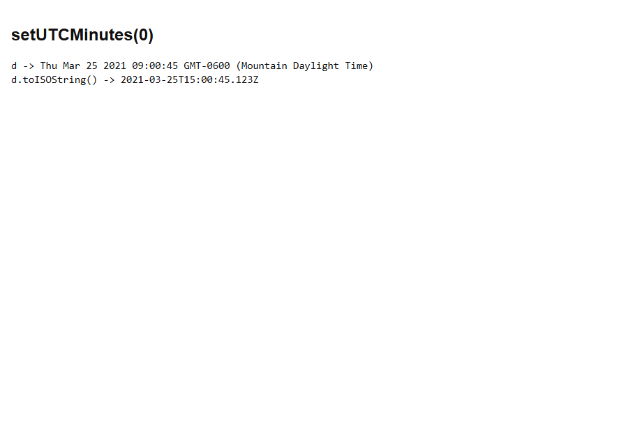

- [x] **Outcome:** After `setUTCMinutes(0)`, local print is **Thu Mar 25 2021 09:00:45 GMT-0600 (Mountain Daylight Time)**. ISO is **2021-03-25T15:00:45.123Z**.

<a id="js-date-methods-example-39"></a>

### **Example 39: setUTCMonth(0)**

- [x] `setUTCMonth(0)` sets the UTC month (0–11).
- [x] Fixed start: `new Date("2021-03-25T15:30:45.123Z")`. Show the date **after** the set.

Sandbox: `code_sandbox/js-date-methods/set-utc-month.html`

```javascript
const d = new Date("2021-03-25T15:30:45.123Z");
d.setUTCMonth(0);
```


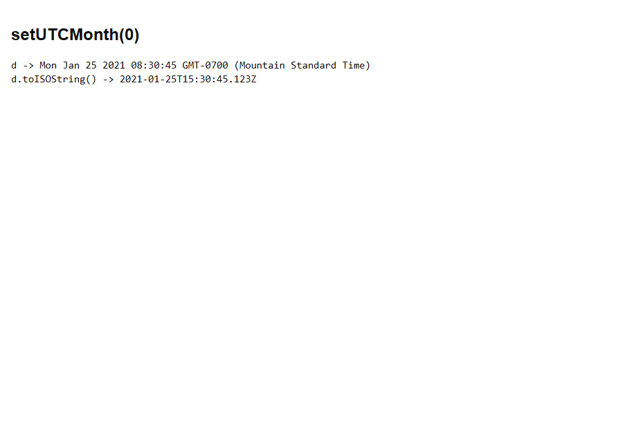

- [x] **Outcome:** After `setUTCMonth(0)`, local print is **Mon Jan 25 2021 08:30:45 GMT-0700 (Mountain Standard Time)**. ISO is **2021-01-25T15:30:45.123Z**.

<a id="js-date-methods-example-40"></a>

### **Example 40: setUTCSeconds(0)**

- [x] `setUTCSeconds(0)` sets UTC seconds.
- [x] Fixed start: `new Date("2021-03-25T15:30:45.123Z")`. Show the date **after** the set.

Sandbox: `code_sandbox/js-date-methods/set-utc-seconds.html`

```javascript
const d = new Date("2021-03-25T15:30:45.123Z");
d.setUTCSeconds(0);
```

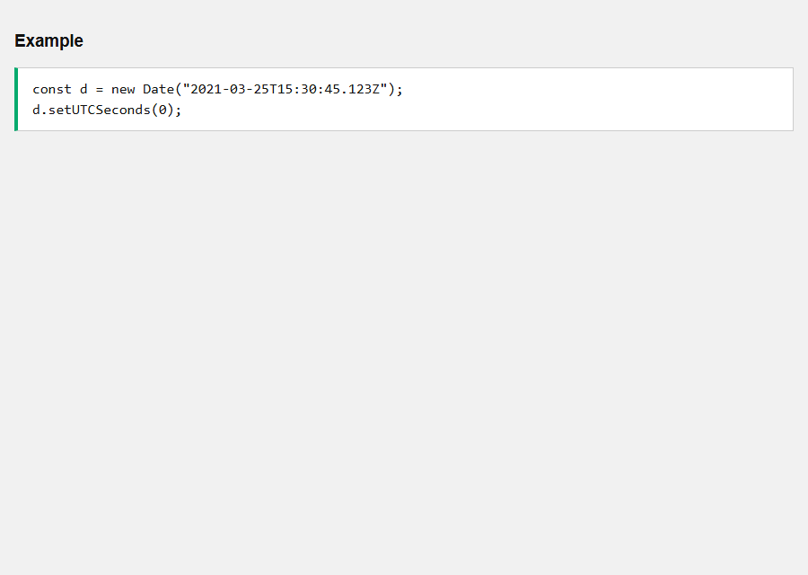

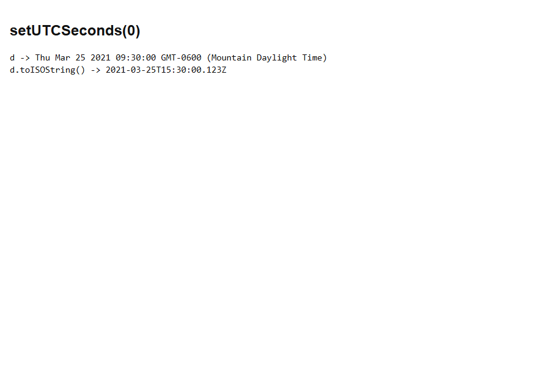

- [x] **Outcome:** After `setUTCSeconds(0)`, local print is **Thu Mar 25 2021 09:30:00 GMT-0600 (Mountain Daylight Time)**. ISO is **2021-03-25T15:30:00.123Z**.

<a id="js-date-methods-example-41"></a>

### **Example 41: setYear(99) — deprecated; use setFullYear()**

- [x] **Deprecated.** Years **0–99** become **19xx**. **Do not use.** Use **`setFullYear()`**.

Sandbox: `code_sandbox/js-date-methods/set-year-deprecated.html`

```javascript
const d = new Date("2021-03-25T15:30:45.123Z");
d.setYear(99);
```


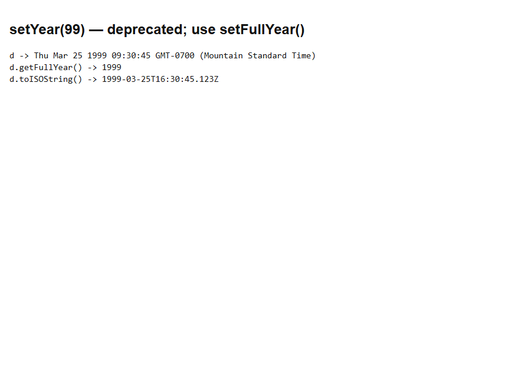

- [x] **Outcome:** After `setYear(99)`, local print is **Thu Mar 25 1999 09:30:45 GMT-0700**. `getFullYear()` is **1999**. Do **not** use `setYear()`.

<a id="js-date-methods-example-42"></a>

### **Example 42: toDateString()**

- [x] `toDateString()` is a readable **local date** (no time).

Sandbox: `code_sandbox/js-date-methods/to-date-string.html`

```javascript
const d = new Date("2021-03-25T15:30:45.123Z");
d.toDateString();
```


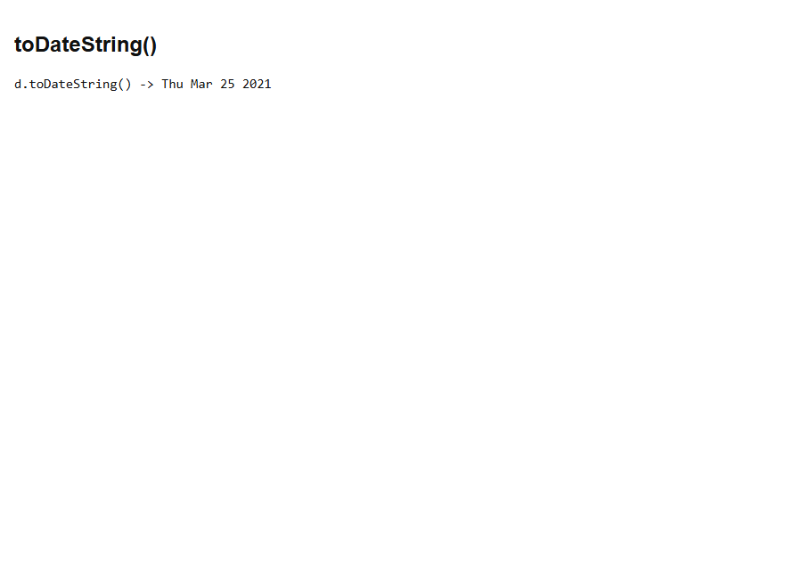

- [x] **Outcome:** `toDateString()` is **"Thu Mar 25 2021"**.

<a id="js-date-methods-example-43"></a>

### **Example 43: toGMTString() — deprecated; use toUTCString()**

- [x] **Deprecated** alias of `toUTCString()`. **Do not use.** Use **`toUTCString()`**.

Sandbox: `code_sandbox/js-date-methods/to-gmt-string-deprecated.html`

```javascript
const d = new Date("2021-03-25T15:30:45.123Z");
d.toGMTString();
d.toUTCString();
```

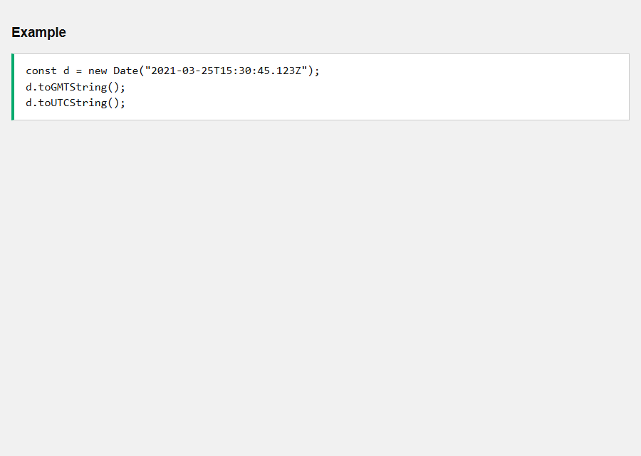

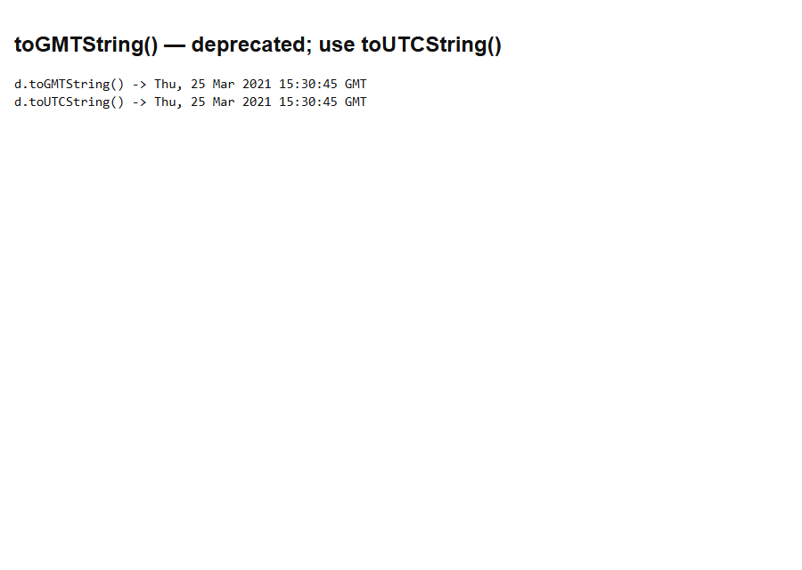

- [x] **Outcome:** Both print **"Thu, 25 Mar 2021 15:30:45 GMT"**. Do **not** use `toGMTString()`.

<a id="js-date-methods-example-44"></a>

### **Example 44: toISOString()**

- [x] `toISOString()` is **ISO 8601 UTC** (`...Z`).

Sandbox: `code_sandbox/js-date-methods/to-iso-string.html`

```javascript
const d = new Date("2021-03-25T15:30:45.123Z");
d.toISOString();
```


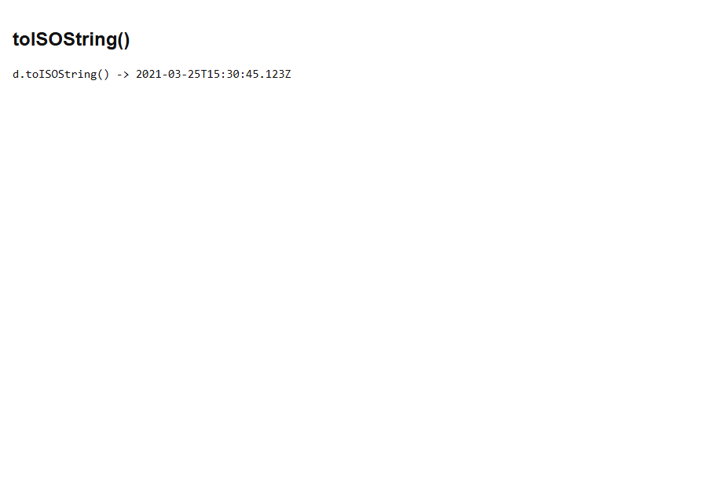

- [x] **Outcome:** `toISOString()` is **"2021-03-25T15:30:45.123Z"**.

<a id="js-date-methods-example-45"></a>

### **Example 45: toJSON()**

- [x] `toJSON()` is the JSON date form — same ISO UTC string as `toISOString()`.

Sandbox: `code_sandbox/js-date-methods/to-json.html`

```javascript
const d = new Date("2021-03-25T15:30:45.123Z");
d.toJSON();
JSON.stringify({ when: d });
```

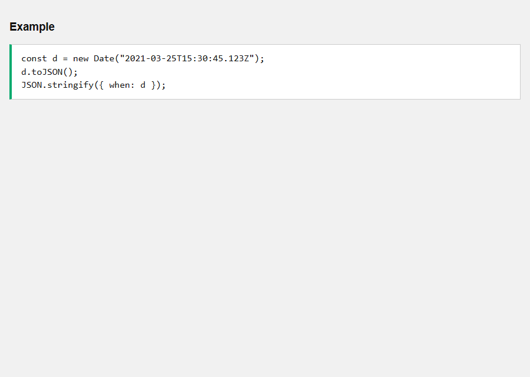

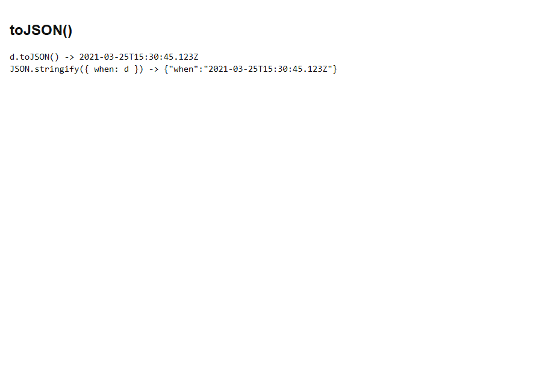

- [x] **Outcome:** `toJSON()` is **"2021-03-25T15:30:45.123Z"**. `JSON.stringify` uses that string.

<a id="js-date-methods-example-46"></a>

### **Example 46: toLocaleDateString()**

- [x] `toLocaleDateString()` is the **date** part using **locale** conventions.

Sandbox: `code_sandbox/js-date-methods/to-locale-date-string.html`

```javascript
const d = new Date("2021-03-25T15:30:45.123Z");
d.toLocaleDateString();
```

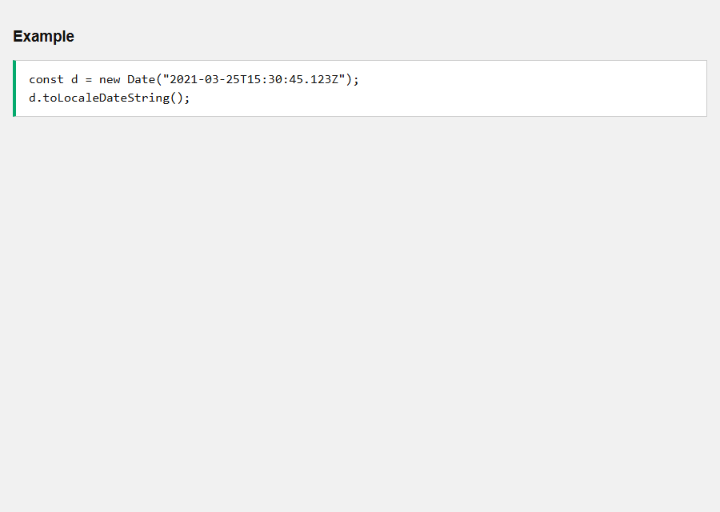

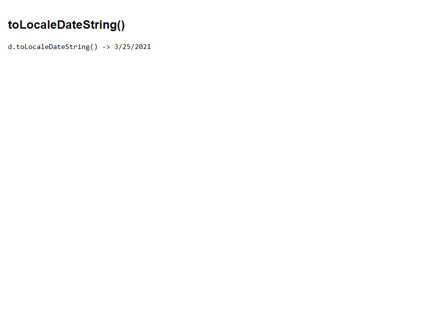

- [x] **Outcome:** The snap shows this browser's **locale date** for the same instant (local **March 25, 2021** — not a hardcoded fake).

<a id="js-date-methods-example-47"></a>

### **Example 47: toLocaleTimeString()**

- [x] `toLocaleTimeString()` is the **time** part using **locale** conventions.

Sandbox: `code_sandbox/js-date-methods/to-locale-time-string.html`

```javascript
const d = new Date("2021-03-25T15:30:45.123Z");
d.toLocaleTimeString();
```


- [x] **Outcome:** The snap shows this browser's **locale time** for **09:30:45** Mountain on that instant.

<a id="js-date-methods-example-48"></a>

### **Example 48: toLocaleString()**

- [x] `toLocaleString()` is **date and time** using locale conventions.

Sandbox: `code_sandbox/js-date-methods/to-locale-string.html`

```javascript
const d = new Date("2021-03-25T15:30:45.123Z");
d.toLocaleString();
```


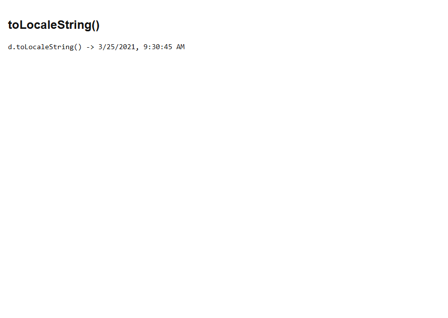

- [x] **Outcome:** The snap shows this browser's **locale date+time** for the same instant.

<a id="js-date-methods-example-49"></a>

### **Example 49: toString()**

- [x] `toString()` is the default print: local date, time, and zone.

Sandbox: `code_sandbox/js-date-methods/to-string.html`

```javascript
const d = new Date("2021-03-25T15:30:45.123Z");
d.toString();
```

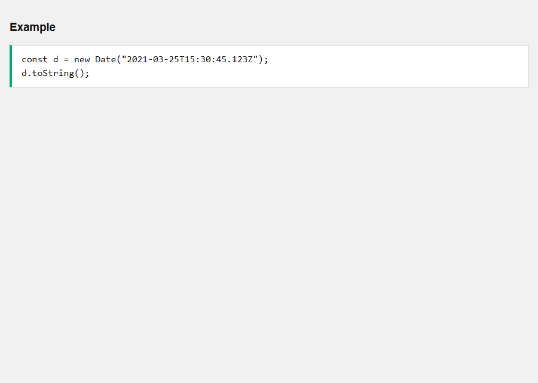

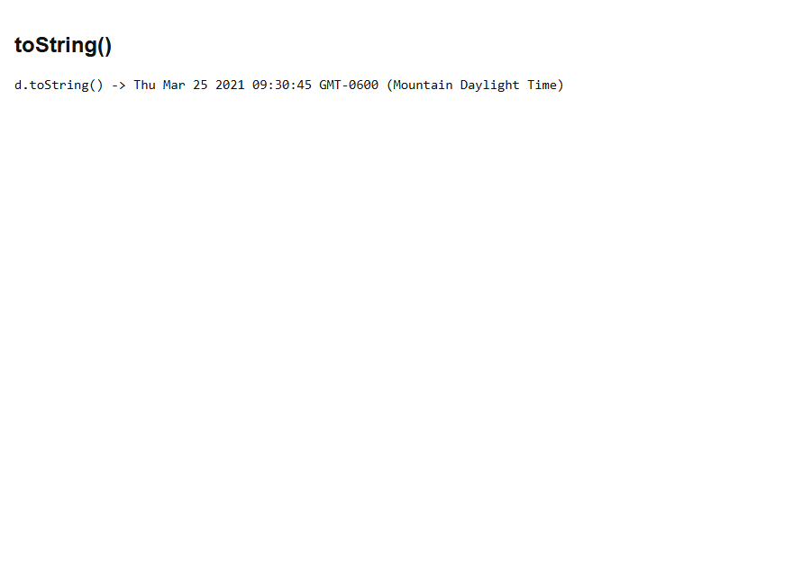

- [x] **Outcome:** `toString()` is **"Thu Mar 25 2021 09:30:45 GMT-0600 (Mountain Daylight Time)"**.

<a id="js-date-methods-example-50"></a>

### **Example 50: toTimeString()**

- [x] `toTimeString()` is the **time + zone** part of `toString()`.

Sandbox: `code_sandbox/js-date-methods/to-time-string.html`

```javascript
const d = new Date("2021-03-25T15:30:45.123Z");
d.toTimeString();
```

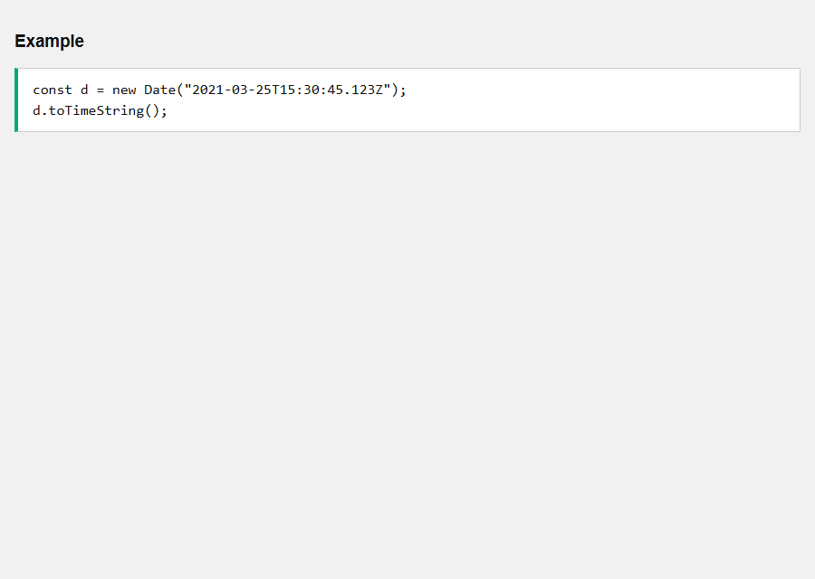

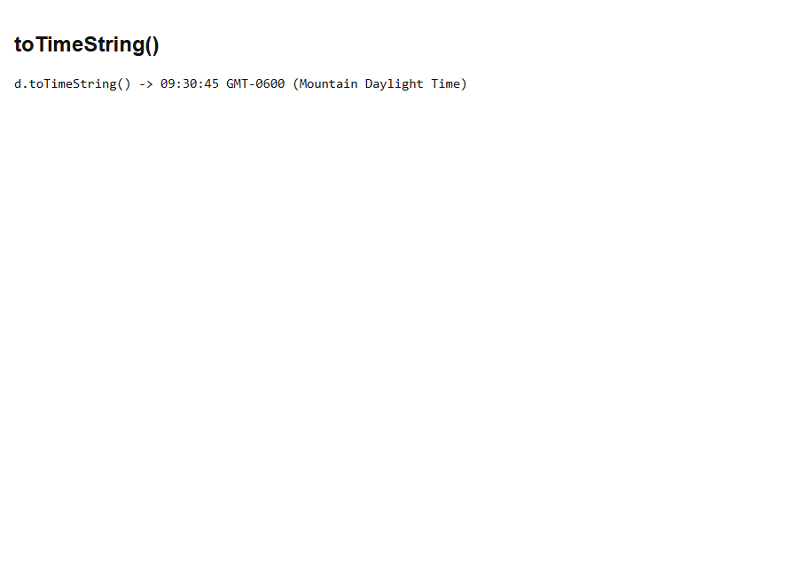

- [x] **Outcome:** `toTimeString()` is **"09:30:45 GMT-0600 (Mountain Daylight Time)"**.

<a id="js-date-methods-example-51"></a>

### **Example 51: toUTCString()**

- [x] `toUTCString()` formats the instant in **UTC / GMT**.

Sandbox: `code_sandbox/js-date-methods/to-utc-string.html`

```javascript
const d = new Date("2021-03-25T15:30:45.123Z");
d.toUTCString();
```


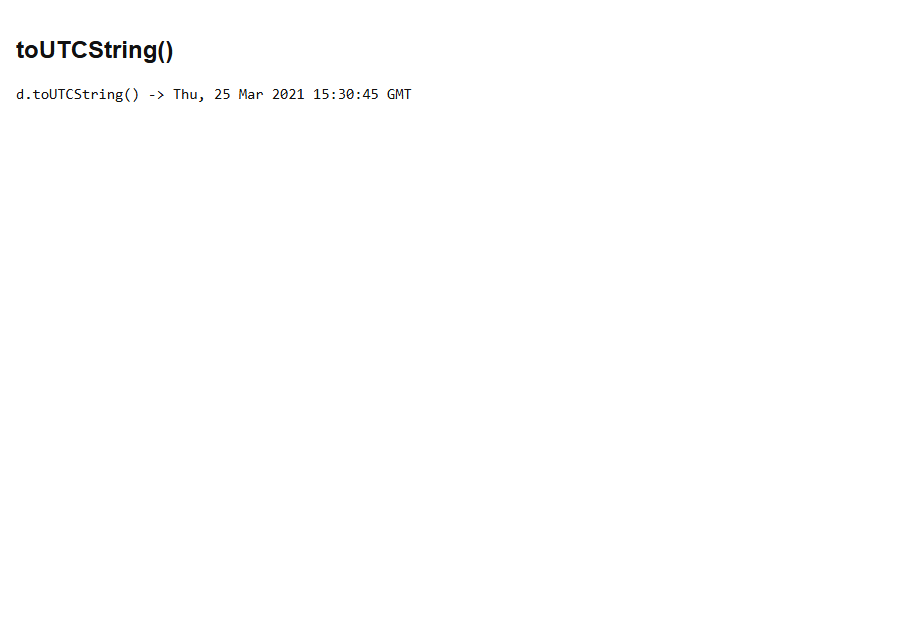

- [x] **Outcome:** `toUTCString()` is **"Thu, 25 Mar 2021 15:30:45 GMT"**.

<a id="js-date-methods-example-52"></a>

### **Example 52: UTC() — Date.UTC static**

- [x] `Date.UTC(y, m, …)` returns **ms** for that **UTC** calendar (months **0–11**).
- [x] It does **not** return a Date object — wrap with `new Date(Date.UTC(…))` if you need one.

Sandbox: `code_sandbox/js-date-methods/date-utc.html`

```javascript
let ms = Date.UTC(2021, 2, 25, 15, 30, 45, 123);
const d = new Date(ms);
```

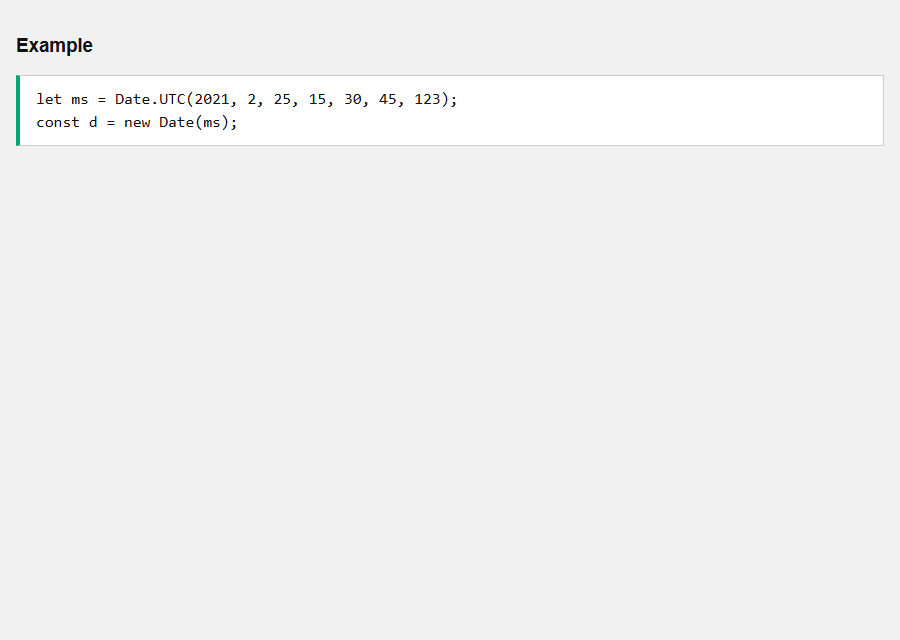

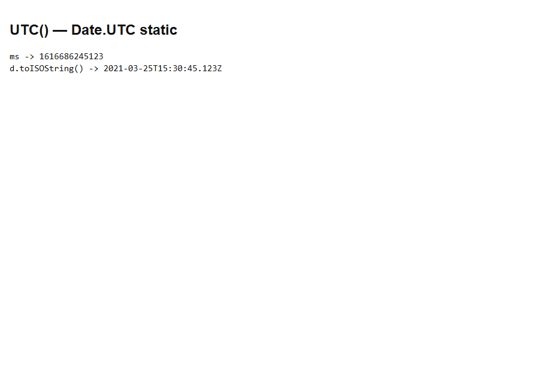

- [x] **Outcome:** `Date.UTC(2021, 2, 25, 15, 30, 45, 123)` is **1616686245123**. ISO is **2021-03-25T15:30:45.123Z**.

<a id="js-date-methods-example-53"></a>

### **Example 53: valueOf()**

- [x] `valueOf()` is the primitive ms value — the same number as **`getTime()`**.

Sandbox: `code_sandbox/js-date-methods/value-of.html`

```javascript
const d = new Date("2021-03-25T15:30:45.123Z");
d.valueOf();
d.getTime();
```

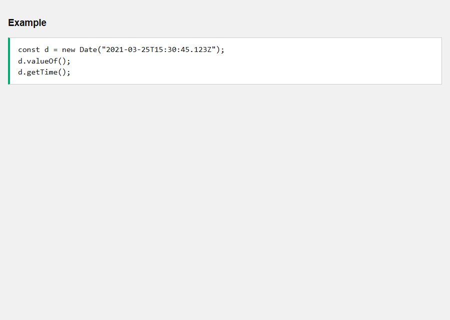

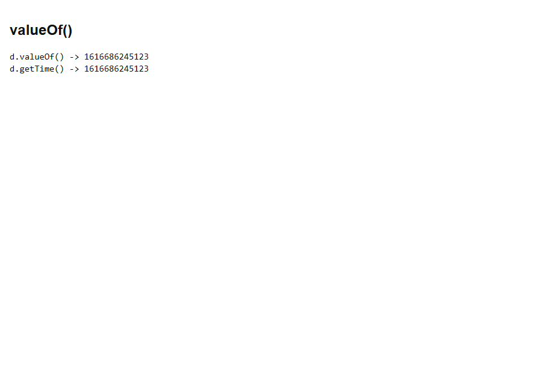

- [x] **Outcome:** Both are **1616686245123**.

<details>
  <summary>Terminal Commands</summary>

## Terminal Commands

```bash
# from Personal/Files/javascript/code_sandbox
py -3 -m http.server 8770 --bind 127.0.0.1
```

Then open `http://127.0.0.1:8770/js-date-methods/`.

</details>

<details>
  <summary>Questions and Answers</summary>

## Questions and Answers

### Question 1: Why does `constructor` appear twice?

<details>
<summary>Answer</summary>

- [x] One row **creates** a Date (`new Date(...)`, `instanceof Date`).
- [x] The other is the instance **`constructor`** property (**`Date`** / `[native code]`).

</details>

### Question 2: What is local `getHours()` on the fixed UTC instant?

<details>
<summary>Answer</summary>

- [x] **9** (Mountain UTC−6). `getUTCHours()` is **15**.

</details>

### Question 3: What should you use instead of `getYear()`?

<details>
<summary>Answer</summary>

- [x] **`getFullYear()`**. `getYear()` returned **121** and is **deprecated**.

</details>

### Question 4: What should you use instead of `setYear()`?

<details>
<summary>Answer</summary>

- [x] **`setFullYear()`**. `setYear(99)` became **1999** here (0–99 → 19xx).

</details>

### Question 5: What should you use instead of `toGMTString()`?

<details>
<summary>Answer</summary>

- [x] **`toUTCString()`**. Both printed **Thu, 25 Mar 2021 15:30:45 GMT**.

</details>

### Question 6: Is `Date.now()` called on an instance?

<details>
<summary>Answer</summary>

- [x] **No.** Static **`Date.now()`**. The snap is the **browser's current** ms count.

</details>

### Question 7: What does `Date.UTC(2021, 2, 25, 15, 30, 45, 123)` return?

<details>
<summary>Answer</summary>

- [x] **1616686245123** (a number, not a Date). Month **2** is March.

</details>

### Question 8: What does the prototype demo add?

<details>
<summary>Answer</summary>

- [x] `toISODate()` → **`2021-03-25`** on that page only.

</details>

### Question 9: `toJSON()` vs `toISOString()`?

<details>
<summary>Answer</summary>

- [x] **Same** ISO UTC string: **2021-03-25T15:30:45.123Z**.

</details>

### Question 10: `valueOf()` vs `getTime()`?

<details>
<summary>Answer</summary>

- [x] **Same** number: **1616686245123**.

</details>

### Question 11: What does `setUTCHours(0)` do to the fixed instant?

<details>
<summary>Answer</summary>

- [x] UTC becomes **00:30:45.123Z**. Local print is **Wed Mar 24 2021 18:30:45 GMT-0600**.

</details>

### Question 12: What is `setTime(0)`?

<details>
<summary>Answer</summary>

- [x] The **epoch**. ISO **1970-01-01T00:00:00.000Z**; local **31 Dec 1969 17:00** here.

</details>

</details>

## Summary

The reference is a catalog: construct, get local or UTC fields, set local or UTC fields, and format. Keep snaps on a fixed UTC instant except for now(). Treat getYear, setYear, and toGMTString as museum pieces that still execute. Statics live on Date; valueOf matches getTime.

## References

- [JS Date Methods (W3Schools)](https://www.w3schools.com/js/js_date_reference.asp)
- [MDN: Date](https://developer.mozilla.org/en-US/docs/Web/JavaScript/Reference/Global_Objects/Date)
- [MDN: Date.UTC](https://developer.mozilla.org/en-US/docs/Web/JavaScript/Reference/Global_Objects/Date/UTC)
