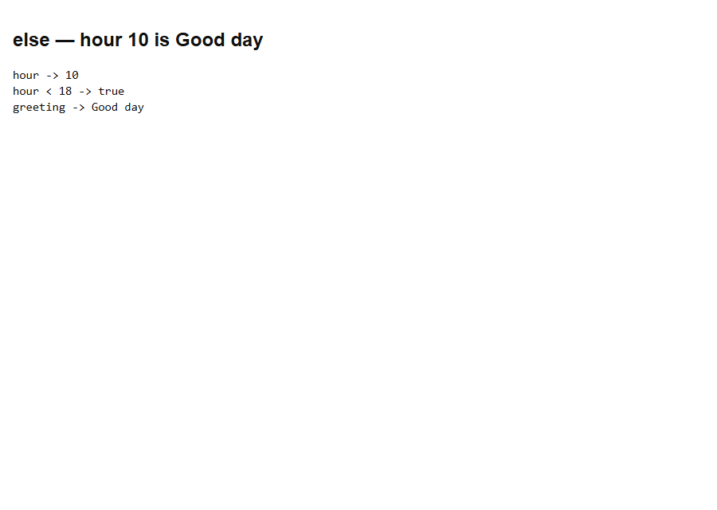
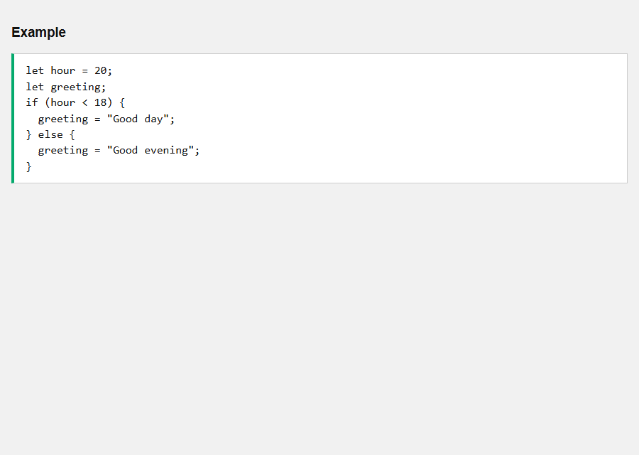
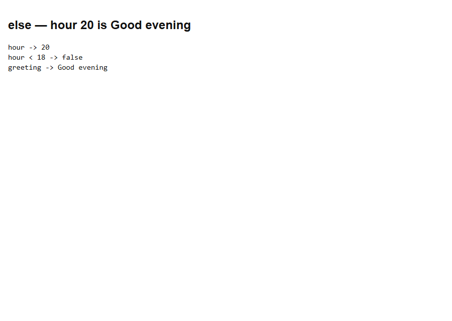
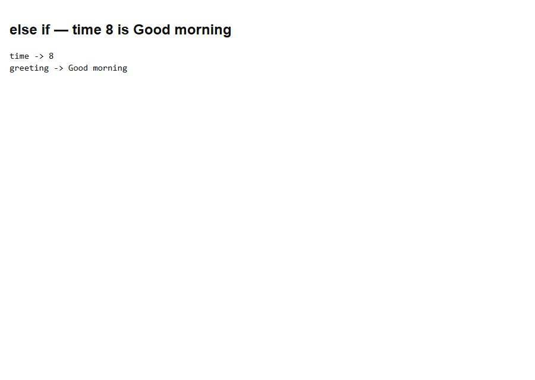
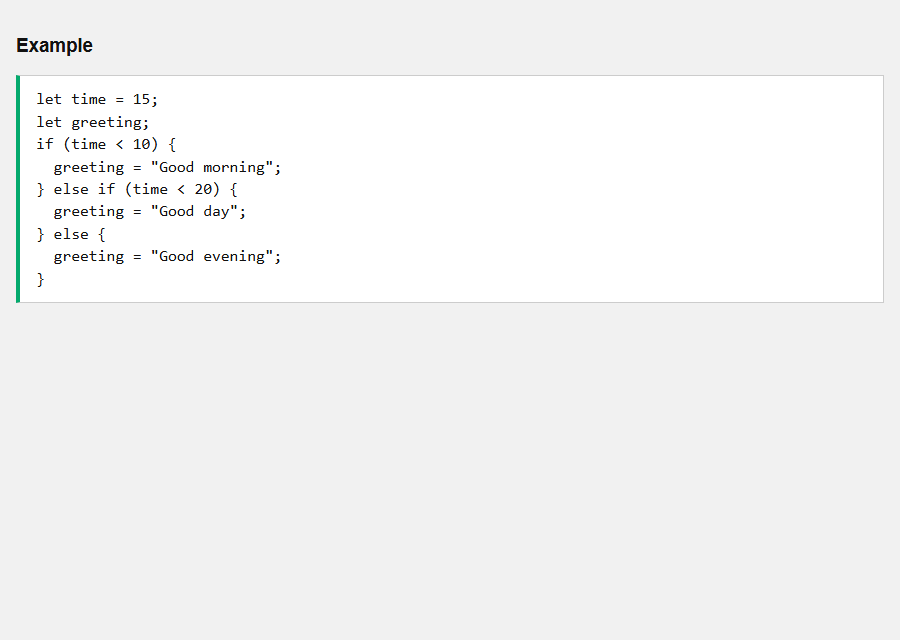
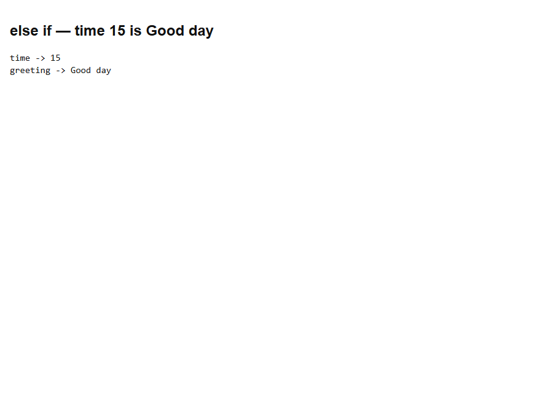
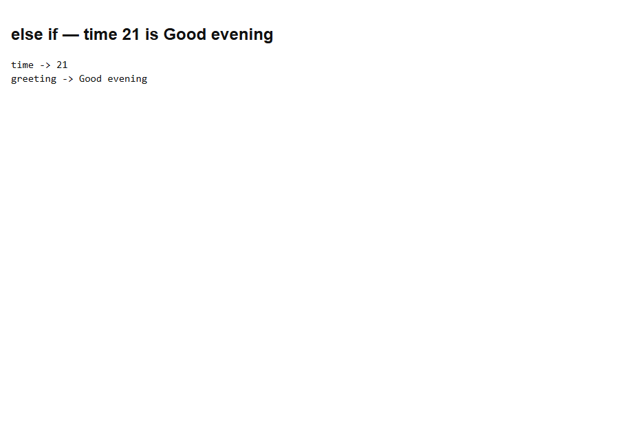
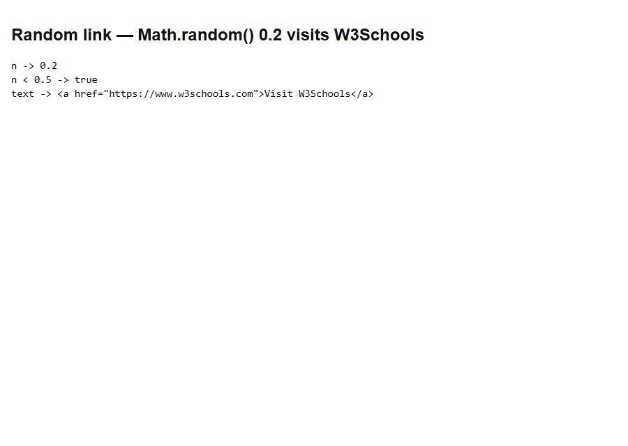
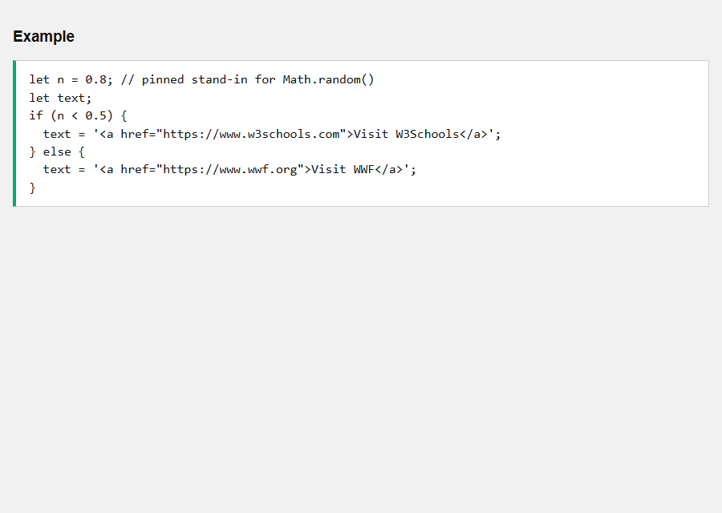
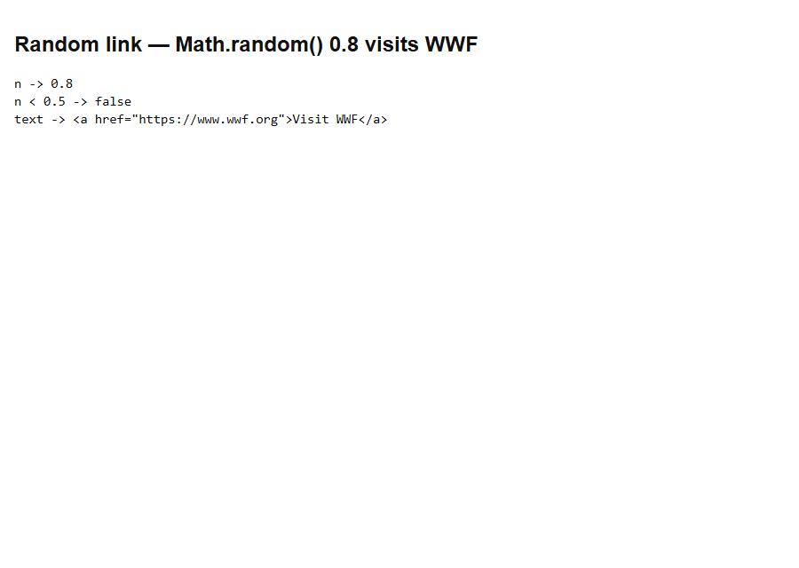

# JS If Else

[Back to JavaScript Tutorial](../tutorial_main.md)

## Introduction

Use **`else`** when the `if` test is **false**, and **`else if`** to chain more tests. This page greets by hour and picks a random W3Schools / WWF link. Hours and random values are **pinned** so the snaps stay stable.

This section has **7** examples:

- [x] **Example 1:** else — hour 10 is Good day [View](#js-if-else-example-01)
- [x] **Example 2:** else — hour 20 is Good evening [View](#js-if-else-example-02)
- [x] **Example 3:** else if — time 8 is Good morning [View](#js-if-else-example-03)
- [x] **Example 4:** else if — time 15 is Good day [View](#js-if-else-example-04)
- [x] **Example 5:** else if — time 21 is Good evening [View](#js-if-else-example-05)
- [x] **Example 6:** Random link — Math.random() 0.2 visits W3Schools [View](#js-if-else-example-06)
- [x] **Example 7:** Random link — Math.random() 0.8 visits WWF [View](#js-if-else-example-07)

## Detailed Explanation

- [x] **`else`** is the false branch of `if`. **`else if`** is an extra test; only the **first true** branch runs.
- [x] The live hour examples use `new Date().getHours()`; the sandbox pins **10 / 15 / 20 / 21**.
- [x] `Math.random() < 0.5` is ~50/50; the sandbox pins **0.2** and **0.8** for both links.

<a id="js-if-else-example-01"></a>

### **Example 1: else — hour 10 is Good day**

- [x] **`else`** runs when the `if` condition is **false**. Syntax: `if (condition) { … } else { … }`.
- [x] The live Tryit uses `new Date().getHours()`. This sandbox **pins `hour = 10`** so the snap is stable.
- [x] **10 < 18** is **true**, so the `if` block runs and `else` is skipped.

Sandbox: `code_sandbox/js-if-else/else-hour-10.html`

```javascript
let hour = 10;
let greeting;
if (hour < 18) {
  greeting = "Good day";
} else {
  greeting = "Good evening";
}
```




- [x] **Outcome:** **hour = 10** makes `hour < 18` **true**, so greeting is **Good day**.

<a id="js-if-else-example-02"></a>

### **Example 2: else — hour 20 is Good evening**

- [x] Same `if` / `else` as Example 1, with **`hour = 20`** so you see the **false** branch.
- [x] **20 < 18** is **false**, so the `if` block is skipped and **`else`** runs.
- [x] Without `else`, `greeting` would stay **undefined**. `else` is the fallback.

Sandbox: `code_sandbox/js-if-else/else-hour-20.html`

```javascript
let hour = 20;
let greeting;
if (hour < 18) {
  greeting = "Good day";
} else {
  greeting = "Good evening";
}
```





- [x] **Outcome:** **hour = 20** makes `hour < 18` **false**, so greeting is **Good evening**.

<a id="js-if-else-example-03"></a>

### **Example 3: else if — time 8 is Good morning**

- [x] **`else if`** adds another test when the first `if` is false: `if (c1) { } else if (c2) { } else { }`.
- [x] Only the **first true** branch runs. Later branches are skipped.
- [x] Pin **`time = 8`**. **8 < 10** is true, so greeting is **Good morning** (the later `< 20` test never runs).

Sandbox: `code_sandbox/js-if-else/elseif-morning.html`

```javascript
let time = 8;
let greeting;
if (time < 10) {
  greeting = "Good morning";
} else if (time < 20) {
  greeting = "Good day";
} else {
  greeting = "Good evening";
}
```




- [x] **Outcome:** **time = 8** matches `time < 10`, so greeting is **Good morning**.

<a id="js-if-else-example-04"></a>

### **Example 4: else if — time 15 is Good day**

- [x] **`time = 15`**: `15 < 10` is **false**, so the first block is skipped.
- [x] **15 < 20** is **true**, so the **`else if`** block runs.
- [x] The final `else` does not run. Order matters: a later true test is ignored once an earlier branch matched.

Sandbox: `code_sandbox/js-if-else/elseif-day.html`

```javascript
let time = 15;
let greeting;
if (time < 10) {
  greeting = "Good morning";
} else if (time < 20) {
  greeting = "Good day";
} else {
  greeting = "Good evening";
}
```





- [x] **Outcome:** **time = 15** fails `< 10` and matches `< 20`, so greeting is **Good day**.

<a id="js-if-else-example-05"></a>

### **Example 5: else if — time 21 is Good evening**

- [x] **`time = 21`**: both `21 < 10` and `21 < 20` are **false**.
- [x] The trailing **`else`** is the fallback when no condition matched.
- [x] This is the page’s “Good evening” path (hours 20 and 21–23).

Sandbox: `code_sandbox/js-if-else/elseif-evening.html`

```javascript
let time = 21;
let greeting;
if (time < 10) {
  greeting = "Good morning";
} else if (time < 20) {
  greeting = "Good day";
} else {
  greeting = "Good evening";
}
```




- [x] **Outcome:** **time = 21** matches neither test, so **else** sets greeting to **Good evening**.

<a id="js-if-else-example-06"></a>

### **Example 6: Random link — Math.random() 0.2 visits W3Schools**

- [x] The page picks a link with **`Math.random() < 0.5`** (about a **50%** chance each way).
- [x] `Math.random()` is **not** stable for snaps, so this demo **pins `0.2`** in place of a live random call.
- [x] **0.2 < 0.5** is true, so `text` is the **W3Schools** anchor (same markup idea as the Tryit).

Sandbox: `code_sandbox/js-if-else/random-w3schools.html`

```javascript
let n = 0.2; // pinned stand-in for Math.random()
let text;
if (n < 0.5) {
  text = '<a href="https://www.w3schools.com">Visit W3Schools</a>';
} else {
  text = '<a href="https://www.wwf.org">Visit WWF</a>';
}
```




- [x] **Outcome:** Pinned **0.2 < 0.5** is **true**, so text is the **Visit W3Schools** link.

<a id="js-if-else-example-07"></a>

### **Example 7: Random link — Math.random() 0.8 visits WWF**

- [x] Same `if` / `else` as Example 6, with a pinned **`0.8`** for the **false** branch.
- [x] **0.8 < 0.5** is **false**, so the **WWF** link is chosen.
- [x] On the live page, reload to see either link. Do not use `Math.random()` when you need a deterministic test.

Sandbox: `code_sandbox/js-if-else/random-wwf.html`

```javascript
let n = 0.8; // pinned stand-in for Math.random()
let text;
if (n < 0.5) {
  text = '<a href="https://www.w3schools.com">Visit W3Schools</a>';
} else {
  text = '<a href="https://www.wwf.org">Visit WWF</a>';
}
```





- [x] **Outcome:** Pinned **0.8 < 0.5** is **false**, so text is the **Visit WWF** link.

<details>
  <summary>Terminal Commands</summary>

## Terminal Commands

```bash
# from Personal/Files/javascript/code_sandbox
py -3 -m http.server 8770 --bind 127.0.0.1
```

Then open `http://127.0.0.1:8770/js-if-else/`.

</details>

<details>
  <summary>Questions and Answers</summary>

## Questions and Answers

### Question 1: When does `else` run?

<details>
<summary>Answer</summary>

- [x] When the `if` condition is **false**.

</details>

### Question 2: With `hour = 10`, what is `greeting`?

<details>
<summary>Answer</summary>

- [x] **Good day**.
- [x] `10 < 18` is true, so `else` is skipped.

</details>

### Question 3: With `hour = 20`, what is `greeting`?

<details>
<summary>Answer</summary>

- [x] **Good evening**.

</details>

### Question 4: With `time = 8`, which branch runs?

<details>
<summary>Answer</summary>

- [x] The first `if` (`time < 10`).
- [x] Greeting is **Good morning**.

</details>

### Question 5: With `time = 15`, which branch runs?

<details>
<summary>Answer</summary>

- [x] **`else if (time < 20)`**.
- [x] Greeting is **Good day**.

</details>

### Question 6: With `time = 21`, which branch runs?

<details>
<summary>Answer</summary>

- [x] The final **`else`**.
- [x] Greeting is **Good evening**.

</details>

### Question 7: Does a later `else if` run after an earlier match?

<details>
<summary>Answer</summary>

- [x] **No.** Only the first true branch runs.

</details>

### Question 8: What does `Math.random() < 0.5` decide?

<details>
<summary>Answer</summary>

- [x] Which link to show: **W3Schools** if true, **WWF** if false (~50% each).

</details>

### Question 9: If the pinned stand-in is `0.8`, which link is chosen?

<details>
<summary>Answer</summary>

- [x] **Visit WWF**.
- [x] `0.8 < 0.5` is false.

</details>

### Question 10: Why pin `hour` and `Math.random()` in the sandbox?

<details>
<summary>Answer</summary>

- [x] So the screenshots are **deterministic**.

</details>


</details>

## Summary

`else` covers the false `if`. **hour 10** → **Good day**; **hour 20** → **Good evening**. `else if` chains tests: **time 8 / 15 / 21** → **Good morning / Good day / Good evening**. A `Math.random() < 0.5` pick becomes **W3Schools** at 0.2 and **WWF** at 0.8.

## References

- [JS If Else (W3Schools)](https://www.w3schools.com/js/js_if_else.asp)
- [MDN: if...else](https://developer.mozilla.org/en-US/docs/Web/JavaScript/Reference/Statements/if...else)
