# JS Switch

[Back to JavaScript Tutorial](../tutorial_main.md)

## Introduction

`switch` picks a block by matching an expression to **`case`** labels (often cleaner than a long `if…else if`). **`break`** stops fall-through. **`default`** is the fallback. Switch compares with **`===`**. Weekday numbers are **pinned** (0–6) so snaps do not depend on today.

This section has **10** examples:

- [x] **Example 1:** switch weekday number — 3 is Wednesday [View](#js-switch-example-01)
- [x] **Example 2:** break — without it, cases fall through [View](#js-switch-example-02)
- [x] **Example 3:** default — weekday 3 looks forward to the weekend [View](#js-switch-example-03)
- [x] **Example 4:** default switch — 6 is Today is Saturday [View](#js-switch-example-04)
- [x] **Example 5:** default does not have to be last [View](#js-switch-example-05)
- [x] **Example 6:** Shared cases — 4 and 5 are Soon it is Weekend [View](#js-switch-example-06)
- [x] **Example 7:** Shared cases — 0 and 6 are It is Weekend [View](#js-switch-example-07)
- [x] **Example 8:** Shared cases — Monday 1 uses default [View](#js-switch-example-08)
- [x] **Example 9:** Strict comparison — string "0" does not match case 0 [View](#js-switch-example-09)
- [x] **Example 10:** Strict comparison — number 0 is Off [View](#js-switch-example-10)

## Detailed Explanation

- [x] The expression is evaluated **once**, then compared to each `case`. The **first match** runs.
- [x] **`break`** exits the switch. Without it, the next cases run too (**fall-through**).
- [x] **`default`** is optional and need not be last — but then it **must** `break`.
- [x] No match and no `default` → the switch does nothing. Comparison is **strict** (`===`).

<a id="js-switch-example-01"></a>

### **Example 1: switch weekday number — 3 is Wednesday**

- [x] `switch (expression)` compares the expression to each **`case`** with **strict `===`**.
- [x] `Date#getDay()` returns **0–6** (Sunday=0 … Saturday=6). The live Tryit uses today; this snap **pins `3`** (Wednesday).
- [x] When a `case` matches, that block runs until **`break`** (or the end of the switch).

Sandbox: `code_sandbox/js-switch/weekday-wednesday.html`

```javascript
let dayNum = 3; // pinned stand-in for new Date().getDay()
let day;
switch (dayNum) {
  case 0:
    day = "Sunday";
    break;
  case 1:
    day = "Monday";
    break;
  case 2:
    day = "Tuesday";
    break;
  case 3:
    day = "Wednesday";
    break;
  case 4:
    day = "Thursday";
    break;
  case 5:
    day = "Friday";
    break;
  case 6:
    day = "Saturday";
}
```

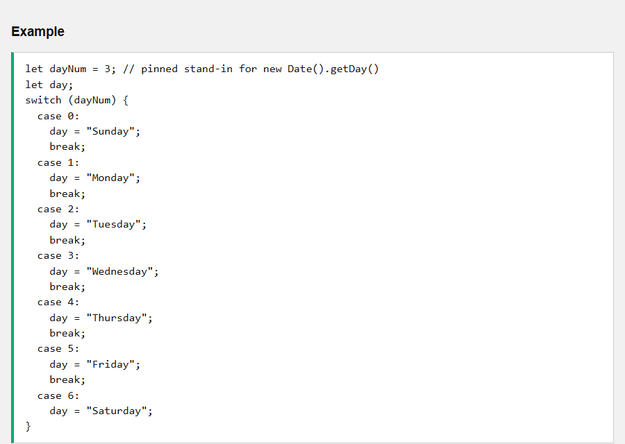

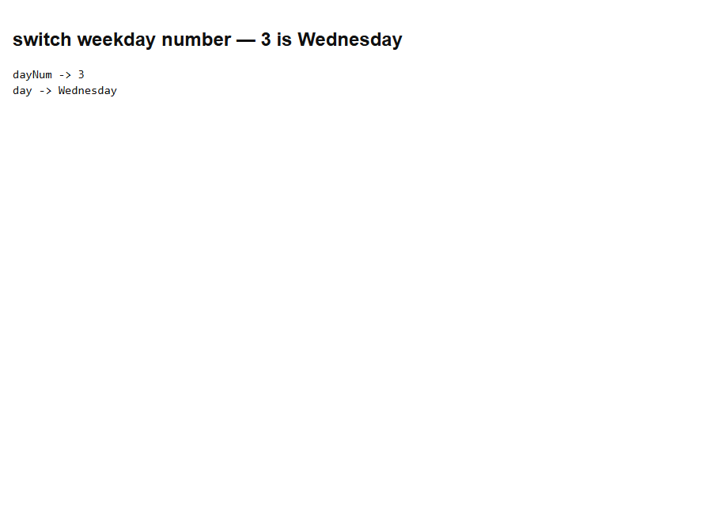

- [x] **Outcome:** **dayNum = 3** matches **`case 3`**, so day is **Wednesday**.

<a id="js-switch-example-02"></a>

### **Example 2: break — without it, cases fall through**

- [x] **`break`** leaves the switch. Without it, execution **falls through** into the next `case` even if that label does not match.
- [x] The last case does not need `break` because the switch ends anyway — but missing `break` in the **middle** is the classic bug.
- [x] Here **`case 1`** has no `break`, so **Monday** also runs **Tuesday**’s assignment.

Sandbox: `code_sandbox/js-switch/break-fallthrough.html`

```javascript
let dayNum = 1;
let day = "";
switch (dayNum) {
  case 1:
    day += "Monday ";
  case 2:
    day += "Tuesday";
    break;
  default:
    day = "other";
}
```

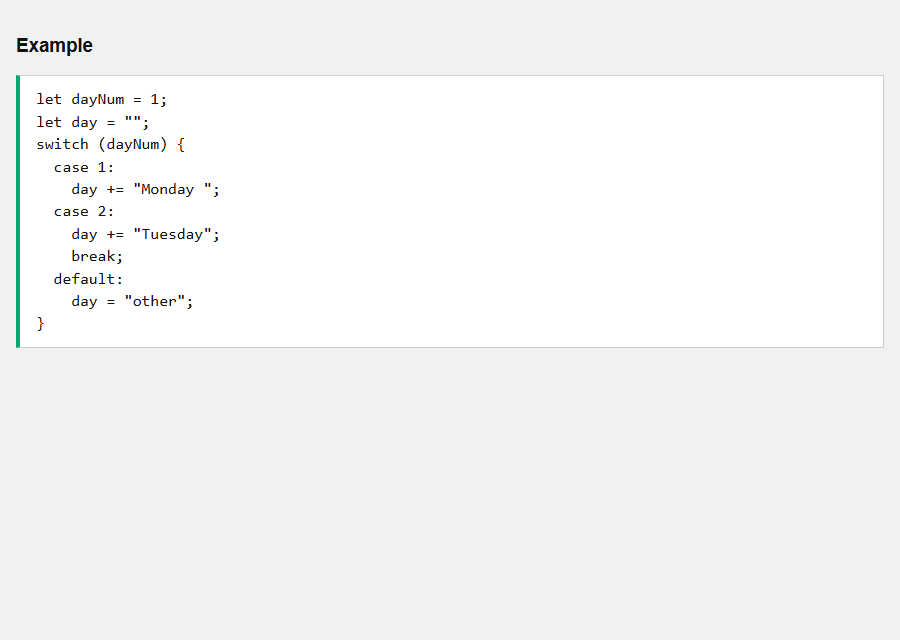

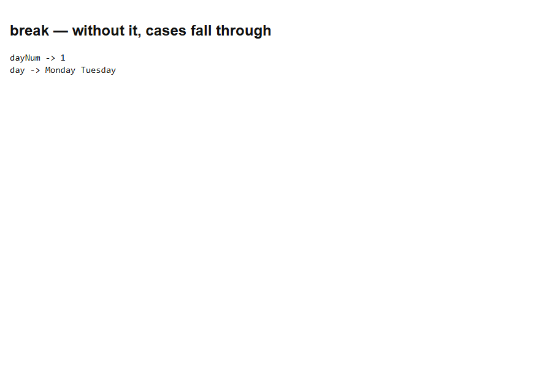

- [x] **Outcome:** **dayNum = 1** matches case 1, then **falls through** into case 2, so day is **Monday Tuesday**.

<a id="js-switch-example-03"></a>

### **Example 3: default — weekday 3 looks forward to the weekend**

- [x] **`default`** runs when **no `case` matches**. It is optional.
- [x] This Tryit only names **Saturday (6)** and **Sunday (0)**. Any other weekday hits `default`.
- [x] Pin **`dayNum = 3`** (Wednesday) so the snap is not weekend-dependent.

Sandbox: `code_sandbox/js-switch/default-weekday.html`

```javascript
let dayNum = 3;
let text;
switch (dayNum) {
  case 6:
    text = "Today is Saturday";
    break;
  case 0:
    text = "Today is Sunday";
    break;
  default:
    text = "Looking forward to the Weekend";
}
```

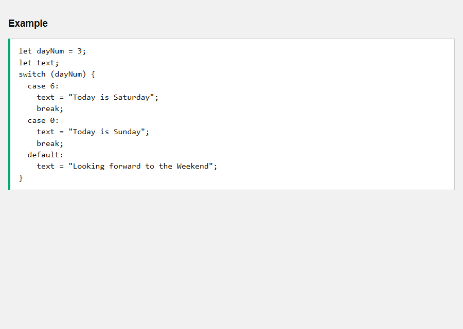

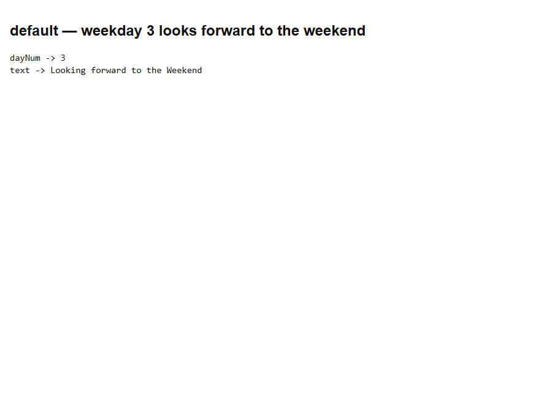

- [x] **Outcome:** **3** is neither 6 nor 0, so **default** sets text to **Looking forward to the Weekend**.

<a id="js-switch-example-04"></a>

### **Example 4: default switch — 6 is Today is Saturday**

- [x] Same switch as Example 3, with **`dayNum = 6`** so a named weekend case wins over `default`.
- [x] `default` is only the fallback. A matching `case` still runs first.

Sandbox: `code_sandbox/js-switch/default-saturday.html`

```javascript
let dayNum = 6;
let text;
switch (dayNum) {
  case 6:
    text = "Today is Saturday";
    break;
  case 0:
    text = "Today is Sunday";
    break;
  default:
    text = "Looking forward to the Weekend";
}
```


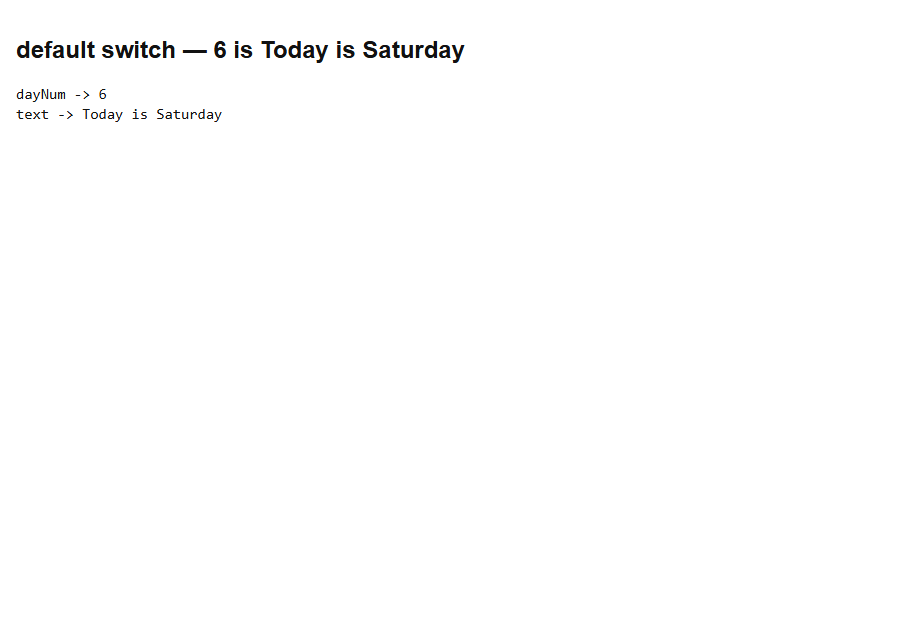

- [x] **Outcome:** **dayNum = 6** matches **`case 6`**, so text is **Today is Saturday**.

<a id="js-switch-example-05"></a>

### **Example 5: default does not have to be last**

- [x] You may put **`default` first**. If it is **not** last, end it with **`break`** or later cases will also run.
- [x] Pin **`dayNum = 3`**. No weekend case matches, so `default` still produces **Looking forward to the Weekend**.

Sandbox: `code_sandbox/js-switch/default-not-last.html`

```javascript
let dayNum = 3;
let text;
switch (dayNum) {
  default:
    text = "Looking forward to the Weekend";
    break;
  case 6:
    text = "Today is Saturday";
    break;
  case 0:
    text = "Today is Sunday";
}
```

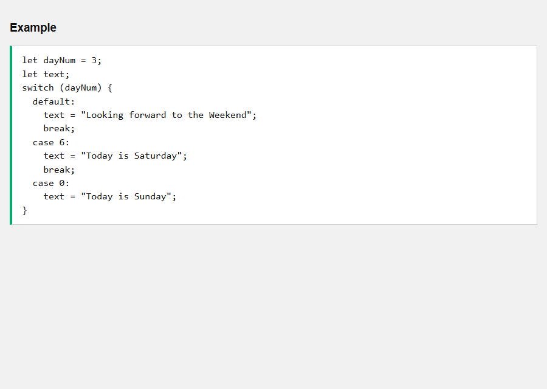

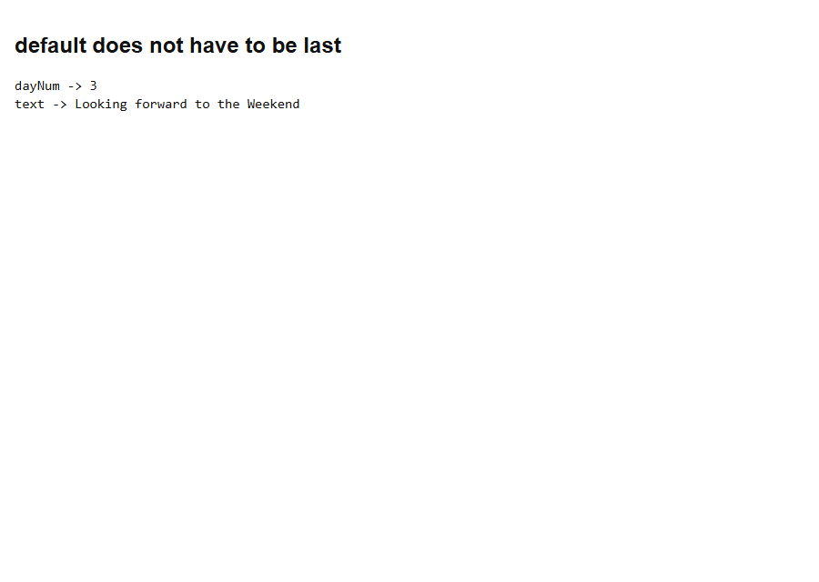

- [x] **Outcome:** **default** is first, but **`break`** stops it. dayNum **3** still yields **Looking forward to the Weekend**.

<a id="js-switch-example-06"></a>

### **Example 6: Shared cases — 4 and 5 are Soon it is Weekend**

- [x] Several `case` labels can **share one block**. List them with no code in between; the first matching label starts the block.
- [x] **Thursday (4)** and **Friday (5)** share **Soon it is Weekend**.
- [x] Pin **`dayNum = 4`**.

Sandbox: `code_sandbox/js-switch/shared-thu-fri.html`

```javascript
let dayNum = 4;
let text;
switch (dayNum) {
  case 4:
  case 5:
    text = "Soon it is Weekend";
    break;
  case 0:
  case 6:
    text = "It is Weekend";
    break;
  default:
    text = "Looking forward to the Weekend";
}
```


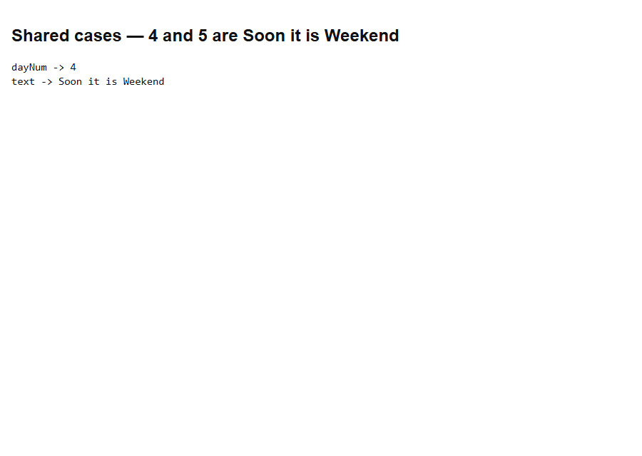

- [x] **Outcome:** **4** shares a block with **5**, so text is **Soon it is Weekend**.

<a id="js-switch-example-07"></a>

### **Example 7: Shared cases — 0 and 6 are It is Weekend**

- [x] **Sunday (0)** and **Saturday (6)** share **It is Weekend**.
- [x] Pin **`dayNum = 0`**.
- [x] If several labels could match, **the first listed match** is selected; here only one value is in the expression.

Sandbox: `code_sandbox/js-switch/shared-weekend.html`

```javascript
let dayNum = 0;
let text;
switch (dayNum) {
  case 4:
  case 5:
    text = "Soon it is Weekend";
    break;
  case 0:
  case 6:
    text = "It is Weekend";
    break;
  default:
    text = "Looking forward to the Weekend";
}
```


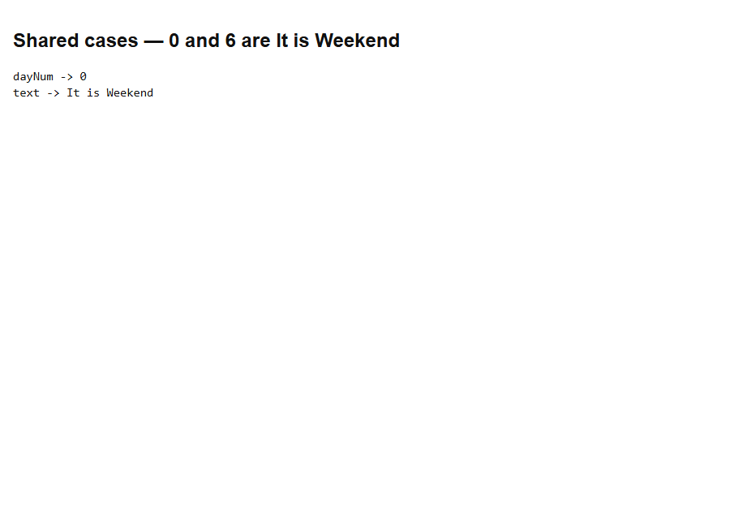

- [x] **Outcome:** **0** shares a block with **6**, so text is **It is Weekend**.

<a id="js-switch-example-08"></a>

### **Example 8: Shared cases — Monday 1 uses default**

- [x] **Monday (1)** is not 4, 5, 0, or 6, so **`default`** runs.
- [x] If there is **no** `default` and no match, the switch does nothing and execution continues after it.

Sandbox: `code_sandbox/js-switch/shared-default-mon.html`

```javascript
let dayNum = 1;
let text;
switch (dayNum) {
  case 4:
  case 5:
    text = "Soon it is Weekend";
    break;
  case 0:
  case 6:
    text = "It is Weekend";
    break;
  default:
    text = "Looking forward to the Weekend";
}
```

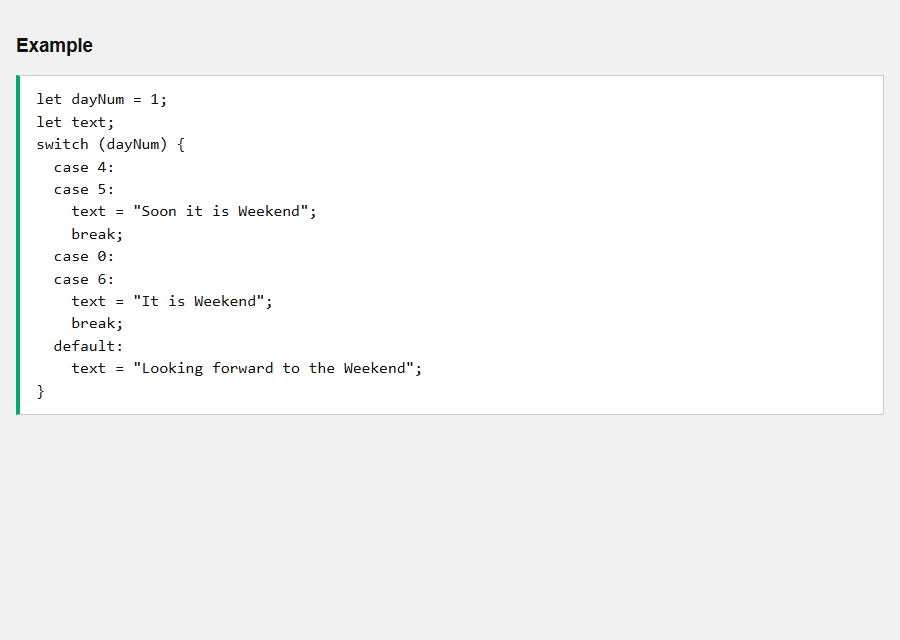

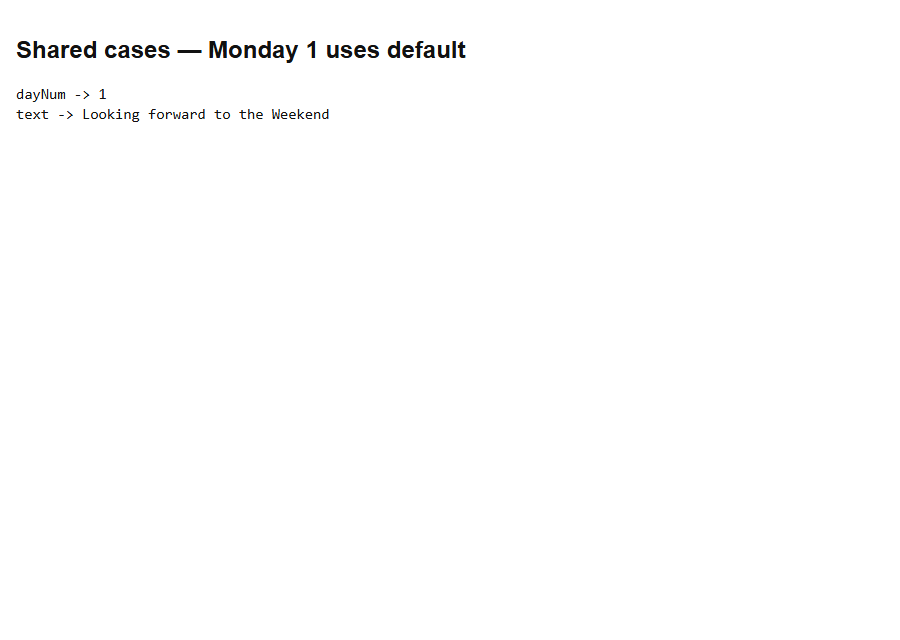

- [x] **Outcome:** **1** matches no weekend case, so text is **Looking forward to the Weekend**.

<a id="js-switch-example-09"></a>

### **Example 9: Strict comparison — string "0" does not match case 0**

- [x] Switch uses **strict comparison (`===`)**. Types must match.
- [x] **`x = "0"`** (string) does **not** match **`case 0:`** (number).
- [x] There is no match, so **`default`** runs: **No value found**.

Sandbox: `code_sandbox/js-switch/strict-string-zero.html`

```javascript
let x = "0";
let text;
switch (x) {
  case 0:
    text = "Off";
    break;
  case 1:
    text = "On";
    break;
  default:
    text = "No value found";
}
```

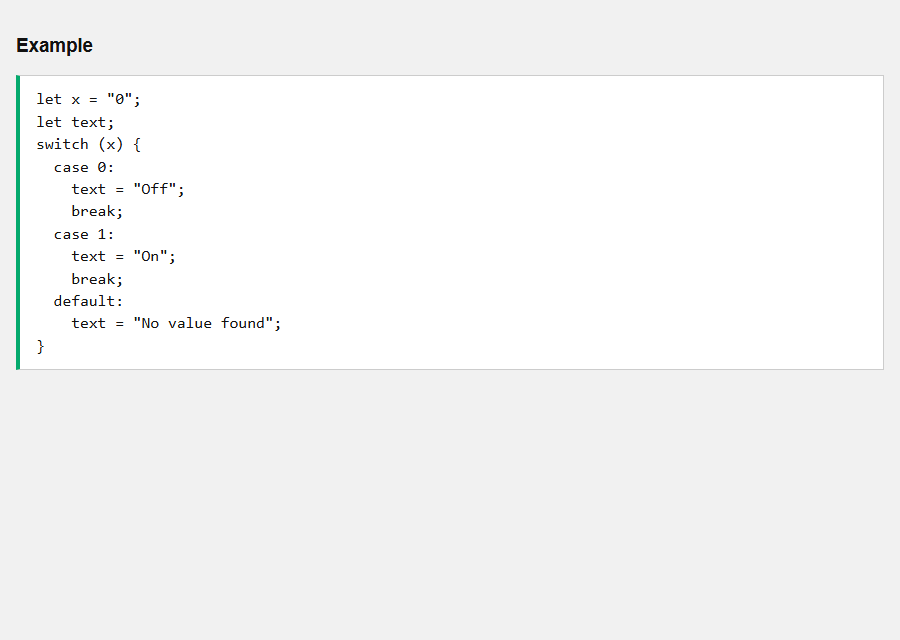

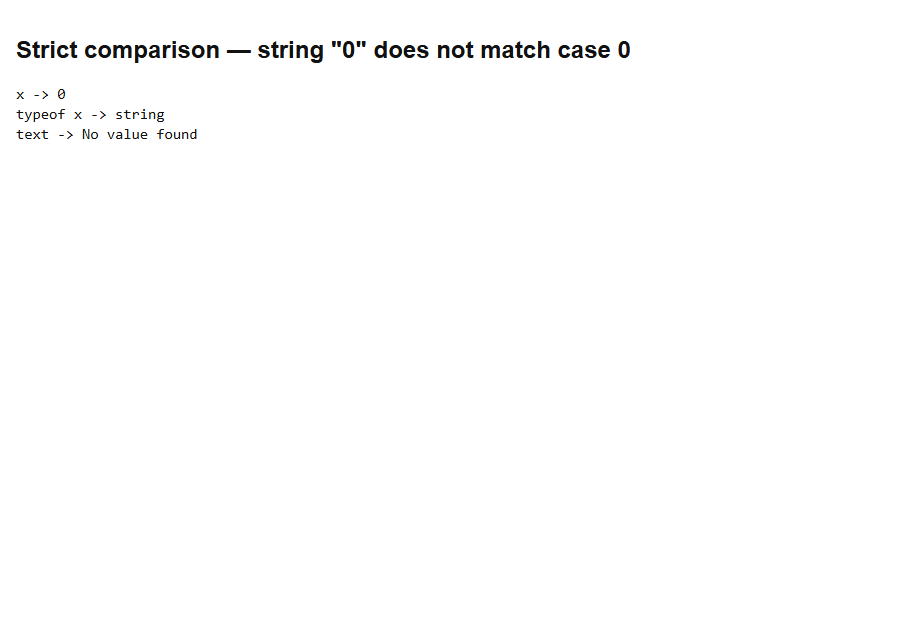

- [x] **Outcome:** **x** is the string **"0"**, so `case 0` does not match and text is **No value found**.

<a id="js-switch-example-10"></a>

### **Example 10: Strict comparison — number 0 is Off**

- [x] Same switch, with **`x = 0`** (number) so **`case 0`** matches.
- [x] `"0" === 0` is **false**; `0 === 0` is **true**. Convert with `Number(x)` if you must accept both.

Sandbox: `code_sandbox/js-switch/strict-number-zero.html`

```javascript
let x = 0;
let text;
switch (x) {
  case 0:
    text = "Off";
    break;
  case 1:
    text = "On";
    break;
  default:
    text = "No value found";
}
```

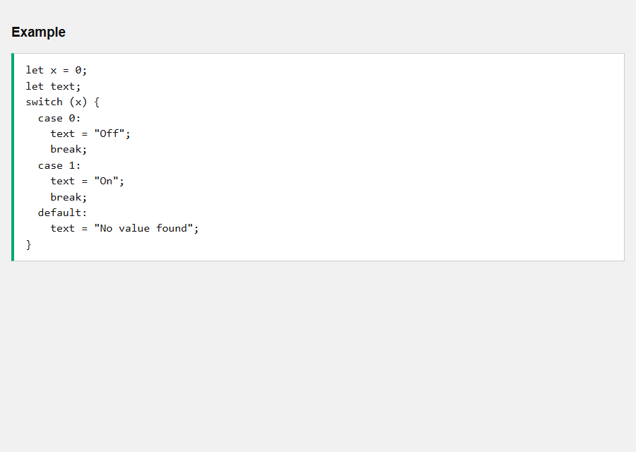

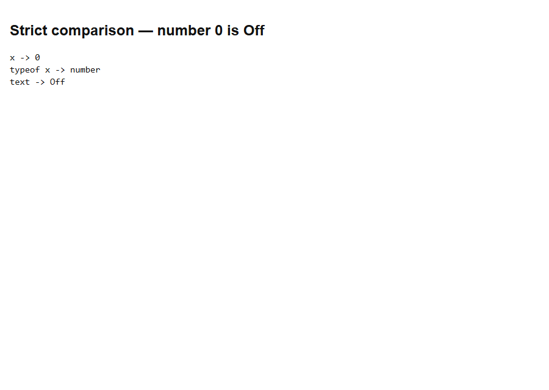

- [x] **Outcome:** **x = 0** (number) matches **`case 0`**, so text is **Off**.

<details>
  <summary>Terminal Commands</summary>

## Terminal Commands

```bash
# from Personal/Files/javascript/code_sandbox
py -3 -m http.server 8770 --bind 127.0.0.1
```

Then open `http://127.0.0.1:8770/js-switch/`.

</details>

<details>
  <summary>Questions and Answers</summary>

## Questions and Answers

### Question 1: What does `getDay()` return?

<details>
<summary>Answer</summary>

- [x] A number **0–6** (Sunday=0, Saturday=6).

</details>

### Question 2: With pinned `dayNum = 3`, what is `day` in the full name switch?

<details>
<summary>Answer</summary>

- [x] **Wednesday**.

</details>

### Question 3: What does `break` do?

<details>
<summary>Answer</summary>

- [x] It **leaves** the switch so later cases do not run.

</details>

### Question 4: What is fall-through?

<details>
<summary>Answer</summary>

- [x] Missing `break` lets execution **continue into the next `case`**.

</details>

### Question 5: With `dayNum = 3` and only weekend cases, what is `text`?

<details>
<summary>Answer</summary>

- [x] **Looking forward to the Weekend** (the **default**).

</details>

### Question 6: Must `default` be last?

<details>
<summary>Answer</summary>

- [x] **No**, but then end it with **`break`**.

</details>

### Question 7: What do cases 4 and 5 share?

<details>
<summary>Answer</summary>

- [x] **Soon it is Weekend**.

</details>

### Question 8: What do cases 0 and 6 share?

<details>
<summary>Answer</summary>

- [x] **It is Weekend**.

</details>

### Question 9: Does `switch ("0")` match `case 0`?

<details>
<summary>Answer</summary>

- [x] **No.** Switch uses **`===`**. The string **"0"** is not the number **0**.

</details>

### Question 10: With `x = 0` (number), what is `text`?

<details>
<summary>Answer</summary>

- [x] **Off**.

</details>


</details>

## Summary

`switch` matches with **`===`**. Pin **3** → **Wednesday**. Skip **`break`** and you **fall through**. **`default`** catches other weekdays. Shared labels group Thu/Fri and Sun/Sat. **`"0"`** does not match **`case 0`**.

## References

- [JS Switch (W3Schools)](https://www.w3schools.com/js/js_switch.asp)
- [MDN: switch](https://developer.mozilla.org/en-US/docs/Web/JavaScript/Reference/Statements/switch)
