# JS var/let/const

[Back to JavaScript Tutorial](../tutorial_main.md)

## Introduction

var, let, and const differ in scope, redeclaration, reassignment, and hoisting. var leaks out of blocks, can be redeclared, and reads as undefined before its line. let and const are block-scoped, cannot be redeclared in the same scope, and throw ReferenceError in the temporal dead zone. const cannot be reassigned, but object properties can still change. Modern style is const by default, let when the binding must change, and no var.

This section has **9** examples:

- [x] **Example 1:** Table demo: var leaks, let does not [View](#js-varletconst-example-01)
- [x] **Example 2:** const object: mutate property vs reassign [View](#js-varletconst-example-02)
- [x] **Example 3:** var redeclare is allowed [View](#js-varletconst-example-03)
- [x] **Example 4:** let redeclare same scope — SyntaxError [View](#js-varletconst-example-04)
- [x] **Example 5:** const cannot reassign — TypeError [View](#js-varletconst-example-05)
- [x] **Example 6:** var used before declare is undefined [View](#js-varletconst-example-06)
- [x] **Example 7:** let TDZ — ReferenceError before declare [View](#js-varletconst-example-07)
- [x] **Example 8:** const TDZ — ReferenceError before declare [View](#js-varletconst-example-08)
- [x] **Example 9:** Best practice: const by default [View](#js-varletconst-example-09)

## Detailed Explanation

- [x] **var:** function/global scope, redeclare yes, reassign yes, hoisted as **undefined**.
- [x] **let:** block scope, redeclare no (**SyntaxError**), reassign yes, hoisted **uninitialized** (TDZ → **ReferenceError**).
- [x] **const:** block scope, redeclare no, reassign no (**TypeError**), TDZ like let. Properties of a const **object** can still change.
- [x] **Best practice:** `const` by default, `let` if you reassign, never `var`.

<a id="js-varletconst-example-01"></a>

### **Example 1: Table demo: var leaks, let does not**

- [x] The comparison table: **`var`** is function/global scoped; **`let` / `const`** are **block** scoped.
- [x] `typeof` of an undeclared name is **`"undefined"`** (no throw). That is how the Tryit tests `lastName`.

Sandbox: `code_sandbox/js-varletconst/var-leak-vs-let-block.html`

```javascript
if (true) {
  var firstName = "John";
  let lastName = "Doe";
}
let text1 = (text2 = "unknown");
if (typeof firstName !== "undefined") text1 = firstName;
if (typeof lastName !== "undefined") text2 = lastName;
```

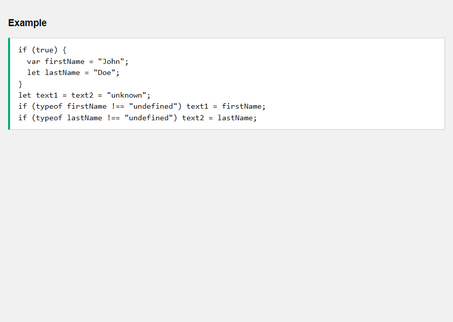

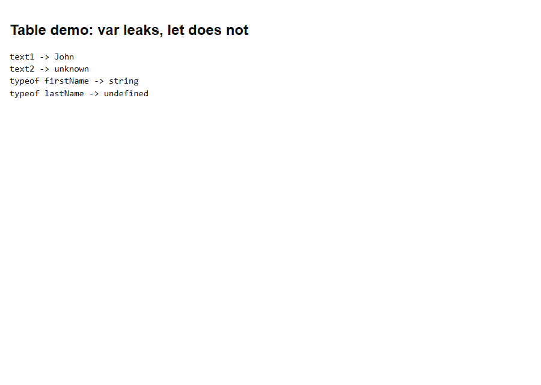

- [x] **Outcome:** text1 is **"John"** (var leaked). text2 stays **"unknown"** (let stayed in the `if` block).

<a id="js-varletconst-example-02"></a>

### **Example 2: const object: mutate property vs reassign**

- [x] `const` prevents **reassigning** the binding, not changing **object properties**.
- [x] `user.name = "Bob"` works. `user = { ... }` throws **TypeError**.

Sandbox: `code_sandbox/js-varletconst/const-object-mutate.html`

```javascript
const user = { name: "Alice" };
user.name = "Bob";
try {
  user = { name: "Charlie" };
} catch (err) {
  // TypeError
}
```

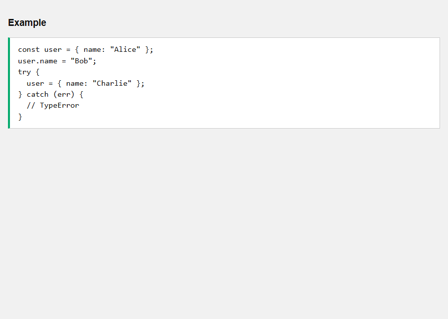

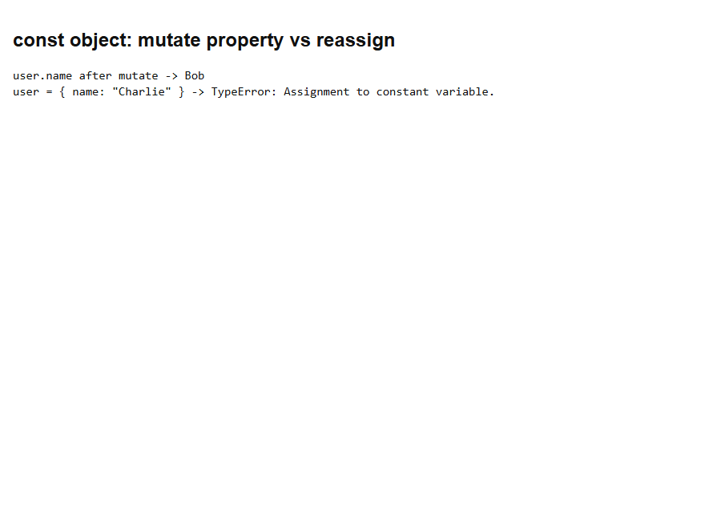

- [x] **Outcome:** After mutate, `user.name` is **"Bob"**. Replacing `user` throws **TypeError**.

<a id="js-varletconst-example-03"></a>

### **Example 3: var redeclare is allowed**

- [x] `var` can be **redeclared** in the same scope and silently overwrites.
- [x] This is a common source of bugs. Prefer `let` / `const`.

Sandbox: `code_sandbox/js-varletconst/var-redeclare.html`

```javascript
var x = 1;
var x = 2;
```


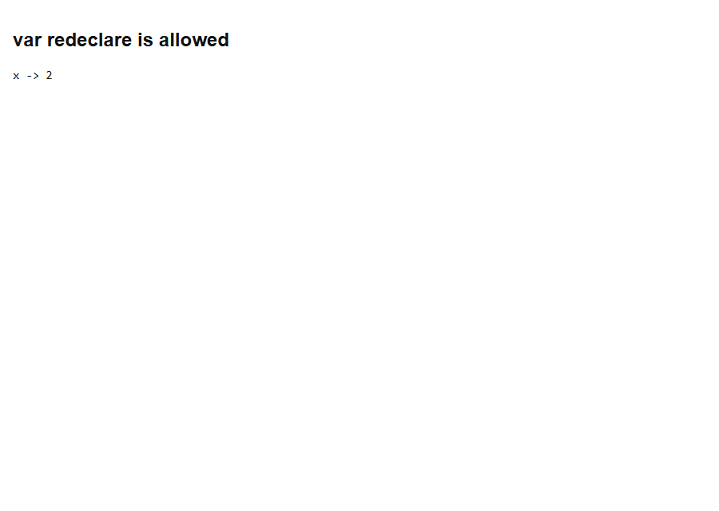

- [x] **Outcome:** x is **2**. The second `var x` replaced the first.

<a id="js-varletconst-example-04"></a>

### **Example 4: let redeclare same scope — SyntaxError**

- [x] `let` **cannot** be redeclared in the same scope.
- [x] That is a **parse-time SyntaxError**, so this demo uses `new Function`.

Sandbox: `code_sandbox/js-varletconst/let-redeclare-syntax.html`

```javascript
let x = 1;
let x = 2;
```


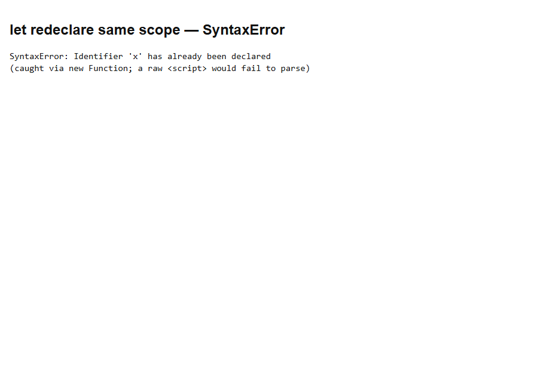

- [x] **Outcome:** **SyntaxError** — Identifier `x` has already been declared.

<a id="js-varletconst-example-05"></a>

### **Example 5: const cannot reassign — TypeError**

- [x] `const` bindings are **read-only** after init.
- [x] Assigning a new value throws **TypeError** (runtime, so try/catch works).

Sandbox: `code_sandbox/js-varletconst/const-no-reassign.html`

```javascript
const PI = 3.14;
PI = 3.14159;
```

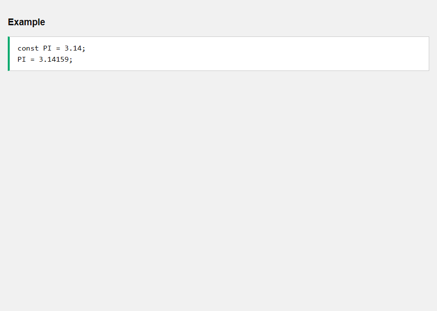

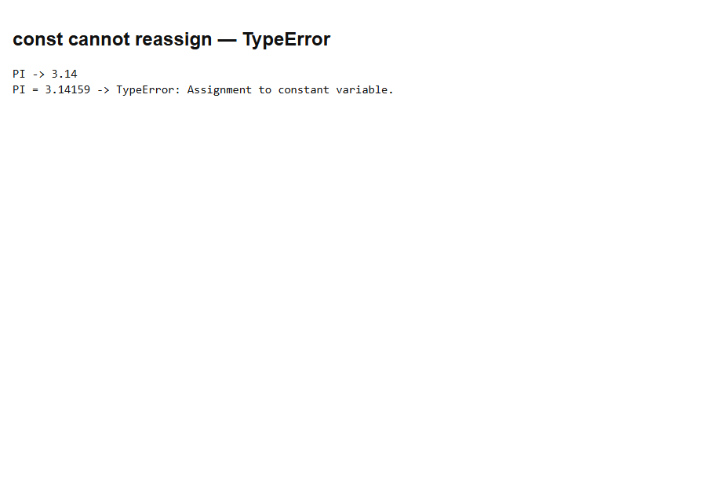

- [x] **Outcome:** **TypeError** — Assignment to constant variable. PI stays **3.14**.

<a id="js-varletconst-example-06"></a>

### **Example 6: var used before declare is undefined**

- [x] `var` is hoisted and initialized as **undefined**.
- [x] You can read it before the `var` line without a ReferenceError.

Sandbox: `code_sandbox/js-varletconst/var-hoisted-undefined.html`

```javascript
let shown = x;
var x = 5;
```

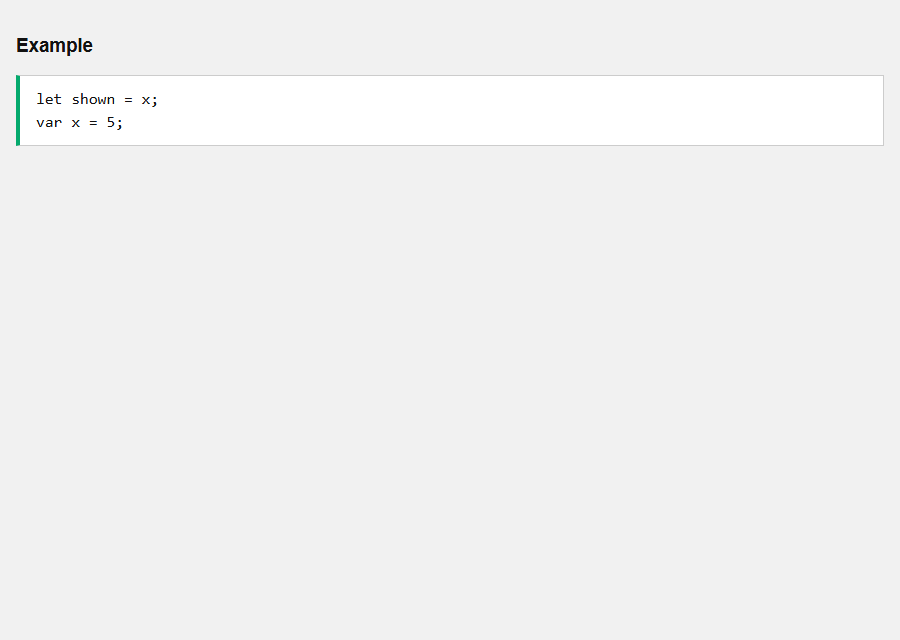

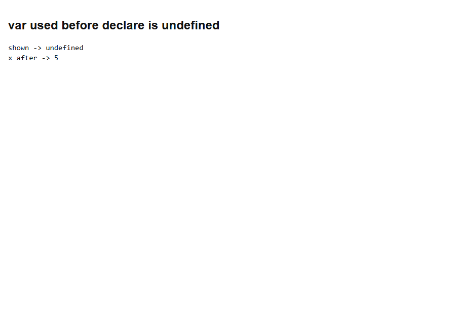

- [x] **Outcome:** shown is **undefined**. After the init line, x is **5**.

<a id="js-varletconst-example-07"></a>

### **Example 7: let TDZ — ReferenceError before declare**

- [x] `let` is hoisted but **uninitialized** until its line.
- [x] Reading it in the TDZ throws **ReferenceError**.

Sandbox: `code_sandbox/js-varletconst/let-tdz-before-declare.html`

```javascript
x = x + 1; // error
let x = 5;
```


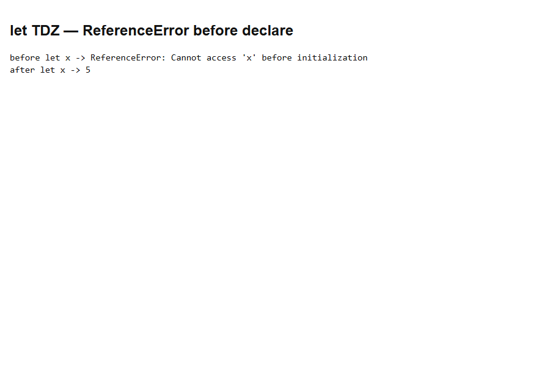

- [x] **Outcome:** **ReferenceError** before `let x = 5`. After the line, x is **5**.

<a id="js-varletconst-example-08"></a>

### **Example 8: const TDZ — ReferenceError before declare**

- [x] `const` is also hoisted and uninitialized (TDZ), same as `let`.
- [x] This uses `const x = 5` **with** an initializer — unlike the hoisting page’s `const carName;` (SyntaxError).

Sandbox: `code_sandbox/js-varletconst/const-tdz-before-declare.html`

```javascript
console.log(x); // error
const x = 5;
```

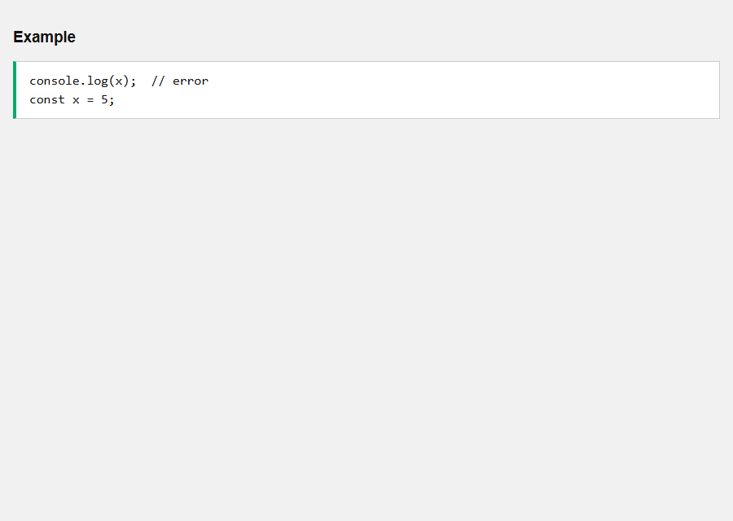

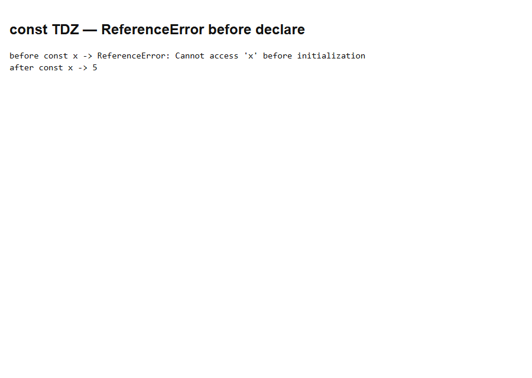

- [x] **Outcome:** **ReferenceError** before `const x = 5`. After the line, x is **5**.

<a id="js-varletconst-example-09"></a>

### **Example 9: Best practice: const by default**

- [x] Use **`const`** unless you know the binding will change.
- [x] Use **`let`** for a counter (or other reassignment). Avoid **`var`**.

Sandbox: `code_sandbox/js-varletconst/const-by-default.html`

```javascript
const MAX = 100;
let count = 0;
count = count + 1;
```

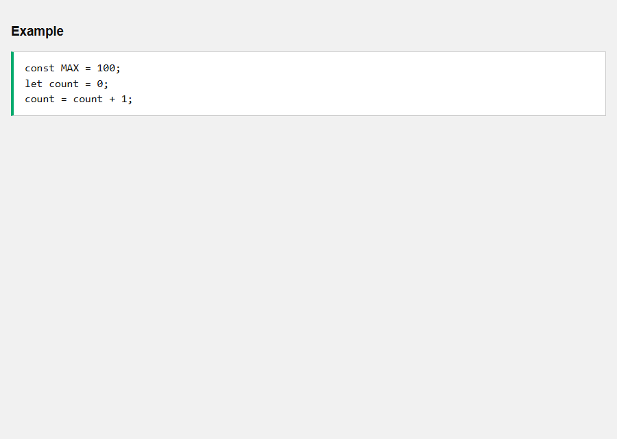

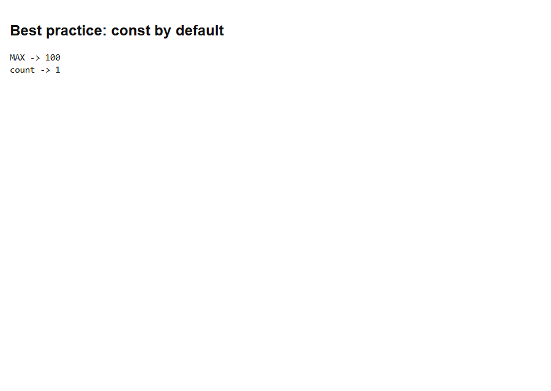

- [x] **Outcome:** MAX stays **100**. count is reassigned to **1**.

<details>
  <summary>Terminal Commands</summary>

## Terminal Commands

```bash
# from Personal/Files/javascript/code_sandbox
py -3 -m http.server 8770 --bind 127.0.0.1
```

Then open `http://127.0.0.1:8770/js-varletconst/`.

</details>

<details>
  <summary>Questions and Answers</summary>

## Questions and Answers

### Question 1: Does `var` leak out of an `if` block?

<details>
<summary>Answer</summary>

- [x] **Yes.** `firstName` is John outside.
- [x] `let lastName` does **not** leak; the Tryit leaves text2 as unknown.

</details>

### Question 2: Can you set `user.name` on a `const` object?

<details>
<summary>Answer</summary>

- [x] **Yes.** That mutates a property, not the binding.

</details>

### Question 3: Can you replace a `const` object with a new one?

<details>
<summary>Answer</summary>

- [x] **No.** **TypeError**.

</details>

### Question 4: Can `var x` be declared twice in one scope?

<details>
<summary>Answer</summary>

- [x] **Yes.** The second declaration overwrites.

</details>

### Question 5: Can `let x` be declared twice in one scope?

<details>
<summary>Answer</summary>

- [x] **No.** **SyntaxError** (parse time — this demo uses `new Function`).

</details>

### Question 6: What does `PI = 3.14159` do if `const PI = 3.14`?

<details>
<summary>Answer</summary>

- [x] **TypeError.** PI stays **3.14**.

</details>

### Question 7: What is a `var` value if you read it before its line?

<details>
<summary>Answer</summary>

- [x] **undefined** (hoisted).

</details>

### Question 8: What is a `let` or `const` value if you read it before its line?

<details>
<summary>Answer</summary>

- [x] **ReferenceError** (TDZ).

</details>

### Question 9: Is `const x;` without a value legal?

<details>
<summary>Answer</summary>

- [x] **No.** That is a **SyntaxError**. `const` must be initialized on the same line.

</details>

### Question 10: What should you use by default?

<details>
<summary>Answer</summary>

- [x] **`const`.** Use **`let`** only when the binding will change. Avoid **`var`**.

</details>

### Question 11: Are let and const hoisted?

<details>
<summary>Answer</summary>

- [x] **Yes**, but they are **not initialized**. The gap is the **temporal dead zone**.

</details>

</details>

## Summary

Use const unless the binding must change, then let. Skip var: it leaks from blocks, allows silent redeclaration, and reads as undefined before its line. const objects can still have their properties updated.

## References

- [JS var, let, const (W3Schools)](https://www.w3schools.com/js/js_varletconst.asp)
- [MDN: let](https://developer.mozilla.org/en-US/docs/Web/JavaScript/Reference/Statements/let)
- [MDN: const](https://developer.mozilla.org/en-US/docs/Web/JavaScript/Reference/Statements/const)
- [MDN: var](https://developer.mozilla.org/en-US/docs/Web/JavaScript/Reference/Statements/var)
