# JSON Values

[Back to JavaScript Tutorial](../tutorial_main.md)

## Introduction

JSON values are string, number, boolean, null, object, or array. Dates and functions are not types — store strings (or omit functions). undefined, NaN, Infinity, Symbol, and BigInt are not JSON.

This section has **24** examples:

- [x] **Example 1:** JSON object values [View](#json-values-example-01)
- [x] **Example 2:** Object as a property value [View](#json-values-example-02)
- [x] **Example 3:** Array as a property value [View](#json-values-example-03)
- [x] **Example 4:** JSON array values [View](#json-values-example-04)
- [x] **Example 5:** Nested object + array [View](#json-values-example-05)
- [x] **Example 6:** JSON string values [View](#json-values-example-06)
- [x] **Example 7:** JSON number values — integer, fraction, exponent [View](#json-values-example-07)
- [x] **Example 8:** Number error — quoted 42 is a string [View](#json-values-example-08)
- [x] **Example 9:** Number error — leading zeros [View](#json-values-example-09)
- [x] **Example 10:** Number error — leading plus [View](#json-values-example-10)
- [x] **Example 11:** Number error — NaN / Infinity [View](#json-values-example-11)
- [x] **Example 12:** Number error — hex / octal [View](#json-values-example-12)
- [x] **Example 13:** JSON boolean values [View](#json-values-example-13)
- [x] **Example 14:** Boolean rule — quotes make a string [View](#json-values-example-14)
- [x] **Example 15:** Boolean rule — True / FALSE are invalid [View](#json-values-example-15)
- [x] **Example 16:** Boolean rule — 1 and 0 are numbers, not booleans [View](#json-values-example-16)
- [x] **Example 17:** JSON null [View](#json-values-example-17)
- [x] **Example 18:** undefined is not a JSON value (wrong) [View](#json-values-example-18)
- [x] **Example 19:** Use null instead of undefined [View](#json-values-example-19)
- [x] **Example 20:** Dates are not a JSON type — store strings [View](#json-values-example-20)
- [x] **Example 21:** Functions are not JSON values [View](#json-values-example-21)
- [x] **Example 22:** Unsupported JS value — Symbol [View](#json-values-example-22)
- [x] **Example 23:** Unsupported JS value — BigInt throws [View](#json-values-example-23)
- [x] **Example 24:** Unsupported JS value — Infinity → null in objects [View](#json-values-example-24)

## Detailed Explanation

- [x] Nest objects and arrays.
- [x] Numbers have no leading zeros or plus signs.
- [x] Use null, not undefined.

<a id="json-values-example-01"></a>

### **Example 1: JSON object values**

- [x] Objects are `{ "key": value }`.
- [x] This one holds name, age, city.

Sandbox: `code_sandbox/json-values/object.html`

```html
{
  "name": "John",
  "age": 30,
  "city": "New York"
}
```


- [x] **Outcome:** Parsed **city** is **New York**.

<a id="json-values-example-02"></a>

### **Example 2: Object as a property value**

- [x] Values can be nested objects: `{ "employee": { ... } }`.

Sandbox: `code_sandbox/json-values/nested-employee.html`

```html
{ "employee":{"name":"John", "age":30, "city":"New York"} }
```

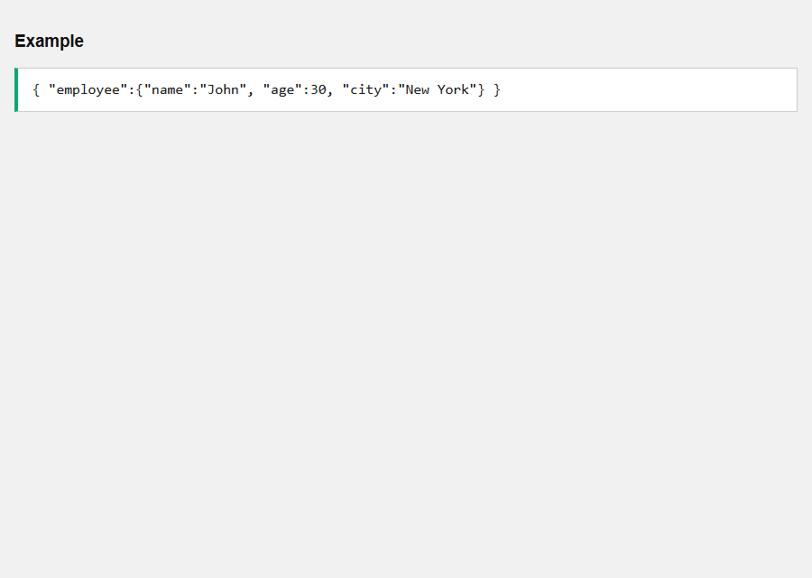


- [x] **Outcome:** `employee.name` is **John**.

<a id="json-values-example-03"></a>

### **Example 3: Array as a property value**

- [x] `employees` can be an array of strings.

Sandbox: `code_sandbox/json-values/array-property.html`

```html
{ "employees":["John", "Anna", "Peter"] }
```

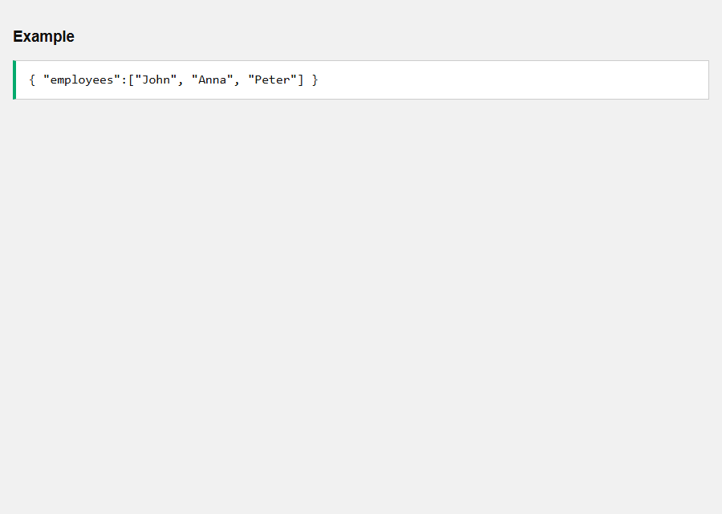


- [x] **Outcome:** `employees[1]` is **Anna**.

<a id="json-values-example-04"></a>

### **Example 4: JSON array values**

- [x] A document may be an array at the **root**: `["Ford", ...]`.

Sandbox: `code_sandbox/json-values/array.html`

```html
["Ford", "Volvo", "BMW"]
```

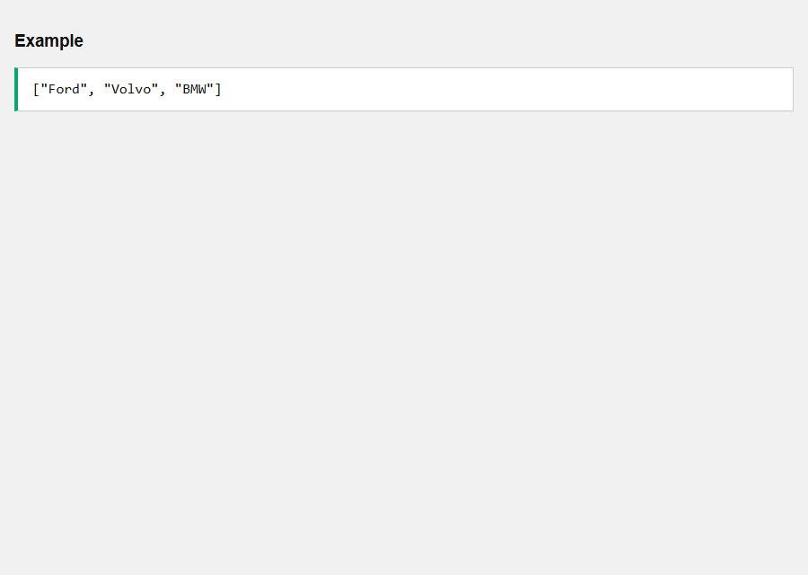


- [x] **Outcome:** Index 0 is **Ford**.

<a id="json-values-example-05"></a>

### **Example 5: Nested object + array**

- [x] `address` is an object; `hobbies` is an array.
- [x] Path: `person.address.city` and `person.hobbies[1]`.

Sandbox: `code_sandbox/json-values/nested.html`

```html
{
  "name": "John",
  "age": 30,
  "address": { "city": "New York", "country": "USA" },
  "hobbies": ["Reading", "Cycling", "Photography"]
}
```

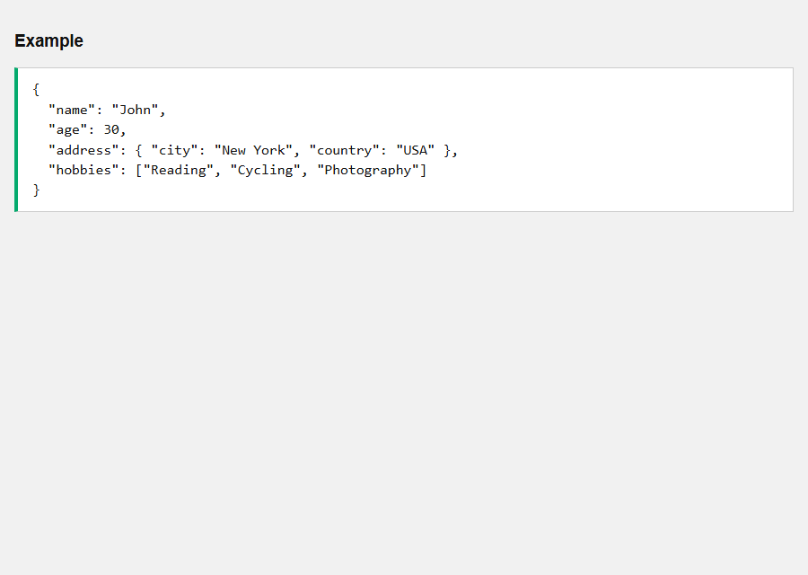


- [x] **Outcome:** City **New York**; hobby **Cycling**.

<a id="json-values-example-06"></a>

### **Example 6: JSON string values**

- [x] Strings: `""`, `"Hello World!"`, escaped quotes, Unicode `\u00A9`.
- [x] Always double-quoted.

Sandbox: `code_sandbox/json-values/strings.html`

```html
""
"Hello World!"
"He said, \"Hello!\""
"\u00A9 2026" 
```

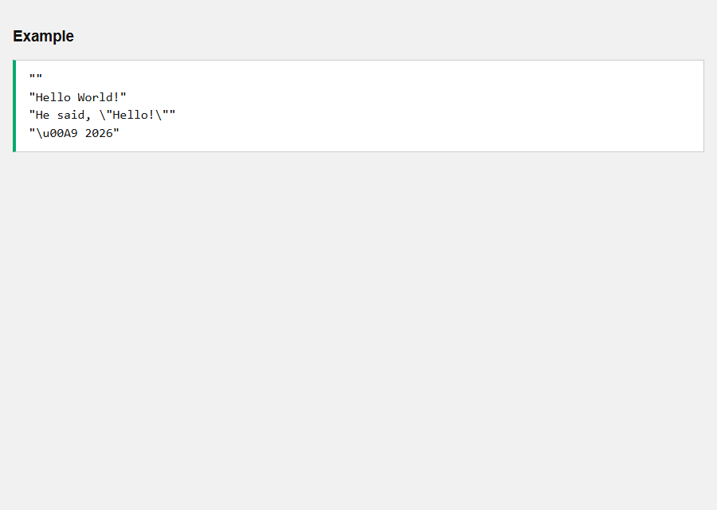


- [x] **Outcome:** Empty string length **0**; copyright escape becomes **© 2026**.

<a id="json-values-example-07"></a>

### **Example 7: JSON number values — integer, fraction, exponent**

- [x] Integers: `-7`, `42`. Fractions: `-0.5`, `3.14`. Exponents: `2.997e8`.
- [x] No leading zeros (`05`), no `+42`, no `NaN`/`Infinity`.

Sandbox: `code_sandbox/json-values/numbers.html`

```html
{ "age": 30, "height": 1.82, "speed_of_light": 2.997e8 }
```

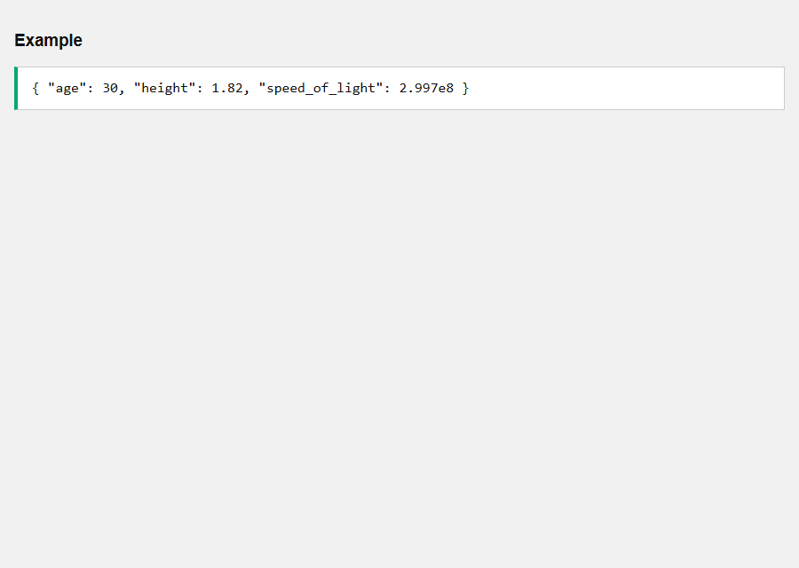


- [x] **Outcome:** age **30**, height **1.82**, speed **299700000**.

<a id="json-values-example-08"></a>

### **Example 8: Number error — quoted 42 is a string**

- [x] `"42"` is a **string**, not a number.

Sandbox: `code_sandbox/json-values/num-no-quotes.html`

```html
"42" 
```

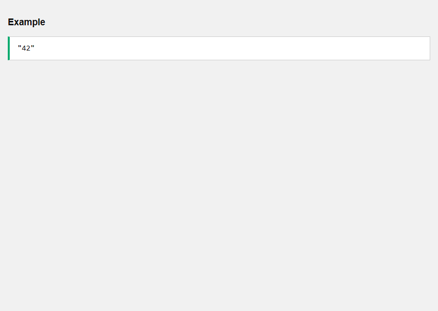


- [x] **Outcome:** `typeof JSON.parse('"42"')` is **string**.

<a id="json-values-example-09"></a>

### **Example 9: Number error — leading zeros**

- [x] `05` is invalid JSON.

Sandbox: `code_sandbox/json-values/num-leading-zero.html`

```html
05
```

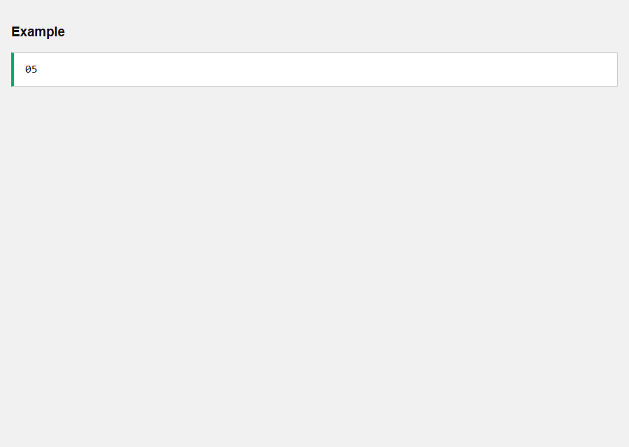

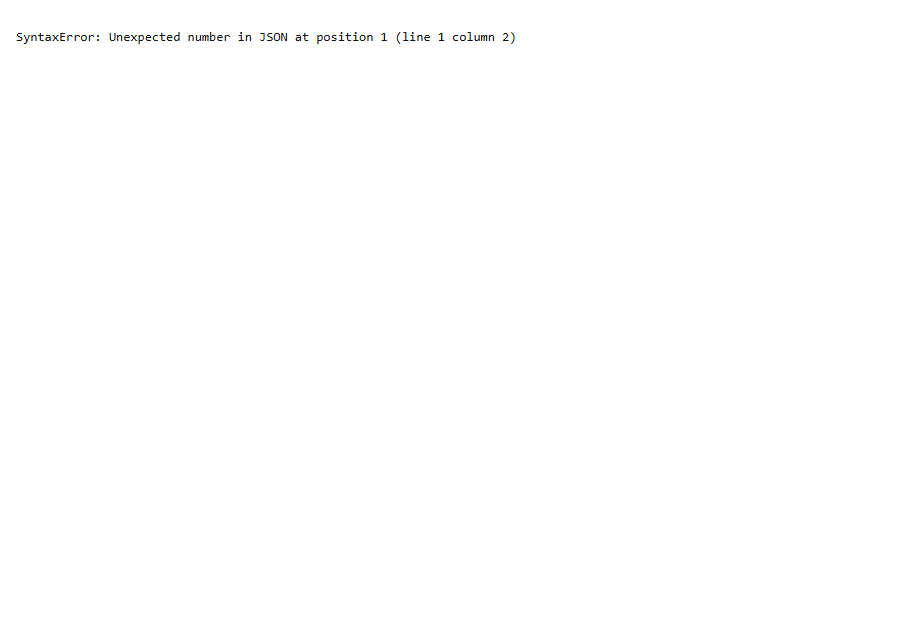

- [x] **Outcome:** Parse of `05` throws **SyntaxError**.

<a id="json-values-example-10"></a>

### **Example 10: Number error — leading plus**

- [x] `+42` is invalid JSON.

Sandbox: `code_sandbox/json-values/num-plus.html`

```html
+42
```


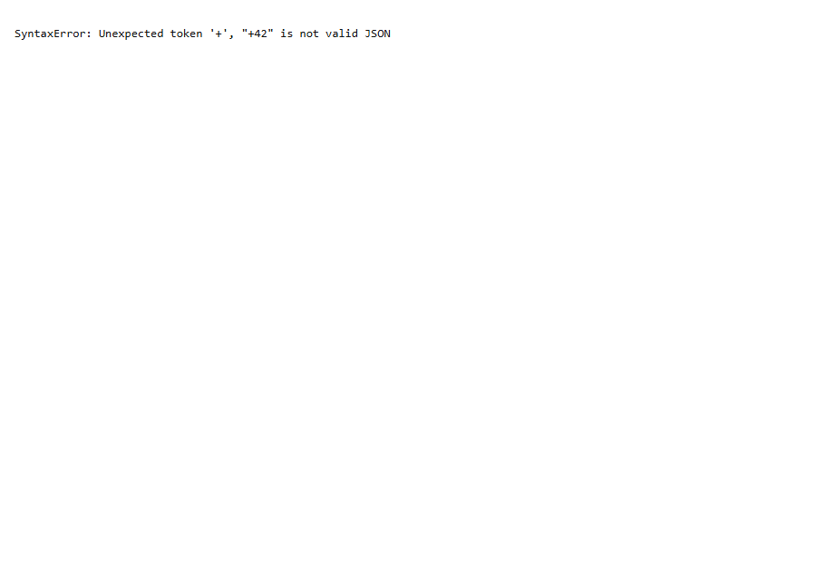

- [x] **Outcome:** Parse of `+42` throws **SyntaxError**.

<a id="json-values-example-11"></a>

### **Example 11: Number error — NaN / Infinity**

- [x] `NaN` and `Infinity` are **not** JSON numbers.

Sandbox: `code_sandbox/json-values/num-nan.html`

```html
NaN
```

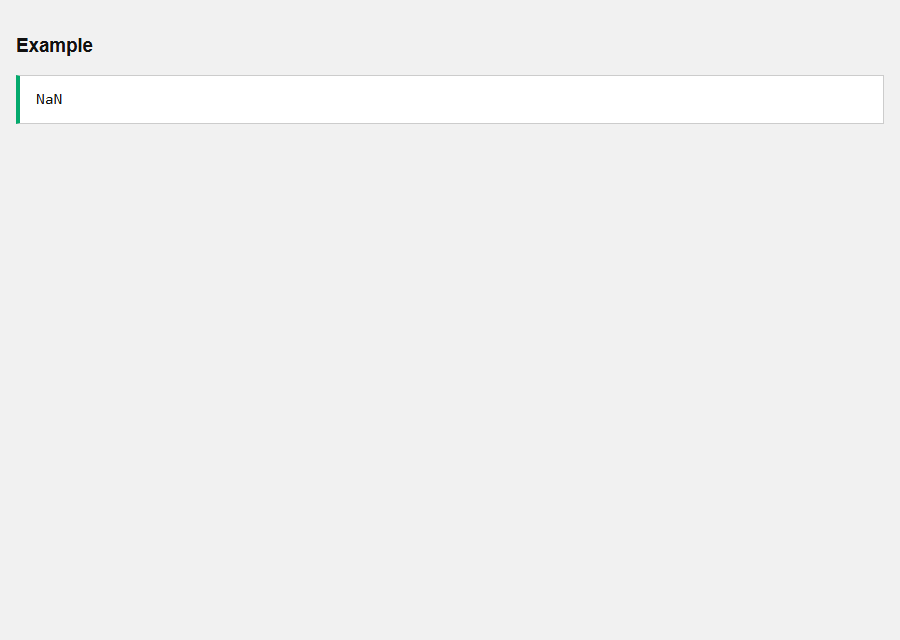

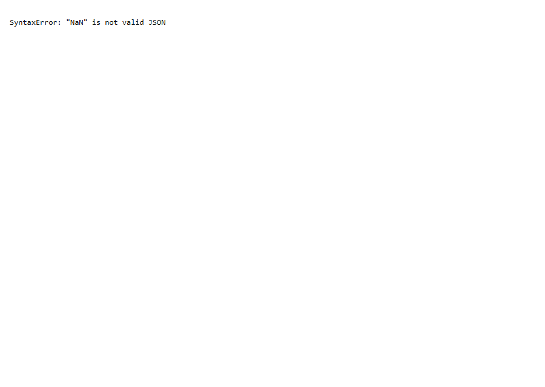

- [x] **Outcome:** Parse of `NaN` throws **SyntaxError**.

<a id="json-values-example-12"></a>

### **Example 12: Number error — hex / octal**

- [x] `0x7A` is invalid JSON.

Sandbox: `code_sandbox/json-values/num-hex.html`

```html
0x7A
```


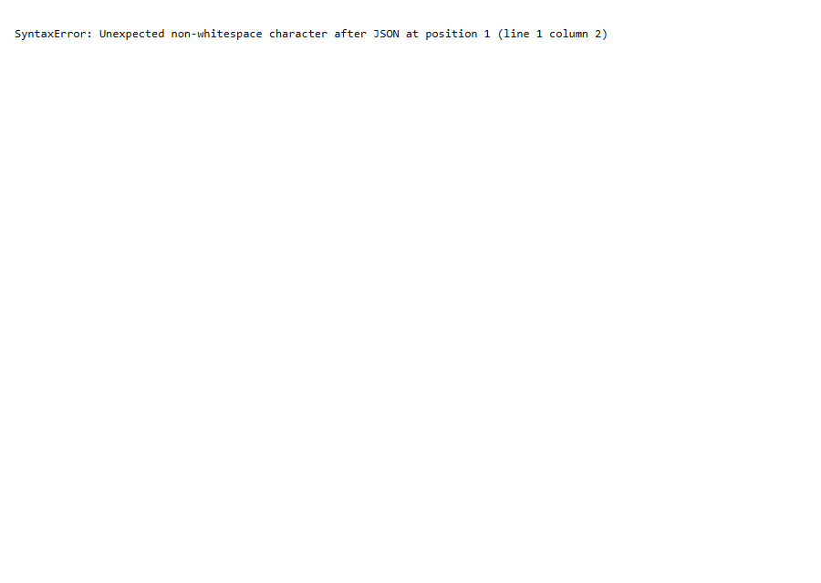

- [x] **Outcome:** Parse of `0x7A` throws **SyntaxError**.

<a id="json-values-example-13"></a>

### **Example 13: JSON boolean values**

- [x] Only lowercase **`true`** and **`false`**.
- [x] `"true"` would be a string. `True` is invalid.

Sandbox: `code_sandbox/json-values/booleans.html`

```html
{ "member": true, "student": false }
```

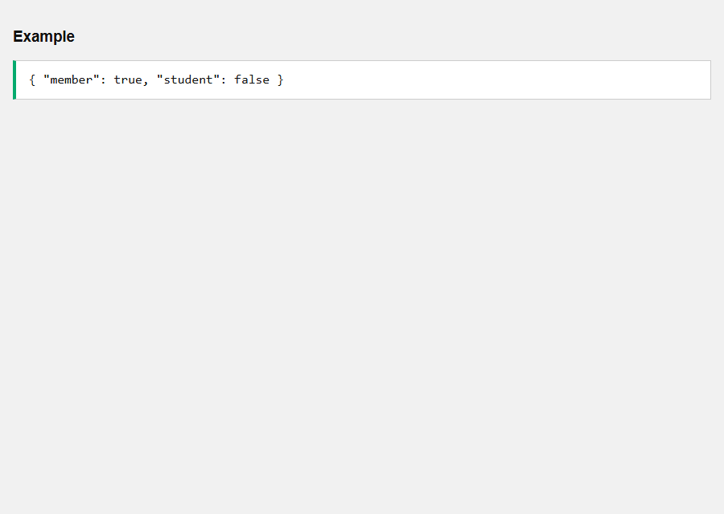


- [x] **Outcome:** member **true**, student **false**, both booleans.

<a id="json-values-example-14"></a>

### **Example 14: Boolean rule — quotes make a string**

- [x] `"true"` is a string.

Sandbox: `code_sandbox/json-values/bool-quoted.html`

```html
"true" 
```

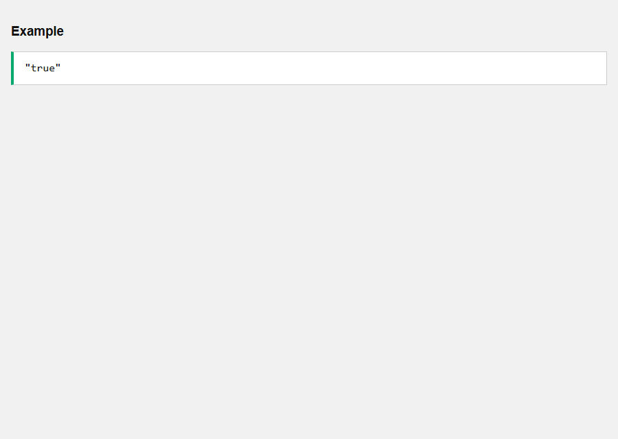


- [x] **Outcome:** typeof is **string**.

<a id="json-values-example-15"></a>

### **Example 15: Boolean rule — True / FALSE are invalid**

- [x] JSON booleans are **lowercase only**.

Sandbox: `code_sandbox/json-values/bool-case.html`

```html
True
```


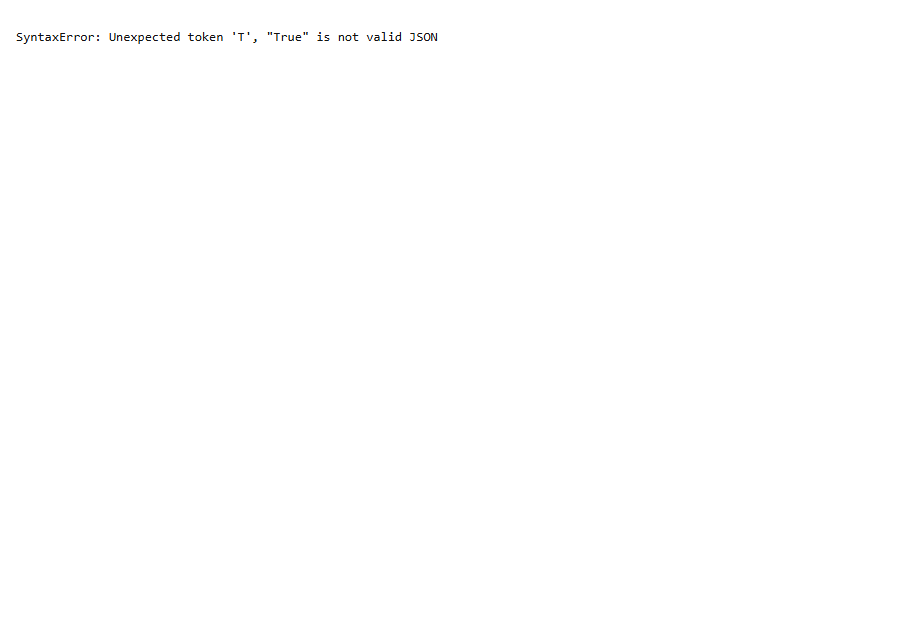

- [x] **Outcome:** Parse of `True` throws **SyntaxError**.

<a id="json-values-example-16"></a>

### **Example 16: Boolean rule — 1 and 0 are numbers, not booleans**

- [x] JSON does not treat `1`/`0` as booleans.

Sandbox: `code_sandbox/json-values/bool-numbers.html`

```html
1
```

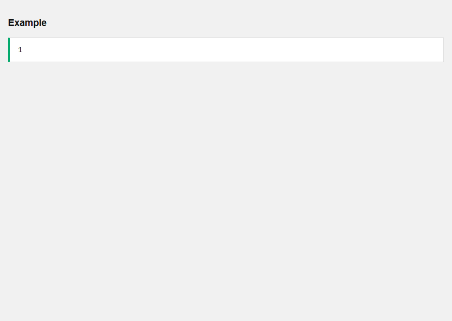


- [x] **Outcome:** `JSON.parse('1')` is **number** 1, not `true`.

<a id="json-values-example-17"></a>

### **Example 17: JSON null**

- [x] `null` is an empty value.
- [x] Example: `middleName: null`.

Sandbox: `code_sandbox/json-values/null-value.html`

```html
{ "middleName": null }
```


- [x] **Outcome:** `middleName` is **null**.

<a id="json-values-example-18"></a>

### **Example 18: undefined is not a JSON value (wrong)**

- [x] `{ "city": undefined }` is **invalid JSON** (and even as JS, stringify would drop it).

Sandbox: `code_sandbox/json-values/undefined-wrong.html`

```html
{ "city": undefined }
```

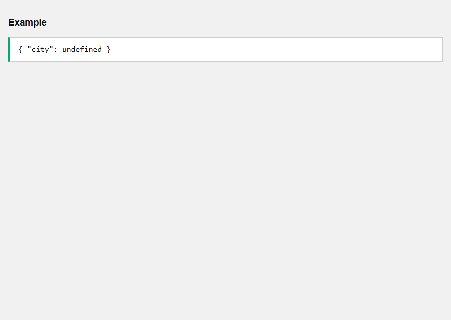

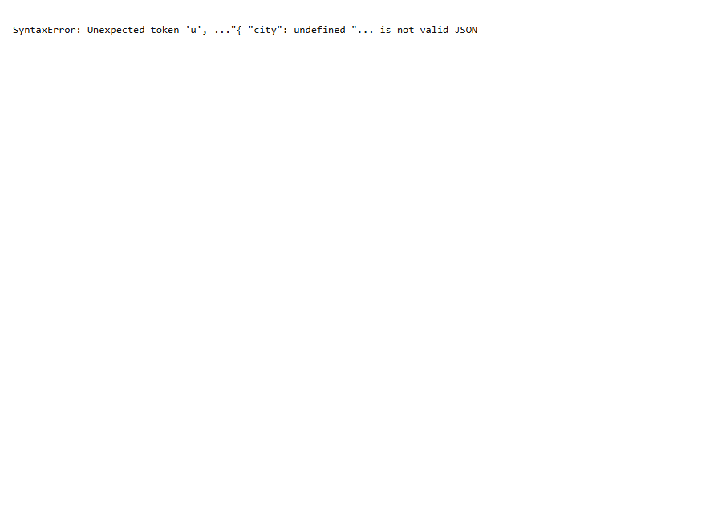

- [x] **Outcome:** Parse throws **SyntaxError**.

<a id="json-values-example-19"></a>

### **Example 19: Use null instead of undefined**

- [x] Correct: `{ "city": null }`.

Sandbox: `code_sandbox/json-values/undefined-correct.html`

```html
{ "city": null }
```

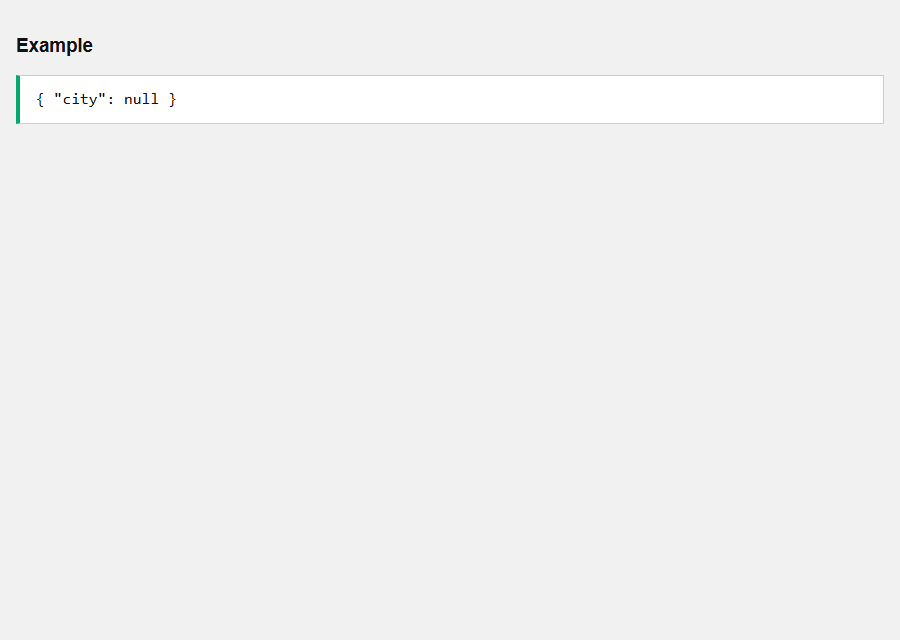


- [x] **Outcome:** Parse succeeds; city is **null**.

<a id="json-values-example-20"></a>

### **Example 20: Dates are not a JSON type — store strings**

- [x] JSON has **no Date**. Store ISO strings, revive later.
- [x] Example: `"birth":"1986-12-14"`.

Sandbox: `code_sandbox/json-values/date-string.html`

```html
const text = '{"name":"John", "birth":"1986-12-14"}';
```

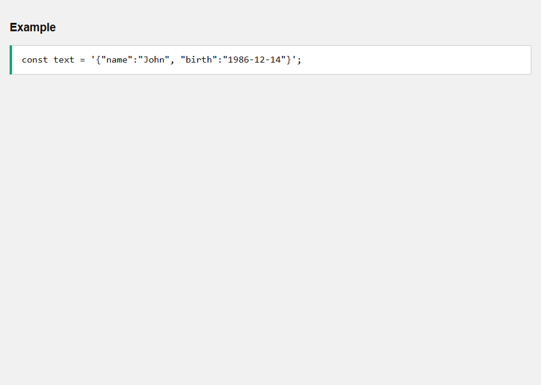


- [x] **Outcome:** `birth` is a **string**, not a Date, until you convert it.

<a id="json-values-example-21"></a>

### **Example 21: Functions are not JSON values**

- [x] `{ "greet": function() {return "Hello"} }` is invalid JSON.

Sandbox: `code_sandbox/json-values/function-wrong.html`

```html
{ "greet": function() {return "Hello"} }
```

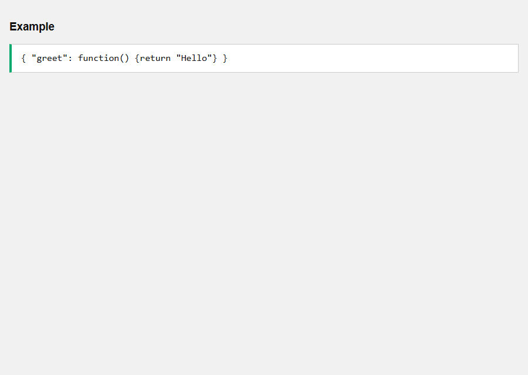


- [x] **Outcome:** Parse throws **SyntaxError**.

<a id="json-values-example-22"></a>

### **Example 22: Unsupported JS value — Symbol**

- [x] **Symbol** is not a JSON type. `JSON.stringify({s: Symbol('x')})` omits it.

Sandbox: `code_sandbox/json-values/unsupported-symbol.html`

```html
JSON.stringify({ s: Symbol("x") })
```


- [x] **Outcome:** The object stringifies to **`{}`** (symbol omitted).

<a id="json-values-example-23"></a>

### **Example 23: Unsupported JS value — BigInt throws**

- [x] `JSON.stringify(1n)` throws **TypeError**.

Sandbox: `code_sandbox/json-values/unsupported-bigint.html`

```html
JSON.stringify(1n)
```

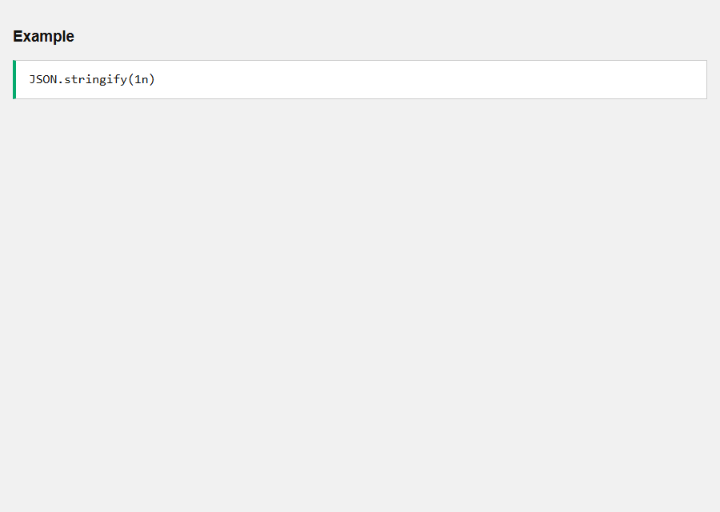

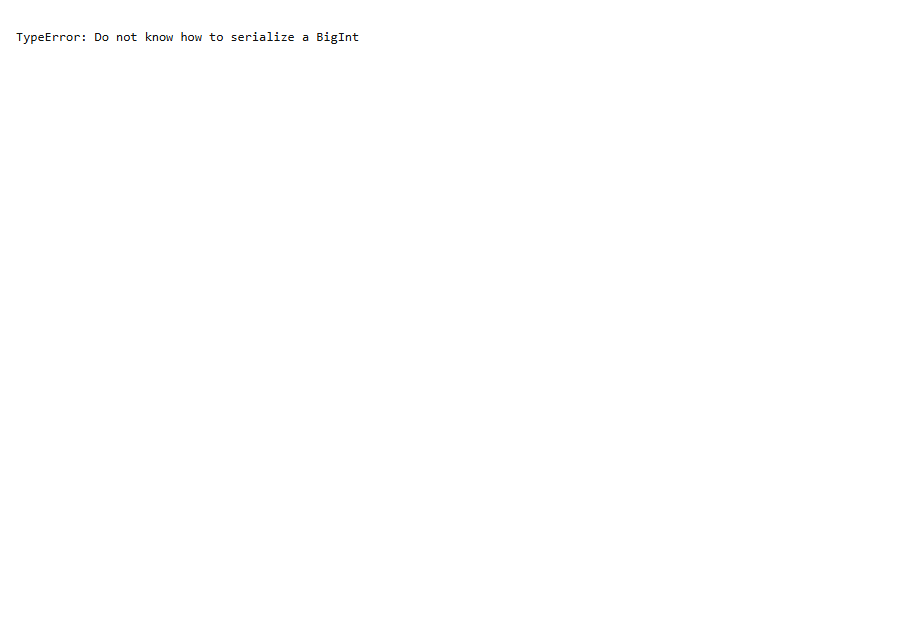

- [x] **Outcome:** The call throws **TypeError** (BigInt cannot be serialized).

<a id="json-values-example-24"></a>

### **Example 24: Unsupported JS value — Infinity → null in objects**

- [x] `Infinity` is not JSON. stringify turns it into **null** in objects/arrays.

Sandbox: `code_sandbox/json-values/unsupported-infinity.html`

```html
JSON.stringify({ n: Infinity })
```


- [x] **Outcome:** Result is **`{"n":null}`**.

<details>
  <summary>Terminal Commands</summary>

## Terminal Commands

```bash
# from Personal/Files/javascript/code_sandbox
py -3 -m http.server 8770 --bind 127.0.0.1
```

Then open `http://127.0.0.1:8770/json-values/`.

</details>

<details>
  <summary>Questions and Answers</summary>

## Questions and Answers

### Question 1: What types can JSON hold?

<details>
<summary>Answer</summary>

- [x] String, Number, Boolean, Null, Object, Array.

</details>

### Question 2: How do you nest data?

<details>
<summary>Answer</summary>

- [x] Objects and arrays as **values** of other objects/arrays.

</details>

### Question 3: Is `undefined` valid JSON?

<details>
<summary>Answer</summary>

- [x] **No** — use **null**.

</details>

### Question 4: Is `NaN` valid JSON?

<details>
<summary>Answer</summary>

- [x] **No**.

</details>

### Question 5: How should you store a date?

<details>
<summary>Answer</summary>

- [x] As an **ISO string**, then convert after parse.

</details>

### Question 6: What happens if you put a function in JSON text?

<details>
<summary>Answer</summary>

- [x] **SyntaxError** on parse.

</details>

### Question 7: What does stringify do with BigInt?

<details>
<summary>Answer</summary>

- [x] **Throws TypeError**.

</details>

### Question 8: What does stringify do with Infinity?

<details>
<summary>Answer</summary>

- [x] Converts to **null** in objects/arrays.

</details>

### Question 9: Is `True` a JSON boolean?

<details>
<summary>Answer</summary>

- [x] **No** — only lowercase **true** / **false**.

</details>

### Question 10: Is `05` a JSON number?

<details>
<summary>Answer</summary>

- [x] **No** — no leading zeros.

</details>

### Question 11: Quoted `"42"` is what type?

<details>
<summary>Answer</summary>

- [x] A **string**.

</details>


</details>

## Summary

Stick to the six types. Store dates as strings. Expect stringify to drop functions/undefined/symbols in objects, convert Infinity/NaN to null, and throw on BigInt.

## References

- [JSON Values](https://www.w3schools.com/js/js_json_datatypes.asp)
- [MDN JSON](https://developer.mozilla.org/en-US/docs/Web/JavaScript/Reference/Global_Objects/JSON)
