# JSON vs XML

[Back to JavaScript Tutorial](../tutorial_main.md)

## Introduction

JSON and XML both store structured data. JSON maps to JS values and is compact. XML is a document language with elements, attributes, mixed content, comments, and namespaces, parsed with DOMParser.

This section has **17** examples:

- [x] **Example 1:** JSON example — employees array [View](#json-vs-xml-example-01)
- [x] **Example 2:** XML example — employee elements [View](#json-vs-xml-example-02)
- [x] **Example 3:** JSON uses objects and arrays — skills [View](#json-vs-xml-example-03)
- [x] **Example 4:** XML uses elements — skills [View](#json-vs-xml-example-04)
- [x] **Example 5:** Working with JSON — JSON.parse [View](#json-vs-xml-example-05)
- [x] **Example 6:** Working with JSON — JSON.stringify [View](#json-vs-xml-example-06)
- [x] **Example 7:** Working with XML — DOMParser [View](#json-vs-xml-example-07)
- [x] **Example 8:** JSON is more compact [View](#json-vs-xml-example-08)
- [x] **Example 9:** Equivalent XML is more verbose [View](#json-vs-xml-example-09)
- [x] **Example 10:** XML can represent documents (mixed content) [View](#json-vs-xml-example-10)
- [x] **Example 11:** XML attributes vs JSON fields [View](#json-vs-xml-example-11)
- [x] **Example 12:** Equivalent JSON for the product [View](#json-vs-xml-example-12)
- [x] **Example 13:** XML namespaces [View](#json-vs-xml-example-13)
- [x] **Example 14:** Difference — typed values vs text-only elements [View](#json-vs-xml-example-14)
- [x] **Example 15:** Difference — comments [View](#json-vs-xml-example-15)
- [x] **Example 16:** When to use JSON [View](#json-vs-xml-example-16)
- [x] **Example 17:** When to use XML [View](#json-vs-xml-example-17)

## Detailed Explanation

- [x] JSON.parse vs DOMParser.
- [x] JSON typed values vs XML text.
- [x] JSON for APIs; XML for documents.

<a id="json-vs-xml-example-01"></a>

### **Example 1: JSON example — employees array**

- [x] JSON uses **objects and arrays** with typed values.
- [x] Three employees with firstName/lastName.

Sandbox: `code_sandbox/json-vs-xml/json-employees.html`

```html
{ "employees": [
  {"firstName":"John", "lastName":"Doe"},
  {"firstName":"Anna", "lastName":"Smith"},
  {"firstName":"Peter", "lastName":"Jones"}
] }
```

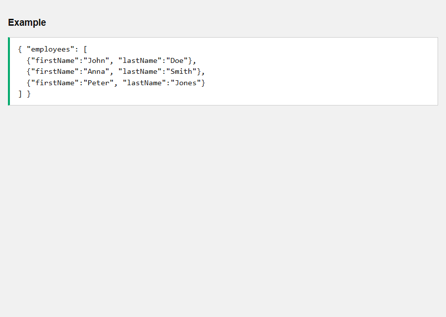


- [x] **Outcome:** Parsed count is **3**; first lastName **Doe**.

<a id="json-vs-xml-example-02"></a>

### **Example 2: XML example — employee elements**

- [x] XML uses **elements**. The same three people as tags.
- [x] Content is **text** until you convert it.

Sandbox: `code_sandbox/json-vs-xml/xml-employees.html`

```html
<employees>
  <employee><firstName>John</firstName><lastName>Doe</lastName></employee>
</employees>
```

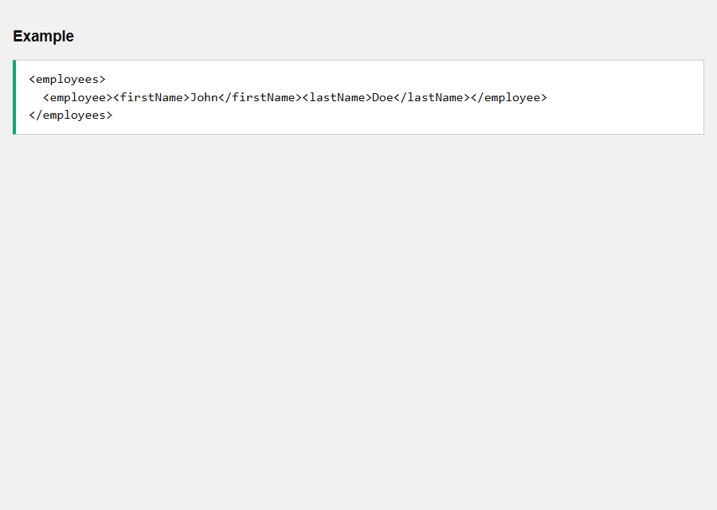


- [x] **Outcome:** `DOMParser` + `getElementsByTagName("firstName")` yields **John** as the first name.

<a id="json-vs-xml-example-03"></a>

### **Example 3: JSON uses objects and arrays — skills**

- [x] `skills` is a real **array** of strings.

Sandbox: `code_sandbox/json-vs-xml/json-skills.html`

```html
{ "name": "John", "skills": ["HTML", "CSS", "JavaScript"] }
```

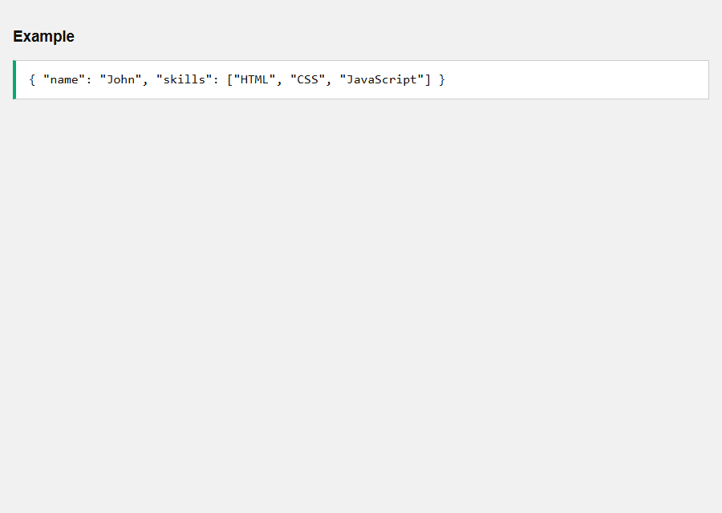


- [x] **Outcome:** `skills[2]` is **JavaScript**; `Array.isArray(skills)` is **true**.

<a id="json-vs-xml-example-04"></a>

### **Example 4: XML uses elements — skills**

- [x] Each skill is an element. You **query the DOM**, not an array property.
- [x] An `id` attribute can live on the element.

Sandbox: `code_sandbox/json-vs-xml/xml-skills.html`

```html
<person id="101">
  <name>John</name>
  <skills><skill>HTML</skill></skills>
</person>
```

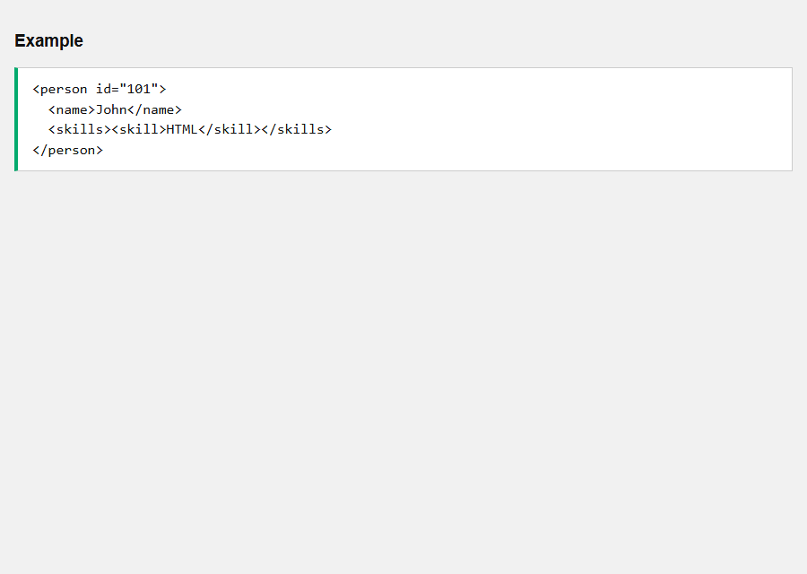


- [x] **Outcome:** Three `<skill>` nodes; first text **HTML**; id **101**.

<a id="json-vs-xml-example-05"></a>

### **Example 5: Working with JSON — JSON.parse**

- [x] One call maps JSON onto JS values.

Sandbox: `code_sandbox/json-vs-xml/json-parse.html`

```html
const person = JSON.parse(text);
```

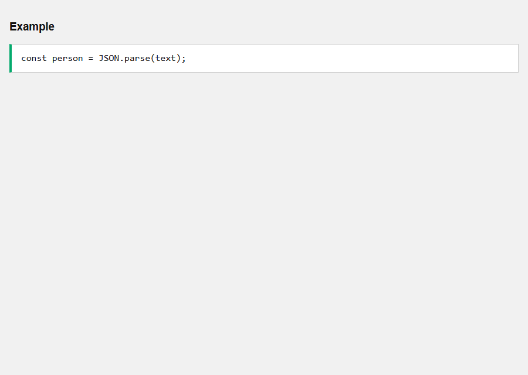


- [x] **Outcome:** **John** / **30**.

<a id="json-vs-xml-example-06"></a>

### **Example 6: Working with JSON — JSON.stringify**

- [x] One call maps JS values onto JSON text.

Sandbox: `code_sandbox/json-vs-xml/json-stringify.html`

```html
const text = JSON.stringify(person);
```

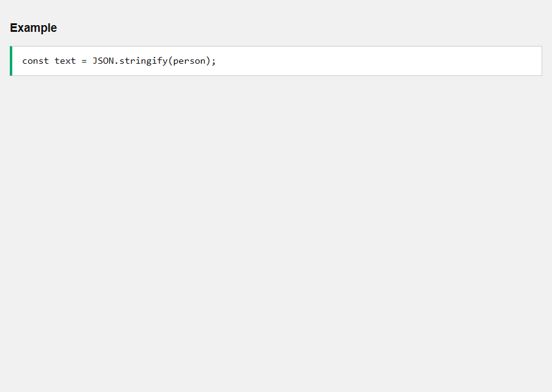


- [x] **Outcome:** Text includes **"name":"John"**.

<a id="json-vs-xml-example-07"></a>

### **Example 7: Working with XML — DOMParser**

- [x] `new DOMParser().parseFromString(text, "text/xml")`.
- [x] Then **DOM methods** (`getElementsByTagName`).

Sandbox: `code_sandbox/json-vs-xml/xml-domparser.html`

```html
const parser = new DOMParser();
const xmlDoc = parser.parseFromString(text, "text/xml");
const name = xmlDoc.getElementsByTagName("name")[0].textContent;
```

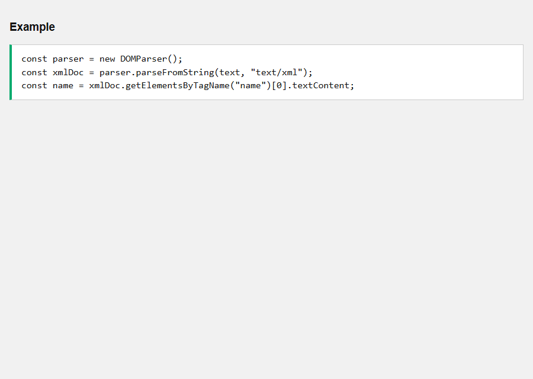


- [x] **Outcome:** Extracted name is **John**.

<a id="json-vs-xml-example-08"></a>

### **Example 8: JSON is more compact**

- [x] `{"name":"John","age":30}` vs a multi-line XML tree.
- [x] Less markup for the same fields.

Sandbox: `code_sandbox/json-vs-xml/compact-json.html`

```html
{"name":"John","age":30}
```

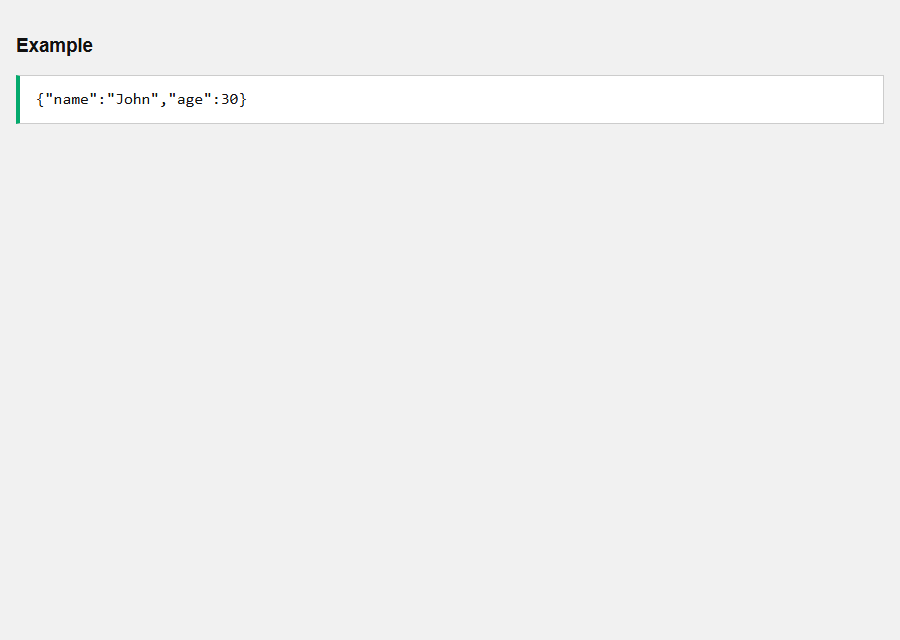


- [x] **Outcome:** JSON length is **smaller** than the equivalent XML string.

<a id="json-vs-xml-example-09"></a>

### **Example 9: Equivalent XML is more verbose**

- [x] Each field is an element with open/close tags.

Sandbox: `code_sandbox/json-vs-xml/compact-xml.html`

```html
<person>
  <name>John</name>
  <age>30</age>
</person>
```

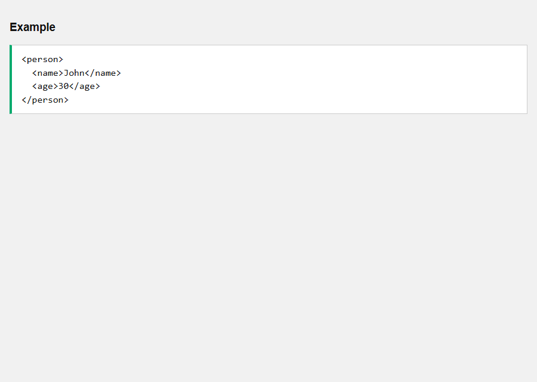


- [x] **Outcome:** Parser still reads **John** / **30**, with more characters on the wire.

<a id="json-vs-xml-example-10"></a>

### **Example 10: XML can represent documents (mixed content)**

- [x] XML can mix **text and child elements** (`Please read the <important>…`).
- [x] JSON objects are not a document markup language.

Sandbox: `code_sandbox/json-vs-xml/xml-mixed.html`

```html
<message>
  Please read the <important>safety instructions</important> before continuing.
</message>
```

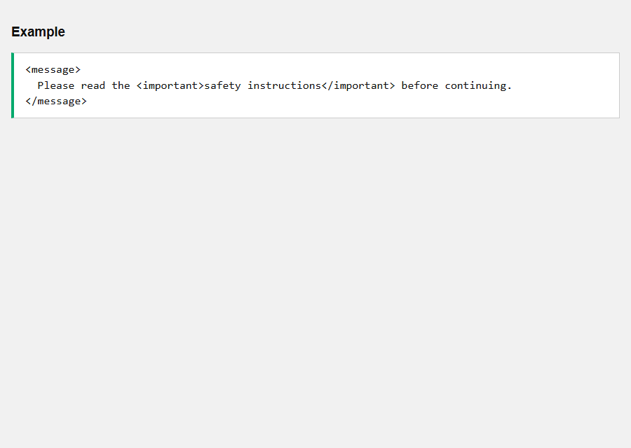


- [x] **Outcome:** `important` text is **safety instructions**; the parent still has surrounding text.

<a id="json-vs-xml-example-11"></a>

### **Example 11: XML attributes vs JSON fields**

- [x] XML: `id` and `currency` as **attributes** plus child elements.
- [x] JSON: usually all fields are **object properties** (no separate attribute axis).

Sandbox: `code_sandbox/json-vs-xml/xml-attrs.html`

```html
<product id="101" currency="USD">
  <name>Laptop</name>
  <price>899</price>
</product>
```

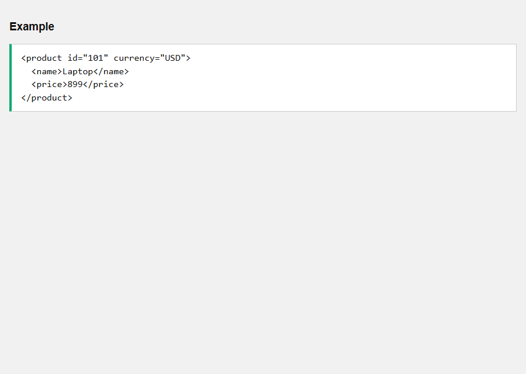


- [x] **Outcome:** id **101**, currency **USD**, name **Laptop**.

<a id="json-vs-xml-example-12"></a>

### **Example 12: Equivalent JSON for the product**

- [x] Same data as properties: id, currency, name, price.

Sandbox: `code_sandbox/json-vs-xml/json-equiv-attrs.html`

```html
{ "id": 101, "currency": "USD", "name": "Laptop", "price": 899 }
```

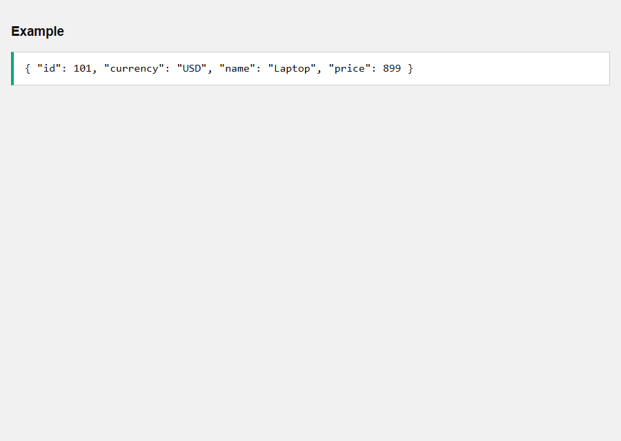


- [x] **Outcome:** **Laptop** costs **899** **USD**.

<a id="json-vs-xml-example-13"></a>

### **Example 13: XML namespaces**

- [x] XML supports **xmlns** prefixes (`h:table` vs `f:table`).
- [x] JSON has **no namespaces** — collision is just a name clash.

Sandbox: `code_sandbox/json-vs-xml/namespaces.html`

```html
<root xmlns:h="http://www.w3.org/TR/html4/" xmlns:f="https://example.com/furniture">
  <h:table>...</h:table>
  <f:table>...</f:table>
</root>
```

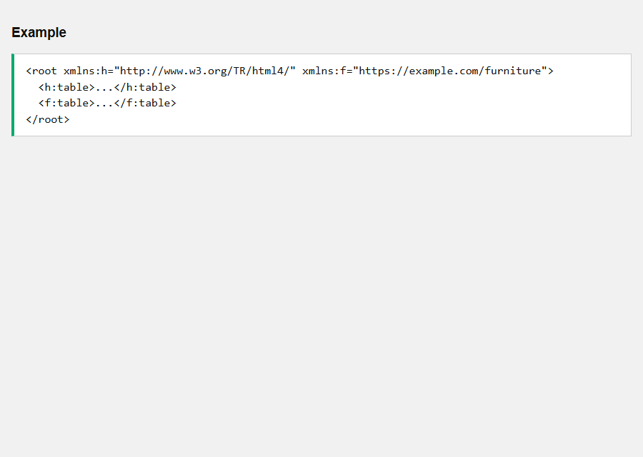


- [x] **Outcome:** The parsed document element has **two** xmlns attributes (`h` and `f`).

<a id="json-vs-xml-example-14"></a>

### **Example 14: Difference — typed values vs text-only elements**

- [x] JSON has numbers/booleans/null. XML element content is **text** until you convert.
- [x] JSON `age:30` is already a number after parse.

Sandbox: `code_sandbox/json-vs-xml/table-types.html`

```html
JSON: { "age": 30 }
XML:  <age>30</age>
```

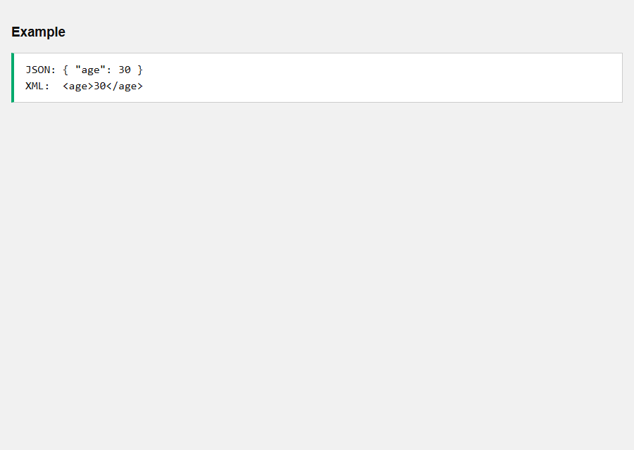


- [x] **Outcome:** JSON age `typeof` is **number**. XML age `textContent` `typeof` is **string**.

<a id="json-vs-xml-example-15"></a>

### **Example 15: Difference — comments**

- [x] JSON: **no comments**. XML: **yes** (`<!-- -->`).

Sandbox: `code_sandbox/json-vs-xml/table-comments.html`

```html
JSON: no comments
XML: <!-- comment -->
```

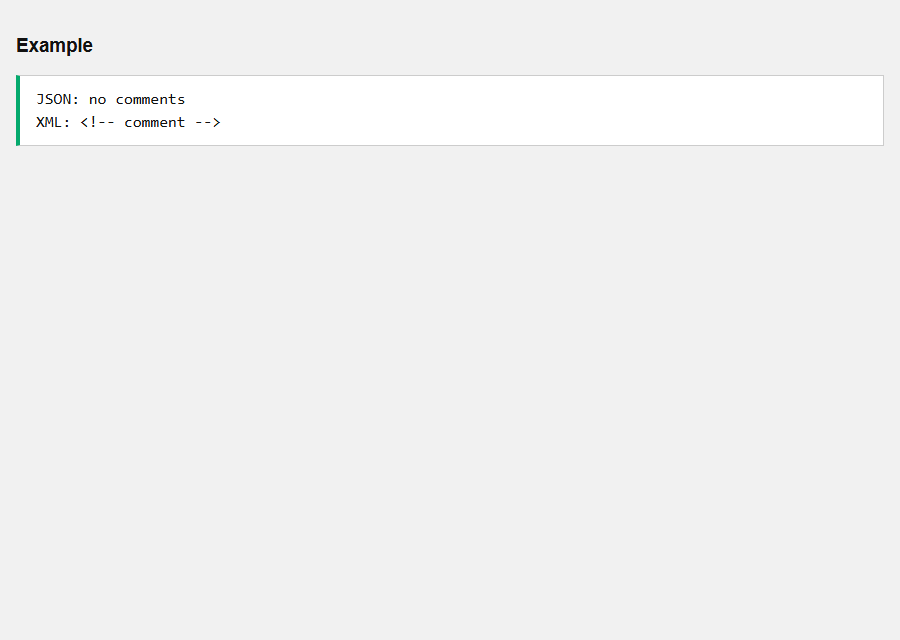


- [x] **Outcome:** XML comment nodes exist in the DOM (`COMMENT_NODE` is 8).

<a id="json-vs-xml-example-16"></a>

### **Example 16: When to use JSON**

- [x] APIs, JS apps, compact **data** interchange, typed values, `JSON.parse`.

Sandbox: `code_sandbox/json-vs-xml/when-json.html`

```html
Use JSON for application data.
```

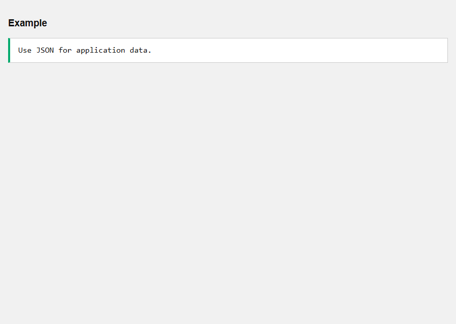


- [x] **Outcome:** The snapshot lists the JSON-friendly jobs from the page.

<a id="json-vs-xml-example-17"></a>

### **Example 17: When to use XML**

- [x] Documents, mixed content, attributes, namespaces, existing XML tooling / validation (XSD).

Sandbox: `code_sandbox/json-vs-xml/when-xml.html`

```html
Use XML for documents and structured markup.
```

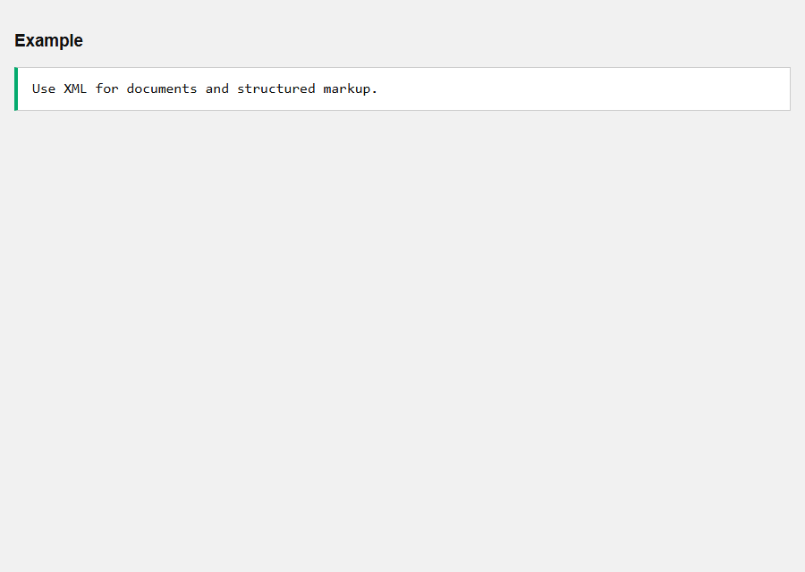


- [x] **Outcome:** The snapshot lists XML-friendly jobs from the page.

<details>
  <summary>Terminal Commands</summary>

## Terminal Commands

```bash
# from Personal/Files/javascript/code_sandbox
py -3 -m http.server 8770 --bind 127.0.0.1
```

Then open `http://127.0.0.1:8770/json-vs-xml/`.

</details>

<details>
  <summary>Questions and Answers</summary>

## Questions and Answers

### Question 1: Does JSON map directly to JS values?

<details>
<summary>Answer</summary>

- [x] **Yes** — `JSON.parse`.

</details>

### Question 2: How do you parse XML in JS?

<details>
<summary>Answer</summary>

- [x] **`DOMParser.parseFromString(..., "text/xml")`**.

</details>

### Question 3: Which is usually more compact?

<details>
<summary>Answer</summary>

- [x] **JSON**.

</details>

### Question 4: Can JSON represent mixed document text + tags?

<details>
<summary>Answer</summary>

- [x] **Not as markup** — that is XML’s strength.

</details>

### Question 5: Does JSON have namespaces?

<details>
<summary>Answer</summary>

- [x] **No**.

</details>

### Question 6: Does JSON have comments?

<details>
<summary>Answer</summary>

- [x] **No**.

</details>

### Question 7: What is XML element content typed as after parse?

<details>
<summary>Answer</summary>

- [x] **Text** (`textContent` is a string).

</details>

### Question 8: How are XML attributes modeled in JSON here?

<details>
<summary>Answer</summary>

- [x] As **ordinary object properties**.

</details>

### Question 9: When is JSON the better default?

<details>
<summary>Answer</summary>

- [x] **Application data** and JS APIs.

</details>

### Question 10: When is XML the better default?

<details>
<summary>Answer</summary>

- [x] **Documents**, mixed content, namespaces, XML schemas.

</details>


</details>

## Summary

Default to JSON for application data in JavaScript. Use XML when you need documents, attributes/namespaces, or mixed content, and parse it with the XML DOM.

## References

- [JSON vs XML](https://www.w3schools.com/js/js_json_xml.asp)
- [MDN DOMParser](https://developer.mozilla.org/en-US/docs/Web/API/DOMParser)
