# JavaScript Tutorial

Section-by-section notes. Each accordion is one tutorial page: explained, coded in `code_sandbox`, run in the browser, and snapped.

<details>
  <summary>JS Introduction</summary>

## Introduction

JavaScript is the **programming language of the web**. This section shows what it can do in a page: **change HTML content**, **change attribute values**, **change CSS**, and **hide or show** elements. It also separates JavaScript from **Java**, and names **Brendan Eich (1995)** and the **ECMAScript / ECMA-262** standard.

## Detailed Explanation

- [x] **JavaScript is the programming language of the web**
  - It can **calculate**, **manipulate**, and **validate** data.
  - It can **update and change** both **HTML** and **CSS** live in the page.
- [x] **The common pattern in every example below**
  - **Select** an element, then **change** something about it.
  - Selection here uses **`document.getElementById("id")`** — it finds the one element whose `id` matches.
  - What you change is either its **content** (`innerHTML`), an **attribute** (`src`), or its **style** (`style.fontSize`, `style.display`).
- [x] **How the sandbox demos capture the "after" state**
  - Each demo keeps the original button so you can click it yourself.
  - It also runs the same statement automatically when the URL ends in **`?run`**, so the screenshots below show the exact outcome the click produces.

### **Example 1: Change HTML content**

- [x] **`document.getElementById("demo")`** finds the `<p id="demo">`, and **`.innerHTML = "Hello JavaScript"`** replaces everything inside that paragraph.
- [x] The statement lives in the button's **`onclick`**, so it runs **once per click**.
- [x] **Quotes are interchangeable:** `innerHTML = "Hello JavaScript"` and `innerHTML = 'Hello JavaScript'` behave identically — JavaScript accepts both **double** and **single** quotes for strings.
- [x] `innerHTML` parses its value as **HTML**, so `"<b>Hi</b>"` would render bold, not literal tags.

Sandbox: `code_sandbox/js-introduction/index.html`

```html
<h2>What Can JavaScript Do?</h2>
<p id="demo">JavaScript can change HTML content.</p>
<button
  type="button"
  onclick="document.getElementById('demo').innerHTML = 'Hello JavaScript'"
>
  Click Me!
</button>
```


- [x] **Outcome:** before the click the paragraph reads **JavaScript can change HTML content.**; after the click (shown above) it reads **Hello JavaScript**.

### **Example 2: Change an HTML attribute value**

- [x] The light-bulb demo swaps the **`src`** attribute of an `` between two files.
- [x] **Turn on the light** sets `src = "pic_bulbon.svg"`; **Turn off the light** sets `src = "pic_bulboff.svg"`.
- [x] Changing an attribute is the same select-then-assign pattern; only the property (`.src`) differs.
- [x] The sandbox uses local **SVG** on/off bulbs instead of the site's GIF files, so it works fully offline.

Sandbox: `code_sandbox/js-introduction/lightbulb.html`

```html
<p>JavaScript can change HTML attribute values.</p>
<button onclick="document.getElementById('myImage').src = 'pic_bulbon.svg'">
  Turn on the light
</button>
<button onclick="document.getElementById('myImage').src = 'pic_bulboff.svg'">
  Turn off the light
</button>

```


- [x] **Outcome:** the page starts on the grey **off** bulb; running the "on" statement swaps the image to the yellow **on** bulb (shown above) without reloading the page.

### **Example 3: Change an HTML style (CSS)**

- [x] Changing style is a variant of changing an attribute — you assign to properties on the element's **`style`** object.
- [x] `document.getElementById("demo").style.fontSize = "35px"` enlarges the paragraph text.
- [x] CSS property names become **camelCase** in JavaScript: `font-size` → `fontSize`, `background-color` → `backgroundColor`.
- [x] The value is a **string with units** (`"35px"`), not a bare number.

Sandbox: `code_sandbox/js-introduction/style.html`

```html
<p id="demo">JavaScript can change the style of an HTML element.</p>
<button onclick="document.getElementById('demo').style.fontSize = '35px'">
  Click Me!
</button>
```


- [x] **Outcome:** the paragraph jumps from normal size to a large **35px** heading-sized line (shown above).

### **Example 4: Hide and show elements**

- [x] Visibility is controlled through the **`display`** style.
- [x] **Hide:** `style.display = "none"` removes the element from the layout (it disappears and takes no space).
- [x] **Show:** `style.display = "block"` puts it back.
- [x] One demo holds both buttons so you can toggle the paragraph off and on.

Sandbox: `code_sandbox/js-introduction/hide-show.html`

```html
<p id="demo">JavaScript can hide and show HTML elements.</p>
<button onclick="document.getElementById('demo').style.display = 'none'">Hide</button>
<button onclick="document.getElementById('demo').style.display = 'block'">Show</button>
```


- [x] **Outcome:** the demo loads with the paragraph visible plus **Hide** / **Show** buttons (shown above). Clicking **Hide** makes the paragraph vanish; clicking **Show** brings it back.

### **Did You Know? Java vs JavaScript**

- [x] **JavaScript and Java** are **completely different** languages, in both concept and design — the shared word "Java" is historical marketing, not a technical relationship.
- [x] JavaScript was invented by **Brendan Eich** in **1995** and became an **ECMA** standard in **1997**.
- [x] **ECMA-262** is the official name of the **standard**; **ECMAScript** is the official name of the **language**.
- [x] **Page exercise —** *True or False: "JAVA is short for JavaScript."* → **False.**

<details>
  <summary>Terminal Commands</summary>

## Terminal Commands

Serve the sandbox so the Cursor browser can load the example (it cannot open `file://`).

```bash
# from Personal/Files/javascript/code_sandbox
py -3 -m http.server 8770 --bind 127.0.0.1
```

Then open `http://127.0.0.1:8770/js-introduction/`.

</details>

<details>
  <summary>Questions and Answers</summary>

## Questions and Answers

### Question 1: What is JavaScript in this tutorial?

<details>
<summary>Answer</summary>

- [x] The **programming language of the web**.
- [x] It can calculate, manipulate, and validate data.
- [x] It can update and change **HTML** and **CSS**.

</details>

### Question 2: Which method finds the element with `id="demo"`?

<details>
<summary>Answer</summary>

- [x] **`document.getElementById("demo")`**.

</details>

### Question 3: How does the first example change the paragraph text?

<details>
<summary>Answer</summary>

- [x] It sets the element’s **`innerHTML`**.
- [x] The new content is **`Hello JavaScript`**.

</details>

### Question 4: Does JavaScript allow single quotes as well as double quotes?

<details>
<summary>Answer</summary>

- [x] **Yes.** Both **double** and **single** quotes are accepted.

</details>

### Question 5: How can JavaScript change an image?

<details>
<summary>Answer</summary>

- [x] By changing an HTML **attribute value**.
- [x] The light-bulb demo changes the **`src`** of an ``.

</details>

### Question 6: How do you change an element’s CSS from JavaScript?

<details>
<summary>Answer</summary>

- [x] Assign to the element’s **`style`** properties.
- [x] Example: `document.getElementById("demo").style.fontSize = "35px";`
- [x] Changing style is a variant of changing an **attribute**.

</details>

### Question 7: How do you hide or show an HTML element?

<details>
<summary>Answer</summary>

- [x] Hide: `style.display = "none"`.
- [x] Show: `style.display = "block"`.

</details>

### Question 8: Are Java and JavaScript the same language?

<details>
<summary>Answer</summary>

- [x] **No.** They are **completely different** in concept and design.
- [x] **JAVA is not short for JavaScript.**

</details>

### Question 9: Who invented JavaScript, and when did it become an ECMA standard?

<details>
<summary>Answer</summary>

- [x] Invented by **Brendan Eich** in **1995**.
- [x] Became an **ECMA** standard in **1997**.

</details>

### Question 10: What are ECMA-262 and ECMAScript?

<details>
<summary>Answer</summary>

- [x] **ECMA-262** is the official name of the **standard**.
- [x] **ECMAScript** is the official name of the **language**.

</details>

</details>

## Summary

JavaScript is the **programming language of the web**. It can change **HTML content** (`getElementById` + `innerHTML`), **attribute values** (for example an image `src`), **CSS** (`style.fontSize`), and **visibility** (`display` `none` / `block`). Quotes may be **single or double**. JavaScript is **not** Java: Eich invented it in **1995**; **ECMA-262** is the standard and **ECMAScript** is the language name.

## References

- [JS Introduction (W3Schools)](https://www.w3schools.com/js/js_intro.asp)
- [Try it Yourself: tryjs_intro_inner_html](https://www.w3schools.com/js/tryit.asp?filename=tryjs_intro_inner_html)
- [Try it Yourself: tryjs_intro_inner_html_quotes](https://www.w3schools.com/js/tryit.asp?filename=tryjs_intro_inner_html_quotes)
- [Try it Yourself: tryjs_intro_lightbulb](https://www.w3schools.com/js/tryit.asp?filename=tryjs_intro_lightbulb)
- [Try it Yourself: tryjs_intro_style](https://www.w3schools.com/js/tryit.asp?filename=tryjs_intro_style)
- [Try it Yourself: tryjs_intro_hide](https://www.w3schools.com/js/tryit.asp?filename=tryjs_intro_hide)
- [Try it Yourself: tryjs_intro_show](https://www.w3schools.com/js/tryit.asp?filename=tryjs_intro_show)
- [See all JavaScript Versions](https://www.w3schools.com/js/js_versions.asp)
- [MDN: JavaScript](https://developer.mozilla.org/en-US/docs/Web/JavaScript)
- [MDN: Document.getElementById()](https://developer.mozilla.org/en-US/docs/Web/API/Document/getElementById)
- [ECMA-262](https://tc39.es/ecma262/)

</details>

<details>
  <summary>JS Where To</summary>

## Introduction

In HTML, JavaScript is inserted between **`<script>`** and **`</script>`**. This section shows scripts in the **`<head>`** or **`<body>`**, how **functions** run on events such as a button click, and how to load **external `.js` files** with the **`src`** attribute.

## Detailed Explanation

- [x] **The `<script>` tag holds JavaScript**
  - In HTML, code is inserted between **`<script>`** and **`</script>`**.
  - Old examples may use `<script type="text/javascript">`. The **`type` attribute is not required** — JavaScript is the **default** scripting language in HTML.
- [x] **Functions and events (previewed here)**
  - A **function** is a named block of JavaScript that runs only when it is **called**.
  - Events (like a **button click**) are one way to call a function. `onclick="myFunction()"` wires the click to the function.
- [x] **Scripts can go in `<head>`, `<body>`, or both**
  - You can place **any number** of scripts in a document.
  - Placement changes **when** the code runs relative to the HTML being parsed, which the examples below make concrete.

### **Example 1: The `<script>` tag**

- [x] A script placed directly in the page runs **as the browser reaches it** while parsing.
- [x] Here the script sets `#demo`'s `innerHTML` to **"My First JavaScript"**, so the paragraph is already changed by the time you see the page — no button needed.
- [x] This is the simplest form: inline code, no function, no event.

Sandbox: `code_sandbox/js-where-to/basic.html`

```html
<h2>My First Web Page</h2>
<p id="demo">A Paragraph.</p>
<script>
  document.getElementById("demo").innerHTML = "My First JavaScript";
</script>
```


- [x] **Outcome:** the paragraph loads already reading **My First JavaScript** (the inline script ran during page load), instead of the original **A Paragraph.**

### **Example 2: JavaScript in `<head>`**

- [x] The function `myFunction()` is **defined** in the `<head>`, but nothing runs until the button is clicked.
- [x] `onclick="myFunction()"` **invokes** the function, which sets `#demo` to **"Paragraph changed."**
- [x] Defining functions in `<head>` keeps them available before the body renders; they just wait to be called.

Sandbox: `code_sandbox/js-where-to/head.html`

```html
<head>
  <script>
    function myFunction() {
      document.getElementById("demo").innerHTML = "Paragraph changed.";
    }
  </script>
</head>
<body>
  <h2>Demo JavaScript in Head</h2>
  <p id="demo">A Paragraph</p>
  <button type="button" onclick="myFunction()">Try it</button>
</body>
```


- [x] **Outcome:** after clicking **Try it**, the paragraph changes from **A Paragraph** to **Paragraph changed.** (shown above).

### **Example 3: JavaScript in `<body>`**

- [x] The exact same function works when placed at the **bottom of `<body>`**.
- [x] **Placing scripts at the bottom of `<body>` improves display speed**, because parsing/running scripts can pause rendering — put them after the content they need.
- [x] Behaviour is identical to Example 2; only the script's position differs.

Sandbox: `code_sandbox/js-where-to/index.html`

```html
<body>
  <h2>Demo JavaScript in Body</h2>
  <p id="demo">A Paragraph</p>
  <button type="button" onclick="myFunction()">Try it</button>
  <script>
    function myFunction() {
      document.getElementById("demo").innerHTML = "Paragraph changed.";
    }
  </script>
</body>
```


- [x] **Outcome:** clicking **Try it** again produces **Paragraph changed.** under the **Demo JavaScript in Body** heading (shown above).

### **Example 4: External JavaScript**

- [x] Code can live in a separate **`.js`** file and be loaded with **`src`**: `<script src="myScript.js"></script>`.
- [x] The external file contains **only** JavaScript — **no `<script>` tags** inside it.
- [x] The script behaves as if it were written **exactly where the `<script src>` tag sits**; you can put that tag in `<head>` or `<body>`.
- [x] **Advantages:** separates HTML from code, easier to read/maintain, and **cached** `.js` files speed up later page loads. For several files, use several tags (`myScript1.js`, `myScript2.js`).
- [x] **Three ways to reference it:** a **full URL** (`https://.../myScript.js`), a **file path** (`/js/myScript.js`), or **no path** (same folder, `myScript.js`).

Sandbox: `code_sandbox/js-where-to/external.html` plus `code_sandbox/js-where-to/myScript.js`

```html
<!-- external.html -->
<h2>Demo External JavaScript</h2>
<p id="demo">A Paragraph</p>
<button type="button" onclick="myFunction()">Try it</button>
<script src="myScript.js"></script>
```

```javascript
// myScript.js
function myFunction() {
  document.getElementById("demo").innerHTML = "Paragraph changed.";
}
```


- [x] **Outcome:** the external `myScript.js` supplies the function; clicking **Try it** changes the paragraph to **Paragraph changed.** exactly like the inline versions (shown above).

<details>
  <summary>Terminal Commands</summary>

## Terminal Commands

```bash
# from Personal/Files/javascript/code_sandbox
py -3 -m http.server 8770 --bind 127.0.0.1
```

Then open `http://127.0.0.1:8770/js-where-to/`.

</details>

<details>
  <summary>Questions and Answers</summary>

## Questions and Answers

### Question 1: Where do you put JavaScript in HTML?

<details>
<summary>Answer</summary>

- [x] Between **`<script>`** and **`</script>`** tags.

</details>

### Question 2: Is `type="text/javascript"` required on `<script>`?

<details>
<summary>Answer</summary>

- [x] **No.** The type attribute is **not required**.
- [x] JavaScript is the **default** scripting language in HTML.

</details>

### Question 3: What is a JavaScript function in this section?

<details>
<summary>Answer</summary>

- [x] A **block of JavaScript** that runs when it is **called**.
- [x] It can run when an **event** occurs, such as a **button click**.

</details>

### Question 4: Can you put scripts in both `<head>` and `<body>`?

<details>
<summary>Answer</summary>

- [x] **Yes.** You can place **any number** of scripts.
- [x] They can go in `<body>`, `<head>`, or **both**.

</details>

### Question 5: Why place scripts at the bottom of `<body>`?

<details>
<summary>Answer</summary>

- [x] It **improves display speed**.
- [x] Script interpretation **slows down** the display.

</details>

### Question 6: How do you load an external JavaScript file?

<details>
<summary>Answer</summary>

- [x] Use the **`src`** attribute: `<script src="myScript.js"></script>`.
- [x] JavaScript files use the **`.js`** extension.

</details>

### Question 7: Can an external script file contain `<script>` tags?

<details>
<summary>Answer</summary>

- [x] **No.** External scripts **cannot** contain `<script>` tags.

</details>

### Question 8: What are three advantages of external JavaScript files?

<details>
<summary>Answer</summary>

- [x] They **separate** HTML and code.
- [x] HTML and JavaScript are easier to **read and maintain**.
- [x] **Cached** files can **speed up** page loads.

</details>

### Question 9: What are three ways to reference an external script?

<details>
<summary>Answer</summary>

- [x] A **full URL**.
- [x] A **file path** (like `/js/`).
- [x] **Without any path**.

</details>

### Question 10: Where can you place an external `<script src="...">` tag?

<details>
<summary>Answer</summary>

- [x] In **`<head>`** or **`<body>`**, as you like.
- [x] The script behaves as if it were **exactly where the tag is**.

</details>

</details>

## Summary

Put JavaScript between **`<script>`** tags in **`<head>`**, **`<body>`**, or both. A **function** can run on a **click**. Scripts at the **bottom of `<body>`** display faster. External **`.js`** files use **`src`**, cannot contain `<script>` tags, and can be referenced by **URL**, **path**, or **no path**. Caching and separation of HTML and code are the main advantages.

## References

- [JS Where To (W3Schools)](https://www.w3schools.com/js/js_whereto.asp)
- [Try it Yourself: tryjs_whereto](https://www.w3schools.com/js/tryit.asp?filename=tryjs_whereto)
- [Try it Yourself: tryjs_whereto_head](https://www.w3schools.com/js/tryit.asp?filename=tryjs_whereto_head)
- [Try it Yourself: tryjs_whereto_body](https://www.w3schools.com/js/tryit.asp?filename=tryjs_whereto_body)
- [Try it Yourself: tryjs_whereto_external](https://www.w3schools.com/js/tryit.asp?filename=tryjs_whereto_external)
- [HTML File Paths](https://www.w3schools.com/html/html_filepaths.asp)
- [MDN: The script element](https://developer.mozilla.org/en-US/docs/Web/HTML/Element/script)

</details>

<details>
  <summary>JS Output</summary>

## Introduction

JavaScript can **display data** in several ways: **`innerHTML`**, **`innerText`**, **`document.write()`**, **`window.alert()`**, **`console.log()`**, and (for printing the window) **`window.print()`**. This section shows each method and when **not** to use `document.write()`.

## Detailed Explanation

- [x] **JavaScript has four everyday ways to "display" data**
  - Into an **HTML element** with **`innerHTML`** or **`innerText`**.
  - Into the **HTML output stream** with **`document.write()`**.
  - Into an **alert box** with **`window.alert()`**.
  - Into the **browser console** with **`console.log()`**.
- [x] **Common access pattern**
  - Most on-page output starts with **`document.getElementById(id)`** to grab an element by its `id`, then assigns a property.

### **Example 1: Using `innerHTML`**

- [x] `innerHTML` sets the element's content and **parses it as HTML**, so `"<h2>Hello World</h2>"` renders as a real heading.
- [x] Changing `innerHTML` is the **most common** way to display data in a page.
- [x] The target `<p id="demo">` starts empty and is filled by the script during load.

Sandbox: `code_sandbox/js-output/index.html`

```html
<h1>My First Web Page</h1>
<p>My First Paragraph</p>
<p id="demo"></p>
<script>
  document.getElementById("demo").innerHTML = "<h2>Hello World</h2>";
</script>
```


- [x] **Outcome:** the empty paragraph becomes a large bold **Hello World** heading (the `<h2>` tags were parsed, not shown literally).

### **Example 2: Using `innerText`**

- [x] `innerText` sets the element's **plain text**; any HTML in the string would show up **literally**, not rendered.
- [x] Rule of thumb: use **`innerHTML`** to insert markup, **`innerText`** when you only want text.

Sandbox: `code_sandbox/js-output/innertext.html`

```html
<h1>My First Web Page</h1>
<p>My First Paragraph</p>
<p id="demo"></p>
<script>
  document.getElementById("demo").innerText = "Hello World";
</script>
```


- [x] **Outcome:** the paragraph shows plain, normal-sized **Hello World** — compare with Example 1's big heading to see the `innerHTML` vs `innerText` difference.

### **Example 3: Using `document.write()`**

- [x] `document.write()` writes straight into the HTML output **while the page is parsing** — here it prints `5 + 6`, i.e. **11**.
- [x] **Warning:** calling `document.write()` **after** the page has finished loading (e.g. from a button) **erases the whole document** and replaces it with the written value.
- [x] Because of that, `document.write()` should be used **only for quick testing**.

Sandbox: `code_sandbox/js-output/write.html`

```html
<h1>My First Web Page</h1>
<p>My first paragraph.</p>
<script>
  document.write(5 + 6);
</script>

<!-- After load this wipes the page: -->
<button type="button" onclick="document.write(5 + 6)">Try it</button>
```


- [x] **Outcome:** during load the number **11** appears under the paragraph. If you instead clicked a **Try it** button after load, the entire page would be replaced by a bare **11**.

### **Example 4: Using `window.alert()`**

- [x] `window.alert(5 + 6)` pops a modal **alert box** showing **11**.
- [x] The **`window`** keyword is **optional** — `alert(5 + 6)` is identical, because `window` is the **global scope object** and its methods are available unqualified.
- [x] The alert is a **native browser dialog**, so the snap below shows the trigger page; the dialog itself is described in the outcome.

Sandbox: `code_sandbox/js-output/alert.html`

```html
<h1>My First Web Page</h1>
<p>My first paragraph.</p>
<script>
  window.alert(5 + 6);
  // the window keyword is optional:
  alert(5 + 6);
</script>
```


- [x] **Outcome:** clicking **Show alert (5 + 6)** (or loading the auto-run version) opens a native dialog reading **11**; the page underneath is unchanged.

### **Example 5: Using `console.log()`**

- [x] `console.log()` writes to the **browser console** (DevTools), the standard tool for **debugging** — it does **not** change the page.
- [x] To make the value visible in a screenshot, the sandbox **mirrors** the logged value into an on-page box; the real `console.log(5 + 6)` still runs.

Sandbox: `code_sandbox/js-output/console.html`

```html
<script>
  console.log(5 + 6);
</script>
```


- [x] **Outcome:** the browser console logs **11**; the mirrored on-page box shows **> 11** so you can see the value in the snapshot.

### **JavaScript Print**

- [x] JavaScript has **no** print object and cannot access output devices.
- [x] The one exception is **`window.print()`**, which opens the browser's print dialog for the current window: `<button onclick="window.print()">Print this page</button>`.
- [x] This opens the OS/browser print dialog (not screenshotted here), so it is documented as code only.
- [x] **Page exercise —** *Which is NOT correct output syntax?* → **`body.html()`** (there is no such method; the valid ones are `window.alert()`, `console.log()`, `document.write()`).

<details>
  <summary>Terminal Commands</summary>

## Terminal Commands

```bash
# from Personal/Files/javascript/code_sandbox
py -3 -m http.server 8770 --bind 127.0.0.1
```

Then open `http://127.0.0.1:8770/js-output/`.

</details>

<details>
  <summary>Questions and Answers</summary>

## Questions and Answers

### Question 1: What are the main ways JavaScript can display data?

<details>
<summary>Answer</summary>

- [x] **`innerHTML`** / **`innerText`** on an HTML element.
- [x] **`document.write()`**.
- [x] **`window.alert()`**.
- [x] **`console.log()`**.

</details>

### Question 2: How do you change an element’s HTML content?

<details>
<summary>Answer</summary>

- [x] `document.getElementById(id)` to access the element.
- [x] Set the **`innerHTML`** property.

</details>

### Question 3: When should you use `innerHTML` vs `innerText`?

<details>
<summary>Answer</summary>

- [x] **`innerHTML`** when you want to change an **HTML element**.
- [x] **`innerText`** when you only want to change **plain text**.

</details>

### Question 4: What is the most common way to display data in HTML?

<details>
<summary>Answer</summary>

- [x] Changing the **`innerHTML`** property of an HTML element.

</details>

### Question 5: What happens if you call `document.write()` after the page has loaded?

<details>
<summary>Answer</summary>

- [x] It **deletes all existing HTML**.
- [x] Use `document.write()` **only for testing**.

</details>

### Question 6: Can you omit `window` in `window.alert()`?

<details>
<summary>Answer</summary>

- [x] **Yes.** `alert(5 + 6)` works.
- [x] **`window`** is the **global scope** object, so the keyword is optional.

</details>

### Question 7: What is `console.log()` for?

<details>
<summary>Answer</summary>

- [x] **Debugging** in the browser.
- [x] It displays data in the **console**.

</details>

### Question 8: Can JavaScript print to a printer as a general output device?

<details>
<summary>Answer</summary>

- [x] JavaScript has **no** general print object or print methods for output devices.
- [x] The exception is **`window.print()`**, which prints the **current window**.

</details>

</details>

## Summary

Display data with **`innerHTML`** (most common, can inject HTML), **`innerText`** (plain text), **`document.write()`** (testing only; after load it **wipes** the page), **`alert()`** / **`window.alert()`**, and **`console.log()`** for debugging. **`window.print()`** prints the current window. `window` is the global object, so its methods can be called without the prefix.

## References

- [JS Output (W3Schools)](https://www.w3schools.com/js/js_output.asp)
- [Try it Yourself: tryjs_output_innerhtml](https://www.w3schools.com/js/tryit.asp?filename=tryjs_output_innerhtml)
- [Try it Yourself: tryjs_output_innertext](https://www.w3schools.com/js/tryit.asp?filename=tryjs_output_innertext)
- [Try it Yourself: tryjs_output_write](https://www.w3schools.com/js/tryit.asp?filename=tryjs_output_write)
- [Try it Yourself: tryjs_output_write_over](https://www.w3schools.com/js/tryit.asp?filename=tryjs_output_write_over)
- [Try it Yourself: tryjs_output_alert](https://www.w3schools.com/js/tryit.asp?filename=tryjs_output_alert)
- [Try it Yourself: tryjs_output_console](https://www.w3schools.com/js/tryit.asp?filename=tryjs_output_console)
- [Try it Yourself: tryjs_output_print](https://www.w3schools.com/js/tryit.asp?filename=tryjs_output_print)
- [MDN: Element.innerHTML](https://developer.mozilla.org/en-US/docs/Web/API/Element/innerHTML)
- [MDN: Node.innerText](https://developer.mozilla.org/en-US/docs/Web/API/HTMLElement/innerText)
- [MDN: Document.write()](https://developer.mozilla.org/en-US/docs/Web/API/Document/write)

</details>

<details>
  <summary>JS Syntax</summary>

## Introduction

JavaScript **syntax** is the set of rules for writing the language. Values are **literals** (fixed) or **variables**. This section covers **numbers**, **strings**, **keywords** (`let`, `const`), **identifiers**, **operators**, **expressions**, **case sensitivity**, and **camel case**.

## Detailed Explanation

- [x] **Syntax = the rules for how programs are constructed**
  - Declaring variables (`let x = 5;`), computing values (`let z = x + y;`), and comments (`// ...`) are all governed by syntax rules.
- [x] **Two kinds of values**
  - **Literals** are fixed values written directly in code.
  - **Variables** are named containers whose value can change.
- [x] Each example below is a small page that computes real values with `<script>` and prints them, so you can see what the rules produce.

### **Example 1: Literals (fixed values)**

- [x] **Number literals** are written with or without decimals: `10.50` (shows as `10.5`) and `1001`.
- [x] **String literals** are text wrapped in **double or single quotes**: `"John Doe"` and `'John Doe'` are equally valid.
- [x] A literal is just the value itself — no name attached.

Sandbox: `code_sandbox/js-syntax/literals.html`

```javascript
// Numbers, with or without decimals
10.50;
1001;

// Strings, in double or single quotes
"John Doe";
"John Doe";
```


- [x] **Outcome:** the page prints the numbers **10.5, 1001** and the strings **"John Doe", 'John Doe'**, confirming both number forms and both quote styles are valid.

### **Example 2: Keywords, variables, and identifiers**

- [x] **Keywords** define actions. **`let`** and **`const`** both create variables (`let x = 5;`, `const fname = "John";`).
- [x] Keywords are **case-sensitive**: `LET` or `Let` is **not** the keyword `let`.
- [x] A variable can be **defined first and assigned later** (`let y;` then `y = 6;`).
- [x] **Identifier rules:** must start with a **letter, `_`, or `$`**; may contain digits after the first character; cannot be a **reserved keyword**; and are **case-sensitive**.

Sandbox: `code_sandbox/js-syntax/variables.html`

```javascript
let x = 5;
const fname = "John";

let y;
y = 6;
```


- [x] **Outcome:** the page reports **let x = 5**, **const fname = "John"**, and **y = 6** — the define-then-assign step worked.

### **Example 3: Operators and expressions**

- [x] The **assignment** operator `=` stores a value; **arithmetic** operators `+ - * /` compute values.
- [x] An **expression** combines values, variables, and operators and **evaluates to a single value**: `(5 + 6) * 10` → **110** (parentheses first).
- [x] With strings, `+` means **concatenation**: `"John" + " " + "Doe"` → **"John Doe"**.

Sandbox: `code_sandbox/js-syntax/expressions.html`

```javascript
let x = 5,
  y = 6;
let sum = x + y; // 11
5 * 10; // 50
(5 + 6) * 10; // 110
"John" + " " + "Doe"; // "John Doe"
```


- [x] **Outcome:** the page prints **x + y = 11**, **5 \* 10 = 50**, **(5 + 6) \* 10 = 110**, and **"John" + " " + "Doe" = John Doe**.

### **Example 4: Case sensitivity and camelCase**

- [x] Identifiers are **case-sensitive**: `lastName` and `lastname` are **two different variables** holding different values.
- [x] Naming conventions: **hyphens are not allowed** (`first-name` is reserved for subtraction); underscore (`first_name`), **UpperCamelCase/Pascal** (`FirstName`), and **lowerCamelCase** (`firstName`) are all possible.
- [x] JavaScript programmers **conventionally use lowerCamelCase** for variables.

Sandbox: `code_sandbox/js-syntax/case.html`

```javascript
let lastName = "Doe";
let lastname = "Peterson"; // different variable!
```


- [x] **Outcome:** the page shows **lastName = Doe** and **lastname = Peterson** side by side — proof the two names are distinct.
- [x] **Page exercise —** *Correct syntax to assign a value?* → **`x = 5`** (not `x : 5`, `x == 5`, or `x -> 5`).

<details>
  <summary>Terminal Commands</summary>

## Terminal Commands

```bash
# from Personal/Files/javascript/code_sandbox
py -3 -m http.server 8770 --bind 127.0.0.1
```

Then open `http://127.0.0.1:8770/js-syntax/`.

</details>

<details>
  <summary>Questions and Answers</summary>

## Questions and Answers

### Question 1: What two types of values does JavaScript syntax define?

<details>
<summary>Answer</summary>

- [x] **Literals** (fixed values).
- [x] **Variables** (variable values).

</details>

### Question 2: How are number and string literals written?

<details>
<summary>Answer</summary>

- [x] Numbers: with or without decimals (`10.50`, `1001`).
- [x] Strings: in **double or single quotes**.

</details>

### Question 3: Are JavaScript keywords case-sensitive?

<details>
<summary>Answer</summary>

- [x] **Yes.** `LET` or `Let` is **not** the keyword `let`.

</details>

### Question 4: What are the identifier rules?

<details>
<summary>Answer</summary>

- [x] Start with a letter, `_`, or `$`.
- [x] Digits are allowed after the first character.
- [x] Cannot be a reserved keyword.
- [x] Are case-sensitive.

</details>

### Question 5: What does `(5 + 6) * 10` evaluate to?

<details>
<summary>Answer</summary>

- [x] **110**.

</details>

### Question 6: Are `lastName` and `lastname` the same variable?

<details>
<summary>Answer</summary>

- [x] **No.** Identifiers are **case sensitive**.

</details>

### Question 7: Why are hyphens not allowed in variable names?

<details>
<summary>Answer</summary>

- [x] Hyphens are reserved for **subtractions**.

</details>

### Question 8: Which naming style do JavaScript programmers tend to use?

<details>
<summary>Answer</summary>

- [x] **Lower camel case** (`firstName`, `lastName`).

</details>

</details>

## Summary

Syntax covers **literals** (numbers and quoted strings) and **variables** created with **`let`** / **`const`**. Identifiers must start with a letter, `_`, or `$`, cannot be keywords, and are **case-sensitive**. Use **`=`** to assign and **`+ - * /`** to compute. Expressions such as `(5 + 6) * 10` yield **110**. Prefer **lower camel case**; **hyphens are not allowed**.

## References

- [JS Syntax (W3Schools)](https://www.w3schools.com/js/js_syntax.asp)
- [MDN: Grammar and types](https://developer.mozilla.org/en-US/docs/Web/JavaScript/Guide/Grammar_and_types)
- [MDN: Lexical grammar](https://developer.mozilla.org/en-US/docs/Web/JavaScript/Reference/Lexical_grammar)

</details>

<details>
  <summary>JS Statements</summary>

## Introduction

A computer program is a list of **instructions** to **execute**. Those instructions are **statements**. JavaScript statements run **one by one** in the order they are written. In HTML, the **browser** executes the program. This section covers **semicolons**, **white space**, **line breaks**, **code blocks**, and **keywords**.

## Detailed Explanation

- [x] **A program is a list of statements**
  - Each **statement** is one instruction; a program is many statements executed **top to bottom, in order**.
  - In a web page, the **browser** executes them.
  - Statements are built from **values, operators, expressions, keywords, and comments**.

### **Example 1: Statements and execution order**

- [x] The four numbered lines run **in sequence**: declare `x, y, z`; assign `x = 5`; assign `y = 6`; then compute `z = x + y`.
- [x] Order matters — `z` can only be `11` because `x` and `y` were assigned **before** the `z = x + y` line.
- [x] The last statement writes **"Hello Dolly."** into `#demo` with `innerHTML`.

Sandbox: `code_sandbox/js-statements/statements.html`

```javascript
let x, y, z; // Statement 1
x = 5; // Statement 2
y = 6; // Statement 3
z = x + y; // Statement 4
document.getElementById("demo").innerHTML = "Hello Dolly.";
```


- [x] **Outcome:** the page prints **x = 5, y = 6, z = x + y = 11** and the message **Hello Dolly.**

### **Example 2: Semicolons separate statements**

- [x] A **semicolon** ends an executable statement. Ending statements with `;` is **not strictly required** but **highly recommended**.
- [x] Because semicolons separate statements, you can even put **several on one line**: `a = 5; b = 6; c = a + b;`.
- [x] **White space** is ignored: `let person = "Hege";` and `let person="Hege";` are equivalent — put spaces around operators for readability.

Sandbox: `code_sandbox/js-statements/semicolons.html`

```javascript
let a, b, c; // Declare 3 variables
a = 5; // Assign 5 to a
b = 6; // Assign 6 to b
c = a + b; // Assign the sum to c

// multiple statements on one line are allowed:
a = 5;
b = 6;
c = a + b;
```


- [x] **Outcome:** the page reports **a = 5, b = 6, c = a + b = 11** — the three statements executed and produced the sum.

### **Example 3: Code blocks**

- [x] Statements grouped inside **curly brackets `{ ... }`** form a **code block** that runs together.
- [x] Functions are the most common place you meet blocks; this tutorial uses **2 spaces** of indentation.
- [x] Calling `myFunction()` runs **both** inner statements, filling `#demo1` and `#demo2`.

Sandbox: `code_sandbox/js-statements/blocks.html`

```javascript
function myFunction() {
  document.getElementById("demo1").innerHTML = "Hello Dolly!";
  document.getElementById("demo2").innerHTML = "How are you?";
}
myFunction();
```


- [x] **Outcome:** both paragraphs appear — **Hello Dolly!** and **How are you?** — because the block's two statements ran together.

### **Line breaks and keywords (reference)**

- [x] **Line length:** for readability, keep lines under ~**80 characters**; if a statement is too long, break it **after an operator** (e.g. after `=`).
- [x] **Keywords** often start a statement and name the action to perform. They are **reserved words** and cannot be used as variable names:

| Keyword    | Description                                     |
| ---------- | ----------------------------------------------- |
| `var`      | Declares a variable                             |
| `let`      | Declares a block variable                       |
| `const`    | Declares a block constant                       |
| `if`       | Marks statements to run on a condition          |
| `switch`   | Marks statements to run in different cases      |
| `for`      | Marks statements to run in a loop               |
| `function` | Declares a function                             |
| `return`   | Exits a function                                |
| `try`      | Implements error handling for a block           |

- [x] **Page exercise —** *How many statements in `let a = 5; let b = 6; c = a + b;`?* → **3** (each `;`-separated instruction is one statement).

<details>
  <summary>Terminal Commands</summary>

## Terminal Commands

```bash
# from Personal/Files/javascript/code_sandbox
py -3 -m http.server 8770 --bind 127.0.0.1
```

Then open `http://127.0.0.1:8770/js-statements/`.

</details>

<details>
  <summary>Questions and Answers</summary>

## Questions and Answers

### Question 1: What is a JavaScript statement?

<details>
<summary>Answer</summary>

- [x] A programming **instruction** to be **executed**.
- [x] Statements run **one by one**, in the order they are written.

</details>

### Question 2: Who executes JavaScript in HTML?

<details>
<summary>Answer</summary>

- [x] The **web browser**.

</details>

### Question 3: What are statements composed of?

<details>
<summary>Answer</summary>

- [x] Values, operators, expressions, keywords, and comments.

</details>

### Question 4: Are semicolons required?

<details>
<summary>Answer</summary>

- [x] They **separate** statements.
- [x] They are **not required**, but **highly recommended**.

</details>

### Question 5: Where should you break a long statement?

<details>
<summary>Answer</summary>

- [x] After an **operator**.
- [x] Prefer lines no longer than **80 characters**.

</details>

### Question 6: What is a code block?

<details>
<summary>Answer</summary>

- [x] Statements grouped in **curly brackets** `{...}` to run **together**.
- [x] Functions are a common place for blocks.

</details>

### Question 7: Can you use a keyword as a variable name?

<details>
<summary>Answer</summary>

- [x] **No.** Keywords are **reserved words**.

</details>

### Question 8: How many statements are in `let a = 5; let b = 6; c = a + b;`?

<details>
<summary>Answer</summary>

- [x] **Three** statements, separated by semicolons.

</details>

</details>

## Summary

Statements are instructions the browser runs **in order**. End them with **semicolons** (recommended). White space is flexible; break long lines **after an operator**. Group work in **`{...}`** blocks (as in functions). **Keywords** start many statements and cannot be variable names.

## References

- [JS Statements (W3Schools)](https://www.w3schools.com/js/js_statements.asp)
- [MDN: JavaScript statements](https://developer.mozilla.org/en-US/docs/Web/JavaScript/Reference/Statements)
- [MDN: Lexical grammar — Automatic semicolon insertion](https://developer.mozilla.org/en-US/docs/Web/JavaScript/Reference/Lexical_grammar#automatic_semicolon_insertion)

</details>

<details>
  <summary>JS Comments</summary>

## Introduction

Comments **explain** code and make it **readable**. They can also **prevent execution** when you test alternatives. JavaScript has **single-line** comments (`//`) and **multi-line** comments (`/* ... */`).

## Detailed Explanation

- [x] **Comments do two jobs**
  - **Explain** code so it is easier to read.
  - **Prevent execution** of a line or block while you test alternatives.
- [x] Comments are ignored by the engine — they never affect the output, only the readability/behaviour of which lines run.

### **Example 1: Single-line comments (`//`)**

- [x] A `//` comment runs from the `//` to the **end of the line**; everything after it on that line is ignored.
- [x] Two placements: **on their own line** before code (`// Change heading:`) or **at the end** of a code line (`let x = 5; // Declare x`).
- [x] Comments do not stop the real statements — the heading/paragraph still change and `x`, `y` are still computed.

Sandbox: `code_sandbox/js-comments/single.html`

```javascript
// Change heading:
document.getElementById("myH").innerHTML = "My First Page";
// Change paragraph:
document.getElementById("myP").innerHTML = "My first paragraph.";

let x = 5; // Declare x, give it the value of 5
let y = x + 2; // Declare y, give it the value of x + 2
```


- [x] **Outcome:** despite the comments, the heading becomes **My First Page**, the paragraph **My first paragraph.**, and the page prints **x = 5, y = x + 2 = 7**.

### **Example 2: Multi-line comments (`/* ... */`)**

- [x] Everything between **`/*`** and **`*/`** is ignored, across as many lines as you like — a **comment block**.
- [x] Block comments are handy for a few lines of explanation or **formal documentation**; single-line `//` comments are the more common day-to-day style.
- [x] The two real statements after the block still run.

Sandbox: `code_sandbox/js-comments/multi.html`

```javascript
/*
The code below will change
the heading with id = "myH"
and the paragraph with id = "myP"
*/
document.getElementById("myH").innerHTML = "My First Page";
document.getElementById("myP").innerHTML = "My first paragraph.";
```


- [x] **Outcome:** the block is ignored and both statements run, so the page shows **My First Page** and **My first paragraph.** — identical to Example 1's heading/paragraph.

### **Example 3: Using comments to prevent execution**

- [x] Adding `//` in front of a statement turns it into a comment, so it **does not run** — great for temporarily disabling code while testing.
- [x] Here the heading-change line is commented out, so the `<h1>` keeps its original text **Heading**, while the paragraph line still runs.
- [x] A `/* ... */` block can disable **several** lines at once.

Sandbox: `code_sandbox/js-comments/prevent.html`

```javascript
//document.getElementById("myH").innerHTML = "My First Page";
document.getElementById("myP").innerHTML = "My first paragraph.";
```


- [x] **Outcome:** the heading stays **Heading** (its change was commented out) while the paragraph becomes **My first paragraph.** — proof the commented line never executed.
- [x] **Page exercise —** *Correct comment syntax?* → **`// this is a comment`** (not `#`, `''`, or `##`).

<details>
  <summary>Terminal Commands</summary>

## Terminal Commands

```bash
# from Personal/Files/javascript/code_sandbox
py -3 -m http.server 8770 --bind 127.0.0.1
```

Then open `http://127.0.0.1:8770/js-comments/`.

</details>

<details>
  <summary>Questions and Answers</summary>

## Questions and Answers

### Question 1: What are JavaScript comments for?

<details>
<summary>Answer</summary>

- [x] To **explain** code and make it **readable**.
- [x] To **prevent execution** when testing alternative code.

</details>

### Question 2: How do you write a single-line comment?

<details>
<summary>Answer</summary>

- [x] Start with **`//`**.
- [x] The rest of that line is ignored.

</details>

### Question 3: How do you write a multi-line comment?

<details>
<summary>Answer</summary>

- [x] Start with **`/*`** and end with **`*/`**.

</details>

### Question 4: Which comment style is most common?

<details>
<summary>Answer</summary>

- [x] **Single-line** comments.
- [x] Block comments are often used for **formal documentation**.

</details>

### Question 5: How do you use comments to prevent execution?

<details>
<summary>Answer</summary>

- [x] Put **`//`** in front of a line.
- [x] Wrap **multiple lines** in `/* ... */`.

</details>

</details>

## Summary

Use **`//`** for single-line comments and **`/* ... */`** for blocks. Comments explain code or **disable** it for testing. Single-line comments are most common; blocks are typical for **documentation**.

## References

- [JS Comments (W3Schools)](https://www.w3schools.com/js/js_comments.asp)
- [MDN: Comments](https://developer.mozilla.org/en-US/docs/Web/JavaScript/Reference/Lexical_grammar#comments)

</details>

<details>
  <summary>JS Variables</summary>

## Introduction

Variables are **containers** (labels) for data. You can declare them in **four** ways: automatically, **`var`**, **`let`**, and **`const`**. Modern code uses **`const`** by default and **`let`** when the value must change. Avoid **`var`** and undeclared variables.

## Detailed Explanation

- [x] **Variables are containers for data** — labels you attach to values so you can reuse them by name.
- [x] **Four ways to declare:** automatically (undeclared, not recommended), **`var`** (pre‑2015, avoid), **`let`**, and **`const`**.
- [x] **Modern rule of thumb:** use **`const`** by default; switch to **`let`** only when the value must change; avoid **`var`** and undeclared variables.
- [x] **Identifiers (names)** can be short (`x`) or descriptive (`carName`); they may contain letters, digits, `_`, and `$`, but **cannot start with a digit** (that is how JS tells identifiers from numbers). They are **case sensitive** and cannot be reserved words.

### **Example 1: Declaring variables (`let` / `const` / `undefined`)**

- [x] `let` and `const` both **create** (declare) a variable; you can compute from other variables (`let z = x + y;`).
- [x] `const` can declare several names in **one statement** with commas (`const a = 5, b = 6, c = a + b;`).
- [x] Declaring **without** a value (`let carName;`) leaves it as **`undefined`** until you assign with **`=`** later (`carName = "Volvo";`).

Sandbox: `code_sandbox/js-variables/declare.html`

```javascript
let x = 5;
let y = 6;
let z = x + y;                  // declared with let
const a = 5, b = 6, c = a + b;  // declared with const

let carName;                    // declared, no value yet -> undefined
const before = carName;
carName = "Volvo";              // assign later with =
```


- [x] **Outcome:** `x + y` is **11** and `a + b` is **11**; `carName` reads **undefined** before assignment and **Volvo** after — proof that a bare `let` starts life as `undefined`.

### **Example 2: Identifiers (`_` and `$` count as letters)**

- [x] **`_`** is treated as a letter, so `_lastName`, `_x`, `_100` are valid names; a common convention is to start "private" names with an underscore.
- [x] **`$`** is also treated as a letter, so `$`, `$$$`, `$myMoney` are valid; libraries (e.g. jQuery) often use `$` as an alias for a main function.
- [x] Digits are allowed **after** the first character (`_100`), but a name may **never begin** with a digit.

Sandbox: `code_sandbox/js-variables/identifiers.html`

```javascript
let _lastName = "Johnson";
let _x = 2;
let _100 = 5;
let $ = "Hello World";
let $$$ = 2;
let $myMoney = 5;
```


- [x] **Outcome:** every name resolves normally — `_lastName = Johnson`, `$ = Hello World`, `$myMoney = 5` — showing `_` and `$` are ordinary letters to JavaScript.

### **Example 3: Data types & multiple declarations**

- [x] **Numbers** are written **without quotes** (`const pi = 3.14;`); **strings** are wrapped in **quotes** (`let person = "John Doe";`).
- [x] You can declare **many variables in one statement**, separating them with commas — and the statement can **span several lines**.
- [x] Choosing `const` vs `let` is about whether the value should change, not about its type.

Sandbox: `code_sandbox/js-variables/datatypes.html`

```javascript
const pi = 3.14;              // number: no quotes
let person = "John Doe";      // string: in quotes
let answer = "Yes I am!";

// one statement, many variables (commas, can span lines)
let p2 = "John Doe",
    carName = "Volvo",
    price = 200;
```


- [x] **Outcome:** `pi = 3.14`, `person = "John Doe"`, and the comma‑separated statement declares all three of `p2`, `carName`, `price` at once (`John Doe`, `Volvo`, `200`).

### **Example 4: Assignment & arithmetic (`=` and `+`)**

- [x] The **`=`** operator **assigns**, it is not algebra: `x = x + 5` reads the old `x` (5), adds 5, and stores **10** back. The equal‑to comparison operator is **`==`**, not a single `=`.
- [x] With numbers, **`+`** adds (`5 + 2 + 3` → **10**); with strings, **`+`** concatenates (`"John" + " " + "Doe"` → **John Doe**).
- [x] Mixing types depends on **order**: `"5" + 2 + 3` starts with a string → **`523`**; but `2 + 3 + "5"` adds the numbers first, then concatenates → **`55`**.

Sandbox: `code_sandbox/js-variables/arithmetic.html`

```javascript
let x = 5;
x = x + 5;                        // = assigns; x becomes 10 (not algebra equality)

let sum = 5 + 2 + 3;              // numbers add -> 10
let name = "John" + " " + "Doe";  // strings concatenate

let mix1 = "5" + 2 + 3;           // string first -> "523"
let mix2 = 2 + 3 + "5";           // numbers add first, then concatenate -> "55"
```


- [x] **Outcome:** `x` becomes **10**, `sum` is **10**, `name` is **John Doe**, `"5" + 2 + 3` is **523**, and `2 + 3 + "5"` is **55** — the classic left‑to‑right `+` quirk.

<details>
  <summary>Terminal Commands</summary>

## Terminal Commands

```bash
# from Personal/Files/javascript/code_sandbox
py -3 -m http.server 8770 --bind 127.0.0.1
```

Then open `http://127.0.0.1:8770/js-variables/`.

</details>

<details>
  <summary>Questions and Answers</summary>

## Questions and Answers

### Question 1: What is a JavaScript variable?

<details>
<summary>Answer</summary>

- [x] A **container** (label) for storing data.

</details>

### Question 2: How should you declare variables in modern JavaScript?

<details>
<summary>Answer</summary>

- [x] Use **`const`** if the value should not change.
- [x] Use **`let`** only if you cannot use `const`.
- [x] Avoid **`var`** and undeclared variables.

</details>

### Question 3: What is a variable’s value right after `let carName;`?

<details>
<summary>Answer</summary>

- [x] **`undefined`** until you assign with **`=`**.

</details>

### Question 4: Can identifiers start with a number?

<details>
<summary>Answer</summary>

- [x] **No.** That is how JavaScript distinguishes identifiers from numbers.

</details>

### Question 5: What does `"5" + 2 + 3` evaluate to?

<details>
<summary>Answer</summary>

- [x] **`523`** (string concatenation).
- [x] A number in quotes makes the rest treated as strings.

</details>

### Question 6: When were `let` and `const` added?

<details>
<summary>Answer</summary>

- [x] **2015** (ES6).
- [x] Before that, code used **`var`**.

</details>

### Question 7: What are the four ways to declare a variable?

<details>
<summary>Answer</summary>

- [x] **Automatically** (undeclared, not recommended), **`var`**, **`let`**, and **`const`**.

</details>

### Question 8: Can you declare several variables in one statement?

<details>
<summary>Answer</summary>

- [x] **Yes** — separate them with **commas**: `let p = "John Doe", carName = "Volvo", price = 200;`.
- [x] The statement can span **multiple lines**.

</details>

### Question 9: What is the difference between `=` and `==`?

<details>
<summary>Answer</summary>

- [x] **`=`** is the **assignment** operator (store a value).
- [x] **`==`** is the **equal‑to** comparison operator.

</details>

### Question 10: What does `2 + 3 + "5"` evaluate to, and why?

<details>
<summary>Answer</summary>

- [x] **`55`** (a string).
- [x] JavaScript works **left to right**: `2 + 3` adds to **5**, then `5 + "5"` concatenates to **`"55"`**.

</details>

### Question 11: How do numbers and strings look different in code?

<details>
<summary>Answer</summary>

- [x] **Numbers** are written **without quotes** (`3.14`).
- [x] **Strings** are written **inside quotes** (`"John Doe"`).

</details>

</details>

## Summary

Variables hold data. Prefer **`const`**, then **`let`**; avoid **`var`** and automatic declaration. Names cannot start with a digit; `_` and `$` count as letters. Assign with **`=`** (compare with **`==`**). With `+`, numbers add and strings concatenate, and order matters: `"5" + 2 + 3` → **523** but `2 + 3 + "5"` → **55**.

## References

- [JS Variables (W3Schools)](https://www.w3schools.com/js/js_variables.asp)
- [MDN: let](https://developer.mozilla.org/en-US/docs/Web/JavaScript/Reference/Statements/let)
- [MDN: const](https://developer.mozilla.org/en-US/docs/Web/JavaScript/Reference/Statements/const)
- [MDN: var](https://developer.mozilla.org/en-US/docs/Web/JavaScript/Reference/Statements/var)

</details>

<details>
  <summary>JS Let</summary>

## Introduction

**`let`** was added in **ES6 (2015)**. Variables declared with `let` have **block scope**, must be **declared before use**, and **cannot be redeclared** in the same scope. Prefer `let`/`const` over **`var`**.

## Detailed Explanation

- [x] **`let` was added in ES6 (2015)** alongside `const`, giving JavaScript **block scope** for the first time (before that there were only **global** and **function** scope).
- [x] **Three key traits of `let`:** it is **block scoped**, it **cannot be redeclared** in the same scope, and it **must be declared before use** (no reading it earlier in the block).
- [x] Inside a **function**, `var`, `let`, and `const` all share **function scope**; the differences below are about **blocks** (`{ }`) and **hoisting**.

### **Example 1: Block scope with `let`**

- [x] A variable declared with `let` inside `{ }` exists **only inside that block**; the outer variable of the same name is untouched.
- [x] Here the inner `let x = 2;` is a **separate** variable from the outer `let x = 10;`.
- [x] After the block ends, the name `x` refers to the **outer** variable again.

Sandbox: `code_sandbox/js-let/block.html`

```javascript
let x = 10;
// Here x is 10
{
  let x = 2;   // a different x, only visible inside { }
  // Here x is 2
}
// Here x is 10 again
```


- [x] **Outcome:** prints `x = 10` before the block, `x = 2` inside, and `x = 10` again after — the inner `let` never leaked out.

### **Example 2: `var` is not block scoped**

- [x] `var` **ignores blocks**: a `var` declared inside `{ }` is the **same** variable as one outside, so it can be read (and changed) after the block.
- [x] Redeclaring `var x` inside the block just **reassigns** the one outer `x`.
- [x] This "leaking" is the classic `var` bug that `let` was designed to fix.

Sandbox: `code_sandbox/js-let/varleak.html`

```javascript
var x = 10;
// Here x is 10
{
  var x = 2;   // SAME x -> changes the outer variable
  // Here x is 2
}
// Here x is 2  (var leaked out of the block!)
```


- [x] **Outcome:** after the block, `x = 2` — the `var` assignment inside the block **overwrote** the outer value, unlike `let` in Example 1.

### **Example 3: Redeclaring variables**

- [x] **`var` can be redeclared** in the same scope (`var x = 2; var x = 3;` is legal and just reassigns).
- [x] **`let` cannot be redeclared** in the **same** scope — `let y = 2; let y = 3;` is a **`SyntaxError`**.
- [x] But re-using the name `let y` **inside a new block** is fine, because a block is a **new scope**.

Sandbox: `code_sandbox/js-let/redeclare.html`

```javascript
var x = 2;
var x = 3;      // var: redeclaration in the same scope is allowed

let y = 2;
// let y = 3;   // SAME scope -> SyntaxError (not allowed)
{
  let y = 3;    // OK: a new block is a new scope
}
```


- [x] **Outcome:** `var x` becomes **3**, the outer `let y` stays **2**, and the block's own `let y` is **3** — same‑scope `let` redeclaration is rejected as a `SyntaxError`.

### **Example 4: Hoisting (`var` vs `let`)**

- [x] **`var` is hoisted and initialized to `undefined`**, so using it *before* its line does not error — you just read `undefined`.
- [x] **`let` is hoisted but NOT initialized**; the span before its declaration is the **temporal dead zone**, and reading it there throws a **`ReferenceError`**.
- [x] The demo uses `try/catch` so the `ReferenceError` can be caught and shown instead of stopping the script.

Sandbox: `code_sandbox/js-let/hoisting.html`

```javascript
// var is hoisted and auto-initialized to undefined
typeof x;   // "undefined" (used before its line, no error)
var x = 5;

// let is hoisted but NOT initialized (temporal dead zone)
try {
  y;        // ReferenceError: used before its line
} catch (e) {
  // e.name === "ReferenceError"
}
let y = 5;
```


- [x] **Outcome:** `typeof x` before its line is **undefined** (no error), while touching `y` before its line raises a **ReferenceError** — proof of the temporal dead zone.

<details>
  <summary>Terminal Commands</summary>

## Terminal Commands

```bash
# from Personal/Files/javascript/code_sandbox
py -3 -m http.server 8770 --bind 127.0.0.1
```

Then open `http://127.0.0.1:8770/js-let/`.

</details>

<details>
  <summary>Questions and Answers</summary>

## Questions and Answers

### Question 1: When was `let` introduced?

<details>
<summary>Answer</summary>

- [x] **ES6 (2015)**.

</details>

### Question 2: What scope does `let` have?

<details>
<summary>Answer</summary>

- [x] **Block scope**.
- [x] A `let` inside `{ }` cannot be used outside.

</details>

### Question 3: Can you redeclare a `let` variable in the same scope?

<details>
<summary>Answer</summary>

- [x] **No.**

</details>

### Question 4: Does `var` have block scope?

<details>
<summary>Answer</summary>

- [x] **No.** `var` inside a block can still be used **outside**.

</details>

### Question 5: What happens if you use `let` before it is declared?

<details>
<summary>Answer</summary>

- [x] A **`ReferenceError`**.
- [x] `let` is hoisted but **not initialized** (temporal dead zone).

</details>

### Question 6: What happens if you use a `var` before it is declared?

<details>
<summary>Answer</summary>

- [x] No error — you read **`undefined`**.
- [x] `var` is hoisted **and** auto‑initialized to `undefined`.

</details>

### Question 7: Can you redeclare a `var` in the same scope?

<details>
<summary>Answer</summary>

- [x] **Yes.** `var x = 2; var x = 3;` is allowed and just reassigns.

</details>

### Question 8: Is it OK to reuse a `let` name inside a nested block?

<details>
<summary>Answer</summary>

- [x] **Yes.** A block is a **new scope**, so a new `let` of the same name is fine there.
- [x] It does **not** affect the outer variable.

</details>

### Question 9: What is the "temporal dead zone"?

<details>
<summary>Answer</summary>

- [x] The region from the **start of the block** to the **`let`/`const` declaration** where the variable exists but is **not initialized**.
- [x] Accessing it there throws a **`ReferenceError`**.

</details>

### Question 10: Why prefer `let`/`const` over `var`?

<details>
<summary>Answer</summary>

- [x] **Block scope** prevents variables leaking out of `{ }`.
- [x] **No accidental redeclaration** in the same scope.
- [x] The **temporal dead zone** catches "used before declared" bugs early.

</details>

</details>

## Summary

**`let`** (ES6) is **block-scoped**, cannot be **redeclared** in the same scope, and cannot be used before its declaration (`ReferenceError`, the temporal dead zone). **`var`** leaks out of blocks, can be redeclared, and reads as `undefined` before its line. Modern code prefers `let`/`const` and avoids `var`.

## References

- [JS Let (W3Schools)](https://www.w3schools.com/js/js_let.asp)
- [MDN: let](https://developer.mozilla.org/en-US/docs/Web/JavaScript/Reference/Statements/let)
- [MDN: JavaScript Hoisting](https://developer.mozilla.org/en-US/docs/Glossary/Hoisting)

</details>

<details>
  <summary>JS Const</summary>

## Introduction

**`const`** (ES6, 2015) declares a **block-scoped** binding that **cannot be redeclared or reassigned**. It must be **assigned when declared**. It is a constant **reference**, so you can still change **array elements** and **object properties**.

## Detailed Explanation

- [x] **`const` (ES6, 2015)** declares a **block-scoped** binding that **cannot be redeclared or reassigned**, and it **must be assigned when declared**.
- [x] Use `const` whenever you know a value should **not** be reassigned — a common choice for a new **Array**, **Object**, **Function**, or **RegExp**.
- [x] The key subtlety: `const` locks the **binding (the reference)**, not the **contents**. You can still mutate what an array or object holds.

### **Example 1: `const` cannot be reassigned**

- [x] Assigning a new value to a `const` throws a **`TypeError`** at runtime (here caught with `try/catch`).
- [x] A `const` **must be initialized on the same line** — `const PI;` (no value) is a **`SyntaxError`**.
- [x] So a `const` value is fixed the moment it is created.

Sandbox: `code_sandbox/js-const/reassign.html`

```javascript
const PI = 3.14159265359;

PI = 3.14;      // TypeError: cannot reassign a const

// const PI;     // SyntaxError: must assign at declaration
// PI = 3.14;
```


- [x] **Outcome:** `PI` keeps **3.14159265359**; the reassignment reports **TypeError**, and the note reminds that a value‑less `const` is a `SyntaxError`.

### **Example 2: Constant arrays (mutate, don't reassign)**

- [x] With a `const` array you **can** change elements (`cars[0] = "Toyota"`) and **add** items (`cars.push("Audi")`).
- [x] What you **cannot** do is point the name at a **new array** (`cars = [...]`) — that is reassigning the binding → **`TypeError`**.
- [x] The array's **contents** are not constant; only the **reference** is.

Sandbox: `code_sandbox/js-const/arrays.html`

```javascript
const cars = ["Saab", "Volvo", "BMW"];

cars[0] = "Toyota";   // change an element - OK
cars.push("Audi");    // add an element   - OK

cars = ["Toyota"];    // TypeError: cannot reassign the array
```


- [x] **Outcome:** after edits the array is **Toyota, Volvo, BMW, Audi**; trying to reassign the whole array raises **TypeError**.

### **Example 3: Constant objects (change properties, don't reassign)**

- [x] With a `const` object you **can** change existing properties (`car.color = "red"`) and **add** new ones (`car.owner = "Johnson"`).
- [x] You **cannot** replace the object itself (`car = {...}`) → **`TypeError`**.
- [x] Same rule as arrays: the **binding** is constant, the **object body** is not.

Sandbox: `code_sandbox/js-const/objects.html`

```javascript
const car = { type: "Fiat", model: "500", color: "white" };

car.color = "red";       // change a property - OK
car.owner = "Johnson";   // add a property    - OK

car = { type: "Volvo" }; // TypeError: cannot reassign the object
```


- [x] **Outcome:** the object updates to **type=Fiat, color=red, owner=Johnson**; reassigning the object reports **TypeError**.

### **Example 4: Block scope & hoisting**

- [x] Like `let`, a `const` inside `{ }` is a **separate** variable — a block `const x` does **not** affect the outer `x`.
- [x] `const` is hoisted but **not initialized**, so using it before its line throws a **`ReferenceError`** (the temporal dead zone).
- [x] These are the same scoping/hoisting rules as `let`, plus the no‑reassignment rule.

Sandbox: `code_sandbox/js-const/scope.html`

```javascript
const x = 10;
{
  const x = 2;   // a separate block-scoped const
  // here x is 2
}
// here x is 10 again

y;               // ReferenceError: temporal dead zone
const y = 5;
```


- [x] **Outcome:** outer `x` stays **10** while the block's `x` is **2**, and touching `y` before its declaration raises **ReferenceError**.

<details>
  <summary>Terminal Commands</summary>

## Terminal Commands

```bash
# from Personal/Files/javascript/code_sandbox
py -3 -m http.server 8770 --bind 127.0.0.1
```

Then open `http://127.0.0.1:8770/js-const/`.

</details>

<details>
  <summary>Questions and Answers</summary>

## Questions and Answers

### Question 1: Can you reassign a `const` variable?

<details>
<summary>Answer</summary>

- [x] **No.** Reassignment throws an error.

</details>

### Question 2: Must `const` be assigned when declared?

<details>
<summary>Answer</summary>

- [x] **Yes.** `const PI;` then assign later is **incorrect**.

</details>

### Question 3: Does `const` freeze array/object contents?

<details>
<summary>Answer</summary>

- [x] **No.** It is a constant **reference**.
- [x] You can change **elements** and **properties**.
- [x] You cannot **reassign** the array or object.

</details>

### Question 4: What scope does `const` have?

<details>
<summary>Answer</summary>

- [x] **Block scope**, like `let`.

</details>

### Question 5: Can you change elements of a `const` array?

<details>
<summary>Answer</summary>

- [x] **Yes.** You can change elements and `push` new ones.
- [x] You **cannot** reassign the array itself.

</details>

### Question 6: Can you add properties to a `const` object?

<details>
<summary>Answer</summary>

- [x] **Yes.** You can change and add properties.
- [x] You **cannot** reassign the object itself.

</details>

### Question 7: What error do you get when reassigning a `const`?

<details>
<summary>Answer</summary>

- [x] A **`TypeError`** at runtime.

</details>

### Question 8: What happens if you use a `const` before its line?

<details>
<summary>Answer</summary>

- [x] A **`ReferenceError`** (temporal dead zone), just like `let`.

</details>

### Question 9: When should you prefer `const` over `let`?

<details>
<summary>Answer</summary>

- [x] Whenever the **binding** should not be reassigned.
- [x] Typical for new arrays, objects, functions, and regexes.

</details>

</details>

## Summary

**`const`** is block-scoped, must be initialized, and cannot be reassigned (`TypeError`). It locks the **binding**, not the insides of objects/arrays — you can still change array elements and object properties. Like `let`, using it before declaration is a `ReferenceError`. Prefer `const` by default; switch to `let` only when you must reassign.

## References

- [JS Const (W3Schools)](https://www.w3schools.com/js/js_const.asp)
- [MDN: const](https://developer.mozilla.org/en-US/docs/Web/JavaScript/Reference/Statements/const)

</details>

<details>
  <summary>JS Types</summary>

## Introduction

A JavaScript variable can hold **8 types** of data. Use **`typeof`** to find the type of a value. This section covers **strings**, **numbers**, **booleans**, **undefined**, and **empty strings**.

## Detailed Explanation

- [x] **A JavaScript value can be one of 8 types:** **String**, **Number**, **BigInt**, **Boolean**, **Object** (including arrays and dates), **Undefined**, **Null**, and **Symbol**.
- [x] **`typeof`** reports the type of a value or expression as a string (`typeof 3.14` → `"number"`).
- [x] JavaScript is **dynamically typed:** the same variable can hold different types over time; `typeof` tells you what it currently holds.

### **Example 1: The `typeof` operator**

- [x] `typeof` returns a **string** naming the type: `"string"`, `"number"`, `"boolean"`, `"bigint"`, `"object"`, `"undefined"`.
- [x] Two famous quirks: **arrays report `"object"`** (they are a kind of object) and **`typeof null` is `"object"`** (a long‑standing bug kept for compatibility).
- [x] `BigInt` literals end in **`n`** (`42n`) and report **`"bigint"`**.

Sandbox: `code_sandbox/js-types/typeof.html`

```javascript
typeof "John";       // "string"
typeof 3.14;         // "number"
typeof true;         // "boolean"
typeof 42n;          // "bigint"
typeof { name: "x" };// "object"
typeof [1, 2, 3];    // "object"  (arrays are objects)
typeof null;         // "object"  (historic quirk)
typeof undefined;    // "undefined"
```


- [x] **Outcome:** each value prints its type; note `[1,2,3]` and `null` both come back as **object**, while `undefined` is its own type.

### **Example 2: Strings**

- [x] A **string** is a series of characters wrapped in **single or double quotes** — both are equivalent.
- [x] You can put quotes **inside** a string as long as they **do not match** the surrounding quotes (`"It's alright"`, `'He is called "Johnny"'`).
- [x] Matching quotes inside would end the string early, so pick the outer quote that differs from the inner ones.

Sandbox: `code_sandbox/js-types/strings.html`

```javascript
let carName1 = "Volvo XC60";   // double quotes
let carName2 = 'Volvo XC60';   // single quotes

// quotes inside are OK if they don't match the outer quotes
let answer1 = "It's alright";
let answer2 = "He is called 'Johnny'";
let answer3 = 'He is called "Johnny"';
```


- [x] **Outcome:** all five strings print intact, including the ones with an inner apostrophe or inner quotes.

### **Example 3: Numbers**

- [x] All JavaScript numbers are **floating point** — with or without decimals (`34.00` and `34` both print as `34`).
- [x] **Scientific notation** uses `e`: `123e5` is **12300000** and `123e-5` is **0.00123**.
- [x] Numbers have a **precision limit** (safe integers up to ~2^53): `9999999999999999` rounds to `10000000000000000`.

Sandbox: `code_sandbox/js-types/numbers.html`

```javascript
let x1 = 34.00;   // with decimals    -> 34
let x2 = 34;      // without decimals -> 34

let y = 123e5;    // scientific -> 12300000
let z = 123e-5;   // scientific -> 0.00123

let big = 9999999999999999; // beyond safe integer -> rounds
```


- [x] **Outcome:** `34.00` and `34` both show **34**, the `e` forms expand to **12300000** and **0.00123**, and the huge integer rounds to **10000000000000000**.

### **Example 4: Booleans, `undefined` & empty string**

- [x] A **boolean** is only **`true`** or **`false`**; comparison operators (`>`, `<`, `==`, `!=`) return booleans.
- [x] A variable declared with **no value** is **`undefined`** in both **value and type**.
- [x] An **empty string** `""` is a perfectly legal **string** — it is *not* `undefined`. (And remember `typeof null` is `"object"`.)

Sandbox: `code_sandbox/js-types/booleans.html`

```javascript
let b = (10 > 9);   // true
let c = (10 > 11);  // false

let car;            // declared, no value -> undefined
let carEmpty = "";  // an empty string is a legal string

typeof car;         // "undefined"
typeof carEmpty;    // "string"
typeof null;        // "object" (known quirk)
```


- [x] **Outcome:** `10 > 9` is **true**, `10 > 11` is **false**, an unassigned variable is **undefined**, and `""` still reports type **string** — distinct from `undefined`.

<details>
  <summary>Terminal Commands</summary>

## Terminal Commands

```bash
# from Personal/Files/javascript/code_sandbox
py -3 -m http.server 8770 --bind 127.0.0.1
```

Then open `http://127.0.0.1:8770/js-types/`.

</details>

<details>
  <summary>Questions and Answers</summary>

## Questions and Answers

### Question 1: How do you find a value’s type?

<details>
<summary>Answer</summary>

- [x] The **`typeof`** operator.

</details>

### Question 2: What type is `let x = 7.5`?

<details>
<summary>Answer</summary>

- [x] **Number** (all JS numbers are floating point).

</details>

### Question 3: What is the type of a declared-but-unassigned variable?

<details>
<summary>Answer</summary>

- [x] **`undefined`**.

</details>

### Question 4: Is an empty string the same as `undefined`?

<details>
<summary>Answer</summary>

- [x] **No.** `""` has a legal value and type **`string`**.

</details>

### Question 5: How many data types does JavaScript have?

<details>
<summary>Answer</summary>

- [x] **Eight:** String, Number, BigInt, Boolean, Object, Undefined, Null, Symbol.

</details>

### Question 6: What is `typeof [1,2,3]`?

<details>
<summary>Answer</summary>

- [x] **`"object"`** — arrays are a kind of object.

</details>

### Question 7: What is `typeof null`, and why is that surprising?

<details>
<summary>Answer</summary>

- [x] **`"object"`**.
- [x] It is a long‑standing **quirk/bug** kept for backward compatibility.

</details>

### Question 8: How do you write a string that contains an apostrophe?

<details>
<summary>Answer</summary>

- [x] Wrap it in **double quotes**: `"It's alright"`.
- [x] The inner quote must **not match** the outer quotes.

</details>

### Question 9: What does `123e5` equal?

<details>
<summary>Answer</summary>

- [x] **12300000** (scientific notation, `123 × 10^5`).

</details>

### Question 10: What type is a `BigInt` literal like `42n`?

<details>
<summary>Answer</summary>

- [x] **`"bigint"`** — used for integers beyond the safe Number range.

</details>

</details>

## Summary

JavaScript has **eight** datatypes and is **dynamically typed**. **`typeof`** reports the type (with quirks: arrays and `null` both report `"object"`). Strings use single or double quotes; numbers are floats with optional scientific notation and a precision limit; booleans are `true`/`false`. Unassigned variables are **`undefined`**, while `""` is still a **string**.

## References

- [JS Types (W3Schools)](https://www.w3schools.com/js/js_types.asp)
- [MDN: typeof](https://developer.mozilla.org/en-US/docs/Web/JavaScript/Reference/Operators/typeof)
- [MDN: JavaScript data types](https://developer.mozilla.org/en-US/docs/Web/JavaScript/Data_structures)

</details>

<details>
  <summary>JS Operators</summary>

## Introduction

Operators perform **math and logic**. This page introduces **assignment (`=`)**, **addition (`+`)**, **multiplication (`*`)**, **comparison (`>`)**, **string concatenation**, and **logical** operators (`&&`, `||`, `!`).

## Detailed Explanation

- [x] **Operators combine values and variables** into expressions that produce a result.
- [x] JavaScript groups them into families: **arithmetic** (`+ - * / % **`), **assignment** (`= += -= …`), **comparison** (`== === != > <`), **logical** (`&& || !`), and **string** (`+`, `+=`).
- [x] Each family below has its own runnable demo; the Arithmetic, Assignment, and Comparison chapters go deeper on each.

### **Example 1: Arithmetic operators**

- [x] `+ - * /` do the usual math; **`%`** is the **remainder (modulus)** and **`**`** is **exponentiation (power)**.
- [x] **`++`** and **`--`** increment/decrement a variable by 1.
- [x] Division can produce a **float** (`10 / 3` → `3.333…`).

Sandbox: `code_sandbox/js-operators/arithmetic.html`

```javascript
let a = 10, b = 3;

a + b;   // 13   addition
a - b;   // 7    subtraction
a * b;   // 30   multiplication
a / b;   // 3.33 division
a % b;   // 1    remainder (modulus)
a ** b;  // 1000 exponentiation (power)

let x = 5; x++;  // 6  increment
let y = 5; y--;  // 4  decrement
```


- [x] **Outcome:** `13, 7, 30, 3.333…, 1, 1000`, and the counters become **6** and **4**.

### **Example 2: Assignment operators**

- [x] **`=`** assigns; the compound forms **`+= -= *= /= %= **=`** apply the operation to the current value and store the result.
- [x] `x += 5` is exactly shorthand for `x = x + 5`.
- [x] The demo threads one `x` through every operator so you can watch it change.

Sandbox: `code_sandbox/js-operators/assignment.html`

```javascript
let x = 10;   // =    x is 10
x += 5;       // +=   x is 15
x -= 3;       // -=   x is 12
x *= 2;       // *=   x is 24
x /= 4;       // /=   x is 6
x %= 4;       // %=   x is 2
x **= 3;      // **=  x is 8
```


- [x] **Outcome:** `x` walks through **10 → 15 → 12 → 24 → 6 → 2 → 8**.

### **Example 3: Comparison & logical operators**

- [x] Comparison operators always return a **boolean**: **`==`** compares value only (loose), **`===`** compares value **and** type (strict).
- [x] So `10 == "10"` is **true** but `10 === "10"` is **false**.
- [x] Logical operators combine booleans: **`&&`** (AND), **`||`** (OR), **`!`** (NOT).

Sandbox: `code_sandbox/js-operators/comparison.html`

```javascript
10 == "10";   // true   loose equality (value only)
10 === "10";  // false  strict equality (value + type)
10 != 8;      // true   not equal
10 > 8;       // true   greater than

10 > 5 && 10 < 20;  // true   && AND
10 > 5 || 10 > 20;  // true   || OR
!(10 > 5);          // false  !  NOT
```


- [x] **Outcome:** loose `==` is **true** while strict `===` is **false**; the AND/OR expressions are **true** and the NOT flips to **false**.

### **Example 4: String operators**

- [x] On strings, **`+`** is **concatenation** — it joins them (`"John" + " " + "Doe"` → `"John Doe"`).
- [x] **`+=`** appends to an existing string (`greet += " World"`).
- [x] Mixing a **number and a string** with `+` produces a **string** (`"5" + 5` → `"55"`, `"Hello" + 5` → `"Hello5"`), while `5 + 5` stays a number **10**.

Sandbox: `code_sandbox/js-operators/strings.html`

```javascript
let text1 = "John";
let text2 = "Doe";
text1 + " " + text2;   // "John Doe"  concatenation

let greet = "Hello";
greet += " World";     // "Hello World"  append with +=

5 + 5;        // 10       number + number
"5" + 5;      // "55"     string + number -> string
"Hello" + 5;  // "Hello5" string + number -> string
```


- [x] **Outcome:** the names join to **John Doe**, `greet` becomes **Hello World**, and mixing a string with a number concatenates (**55**, **Hello5**) while pure numbers add to **10**.

<details>
  <summary>Terminal Commands</summary>

## Terminal Commands

```bash
# from Personal/Files/javascript/code_sandbox
py -3 -m http.server 8770 --bind 127.0.0.1
```

Then open `http://127.0.0.1:8770/js-operators/`.

</details>

<details>
  <summary>Questions and Answers</summary>

## Questions and Answers

### Question 1: What does `=` do vs `+` vs `*` vs `>`?

<details>
<summary>Answer</summary>

- [x] `=` **assigns**.
- [x] `+` **adds** (or concatenates strings).
- [x] `*` **multiplies**.
- [x] `>` **compares**.

</details>

### Question 2: What is `5 + "5"`?

<details>
<summary>Answer</summary>

- [x] **`"55"`** (a string).
- [x] Adding a number and a string returns a **string**.

</details>

### Question 3: What is `+` called when used on strings?

<details>
<summary>Answer</summary>

- [x] The **concatenation** operator.

</details>

### Question 4: What does the `%` operator do?

<details>
<summary>Answer</summary>

- [x] Returns the **remainder** of a division (modulus): `10 % 3` is **1**.

</details>

### Question 5: What is the difference between `==` and `===`?

<details>
<summary>Answer</summary>

- [x] **`==`** compares **value only** (loose), with type conversion.
- [x] **`===`** compares **value and type** (strict).
- [x] `10 == "10"` is `true`, but `10 === "10"` is `false`.

</details>

### Question 6: What do `&&`, `||`, and `!` do?

<details>
<summary>Answer</summary>

- [x] **`&&`** logical AND, **`||`** logical OR, **`!`** logical NOT.

</details>

### Question 7: What is `x += 5` shorthand for?

<details>
<summary>Answer</summary>

- [x] `x = x + 5`.

</details>

### Question 8: What type does a comparison operator return?

<details>
<summary>Answer</summary>

- [x] Always a **boolean** (`true` or `false`).

</details>

### Question 9: What does the `**` operator do?

<details>
<summary>Answer</summary>

- [x] **Exponentiation** (power): `10 ** 3` is **1000**.

</details>

</details>

## Summary

Operators come in families: **arithmetic** (`+ - * / % **`, `++`/`--`), **assignment** (`=`, `+=`, …), **comparison** (`==` loose vs `===` strict, returning booleans), **logical** (`&& || !`), and **string** (`+`, `+=`). Mixing a number with a string via `+` concatenates into a string.

## References

- [JS Operators (W3Schools)](https://www.w3schools.com/js/js_operators.asp)
- [MDN: Expressions and operators](https://developer.mozilla.org/en-US/docs/Web/JavaScript/Guide/Expressions_and_operators)

</details>

<details>
  <summary>JS Arithmetic</summary>

## Introduction

Arithmetic operators work on **numbers** (literals or variables). The numbers are **operands**; the symbol is the **operator**. This section covers `+ - * / % ++ -- **` and **precedence**.

## Detailed Explanation

- [x] **Operators and operands**
  - Example: `100 + 50` — operands `100` and `50`, operator `+`.
- [x] **The operators**
  - `+` add, `-` subtract, `*` multiply, `/` divide.
  - `%` **modulus** — the **remainder**.
  - `++` increment, `--` decrement.
  - `**` exponentiation (`x ** y` is the same as `Math.pow(x, y)`).
- [x] **Precedence**
  - `*` and `/` happen **before** `+` and `-`.
  - `100 + 50 * 3` is **not** `(100 + 50) * 3`.
  - **Parentheses** change the order: `(100 + 50) * 3`.
  - Same-precedence ops run **left to right** (`100 + 50 - 3`).

Sandbox: `code_sandbox/js-arithmetic/index.html`

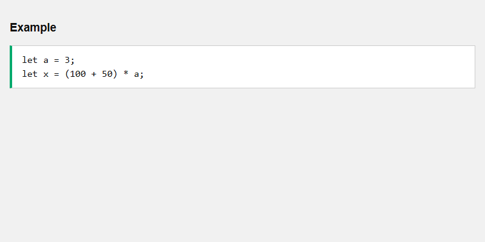

```javascript
let a = 3;
let x = (100 + 50) * a;
```

Rendered result:

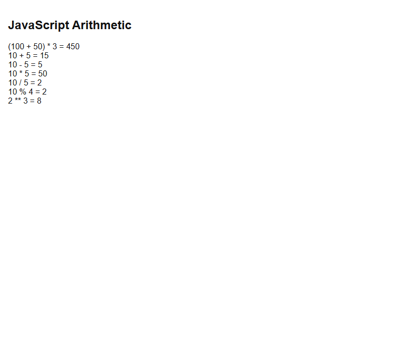

<details>
  <summary>Terminal Commands</summary>

## Terminal Commands

```bash
# from Personal/Files/javascript/code_sandbox
py -3 -m http.server 8770 --bind 127.0.0.1
```

Then open `http://127.0.0.1:8770/js-arithmetic/`.

</details>

<details>
  <summary>Questions and Answers</summary>

## Questions and Answers

### Question 1: What does `%` return?

<details>
<summary>Answer</summary>

- [x] The **division remainder** (modulus).

</details>

### Question 2: What does `++` do?

<details>
<summary>Answer</summary>

- [x] It **increments** the number by 1.

</details>

### Question 3: Is `x ** y` the same as `Math.pow(x, y)`?

<details>
<summary>Answer</summary>

- [x] **Yes.**

</details>

### Question 4: In `100 + 50 * 3`, what runs first?

<details>
<summary>Answer</summary>

- [x] **Multiplication**, so it is not `(100 + 50) * 3`.
- [x] Use **parentheses** to add first.

</details>

</details>

## Summary

Arithmetic uses operands and operators: `+ - * / % ++ -- **`. `**` matches `Math.pow`. Multiplication/division precede addition/subtraction unless you use **parentheses**.

## References

- [JS Arithmetic (W3Schools)](https://www.w3schools.com/js/js_arithmetic.asp)
- [MDN: Arithmetic operators](https://developer.mozilla.org/en-US/docs/Web/JavaScript/Reference/Operators#arithmetic_operators)
- [JavaScript Operator Precedence Values](https://www.w3schools.com/js/js_precedence.asp)

</details>

<details>
  <summary>JS Assignment</summary>

## Introduction

Assignment operators **put values into variables**. The simple operator is **`=`**. Compound forms (`+=`, `-=`, `*=`, `**=`, `/=`, `%=`) update in place. ES2020 adds logical assignment (`&&=`, `||=`, `??=`).

## Detailed Explanation

- [x] **Given `x = 10` and `y = 5`**
  - `=` assigns; `+=` adds; `-=` subtracts; `*=` multiplies; `**=` exponentiates; `/=` divides; `%=` remainder.
  - `x += 5` is the same as `x = x + 5`.
- [x] **Strings**
  - `=` assigns a string.
  - `+=` **concatenates** onto a string (`text1 += "nice day"`).
- [x] **Logical assignment (ES2020)**
  - `&&=` assigns the second value if the first is **true**.
  - `||=` assigns the second value if the first is **false**.
  - `??=` assigns the second value if the first is **`null` or `undefined`**.
- [x] **Spread `...`**
  - Splits iterables into individual elements (mentioned on this page).

Sandbox: `code_sandbox/js-assignment/index.html`

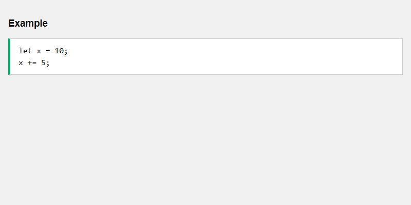

```javascript
let x = 10;
x += 5;
```

Rendered result:

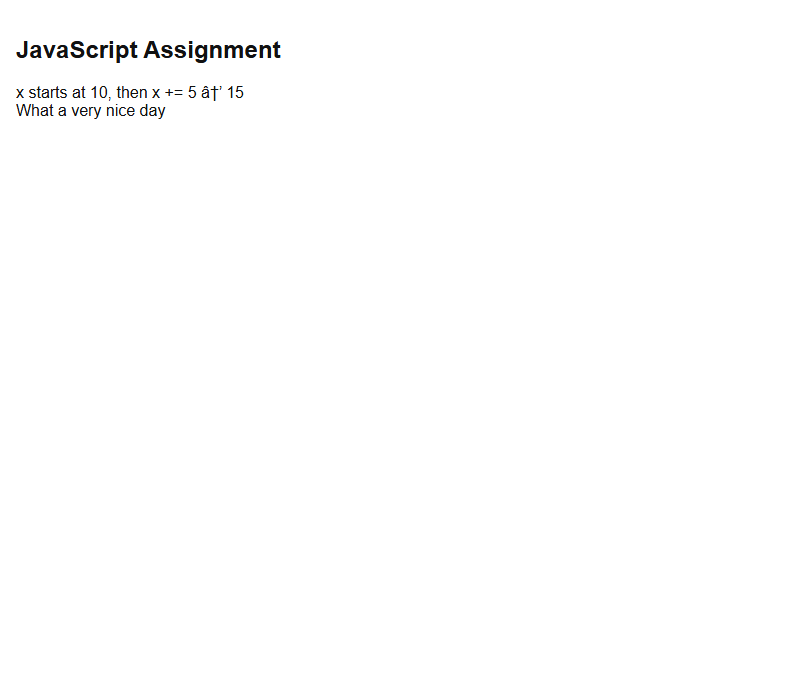

<details>
  <summary>Terminal Commands</summary>

## Terminal Commands

```bash
# from Personal/Files/javascript/code_sandbox
py -3 -m http.server 8770 --bind 127.0.0.1
```

Then open `http://127.0.0.1:8770/js-assignment/`.

</details>

<details>
  <summary>Questions and Answers</summary>

## Questions and Answers

### Question 1: What is `x += 10` if `x` started at 5?

<details>
<summary>Answer</summary>

- [x] **15.** Same as `x = x + 10`.

</details>

### Question 2: Can `+=` be used on strings?

<details>
<summary>Answer</summary>

- [x] **Yes.** It **concatenates**.

</details>

### Question 3: What does `??=` do?

<details>
<summary>Answer</summary>

- [x] Assigns the right-hand value if the left is **`null` or `undefined`**.
- [x] ES2020 feature.

</details>

</details>

## Summary

**`=`** assigns. **`+= -= \*= **= /= %=`** update in place (`x += y`means`x = x + y`). On strings, **`+=` concatenates**. Logical assignment (`&&= ||= ??=`) is ES2020.

## References

- [JS Assignment (W3Schools)](https://www.w3schools.com/js/js_assignment.asp)
- [MDN: Assignment operators](https://developer.mozilla.org/en-US/docs/Web/JavaScript/Reference/Operators/Assignment)

</details>

<details>
  <summary>JS Comparisons</summary>

## Introduction

Comparison operators compare two values and **always return `true` or `false`**. Use them in **conditional statements**. Watch **`==` vs `===`** and comparisons across **types**.

## Detailed Explanation

- [x] **Operators (given `x = 5`)**
  - `==` equal to (`x == 8` false, `x == 5` true, `x == "5"` **true**).
  - `===` equal **value and type** (`x === 5` true, `x === "5"` **false**).
  - `!=` / `!==` not equal / not equal value or type.
  - `> < >= <=` greater/less (or equal).
- [x] **Strings**
  - The same operators work on strings.
  - Strings compare **alphabetically** (`"A" < "B"`).
- [x] **Different types**
  - Comparing a string with a number **converts the string to a number**.
  - Empty string converts to **0**. A non-numeric string becomes **`NaN`** (comparison is **false**).
  - `"2" > "12"` is **true** (alphabetically, `"2"` > `"12"`).
  - Convert to the proper type **before** comparing for a secure result.

Sandbox: `code_sandbox/js-comparisons/index.html`

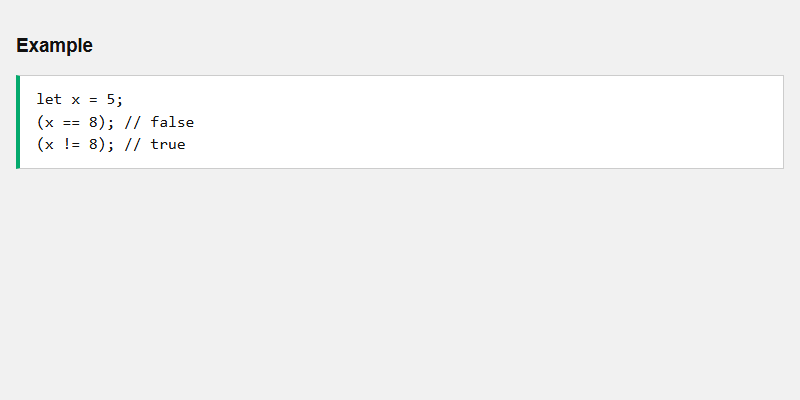

```javascript
let x = 5;
x == 8; // false
x != 8; // true
```

Rendered result:

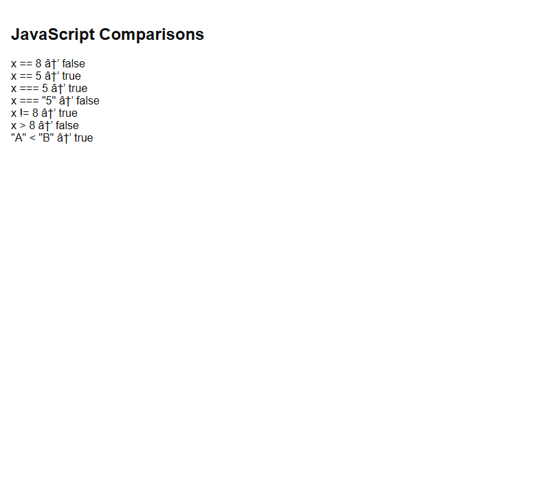

<details>
  <summary>Terminal Commands</summary>

## Terminal Commands

```bash
# from Personal/Files/javascript/code_sandbox
py -3 -m http.server 8770 --bind 127.0.0.1
```

Then open `http://127.0.0.1:8770/js-comparisons/`.

</details>

<details>
  <summary>Questions and Answers</summary>

## Questions and Answers

### Question 1: What do comparison operators always return?

<details>
<summary>Answer</summary>

- [x] **`true` or `false`**.

</details>

### Question 2: What is the difference between `==` and `===`?

<details>
<summary>Answer</summary>

- [x] `==` equal **to** (type conversion allowed).
- [x] `===` equal **value and type**.
- [x] `5 == "5"` is true; `5 === "5"` is false.

</details>

### Question 3: How are strings compared?

<details>
<summary>Answer</summary>

- [x] **Alphabetically.**

</details>

### Question 4: Why might `"2" < "12"` be false?

<details>
<summary>Answer</summary>

- [x] As strings, they compare as text, not as numbers.

</details>

</details>

## Summary

Comparisons return booleans. Prefer **`===` / `!==`** when types matter. Strings compare alphabetically. Mixed string/number compares coerce; convert first for predictable results.

## References

- [JS Comparisons (W3Schools)](https://www.w3schools.com/js/js_comparisons.asp)
- [MDN: Comparison operators](https://developer.mozilla.org/en-US/docs/Web/JavaScript/Reference/Operators#relational_operators)

</details>

<details>
  <summary>JS Conditional</summary>

## Introduction

**Conditional statements** run different code for different **true/false** conditions. This overview covers **`if`**, **`else`**, **`else if`**, **`switch`**, and the **ternary** `? :`.

## Detailed Explanation

- [x] **When to use them**
  - Perform **different actions** for different conditions.
- [x] **`if`**
  - Run a block if a condition is **true**: `if (condition) { ... }`
- [x] **`else`**
  - Run a block if the same condition is **false**.
- [x] **`else if`**
  - Test a **new** condition if the first was false.
- [x] **`switch`**
  - Many alternative blocks: `switch(expression) { case x: ... break; default: ... }`
- [x] **Ternary `? :`**
  - Shorthand for if/else: `condition ? expression1 : expression2`

Sandbox: `code_sandbox/js-conditional/index.html`

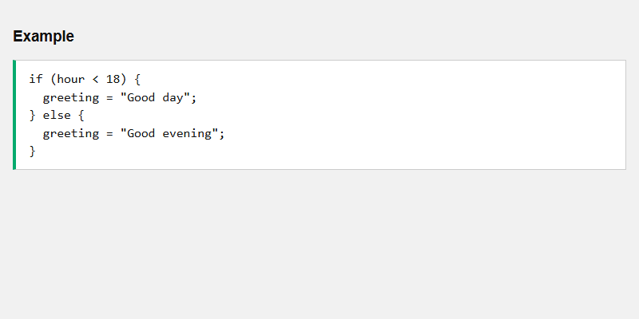

```javascript
if (hour < 18) {
  greeting = "Good day";
} else {
  greeting = "Good evening";
}
```

Rendered result:

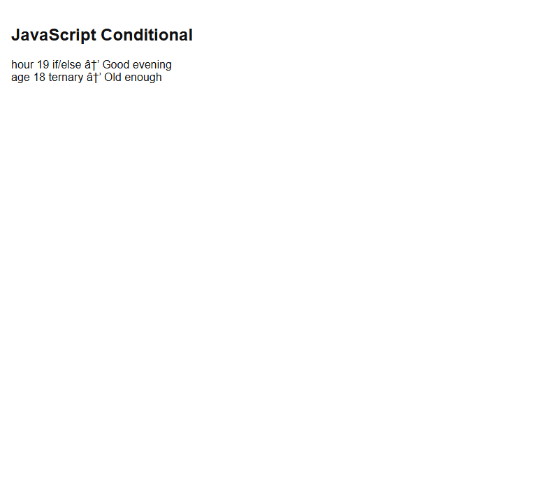

<details>
  <summary>Terminal Commands</summary>

## Terminal Commands

```bash
# from Personal/Files/javascript/code_sandbox
py -3 -m http.server 8770 --bind 127.0.0.1
```

Then open `http://127.0.0.1:8770/js-conditional/`.

</details>

<details>
  <summary>Questions and Answers</summary>

## Questions and Answers

### Question 1: What does `if` do?

<details>
<summary>Answer</summary>

- [x] Runs a block if the condition is **true**.

</details>

### Question 2: When do you use `else if`?

<details>
<summary>Answer</summary>

- [x] To test a **new** condition after the first was **false**.

</details>

### Question 3: What is `? :`?

<details>
<summary>Answer</summary>

- [x] The **ternary** operator, shorthand for if/else: `condition ? expression1 : expression2`.

</details>

### Question 4: When is `switch` useful?

<details>
<summary>Answer</summary>

- [x] When you need **many alternative** code blocks.

</details>

</details>

## Summary

Conditionals choose code from a true/false test: **`if`**, **`else`**, **`else if`**, **`switch`**, or ternary **`? :`**. Later chapters cover each in more detail.

## References

- [JS Conditional (W3Schools)](https://www.w3schools.com/js/js_conditionals.asp)
- [MDN: if...else](https://developer.mozilla.org/en-US/docs/Web/JavaScript/Reference/Statements/if...else)
- [MDN: switch](https://developer.mozilla.org/en-US/docs/Web/JavaScript/Reference/Statements/switch)
- [MDN: Conditional (ternary) operator](https://developer.mozilla.org/en-US/docs/Web/JavaScript/Reference/Operators/Conditional_operator)

</details>

<details>
  <summary>JS If Conditions</summary>

## Introduction

The **`if`** statement runs a block when a condition is **true**. Write **`if` in lowercase** — `If` or `IF` is a JavaScript **error**. Nested `if` works, but **`&&`** is often clearer.

## Detailed Explanation

- [x] **Syntax**
  - `if (condition) { // code if true }`
  - **`if` must be lowercase.**
- [x] **Greeting example**
  - `if (hour < 18) { greeting = "Good day"; }`
- [x] **Driving example**
  - If `age >= 18`, set text to **"You can drive"**.
- [x] **Nested `if`**
  - You can put an `if` inside another `if` (country then age).
  - Nested `if` can make code **more complex**.
  - A better solution is the logical **AND** operator: `if (country == "USA" && age >= 16)`.

Sandbox: `code_sandbox/js-if-conditions/index.html`

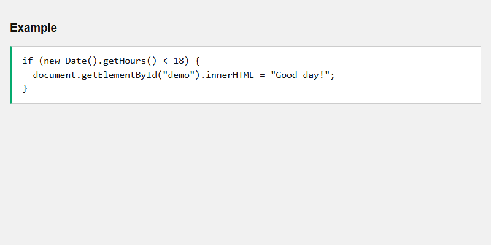

```javascript
if (new Date().getHours() < 18) {
  document.getElementById("demo").innerHTML = "Good day!";
}
```

Rendered result:

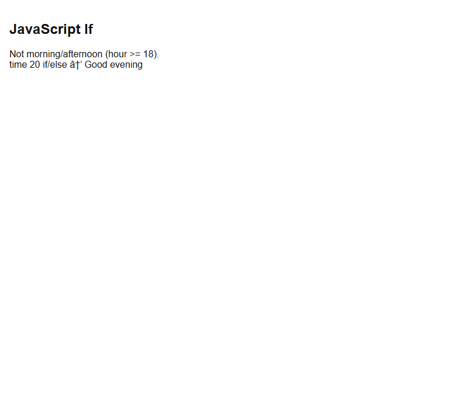

<details>
  <summary>Terminal Commands</summary>

## Terminal Commands

```bash
# from Personal/Files/javascript/code_sandbox
py -3 -m http.server 8770 --bind 127.0.0.1
```

Then open `http://127.0.0.1:8770/js-if-conditions/`.

</details>

<details>
  <summary>Questions and Answers</summary>

## Questions and Answers

### Question 1: Must `if` be lowercase?

<details>
<summary>Answer</summary>

- [x] **Yes.** `If` or `IF` causes a JavaScript **error**.

</details>

### Question 2: When does the `if` block run?

<details>
<summary>Answer</summary>

- [x] When the condition is **true**.

</details>

### Question 3: How can you avoid nested `if` for two checks?

<details>
<summary>Answer</summary>

- [x] Use logical **AND**: `if (country == "USA" && age >= 16)`.

</details>

</details>

## Summary

**`if`** (lowercase only) runs a block when a condition is true. You can nest `if`s, but combining conditions with **`&&`** is often simpler. `else` / `else if` are covered in the surrounding conditional chapters.

## References

- [JS If Conditions (W3Schools)](https://www.w3schools.com/js/js_if.asp)
- [MDN: if...else](https://developer.mozilla.org/en-US/docs/Web/JavaScript/Reference/Statements/if...else)
- [MDN: Logical AND (&&)](https://developer.mozilla.org/en-US/docs/Web/JavaScript/Reference/Operators/Logical_AND)

</details>

<details>
  <summary>JS Loops</summary>

## Introduction

**Loops** run a block **many times**, usually with a **different value** each pass. They replace copy-paste when you walk an **array** (or any repeating work). This overview covers **`for`**, **`while`**, **`do while`**, and **loop scope** with `let`.

## Detailed Explanation

- [x] **Why loops**
  - Same code, over and over, each time with a different value.
  - Typical with **arrays**: instead of `text += cars[0]` … `cars[5]`, use `for (let i = 0; i < cars.length; i++)`.
- [x] **`for`**
  - `for (expr1; expr2; expr3) { … }`
  - **expr1** runs **once** before the block (`let i = 0`).
  - **expr2** is the **condition** (`i < 5`).
  - **expr3** runs **after each** iteration (`i++`).
- [x] **Loop scope**
  - `let` / `const` declared **inside** the loop are visible **only** in the loop.
  - Outer `let i = 5` stays **5** if the loop declares its own `let i`.
- [x] **`while`**
  - Repeats **while the condition is true**: `while (i < 10) { … i++; }`.
  - If you forget to **increase** the condition variable, the loop **never ends** and can **crash the browser**.
- [x] **`do while`**
  - Runs the block **once first**, then tests the condition.
  - Runs **at least once**, even if the condition starts **false**.

Sandbox: `code_sandbox/js-loops/index.html`

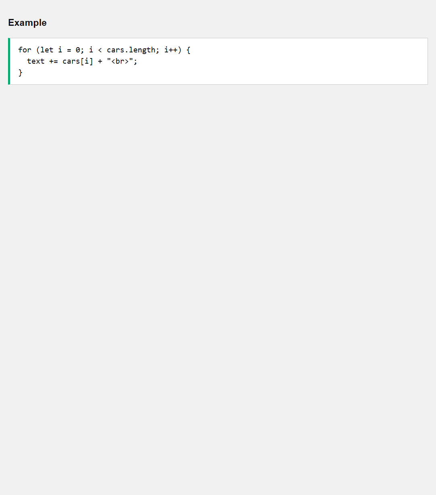

```javascript
for (let i = 0; i < cars.length; i++) {
  text += cars[i] + "<br>";
}
```

Rendered result:

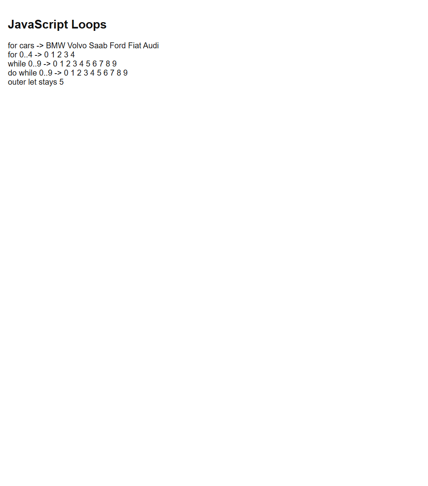

<details>
  <summary>Terminal Commands</summary>

## Terminal Commands

```bash
# from Personal/Files/javascript/code_sandbox
py -3 -m http.server 8770 --bind 127.0.0.1
```

Then open `http://127.0.0.1:8770/js-loops/`.

</details>

<details>
  <summary>Questions and Answers</summary>

## Questions and Answers

### Question 1: Why use a loop with an array instead of listing each index?

<details>
<summary>Answer</summary>

- [x] To run the **same code** for **each** element.
- [x] Example: `for (let i = 0; i < cars.length; i++)` instead of `cars[0]` … `cars[5]`.

</details>

### Question 2: What do the three `for` expressions do?

<details>
<summary>Answer</summary>

- [x] **expr1** runs **once** before the loop (initialize).
- [x] **expr2** is the **condition** to keep looping.
- [x] **expr3** runs **after each** iteration (usually increment).

</details>

### Question 3: What happens if you declare `let i` both outside and inside a `for` loop?

<details>
<summary>Answer</summary>

- [x] The inner `let i` is **only** visible **inside** the loop.
- [x] The outer `let i` is **unchanged** after the loop.

</details>

### Question 4: When does `do while` run compared with `while`?

<details>
<summary>Answer</summary>

- [x] **`do while`** runs the block **once** before testing.
- [x] It runs **at least once**, even if the condition starts **false**.

</details>

### Question 5: What if you forget to increment the `while` counter?

<details>
<summary>Answer</summary>

- [x] The loop **never ends**.
- [x] That can **crash the browser**.

</details>

</details>

## Summary

Loops repeat a block: **`for`** (init, condition, step), **`while`** (test then run), **`do while`** (run then test, at least once). Use them for arrays instead of copy-paste. `let`/`const` inside a loop stay **loop-scoped**. Always update the condition variable or the loop never ends.

## References

- [JS Loops (W3Schools)](https://www.w3schools.com/js/js_loops.asp)
- [MDN: for](https://developer.mozilla.org/en-US/docs/Web/JavaScript/Reference/Statements/for)
- [MDN: while](https://developer.mozilla.org/en-US/docs/Web/JavaScript/Reference/Statements/while)
- [MDN: do...while](https://developer.mozilla.org/en-US/docs/Web/JavaScript/Reference/Statements/do...while)

</details>

<details>
  <summary>JS Loop for</summary>

## Introduction

The **`for`** statement creates a loop with **three optional expressions**: initialize, condition, and update. Omit any of them when you set or increment the counter **outside** the header — but if you omit the **condition**, you must **`break`** or the loop never ends.

## Detailed Explanation

- [x] **Syntax**
  - `for (exp1; exp2; exp3) { // code }`
  - **exp1** once before the block (`let i = 0`).
  - **exp2** condition (`i < 5`). If it is **false**, the loop **ends**.
  - **exp3** after each pass (`i++`).
- [x] **Cars example**
  - `const cars = ["BMW", "Volvo", "Saab", "Ford"];`
  - Loop `i` from `0` to `cars.length - 1` and concatenate names.
- [x] **exp1 is optional**
  - Set `i` before the loop, then `for (; i < len; i++)`.
  - Starting at `i = 2` walks from **Saab** onward.
- [x] **exp2 is optional**
  - If omitted, you **must** `break` inside, or the loop **never ends** (browser crash).
- [x] **exp3 is optional**
  - Can be `i--`, `i = i + 15`, or increment **inside** the body: `for (; i < len; ) { … i++; }`.
- [x] **Loop scope: `var` vs `let`**
  - `var i` in the loop **redeclares** an outer `var i`; after the loop `i` is **10**.
  - `let i` in the loop does **not** redeclare outer `let i`; outer stays **5**.
  - Loop `let i` is visible **only inside** the loop.

Sandbox: `code_sandbox/js-loop-for/index.html`

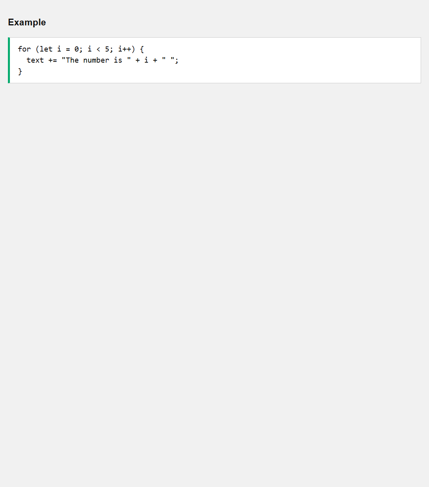

```javascript
for (let i = 0; i < 5; i++) {
  text += "The number is " + i + " ";
}
```

Rendered result:

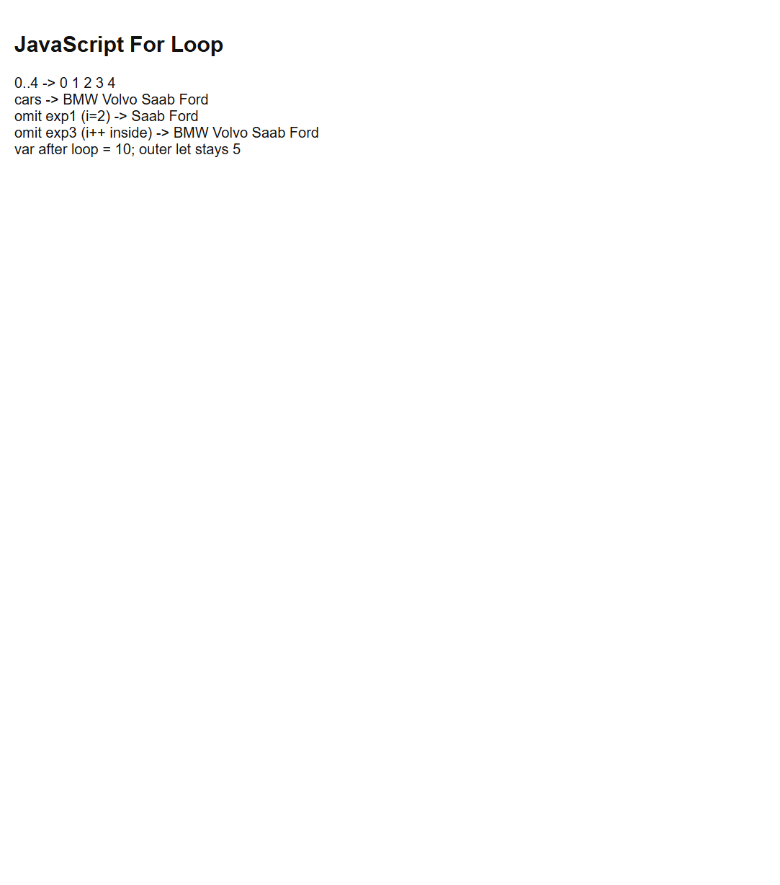

<details>
  <summary>Terminal Commands</summary>

## Terminal Commands

```bash
# from Personal/Files/javascript/code_sandbox
py -3 -m http.server 8770 --bind 127.0.0.1
```

Then open `http://127.0.0.1:8770/js-loop-for/`.

</details>

<details>
  <summary>Questions and Answers</summary>

## Questions and Answers

### Question 1: Are the three `for` expressions required?

<details>
<summary>Answer</summary>

- [x] **No.** All three are **optional**.
- [x] If you omit **exp2** (the condition), you must **`break`** or the loop never ends.

</details>

### Question 2: What is exp1 used for?

<details>
<summary>Answer</summary>

- [x] To **initialize** the loop variable(s), e.g. `let i = 0`.
- [x] You can set `i` **before** the loop and omit exp1.

</details>

### Question 3: What can exp3 do besides `i++`?

<details>
<summary>Answer</summary>

- [x] Negative increment (`i--`).
- [x] Larger steps (`i = i + 15`).
- [x] Or increment **inside** the loop body and omit exp3.

</details>

### Question 4: How does `var` in a `for` header differ from `let`?

<details>
<summary>Answer</summary>

- [x] **`var i`** in the loop **redeclares** an outer `var i`; after the loop `i` is **10**.
- [x] **`let i`** in the loop does **not** change an outer `let i`.

</details>

### Question 5: Where is a `let i` declared in the `for` header visible?

<details>
<summary>Answer</summary>

- [x] **Only inside** the loop.

</details>

</details>

## Summary

**`for (exp1; exp2; exp3)`** initializes, tests, then updates. All three expressions are optional. Omit exp2 only if you **`break`**. `var` in the header leaks out of the loop; **`let` stays loop-scoped**.

## References

- [JS Loop for (W3Schools)](https://www.w3schools.com/js/js_loop_for.asp)
- [MDN: for](https://developer.mozilla.org/en-US/docs/Web/JavaScript/Reference/Statements/for)
- [MDN: let](https://developer.mozilla.org/en-US/docs/Web/JavaScript/Reference/Statements/let)
- [MDN: var](https://developer.mozilla.org/en-US/docs/Web/JavaScript/Reference/Statements/var)

</details>

<details>
  <summary>JS Loop while</summary>

## Introduction

**While loops** run a block **as long as a condition is true**. JavaScript has **`while`** (test first) and **`do while`** (run first). A `while` is like a `for` with statement 1 and 3 omitted.

## Detailed Explanation

- [x] **Two while loops**
  - **`while`** — test, then maybe run.
  - **`do while`** — run once, then test.
- [x] **`while` syntax**
  - `while (condition) { // code }`
  - Example: while `i < 10`, append text and **`i++`**.
  - Forgetting **`i++`** means the loop **never ends** (browser crash).
- [x] **`do while` syntax**
  - `do { // code } while (condition);`
  - Runs **at least once**, even if the condition starts **false**.
  - Still increment the counter or it never ends.
- [x] **`for` vs `while` (same idea)**
  - `for (; cars[i]; ) { text += cars[i]; i++; }`
  - `while (cars[i]) { text += cars[i]; i++; }`
  - Both walk `["BMW", "Volvo", "Saab", "Ford"]` until a falsy slot.

Sandbox: `code_sandbox/js-loop-while/index.html`

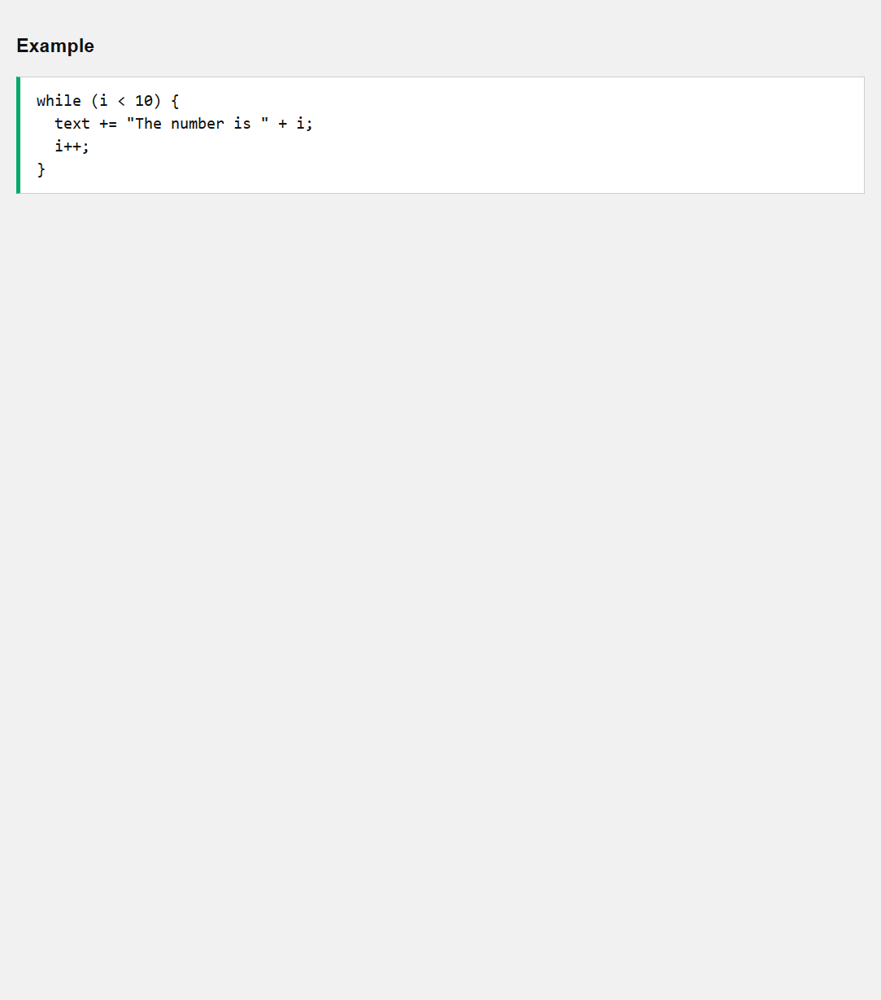

```javascript
while (i < 10) {
  text += "The number is " + i;
  i++;
}
```

Rendered result:

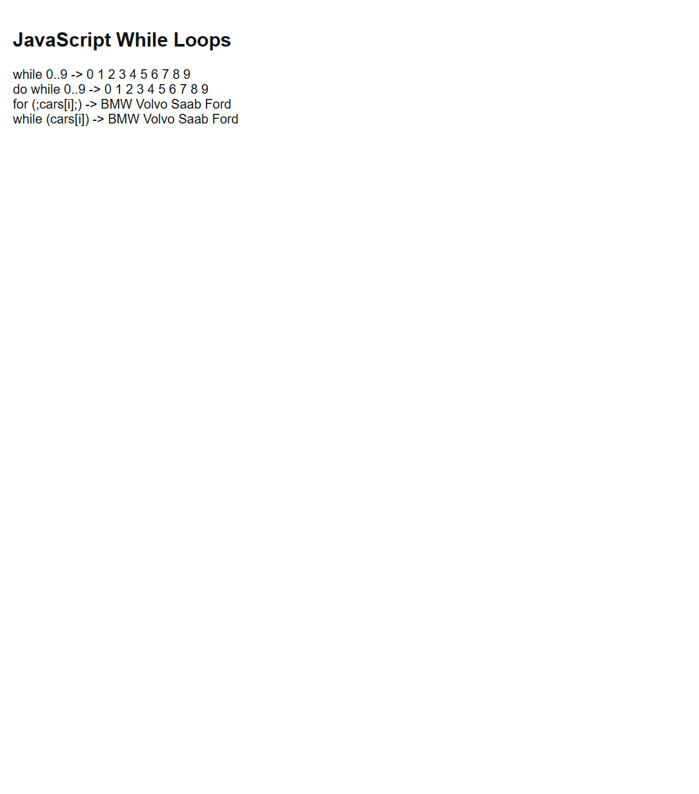

<details>
  <summary>Terminal Commands</summary>

## Terminal Commands

```bash
# from Personal/Files/javascript/code_sandbox
py -3 -m http.server 8770 --bind 127.0.0.1
```

Then open `http://127.0.0.1:8770/js-loop-while/`.

</details>

<details>
  <summary>Questions and Answers</summary>

## Questions and Answers

### Question 1: What are the two while-style loops?

<details>
<summary>Answer</summary>

- [x] **`while`**
- [x] **`do while`**

</details>

### Question 2: When does `do while` run if the condition is already false?

<details>
<summary>Answer</summary>

- [x] It still runs the block **once**.
- [x] The test happens **after** the first run.

</details>

### Question 3: How is `while` like `for`?

<details>
<summary>Answer</summary>

- [x] Like a `for` with **statement 1 and 3 omitted**.
- [x] Example: `for (; cars[i]; )` vs `while (cars[i])`.

</details>

### Question 4: What happens if you never increment `i` in a `while`?

<details>
<summary>Answer</summary>

- [x] The loop **never ends**.
- [x] That can **crash the browser**.

</details>

### Question 5: Does `while (cars[i])` need a length check?

<details>
<summary>Answer</summary>

- [x] **No** in this pattern: it stops when `cars[i]` is **falsy** (`undefined` past the end).

</details>

</details>

## Summary

**`while`** tests then runs. **`do while`** runs then tests (at least once). Both need a changing counter. A `while` matches a `for` with the first and third expressions left empty.

## References

- [JS Loop while (W3Schools)](https://www.w3schools.com/js/js_loop_while.asp)
- [MDN: while](https://developer.mozilla.org/en-US/docs/Web/JavaScript/Reference/Statements/while)
- [MDN: do...while](https://developer.mozilla.org/en-US/docs/Web/JavaScript/Reference/Statements/do...while)

</details>

<details>
  <summary>JS Break</summary>

## Introduction

**`break`** **jumps out** of a **loop** or **`switch`**. In a loop it **stops immediately** (no more iterations). In a `switch` it prevents **fall-through**. With a **label**, `break` can leave a **nested loop** or even a **plain `{ }` block**.

## Detailed Explanation

- [x] **Break in loops**
  - When `break` runs, the loop **terminates**.
  - Control continues **after** the loop.
  - Example: `if (i === 3) { break; }` → numbers **0 1 2** only.
- [x] **Break in `switch`**
  - Exits the switch after a matching **case**.
  - Without `break`, execution **falls through** later cases (and `default`).
- [x] **Labels**
  - `labelname: statement;` or `labelname: { statements }`
  - Identifier plus a **colon**.
- [x] **Labeled `break`**
  - `break labelname;`
  - Useful to leave an **outer** loop from an **inner** one.
  - `break loop1` stops **both** nested loops; `break loop2` stops only the **inner** loop.
- [x] **Break a code block**
  - Without a label, `break` only leaves a **loop** or **switch**.
  - With a label, `break` can leave **any** `{ }` block (example: stop after the second car).

Sandbox: `code_sandbox/js-break/index.html`

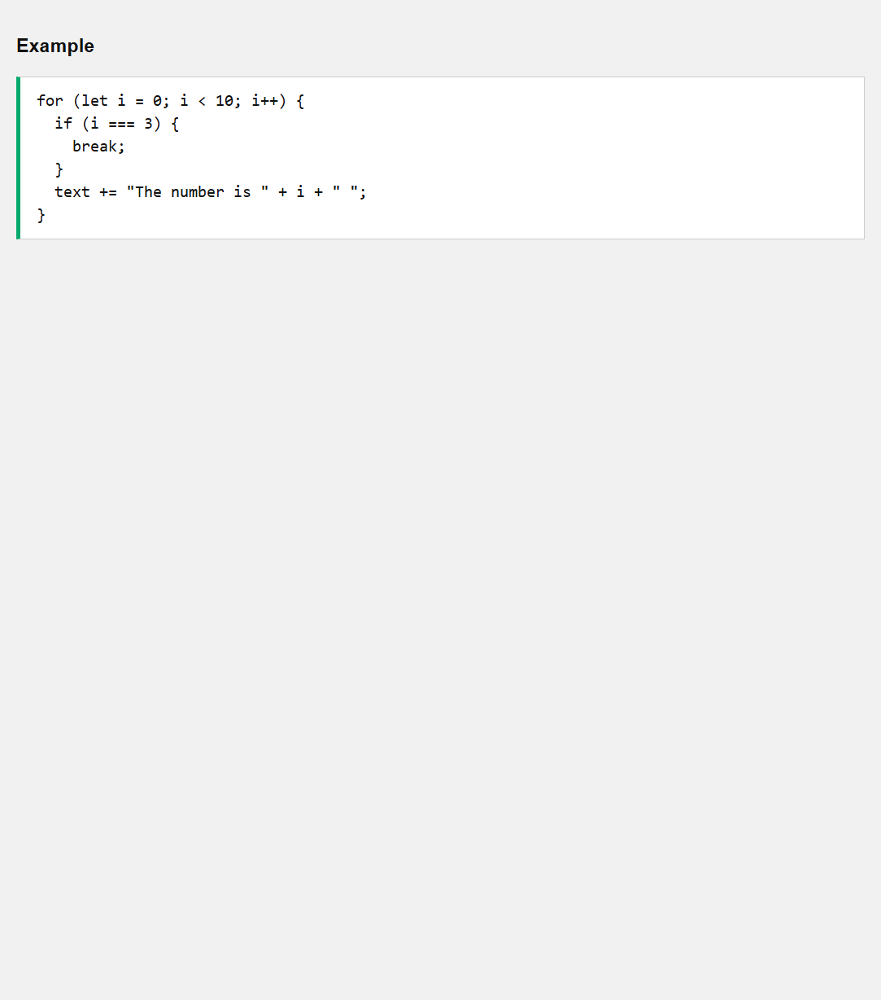

```javascript
for (let i = 0; i < 10; i++) {
  if (i === 3) {
    break;
  }
  text += "The number is " + i + " ";
}
```

Rendered result:

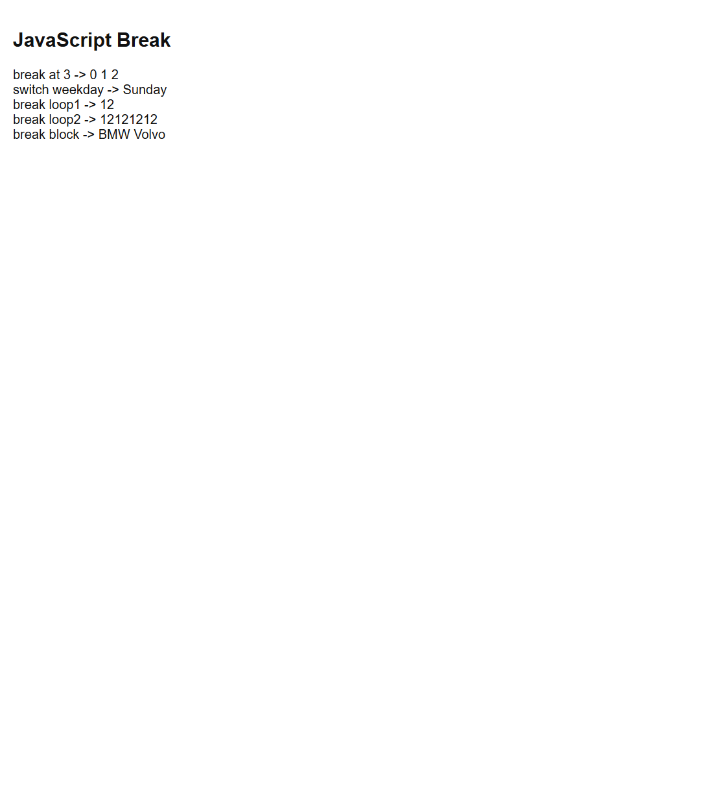

<details>
  <summary>Terminal Commands</summary>

## Terminal Commands

```bash
# from Personal/Files/javascript/code_sandbox
py -3 -m http.server 8770 --bind 127.0.0.1
```

Then open `http://127.0.0.1:8770/js-break/`.

</details>

<details>
  <summary>Questions and Answers</summary>

## Questions and Answers

### Question 1: What does `break` do in a loop?

<details>
<summary>Answer</summary>

- [x] It **terminates** the loop immediately.
- [x] No more iterations run.

</details>

### Question 2: Why is `break` needed in `switch`?

<details>
<summary>Answer</summary>

- [x] To **exit** after a matching case.
- [x] Without it, execution **falls through** later cases.

</details>

### Question 3: What is a label?

<details>
<summary>Answer</summary>

- [x] An identifier followed by a **colon**.
- [x] It names a statement or `{ }` block for flow control.

</details>

### Question 4: `break loop1` vs `break loop2` in nested loops?

<details>
<summary>Answer</summary>

- [x] **`break loop1`** leaves the **outer** loop (stops everything).
- [x] **`break loop2`** leaves only the **inner** loop.

</details>

### Question 5: Can `break` leave a plain `{ }` block?

<details>
<summary>Answer</summary>

- [x] **Yes**, if the block has a **label** (`break list`).
- [x] Without a label, `break` only works in a **loop** or **switch**.

</details>

</details>

## Summary

**`break`** exits a loop or `switch` immediately. In `switch` it stops fall-through. **Labels** let `break` target an outer loop or a named block. `break` and `continue` are the only statements that can jump out of a `{ }` block.

## References

- [JS Break (W3Schools)](https://www.w3schools.com/js/js_break.asp)
- [MDN: break](https://developer.mozilla.org/en-US/docs/Web/JavaScript/Reference/Statements/break)
- [MDN: labeled statement](https://developer.mozilla.org/en-US/docs/Web/JavaScript/Reference/Statements/label)
- [MDN: switch](https://developer.mozilla.org/en-US/docs/Web/JavaScript/Reference/Statements/switch)

</details>

<details>
  <summary>JS Continue</summary>

## Introduction

**`continue`** **skips the rest of the current iteration** and starts the **next** one. With a **label**, it can skip to the next pass of an **outer** loop, not only the inner one.

## Detailed Explanation

- [x] **Skip one pass**
  - Remaining code in that iteration is **skipped**.
  - Processing moves to the **next** iteration.
  - Example: `if (i === 3) { continue; }` → **1 2 4 5 6 7 8 9** (no 3).
- [x] **Labels (same idea as `break`)**
  - `labelname: statement;`
  - `continue labelname;`
- [x] **Labeled `continue`**
  - **`continue loop1`** skips the rest of the **outer** iteration (inner loop does not finish that outer pass).
  - **`continue loop2`** skips only the **inner** iteration (`3` is omitted; `1 2 4` repeats).
- [x] **Jump-out statements**
  - **`break`** and **`continue`** are the only statements that can jump out of a `{ }` block.

Sandbox: `code_sandbox/js-continue/index.html`

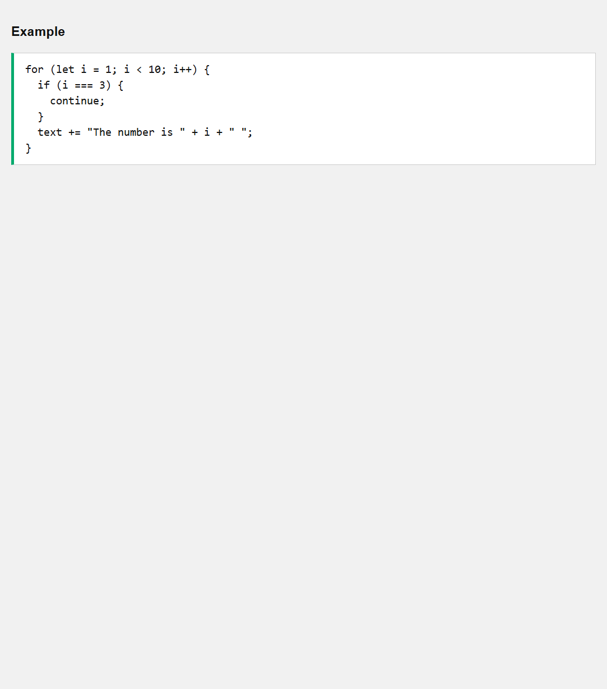

```javascript
for (let i = 1; i < 10; i++) {
  if (i === 3) {
    continue;
  }
  text += "The number is " + i + " ";
}
```

Rendered result:


<details>
  <summary>Terminal Commands</summary>

## Terminal Commands

```bash
# from Personal/Files/javascript/code_sandbox
py -3 -m http.server 8770 --bind 127.0.0.1
```

Then open `http://127.0.0.1:8770/js-continue/`.

</details>

<details>
  <summary>Questions and Answers</summary>

## Questions and Answers

### Question 1: What does `continue` do?

<details>
<summary>Answer</summary>

- [x] Skips the **rest of the current** iteration.
- [x] The loop **keeps going** with the next pass.

</details>

### Question 2: How is `continue` different from `break`?

<details>
<summary>Answer</summary>

- [x] **`break`** **ends** the loop.
- [x] **`continue`** **skips one** iteration and continues.

</details>

### Question 3: What does `continue loop1` do in nested loops?

<details>
<summary>Answer</summary>

- [x] Skips to the next iteration of the **outer** labeled loop.
- [x] The inner loop does not finish that outer pass.

</details>

### Question 4: What does `continue loop2` do?

<details>
<summary>Answer</summary>

- [x] Skips only the **inner** loop’s current pass.
- [x] The outer loop still runs its remaining inner iterations.

</details>

### Question 5: Which statements can jump out of a `{ }` block?

<details>
<summary>Answer</summary>

- [x] **`break`**
- [x] **`continue`**

</details>

</details>

## Summary

**`continue`** skips the rest of **this** iteration and starts the next. Labels let it target an **outer** loop. Unlike `break`, the loop **does not stop**. Only `break` and `continue` jump out of a code block.

## References

- [JS Continue (W3Schools)](https://www.w3schools.com/js/js_continue.asp)
- [MDN: continue](https://developer.mozilla.org/en-US/docs/Web/JavaScript/Reference/Statements/continue)
- [MDN: labeled statement](https://developer.mozilla.org/en-US/docs/Web/JavaScript/Reference/Statements/label)

</details>

<details>
  <summary>JS Control Flow</summary>

## Introduction

**Control flow** is the **order** statements run. By default JavaScript goes **top to bottom, left to right**. Conditions, loops, jumps, and function calls **change** that order. JavaScript is **single-threaded** (one thing at a time) unless you use **async** APIs.

## Detailed Explanation

- [x] **Default flow**
  - Sequential: `let x = 5; let y = 6; let z = x + y;` → **11**.
- [x] **Conditional control flow**
  - **`if`**, **`if...else`**, **`switch`**, ternary **`? :`**.
  - Example: `age >= 18` → **Adult**, else **Minor**.
- [x] **Loops (repetition)**
  - **`for`**, **`while`**, **`do...while`**.
  - Repeat until a condition is false (`i < 5`).
- [x] **Jump statements**
  - **`break`** — exit a loop or switch.
  - **`continue`** — skip this iteration.
  - **`return`** — exit a function.
  - **`throw`** — jump to error handling.
- [x] **Function flow**
  - Functions are **callable, reusable** blocks.
  - They run **when called**: `function myFunction(p1, p2) { return p1 * p2; }`.
- [x] **Single-threaded**
  - JavaScript does **one thing at a time**.
  - Slow work (file/network) can **freeze** the page unless you use **asynchronous** programming (later Advanced chapter).

Sandbox: `code_sandbox/js-control-flow/index.html`

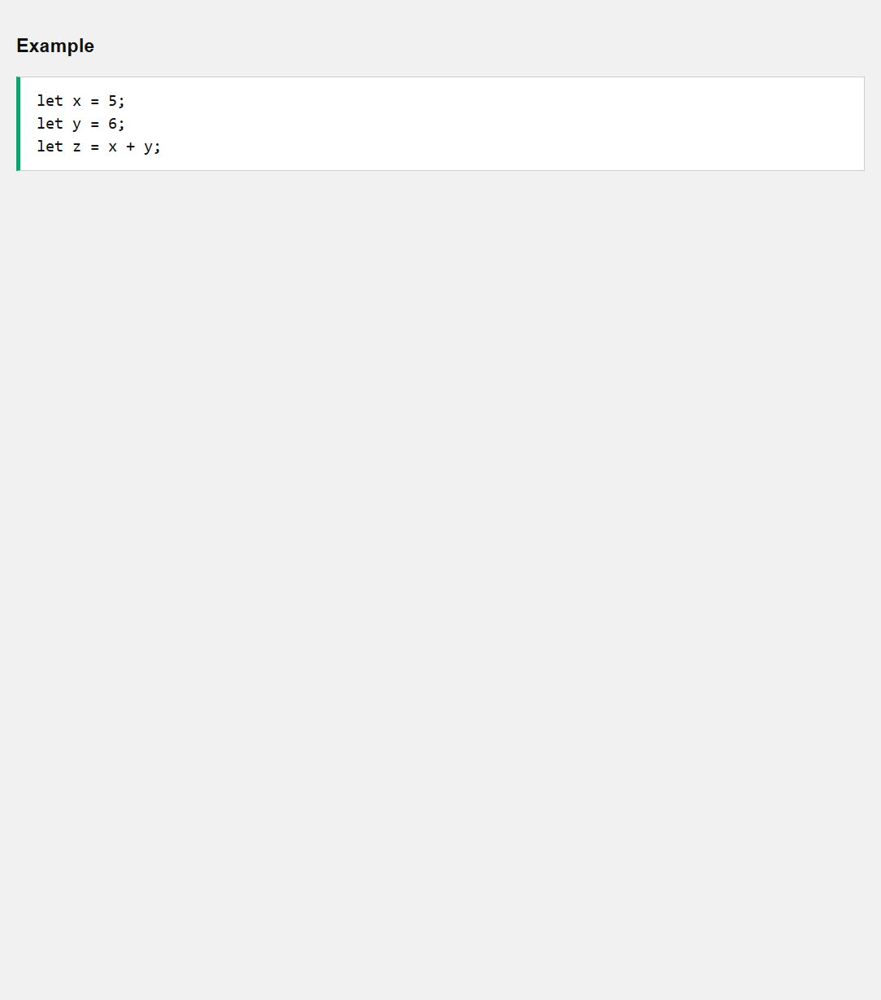

```javascript
let x = 5;
let y = 6;
let z = x + y;
```

Rendered result:

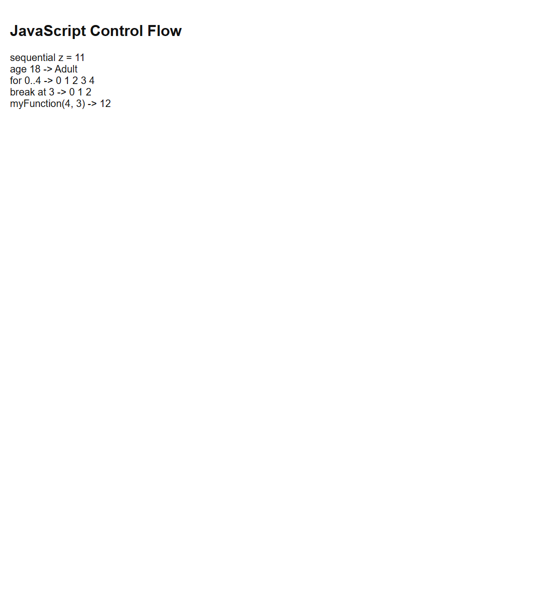

<details>
  <summary>Terminal Commands</summary>

## Terminal Commands

```bash
# from Personal/Files/javascript/code_sandbox
py -3 -m http.server 8770 --bind 127.0.0.1
```

Then open `http://127.0.0.1:8770/js-control-flow/`.

</details>

<details>
  <summary>Questions and Answers</summary>

## Questions and Answers

### Question 1: What is control flow?

<details>
<summary>Answer</summary>

- [x] The **order** in which statements execute.
- [x] Default is **top to bottom**, **left to right**.

</details>

### Question 2: Which statements change flow with conditions?

<details>
<summary>Answer</summary>

- [x] **`if`** / **`if...else`**
- [x] **`switch`**
- [x] Ternary **`? :`**

</details>

### Question 3: Name the four jump statements on this page.

<details>
<summary>Answer</summary>

- [x] **`break`** — exit loop or switch.
- [x] **`continue`** — skip this iteration.
- [x] **`return`** — exit a function.
- [x] **`throw`** — jump to error handling.

</details>

### Question 4: When does a function run?

<details>
<summary>Answer</summary>

- [x] **When it is called**, not when it is defined.

</details>

### Question 5: What does “JavaScript is single-threaded” mean?

<details>
<summary>Answer</summary>

- [x] It can do **one thing at a time**.
- [x] Slow tasks can **freeze** the app unless you use **async** APIs.

</details>

</details>

## Summary

Default flow is sequential. **Conditions** branch, **loops** repeat, **jumps** (`break`, `continue`, `return`, `throw`) cut across that order, and **functions** run when called. JavaScript is **single-threaded**; async work is covered later.

## References

- [JS Control Flow (W3Schools)](https://www.w3schools.com/js/js_control_flow.asp)
- [MDN: Control flow and error handling](https://developer.mozilla.org/en-US/docs/Web/JavaScript/Guide/Control_flow_and_error_handling)
- [MDN: return](https://developer.mozilla.org/en-US/docs/Web/JavaScript/Reference/Statements/return)
- [MDN: throw](https://developer.mozilla.org/en-US/docs/Web/JavaScript/Reference/Statements/throw)

</details>

<details>
  <summary>JS Strings</summary>

## Introduction

**Strings** store **text**. Write them in **single** or **double** quotes (same result), or **backticks** (templates). Use **`length`**, **escape** quotes with `\`, and prefer **literals** over `new String()`.

## Detailed Explanation

- [x] **Quotes**
  - Zero or more characters inside quotes: `let text = "John Doe";`
  - `'Volvo XC60'` and `"Volvo XC60"` work the **same**.
- [x] **Quotes inside quotes**
  - Inner quotes must **differ** from the outer ones: `"It's alright"`, `'He is called "Johnny"'`.
- [x] **Template strings (ES6)**
  - Backticks: `` `He's often called "Johnny"` ``
  - Allow both quote kinds inside, and **multiline** text.
- [x] **`length`**
  - `"ABCDEFGHIJKLMNOPQRSTUVWXYZ".length` is **26**.
- [x] **Escape characters**
  - `\"` `\'` `\\` put `"`, `'`, and `\` in a string.
  - `\n` `\t` and similar exist; most do not matter in HTML.
- [x] **Long lines**
  - Break a statement **after an operator**, or split a string with **`+`**.
- [x] **Do not use `new String()`**
  - Literals are primitives: `let x = "John";`
  - `new String("John")` is an **object** — slower, surprising `===` (literal vs object is **false**).
  - Comparing two String **objects** with `==` / `===` is **false**.

Sandbox: `code_sandbox/js-strings/index.html`

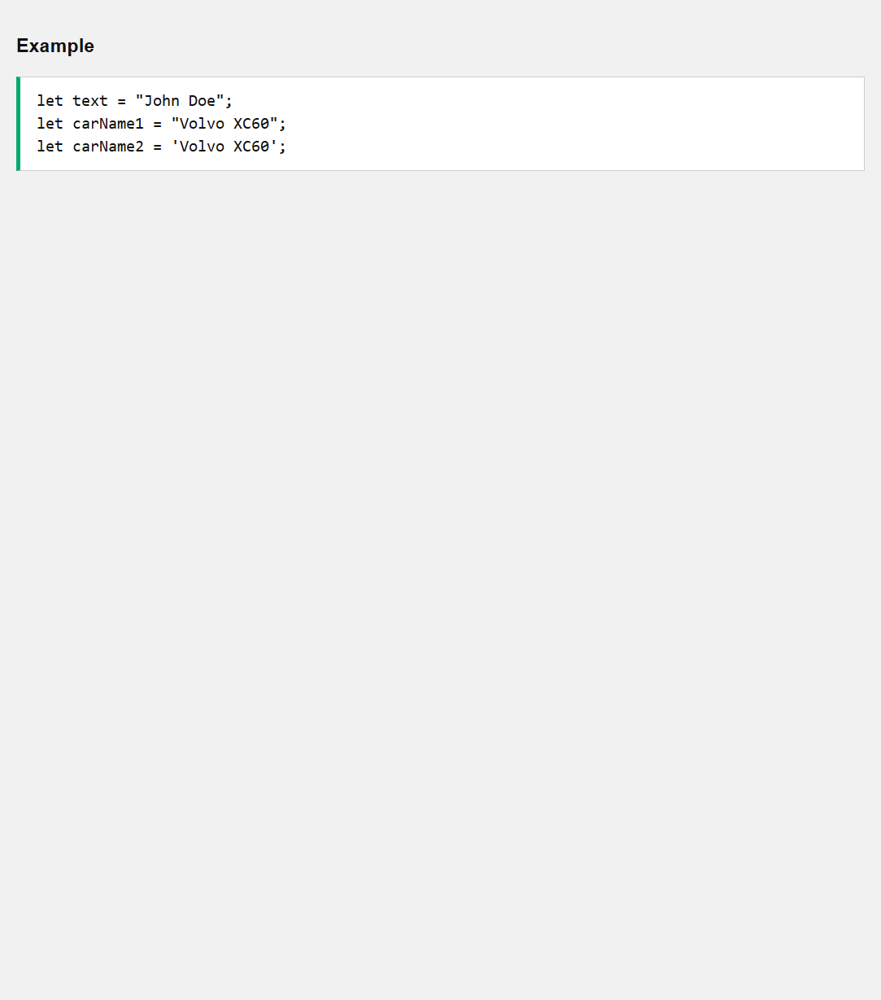

```javascript
let text = "John Doe";
let carName1 = "Volvo XC60";
let carName2 = "Volvo XC60";
```

Rendered result:

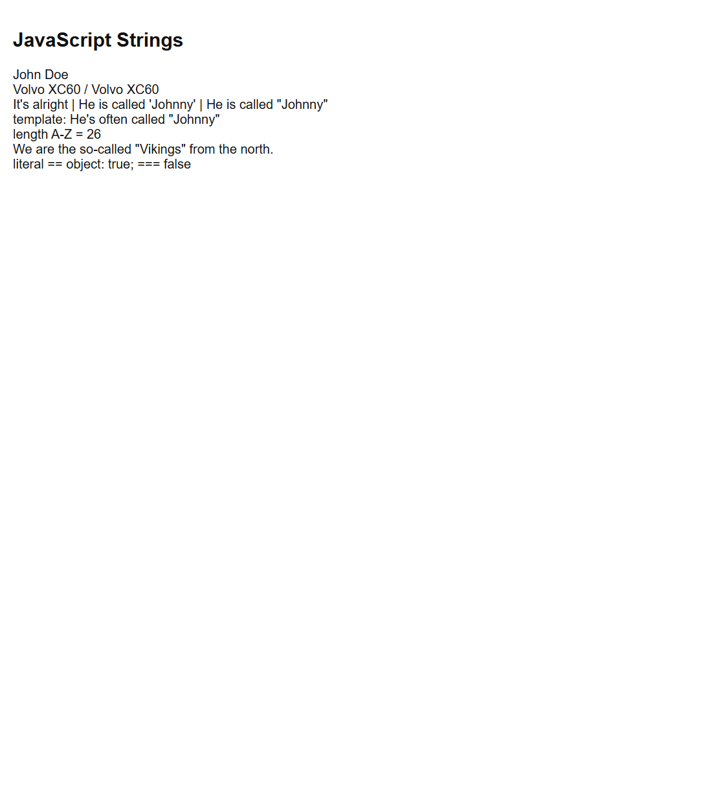

<details>
  <summary>Terminal Commands</summary>

## Terminal Commands

```bash
# from Personal/Files/javascript/code_sandbox
py -3 -m http.server 8770 --bind 127.0.0.1
```

Then open `http://127.0.0.1:8770/js-strings/`.

</details>

<details>
  <summary>Questions and Answers</summary>

## Questions and Answers

### Question 1: Is there a difference between `'text'` and `"text"`?

<details>
<summary>Answer</summary>

- [x] **No.** Single and double quotes work the **same**.

</details>

### Question 2: How do you put a quote inside a string?

<details>
<summary>Answer</summary>

- [x] Use the **other** quote style around the string.
- [x] Or **escape** with `\'` or `\"`.

</details>

### Question 3: How do template strings differ?

<details>
<summary>Answer</summary>

- [x] They use **backticks**.
- [x] They allow **both** quote kinds inside and **multiline** text.

</details>

### Question 4: What does `length` return for A–Z?

<details>
<summary>Answer</summary>

- [x] **26.**

</details>

### Question 5: Why avoid `new String("John")`?

<details>
<summary>Answer</summary>

- [x] It creates an **object**, not a primitive.
- [x] It slows code and makes **`===`** fail against a string literal.

</details>

</details>

## Summary

Strings are quoted text. Single and double quotes match; backticks add templates and multiline. Escape with `\`. Use **`length`**. Prefer **literals**; `new String()` is an object and surprises `===`.

## References

- [JS Strings (W3Schools)](https://www.w3schools.com/js/js_strings.asp)
- [MDN: String](https://developer.mozilla.org/en-US/docs/Web/JavaScript/Reference/Global_Objects/String)
- [MDN: Template literals](https://developer.mozilla.org/en-US/docs/Web/JavaScript/Reference/Template_literals)

</details>

<details>
  <summary>JS String Templates</summary>

## Introduction

**Template strings** (also called **template literals**) use **backticks** `` ` ``. They allow quotes inside the string, **multiline** text, and **`${…}` interpolation** of variables and expressions. ES6; modern browsers since 2017.

## Detailed Explanation

- [x] **Back-tick syntax**
  - ``let text = `Hello World!`;``
- [x] **Quotes inside**
  - `` `He's often called "Johnny"` ``
- [x] **Multiline**
  - Newlines inside backticks are **kept**.
- [x] **Interpolation**
  - `` `Welcome ${firstName}, ${lastName}!` ``
- [x] **Expression substitution**
  - `` `Total: ${(price * (1 + VAT)).toFixed(2)}` `` → **Total: 12.50** when price is 10 and VAT is 0.25.
- [x] **HTML templates**
  - You can build markup strings with backticks and a loop over tags (see the page’s HTML example).

Sandbox: `code_sandbox/js-string-templates/index.html`

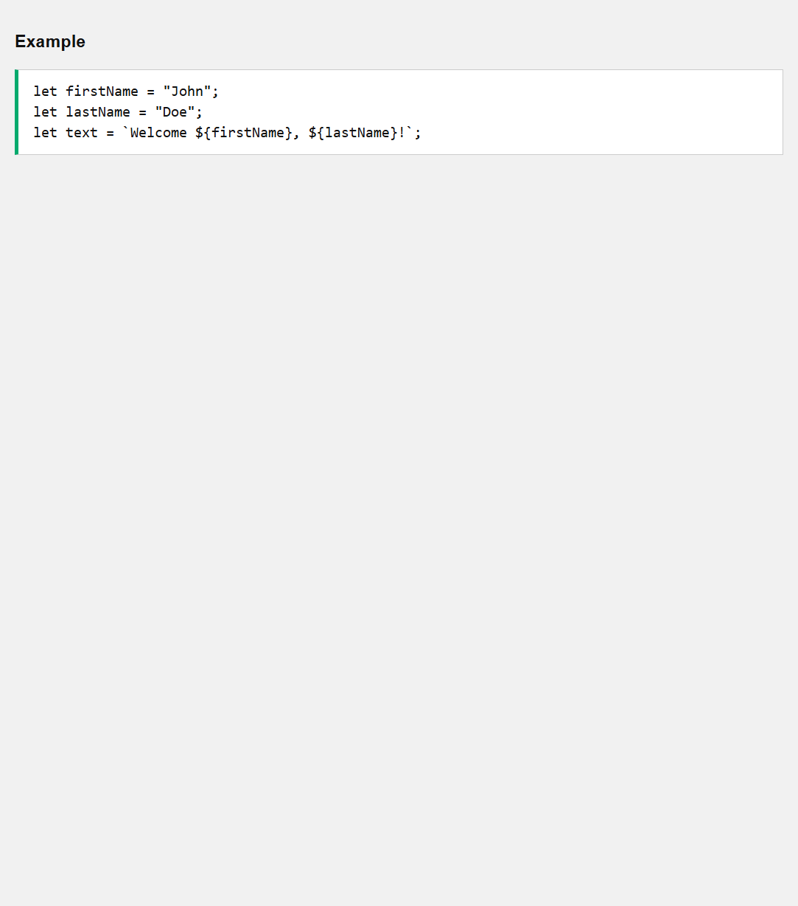

```javascript
let firstName = "John";
let lastName = "Doe";
let text = `Welcome ${firstName}, ${lastName}!`;
```

Rendered result:

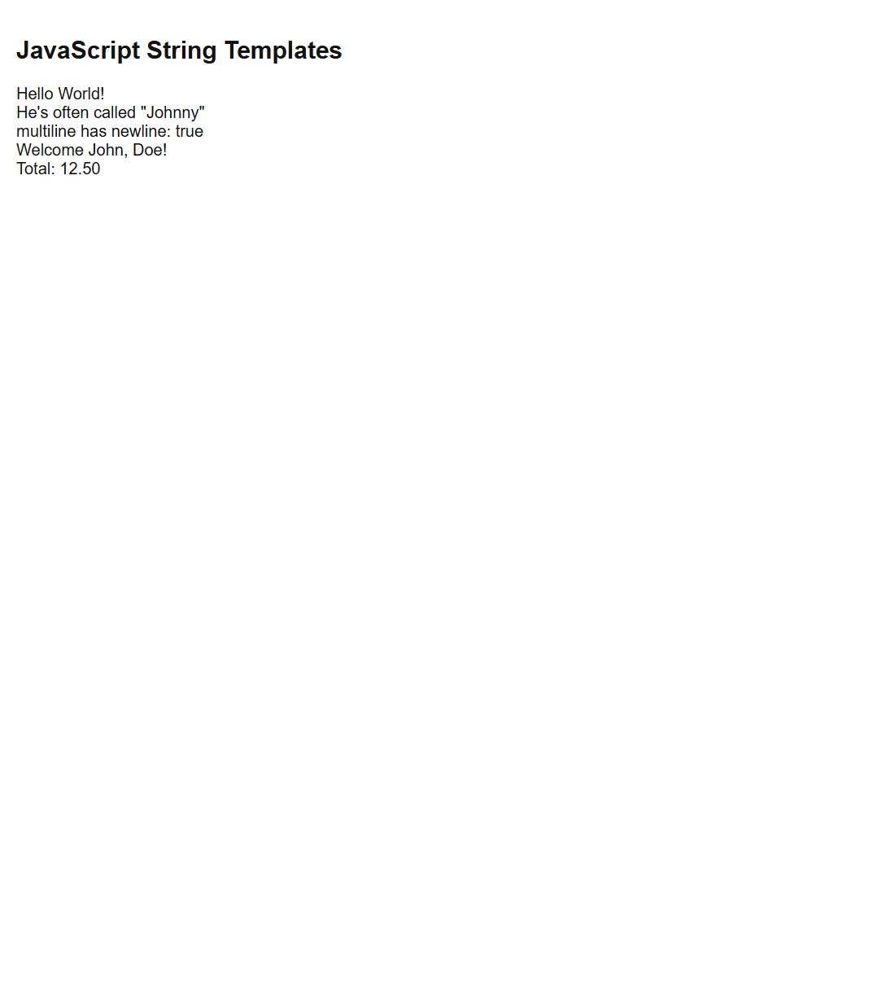

<details>
  <summary>Terminal Commands</summary>

## Terminal Commands

```bash
# from Personal/Files/javascript/code_sandbox
py -3 -m http.server 8770 --bind 127.0.0.1
```

Then open `http://127.0.0.1:8770/js-string-templates/`.

</details>

<details>
  <summary>Questions and Answers</summary>

## Questions and Answers

### Question 1: What characters wrap a template string?

<details>
<summary>Answer</summary>

- [x] **Backticks** `` ` ``, not `'` or `"`.

</details>

### Question 2: How do you insert a variable?

<details>
<summary>Answer</summary>

- [x] **`${variable}`** inside the backticks.

</details>

### Question 3: Can you put an expression in `${}`?

<details>
<summary>Answer</summary>

- [x] **Yes.** Example: `${(price * (1 + VAT)).toFixed(2)}`.

</details>

### Question 4: Do template strings allow multiline text?

<details>
<summary>Answer</summary>

- [x] **Yes.** Newlines inside backticks are part of the string.

</details>

### Question 5: When did browsers fully support this?

<details>
<summary>Answer</summary>

- [x] ES6 feature; modern browsers since **June 2017**.

</details>

</details>

## Summary

Backtick strings hold quotes, multiple lines, and **`${…}`** substitutions (variables or expressions). They are ES6 template literals.

## References

- [JS String Templates (W3Schools)](https://www.w3schools.com/js/js_string_templates.asp)
- [MDN: Template literals](https://developer.mozilla.org/en-US/docs/Web/JavaScript/Reference/Template_literals)

</details>

<details>
  <summary>JS String Methods</summary>

## Introduction

Strings are **primitive and immutable**. Every method returns a **new** string; the original is unchanged. This page covers **length**, character access, **slice/substring**, case, trim, pad, **replace**, and **split** (plus notes on deprecated `substr` and emoji-safe splitting).

## Detailed Explanation

- [x] **Immutable**
  - Methods never edit in place; they **return a new string**.
- [x] **`length`**
  - `"ABCDEFGHIJKLMNOPQRSTUVWXYZ".length` → **26**.
- [x] **Characters**
  - `charAt(0)`, `charCodeAt(0)`, `codePointAt(0)`, ES2022 **`at(i)`** (supports **negative** indexes), and `text[0]`.
  - `[]` looks like an array but is not; missing index is **`undefined`** (`charAt` returns `""`).
  - `text[0] = "A"` does not change the string.
- [x] **Parts**
  - **`slice(start, end)`** — end not included; negatives count from the end. `"Apple, Banana, Kiwi".slice(7, 13)` → **Banana**.
  - **`substring`** — like slice, but negative start/end become **0**.
  - **`substr`** — second arg is **length**; **deprecated** (use `slice` / `substring`).
- [x] **Case, trim, pad, repeat**
  - `toUpperCase()` / `toLowerCase()`.
  - `trim()`, `trimStart()`, `trimEnd()`.
  - `padStart(4, "0")` / `padEnd`; pad a **string** (convert numbers first).
  - `repeat(count)` copies the string.
- [x] **Replace**
  - `replace` changes the **first** match; case-sensitive unless `/i`.
  - All matches: regex `/g`, or **`replaceAll()`** (ES2021).
- [x] **`split`**
  - Turns a string into an array (`""`, `","`, `" "`).
  - `split("")` is **unsafe** for emojis (breaks UTF-16 surrogates). Prefer **`Intl.Segmenter`** for graphemes.

Sandbox: `code_sandbox/js-string-methods/index.html`

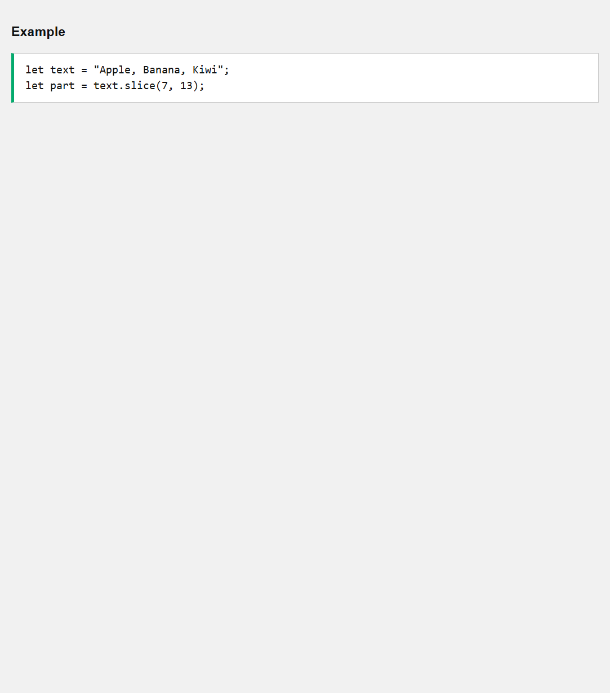

```javascript
let text = "Apple, Banana, Kiwi";
let part = text.slice(7, 13);
```

Rendered result:

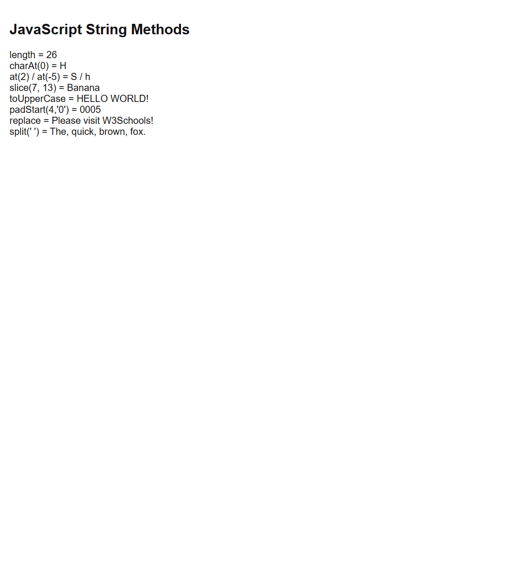

<details>
  <summary>Terminal Commands</summary>

## Terminal Commands

```bash
# from Personal/Files/javascript/code_sandbox
py -3 -m http.server 8770 --bind 127.0.0.1
```

Then open `http://127.0.0.1:8770/js-string-methods/`.

</details>

<details>
  <summary>Questions and Answers</summary>

## Questions and Answers

### Question 1: Do string methods change the original string?

<details>
<summary>Answer</summary>

- [x] **No.** Strings are **immutable**.
- [x] Methods return a **new** string.

</details>

### Question 2: What can `at()` do that `charAt()` cannot?

<details>
<summary>Answer</summary>

- [x] **Negative indexes** (count from the end).
- [x] ES2022 method.

</details>

### Question 3: What does `slice(7, 13)` return from `"Apple, Banana, Kiwi"`?

<details>
<summary>Answer</summary>

- [x] **Banana** (end index not included).

</details>

### Question 4: Should you use `substr()`?

<details>
<summary>Answer</summary>

- [x] **No.** It is **deprecated**.
- [x] Use **`slice()`** or **`substring()`**.

</details>

### Question 5: Why is `split("")` unsafe for emojis?

<details>
<summary>Answer</summary>

- [x] It splits **UTF-16 code units** and can break surrogate pairs.
- [x] **`Intl.Segmenter`** is the safe grapheme split.

</details>

</details>

## Summary

String methods return **new** strings. Use `length`, `charAt`/`at`, `slice`/`substring` (not deprecated `substr`), case/trim/pad/repeat, `replace`/`replaceAll`, and `split`. Avoid `split("")` on emoji text.

## References

- [JS String Methods (W3Schools)](https://www.w3schools.com/js/js_string_methods.asp)
- [MDN: String](https://developer.mozilla.org/en-US/docs/Web/JavaScript/Reference/Global_Objects/String)
- [MDN: String.prototype.at()](https://developer.mozilla.org/en-US/docs/Web/JavaScript/Reference/Global_Objects/String/at)
- [MDN: String.prototype.slice()](https://developer.mozilla.org/en-US/docs/Web/JavaScript/Reference/Global_Objects/String/slice)
- [MDN: Intl.Segmenter](https://developer.mozilla.org/en-US/docs/Web/JavaScript/Reference/Global_Objects/Intl/Segmenter)

</details>

<details>
  <summary>JS String Search</summary>

## Introduction

Search methods find text **inside** a string: **position** (`indexOf`, `lastIndexOf`, `search`), **matches** (`match`, `matchAll`), or **true/false** (`includes`, `startsWith`, `endsWith`). Positions start at **0**. Missing text is **`-1`**.

## Detailed Explanation

- [x] **`indexOf` / `lastIndexOf`**
  - First vs **last** occurrence; **`-1`** if not found.
  - `"Please locate where 'locate' occurs!".indexOf("locate")` → **7**.
  - Optional second arg: **start position**. `lastIndexOf` searches **backward** from that index.
- [x] **`search`**
  - String or **regex**; returns the match **position**.
  - **Not** the same as `indexOf`: `search` has **no** start-index argument; `indexOf` cannot take a **regex**.
- [x] **`match` / `matchAll`**
  - `match` returns an **array** of matches (or first match without `/g`).
  - `/ain/gi` on the rain sentence finds **ain, AIN, ain, ain**.
  - `matchAll` (ES2020) returns an **iterator**; regex needs the **`g`** flag.
- [x] **Boolean checks (ES6)**
  - `includes("world")`, `startsWith("Hello")`, `endsWith("Doe")`.
  - All **case-sensitive**; optional start (or length for `endsWith`) argument.

Sandbox: `code_sandbox/js-string-search/index.html`

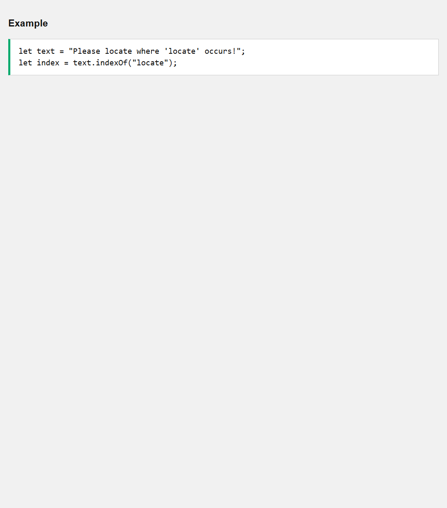

```javascript
let text = "Please locate where 'locate' occurs!";
let index = text.indexOf("locate");
```

Rendered result:

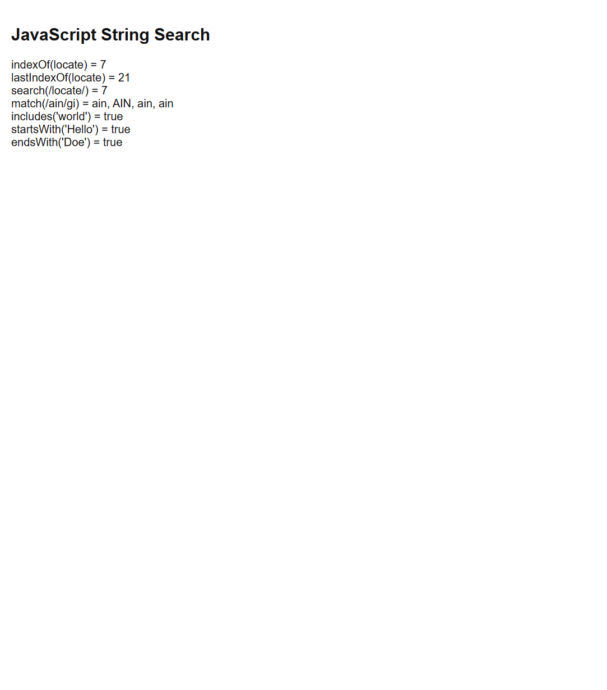

<details>
  <summary>Terminal Commands</summary>

## Terminal Commands

```bash
# from Personal/Files/javascript/code_sandbox
py -3 -m http.server 8770 --bind 127.0.0.1
```

Then open `http://127.0.0.1:8770/js-string-search/`.

</details>

<details>
  <summary>Questions and Answers</summary>

## Questions and Answers

### Question 1: What does `indexOf` return if the text is missing?

<details>
<summary>Answer</summary>

- [x] **`-1`.**

</details>

### Question 2: How do `indexOf` and `search` differ?

<details>
<summary>Answer</summary>

- [x] **`search`** cannot take a **start position**.
- [x] **`indexOf`** cannot take a **regular expression**.

</details>

### Question 3: What does `lastIndexOf` do with a start index of 15?

<details>
<summary>Answer</summary>

- [x] It searches **backward** from position 15 toward the start.

</details>

### Question 4: What does `includes` return?

<details>
<summary>Answer</summary>

- [x] **`true`** or **`false`**.
- [x] Case-sensitive ES6 method.

</details>

### Question 5: When does `match` return only the first match?

<details>
<summary>Answer</summary>

- [x] When the regex has **no** `/g` (global) flag.

</details>

</details>

## Summary

Use **`indexOf` / `lastIndexOf` / `search`** for positions (`-1` if missing), **`match` / `matchAll`** for match lists, and **`includes` / `startsWith` / `endsWith`** for booleans. `search` takes regex; `indexOf` takes a start index.

## References

- [JS String Search (W3Schools)](https://www.w3schools.com/js/js_string_search.asp)
- [MDN: String.prototype.indexOf()](https://developer.mozilla.org/en-US/docs/Web/JavaScript/Reference/Global_Objects/String/indexOf)
- [MDN: String.prototype.search()](https://developer.mozilla.org/en-US/docs/Web/JavaScript/Reference/Global_Objects/String/search)
- [MDN: String.prototype.includes()](https://developer.mozilla.org/en-US/docs/Web/JavaScript/Reference/Global_Objects/String/includes)

</details>

<details>
  <summary>JS String Reference</summary>

## Introduction

This page is the **complete String reference** (revised July 2025): properties and methods from **`at()`** through **`valueOf()`**. All methods return a **new** value. HTML wrapper methods (`bold()`, `italics()`, …) are **deprecated** — use CSS and the DOM instead.

## Detailed Explanation

- [x] **Core idea**
  - Methods do **not** change the original string.
- [x] **Useful names on the table**
  - Access: `at`, `charAt`, `charCodeAt`, `codePointAt`, `length`.
  - Search: `indexOf`, `lastIndexOf`, `includes`, `startsWith`, `endsWith`, `search`, `match`, `matchAll`.
  - Transform: `slice`, `substring`, `concat`, `repeat`, `replace`, `replaceAll`, `split`, `trim` / `trimStart` / `trimEnd`, `padStart` / `padEnd`, case converters.
  - **`substr()` is deprecated** — use `substring()` or `slice()`.
- [x] **HTML wrappers (do not use)**
  - `anchor`, `big`, `blink`, `bold`, `fixed`, `fontcolor`, `fontsize`, `italics`, `link`, `small`, `strike`, `sub`, `sup`.
  - Deprecated; kept only for compatibility.

Sandbox: `code_sandbox/js-string-reference/index.html`

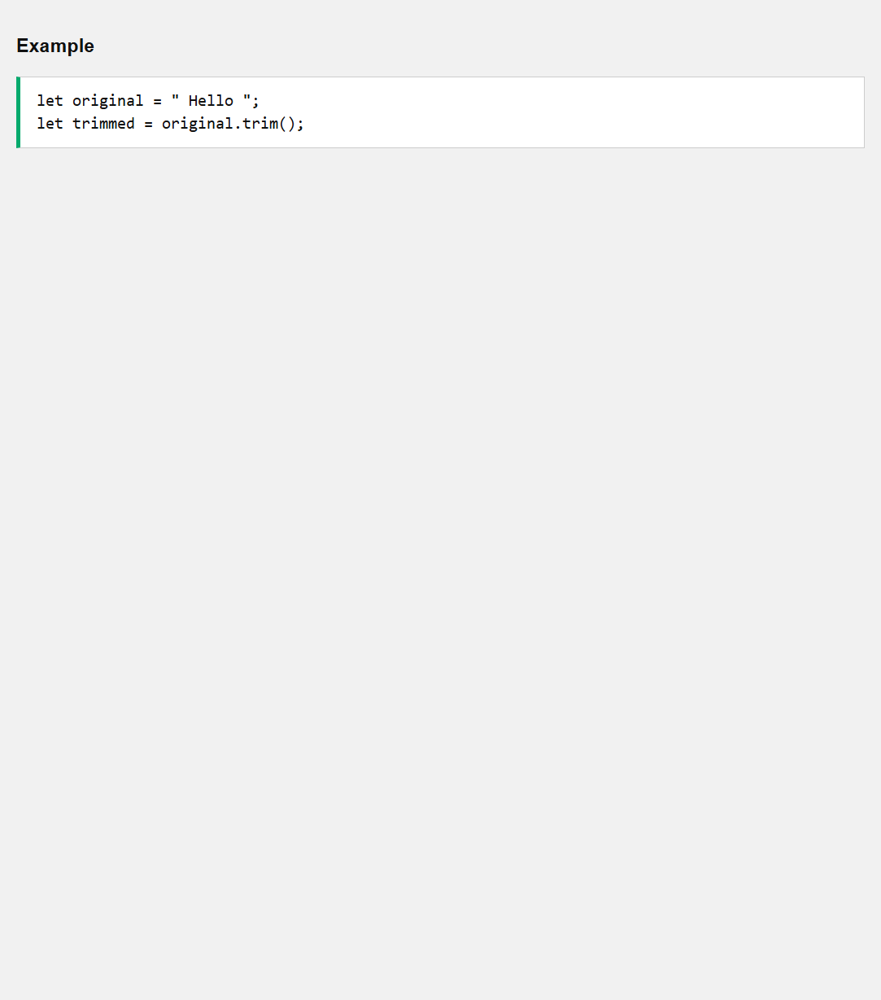

```javascript
let original = " Hello ";
let trimmed = original.trim();
```

Rendered result:

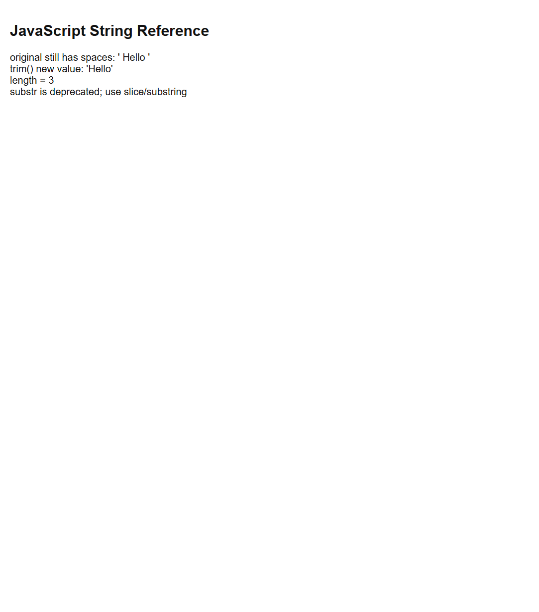

<details>
  <summary>Terminal Commands</summary>

## Terminal Commands

```bash
# from Personal/Files/javascript/code_sandbox
py -3 -m http.server 8770 --bind 127.0.0.1
```

Then open `http://127.0.0.1:8770/js-string-reference/`.

</details>

<details>
  <summary>Questions and Answers</summary>

## Questions and Answers

### Question 1: Do string methods mutate the original?

<details>
<summary>Answer</summary>

- [x] **No.** They return a **new** value.

</details>

### Question 2: What should you use instead of `substr()`?

<details>
<summary>Answer</summary>

- [x] **`substring()`** or **`slice()`**.
- [x] `substr()` is **deprecated**.

</details>

### Question 3: Should you use `bold()` / `italics()` string methods?

<details>
<summary>Answer</summary>

- [x] **No.** HTML wrappers are **deprecated**.
- [x] Use **CSS** and **DOM** APIs.

</details>

### Question 4: What does `length` return?

<details>
<summary>Answer</summary>

- [x] The **length** of the string (a property, not a method).

</details>

### Question 5: Where is the full method list?

<details>
<summary>Answer</summary>

- [x] On [JS String Reference (W3Schools)](https://www.w3schools.com/js/js_string_reference.asp).
- [x] Also [MDN String](https://developer.mozilla.org/en-US/docs/Web/JavaScript/Reference/Global_Objects/String).

</details>

</details>

## Summary

The String reference lists every property and method. Methods return new strings. Skip **`substr`** and the old **HTML wrapper** methods; style with CSS and the DOM.

## References

- [JS String Reference (W3Schools)](https://www.w3schools.com/js/js_string_reference.asp)
- [MDN: String](https://developer.mozilla.org/en-US/docs/Web/JavaScript/Reference/Global_Objects/String)
- [W3Schools JavaScript Reference](https://www.w3schools.com/jsref/default.asp)

</details>
