# JavaScript Tutorial

Section-by-section notes. Each accordion is one tutorial page: explained, coded in `code_sandbox`, run in the browser, and snapped.

<details>
  <summary>JS Introduction</summary>

## Introduction

JavaScript is the **programming language of the web**. This section shows what it can do in a page: **change HTML content**, **change attribute values**, **change CSS**, and **hide or show** elements. It also separates JavaScript from **Java**, and names **Brendan Eich (1995)** and the **ECMAScript / ECMA-262** standard.

## Detailed Explanation

- [x] **What JavaScript can do**
  - It is the programming language of the **web**.
  - It can **calculate**, **manipulate**, and **validate** data.
  - It can **update and change** both **HTML** and **CSS**.
- [x] **JavaScript can change HTML content**
  - One HTML method is **`getElementById()`**.
  - The example **finds** the element with `id="demo"` and sets its **`innerHTML`** to `Hello JavaScript`.
  - Sandbox: `code_sandbox/js-introduction/index.html`. Click **Click Me!** and the paragraph becomes **Hello JavaScript**.

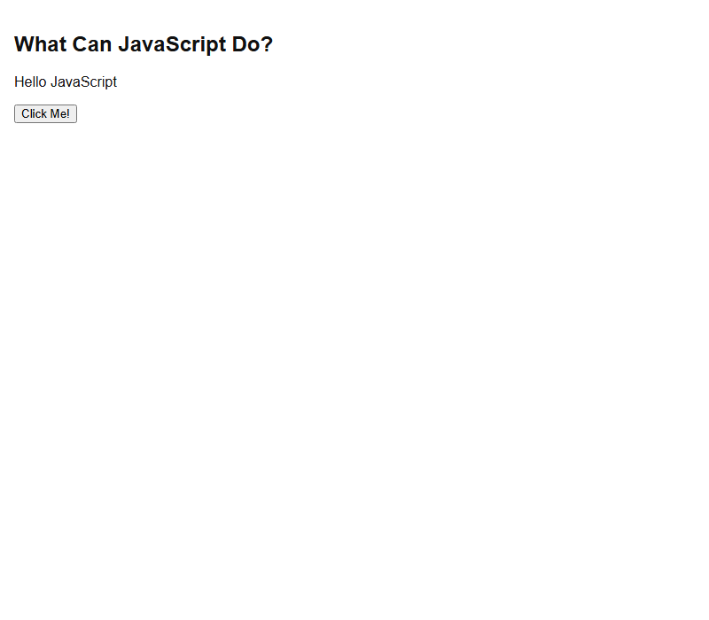

- [x] **Quotes**
  - JavaScript accepts both **double** and **single** quotes.
  - Same idea: `document.getElementById('demo').innerHTML = 'Hello JavaScript';`
- [x] **JavaScript can change HTML attribute values**
  - The light-bulb demo changes the **`src`** of an ``.
  - Sandbox: `code_sandbox/js-introduction/lightbulb.html` (local SVG on/off images instead of the site’s GIF files).
- [x] **JavaScript can change HTML styles (CSS)**
  - Changing style is a variant of changing an **attribute**.
  - Example: `document.getElementById("demo").style.fontSize = "35px";`
  - Sandbox: `code_sandbox/js-introduction/style.html`.
- [x] **JavaScript can hide HTML elements**
  - Hide by setting **`display`** to **`none`**: `document.getElementById("demo").style.display = "none";`
- [x] **JavaScript can show HTML elements**
  - Show by setting **`display`** to **`block`**: `document.getElementById("demo").style.display = "block";`
  - Sandbox: `code_sandbox/js-introduction/hide-show.html`.
- [x] **Did you know? Java vs JavaScript**
  - **JavaScript and Java** are **completely different** languages (concept and design).
  - JavaScript was invented by **Brendan Eich** in **1995**.
  - It became an **ECMA** standard in **1997**.
  - **ECMA-262** is the official name of the **standard**.
  - **ECMAScript** is the official name of the **language**.
- [x] **Exercise on the page**
  - True or False: **JAVA is short for JavaScript.**
  - **False.** Java and JavaScript are different languages.

<details>
  <summary>Lab</summary>

## Lab

Recreate the W3Schools **JS Introduction** content-change example, serve it, and confirm the click updates the paragraph.

### **Overview**

- [ ] Build `code_sandbox/js-introduction/index.html` from the section example.
- [ ] You will:
  - [ ] Write a heading, a `<p id="demo">`, and a button that sets `innerHTML`.
  - [ ] Serve `code_sandbox` over HTTP (Cursor browser blocks `file://`).
  - [ ] Open `http://127.0.0.1:8770/js-introduction/`.
  - [ ] Click **Click Me!** and confirm the text becomes **Hello JavaScript**.
- [ ] Success: the running page matches the snapped result below.

### **Task 1: Create the sandbox file**

- [ ] Open `Personal/Files/javascript/code_sandbox/js-introduction/index.html`.
- [ ] Use this document (same behavior as the W3Schools innerHTML example):

```html
<!DOCTYPE html>
<html>
  <head>
    <meta name="color-scheme" content="light" />
    <title>JS Introduction</title>
    <style>
      html,
      body {
        margin: 0;
        min-height: 100vh;
        background: #fff;
        color: #111;
        font-family: sans-serif;
      }
      body {
        padding: 16px;
        box-sizing: border-box;
      }
    </style>
  </head>
  <body>
    <h2>What Can JavaScript Do?</h2>
    <p id="demo">JavaScript can change HTML content.</p>
    <button
      type="button"
      onclick="document.getElementById('demo').innerHTML = 'Hello JavaScript'"
    >
      Click Me!
    </button>
  </body>
</html>
```

### **Task 2: Serve and open the page**

- [ ] From `Personal/Files/javascript/code_sandbox`, start a static server:

```bash
py -3 -m http.server 8770 --bind 127.0.0.1
```

- [ ] In the browser, open `http://127.0.0.1:8770/js-introduction/`.
- [ ] Check:
  - [ ] Heading: **What Can JavaScript Do?**
  - [ ] Paragraph starts as **JavaScript can change HTML content.**
  - [ ] After **Click Me!**, the paragraph is **Hello JavaScript**.


### **Task 3: Optional extra demos**

- [ ] Open `style.html` and click to enlarge the paragraph (`fontSize = 35px`).
- [ ] Open `hide-show.html` and use **Hide** / **Show**.
- [ ] Open `lightbulb.html` and toggle the image `src`.

The sandbox example is running and matches the Introduction content-change demo.

</details>

<details>
  <summary>Terminal Commands</summary>

## Terminal Commands

Serve the sandbox so the Cursor browser can load the example (it cannot open `file://`).

```bash
# from Personal/Files/javascript/code_sandbox
py -3 -m http.server 8770 --bind 127.0.0.1
```

Then open `http://127.0.0.1:8770/js-introduction/`.

</details>

<details>
  <summary>Code</summary>

## Code

Sandbox: `code_sandbox/js-introduction/index.html`

Tested source (W3Schools **change HTML content** example):

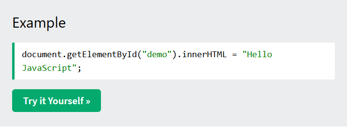

```html
<!DOCTYPE html>
<html>
  <head>
    <meta name="color-scheme" content="light" />
    <title>JS Introduction</title>
    <style>
      html,
      body {
        margin: 0;
        min-height: 100vh;
        background: #fff;
        color: #111;
        font-family: sans-serif;
      }
      body {
        padding: 16px;
        box-sizing: border-box;
      }
    </style>
  </head>
  <body>
    <h2>What Can JavaScript Do?</h2>
    <p id="demo">JavaScript can change HTML content.</p>
    <button
      type="button"
      onclick="document.getElementById('demo').innerHTML = 'Hello JavaScript'"
    >
      Click Me!
    </button>
  </body>
</html>
```

Rendered result after clicking **Click Me!**:


Related sandbox files: `style.html`, `hide-show.html`, `lightbulb.html`.

</details>

<details>
  <summary>Questions and Answers</summary>

## Questions and Answers

### Question 1: What is JavaScript in this tutorial?

<details>
<summary>Answer</summary>

- [x] The **programming language of the web**.
- [x] It can calculate, manipulate, and validate data.
- [x] It can update and change **HTML** and **CSS**.

</details>

### Question 2: Which method finds the element with `id="demo"`?

<details>
<summary>Answer</summary>

- [x] **`document.getElementById("demo")`**.

</details>

### Question 3: How does the first example change the paragraph text?

<details>
<summary>Answer</summary>

- [x] It sets the element’s **`innerHTML`**.
- [x] The new content is **`Hello JavaScript`**.

</details>

### Question 4: Does JavaScript allow single quotes as well as double quotes?

<details>
<summary>Answer</summary>

- [x] **Yes.** Both **double** and **single** quotes are accepted.

</details>

### Question 5: How can JavaScript change an image?

<details>
<summary>Answer</summary>

- [x] By changing an HTML **attribute value**.
- [x] The light-bulb demo changes the **`src`** of an ``.

</details>

### Question 6: How do you change an element’s CSS from JavaScript?

<details>
<summary>Answer</summary>

- [x] Assign to the element’s **`style`** properties.
- [x] Example: `document.getElementById("demo").style.fontSize = "35px";`
- [x] Changing style is a variant of changing an **attribute**.

</details>

### Question 7: How do you hide or show an HTML element?

<details>
<summary>Answer</summary>

- [x] Hide: `style.display = "none"`.
- [x] Show: `style.display = "block"`.

</details>

### Question 8: Are Java and JavaScript the same language?

<details>
<summary>Answer</summary>

- [x] **No.** They are **completely different** in concept and design.
- [x] **JAVA is not short for JavaScript.**

</details>

### Question 9: Who invented JavaScript, and when did it become an ECMA standard?

<details>
<summary>Answer</summary>

- [x] Invented by **Brendan Eich** in **1995**.
- [x] Became an **ECMA** standard in **1997**.

</details>

### Question 10: What are ECMA-262 and ECMAScript?

<details>
<summary>Answer</summary>

- [x] **ECMA-262** is the official name of the **standard**.
- [x] **ECMAScript** is the official name of the **language**.

</details>

</details>

## Summary

JavaScript is the **programming language of the web**. It can change **HTML content** (`getElementById` + `innerHTML`), **attribute values** (for example an image `src`), **CSS** (`style.fontSize`), and **visibility** (`display` `none` / `block`). Quotes may be **single or double**. JavaScript is **not** Java: Eich invented it in **1995**; **ECMA-262** is the standard and **ECMAScript** is the language name.

## References

- [JS Introduction (W3Schools)](https://www.w3schools.com/js/js_intro.asp)
- [Try it Yourself: tryjs_intro_inner_html](https://www.w3schools.com/js/tryit.asp?filename=tryjs_intro_inner_html)
- [Try it Yourself: tryjs_intro_inner_html_quotes](https://www.w3schools.com/js/tryit.asp?filename=tryjs_intro_inner_html_quotes)
- [Try it Yourself: tryjs_intro_lightbulb](https://www.w3schools.com/js/tryit.asp?filename=tryjs_intro_lightbulb)
- [Try it Yourself: tryjs_intro_style](https://www.w3schools.com/js/tryit.asp?filename=tryjs_intro_style)
- [Try it Yourself: tryjs_intro_hide](https://www.w3schools.com/js/tryit.asp?filename=tryjs_intro_hide)
- [Try it Yourself: tryjs_intro_show](https://www.w3schools.com/js/tryit.asp?filename=tryjs_intro_show)
- [See all JavaScript Versions](https://www.w3schools.com/js/js_versions.asp)
- [MDN: JavaScript](https://developer.mozilla.org/en-US/docs/Web/JavaScript)
- [MDN: Document.getElementById()](https://developer.mozilla.org/en-US/docs/Web/API/Document/getElementById)
- [ECMA-262](https://tc39.es/ecma262/)

</details>

<details>
  <summary>JS Where To</summary>

## Introduction

In HTML, JavaScript is inserted between **`<script>`** and **`</script>`**. This section shows scripts in the **`<head>`** or **`<body>`**, how **functions** run on events such as a button click, and how to load **external `.js` files** with the **`src`** attribute.

## Detailed Explanation

- [x] **The `<script>` tag**
  - JavaScript code is inserted between `<script>` and `</script>`.
  - Example: `document.getElementById("demo").innerHTML = "My First JavaScript";` inside a script tag.
  - Old examples may use `<script type="text/javascript">`. The **`type` attribute is not required**; JavaScript is the **default** scripting language in HTML.

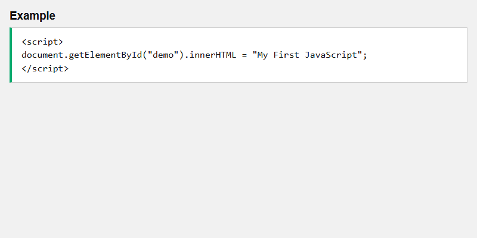

- [x] **Functions and events**
  - A **function** is a block of JavaScript that runs when it is **called**.
  - A function can run when an **event** occurs, such as a **button click**.
  - Functions and events are covered in later chapters.
- [x] **Head, body, or both**
  - You can place **any number** of scripts in an HTML document.
  - Scripts can go in **`<body>`**, **`<head>`**, or **both**.
- [x] **JavaScript in `<head>`**
  - The function is defined in `<head>` and **invoked** when the button is clicked.
  - Sandbox: `code_sandbox/js-where-to/head.html`.
- [x] **JavaScript in `<body>`**
  - The same function can sit in the **body**.
  - **Placing scripts at the bottom of `<body>`** improves display speed, because script interpretation **slows down** display.
  - Sandbox: `code_sandbox/js-where-to/index.html`. After **Try it**, the paragraph is **Paragraph changed.**

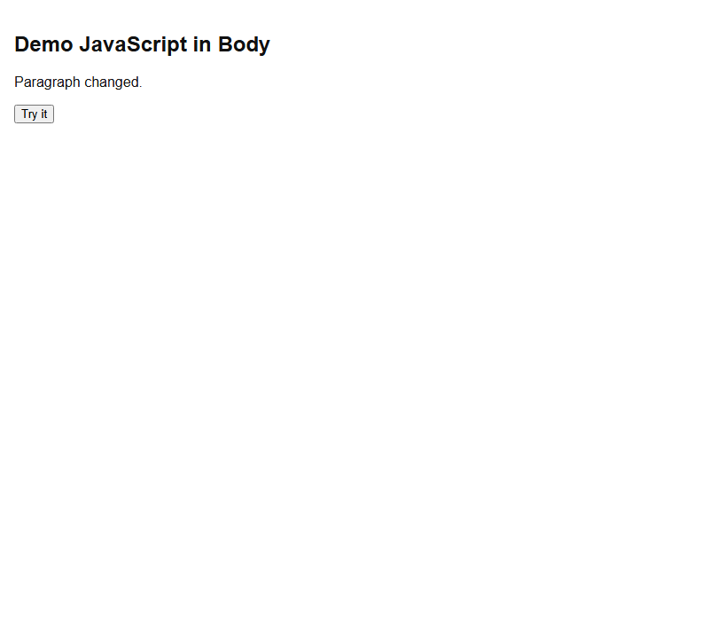

- [x] **External JavaScript**
  - Scripts can live in external files with the **`.js`** extension.
  - External files are practical when the **same code** is used on **many pages**.
  - Reference the file with **`src`**: `<script src="myScript.js"></script>`.
  - You can put that tag in **`<head>`** or **`<body>`**. The script behaves as if it were **exactly where the tag is**.
  - **External scripts cannot contain `<script>` tags.**
  - Sandbox: `code_sandbox/js-where-to/external.html` plus `myScript.js`.
- [x] **Advantages of external files**
  - Separates HTML and code.
  - Makes HTML and JavaScript easier to **read and maintain**.
  - **Cached** JavaScript files can **speed up** page loads.
- [x] **Several files**
  - Use **several** `<script>` tags: `myScript1.js` and `myScript2.js`.
- [x] **Three ways to reference an external script**
  - A **full URL** (full web address).
  - A **file path** (like `/js/`).
  - **Without any path** (same folder as the HTML).

<details>
  <summary>Lab</summary>

## Lab

Recreate the **JavaScript in `<body>`** example, serve it, and confirm the click changes the paragraph.

### **Overview**

- [ ] Build `code_sandbox/js-where-to/index.html` with the function in the body.
- [ ] You will:
  - [ ] Write a heading, `<p id="demo">`, a button, and a `<script>` at the bottom of `<body>`.
  - [ ] Serve `code_sandbox` over HTTP.
  - [ ] Open `http://127.0.0.1:8770/js-where-to/`.
  - [ ] Click **Try it** and confirm the text becomes **Paragraph changed.**
- [ ] Success: the running page matches the snapped result below.

### **Task 1: Create the body example**

- [ ] Open `Personal/Files/javascript/code_sandbox/js-where-to/index.html`.
- [ ] Place `myFunction` in a `<script>` at the bottom of `<body>` (same as the W3Schools body example).

### **Task 2: Serve and click**

- [ ] From `Personal/Files/javascript/code_sandbox`:

```bash
py -3 -m http.server 8770 --bind 127.0.0.1
```

- [ ] Open `http://127.0.0.1:8770/js-where-to/`.
- [ ] Click **Try it**. The paragraph should read **Paragraph changed.**


### **Task 3: Head and external variants**

- [ ] Open `head.html` and confirm the same click works with the script in `<head>`.
- [ ] Open `external.html` and confirm `myScript.js` is loaded with `<script src="myScript.js"></script>`.

The body example is running and matches the Where To demo.

</details>

<details>
  <summary>Terminal Commands</summary>

## Terminal Commands

```bash
# from Personal/Files/javascript/code_sandbox
py -3 -m http.server 8770 --bind 127.0.0.1
```

Then open `http://127.0.0.1:8770/js-where-to/`.

</details>

<details>
  <summary>Code</summary>

## Code

Sandbox: `code_sandbox/js-where-to/index.html` (script in `<body>`)

The page’s first example is a script that writes into `#demo`:


Tested body example (function called from the button):

```html
<!DOCTYPE html>
<html>
  <head>
    <meta name="color-scheme" content="light" />
    <title>JS Where To - Body</title>
    <style>
      html,
      body {
        margin: 0;
        min-height: 100vh;
        background: #fff;
        color: #111;
        font-family: sans-serif;
      }
      body {
        padding: 16px;
        box-sizing: border-box;
      }
    </style>
  </head>
  <body>
    <h2>Demo JavaScript in Body</h2>
    <p id="demo">A Paragraph</p>
    <button type="button" onclick="myFunction()">Try it</button>
    <script>
      function myFunction() {
        document.getElementById("demo").innerHTML = "Paragraph changed.";
      }
    </script>
  </body>
</html>
```

Rendered result after **Try it**:


External file `myScript.js`:

```javascript
function myFunction() {
  document.getElementById("demo").innerHTML = "Paragraph changed.";
}
```

Loaded with `<script src="myScript.js"></script>` in `external.html`.

</details>

<details>
  <summary>Questions and Answers</summary>

## Questions and Answers

### Question 1: Where do you put JavaScript in HTML?

<details>
<summary>Answer</summary>

- [x] Between **`<script>`** and **`</script>`** tags.

</details>

### Question 2: Is `type="text/javascript"` required on `<script>`?

<details>
<summary>Answer</summary>

- [x] **No.** The type attribute is **not required**.
- [x] JavaScript is the **default** scripting language in HTML.

</details>

### Question 3: What is a JavaScript function in this section?

<details>
<summary>Answer</summary>

- [x] A **block of JavaScript** that runs when it is **called**.
- [x] It can run when an **event** occurs, such as a **button click**.

</details>

### Question 4: Can you put scripts in both `<head>` and `<body>`?

<details>
<summary>Answer</summary>

- [x] **Yes.** You can place **any number** of scripts.
- [x] They can go in `<body>`, `<head>`, or **both**.

</details>

### Question 5: Why place scripts at the bottom of `<body>`?

<details>
<summary>Answer</summary>

- [x] It **improves display speed**.
- [x] Script interpretation **slows down** the display.

</details>

### Question 6: How do you load an external JavaScript file?

<details>
<summary>Answer</summary>

- [x] Use the **`src`** attribute: `<script src="myScript.js"></script>`.
- [x] JavaScript files use the **`.js`** extension.

</details>

### Question 7: Can an external script file contain `<script>` tags?

<details>
<summary>Answer</summary>

- [x] **No.** External scripts **cannot** contain `<script>` tags.

</details>

### Question 8: What are three advantages of external JavaScript files?

<details>
<summary>Answer</summary>

- [x] They **separate** HTML and code.
- [x] HTML and JavaScript are easier to **read and maintain**.
- [x] **Cached** files can **speed up** page loads.

</details>

### Question 9: What are three ways to reference an external script?

<details>
<summary>Answer</summary>

- [x] A **full URL**.
- [x] A **file path** (like `/js/`).
- [x] **Without any path**.

</details>

### Question 10: Where can you place an external `<script src="...">` tag?

<details>
<summary>Answer</summary>

- [x] In **`<head>`** or **`<body>`**, as you like.
- [x] The script behaves as if it were **exactly where the tag is**.

</details>

</details>

## Summary

Put JavaScript between **`<script>`** tags in **`<head>`**, **`<body>`**, or both. A **function** can run on a **click**. Scripts at the **bottom of `<body>`** display faster. External **`.js`** files use **`src`**, cannot contain `<script>` tags, and can be referenced by **URL**, **path**, or **no path**. Caching and separation of HTML and code are the main advantages.

## References

- [JS Where To (W3Schools)](https://www.w3schools.com/js/js_whereto.asp)
- [Try it Yourself: tryjs_whereto](https://www.w3schools.com/js/tryit.asp?filename=tryjs_whereto)
- [Try it Yourself: tryjs_whereto_head](https://www.w3schools.com/js/tryit.asp?filename=tryjs_whereto_head)
- [Try it Yourself: tryjs_whereto_body](https://www.w3schools.com/js/tryit.asp?filename=tryjs_whereto_body)
- [Try it Yourself: tryjs_whereto_external](https://www.w3schools.com/js/tryit.asp?filename=tryjs_whereto_external)
- [HTML File Paths](https://www.w3schools.com/html/html_filepaths.asp)
- [MDN: The script element](https://developer.mozilla.org/en-US/docs/Web/HTML/Element/script)

</details>

<details>
  <summary>JS Output</summary>

## Introduction

JavaScript can **display data** in several ways: **`innerHTML`**, **`innerText`**, **`document.write()`**, **`window.alert()`**, **`console.log()`**, and (for printing the window) **`window.print()`**. This section shows each method and when **not** to use `document.write()`.

## Detailed Explanation

- [x] **Display possibilities**
  - Write into an HTML element with **`innerHTML`** (or **`innerText`**).
  - Write into the HTML output with **`document.write()`**.
  - Write into an alert box with **`window.alert()`**.
  - Write into the browser console with **`console.log()`**.
- [x] **Using `innerHTML`**
  - Access an element with **`document.getElementById(id)`**.
  - Use the **`id`** attribute to identify the element.
  - Set **`innerHTML`** to change the HTML content.
  - Changing **`innerHTML`** is the **most common** way to display data in HTML.
  - Sandbox: `code_sandbox/js-output/index.html` writes `<h2>Hello World</h2>` into `#demo`.

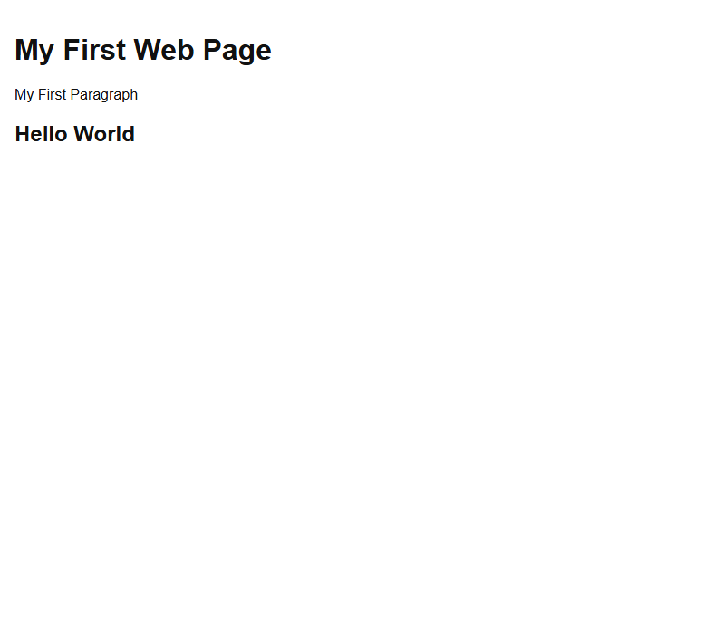

- [x] **Using `innerText`**
  - Set **`innerText`** to change **plain text** only.
  - Use **`innerHTML`** when you want to change an **HTML element**.
  - Use **`innerText`** when you only want to change the **plain text**.
  - Sandbox: `code_sandbox/js-output/innertext.html`.
- [x] **Using `document.write()`**
  - Convenient for **testing**.
  - Using `document.write()` **after the document is loaded** **deletes all existing HTML**.
  - Use it **only for testing**.
  - Sandbox: `code_sandbox/js-output/write.html` writes `5 + 6` (**11**) during parse.


- [x] **Using `window.alert()`**
  - An **alert box** can display data: `window.alert(5 + 6)`.
  - You can **skip** the `window` keyword: `alert(5 + 6)`.
  - **`window`** is the **global scope** object, so methods belong to it by default.
- [x] **Using `console.log()`**
  - For **debugging**, call **`console.log()`** in the browser.
  - Sandbox: `code_sandbox/js-output/console.html` logs `5 + 6`.
- [x] **JavaScript print**
  - JavaScript has **no** print object or print methods for output devices.
  - The exception is **`window.print()`**, which prints the **current window**.

<details>
  <summary>Lab</summary>

## Lab

Recreate the **`innerHTML`** output example and confirm **Hello World** appears as a heading inside `#demo`.

### **Overview**

- [ ] Build `code_sandbox/js-output/index.html`.
- [ ] You will:
  - [ ] Add an empty `<p id="demo">`.
  - [ ] Set `innerHTML` to `"<h2>Hello World</h2>"`.
  - [ ] Serve `code_sandbox` and open `http://127.0.0.1:8770/js-output/`.
- [ ] Success: you see **My First Web Page**, **My First Paragraph**, and a **Hello World** heading.

### **Task 1: Create the innerHTML page**

- [ ] Open `Personal/Files/javascript/code_sandbox/js-output/index.html`.
- [ ] Match the W3Schools innerHTML example (plus the shared light-page stylesheet).

### **Task 2: Serve and confirm**

```bash
py -3 -m http.server 8770 --bind 127.0.0.1
```

- [ ] Open `http://127.0.0.1:8770/js-output/`.
- [ ] Confirm `#demo` contains an `<h2>Hello World</h2>` (not escaped tags as text).


### **Task 3: Other output methods**

- [ ] Open `innertext.html` and confirm **Hello World** as plain text (no extra heading element).
- [ ] Open `write.html` and confirm **11** is written into the page.
- [ ] Open `console.html` and check the console for **11**.
- [ ] Do **not** call `document.write()` from a button after load unless you want the page wiped.

The innerHTML example is running and matches the Output demo.

</details>

<details>
  <summary>Terminal Commands</summary>

## Terminal Commands

```bash
# from Personal/Files/javascript/code_sandbox
py -3 -m http.server 8770 --bind 127.0.0.1
```

Then open `http://127.0.0.1:8770/js-output/`.

</details>

<details>
  <summary>Code</summary>

## Code

Sandbox: `code_sandbox/js-output/index.html`

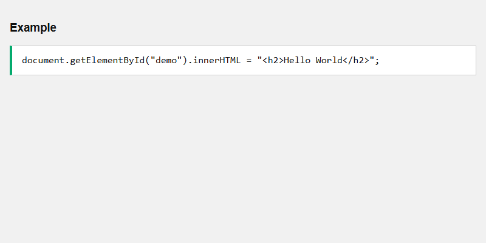

```html
<!DOCTYPE html>
<html>
  <head>
    <meta name="color-scheme" content="light" />
    <title>JS Output - innerHTML</title>
    <link rel="stylesheet" href="../sandbox.css" />
  </head>
  <body>
    <h1>My First Web Page</h1>
    <p>My First Paragraph</p>
    <p id="demo"></p>
    <script>
      document.getElementById("demo").innerHTML = "<h2>Hello World</h2>";
    </script>
  </body>
</html>
```

Rendered result:


`document.write(5 + 6)` during parse (`write.html`):


</details>

<details>
  <summary>Questions and Answers</summary>

## Questions and Answers

### Question 1: What are the main ways JavaScript can display data?

<details>
<summary>Answer</summary>

- [x] **`innerHTML`** / **`innerText`** on an HTML element.
- [x] **`document.write()`**.
- [x] **`window.alert()`**.
- [x] **`console.log()`**.

</details>

### Question 2: How do you change an element’s HTML content?

<details>
<summary>Answer</summary>

- [x] `document.getElementById(id)` to access the element.
- [x] Set the **`innerHTML`** property.

</details>

### Question 3: When should you use `innerHTML` vs `innerText`?

<details>
<summary>Answer</summary>

- [x] **`innerHTML`** when you want to change an **HTML element**.
- [x] **`innerText`** when you only want to change **plain text**.

</details>

### Question 4: What is the most common way to display data in HTML?

<details>
<summary>Answer</summary>

- [x] Changing the **`innerHTML`** property of an HTML element.

</details>

### Question 5: What happens if you call `document.write()` after the page has loaded?

<details>
<summary>Answer</summary>

- [x] It **deletes all existing HTML**.
- [x] Use `document.write()` **only for testing**.

</details>

### Question 6: Can you omit `window` in `window.alert()`?

<details>
<summary>Answer</summary>

- [x] **Yes.** `alert(5 + 6)` works.
- [x] **`window`** is the **global scope** object, so the keyword is optional.

</details>

### Question 7: What is `console.log()` for?

<details>
<summary>Answer</summary>

- [x] **Debugging** in the browser.
- [x] It displays data in the **console**.

</details>

### Question 8: Can JavaScript print to a printer as a general output device?

<details>
<summary>Answer</summary>

- [x] JavaScript has **no** general print object or print methods for output devices.
- [x] The exception is **`window.print()`**, which prints the **current window**.

</details>

</details>

## Summary

Display data with **`innerHTML`** (most common, can inject HTML), **`innerText`** (plain text), **`document.write()`** (testing only; after load it **wipes** the page), **`alert()`** / **`window.alert()`**, and **`console.log()`** for debugging. **`window.print()`** prints the current window. `window` is the global object, so its methods can be called without the prefix.

## References

- [JS Output (W3Schools)](https://www.w3schools.com/js/js_output.asp)
- [Try it Yourself: tryjs_output_innerhtml](https://www.w3schools.com/js/tryit.asp?filename=tryjs_output_innerhtml)
- [Try it Yourself: tryjs_output_innertext](https://www.w3schools.com/js/tryit.asp?filename=tryjs_output_innertext)
- [Try it Yourself: tryjs_output_write](https://www.w3schools.com/js/tryit.asp?filename=tryjs_output_write)
- [Try it Yourself: tryjs_output_write_over](https://www.w3schools.com/js/tryit.asp?filename=tryjs_output_write_over)
- [Try it Yourself: tryjs_output_alert](https://www.w3schools.com/js/tryit.asp?filename=tryjs_output_alert)
- [Try it Yourself: tryjs_output_console](https://www.w3schools.com/js/tryit.asp?filename=tryjs_output_console)
- [Try it Yourself: tryjs_output_print](https://www.w3schools.com/js/tryit.asp?filename=tryjs_output_print)
- [MDN: Element.innerHTML](https://developer.mozilla.org/en-US/docs/Web/API/Element/innerHTML)
- [MDN: Node.innerText](https://developer.mozilla.org/en-US/docs/Web/API/HTMLElement/innerText)
- [MDN: Document.write()](https://developer.mozilla.org/en-US/docs/Web/API/Document/write)

</details>

<details>
  <summary>JS Syntax</summary>

## Introduction

JavaScript **syntax** is the set of rules for writing the language. Values are **literals** (fixed) or **variables**. This section covers **numbers**, **strings**, **keywords** (`let`, `const`), **identifiers**, **operators**, **expressions**, **case sensitivity**, and **camel case**.

## Detailed Explanation

- [x] **Two types of values**
  - **Literals** — fixed values.
  - **Variables** — variable values.
- [x] **Literals**
  - **Numbers** are written with or without decimals: `10.50` and `1001`.
  - **Strings** are text in **double or single quotes**: `"John Doe"` and `'John Doe'`.
- [x] **Keywords**
  - Keywords define **actions**.
  - **`let`** and **`const`** create variables: `let x = 5;` and `const fname = "John";`.
  - Keywords are **case-sensitive**. JavaScript does **not** treat `LET` or `Let` as `let`.
- [x] **Variables and identifiers**
  - Variables are **containers** for data values.
  - Each must have a **unique name** (an **identifier**).
  - Identifier rules: start with a **letter**, **`_`**, or **`$`**; digits allowed **after** the first character; cannot be a **reserved keyword**; **case-sensitive**.
- [x] **Operators**
  - **Assignment** `=` assigns values: `x = 6`.
  - **Arithmetic** `+ - * /` compute values: `let sum = x + y;` and `5 * 10`.
- [x] **Expressions**
  - A combination of values, variables, and operators that **computes to a value**.
  - `(5 + 6) * 10` evaluates to **110**.
  - `"John" + " " + "Doe"` evaluates to **John Doe**.
- [x] **Case sensitive**
  - Identifiers are case sensitive: `lastName` and `lastname` are **different** variables.
- [x] **Camel case**
  - Hyphens (`first-name`) are **not allowed** (reserved for subtraction).
  - Underscore: `first_name`.
  - **Upper Camel Case (Pascal Case):** `FirstName`.
  - **Lower camel case:** `firstName` — JavaScript programmers **tend to use** this.

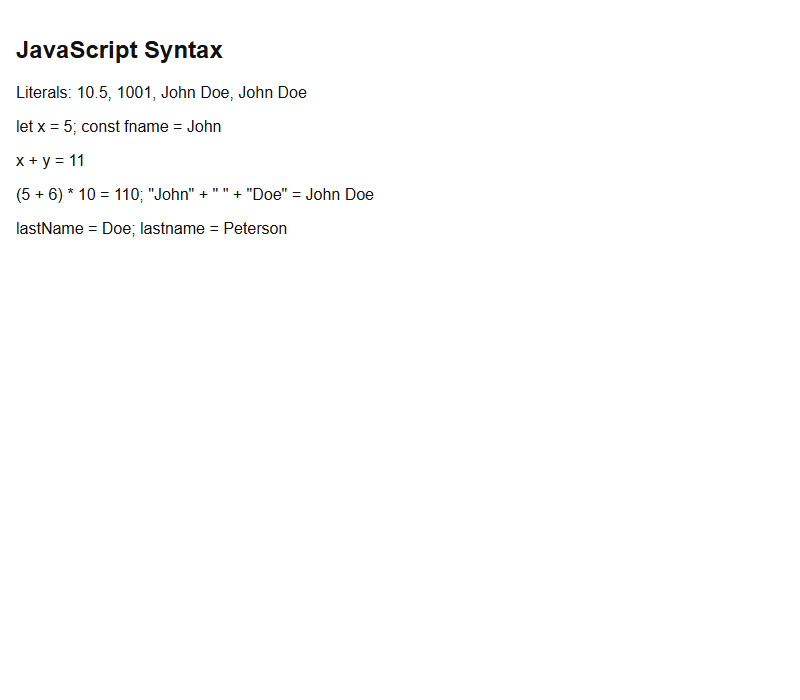

<details>
  <summary>Lab</summary>

## Lab

Run the syntax sandbox and confirm literals, `let`/`const`, the sum, the expression **110**, and the two different `lastName` / `lastname` values.

### **Overview**

- [ ] Open `code_sandbox/js-syntax/index.html` over HTTP.
- [ ] Confirm the computed lines match the section examples.
- [ ] Success: `(5 + 6) * 10 = 110` and `lastName` / `lastname` are different.

### **Task 1: Serve the sandbox**

```bash
py -3 -m http.server 8770 --bind 127.0.0.1
```

- [ ] Open `http://127.0.0.1:8770/js-syntax/`.


The syntax examples are running.

</details>

<details>
  <summary>Terminal Commands</summary>

## Terminal Commands

```bash
# from Personal/Files/javascript/code_sandbox
py -3 -m http.server 8770 --bind 127.0.0.1
```

Then open `http://127.0.0.1:8770/js-syntax/`.

</details>

<details>
  <summary>Code</summary>

## Code

Sandbox: `code_sandbox/js-syntax/index.html`

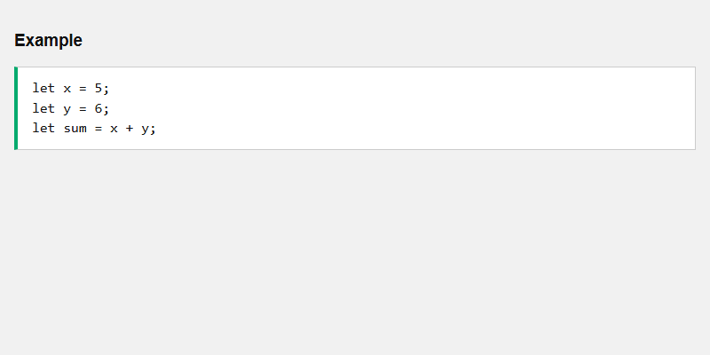

```javascript
let x = 5;
let y = 6;
let sum = x + y;
```

Rendered result:


</details>

<details>
  <summary>Questions and Answers</summary>

## Questions and Answers

### Question 1: What two types of values does JavaScript syntax define?

<details>
<summary>Answer</summary>

- [x] **Literals** (fixed values).
- [x] **Variables** (variable values).

</details>

### Question 2: How are number and string literals written?

<details>
<summary>Answer</summary>

- [x] Numbers: with or without decimals (`10.50`, `1001`).
- [x] Strings: in **double or single quotes**.

</details>

### Question 3: Are JavaScript keywords case-sensitive?

<details>
<summary>Answer</summary>

- [x] **Yes.** `LET` or `Let` is **not** the keyword `let`.

</details>

### Question 4: What are the identifier rules?

<details>
<summary>Answer</summary>

- [x] Start with a letter, `_`, or `$`.
- [x] Digits are allowed after the first character.
- [x] Cannot be a reserved keyword.
- [x] Are case-sensitive.

</details>

### Question 5: What does `(5 + 6) * 10` evaluate to?

<details>
<summary>Answer</summary>

- [x] **110**.

</details>

### Question 6: Are `lastName` and `lastname` the same variable?

<details>
<summary>Answer</summary>

- [x] **No.** Identifiers are **case sensitive**.

</details>

### Question 7: Why are hyphens not allowed in variable names?

<details>
<summary>Answer</summary>

- [x] Hyphens are reserved for **subtractions**.

</details>

### Question 8: Which naming style do JavaScript programmers tend to use?

<details>
<summary>Answer</summary>

- [x] **Lower camel case** (`firstName`, `lastName`).

</details>

</details>

## Summary

Syntax covers **literals** (numbers and quoted strings) and **variables** created with **`let`** / **`const`**. Identifiers must start with a letter, `_`, or `$`, cannot be keywords, and are **case-sensitive**. Use **`=`** to assign and **`+ - * /`** to compute. Expressions such as `(5 + 6) * 10` yield **110**. Prefer **lower camel case**; **hyphens are not allowed**.

## References

- [JS Syntax (W3Schools)](https://www.w3schools.com/js/js_syntax.asp)
- [MDN: Grammar and types](https://developer.mozilla.org/en-US/docs/Web/JavaScript/Guide/Grammar_and_types)
- [MDN: Lexical grammar](https://developer.mozilla.org/en-US/docs/Web/JavaScript/Reference/Lexical_grammar)

</details>

<details>
  <summary>JS Statements</summary>

## Introduction

A computer program is a list of **instructions** to **execute**. Those instructions are **statements**. JavaScript statements run **one by one** in the order they are written. In HTML, the **browser** executes the program. This section covers **semicolons**, **white space**, **line breaks**, **code blocks**, and **keywords**.

## Detailed Explanation

- [x] **What a statement is**
  - Statements are composed of **values**, **operators**, **expressions**, **keywords**, and **comments**.
  - Example statements: `let x, y, z;` then `x = 5;` `y = 6;` `z = x + y;`.
  - `document.getElementById("demo").innerHTML = "Hello Dolly.";` writes into `#demo`.
  - Programs (and statements) are often called **JavaScript code**.
- [x] **Semicolons**
  - Semicolons **separate** statements.
  - Add a semicolon at the end of each **executable** statement.
  - Multiple statements on **one line** are allowed when separated by semicolons: `a = 5; b = 6; c = a + b;`.
  - Ending with a semicolon is **not required**, but **highly recommended**.
- [x] **White space**
  - `let person = "Hege";` and `let person="Hege";` are **equivalent**.
- [x] **Line length and line breaks**
  - Prefer lines **not longer than 80 characters**.
  - If a statement does not fit, break **after an operator**: `document.getElementById("demo").innerHTML =` then `"Hello Dolly!";`.
- [x] **Code blocks**
  - Group statements in **curly brackets** `{...}` to run them **together**.
  - Functions are one place you find blocks. This tutorial uses **2 spaces** of indentation.
- [x] **Keywords**
  - Statements often start with a keyword (`var`, `let`, `const`, `if`, `switch`, `for`, `function`, `return`, `try`, …).
  - Keywords are **reserved** and **cannot** be used as variable names.

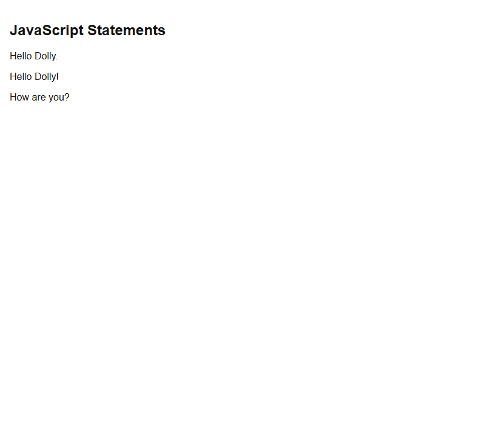

<details>
  <summary>Lab</summary>

## Lab

Run the statements sandbox and confirm **Hello Dolly.** plus the function block output.

### **Overview**

- [ ] Serve `code_sandbox/js-statements/index.html`.
- [ ] Confirm `#demo` is **Hello Dolly.** and the function writes **Hello Dolly!** and **How are you?**
- [ ] Success: the page matches the snapped result.

### **Task 1: Serve and open**

```bash
py -3 -m http.server 8770 --bind 127.0.0.1
```

- [ ] Open `http://127.0.0.1:8770/js-statements/`.


The statements example is running.

</details>

<details>
  <summary>Terminal Commands</summary>

## Terminal Commands

```bash
# from Personal/Files/javascript/code_sandbox
py -3 -m http.server 8770 --bind 127.0.0.1
```

Then open `http://127.0.0.1:8770/js-statements/`.

</details>

<details>
  <summary>Code</summary>

## Code

Sandbox: `code_sandbox/js-statements/index.html`

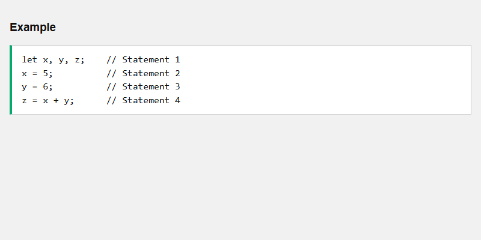

```javascript
let x, y, z; // Statement 1
x = 5; // Statement 2
y = 6; // Statement 3
z = x + y; // Statement 4
```

Rendered result:


</details>

<details>
  <summary>Questions and Answers</summary>

## Questions and Answers

### Question 1: What is a JavaScript statement?

<details>
<summary>Answer</summary>

- [x] A programming **instruction** to be **executed**.
- [x] Statements run **one by one**, in the order they are written.

</details>

### Question 2: Who executes JavaScript in HTML?

<details>
<summary>Answer</summary>

- [x] The **web browser**.

</details>

### Question 3: What are statements composed of?

<details>
<summary>Answer</summary>

- [x] Values, operators, expressions, keywords, and comments.

</details>

### Question 4: Are semicolons required?

<details>
<summary>Answer</summary>

- [x] They **separate** statements.
- [x] They are **not required**, but **highly recommended**.

</details>

### Question 5: Where should you break a long statement?

<details>
<summary>Answer</summary>

- [x] After an **operator**.
- [x] Prefer lines no longer than **80 characters**.

</details>

### Question 6: What is a code block?

<details>
<summary>Answer</summary>

- [x] Statements grouped in **curly brackets** `{...}` to run **together**.
- [x] Functions are a common place for blocks.

</details>

### Question 7: Can you use a keyword as a variable name?

<details>
<summary>Answer</summary>

- [x] **No.** Keywords are **reserved words**.

</details>

### Question 8: How many statements are in `let a = 5; let b = 6; c = a + b;`?

<details>
<summary>Answer</summary>

- [x] **Three** statements, separated by semicolons.

</details>

</details>

## Summary

Statements are instructions the browser runs **in order**. End them with **semicolons** (recommended). White space is flexible; break long lines **after an operator**. Group work in **`{...}`** blocks (as in functions). **Keywords** start many statements and cannot be variable names.

## References

- [JS Statements (W3Schools)](https://www.w3schools.com/js/js_statements.asp)
- [MDN: JavaScript statements](https://developer.mozilla.org/en-US/docs/Web/JavaScript/Reference/Statements)
- [MDN: Lexical grammar — Automatic semicolon insertion](https://developer.mozilla.org/en-US/docs/Web/JavaScript/Reference/Lexical_grammar#automatic_semicolon_insertion)

</details>

<details>
  <summary>JS Comments</summary>

## Introduction

Comments **explain** code and make it **readable**. They can also **prevent execution** when you test alternatives. JavaScript has **single-line** comments (`//`) and **multi-line** comments (`/* ... */`).

## Detailed Explanation

- [x] **Single-line comments**
  - Start with **`//`**.
  - Text from `//` to the **end of the line** is ignored.
  - Use them **before** a line or **at the end** of a line (`let x = 5; // Declare x...`).
- [x] **Multi-line comments**
  - Start with **`/*`** and end with **`*/`**.
  - Any text between them is ignored.
  - Also called a **comment block**.
- [x] **What is most common?**
  - **Single-line** comments are most common.
  - **Block** comments are often used for **formal documentation**.
- [x] **Prevent execution**
  - Suitable for **code testing**.
  - Putting **`//`** in front of a line turns it from executable code into a comment.
  - A **comment block** can disable **multiple** lines.


<details>
  <summary>Lab</summary>

## Lab

Run the comments sandbox. The heading and paragraph should update; commented-out lines must not run.

### **Overview**

- [ ] Serve `code_sandbox/js-comments/index.html`.
- [ ] Confirm **My First Page** and **My first paragraph.**
- [ ] Success: the page matches the snapped result.

### **Task 1: Serve and open**

```bash
py -3 -m http.server 8770 --bind 127.0.0.1
```

- [ ] Open `http://127.0.0.1:8770/js-comments/`.


The comments example is running.

</details>

<details>
  <summary>Terminal Commands</summary>

## Terminal Commands

```bash
# from Personal/Files/javascript/code_sandbox
py -3 -m http.server 8770 --bind 127.0.0.1
```

Then open `http://127.0.0.1:8770/js-comments/`.

</details>

<details>
  <summary>Code</summary>

## Code

Sandbox: `code_sandbox/js-comments/index.html`

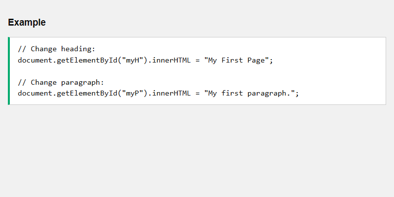

```javascript
// Change heading:
document.getElementById("myH").innerHTML = "My First Page";

// Change paragraph:
document.getElementById("myP").innerHTML = "My first paragraph.";
```

Rendered result:


</details>

<details>
  <summary>Questions and Answers</summary>

## Questions and Answers

### Question 1: What are JavaScript comments for?

<details>
<summary>Answer</summary>

- [x] To **explain** code and make it **readable**.
- [x] To **prevent execution** when testing alternative code.

</details>

### Question 2: How do you write a single-line comment?

<details>
<summary>Answer</summary>

- [x] Start with **`//`**.
- [x] The rest of that line is ignored.

</details>

### Question 3: How do you write a multi-line comment?

<details>
<summary>Answer</summary>

- [x] Start with **`/*`** and end with **`*/`**.

</details>

### Question 4: Which comment style is most common?

<details>
<summary>Answer</summary>

- [x] **Single-line** comments.
- [x] Block comments are often used for **formal documentation**.

</details>

### Question 5: How do you use comments to prevent execution?

<details>
<summary>Answer</summary>

- [x] Put **`//`** in front of a line.
- [x] Wrap **multiple lines** in `/* ... */`.

</details>

</details>

## Summary

Use **`//`** for single-line comments and **`/* ... */`** for blocks. Comments explain code or **disable** it for testing. Single-line comments are most common; blocks are typical for **documentation**.

## References

- [JS Comments (W3Schools)](https://www.w3schools.com/js/js_comments.asp)
- [MDN: Comments](https://developer.mozilla.org/en-US/docs/Web/JavaScript/Reference/Lexical_grammar#comments)

</details>

<details>
  <summary>JS Variables</summary>

## Introduction

Variables are **containers** (labels) for data. You can declare them in **four** ways: automatically, **`var`**, **`let`**, and **`const`**. Modern code uses **`const`** by default and **`let`** when the value must change. Avoid **`var`** and undeclared variables.

## Detailed Explanation

- [x] **Declaring with `let` and `const`**
  - `let x = 5; let y = 6; let z = x + y;`
  - `const x = 5; const y = 6; const z = x + y;`
- [x] **Identifiers**
  - Names can be short (`x`) or descriptive (`carName`).
  - Must not start with a **number** (so identifiers are distinct from numbers).
  - **`_`** is treated as a letter (`_lastName`). A convention is to start “private” names with underscore.
  - **`$`** is treated as a letter (`$`, `$$$`, `$myMoney`). Libraries often use `$` as an alias for a main function.
- [x] **Declaring**
  - Creating a variable is **declaring** it.
  - After `let carName;` the value is **`undefined`** until you assign with **`=`**.
  - Most often you assign when you declare: `let carName = "Volvo";`.
- [x] **When to use `const` vs `let`**
  - Always use **`const`** if the value should not change.
  - Mixed example: `const price1 = 5; const price2 = 6; let total = price1 + price2;` — prices cannot change; **total** can.
- [x] **Automatic declaration (not recommended)**
  - Undeclared variables are declared on first use: `x = 5; y = 6; z = x + y;`.
  - Declare **all** variables at the **beginning** of a script.
- [x] **`var` (not recommended)**
  - Used in all JavaScript **before 2015**.
  - **`let`** and **`const`** were new in **2015**.
- [x] **Practice**
  - Always declare variables.
  - Always use `const` if the value (or the type, for arrays/objects) should not change.
  - Only use `let` if you cannot use `const`.
  - Avoid `var`.
- [x] **Data types (preview)**
  - Think of **numbers** (no quotes) and **strings** (quotes) for now.
  - `let x = 5 + 2 + 3;` is **10**.
  - `let x = "John" + " " + "Doe";` is **John Doe**.
  - `let x = "5" + 2 + 3;` is **`523`** — a number in quotes makes the rest **concatenate** as strings.
  - The equal-to operator is **`==`**, not a single `=`.

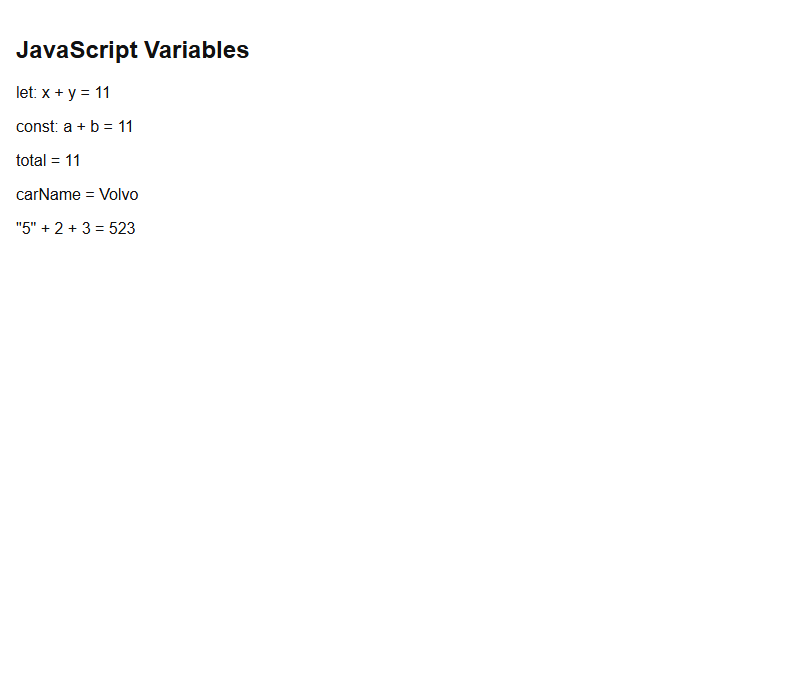

<details>
  <summary>Lab</summary>

## Lab

Run the variables sandbox and confirm `let`/`const` sums, mixed `total`, `carName`, and `"5" + 2 + 3` → **523**.

### **Overview**

- [ ] Serve `code_sandbox/js-variables/index.html`.
- [ ] Success: the page matches the snapped result.

### **Task 1: Serve and open**

```bash
py -3 -m http.server 8770 --bind 127.0.0.1
```

- [ ] Open `http://127.0.0.1:8770/js-variables/`.


</details>

<details>
  <summary>Terminal Commands</summary>

## Terminal Commands

```bash
# from Personal/Files/javascript/code_sandbox
py -3 -m http.server 8770 --bind 127.0.0.1
```

Then open `http://127.0.0.1:8770/js-variables/`.

</details>

<details>
  <summary>Code</summary>

## Code

Sandbox: `code_sandbox/js-variables/index.html`

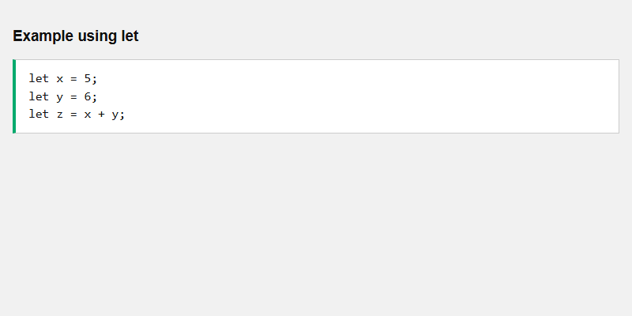

```javascript
let x = 5;
let y = 6;
let z = x + y;
```

Rendered result:


</details>

<details>
  <summary>Questions and Answers</summary>

## Questions and Answers

### Question 1: What is a JavaScript variable?

<details>
<summary>Answer</summary>

- [x] A **container** (label) for storing data.

</details>

### Question 2: How should you declare variables in modern JavaScript?

<details>
<summary>Answer</summary>

- [x] Use **`const`** if the value should not change.
- [x] Use **`let`** only if you cannot use `const`.
- [x] Avoid **`var`** and undeclared variables.

</details>

### Question 3: What is a variable’s value right after `let carName;`?

<details>
<summary>Answer</summary>

- [x] **`undefined`** until you assign with **`=`**.

</details>

### Question 4: Can identifiers start with a number?

<details>
<summary>Answer</summary>

- [x] **No.** That is how JavaScript distinguishes identifiers from numbers.

</details>

### Question 5: What does `"5" + 2 + 3` evaluate to?

<details>
<summary>Answer</summary>

- [x] **`523`** (string concatenation).
- [x] A number in quotes makes the rest treated as strings.

</details>

### Question 6: When were `let` and `const` added?

<details>
<summary>Answer</summary>

- [x] **2015** (ES6).
- [x] Before that, code used **`var`**.

</details>

</details>

## Summary

Variables hold data. Prefer **`const`**, then **`let`**; avoid **`var`** and automatic declaration. Names cannot start with a digit; `_` and `$` count as letters. Assign with **`=`**. Putting a number in **quotes** concatenates instead of adding (`"5" + 2 + 3` → **523**).

## References

- [JS Variables (W3Schools)](https://www.w3schools.com/js/js_variables.asp)
- [MDN: let](https://developer.mozilla.org/en-US/docs/Web/JavaScript/Reference/Statements/let)
- [MDN: const](https://developer.mozilla.org/en-US/docs/Web/JavaScript/Reference/Statements/const)
- [MDN: var](https://developer.mozilla.org/en-US/docs/Web/JavaScript/Reference/Statements/var)

</details>

<details>
  <summary>JS Let</summary>

## Introduction

**`let`** was added in **ES6 (2015)**. Variables declared with `let` have **block scope**, must be **declared before use**, and **cannot be redeclared** in the same scope. Prefer `let`/`const` over **`var`**.

## Detailed Explanation

- [x] **Block scope**
  - Before ES6, JavaScript had **global** and **function** scope, not block scope.
  - `let` and `const` provide **block scope**: a variable inside `{ }` **cannot** be used outside.
- [x] **Function scope**
  - Inside a function, `var`, `let`, and `const` all have **function scope**.
- [x] **`var` is not block scoped**
  - `var` inside `{ }` **can** be used outside the block (global if not in a function).
- [x] **Cannot redeclare with `let`**
  - `let x = "John Doe"; let x = 0;` is **not allowed** in the same scope.
  - `var` **can** be redeclared, which can overwrite values inside and **outside** a block.
  - Redeclaring `let` **inside** a block does **not** redeclare the outer `let`.
- [x] **Hoisting**
  - `var` is hoisted and can be used before the declaration line.
  - `let` is hoisted but **not initialized** — using it before the declaration is a **`ReferenceError`**.

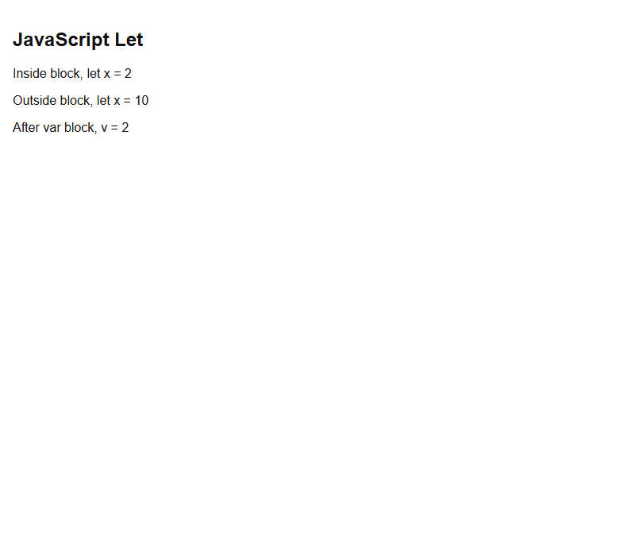

<details>
  <summary>Lab</summary>

## Lab

Run `code_sandbox/js-let/index.html` and confirm inner-block `let x` is **2** while outer `let x` stays **10**, and that `var` leaked to **2**.

### **Overview**

- [ ] Open `http://127.0.0.1:8770/js-let/` after serving `code_sandbox`.
- [ ] Success: the page matches the snapped result.


</details>

<details>
  <summary>Terminal Commands</summary>

## Terminal Commands

```bash
# from Personal/Files/javascript/code_sandbox
py -3 -m http.server 8770 --bind 127.0.0.1
```

Then open `http://127.0.0.1:8770/js-let/`.

</details>

<details>
  <summary>Code</summary>

## Code

Sandbox: `code_sandbox/js-let/index.html`

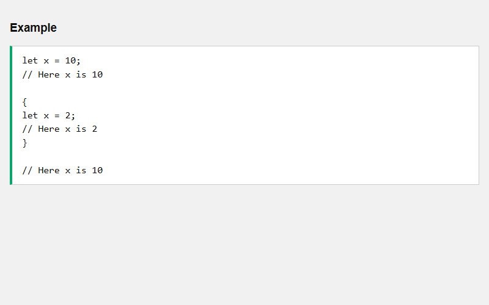

```javascript
let x = 10;
{
  let x = 2;
}
// Here x is 10
```

Rendered result:


</details>

<details>
  <summary>Questions and Answers</summary>

## Questions and Answers

### Question 1: When was `let` introduced?

<details>
<summary>Answer</summary>

- [x] **ES6 (2015)**.

</details>

### Question 2: What scope does `let` have?

<details>
<summary>Answer</summary>

- [x] **Block scope**.
- [x] A `let` inside `{ }` cannot be used outside.

</details>

### Question 3: Can you redeclare a `let` variable in the same scope?

<details>
<summary>Answer</summary>

- [x] **No.**

</details>

### Question 4: Does `var` have block scope?

<details>
<summary>Answer</summary>

- [x] **No.** `var` inside a block can still be used **outside**.

</details>

### Question 5: What happens if you use `let` before it is declared?

<details>
<summary>Answer</summary>

- [x] A **`ReferenceError`**.
- [x] `let` is hoisted but **not initialized**.

</details>

</details>

## Summary

**`let`** (ES6) is **block-scoped**, cannot be **redeclared** in the same scope, and cannot be used before its declaration (`ReferenceError`). **`var`** can leak out of blocks and can be redeclared. Modern code avoids `var`.

## References

- [JS Let (W3Schools)](https://www.w3schools.com/js/js_let.asp)
- [MDN: let](https://developer.mozilla.org/en-US/docs/Web/JavaScript/Reference/Statements/let)
- [MDN: JavaScript Hoisting](https://developer.mozilla.org/en-US/docs/Glossary/Hoisting)

</details>

<details>
  <summary>JS Const</summary>

## Introduction

**`const`** (ES6, 2015) declares a **block-scoped** binding that **cannot be redeclared or reassigned**. It must be **assigned when declared**. It is a constant **reference**, so you can still change **array elements** and **object properties**.

## Detailed Explanation

- [x] **Cannot reassign**
  - `const PI = 3.141592653589793; PI = 3.14;` is an **error**.
- [x] **Must be assigned at declaration**
  - Correct: `const PI = 3.14159265359;`
  - Incorrect: `const PI;` then `PI = ...`
- [x] **When to use `const`**
  - When you know the value should **not** be changed.
  - Typical: a new **Array**, **Object**, **Function**, or **RegExp**.
- [x] **Constant arrays and objects**
  - You **can** change elements (`cars[0] = "Toyota"`) and **push**.
  - You **cannot** reassign the array (`cars = [...]`).
  - You **can** change/add object properties.
  - You **cannot** reassign the object.
- [x] **Block scope and hoisting**
  - Like `let`, block `const x` is **not** the outer `x`.
  - Using `const` before declaration is a **`ReferenceError`**.

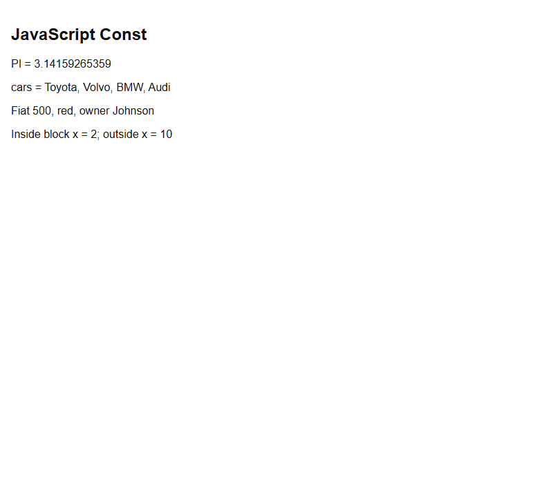

<details>
  <summary>Lab</summary>

## Lab

Run `code_sandbox/js-const/index.html` and confirm `PI`, mutated `cars` / `car`, and block-scoped `x`.

### **Overview**

- [ ] Open `http://127.0.0.1:8770/js-const/`.
- [ ] Success: the page matches the snapped result.


</details>

<details>
  <summary>Terminal Commands</summary>

## Terminal Commands

```bash
# from Personal/Files/javascript/code_sandbox
py -3 -m http.server 8770 --bind 127.0.0.1
```

Then open `http://127.0.0.1:8770/js-const/`.

</details>

<details>
  <summary>Code</summary>

## Code

Sandbox: `code_sandbox/js-const/index.html`

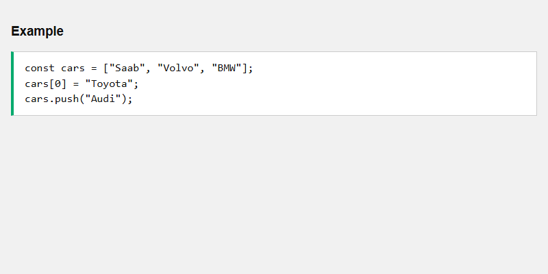

```javascript
const cars = ["Saab", "Volvo", "BMW"];
cars[0] = "Toyota";
cars.push("Audi");
```

Rendered result:


</details>

<details>
  <summary>Questions and Answers</summary>

## Questions and Answers

### Question 1: Can you reassign a `const` variable?

<details>
<summary>Answer</summary>

- [x] **No.** Reassignment throws an error.

</details>

### Question 2: Must `const` be assigned when declared?

<details>
<summary>Answer</summary>

- [x] **Yes.** `const PI;` then assign later is **incorrect**.

</details>

### Question 3: Does `const` freeze array/object contents?

<details>
<summary>Answer</summary>

- [x] **No.** It is a constant **reference**.
- [x] You can change **elements** and **properties**.
- [x] You cannot **reassign** the array or object.

</details>

### Question 4: What scope does `const` have?

<details>
<summary>Answer</summary>

- [x] **Block scope**, like `let`.

</details>

</details>

## Summary

**`const`** is block-scoped, must be initialized, and cannot be reassigned. It locks the **binding**, not the insides of objects/arrays. Use it when the reference should not change.

## References

- [JS Const (W3Schools)](https://www.w3schools.com/js/js_const.asp)
- [MDN: const](https://developer.mozilla.org/en-US/docs/Web/JavaScript/Reference/Statements/const)

</details>

<details>
  <summary>JS Types</summary>

## Introduction

A JavaScript variable can hold **8 types** of data. Use **`typeof`** to find the type of a value. This section covers **strings**, **numbers**, **booleans**, **undefined**, and **empty strings**.

## Detailed Explanation

- [x] **Eight datatypes (examples on the page)**
  - **String**, **Number**, **BigInt**, **Boolean**, **Object** (including arrays and dates), **Undefined**, **Null**, **Symbol**.
- [x] **`typeof`**
  - Returns the type of a variable or expression: `typeof "John"` → `"string"`; `typeof 3.14` → `"number"`.
- [x] **Strings**
  - A series of characters in **single or double quotes**.
  - Quotes inside a string are allowed if they **do not match** the surrounding quotes (`"It's alright"`).
- [x] **Numbers**
  - Stored as **decimal / floating point**.
  - With or without decimals (`34.00`, `34`).
  - Scientific notation: `123e5` is **12300000**; `123e-5` is **0.00123**.
- [x] **Booleans**
  - Only **`true`** or **`false`**.
  - Comparison operators (`==`, `!=`, `<`, `>`) return booleans.
- [x] **`undefined` vs empty**
  - A variable declared with no value is **`undefined`** (type and value).
  - An empty string `""` is a **legal string**, not undefined.

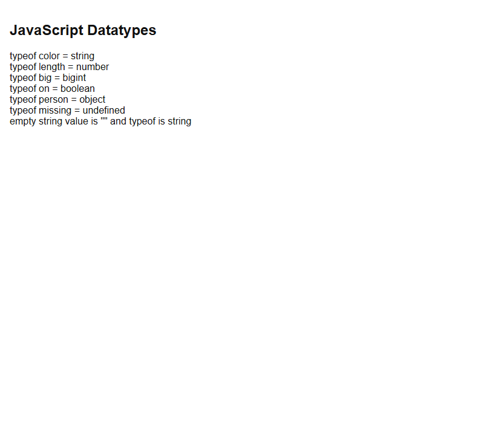

<details>
  <summary>Lab</summary>

## Lab

Run `code_sandbox/js-types/index.html` and confirm `typeof` results for string, number, bigint, boolean, object, undefined, and empty string.

### **Overview**

- [ ] Open `http://127.0.0.1:8770/js-types/`.
- [ ] Success: the page matches the snapped result.


</details>

<details>
  <summary>Terminal Commands</summary>

## Terminal Commands

```bash
# from Personal/Files/javascript/code_sandbox
py -3 -m http.server 8770 --bind 127.0.0.1
```

Then open `http://127.0.0.1:8770/js-types/`.

</details>

<details>
  <summary>Code</summary>

## Code

Sandbox: `code_sandbox/js-types/index.html`

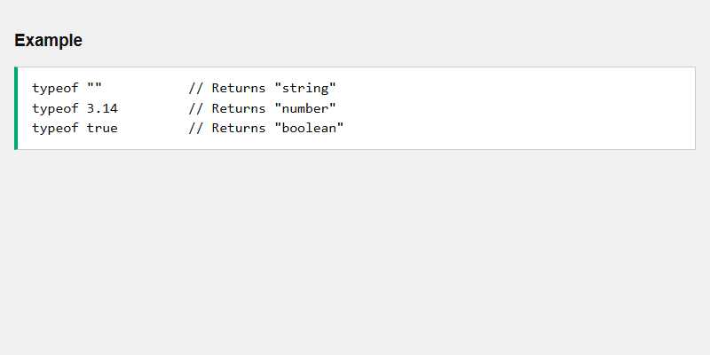

```javascript
typeof ""; // Returns "string"
typeof 3.14; // Returns "number"
typeof true; // Returns "boolean"
```

Rendered result:


</details>

<details>
  <summary>Questions and Answers</summary>

## Questions and Answers

### Question 1: How do you find a value’s type?

<details>
<summary>Answer</summary>

- [x] The **`typeof`** operator.

</details>

### Question 2: What type is `let x = 7.5`?

<details>
<summary>Answer</summary>

- [x] **Number** (all JS numbers are floating point).

</details>

### Question 3: What is the type of a declared-but-unassigned variable?

<details>
<summary>Answer</summary>

- [x] **`undefined`**.

</details>

### Question 4: Is an empty string the same as `undefined`?

<details>
<summary>Answer</summary>

- [x] **No.** `""` has a legal value and type **`string`**.

</details>

</details>

## Summary

JavaScript has **eight** datatypes. **`typeof`** reports the type. Strings use quotes; numbers are floats (optional scientific notation); booleans are `true`/`false`. Unassigned variables are **`undefined`**; `""` is still a string.

## References

- [JS Types (W3Schools)](https://www.w3schools.com/js/js_types.asp)
- [MDN: typeof](https://developer.mozilla.org/en-US/docs/Web/JavaScript/Reference/Operators/typeof)
- [MDN: JavaScript data types](https://developer.mozilla.org/en-US/docs/Web/JavaScript/Data_structures)

</details>

<details>
  <summary>JS Operators</summary>

## Introduction

Operators perform **math and logic**. This page introduces **assignment (`=`)**, **addition (`+`)**, **multiplication (`*`)**, **comparison (`>`)**, **string concatenation**, and **logical** operators (`&&`, `||`, `!`).

## Detailed Explanation

- [x] **Core examples**
  - Assignment: `let x = 10;`
  - Addition: `let z = x + y;`
  - Multiplication: `let z = x * y;`
  - Arithmetic mix: `let x = (100 + 50) * a;`
- [x] **Arithmetic operators**
  - `+ - * ** / % ++ --` (full table in the Arithmetic chapter).
- [x] **String addition**
  - `+` on strings is **concatenation**: `"John" + " " + "Doe"`.
  - `+=` can append strings: `text1 += "nice day"`.
- [x] **Numbers vs strings**
  - `5 + 5` is **10** (number).
  - `"5" + 5` is **`"55"`** (string).
  - `"Hello" + 5` is **`"Hello5"`**.
  - If you add a number and a string, the result is a **string**.
- [x] **Assignment / comparison / logical**
  - `+=` adds to a variable (`x += 5`).
  - Comparison always returns **true or false** (`x > 8`).
  - Strings compare **alphabetically** (`"A" < "B"`).
  - Logical: `&&` and, `||` or, `!` not (Logical chapter).

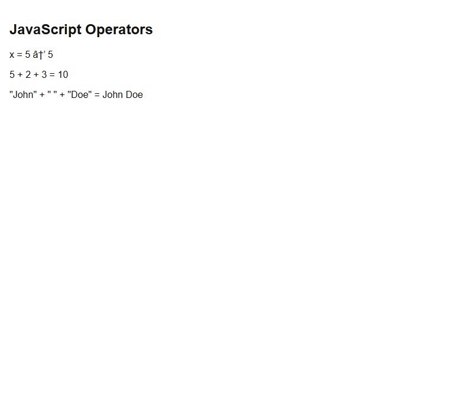

<details>
  <summary>Lab</summary>

## Lab

Run `code_sandbox/js-operators/index.html` and confirm assignment, `5 + 2 + 3`, and `"John Doe"`.


</details>

<details>
  <summary>Terminal Commands</summary>

## Terminal Commands

```bash
# from Personal/Files/javascript/code_sandbox
py -3 -m http.server 8770 --bind 127.0.0.1
```

Then open `http://127.0.0.1:8770/js-operators/`.

</details>

<details>
  <summary>Code</summary>

## Code

Sandbox: `code_sandbox/js-operators/index.html`

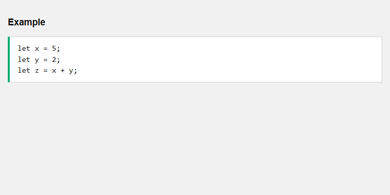

```javascript
let x = 5;
let y = 2;
let z = x + y;
```

Rendered result:


</details>

<details>
  <summary>Questions and Answers</summary>

## Questions and Answers

### Question 1: What does `=` do vs `+` vs `*` vs `>`?

<details>
<summary>Answer</summary>

- [x] `=` **assigns**.
- [x] `+` **adds** (or concatenates strings).
- [x] `*` **multiplies**.
- [x] `>` **compares**.

</details>

### Question 2: What is `5 + "5"`?

<details>
<summary>Answer</summary>

- [x] **`"55"`** (a string).
- [x] Adding a number and a string returns a **string**.

</details>

### Question 3: What is `+` called when used on strings?

<details>
<summary>Answer</summary>

- [x] The **concatenation** operator.

</details>

</details>

## Summary

Use **`=`** to assign, **`+ - * /`** for arithmetic, **`+`/`+=`** to join strings, and comparison/logical operators for `true`/`false`. Mixing a number with a string concatenates.

## References

- [JS Operators (W3Schools)](https://www.w3schools.com/js/js_operators.asp)
- [MDN: Expressions and operators](https://developer.mozilla.org/en-US/docs/Web/JavaScript/Guide/Expressions_and_operators)

</details>

<details>
  <summary>JS Arithmetic</summary>

## Introduction

Arithmetic operators work on **numbers** (literals or variables). The numbers are **operands**; the symbol is the **operator**. This section covers `+ - * / % ++ -- **` and **precedence**.

## Detailed Explanation

- [x] **Operators and operands**
  - Example: `100 + 50` — operands `100` and `50`, operator `+`.
- [x] **The operators**
  - `+` add, `-` subtract, `*` multiply, `/` divide.
  - `%` **modulus** — the **remainder**.
  - `++` increment, `--` decrement.
  - `**` exponentiation (`x ** y` is the same as `Math.pow(x, y)`).
- [x] **Precedence**
  - `*` and `/` happen **before** `+` and `-`.
  - `100 + 50 * 3` is **not** `(100 + 50) * 3`.
  - **Parentheses** change the order: `(100 + 50) * 3`.
  - Same-precedence ops run **left to right** (`100 + 50 - 3`).


<details>
  <summary>Lab</summary>

## Lab

Run `code_sandbox/js-arithmetic/index.html` and confirm `(100 + 50) * 3` plus the other operator results.


</details>

<details>
  <summary>Terminal Commands</summary>

## Terminal Commands

```bash
# from Personal/Files/javascript/code_sandbox
py -3 -m http.server 8770 --bind 127.0.0.1
```

Then open `http://127.0.0.1:8770/js-arithmetic/`.

</details>

<details>
  <summary>Code</summary>

## Code

Sandbox: `code_sandbox/js-arithmetic/index.html`


```javascript
let a = 3;
let x = (100 + 50) * a;
```

Rendered result:


</details>

<details>
  <summary>Questions and Answers</summary>

## Questions and Answers

### Question 1: What does `%` return?

<details>
<summary>Answer</summary>

- [x] The **division remainder** (modulus).

</details>

### Question 2: What does `++` do?

<details>
<summary>Answer</summary>

- [x] It **increments** the number by 1.

</details>

### Question 3: Is `x ** y` the same as `Math.pow(x, y)`?

<details>
<summary>Answer</summary>

- [x] **Yes.**

</details>

### Question 4: In `100 + 50 * 3`, what runs first?

<details>
<summary>Answer</summary>

- [x] **Multiplication**, so it is not `(100 + 50) * 3`.
- [x] Use **parentheses** to add first.

</details>

</details>

## Summary

Arithmetic uses operands and operators: `+ - * / % ++ -- **`. `**` matches `Math.pow`. Multiplication/division precede addition/subtraction unless you use **parentheses**.

## References

- [JS Arithmetic (W3Schools)](https://www.w3schools.com/js/js_arithmetic.asp)
- [MDN: Arithmetic operators](https://developer.mozilla.org/en-US/docs/Web/JavaScript/Reference/Operators#arithmetic_operators)
- [JavaScript Operator Precedence Values](https://www.w3schools.com/js/js_precedence.asp)

</details>

<details>
  <summary>JS Assignment</summary>

## Introduction

Assignment operators **put values into variables**. The simple operator is **`=`**. Compound forms (`+=`, `-=`, `*=`, `**=`, `/=`, `%=`) update in place. ES2020 adds logical assignment (`&&=`, `||=`, `??=`).

## Detailed Explanation

- [x] **Given `x = 10` and `y = 5`**
  - `=` assigns; `+=` adds; `-=` subtracts; `*=` multiplies; `**=` exponentiates; `/=` divides; `%=` remainder.
  - `x += 5` is the same as `x = x + 5`.
- [x] **Strings**
  - `=` assigns a string.
  - `+=` **concatenates** onto a string (`text1 += "nice day"`).
- [x] **Logical assignment (ES2020)**
  - `&&=` assigns the second value if the first is **true**.
  - `||=` assigns the second value if the first is **false**.
  - `??=` assigns the second value if the first is **`null` or `undefined`**.
- [x] **Spread `...`**
  - Splits iterables into individual elements (mentioned on this page).


<details>
  <summary>Lab</summary>

## Lab

Run `code_sandbox/js-assignment/index.html` and confirm `x += 5` from 10 → **15**, and the concatenated sentence.


</details>

<details>
  <summary>Terminal Commands</summary>

## Terminal Commands

```bash
# from Personal/Files/javascript/code_sandbox
py -3 -m http.server 8770 --bind 127.0.0.1
```

Then open `http://127.0.0.1:8770/js-assignment/`.

</details>

<details>
  <summary>Code</summary>

## Code

Sandbox: `code_sandbox/js-assignment/index.html`


```javascript
let x = 10;
x += 5;
```

Rendered result:


</details>

<details>
  <summary>Questions and Answers</summary>

## Questions and Answers

### Question 1: What is `x += 10` if `x` started at 5?

<details>
<summary>Answer</summary>

- [x] **15.** Same as `x = x + 10`.

</details>

### Question 2: Can `+=` be used on strings?

<details>
<summary>Answer</summary>

- [x] **Yes.** It **concatenates**.

</details>

### Question 3: What does `??=` do?

<details>
<summary>Answer</summary>

- [x] Assigns the right-hand value if the left is **`null` or `undefined`**.
- [x] ES2020 feature.

</details>

</details>

## Summary

**`=`** assigns. **`+= -= \*= **= /= %=`** update in place (`x += y`means`x = x + y`). On strings, **`+=` concatenates**. Logical assignment (`&&= ||= ??=`) is ES2020.

## References

- [JS Assignment (W3Schools)](https://www.w3schools.com/js/js_assignment.asp)
- [MDN: Assignment operators](https://developer.mozilla.org/en-US/docs/Web/JavaScript/Reference/Operators/Assignment)

</details>

<details>
  <summary>JS Comparisons</summary>

## Introduction

Comparison operators compare two values and **always return `true` or `false`**. Use them in **conditional statements**. Watch **`==` vs `===`** and comparisons across **types**.

## Detailed Explanation

- [x] **Operators (given `x = 5`)**
  - `==` equal to (`x == 8` false, `x == 5` true, `x == "5"` **true**).
  - `===` equal **value and type** (`x === 5` true, `x === "5"` **false**).
  - `!=` / `!==` not equal / not equal value or type.
  - `> < >= <=` greater/less (or equal).
- [x] **Strings**
  - The same operators work on strings.
  - Strings compare **alphabetically** (`"A" < "B"`).
- [x] **Different types**
  - Comparing a string with a number **converts the string to a number**.
  - Empty string converts to **0**. A non-numeric string becomes **`NaN`** (comparison is **false**).
  - `"2" > "12"` is **true** (alphabetically, `"2"` > `"12"`).
  - Convert to the proper type **before** comparing for a secure result.


<details>
  <summary>Lab</summary>

## Lab

Run `code_sandbox/js-comparisons/index.html` and confirm `==` vs `===` and `"A" < "B"`.


</details>

<details>
  <summary>Terminal Commands</summary>

## Terminal Commands

```bash
# from Personal/Files/javascript/code_sandbox
py -3 -m http.server 8770 --bind 127.0.0.1
```

Then open `http://127.0.0.1:8770/js-comparisons/`.

</details>

<details>
  <summary>Code</summary>

## Code

Sandbox: `code_sandbox/js-comparisons/index.html`


```javascript
let x = 5;
x == 8; // false
x != 8; // true
```

Rendered result:


</details>

<details>
  <summary>Questions and Answers</summary>

## Questions and Answers

### Question 1: What do comparison operators always return?

<details>
<summary>Answer</summary>

- [x] **`true` or `false`**.

</details>

### Question 2: What is the difference between `==` and `===`?

<details>
<summary>Answer</summary>

- [x] `==` equal **to** (type conversion allowed).
- [x] `===` equal **value and type**.
- [x] `5 == "5"` is true; `5 === "5"` is false.

</details>

### Question 3: How are strings compared?

<details>
<summary>Answer</summary>

- [x] **Alphabetically.**

</details>

### Question 4: Why might `"2" < "12"` be false?

<details>
<summary>Answer</summary>

- [x] As strings, they compare as text, not as numbers.

</details>

</details>

## Summary

Comparisons return booleans. Prefer **`===` / `!==`** when types matter. Strings compare alphabetically. Mixed string/number compares coerce; convert first for predictable results.

## References

- [JS Comparisons (W3Schools)](https://www.w3schools.com/js/js_comparisons.asp)
- [MDN: Comparison operators](https://developer.mozilla.org/en-US/docs/Web/JavaScript/Reference/Operators#relational_operators)

</details>

<details>
  <summary>JS Conditional</summary>

## Introduction

**Conditional statements** run different code for different **true/false** conditions. This overview covers **`if`**, **`else`**, **`else if`**, **`switch`**, and the **ternary** `? :`.

## Detailed Explanation

- [x] **When to use them**
  - Perform **different actions** for different conditions.
- [x] **`if`**
  - Run a block if a condition is **true**: `if (condition) { ... }`
- [x] **`else`**
  - Run a block if the same condition is **false**.
- [x] **`else if`**
  - Test a **new** condition if the first was false.
- [x] **`switch`**
  - Many alternative blocks: `switch(expression) { case x: ... break; default: ... }`
- [x] **Ternary `? :`**
  - Shorthand for if/else: `condition ? expression1 : expression2`


<details>
  <summary>Lab</summary>

## Lab

Run `code_sandbox/js-conditional/index.html`. With `hour = 19` you should see **Good evening**; with `age = 18` the ternary should be **Old enough**.


</details>

<details>
  <summary>Terminal Commands</summary>

## Terminal Commands

```bash
# from Personal/Files/javascript/code_sandbox
py -3 -m http.server 8770 --bind 127.0.0.1
```

Then open `http://127.0.0.1:8770/js-conditional/`.

</details>

<details>
  <summary>Code</summary>

## Code

Sandbox: `code_sandbox/js-conditional/index.html`


```javascript
if (hour < 18) {
  greeting = "Good day";
} else {
  greeting = "Good evening";
}
```

Rendered result:


</details>

<details>
  <summary>Questions and Answers</summary>

## Questions and Answers

### Question 1: What does `if` do?

<details>
<summary>Answer</summary>

- [x] Runs a block if the condition is **true**.

</details>

### Question 2: When do you use `else if`?

<details>
<summary>Answer</summary>

- [x] To test a **new** condition after the first was **false**.

</details>

### Question 3: What is `? :`?

<details>
<summary>Answer</summary>

- [x] The **ternary** operator, shorthand for if/else: `condition ? expression1 : expression2`.

</details>

### Question 4: When is `switch` useful?

<details>
<summary>Answer</summary>

- [x] When you need **many alternative** code blocks.

</details>

</details>

## Summary

Conditionals choose code from a true/false test: **`if`**, **`else`**, **`else if`**, **`switch`**, or ternary **`? :`**. Later chapters cover each in more detail.

## References

- [JS Conditional (W3Schools)](https://www.w3schools.com/js/js_conditionals.asp)
- [MDN: if...else](https://developer.mozilla.org/en-US/docs/Web/JavaScript/Reference/Statements/if...else)
- [MDN: switch](https://developer.mozilla.org/en-US/docs/Web/JavaScript/Reference/Statements/switch)
- [MDN: Conditional (ternary) operator](https://developer.mozilla.org/en-US/docs/Web/JavaScript/Reference/Operators/Conditional_operator)

</details>

<details>
  <summary>JS If Conditions</summary>

## Introduction

The **`if`** statement runs a block when a condition is **true**. Write **`if` in lowercase** — `If` or `IF` is a JavaScript **error**. Nested `if` works, but **`&&`** is often clearer.

## Detailed Explanation

- [x] **Syntax**
  - `if (condition) { // code if true }`
  - **`if` must be lowercase.**
- [x] **Greeting example**
  - `if (hour < 18) { greeting = "Good day"; }`
- [x] **Driving example**
  - If `age >= 18`, set text to **"You can drive"**.
- [x] **Nested `if`**
  - You can put an `if` inside another `if` (country then age).
  - Nested `if` can make code **more complex**.
  - A better solution is the logical **AND** operator: `if (country == "USA" && age >= 16)`.


<details>
  <summary>Lab</summary>

## Lab

Run `code_sandbox/js-if-conditions/index.html`. Confirm the hour-based greeting and that `time = 20` takes the **else** path (**Good evening**).


</details>

<details>
  <summary>Terminal Commands</summary>

## Terminal Commands

```bash
# from Personal/Files/javascript/code_sandbox
py -3 -m http.server 8770 --bind 127.0.0.1
```

Then open `http://127.0.0.1:8770/js-if-conditions/`.

</details>

<details>
  <summary>Code</summary>

## Code

Sandbox: `code_sandbox/js-if-conditions/index.html`


```javascript
if (new Date().getHours() < 18) {
  document.getElementById("demo").innerHTML = "Good day!";
}
```

Rendered result:


</details>

<details>
  <summary>Questions and Answers</summary>

## Questions and Answers

### Question 1: Must `if` be lowercase?

<details>
<summary>Answer</summary>

- [x] **Yes.** `If` or `IF` causes a JavaScript **error**.

</details>

### Question 2: When does the `if` block run?

<details>
<summary>Answer</summary>

- [x] When the condition is **true**.

</details>

### Question 3: How can you avoid nested `if` for two checks?

<details>
<summary>Answer</summary>

- [x] Use logical **AND**: `if (country == "USA" && age >= 16)`.

</details>

</details>

## Summary

**`if`** (lowercase only) runs a block when a condition is true. You can nest `if`s, but combining conditions with **`&&`** is often simpler. `else` / `else if` are covered in the surrounding conditional chapters.

## References

- [JS If Conditions (W3Schools)](https://www.w3schools.com/js/js_if.asp)
- [MDN: if...else](https://developer.mozilla.org/en-US/docs/Web/JavaScript/Reference/Statements/if...else)
- [MDN: Logical AND (&&)](https://developer.mozilla.org/en-US/docs/Web/JavaScript/Reference/Operators/Logical_AND)

</details>
