# JavaScript Tutorial — Part 3

Continues from [Part 2](./tutorial2.md). Starts at **HTML DOM**.

**[Back to PART 2](./tutorial2.md)**

<details>
  <summary>HTML DOM</summary>

## Introduction

The HTML DOM is the browser’s tree of nodes for a page. JavaScript uses that tree to read and change HTML.

This section has **11** examples:

- [x] **Example 1:** Document node — owner of the tree [View](#html-dom-example-01)
- [x] **Example 2:** Element nodes — html, body, headings, tags [View](#html-dom-example-02)
- [x] **Example 3:** Attribute node — href on a link [View](#html-dom-example-03)
- [x] **Example 4:** Text node — the words inside a heading [View](#html-dom-example-04)
- [x] **Example 5:** Access an element by id and set innerHTML [View](#html-dom-example-05)
- [x] **Example 6:** id is HTML, getElementById is a method, innerHTML is a property [View](#html-dom-example-06)
- [x] **Example 7:** What you will learn — change element content [View](#html-dom-example-07)
- [x] **Example 8:** What you will learn — change CSS from JavaScript [View](#html-dom-example-08)
- [x] **Example 9:** What you will learn — add and delete elements [View](#html-dom-example-09)
- [x] **Example 10:** What you will learn — react to events [View](#html-dom-example-10)
- [x] **Example 11:** W3C DOM: Core, XML, and HTML [View](#html-dom-example-11)

## Detailed Explanation

- [x] Document / Element / Attribute / Text are different **node types**.
- [x] `getElementById` + `innerHTML` is the first practical access pattern.
- [x] The DOM is a W3C/WHATWG standard (**Core**, **XML**, **HTML** parts).

<a id="html-dom-example-01"></a>

### **Example 1: Document node — owner of the tree**

- [x] When a page loads, the browser builds a **DOM tree**. The **Document** node owns every other node.
- [x] `document` is that object. It is not an HTML tag; it is the programming model of the page.
- [x] `document.nodeType` is **9** (`DOCUMENT_NODE`). `document.nodeName` is **`#document`**.
- [x] You always start from `document` when you look up elements, create nodes, or change the page.

Sandbox: `code_sandbox/html-dom/document-node.html`

```html
<p id="demo"></p>
<script>
document.getElementById("demo").innerText =
  "nodeType=" + document.nodeType +
  " nodeName=" + document.nodeName;
</script>
```


- [x] **Outcome:** The running page prints **nodeType=9 nodeName=#document** — the Document is the tree owner.

<a id="html-dom-example-02"></a>

### **Example 2: Element nodes — html, body, headings, tags**

- [x] Most visible parts of a page are **Element** nodes: `<html>`, `<body>`, `<h1>`, `<p>`, `<a>`.
- [x] Element `nodeType` is **1**. `nodeName` is the tag name in **uppercase** (`P`, `H1`).
- [x] Elements can nest: the `<html>` element contains `<head>` and `<body>`, which contain more elements.
- [x] Selecting an element with `getElementById` returns that Element object so you can read or change it.

Sandbox: `code_sandbox/html-dom/element-nodes.html`

```html
<h1 id="hdr">My Header</h1>
<p id="intro">Hello</p>
<script>
const h = document.getElementById("hdr");
const p = document.getElementById("intro");
document.getElementById("demo").innerText =
  h.nodeName + " type=" + h.nodeType + "\n" +
  p.nodeName + " type=" + p.nodeType;
</script>
```


- [x] **Outcome:** **H1 type=1** and **P type=1** — both are Element nodes.

<a id="html-dom-example-03"></a>

### **Example 3: Attribute node — href on a link**

- [x] Attributes such as `href`, `id`, and `src` live on elements as **attribute nodes** (or as properties).
- [x] `element.getAttribute("href")` reads the HTML attribute string.
- [x] `element.attributes` is a NamedNodeMap of those attributes.
- [x] Changing `a.href` (or `setAttribute`) updates the live link the browser uses.

Sandbox: `code_sandbox/html-dom/attribute-node.html`

```html
<a id="w3" href="https://www.w3schools.com">W3Schools</a>
<script>
const a = document.getElementById("w3");
document.getElementById("demo").innerText =
  "href=" + a.getAttribute("href") + "\n" +
  "attrCount=" + a.attributes.length;
</script>
```


- [x] **Outcome:** The link reports **href=https://www.w3schools.com** and at least two attributes (`id` and `href`).

<a id="html-dom-example-04"></a>

### **Example 4: Text node — the words inside a heading**

- [x] The words **My Header** in `<h1>My Header</h1>` are a **Text** node, not the heading element itself.
- [x] Text `nodeType` is **3**. `nodeName` is **`#text`**. `nodeValue` is the actual string.
- [x] `element.firstChild` is often that text node (watch out for extra whitespace text nodes).
- [x] `textContent` / `innerText` walk text nodes for you so you rarely touch them directly.

Sandbox: `code_sandbox/html-dom/text-node.html`

```html
<h1 id="hdr">My Header</h1>
<script>
const t = document.getElementById("hdr").firstChild;
document.getElementById("demo").innerText =
  t.nodeName + " type=" + t.nodeType + " value=" + JSON.stringify(t.nodeValue);
</script>
```


- [x] **Outcome:** The heading’s first child is a Text node whose value is **My Header**.

<a id="html-dom-example-05"></a>

### **Example 5: Access an element by id and set innerHTML**

- [x] The usual lookup is **`document.getElementById("demo")`**. The argument is the **id string**, not `#demo`.
- [x] If the element exists you get an object; if not, you get **`null`** (calling methods on null throws).
- [x] **`innerHTML`** is a property: assign a string and the browser parses it as HTML inside that element.
- [x] On the W3Schools page: `id="demo"` is HTML, `getElementById()` is a **DOM method**, `innerHTML` is a **DOM property**.

Sandbox: `code_sandbox/html-dom/getelementbyid-innerhtml.html`

```html
<p id="hello"></p>
<script>
const myPara = document.getElementById("hello");
myPara.innerHTML = "Hello World!";
</script>
```


- [x] **Outcome:** The empty paragraph is filled with **Hello World!**.

<a id="html-dom-example-06"></a>

### **Example 6: id is HTML, getElementById is a method, innerHTML is a property**

- [x] **HTML property:** `id="demo"` is written in the markup so the browser can find the node.
- [x] **DOM method:** `getElementById` is a **function** you call on `document` — notice the `()`.
- [x] **DOM property:** `innerHTML` is a **value** you read or assign — no parentheses.
- [x] Mixing these up is a common beginner error: `getElementById.innerHTML` is wrong; you need the returned element first.

Sandbox: `code_sandbox/html-dom/id-method-property.html`

```html
<p id="demo-box">old</p>
<script>
const el = document.getElementById("demo-box");
el.innerHTML = "Hello World!";
</script>
```


- [x] **Outcome:** The markup id, the lookup method, and the innerHTML property work together: the box now says **Hello World!**.

<a id="html-dom-example-07"></a>

### **Example 7: What you will learn — change element content**

- [x] Later chapters change **content** (`innerHTML`, `textContent`) after the page has loaded.
- [x] That is how clocks, counters, and error messages appear without a full reload.
- [x] You look the element up, then assign a new string. The DOM updates immediately.

Sandbox: `code_sandbox/html-dom/change-content-preview.html`

```html
<p id="msg">Waiting…</p>
<script>
document.getElementById("msg").textContent = "Content updated with the DOM.";
</script>
```


- [x] **Outcome:** The paragraph switches from **Waiting…** to **Content updated with the DOM.**

<a id="html-dom-example-08"></a>

### **Example 8: What you will learn — change CSS from JavaScript**

- [x] `element.style.color = "blue"` writes an **inline** style on that one element.
- [x] The CSS property in JS is **camelCase**: `backgroundColor`, not `background-color`.
- [x] You will also hide, move, and animate elements this way in later pages.

Sandbox: `code_sandbox/html-dom/change-style-preview.html`

```html
<p id="p2">Hello World!</p>
<script>
document.getElementById("p2").style.color = "blue";
</script>
```


- [x] **Outcome:** The paragraph is drawn in **blue** via `style.color`.

<a id="html-dom-example-09"></a>

### **Example 9: What you will learn — add and delete elements**

- [x] `document.createElement("p")` builds a new Element that is **not** on the page yet.
- [x] `parent.appendChild(node)` inserts it. `parent.removeChild(node)` (or `node.remove()`) takes it out.
- [x] This is how lists, toasts, and extra form fields appear and disappear.

Sandbox: `code_sandbox/html-dom/add-delete-preview.html`

```html
<div id="box"></div>
<script>
const p = document.createElement("p");
p.textContent = "I was created with createElement.";
document.getElementById("box").appendChild(p);
</script>
```


- [x] **Outcome:** A new paragraph is appended into `#box` and is visible on the page.

<a id="html-dom-example-10"></a>

### **Example 10: What you will learn — react to events**

- [x] The DOM can run your function when the user **clicks**, types, or when the page **loads**.
- [x] HTML can use attributes such as `onclick="..."`. Modern code prefers `addEventListener`.
- [x] Events are covered in the **JS HTML Events** group after this DOM group.

Sandbox: `code_sandbox/html-dom/events-preview.html`

```html
<button type="button" id="btn">Click me</button>
<p id="out"></p>
<script>
document.getElementById("btn").onclick = function () {
  document.getElementById("out").textContent = "Clicked!";
};
</script>
```


- [x] **Outcome:** The script clicks the button for the snapshot: **Clicked!** appears.

<a id="html-dom-example-11"></a>

### **Example 11: W3C DOM: Core, XML, and HTML**

- [x] The DOM is a **W3C / WHATWG** standard: a language-neutral interface to read and update a document.
- [x] **Core DOM** — the shared model for all document types (nodes, trees).
- [x] **XML DOM** — the model for XML documents.
- [x] **HTML DOM** — the model for HTML documents, plus HTML-specific collections (`forms`, `images`).
- [x] JavaScript is the language browsers use to talk to that API — the API is not “JavaScript itself”.

Sandbox: `code_sandbox/html-dom/w3c-dom-parts.html`

```html
<script>
const parts = [
  "Core DOM — all document types",
  "XML DOM — XML documents",
  "HTML DOM — HTML documents"
];
document.getElementById("demo").innerText = parts.join("\n");
</script>
```


- [x] **Outcome:** The snapshot lists the three W3C DOM parts: **Core**, **XML**, and **HTML**.

<details>
  <summary>Terminal Commands</summary>

## Terminal Commands

```bash
# from Personal/Files/javascript/code_sandbox
py -3 -m http.server 8770 --bind 127.0.0.1
```

Then open `http://127.0.0.1:8770/html-dom/`.

</details>

<details>
  <summary>Questions and Answers</summary>

## Questions and Answers

### Question 1: What `nodeType` is the Document object?

<details>
<summary>Answer</summary>

- [x] **9** (`DOCUMENT_NODE`). `nodeName` is `#document`.

</details>

### Question 2: What `nodeType` is an Element such as `<p>`?

<details>
<summary>Answer</summary>

- [x] **1**. `nodeName` is the uppercase tag (`P`).

</details>

### Question 3: Where do the words inside `<h1>My Header</h1>` live?

<details>
<summary>Answer</summary>

- [x] In a **Text** node (`nodeType` **3**) that is usually `h1.firstChild`.

</details>

### Question 4: How do you look up `id="demo"`?

<details>
<summary>Answer</summary>

- [x] `document.getElementById("demo")` — **no** `#` in the argument.

</details>

### Question 5: What happens if the id does not exist?

<details>
<summary>Answer</summary>

- [x] The method returns **`null`**. Using `.innerHTML` on it throws **TypeError**.

</details>

### Question 6: Is `innerHTML` a method or a property?

<details>
<summary>Answer</summary>

- [x] A **property**. You assign a string; you do not call `innerHTML()`.

</details>

### Question 7: How do you add a brand-new paragraph?

<details>
<summary>Answer</summary>

- [x] `document.createElement("p")`, set its text, then `parent.appendChild(p)`.

</details>

### Question 8: What are the three W3C DOM parts?

<details>
<summary>Answer</summary>

- [x] **Core DOM**, **XML DOM**, and **HTML DOM**.

</details>

### Question 9: Does changing `style.color` edit the stylesheet file?

<details>
<summary>Answer</summary>

- [x] No. It sets an **inline** style on that one element.

</details>

### Question 10: Why start from `document` every time?

<details>
<summary>Answer</summary>

- [x] The Document **owns** the tree; lookups and `createElement` are methods on it (or on elements).

</details>


</details>

## Summary

Treat the page as a tree: look up nodes from `document`, then change content, style, structure, or events.

## References

- [HTML DOM](https://www.w3schools.com/js/js_htmldom.asp)
- [MDN Document](https://developer.mozilla.org/en-US/docs/Web/API/Document)

</details>

<details>
  <summary>HTML DOM API</summary>

## Introduction

The DOM API is the methods and properties on `document` and elements that find, change, and create HTML.

This section has **16** examples:

- [x] **Example 1:** DOM API — getElementById and innerHTML [View](#html-dom-api-example-01)
- [x] **Example 2:** document.getElementById(id) [View](#html-dom-api-example-02)
- [x] **Example 3:** document.getElementsByTagName(name) [View](#html-dom-api-example-03)
- [x] **Example 4:** document.getElementsByClassName(name) [View](#html-dom-api-example-04)
- [x] **Example 5:** document.querySelector(selector) [View](#html-dom-api-example-05)
- [x] **Example 6:** document.querySelectorAll(selector) [View](#html-dom-api-example-06)
- [x] **Example 7:** element.innerHTML [View](#html-dom-api-example-07)
- [x] **Example 8:** element.textContent [View](#html-dom-api-example-08)
- [x] **Example 9:** element.attribute — change src, href, id… [View](#html-dom-api-example-09)
- [x] **Example 10:** element.style.property [View](#html-dom-api-example-10)
- [x] **Example 11:** element.setAttribute() [View](#html-dom-api-example-11)
- [x] **Example 12:** document.createElement() [View](#html-dom-api-example-12)
- [x] **Example 13:** document.appendChild() / parent.appendChild() [View](#html-dom-api-example-13)
- [x] **Example 14:** parent.removeChild() [View](#html-dom-api-example-14)
- [x] **Example 15:** parent.replaceChild() [View](#html-dom-api-example-15)
- [x] **Example 16:** element.onclick = function(){…} [View](#html-dom-api-example-16)

## Detailed Explanation

- [x] Methods do actions; properties hold values.
- [x] Selection: getElementById, getElementsByTagName, getElementsByClassName, querySelector, querySelectorAll.
- [x] Content, attributes, structure (`createElement` / `appendChild` / `removeChild` / `replaceChild`), and `onclick`.

<a id="html-dom-api-example-01"></a>

### **Example 1: DOM API — getElementById and innerHTML**

- [x] The **DOM API** is the set of **methods** (actions) and **properties** (values) that change HTML.
- [x] `document` is the HTML document object — the entry point.
- [x] `getElementById("demo")` is a **document method** that returns the element (or `null`).
- [x] `innerHTML` is an **element property**. Assigning it replaces the element’s HTML content.

Sandbox: `code_sandbox/html-dom-api/api-hello.html`

```html
<p id="hello"></p>
<script>
const myPara = document.getElementById("hello");
myPara.innerHTML = "Hello World!";
</script>
```


- [x] **Outcome:** The paragraph content becomes **Hello World!** through the API.

<a id="html-dom-api-example-02"></a>

### **Example 2: document.getElementById(id)**

- [x] Finds **one** element whose `id` matches exactly (ids should be unique).
- [x] Pass the id **without** `#`. `#demo` looks for an id that literally contains the hash.
- [x] Return type: Element or **`null`**.

Sandbox: `code_sandbox/html-dom-api/getelementbyid.html`

```html
<p id="intro">Found me</p>
<script>
const el = document.getElementById("intro");
</script>
```


- [x] **Outcome:** `getElementById("intro")` returns the paragraph; its text is **Found me**.

<a id="html-dom-api-example-03"></a>

### **Example 3: document.getElementsByTagName(name)**

- [x] Returns a **live HTMLCollection** of every element with that tag (`"p"`, `"div"`, `"*"`).
- [x] Index it like an array: `list[0]`. Use `.length`. It is **not** a real Array (no `map` unless you convert).
- [x] **Live** means if you add another `<p>` later, the collection grows.

Sandbox: `code_sandbox/html-dom-api/getelementsbytagname.html`

```html
<p>One</p><p>Two</p>
<script>
const list = document.getElementsByTagName("p");
</script>
```


- [x] **Outcome:** `getElementsByTagName("p")` finds the demo paragraphs (length at least **2**).

<a id="html-dom-api-example-04"></a>

### **Example 4: document.getElementsByClassName(name)**

- [x] Finds elements that have that **class** (not id, not tag).
- [x] Class name only: `"intro"`, not `".intro"`.
- [x] Also returns a live HTMLCollection. An element with several classes still matches if it includes this one.

Sandbox: `code_sandbox/html-dom-api/getelementsbyclassname.html`

```html
<p class="intro">A</p><p>B</p><p class="intro">C</p>
<script>
const x = document.getElementsByClassName("intro");
</script>
```


- [x] **Outcome:** Two `.intro` paragraphs are found; the middle `B` is skipped.

<a id="html-dom-api-example-05"></a>

### **Example 5: document.querySelector(selector)**

- [x] Uses a **CSS selector**. Returns the **first** match only, or `null`.
- [x] Class: `".demo"`. Id: `"#intro"`. Tag: `"p"`. Compound: `"p.intro"`.
- [x] This is the modern one-element lookup when you do not have a unique id.

Sandbox: `code_sandbox/html-dom-api/queryselector.html`

```html
<p class="note">Hello World!</p>
<script>
const myPara = document.querySelector(".note");
myPara.innerHTML = "Hello World!";
</script>
```


- [x] **Outcome:** `querySelector(".note")` selects the first matching paragraph.

<a id="html-dom-api-example-06"></a>

### **Example 6: document.querySelectorAll(selector)**

- [x] Returns a **static NodeList** of **all** matches (not live like HTMLCollection).
- [x] You can `.forEach` a NodeList in modern browsers.
- [x] Use this when you need every `.item` or every `p.intro`, not just the first.

Sandbox: `code_sandbox/html-dom-api/queryselectorall.html`

```html
<p class="item">One</p><p class="item">Two</p>
<script>
const myItems = document.querySelectorAll(".item");
myItems[0].innerHTML = "First";
</script>
```


- [x] **Outcome:** The first `.item` becomes **First**; the second stays **Two**.

<a id="html-dom-api-example-07"></a>

### **Example 7: element.innerHTML**

- [x] Gets or sets the element’s **HTML** as a string, including tags.
- [x] Assigning HTML **parses** tags: `"<b>Hi</b>"` creates a `<b>` child.
- [x] Do not put untrusted user text into `innerHTML` (XSS). Prefer `textContent` for plain text.

Sandbox: `code_sandbox/html-dom-api/innerhtml-prop.html`

```html
<p id="box"><b>Hi</b></p>
<script>
const html = document.getElementById("box").innerHTML;
</script>
```


- [x] **Outcome:** `innerHTML` includes the **`<b>`** markup, not only the word Hi.

<a id="html-dom-api-example-08"></a>

### **Example 8: element.textContent**

- [x] Gets or sets **plain text**. Tags in the string are shown as characters, not parsed.
- [x] Faster and safer than `innerHTML` when you only need words.
- [x] It concatenates all descendant text nodes (hidden elements included).

Sandbox: `code_sandbox/html-dom-api/textcontent-prop.html`

```html
<p id="box"><b>Hi</b></p>
<script>
const t = document.getElementById("box").textContent;
</script>
```


- [x] **Outcome:** `textContent` is **Hi** (no tags). Assigning `<i>x</i>` would show the angle brackets as text.

<a id="html-dom-api-example-09"></a>

### **Example 9: element.attribute — change src, href, id…**

- [x] Many HTML attributes are exposed as **properties**: `img.src`, `a.href`, `input.value`.
- [x] `img.src` is usually the **resolved absolute URL**, not the raw attribute string.
- [x] Use `getAttribute` when you need the original markup value.

Sandbox: `code_sandbox/html-dom-api/element-attribute.html`

```html
<a id="n" href="next.html">next</a>
<script>
document.getElementById("n").href = "https://example.com";
</script>
```


- [x] **Outcome:** The link’s `href` property is updated to **https://example.com/** (browser may add a trailing slash).

<a id="html-dom-api-example-10"></a>

### **Example 10: element.style.property**

- [x] `element.style` is a **CSSStyleDeclaration** for **inline** styles only.
- [x] JS names are camelCase: `style.backgroundColor = "gold"`.
- [x] Reading `style.color` does **not** see stylesheet rules — only inline. Use `getComputedStyle` for the used value.

Sandbox: `code_sandbox/html-dom-api/element-style-property.html`

```html
<p id="p">Hello</p>
<script>
document.getElementById("p").style.color = "blue";
</script>
```


- [x] **Outcome:** Inline **color** is set; `style.color` reads back **blue** (or `rgb(0, 0, 255)` depending on the engine).

<a id="html-dom-api-example-11"></a>

### **Example 11: element.setAttribute()**

- [x] `setAttribute(name, value)` creates or replaces an HTML attribute as a **string**.
- [x] Works for any attribute, including `data-*` and ARIA names.
- [x] Boolean attributes: `setAttribute("disabled", "")` disables a control.

Sandbox: `code_sandbox/html-dom-api/setattribute.html`

```html
<button type="button" id="b">Go</button>
<script>
document.getElementById("b").setAttribute("disabled", "");
</script>
```


- [x] **Outcome:** The button is **disabled** after `setAttribute("disabled", "")`.

<a id="html-dom-api-example-12"></a>

### **Example 12: document.createElement()**

- [x] Creates an Element that is **off-tree** until you insert it.
- [x] Tag name is not case-sensitive in HTML: `"P"` and `"p"` both make a paragraph.
- [x] Set properties before append if you want to avoid a flash of empty content.

Sandbox: `code_sandbox/html-dom-api/createelement.html`

```html
<div id="host"></div>
<script>
const p = document.createElement("p");
p.textContent = "created";
document.getElementById("host").appendChild(p);
</script>
```


- [x] **Outcome:** A new `<p>created</p>` is in the document after `createElement` + `appendChild`.

<a id="html-dom-api-example-13"></a>

### **Example 13: document.appendChild() / parent.appendChild()**

- [x] W3Schools lists `document.appendChild` in the table; you almost always call it on a **parent element**.
- [x] If the node is already in the tree, `appendChild` **moves** it (it does not copy).
- [x] Returns the appended node.

Sandbox: `code_sandbox/html-dom-api/appendchild.html`

```html
<div id="host"></div>
<script>
const span = document.createElement("span");
span.textContent = "appended";
document.getElementById("host").appendChild(span);
</script>
```


- [x] **Outcome:** **appended** is the last child of `#host`.

<a id="html-dom-api-example-14"></a>

### **Example 14: parent.removeChild()**

- [x] Removes a **child** you already have a reference to. Throws if that node is not a child.
- [x] Modern alternative: `child.remove()` — no parent needed.
- [x] The removed node still exists in memory until you drop your variables; you can append it somewhere else.

Sandbox: `code_sandbox/html-dom-api/removechild.html`

```html
<div id="host"><span id="gone">x</span></div>
<script>
const host = document.getElementById("host");
host.removeChild(document.getElementById("gone"));
</script>
```


- [x] **Outcome:** `#host` is empty after `removeChild`. The snapshot reports **childCount=0**.

<a id="html-dom-api-example-15"></a>

### **Example 15: parent.replaceChild()**

- [x] `parent.replaceChild(newNode, oldNode)` swaps them. `oldNode` must already be a child.
- [x] Returns the replaced (old) node.
- [x] `oldNode.replaceWith(newNode)` is the newer element method.

Sandbox: `code_sandbox/html-dom-api/replacechild.html`

```html
<div id="host"><span id="old">old</span></div>
<script>
const neu = document.createElement("strong");
neu.textContent = "new";
document.getElementById("host").replaceChild(neu, document.getElementById("old"));
</script>
```


- [x] **Outcome:** The span is replaced by **`<strong>new</strong>`**.

<a id="html-dom-api-example-16"></a>

### **Example 16: element.onclick = function(){…}**

- [x] Assigning `onclick` sets **one** handler. A second assignment **overwrites** the first.
- [x] `addEventListener("click", …)` is preferred because you can add many listeners.
- [x] The W3Schools table writes `document.getElementById(id).onclick = function(){code}`.

Sandbox: `code_sandbox/html-dom-api/onclick-handler.html`

```html
<button type="button" id="myBtn">Click</button>
<script>
document.getElementById("myBtn").onclick = function () {
  document.getElementById("demo").innerText = "clicked";
};
</script>
```


- [x] **Outcome:** The sandbox clicks the button: the handler runs and prints **clicked**.

<details>
  <summary>Terminal Commands</summary>

## Terminal Commands

```bash
# from Personal/Files/javascript/code_sandbox
py -3 -m http.server 8770 --bind 127.0.0.1
```

Then open `http://127.0.0.1:8770/html-dom-api/`.

</details>

<details>
  <summary>Questions and Answers</summary>

## Questions and Answers

### Question 1: What is a DOM API method vs a property?

<details>
<summary>Answer</summary>

- [x] A **method** is an action you call (`getElementById()`). A **property** is a value (`innerHTML`).

</details>

### Question 2: What does `getElementById` return when the id is missing?

<details>
<summary>Answer</summary>

- [x] **`null`**.

</details>

### Question 3: Does `querySelector(".item")` return every match?

<details>
<summary>Answer</summary>

- [x] No — only the **first**. Use `querySelectorAll` for all.

</details>

### Question 4: Is `getElementsByTagName` live?

<details>
<summary>Answer</summary>

- [x] Yes — HTMLCollection updates when matching elements are added or removed.

</details>

### Question 5: Why prefer `textContent` for user-supplied words?

<details>
<summary>Answer</summary>

- [x] It does not parse HTML, so it avoids **XSS** from tags in the string.

</details>

### Question 6: Does `element.style.color` show stylesheet rules?

<details>
<summary>Answer</summary>

- [x] No — only **inline** styles. Use `getComputedStyle` for the used value.

</details>

### Question 7: What does `setAttribute("disabled", "")` do on a button?

<details>
<summary>Answer</summary>

- [x] It adds the boolean **disabled** attribute so the button cannot be clicked.

</details>

### Question 8: Does `appendChild` copy a node that is already in the tree?

<details>
<summary>Answer</summary>

- [x] No — it **moves** that node to the new parent.

</details>

### Question 9: What is the pitfall of `onclick = fn`?

<details>
<summary>Answer</summary>

- [x] A later assignment **replaces** the previous handler. `addEventListener` stacks them.

</details>

### Question 10: Where do you start to reach any element?

<details>
<summary>Answer</summary>

- [x] The **`document`** object (or `window.document`).

</details>


</details>

## Summary

Start at `document`, select a node, then use properties (`innerHTML`, `style`) or methods (`setAttribute`, `appendChild`).

## References

- [HTML DOM API](https://www.w3schools.com/js/js_htmldom_methods.asp)
- [MDN Document](https://developer.mozilla.org/en-US/docs/Web/API/Document)

</details>

<details>
  <summary>Selecting Elements</summary>

## Introduction

Before you can change an element you must find it: id, tag, class, CSS selectors, or document collections.

This section has **15** examples:

- [x] **Example 1:** Finding HTML Element by Id [View](#selecting-elements-example-01)
- [x] **Example 2:** Finding HTML Elements by Tag Name [View](#selecting-elements-example-02)
- [x] **Example 3:** Tag name inside another element [View](#selecting-elements-example-03)
- [x] **Example 4:** Finding HTML Elements by Class Name [View](#selecting-elements-example-04)
- [x] **Example 5:** The querySelector() Method [View](#selecting-elements-example-05)
- [x] **Example 6:** The querySelectorAll() Method [View](#selecting-elements-example-06)
- [x] **Example 7:** querySelectorAll("p.intro") [View](#selecting-elements-example-07)
- [x] **Example 8:** Common mistake — `#` in getElementById() [View](#selecting-elements-example-08)
- [x] **Example 9:** Common mistake — querySelector returns only the first match [View](#selecting-elements-example-09)
- [x] **Example 10:** Finding elements via document.forms [View](#selecting-elements-example-10)
- [x] **Example 11:** document.images collection [View](#selecting-elements-example-11)
- [x] **Example 12:** document.links collection [View](#selecting-elements-example-12)
- [x] **Example 13:** document.scripts collection [View](#selecting-elements-example-13)
- [x] **Example 14:** document.body, document.title, document.head [View](#selecting-elements-example-14)
- [x] **Example 15:** document.embeds and document.anchors (legacy) [View](#selecting-elements-example-15)

## Detailed Explanation

- [x] `getElementById` returns one node or null (no `#` in the argument).
- [x] `querySelector` is first-match CSS; `querySelectorAll` is every match.
- [x] `document.forms`, `images`, `links`, `body`, `title` are HTML collections / shortcuts.

<a id="selecting-elements-example-01"></a>

### **Example 1: Finding HTML Element by Id**

- [x] Easiest lookup: **`document.getElementById("intro")`**.
- [x] Ids must be unique in the document. Duplicate ids make this method return the **first** one.
- [x] If found, you get the element object. If not, **`null`**.

Sandbox: `code_sandbox/selecting-elements/find-by-id.html`

```html
<p id="intro">Intro paragraph</p>
<script>
const element = document.getElementById("intro");
</script>
```


- [x] **Outcome:** `element` is the intro paragraph; a missing id returns **null**.

<a id="selecting-elements-example-02"></a>

### **Example 2: Finding HTML Elements by Tag Name**

- [x] `document.getElementsByTagName("p")` collects **every** `<p>` in the document.
- [x] The result is an HTMLCollection: use `[0]`, `[1]`, `.length`.
- [x] Order is **tree order** (top to bottom in the markup).

Sandbox: `code_sandbox/selecting-elements/find-by-tag.html`

```html
<p>Red</p><p>Blue</p>
<script>
const element = document.getElementsByTagName("p");
</script>
```


- [x] **Outcome:** Two paragraphs are listed: **Red** then **Blue**.

<a id="selecting-elements-example-03"></a>

### **Example 3: Tag name inside another element**

- [x] Elements also have `getElementsByTagName`. Scope the search to a subtree.
- [x] Here `#main` contains the paragraphs we want; paragraphs outside `#main` are ignored.
- [x] Pattern: find a root, then search **inside** it.

Sandbox: `code_sandbox/selecting-elements/find-tag-inside-id.html`

```html
<div id="main"><p>In</p><p>Also</p></div>
<p>Outside</p>
<script>
const x = document.getElementById("main");
const y = x.getElementsByTagName("p");
</script>
```


- [x] **Outcome:** `y.length` is **2**. The **Outside** paragraph is not included.

<a id="selecting-elements-example-04"></a>

### **Example 4: Finding HTML Elements by Class Name**

- [x] `getElementsByClassName("intro")` — class token only, no leading dot.
- [x] Elements with multiple classes (`class="intro note"`) still match `intro`.
- [x] Live HTMLCollection, same indexing rules as tag-name lists.

Sandbox: `code_sandbox/selecting-elements/find-by-class.html`

```html
<p class="intro">A</p>
<div class="intro">B</div>
<script>
const x = document.getElementsByClassName("intro");
</script>
```


- [x] **Outcome:** Both the paragraph and the div with class **intro** are returned (length **2**).

<a id="selecting-elements-example-05"></a>

### **Example 5: The querySelector() Method**

- [x] `querySelector` takes a **CSS** selector, so classes **do** use a leading `.`.
- [x] Only the first match is returned.
- [x] Returns `null` if nothing matches — check before you set `innerHTML`.

Sandbox: `code_sandbox/selecting-elements/qs-class.html`

```html
<p class="note">Hello World!</p>
<script>
const myPara = document.querySelector(".note");
myPara.innerHTML = "Hello World!";
</script>
```


- [x] **Outcome:** The first `.note` paragraph is set to **Hello World!**.

<a id="selecting-elements-example-06"></a>

### **Example 6: The querySelectorAll() Method**

- [x] `querySelectorAll(".demo")` returns **all** matches as a NodeList.
- [x] Index `[0]` is the first. Assigning `innerHTML` on `[0]` does not change the others.
- [x] NodeList is **static**: later DOM changes do not update this list.

Sandbox: `code_sandbox/selecting-elements/qsa-first-item.html`

```html
<p class="row">One</p><p class="row">Two</p>
<script>
const myItems = document.querySelectorAll(".row");
myItems[0].innerHTML = "First";
</script>
```


- [x] **Outcome:** Item 0 becomes **First**; item 1 stays **Two**.

<a id="selecting-elements-example-07"></a>

### **Example 7: querySelectorAll("p.intro")**

- [x] `p.intro` means **paragraphs** that also have class **intro** — not every `.intro`.
- [x] A `<div class="intro">` would **not** match this selector.
- [x] This is the compound-selector form the W3Schools page shows for “all p.intro”.

Sandbox: `code_sandbox/selecting-elements/qsa-p-intro.html`

```html
<p class="intro">yes</p>
<div class="intro">no</div>
<p>plain</p>
<script>
const x = document.querySelectorAll("p.intro");
</script>
```


- [x] **Outcome:** Only the **yes** paragraph matches `p.intro` (length **1**).

<a id="selecting-elements-example-08"></a>

### **Example 8: Common mistake — `#` in getElementById()**

- [x] **Wrong:** `getElementById("#demo")` looks for an id that is literally `#demo`.
- [x] **Right:** `getElementById("demo")`. The `#` is only for CSS / `querySelector`.
- [x] This sandbox shows the wrong call returning **null** and the right call succeeding.

Sandbox: `code_sandbox/selecting-elements/mistake-hash-id.html`

```html
<p id="demo-el">ok</p>
<script>
document.getElementById("#demo-el"); // null
document.getElementById("demo-el");  // the paragraph
</script>
```


- [x] **Outcome:** With `#` the result is **null**; without `#` you get the paragraph **ok**.

<a id="selecting-elements-example-09"></a>

### **Example 9: Common mistake — querySelector returns only the first match**

- [x] Beginners call `querySelector(".item")` and wonder why later items never change.
- [x] Loop `querySelectorAll`, or use a more specific selector if you need one particular node.
- [x] This example changes only index 0 even though two `.item` nodes exist.

Sandbox: `code_sandbox/selecting-elements/mistake-qs-first-only.html`

```html
<p class="item">A</p><p class="item">B</p>
<script>
document.querySelector(".item").textContent = "only first";
</script>
```


- [x] **Outcome:** A becomes **only first**; B stays **B**.

<a id="selecting-elements-example-10"></a>

### **Example 10: Finding elements via document.forms**

- [x] `document.forms["frm1"]` is the form with `id` or `name` **frm1** (HTMLFormControlsCollection).
- [x] `form.elements` lists controls in order. `.value` is each field’s current string.
- [x] This is the “HTML object collections” style on the W3Schools page — older than querySelector, still valid.

Sandbox: `code_sandbox/selecting-elements/forms-collection.html`

```html
<form id="frm1">
  <input name="a" value="Hello">
  <input name="b" value="World">
</form>
<script>
const x = document.forms["frm1"];
let text = "";
for (let i = 0; i < x.length; i++) {
  text += x.elements[i].value + " ";
}
</script>
```


- [x] **Outcome:** The loop prints **Hello World** (trailing space included, matching the site pattern).

<a id="selecting-elements-example-11"></a>

### **Example 11: document.images collection**

- [x] `document.images` is an HTMLCollection of every `` in the document.
- [x] Useful for counting or looping pictures without a CSS selector.
- [x] Each item is an HTMLImageElement (`src`, `alt`, `width`).

Sandbox: `code_sandbox/selecting-elements/collection-images.html`

```html
">
<script>
const n = document.images.length;
</script>
```


- [x] **Outcome:** `document.images.length` is **1** in this sandbox (plus any others the chrome adds — we report the count).

<a id="selecting-elements-example-12"></a>

### **Example 12: document.links collection**

- [x] `document.links` is every `<a>` and `<area>` that has an **`href`**.
- [x] A `<a>` without href is **not** in this collection.
- [x] Older pages used this instead of `querySelectorAll("a[href]")`.

Sandbox: `code_sandbox/selecting-elements/collection-links.html`

```html
<a href="https://example.com">ex</a>
<a>no href</a>
<script>
const n = document.links.length;
</script>
```


- [x] **Outcome:** Only the real hyperlink is counted in **`document.links`**.

<a id="selecting-elements-example-13"></a>

### **Example 13: document.scripts collection**

- [x] `document.scripts` lists every `<script>` element.
- [x] Inline scripts and `src` scripts both appear.
- [x] Handy for debugging “how many scripts loaded on this page?”

Sandbox: `code_sandbox/selecting-elements/collection-scripts.html`

```html
<script>/* counted */</script>
```


- [x] **Outcome:** `document.scripts.length` is at least **1** (this page’s own script tags).

<a id="selecting-elements-example-14"></a>

### **Example 14: document.body, document.title, document.head**

- [x] `document.body` is the `<body>` element. `document.head` is `<head>`.
- [x] `document.title` is the **document title** (string), matching `<title>` — you can assign it.
- [x] `document.documentElement` is the root `<html>` element.

Sandbox: `code_sandbox/selecting-elements/collection-body-title-head.html`

```html
<script>
document.title = "Selecting Elements";
</script>
```


- [x] **Outcome:** The sandbox reports the **body** tagName, **head** presence, **html** root, and the title string.

<a id="selecting-elements-example-15"></a>

### **Example 15: document.embeds and document.anchors (legacy)**

- [x] `document.embeds` is a collection of `<embed>` elements.
- [x] `document.anchors` was `<a name="...">` bookmarks. It is **deprecated** — do not use it in new code.
- [x] This example still **reads** both so you recognize them if you meet old pages.

Sandbox: `code_sandbox/selecting-elements/collection-embeds-anchors.html`

```html
<embed id="e" type="text/plain" width="1" height="1">
<a name="old">named anchor</a>
<script>
document.embeds.length;
document.anchors && document.anchors.length;
</script>
```


- [x] **Outcome:** `embeds.length` is **1**. `anchors` is deprecated; the sandbox prints its length if the browser still exposes it.

<details>
  <summary>Terminal Commands</summary>

## Terminal Commands

```bash
# from Personal/Files/javascript/code_sandbox
py -3 -m http.server 8770 --bind 127.0.0.1
```

Then open `http://127.0.0.1:8770/selecting-elements/`.

</details>

<details>
  <summary>Questions and Answers</summary>

## Questions and Answers

### Question 1: What does `getElementById` return when nothing matches?

<details>
<summary>Answer</summary>

- [x] **`null`**.

</details>

### Question 2: How do you find every `<p>` inside `#main`?

<details>
<summary>Answer</summary>

- [x] `document.getElementById("main").getElementsByTagName("p")`.

</details>

### Question 3: Do you pass `".intro"` to `getElementsByClassName`?

<details>
<summary>Answer</summary>

- [x] No — pass **`"intro"`**. The dot is for CSS / `querySelector`.

</details>

### Question 4: What is wrong with `getElementById("#demo")`?

<details>
<summary>Answer</summary>

- [x] The `#` is included in the id search, so you get **null** unless the id is literally `#demo`.

</details>

### Question 5: Why did only the first `.item` change after `querySelector`?

<details>
<summary>Answer</summary>

- [x] `querySelector` returns **one** node — the first match.

</details>

### Question 6: How do you read every control value in `id="frm1"`?

<details>
<summary>Answer</summary>

- [x] `document.forms["frm1"]` then loop `form.elements[i].value`.

</details>

### Question 7: What is in `document.links`?

<details>
<summary>Answer</summary>

- [x] `<a>` and `<area>` elements that have an **`href`**.

</details>

### Question 8: What is `document.documentElement`?

<details>
<summary>Answer</summary>

- [x] The root **`<html>`** element.

</details>

### Question 9: Should new code use `document.anchors`?

<details>
<summary>Answer</summary>

- [x] No — it is **deprecated**. Use `id` + `getElementById` or `querySelector`.

</details>

### Question 10: Is `querySelectorAll` live?

<details>
<summary>Answer</summary>

- [x] No — it returns a **static** NodeList taken at call time.

</details>


</details>

## Summary

Pick the lookup that matches your markup: unique id, CSS selector, or a document collection — and remember first-vs-all.

## References

- [Selecting Elements](https://www.w3schools.com/js/js_htmldom_elements.asp)
- [MDN Document](https://developer.mozilla.org/en-US/docs/Web/API/Document)

</details>

<details>
  <summary>Changing HTML</summary>

## Introduction

The DOM lets JavaScript replace element HTML, change attributes such as `src`, and write the date into the page.

This section has **6** examples:

- [x] **Example 1:** Change the content of a p element [View](#changing-html-example-01)
- [x] **Example 2:** Change the content of an h1 element [View](#changing-html-example-02)
- [x] **Example 3:** Change an img src attribute [View](#changing-html-example-03)
- [x] **Example 4:** Dynamic HTML content with Date() [View](#changing-html-example-04)
- [x] **Example 5:** document.write() during parse [View](#changing-html-example-05)
- [x] **Example 6:** Warning — never document.write() after the document is loaded [View](#changing-html-example-06)

## Detailed Explanation

- [x] `innerHTML` replaces an element’s HTML content.
- [x] Assign `element.attribute` (for example `img.src`) to change attributes.
- [x] **Never** `document.write` after the document has loaded — it overwrites the page.

<a id="changing-html-example-01"></a>

### **Example 1: Change the content of a p element**

- [x] Syntax: `document.getElementById(id).innerHTML = new HTML`.
- [x] The page has `<p id="p1">Hello World!</p>`. JS replaces the text with **New text!**.
- [x] Do not run this before the element exists (put the script **after** the HTML, or wait for DOMContentLoaded).
- [x] Always quote the id: `"p1"`, not `p1` as a bare identifier.

Sandbox: `code_sandbox/changing-html/innerhtml-p.html`

```html
<p id="p1">Hello World!</p>
<script>
document.getElementById("p1").innerHTML = "New text!";
</script>
```


- [x] **Outcome:** The paragraph that said **Hello World!** now says **New text!**.

<a id="changing-html-example-02"></a>

### **Example 2: Change the content of an h1 element**

- [x] `innerHTML` works on **any** element, including headings.
- [x] Here `#id01` starts as **Old Heading** and becomes **New Heading**.
- [x] Same three steps: find by id → take the element → assign `innerHTML`.

Sandbox: `code_sandbox/changing-html/innerhtml-heading.html`

```html
<h1 id="id01">Old Heading</h1>
<script>
const element = document.getElementById("id01");
element.innerHTML = "New Heading";
</script>
```


- [x] **Outcome:** The heading reads **New Heading**.

<a id="changing-html-example-03"></a>

### **Example 3: Change an img src attribute**

- [x] Syntax: `document.getElementById(id).attribute = new value`.
- [x] Here `src` starts as a smiley SVG and is switched to a landscape SVG (stand-ins for the site’s `smiley.gif` / `landscape.jpg`).
- [x] `img.src` after assignment is the **absolute** URL the browser resolved.
- [x] Changing `src` starts a new image load.

Sandbox: `code_sandbox/changing-html/change-src.html`

```html

<script>
document.getElementById("myImage").src = "landscape.svg";
</script>
```


- [x] **Outcome:** The image `src` is changed from the smiley file to **landscape.svg**.

<a id="changing-html-example-04"></a>

### **Example 4: Dynamic HTML content with Date()**

- [x] JavaScript can write **live** values into the page, such as the current date.
- [x] `Date()` with no `new` returns a date **string** (implementation dependent, usually locale-like).
- [x] Re-run the assignment to refresh the clock (or use `setInterval` later).

Sandbox: `code_sandbox/changing-html/dynamic-date.html`

```html
<p id="when"></p>
<script>
document.getElementById("when").innerHTML = "Date : " + Date();
</script>
```


- [x] **Outcome:** The paragraph shows **Date :** followed by the current date/time string.

<a id="changing-html-example-05"></a>

### **Example 5: document.write() during parse**

- [x] `document.write()` writes into the HTML **output stream** while the document is still loading.
- [x] The W3Schools example places it between two “Bla bla bla” paragraphs so the date appears in the middle.
- [x] This sandbox uses an **iframe** so we can `open` / `write` / `close` without wiping the tutorial page.
- [x] During initial parse, `write` inserts at the current position; after load it **replaces the whole document**.

Sandbox: `code_sandbox/changing-html/document-write-stream.html`

```html
<p>Bla bla bla</p>
<script>
document.write(Date());
</script>
<p>Bla bla bla</p>
```


- [x] **Outcome:** The iframe document contains Bla, then the **date string**, then Bla — `write` ran as part of the stream.

<a id="changing-html-example-06"></a>

### **Example 6: Warning — never document.write() after the document is loaded**

- [x] **Never** call `document.write()` after load. It calls `open()` implicitly and **overwrites** the page.
- [x] That is why modern code uses `innerHTML`, `textContent`, or `appendChild` instead.
- [x] This demo writes into an iframe **after** it has loaded so you can see the previous content vanish.

Sandbox: `code_sandbox/changing-html/document-write-warning.html`

```html
<script>
window.addEventListener("load", function () {
  // This would wipe the real page. Do not do this on a live document.
  // document.write("oops");
});
</script>
```


- [x] **Outcome:** The iframe first shows **keep me**, then after `write` it only shows **overwritten** — the original document is gone.

<details>
  <summary>Terminal Commands</summary>

## Terminal Commands

```bash
# from Personal/Files/javascript/code_sandbox
py -3 -m http.server 8770 --bind 127.0.0.1
```

Then open `http://127.0.0.1:8770/changing-html/`.

</details>

<details>
  <summary>Questions and Answers</summary>

## Questions and Answers

### Question 1: What is the `innerHTML` assignment syntax?

<details>
<summary>Answer</summary>

- [x] `document.getElementById(id).innerHTML = new HTML`.

</details>

### Question 2: Why might `getElementById` be null if the markup looks correct?

<details>
<summary>Answer</summary>

- [x] The script ran **before** the element existed. Move the script below the HTML or wait for **DOMContentLoaded**.

</details>

### Question 3: Does `innerHTML` work on headings?

<details>
<summary>Answer</summary>

- [x] Yes — any element, including **`<h1>`**.

</details>

### Question 4: How do you change an image file from JS?

<details>
<summary>Answer</summary>

- [x] Set **`img.src`** (or `setAttribute("src", …)`) to the new URL.

</details>

### Question 5: What does `Date()` return when called as a function?

<details>
<summary>Answer</summary>

- [x] A **date string**, not a Date object (`new Date()` is the object).

</details>

### Question 6: When is `document.write` acceptable?

<details>
<summary>Answer</summary>

- [x] Only while the document is still **parsing** (or into a document you `open()` yourself).

</details>

### Question 7: What happens if you `document.write` after load?

<details>
<summary>Answer</summary>

- [x] It **overwrites** the entire document. The previous DOM is destroyed.

</details>

### Question 8: How can you quote the id wrong?

<details>
<summary>Answer</summary>

- [x] Forgetting quotes (`p1` as a variable) or putting a script in `<head>` too early.

</details>

### Question 9: Why does this sandbox use an iframe for `write`?

<details>
<summary>Answer</summary>

- [x] So the example can demonstrate overwriting **without** destroying the tutorial page around it.

</details>

### Question 10: What should you use instead of `write` for updates?

<details>
<summary>Answer</summary>

- [x] **`innerHTML`**, **`textContent`**, or DOM methods like **`appendChild`**.

</details>


</details>

## Summary

Prefer `innerHTML` / `textContent` / `src` assignments. Keep `document.write` off live pages.

## References

- [Changing HTML](https://www.w3schools.com/js/js_htmldom_html.asp)
- [MDN Document](https://developer.mozilla.org/en-US/docs/Web/API/Document)

</details>

<details>
  <summary>Changing CSS</summary>

## Introduction

JavaScript sets inline CSS through `element.style.property`. Clicks can restyle or hide nodes.

This section has **4** examples:

- [x] **Example 1:** Change a paragraph’s color [View](#changing-css-example-01)
- [x] **Example 2:** Change style when a button is clicked [View](#changing-css-example-02)
- [x] **Example 3:** Make an element invisible with display:none [View](#changing-css-example-03)
- [x] **Example 4:** HTML DOM Style object (inline only) [View](#changing-css-example-04)

## Detailed Explanation

- [x] Use camelCase CSS names on `element.style`.
- [x] Events (click) are a natural time to change styles.
- [x] `display:none` hides a node without deleting it.

<a id="changing-css-example-01"></a>

### **Example 1: Change a paragraph’s color**

- [x] Syntax: `document.getElementById(id).style.property = new style`.
- [x] `style.color = "blue"` sets the CSS **color** as an inline style.
- [x] Property names in JS drop the hyphen: `background-color` → `backgroundColor`.

Sandbox: `code_sandbox/changing-css/style-color.html`

```html
<p id="p2">Hello World!</p>
<script>
document.getElementById("p2").style.color = "blue";
</script>
```


- [x] **Outcome:** The paragraph is **blue**. `style.color` reports the inline value.

<a id="changing-css-example-02"></a>

### **Example 2: Change style when a button is clicked**

- [x] The DOM can run code when **events** happen: click, load, input change.
- [x] This example sets `#id1` to red **fontSize 40px** when the button is clicked.
- [x] The snapshot calls `.click()` so the result image shows the styled heading.

Sandbox: `code_sandbox/changing-css/style-on-click.html`

```html
<h1 id="id1">My Heading 1</h1>
<button type="button" onclick="document.getElementById('id1').style.color='red'; document.getElementById('id1').style.fontSize='40px';">
  Click Me!
</button>
```


- [x] **Outcome:** After the click, the heading is **red** and **40px**.

<a id="changing-css-example-03"></a>

### **Example 3: Make an element invisible with display:none**

- [x] `style.display = "none"` removes the element from layout (it does not delete the node).
- [x] `style.display = "block"` (or `""` to revert) shows it again.
- [x] `visibility: hidden` hides it but **keeps the gap**. `display:none` collapses the gap.

Sandbox: `code_sandbox/changing-css/hide-element.html`

```html
<p id="hide">I can vanish</p>
<button type="button" id="btn">Click Me!</button>
<script>
document.getElementById("btn").onclick = function () {
  document.getElementById("hide").style.display = "none";
};
</script>
```


- [x] **Outcome:** After click, `#hide` has **display:none** and is not visible in the result snap.

<a id="changing-css-example-04"></a>

### **Example 4: HTML DOM Style object (inline only)**

- [x] Every element has a **`style`** object. Assigning properties writes **inline** CSS.
- [x] It does not list rules from your stylesheet. Use `getComputedStyle(el)` for the used value.
- [x] Full property list: CSSStyleDeclaration / HTML DOM Style Object Reference on W3Schools.

Sandbox: `code_sandbox/changing-css/style-object-ref.html`

```html
<p id="box">box</p>
<script>
const el = document.getElementById("box");
el.style.backgroundColor = "gold";
const used = getComputedStyle(el).backgroundColor;
</script>
```


- [x] **Outcome:** Inline `backgroundColor` is **gold**; `getComputedStyle` returns the computed rgb color.

<details>
  <summary>Terminal Commands</summary>

## Terminal Commands

```bash
# from Personal/Files/javascript/code_sandbox
py -3 -m http.server 8770 --bind 127.0.0.1
```

Then open `http://127.0.0.1:8770/changing-css/`.

</details>

<details>
  <summary>Questions and Answers</summary>

## Questions and Answers

### Question 1: What is the CSS-from-JS syntax?

<details>
<summary>Answer</summary>

- [x] `document.getElementById(id).style.property = new style`.

</details>

### Question 2: How is `background-color` written in JavaScript?

<details>
<summary>Answer</summary>

- [x] **`backgroundColor`** (camelCase).

</details>

### Question 3: Does `element.style` include stylesheet rules?

<details>
<summary>Answer</summary>

- [x] No — **inline** styles only. Use **`getComputedStyle`**.

</details>

### Question 4: What event did the heading example use?

<details>
<summary>Answer</summary>

- [x] A **click** on the button (`onclick`).

</details>

### Question 5: What does `display = "none"` do?

<details>
<summary>Answer</summary>

- [x] The element is not rendered and **does not take up space**.

</details>

### Question 6: How is that different from `visibility: hidden`?

<details>
<summary>Answer</summary>

- [x] Hidden still **occupies layout space**; `display:none` does not.

</details>

### Question 7: Can you change `fontSize` from JS?

<details>
<summary>Answer</summary>

- [x] Yes — `style.fontSize = "40px"` (include the unit).

</details>

### Question 8: Why include `'px'`?

<details>
<summary>Answer</summary>

- [x] Most CSS length properties need a unit. `fontSize = 40` is invalid / ignored.

</details>

### Question 9: Is the node deleted when display is none?

<details>
<summary>Answer</summary>

- [x] No — it stays in the DOM. You can show it again.

</details>

### Question 10: Where do you look up every style property name?

<details>
<summary>Answer</summary>

- [x] The **HTML DOM Style Object** reference (CSSStyleDeclaration).

</details>


</details>

## Summary

`style` writes inline CSS. Combine it with events to restyle or hide elements on demand.

## References

- [Changing CSS](https://www.w3schools.com/js/js_htmldom_css.asp)
- [MDN Document](https://developer.mozilla.org/en-US/docs/Web/API/Document)

</details>

<details>
  <summary>Form Validation</summary>

## Introduction

Forms can be checked with JavaScript (`return false`) or with HTML5 constraint validation (`required`, `min`, `pattern`, `:invalid`).

This section has **12** examples:

- [x] **Example 1:** JavaScript — reject an empty name [View](#form-validation-example-01)
- [x] **Example 2:** JavaScript — number between 1 and 10 [View](#form-validation-example-02)
- [x] **Example 3:** Automatic HTML validation — required [View](#form-validation-example-03)
- [x] **Example 4:** Data validation — client vs server [View](#form-validation-example-04)
- [x] **Example 5:** Constraint attribute — disabled [View](#form-validation-example-05)
- [x] **Example 6:** Constraint attributes — min and max [View](#form-validation-example-06)
- [x] **Example 7:** Constraint attribute — pattern [View](#form-validation-example-07)
- [x] **Example 8:** Constraint attribute — required [View](#form-validation-example-08)
- [x] **Example 9:** Constraint attribute — type [View](#form-validation-example-09)
- [x] **Example 10:** CSS pseudo — :disabled [View](#form-validation-example-10)
- [x] **Example 11:** CSS pseudo — :invalid and :valid [View](#form-validation-example-11)
- [x] **Example 12:** CSS pseudo — :required and :optional [View](#form-validation-example-12)

## Detailed Explanation

- [x] Client-side checks improve UX; **server-side** checks are required for safety.
- [x] HTML `required` / `min` / `max` / `pattern` / `type` work without JS in modern browsers.
- [x] CSS `:valid` / `:invalid` / `:required` / `:optional` / `:disabled` style those states.

<a id="form-validation-example-01"></a>

### **Example 1: JavaScript — reject an empty name**

- [x] `document.forms["myForm"]["fname"].value` reads the **Name** field.
- [x] If it is `""`, `alert` and **`return false`** cancel submit (with `onsubmit="return validateForm()"`).
- [x] Returning **true** (or nothing after checks pass) allows the submit.
- [x] The sandbox submits an empty form and records that validation **blocked** it (`preventDefault` equivalent via `return false`).

Sandbox: `code_sandbox/form-validation/js-empty-name.html`

```html
<form name="myForm" onsubmit="return validateForm()" action="#">
  Name: <input type="text" name="fname">
  <input type="submit" value="Submit">
</form>
<script>
function validateForm() {
  let x = document.forms["myForm"]["fname"].value;
  if (x == "") {
    alert("Name must be filled out");
    return false;
  }
}
</script>
```

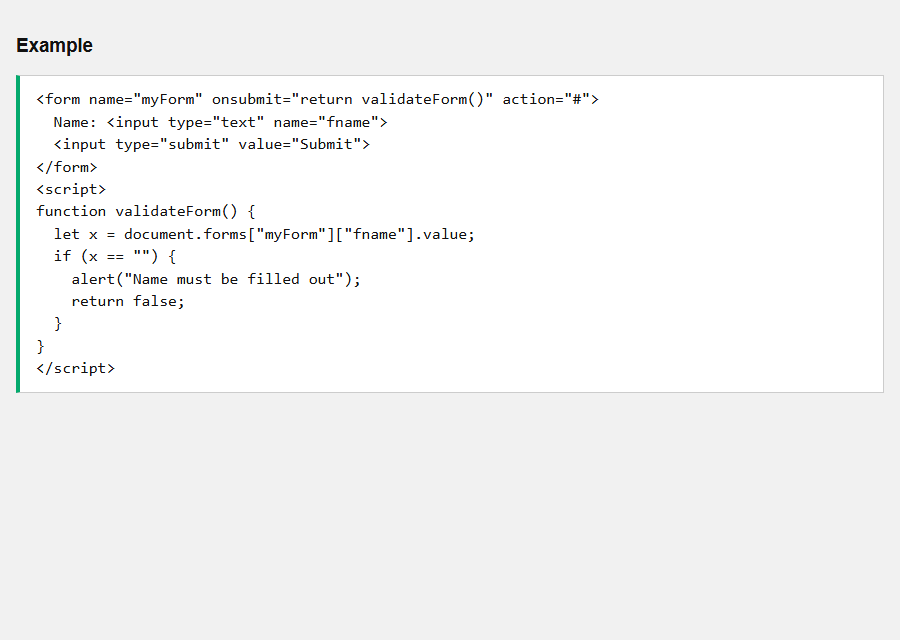

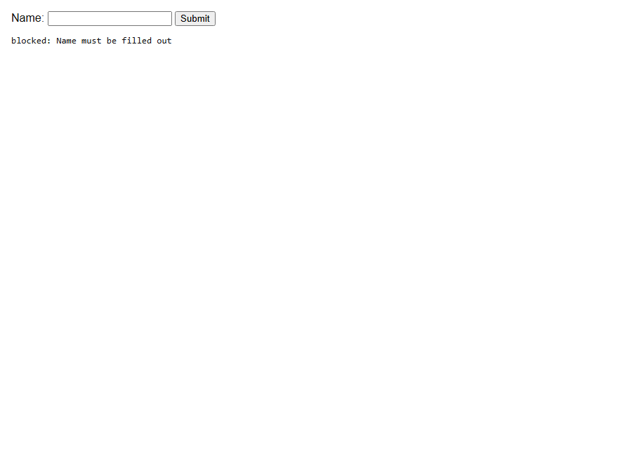

- [x] **Outcome:** Empty name → validation returns **false** and the form does not navigate away.

<a id="form-validation-example-02"></a>

### **Example 2: JavaScript — number between 1 and 10**

- [x] Read the input, convert with `Number` or compare as numbers.
- [x] If the value is outside **1–10** (or not a number), show a message and stop.
- [x] The snapshot enters **15**, which fails the range check.

Sandbox: `code_sandbox/form-validation/js-numeric-range.html`

```html
<p>Please input a number between 1 and 10</p>
<input id="num" type="number">
<button type="button" id="go">Submit</button>
<script>
document.getElementById("go").onclick = function () {
  const v = Number(document.getElementById("num").value);
  if (Number.isNaN(v) || v < 1 || v > 10) {
    document.getElementById("demo").innerText = "Invalid: need 1–10";
  } else {
    document.getElementById("demo").innerText = "OK: " + v;
  }
};
</script>
```

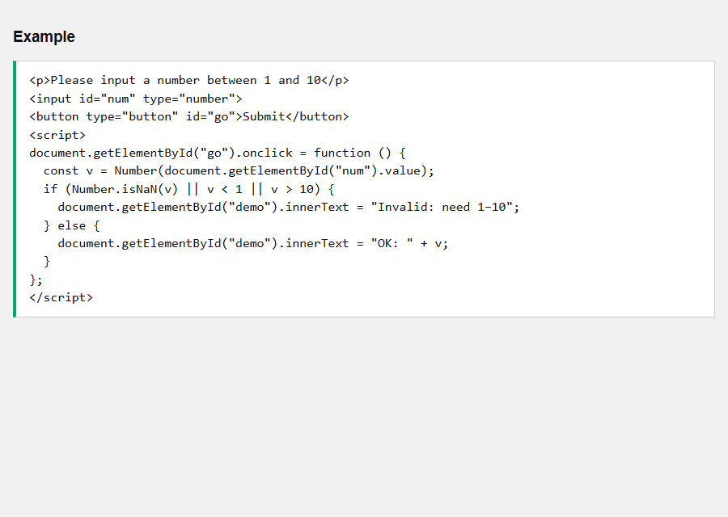

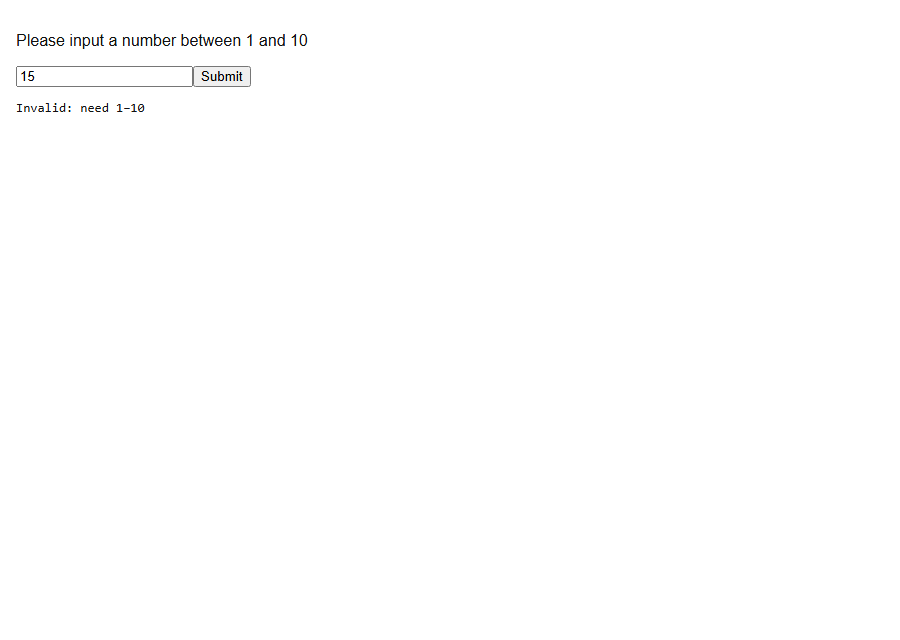

- [x] **Outcome:** Value **15** is rejected: **Invalid: need 1–10**.

<a id="form-validation-example-03"></a>

### **Example 3: Automatic HTML validation — required**

- [x] The **`required`** attribute stops submit when the field is empty — **no JavaScript**.
- [x] The browser shows its own message. This did not work in **IE 9** and earlier (historical note).
- [x] `checkValidity()` returns false when empty. `reportValidity()` would show the native bubble.

Sandbox: `code_sandbox/form-validation/html-required.html`

```html
<form id="f" action="#">
  <input name="fname" required>
  <input type="submit">
</form>
```

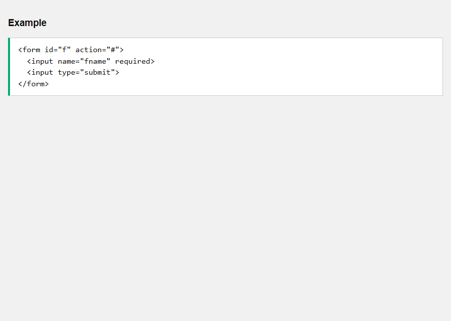


- [x] **Outcome:** `checkValidity()` is **false** on an empty required field — the browser would block submit.

<a id="form-validation-example-04"></a>

### **Example 4: Data validation — client vs server**

- [x] **Data validation** means input is clean, correct, and useful (required filled, dates valid, numbers in numeric fields).
- [x] **Client-side** runs in the browser **before** send — fast UX, easy to skip (user can disable JS).
- [x] **Server-side** runs **after** the request arrives — the one you must trust for security.
- [x] Use both: client for instant help, server as the real gate.

Sandbox: `code_sandbox/form-validation/server-vs-client.html`

```html
<script>
const kinds = [
  "Client-side: browser, before request",
  "Server-side: server, after request"
];
</script>
```

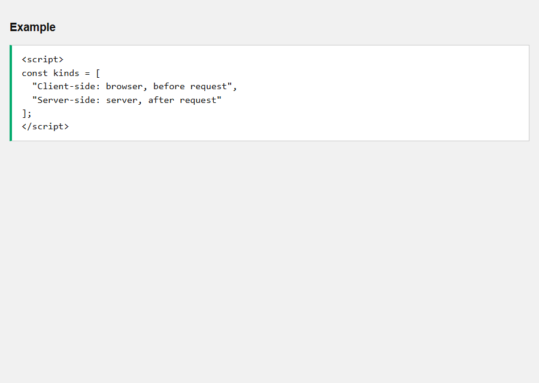

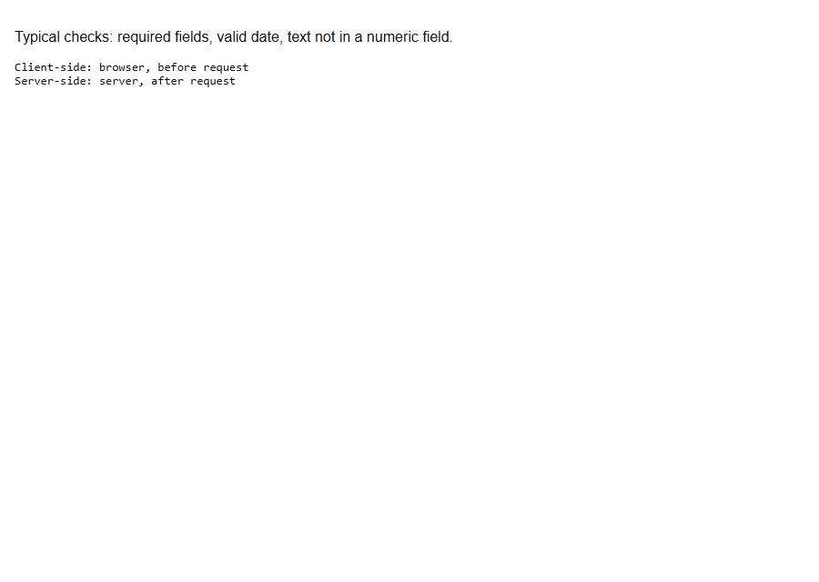

- [x] **Outcome:** The snapshot lists **client-side** (before send) and **server-side** (after send).

<a id="form-validation-example-05"></a>

### **Example 5: Constraint attribute — disabled**

- [x] `disabled` means the control is not editable and is **not submitted**.
- [x] CSS `:disabled` matches it. JS `el.disabled = true` toggles the same state.

Sandbox: `code_sandbox/form-validation/attr-disabled.html`

```html
<input id="x" value="locked" disabled>
```


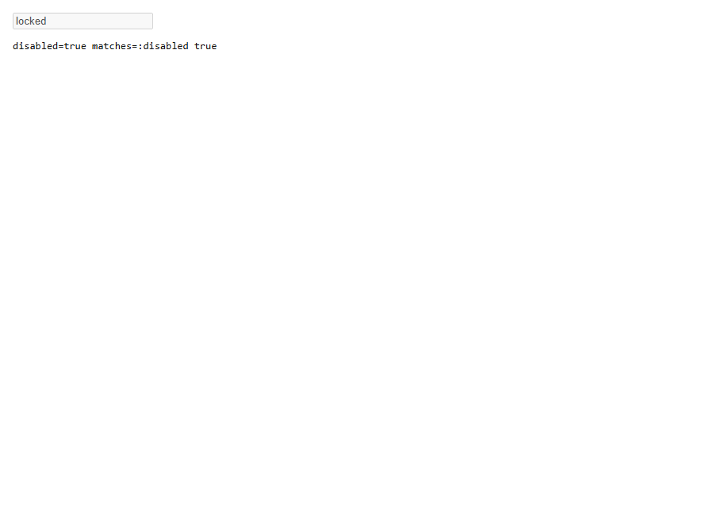

- [x] **Outcome:** The input is **disabled**; `disabled` is **true** and it matches `:disabled`.

<a id="form-validation-example-06"></a>

### **Example 6: Constraint attributes — min and max**

- [x] `min` / `max` bound numeric (and date) inputs.
- [x] `validity.rangeUnderflow` / `rangeOverflow` tell you which way it failed.
- [x] The snapshot sets **0** on a field with `min="1" max="10"`.

Sandbox: `code_sandbox/form-validation/attr-min-max.html`

```html
<input id="n" type="number" min="1" max="10" value="0">
```


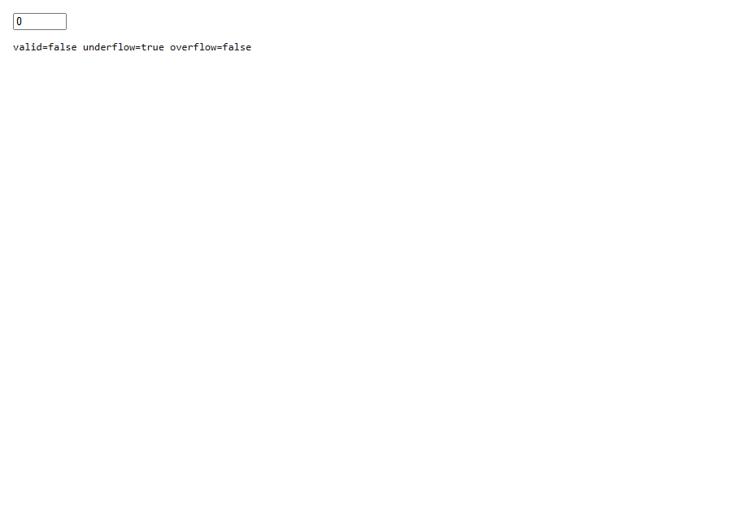

- [x] **Outcome:** **0** is below min: `rangeUnderflow` is **true**, `checkValidity` is **false**.

<a id="form-validation-example-07"></a>

### **Example 7: Constraint attribute — pattern**

- [x] `pattern` is a **regex** for the whole value (HTML already anchors it).
- [x] Example: `[A-Za-z]{3}` means exactly three letters.
- [x] `validity.patternMismatch` is true when the value does not match.

Sandbox: `code_sandbox/form-validation/attr-pattern.html`

```html
<input id="p" pattern="[A-Za-z]{3}" value="12">
```


- [x] **Outcome:** **12** fails `[A-Za-z]{3}`: **patternMismatch** is true.

<a id="form-validation-example-08"></a>

### **Example 8: Constraint attribute — required**

- [x] `required` means the field must have a value before submit.
- [x] `validity.valueMissing` is the flag for “empty but required”.
- [x] This is the same idea as the automatic HTML example, as a table row of its own.

Sandbox: `code_sandbox/form-validation/attr-required.html`

```html
<input id="r" required value="">
```


- [x] **Outcome:** Empty required input: **valueMissing** true, `checkValidity` false.

<a id="form-validation-example-09"></a>

### **Example 9: Constraint attribute — type**

- [x] `type` selects the control and its built-in checks (`email`, `number`, `url`, …).
- [x] `type="email"` with `not-an-email` sets `validity.typeMismatch`.
- [x] Mobile browsers also pick a suitable keyboard from `type`.

Sandbox: `code_sandbox/form-validation/attr-type.html`

```html
<input id="e" type="email" value="not-an-email">
```


- [x] **Outcome:** **not-an-email** fails `type="email"`: **typeMismatch** is true.

<a id="form-validation-example-10"></a>

### **Example 10: CSS pseudo — :disabled**

- [x] `:disabled` selects inputs that have the disabled attribute / property.
- [x] Use it to grey out labels or hide helper text next to dead controls.

Sandbox: `code_sandbox/form-validation/pseudo-disabled.html`

```html
<input id="d" disabled>
<script>
document.querySelector("input:disabled");
</script>
```

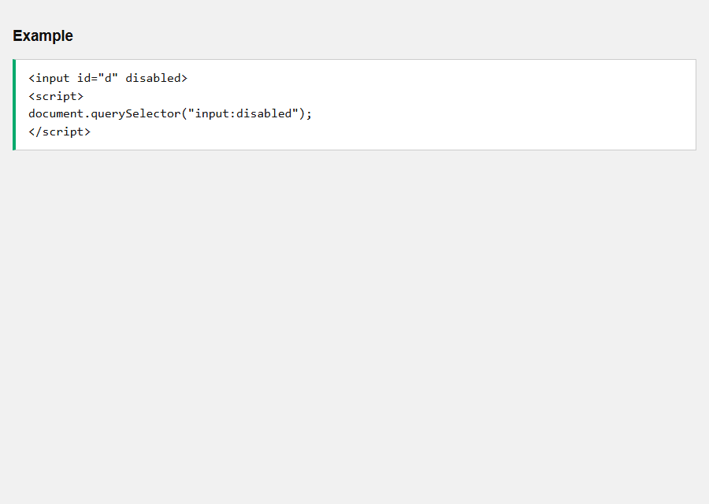


- [x] **Outcome:** `querySelector("input:disabled")` finds the disabled control.

<a id="form-validation-example-11"></a>

### **Example 11: CSS pseudo — :invalid and :valid**

- [x] `:invalid` matches controls that fail constraint validation **right now**.
- [x] `:valid` is the opposite. Empty non-required fields are usually valid.
- [x] Great for red/green outlines without JavaScript.

Sandbox: `code_sandbox/form-validation/pseudo-invalid-valid.html`

```html
<input id="bad" type="email" value="x">
<input id="good" type="email" value="a@b.c">
```

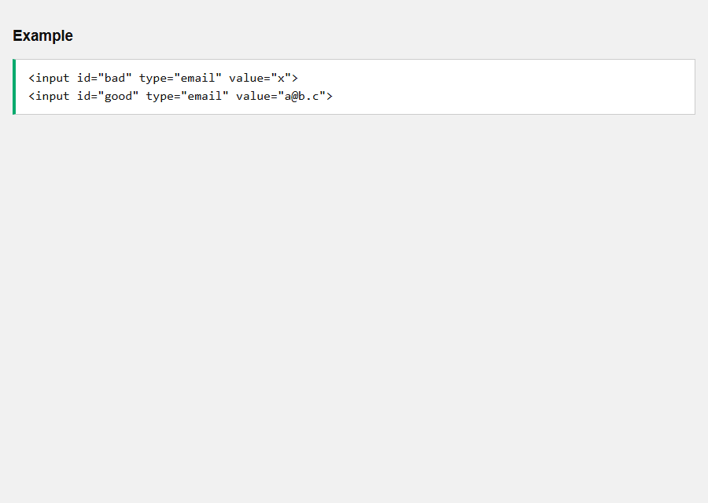

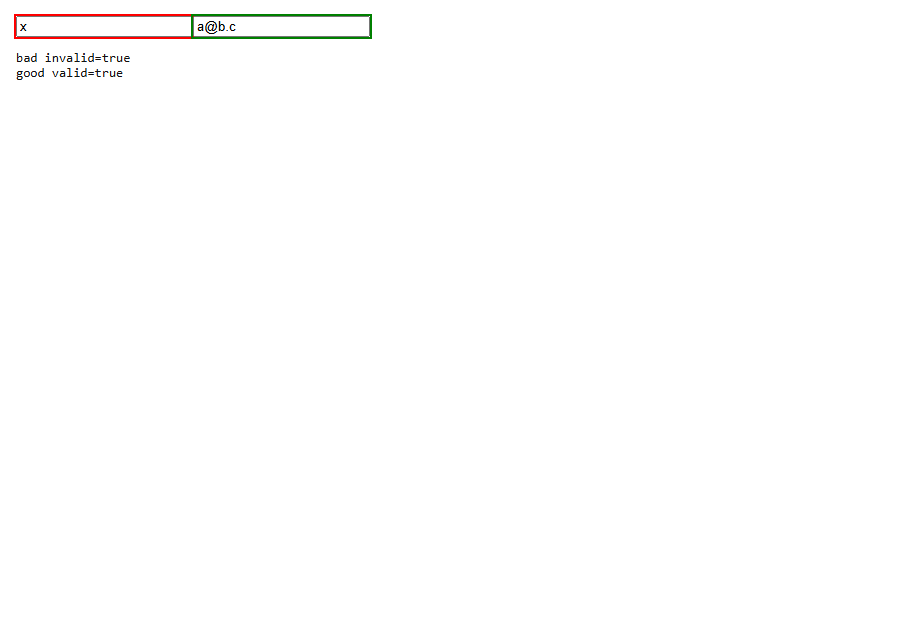

- [x] **Outcome:** `#bad` matches **:invalid**; `#good` matches **:valid**.

<a id="form-validation-example-12"></a>

### **Example 12: CSS pseudo — :required and :optional**

- [x] `:required` selects fields with the required attribute.
- [x] `:optional` selects fields **without** required.
- [x] Use them to mark mandatory fields in CSS alone.

Sandbox: `code_sandbox/form-validation/pseudo-required-optional.html`

```html
<input id="req" required>
<input id="opt">
```


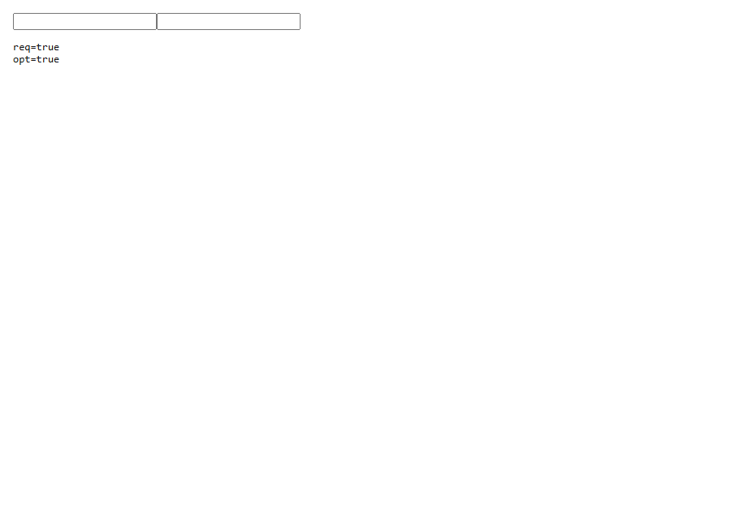

- [x] **Outcome:** `#req` matches **:required**; `#opt` matches **:optional**.

<details>
  <summary>Terminal Commands</summary>

## Terminal Commands

```bash
# from Personal/Files/javascript/code_sandbox
py -3 -m http.server 8770 --bind 127.0.0.1
```

Then open `http://127.0.0.1:8770/form-validation/`.

</details>

<details>
  <summary>Questions and Answers</summary>

## Questions and Answers

### Question 1: How does the empty-name script cancel submit?

<details>
<summary>Answer</summary>

- [x] It **`return false`** from the `onsubmit` handler after `alert`.

</details>

### Question 2: How do you read `fname` on `myForm`?

<details>
<summary>Answer</summary>

- [x] `document.forms["myForm"]["fname"].value`.

</details>

### Question 3: Is 15 valid for “number between 1 and 10”?

<details>
<summary>Answer</summary>

- [x] No — it is **outside** the range.

</details>

### Question 4: What HTML attribute blocks empty submit without JS?

<details>
<summary>Answer</summary>

- [x] **`required`**.

</details>

### Question 5: Why still validate on the server?

<details>
<summary>Answer</summary>

- [x] Client checks can be **skipped**. Security and correctness live on the **server**.

</details>

### Question 6: What flag is set when a required field is empty?

<details>
<summary>Answer</summary>

- [x] **`validity.valueMissing`**.

</details>

### Question 7: What flag is set for `type="email"` with `not-an-email`?

<details>
<summary>Answer</summary>

- [x] **`typeMismatch`**.

</details>

### Question 8: What does `pattern` use?

<details>
<summary>Answer</summary>

- [x] A **regular expression** for the whole value.

</details>

### Question 9: Which CSS selector matches a failing control?

<details>
<summary>Answer</summary>

- [x] **:invalid**.

</details>

### Question 10: Does `:optional` mean the value is wrong?

<details>
<summary>Answer</summary>

- [x] No — it means the field is **not required**.

</details>

### Question 11: What does `disabled` do to submit data?

<details>
<summary>Answer</summary>

- [x] Disabled controls are **not successful** — they are omitted from the submit payload.

</details>

### Question 12: IE 9 and `required`?

<details>
<summary>Answer</summary>

- [x] Automatic HTML5 validation **did not work** in IE 9 or earlier (historical).

</details>


</details>

## Summary

Use HTML constraints first, add JS for custom rules, and always validate again on the server.

## References

- [Form Validation](https://www.w3schools.com/js/js_validation.asp)
- [MDN Document](https://developer.mozilla.org/en-US/docs/Web/API/Document)

</details>

<details>
  <summary>DOM Animations</summary>

## Introduction

A JavaScript animation is a timer that changes inline styles a little at a time inside a positioned container.

This section has **5** examples:

- [x] **Example 1:** A basic web page for the animation [View](#dom-animations-example-01)
- [x] **Example 2:** Create an animation container [View](#dom-animations-example-02)
- [x] **Example 3:** Style the elements — relative container, absolute mover [View](#dom-animations-example-03)
- [x] **Example 4:** Animation code — setInterval and clearInterval [View](#dom-animations-example-04)
- [x] **Example 5:** Full animation — myMove() diagonal slide [View](#dom-animations-example-05)

## Detailed Explanation

- [x] Container `position:relative`, mover `position:absolute`.
- [x] `setInterval(frame, 5)` + `clearInterval` when done.
- [x] `myMove` increments `top` and `left` until `pos == 350`.

<a id="dom-animations-example-01"></a>

### **Example 1: A basic web page for the animation**

- [x] W3Schools starts with a heading and a placeholder: **My animation will go here**.
- [x] You need a page **structure** first; the moving box comes next.
- [x] Keep animation markup simple so the timer code is easy to see.

Sandbox: `code_sandbox/dom-animations/basic-page.html`

```html
<h2>My First JavaScript Animation</h2>
<div>My animation will go here</div>
```

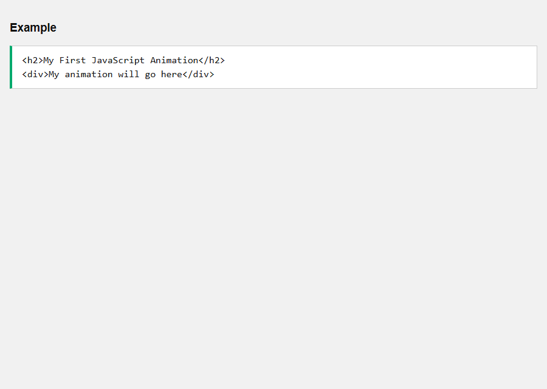

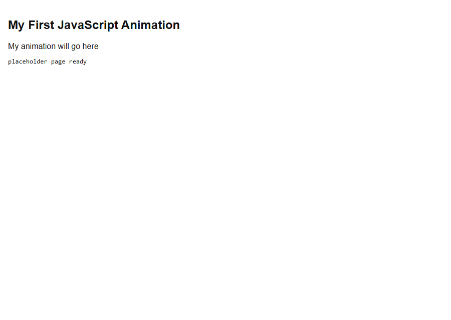

- [x] **Outcome:** The page shows the title and the placeholder box area.

<a id="dom-animations-example-02"></a>

### **Example 2: Create an animation container**

- [x] All animations should be **relative to a container** so coordinates stay inside that box.
- [x] The moving element is a child of the container, not of the whole page.
- [x] Later CSS: container `position: relative`, mover `position: absolute`.

Sandbox: `code_sandbox/dom-animations/container.html`

```html
<div id="container">
  <div id="animate">My animation will go here</div>
</div>
```

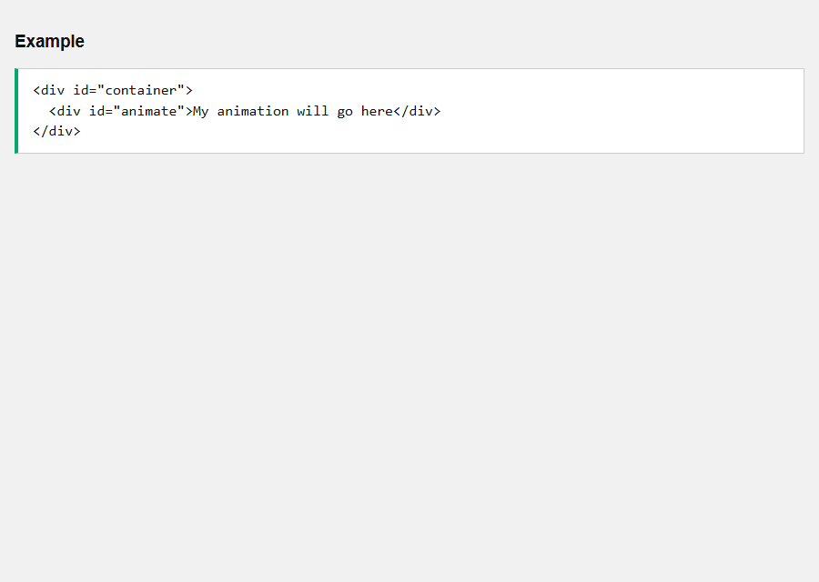

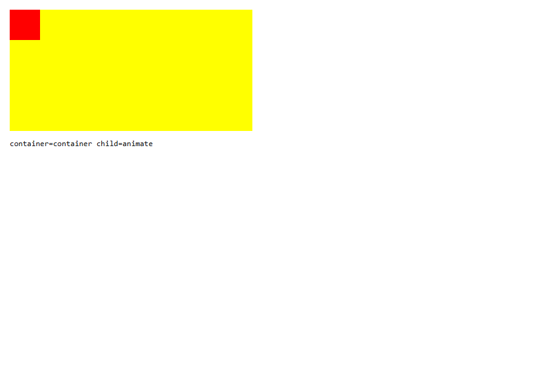

- [x] **Outcome:** The red square lives **inside** the yellow `#container`.

<a id="dom-animations-example-03"></a>

### **Example 3: Style the elements — relative container, absolute mover**

- [x] Container: `position: relative` (and a size + background).
- [x] Mover: `position: absolute` so `top` / `left` are relative to the container.
- [x] W3Schools uses a **400×400** yellow field and a **50×50** red square (this snap uses 400×200 to fit).
- [x] Without relative/absolute, `top`/`left` will not animate inside the box.

Sandbox: `code_sandbox/dom-animations/style-relative-absolute.html`

```css
#container {
  width: 400px;
  height: 400px;
  position: relative;
  background: yellow;
}
#animate {
  width: 50px;
  height: 50px;
  position: absolute;
  background: red;
}
```

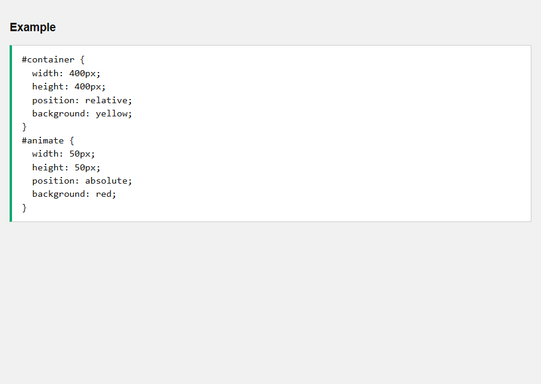

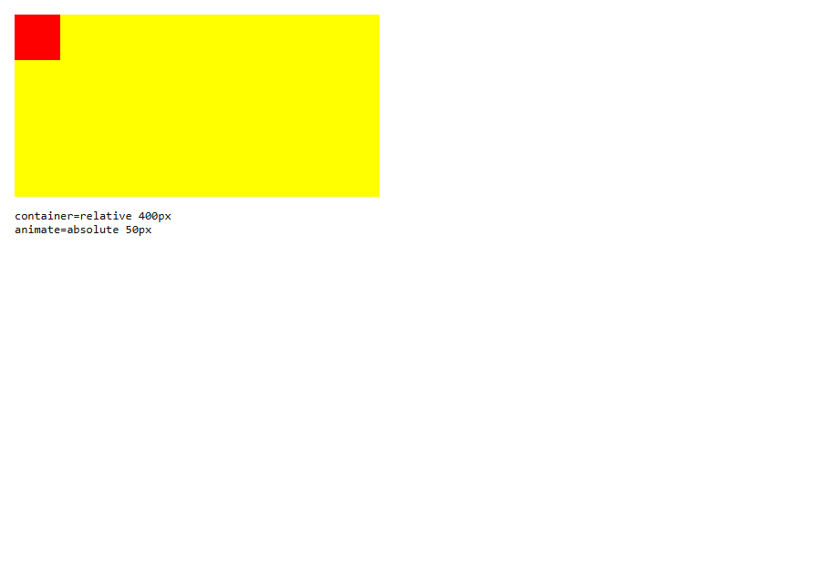

- [x] **Outcome:** Computed position of the container is **relative**; the square is **absolute**.

<a id="dom-animations-example-04"></a>

### **Example 4: Animation code — setInterval and clearInterval**

- [x] JS animation = **small style changes** on a timer so it looks continuous.
- [x] `id = setInterval(frame, 5)` calls `frame` every **5 ms**.
- [x] When the end test is true, **`clearInterval(id)`** stops the timer (or it runs forever).
- [x] Else, change `top`/`left` (or opacity, width, …).

Sandbox: `code_sandbox/dom-animations/interval-skeleton.html`

```javascript
id = setInterval(frame, 5);
function frame() {
  if (/* test for finished */) {
    clearInterval(id);
  } else {
    /* code to change the element style */
  }
}
```

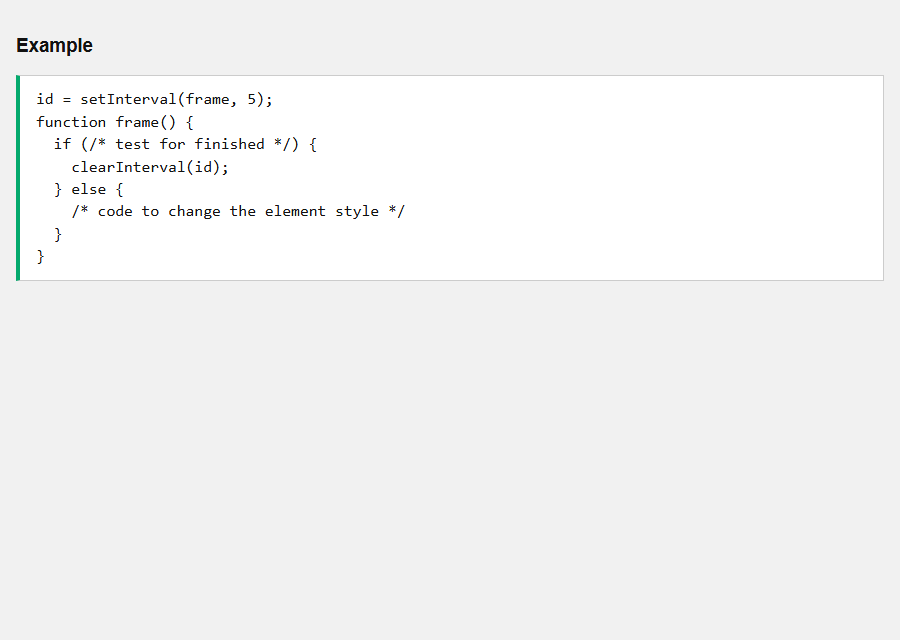


- [x] **Outcome:** The sandbox starts a 5ms interval, increments a counter to 3, then **clears** it — the pattern of the skeleton.

<a id="dom-animations-example-05"></a>

### **Example 5: Full animation — myMove() diagonal slide**

- [x] `myMove` reads `#animate`, starts `pos` at 0, and every 5ms adds **1px** to `top` and `left`.
- [x] When `pos == 350` it **clears** the interval (50px box in a 400px field → 350px of travel).
- [x] `clearInterval(id)` at the start avoids stacking timers if you click Move twice.
- [x] The snapshot calls `myMove()` immediately and waits so you see the square **away from the origin**.

Sandbox: `code_sandbox/dom-animations/mymove.html`

```html
<button type="button" onclick="myMove()">Move</button>
<div id="container"><div id="animate"></div></div>
<script>
function myMove() {
  let id = null;
  const elem = document.getElementById("animate");
  let pos = 0;
  clearInterval(id);
  id = setInterval(frame, 5);
  function frame() {
    if (pos == 350) {
      clearInterval(id);
    } else {
      pos++;
      elem.style.top = pos + "px";
      elem.style.left = pos + "px";
    }
  }
}
</script>
```

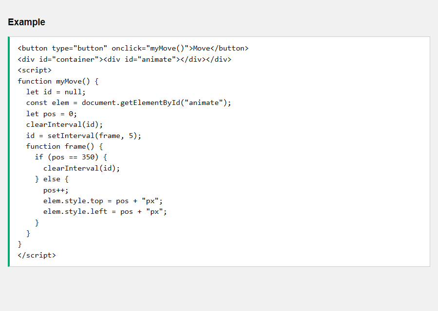

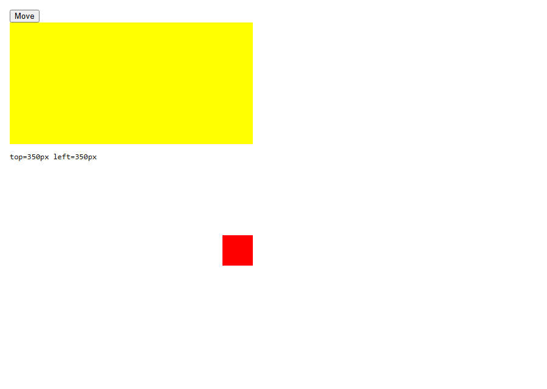

- [x] **Outcome:** After running, the red square has moved toward the bottom-right (`top`/`left` near **350px**, or mid-travel if the snap is early).

<details>
  <summary>Terminal Commands</summary>

## Terminal Commands

```bash
# from Personal/Files/javascript/code_sandbox
py -3 -m http.server 8770 --bind 127.0.0.1
```

Then open `http://127.0.0.1:8770/dom-animations/`.

</details>

<details>
  <summary>Questions and Answers</summary>

## Questions and Answers

### Question 1: Why wrap the mover in a container?

<details>
<summary>Answer</summary>

- [x] So `top`/`left` are **relative to that box**, not the whole page.

</details>

### Question 2: Which `position` values does W3Schools require?

<details>
<summary>Answer</summary>

- [x] Container **relative**, animated element **absolute**.

</details>

### Question 3: How is the animation scheduled?

<details>
<summary>Answer</summary>

- [x] **`setInterval(frame, 5)`** — a 5ms timer.

</details>

### Question 4: How do you stop it?

<details>
<summary>Answer</summary>

- [x] **`clearInterval(id)`** when the finish test is true.

</details>

### Question 5: What does `myMove` change each tick?

<details>
<summary>Answer</summary>

- [x] `elem.style.top` and `elem.style.left` by **+1px**.

</details>

### Question 6: Why `pos == 350`?

<details>
<summary>Answer</summary>

- [x] A 50px square in a 400px container travels **350px** before hitting the far edge.

</details>

### Question 7: Why `clearInterval` at the start of `myMove`?

<details>
<summary>Answer</summary>

- [x] So a second click does not start a **second** timer on the same element.

</details>

### Question 8: Is this the CSS `animation` property?

<details>
<summary>Answer</summary>

- [x] No — this page teaches **JavaScript timers** changing inline styles.

</details>

### Question 9: What if the interval is large, like 500ms?

<details>
<summary>Answer</summary>

- [x] The motion looks **jerky**, not continuous.

</details>

### Question 10: Can you animate `opacity` the same way?

<details>
<summary>Answer</summary>

- [x] Yes — any style you can set in JS, changed a little each frame.

</details>


</details>

## Summary

Position the box, then drive `top`/`left` (or any style) from a short interval until you clear it.

## References

- [DOM Animations](https://www.w3schools.com/js/js_htmldom_animate.asp)
- [MDN Document](https://developer.mozilla.org/en-US/docs/Web/API/Document)

</details>

<details>
  <summary>Document Reference</summary>

## Introduction

The HTML DOM Document object is the owner of the page. This catalog rebuilds **every** W3Schools Document property and method row (January 2026 table), including deprecated APIs.

This section has **55** examples:

- [x] **Example 1:** activeElement [View](#document-reference-example-01)
- [x] **Example 2:** addEventListener() [View](#document-reference-example-02)
- [x] **Example 3:** adoptNode() [View](#document-reference-example-03)
- [x] **Example 4:** anchors [View](#document-reference-example-04)
- [x] **Example 5:** applets [View](#document-reference-example-05)
- [x] **Example 6:** baseURI [View](#document-reference-example-06)
- [x] **Example 7:** body [View](#document-reference-example-07)
- [x] **Example 8:** charset [View](#document-reference-example-08)
- [x] **Example 9:** characterSet [View](#document-reference-example-09)
- [x] **Example 10:** close() [View](#document-reference-example-10)
- [x] **Example 11:** cookie [View](#document-reference-example-11)
- [x] **Example 12:** createAttribute() [View](#document-reference-example-12)
- [x] **Example 13:** createComment() [View](#document-reference-example-13)
- [x] **Example 14:** createDocumentFragment() [View](#document-reference-example-14)
- [x] **Example 15:** createElement() [View](#document-reference-example-15)
- [x] **Example 16:** createEvent() [View](#document-reference-example-16)
- [x] **Example 17:** createTextNode() [View](#document-reference-example-17)
- [x] **Example 18:** defaultView [View](#document-reference-example-18)
- [x] **Example 19:** designMode [View](#document-reference-example-19)
- [x] **Example 20:** doctype [View](#document-reference-example-20)
- [x] **Example 21:** documentElement [View](#document-reference-example-21)
- [x] **Example 22:** documentMode [View](#document-reference-example-22)
- [x] **Example 23:** documentURI [View](#document-reference-example-23)
- [x] **Example 24:** domain [View](#document-reference-example-24)
- [x] **Example 25:** domConfig [View](#document-reference-example-25)
- [x] **Example 26:** embeds [View](#document-reference-example-26)
- [x] **Example 27:** execCommand() [View](#document-reference-example-27)
- [x] **Example 28:** forms [View](#document-reference-example-28)
- [x] **Example 29:** getElementById() [View](#document-reference-example-29)
- [x] **Example 30:** getElementsByClassName() [View](#document-reference-example-30)
- [x] **Example 31:** getElementsByName() [View](#document-reference-example-31)
- [x] **Example 32:** getElementsByTagName() [View](#document-reference-example-32)
- [x] **Example 33:** hasFocus() [View](#document-reference-example-33)
- [x] **Example 34:** head [View](#document-reference-example-34)
- [x] **Example 35:** images [View](#document-reference-example-35)
- [x] **Example 36:** implementation [View](#document-reference-example-36)
- [x] **Example 37:** importNode() [View](#document-reference-example-37)
- [x] **Example 38:** inputEncoding [View](#document-reference-example-38)
- [x] **Example 39:** lastModified [View](#document-reference-example-39)
- [x] **Example 40:** links [View](#document-reference-example-40)
- [x] **Example 41:** normalize() [View](#document-reference-example-41)
- [x] **Example 42:** normalizeDocument() [View](#document-reference-example-42)
- [x] **Example 43:** open() [View](#document-reference-example-43)
- [x] **Example 44:** querySelector() [View](#document-reference-example-44)
- [x] **Example 45:** querySelectorAll() [View](#document-reference-example-45)
- [x] **Example 46:** readyState [View](#document-reference-example-46)
- [x] **Example 47:** referrer [View](#document-reference-example-47)
- [x] **Example 48:** removeEventListener() [View](#document-reference-example-48)
- [x] **Example 49:** renameNode() [View](#document-reference-example-49)
- [x] **Example 50:** scripts [View](#document-reference-example-50)
- [x] **Example 51:** strictErrorChecking [View](#document-reference-example-51)
- [x] **Example 52:** title [View](#document-reference-example-52)
- [x] **Example 53:** URL [View](#document-reference-example-53)
- [x] **Example 54:** write() [View](#document-reference-example-54)
- [x] **Example 55:** writeln() [View](#document-reference-example-55)

## Detailed Explanation

- [x] Selection methods (`getElementById`, `querySelector`, collections like `forms` / `images`).
- [x] Create methods (`createElement`, `createTextNode`, `createDocumentFragment`).
- [x] Deprecated rows still run (or catch) and tell you **not** to use them.

<a id="document-reference-example-01"></a>

### **Example 1: activeElement**

- [x] **`activeElement`** — Returns the currently focused element in the document
- [x] This sandbox **runs** the API from the W3Schools reference table (January 2026 revision).
- [x] Start from `document` (or an element). Wrap risky / deprecated calls in `try/catch` so a missing engine feature still prints a result.

Sandbox: `code_sandbox/document-reference/activeelement.html`

```javascript
const inp = document.createElement("input");
      inp.id = "focusMe";
      document.body.insertBefore(inp, document.getElementById("demo"));
      inp.focus();
      document.getElementById("demo").innerText = document.activeElement && document.activeElement.id;
```

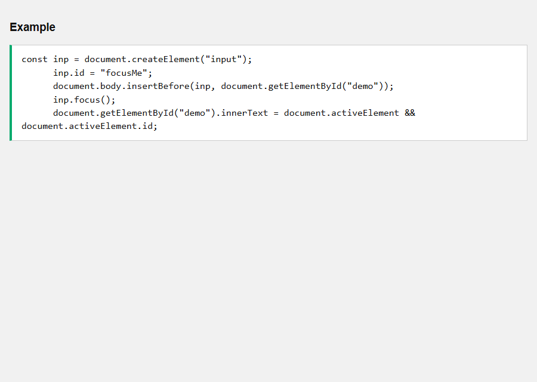


- [x] **Outcome:** After `focus()`, `document.activeElement.id` is **focusMe** (or `body` if the engine ignores focus in headless).

<a id="document-reference-example-02"></a>

### **Example 2: addEventListener()**

- [x] **`addEventListener()`** — Attaches an event handler to the document
- [x] This sandbox **runs** the API from the W3Schools reference table (January 2026 revision).
- [x] Start from `document` (or an element). Wrap risky / deprecated calls in `try/catch` so a missing engine feature still prints a result.

Sandbox: `code_sandbox/document-reference/addeventlistener.html`

```javascript
document.addEventListener("click", function handler() {
        document.getElementById("demo").innerText = "document clicked";
        document.removeEventListener("click", handler);
      });
      document.dispatchEvent(new MouseEvent("click", { bubbles: true }));
```

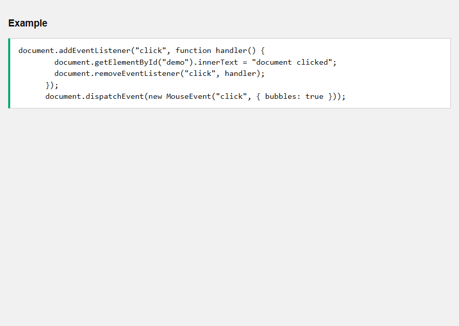


- [x] **Outcome:** Dispatching click on the document runs the listener: **document clicked**.

<a id="document-reference-example-03"></a>

### **Example 3: adoptNode()**

- [x] **`adoptNode()`** — Adopts a node from another document
- [x] This sandbox **runs** the API from the W3Schools reference table (January 2026 revision).
- [x] Start from `document` (or an element). Wrap risky / deprecated calls in `try/catch` so a missing engine feature still prints a result.

Sandbox: `code_sandbox/document-reference/adoptnode.html`

```javascript
const other = document.getElementById("f").contentDocument;
      other.body.innerHTML = "<span id='x'>from iframe</span>";
      const node = document.adoptNode(other.getElementById("x"));
      document.body.appendChild(node);
      document.getElementById("demo").innerText = node.textContent + " owner=" + (node.ownerDocument === document);
```

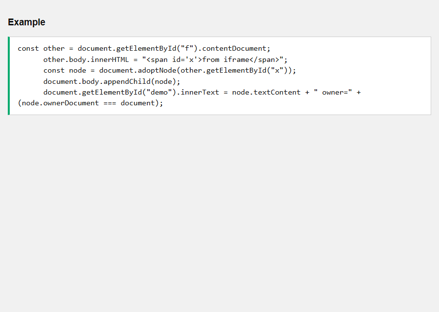

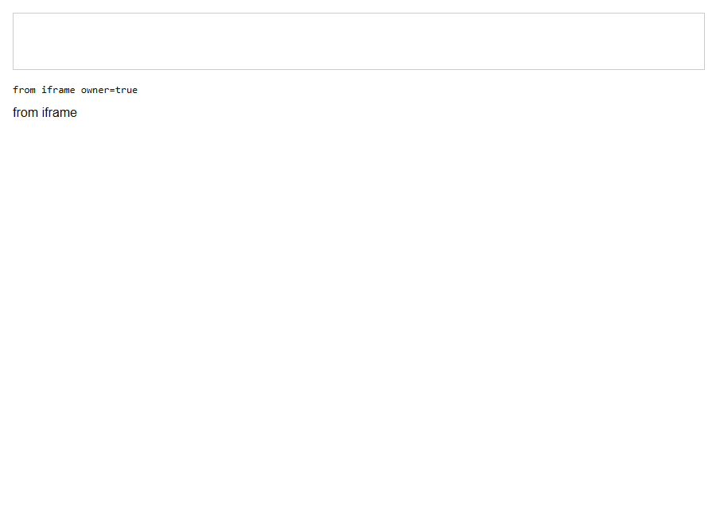

- [x] **Outcome:** `adoptNode` moves the span into this document; `ownerDocument === document` is **true**.

<a id="document-reference-example-04"></a>

### **Example 4: anchors**

- [x] **`anchors`** — DEPRECATED collection of named anchors
- [x] This sandbox **runs** the API from the W3Schools reference table (January 2026 revision).
- [x] Start from `document` (or an element). Wrap risky / deprecated calls in `try/catch` so a missing engine feature still prints a result.
- [x] Do **not** use `document.anchors` in new pages. Use `id` + `getElementById`.

Sandbox: `code_sandbox/document-reference/anchors.html`

```javascript
let msg;
      try { msg = "anchors.length=" + (document.anchors ? document.anchors.length : document.anchors); }
      catch (e) { msg = e.name + ": " + e.message; }
      document.getElementById("demo").innerText = msg + "\n(deprecated — do not use in new code)";
```

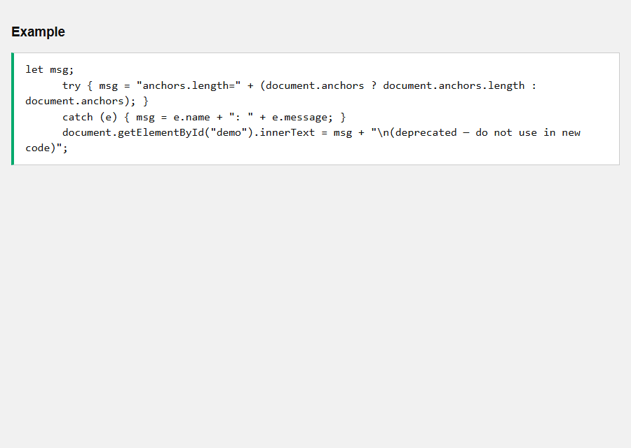

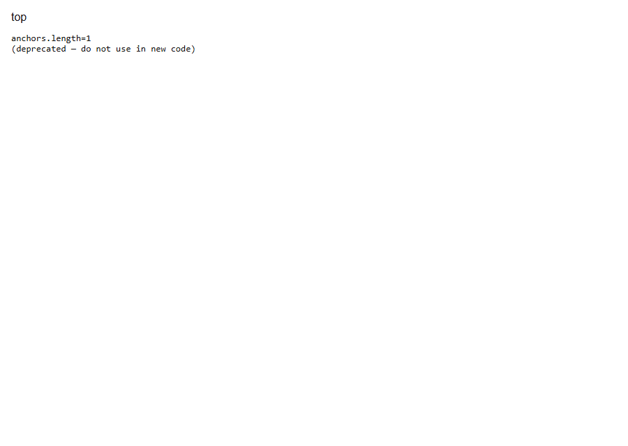

- [x] **Outcome:** The engine still exposes `anchors` or it is gone. Treat it as **deprecated**.

<a id="document-reference-example-05"></a>

### **Example 5: applets**

- [x] **`applets`** — DEPRECATED collection of applets
- [x] This sandbox **runs** the API from the W3Schools reference table (January 2026 revision).
- [x] Start from `document` (or an element). Wrap risky / deprecated calls in `try/catch` so a missing engine feature still prints a result.
- [x] Do **not** use `document.applets`.

Sandbox: `code_sandbox/document-reference/applets.html`

```javascript
let msg;
      try { msg = "applets=" + document.applets; }
      catch (e) { msg = e.name + ": " + e.message; }
      document.getElementById("demo").innerText = msg + "\n(deprecated — Java applets are gone)";
```

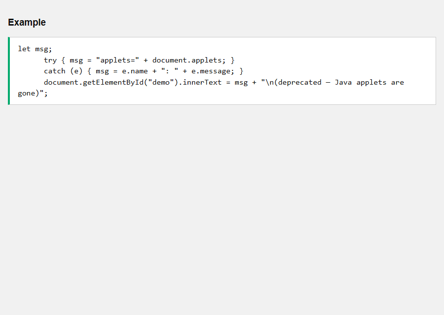

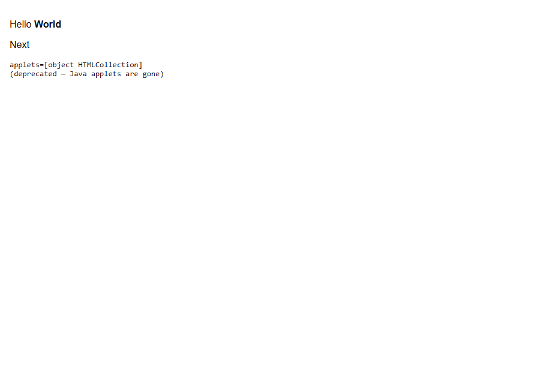

- [x] **Outcome:** `applets` is **deprecated**. Java applet plugins are not part of the modern web.

<a id="document-reference-example-06"></a>

### **Example 6: baseURI**

- [x] **`baseURI`** — Returns the absolute base URI of a document
- [x] This sandbox **runs** the API from the W3Schools reference table (January 2026 revision).
- [x] Start from `document` (or an element). Wrap risky / deprecated calls in `try/catch` so a missing engine feature still prints a result.

Sandbox: `code_sandbox/document-reference/baseuri.html`

```javascript
document.getElementById("demo").innerText = document.baseURI;
```

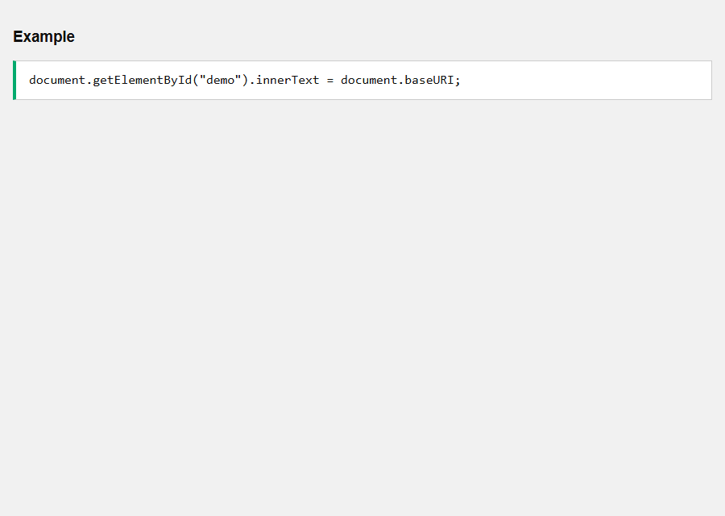

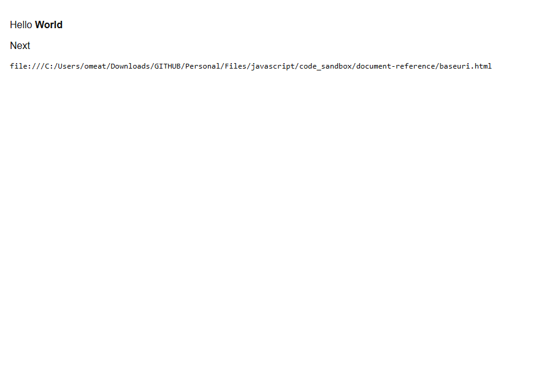

- [x] **Outcome:** `document.baseURI` is the absolute URL of this file (a `file://` path in the snapshot pipeline).

<a id="document-reference-example-07"></a>

### **Example 7: body**

- [x] **`body`** — Sets or returns the document's <body> element
- [x] This sandbox **runs** the API from the W3Schools reference table (January 2026 revision).
- [x] Start from `document` (or an element). Wrap risky / deprecated calls in `try/catch` so a missing engine feature still prints a result.

Sandbox: `code_sandbox/document-reference/body.html`

```javascript
document.getElementById("demo").innerText = document.body.tagName + " children=" + document.body.children.length;
```

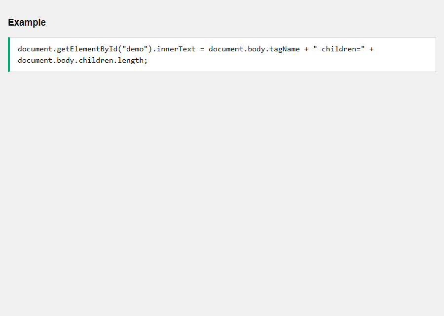


- [x] **Outcome:** `document.body.tagName` is **BODY**.

<a id="document-reference-example-08"></a>

### **Example 8: charset**

- [x] **`charset`** — DEPRECATED character-encoding alias
- [x] This sandbox **runs** the API from the W3Schools reference table (January 2026 revision).
- [x] Start from `document` (or an element). Wrap risky / deprecated calls in `try/catch` so a missing engine feature still prints a result.
- [x] Use **`document.characterSet`**, not `charset`.

Sandbox: `code_sandbox/document-reference/charset.html`

```javascript
let msg;
      try { msg = "charset=" + document.charset; }
      catch (e) { msg = e.name + ": " + e.message; }
      document.getElementById("demo").innerText = msg + "\nUse characterSet instead";
```

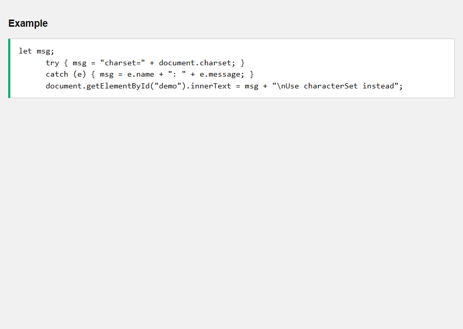


- [x] **Outcome:** `charset` may still equal UTF-8. Prefer **`characterSet`**. It is **deprecated**.

<a id="document-reference-example-09"></a>

### **Example 9: characterSet**

- [x] **`characterSet`** — Returns the character encoding for the document
- [x] This sandbox **runs** the API from the W3Schools reference table (January 2026 revision).
- [x] Start from `document` (or an element). Wrap risky / deprecated calls in `try/catch` so a missing engine feature still prints a result.

Sandbox: `code_sandbox/document-reference/characterset.html`

```javascript
document.getElementById("demo").innerText = document.characterSet;
```


- [x] **Outcome:** `document.characterSet` is typically **UTF-8**.

<a id="document-reference-example-10"></a>

### **Example 10: close()**

- [x] **`close()`** — Closes the output stream previously opened with document.open()
- [x] This sandbox **runs** the API from the W3Schools reference table (January 2026 revision).
- [x] Start from `document` (or an element). Wrap risky / deprecated calls in `try/catch` so a missing engine feature still prints a result.

Sandbox: `code_sandbox/document-reference/close.html`

```javascript
const d = document.getElementById("f").contentDocument;
      d.open();
      d.write("<p>stream</p>");
      d.close();
      document.getElementById("demo").innerText = "iframe=" + d.body.innerText;
```

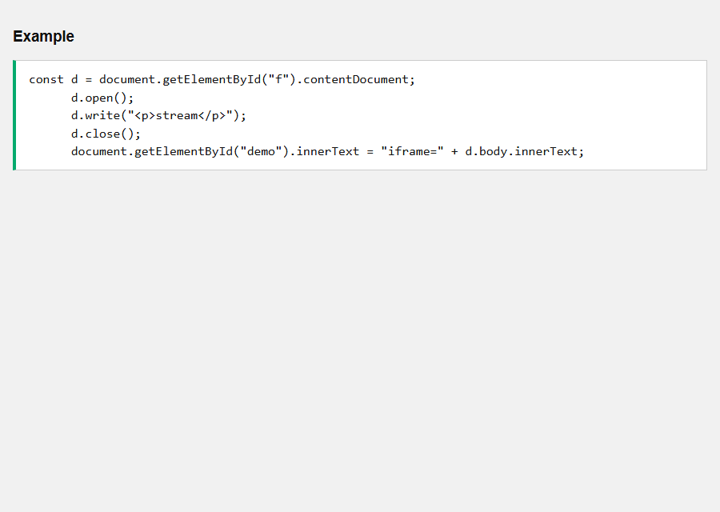

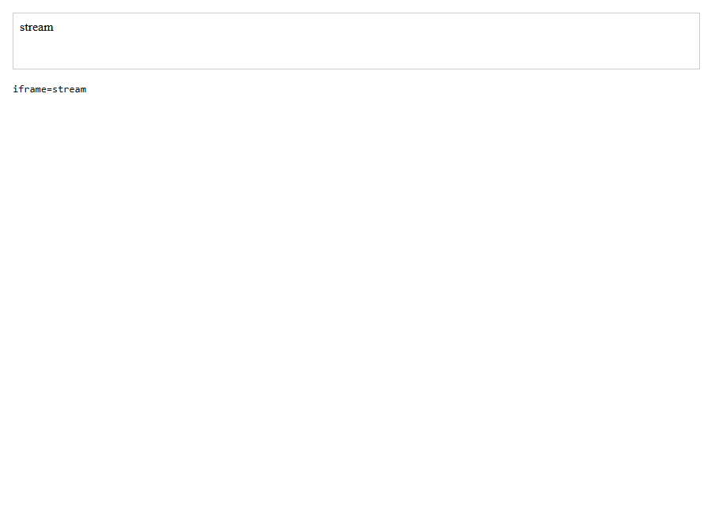

- [x] **Outcome:** After `open`/`write`/`close`, the iframe body contains **stream**.

<a id="document-reference-example-11"></a>

### **Example 11: cookie**

- [x] **`cookie`** — Returns all name/value pairs of cookies in the document
- [x] This sandbox **runs** the API from the W3Schools reference table (January 2026 revision).
- [x] Start from `document` (or an element). Wrap risky / deprecated calls in `try/catch` so a missing engine feature still prints a result.

Sandbox: `code_sandbox/document-reference/cookie.html`

```javascript
document.cookie = "demo=1; SameSite=Lax";
      document.getElementById("demo").innerText = document.cookie || "(empty — file:// often blocks cookies)";
```

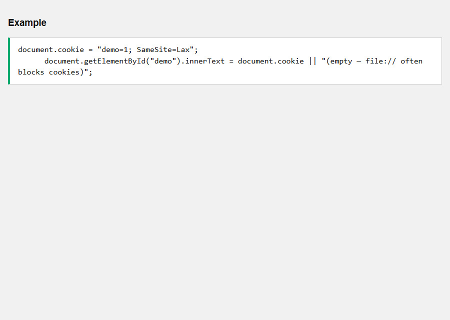

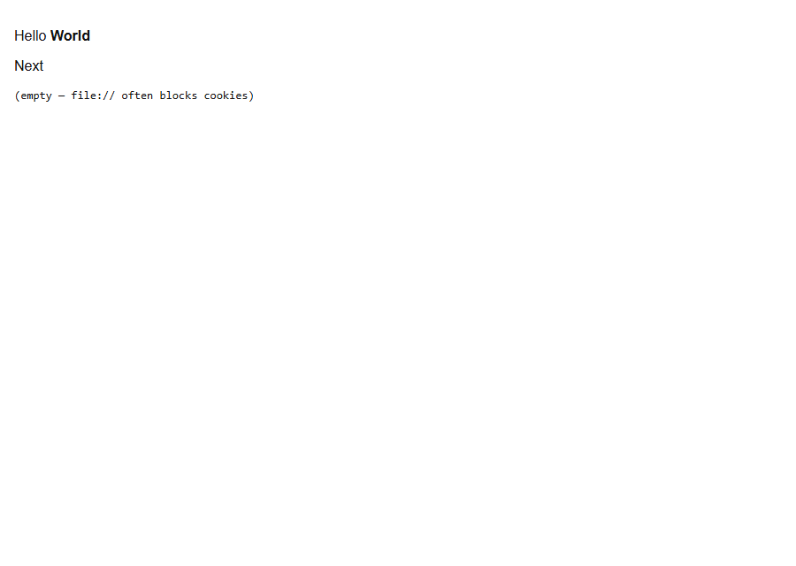

- [x] **Outcome:** `document.cookie` shows **demo=1** when cookies are allowed; on `file://` it may be **empty**.

<a id="document-reference-example-12"></a>

### **Example 12: createAttribute()**

- [x] **`createAttribute()`** — Creates an attribute node
- [x] This sandbox **runs** the API from the W3Schools reference table (January 2026 revision).
- [x] Start from `document` (or an element). Wrap risky / deprecated calls in `try/catch` so a missing engine feature still prints a result.

Sandbox: `code_sandbox/document-reference/createattribute.html`

```javascript
const a = document.createAttribute("data-k");
      a.value = "v";
      document.getElementById("t").setAttributeNode(a);
      document.getElementById("demo").innerText = document.getElementById("t").getAttribute("data-k");
```


- [x] **Outcome:** The paragraph gains **data-k="v"** via `createAttribute` + `setAttributeNode`.

<a id="document-reference-example-13"></a>

### **Example 13: createComment()**

- [x] **`createComment()`** — Creates a Comment node with the specified text
- [x] This sandbox **runs** the API from the W3Schools reference table (January 2026 revision).
- [x] Start from `document` (or an element). Wrap risky / deprecated calls in `try/catch` so a missing engine feature still prints a result.

Sandbox: `code_sandbox/document-reference/createcomment.html`

```javascript
const c = document.createComment("note");
      document.getElementById("t").appendChild(c);
      document.getElementById("demo").innerText = c.nodeName + " " + c.nodeValue;
```

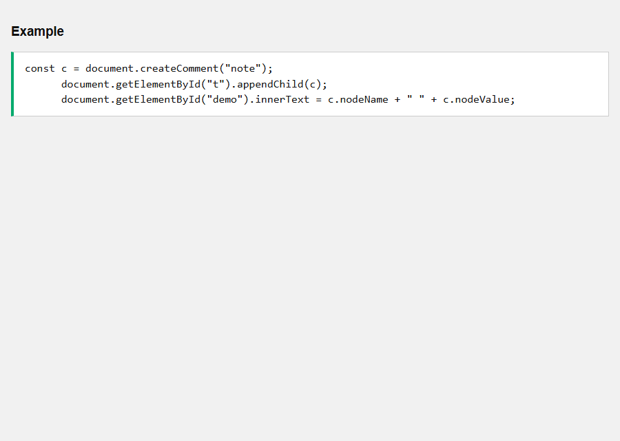


- [x] **Outcome:** A comment node `#comment` with value **note** is appended.

<a id="document-reference-example-14"></a>

### **Example 14: createDocumentFragment()**

- [x] **`createDocumentFragment()`** — Creates an empty DocumentFragment node
- [x] This sandbox **runs** the API from the W3Schools reference table (January 2026 revision).
- [x] Start from `document` (or an element). Wrap risky / deprecated calls in `try/catch` so a missing engine feature still prints a result.

Sandbox: `code_sandbox/document-reference/createdocumentfragment.html`

```javascript
const frag = document.createDocumentFragment();
      const s = document.createElement("span");
      s.textContent = "frag";
      frag.appendChild(s);
      document.getElementById("t").appendChild(frag);
      document.getElementById("demo").innerText = document.getElementById("t").innerText;
```

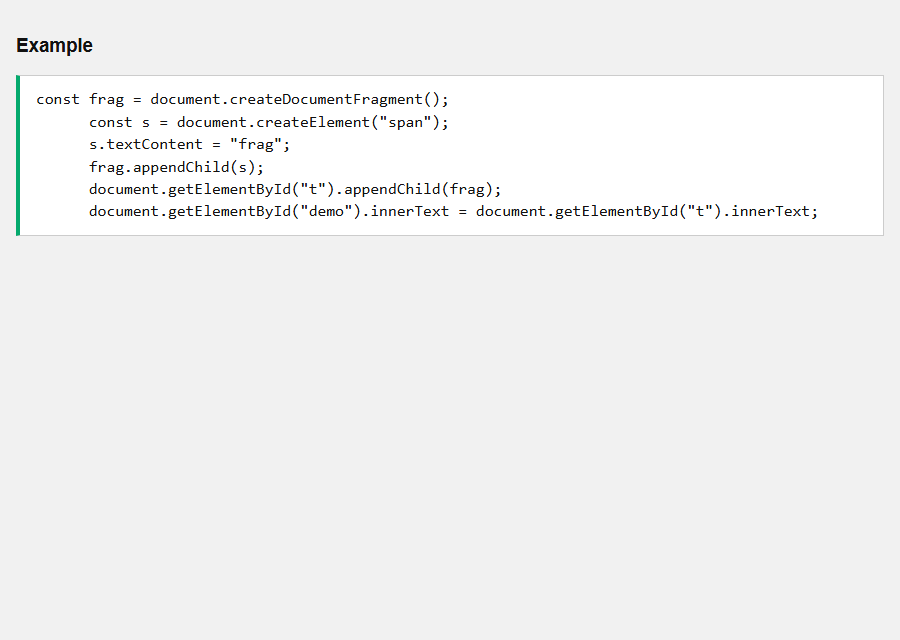


- [x] **Outcome:** The fragment’s **frag** span is inserted in one operation; the fragment itself is empty after append.

<a id="document-reference-example-15"></a>

### **Example 15: createElement()**

- [x] **`createElement()`** — Creates an Element node
- [x] This sandbox **runs** the API from the W3Schools reference table (January 2026 revision).
- [x] Start from `document` (or an element). Wrap risky / deprecated calls in `try/catch` so a missing engine feature still prints a result.

Sandbox: `code_sandbox/document-reference/createelement.html`

```javascript
const el = document.createElement("em");
      el.textContent = "new";
      document.getElementById("t").appendChild(el);
      document.getElementById("demo").innerText = el.tagName + " " + el.textContent;
```

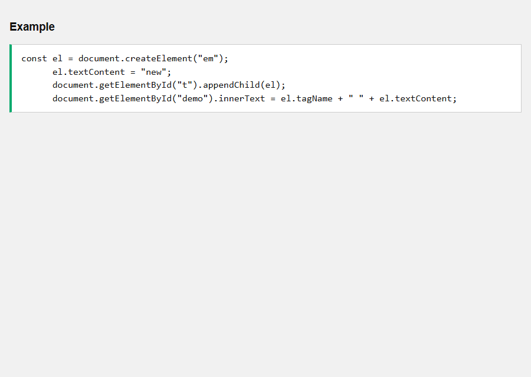


- [x] **Outcome:** `createElement("em")` builds an **EM** with text **new**.

<a id="document-reference-example-16"></a>

### **Example 16: createEvent()**

- [x] **`createEvent()`** — Creates a new event (legacy)
- [x] This sandbox **runs** the API from the W3Schools reference table (January 2026 revision).
- [x] Start from `document` (or an element). Wrap risky / deprecated calls in `try/catch` so a missing engine feature still prints a result.

Sandbox: `code_sandbox/document-reference/createevent.html`

```javascript
let msg;
      try {
        const ev = document.createEvent("Event");
        ev.initEvent("ping", true, true);
        msg = ev.type + " bubbles=" + ev.bubbles;
      } catch (e) { msg = e.name + ": " + e.message; }
      document.getElementById("demo").innerText = msg + "\nPrefer new Event('ping')";
```

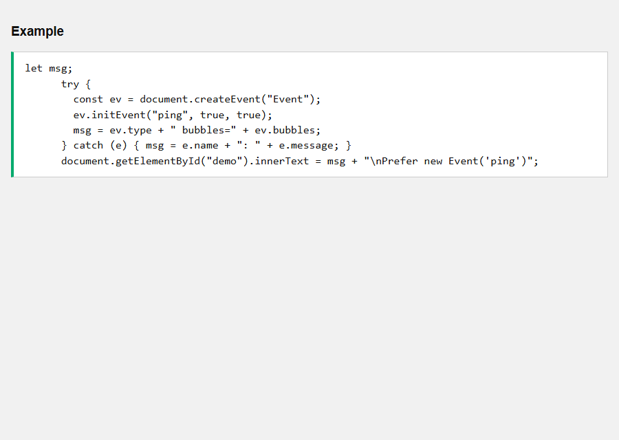


- [x] **Outcome:** `createEvent`/`initEvent` still work in many engines, or they throw. Prefer **`new Event()`**.

<a id="document-reference-example-17"></a>

### **Example 17: createTextNode()**

- [x] **`createTextNode()`** — Creates a Text node
- [x] This sandbox **runs** the API from the W3Schools reference table (January 2026 revision).
- [x] Start from `document` (or an element). Wrap risky / deprecated calls in `try/catch` so a missing engine feature still prints a result.

Sandbox: `code_sandbox/document-reference/createtextnode.html`

```javascript
const t = document.createTextNode("plain");
      document.getElementById("t").appendChild(t);
      document.getElementById("demo").innerText = t.nodeName + " " + JSON.stringify(t.nodeValue);
```

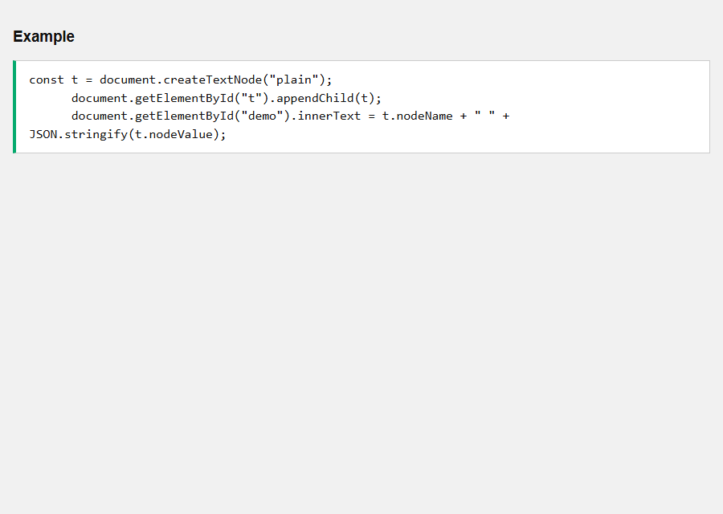


- [x] **Outcome:** A `#text` node with value **plain** is appended.

<a id="document-reference-example-18"></a>

### **Example 18: defaultView**

- [x] **`defaultView`** — Returns the window object associated with a document, or null
- [x] This sandbox **runs** the API from the W3Schools reference table (January 2026 revision).
- [x] Start from `document` (or an element). Wrap risky / deprecated calls in `try/catch` so a missing engine feature still prints a result.

Sandbox: `code_sandbox/document-reference/defaultview.html`

```javascript
document.getElementById("demo").innerText = String(document.defaultView === window);
```


- [x] **Outcome:** `document.defaultView === window` is **true** in a normal browser tab.

<a id="document-reference-example-19"></a>

### **Example 19: designMode**

- [x] **`designMode`** — Controls whether the entire document should be editable
- [x] This sandbox **runs** the API from the W3Schools reference table (January 2026 revision).
- [x] Start from `document` (or an element). Wrap risky / deprecated calls in `try/catch` so a missing engine feature still prints a result.

Sandbox: `code_sandbox/document-reference/designmode.html`

```javascript
const d = document.getElementById("f").contentDocument;
      d.designMode = "on";
      document.getElementById("demo").innerText = "designMode=" + d.designMode;
```

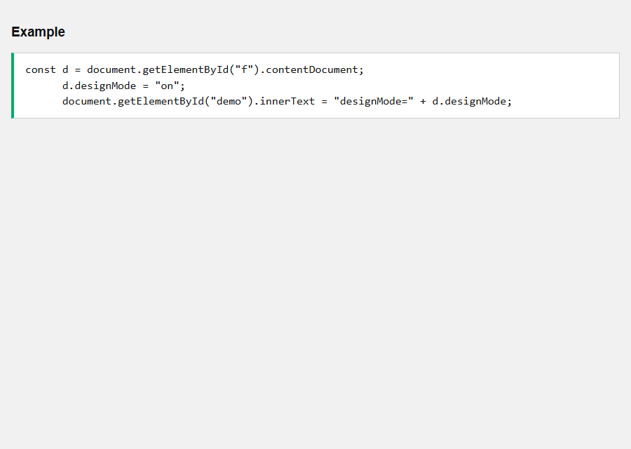

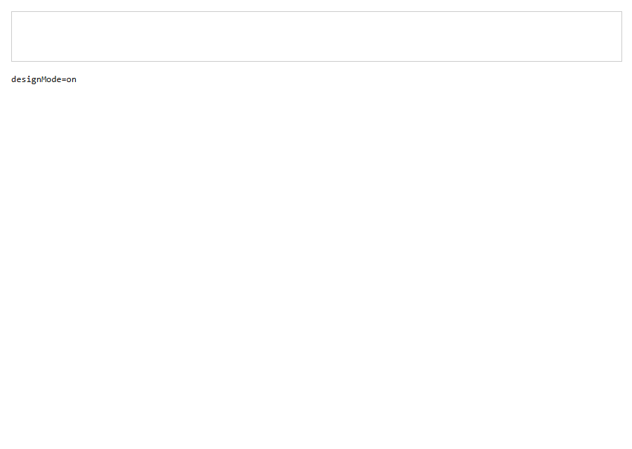

- [x] **Outcome:** The iframe document’s `designMode` is **on** (the whole iframe body becomes editable).

<a id="document-reference-example-20"></a>

### **Example 20: doctype**

- [x] **`doctype`** — Returns the Document Type Declaration associated with the document
- [x] This sandbox **runs** the API from the W3Schools reference table (January 2026 revision).
- [x] Start from `document` (or an element). Wrap risky / deprecated calls in `try/catch` so a missing engine feature still prints a result.

Sandbox: `code_sandbox/document-reference/doctype.html`

```javascript
const dt = document.doctype;
      document.getElementById("demo").innerText = dt ? (dt.name + " " + dt.publicId) : "null";
```

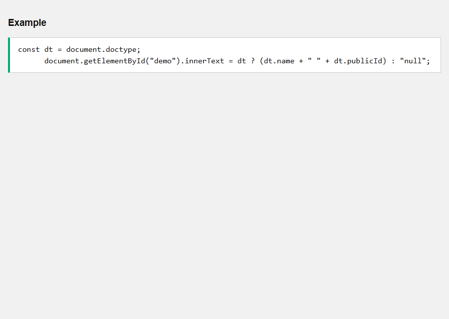


- [x] **Outcome:** `document.doctype.name` is **html** for a standard HTML5 doctype.

<a id="document-reference-example-21"></a>

### **Example 21: documentElement**

- [x] **`documentElement`** — Returns the Document Element (`<html>`)
- [x] This sandbox **runs** the API from the W3Schools reference table (January 2026 revision).
- [x] Start from `document` (or an element). Wrap risky / deprecated calls in `try/catch` so a missing engine feature still prints a result.

Sandbox: `code_sandbox/document-reference/documentelement.html`

```javascript
document.getElementById("demo").innerText = document.documentElement.tagName;
```

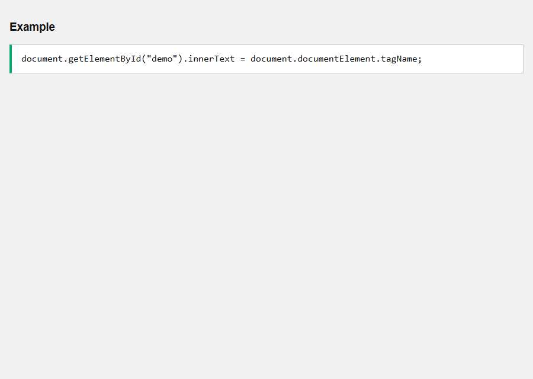


- [x] **Outcome:** `document.documentElement.tagName` is **HTML**.

<a id="document-reference-example-22"></a>

### **Example 22: documentMode**

- [x] **`documentMode`** — DEPRECATED IE document mode
- [x] This sandbox **runs** the API from the W3Schools reference table (January 2026 revision).
- [x] Start from `document` (or an element). Wrap risky / deprecated calls in `try/catch` so a missing engine feature still prints a result.
- [x] Deprecated **Internet Explorer** API.

Sandbox: `code_sandbox/document-reference/documentmode.html`

```javascript
document.getElementById("demo").innerText = "documentMode=" + document.documentMode + " (deprecated IE-only)";
```

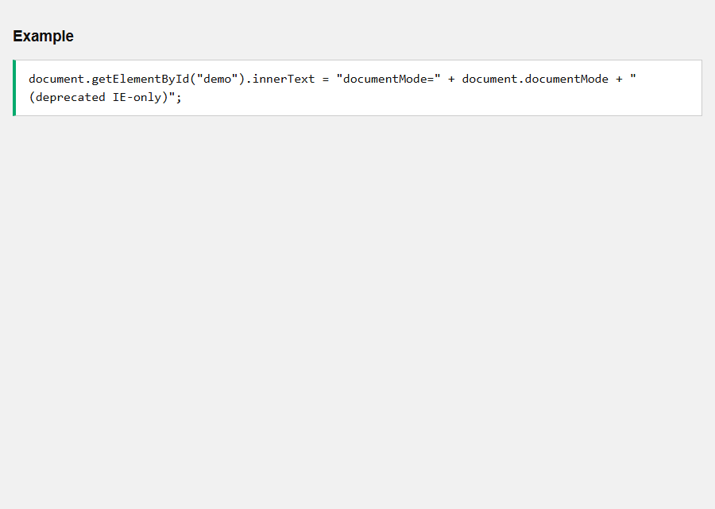

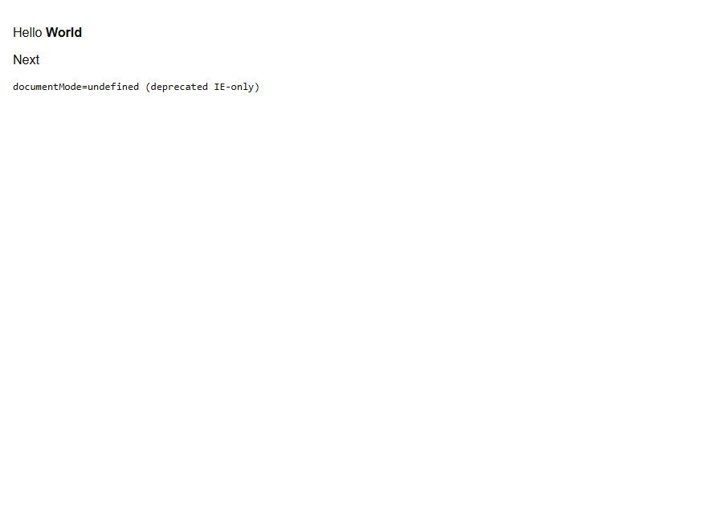

- [x] **Outcome:** `documentMode` is **undefined** in Chrome/Edge. It was an **IE** feature — do not use it.

<a id="document-reference-example-23"></a>

### **Example 23: documentURI**

- [x] **`documentURI`** — Sets or returns the location of the document
- [x] This sandbox **runs** the API from the W3Schools reference table (January 2026 revision).
- [x] Start from `document` (or an element). Wrap risky / deprecated calls in `try/catch` so a missing engine feature still prints a result.

Sandbox: `code_sandbox/document-reference/documenturi.html`

```javascript
document.getElementById("demo").innerText = document.documentURI;
```


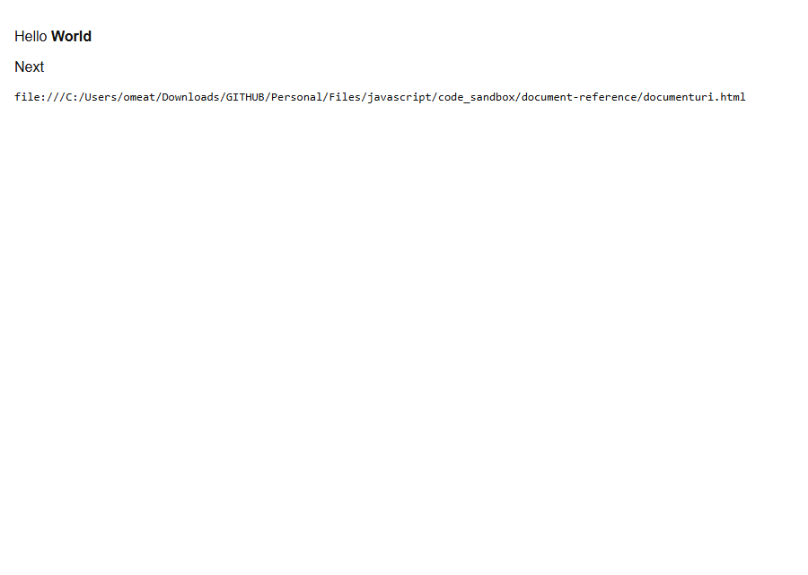

- [x] **Outcome:** `documentURI` is the document URL (same family as `document.URL`).

<a id="document-reference-example-24"></a>

### **Example 24: domain**

- [x] **`domain`** — Returns the domain name of the server that loaded the document
- [x] This sandbox **runs** the API from the W3Schools reference table (January 2026 revision).
- [x] Start from `document` (or an element). Wrap risky / deprecated calls in `try/catch` so a missing engine feature still prints a result.

Sandbox: `code_sandbox/document-reference/domain.html`

```javascript
let msg;
      try { msg = "domain=" + JSON.stringify(document.domain); }
      catch (e) { msg = e.name + ": " + e.message; }
      document.getElementById("demo").innerText = msg;
```

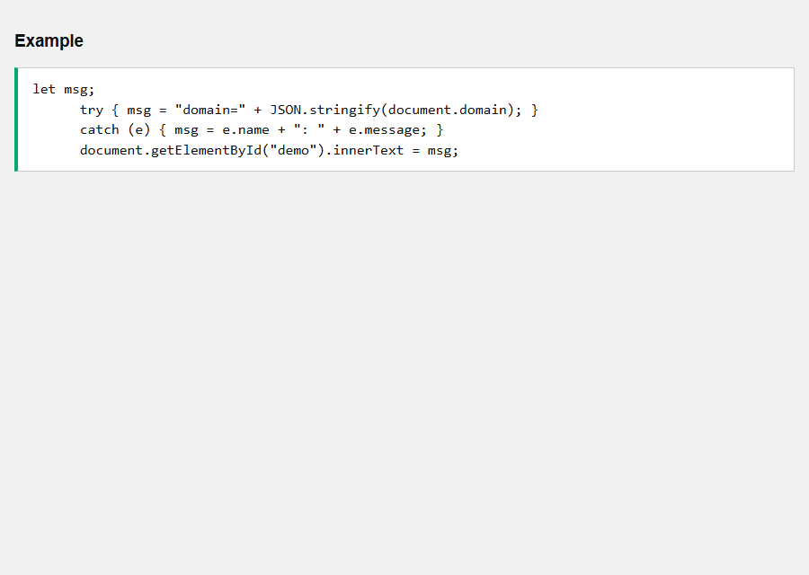


- [x] **Outcome:** On `file://` this is often **`""`** or a security error. On http it is the host name.

<a id="document-reference-example-25"></a>

### **Example 25: domConfig**

- [x] **`domConfig`** — DEPRECATED
- [x] This sandbox **runs** the API from the W3Schools reference table (January 2026 revision).
- [x] Start from `document` (or an element). Wrap risky / deprecated calls in `try/catch` so a missing engine feature still prints a result.
- [x] Do not use `domConfig`.

Sandbox: `code_sandbox/document-reference/domconfig.html`

```javascript
document.getElementById("demo").innerText = "domConfig=" + document.domConfig + " (deprecated — unused)";
```

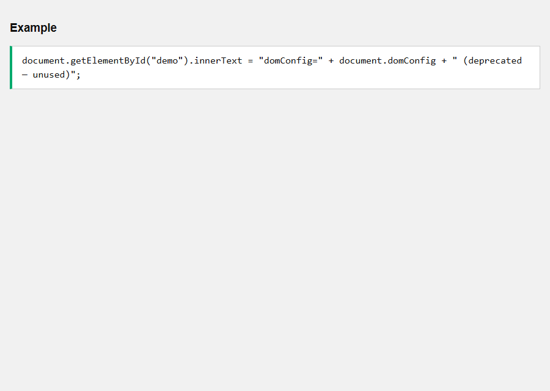

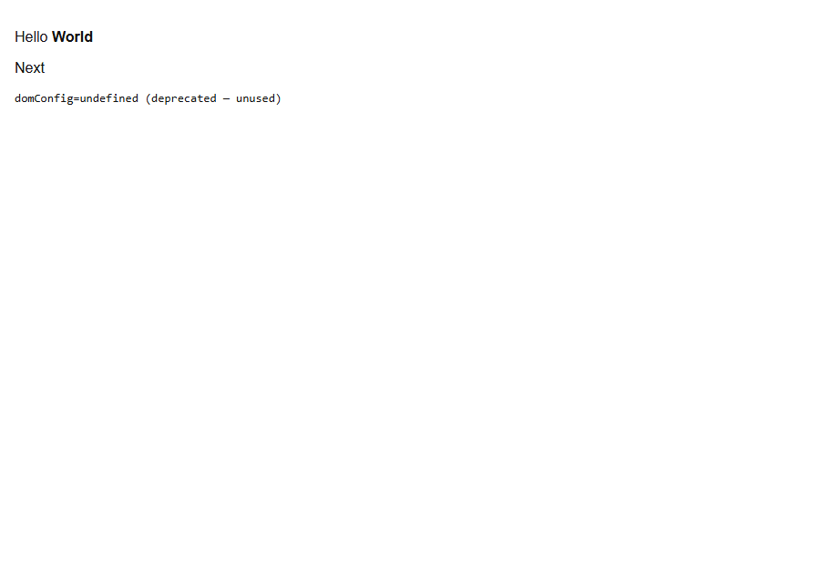

- [x] **Outcome:** `domConfig` is **deprecated** and typically **undefined**.

<a id="document-reference-example-26"></a>

### **Example 26: embeds**

- [x] **`embeds`** — Returns a collection of all <embed> elements
- [x] This sandbox **runs** the API from the W3Schools reference table (January 2026 revision).
- [x] Start from `document` (or an element). Wrap risky / deprecated calls in `try/catch` so a missing engine feature still prints a result.

Sandbox: `code_sandbox/document-reference/embeds.html`

```javascript
document.getElementById("demo").innerText = "embeds=" + document.embeds.length;
```

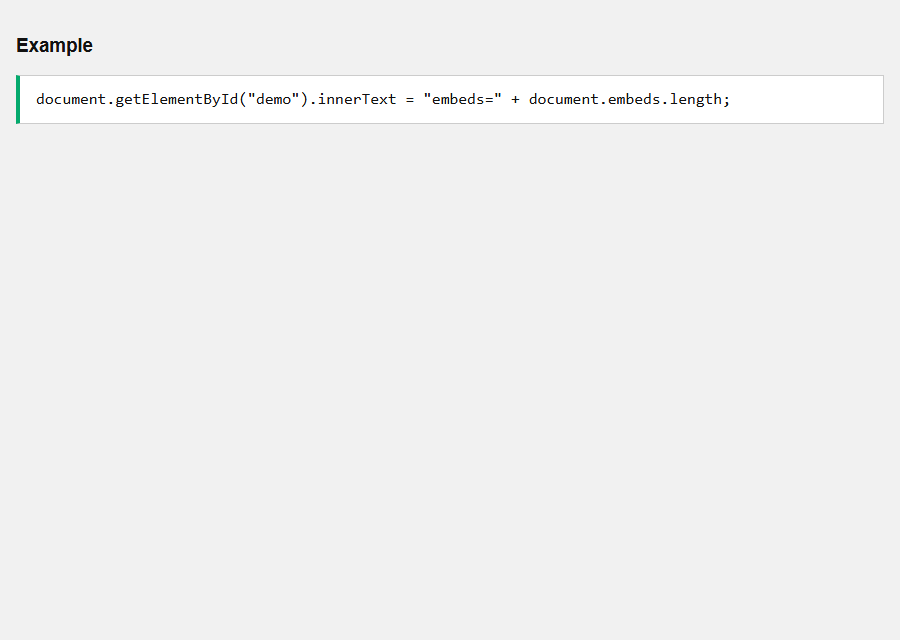


- [x] **Outcome:** `document.embeds.length` is **1** in this page.

<a id="document-reference-example-27"></a>

### **Example 27: execCommand()**

- [x] **`execCommand()`** — DEPRECATED document editing command
- [x] This sandbox **runs** the API from the W3Schools reference table (January 2026 revision).
- [x] Start from `document` (or an element). Wrap risky / deprecated calls in `try/catch` so a missing engine feature still prints a result.
- [x] Deprecated. Use the modern Selection / Clipboard APIs instead.

Sandbox: `code_sandbox/document-reference/execcommand.html`

```javascript
let msg;
      try {
        document.getElementById("t").focus();
        const ok = document.execCommand("selectAll");
        msg = "execCommand selectAll -> " + ok;
      } catch (e) { msg = e.name + ": " + e.message; }
      document.getElementById("demo").innerText = msg + "\n(deprecated)";
```

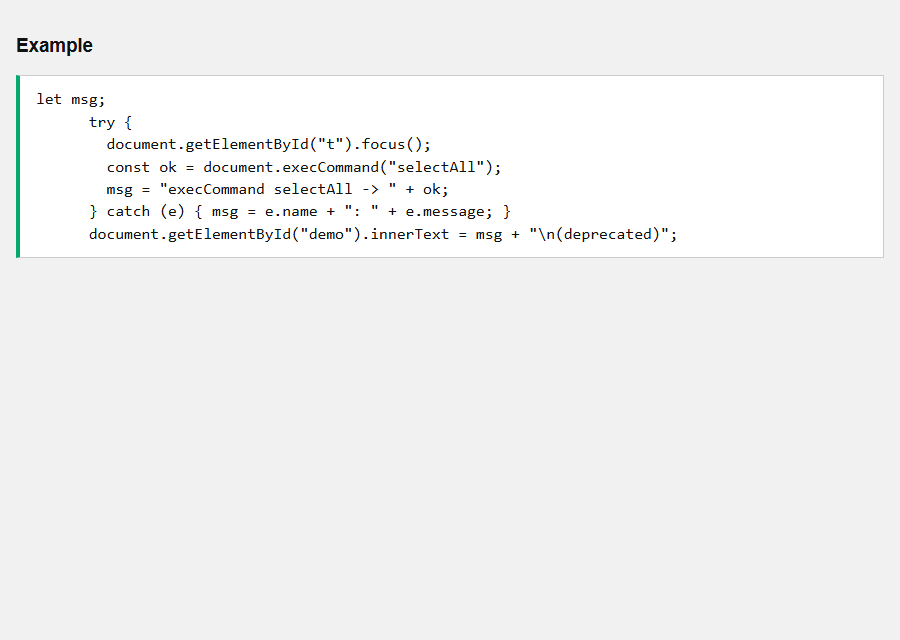


- [x] **Outcome:** `execCommand` may return a boolean or throw. It is **deprecated** — do not use it in new code.

<a id="document-reference-example-28"></a>

### **Example 28: forms**

- [x] **`forms`** — Returns a collection of all <form> elements
- [x] This sandbox **runs** the API from the W3Schools reference table (January 2026 revision).
- [x] Start from `document` (or an element). Wrap risky / deprecated calls in `try/catch` so a missing engine feature still prints a result.

Sandbox: `code_sandbox/document-reference/forms.html`

```javascript
document.getElementById("demo").innerText = "forms=" + document.forms.length + " id=" + document.forms[0].id;
```

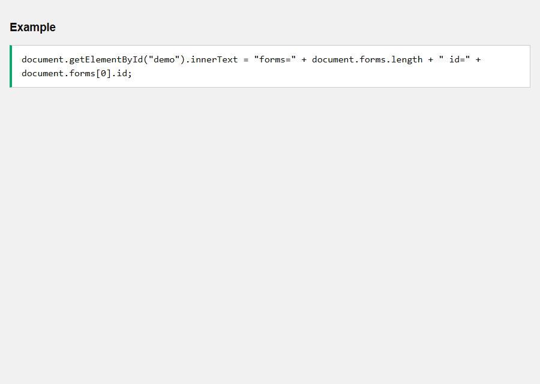


- [x] **Outcome:** `document.forms.length` is **1** and the form id is **frm**.

<a id="document-reference-example-29"></a>

### **Example 29: getElementById()**

- [x] **`getElementById()`** — Returns the element that has the ID attribute with the specified value
- [x] This sandbox **runs** the API from the W3Schools reference table (January 2026 revision).
- [x] Start from `document` (or an element). Wrap risky / deprecated calls in `try/catch` so a missing engine feature still prints a result.

Sandbox: `code_sandbox/document-reference/getelementbyid.html`

```javascript
document.getElementById("demo").innerText = document.getElementById("t").textContent;
```

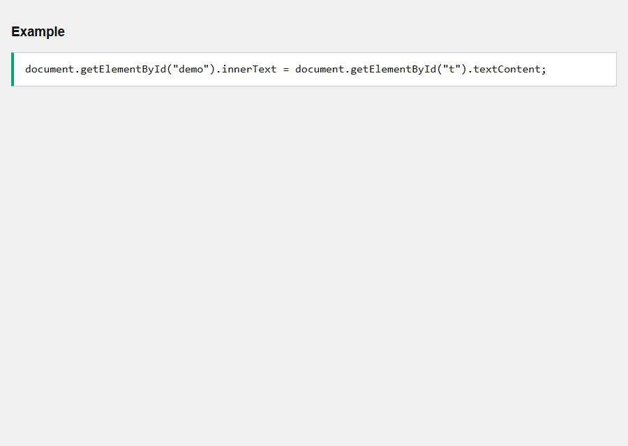


- [x] **Outcome:** `getElementById("t")` returns the Hello World paragraph.

<a id="document-reference-example-30"></a>

### **Example 30: getElementsByClassName()**

- [x] **`getElementsByClassName()`** — Returns an HTMLCollection of elements with the specified class name
- [x] This sandbox **runs** the API from the W3Schools reference table (January 2026 revision).
- [x] Start from `document` (or an element). Wrap risky / deprecated calls in `try/catch` so a missing engine feature still prints a result.

Sandbox: `code_sandbox/document-reference/getelementsbyclassname.html`

```javascript
document.getElementById("demo").innerText = "n=" + document.getElementsByClassName("k").length;
```

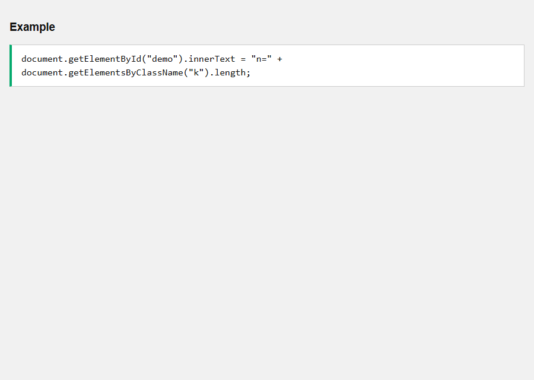


- [x] **Outcome:** Two `.k` nodes are found.

<a id="document-reference-example-31"></a>

### **Example 31: getElementsByName()**

- [x] **`getElementsByName()`** — Returns a live NodeList of elements with the specified name
- [x] This sandbox **runs** the API from the W3Schools reference table (January 2026 revision).
- [x] Start from `document` (or an element). Wrap risky / deprecated calls in `try/catch` so a missing engine feature still prints a result.

Sandbox: `code_sandbox/document-reference/getelementsbyname.html`

```javascript
document.getElementById("demo").innerText = "n=" + document.getElementsByName("user").length;
```


- [x] **Outcome:** `getElementsByName("user")` finds the named input (length **1**).

<a id="document-reference-example-32"></a>

### **Example 32: getElementsByTagName()**

- [x] **`getElementsByTagName()`** — Returns an HTMLCollection of elements with the specified tag name
- [x] This sandbox **runs** the API from the W3Schools reference table (January 2026 revision).
- [x] Start from `document` (or an element). Wrap risky / deprecated calls in `try/catch` so a missing engine feature still prints a result.

Sandbox: `code_sandbox/document-reference/getelementsbytagname.html`

```javascript
document.getElementById("demo").innerText = "p=" + document.getElementsByTagName("p").length;
```

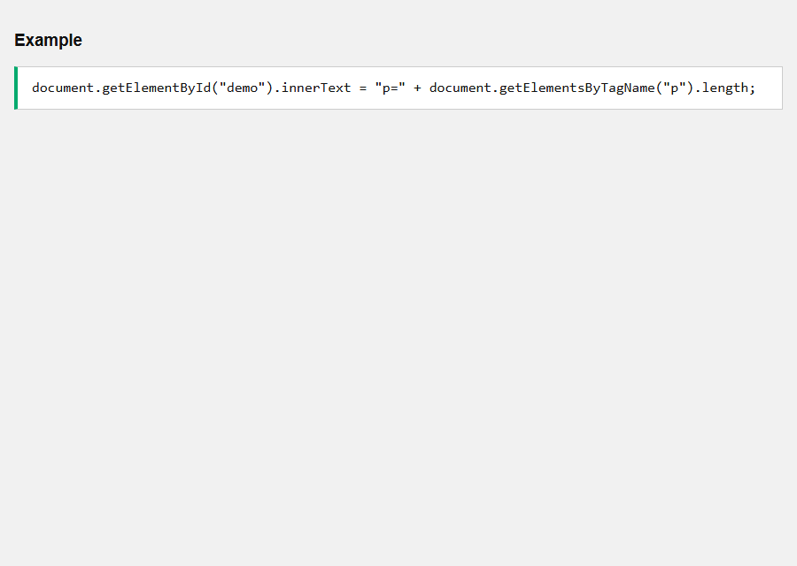


- [x] **Outcome:** The page’s `<p>` count includes the sample paragraphs.

<a id="document-reference-example-33"></a>

### **Example 33: hasFocus()**

- [x] **`hasFocus()`** — Returns whether the document has focus
- [x] This sandbox **runs** the API from the W3Schools reference table (January 2026 revision).
- [x] Start from `document` (or an element). Wrap risky / deprecated calls in `try/catch` so a missing engine feature still prints a result.

Sandbox: `code_sandbox/document-reference/hasfocus.html`

```javascript
document.getElementById("demo").innerText = "hasFocus=" + document.hasFocus();
```

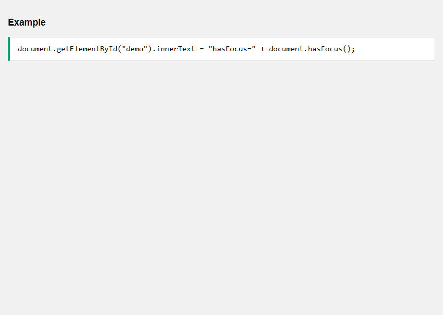


- [x] **Outcome:** `hasFocus()` is a boolean — often **false** in headless screenshots, **true** in an interactive tab.

<a id="document-reference-example-34"></a>

### **Example 34: head**

- [x] **`head`** — Returns the <head> element of the document
- [x] This sandbox **runs** the API from the W3Schools reference table (January 2026 revision).
- [x] Start from `document` (or an element). Wrap risky / deprecated calls in `try/catch` so a missing engine feature still prints a result.

Sandbox: `code_sandbox/document-reference/head.html`

```javascript
document.getElementById("demo").innerText = document.head.tagName + " titleChild=" + !!document.head.querySelector("title");
```

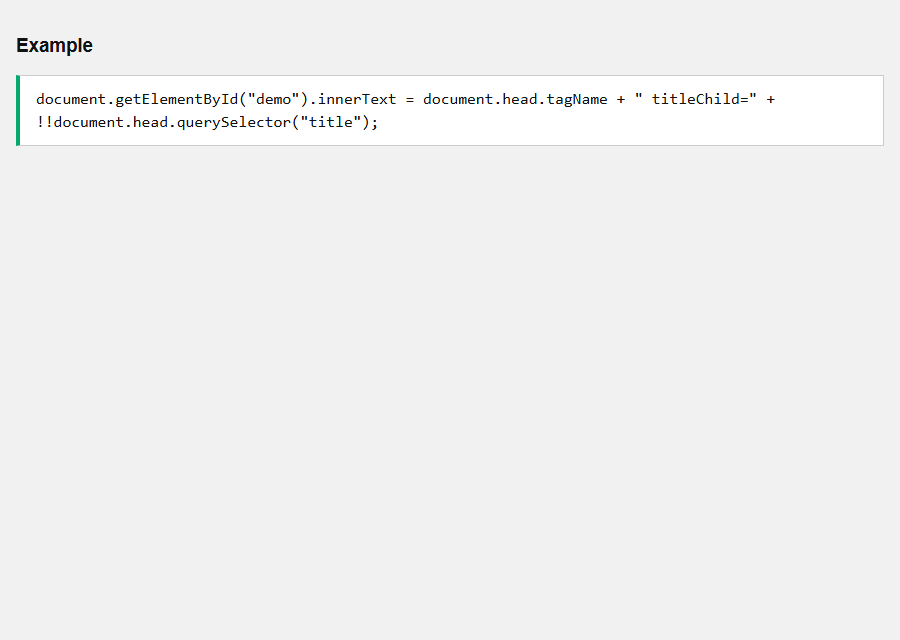


- [x] **Outcome:** `document.head.tagName` is **HEAD**.

<a id="document-reference-example-35"></a>

### **Example 35: images**

- [x] **`images`** — Returns a collection of all  elements
- [x] This sandbox **runs** the API from the W3Schools reference table (January 2026 revision).
- [x] Start from `document` (or an element). Wrap risky / deprecated calls in `try/catch` so a missing engine feature still prints a result.

Sandbox: `code_sandbox/document-reference/images.html`

```javascript
document.getElementById("demo").innerText = "images=" + document.images.length + " alt=" + document.images[0].alt;
```

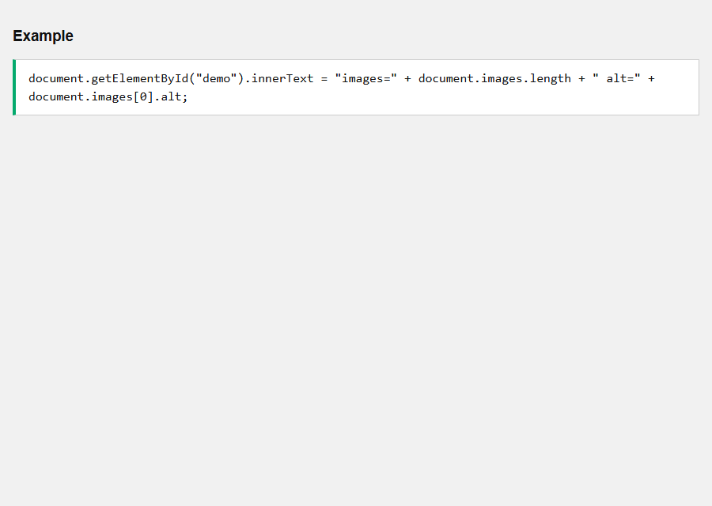


- [x] **Outcome:** `document.images.length` is **1**.

<a id="document-reference-example-36"></a>

### **Example 36: implementation**

- [x] **`implementation`** — Returns the DOMImplementation object that handles this document
- [x] This sandbox **runs** the API from the W3Schools reference table (January 2026 revision).
- [x] Start from `document` (or an element). Wrap risky / deprecated calls in `try/catch` so a missing engine feature still prints a result.

Sandbox: `code_sandbox/document-reference/implementation.html`

```javascript
const im = document.implementation;
      document.getElementById("demo").innerText = "hasFeature=" + typeof im.hasFeature + " createHTMLDocument=" + typeof im.createHTMLDocument;
```

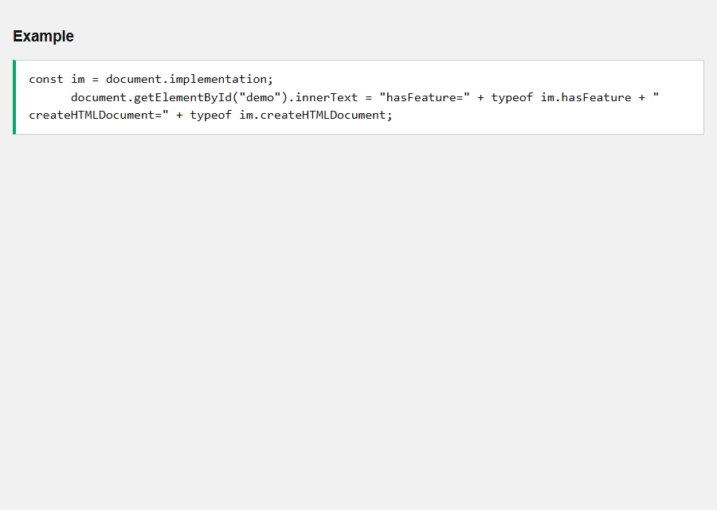

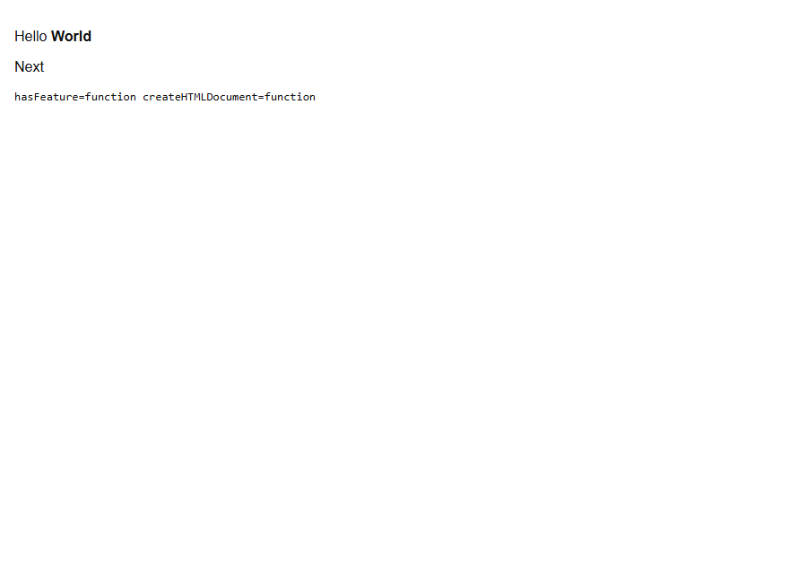

- [x] **Outcome:** `document.implementation` exposes `createHTMLDocument` (and legacy `hasFeature`).

<a id="document-reference-example-37"></a>

### **Example 37: importNode()**

- [x] **`importNode()`** — Imports a node from another document
- [x] This sandbox **runs** the API from the W3Schools reference table (January 2026 revision).
- [x] Start from `document` (or an element). Wrap risky / deprecated calls in `try/catch` so a missing engine feature still prints a result.

Sandbox: `code_sandbox/document-reference/importnode.html`

```javascript
const other = document.getElementById("f").contentDocument;
      other.body.innerHTML = "<span id='x'>imported</span>";
      const copy = document.importNode(other.getElementById("x"), true);
      document.body.appendChild(copy);
      document.getElementById("demo").innerText = copy.textContent + " stillInIframe=" + !!other.getElementById("x");
```

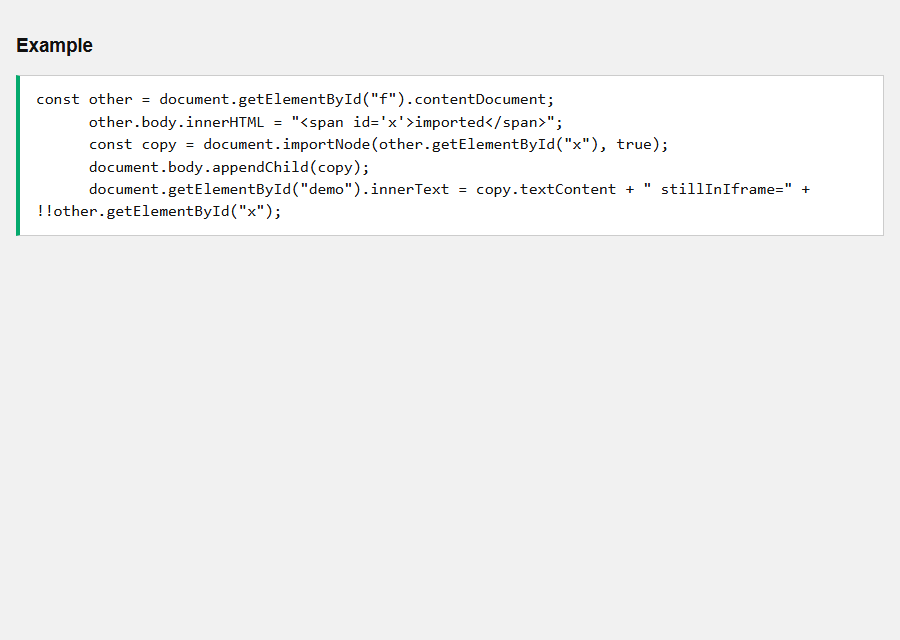

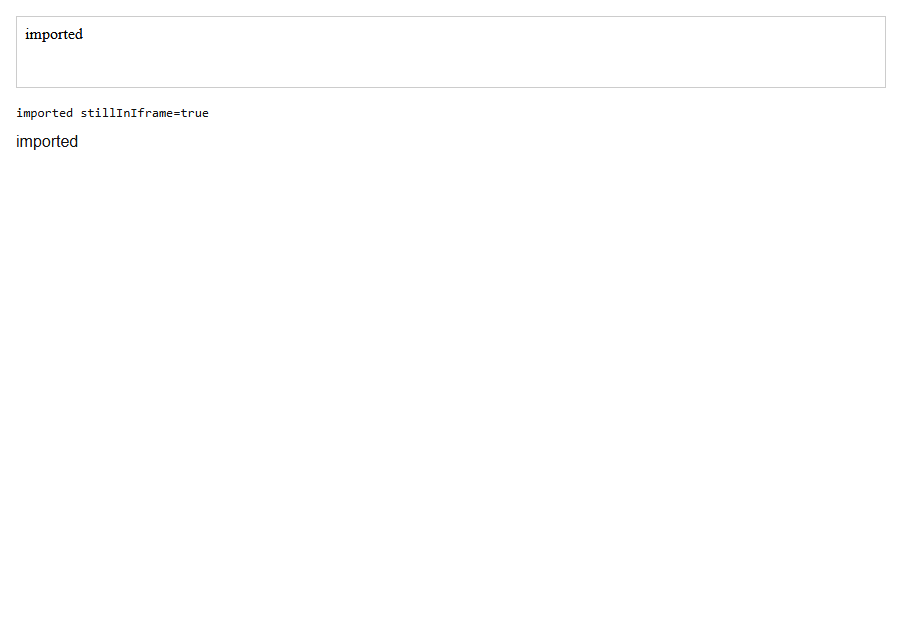

- [x] **Outcome:** `importNode(..., true)` **copies** the node; the iframe original still exists.

<a id="document-reference-example-38"></a>

### **Example 38: inputEncoding**

- [x] **`inputEncoding`** — DEPRECATED
- [x] This sandbox **runs** the API from the W3Schools reference table (January 2026 revision).
- [x] Start from `document` (or an element). Wrap risky / deprecated calls in `try/catch` so a missing engine feature still prints a result.
- [x] Deprecated alias of the encoding.

Sandbox: `code_sandbox/document-reference/inputencoding.html`

```javascript
document.getElementById("demo").innerText = "inputEncoding=" + document.inputEncoding + " (deprecated — use characterSet)";
```

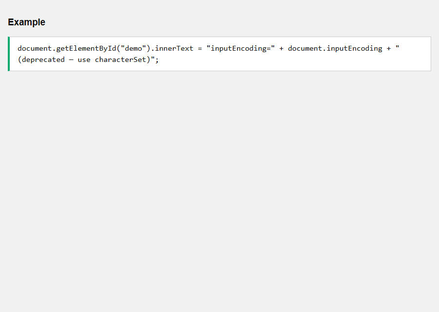

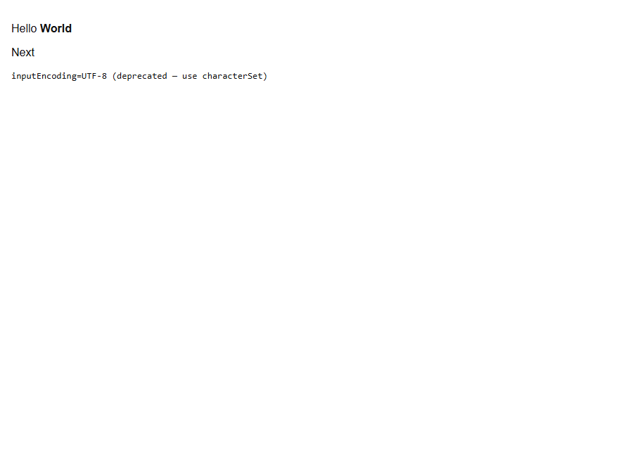

- [x] **Outcome:** `inputEncoding` may still report UTF-8. Prefer **`characterSet`**. **Deprecated**.

<a id="document-reference-example-39"></a>

### **Example 39: lastModified**

- [x] **`lastModified`** — Returns the date and time the document was last modified
- [x] This sandbox **runs** the API from the W3Schools reference table (January 2026 revision).
- [x] Start from `document` (or an element). Wrap risky / deprecated calls in `try/catch` so a missing engine feature still prints a result.

Sandbox: `code_sandbox/document-reference/lastmodified.html`

```javascript
document.getElementById("demo").innerText = document.lastModified;
```


- [x] **Outcome:** `lastModified` is a date string from the server (or file mtime).

<a id="document-reference-example-40"></a>

### **Example 40: links**

- [x] **`links`** — Returns all <a> and <area> elements that have an href
- [x] This sandbox **runs** the API from the W3Schools reference table (January 2026 revision).
- [x] Start from `document` (or an element). Wrap risky / deprecated calls in `try/catch` so a missing engine feature still prints a result.

Sandbox: `code_sandbox/document-reference/links.html`

```javascript
document.getElementById("demo").innerText = "links=" + document.links.length;
```


- [x] **Outcome:** `document.links.length` is **1**.

<a id="document-reference-example-41"></a>

### **Example 41: normalize()**

- [x] **`normalize()`** — Removes empty Text nodes, and joins adjacent text nodes
- [x] This sandbox **runs** the API from the W3Schools reference table (January 2026 revision).
- [x] Start from `document` (or an element). Wrap risky / deprecated calls in `try/catch` so a missing engine feature still prints a result.

Sandbox: `code_sandbox/document-reference/normalize.html`

```javascript
const p = document.getElementById("t");
      p.appendChild(document.createTextNode("A"));
      p.appendChild(document.createTextNode("B"));
      const before = p.childNodes.length;
      p.normalize();
      document.getElementById("demo").innerText = "before=" + before + " after=" + p.childNodes.length;
```

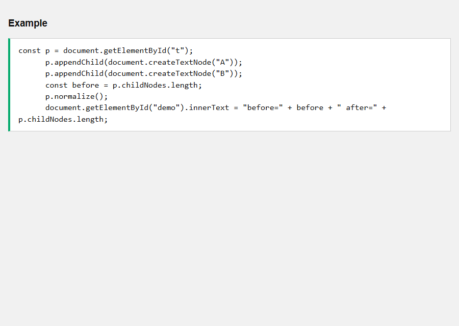


- [x] **Outcome:** `normalize()` merges adjacent text nodes so `childNodes.length` **drops**.

<a id="document-reference-example-42"></a>

### **Example 42: normalizeDocument()**

- [x] **`normalizeDocument()`** — DEPRECATED
- [x] This sandbox **runs** the API from the W3Schools reference table (January 2026 revision).
- [x] Start from `document` (or an element). Wrap risky / deprecated calls in `try/catch` so a missing engine feature still prints a result.
- [x] Do not use `normalizeDocument()`.

Sandbox: `code_sandbox/document-reference/normalizedocument.html`

```javascript
let msg;
      try { msg = "normalizeDocument=" + typeof document.normalizeDocument; document.normalizeDocument && document.normalizeDocument(); }
      catch (e) { msg = e.name + ": " + e.message; }
      document.getElementById("demo").innerText = msg + "\n(deprecated)";
```

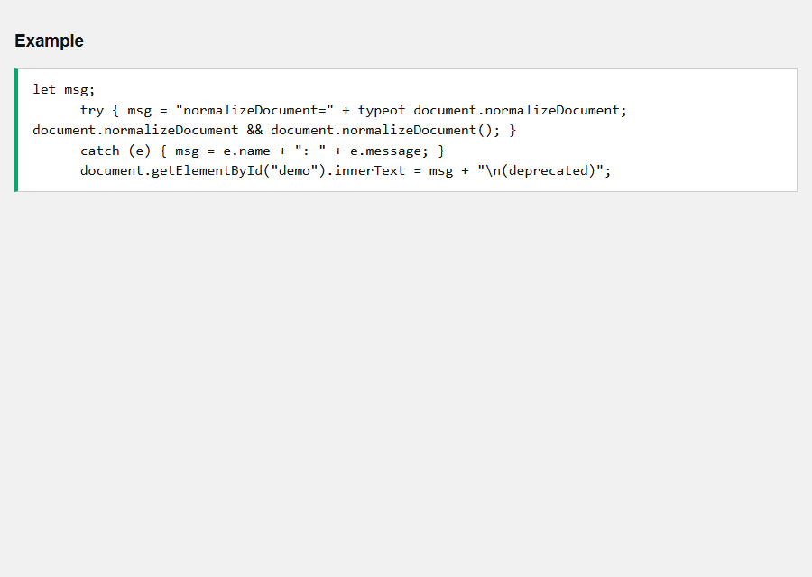


- [x] **Outcome:** `normalizeDocument` is **deprecated** and usually missing. Use `node.normalize()`.

<a id="document-reference-example-43"></a>

### **Example 43: open()**

- [x] **`open()`** — Opens an HTML output stream to collect output from document.write()
- [x] This sandbox **runs** the API from the W3Schools reference table (January 2026 revision).
- [x] Start from `document` (or an element). Wrap risky / deprecated calls in `try/catch` so a missing engine feature still prints a result.

Sandbox: `code_sandbox/document-reference/open.html`

```javascript
const d = document.getElementById("f").contentDocument;
      const stream = d.open();
      d.write("<p>opened</p>");
      d.close();
      document.getElementById("demo").innerText = "wrote into opened stream: " + d.body.innerText;
```

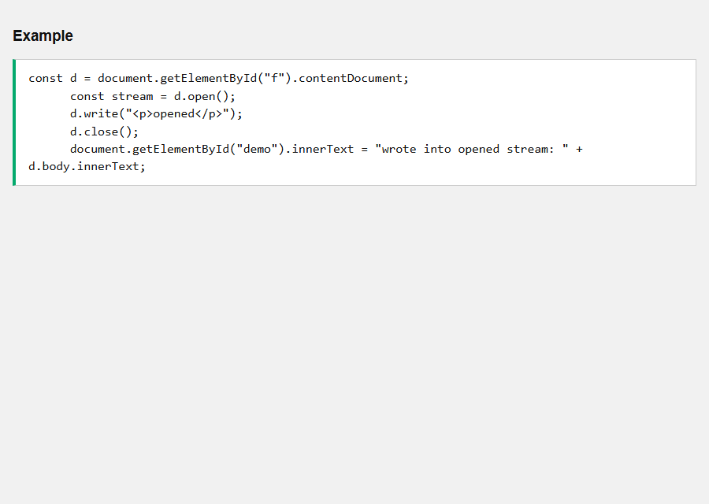

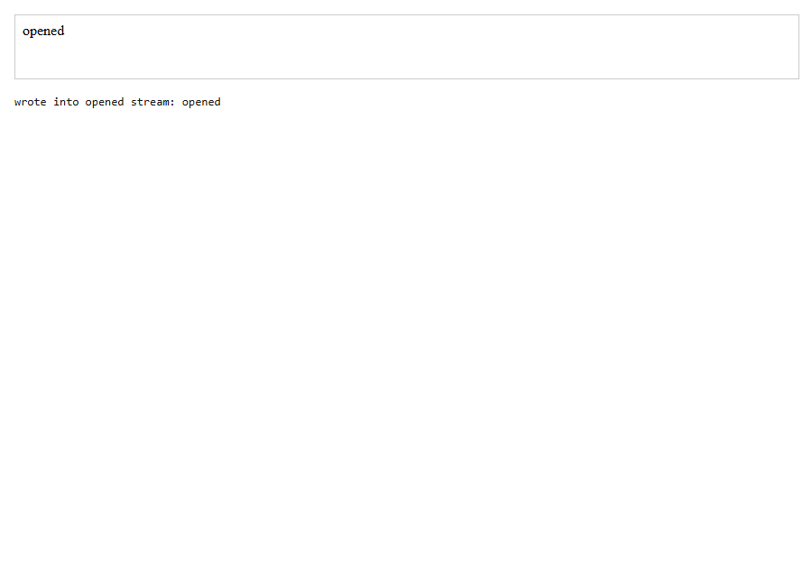

- [x] **Outcome:** `open()` starts a new stream; `write` then fills the iframe with **opened**.

<a id="document-reference-example-44"></a>

### **Example 44: querySelector()**

- [x] **`querySelector()`** — Returns the first element that matches a CSS selector
- [x] This sandbox **runs** the API from the W3Schools reference table (January 2026 revision).
- [x] Start from `document` (or an element). Wrap risky / deprecated calls in `try/catch` so a missing engine feature still prints a result.

Sandbox: `code_sandbox/document-reference/queryselector.html`

```javascript
document.getElementById("demo").innerText = document.querySelector("#t b").textContent;
```

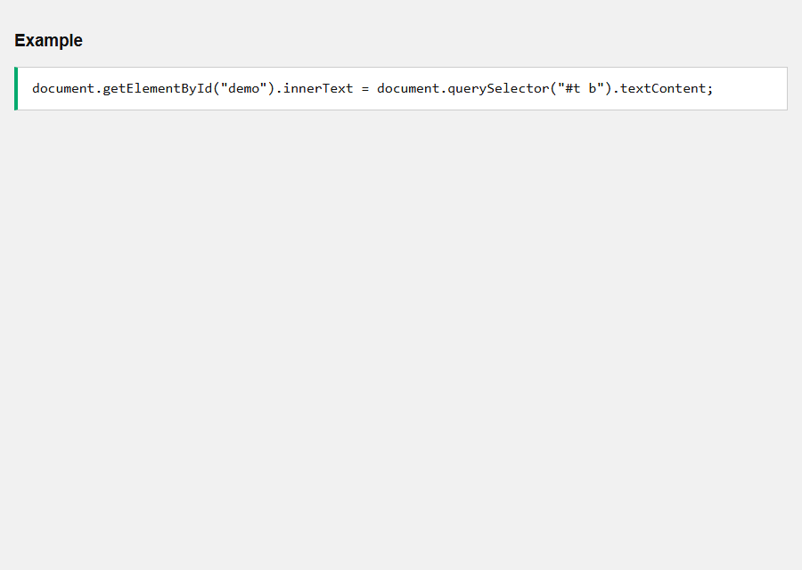


- [x] **Outcome:** `querySelector("#t b")` returns **World**.

<a id="document-reference-example-45"></a>

### **Example 45: querySelectorAll()**

- [x] **`querySelectorAll()`** — Returns a static NodeList of all matching elements
- [x] This sandbox **runs** the API from the W3Schools reference table (January 2026 revision).
- [x] Start from `document` (or an element). Wrap risky / deprecated calls in `try/catch` so a missing engine feature still prints a result.

Sandbox: `code_sandbox/document-reference/queryselectorall.html`

```javascript
document.getElementById("demo").innerText = "n=" + document.querySelectorAll("p").length;
```

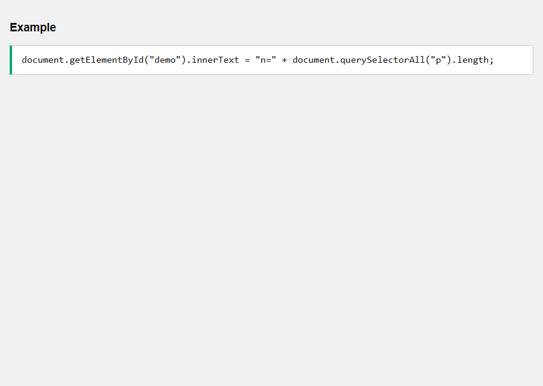


- [x] **Outcome:** `querySelectorAll("p")` counts the sample paragraphs.

<a id="document-reference-example-46"></a>

### **Example 46: readyState**

- [x] **`readyState`** — Returns the (loading) status of the document
- [x] This sandbox **runs** the API from the W3Schools reference table (January 2026 revision).
- [x] Start from `document` (or an element). Wrap risky / deprecated calls in `try/catch` so a missing engine feature still prints a result.

Sandbox: `code_sandbox/document-reference/readystate.html`

```javascript
document.getElementById("demo").innerText = document.readyState;
```

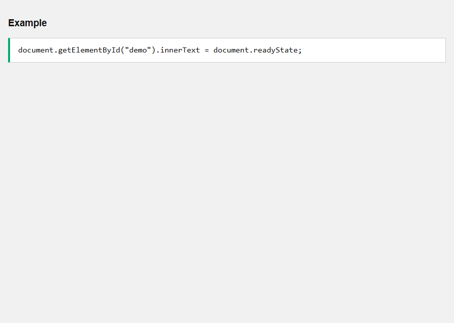


- [x] **Outcome:** By the time this script runs, `readyState` is **interactive** or **complete**.

<a id="document-reference-example-47"></a>

### **Example 47: referrer**

- [x] **`referrer`** — Returns the URL of the document that loaded the current document
- [x] This sandbox **runs** the API from the W3Schools reference table (January 2026 revision).
- [x] Start from `document` (or an element). Wrap risky / deprecated calls in `try/catch` so a missing engine feature still prints a result.

Sandbox: `code_sandbox/document-reference/referrer.html`

```javascript
document.getElementById("demo").innerText = JSON.stringify(document.referrer);
```

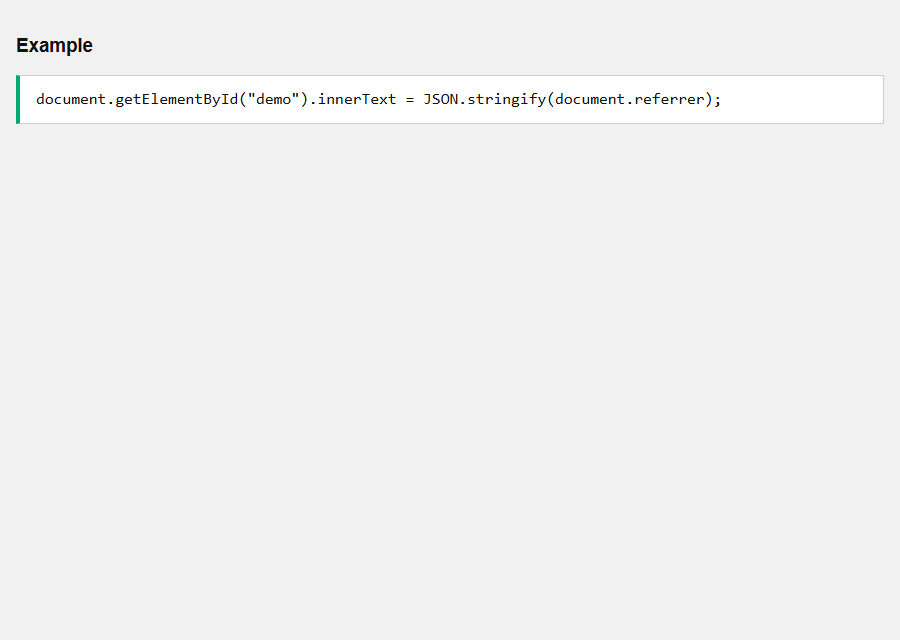


- [x] **Outcome:** `referrer` is often **`""`** for a `file://` screenshot (no previous page).

<a id="document-reference-example-48"></a>

### **Example 48: removeEventListener()**

- [x] **`removeEventListener()`** — Removes an event handler attached with addEventListener
- [x] This sandbox **runs** the API from the W3Schools reference table (January 2026 revision).
- [x] Start from `document` (or an element). Wrap risky / deprecated calls in `try/catch` so a missing engine feature still prints a result.

Sandbox: `code_sandbox/document-reference/removeeventlistener.html`

```javascript
function ping() { document.getElementById("demo").innerText = "should not run"; }
      document.addEventListener("keyup", ping);
      document.removeEventListener("keyup", ping);
      document.dispatchEvent(new KeyboardEvent("keyup"));
      document.getElementById("demo").innerText = (document.getElementById("demo").innerText === "should not run")
        ? "listener still there" : "removed — keyup did nothing";
```

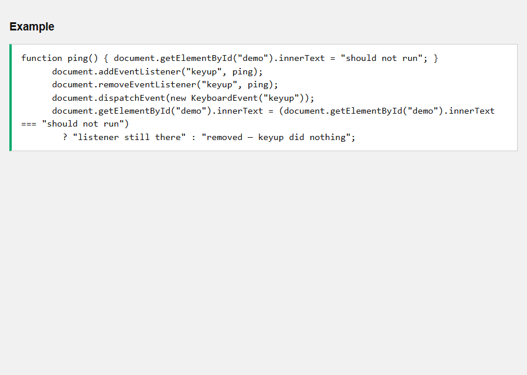


- [x] **Outcome:** After `removeEventListener`, the `keyup` handler does **not** run.

<a id="document-reference-example-49"></a>

### **Example 49: renameNode()**

- [x] **`renameNode()`** — DEPRECATED
- [x] This sandbox **runs** the API from the W3Schools reference table (January 2026 revision).
- [x] Start from `document` (or an element). Wrap risky / deprecated calls in `try/catch` so a missing engine feature still prints a result.
- [x] Do not use `renameNode()`.

Sandbox: `code_sandbox/document-reference/renamenode.html`

```javascript
let msg;
      try { msg = "renameNode=" + typeof document.renameNode; }
      catch (e) { msg = e.name + ": " + e.message; }
      document.getElementById("demo").innerText = msg + " (deprecated)";
```

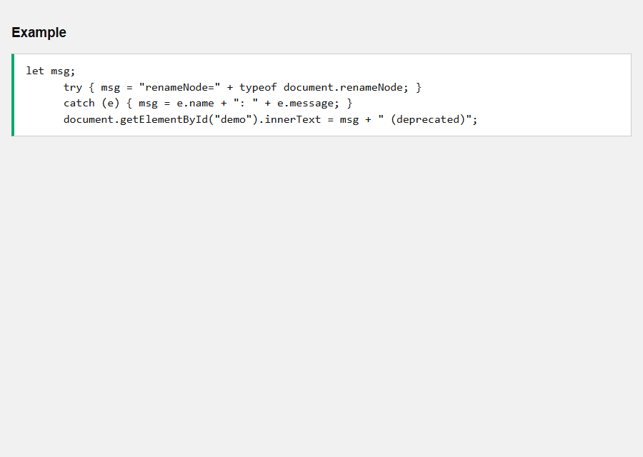


- [x] **Outcome:** `renameNode` is **deprecated** and not available in HTML browsers.

<a id="document-reference-example-50"></a>

### **Example 50: scripts**

- [x] **`scripts`** — Returns a collection of <script> elements
- [x] This sandbox **runs** the API from the W3Schools reference table (January 2026 revision).
- [x] Start from `document` (or an element). Wrap risky / deprecated calls in `try/catch` so a missing engine feature still prints a result.

Sandbox: `code_sandbox/document-reference/scripts.html`

```javascript
document.getElementById("demo").innerText = "scripts=" + document.scripts.length;
```

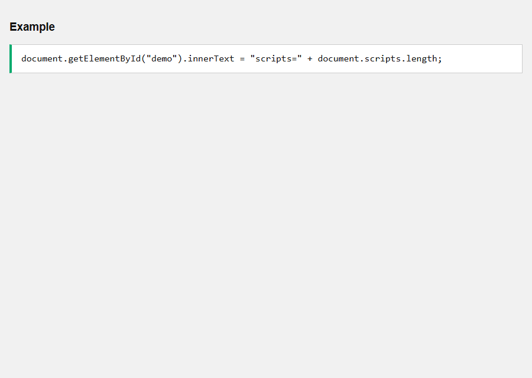


- [x] **Outcome:** `document.scripts.length` is at least **1**.

<a id="document-reference-example-51"></a>

### **Example 51: strictErrorChecking**

- [x] **`strictErrorChecking`** — DEPRECATED
- [x] This sandbox **runs** the API from the W3Schools reference table (January 2026 revision).
- [x] Start from `document` (or an element). Wrap risky / deprecated calls in `try/catch` so a missing engine feature still prints a result.
- [x] Do not use `strictErrorChecking`.

Sandbox: `code_sandbox/document-reference/stricterrorchecking.html`

```javascript
document.getElementById("demo").innerText = "strictErrorChecking=" + document.strictErrorChecking + " (deprecated)";
```

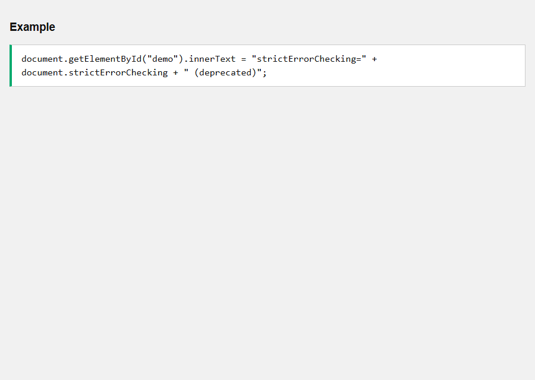

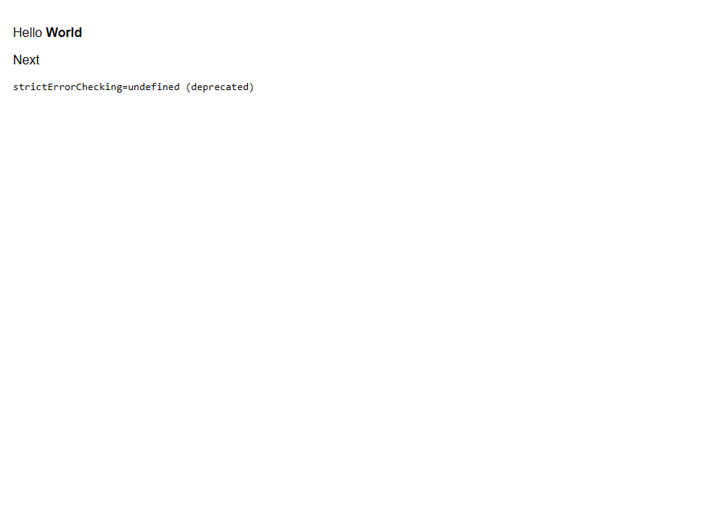

- [x] **Outcome:** `strictErrorChecking` is **deprecated** / typically **undefined**.

<a id="document-reference-example-52"></a>

### **Example 52: title**

- [x] **`title`** — Sets or returns the title of the document
- [x] This sandbox **runs** the API from the W3Schools reference table (January 2026 revision).
- [x] Start from `document` (or an element). Wrap risky / deprecated calls in `try/catch` so a missing engine feature still prints a result.

Sandbox: `code_sandbox/document-reference/title.html`

```javascript
document.title = "Doc Ref";
      document.getElementById("demo").innerText = document.title;
```

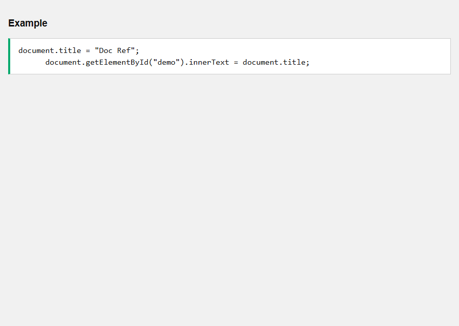


- [x] **Outcome:** `document.title` is set to **Doc Ref**.

<a id="document-reference-example-53"></a>

### **Example 53: URL**

- [x] **`URL`** — Returns the full URL of the HTML document
- [x] This sandbox **runs** the API from the W3Schools reference table (January 2026 revision).
- [x] Start from `document` (or an element). Wrap risky / deprecated calls in `try/catch` so a missing engine feature still prints a result.

Sandbox: `code_sandbox/document-reference/url.html`

```javascript
document.getElementById("demo").innerText = document.URL;
```


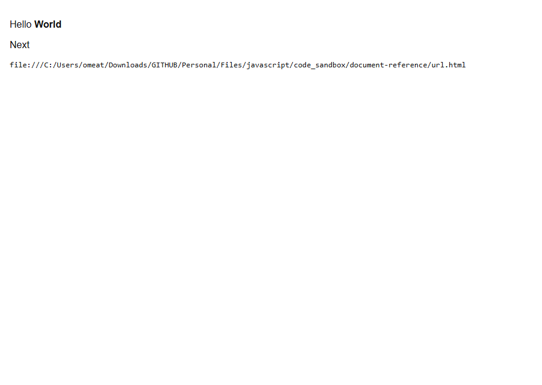

- [x] **Outcome:** `document.URL` is the full document address.

<a id="document-reference-example-54"></a>

### **Example 54: write()**

- [x] **`write()`** — Writes HTML expressions or JavaScript code to a document
- [x] This sandbox **runs** the API from the W3Schools reference table (January 2026 revision).
- [x] Start from `document` (or an element). Wrap risky / deprecated calls in `try/catch` so a missing engine feature still prints a result.
- [x] After load, `write` **overwrites** the document. Use an iframe or `innerHTML` instead.

Sandbox: `code_sandbox/document-reference/write.html`

```javascript
const d = document.getElementById("f").contentDocument;
      d.open();
      d.write("<strong>written</strong>");
      d.close();
      document.getElementById("demo").innerText = d.body.innerHTML;
```

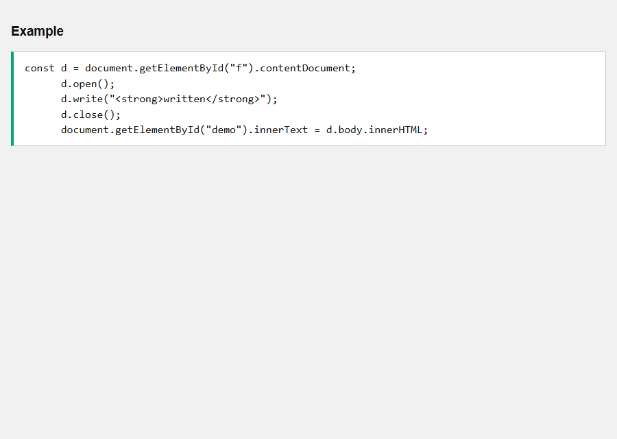

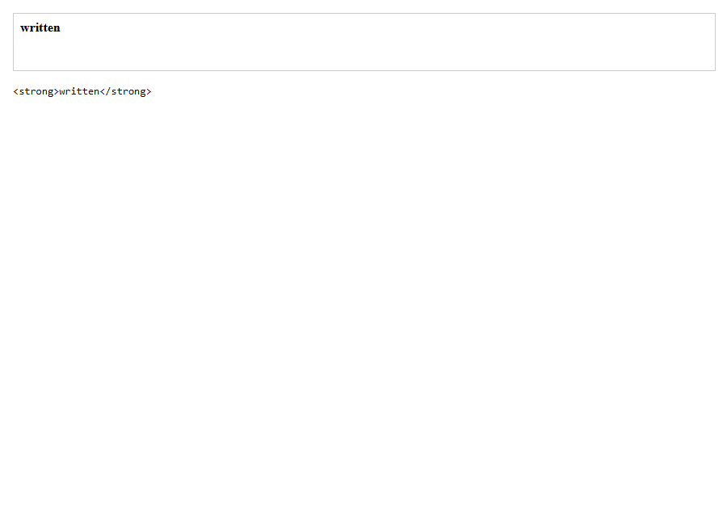

- [x] **Outcome:** The iframe contains **`<strong>written</strong>`**. Never `write` on a loaded main page.

<a id="document-reference-example-55"></a>

### **Example 55: writeln()**

- [x] **`writeln()`** — Same as write(), but adds a newline character after each statement
- [x] This sandbox **runs** the API from the W3Schools reference table (January 2026 revision).
- [x] Start from `document` (or an element). Wrap risky / deprecated calls in `try/catch` so a missing engine feature still prints a result.

Sandbox: `code_sandbox/document-reference/writeln.html`

```javascript
const d = document.getElementById("f").contentDocument;
      d.open();
      d.writeln("<pre>line1");
      d.writeln("line2</pre>");
      d.close();
      document.getElementById("demo").innerText = JSON.stringify(d.body.innerText);
```

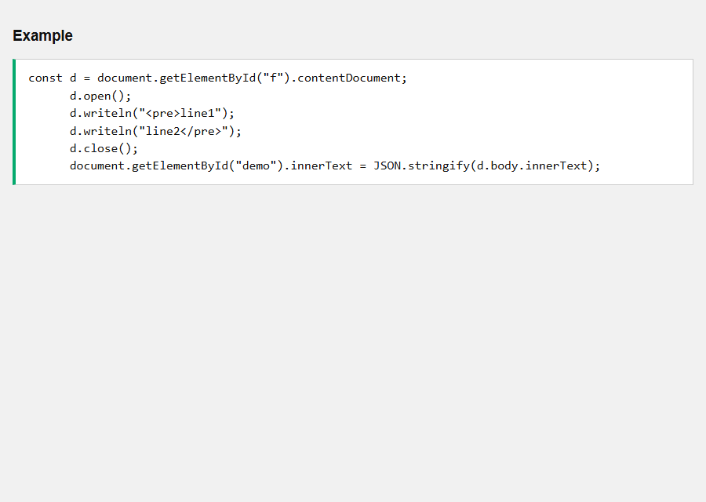


- [x] **Outcome:** `writeln` inserts a **newline** after each call (visible inside `<pre>`).

<details>
  <summary>Terminal Commands</summary>

## Terminal Commands

```bash
# from Personal/Files/javascript/code_sandbox
py -3 -m http.server 8770 --bind 127.0.0.1
```

Then open `http://127.0.0.1:8770/document-reference/`.

</details>

<details>
  <summary>Questions and Answers</summary>

## Questions and Answers

### Question 1: What is `document.documentElement`?

<details>
<summary>Answer</summary>

- [x] The root **`<html>`** element.

</details>

### Question 2: What encoding property should you use?

<details>
<summary>Answer</summary>

- [x] **`characterSet`**. `charset` / `inputEncoding` are deprecated.

</details>

### Question 3: Does `adoptNode` copy or move?

<details>
<summary>Answer</summary>

- [x] It **moves** the node to this document (`ownerDocument` changes).

</details>

### Question 4: Does `importNode` copy or move?

<details>
<summary>Answer</summary>

- [x] It **copies**. The original stays in the other document.

</details>

### Question 5: What does `readyState` become after load?

<details>
<summary>Answer</summary>

- [x] **`complete`** (it may be `interactive` while scripts still run).

</details>

### Question 6: Why is `document.write` dangerous after load?

<details>
<summary>Answer</summary>

- [x] It **replaces** the entire document.

</details>

### Question 7: How do you undo `addEventListener`?

<details>
<summary>Answer</summary>

- [x] Call **`removeEventListener`** with the **same** function reference.

</details>

### Question 8: What is `document.defaultView`?

<details>
<summary>Answer</summary>

- [x] The associated **`window`** (or `null`).

</details>

### Question 9: Should you use `execCommand`?

<details>
<summary>Answer</summary>

- [x] No — it is **deprecated**.

</details>

### Question 10: What does `normalize()` do on a node?

<details>
<summary>Answer</summary>

- [x] Merges adjacent **text** nodes and removes empty ones.

</details>

### Question 11: What is in `document.forms`?

<details>
<summary>Answer</summary>

- [x] Every **`<form>`** in the document.

</details>

### Question 12: What does `hasFocus()` tell you?

<details>
<summary>Answer</summary>

- [x] Whether **this document** currently has focus.

</details>


</details>

## Summary

Use `document` as the entry point. Prefer `characterSet`, `querySelector`, and `createElement`. Avoid write-after-load and the deprecated rows.

## References

- [HTML DOM Document](https://www.w3schools.com/js/js_htmldom_document.asp)
- [MDN Document](https://developer.mozilla.org/en-US/docs/Web/API/Document)

</details>

<details>
  <summary>Element Reference</summary>

## Introduction

Every HTML element is an object with properties and methods. This catalog rebuilds **every** W3Schools Element row (January 2026 table).

This section has **91** examples:

- [x] **Example 1:** accessKey [View](#element-reference-example-01)
- [x] **Example 2:** addEventListener() [View](#element-reference-example-02)
- [x] **Example 3:** after() [View](#element-reference-example-03)
- [x] **Example 4:** append() [View](#element-reference-example-04)
- [x] **Example 5:** appendChild() [View](#element-reference-example-05)
- [x] **Example 6:** attributes [View](#element-reference-example-06)
- [x] **Example 7:** before() [View](#element-reference-example-07)
- [x] **Example 8:** blur() [View](#element-reference-example-08)
- [x] **Example 9:** childElementCount [View](#element-reference-example-09)
- [x] **Example 10:** childNodes [View](#element-reference-example-10)
- [x] **Example 11:** children [View](#element-reference-example-11)
- [x] **Example 12:** classList [View](#element-reference-example-12)
- [x] **Example 13:** className [View](#element-reference-example-13)
- [x] **Example 14:** click() [View](#element-reference-example-14)
- [x] **Example 15:** clientHeight [View](#element-reference-example-15)
- [x] **Example 16:** clientLeft [View](#element-reference-example-16)
- [x] **Example 17:** clientTop [View](#element-reference-example-17)
- [x] **Example 18:** clientWidth [View](#element-reference-example-18)
- [x] **Example 19:** cloneNode() [View](#element-reference-example-19)
- [x] **Example 20:** closest() [View](#element-reference-example-20)
- [x] **Example 21:** compareDocumentPosition() [View](#element-reference-example-21)
- [x] **Example 22:** contains() [View](#element-reference-example-22)
- [x] **Example 23:** contentEditable [View](#element-reference-example-23)
- [x] **Example 24:** dir [View](#element-reference-example-24)
- [x] **Example 25:** firstChild [View](#element-reference-example-25)
- [x] **Example 26:** firstElementChild [View](#element-reference-example-26)
- [x] **Example 27:** focus() [View](#element-reference-example-27)
- [x] **Example 28:** getAttribute() [View](#element-reference-example-28)
- [x] **Example 29:** getAttributeNode() [View](#element-reference-example-29)
- [x] **Example 30:** getBoundingClientRect() [View](#element-reference-example-30)
- [x] **Example 31:** getElementsByClassName() [View](#element-reference-example-31)
- [x] **Example 32:** getElementsByTagName() [View](#element-reference-example-32)
- [x] **Example 33:** hasAttribute() [View](#element-reference-example-33)
- [x] **Example 34:** hasAttributes() [View](#element-reference-example-34)
- [x] **Example 35:** hasChildNodes() [View](#element-reference-example-35)
- [x] **Example 36:** id [View](#element-reference-example-36)
- [x] **Example 37:** innerHTML [View](#element-reference-example-37)
- [x] **Example 38:** innerText [View](#element-reference-example-38)
- [x] **Example 39:** insertAdjacentElement() [View](#element-reference-example-39)
- [x] **Example 40:** insertAdjacentHTML() [View](#element-reference-example-40)
- [x] **Example 41:** insertAdjacentText() [View](#element-reference-example-41)
- [x] **Example 42:** insertBefore() [View](#element-reference-example-42)
- [x] **Example 43:** isContentEditable [View](#element-reference-example-43)
- [x] **Example 44:** isDefaultNamespace() [View](#element-reference-example-44)
- [x] **Example 45:** isEqualNode() [View](#element-reference-example-45)
- [x] **Example 46:** isSameNode() [View](#element-reference-example-46)
- [x] **Example 47:** isSupported() [View](#element-reference-example-47)
- [x] **Example 48:** lang [View](#element-reference-example-48)
- [x] **Example 49:** lastChild [View](#element-reference-example-49)
- [x] **Example 50:** lastElementChild [View](#element-reference-example-50)
- [x] **Example 51:** matches() [View](#element-reference-example-51)
- [x] **Example 52:** namespaceURI [View](#element-reference-example-52)
- [x] **Example 53:** nextSibling [View](#element-reference-example-53)
- [x] **Example 54:** nextElementSibling [View](#element-reference-example-54)
- [x] **Example 55:** nodeName [View](#element-reference-example-55)
- [x] **Example 56:** nodeType [View](#element-reference-example-56)
- [x] **Example 57:** nodeValue [View](#element-reference-example-57)
- [x] **Example 58:** normalize() [View](#element-reference-example-58)
- [x] **Example 59:** offsetHeight [View](#element-reference-example-59)
- [x] **Example 60:** offsetWidth [View](#element-reference-example-60)
- [x] **Example 61:** offsetLeft [View](#element-reference-example-61)
- [x] **Example 62:** offsetParent [View](#element-reference-example-62)
- [x] **Example 63:** offsetTop [View](#element-reference-example-63)
- [x] **Example 64:** outerHTML [View](#element-reference-example-64)
- [x] **Example 65:** outerText [View](#element-reference-example-65)
- [x] **Example 66:** ownerDocument [View](#element-reference-example-66)
- [x] **Example 67:** parentNode [View](#element-reference-example-67)
- [x] **Example 68:** parentElement [View](#element-reference-example-68)
- [x] **Example 69:** previousSibling [View](#element-reference-example-69)
- [x] **Example 70:** previousElementSibling [View](#element-reference-example-70)
- [x] **Example 71:** querySelector() [View](#element-reference-example-71)
- [x] **Example 72:** querySelectorAll() [View](#element-reference-example-72)
- [x] **Example 73:** remove() [View](#element-reference-example-73)
- [x] **Example 74:** removeAttribute() [View](#element-reference-example-74)
- [x] **Example 75:** removeAttributeNode() [View](#element-reference-example-75)
- [x] **Example 76:** removeChild() [View](#element-reference-example-76)
- [x] **Example 77:** removeEventListener() [View](#element-reference-example-77)
- [x] **Example 78:** replaceChild() [View](#element-reference-example-78)
- [x] **Example 79:** scrollHeight [View](#element-reference-example-79)
- [x] **Example 80:** scrollIntoView() [View](#element-reference-example-80)
- [x] **Example 81:** scrollLeft [View](#element-reference-example-81)
- [x] **Example 82:** scrollTop [View](#element-reference-example-82)
- [x] **Example 83:** scrollWidth [View](#element-reference-example-83)
- [x] **Example 84:** setAttribute() [View](#element-reference-example-84)
- [x] **Example 85:** setAttributeNode() [View](#element-reference-example-85)
- [x] **Example 86:** style [View](#element-reference-example-86)
- [x] **Example 87:** tabIndex [View](#element-reference-example-87)
- [x] **Example 88:** tagName [View](#element-reference-example-88)
- [x] **Example 89:** textContent [View](#element-reference-example-89)
- [x] **Example 90:** title [View](#element-reference-example-90)
- [x] **Example 91:** toString() [View](#element-reference-example-91)

## Detailed Explanation

- [x] Tree walking: `parentElement`, `children`, `nextElementSibling`, `closest`.
- [x] Content: `innerHTML`, `textContent`, `innerText`, `outerHTML`.
- [x] Geometry: `client*`, `offset*`, `scroll*`, `getBoundingClientRect`.

<a id="element-reference-example-01"></a>

### **Example 1: accessKey**

- [x] **`accessKey`** — Sets or returns the accesskey attribute of an element
- [x] This sandbox **runs** the API from the W3Schools reference table (January 2026 revision).
- [x] Start from `document` (or an element). Wrap risky / deprecated calls in `try/catch` so a missing engine feature still prints a result.

Sandbox: `code_sandbox/element-reference/accesskey.html`

```javascript
const w = document.getElementById("wrap");
      document.getElementById("demo").innerText = "accessKey=" + w.accessKey;
      w.accessKey = "q";
      document.getElementById("demo").innerText += "\nafter=" + w.accessKey;
```

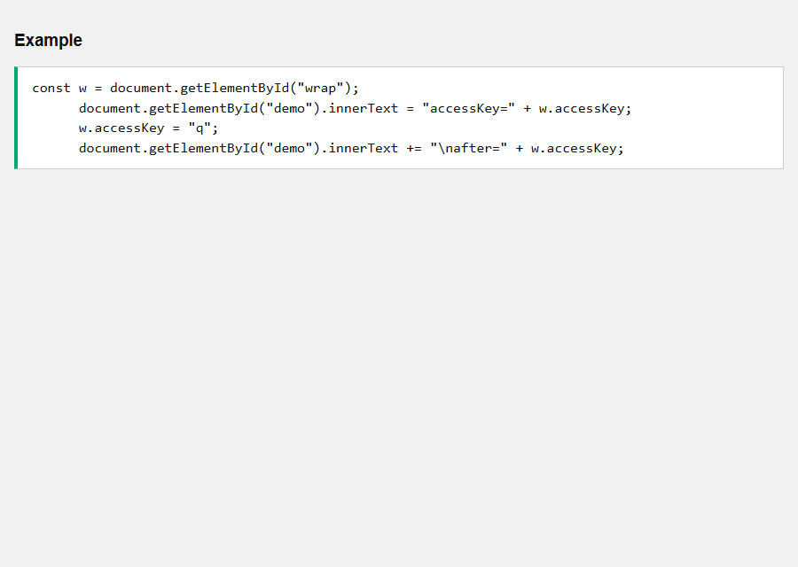


- [x] **Outcome:** `accessKey` starts as **w** and is set to **q**.

<a id="element-reference-example-02"></a>

### **Example 2: addEventListener()**

- [x] **`addEventListener()`** — Attaches an event handler to an element
- [x] This sandbox **runs** the API from the W3Schools reference table (January 2026 revision).
- [x] Start from `document` (or an element). Wrap risky / deprecated calls in `try/catch` so a missing engine feature still prints a result.

Sandbox: `code_sandbox/element-reference/addeventlistener.html`

```javascript
const t = document.getElementById("t");
      t.addEventListener("click", function () { document.getElementById("demo").innerText = "p clicked"; });
      t.click();
```

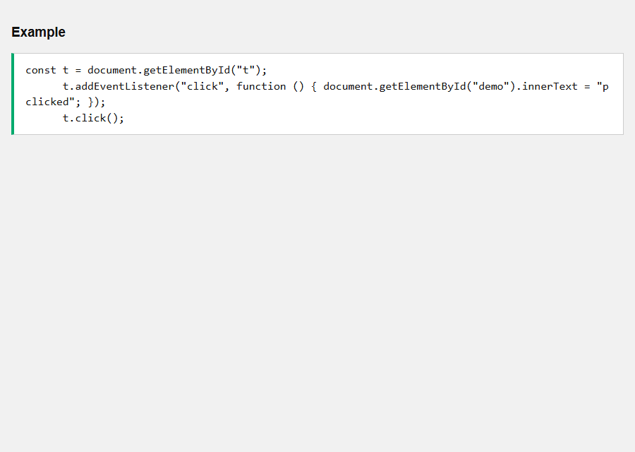


- [x] **Outcome:** The paragraph listener runs on `click()`: **p clicked**.

<a id="element-reference-example-03"></a>

### **Example 3: after()**

- [x] **`after()`** — Inserts nodes or strings after an element
- [x] This sandbox **runs** the API from the W3Schools reference table (January 2026 revision).
- [x] Start from `document` (or an element). Wrap risky / deprecated calls in `try/catch` so a missing engine feature still prints a result.

Sandbox: `code_sandbox/element-reference/after.html`

```javascript
document.getElementById("t").after("AFTER");
      document.getElementById("demo").innerText = document.getElementById("wrap").innerText.replace(/\s+/g, " ");
```

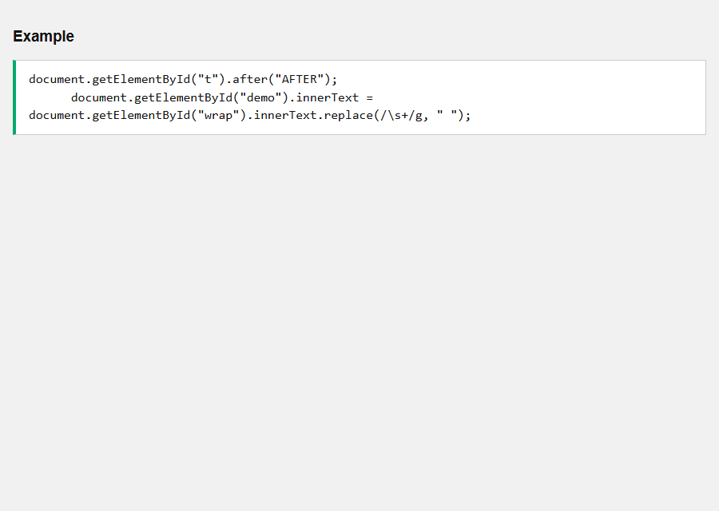


- [x] **Outcome:** The string **AFTER** is inserted as a sibling after `#t`.

<a id="element-reference-example-04"></a>

### **Example 4: append()**

- [x] **`append()`** — Appends nodes or strings after the last child
- [x] This sandbox **runs** the API from the W3Schools reference table (January 2026 revision).
- [x] Start from `document` (or an element). Wrap risky / deprecated calls in `try/catch` so a missing engine feature still prints a result.

Sandbox: `code_sandbox/element-reference/append.html`

```javascript
document.getElementById("t").append("!");
      document.getElementById("demo").innerText = document.getElementById("t").textContent;
```

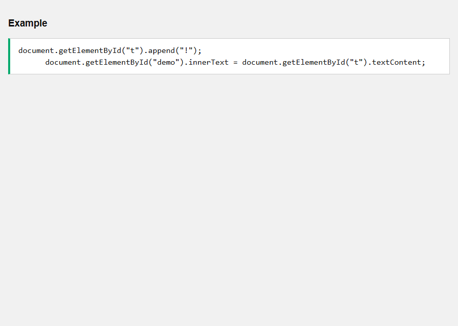


- [x] **Outcome:** `append("!")` adds **!** after Hello World.

<a id="element-reference-example-05"></a>

### **Example 5: appendChild()**

- [x] **`appendChild()`** — Adds a new child node after the last child
- [x] This sandbox **runs** the API from the W3Schools reference table (January 2026 revision).
- [x] Start from `document` (or an element). Wrap risky / deprecated calls in `try/catch` so a missing engine feature still prints a result.

Sandbox: `code_sandbox/element-reference/appendchild.html`

```javascript
const s = document.createElement("span");
      s.textContent = "+";
      document.getElementById("t").appendChild(s);
      document.getElementById("demo").innerText = document.getElementById("t").innerHTML;
```

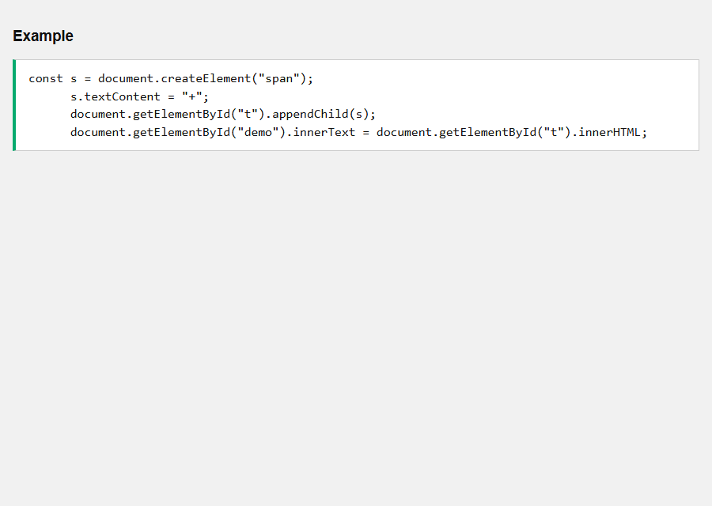

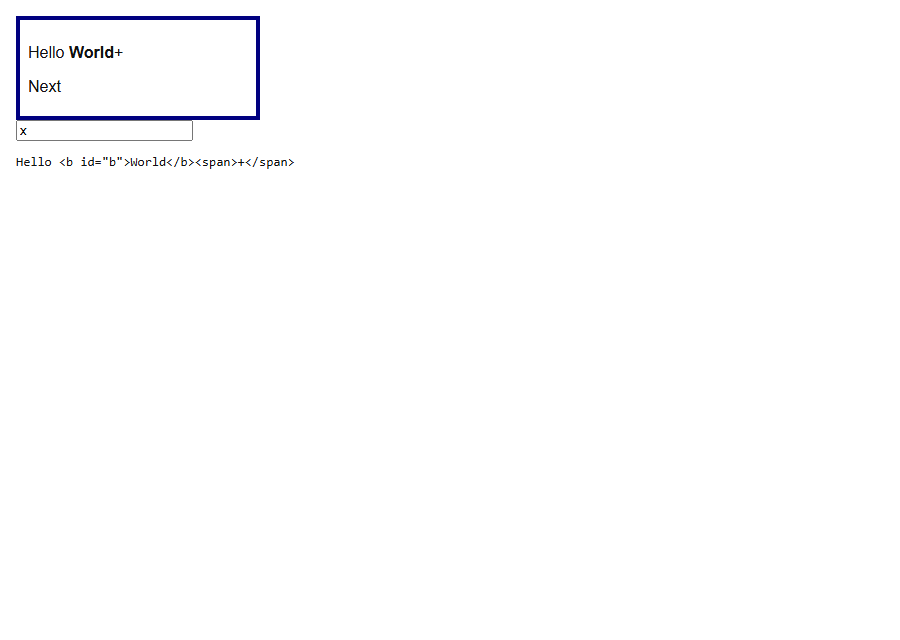

- [x] **Outcome:** A `<span>+</span>` is the last child of `#t`.

<a id="element-reference-example-06"></a>

### **Example 6: attributes**

- [x] **`attributes`** — Returns a NamedNodeMap of an element's attributes
- [x] This sandbox **runs** the API from the W3Schools reference table (January 2026 revision).
- [x] Start from `document` (or an element). Wrap risky / deprecated calls in `try/catch` so a missing engine feature still prints a result.

Sandbox: `code_sandbox/element-reference/attributes.html`

```javascript
const a = document.getElementById("t").attributes;
      document.getElementById("demo").innerText = "n=" + a.length + " id=" + a.getNamedItem("id").value;
```

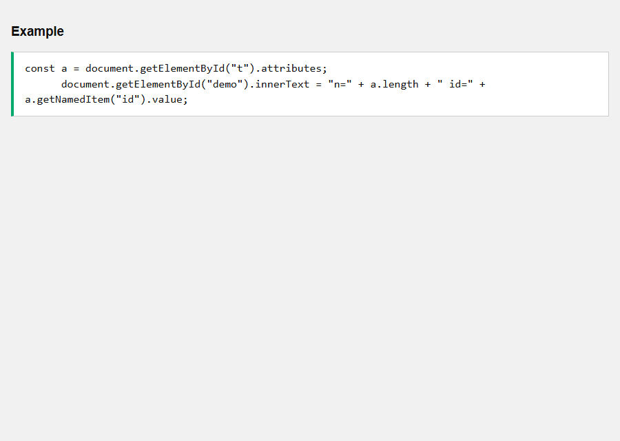


- [x] **Outcome:** `attributes` includes **id**, **class**, and **data-k**.

<a id="element-reference-example-07"></a>

### **Example 7: before()**

- [x] **`before()`** — Inserts nodes or strings before an element
- [x] This sandbox **runs** the API from the W3Schools reference table (January 2026 revision).
- [x] Start from `document` (or an element). Wrap risky / deprecated calls in `try/catch` so a missing engine feature still prints a result.

Sandbox: `code_sandbox/element-reference/before.html`

```javascript
document.getElementById("u").before("BEFORE");
      document.getElementById("demo").innerText = document.getElementById("wrap").innerText.replace(/\s+/g, " ");
```

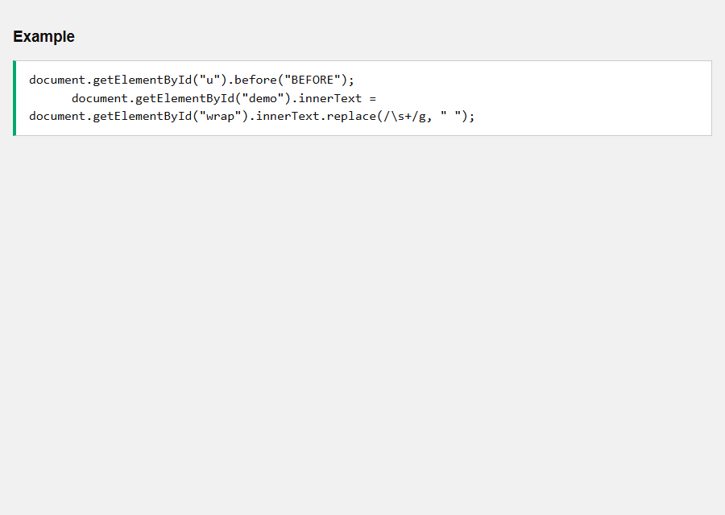


- [x] **Outcome:** **BEFORE** is inserted as a sibling in front of `#u`.

<a id="element-reference-example-08"></a>

### **Example 8: blur()**

- [x] **`blur()`** — Removes focus from an element
- [x] This sandbox **runs** the API from the W3Schools reference table (January 2026 revision).
- [x] Start from `document` (or an element). Wrap risky / deprecated calls in `try/catch` so a missing engine feature still prints a result.

Sandbox: `code_sandbox/element-reference/blur.html`

```javascript
const inp = document.getElementById("inp");
      inp.focus();
      const a = document.activeElement && document.activeElement.id;
      inp.blur();
      const b = document.activeElement && document.activeElement.id;
      document.getElementById("demo").innerText = "focused=" + a + " afterBlur=" + b;
```

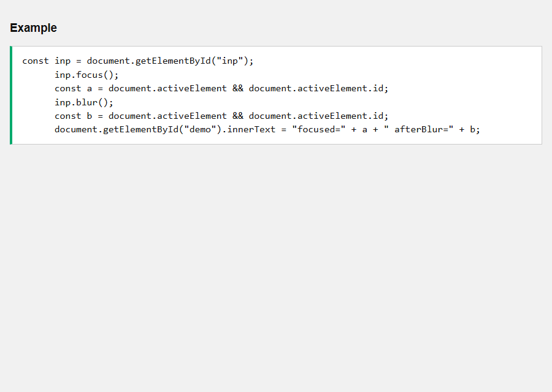


- [x] **Outcome:** `blur()` moves focus off the input (`afterBlur` is no longer **inp** if focus worked).

<a id="element-reference-example-09"></a>

### **Example 9: childElementCount**

- [x] **`childElementCount`** — Returns an element's number of child elements
- [x] This sandbox **runs** the API from the W3Schools reference table (January 2026 revision).
- [x] Start from `document` (or an element). Wrap risky / deprecated calls in `try/catch` so a missing engine feature still prints a result.

Sandbox: `code_sandbox/element-reference/childelementcount.html`

```javascript
document.getElementById("demo").innerText = "wrap=" + document.getElementById("wrap").childElementCount;
```

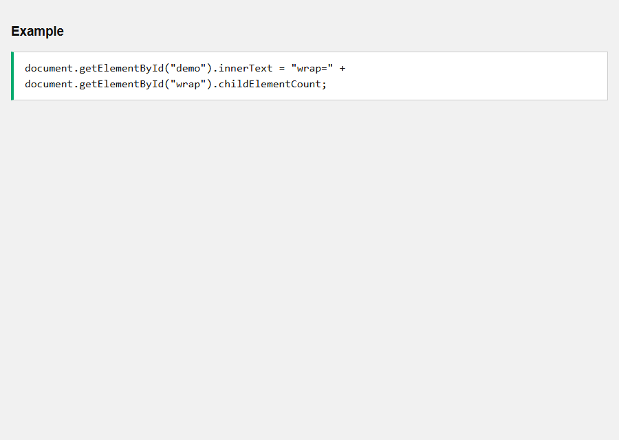


- [x] **Outcome:** `#wrap` has **2** child elements (`#t` and `#u`).

<a id="element-reference-example-10"></a>

### **Example 10: childNodes**

- [x] **`childNodes`** — Returns a NodeList of an element's child nodes
- [x] This sandbox **runs** the API from the W3Schools reference table (January 2026 revision).
- [x] Start from `document` (or an element). Wrap risky / deprecated calls in `try/catch` so a missing engine feature still prints a result.

Sandbox: `code_sandbox/element-reference/childnodes.html`

```javascript
document.getElementById("demo").innerText = "t.childNodes=" + document.getElementById("t").childNodes.length;
```


- [x] **Outcome:** `#t.childNodes` includes the Hello text node and the `<b>` (length **2** or more if whitespace).

<a id="element-reference-example-11"></a>

### **Example 11: children**

- [x] **`children`** — Returns an HTMLCollection of an element's child elements
- [x] This sandbox **runs** the API from the W3Schools reference table (January 2026 revision).
- [x] Start from `document` (or an element). Wrap risky / deprecated calls in `try/catch` so a missing engine feature still prints a result.

Sandbox: `code_sandbox/element-reference/children.html`

```javascript
document.getElementById("demo").innerText = "t.children=" + document.getElementById("t").children.length + " " + document.getElementById("t").children[0].tagName;
```

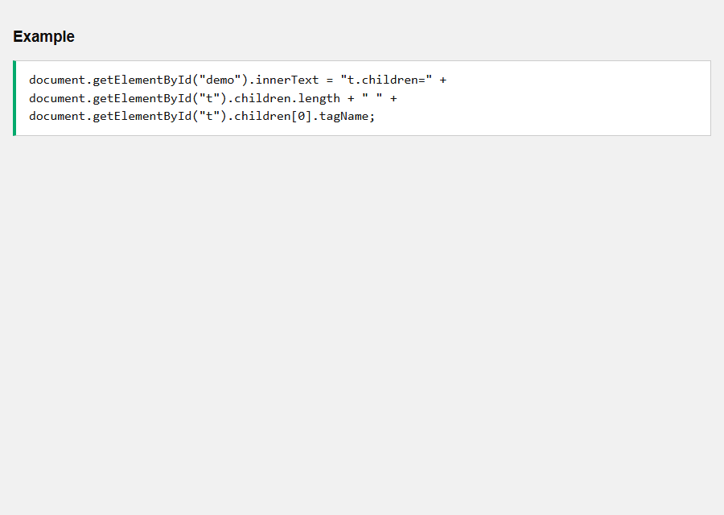


- [x] **Outcome:** `#t.children.length` is **1** (`B`).

<a id="element-reference-example-12"></a>

### **Example 12: classList**

- [x] **`classList`** — Returns the class name(s) of an element as a DOMTokenList
- [x] This sandbox **runs** the API from the W3Schools reference table (January 2026 revision).
- [x] Start from `document` (or an element). Wrap risky / deprecated calls in `try/catch` so a missing engine feature still prints a result.

Sandbox: `code_sandbox/element-reference/classlist.html`

```javascript
const cl = document.getElementById("t").classList;
      cl.add("extra");
      document.getElementById("demo").innerText = [...cl].join(",");
```

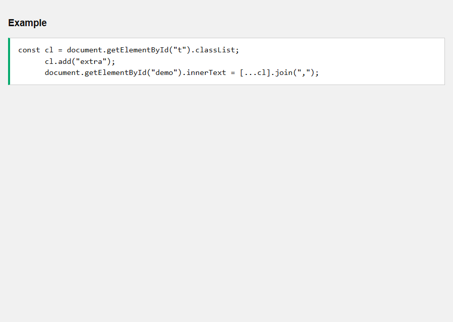


- [x] **Outcome:** `classList` is **note,item,extra** after `add`.

<a id="element-reference-example-13"></a>

### **Example 13: className**

- [x] **`className`** — Sets or returns the value of the class attribute
- [x] This sandbox **runs** the API from the W3Schools reference table (January 2026 revision).
- [x] Start from `document` (or an element). Wrap risky / deprecated calls in `try/catch` so a missing engine feature still prints a result.

Sandbox: `code_sandbox/element-reference/classname.html`

```javascript
const t = document.getElementById("t");
      document.getElementById("demo").innerText = t.className;
      t.className = "only";
      document.getElementById("demo").innerText += " -> " + t.className;
```

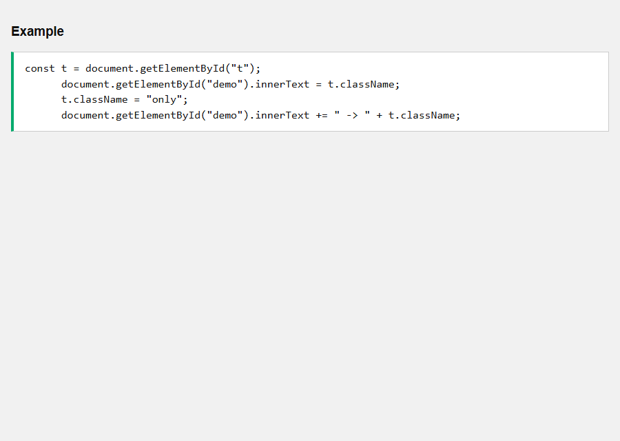


- [x] **Outcome:** `className` starts as **note item** and is replaced with **only**.

<a id="element-reference-example-14"></a>

### **Example 14: click()**

- [x] **`click()`** — Simulates a mouse-click on an element
- [x] This sandbox **runs** the API from the W3Schools reference table (January 2026 revision).
- [x] Start from `document` (or an element). Wrap risky / deprecated calls in `try/catch` so a missing engine feature still prints a result.

Sandbox: `code_sandbox/element-reference/click.html`

```javascript
const t = document.getElementById("t");
      t.addEventListener("click", () => { document.getElementById("demo").innerText = "got click()"; });
      t.click();
```

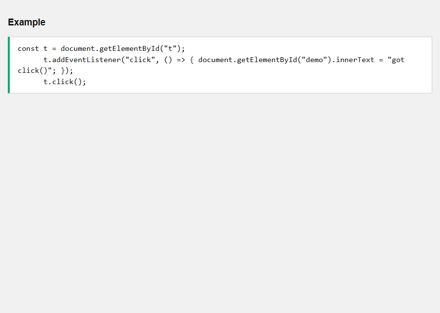


- [x] **Outcome:** `click()` fires the listener: **got click()**.

<a id="element-reference-example-15"></a>

### **Example 15: clientHeight**

- [x] **`clientHeight`** — Returns the height of an element, including padding
- [x] This sandbox **runs** the API from the W3Schools reference table (January 2026 revision).
- [x] Start from `document` (or an element). Wrap risky / deprecated calls in `try/catch` so a missing engine feature still prints a result.

Sandbox: `code_sandbox/element-reference/clientheight.html`

```javascript
document.getElementById("demo").innerText = "clientHeight=" + document.getElementById("wrap").clientHeight;
```

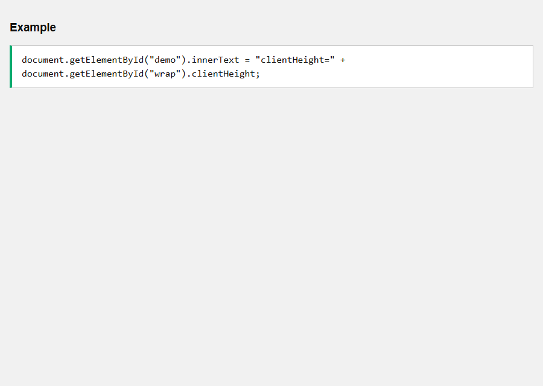


- [x] **Outcome:** `clientHeight` is the inner height including padding (a pixel number around the styled 80px box).

<a id="element-reference-example-16"></a>

### **Example 16: clientLeft**

- [x] **`clientLeft`** — Returns the width of the left border of an element
- [x] This sandbox **runs** the API from the W3Schools reference table (January 2026 revision).
- [x] Start from `document` (or an element). Wrap risky / deprecated calls in `try/catch` so a missing engine feature still prints a result.

Sandbox: `code_sandbox/element-reference/clientleft.html`

```javascript
document.getElementById("demo").innerText = "clientLeft=" + document.getElementById("wrap").clientLeft;
```


- [x] **Outcome:** `clientLeft` is **4** (the navy border width) in this sandbox.

<a id="element-reference-example-17"></a>

### **Example 17: clientTop**

- [x] **`clientTop`** — Returns the width of the top border of an element
- [x] This sandbox **runs** the API from the W3Schools reference table (January 2026 revision).
- [x] Start from `document` (or an element). Wrap risky / deprecated calls in `try/catch` so a missing engine feature still prints a result.

Sandbox: `code_sandbox/element-reference/clienttop.html`

```javascript
document.getElementById("demo").innerText = "clientTop=" + document.getElementById("wrap").clientTop;
```


- [x] **Outcome:** `clientTop` is **4** — the top border width.

<a id="element-reference-example-18"></a>

### **Example 18: clientWidth**

- [x] **`clientWidth`** — Returns the width of an element, including padding
- [x] This sandbox **runs** the API from the W3Schools reference table (January 2026 revision).
- [x] Start from `document` (or an element). Wrap risky / deprecated calls in `try/catch` so a missing engine feature still prints a result.

Sandbox: `code_sandbox/element-reference/clientwidth.html`

```javascript
document.getElementById("demo").innerText = "clientWidth=" + document.getElementById("wrap").clientWidth;
```

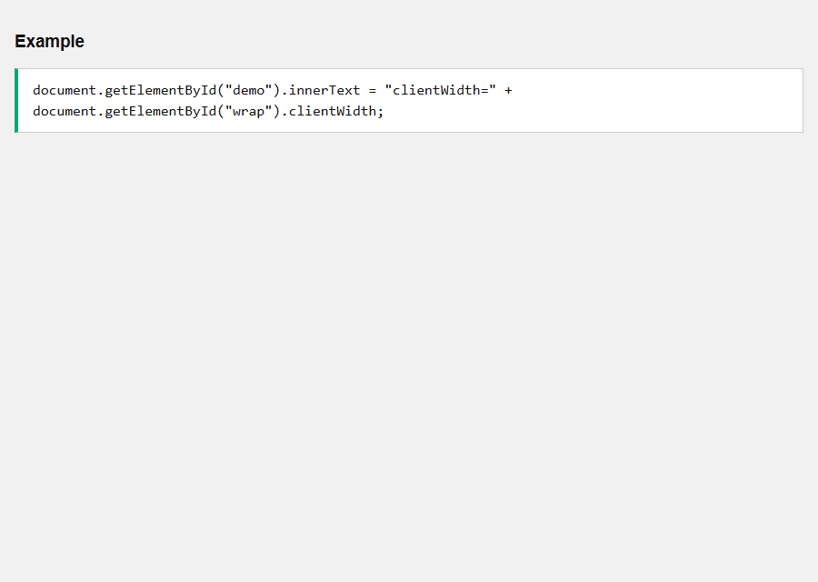


- [x] **Outcome:** `clientWidth` includes padding, excludes border and scrollbar.

<a id="element-reference-example-19"></a>

### **Example 19: cloneNode()**

- [x] **`cloneNode()`** — Clones an element
- [x] This sandbox **runs** the API from the W3Schools reference table (January 2026 revision).
- [x] Start from `document` (or an element). Wrap risky / deprecated calls in `try/catch` so a missing engine feature still prints a result.

Sandbox: `code_sandbox/element-reference/clonenode.html`

```javascript
const c = document.getElementById("t").cloneNode(true);
      document.getElementById("demo").innerText = "clone=" + c.innerHTML + " sameId=" + (c.id === "t");
```

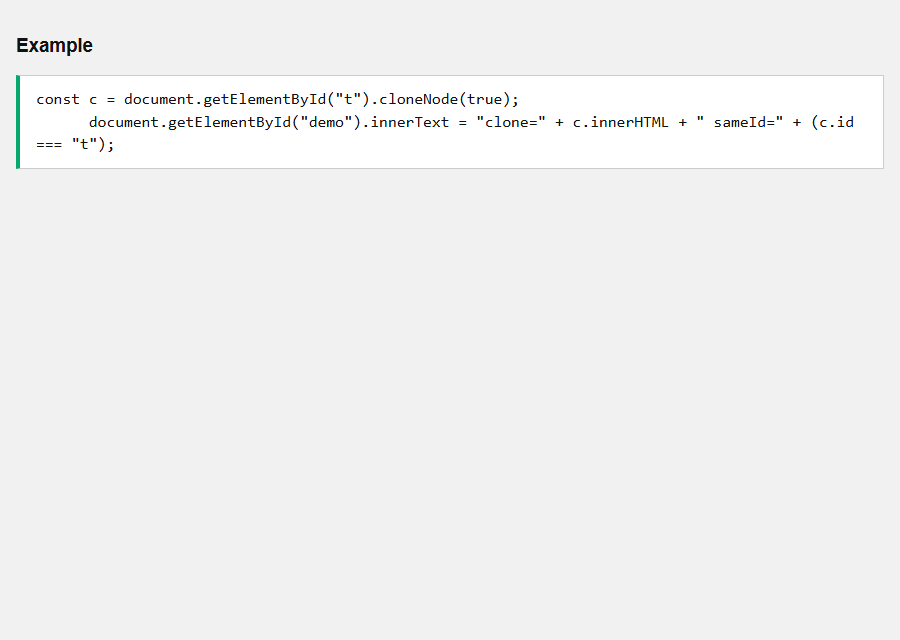

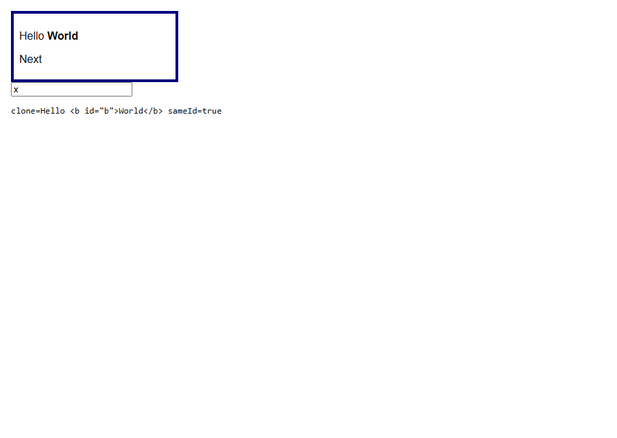

- [x] **Outcome:** `cloneNode(true)` deep-copies HTML. The clone is **not** the same node (`isSameNode` would be false).

<a id="element-reference-example-20"></a>

### **Example 20: closest()**

- [x] **`closest()`** — Searches the DOM tree for the closest ancestor that matches a CSS selector
- [x] This sandbox **runs** the API from the W3Schools reference table (January 2026 revision).
- [x] Start from `document` (or an element). Wrap risky / deprecated calls in `try/catch` so a missing engine feature still prints a result.

Sandbox: `code_sandbox/element-reference/closest.html`

```javascript
document.getElementById("demo").innerText = document.getElementById("b").closest("#wrap").id;
```


- [x] **Outcome:** `#b.closest("#wrap")` is the wrapper **wrap**.

<a id="element-reference-example-21"></a>

### **Example 21: compareDocumentPosition()**

- [x] **`compareDocumentPosition()`** — Compares the document position of two elements
- [x] This sandbox **runs** the API from the W3Schools reference table (January 2026 revision).
- [x] Start from `document` (or an element). Wrap risky / deprecated calls in `try/catch` so a missing engine feature still prints a result.

Sandbox: `code_sandbox/element-reference/comparedocumentposition.html`

```javascript
const t = document.getElementById("t");
      const u = document.getElementById("u");
      document.getElementById("demo").innerText = "t vs u = " + t.compareDocumentPosition(u);
```

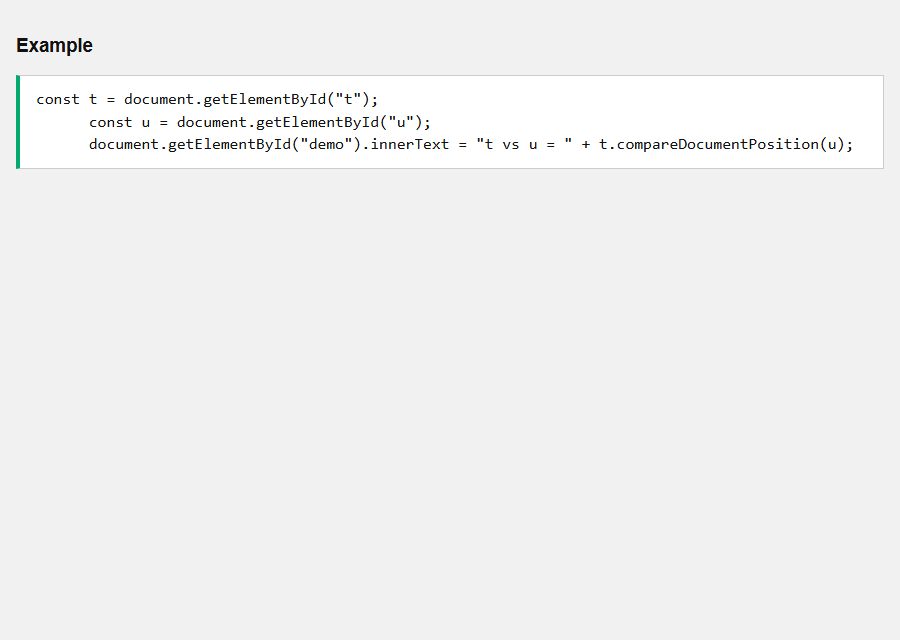


- [x] **Outcome:** The bitmask is non-zero; `DOCUMENT_POSITION_FOLLOWING` (4) is typically set because `#u` follows `#t`.

<a id="element-reference-example-22"></a>

### **Example 22: contains()**

- [x] **`contains()`** — Returns true if a node is a descendant of a node
- [x] This sandbox **runs** the API from the W3Schools reference table (January 2026 revision).
- [x] Start from `document` (or an element). Wrap risky / deprecated calls in `try/catch` so a missing engine feature still prints a result.

Sandbox: `code_sandbox/element-reference/contains.html`

```javascript
const w = document.getElementById("wrap");
      document.getElementById("demo").innerText = "wrap contains b=" + w.contains(document.getElementById("b"));
```

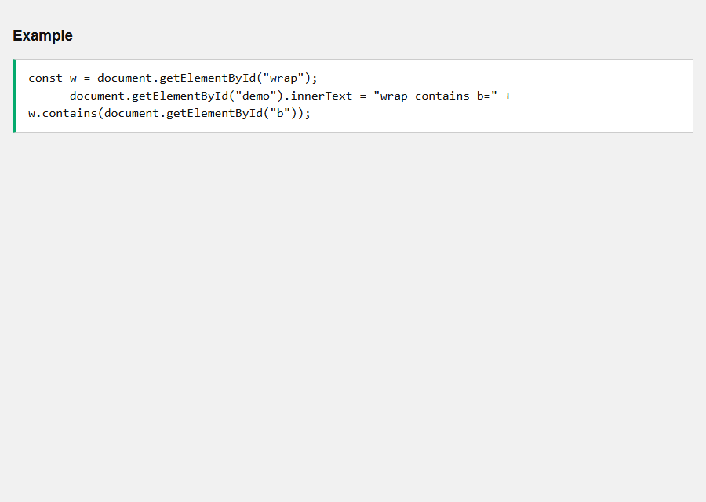


- [x] **Outcome:** `wrap.contains(#b)` is **true**.

<a id="element-reference-example-23"></a>

### **Example 23: contentEditable**

- [x] **`contentEditable`** — Sets or returns whether the content of an element is editable
- [x] This sandbox **runs** the API from the W3Schools reference table (January 2026 revision).
- [x] Start from `document` (or an element). Wrap risky / deprecated calls in `try/catch` so a missing engine feature still prints a result.

Sandbox: `code_sandbox/element-reference/contenteditable.html`

```javascript
const t = document.getElementById("t");
      t.contentEditable = "true";
      document.getElementById("demo").innerText = t.contentEditable;
```

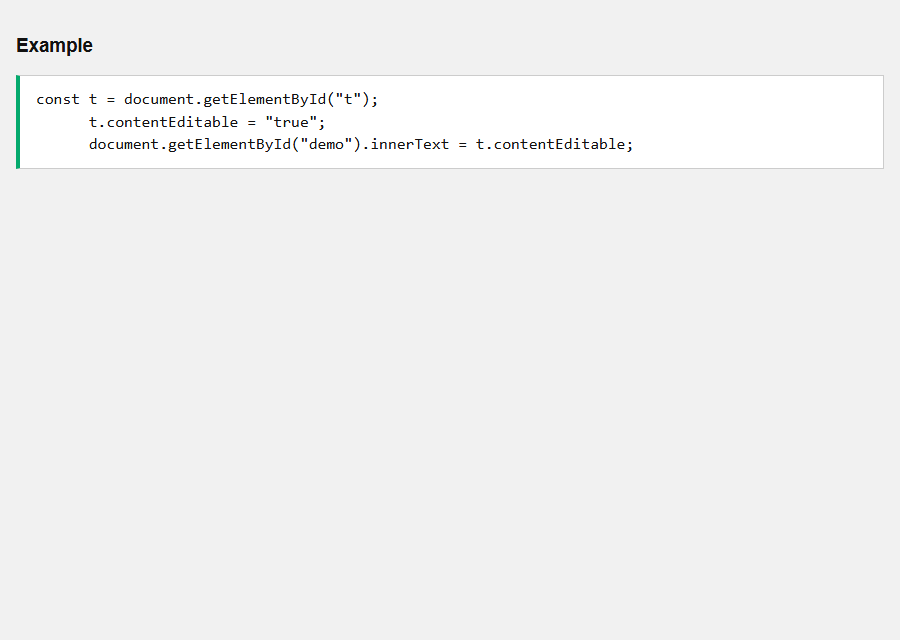


- [x] **Outcome:** `contentEditable` is **true** after assignment.

<a id="element-reference-example-24"></a>

### **Example 24: dir**

- [x] **`dir`** — Sets or returns the value of the dir attribute
- [x] This sandbox **runs** the API from the W3Schools reference table (January 2026 revision).
- [x] Start from `document` (or an element). Wrap risky / deprecated calls in `try/catch` so a missing engine feature still prints a result.

Sandbox: `code_sandbox/element-reference/dir.html`

```javascript
const w = document.getElementById("wrap");
      document.getElementById("demo").innerText = w.dir;
      w.dir = "rtl";
      document.getElementById("demo").innerText += " -> " + w.dir;
```

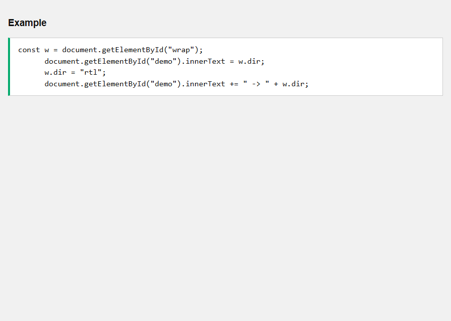


- [x] **Outcome:** `dir` starts as **ltr** and is set to **rtl**.

<a id="element-reference-example-25"></a>

### **Example 25: firstChild**

- [x] **`firstChild`** — Returns the first child node of an element
- [x] This sandbox **runs** the API from the W3Schools reference table (January 2026 revision).
- [x] Start from `document` (or an element). Wrap risky / deprecated calls in `try/catch` so a missing engine feature still prints a result.

Sandbox: `code_sandbox/element-reference/firstchild.html`

```javascript
const n = document.getElementById("t").firstChild;
      document.getElementById("demo").innerText = n.nodeName + " " + JSON.stringify(n.nodeValue);
```

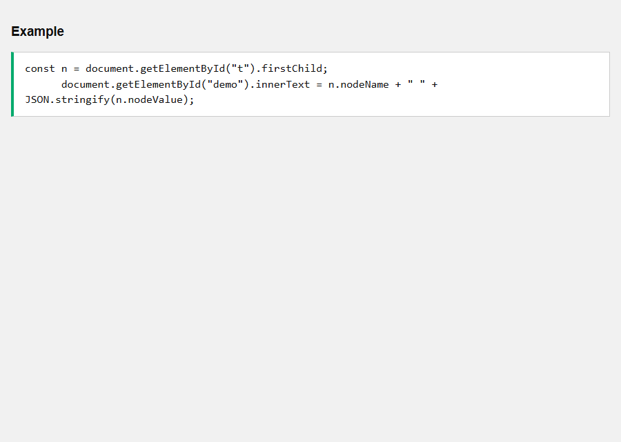


- [x] **Outcome:** `#t.firstChild` is the **Hello ** text node (or a whitespace text node).

<a id="element-reference-example-26"></a>

### **Example 26: firstElementChild**

- [x] **`firstElementChild`** — Returns the first child element of an element
- [x] This sandbox **runs** the API from the W3Schools reference table (January 2026 revision).
- [x] Start from `document` (or an element). Wrap risky / deprecated calls in `try/catch` so a missing engine feature still prints a result.

Sandbox: `code_sandbox/element-reference/firstelementchild.html`

```javascript
document.getElementById("demo").innerText = document.getElementById("t").firstElementChild.tagName;
```

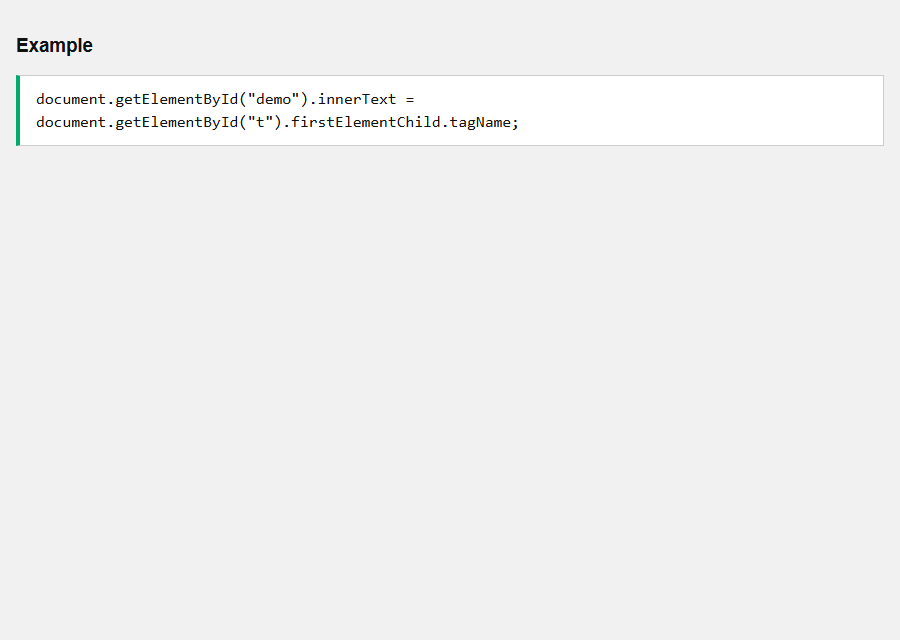


- [x] **Outcome:** `firstElementChild` of `#t` is **B** (skips text nodes).

<a id="element-reference-example-27"></a>

### **Example 27: focus()**

- [x] **`focus()`** — Gives focus to an element
- [x] This sandbox **runs** the API from the W3Schools reference table (January 2026 revision).
- [x] Start from `document` (or an element). Wrap risky / deprecated calls in `try/catch` so a missing engine feature still prints a result.

Sandbox: `code_sandbox/element-reference/focus.html`

```javascript
document.getElementById("inp").focus();
      document.getElementById("demo").innerText = "active=" + (document.activeElement && document.activeElement.id);
```

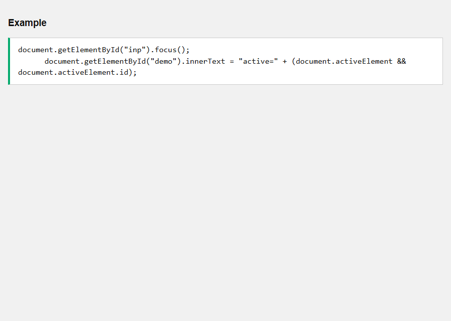


- [x] **Outcome:** After `focus()`, `activeElement` is **inp** when the engine allows it.

<a id="element-reference-example-28"></a>

### **Example 28: getAttribute()**

- [x] **`getAttribute()`** — Returns the value of an element's attribute
- [x] This sandbox **runs** the API from the W3Schools reference table (January 2026 revision).
- [x] Start from `document` (or an element). Wrap risky / deprecated calls in `try/catch` so a missing engine feature still prints a result.

Sandbox: `code_sandbox/element-reference/getattribute.html`

```javascript
document.getElementById("demo").innerText = document.getElementById("t").getAttribute("data-k");
```

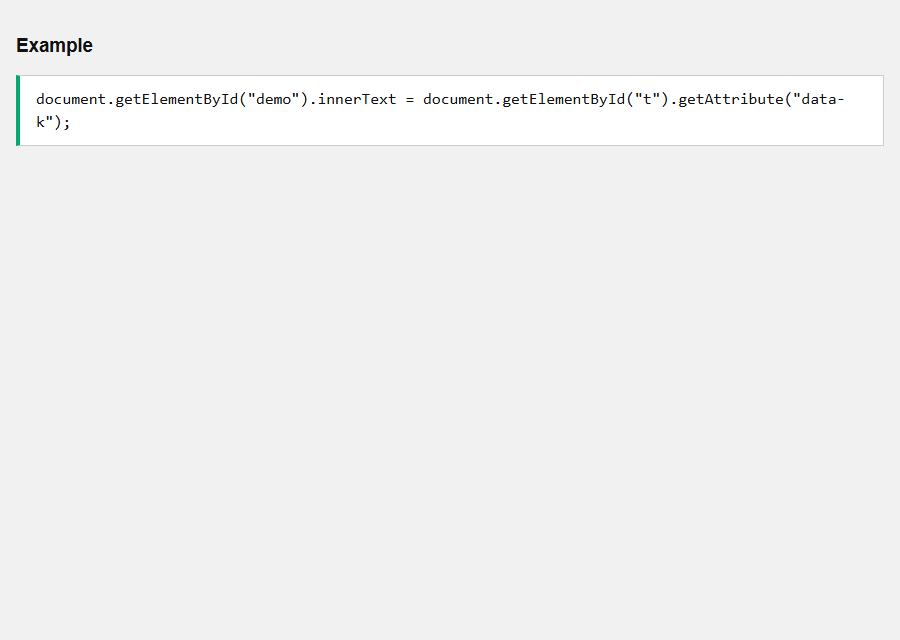


- [x] **Outcome:** `getAttribute("data-k")` is **v**.

<a id="element-reference-example-29"></a>

### **Example 29: getAttributeNode()**

- [x] **`getAttributeNode()`** — Returns an attribute node
- [x] This sandbox **runs** the API from the W3Schools reference table (January 2026 revision).
- [x] Start from `document` (or an element). Wrap risky / deprecated calls in `try/catch` so a missing engine feature still prints a result.

Sandbox: `code_sandbox/element-reference/getattributenode.html`

```javascript
const n = document.getElementById("t").getAttributeNode("id");
      document.getElementById("demo").innerText = n.name + "=" + n.value;
```

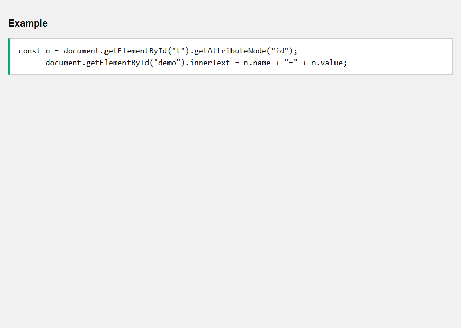


- [x] **Outcome:** The `id` Attr node has value **t**.

<a id="element-reference-example-30"></a>

### **Example 30: getBoundingClientRect()**

- [x] **`getBoundingClientRect()`** — Returns size and position relative to the viewport
- [x] This sandbox **runs** the API from the W3Schools reference table (January 2026 revision).
- [x] Start from `document` (or an element). Wrap risky / deprecated calls in `try/catch` so a missing engine feature still prints a result.

Sandbox: `code_sandbox/element-reference/getboundingclientrect.html`

```javascript
const r = document.getElementById("wrap").getBoundingClientRect();
      document.getElementById("demo").innerText = "w=" + Math.round(r.width) + " h=" + Math.round(r.height) + " top=" + Math.round(r.top);
```

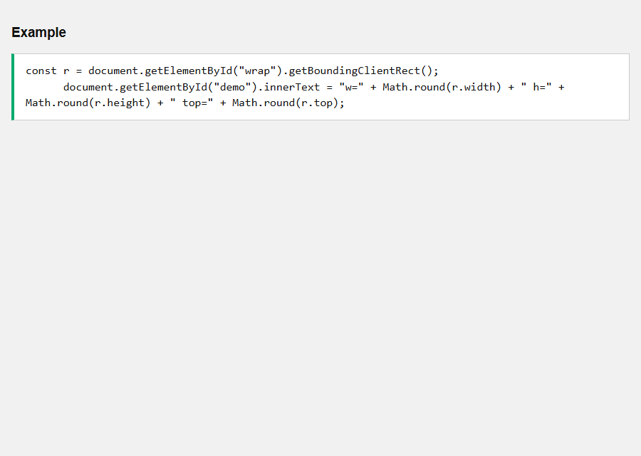


- [x] **Outcome:** The rect reports **width/height/top** in CSS pixels for `#wrap`.

<a id="element-reference-example-31"></a>

### **Example 31: getElementsByClassName()**

- [x] **`getElementsByClassName()`** — Returns child elements with a given class name
- [x] This sandbox **runs** the API from the W3Schools reference table (January 2026 revision).
- [x] Start from `document` (or an element). Wrap risky / deprecated calls in `try/catch` so a missing engine feature still prints a result.

Sandbox: `code_sandbox/element-reference/getelementsbyclassname.html`

```javascript
document.getElementById("demo").innerText = "n=" + document.getElementById("wrap").getElementsByClassName("note").length;
```

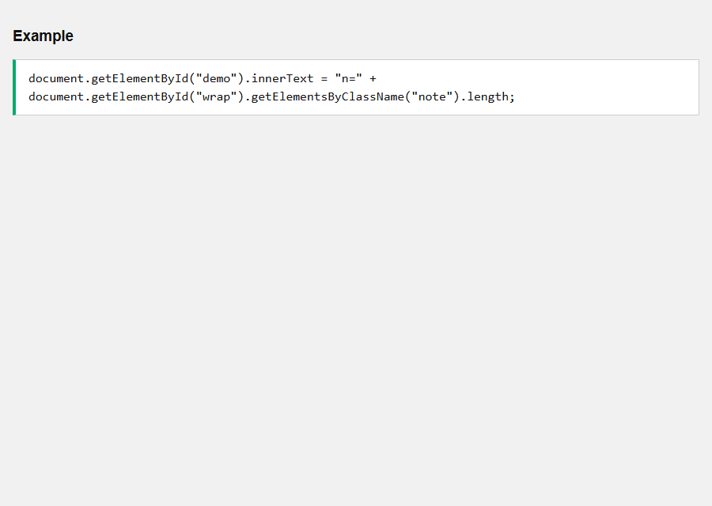


- [x] **Outcome:** `wrap.getElementsByClassName("note")` finds **#t** (length **1**).

<a id="element-reference-example-32"></a>

### **Example 32: getElementsByTagName()**

- [x] **`getElementsByTagName()`** — Returns child elements with a given tag name
- [x] This sandbox **runs** the API from the W3Schools reference table (January 2026 revision).
- [x] Start from `document` (or an element). Wrap risky / deprecated calls in `try/catch` so a missing engine feature still prints a result.

Sandbox: `code_sandbox/element-reference/getelementsbytagname.html`

```javascript
document.getElementById("demo").innerText = "p=" + document.getElementById("wrap").getElementsByTagName("p").length;
```

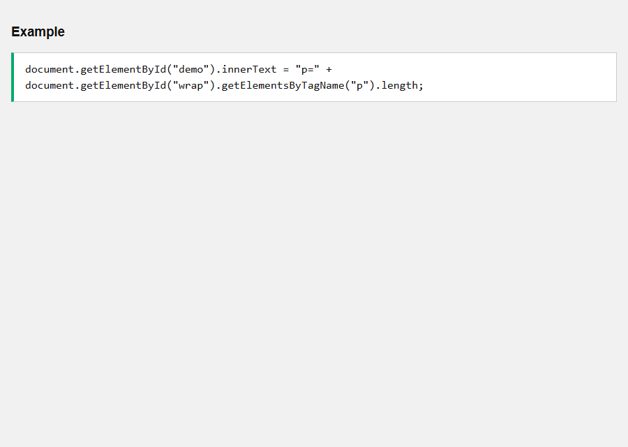


- [x] **Outcome:** Two `<p>` children live under `#wrap`.

<a id="element-reference-example-33"></a>

### **Example 33: hasAttribute()**

- [x] **`hasAttribute()`** — Returns true if an element has a given attribute
- [x] This sandbox **runs** the API from the W3Schools reference table (January 2026 revision).
- [x] Start from `document` (or an element). Wrap risky / deprecated calls in `try/catch` so a missing engine feature still prints a result.

Sandbox: `code_sandbox/element-reference/hasattribute.html`

```javascript
const t = document.getElementById("t");
      document.getElementById("demo").innerText = "data-k=" + t.hasAttribute("data-k") + " href=" + t.hasAttribute("href");
```

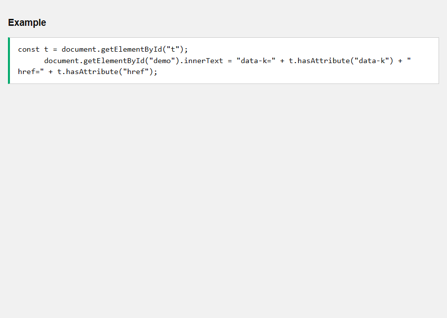


- [x] **Outcome:** `hasAttribute("data-k")` is **true**; `href` is **false**.

<a id="element-reference-example-34"></a>

### **Example 34: hasAttributes()**

- [x] **`hasAttributes()`** — Returns true if an element has any attributes
- [x] This sandbox **runs** the API from the W3Schools reference table (January 2026 revision).
- [x] Start from `document` (or an element). Wrap risky / deprecated calls in `try/catch` so a missing engine feature still prints a result.

Sandbox: `code_sandbox/element-reference/hasattributes.html`

```javascript
document.getElementById("demo").innerText = "t=" + document.getElementById("t").hasAttributes();
```

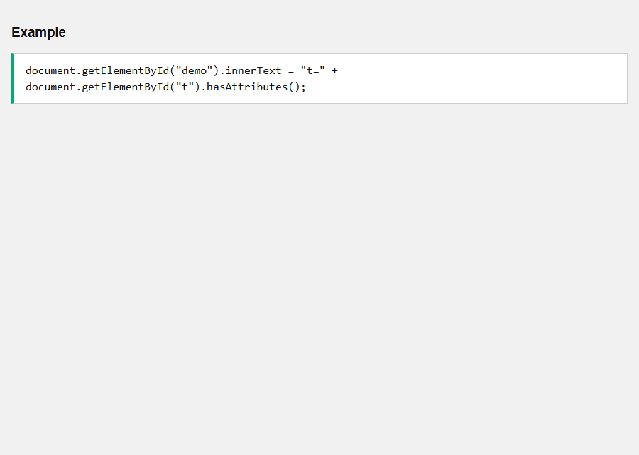


- [x] **Outcome:** `#t.hasAttributes()` is **true**.

<a id="element-reference-example-35"></a>

### **Example 35: hasChildNodes()**

- [x] **`hasChildNodes()`** — Returns true if an element has any child nodes
- [x] This sandbox **runs** the API from the W3Schools reference table (January 2026 revision).
- [x] Start from `document` (or an element). Wrap risky / deprecated calls in `try/catch` so a missing engine feature still prints a result.

Sandbox: `code_sandbox/element-reference/haschildnodes.html`

```javascript
document.getElementById("demo").innerText = "t=" + document.getElementById("t").hasChildNodes();
```

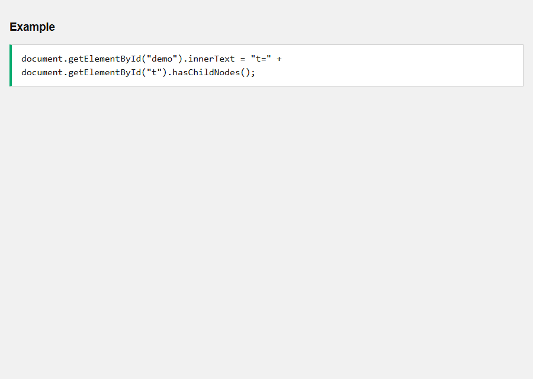


- [x] **Outcome:** `hasChildNodes()` is **true** for `#t`.

<a id="element-reference-example-36"></a>

### **Example 36: id**

- [x] **`id`** — Sets or returns the value of the id attribute
- [x] This sandbox **runs** the API from the W3Schools reference table (January 2026 revision).
- [x] Start from `document` (or an element). Wrap risky / deprecated calls in `try/catch` so a missing engine feature still prints a result.

Sandbox: `code_sandbox/element-reference/id.html`

```javascript
const t = document.getElementById("t");
      document.getElementById("demo").innerText = t.id;
      t.id = "renamed";
      document.getElementById("demo").innerText += " -> " + document.getElementById("renamed").id;
```

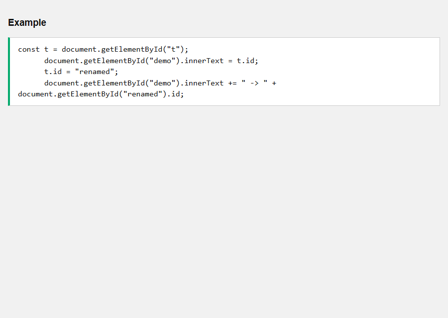


- [x] **Outcome:** `id` is rewritten from **t** to **renamed**.

<a id="element-reference-example-37"></a>

### **Example 37: innerHTML**

- [x] **`innerHTML`** — Sets or returns the content of an element
- [x] This sandbox **runs** the API from the W3Schools reference table (January 2026 revision).
- [x] Start from `document` (or an element). Wrap risky / deprecated calls in `try/catch` so a missing engine feature still prints a result.

Sandbox: `code_sandbox/element-reference/innerhtml.html`

```javascript
const t = document.getElementById("t");
      document.getElementById("demo").innerText = t.innerHTML;
      t.innerHTML = "<i>x</i>";
      document.getElementById("demo").innerText += " -> " + t.innerHTML;
```

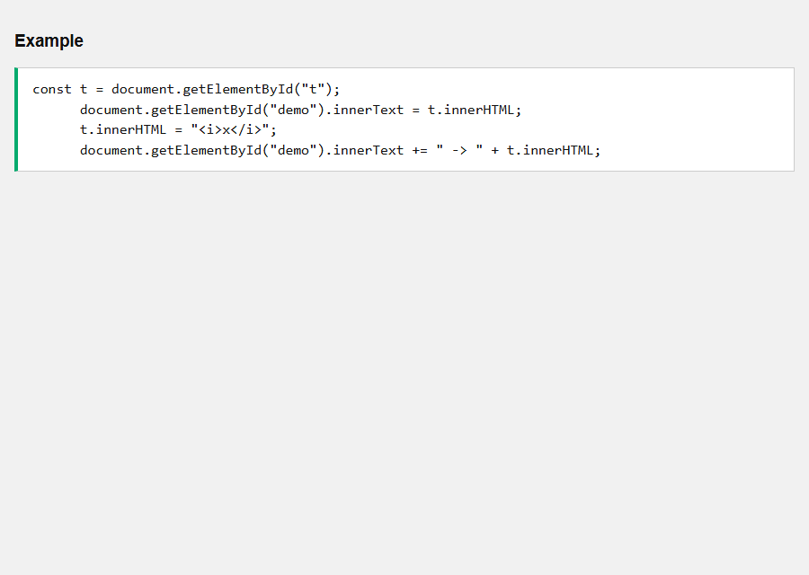

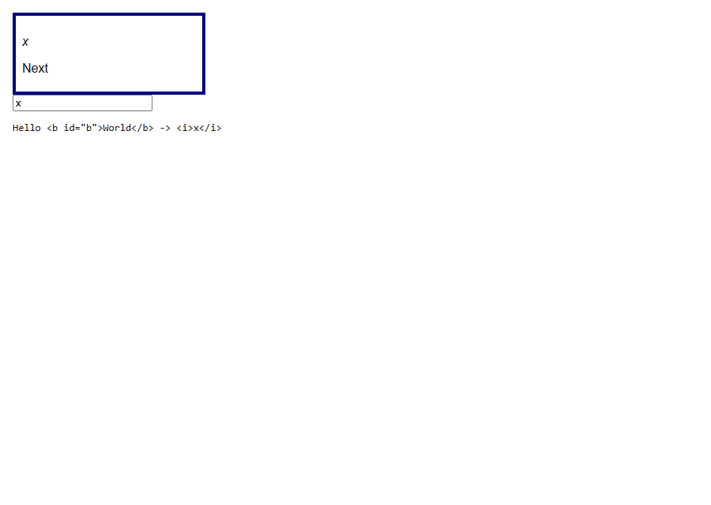

- [x] **Outcome:** `innerHTML` includes **`<b>`**, then is replaced with **`<i>x</i>`**.

<a id="element-reference-example-38"></a>

### **Example 38: innerText**

- [x] **`innerText`** — Sets or returns the rendered text content of a node
- [x] This sandbox **runs** the API from the W3Schools reference table (January 2026 revision).
- [x] Start from `document` (or an element). Wrap risky / deprecated calls in `try/catch` so a missing engine feature still prints a result.

Sandbox: `code_sandbox/element-reference/innertext.html`

```javascript
document.getElementById("demo").innerText = JSON.stringify(document.getElementById("t").innerText);
```


- [x] **Outcome:** `innerText` is the visible string **Hello World** (layout-aware).

<a id="element-reference-example-39"></a>

### **Example 39: insertAdjacentElement()**

- [x] **`insertAdjacentElement()`** — Inserts a new element at a position relative to an element
- [x] This sandbox **runs** the API from the W3Schools reference table (January 2026 revision).
- [x] Start from `document` (or an element). Wrap risky / deprecated calls in `try/catch` so a missing engine feature still prints a result.

Sandbox: `code_sandbox/element-reference/insertadjacentelement.html`

```javascript
const s = document.createElement("span");
      s.textContent = "X";
      document.getElementById("t").insertAdjacentElement("afterend", s);
      document.getElementById("demo").innerText = document.getElementById("wrap").innerText.replace(/\s+/g, " ");
```

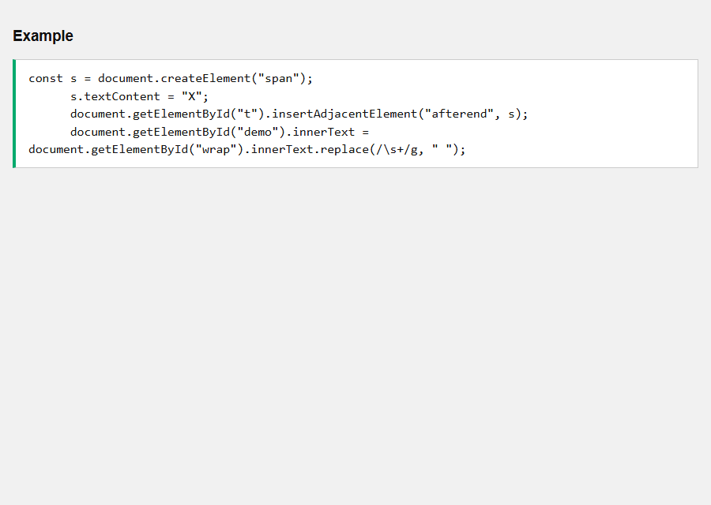


- [x] **Outcome:** **X** is inserted after `#t` (`afterend`).

<a id="element-reference-example-40"></a>

### **Example 40: insertAdjacentHTML()**

- [x] **`insertAdjacentHTML()`** — Inserts HTML at a position relative to an element
- [x] This sandbox **runs** the API from the W3Schools reference table (January 2026 revision).
- [x] Start from `document` (or an element). Wrap risky / deprecated calls in `try/catch` so a missing engine feature still prints a result.

Sandbox: `code_sandbox/element-reference/insertadjacenthtml.html`

```javascript
document.getElementById("t").insertAdjacentHTML("beforeend", "<i>!</i>");
      document.getElementById("demo").innerText = document.getElementById("t").innerHTML;
```

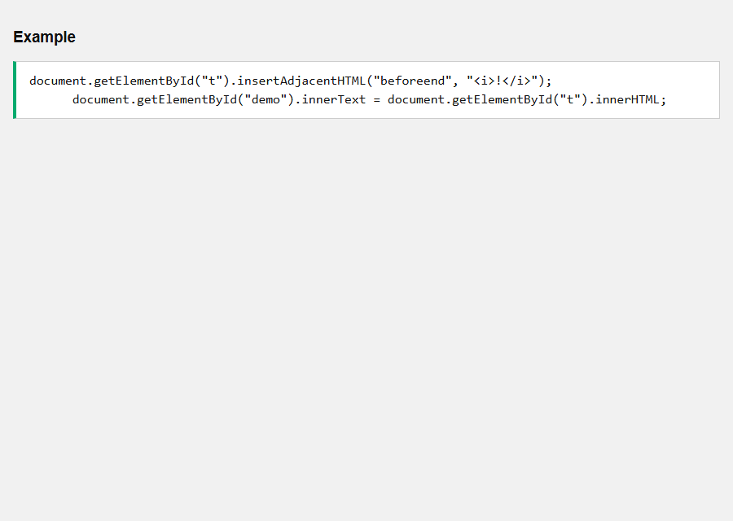


- [x] **Outcome:** `beforeend` adds **`<i>!</i>`** inside `#t`.

<a id="element-reference-example-41"></a>

### **Example 41: insertAdjacentText()**

- [x] **`insertAdjacentText()`** — Inserts text at a position relative to an element
- [x] This sandbox **runs** the API from the W3Schools reference table (January 2026 revision).
- [x] Start from `document` (or an element). Wrap risky / deprecated calls in `try/catch` so a missing engine feature still prints a result.

Sandbox: `code_sandbox/element-reference/insertadjacenttext.html`

```javascript
document.getElementById("t").insertAdjacentText("beforeend", "!!");
      document.getElementById("demo").innerText = document.getElementById("t").textContent;
```

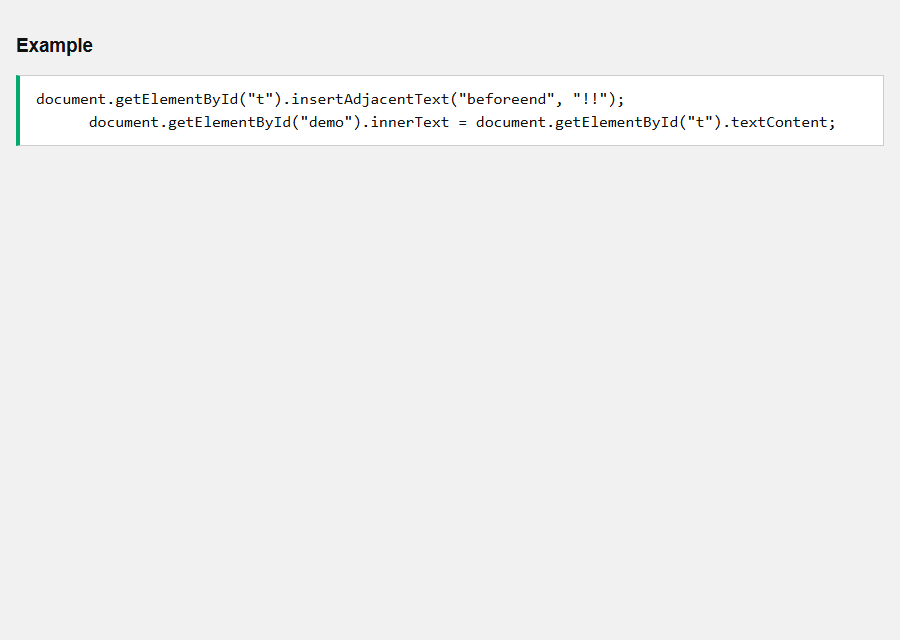


- [x] **Outcome:** Plain **!!** is appended as text (not parsed as HTML).

<a id="element-reference-example-42"></a>

### **Example 42: insertBefore()**

- [x] **`insertBefore()`** — Inserts a new child node before an existing child node
- [x] This sandbox **runs** the API from the W3Schools reference table (January 2026 revision).
- [x] Start from `document` (or an element). Wrap risky / deprecated calls in `try/catch` so a missing engine feature still prints a result.

Sandbox: `code_sandbox/element-reference/insertbefore.html`

```javascript
const s = document.createElement("span");
      s.textContent = "0";
      const wrap = document.getElementById("wrap");
      wrap.insertBefore(s, document.getElementById("u"));
      document.getElementById("demo").innerText = wrap.innerText.replace(/\s+/g, " ");
```

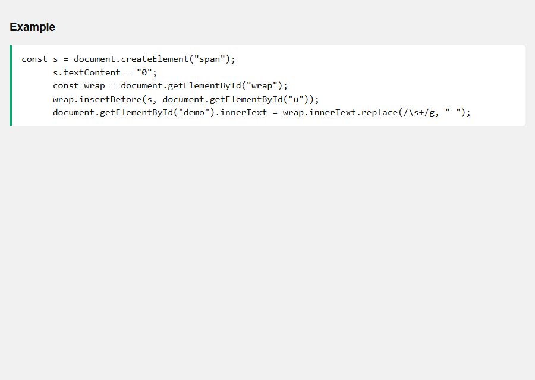


- [x] **Outcome:** **0** is inserted before `#u`.

<a id="element-reference-example-43"></a>

### **Example 43: isContentEditable**

- [x] **`isContentEditable`** — Returns true if an element's content is editable
- [x] This sandbox **runs** the API from the W3Schools reference table (January 2026 revision).
- [x] Start from `document` (or an element). Wrap risky / deprecated calls in `try/catch` so a missing engine feature still prints a result.

Sandbox: `code_sandbox/element-reference/iscontenteditable.html`

```javascript
const t = document.getElementById("t");
      document.getElementById("demo").innerText = "before=" + t.isContentEditable;
      t.contentEditable = "true";
      document.getElementById("demo").innerText += " after=" + t.isContentEditable;
```

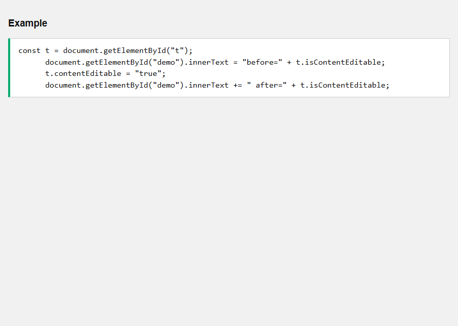


- [x] **Outcome:** `isContentEditable` becomes **true** after `contentEditable = "true"`.

<a id="element-reference-example-44"></a>

### **Example 44: isDefaultNamespace()**

- [x] **`isDefaultNamespace()`** — Returns true if a given namespaceURI is the default
- [x] This sandbox **runs** the API from the W3Schools reference table (January 2026 revision).
- [x] Start from `document` (or an element). Wrap risky / deprecated calls in `try/catch` so a missing engine feature still prints a result.

Sandbox: `code_sandbox/element-reference/isdefaultnamespace.html`

```javascript
const htmlNS = "http://www.w3.org/1999/xhtml";
      document.getElementById("demo").innerText = String(document.getElementById("t").isDefaultNamespace(htmlNS));
```

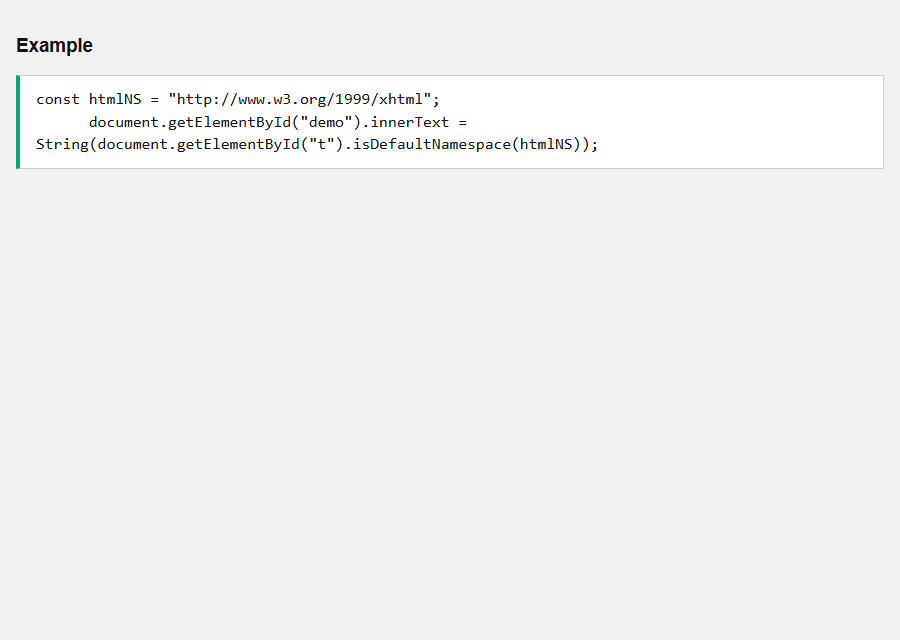


- [x] **Outcome:** For an HTML element, `isDefaultNamespace(XHTML ns)` is **true**.

<a id="element-reference-example-45"></a>

### **Example 45: isEqualNode()**

- [x] **`isEqualNode()`** — Checks if two elements are equal
- [x] This sandbox **runs** the API from the W3Schools reference table (January 2026 revision).
- [x] Start from `document` (or an element). Wrap risky / deprecated calls in `try/catch` so a missing engine feature still prints a result.

Sandbox: `code_sandbox/element-reference/isequalnode.html`

```javascript
const a = document.createElement("p");
      const b = document.createElement("p");
      a.className = b.className = "x";
      document.getElementById("demo").innerText = "equal=" + a.isEqualNode(b) + " same=" + a.isSameNode(b);
```

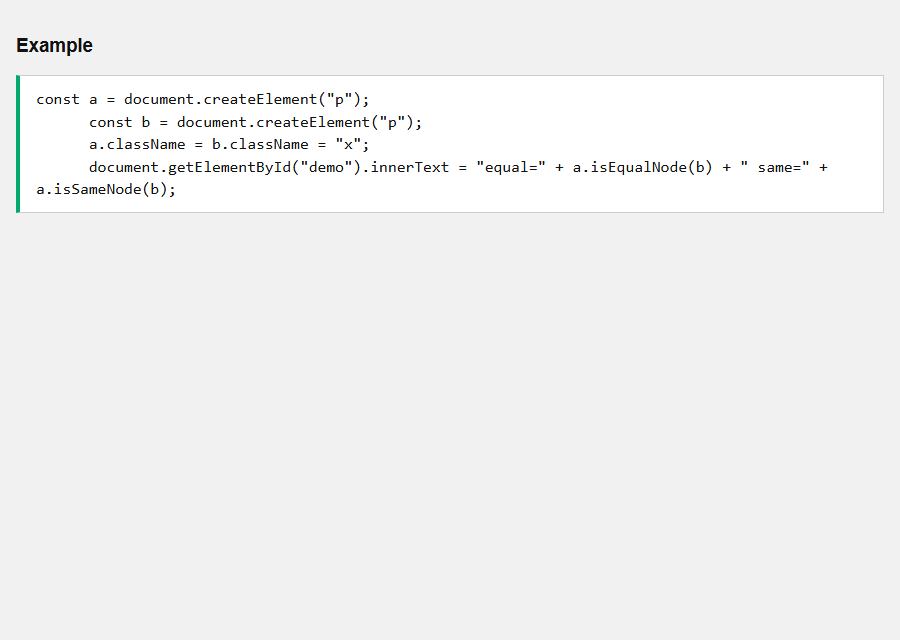


- [x] **Outcome:** Two separately created equal `<p class="x">` nodes: **isEqualNode true**, **isSameNode false**.

<a id="element-reference-example-46"></a>

### **Example 46: isSameNode()**

- [x] **`isSameNode()`** — Checks if two elements are the same node
- [x] This sandbox **runs** the API from the W3Schools reference table (January 2026 revision).
- [x] Start from `document` (or an element). Wrap risky / deprecated calls in `try/catch` so a missing engine feature still prints a result.

Sandbox: `code_sandbox/element-reference/issamenode.html`

```javascript
const t = document.getElementById("t");
      document.getElementById("demo").innerText = "same=" + t.isSameNode(document.getElementById("t")) + " other=" + t.isSameNode(document.getElementById("u"));
```

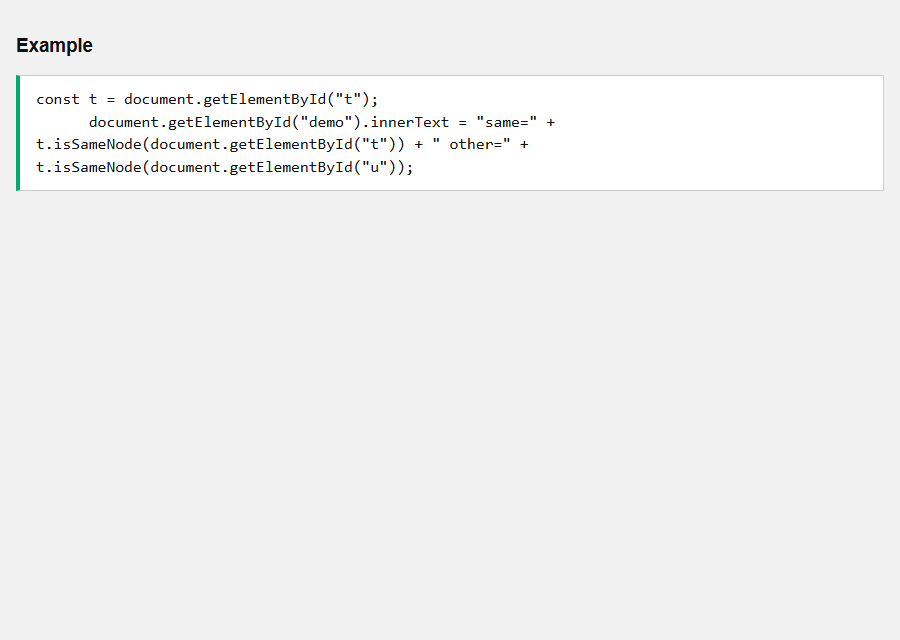


- [x] **Outcome:** `t.isSameNode(t)` is **true**; vs `#u` is **false**.

<a id="element-reference-example-47"></a>

### **Example 47: isSupported()**

- [x] **`isSupported()`** — DEPRECATED
- [x] This sandbox **runs** the API from the W3Schools reference table (January 2026 revision).
- [x] Start from `document` (or an element). Wrap risky / deprecated calls in `try/catch` so a missing engine feature still prints a result.
- [x] Do not use `isSupported()`.

Sandbox: `code_sandbox/element-reference/issupported.html`

```javascript
let msg;
      try { msg = "isSupported=" + typeof document.getElementById("t").isSupported; }
      catch (e) { msg = e.name + ": " + e.message; }
      document.getElementById("demo").innerText = msg + " (deprecated)";
```

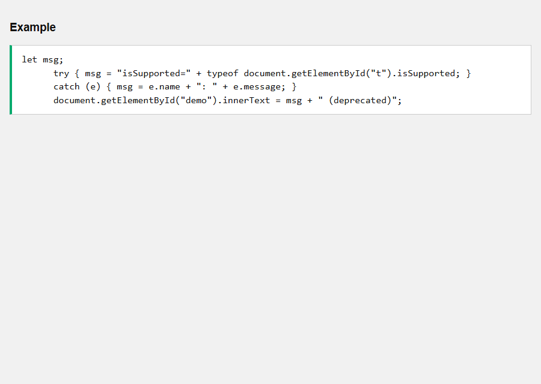


- [x] **Outcome:** `isSupported()` is **deprecated** and typically missing.

<a id="element-reference-example-48"></a>

### **Example 48: lang**

- [x] **`lang`** — Sets or returns the value of the lang attribute
- [x] This sandbox **runs** the API from the W3Schools reference table (January 2026 revision).
- [x] Start from `document` (or an element). Wrap risky / deprecated calls in `try/catch` so a missing engine feature still prints a result.

Sandbox: `code_sandbox/element-reference/lang.html`

```javascript
const w = document.getElementById("wrap");
      document.getElementById("demo").innerText = w.lang + " -> ";
      w.lang = "fr";
      document.getElementById("demo").innerText += w.lang;
```

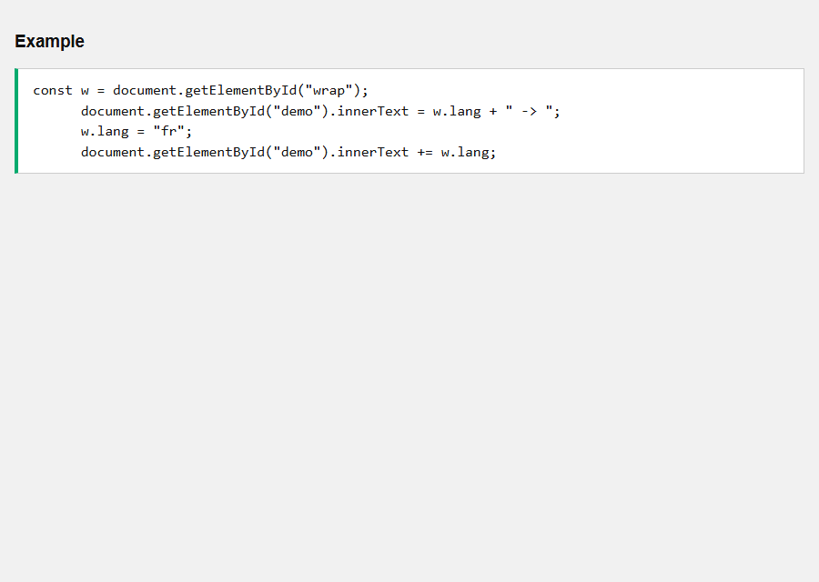


- [x] **Outcome:** `lang` goes from **en** to **fr**.

<a id="element-reference-example-49"></a>

### **Example 49: lastChild**

- [x] **`lastChild`** — Returns the last child node of an element
- [x] This sandbox **runs** the API from the W3Schools reference table (January 2026 revision).
- [x] Start from `document` (or an element). Wrap risky / deprecated calls in `try/catch` so a missing engine feature still prints a result.

Sandbox: `code_sandbox/element-reference/lastchild.html`

```javascript
const n = document.getElementById("wrap").lastChild;
      document.getElementById("demo").innerText = n.nodeName + " id=" + (n.id || "");
```

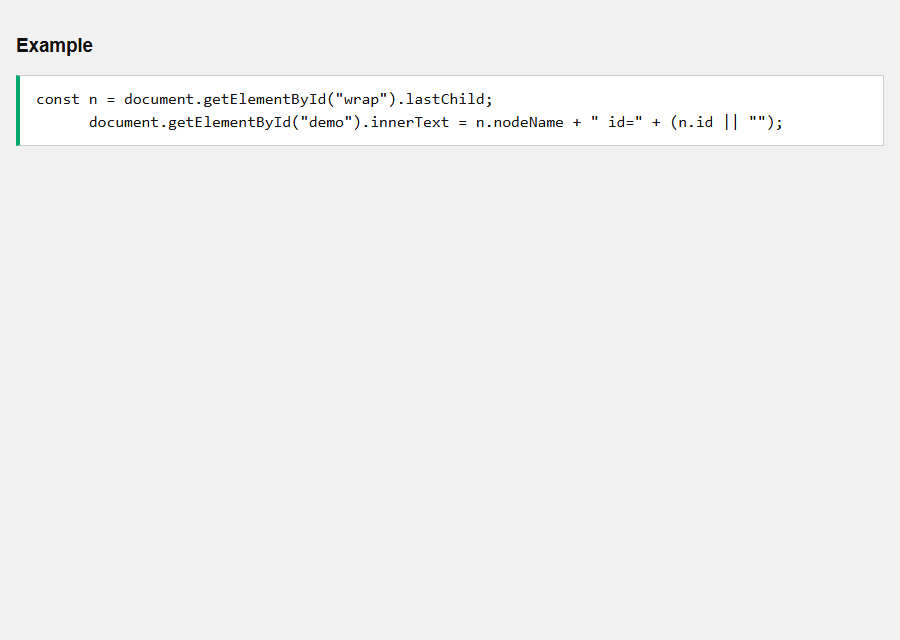


- [x] **Outcome:** `wrap.lastChild` is `#u` or a trailing whitespace text node — the snap prints its `nodeName`.

<a id="element-reference-example-50"></a>

### **Example 50: lastElementChild**

- [x] **`lastElementChild`** — Returns the last child element of an element
- [x] This sandbox **runs** the API from the W3Schools reference table (January 2026 revision).
- [x] Start from `document` (or an element). Wrap risky / deprecated calls in `try/catch` so a missing engine feature still prints a result.

Sandbox: `code_sandbox/element-reference/lastelementchild.html`

```javascript
document.getElementById("demo").innerText = document.getElementById("wrap").lastElementChild.id;
```

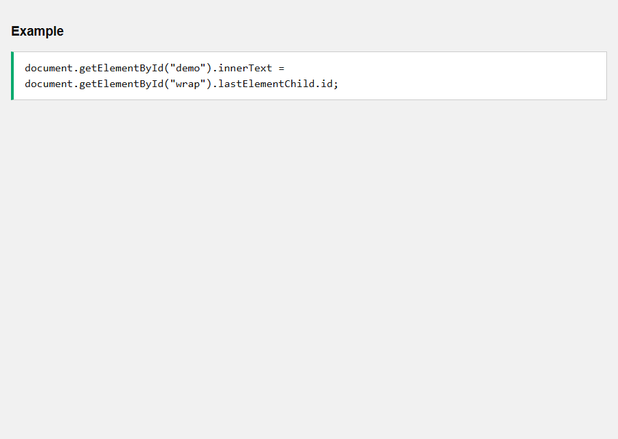


- [x] **Outcome:** `lastElementChild` of `#wrap` is **u**.

<a id="element-reference-example-51"></a>

### **Example 51: matches()**

- [x] **`matches()`** — Returns true if an element is matched by a given CSS selector
- [x] This sandbox **runs** the API from the W3Schools reference table (January 2026 revision).
- [x] Start from `document` (or an element). Wrap risky / deprecated calls in `try/catch` so a missing engine feature still prints a result.

Sandbox: `code_sandbox/element-reference/matches.html`

```javascript
document.getElementById("demo").innerText = "p.note=" + document.getElementById("t").matches("p.note");
```


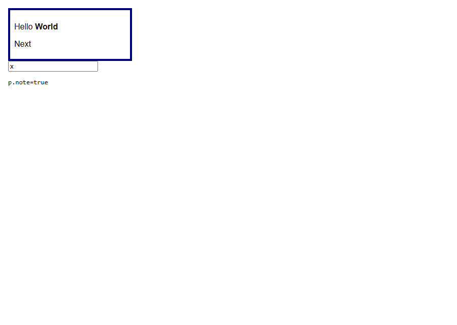

- [x] **Outcome:** `#t.matches("p.note")` is **true**.

<a id="element-reference-example-52"></a>

### **Example 52: namespaceURI**

- [x] **`namespaceURI`** — Returns the namespace URI of an element
- [x] This sandbox **runs** the API from the W3Schools reference table (January 2026 revision).
- [x] Start from `document` (or an element). Wrap risky / deprecated calls in `try/catch` so a missing engine feature still prints a result.

Sandbox: `code_sandbox/element-reference/namespaceuri.html`

```javascript
document.getElementById("demo").innerText = document.getElementById("t").namespaceURI;
```

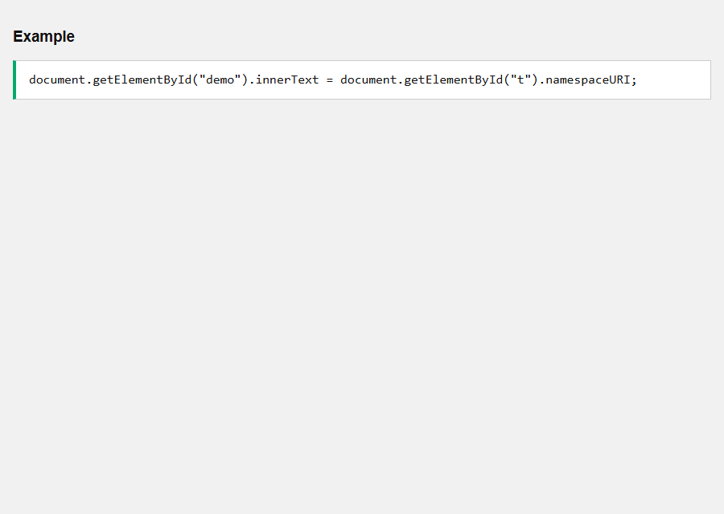


- [x] **Outcome:** HTML elements use **`http://www.w3.org/1999/xhtml`**.

<a id="element-reference-example-53"></a>

### **Example 53: nextSibling**

- [x] **`nextSibling`** — Returns the next node at the same tree level
- [x] This sandbox **runs** the API from the W3Schools reference table (January 2026 revision).
- [x] Start from `document` (or an element). Wrap risky / deprecated calls in `try/catch` so a missing engine feature still prints a result.

Sandbox: `code_sandbox/element-reference/nextsibling.html`

```javascript
const n = document.getElementById("t").nextSibling;
      document.getElementById("demo").innerText = n && (n.nodeName + " " + (n.id || JSON.stringify(n.nodeValue)));
```

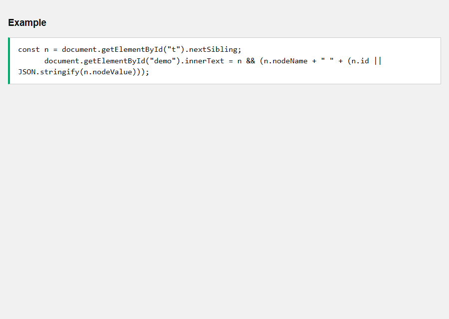


- [x] **Outcome:** `nextSibling` may be a **whitespace text node** between `#t` and `#u`.

<a id="element-reference-example-54"></a>

### **Example 54: nextElementSibling**

- [x] **`nextElementSibling`** — Returns the next element at the same tree level
- [x] This sandbox **runs** the API from the W3Schools reference table (January 2026 revision).
- [x] Start from `document` (or an element). Wrap risky / deprecated calls in `try/catch` so a missing engine feature still prints a result.

Sandbox: `code_sandbox/element-reference/nextelementsibling.html`

```javascript
document.getElementById("demo").innerText = document.getElementById("t").nextElementSibling.id;
```

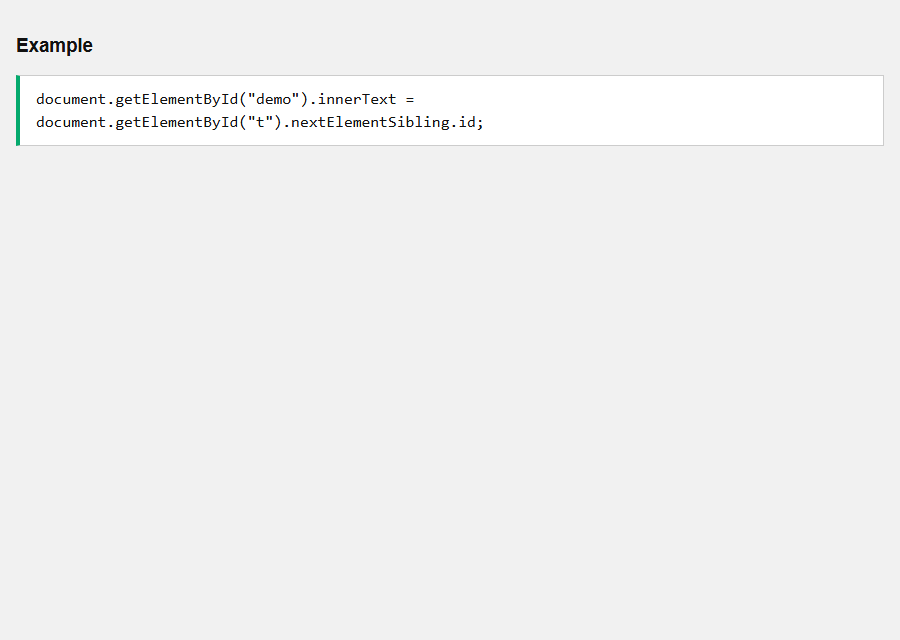


- [x] **Outcome:** `nextElementSibling` of `#t` is **u** (skips text).

<a id="element-reference-example-55"></a>

### **Example 55: nodeName**

- [x] **`nodeName`** — Returns the name of a node
- [x] This sandbox **runs** the API from the W3Schools reference table (January 2026 revision).
- [x] Start from `document` (or an element). Wrap risky / deprecated calls in `try/catch` so a missing engine feature still prints a result.

Sandbox: `code_sandbox/element-reference/nodename.html`

```javascript
document.getElementById("demo").innerText = document.getElementById("t").nodeName;
```

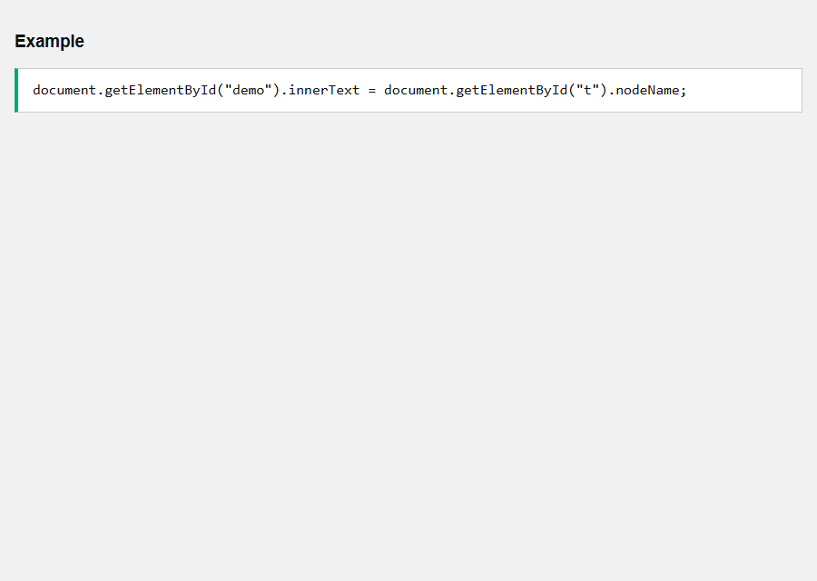


- [x] **Outcome:** `nodeName` for a paragraph is **P**.

<a id="element-reference-example-56"></a>

### **Example 56: nodeType**

- [x] **`nodeType`** — Returns the node type of a node
- [x] This sandbox **runs** the API from the W3Schools reference table (January 2026 revision).
- [x] Start from `document` (or an element). Wrap risky / deprecated calls in `try/catch` so a missing engine feature still prints a result.

Sandbox: `code_sandbox/element-reference/nodetype.html`

```javascript
document.getElementById("demo").innerText = "el=" + document.getElementById("t").nodeType + " text=" + document.getElementById("t").firstChild.nodeType;
```

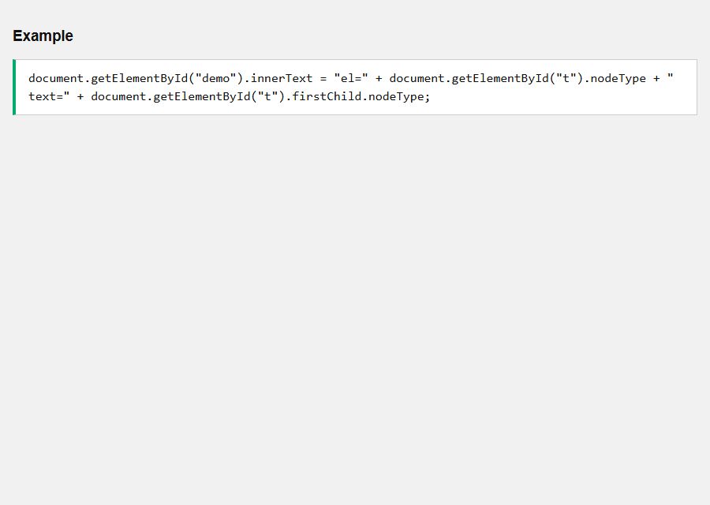


- [x] **Outcome:** Element is **1**; text is **3**.

<a id="element-reference-example-57"></a>

### **Example 57: nodeValue**

- [x] **`nodeValue`** — Sets or returns the value of a node
- [x] This sandbox **runs** the API from the W3Schools reference table (January 2026 revision).
- [x] Start from `document` (or an element). Wrap risky / deprecated calls in `try/catch` so a missing engine feature still prints a result.

Sandbox: `code_sandbox/element-reference/nodevalue.html`

```javascript
const text = document.getElementById("t").firstChild;
      document.getElementById("demo").innerText = JSON.stringify(text.nodeValue);
```

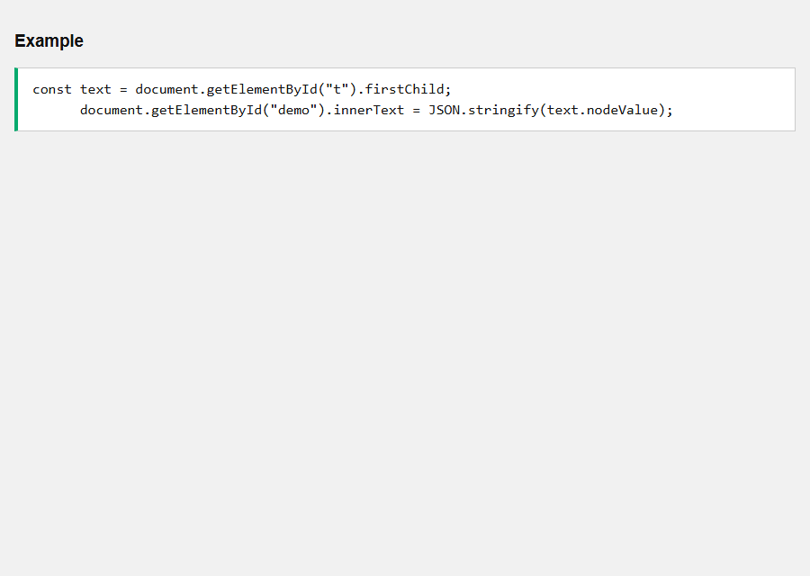


- [x] **Outcome:** `nodeValue` of the first text child is **Hello ** (element `nodeValue` is null).

<a id="element-reference-example-58"></a>

### **Example 58: normalize()**

- [x] **`normalize()`** — Joins adjacent text nodes and removes empty text nodes
- [x] This sandbox **runs** the API from the W3Schools reference table (January 2026 revision).
- [x] Start from `document` (or an element). Wrap risky / deprecated calls in `try/catch` so a missing engine feature still prints a result.

Sandbox: `code_sandbox/element-reference/normalize.html`

```javascript
const t = document.getElementById("t");
      t.appendChild(document.createTextNode("A"));
      t.appendChild(document.createTextNode("B"));
      const before = t.childNodes.length;
      t.normalize();
      document.getElementById("demo").innerText = "before=" + before + " after=" + t.childNodes.length;
```

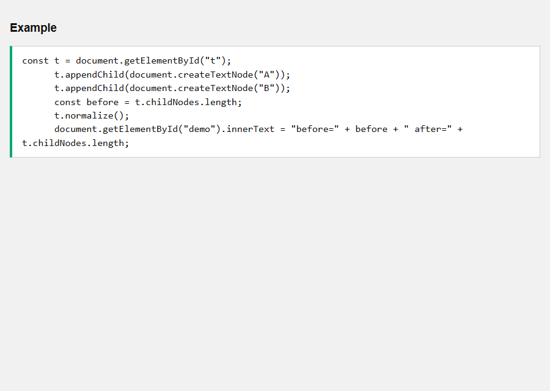


- [x] **Outcome:** `normalize()` reduces `childNodes.length` by merging **A** and **B**.

<a id="element-reference-example-59"></a>

### **Example 59: offsetHeight**

- [x] **`offsetHeight`** — Returns height including padding, border and scrollbar
- [x] This sandbox **runs** the API from the W3Schools reference table (January 2026 revision).
- [x] Start from `document` (or an element). Wrap risky / deprecated calls in `try/catch` so a missing engine feature still prints a result.

Sandbox: `code_sandbox/element-reference/offsetheight.html`

```javascript
document.getElementById("demo").innerText = "offsetHeight=" + document.getElementById("wrap").offsetHeight;
```


- [x] **Outcome:** `offsetHeight` is larger than `clientHeight` because it includes the **border**.

<a id="element-reference-example-60"></a>

### **Example 60: offsetWidth**

- [x] **`offsetWidth`** — Returns width including padding, border and scrollbar
- [x] This sandbox **runs** the API from the W3Schools reference table (January 2026 revision).
- [x] Start from `document` (or an element). Wrap risky / deprecated calls in `try/catch` so a missing engine feature still prints a result.

Sandbox: `code_sandbox/element-reference/offsetwidth.html`

```javascript
document.getElementById("demo").innerText = "offsetWidth=" + document.getElementById("wrap").offsetWidth;
```

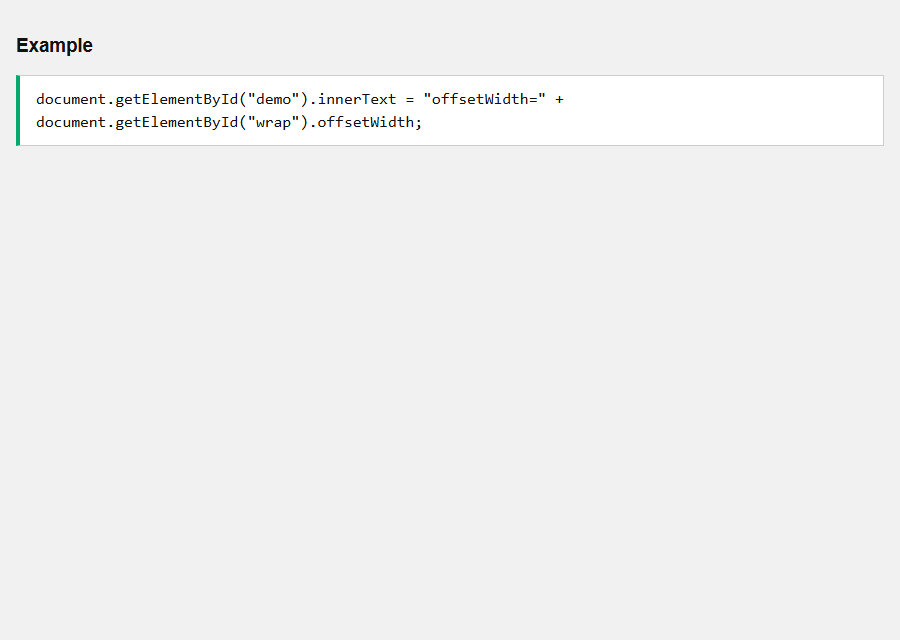


- [x] **Outcome:** `offsetWidth` includes the 4px border on both sides.

<a id="element-reference-example-61"></a>

### **Example 61: offsetLeft**

- [x] **`offsetLeft`** — Returns the horizontal offset position of an element
- [x] This sandbox **runs** the API from the W3Schools reference table (January 2026 revision).
- [x] Start from `document` (or an element). Wrap risky / deprecated calls in `try/catch` so a missing engine feature still prints a result.

Sandbox: `code_sandbox/element-reference/offsetleft.html`

```javascript
document.getElementById("demo").innerText = "offsetLeft=" + document.getElementById("wrap").offsetLeft;
```


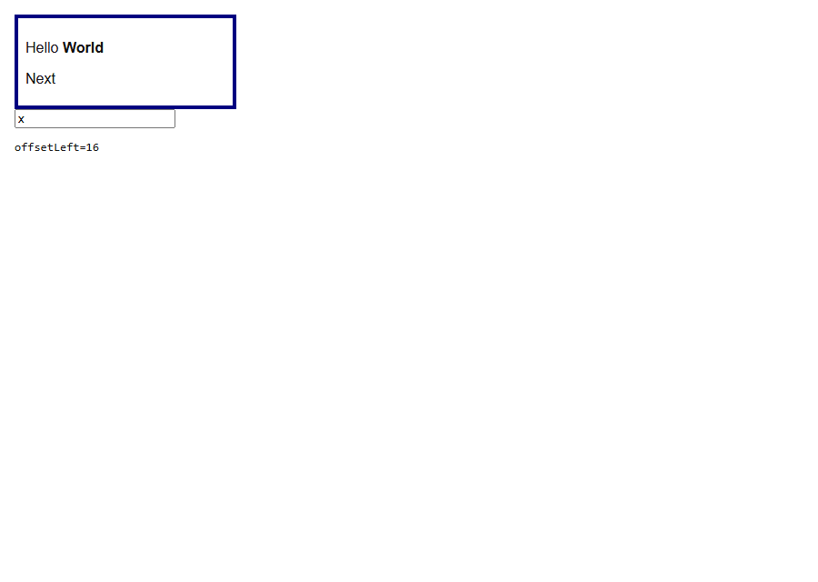

- [x] **Outcome:** `offsetLeft` is the pixel offset from `offsetParent`.

<a id="element-reference-example-62"></a>

### **Example 62: offsetParent**

- [x] **`offsetParent`** — Returns the offset container of an element
- [x] This sandbox **runs** the API from the W3Schools reference table (January 2026 revision).
- [x] Start from `document` (or an element). Wrap risky / deprecated calls in `try/catch` so a missing engine feature still prints a result.

Sandbox: `code_sandbox/element-reference/offsetparent.html`

```javascript
const p = document.getElementById("wrap").offsetParent;
      document.getElementById("demo").innerText = p ? p.tagName : "null";
```

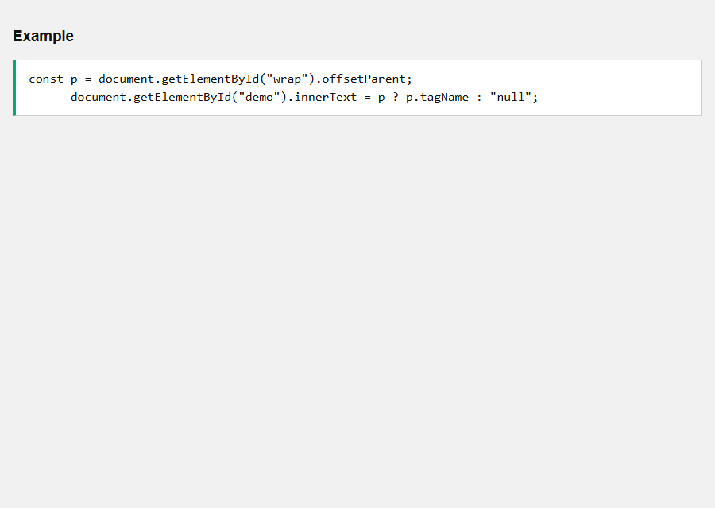


- [x] **Outcome:** `offsetParent` is typically **BODY** (or a positioned ancestor).

<a id="element-reference-example-63"></a>

### **Example 63: offsetTop**

- [x] **`offsetTop`** — Returns the vertical offset position of an element
- [x] This sandbox **runs** the API from the W3Schools reference table (January 2026 revision).
- [x] Start from `document` (or an element). Wrap risky / deprecated calls in `try/catch` so a missing engine feature still prints a result.

Sandbox: `code_sandbox/element-reference/offsettop.html`

```javascript
document.getElementById("demo").innerText = "offsetTop=" + document.getElementById("wrap").offsetTop;
```

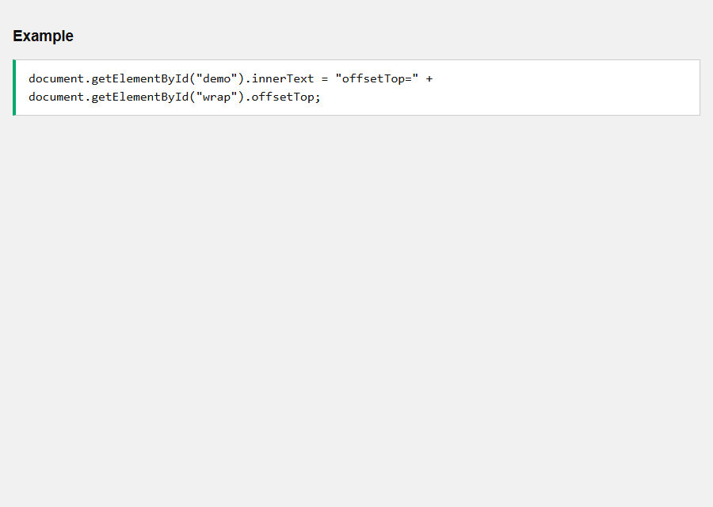


- [x] **Outcome:** `offsetTop` is the vertical offset from `offsetParent`.

<a id="element-reference-example-64"></a>

### **Example 64: outerHTML**

- [x] **`outerHTML`** — Sets or returns the element including its start and end tags
- [x] This sandbox **runs** the API from the W3Schools reference table (January 2026 revision).
- [x] Start from `document` (or an element). Wrap risky / deprecated calls in `try/catch` so a missing engine feature still prints a result.

Sandbox: `code_sandbox/element-reference/outerhtml.html`

```javascript
document.getElementById("demo").innerText = document.getElementById("u").outerHTML;
```

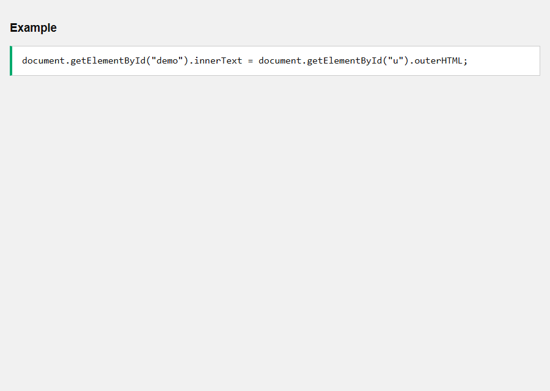


- [x] **Outcome:** `#u.outerHTML` includes **`<p id="u">Next</p>`**.

<a id="element-reference-example-65"></a>

### **Example 65: outerText**

- [x] **`outerText`** — Sets or returns the outer text content of a node
- [x] This sandbox **runs** the API from the W3Schools reference table (January 2026 revision).
- [x] Start from `document` (or an element). Wrap risky / deprecated calls in `try/catch` so a missing engine feature still prints a result.

Sandbox: `code_sandbox/element-reference/outertext.html`

```javascript
document.getElementById("demo").innerText = "outerText=" + document.getElementById("u").outerText;
```

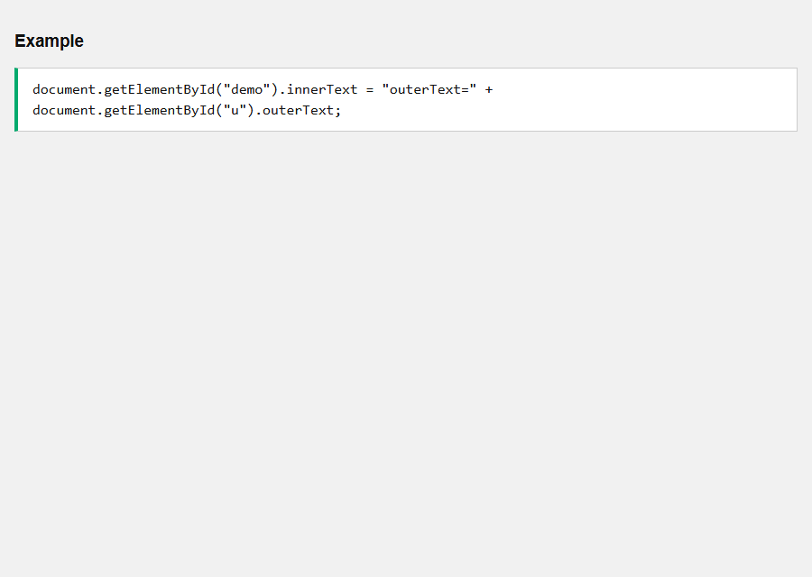


- [x] **Outcome:** `outerText` of `#u` is **Next**. Assigning it would **replace the element** with text.

<a id="element-reference-example-66"></a>

### **Example 66: ownerDocument**

- [x] **`ownerDocument`** — Returns the root document object for an element
- [x] This sandbox **runs** the API from the W3Schools reference table (January 2026 revision).
- [x] Start from `document` (or an element). Wrap risky / deprecated calls in `try/catch` so a missing engine feature still prints a result.

Sandbox: `code_sandbox/element-reference/ownerdocument.html`

```javascript
document.getElementById("demo").innerText = String(document.getElementById("t").ownerDocument === document);
```

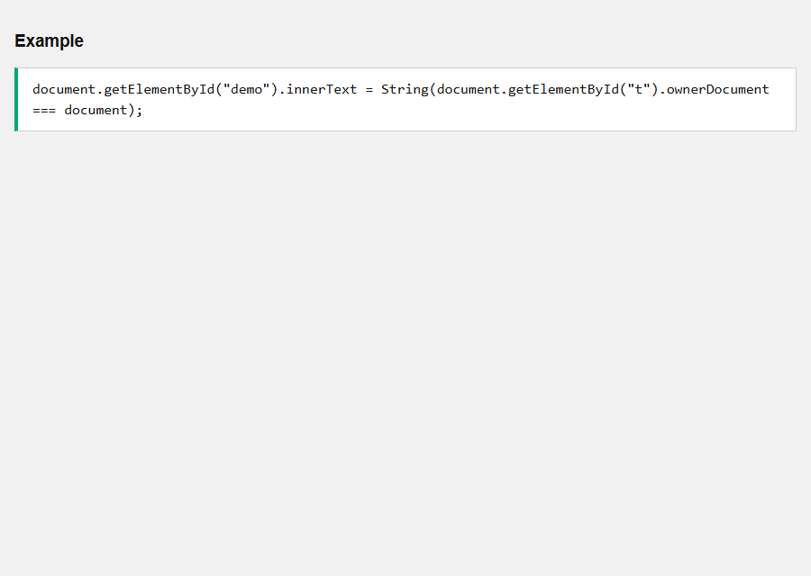


- [x] **Outcome:** `ownerDocument === document` is **true**.

<a id="element-reference-example-67"></a>

### **Example 67: parentNode**

- [x] **`parentNode`** — Returns the parent node of an element
- [x] This sandbox **runs** the API from the W3Schools reference table (January 2026 revision).
- [x] Start from `document` (or an element). Wrap risky / deprecated calls in `try/catch` so a missing engine feature still prints a result.

Sandbox: `code_sandbox/element-reference/parentnode.html`

```javascript
document.getElementById("demo").innerText = document.getElementById("t").parentNode.id;
```

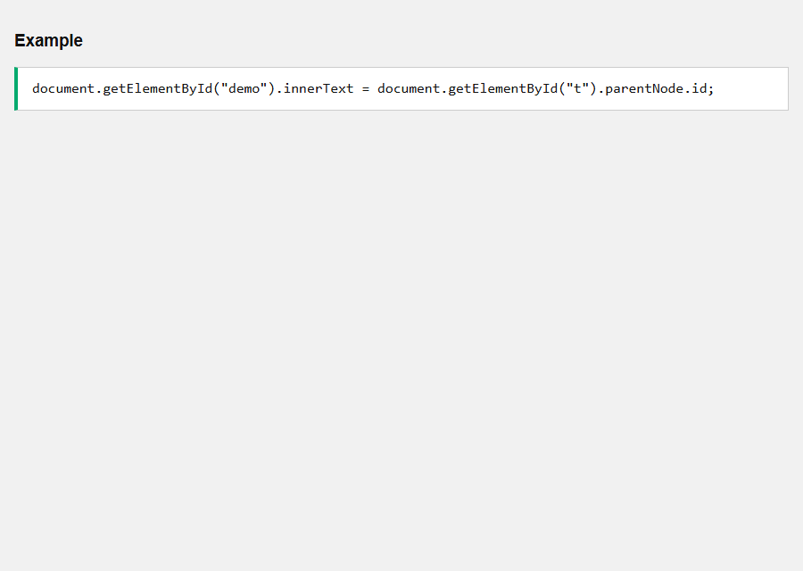


- [x] **Outcome:** `#t.parentNode` is **wrap**.

<a id="element-reference-example-68"></a>

### **Example 68: parentElement**

- [x] **`parentElement`** — Returns the parent element node of an element
- [x] This sandbox **runs** the API from the W3Schools reference table (January 2026 revision).
- [x] Start from `document` (or an element). Wrap risky / deprecated calls in `try/catch` so a missing engine feature still prints a result.

Sandbox: `code_sandbox/element-reference/parentelement.html`

```javascript
document.getElementById("demo").innerText = document.getElementById("t").parentElement.id;
```

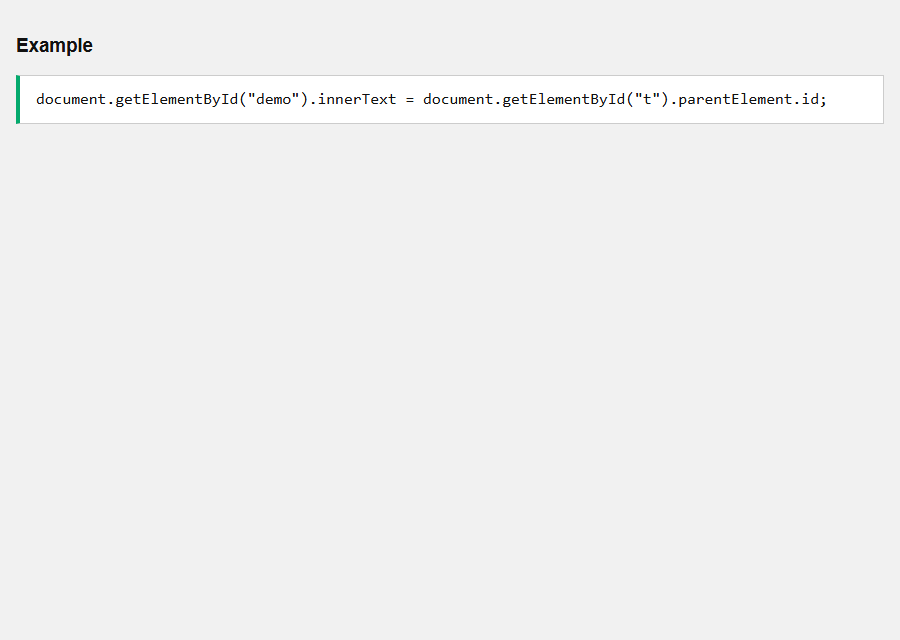


- [x] **Outcome:** `parentElement` is also **wrap** (null if the parent is not an Element).

<a id="element-reference-example-69"></a>

### **Example 69: previousSibling**

- [x] **`previousSibling`** — Returns the previous node at the same tree level
- [x] This sandbox **runs** the API from the W3Schools reference table (January 2026 revision).
- [x] Start from `document` (or an element). Wrap risky / deprecated calls in `try/catch` so a missing engine feature still prints a result.

Sandbox: `code_sandbox/element-reference/previoussibling.html`

```javascript
const n = document.getElementById("u").previousSibling;
      document.getElementById("demo").innerText = n && (n.nodeName + " " + (n.id || ""));
```

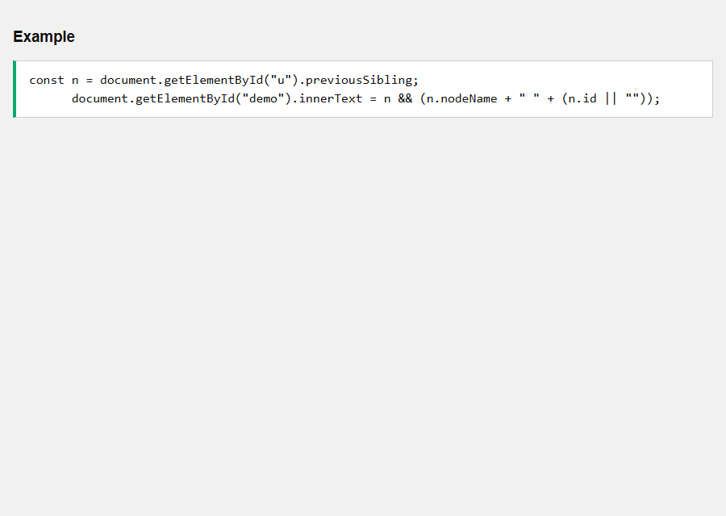


- [x] **Outcome:** `previousSibling` of `#u` may be whitespace text, not `#t`.

<a id="element-reference-example-70"></a>

### **Example 70: previousElementSibling**

- [x] **`previousElementSibling`** — Returns the previous element at the same tree level
- [x] This sandbox **runs** the API from the W3Schools reference table (January 2026 revision).
- [x] Start from `document` (or an element). Wrap risky / deprecated calls in `try/catch` so a missing engine feature still prints a result.

Sandbox: `code_sandbox/element-reference/previouselementsibling.html`

```javascript
document.getElementById("demo").innerText = document.getElementById("u").previousElementSibling.id;
```

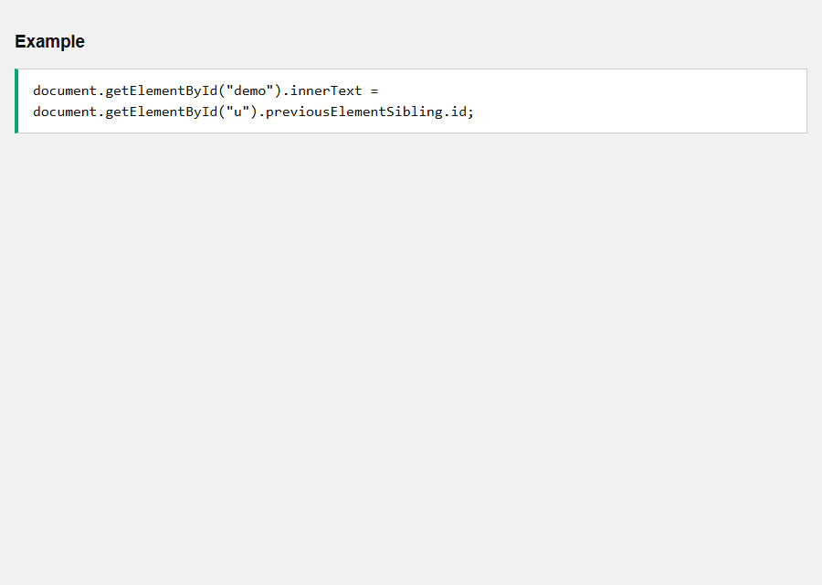


- [x] **Outcome:** `previousElementSibling` of `#u` is **t**.

<a id="element-reference-example-71"></a>

### **Example 71: querySelector()**

- [x] **`querySelector()`** — Returns the first descendant that matches a CSS selector
- [x] This sandbox **runs** the API from the W3Schools reference table (January 2026 revision).
- [x] Start from `document` (or an element). Wrap risky / deprecated calls in `try/catch` so a missing engine feature still prints a result.

Sandbox: `code_sandbox/element-reference/queryselector.html`

```javascript
document.getElementById("demo").innerText = document.getElementById("wrap").querySelector("b").id;
```


- [x] **Outcome:** `wrap.querySelector("b")` is **b**.

<a id="element-reference-example-72"></a>

### **Example 72: querySelectorAll()**

- [x] **`querySelectorAll()`** — Returns all descendants that match a CSS selector
- [x] This sandbox **runs** the API from the W3Schools reference table (January 2026 revision).
- [x] Start from `document` (or an element). Wrap risky / deprecated calls in `try/catch` so a missing engine feature still prints a result.

Sandbox: `code_sandbox/element-reference/queryselectorall.html`

```javascript
document.getElementById("demo").innerText = "p=" + document.getElementById("wrap").querySelectorAll("p").length;
```

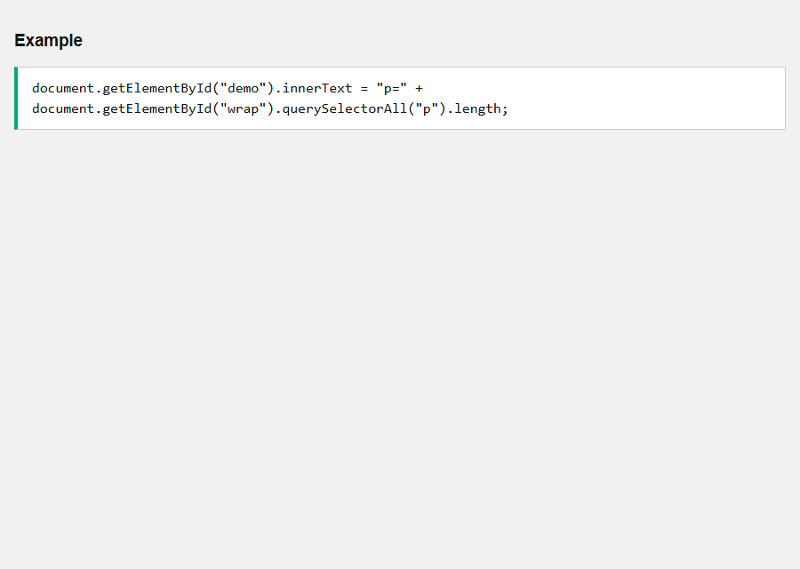


- [x] **Outcome:** `querySelectorAll("p")` under wrap is **2**.

<a id="element-reference-example-73"></a>

### **Example 73: remove()**

- [x] **`remove()`** — Removes an element from the DOM
- [x] This sandbox **runs** the API from the W3Schools reference table (January 2026 revision).
- [x] Start from `document` (or an element). Wrap risky / deprecated calls in `try/catch` so a missing engine feature still prints a result.

Sandbox: `code_sandbox/element-reference/remove.html`

```javascript
document.getElementById("u").remove();
      document.getElementById("demo").innerText = "u=" + document.getElementById("u");
```

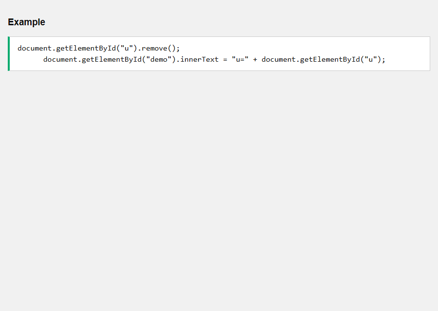


- [x] **Outcome:** After `remove()`, `getElementById("u")` is **null**.

<a id="element-reference-example-74"></a>

### **Example 74: removeAttribute()**

- [x] **`removeAttribute()`** — Removes an attribute from an element
- [x] This sandbox **runs** the API from the W3Schools reference table (January 2026 revision).
- [x] Start from `document` (or an element). Wrap risky / deprecated calls in `try/catch` so a missing engine feature still prints a result.

Sandbox: `code_sandbox/element-reference/removeattribute.html`

```javascript
const t = document.getElementById("t");
      t.removeAttribute("data-k");
      document.getElementById("demo").innerText = "has=" + t.hasAttribute("data-k");
```

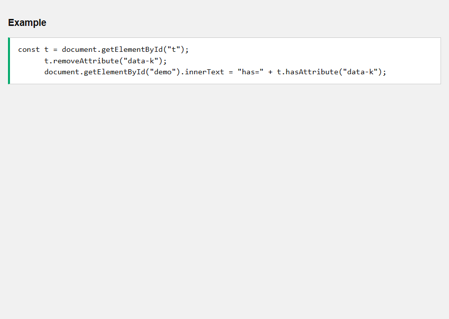


- [x] **Outcome:** `data-k` is gone: `hasAttribute` is **false**.

<a id="element-reference-example-75"></a>

### **Example 75: removeAttributeNode()**

- [x] **`removeAttributeNode()`** — Removes an attribute node, and returns the removed node
- [x] This sandbox **runs** the API from the W3Schools reference table (January 2026 revision).
- [x] Start from `document` (or an element). Wrap risky / deprecated calls in `try/catch` so a missing engine feature still prints a result.

Sandbox: `code_sandbox/element-reference/removeattributenode.html`

```javascript
const t = document.getElementById("t");
      const node = t.removeAttributeNode(t.getAttributeNode("data-k"));
      document.getElementById("demo").innerText = node.name + "=" + node.value + " has=" + t.hasAttribute("data-k");
```

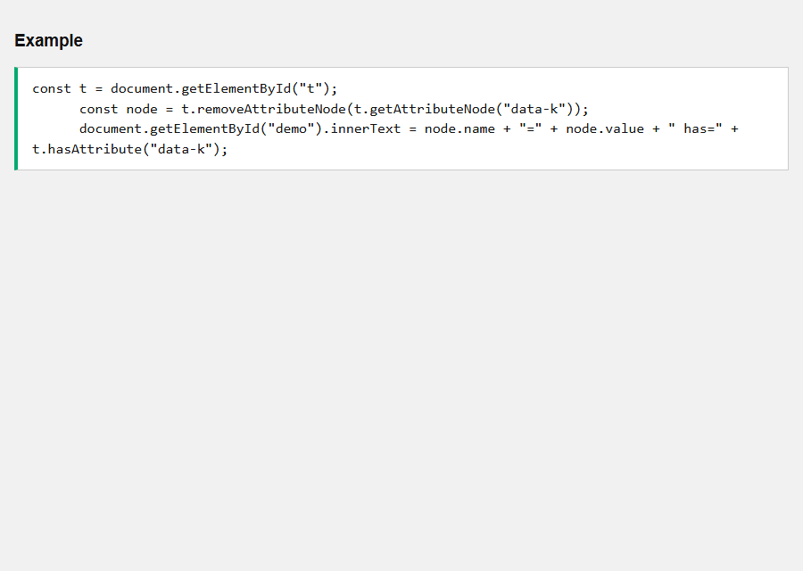


- [x] **Outcome:** The removed Attr is **data-k=v**; the element no longer has that attribute.

<a id="element-reference-example-76"></a>

### **Example 76: removeChild()**

- [x] **`removeChild()`** — Removes a child node from an element
- [x] This sandbox **runs** the API from the W3Schools reference table (January 2026 revision).
- [x] Start from `document` (or an element). Wrap risky / deprecated calls in `try/catch` so a missing engine feature still prints a result.

Sandbox: `code_sandbox/element-reference/removechild.html`

```javascript
const wrap = document.getElementById("wrap");
      wrap.removeChild(document.getElementById("u"));
      document.getElementById("demo").innerText = "u=" + document.getElementById("u");
```

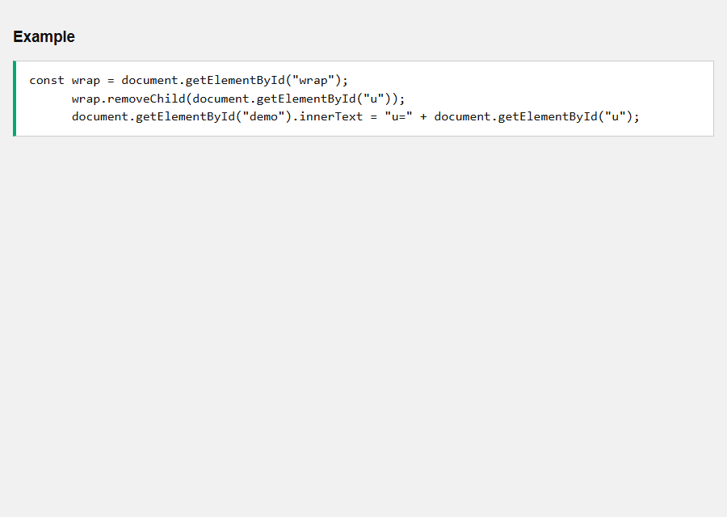


- [x] **Outcome:** `removeChild(#u)` detaches Next; `getElementById("u")` is **null**.

<a id="element-reference-example-77"></a>

### **Example 77: removeEventListener()**

- [x] **`removeEventListener()`** — Removes an event handler attached with addEventListener
- [x] This sandbox **runs** the API from the W3Schools reference table (January 2026 revision).
- [x] Start from `document` (or an element). Wrap risky / deprecated calls in `try/catch` so a missing engine feature still prints a result.

Sandbox: `code_sandbox/element-reference/removeeventlistener.html`

```javascript
const t = document.getElementById("t");
      function ping() { document.getElementById("demo").innerText = "ran"; }
      t.addEventListener("click", ping);
      t.removeEventListener("click", ping);
      t.click();
      if (document.getElementById("demo").innerText !== "ran") {
        document.getElementById("demo").innerText = "listener removed";
      }
```

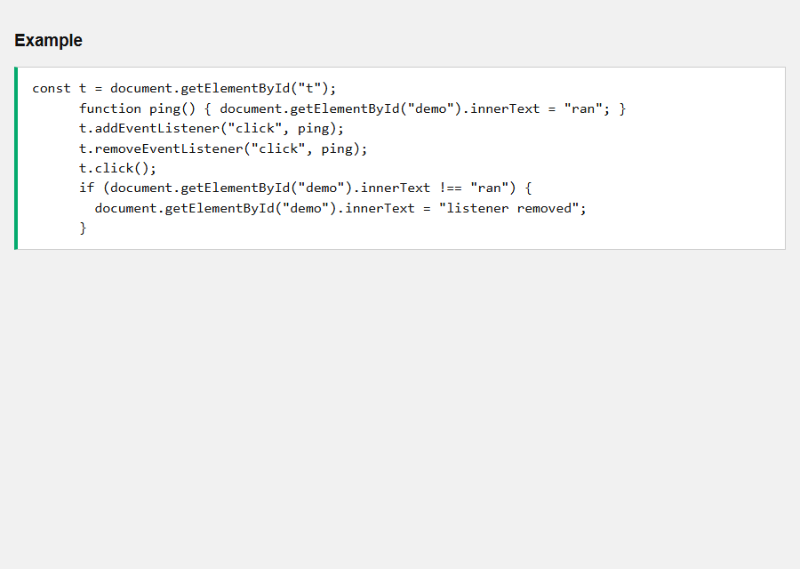


- [x] **Outcome:** After removal, `click()` does **not** print **ran**.

<a id="element-reference-example-78"></a>

### **Example 78: replaceChild()**

- [x] **`replaceChild()`** — Replaces a child node in an element
- [x] This sandbox **runs** the API from the W3Schools reference table (January 2026 revision).
- [x] Start from `document` (or an element). Wrap risky / deprecated calls in `try/catch` so a missing engine feature still prints a result.

Sandbox: `code_sandbox/element-reference/replacechild.html`

```javascript
const neu = document.createElement("p");
      neu.id = "v";
      neu.textContent = "Replaced";
      document.getElementById("wrap").replaceChild(neu, document.getElementById("u"));
      document.getElementById("demo").innerText = document.getElementById("v").textContent;
```

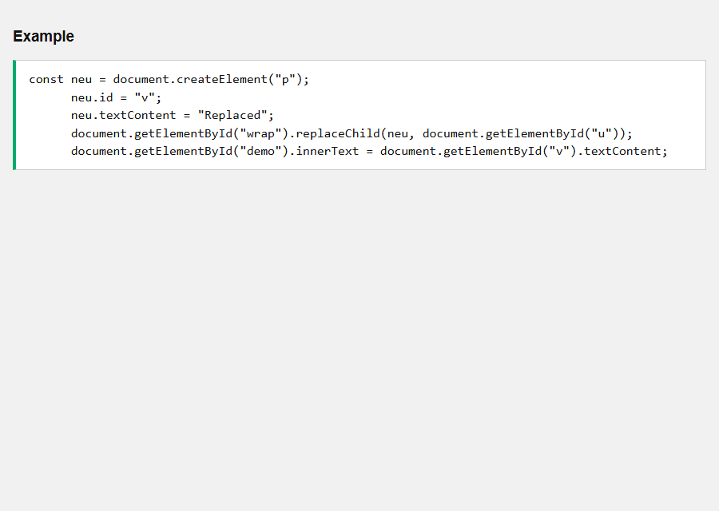


- [x] **Outcome:** `#u` is replaced by **Replaced** (`#v`).

<a id="element-reference-example-79"></a>

### **Example 79: scrollHeight**

- [x] **`scrollHeight`** — Returns the entire height of an element, including padding
- [x] This sandbox **runs** the API from the W3Schools reference table (January 2026 revision).
- [x] Start from `document` (or an element). Wrap risky / deprecated calls in `try/catch` so a missing engine feature still prints a result.

Sandbox: `code_sandbox/element-reference/scrollheight.html`

```javascript
document.getElementById("demo").innerText = "scrollHeight=" + document.getElementById("wrap").scrollHeight;
```


- [x] **Outcome:** `scrollHeight` is the content height, which can exceed the visible box.

<a id="element-reference-example-80"></a>

### **Example 80: scrollIntoView()**

- [x] **`scrollIntoView()`** — Scrolls the element into the visible area of the browser window
- [x] This sandbox **runs** the API from the W3Schools reference table (January 2026 revision).
- [x] Start from `document` (or an element). Wrap risky / deprecated calls in `try/catch` so a missing engine feature still prints a result.

Sandbox: `code_sandbox/element-reference/scrollintoview.html`

```javascript
document.getElementById("u").scrollIntoView();
      document.getElementById("demo").innerText = "scrollTop=" + document.getElementById("wrap").scrollTop;
```

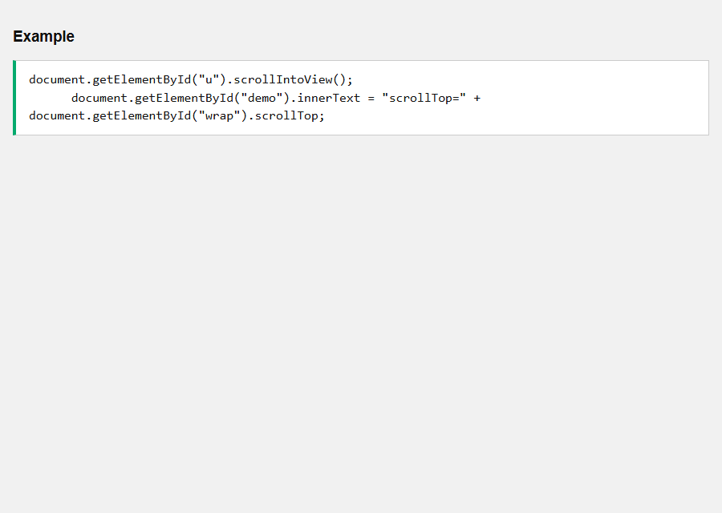


- [x] **Outcome:** `scrollIntoView()` may change `scrollTop` so `#u` is visible (0 if everything already fits).

<a id="element-reference-example-81"></a>

### **Example 81: scrollLeft**

- [x] **`scrollLeft`** — Sets or returns horizontal scroll pixels
- [x] This sandbox **runs** the API from the W3Schools reference table (January 2026 revision).
- [x] Start from `document` (or an element). Wrap risky / deprecated calls in `try/catch` so a missing engine feature still prints a result.

Sandbox: `code_sandbox/element-reference/scrollleft.html`

```javascript
const w = document.getElementById("wrap");
      w.scrollLeft = 10;
      document.getElementById("demo").innerText = "scrollLeft=" + w.scrollLeft;
```

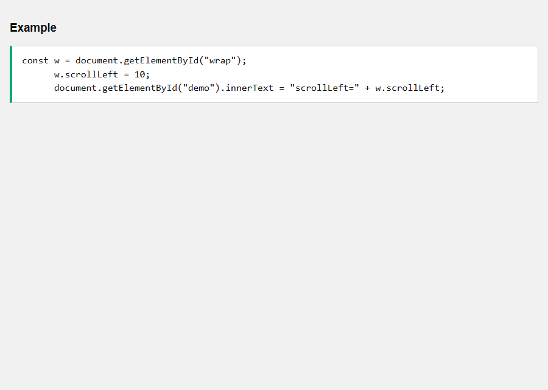


- [x] **Outcome:** `scrollLeft` is set to **10** (may clamp to **0** if there is no overflow-x).

<a id="element-reference-example-82"></a>

### **Example 82: scrollTop**

- [x] **`scrollTop`** — Sets or returns vertical scroll pixels
- [x] This sandbox **runs** the API from the W3Schools reference table (January 2026 revision).
- [x] Start from `document` (or an element). Wrap risky / deprecated calls in `try/catch` so a missing engine feature still prints a result.

Sandbox: `code_sandbox/element-reference/scrolltop.html`

```javascript
const w = document.getElementById("wrap");
      w.scrollTop = 20;
      document.getElementById("demo").innerText = "scrollTop=" + w.scrollTop;
```

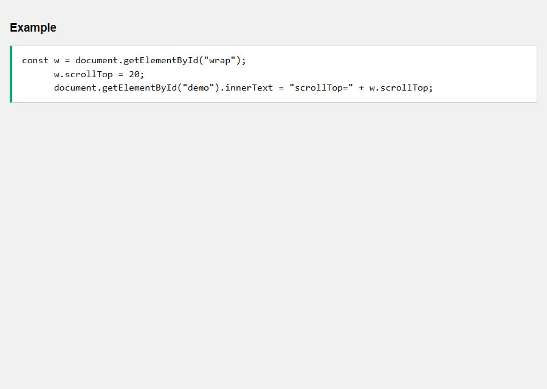


- [x] **Outcome:** `scrollTop` is set toward **20** when the box can scroll.

<a id="element-reference-example-83"></a>

### **Example 83: scrollWidth**

- [x] **`scrollWidth`** — Returns the entire width of an element, including padding
- [x] This sandbox **runs** the API from the W3Schools reference table (January 2026 revision).
- [x] Start from `document` (or an element). Wrap risky / deprecated calls in `try/catch` so a missing engine feature still prints a result.

Sandbox: `code_sandbox/element-reference/scrollwidth.html`

```javascript
document.getElementById("demo").innerText = "scrollWidth=" + document.getElementById("wrap").scrollWidth;
```

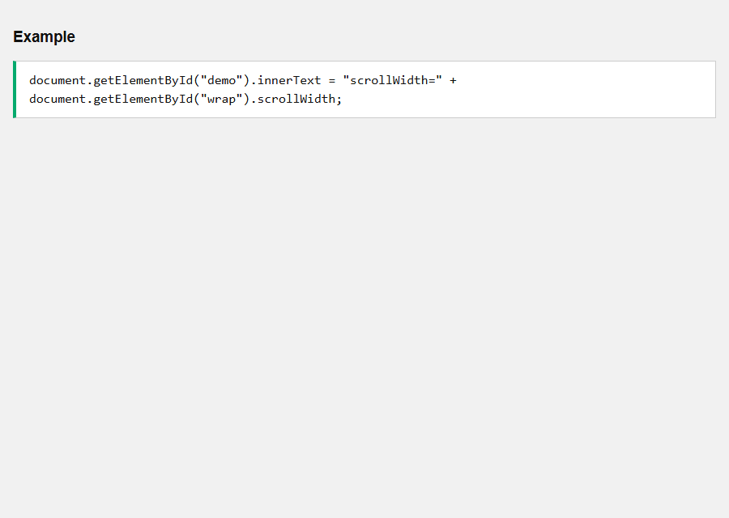


- [x] **Outcome:** `scrollWidth` is the full content width including overflow.

<a id="element-reference-example-84"></a>

### **Example 84: setAttribute()**

- [x] **`setAttribute()`** — Sets or changes an attribute's value
- [x] This sandbox **runs** the API from the W3Schools reference table (January 2026 revision).
- [x] Start from `document` (or an element). Wrap risky / deprecated calls in `try/catch` so a missing engine feature still prints a result.

Sandbox: `code_sandbox/element-reference/setattribute.html`

```javascript
const t = document.getElementById("t");
      t.setAttribute("data-k", "z");
      document.getElementById("demo").innerText = t.getAttribute("data-k");
```

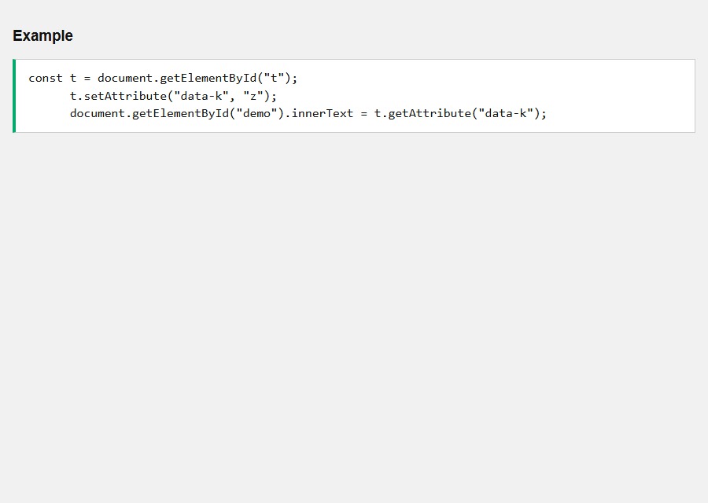


- [x] **Outcome:** `data-k` is now **z**.

<a id="element-reference-example-85"></a>

### **Example 85: setAttributeNode()**

- [x] **`setAttributeNode()`** — Sets or changes an attribute node
- [x] This sandbox **runs** the API from the W3Schools reference table (January 2026 revision).
- [x] Start from `document` (or an element). Wrap risky / deprecated calls in `try/catch` so a missing engine feature still prints a result.

Sandbox: `code_sandbox/element-reference/setattributenode.html`

```javascript
const a = document.createAttribute("data-n");
      a.value = "9";
      document.getElementById("t").setAttributeNode(a);
      document.getElementById("demo").innerText = document.getElementById("t").getAttribute("data-n");
```

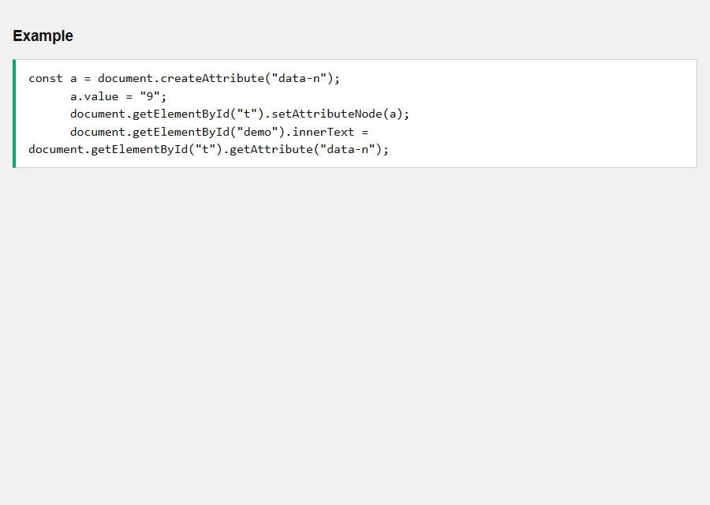


- [x] **Outcome:** `setAttributeNode` attaches **data-n="9"**.

<a id="element-reference-example-86"></a>

### **Example 86: style**

- [x] **`style`** — Sets or returns the value of the style attribute
- [x] This sandbox **runs** the API from the W3Schools reference table (January 2026 revision).
- [x] Start from `document` (or an element). Wrap risky / deprecated calls in `try/catch` so a missing engine feature still prints a result.

Sandbox: `code_sandbox/element-reference/style.html`

```javascript
const t = document.getElementById("t");
      t.style.color = "crimson";
      document.getElementById("demo").innerText = t.style.color;
```


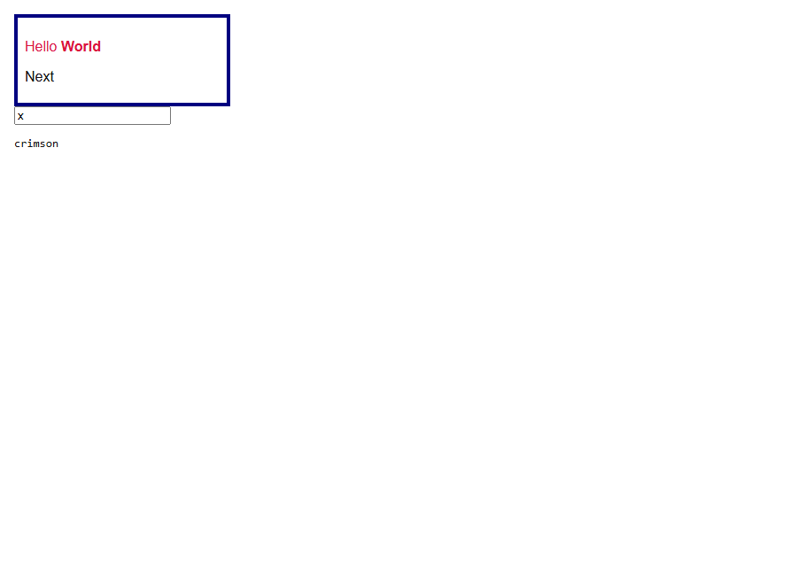

- [x] **Outcome:** `style.color` is **crimson** (inline).

<a id="element-reference-example-87"></a>

### **Example 87: tabIndex**

- [x] **`tabIndex`** — Sets or returns the value of the tabindex attribute
- [x] This sandbox **runs** the API from the W3Schools reference table (January 2026 revision).
- [x] Start from `document` (or an element). Wrap risky / deprecated calls in `try/catch` so a missing engine feature still prints a result.

Sandbox: `code_sandbox/element-reference/tabindex.html`

```javascript
const w = document.getElementById("wrap");
      document.getElementById("demo").innerText = String(w.tabIndex);
      w.tabIndex = 3;
      document.getElementById("demo").innerText += " -> " + w.tabIndex;
```

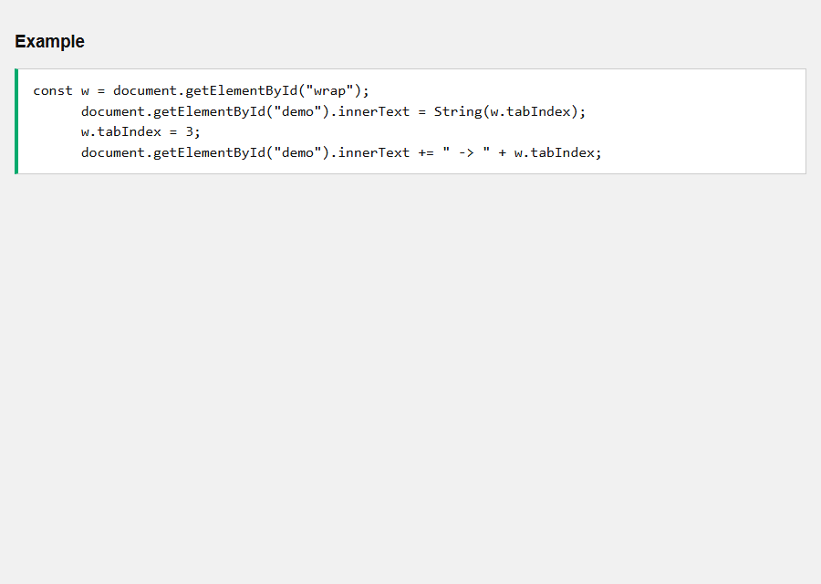


- [x] **Outcome:** `tabIndex` starts at **0** and is set to **3**.

<a id="element-reference-example-88"></a>

### **Example 88: tagName**

- [x] **`tagName`** — Returns the tag name of an element
- [x] This sandbox **runs** the API from the W3Schools reference table (January 2026 revision).
- [x] Start from `document` (or an element). Wrap risky / deprecated calls in `try/catch` so a missing engine feature still prints a result.

Sandbox: `code_sandbox/element-reference/tagname.html`

```javascript
document.getElementById("demo").innerText = document.getElementById("t").tagName;
```


- [x] **Outcome:** `tagName` is **P**.

<a id="element-reference-example-89"></a>

### **Example 89: textContent**

- [x] **`textContent`** — Sets or returns the textual content of a node and its descendants
- [x] This sandbox **runs** the API from the W3Schools reference table (January 2026 revision).
- [x] Start from `document` (or an element). Wrap risky / deprecated calls in `try/catch` so a missing engine feature still prints a result.

Sandbox: `code_sandbox/element-reference/textcontent.html`

```javascript
document.getElementById("demo").innerText = JSON.stringify(document.getElementById("t").textContent);
```

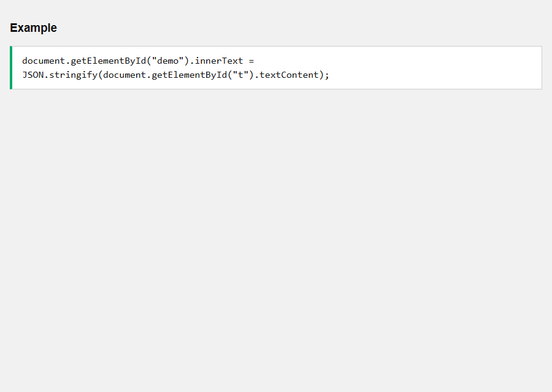


- [x] **Outcome:** `textContent` concatenates descendant text: **Hello World**.

<a id="element-reference-example-90"></a>

### **Example 90: title**

- [x] **`title`** — Sets or returns the value of the title attribute (tooltip)
- [x] This sandbox **runs** the API from the W3Schools reference table (January 2026 revision).
- [x] Start from `document` (or an element). Wrap risky / deprecated calls in `try/catch` so a missing engine feature still prints a result.

Sandbox: `code_sandbox/element-reference/title.html`

```javascript
const w = document.getElementById("wrap");
      document.getElementById("demo").innerText = w.title;
      w.title = "tip";
      document.getElementById("demo").innerText += " -> " + w.title;
```

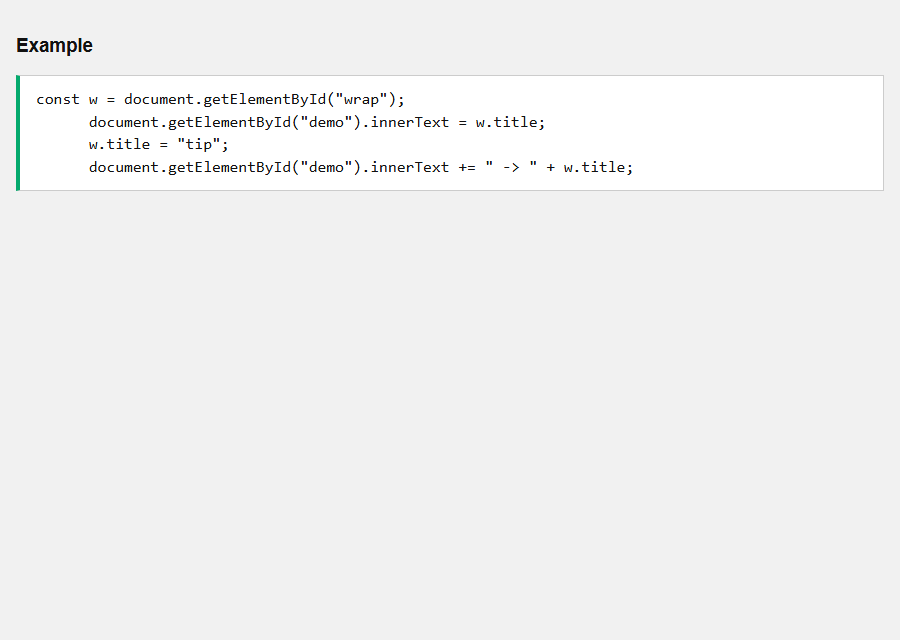


- [x] **Outcome:** `title` goes from **box** to **tip**.

<a id="element-reference-example-91"></a>

### **Example 91: toString()**

- [x] **`toString()`** — Converts an element to a string
- [x] This sandbox **runs** the API from the W3Schools reference table (January 2026 revision).
- [x] Start from `document` (or an element). Wrap risky / deprecated calls in `try/catch` so a missing engine feature still prints a result.

Sandbox: `code_sandbox/element-reference/tostring.html`

```javascript
document.getElementById("demo").innerText = document.getElementById("t").toString();
```


- [x] **Outcome:** `toString()` on an element is typically **`[object HTMLParagraphElement]`**.

<details>
  <summary>Terminal Commands</summary>

## Terminal Commands

```bash
# from Personal/Files/javascript/code_sandbox
py -3 -m http.server 8770 --bind 127.0.0.1
```

Then open `http://127.0.0.1:8770/element-reference/`.

</details>

<details>
  <summary>Questions and Answers</summary>

## Questions and Answers

### Question 1: What is the difference between `childNodes` and `children`?

<details>
<summary>Answer</summary>

- [x] `childNodes` includes **text/comment** nodes. `children` is **elements only**.

</details>

### Question 2: `nextSibling` vs `nextElementSibling`?

<details>
<summary>Answer</summary>

- [x] The first can be **whitespace**. The second skips to the next **element**.

</details>

### Question 3: Does `cloneNode(true)` copy descendants?

<details>
<summary>Answer</summary>

- [x] Yes — **deep** clone. `false` copies only the node itself.

</details>

### Question 4: What does `closest("#wrap")` do from `#b`?

<details>
<summary>Answer</summary>

- [x] Walks **up** the tree until it finds `#wrap`.

</details>

### Question 5: `isEqualNode` vs `isSameNode`?

<details>
<summary>Answer</summary>

- [x] Equal means same structure/values. Same means **one object** in memory.

</details>

### Question 6: What does `remove()` do?

<details>
<summary>Answer</summary>

- [x] Detaches **that element** from the tree (no parent argument).

</details>

### Question 7: Does `innerHTML` include the element’s own tags?

<details>
<summary>Answer</summary>

- [x] No — that is **`outerHTML`**.

</details>

### Question 8: What unit are `clientWidth` / `offsetWidth` in?

<details>
<summary>Answer</summary>

- [x] **CSS pixels** (numbers, not `"px"` strings).

</details>

### Question 9: How do you add a class without wiping others?

<details>
<summary>Answer</summary>

- [x] Use **`classList.add`**, not `className = ...` (that replaces the whole string).

</details>

### Question 10: What does `matches("p.note")` return for `#t`?

<details>
<summary>Answer</summary>

- [x] **true** — it is a `p` with class `note`.

</details>

### Question 11: Should you call `isSupported()`?

<details>
<summary>Answer</summary>

- [x] No — **deprecated**.

</details>

### Question 12: What does `append("!")` accept that `appendChild` does not?

<details>
<summary>Answer</summary>

- [x] **Strings** (and several nodes). `appendChild` needs a Node.

</details>


</details>

## Summary

Look up a node, then read tree, content, attributes, or box geometry. Prefer `classList`, `before`/`after`/`append`, and `remove()` over the oldest APIs.

## References

- [HTML DOM Element Reference](https://www.w3schools.com/js/js_htmldom_element_reference.asp)
- [MDN Element](https://developer.mozilla.org/en-US/docs/Web/API/Element)

</details>

<details>
  <summary>Intro to Events</summary>

## Introduction

HTML events are things that happen to elements. JavaScript can run when they are detected — via attributes, `onclick` assignment, or `addEventListener`.

This section has **12** examples:

- [x] **Example 1:** onclick attribute — write the date into another element [View](#intro-to-events-example-01)
- [x] **Example 2:** onclick — change this.innerHTML [View](#intro-to-events-example-02)
- [x] **Example 3:** Calling a JavaScript function from onclick [View](#intro-to-events-example-03)
- [x] **Example 4:** Common event — onchange [View](#intro-to-events-example-04)
- [x] **Example 5:** Common event — onclick [View](#intro-to-events-example-05)
- [x] **Example 6:** Common event — onmouseover [View](#intro-to-events-example-06)
- [x] **Example 7:** Common event — onmouseout [View](#intro-to-events-example-07)
- [x] **Example 8:** Common event — onkeydown [View](#intro-to-events-example-08)
- [x] **Example 9:** Common event — onload [View](#intro-to-events-example-09)
- [x] **Example 10:** What event handlers are for [View](#intro-to-events-example-10)
- [x] **Example 11:** Not recommended — onclick attribute [View](#intro-to-events-example-11)
- [x] **Example 12:** Highly recommended — addEventListener [View](#intro-to-events-example-12)

## Detailed Explanation

- [x] Event attributes vs functions vs listeners.
- [x] Common events: change, click, mouseover/out, keydown, load.
- [x] `addEventListener` is the recommended style.

<a id="intro-to-events-example-01"></a>

### **Example 1: onclick attribute — write the date into another element**

- [x] HTML event attributes run JavaScript when something happens to that element.
- [x] `onclick="document.getElementById('demo').innerHTML = Date()"` assigns a handler in markup.
- [x] Quotes: use single quotes inside a double-quoted attribute (or vice versa).
- [x] The snapshot clicks the button so the date string appears.

Sandbox: `code_sandbox/intro-to-events/onclick-date.html`

```html
<button type="button" onclick="document.getElementById('out').innerHTML = Date()">
  The time is?
</button>
<p id="out"></p>
```

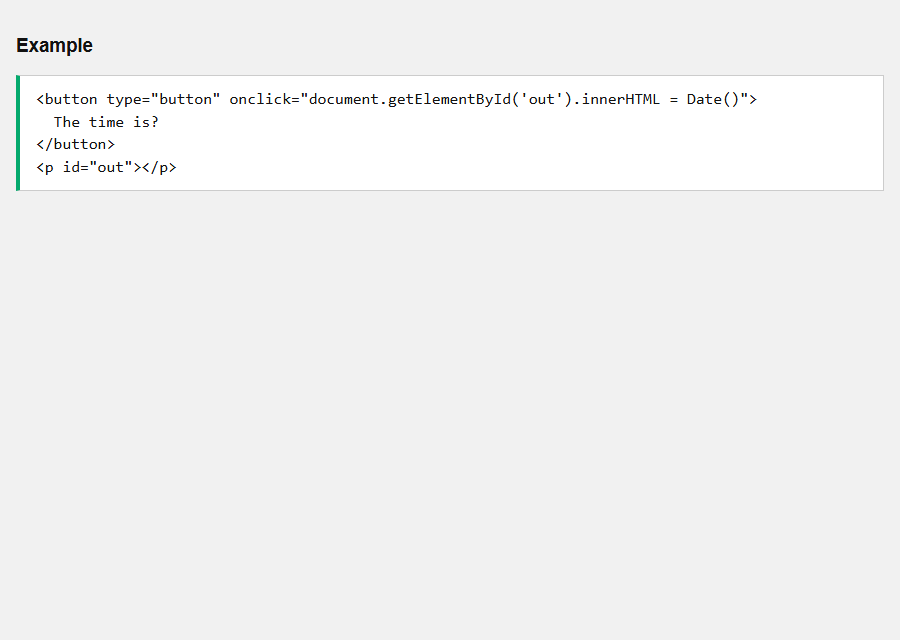


- [x] **Outcome:** After click, the paragraph shows a **date/time string**.

<a id="intro-to-events-example-02"></a>

### **Example 2: onclick — change this.innerHTML**

- [x] `this` inside an HTML event attribute is the **element** that received the event.
- [x] `this.innerHTML = Date()` replaces the button’s own label with the time.
- [x] In an `addEventListener` callback, `this` is also the element (unless you use an arrow function).

Sandbox: `code_sandbox/intro-to-events/onclick-this.html`

```html
<button type="button" onclick="this.innerHTML = Date()">The time is?</button>
```

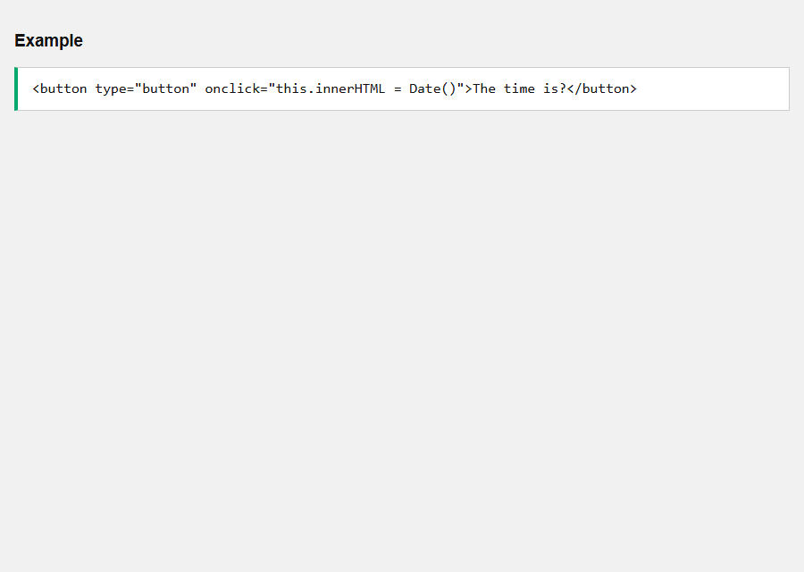

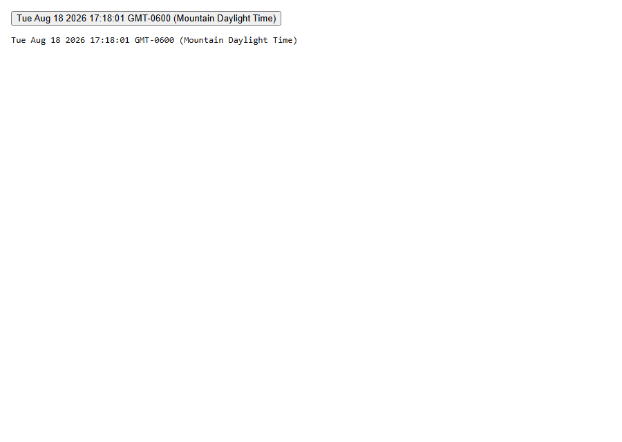

- [x] **Outcome:** The button caption becomes the **Date()** string.

<a id="intro-to-events-example-03"></a>

### **Example 3: Calling a JavaScript function from onclick**

- [x] Longer code belongs in a **named function**, then `onclick="displayDate()"`.
- [x] That keeps markup short and lets you reuse the same function on several controls.
- [x] Remember the `()` in the HTML attribute — that **calls** the function.

Sandbox: `code_sandbox/intro-to-events/onclick-function.html`

```html
<button type="button" onclick="displayDate()">The time is?</button>
<p id="out"></p>
<script>
function displayDate() {
  document.getElementById("out").innerHTML = Date();
}
</script>
```

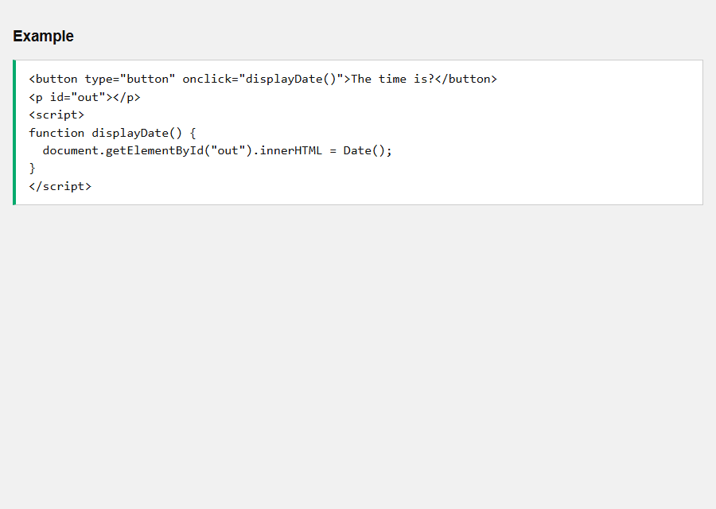

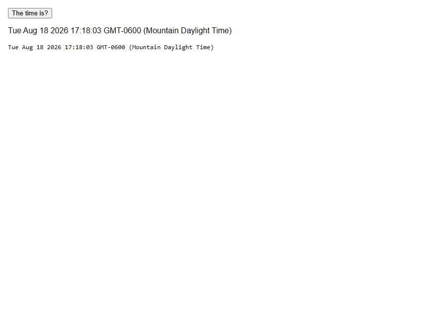

- [x] **Outcome:** `displayDate()` runs on click and fills the paragraph with **Date()**.

<a id="intro-to-events-example-04"></a>

### **Example 4: Common event — onchange**

- [x] `onchange` fires when an input/select **commits** a new value (often on blur for text, immediately for select).
- [x] Typical use: validate or copy the field after the user finishes editing.
- [x] The snapshot sets a value and dispatches `change`.

Sandbox: `code_sandbox/intro-to-events/onchange.html`

```html
<input id="n" onchange="document.getElementById('out').textContent = this.value">
<p id="out"></p>
```


- [x] **Outcome:** After `change`, the output paragraph shows **Ada**.

<a id="intro-to-events-example-05"></a>

### **Example 5: Common event — onclick**

- [x] `onclick` / `click` — the user clicks an element (mousedown + mouseup on the same target).
- [x] Most buttons and fake-buttons use this event.
- [x] Prefer `addEventListener("click", …)` over the HTML attribute for non-trivial apps.

Sandbox: `code_sandbox/intro-to-events/onclick-named.html`

```html
<button type="button" id="b">Click</button>
```


- [x] **Outcome:** The click handler prints **clicked**.

<a id="intro-to-events-example-06"></a>

### **Example 6: Common event — onmouseover**

- [x] Fires when the pointer **enters** the element (and also when it enters a child — it bubbles).
- [x] Used for hover highlights. `mouseenter` is the non-bubbling cousin.
- [x] The snapshot dispatches `mouseover`.

Sandbox: `code_sandbox/intro-to-events/onmouseover.html`

```html
<div id="box">Mouse Over Me</div>
```


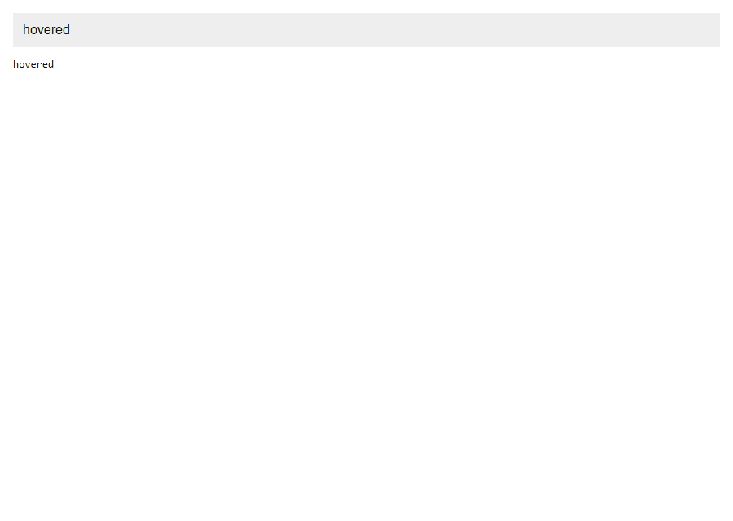

- [x] **Outcome:** After `mouseover`, the box text is **hovered**.

<a id="intro-to-events-example-07"></a>

### **Example 7: Common event — onmouseout**

- [x] Fires when the pointer **leaves** the element (also bubbles from children).
- [x] Pair with `mouseover` for hover in/out. `mouseleave` does not fire when moving to a child.
- [x] The snapshot dispatches `mouseout`.

Sandbox: `code_sandbox/intro-to-events/onmouseout.html`

```html
<div id="box">Mouse Over Me</div>
```


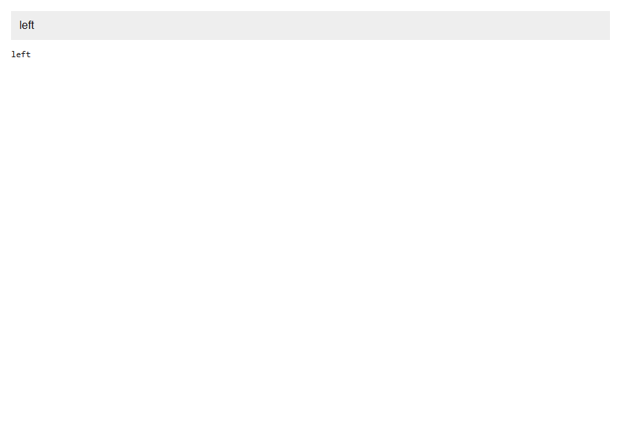

- [x] **Outcome:** After `mouseout`, the box text is **left**.

<a id="intro-to-events-example-08"></a>

### **Example 8: Common event — onkeydown**

- [x] Fires when a key is **pressed down** (repeats if held).
- [x] `event.key` is the character/name (`"a"`, `"Enter"`). `event.code` is the physical key (`"KeyA"`).
- [x] `keypress` is deprecated — use `keydown` / `keyup`.

Sandbox: `code_sandbox/intro-to-events/onkeydown.html`

```html
<input id="k">
```


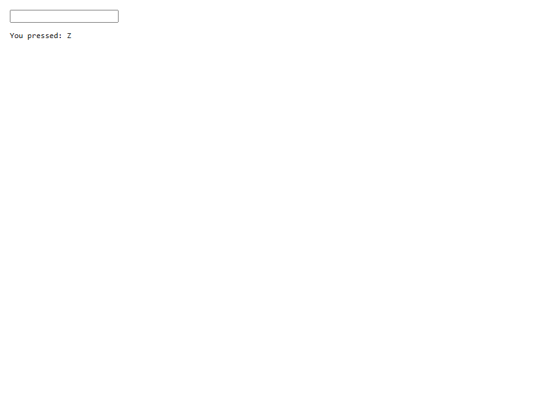

- [x] **Outcome:** Dispatching keydown for **Z** prints **You pressed: Z**.

<a id="intro-to-events-example-09"></a>

### **Example 9: Common event — onload**

- [x] `window.onload` / `window` `load` fires when the **page and resources** (images, CSS) have loaded.
- [x] `DOMContentLoaded` is earlier — HTML is ready, images maybe not.
- [x] This script has already loaded, so we record that the `load` path ran (or we fire it).

Sandbox: `code_sandbox/intro-to-events/onload.html`

```html
<script>
window.onload = function () {
  document.getElementById("demo").innerText = "page loaded";
};
</script>
```

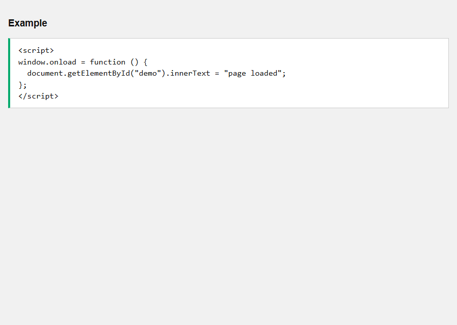


- [x] **Outcome:** The handler reports **page loaded** (the event already happened, or we invoke the same function).

<a id="intro-to-events-example-10"></a>

### **Example 10: What event handlers are for**

- [x] Handlers verify input, run actions on click, and set up the page on load.
- [x] You can: put JS in an HTML attribute; call a function from an attribute; assign `element.onclick = fn`; prevent default.
- [x] The next pages cover mouse, keyboard, load, and `addEventListener` in depth.

Sandbox: `code_sandbox/intro-to-events/handlers-uses.html`

```html
<script>
const uses = [
  "Things that should be done every time a page loads",
  "Action when a user clicks a button",
  "Content verified when a user inputs data"
];
</script>
```

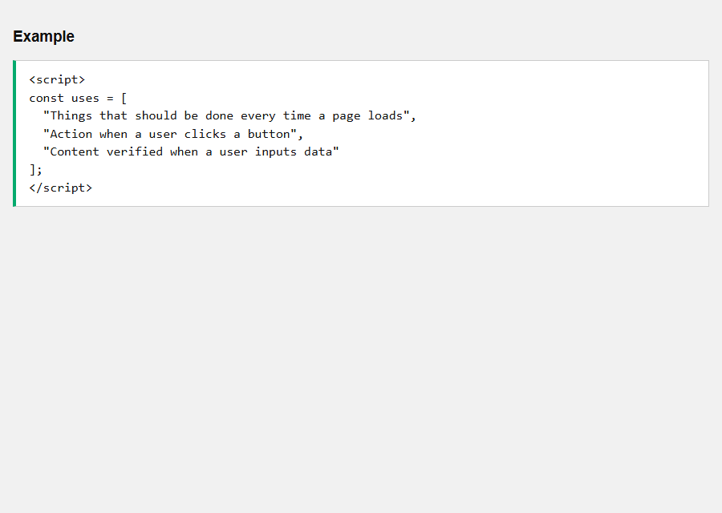

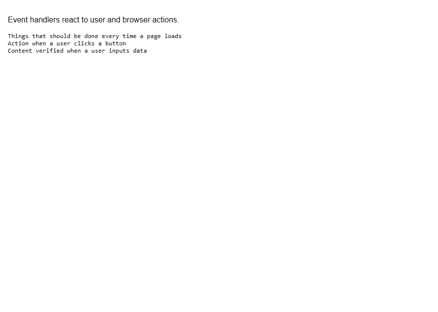

- [x] **Outcome:** The snapshot lists typical handler jobs: **load**, **click**, **input check**.

<a id="intro-to-events-example-11"></a>

### **Example 11: Not recommended — onclick attribute**

- [x] HTML `onclick` is easy, but it **mixes** behavior into markup.
- [x] You can attach only **one** `onclick` property later without `addEventListener`.
- [x] W3Schools still shows it, then marks `addEventListener` as **highly recommended**.

Sandbox: `code_sandbox/intro-to-events/onclick-not-recommended.html`

```html
<button type="button" onclick="displayDate()">Time is?</button>
<script>
function displayDate() {
  document.getElementById("out").innerHTML = Date();
}
</script>
```

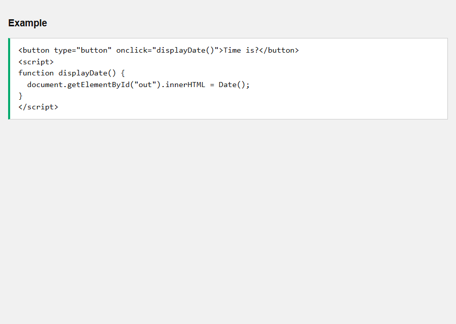

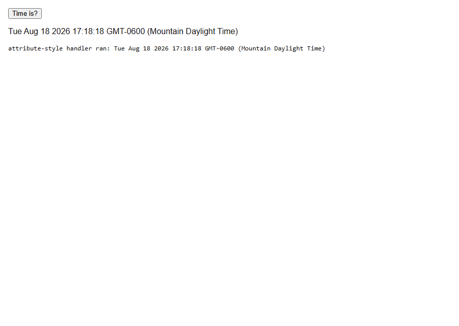

- [x] **Outcome:** The attribute still works — the date appears — but the next example is the preferred style.

<a id="intro-to-events-example-12"></a>

### **Example 12: Highly recommended — addEventListener**

- [x] `addEventListener("click", fn)` keeps HTML and JS **separate**.
- [x] You can add **many** listeners. The event name has **no** `on` prefix (`"click"` not `"onclick"`).
- [x] This is the style the rest of the Events group uses.

Sandbox: `code_sandbox/intro-to-events/addeventlistener-recommended.html`

```html
<button type="button" id="myBtn">Click me</button>
<p id="out"></p>
<script>
const btn = document.getElementById("myBtn");
btn.addEventListener("click", function () {
  document.getElementById("out").innerHTML = Date();
});
</script>
```

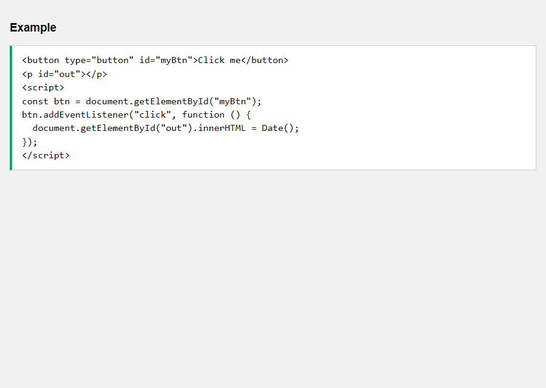

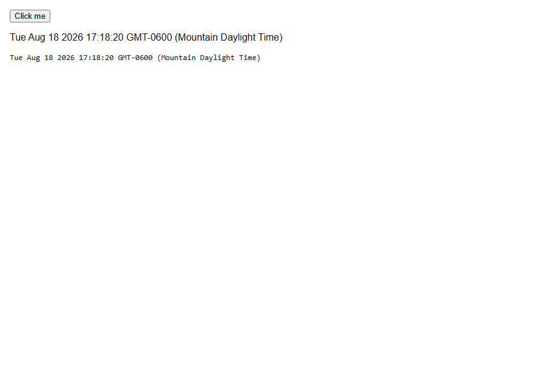

- [x] **Outcome:** The listener writes **Date()** into the paragraph after click.

<details>
  <summary>Terminal Commands</summary>

## Terminal Commands

```bash
# from Personal/Files/javascript/code_sandbox
py -3 -m http.server 8770 --bind 127.0.0.1
```

Then open `http://127.0.0.1:8770/intro-to-events/`.

</details>

<details>
  <summary>Questions and Answers</summary>

## Questions and Answers

### Question 1: What is an HTML event?

<details>
<summary>Answer</summary>

- [x] Something that happens to an element: click, load, key, mouse move, input change.

</details>

### Question 2: How do you put JS in an attribute with nested quotes?

<details>
<summary>Answer</summary>

- [x] Double-quoted attribute, **single quotes** inside (or the reverse).

</details>

### Question 3: What is `this` in `onclick="this.innerHTML = Date()"`?

<details>
<summary>Answer</summary>

- [x] The **element** that was clicked.

</details>

### Question 4: Why call a function from `onclick` instead of a long script?

<details>
<summary>Answer</summary>

- [x] Keeps markup short and the function **reusable**.

</details>

### Question 5: When does `onchange` usually fire on a text field?

<details>
<summary>Answer</summary>

- [x] When the value is **committed** (often on blur), not on every key.

</details>

### Question 6: What is the modern event name for a click listener?

<details>
<summary>Answer</summary>

- [x] **`"click"`** — no `on` prefix.

</details>

### Question 7: `keydown` vs deprecated `keypress`?

<details>
<summary>Answer</summary>

- [x] Use **`keydown` / `keyup`**. `keypress` skips many control keys and is deprecated.

</details>

### Question 8: `load` vs `DOMContentLoaded`?

<details>
<summary>Answer</summary>

- [x] `DOMContentLoaded` is HTML ready. **`load`** waits for images, CSS, frames too.

</details>

### Question 9: Why is `addEventListener` recommended?

<details>
<summary>Answer</summary>

- [x] Separates JS from HTML and lets you add **multiple** handlers.

</details>

### Question 10: Can you assign two functions to `element.onclick`?

<details>
<summary>Answer</summary>

- [x] The second assignment **replaces** the first. Use `addEventListener` to stack them.

</details>


</details>

## Summary

Detect events, then run a function. Prefer `addEventListener("click", fn)` over inline `onclick` for anything beyond a tiny demo.

## References

- [Intro to Events](https://www.w3schools.com/js/js_events.asp)
- [MDN EventTarget.addEventListener](https://developer.mozilla.org/en-US/docs/Web/API/EventTarget/addEventListener)

</details>

<details>
  <summary>Mouse Events</summary>

## Introduction

Mouse events fire for clicks, movement, wheel, right-click, and drag. The event object carries viewport coordinates.

This section has **10** examples:

- [x] **Example 1:** mouseover and mouseout on a box [View](#mouse-events-example-01)
- [x] **Example 2:** click [View](#mouse-events-example-02)
- [x] **Example 3:** dblclick [View](#mouse-events-example-03)
- [x] **Example 4:** mousedown / mouseup [View](#mouse-events-example-04)
- [x] **Example 5:** mousemove [View](#mouse-events-example-05)
- [x] **Example 6:** mouseenter / mouseleave [View](#mouse-events-example-06)
- [x] **Example 7:** contextmenu [View](#mouse-events-example-07)
- [x] **Example 8:** wheel [View](#mouse-events-example-08)
- [x] **Example 9:** drag events [View](#mouse-events-example-09)
- [x] **Example 10:** Mouse position — event.clientX and event.clientY [View](#mouse-events-example-10)

## Detailed Explanation

- [x] click / dblclick / down / up / move / over / out / enter / leave / contextmenu / wheel / drag.
- [x] `clientX` and `clientY` are viewport coordinates.
- [x] Pointer Events cover mouse + touch + pen.

<a id="mouse-events-example-01"></a>

### **Example 1: mouseover and mouseout on a box**

- [x] `mouseover` — pointer enters the element (bubbles; also fires on children).
- [x] `mouseout` — pointer leaves (same bubbling caveat).
- [x] The snapshot fires both in order so the final text is the **out** message.

Sandbox: `code_sandbox/mouse-events/over-out.html`

```html
<div id="box">Move mouse over this box</div>
<script>
const box = document.getElementById("box");
box.addEventListener("mouseover", function () { box.innerHTML = "Mouse is over me!"; });
box.addEventListener("mouseout", function () { box.innerHTML = "Mouse is out!"; });
</script>
```

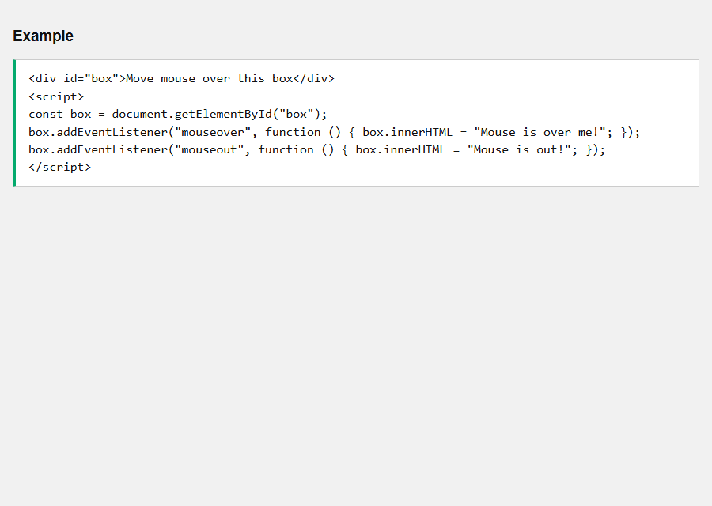

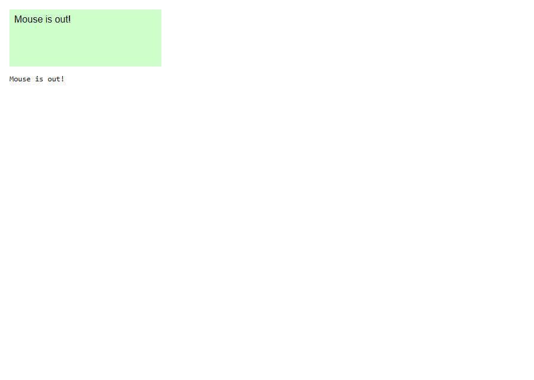

- [x] **Outcome:** After simulated over then out, the box reads **Mouse is out!**.

<a id="mouse-events-example-02"></a>

### **Example 2: click**

- [x] Fires after **mousedown + mouseup** on the same element with the main button (usually left).
- [x] Keyboard activation of a button also synthesizes click.
- [x] This is the default event for buttons.

Sandbox: `code_sandbox/mouse-events/click.html`

```html
<button type="button" id="b">Click</button>
```


- [x] **Outcome:** `click` fires: **clicked**.

<a id="mouse-events-example-03"></a>

### **Example 3: dblclick**

- [x] Fires after **two rapid clicks** on the same element.
- [x] A dblclick is preceded by two `click` events — don’t double-count work.
- [x] The snapshot dispatches `dblclick` directly.

Sandbox: `code_sandbox/mouse-events/dblclick.html`

```html
<button type="button" id="b">Double-click</button>
```


- [x] **Outcome:** `dblclick` fires: **double**.

<a id="mouse-events-example-04"></a>

### **Example 4: mousedown / mouseup**

- [x] `mousedown` — button pressed. `mouseup` — button released.
- [x] Order for a full click: mousedown → mouseup → click.
- [x] Useful for “press and hold” (swap an image while the button is down).

Sandbox: `code_sandbox/mouse-events/mousedown-mouseup.html`

```html
<button type="button" id="b">Hold</button>
```


- [x] **Outcome:** The log shows **down** then **up**.

<a id="mouse-events-example-05"></a>

### **Example 5: mousemove**

- [x] Fires **continuously** as the pointer moves over the element.
- [x] The event object has coordinates (`clientX` / `clientY`).
- [x] Throttle or ignore extra moves if you do heavy work — this event is chatty.

Sandbox: `code_sandbox/mouse-events/mousemove.html`

```html
<div id="box">move</div>
```


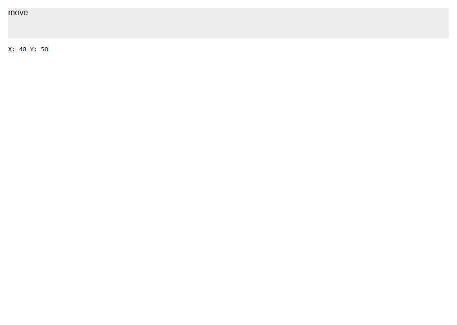

- [x] **Outcome:** A dispatched `mousemove` at (40, 50) is recorded.

<a id="mouse-events-example-06"></a>

### **Example 6: mouseenter / mouseleave**

- [x] Like over/out but they **do not bubble** and **do not fire** when moving between a parent and its child.
- [x] Closer to CSS `:hover` on that one element.
- [x] Prefer these for “is the pointer inside this widget?”

Sandbox: `code_sandbox/mouse-events/mouseenter-leave.html`

```html
<div id="box"><span>child</span></div>
```


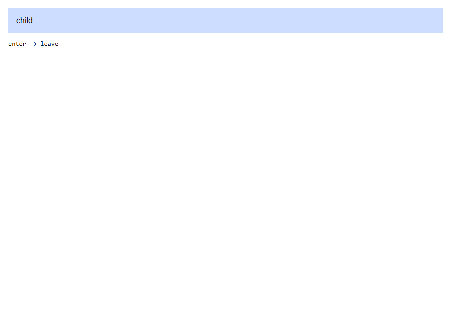

- [x] **Outcome:** Dispatched `mouseenter` then `mouseleave` update the log.

<a id="mouse-events-example-07"></a>

### **Example 7: contextmenu**

- [x] Fires when the user tries to open the **context menu** (usually right-click).
- [x] `preventDefault()` blocks the browser menu if you draw your own.
- [x] The snapshot dispatches `contextmenu` and prevents the default.

Sandbox: `code_sandbox/mouse-events/contextmenu.html`

```html
<div id="box">right-click</div>
```


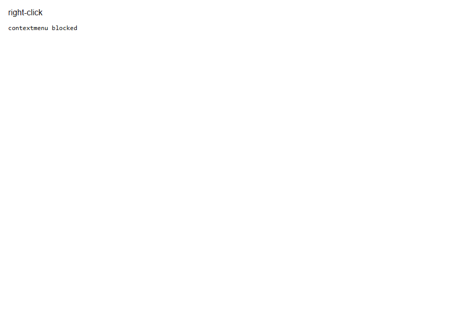

- [x] **Outcome:** The handler runs and reports **contextmenu blocked**.

<a id="mouse-events-example-08"></a>

### **Example 8: wheel**

- [x] Fires when the **mouse wheel** (or trackpad scroll) rotates.
- [x] `event.deltaY` is the vertical scroll amount.
- [x] Used for custom zoom or scrolljacking — use sparingly for accessibility.

Sandbox: `code_sandbox/mouse-events/wheel.html`

```html
<div id="box">wheel me</div>
```


- [x] **Outcome:** `wheel` with `deltaY=100` is logged.

<a id="mouse-events-example-09"></a>

### **Example 9: drag events**

- [x] Drag-and-drop uses a set: `dragstart`, `drag`, `dragover`, `drop`, `dragend`, …
- [x] The source needs `draggable="true"`. `dragover` must `preventDefault` to allow drop.
- [x] This sandbox starts a drag on a draggable item and records **dragstart**.

Sandbox: `code_sandbox/mouse-events/drag.html`

```html
<div id="item" draggable="true">drag me</div>
```

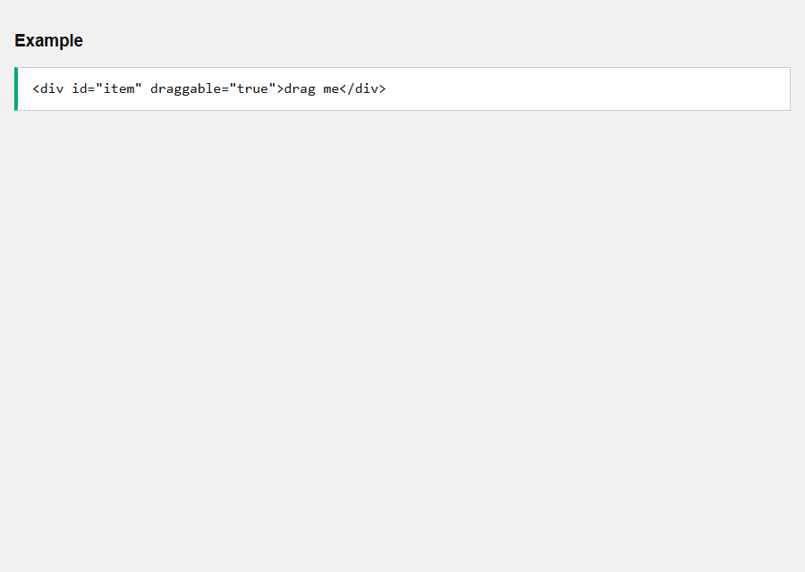

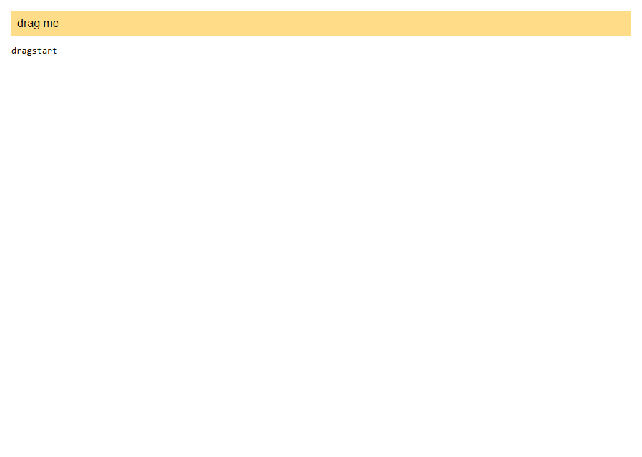

- [x] **Outcome:** `dragstart` fires on the draggable item.

<a id="mouse-events-example-10"></a>

### **Example 10: Mouse position — event.clientX and event.clientY**

- [x] `MouseEvent.clientX` / `clientY` are coordinates **relative to the viewport** (not the element).
- [x] The W3Schools demo listens on `document` `mousemove` and writes `X: … Y: …`.
- [x] For touch/pen as well, look at the **Pointer Events** API.

Sandbox: `code_sandbox/mouse-events/clientxy.html`

```html
<p id="out">Move the mouse in this window!</p>
<script>
document.addEventListener("mousemove", function (event) {
  document.getElementById("out").innerHTML = "X: " + event.clientX + " Y: " + event.clientY;
});
</script>
```

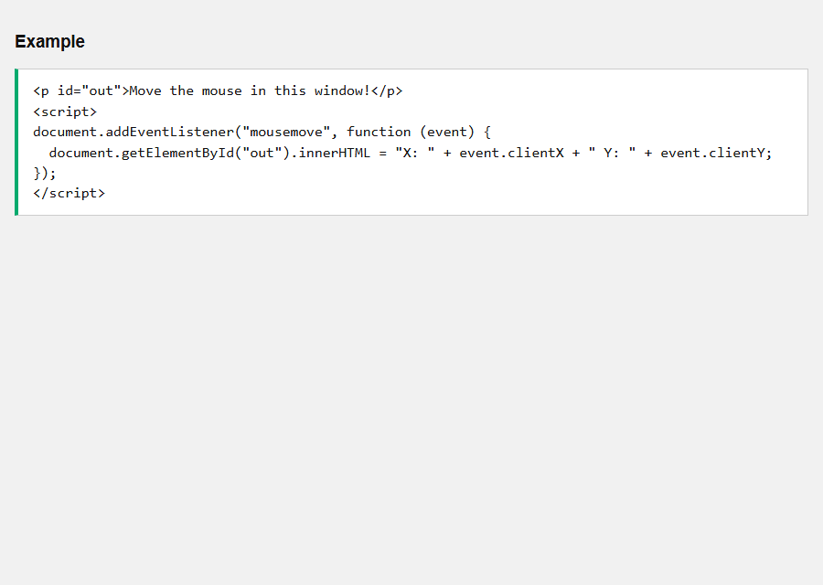


- [x] **Outcome:** A synthetic mousemove at **(120, 80)** prints those coordinates.

<details>
  <summary>Terminal Commands</summary>

## Terminal Commands

```bash
# from Personal/Files/javascript/code_sandbox
py -3 -m http.server 8770 --bind 127.0.0.1
```

Then open `http://127.0.0.1:8770/mouse-events/`.

</details>

<details>
  <summary>Questions and Answers</summary>

## Questions and Answers

### Question 1: Order of events in a normal click?

<details>
<summary>Answer</summary>

- [x] **mousedown** → **mouseup** → **click**.

</details>

### Question 2: Why might `mouseover` fire when moving between a parent and child?

<details>
<summary>Answer</summary>

- [x] It **bubbles** and also fires when entering descendants. Use **`mouseenter`** for :hover-like behavior.

</details>

### Question 3: What is `dblclick` preceded by?

<details>
<summary>Answer</summary>

- [x] Two **`click`** events.

</details>

### Question 4: What are `clientX` / `clientY` relative to?

<details>
<summary>Answer</summary>

- [x] The **viewport**, not the element.

</details>

### Question 5: How do you stop the browser context menu?

<details>
<summary>Answer</summary>

- [x] Listen for **`contextmenu`** and call **`preventDefault()`**.

</details>

### Question 6: Which event reports wheel rotation?

<details>
<summary>Answer</summary>

- [x] **`wheel`** (`deltaY`).

</details>

### Question 7: What attribute makes an element draggable?

<details>
<summary>Answer</summary>

- [x] **`draggable="true"`**.

</details>

### Question 8: Modern replacement covering mouse + touch + pen?

<details>
<summary>Answer</summary>

- [x] The **Pointer Events** API.

</details>

### Question 9: Is `mousemove` a good place for heavy work?

<details>
<summary>Answer</summary>

- [x] Usually no — it fires **very often**. Throttle or debounce.

</details>

### Question 10: Does `mouseleave` fire when entering a child?

<details>
<summary>Answer</summary>

- [x] **No** — that is the point vs `mouseout`.

</details>


</details>

## Summary

Pick the mouse event that matches the gesture. Use enter/leave for hover widgets and `preventDefault` on `contextmenu` only when you replace the menu.

## References

- [Mouse Events](https://www.w3schools.com/js/js_events_mouse.asp)
- [MDN EventTarget.addEventListener](https://developer.mozilla.org/en-US/docs/Web/API/EventTarget/addEventListener)

</details>

<details>
  <summary>Keyboard Events</summary>

## Introduction

Keyboard events are `keydown` and `keyup`. Read `event.key` for meaning and `event.code` for the physical key.

This section has **6** examples:

- [x] **Example 1:** keydown — event.key [View](#keyboard-events-example-01)
- [x] **Example 2:** event.key — value of the key [View](#keyboard-events-example-02)
- [x] **Example 3:** event.code — physical key [View](#keyboard-events-example-03)
- [x] **Example 4:** Modifier keys — ctrlKey, shiftKey, altKey, metaKey [View](#keyboard-events-example-04)
- [x] **Example 5:** Using event.code === "Enter" [View](#keyboard-events-example-05)
- [x] **Example 6:** keyup and deprecated keypress [View](#keyboard-events-example-06)

## Detailed Explanation

- [x] `keypress` is deprecated.
- [x] `key` vs `code` (Z vs KeyZ).
- [x] Modifier flags for shortcuts.

<a id="keyboard-events-example-01"></a>

### **Example 1: keydown — event.key**

- [x] `keydown` fires when a key is pressed (and repeats).
- [x] `event.key` is the **character/name** and depends on layout and Shift (`z` vs `Z`).
- [x] Listen on an input or on `document` depending on whether you need a focused field.

Sandbox: `code_sandbox/keyboard-events/keydown-key.html`

```html
<input id="k">
<p id="out"></p>
<script>
const k = document.getElementById("k");
k.addEventListener("keydown", function (event) {
  document.getElementById("out").innerHTML = "You pressed: " + event.key;
});
</script>
```

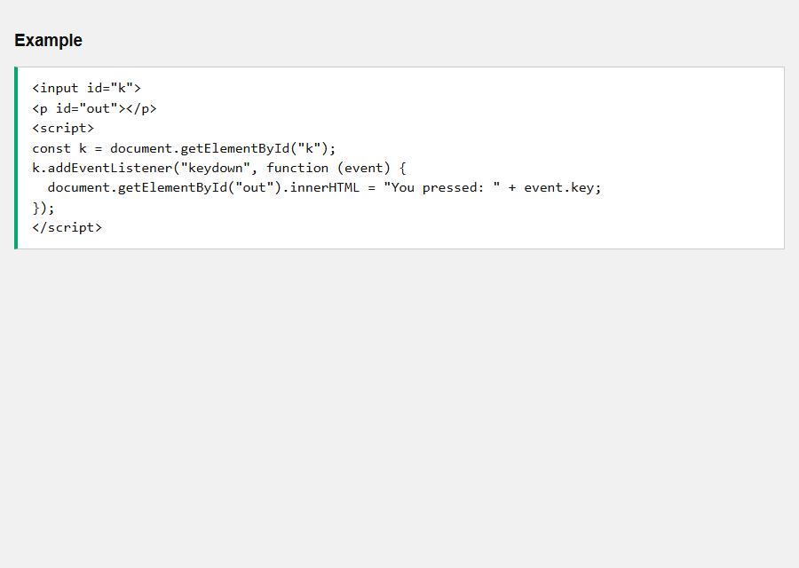

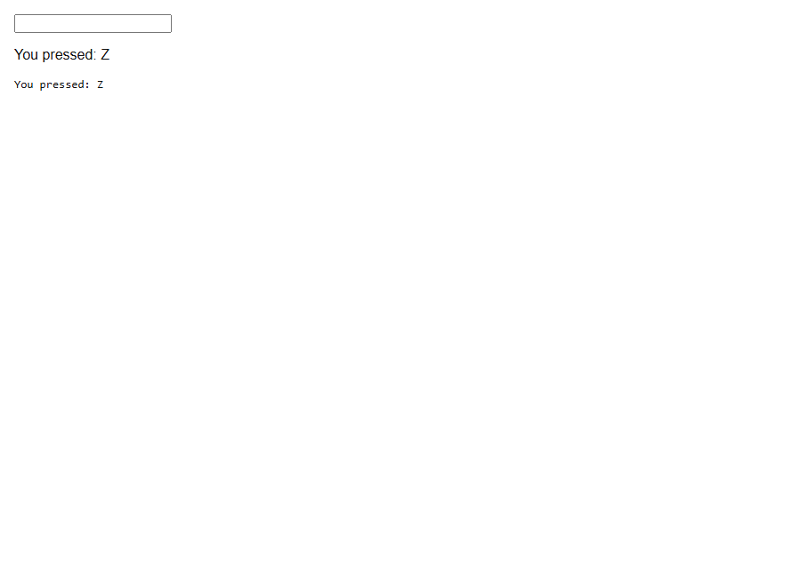

- [x] **Outcome:** Pressing **Z** shows **You pressed: Z**.

<a id="keyboard-events-example-02"></a>

### **Example 2: event.key — value of the key**

- [x] Table row: `event.key` returns the key value; with Shift it can be **Z** instead of **z**.
- [x] Language layouts can change `key` (`"z"` vs another letter on the same physical key).
- [x] Use `key` when you care about **meaning** (Enter, Escape, the letter typed).

Sandbox: `code_sandbox/keyboard-events/key-property.html`

```html
<script>
const event = new KeyboardEvent("keydown", { key: "z" });
</script>
```

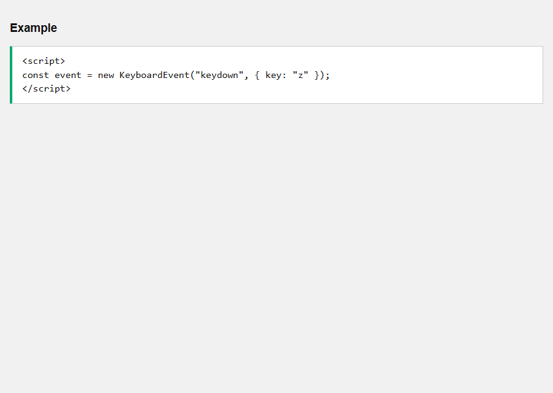

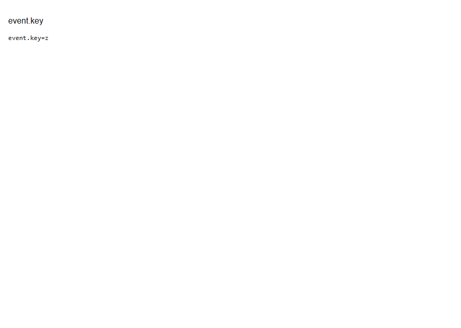

- [x] **Outcome:** A synthetic event with `key: "z"` reports **z**.

<a id="keyboard-events-example-03"></a>

### **Example 3: event.code — physical key**

- [x] `event.code` is the **physical key** (`"KeyZ"`) and stays the same across layouts.
- [x] When pressing Z, `code` is always **KeyZ** even if `key` is another character.
- [x] Use `code` for game-style WASD that should not move when the user has a different layout.

Sandbox: `code_sandbox/keyboard-events/code-property.html`

```html
<script>
const event = new KeyboardEvent("keydown", { key: "z", code: "KeyZ" });
</script>
```

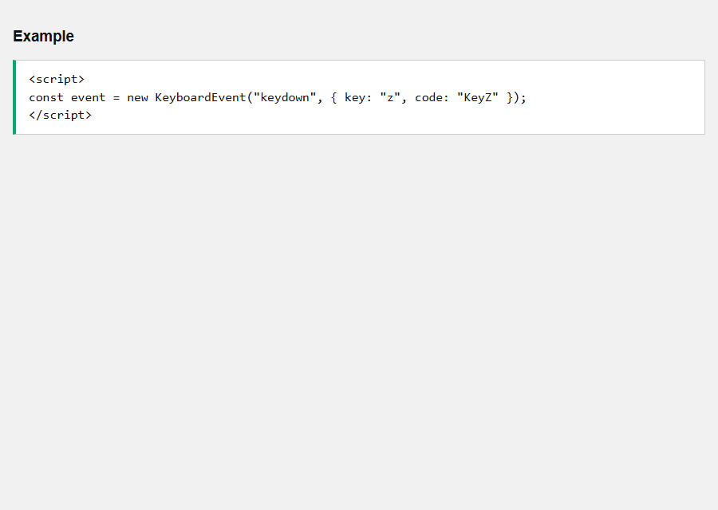

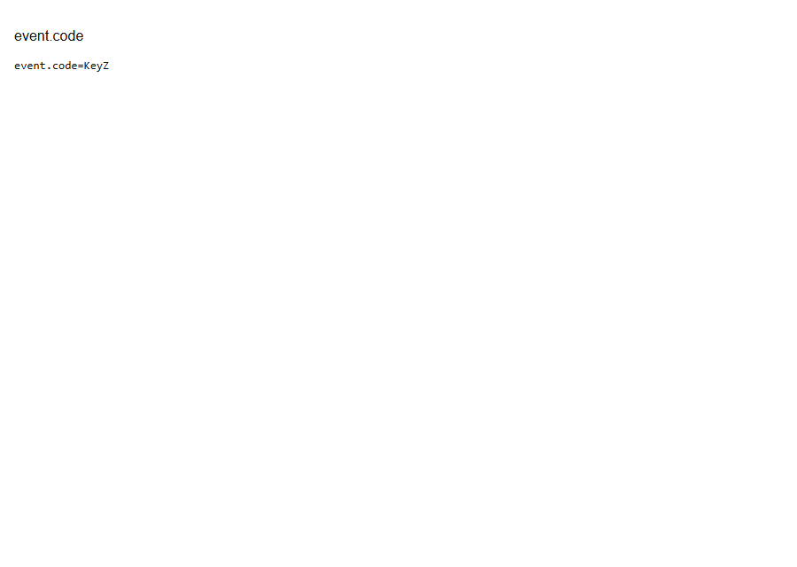

- [x] **Outcome:** `event.code` is **KeyZ**.

<a id="keyboard-events-example-04"></a>

### **Example 4: Modifier keys — ctrlKey, shiftKey, altKey, metaKey**

- [x] Boolean flags on the KeyboardEvent tell you if Ctrl / Shift / Alt / Meta (Cmd) were held.
- [x] Shortcuts such as Ctrl+S check `event.ctrlKey && event.key === "s"` (and usually `preventDefault`).
- [x] `metaKey` is the Command key on macOS.

Sandbox: `code_sandbox/keyboard-events/modifiers.html`

```html
<script>
const event = new KeyboardEvent("keydown", { key: "s", ctrlKey: true });
</script>
```


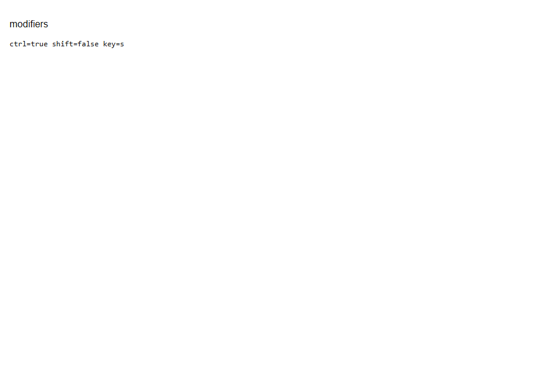

- [x] **Outcome:** A Ctrl+S event has **ctrlKey true** and **key s**.

<a id="keyboard-events-example-05"></a>

### **Example 5: Using event.code === "Enter"**

- [x] W3Schools listens for `event.code === "Enter"` on an input.
- [x] `Enter` is the code for the main Enter key (`NumpadEnter` is separate).
- [x] The snapshot dispatches Enter and writes **Enter was pressed!**.

Sandbox: `code_sandbox/keyboard-events/enter-code.html`

```html
<input id="in01">
<p id="out"></p>
<script>
const in01 = document.getElementById("in01");
in01.addEventListener("keydown", function (event) {
  if (event.code === "Enter") {
    document.getElementById("out").innerHTML = "Enter was pressed!";
  }
});
</script>
```

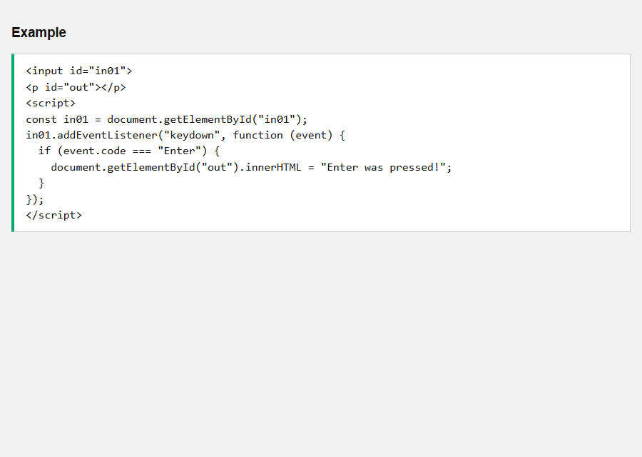


- [x] **Outcome:** The output paragraph is **Enter was pressed!**.

<a id="keyboard-events-example-06"></a>

### **Example 6: keyup and deprecated keypress**

- [x] `keyup` fires when the key is **released** (no repeat).
- [x] `keypress` fired only for **character** keys, not Alt/Backspace, and is **deprecated**.
- [x] Use `keydown` or `keyup` in new code.

Sandbox: `code_sandbox/keyboard-events/keyup-and-keypress.html`

```html
<input id="k">
```


- [x] **Outcome:** `keyup` for **a** is logged. `keypress` is marked deprecated.

<details>
  <summary>Terminal Commands</summary>

## Terminal Commands

```bash
# from Personal/Files/javascript/code_sandbox
py -3 -m http.server 8770 --bind 127.0.0.1
```

Then open `http://127.0.0.1:8770/keyboard-events/`.

</details>

<details>
  <summary>Questions and Answers</summary>

## Questions and Answers

### Question 1: Which keyboard events should you use?

<details>
<summary>Answer</summary>

- [x] **`keydown`** and **`keyup`**. Avoid **`keypress`**.

</details>

### Question 2: `event.key` for Shift+Z?

<details>
<summary>Answer</summary>

- [x] Typically **`Z`** (the produced character), not `z`.

</details>

### Question 3: `event.code` for that same press?

<details>
<summary>Answer</summary>

- [x] **`KeyZ`** — physical key, layout-independent.

</details>

### Question 4: How do you detect Ctrl+S?

<details>
<summary>Answer</summary>

- [x] `event.ctrlKey && event.key.toLowerCase() === "s"` (and usually `preventDefault`).

</details>

### Question 5: What is `metaKey`?

<details>
<summary>Answer</summary>

- [x] The **Command** key on Apple keyboards (Windows key on some others).

</details>

### Question 6: How does the W3Schools Enter demo detect Enter?

<details>
<summary>Answer</summary>

- [x] `event.code === "Enter"`.

</details>

### Question 7: Does `keydown` repeat?

<details>
<summary>Answer</summary>

- [x] Yes, if the key is **held**.

</details>

### Question 8: Does `keyup` repeat?

<details>
<summary>Answer</summary>

- [x] No — it fires once on **release**.

</details>

### Question 9: Why did `keypress` skip Backspace?

<details>
<summary>Answer</summary>

- [x] It only fired for **character** keys. That is one reason it was deprecated.

</details>

### Question 10: Should shortcuts listen on `window` or an input?

<details>
<summary>Answer</summary>

- [x] On **`window`/`document`** for app-wide shortcuts; on the **input** for field-specific keys.

</details>


</details>

## Summary

Listen for `keydown`/`keyup`, branch on `key` or `code`, and check `ctrlKey`/`shiftKey`/`altKey`/`metaKey` for chords.

## References

- [Keyboard Events](https://www.w3schools.com/js/js_events_keyboard.asp)
- [MDN EventTarget.addEventListener](https://developer.mozilla.org/en-US/docs/Web/API/EventTarget/addEventListener)

</details>

<details>
  <summary>Load Events</summary>

## Introduction

Load events tell you when HTML is ready (`DOMContentLoaded`) or when the whole page and its assets are ready (`load`). Images, scripts, and stylesheets fire `load` too.

This section has **6** examples:

- [x] **Example 1:** DOMContentLoaded [View](#load-events-example-01)
- [x] **Example 2:** window load [View](#load-events-example-02)
- [x] **Example 3:** Image load [View](#load-events-example-03)
- [x] **Example 4:** script load [View](#load-events-example-04)
- [x] **Example 5:** stylesheet link load [View](#load-events-example-05)
- [x] **Example 6:** media-specific loading events [View](#load-events-example-06)

## Detailed Explanation

- [x] DOMContentLoaded = DOM tree.
- [x] window load = everything.
- [x] img / script / link / media have their own load-related events.

<a id="load-events-example-01"></a>

### **Example 1: DOMContentLoaded**

- [x] Fires when HTML is parsed and the **DOM tree** is ready.
- [x] Images, stylesheets, and subframes may **still be loading**.
- [x] Best time to query elements, bind listeners, and build UI that only needs the DOM.
- [x] If the script runs after the event, `document.readyState` is already past `loading` — call the setup function directly.

Sandbox: `code_sandbox/load-events/domcontentloaded.html`

```html
<p id="out"></p>
<script>
document.addEventListener("DOMContentLoaded", function () {
  document.getElementById("out").innerHTML = "HTML is loaded!";
});
</script>
```

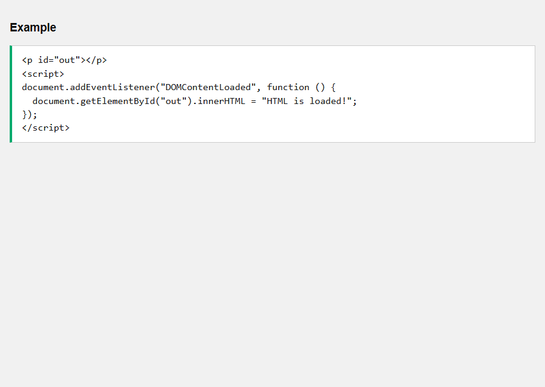


- [x] **Outcome:** The paragraph reads **HTML is loaded!** (handler ran on the event or immediately because the DOM is already ready).

<a id="load-events-example-02"></a>

### **Example 2: window load**

- [x] `window` `load` waits for the **whole page**: HTML, images, CSS, frames.
- [x] Use it for image dimensions, “fully loaded” banners, or anything that needs complete resources.
- [x] Slower than DOMContentLoaded — don’t put all UI setup here.

Sandbox: `code_sandbox/load-events/window-load.html`

```html
<p id="out"></p>
<script>
window.addEventListener("load", function () {
  document.getElementById("out").innerHTML = "Page is fully loaded!";
});
</script>
```

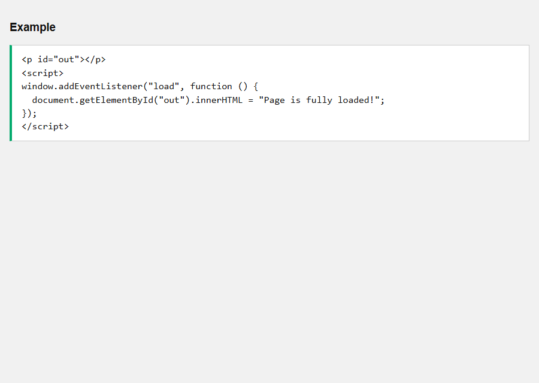


- [x] **Outcome:** When `readyState` is `complete` (or when `load` fires), the text is **Page is fully loaded!**.

<a id="load-events-example-03"></a>

### **Example 3: Image load**

- [x] `` fires **`load`** when that image has finished downloading.
- [x] Also used on `<script>` (executed) and `<link rel=stylesheet>` (parsed).
- [x] Media elements have additional events (`canplay`, `loadeddata`, …).

Sandbox: `code_sandbox/load-events/img-load.html`

```html

<p id="out"></p>
<script>
const img = document.getElementById("myImg");
img.addEventListener("load", function () {
  document.getElementById("out").innerHTML = "Image loaded!";
});
</script>
```

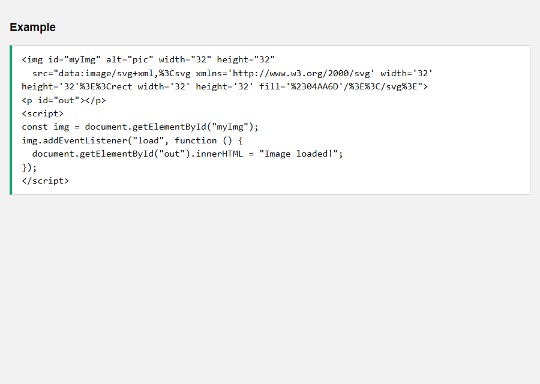


- [x] **Outcome:** When the SVG data URL has loaded (or `complete` is already true), the text is **Image loaded!**.

<a id="load-events-example-04"></a>

### **Example 4: script load**

- [x] A `<script src>` fires `load` after the file is **fetched and executed**.
- [x] Inline scripts do not fetch, so this is about **external** files.
- [x] This sandbox appends a tiny extra file and waits for its `load`.

Sandbox: `code_sandbox/load-events/script-load.html`

```html
<script src="ping.js"></script>
```


- [x] **Outcome:** After `ping.js` loads, the log includes **script loaded**.

<a id="load-events-example-05"></a>

### **Example 5: stylesheet link load**

- [x] `<link rel="stylesheet">` fires `load` when the CSS is **loaded and parsed**.
- [x] Use it if you must measure layout that depends on those rules.
- [x] This sandbox injects a `<link>` to a local CSS file.

Sandbox: `code_sandbox/load-events/link-load.html`

```html
<link rel="stylesheet" href="extra.css">
```


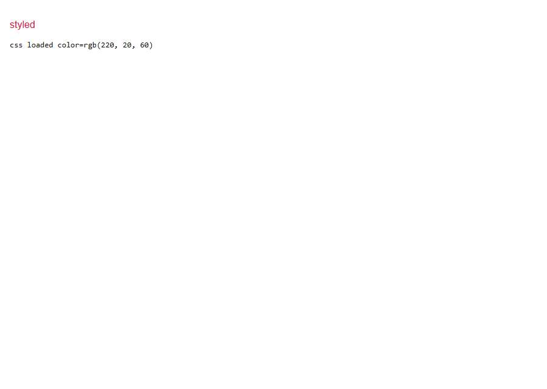

- [x] **Outcome:** The stylesheet `load` handler prints **css loaded**.

<a id="load-events-example-06"></a>

### **Example 6: media-specific loading events**

- [x] `<audio>` / `<video>` fire `loadedmetadata`, `canplay`, `canplaythrough`, plus `error`.
- [x] Do not assume `load` is the only signal — media is streamed.
- [x] This example uses a tiny audio data URL and reports `readyState` after setting `src`.

Sandbox: `code_sandbox/load-events/media-load.html`

```html
<audio id="a"></audio>
```


- [x] **Outcome:** The audio element exists; `readyState` is logged (0 until data arrives).

<details>
  <summary>Terminal Commands</summary>

## Terminal Commands

```bash
# from Personal/Files/javascript/code_sandbox
py -3 -m http.server 8770 --bind 127.0.0.1
```

Then open `http://127.0.0.1:8770/load-events/`.

</details>

<details>
  <summary>Questions and Answers</summary>

## Questions and Answers

### Question 1: When is DOMContentLoaded the right event?

<details>
<summary>Answer</summary>

- [x] When you only need the **DOM** — bind listeners, fill text — not image sizes.

</details>

### Question 2: What does window `load` wait for?

<details>
<summary>Answer</summary>

- [x] HTML **plus** images, stylesheets, frames, and other resources.

</details>

### Question 3: What if your script is at the end of `<body>`?

<details>
<summary>Answer</summary>

- [x] The DOM is already there; you may not need DOMContentLoaded, but it is still safe if you check `readyState`.

</details>

### Question 4: Which element fires `load` when a picture finishes?

<details>
<summary>Answer</summary>

- [x] **``**.

</details>

### Question 5: When does an external `<script>` fire `load`?

<details>
<summary>Answer</summary>

- [x] After it is **downloaded and executed**.

</details>

### Question 6: Why extra media events besides `load`?

<details>
<summary>Answer</summary>

- [x] Audio/video are **streamed**; `canplay` / `loadeddata` describe buffer state.

</details>

### Question 7: What `readyState` means the document is fully loaded?

<details>
<summary>Answer</summary>

- [x] **`complete`**.

</details>

### Question 8: Should you put all setup in `window.load`?

<details>
<summary>Answer</summary>

- [x] No — it is **later**. Prefer DOMContentLoaded for UI wiring.

</details>

### Question 9: What if the image is already cached?

<details>
<summary>Answer</summary>

- [x] `img.complete` may already be true — call the handler **immediately** as well as on `load`.

</details>

### Question 10: Can `load` run on `<link rel=stylesheet>`?

<details>
<summary>Answer</summary>

- [x] Yes — when the stylesheet has been **loaded and parsed**.

</details>


</details>

## Summary

Wire UI on DOMContentLoaded. Wait for `window.load` or element `load` only when you need finished resources.

## References

- [Load Events](https://www.w3schools.com/js/js_events_load.asp)
- [MDN EventTarget.addEventListener](https://developer.mozilla.org/en-US/docs/Web/API/EventTarget/addEventListener)

</details>

<details>
  <summary>Manage Events</summary>

## Introduction

Event management is adding listeners, removing them with the same function, and blocking defaults with `preventDefault`.

This section has **4** examples:

- [x] **Example 1:** Adding events [View](#manage-events-example-01)
- [x] **Example 2:** Removing events [View](#manage-events-example-02)
- [x] **Example 3:** You must pass the same named function to remove [View](#manage-events-example-03)
- [x] **Example 4:** Blocking events — preventDefault on a link [View](#manage-events-example-04)

## Detailed Explanation

- [x] Named functions can be removed.
- [x] Anonymous functions cannot be removed unless you kept the reference.
- [x] `preventDefault` stops navigation/submit.

<a id="manage-events-example-01"></a>

### **Example 1: Adding events**

- [x] `addEventListener("click", myFunction)` registers a **named** function.
- [x] Named functions can be removed later; anonymous functions cannot (unless you kept the reference).
- [x] The snapshot clicks **Click** and prints **Clicked!**.

Sandbox: `code_sandbox/manage-events/add.html`

```html
<button type="button" id="btn">Click</button>
<p id="out"></p>
<script>
const btn = document.getElementById("btn");
btn.addEventListener("click", myFunction);
function myFunction() {
  document.getElementById("out").innerHTML = "Clicked!";
}
</script>
```

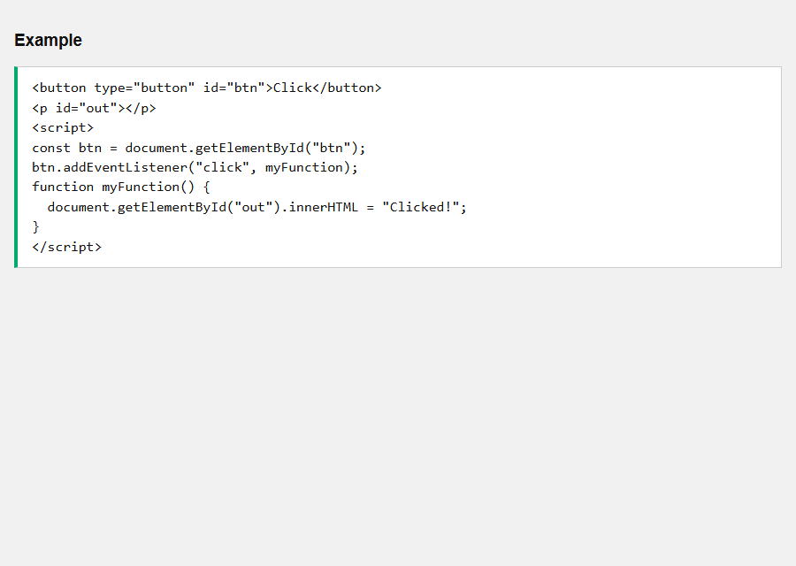


- [x] **Outcome:** The output is **Clicked!**.

<a id="manage-events-example-02"></a>

### **Example 2: Removing events**

- [x] `removeEventListener` needs the **same function object** you added.
- [x] W3Schools: Add attaches `myFunction` to Test; Remove detaches it.
- [x] The snapshot Adds, clicks Test (**Hello!**), Removes, clicks again (no second Hello).

Sandbox: `code_sandbox/manage-events/remove.html`

```html
<button type="button" id="add">Add</button>
<button type="button" id="remove">Remove</button>
<button type="button" id="test">Test click</button>
<p id="out"></p>
```

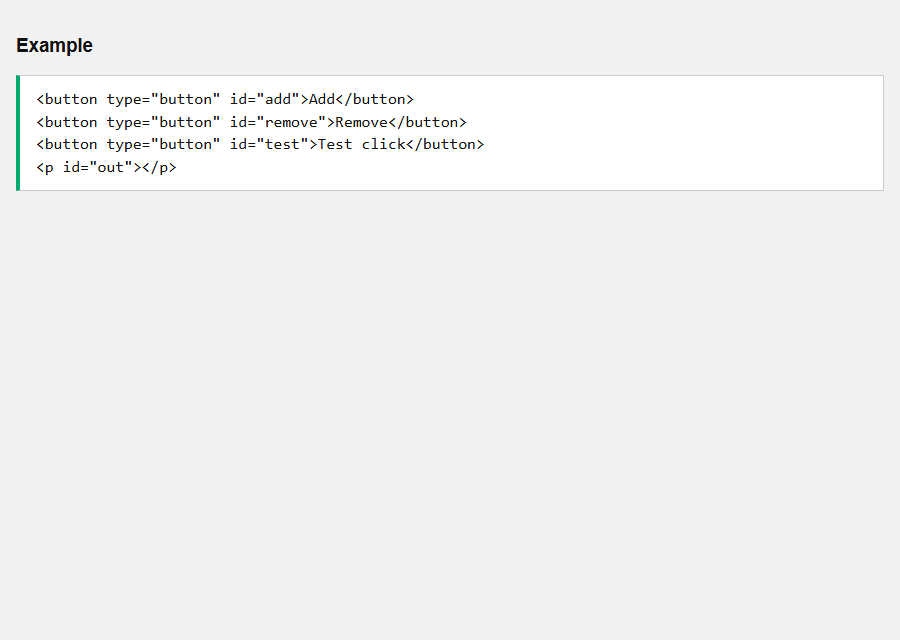

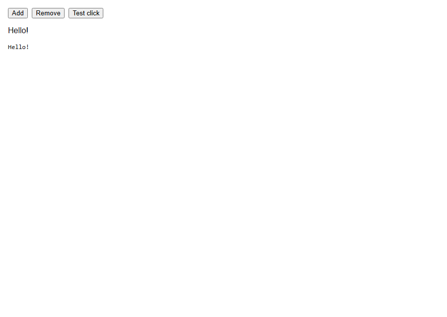

- [x] **Outcome:** After add → test → remove → test, the log is a **single** Hello! — the second click did nothing.

<a id="manage-events-example-03"></a>

### **Example 3: You must pass the same named function to remove**

- [x] `removeEventListener("click", function(){…})` does **not** remove a previously added anonymous function — they are different objects.
- [x] Store the function in a `const` / `function` declaration and pass that variable both times.
- [x] This example shows a failed remove (anonymous) vs a successful remove (named).

Sandbox: `code_sandbox/manage-events/same-function-note.html`

```html
<button type="button" id="b">Click</button>
```


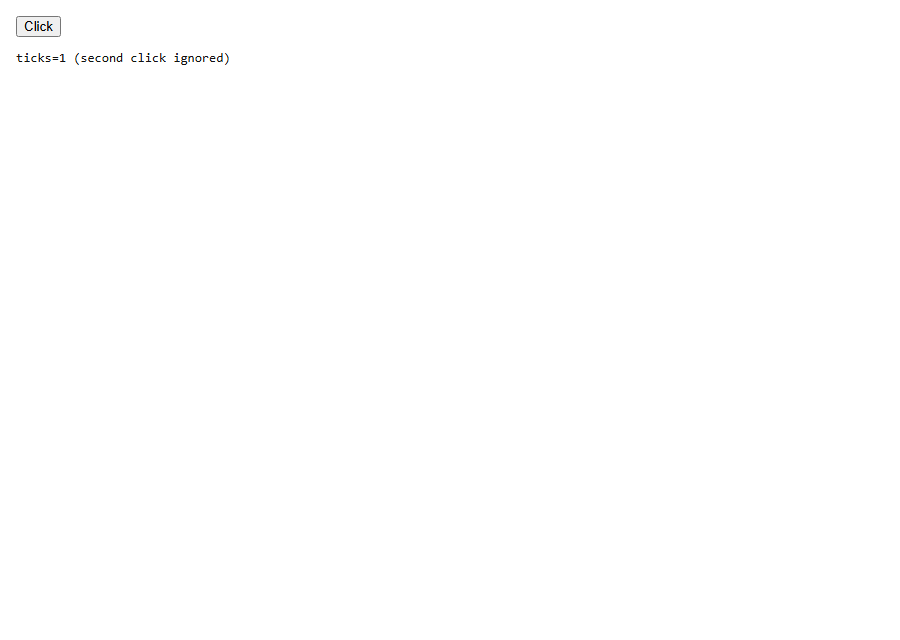

- [x] **Outcome:** Named remove works: only **one** tick is logged after the second click is detached.

<a id="manage-events-example-04"></a>

### **Example 4: Blocking events — preventDefault on a link**

- [x] `event.preventDefault()` stops the **browser’s default** (navigate, submit, check a checkbox).
- [x] The W3Schools link “Go to W3Schools” is blocked; the page prints **Link blocked!** instead of leaving.
- [x] It does **not** stop other listeners unless you also `stopPropagation` / `stopImmediatePropagation`.

Sandbox: `code_sandbox/manage-events/preventdefault.html`

```html
<a id="link" href="https://www.w3schools.com">Go to W3Schools</a>
<p id="out"></p>
<script>
const link = document.getElementById("link");
link.addEventListener("click", function (event) {
  event.preventDefault();
  document.getElementById("out").innerHTML = "Link blocked!";
});
</script>
```

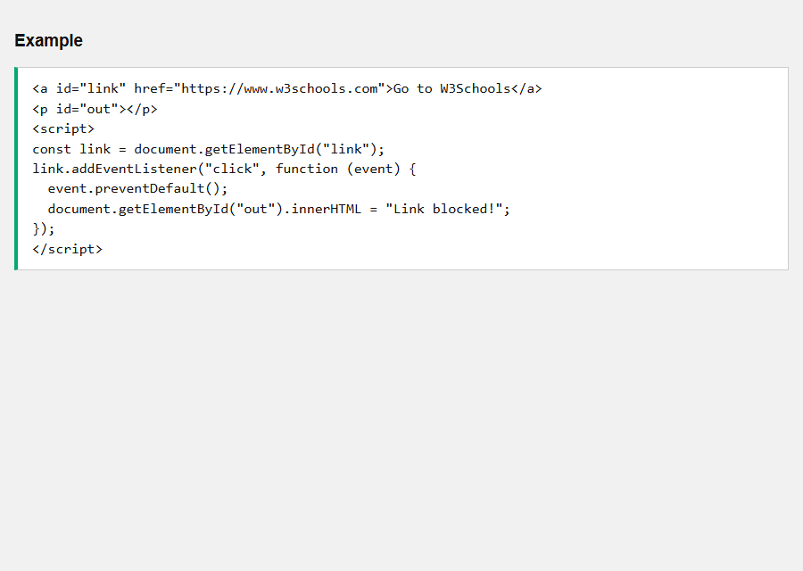


- [x] **Outcome:** The click does not navigate. The paragraph reads **Link blocked!**.

<details>
  <summary>Terminal Commands</summary>

## Terminal Commands

```bash
# from Personal/Files/javascript/code_sandbox
py -3 -m http.server 8770 --bind 127.0.0.1
```

Then open `http://127.0.0.1:8770/manage-events/`.

</details>

<details>
  <summary>Questions and Answers</summary>

## Questions and Answers

### Question 1: How do you add a click listener?

<details>
<summary>Answer</summary>

- [x] `element.addEventListener("click", handler)`.

</details>

### Question 2: How do you remove it?

<details>
<summary>Answer</summary>

- [x] `element.removeEventListener("click", handler)` with the **same function**.

</details>

### Question 3: Why can’t you remove an inline anonymous listener?

<details>
<summary>Answer</summary>

- [x] You don’t have the **same function object** to pass to `removeEventListener`.

</details>

### Question 4: In the Add/Remove demo, what does Remove do?

<details>
<summary>Answer</summary>

- [x] It stops **Test click** from running `myFunction`.

</details>

### Question 5: What does `preventDefault` do on a link?

<details>
<summary>Answer</summary>

- [x] Stops **navigation** so you can handle the click in JS.

</details>

### Question 6: Does `preventDefault` stop bubbling?

<details>
<summary>Answer</summary>

- [x] **No**. Use `stopPropagation` for that.

</details>

### Question 7: Can you add the same named function twice?

<details>
<summary>Answer</summary>

- [x] Yes — it can run **twice** unless you guard or remove first.

</details>

### Question 8: Should the Add button use an anonymous function?

<details>
<summary>Answer</summary>

- [x] Yes for the Add/Remove *wiring*; the **test** handler itself must stay **named** so it can be removed.

</details>

### Question 9: What happens if you click Test before Add?

<details>
<summary>Answer</summary>

- [x] Nothing — the listener is not attached yet.

</details>

### Question 10: Is `return false` in an HTML `onclick` the same as `preventDefault`?

<details>
<summary>Answer</summary>

- [x] In HTML `onclick`, `return false` prevents default **and** stops bubbling. In `addEventListener`, `return false` does **not** — call the methods.

</details>


</details>

## Summary

Add with `addEventListener`, remove with the same function, and call `preventDefault` when the browser action should not happen.

## References

- [Manage Events](https://www.w3schools.com/js/js_events_management.asp)
- [MDN EventTarget.addEventListener](https://developer.mozilla.org/en-US/docs/Web/API/EventTarget/addEventListener)

</details>

<details>
  <summary>Event Examples</summary>

## Introduction

A tour of HTML event attributes and DOM `onclick` assignment: click text, load/unload, input/change, mouse, and extra Tryits (image press, focus, hover color).

This section has **13** examples:

- [x] **Example 1:** Change text when the paragraph is clicked [View](#event-examples-example-01)
- [x] **Example 2:** Call a function and pass this [View](#event-examples-example-02)
- [x] **Example 3:** HTML event attribute on a button [View](#event-examples-example-03)
- [x] **Example 4:** Assign onclick with the HTML DOM [View](#event-examples-example-04)
- [x] **Example 5:** onload and onunload [View](#event-examples-example-05)
- [x] **Example 6:** The oninput event [View](#event-examples-example-06)
- [x] **Example 7:** The onchange event — upperCase [View](#event-examples-example-07)
- [x] **Example 8:** onmouseover and onmouseout [View](#event-examples-example-08)
- [x] **Example 9:** onmousedown, onmouseup, and onclick [View](#event-examples-example-09)
- [x] **Example 10:** More examples — change an image while the mouse is down [View](#event-examples-example-10)
- [x] **Example 11:** More examples — onload (alert stand-in) [View](#event-examples-example-11)
- [x] **Example 12:** More examples — onfocus background [View](#event-examples-example-12)
- [x] **Example 13:** More examples — mouse events change color [View](#event-examples-example-13)

## Detailed Explanation

- [x] Attributes vs `element.onclick = fn`.
- [x] `oninput` (live) vs `onchange` (committed).
- [x] mousedown → mouseup → click.

<a id="event-examples-example-01"></a>

### **Example 1: Change text when the paragraph is clicked**

- [x] `onclick` on a `<h1>` (or any element) can rewrite its own `innerHTML`.
- [x] The W3Schools first Tryit turns “Click on this text!” into a new message.
- [x] This is reacting to events with an **HTML attribute**.

Sandbox: `code_sandbox/event-examples/click-text.html`

```html
<h1 onclick="this.innerHTML = 'Ooops!'">Click on this text!</h1>
```

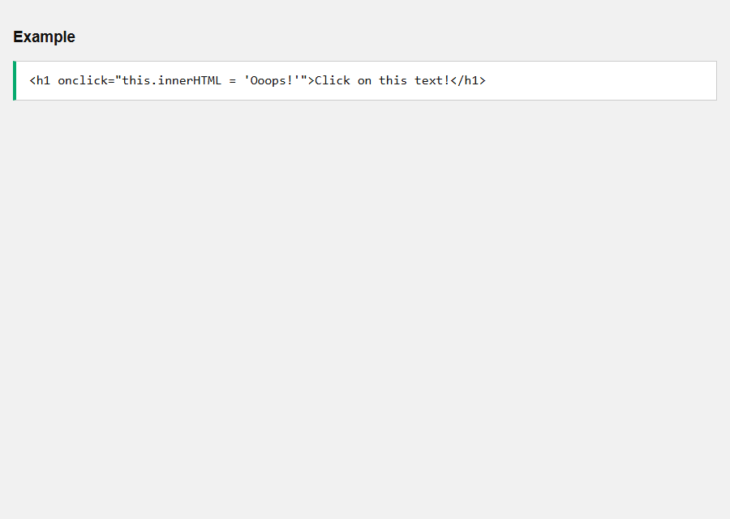


- [x] **Outcome:** After click, the heading is **Ooops!**.

<a id="event-examples-example-02"></a>

### **Example 2: Call a function and pass this**

- [x] `onclick="changeText(this)"` passes the element into the function as `id` (their parameter name).
- [x] The function assigns `id.innerHTML = "Ooops!"`.
- [x] Passing `this` is how attribute handlers share the element without `getElementById`.

Sandbox: `code_sandbox/event-examples/click-function-id.html`

```html
<h1 onclick="changeText(this)">Click on this text!</h1>
<script>
function changeText(id) {
  id.innerHTML = "Ooops!";
}
</script>
```

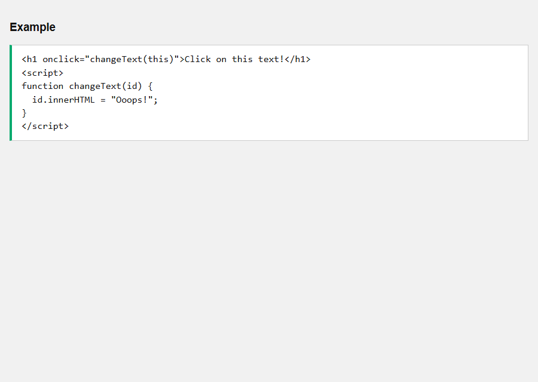

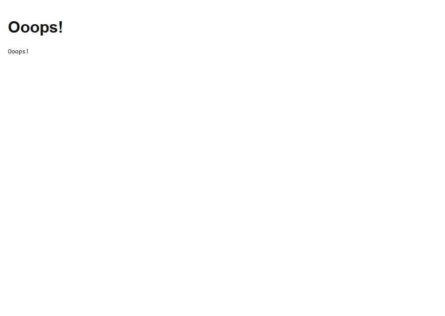

- [x] **Outcome:** The heading becomes **Ooops!** via `changeText(this)`.

<a id="event-examples-example-03"></a>

### **Example 3: HTML event attribute on a button**

- [x] `onclick="displayDate()"` on a button is the classic HTML event attribute.
- [x] The function name in the attribute is called with `()`.
- [x] Works, but mixes concerns — later examples assign from JS.

Sandbox: `code_sandbox/event-examples/assign-onclick-attr.html`

```html
<button type="button" onclick="displayDate()">Try it</button>
```

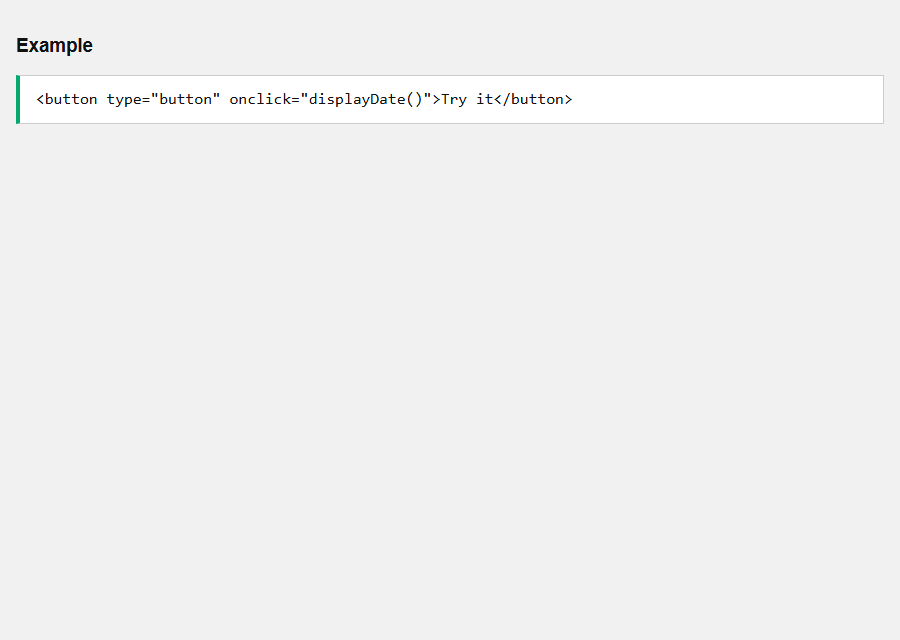

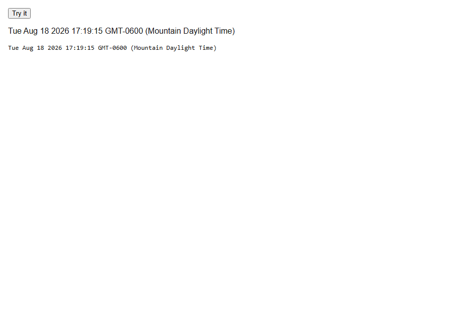

- [x] **Outcome:** `displayDate` runs and writes the date.

<a id="event-examples-example-04"></a>

### **Example 4: Assign onclick with the HTML DOM**

- [x] `document.getElementById("myBtn").onclick = displayDate;` — no `()` on the right-hand side.
- [x] You pass the **function object**. Writing `displayDate()` would run it immediately and assign its return value (`undefined`).
- [x] This is the DOM assignment style from the W3Schools page.

Sandbox: `code_sandbox/event-examples/assign-onclick-dom.html`

```html
<button type="button" id="myBtn">Try it</button>
<script>
document.getElementById("myBtn").onclick = displayDate;
function displayDate() {
  document.getElementById("out").innerHTML = Date();
}
</script>
```

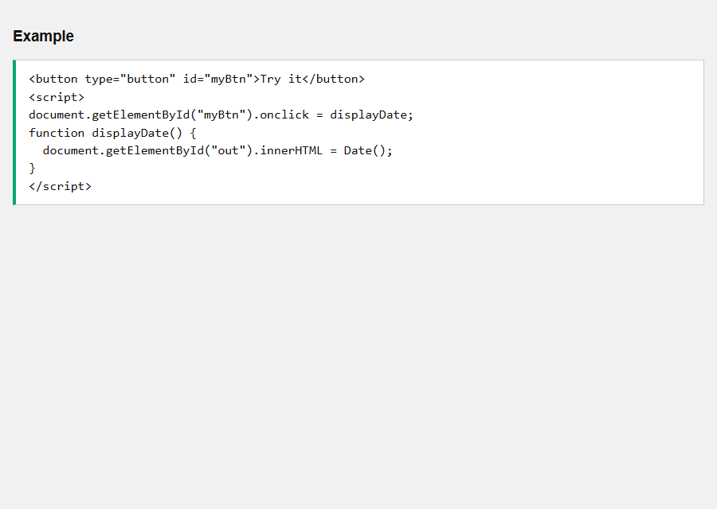

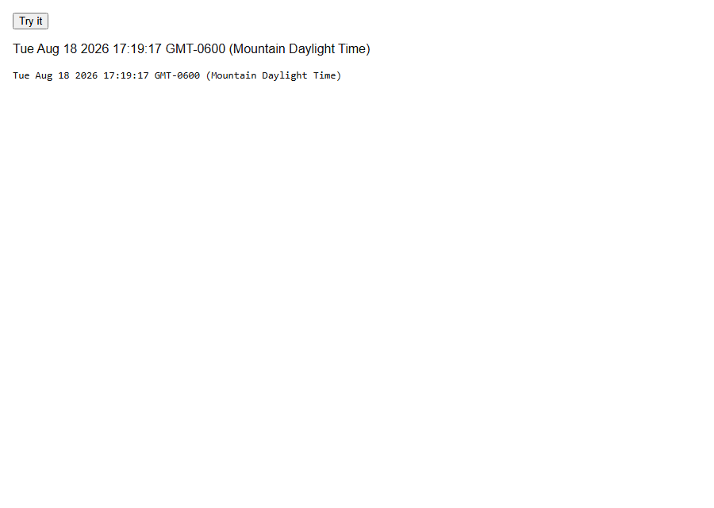

- [x] **Outcome:** Clicking the button fills **Date()** via the assigned `onclick` property.

<a id="event-examples-example-05"></a>

### **Example 5: onload and onunload**

- [x] `onload` / `onunload` fire when the user **enters** or **leaves** the page.
- [x] Historically used to sniff the browser or handle cookies. `onunload` is unreliable on mobile.
- [x] Prefer `addEventListener("load" / "pagehide")` today. This demo records that load ran.

Sandbox: `code_sandbox/event-examples/onload-unonload.html`

```html
<body onload="checkCookies()">
```


- [x] **Outcome:** The load-style function runs and prints **onload fired** (cookies API may be empty on file://).

<a id="event-examples-example-06"></a>

### **Example 6: The oninput event**

- [x] `oninput` fires on **every** change while the user types (unlike `onchange`).
- [x] W3Schools uses it to copy the field into another element live.
- [x] The snapshot sets a value and dispatches `input`.

Sandbox: `code_sandbox/event-examples/oninput.html`

```html
<input id="fname" oninput="document.getElementById('out').innerHTML = this.value">
<p id="out"></p>
```

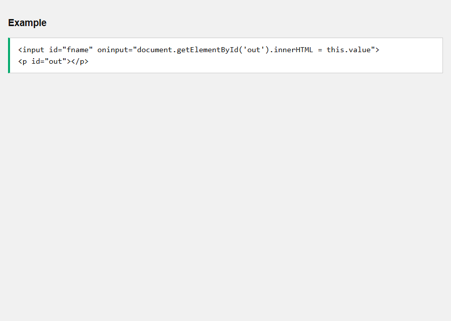


- [x] **Outcome:** Output shows **Hi** after the input event.

<a id="event-examples-example-07"></a>

### **Example 7: The onchange event — upperCase**

- [x] `onchange` is often paired with **validation** or formatting after the user leaves the field.
- [x] W3Schools `upperCase()` runs when the content **changes** (committed).
- [x] The snapshot sets `hello` and fires `change` so the field becomes **HELLO**.

Sandbox: `code_sandbox/event-examples/onchange-upper.html`

```html
<input id="fname" onchange="this.value = this.value.toUpperCase()">
```


- [x] **Outcome:** The input value is **HELLO** after `change`.

<a id="event-examples-example-08"></a>

### **Example 8: onmouseover and onmouseout**

- [x] Hover in/out can trigger functions that restyle or rewrite text.
- [x] W3Schools “Mouse Over Me” box uses these two events.
- [x] The snapshot ends on **mouseout** so the leave style is visible.

Sandbox: `code_sandbox/event-examples/mouseover-out-color.html`

```html
<div onmouseover="this.style.color='red'" onmouseout="this.style.color='black'">Mouse Over Me</div>
```

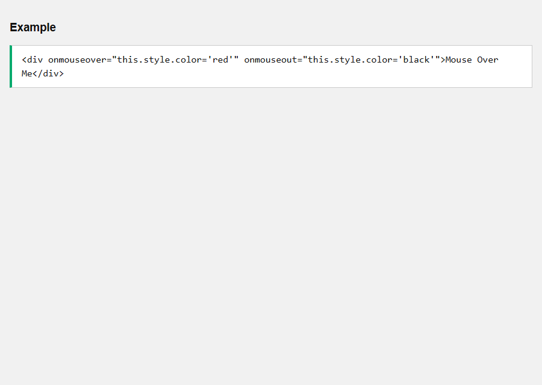


- [x] **Outcome:** After over then out, `style.color` is **black** again; the log notes both handlers ran.

<a id="event-examples-example-09"></a>

### **Example 9: onmousedown, onmouseup, and onclick**

- [x] A full click is three events: **mousedown**, **mouseup**, **onclick** in that order.
- [x] W3Schools “Click Me” demonstrates the sequence.
- [x] The snapshot dispatches all three and logs the order.

Sandbox: `code_sandbox/event-examples/down-up-click.html`

```html
<div id="box">Click Me</div>
```

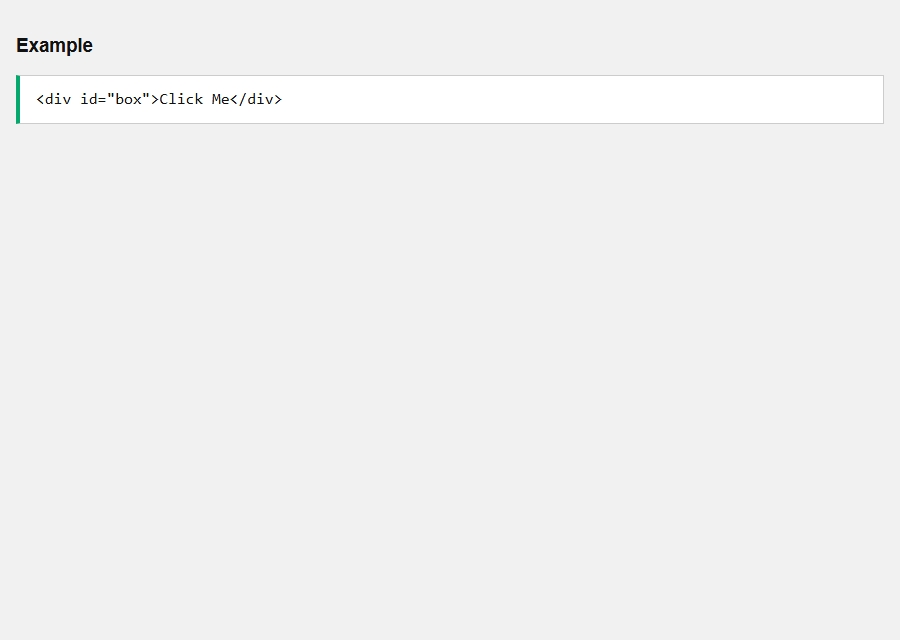

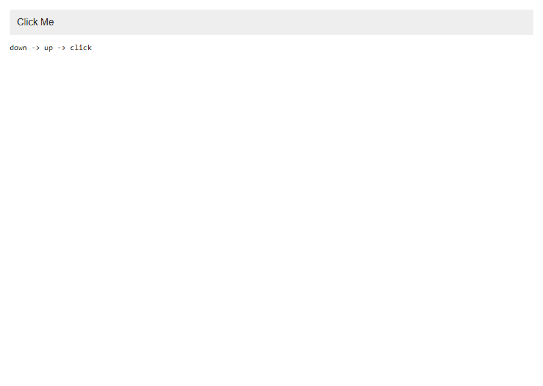

- [x] **Outcome:** The log is **down -> up -> click**.

<a id="event-examples-example-10"></a>

### **Example 10: More examples — change an image while the mouse is down**

- [x] `onmousedown` / `onmouseup` can swap `img.src` for a “pressed” look.
- [x] This sandbox uses two local SVG files as the two states.
- [x] The snapshot holds **mousedown** so you see the down image.

Sandbox: `code_sandbox/event-examples/mousedown-image.html`

```html

```

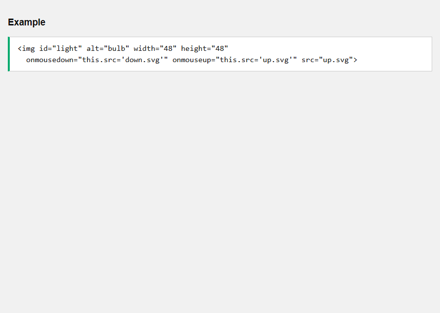


- [x] **Outcome:** `src` after mousedown is **down.svg**.

<a id="event-examples-example-11"></a>

### **Example 11: More examples — onload (alert stand-in)**

- [x] The site’s extra example **alerts** when the page has finished loading.
- [x] Alerts are blocked/hidden in screenshots, so we write to `#demo` instead — same event.
- [x] Do not use `alert` for real UX; this is a teaching stand-in.

Sandbox: `code_sandbox/event-examples/onload-alert.html`

```html
<body onload="alert('Page loaded')">
```

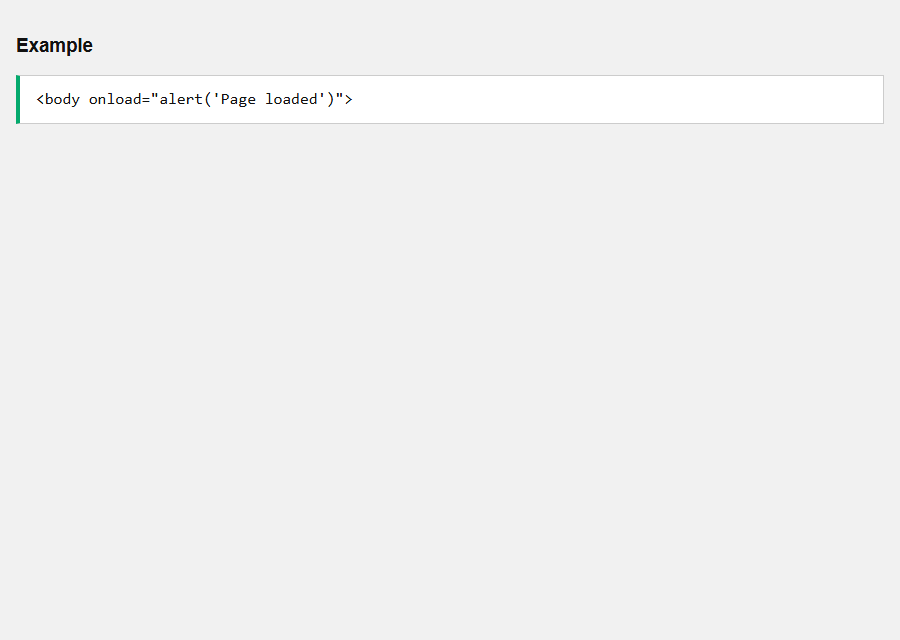

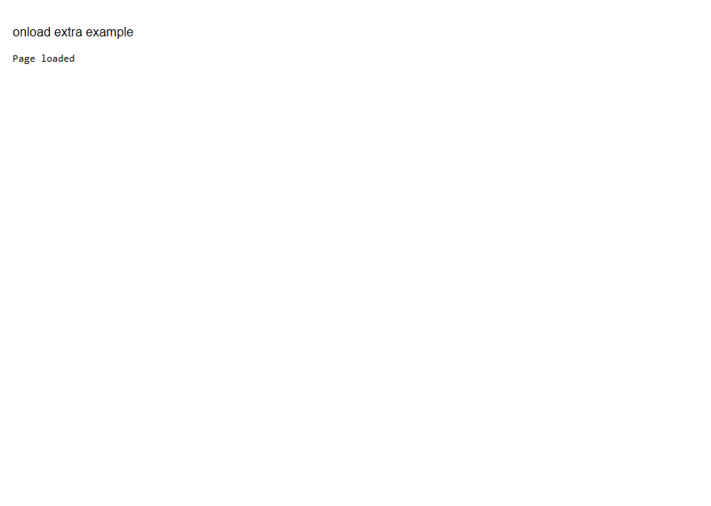

- [x] **Outcome:** The load handler runs and prints **Page loaded** (alert replaced with DOM text).

<a id="event-examples-example-12"></a>

### **Example 12: More examples — onfocus background**

- [x] `onfocus` fires when the control becomes the **active** field (click or Tab).
- [x] W3Schools changes `backgroundColor` on focus so the user sees the caret field.
- [x] The snapshot focuses the input.

Sandbox: `code_sandbox/event-examples/onfocus-bg.html`

```html
<input id="n" onfocus="this.style.background='yellow'">
```

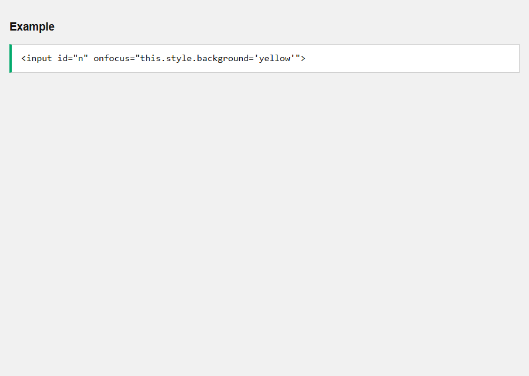


- [x] **Outcome:** After `focus()`, `style.background` is **yellow**.

<a id="event-examples-example-13"></a>

### **Example 13: More examples — mouse events change color**

- [x] A compact hover: change `style.color` when the cursor moves over the element.
- [x] This is the “Mouse Events Change the color…” extra example.
- [x] The snapshot stops on **mouseover** so the color is **red** in the result.

Sandbox: `code_sandbox/event-examples/mouse-events-color.html`

```html
<h2 onmouseover="this.style.color='red'">Mouse over me</h2>
```

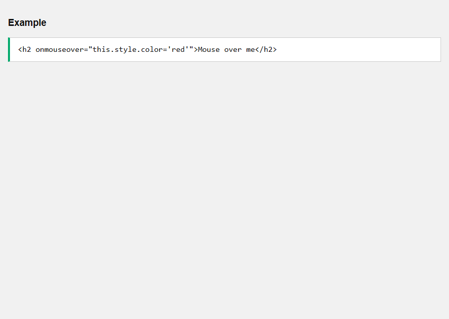


- [x] **Outcome:** The heading `style.color` is **red** after mouseover.

<details>
  <summary>Terminal Commands</summary>

## Terminal Commands

```bash
# from Personal/Files/javascript/code_sandbox
py -3 -m http.server 8770 --bind 127.0.0.1
```

Then open `http://127.0.0.1:8770/event-examples/`.

</details>

<details>
  <summary>Questions and Answers</summary>

## Questions and Answers

### Question 1: What does `onclick="changeText(this)"` pass?

<details>
<summary>Answer</summary>

- [x] The **element** that was clicked (`this`).

</details>

### Question 2: Why assign `onclick = displayDate` without `()`?

<details>
<summary>Answer</summary>

- [x] So you store the **function**, not the result of calling it now.

</details>

### Question 3: `oninput` vs `onchange` on a text field?

<details>
<summary>Answer</summary>

- [x] `oninput` fires **as you type**. `onchange` fires when the value is **committed**.

</details>

### Question 4: What is the mousedown → click order?

<details>
<summary>Answer</summary>

- [x] **mousedown**, **mouseup**, **onclick**.

</details>

### Question 5: What are `onload` / `onunload` for?

<details>
<summary>Answer</summary>

- [x] Entering / leaving the page. Prefer `addEventListener` today; `onunload` is flaky on mobile.

</details>

### Question 6: How can you highlight a field on focus?

<details>
<summary>Answer</summary>

- [x] `onfocus` → set **`style.background`**.

</details>

### Question 7: Why replace `alert` in the sandbox?

<details>
<summary>Answer</summary>

- [x] Alerts are a poor snapshot target; the **event** is the same.

</details>

### Question 8: Can any element have `onclick`?

<details>
<summary>Answer</summary>

- [x] Yes — headings, divs, images — not only buttons. Prefer real `<button>` for accessibility.

</details>

### Question 9: What does the upperCase onchange example do?

<details>
<summary>Answer</summary>

- [x] It rewrites the field to **uppercase** when `change` fires.

</details>

### Question 10: How do you swap an image on press?

<details>
<summary>Answer</summary>

- [x] Set **`src`** in `onmousedown` and restore it in `onmouseup`.

</details>


</details>

## Summary

You can attach events in HTML or from JavaScript. Know the event you need (`input` vs `change`, `focus`, mouse sequence) and prefer listeners as apps grow.

## References

- [Event Examples](https://www.w3schools.com/js/js_htmldom_events.asp)
- [MDN EventTarget.addEventListener](https://developer.mozilla.org/en-US/docs/Web/API/EventTarget/addEventListener)

</details>

<details>
  <summary>Event Listener</summary>

## Introduction

`addEventListener` attaches handlers without overwriting others, works on any EventTarget, supports capture vs bubble, and pairs with `removeEventListener`.

This section has **11** examples:

- [x] **Example 1:** addEventListener that fires on button click [View](#event-listener-example-01)
- [x] **Example 2:** Syntax — event, function, useCapture [View](#event-listener-example-02)
- [x] **Example 3:** Anonymous function handler [View](#event-listener-example-03)
- [x] **Example 4:** Named function handler [View](#event-listener-example-04)
- [x] **Example 5:** Many handlers of the same type [View](#event-listener-example-05)
- [x] **Example 6:** Different event types on the same element [View](#event-listener-example-06)
- [x] **Example 7:** Listener on window — resize [View](#event-listener-example-07)
- [x] **Example 8:** Passing parameters with an anonymous wrapper [View](#event-listener-example-08)
- [x] **Example 9:** Event bubbling vs capturing [View](#event-listener-example-09)
- [x] **Example 10:** Bubbling (useCapture false) for comparison [View](#event-listener-example-10)
- [x] **Example 11:** removeEventListener [View](#event-listener-example-11)

## Detailed Explanation

- [x] No `on` prefix.
- [x] Many listeners per element.
- [x] Capture = outer first; bubble = inner first.

<a id="event-listener-example-01"></a>

### **Example 1: addEventListener that fires on button click**

- [x] `document.getElementById("myBtn").addEventListener("click", displayDate);`
- [x] The method attaches a handler **without overwriting** other listeners.
- [x] Event name: `"click"`, not `"onclick"`.

Sandbox: `code_sandbox/event-listener/add-displaydate.html`

```html
<button type="button" id="myBtn">Try it</button>
<script>
document.getElementById("myBtn").addEventListener("click", displayDate);
function displayDate() {
  document.getElementById("out").innerHTML = Date();
}
</script>
```

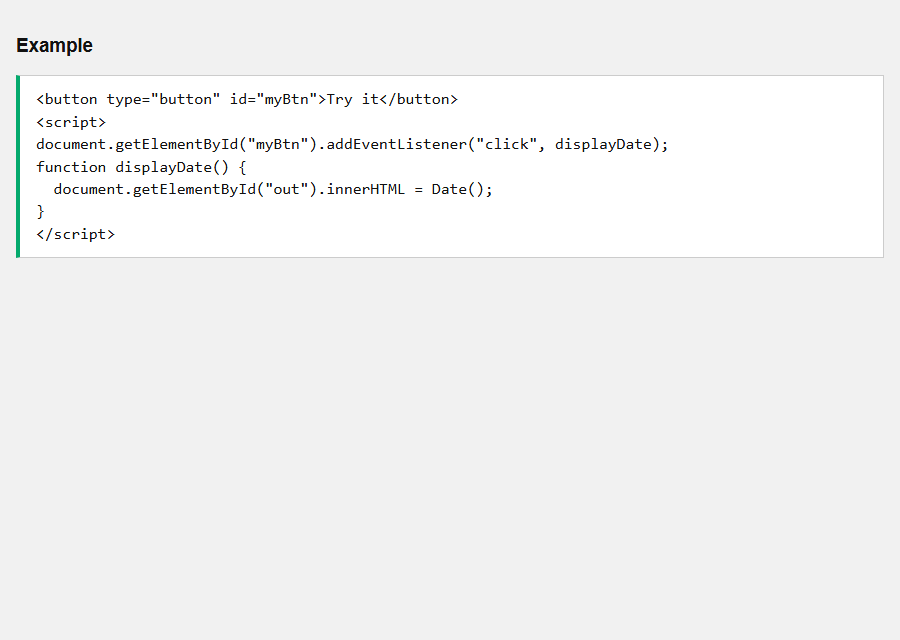


- [x] **Outcome:** Click runs `displayDate` and shows the date.

<a id="event-listener-example-02"></a>

### **Example 2: Syntax — event, function, useCapture**

- [x] `element.addEventListener(event, function, useCapture);`
- [x] 1) event type  2) callback  3) optional boolean — `true` = **capture**, default `false` = **bubble**.
- [x] Do not write the `on` prefix.

Sandbox: `code_sandbox/event-listener/syntax.html`

```javascript
element.addEventListener("click", function () { /* ... */ }, false);
```

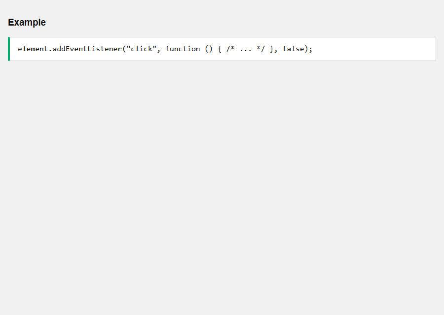

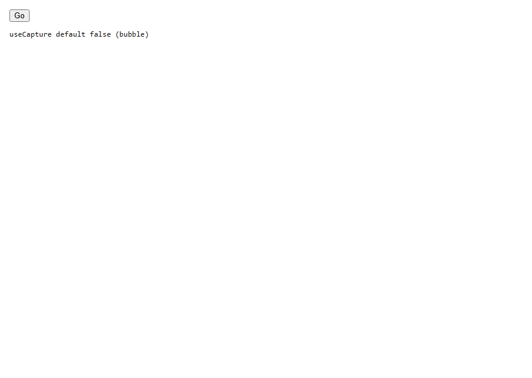

- [x] **Outcome:** The sandbox attaches with the default bubble phase (`false`) and the click succeeds.

<a id="event-listener-example-03"></a>

### **Example 3: Anonymous function handler**

- [x] `element.addEventListener("click", function(){ … });`
- [x] Fine when you will **never remove** the listener.
- [x] Alerts are replaced with DOM text in this sandbox.

Sandbox: `code_sandbox/event-listener/anonymous.html`

```javascript
element.addEventListener("click", function(){ alert("Hello World!"); });
```

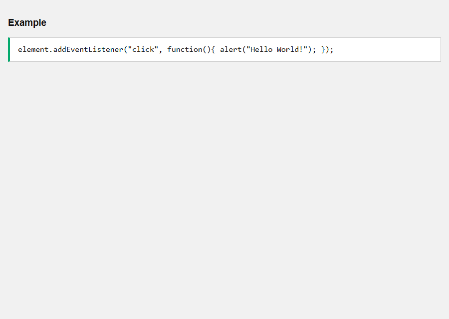


- [x] **Outcome:** Click prints **Hello World!** (alert stand-in).

<a id="event-listener-example-04"></a>

### **Example 4: Named function handler**

- [x] `addEventListener("click", myFunction);` then `function myFunction(){…}`.
- [x] Named functions are reusable and **removable**.
- [x] Pass the function **reference**, no `()`.

Sandbox: `code_sandbox/event-listener/named.html`

```javascript
element.addEventListener("click", myFunction);
function myFunction() { alert("Hello World!"); }
```

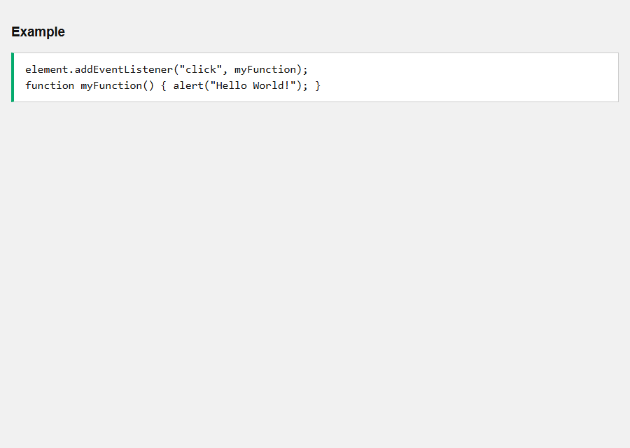


- [x] **Outcome:** The named function runs: **Hello World!**.

<a id="event-listener-example-05"></a>

### **Example 5: Many handlers of the same type**

- [x] Two `click` listeners on the **same** element both run — neither overwrites the other.
- [x] That is the big difference vs `onclick = …`.
- [x] Order is registration order (for the same phase).

Sandbox: `code_sandbox/event-listener/many-same-type.html`

```javascript
element.addEventListener("click", myFunction);
element.addEventListener("click", mySecondFunction);
```

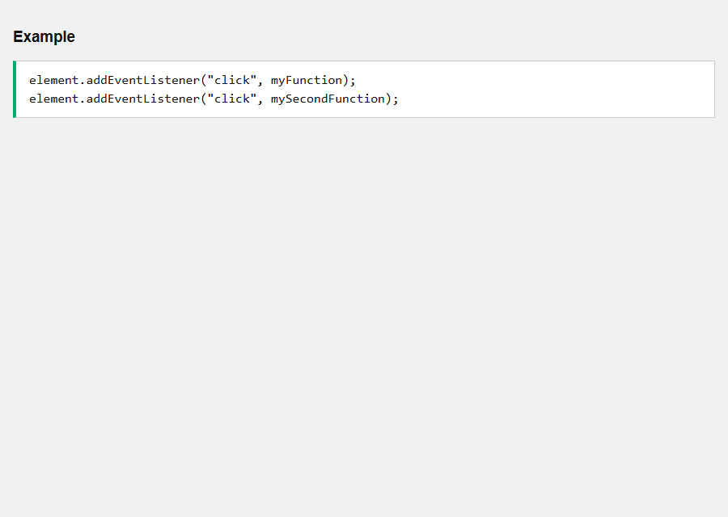


- [x] **Outcome:** The log is **first second** — both click handlers ran.

<a id="event-listener-example-06"></a>

### **Example 6: Different event types on the same element**

- [x] You can mix `mouseover`, `click`, and `mouseout` on one node.
- [x] Each type has its own listener list.
- [x] The snapshot fires all three in order.

Sandbox: `code_sandbox/event-listener/many-types.html`

```javascript
element.addEventListener("mouseover", myFunction);
element.addEventListener("click", mySecondFunction);
element.addEventListener("mouseout", myThirdFunction);
```

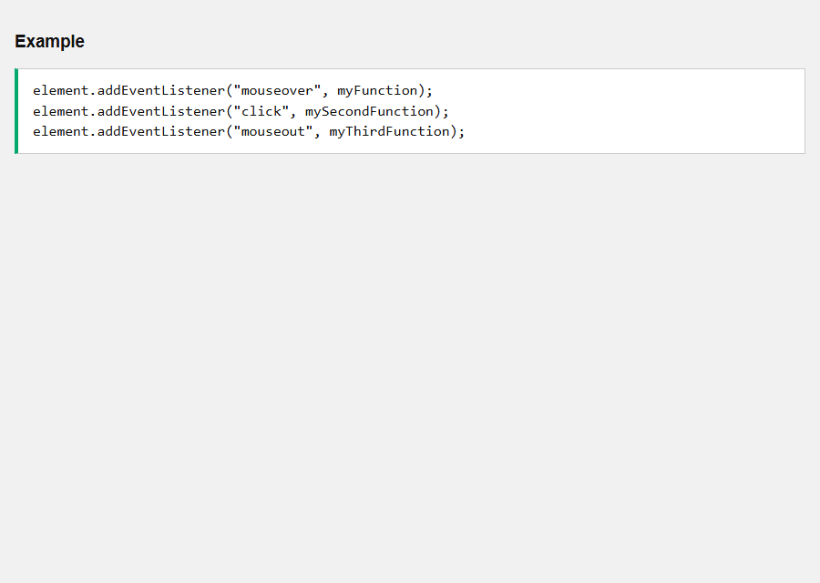

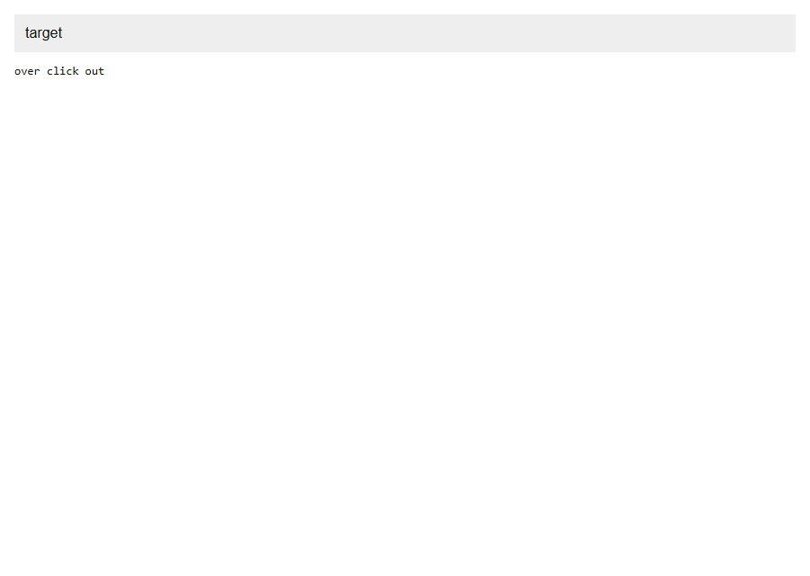

- [x] **Outcome:** The log is **over click out**.

<a id="event-listener-example-07"></a>

### **Example 7: Listener on window — resize**

- [x] `addEventListener` works on **any** EventTarget: elements, `document`, `window`, XHR, …
- [x] W3Schools listens for `resize` and writes text into `#demo`.
- [x] The snapshot dispatches `resize` (real window chrome may not change in headless).

Sandbox: `code_sandbox/event-listener/window-resize.html`

```html
<p id="out"></p>
<script>
window.addEventListener("resize", function(){
  document.getElementById("out").innerHTML = "resized " + window.innerWidth;
});
</script>
```

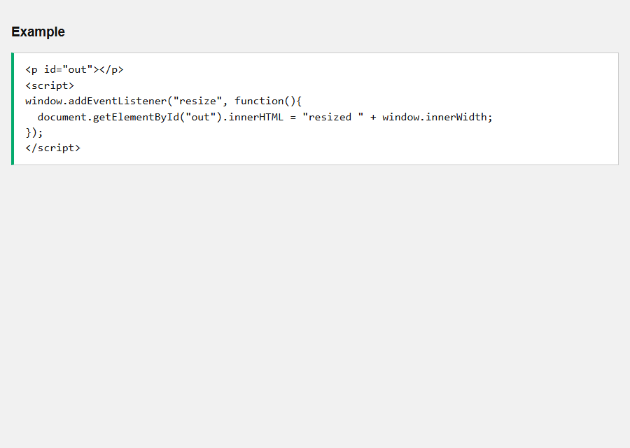


- [x] **Outcome:** The resize handler runs and prints the inner width.

<a id="event-listener-example-08"></a>

### **Example 8: Passing parameters with an anonymous wrapper**

- [x] You cannot write `addEventListener("click", myFunction(p1, p2))` — that **calls** it now.
- [x] Wrap: `addEventListener("click", function(){ myFunction(p1, p2); });`.
- [x] The wrapper closes over `p1`/`p2`.

Sandbox: `code_sandbox/event-listener/parameters.html`

```javascript
element.addEventListener("click", function(){ myFunction(p1, p2); });
```

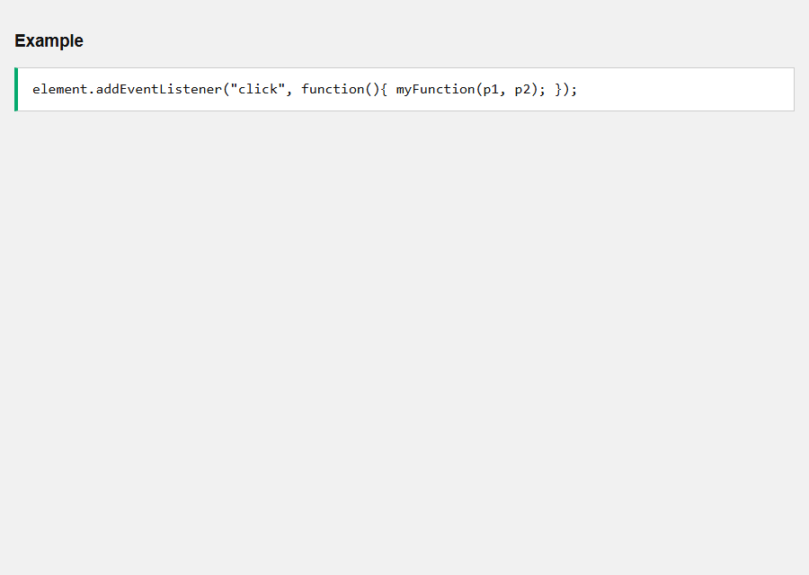


- [x] **Outcome:** Click calls `myFunction("A", "B")` and prints **A B**.

<a id="event-listener-example-09"></a>

### **Example 9: Event bubbling vs capturing**

- [x] **Bubbling** (default): inner handler first, then outer.
- [x] **Capturing**: outer first, then inner. Pass `true` as the third argument.
- [x] W3Schools attaches both `myP` and `myDiv` with `true` so they use capture.

Sandbox: `code_sandbox/event-listener/bubble-capture.html`

```html
<div id="myDiv"><p id="myP">click inner</p></div>
<script>
document.getElementById("myP").addEventListener("click", function () { log("P"); }, true);
document.getElementById("myDiv").addEventListener("click", function () { log("DIV"); }, true);
</script>
```

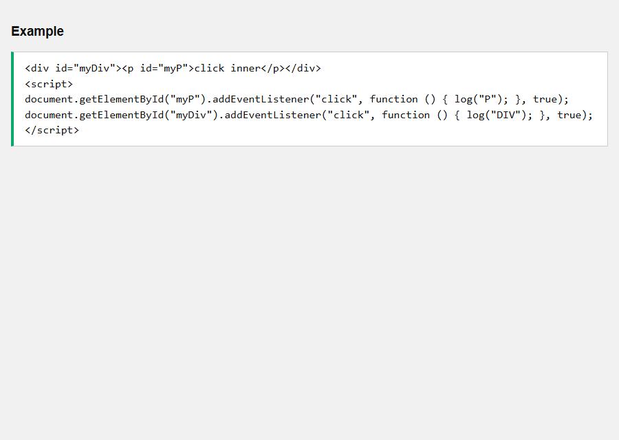

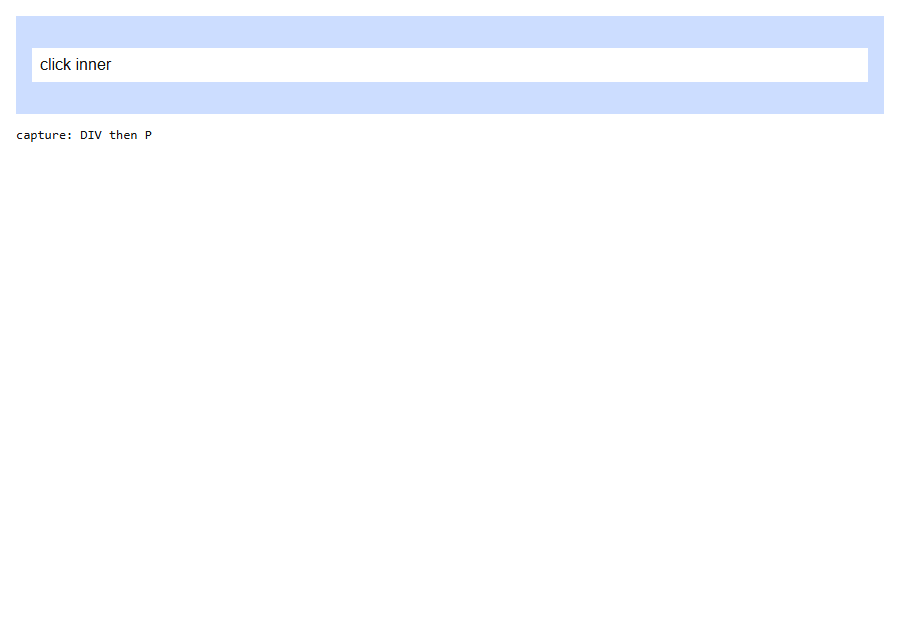

- [x] **Outcome:** With `useCapture true`, clicking P logs **DIV** then **P** (outer first).

<a id="event-listener-example-10"></a>

### **Example 10: Bubbling (useCapture false) for comparison**

- [x] The same markup with default bubbling logs **P then DIV** (inner first).
- [x] This extra example makes the capture vs bubble difference visible.
- [x] Most code uses bubbling.

Sandbox: `code_sandbox/event-listener/bubble-default.html`

```javascript
document.getElementById("myP").addEventListener("click", fn, false);
document.getElementById("myDiv").addEventListener("click", fn, false);
```

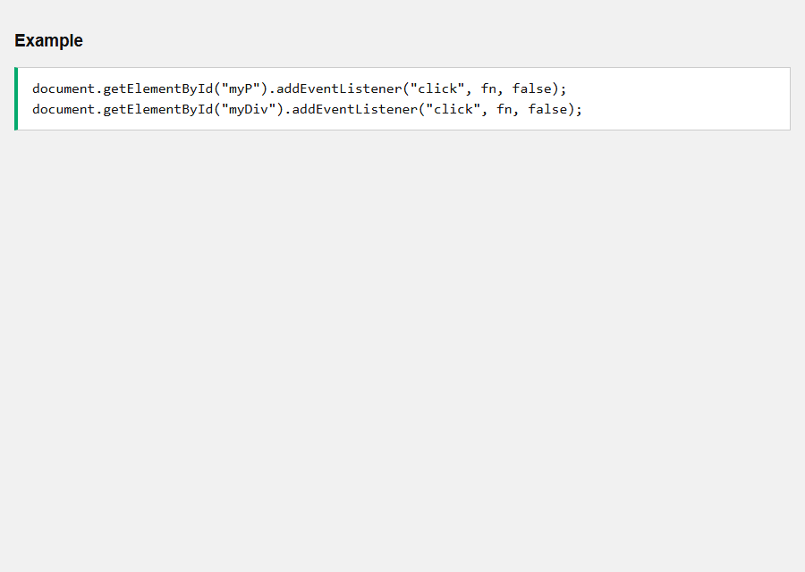

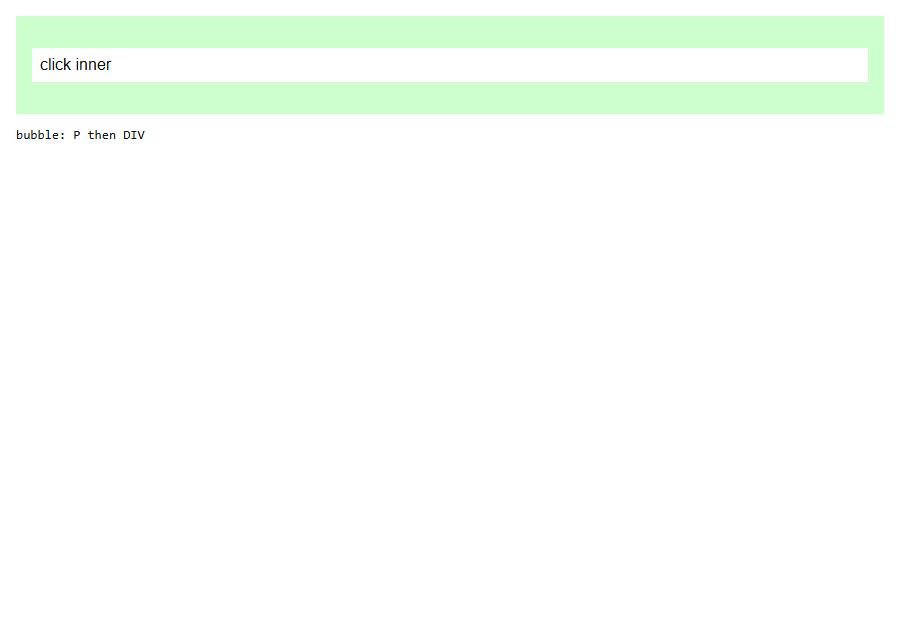

- [x] **Outcome:** Clicking P with bubble phase logs **P then DIV**.

<a id="event-listener-example-11"></a>

### **Example 11: removeEventListener**

- [x] `element.removeEventListener("mousemove", myFunction);`
- [x] Must match **type**, **function**, and **capture flag** from `addEventListener`.
- [x] After removal, mousemove no longer updates the text.

Sandbox: `code_sandbox/event-listener/remove.html`

```javascript
element.removeEventListener("mousemove", myFunction);
```


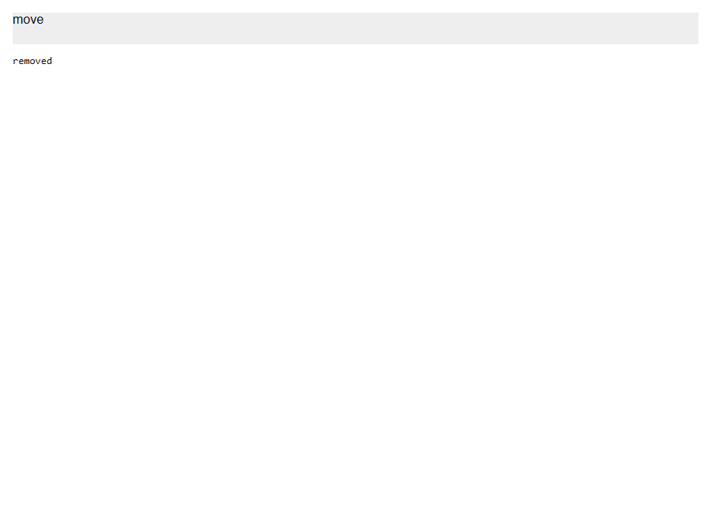

- [x] **Outcome:** A move after removal does **not** change the message **removed**.

<details>
  <summary>Terminal Commands</summary>

## Terminal Commands

```bash
# from Personal/Files/javascript/code_sandbox
py -3 -m http.server 8770 --bind 127.0.0.1
```

Then open `http://127.0.0.1:8770/event-listener/`.

</details>

<details>
  <summary>Questions and Answers</summary>

## Questions and Answers

### Question 1: Do you write `onclick` or `click` in addEventListener?

<details>
<summary>Answer</summary>

- [x] **`"click"`** — no `on` prefix.

</details>

### Question 2: What is the third argument?

<details>
<summary>Answer</summary>

- [x] **`useCapture`**: `true` capture, `false`/omit bubble.

</details>

### Question 3: Can two click listeners coexist?

<details>
<summary>Answer</summary>

- [x] Yes — `addEventListener` does **not** overwrite.

</details>

### Question 4: How do you pass extra parameters?

<details>
<summary>Answer</summary>

- [x] Wrap in an **anonymous function** that calls `myFunction(p1, p2)`.

</details>

### Question 5: Capture order for inner P inside DIV?

<details>
<summary>Answer</summary>

- [x] **DIV then P** (outer first).

</details>

### Question 6: Bubble order for the same click?

<details>
<summary>Answer</summary>

- [x] **P then DIV** (inner first).

</details>

### Question 7: What can you listen on besides elements?

<details>
<summary>Answer</summary>

- [x] **`window`**, **`document`**, and other EventTargets (for example XHR).

</details>

### Question 8: Why named functions for remove?

<details>
<summary>Answer</summary>

- [x] `removeEventListener` needs the **same function reference**.

</details>

### Question 9: What happens if the capture flag differs on remove?

<details>
<summary>Answer</summary>

- [x] The listener is **not** removed — type, fn, and capture must match.

</details>

### Question 10: Why not `addEventListener("click", myFunction())`?

<details>
<summary>Answer</summary>

- [x] The `()` **calls** it immediately and registers `undefined`.

</details>

### Question 11: Does addEventListener work if you do not control the HTML?

<details>
<summary>Answer</summary>

- [x] Yes — that is a listed advantage: JS stays **off** the markup.

</details>


</details>

## Summary

Use `addEventListener(type, fn, useCapture)` everywhere you can. Wrap parameterised calls, and remove with the same function and capture flag.

## References

- [Event Listener](https://www.w3schools.com/js/js_htmldom_eventlistener.asp)
- [MDN EventTarget.addEventListener](https://developer.mozilla.org/en-US/docs/Web/API/EventTarget/addEventListener)

</details>

<details>
  <summary>HTML First</summary>

## Introduction

HTML-First builds pages so HTML (and CSS) already work. JavaScript is added later, only when the browser cannot do the job natively.

This section has **8** examples:

- [x] **Example 1:** A page that works without JavaScript [View](#html-first-example-01)
- [x] **Example 2:** Avoid unnecessary JavaScript [View](#html-first-example-02)
- [x] **Example 3:** Progressive enhancement — form without JavaScript [View](#html-first-example-03)
- [x] **Example 4:** Why HTML-First is not “no JavaScript” [View](#html-first-example-04)
- [x] **Example 5:** Browsers already understand details/summary [View](#html-first-example-05)
- [x] **Example 6:** HTML is visible before JavaScript loads [View](#html-first-example-06)
- [x] **Example 7:** Semantic HTML improves accessibility [View](#html-first-example-07)
- [x] **Example 8:** When JavaScript is still useful [View](#html-first-example-08)

## Detailed Explanation

- [x] Related to progressive enhancement.
- [x] Less JS can mean faster, more accessible, more reliable pages.
- [x] Semantic HTML and native widgets (`details`, forms) come first.

<a id="html-first-example-01"></a>

### **Example 1: A page that works without JavaScript**

- [x] HTML-First means **HTML is the foundation**. The page should be readable and usable with basic HTML and CSS.
- [x] This is the same idea as **progressive enhancement**: start with a working document, then add JS.
- [x] The example is a heading + paragraph — no script required for the content to appear.

Sandbox: `code_sandbox/html-first/works-without-js.html`

```html
<!doctype html>
<html>
<body>
  <h1>HTML First</h1>
  <p>Welcome This page works without JavaScript.</p>
</body>
</html>
```

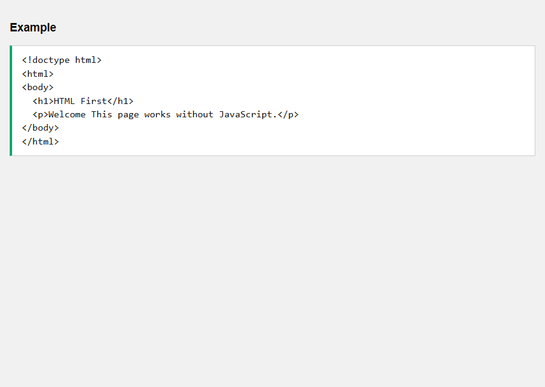

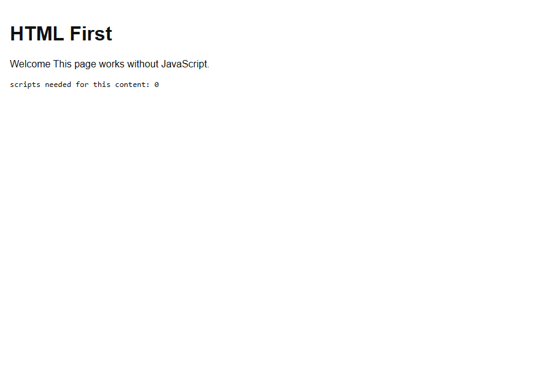

- [x] **Outcome:** The heading **HTML First** and the welcome paragraph render with **zero** script.

<a id="html-first-example-02"></a>

### **Example 2: Avoid unnecessary JavaScript**

- [x] JS is powerful, but extra JS makes sites **slower** and harder to maintain.
- [x] HTML-first can improve page speed, accessibility, SEO, maintainability, and reliability.
- [x] Ask: can native HTML/CSS do this? If yes, skip the library.

Sandbox: `code_sandbox/html-first/avoid-unnecessary-js.html`

```html
<p>Benefits: speed, accessibility, search, maintainability, reliability.</p>
```


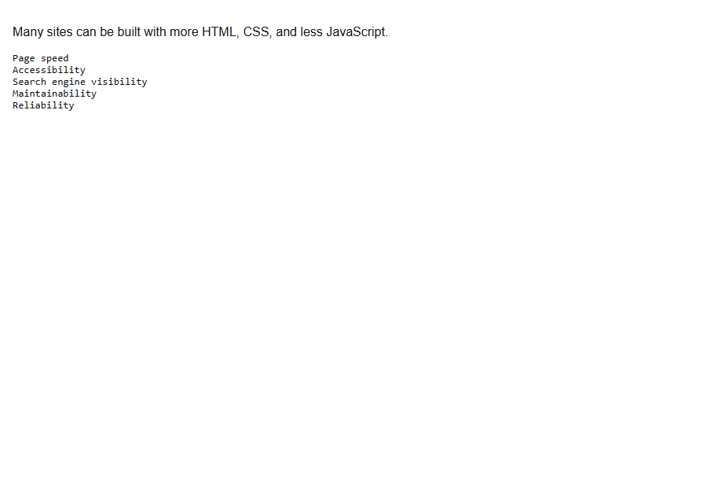

- [x] **Outcome:** The snapshot lists the five benefits from the W3Schools page.

<a id="html-first-example-03"></a>

### **Example 3: Progressive enhancement — form without JavaScript**

- [x] An HTML form should **still submit** if JS fails.
- [x] `type="email"` + `required` give built-in checks with **no script**.
- [x] The W3Schools Subscribe form uses native validation only.

Sandbox: `code_sandbox/html-first/form-html-validation.html`

```html
<form action="#" method="post">
  <label>Email: <input type="email" name="email" required></label>
  <button type="submit">Subscribe</button>
</form>
```

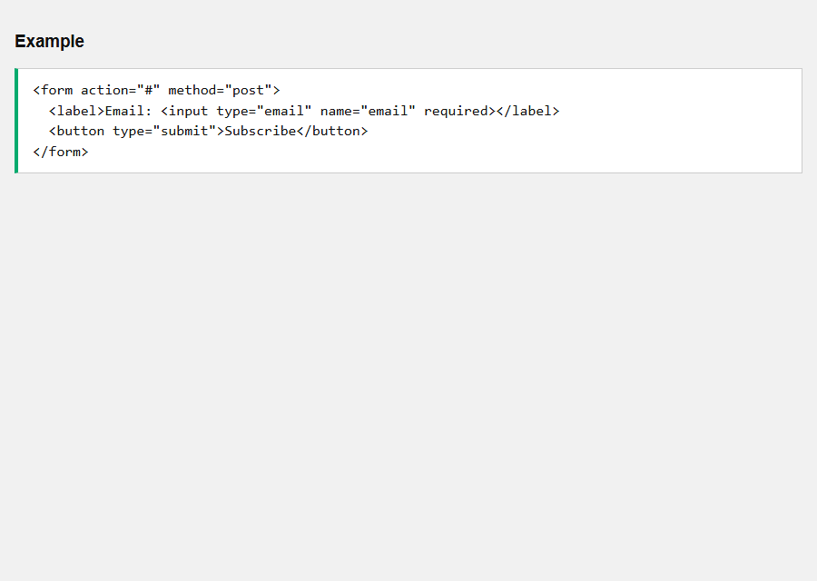

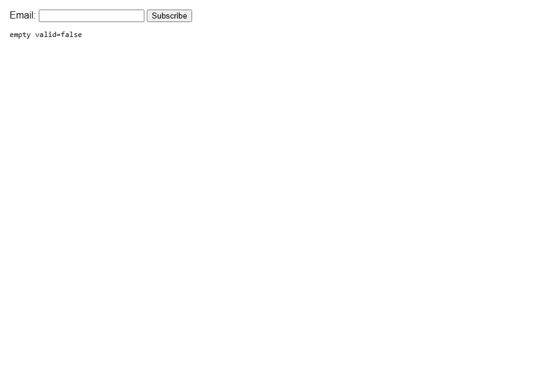

- [x] **Outcome:** Empty email: `checkValidity()` is **false**. Filling a valid email would allow submit even with JS disabled.

<a id="html-first-example-04"></a>

### **Example 4: Why HTML-First is not “no JavaScript”**

- [x] HTML-first is **not** rejecting JS. It is using **browser features first**.
- [x] Many UI pieces used to need JS and now exist as HTML/CSS.
- [x] Add JS when the browser cannot do the job natively.

Sandbox: `code_sandbox/html-first/not-rejecting-js.html`

```html
<p>HTML-first does not mean JavaScript never. It means HTML before JavaScript.</p>
```


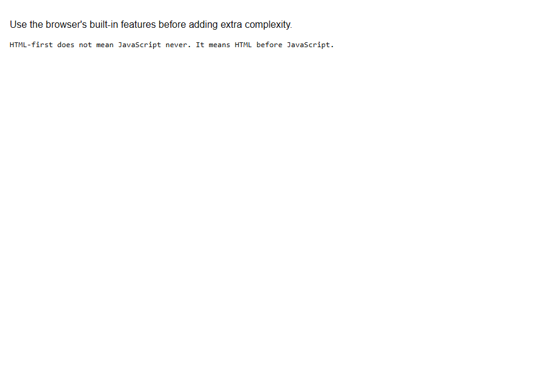

- [x] **Outcome:** The note prints the W3Schools line: HTML **before** JavaScript.

<a id="html-first-example-05"></a>

### **Example 5: Browsers already understand details/summary**

- [x] `<details>` / `<summary>` open and close **without JS**.
- [x] Also native: `<dialog>`, `<form>` validation, `<search>` (where supported).
- [x] This is “browsers are already powerful.”

Sandbox: `code_sandbox/html-first/details-native.html`

```html
<details>
  <summary>Click to read more</summary>
  This text can be opened and closed without JavaScript.
</details>
```

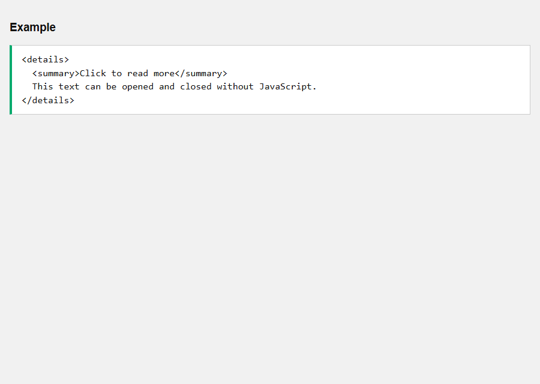

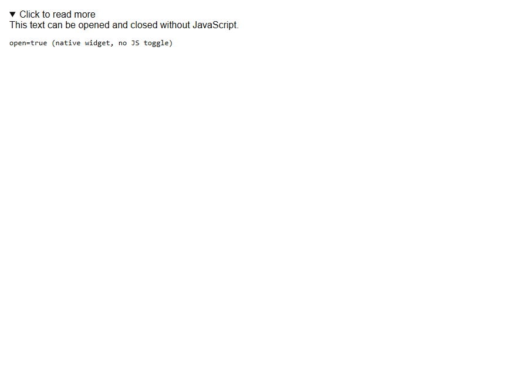

- [x] **Outcome:** `details` is in the document; opening it is a **user/browser** behavior, not a script.

<a id="html-first-example-06"></a>

### **Example 6: HTML is visible before JavaScript loads**

- [x] The browser can **paint HTML** as it arrives.
- [x] Users may start reading before scripts finish. That matters on slow phones.
- [x] Tutorials, articles, product pages, docs, and forms often need nothing more for first paint.

Sandbox: `code_sandbox/html-first/html-before-scripts-load.html`

```html
<article>
  <h1>Article title</h1>
  <p>Readable immediately.</p>
</article>
<script src="app.js" defer></script>
```

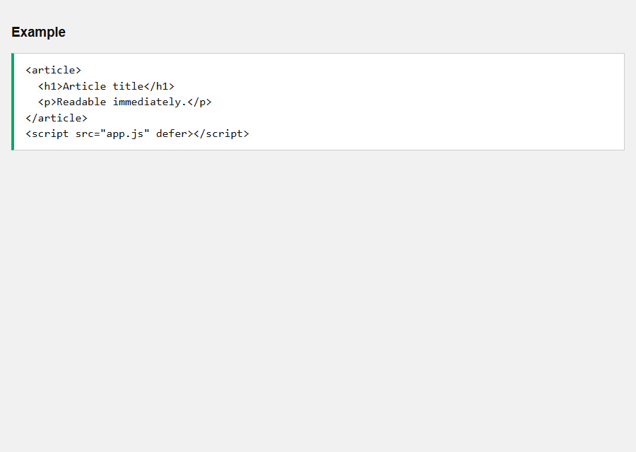

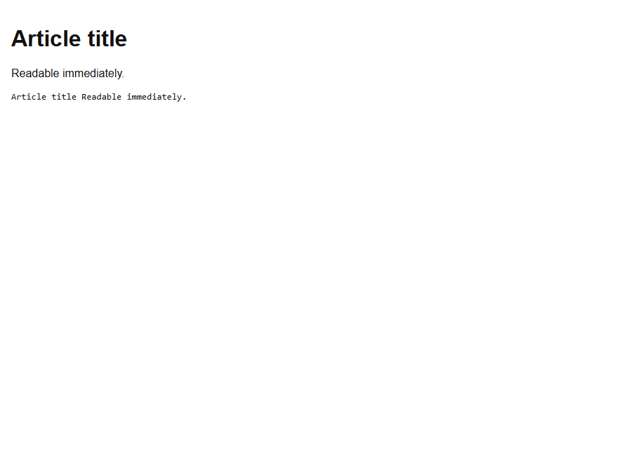

- [x] **Outcome:** The article text is in the DOM even if `app.js` is slow or missing.

<a id="html-first-example-07"></a>

### **Example 7: Semantic HTML improves accessibility**

- [x] Use elements for their **meaning**: `<header>`, `<main>`, `<article>`, `<nav>`, `<button>` — not empty `<div>` soup.
- [x] Screen readers, search engines, and keyboard users get a real outline.
- [x] W3Schools: “Use meaningful HTML first.”

Sandbox: `code_sandbox/html-first/semantic-html.html`

```html
<main>
  <article>
    <h1>Use meaningful HTML first.</h1>
  </article>
</main>
```

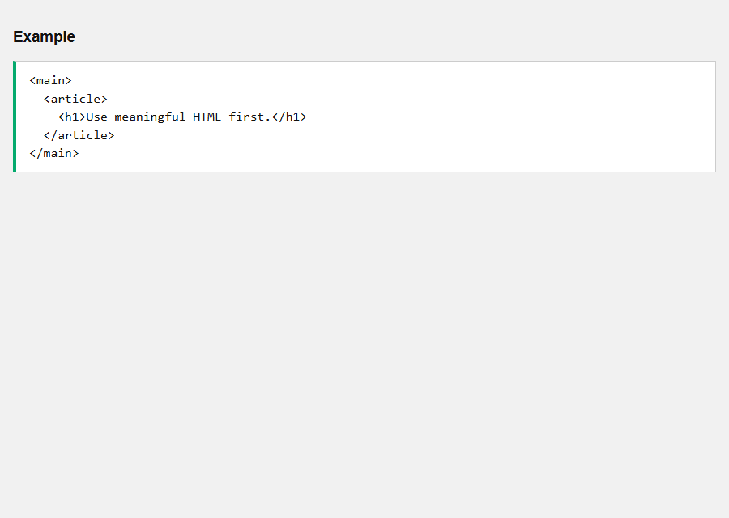

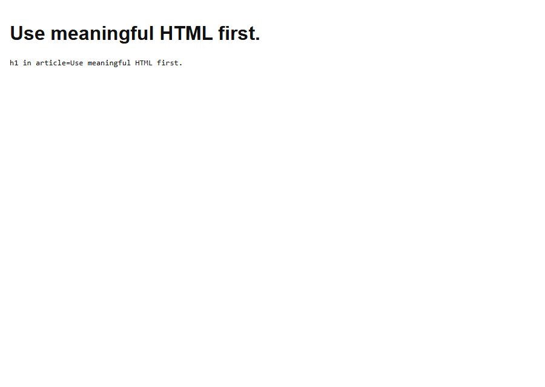

- [x] **Outcome:** `querySelector("article h1")` finds the heading because the markup is **semantic**, not a generic div.

<a id="html-first-example-08"></a>

### **Example 8: When JavaScript is still useful**

- [x] JS is still the right tool for **logic**, live data, storage, and talking to servers.
- [x] The rule is: add it **when it is needed**, not before.
- [x] HTML-first = HTML **before** JS, not HTML **instead of** JS forever.

Sandbox: `code_sandbox/html-first/when-js-useful.html`

```html
<button type="button" id="b">Load extra (needs JS)</button>
<p id="out">Base content always here.</p>
```

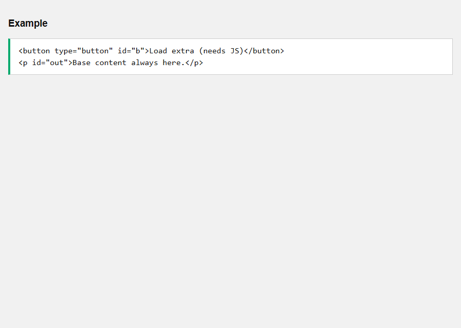

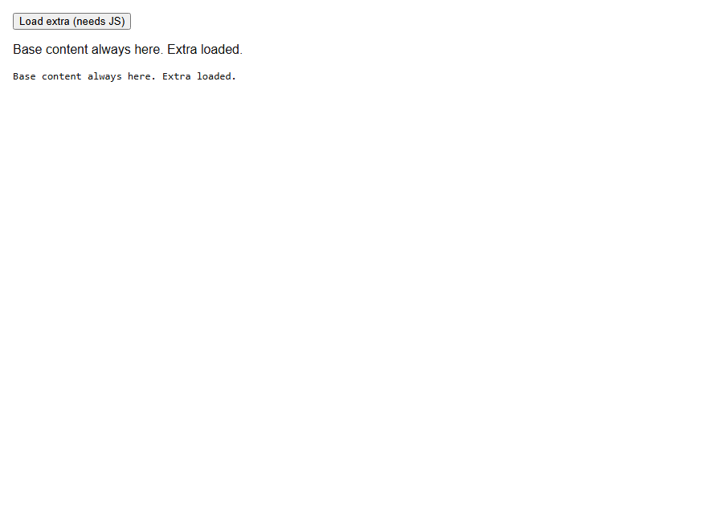

- [x] **Outcome:** Base content is visible without the click. JS only fills the extra line when the button is used.

<details>
  <summary>Terminal Commands</summary>

## Terminal Commands

```bash
# from Personal/Files/javascript/code_sandbox
py -3 -m http.server 8770 --bind 127.0.0.1
```

Then open `http://127.0.0.1:8770/html-first/`.

</details>

<details>
  <summary>Questions and Answers</summary>

## Questions and Answers

### Question 1: What is HTML-First?

<details>
<summary>Answer</summary>

- [x] Build so the page works with **HTML (and CSS)** as the foundation; JS is extra.

</details>

### Question 2: Is it the same as progressive enhancement?

<details>
<summary>Answer</summary>

- [x] **Closely related** — start with a working basic page, then enhance.

</details>

### Question 3: Name two benefits of less JS.

<details>
<summary>Answer</summary>

- [x] Any two of: **speed**, **accessibility**, **SEO**, **maintainability**, **reliability**.

</details>

### Question 4: Should a form work if JS fails?

<details>
<summary>Answer</summary>

- [x] **Yes** — native `action` + `required` / `type=email` still function.

</details>

### Question 5: Does HTML-first mean never write JavaScript?

<details>
<summary>Answer</summary>

- [x] **No** — it means HTML **before** JavaScript.

</details>

### Question 6: Which element toggles extra text with no script?

<details>
<summary>Answer</summary>

- [x] **`<details>`** + **`<summary>`**.

</details>

### Question 7: Why can users read before scripts finish?

<details>
<summary>Answer</summary>

- [x] HTML is **parsed and painted** as it arrives; JS must download and run.

</details>

### Question 8: What is semantic HTML?

<details>
<summary>Answer</summary>

- [x] Using tags for **meaning** (`article`, `nav`, `button`) instead of anonymous divs.

</details>

### Question 9: When is JS still the right tool?

<details>
<summary>Answer</summary>

- [x] **Logic**, data, storage, server communication, widgets HTML cannot provide.

</details>

### Question 10: What question should you ask first?

<details>
<summary>Answer</summary>

- [x] **Can the browser already do this?**

</details>


</details>

## Summary

Ship a usable HTML document first. Enhance with CSS, then JS. Do not start with a framework when a form or article only needs markup.

## References

- [HTML First](https://www.w3schools.com/js/js_htmlfirst.asp)
- [MDN Progressive enhancement](https://developer.mozilla.org/en-US/docs/Glossary/Progressive_Enhancement)

</details>

<details>
  <summary>HTML Progressive</summary>

## Introduction

Progressive enhancement starts with a working basic page, then adds CSS and JS. Graceful degradation starts fancy and tries to cope with older browsers.

This section has **9** examples:

- [x] **Example 1:** Start with HTML — a working form [View](#html-progressive-example-01)
- [x] **Example 2:** Add CSS for better design [View](#html-progressive-example-02)
- [x] **Example 3:** Add JavaScript as an enhancement [View](#html-progressive-example-03)
- [x] **Example 4:** Why progressive enhancement matters [View](#html-progressive-example-04)
- [x] **Example 5:** Progressive Enhancement — starts simple [View](#html-progressive-example-05)
- [x] **Example 6:** Graceful Degradation — starts advanced [View](#html-progressive-example-06)
- [x] **Example 7:** PE adds features later vs GD removes unsupported ones [View](#html-progressive-example-07)
- [x] **Example 8:** PE focuses on accessibility; GD focuses on compatibility [View](#html-progressive-example-08)
- [x] **Example 9:** Modern HTML that used to need JavaScript [View](#html-progressive-example-09)

## Detailed Explanation

- [x] HTML → CSS → JS as layers.
- [x] PE starts simple and adds; GD starts advanced and strips.
- [x] Modern HTML (`required`, `details`, lazy images, CSS animation) makes PE easier.

<a id="html-progressive-example-01"></a>

### **Example 1: Start with HTML — a working form**

- [x] Step 1: meaningful HTML that works if CSS and JS **fail to load**.
- [x] The newsletter form still posts with a normal submit.
- [x] No script is required for the baseline.

Sandbox: `code_sandbox/html-progressive/start-html.html`

```html
<form action="#" method="post">
  <h2>Newsletter Signup</h2>
  <label>Email: <input type="email" name="email" required></label>
  <button type="submit">Join</button>
</form>
```

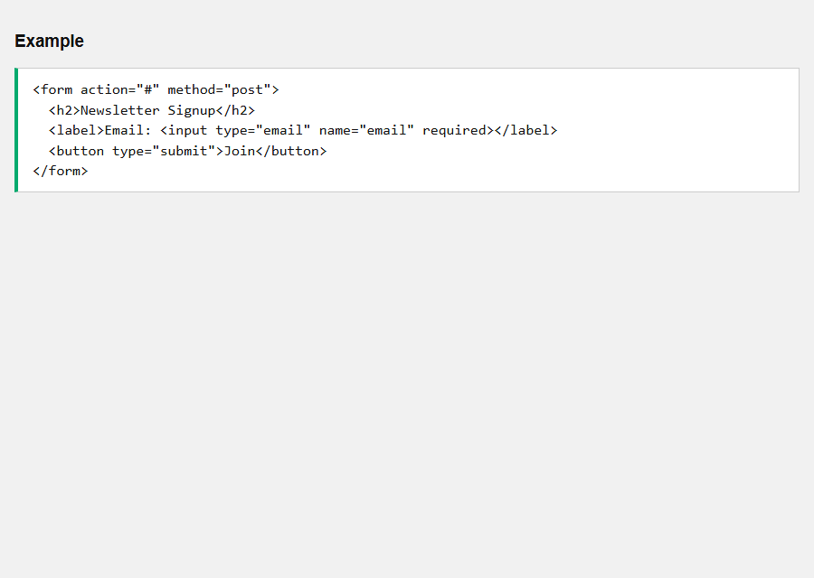

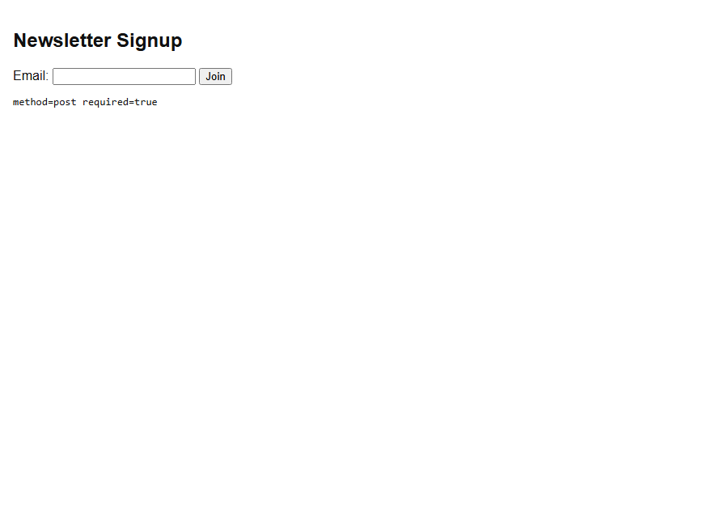

- [x] **Outcome:** The form is in the page and uses **required** + **email** with no JavaScript.

<a id="html-progressive-example-02"></a>

### **Example 2: Add CSS for better design**

- [x] Step 2: CSS improves **appearance** after the HTML already works.
- [x] W3Schools styles the button green with padding and no border.
- [x] If CSS fails, the form is still usable (unstyled).

Sandbox: `code_sandbox/html-progressive/add-css.html`

```css
button {
  background-color: #04AA6D;
  color: white;
  padding: 10px;
  border: none;
}
```

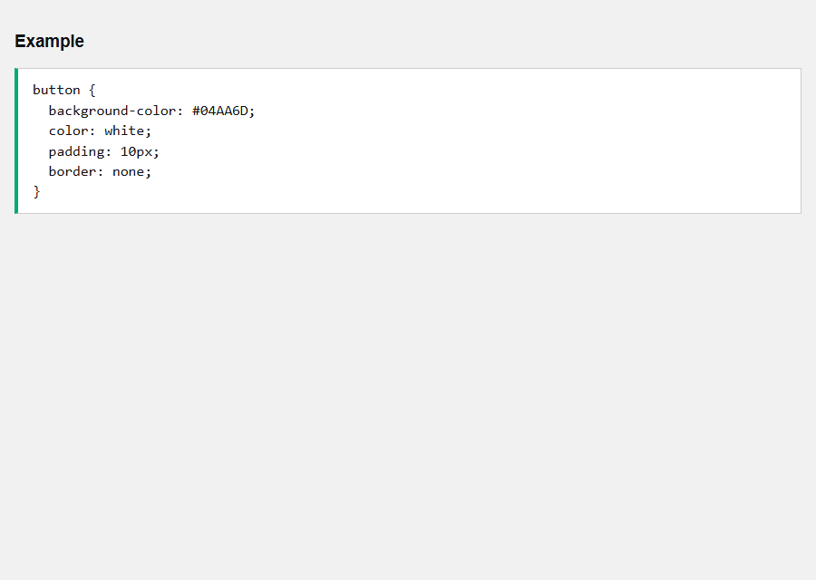

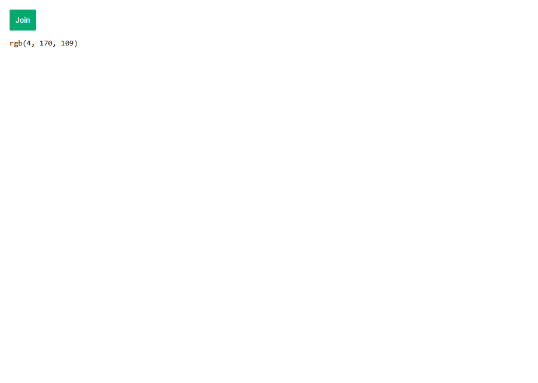

- [x] **Outcome:** Computed button background is the W3Schools **green** `#04AA6D`.

<a id="html-progressive-example-03"></a>

### **Example 3: Add JavaScript as an enhancement**

- [x] Step 3: JS can add instant feedback, but the form **must not depend** on it.
- [x] W3Schools `submit` listener `alert("Form submitted!")` — we print instead.
- [x] If this script does not load, native submit still works.

Sandbox: `code_sandbox/html-progressive/add-js-enhance.html`

```javascript
const form = document.querySelector("form");
form.addEventListener("submit", function () {
  alert("Form submitted!");
});
```

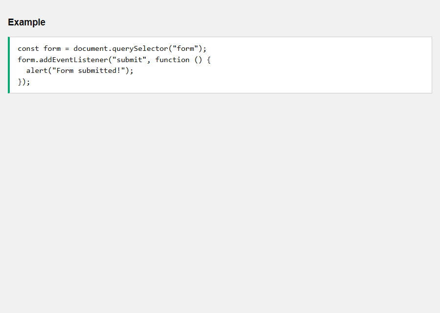


- [x] **Outcome:** Submit is enhanced: the log shows **Form submitted!** and `preventDefault` keeps the sandbox from navigating.

<a id="html-progressive-example-04"></a>

### **Example 4: Why progressive enhancement matters**

- [x] Users have different devices, browsers, speeds. Some **disable JS**.
- [x] Others use old browsers or assistive tech.
- [x] Tip from the page: test with **JavaScript disabled**.

Sandbox: `code_sandbox/html-progressive/why-matters.html`

```html
<p>Everybody should still access the content.</p>
```


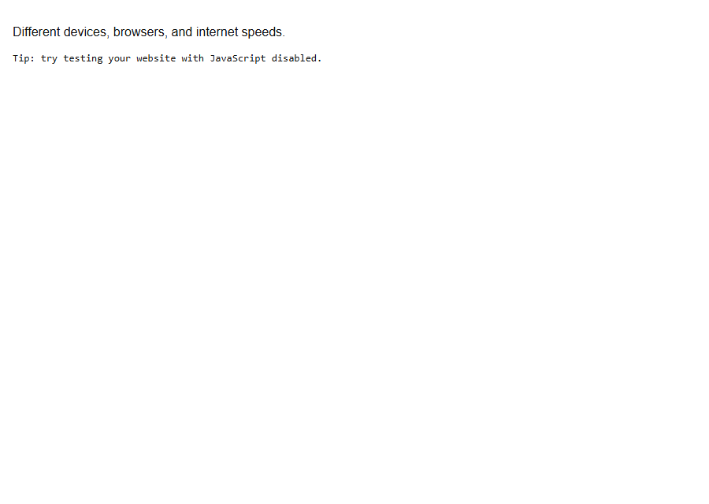

- [x] **Outcome:** The snapshot records the testing tip: try the site with **JS off**.

<a id="html-progressive-example-05"></a>

### **Example 5: Progressive Enhancement — starts simple**

- [x] Table row: PE **starts simple** and adds features later.
- [x] Graceful degradation **starts advanced** and tries to keep old browsers working.
- [x] This example is the PE column: a plain form first.

Sandbox: `code_sandbox/html-progressive/pe-starts-simple.html`

```html
<form action="#"><button>Works with no extras</button></form>
```

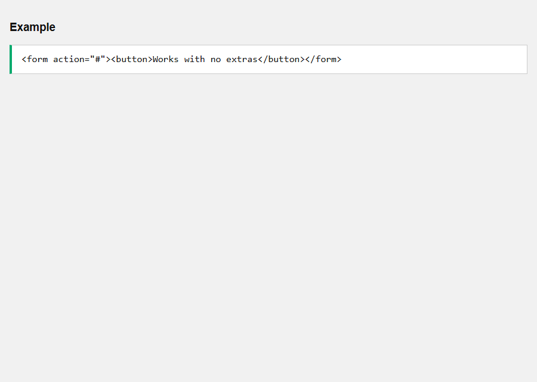

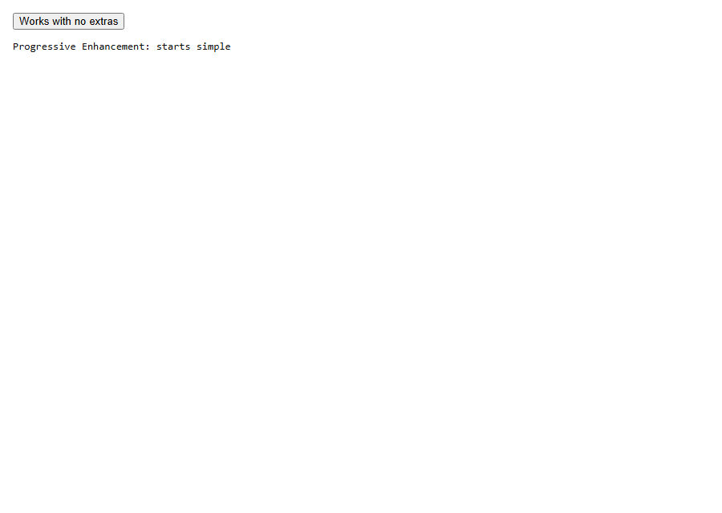

- [x] **Outcome:** Baseline UI is a **plain HTML** form — PE starts simple.

<a id="html-progressive-example-06"></a>

### **Example 6: Graceful Degradation — starts advanced**

- [x] GD builds the **full** experience first, then tries to peel features off for weaker browsers.
- [x] That often leaves a worse baseline than PE.
- [x] Named contrast from the W3Schools table.

Sandbox: `code_sandbox/html-progressive/gd-starts-advanced.html`

```html
<div id="app">Imagine a JS-only SPA here</div>
```


- [x] **Outcome:** A JS-only shell is the **starts advanced** story — if JS fails, there may be nothing.

<a id="html-progressive-example-07"></a>

### **Example 7: PE adds features later vs GD removes unsupported ones**

- [x] PE: **add** features when the browser supports them (`@supports`, `required`, JS if present).
- [x] GD: **remove** or replace features that old browsers cannot handle.
- [x] Feature detection (`'open' in document.createElement('dialog')`) is a PE move.

Sandbox: `code_sandbox/html-progressive/pe-adds-later.html`

```html
<script>
const hasDialog = "showModal" in document.createElement("dialog");
</script>
```

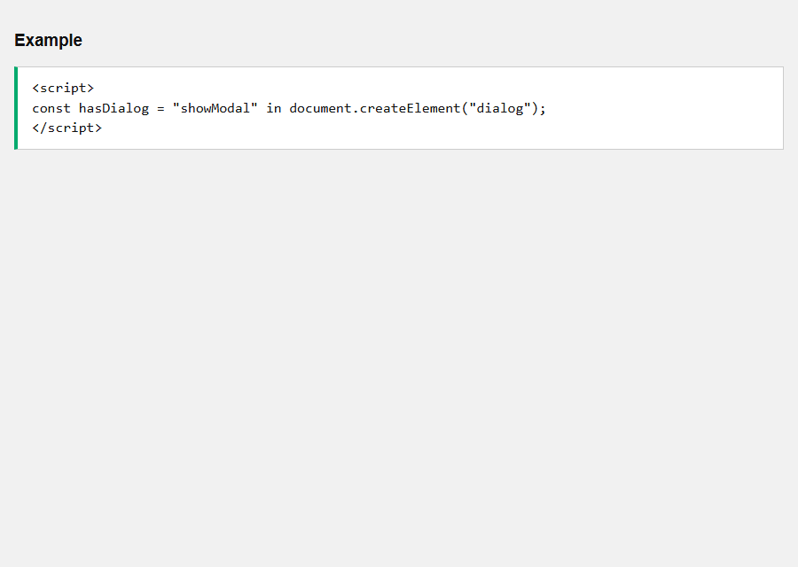


- [x] **Outcome:** `showModal` in `HTMLDialogElement` is **true** in this browser — a feature we can add, not assume.

<a id="html-progressive-example-08"></a>

### **Example 8: PE focuses on accessibility; GD focuses on compatibility**

- [x] PE’s mindset is **everyone can use the content** (keyboard, AT, no-JS).
- [x] GD’s mindset is **make the fancy version limp along** on old engines.
- [x] Both mention compatibility, but the starting point differs.

Sandbox: `code_sandbox/html-progressive/pe-a11y-vs-gd-compat.html`

```html
<button type="button">Real button (accessible)</button>
<div role="button">Fake div button (harder)</div>
```

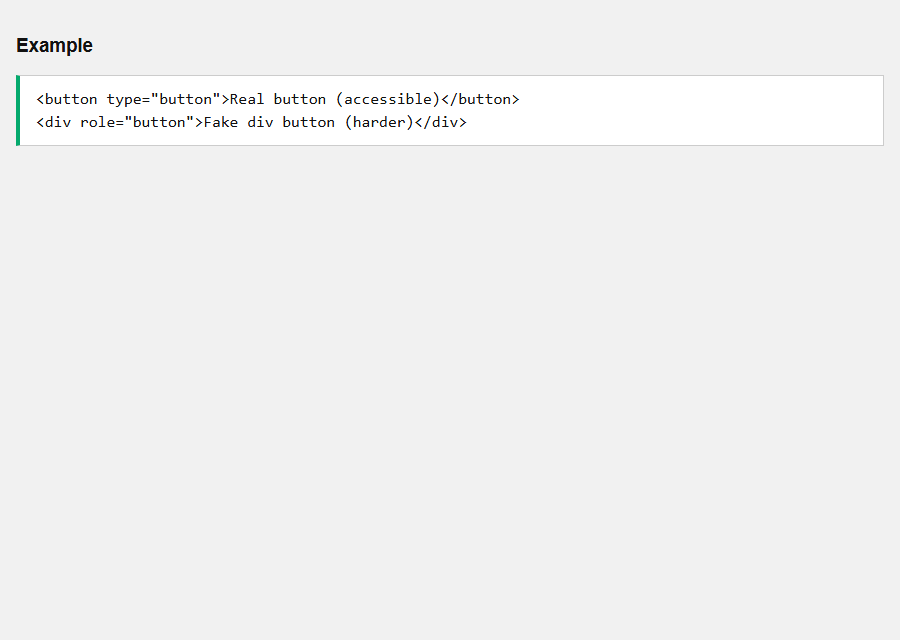


- [x] **Outcome:** A real **`<button>`** is the PE-friendly control; a clickable div is the “rebuild accessibility later” trap.

<a id="html-progressive-example-09"></a>

### **Example 9: Modern HTML that used to need JavaScript**

- [x] `required` validation, `<details>`, `loading="lazy"`, CSS animations — all used to be JS jobs.
- [x] That makes PE **easier** than a decade ago.
- [x] Reach for these before writing a widget library.

Sandbox: `code_sandbox/html-progressive/modern-html-helps.html`

```html
<details><summary>Native</summary>No JS accordion.</details>

```

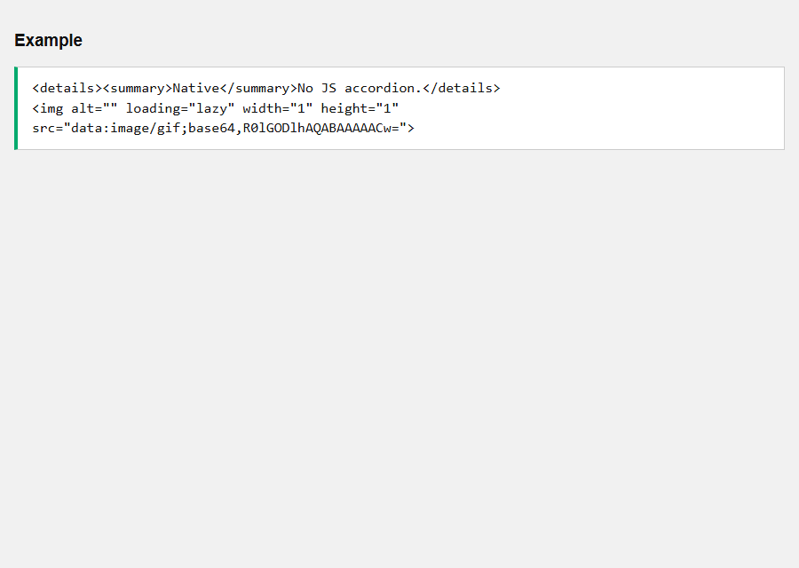


- [x] **Outcome:** `details` and `loading="lazy"` are present as **native** features.

<details>
  <summary>Terminal Commands</summary>

## Terminal Commands

```bash
# from Personal/Files/javascript/code_sandbox
py -3 -m http.server 8770 --bind 127.0.0.1
```

Then open `http://127.0.0.1:8770/html-progressive/`.

</details>

<details>
  <summary>Questions and Answers</summary>

## Questions and Answers

### Question 1: What is the first PE step?

<details>
<summary>Answer</summary>

- [x] **Meaningful HTML** that still works if CSS/JS fail.

</details>

### Question 2: What is the second step?

<details>
<summary>Answer</summary>

- [x] **CSS** for appearance.

</details>

### Question 3: What is the third step?

<details>
<summary>Answer</summary>

- [x] **JavaScript** as an enhancement, not a requirement.

</details>

### Question 4: Does the W3Schools submit alert replace the form?

<details>
<summary>Answer</summary>

- [x] No — if the script is missing the form **still works**.

</details>

### Question 5: How does PE start vs GD?

<details>
<summary>Answer</summary>

- [x] PE **starts simple**. GD **starts advanced**.

</details>

### Question 6: How do they treat features?

<details>
<summary>Answer</summary>

- [x] PE **adds** later. GD **removes** unsupported bits.

</details>

### Question 7: Where does PE put its focus?

<details>
<summary>Answer</summary>

- [x] **Accessibility** (everyone can use the content).

</details>

### Question 8: Where does GD put its focus?

<details>
<summary>Answer</summary>

- [x] **Compatibility** with older/weaker clients.

</details>

### Question 9: Name a modern HTML feature that replaced a JS widget.

<details>
<summary>Answer</summary>

- [x] **`required`**, **`<details>`**, **`loading="lazy"`**, or **CSS animation**.

</details>

### Question 10: What does W3Schools tell you to try?

<details>
<summary>Answer</summary>

- [x] Test the site with **JavaScript disabled**.

</details>


</details>

## Summary

Build the usable core in HTML, dress it with CSS, and treat JS as an optional layer. Prefer PE’s “start simple” over a JS-only shell.

## References

- [HTML Progressive](https://www.w3schools.com/js/js_htmlfirst_progressive.asp)
- [MDN Progressive enhancement](https://developer.mozilla.org/en-US/docs/Glossary/Progressive_Enhancement)

</details>

<details>
  <summary>HTML First Features</summary>

## Introduction

Native HTML can replace small JavaScript widgets: disclosures, validation, specialized inputs, datalist, dialog, and lazy images.

This section has **10** examples:

- [x] **Example 1:** The details element [View](#html-first-features-example-01)
- [x] **Example 2:** HTML form validation attributes [View](#html-first-features-example-02)
- [x] **Example 3:** Input type — email [View](#html-first-features-example-03)
- [x] **Example 4:** Input type — number [View](#html-first-features-example-04)
- [x] **Example 5:** Input type — date (Birthday example) [View](#html-first-features-example-05)
- [x] **Example 6:** Input type — url [View](#html-first-features-example-06)
- [x] **Example 7:** Input type — search [View](#html-first-features-example-07)
- [x] **Example 8:** The datalist element [View](#html-first-features-example-08)
- [x] **Example 9:** The dialog element [View](#html-first-features-example-09)
- [x] **Example 10:** Lazy loading images [View](#html-first-features-example-10)

## Detailed Explanation

- [x] Ask: can the browser already do this?
- [x] `details`, constraint validation, input types, `datalist`, `dialog`, `loading=lazy`.
- [x] Add JS only when native HTML is not enough.

<a id="html-first-features-example-01"></a>

### **Example 1: The details element**

- [x] `<details>` is a disclosure widget. `<summary>` is the always-visible heading.
- [x] No JavaScript. The `open` attribute (or `.open` property) controls state.
- [x] W3Schools: “This works without any JavaScript.”

Sandbox: `code_sandbox/html-first-features/details.html`

```html
<details>
  <summary>More information</summary>
  This text is hidden until the user opens it.
</details>
```

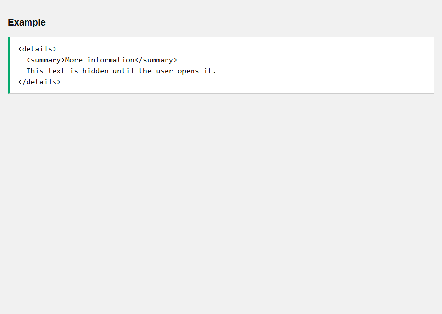

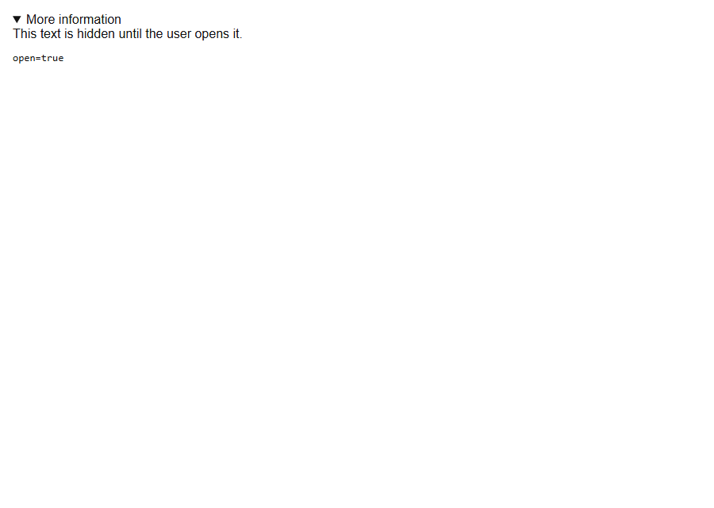

- [x] **Outcome:** With `open` set for the snapshot, the extra text is visible; `open` is **true**.

<a id="html-first-features-example-02"></a>

### **Example 2: HTML form validation attributes**

- [x] `required`, `minlength`, `maxlength`, `pattern` run **in the browser** before submit.
- [x] The Register form checks username + email automatically.
- [x] JS is optional for extra messages; the constraint API still works without it.

Sandbox: `code_sandbox/html-first-features/form-validation-native.html`

```html
<form>
  <label>Username: <input name="user" required minlength="3"></label>
  <label>Email: <input name="email" type="email" required></label>
  <button>Register</button>
</form>
```

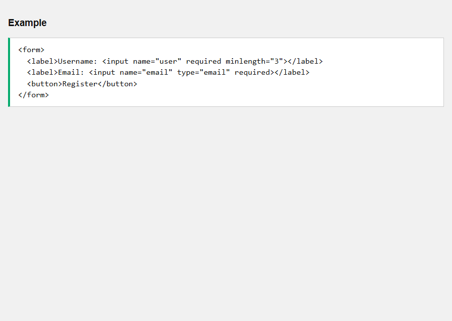

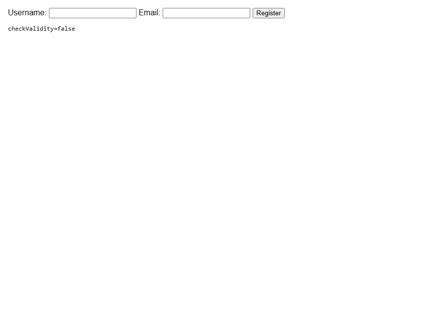

- [x] **Outcome:** Empty fields: `checkValidity()` is **false**. The browser would block Register.

<a id="html-first-features-example-03"></a>

### **Example 3: Input type — email**

- [x] `type="email"` adds format checking and a friendlier **mobile keyboard**.
- [x] Invalid strings set `typeMismatch`.
- [x] Listed on the page as a common native type.

Sandbox: `code_sandbox/html-first-features/type-email.html`

```html
<input id="e" type="email" value="not-an-email">
```


- [x] **Outcome:** **not-an-email** is invalid: `typeMismatch` is **true**.

<a id="html-first-features-example-04"></a>

### **Example 4: Input type — number**

- [x] `type="number"` is for numeric values; combine with `min`/`max`/`step`.
- [x] Some mobile browsers show a numeric keypad.
- [x] Non-numeric input is rejected by the control.

Sandbox: `code_sandbox/html-first-features/type-number.html`

```html
<input id="n" type="number" min="1" value="3">
```

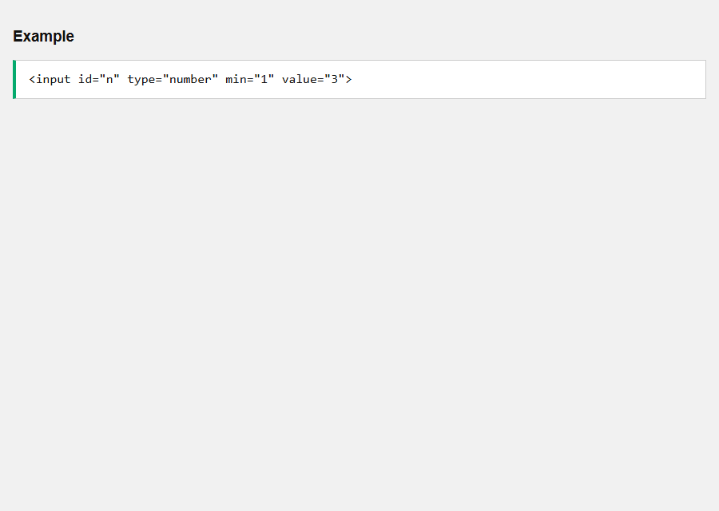


- [x] **Outcome:** Value **3** with `min=1` is **valid**.

<a id="html-first-features-example-05"></a>

### **Example 5: Input type — date (Birthday example)**

- [x] `type="date"` shows a date picker in supporting browsers.
- [x] W3Schools Birthday field is this control.
- [x] The value is `yyyy-mm-dd` when set.

Sandbox: `code_sandbox/html-first-features/type-date.html`

```html
<label>Birthday: <input id="b" type="date" value="2000-01-31"></label>
```

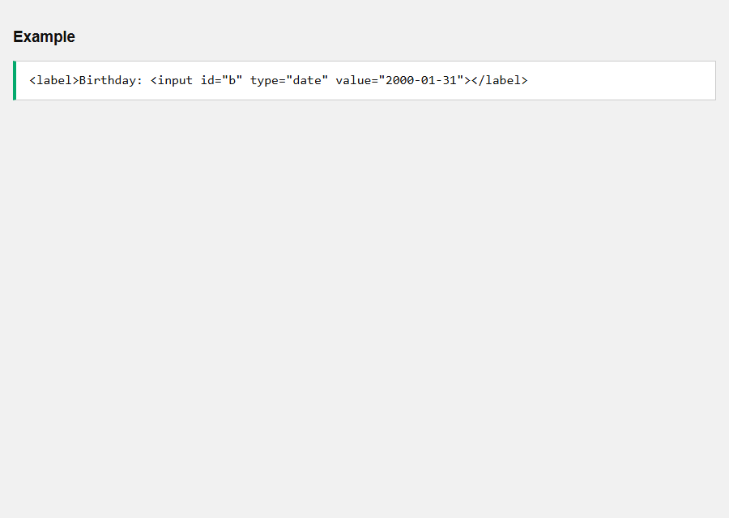

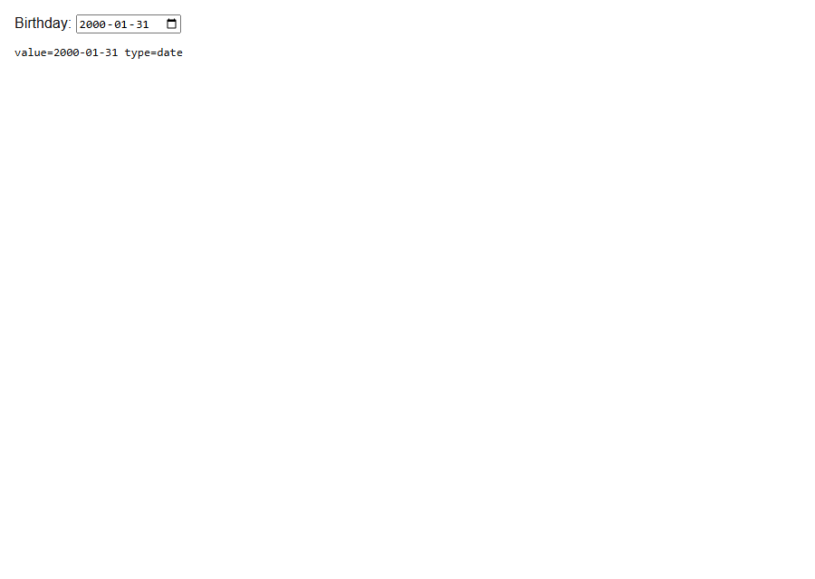

- [x] **Outcome:** The date input holds **2000-01-31**.

<a id="html-first-features-example-06"></a>

### **Example 6: Input type — url**

- [x] `type="url"` expects a full URL (usually including a scheme).
- [x] `example.com` without `https://` is often **invalid**.
- [x] Mobile keyboards may offer `/` and `.com` shortcuts.

Sandbox: `code_sandbox/html-first-features/type-url.html`

```html
<input id="u" type="url" value="https://example.com">
```


- [x] **Outcome:** `https://example.com` is **valid** for `type=url`.

<a id="html-first-features-example-07"></a>

### **Example 7: Input type — search**

- [x] `type="search"` looks like text but may show a **clear ×** and a search keyboard.
- [x] Semantics help password managers and AT less than `email`, but it is the dedicated search control.
- [x] Listed among the page’s input types.

Sandbox: `code_sandbox/html-first-features/type-search.html`

```html
<input id="s" type="search" value="html first">
```


- [x] **Outcome:** `type` reports **search** and the value is kept.

<a id="html-first-features-example-08"></a>

### **Example 8: The datalist element**

- [x] `<datalist>` suggests values; the user may **pick or type something else**.
- [x] Hook it up with `input list="id"` matching `datalist id`.
- [x] This is autocomplete **without** a JS widget.

Sandbox: `code_sandbox/html-first-features/datalist.html`

```html
<label>Choose a browser:
  <input list="browsers" name="browser">
</label>
<datalist id="browsers">
  <option value="Edge">
  <option value="Firefox">
  <option value="Chrome">
  <option value="Opera">
  <option value="Safari">
</datalist>
```

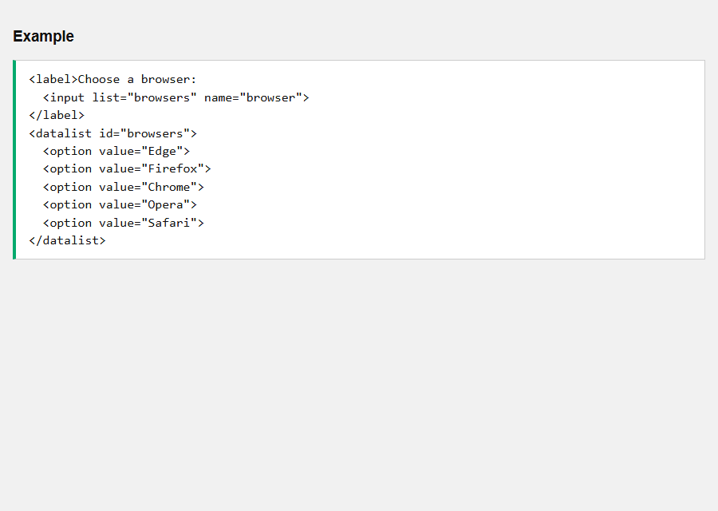


- [x] **Outcome:** The datalist has **5** options; the input’s `list` id is **browsers**.

<a id="html-first-features-example-09"></a>

### **Example 9: The dialog element**

- [x] `<dialog>` is a native modal/non-modal dialog.
- [x] Opening usually needs a **small** script: `dialog.show()` / `showModal()`. Closing: `close()`.
- [x] Behavior (focus trap, backdrop for modal) is **built into the browser** — not a JS overlay library.

Sandbox: `code_sandbox/html-first-features/dialog.html`

```html
<dialog id="d" open>
  This is an open dialog window.
</dialog>
```

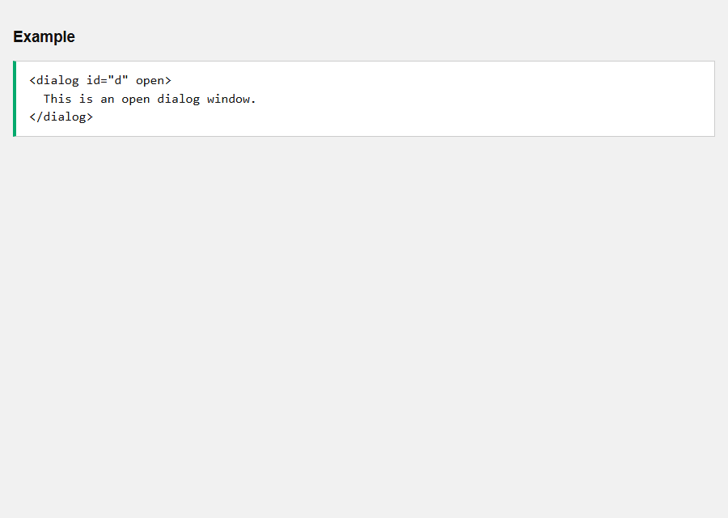

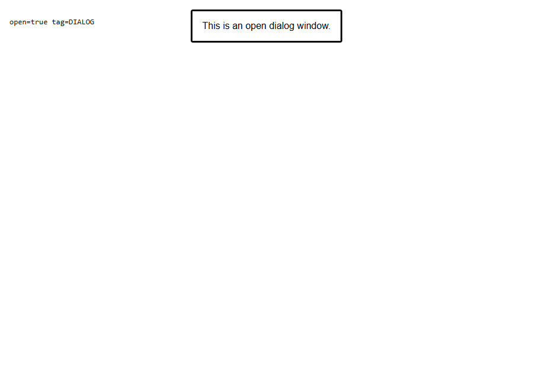

- [x] **Outcome:** The dialog is **open** in the snapshot (`open` attribute / `.open` true).

<a id="html-first-features-example-10"></a>

### **Example 10: Lazy loading images**

- [x] `loading="lazy"` defers off-screen images (and iframes) until near the viewport.
- [x] Native performance win — used to need IntersectionObserver JS.
- [x] W3Schools: use native HTML first; add JS only when native HTML cannot solve the problem.

Sandbox: `code_sandbox/html-first-features/lazy.html`

```html

```

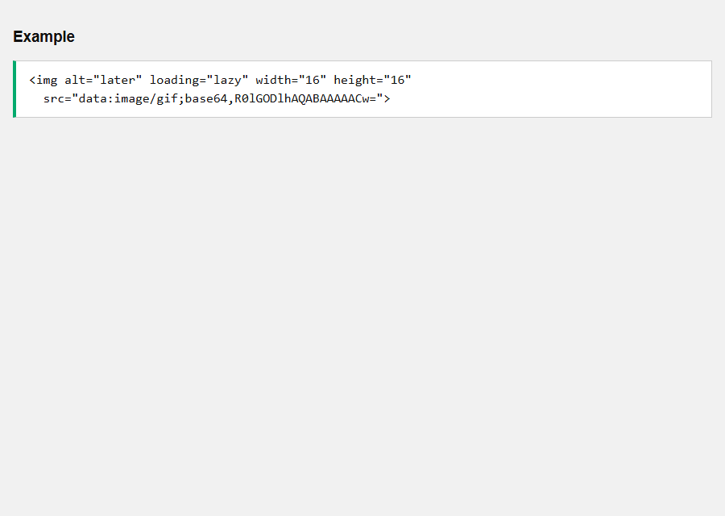


- [x] **Outcome:** `img.loading` is **lazy**.

<details>
  <summary>Terminal Commands</summary>

## Terminal Commands

```bash
# from Personal/Files/javascript/code_sandbox
py -3 -m http.server 8770 --bind 127.0.0.1
```

Then open `http://127.0.0.1:8770/html-first-features/`.

</details>

<details>
  <summary>Questions and Answers</summary>

## Questions and Answers

### Question 1: What tag pair makes an accordion without JS?

<details>
<summary>Answer</summary>

- [x] **`<details>`** and **`<summary>`**.

</details>

### Question 2: Which attributes validate a username of at least 3 characters?

<details>
<summary>Answer</summary>

- [x] **`required`** and **`minlength="3"`**.

</details>

### Question 3: Does the browser check `type="email"` without JS?

<details>
<summary>Answer</summary>

- [x] **Yes** — constraint validation is native.

</details>

### Question 4: What value format does `type="date"` use?

<details>
<summary>Answer</summary>

- [x] **`yyyy-mm-dd`**.

</details>

### Question 5: Can a user type a value that is not in a datalist?

<details>
<summary>Answer</summary>

- [x] **Yes** — suggestions are not a closed list.

</details>

### Question 6: How do you attach a datalist?

<details>
<summary>Answer</summary>

- [x] `input list="the-id"` matching **`<datalist id>`**.

</details>

### Question 7: Does `<dialog>` need JS?

<details>
<summary>Answer</summary>

- [x] A **little** to open/close (`showModal`/`close`); the widget itself is native.

</details>

### Question 8: What does `loading="lazy"` do?

<details>
<summary>Answer</summary>

- [x] Defers loading until the image is **near the viewport**.

</details>

### Question 9: Name two `type` values from the page list.

<details>
<summary>Answer</summary>

- [x] Any two of **email, number, date, url, search**.

</details>

### Question 10: When do you add JavaScript according to this page?

<details>
<summary>Answer</summary>

- [x] Only when **native HTML cannot** solve the problem.

</details>


</details>

## Summary

Reach for `details`, form attributes, input types, `datalist`, `dialog`, and `loading="lazy"` before writing a custom widget.

## References

- [HTML First Features](https://www.w3schools.com/js/js_htmlfirst_features.asp)
- [MDN Progressive enhancement](https://developer.mozilla.org/en-US/docs/Glossary/Progressive_Enhancement)

</details>

<details>
  <summary>HTML First CSS</summary>

## Introduction

After HTML, CSS handles hover, transitions, simple menus, responsive layout, and animations so you often do not need JavaScript for visual behavior.

This section has **6** examples:

- [x] **Example 1:** Hover effects with :hover [View](#html-first-css-example-01)
- [x] **Example 2:** CSS transitions [View](#html-first-css-example-02)
- [x] **Example 3:** Show and hide content with CSS (menu) [View](#html-first-css-example-03)
- [x] **Example 4:** Responsive layouts with media queries [View](#html-first-css-example-04)
- [x] **Example 5:** CSS animations — spinner [View](#html-first-css-example-05)
- [x] **Example 6:** When CSS is enough vs when you need JavaScript [View](#html-first-css-example-06)

## Detailed Explanation

- [x] :hover, transition, display toggling, grid + media queries, @keyframes.
- [x] Visual problems → CSS first.
- [x] Logic/data/network → JavaScript.

<a id="html-first-css-example-01"></a>

### **Example 1: Hover effects with :hover**

- [x] `:hover` changes an element when the pointer is over it — **no JS**.
- [x] W3Schools button goes from `#04AA6D` to `#059862`.
- [x] The snapshot adds class `forced` so the result image shows the hover colors (headless has no pointer).

Sandbox: `code_sandbox/html-first-css/hover.html`

```css
button:hover { background-color:#059862; }
<button>Hover Over Me</button>
```


- [x] **Outcome:** Forced hover style: background is the darker **#059862** green.

<a id="html-first-css-example-02"></a>

### **Example 2: CSS transitions**

- [x] `transition:width 0.5s` animates width changes smoothly.
- [x] Hover (or a class) sets `width:200px`; the browser tweens from 100px.
- [x] No `setInterval` — this is the CSS alternative to the DOM Animations chapter.

Sandbox: `code_sandbox/html-first-css/transition.html`

```css
 .box { width:100px; height:100px; background-color:#04AA6D; transition:width 0.5s; }
 .box:hover { width:200px; }
```

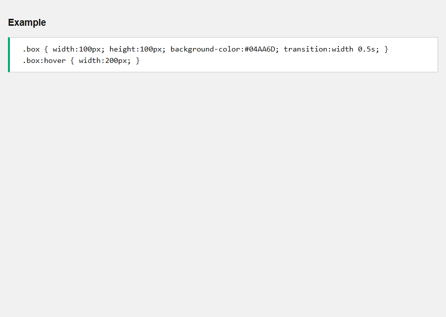


- [x] **Outcome:** With `.forced`, computed width is **200px** (end of the hover transition).

<a id="html-first-css-example-03"></a>

### **Example 3: Show and hide content with CSS (menu)**

- [x] `.menu-content { display:none }` then `.menu:hover .menu-content { display:block }`.
- [x] Simple menus/dropdowns without JS. Keyboard users may still need a focus-based variant (`:focus-within`).
- [x] The snapshot forces the open state so **Link 1 / Link 2** are visible.

Sandbox: `code_sandbox/html-first-css/show-hide.html`

```css
 .menu-content { display:none; }
 .menu:hover .menu-content { display:block; }
<div class="menu">Menu
  <div class="menu-content">Link 1<br>Link 2</div>
</div>
```

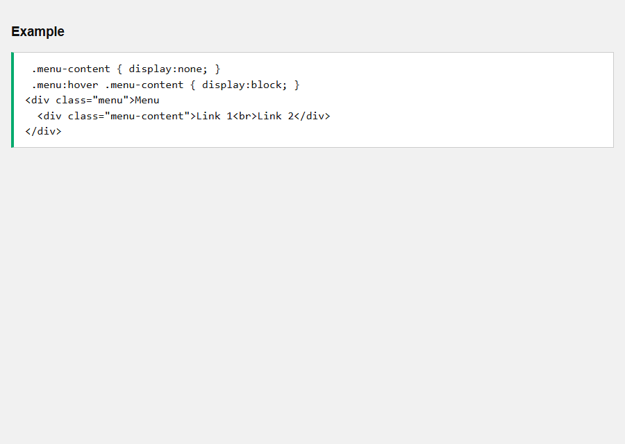

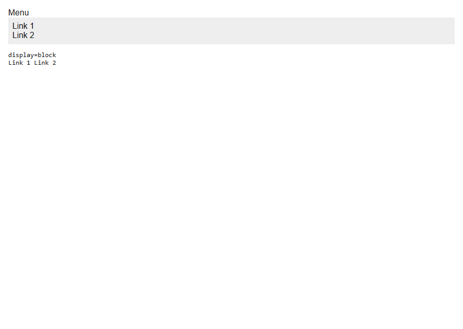

- [x] **Outcome:** Forced open menu: the content `display` is **block** and the links are in the tree.

<a id="html-first-css-example-04"></a>

### **Example 4: Responsive layouts with media queries**

- [x] CSS Grid `1fr 1fr 1fr` becomes **one column** at `max-width:600px`.
- [x] No JS breakpoint listeners (`matchMedia` is optional, not required).
- [x] The snapshot reports the computed `grid-template-columns` at this window size (900px wide chrome → three columns).

Sandbox: `code_sandbox/html-first-css/responsive-grid.html`

```css
 .container { display:grid; grid-template-columns:1fr 1fr 1fr; gap:16px; }
 @media (max-width:600px) {
   .container { grid-template-columns:1fr; }
 }
```

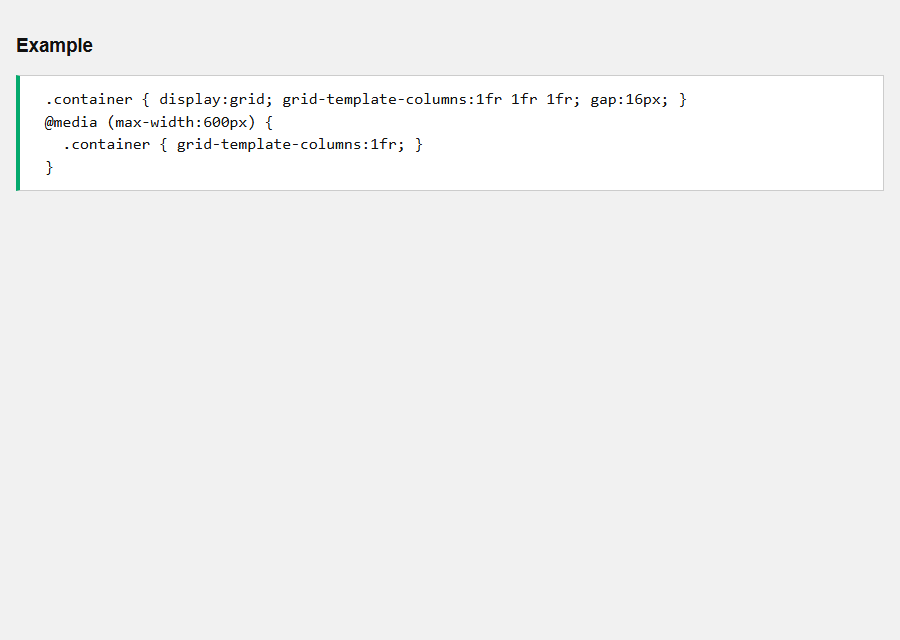

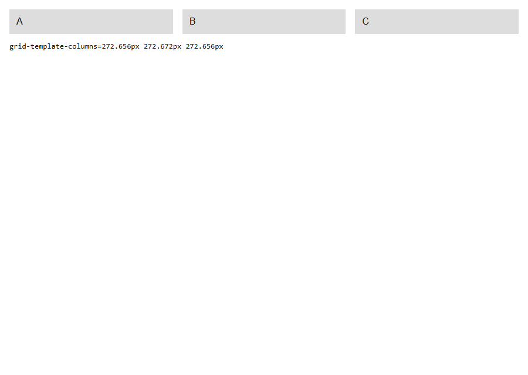

- [x] **Outcome:** At 900px screenshot width the grid stays **three columns**. Shrink below 600px and it becomes one (the media query).

<a id="html-first-css-example-05"></a>

### **Example 5: CSS animations — spinner**

- [x] `@keyframes spin` + `animation: spin 1s linear infinite` rotates forever **without JS**.
- [x] This is the CSS answer to a loading indicator.
- [x] The snapshot waits so you can see the spinner mid-rotation.

Sandbox: `code_sandbox/html-first-css/css-animation.html`

```css
 .spinner {
   width:40px; height:40px;
   border:6px solid #ddd;
   border-top:6px solid #04AA6D;
   border-radius:50%;
   animation:spin 1s linear infinite;
 }
 @keyframes spin { to { transform:rotate(360deg); } }
```

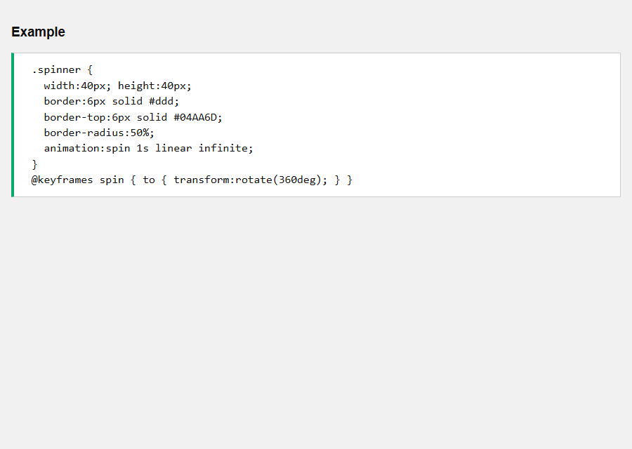


- [x] **Outcome:** Computed `animation-name` is **spin** and the box is a 40px circle.

<a id="html-first-css-example-06"></a>

### **Example 6: When CSS is enough vs when you need JavaScript**

- [x] CSS is enough for **visual** change: color, size, spacing, layout, motion, simple show/hide.
- [x] JavaScript is for **logic**, data, storage, and server communication.
- [x] W3Schools: “If the problem is visual, try CSS first.”

Sandbox: `code_sandbox/html-first-css/when-css-enough.html`

```html
<p>Visual → CSS. Logic/data/network → JS.</p>
```


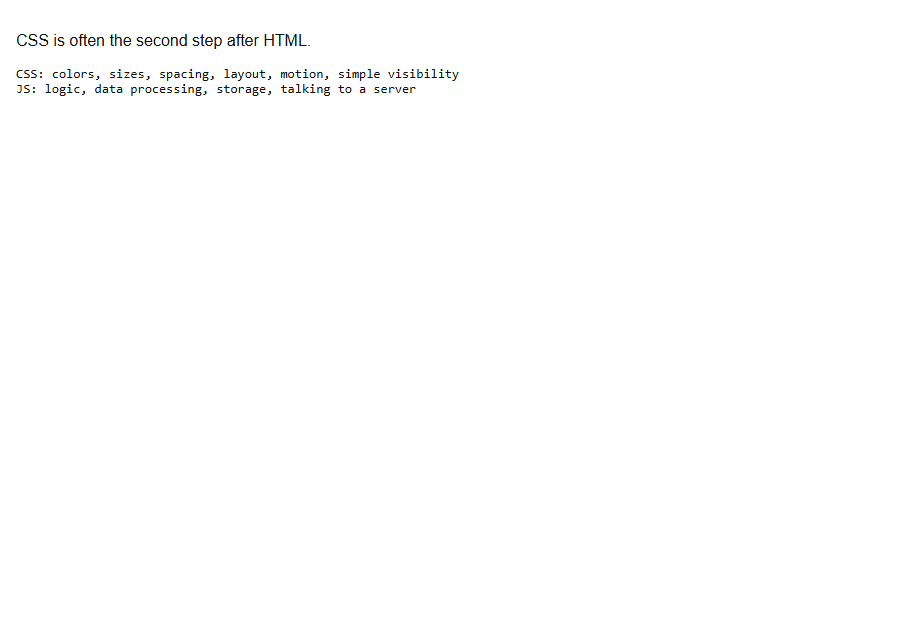

- [x] **Outcome:** The snapshot prints the split: **visual → CSS**, **logic → JS**.

<details>
  <summary>Terminal Commands</summary>

## Terminal Commands

```bash
# from Personal/Files/javascript/code_sandbox
py -3 -m http.server 8770 --bind 127.0.0.1
```

Then open `http://127.0.0.1:8770/html-first-css/`.

</details>

<details>
  <summary>Questions and Answers</summary>

## Questions and Answers

### Question 1: How do you restyle a button on hover without JS?

<details>
<summary>Answer</summary>

- [x] A **`:hover`** rule.

</details>

### Question 2: What property animates the box width?

<details>
<summary>Answer</summary>

- [x] **`transition: width 0.5s`** (plus a hover width).

</details>

### Question 3: How does the CSS menu show links?

<details>
<summary>Answer</summary>

- [x] `.menu:hover .menu-content { display:block }` after hiding with **`display:none`**.

</details>

### Question 4: How do you change columns for small screens?

<details>
<summary>Answer</summary>

- [x] A **`@media (max-width:600px)`** rule that sets **one** grid column.

</details>

### Question 5: Does the spinner use `setInterval`?

<details>
<summary>Answer</summary>

- [x] **No** — **`@keyframes`** + the **`animation`** property.

</details>

### Question 6: When is CSS the right tool?

<details>
<summary>Answer</summary>

- [x] When the change is **visual** (color, layout, motion, simple hide).

</details>

### Question 7: When is JS required?

<details>
<summary>Answer</summary>

- [x] **Logic**, data, **storage**, or **server** communication.

</details>

### Question 8: What is the page’s closing advice?

<details>
<summary>Answer</summary>

- [x] If the problem is visual, **try CSS first**.

</details>

### Question 9: Why force a `.forced` class in the sandbox?

<details>
<summary>Answer</summary>

- [x] Headless screenshots have **no pointer**, so `:hover` would not apply; the class duplicates the hover rule.

</details>

### Question 10: Can CSS replace `myMove()` from DOM Animations?

<details>
<summary>Answer</summary>

- [x] For many motions **yes** — transitions/animations. JS timers are for logic-driven motion.

</details>


</details>

## Summary

If the change is visual, write CSS. Save JavaScript for behavior that CSS cannot express.

## References

- [HTML First CSS](https://www.w3schools.com/js/js_htmlfirst_css.asp)
- [MDN Progressive enhancement](https://developer.mozilla.org/en-US/docs/Glossary/Progressive_Enhancement)

</details>

<details>
  <summary>JS Window</summary>

## Introduction

The Window object is the browser’s global. The BOM (Browser Object Model) is how JavaScript talks to the browser itself: size, tabs, and the objects hanging off `window`.

This section has **7** examples:

- [x] **Example 1:** window.document is the same object as document [View](#js-window-example-01)
- [x] **Example 2:** window.innerWidth — viewport width in pixels [View](#js-window-example-02)
- [x] **Example 3:** window.innerHeight — viewport height in pixels [View](#js-window-example-03)
- [x] **Example 4:** window.open() — open a new window [View](#js-window-example-04)
- [x] **Example 5:** window.close() — close the current window [View](#js-window-example-05)
- [x] **Example 6:** window.moveTo() — move the current window [View](#js-window-example-06)
- [x] **Example 7:** window.resizeTo() — resize the current window [View](#js-window-example-07)

## Detailed Explanation

- [x] `document` is `window.document`.
- [x] `innerWidth` / `innerHeight` are the viewport.
- [x] `open` / `close` / `moveTo` / `resizeTo` are legacy window controls and are often blocked.

<a id="js-window-example-01"></a>

### **Example 1: window.document is the same object as document**

- [x] The **BOM** (Browser Object Model) is everything the browser exposes besides the page tree.
- [x] The **Window** object is the global. All global variables and functions become properties/methods of `window`.
- [x] The HTML DOM `document` is a **property** of `window`. `window.document.getElementById` and `document.getElementById` are the same call.
- [x] You may omit `window.` for globals. `window` itself cannot be omitted if you need the Window object (size, open, …).

Sandbox: `code_sandbox/js-window/window-document.html`

```html
window.document.getElementById("header");
document.getElementById("header");
```

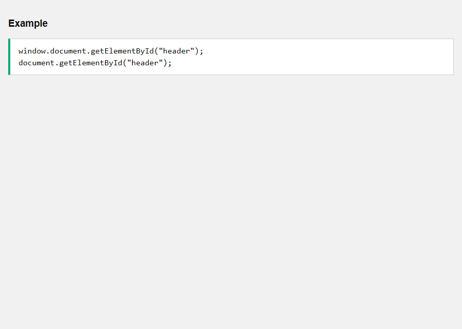


- [x] **Outcome:** `window.document === document` is **true**. Both lookups find the same **header** element.

<a id="js-window-example-02"></a>

### **Example 2: window.innerWidth — viewport width in pixels**

- [x] `window.innerWidth` is the **inner** width of the browser window (the viewport), in CSS pixels.
- [x] It does **not** include toolbars, window chrome, or (usually) the vertical scrollbar gutter the same way `outerWidth` does.
- [x] The W3Schools Tryit stores `let w = window.innerWidth` then writes it to the page.
- [x] This value changes when the user resizes the window or rotates a phone.

Sandbox: `code_sandbox/js-window/inner-width.html`

```html
let w = window.innerWidth;
```


- [x] **Outcome:** The snapshot window is **900px** wide, so `innerWidth` reports **900** (or very close).

<a id="js-window-example-03"></a>

### **Example 3: window.innerHeight — viewport height in pixels**

- [x] `window.innerHeight` is the **inner** height of the viewport, not including browser UI.
- [x] W3Schools pairs it with `innerWidth` in one Tryit: `let h = window.innerHeight`.
- [x] Use these — not `screen.height` — when you care about **how much page is visible**.
- [x] Headless screenshots use `--window-size=900,640`, so height is in that neighborhood.

Sandbox: `code_sandbox/js-window/inner-height.html`

```html
let h = window.innerHeight;
```

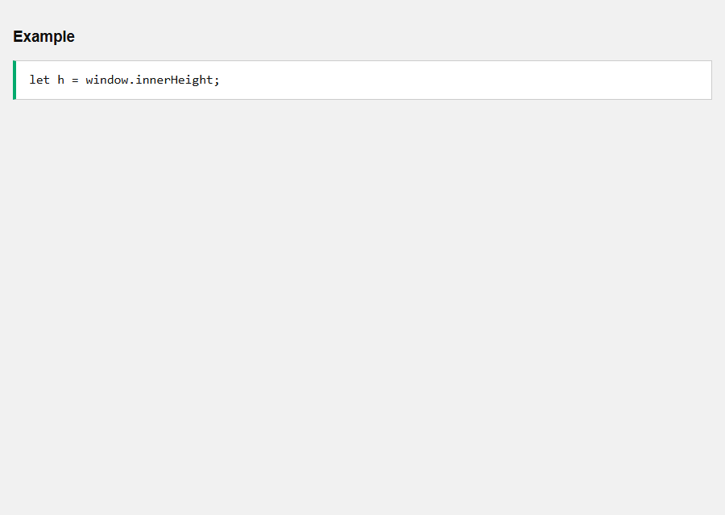


- [x] **Outcome:** `innerHeight` is a positive pixel count for the visible viewport (around **640** in this snap).

<a id="js-window-example-04"></a>

### **Example 4: window.open() — open a new window**

- [x] `window.open(url)` asks the browser to open **another** browsing context (tab or popup).
- [x] Popup blockers often return **`null`** if the call is not tied to a user gesture.
- [x] Always check the return value before calling methods on it.
- [x] The snapshot calls `open` without a click, so a blocker is likely — that is the realistic result.

Sandbox: `code_sandbox/js-window/open.html`

```html
window.open() - open a new window
```


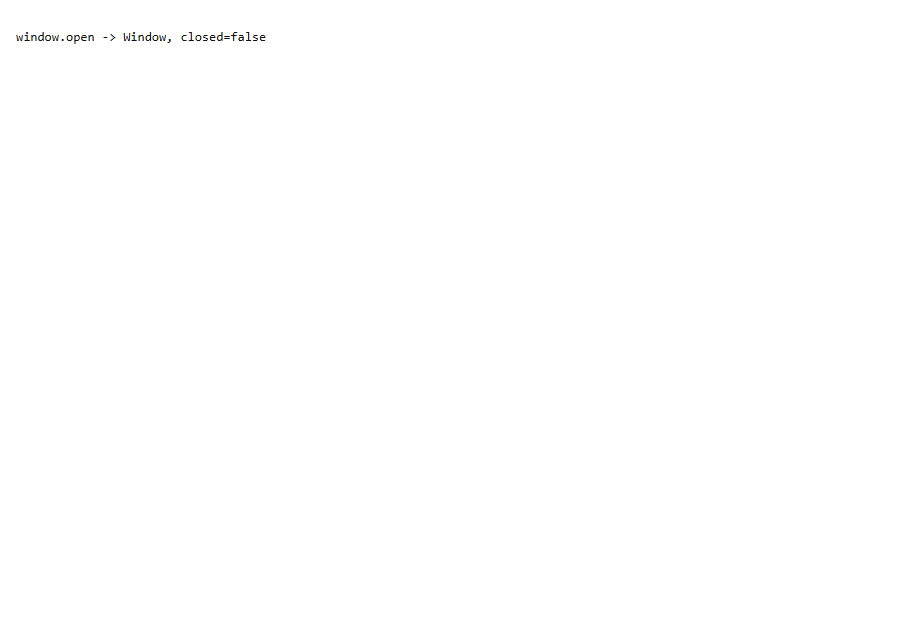

- [x] **Outcome:** The call returns either a **Window** or **`null`** (blocked). The snapshot reports which happened.

<a id="js-window-example-05"></a>

### **Example 5: window.close() — close the current window**

- [x] `window.close()` closes **this** window, but browsers only allow it for windows **your script opened** with `open()`.
- [x] Calling it on a tab the user opened themselves is ignored (or prompts).
- [x] Do not put `close()` in onload — it will not do what tutorial snippets imply on a normal tab.
- [x] The snapshot does **not** close the page; it only proves the method exists.

Sandbox: `code_sandbox/js-window/close.html`

```html
window.close() - close the current window
```


- [x] **Outcome:** `typeof window.close` is **function**. The page stays open so the snapshot can be taken.

<a id="js-window-example-06"></a>

### **Example 6: window.moveTo() — move the current window**

- [x] `window.moveTo(x, y)` moves the **window** to screen coordinates.
- [x] Modern browsers **ignore** this for ordinary tabs (only some popup windows allow it).
- [x] Treat it as a legacy BOM method, not something you should rely on.
- [x] The snapshot calls it and then reports `screenX`/`screenY` (often unchanged).

Sandbox: `code_sandbox/js-window/move-to.html`

```html
window.moveTo() - move the current window
```


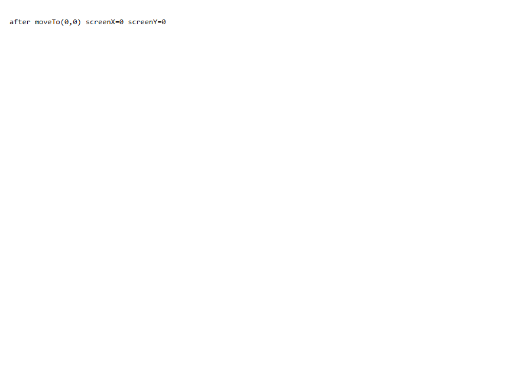

- [x] **Outcome:** After `moveTo(0, 0)`, `screenX`/`screenY` are reported. Tabs usually **do not move**.

<a id="js-window-example-07"></a>

### **Example 7: window.resizeTo() — resize the current window**

- [x] `window.resizeTo(width, height)` resizes the **outer** window.
- [x] Like `moveTo`, this is **blocked** for most tabs.
- [x] Prefer CSS layout and `innerWidth` over trying to resize the browser.
- [x] The snapshot calls `resizeTo(800, 600)` and reports inner size (typically unchanged).

Sandbox: `code_sandbox/js-window/resize-to.html`

```html
window.resizeTo() - resize the current window
```


- [x] **Outcome:** `resizeTo` is a function; the viewport size after the call is still the screenshot window.

<details>
  <summary>Terminal Commands</summary>

## Terminal Commands

```bash
# from Personal/Files/javascript/code_sandbox
py -3 -m http.server 8770 --bind 127.0.0.1
```

Then open `http://127.0.0.1:8770/js-window/`.

</details>

<details>
  <summary>Questions and Answers</summary>

## Questions and Answers

### Question 1: What is the BOM?

<details>
<summary>Answer</summary>

- [x] The **Browser Object Model** — `window` and objects it owns (`document`, `location`, `history`, `navigator`, `screen`).

</details>

### Question 2: Are `document` and `window.document` different?

<details>
<summary>Answer</summary>

- [x] **No** — `document` is a property of `window`; they are the **same** object.

</details>

### Question 3: What does `innerWidth` measure?

<details>
<summary>Answer</summary>

- [x] The **viewport** width in pixels, not the monitor and not browser chrome.

</details>

### Question 4: Does `innerHeight` include toolbars?

<details>
<summary>Answer</summary>

- [x] **No** — it is the inner viewport height.

</details>

### Question 5: What does `window.open` return if a popup is blocked?

<details>
<summary>Answer</summary>

- [x] **`null`** (or a closed window). Always check before using it.

</details>

### Question 6: Can you `close()` any tab?

<details>
<summary>Answer</summary>

- [x] **No** — browsers only let scripts close windows they **opened**.

</details>

### Question 7: Do `moveTo` and `resizeTo` work on normal tabs?

<details>
<summary>Answer</summary>

- [x] Usually **no** — they are ignored except for some script-opened popups.

</details>

### Question 8: Can you omit the `window.` prefix?

<details>
<summary>Answer</summary>

- [x] **Yes** for globals (`document`, `alert`). Use `window` when you mean the Window object itself.

</details>

### Question 9: What becomes a property of `window`?

<details>
<summary>Answer</summary>

- [x] **Global variables** (and global functions become **methods**).

</details>

### Question 10: Which size should you use for “visible page”?

<details>
<summary>Answer</summary>

- [x] **`innerWidth` / `innerHeight`**, not `screen.width`.

</details>


</details>

## Summary

Treat `window` as the global. Read viewport size with innerWidth/innerHeight. Do not depend on open/move/resize in ordinary tabs.

## References

- [JS Window](https://www.w3schools.com/js/js_window.asp)
- [MDN Window](https://developer.mozilla.org/en-US/docs/Web/API/Window)

</details>

<details>
  <summary>JS Screen</summary>

## Introduction

`window.screen` describes the visitor’s monitor: width, height, available area, and color depth — not the browser viewport.

This section has **6** examples:

- [x] **Example 1:** screen.width — visitor screen width [View](#js-screen-example-01)
- [x] **Example 2:** screen.height — visitor screen height [View](#js-screen-example-02)
- [x] **Example 3:** screen.availWidth — width minus OS chrome [View](#js-screen-example-03)
- [x] **Example 4:** screen.availHeight — height minus OS chrome [View](#js-screen-example-04)
- [x] **Example 5:** screen.colorDepth — bits per color [View](#js-screen-example-05)
- [x] **Example 6:** screen.pixelDepth — bits per pixel [View](#js-screen-example-06)

## Detailed Explanation

- [x] `screen` can be written without `window.`.
- [x] avail* subtracts OS chrome such as a taskbar.
- [x] colorDepth / pixelDepth are usually 24 or 32 today.

<a id="js-screen-example-01"></a>

### **Example 1: screen.width — visitor screen width**

- [x] `window.screen` (or just `screen`) describes the **monitor**, not the browser viewport.
- [x] `screen.width` is the full screen width in pixels.
- [x] This is **not** the same as `window.innerWidth` (the tab).
- [x] W3Schools writes: `Screen Width: ` + `screen.width`.

Sandbox: `code_sandbox/js-screen/width.html`

```html
document.getElementById("demo").innerHTML = "Screen Width: " + screen.width;
```

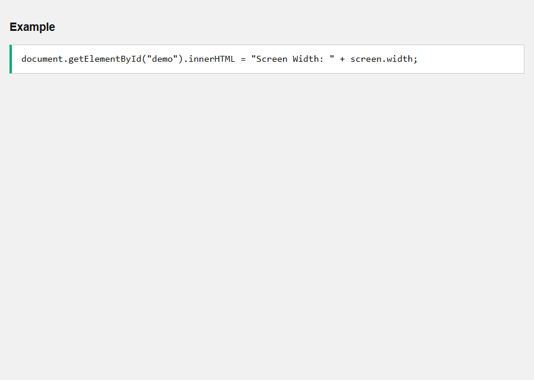


- [x] **Outcome:** The page prints **Screen Width:** followed by this machine’s pixel width.

<a id="js-screen-example-02"></a>

### **Example 2: screen.height — visitor screen height**

- [x] `screen.height` is the full screen height in pixels.
- [x] It includes areas covered by the taskbar in the **total** height (unlike `availHeight`).
- [x] Use it for “how big is the display?”, not “how big is my page?”.

Sandbox: `code_sandbox/js-screen/height.html`

```html
document.getElementById("demo").innerHTML = "Screen Height: " + screen.height;
```


- [x] **Outcome:** The page prints **Screen Height:** and the monitor height in pixels.

<a id="js-screen-example-03"></a>

### **Example 3: screen.availWidth — width minus OS chrome**

- [x] `availWidth` subtracts **interface features** such as a Windows taskbar if it reduces usable width.
- [x] On many desktops it equals `screen.width` because the taskbar is on the bottom.
- [x] On a vertical taskbar it can be smaller than `width`.

Sandbox: `code_sandbox/js-screen/avail-width.html`

```html
document.getElementById("demo").innerHTML = "Available Screen Width: " + screen.availWidth;
```


- [x] **Outcome:** **Available Screen Width:** is `availWidth` (≤ `screen.width`).

<a id="js-screen-example-04"></a>

### **Example 4: screen.availHeight — height minus OS chrome**

- [x] `availHeight` is height minus the taskbar (and similar OS UI).
- [x] Typically `availHeight < height` when a bottom taskbar is present.
- [x] This is still **not** the browser viewport — that is `innerHeight`.

Sandbox: `code_sandbox/js-screen/avail-height.html`

```html
document.getElementById("demo").innerHTML = "Available Screen Height: " + screen.availHeight;
```

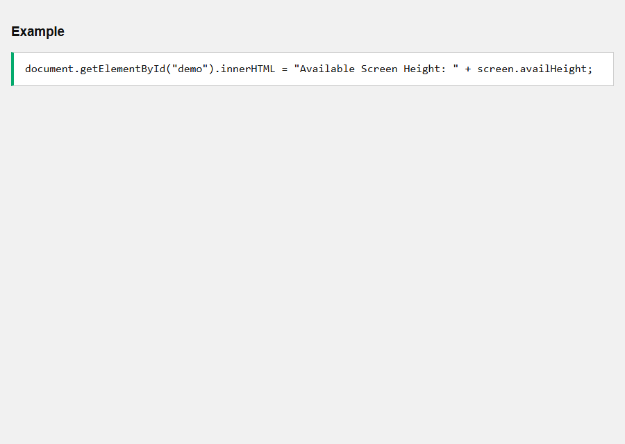


- [x] **Outcome:** **Available Screen Height:** is `availHeight` (often less than `screen.height`).

<a id="js-screen-example-05"></a>

### **Example 5: screen.colorDepth — bits per color**

- [x] `colorDepth` is how many bits are used to display one color.
- [x] Modern displays: **24** (“True Color”, 16,777,216 colors) or **32** (“Deep Color”).
- [x] Older: **16** High Color; very old: **8** VGA (256 colors).
- [x] 32-bit often still means 24-bit color plus 8-bit alpha at the hardware level — the property still reports 24 or 32.

Sandbox: `code_sandbox/js-screen/color-depth.html`

```html
document.getElementById("demo").innerHTML = "Screen Color Depth: " + screen.colorDepth;
```

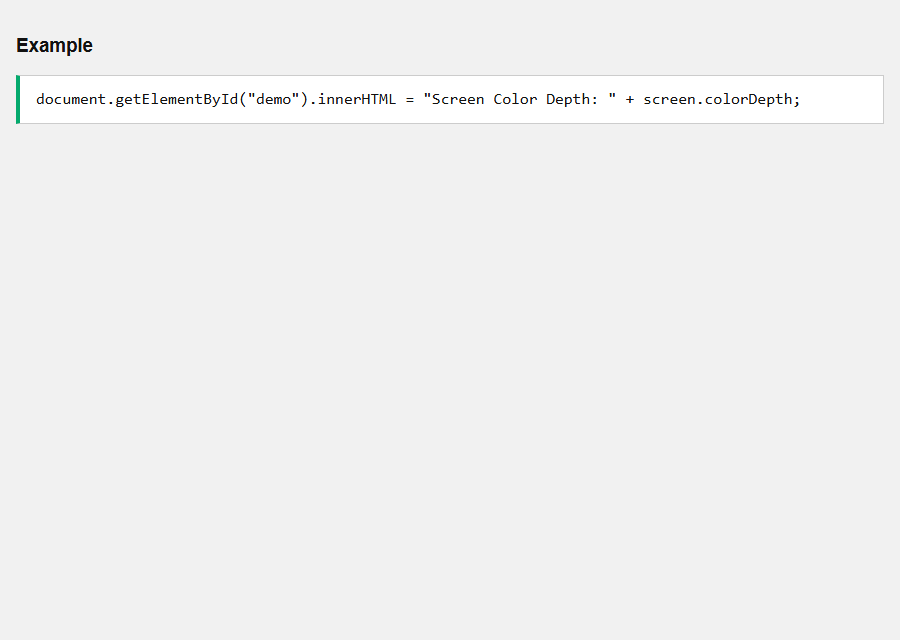


- [x] **Outcome:** **Screen Color Depth:** is typically **24** or **32** on a current machine.

<a id="js-screen-example-06"></a>

### **Example 6: screen.pixelDepth — bits per pixel**

- [x] `pixelDepth` is the bit depth of the screen.
- [x] On modern browsers it is usually **the same number as `colorDepth`**.
- [x] Do not use either property to detect “the user’s device type” — they are about color, not phone vs desktop.

Sandbox: `code_sandbox/js-screen/pixel-depth.html`

```html
document.getElementById("demo").innerHTML = "Screen Pixel Depth: " + screen.pixelDepth;
```


- [x] **Outcome:** **Screen Pixel Depth:** matches this display’s reported bit depth (often equal to `colorDepth`).

<details>
  <summary>Terminal Commands</summary>

## Terminal Commands

```bash
# from Personal/Files/javascript/code_sandbox
py -3 -m http.server 8770 --bind 127.0.0.1
```

Then open `http://127.0.0.1:8770/js-screen/`.

</details>

<details>
  <summary>Questions and Answers</summary>

## Questions and Answers

### Question 1: Is `screen.width` the browser width?

<details>
<summary>Answer</summary>

- [x] **No** — it is the **monitor**. Use `innerWidth` for the viewport.

</details>

### Question 2: What does `availHeight` leave out?

<details>
<summary>Answer</summary>

- [x] OS UI such as the **taskbar**.

</details>

### Question 3: Typical modern `colorDepth`?

<details>
<summary>Answer</summary>

- [x] **24** or **32** bits.

</details>

### Question 4: How many colors is 24-bit?

<details>
<summary>Answer</summary>

- [x] **16,777,216** (“True Color”).

</details>

### Question 5: Can you skip the `window.` prefix?

<details>
<summary>Answer</summary>

- [x] **Yes** — `screen.width` is the same as `window.screen.width`.

</details>

### Question 6: Is `pixelDepth` usually different from `colorDepth`?

<details>
<summary>Answer</summary>

- [x] Usually **the same** on current browsers.

</details>

### Question 7: 16-bit color is called what on the page?

<details>
<summary>Answer</summary>

- [x] **High Color** (65,536 colors).

</details>

### Question 8: 8-bit color is called what?

<details>
<summary>Answer</summary>

- [x] **VGA colors** (256).

</details>

### Question 9: When would `availWidth` be smaller than `width`?

<details>
<summary>Answer</summary>

- [x] When a **vertical taskbar** (or similar) reduces usable width.

</details>

### Question 10: Which object is this page about?

<details>
<summary>Answer</summary>

- [x] **`window.screen`**.

</details>


</details>

## Summary

Use screen.* for the monitor and innerWidth/innerHeight for the tab. availHeight is often smaller than height because of the taskbar.

## References

- [JS Screen](https://www.w3schools.com/js/js_window_screen.asp)
- [MDN Screen](https://developer.mozilla.org/en-US/docs/Web/API/Screen)

</details>

<details>
  <summary>JS Location</summary>

## Introduction

`window.location` reads the current URL (href, hostname, pathname, protocol, port) and can load another document with `assign`.

This section has **6** examples:

- [x] **Example 1:** window.location.href — full URL of this page [View](#js-location-example-01)
- [x] **Example 2:** window.location.hostname — host name [View](#js-location-example-02)
- [x] **Example 3:** window.location.pathname — path and file name [View](#js-location-example-03)
- [x] **Example 4:** window.location.protocol — http: or https: [View](#js-location-example-04)
- [x] **Example 5:** window.location.port — host port number [View](#js-location-example-05)
- [x] **Example 6:** window.location.assign() — load a new document [View](#js-location-example-06)

## Detailed Explanation

- [x] Omit the `window.` prefix if you want: `location.href`.
- [x] `assign` adds history; `replace` does not.
- [x] Default ports often make `port` an empty string.

<a id="js-location-example-01"></a>

### **Example 1: window.location.href — full URL of this page**

- [x] `location` (or `window.location`) is the current **address** and a way to **navigate**.
- [x] `href` is the entire URL: protocol, host, port, path, query, hash.
- [x] Assigning to `href` loads a new page (same as clicking a link).
- [x] The sandbox is served from `http://127.0.0.1:8771/...` so `href` includes that.

Sandbox: `code_sandbox/js-location/href.html`

```html
document.getElementById("demo").innerHTML = "Page location is " + window.location.href;
```

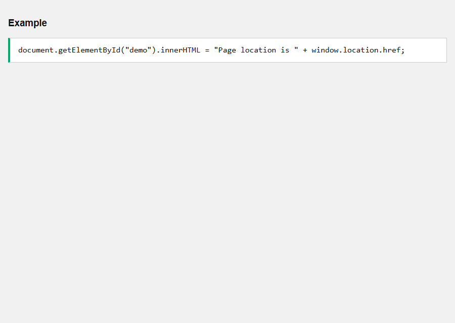

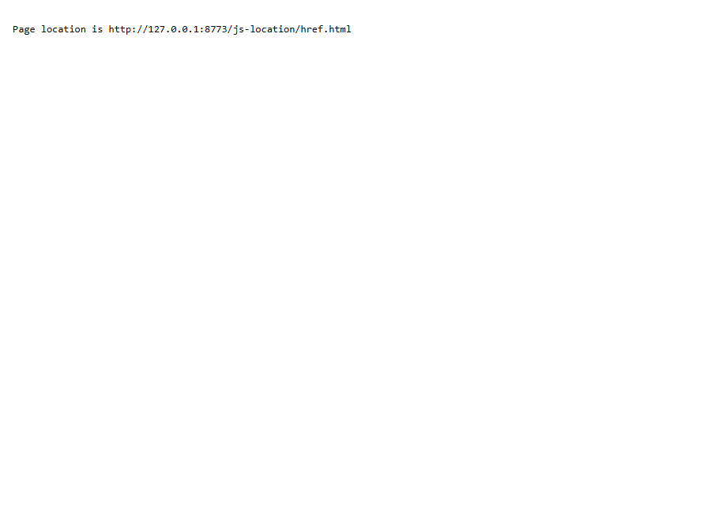

- [x] **Outcome:** **Page location is** the full sandbox URL (http, 127.0.0.1, port, path).

<a id="js-location-example-02"></a>

### **Example 2: window.location.hostname — host name**

- [x] `hostname` is the **domain** (or IP) without protocol or port.
- [x] On this sandbox it is **`127.0.0.1`**.
- [x] It does not include `:8771` — that is `port`.

Sandbox: `code_sandbox/js-location/hostname.html`

```html
document.getElementById("demo").innerHTML = "Page hostname is " + window.location.hostname;
```


- [x] **Outcome:** **Page hostname is 127.0.0.1** (or `localhost` if you used that host).

<a id="js-location-example-03"></a>

### **Example 3: window.location.pathname — path and file name**

- [x] `pathname` is the path after the host, starting with `/`.
- [x] It does **not** include the query string or hash.
- [x] Here it ends with the example file name under `/js-location/`.

Sandbox: `code_sandbox/js-location/pathname.html`

```html
document.getElementById("demo").innerHTML = "Page path is " + window.location.pathname;
```

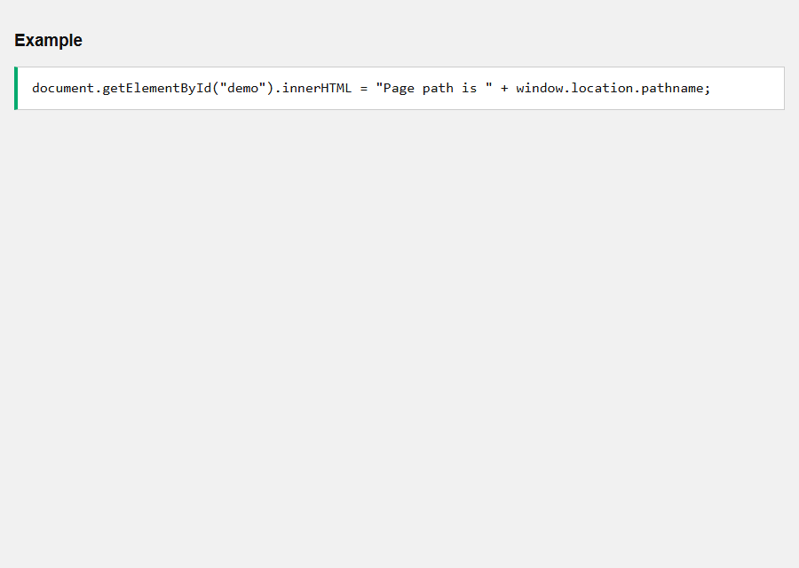


- [x] **Outcome:** **Page path is** `/js-location/pathname.html` (this file).

<a id="js-location-example-04"></a>

### **Example 4: window.location.protocol — http: or https:**

- [x] `protocol` includes the colon: **`http:`** or **`https:`**.
- [x] The sandbox server is not TLS, so this page is **`http:`**.
- [x] Use this if you need to know whether the page is secure.

Sandbox: `code_sandbox/js-location/protocol.html`

```html
document.getElementById("demo").innerHTML = "Page protocol is " + window.location.protocol;
```

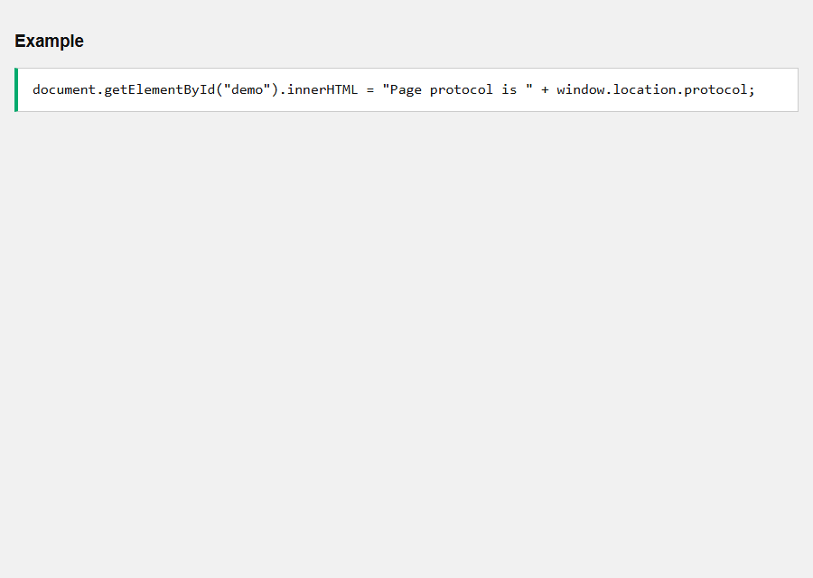


- [x] **Outcome:** **Page protocol is http:** on the local static server.

<a id="js-location-example-05"></a>

### **Example 5: window.location.port — host port number**

- [x] `port` is the port as a **string**. Default ports (80/443) are often **empty**.
- [x] This sandbox uses **8771**, so `port` is **`8771`**.
- [x] The W3Schools Tryit title says “Display the name of the host” but the code reads **`port`** — we follow the code.

Sandbox: `code_sandbox/js-location/port.html`

```html
document.getElementById("demo").innerHTML = "Port number is " + window.location.port;
```

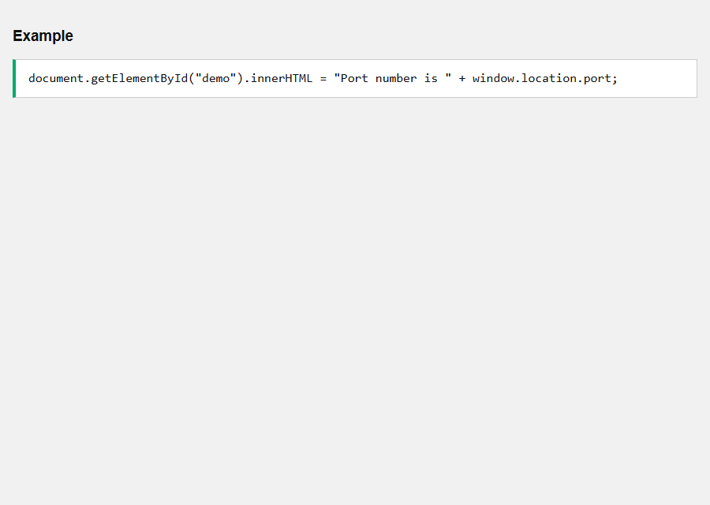


- [x] **Outcome:** **Port number is 8771** for this HTTP screenshot server.

<a id="js-location-example-06"></a>

### **Example 6: window.location.assign() — load a new document**

- [x] `assign(url)` loads `url` and **pushes** a history entry (Back can return).
- [x] `location.href = url` does the same for most purposes.
- [x] `replace(url)` also navigates but **does not** keep the current page in history.
- [x] The snapshot does **not** leave this page (that would blank the result). It shows the handler that *would* assign.

Sandbox: `code_sandbox/js-location/assign.html`

```html
<input type="button" value="Load new document" onclick="newDoc()">
<script>
function newDoc() {
  window.location.assign("https://www.w3schools.com");
}
</script>
```

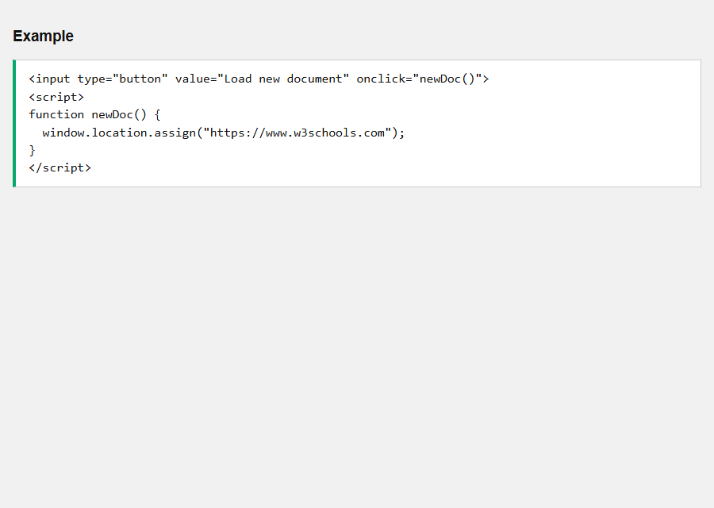

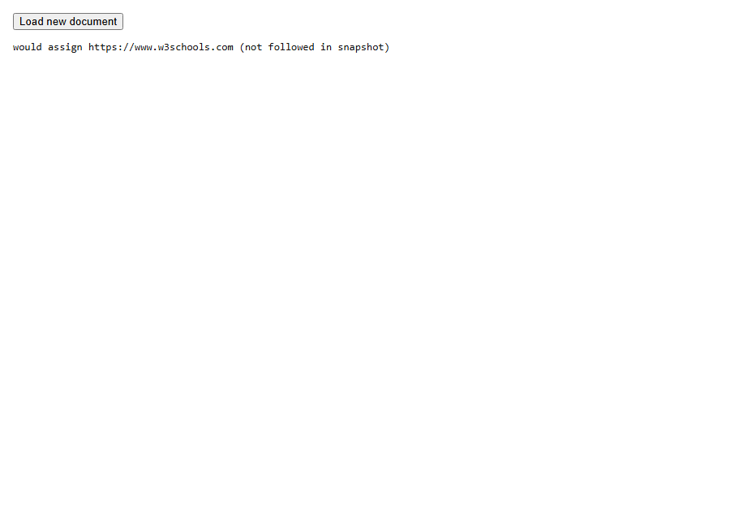

- [x] **Outcome:** The button is present; the snapshot prints that `newDoc` would **assign** `https://www.w3schools.com` rather than navigating away.

<details>
  <summary>Terminal Commands</summary>

## Terminal Commands

```bash
# from Personal/Files/javascript/code_sandbox
py -3 -m http.server 8770 --bind 127.0.0.1
```

Then open `http://127.0.0.1:8770/js-location/`.

</details>

<details>
  <summary>Questions and Answers</summary>

## Questions and Answers

### Question 1: What object reads the current URL?

<details>
<summary>Answer</summary>

- [x] **`window.location`** (also just `location`).

</details>

### Question 2: Which property is the full URL?

<details>
<summary>Answer</summary>

- [x] **`href`**.

</details>

### Question 3: Does `hostname` include the port?

<details>
<summary>Answer</summary>

- [x] **No** — port is **`location.port`**.

</details>

### Question 4: What does `pathname` start with?

<details>
<summary>Answer</summary>

- [x] A **slash**, e.g. `/js-location/pathname.html`.

</details>

### Question 5: What is `protocol` for this sandbox?

<details>
<summary>Answer</summary>

- [x] **`http:`** (colon included).

</details>

### Question 6: When is `port` an empty string?

<details>
<summary>Answer</summary>

- [x] When the URL uses the **default** port (80 or 443).

</details>

### Question 7: What does `assign` do to history?

<details>
<summary>Answer</summary>

- [x] It **adds** an entry so Back can return.

</details>

### Question 8: How is `replace` different?

<details>
<summary>Answer</summary>

- [x] It **overwrites** the current history entry.

</details>

### Question 9: Name three location properties from the page.

<details>
<summary>Answer</summary>

- [x] Any three of **href, hostname, pathname, protocol, port**.

</details>

### Question 10: Does assigning `href` load a new page?

<details>
<summary>Answer</summary>

- [x] **Yes** — it navigates.

</details>


</details>

## Summary

Read location.href for the full URL and the other properties for the pieces. assign() navigates; do not call it if you still need the current page.

## References

- [JS Location](https://www.w3schools.com/js/js_window_location.asp)
- [MDN Location](https://developer.mozilla.org/en-US/docs/Web/API/Location)

</details>

<details>
  <summary>JS History</summary>

## Introduction

The History API is Back/Forward (`back`, `forward`, `go`) plus SPA tools: `pushState`, `replaceState`, `state`, `popstate`, and `scrollRestoration`.

This section has **15** examples:

- [x] **Example 1:** history.back() — previous session entry [View](#js-history-example-01)
- [x] **Example 2:** history.forward() — next session entry [View](#js-history-example-02)
- [x] **Example 3:** history.go(-2) — two steps back [View](#js-history-example-03)
- [x] **Example 4:** history.go(1) — one step forward [View](#js-history-example-04)
- [x] **Example 5:** history.go(0) reloads the current page [View](#js-history-example-05)
- [x] **Example 6:** history.length — number of session entries [View](#js-history-example-06)
- [x] **Example 7:** history.state is null until pushState/replaceState [View](#js-history-example-07)
- [x] **Example 8:** history.pushState(state, "", url) [View](#js-history-example-08)
- [x] **Example 9:** pushState does not load a new page [View](#js-history-example-09)
- [x] **Example 10:** history.replaceState(state, "", url) [View](#js-history-example-10)
- [x] **Example 11:** replaceState does not load a new page [View](#js-history-example-11)
- [x] **Example 12:** popstate fires on Back/Forward [View](#js-history-example-12)
- [x] **Example 13:** popstate event.state [View](#js-history-example-13)
- [x] **Example 14:** Simple History API example (Home / About) [View](#js-history-example-14)
- [x] **Example 15:** history.scrollRestoration [View](#js-history-example-15)

## Detailed Explanation

- [x] `pushState` / `replaceState` do not load a document.
- [x] `popstate` fires on Back/Forward, not on pushState itself.
- [x] `state` is null until you store an object.

<a id="js-history-example-01"></a>

### **Example 1: history.back() — previous session entry**

- [x] `history.back()` is the same as the browser **Back** button.
- [x] It loads the previous **session history** entry (may be another site).
- [x] There is no previous page in this snapshot, so we do not call it (it would leave or no-op).
- [x] The button in the Tryit is `onclick="history.back()"`.

Sandbox: `code_sandbox/js-history/back.html`

```html
<button onclick="history.back()">Go Back</button>
```


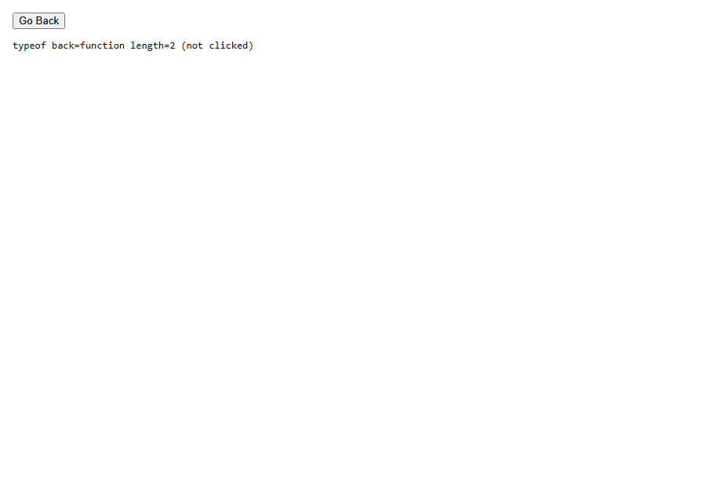

- [x] **Outcome:** The **Go Back** button is in the page. `typeof history.back` is **function**; it is not invoked here.

<a id="js-history-example-02"></a>

### **Example 2: history.forward() — next session entry**

- [x] `history.forward()` is the **Forward** button.
- [x] It only works if the user already went Back (there is a “next” entry).
- [x] Equivalent to `history.go(1)`.

Sandbox: `code_sandbox/js-history/forward.html`

```html
<button onclick="history.forward()">Go Forward</button>
```


- [x] **Outcome:** **Go Forward** is wired to `history.forward`. The snapshot does not navigate away.

<a id="js-history-example-03"></a>

### **Example 3: history.go(-2) — two steps back**

- [x] `go(delta)` moves **relative** to the current entry.
- [x] `go(-2)` is “back two pages”.
- [x] If there are not enough entries, the call does nothing useful.

Sandbox: `code_sandbox/js-history/go-back-two.html`

```html
<button onclick="history.go(-2)">Go Back</button>
```


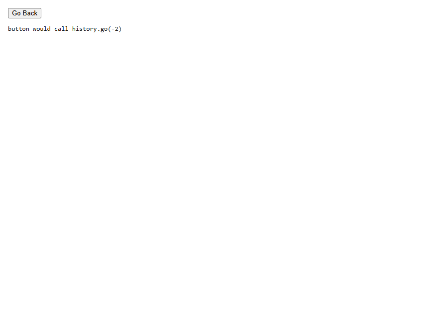

- [x] **Outcome:** The button would call **`history.go(-2)`**. Not clicked in the snapshot.

<a id="js-history-example-04"></a>

### **Example 4: history.go(1) — one step forward**

- [x] `go(1)` is the same as **`forward()`**.
- [x] Positive numbers go forward; negative go back.

Sandbox: `code_sandbox/js-history/go-forward-one.html`

```html
<button onclick="history.go(1)">Go Forward</button>
```


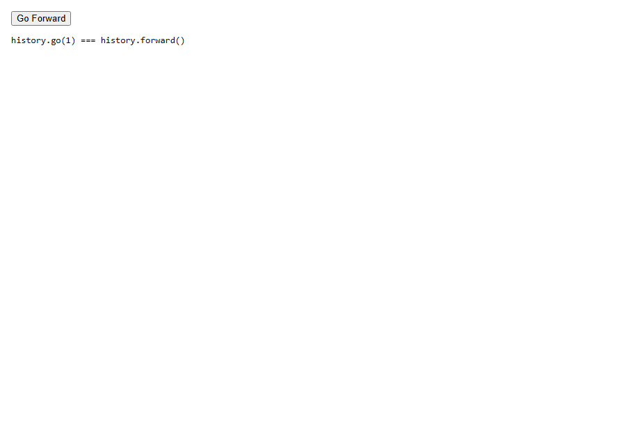

- [x] **Outcome:** The control is labeled **Go Forward** and would call `go(1)`.

<a id="js-history-example-05"></a>

### **Example 5: history.go(0) reloads the current page**

- [x] `go(0)` **reloads** the current entry.
- [x] `back()` ≡ `go(-1)`. `forward()` ≡ `go(1)`.
- [x] Do not call `go(0)` in a screenshot — the reload races the capture.
- [x] Prefer `location.reload()` when you mean reload.

Sandbox: `code_sandbox/js-history/go-zero.html`

```html
history.go(0) reloads the current page.
history.back() is equivalent to history.go(-1).
history.forward() is equivalent to history.go(1).
```

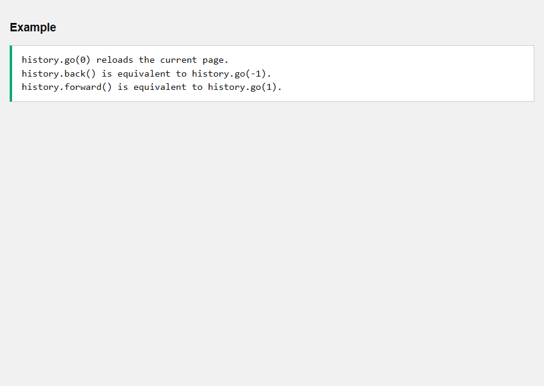


- [x] **Outcome:** The note is printed; **no reload** is performed.

<a id="js-history-example-06"></a>

### **Example 6: history.length — number of session entries**

- [x] `length` is how many entries are in **this tab’s** session history.
- [x] It is at least **1** (the current page).
- [x] You cannot read other tabs’ history (privacy).

Sandbox: `code_sandbox/js-history/length.html`

```html
let length = history.length;
```

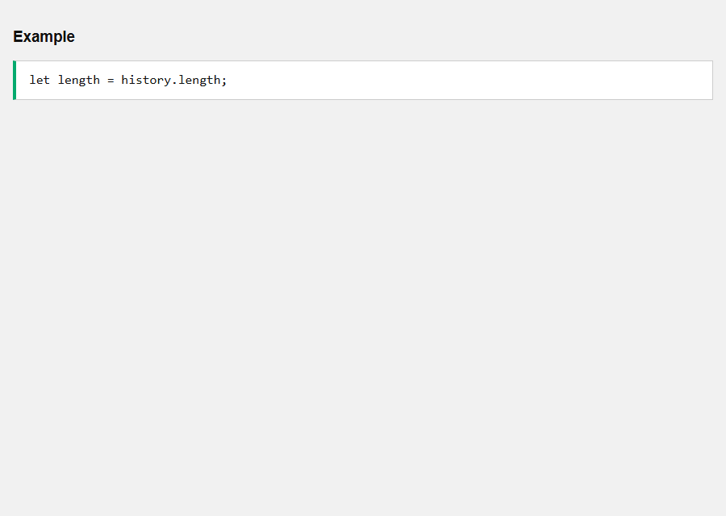


- [x] **Outcome:** `history.length` is an integer **≥ 1** for this tab.

<a id="js-history-example-07"></a>

### **Example 7: history.state is null until pushState/replaceState**

- [x] `state` is the **data object** stored with the current history entry.
- [x] On a normal first load it is **`null`**.
- [x] It becomes an object after `pushState` or `replaceState`.

Sandbox: `code_sandbox/js-history/state-null.html`

```html
let state = history.state;
```

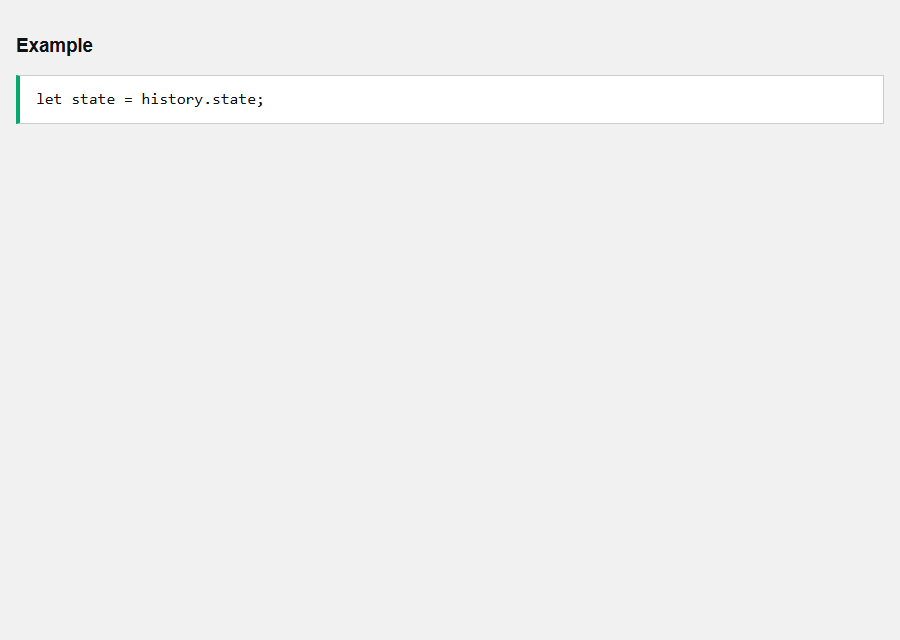


- [x] **Outcome:** On this fresh example page, `history.state` is **null**.

<a id="js-history-example-08"></a>

### **Example 8: history.pushState(state, "", url)**

- [x] `pushState(state, unused, url)` **adds** an entry without loading a document.
- [x] The second argument is unused (was `title`; pass `""`).
- [x] `url` must be **same-origin**. Here we use `?page=2`.
- [x] The page content does **not** change unless you update the DOM yourself.

Sandbox: `code_sandbox/js-history/push-state.html`

```html
let state = {name:"example", page: 2};
let url = "page2.html";
history.pushState(state, "", url);
```

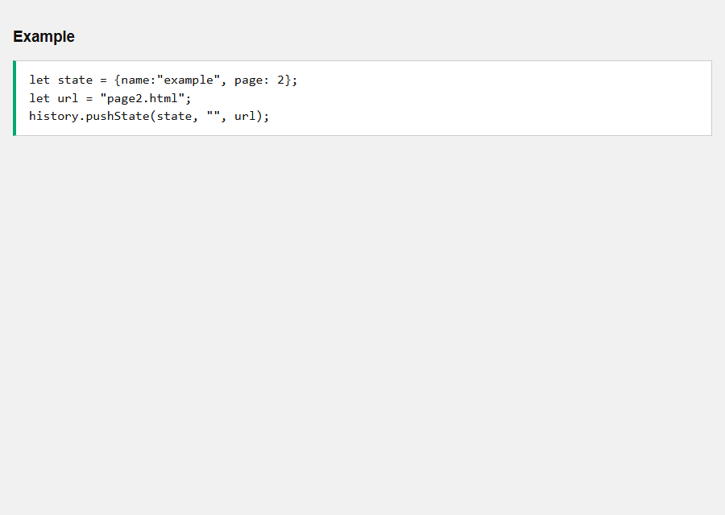

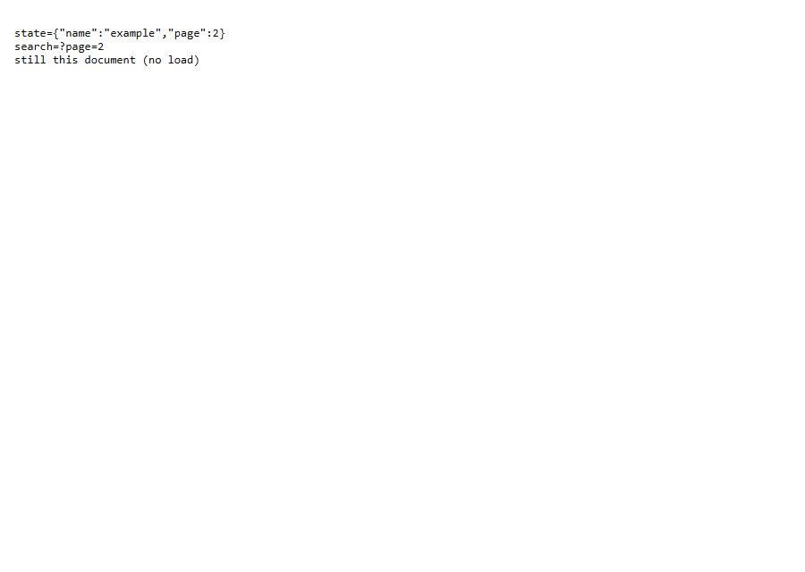

- [x] **Outcome:** After `pushState`, `history.state.page` is **2** and the query/path reflects the new URL. The heading text is still this page — no load.

<a id="js-history-example-09"></a>

### **Example 9: pushState does not load a new page**

- [x] If you need new HTML from the server, set `location.href` (or `assign`).
- [x] `pushState` only updates **history + URL**. SPAs then render in JS.
- [x] W3Schools notes a separate `location.href = "page2.html"` if content should change.

Sandbox: `code_sandbox/js-history/push-no-load.html`

```html
history.pushState() method does not load a new page.
```


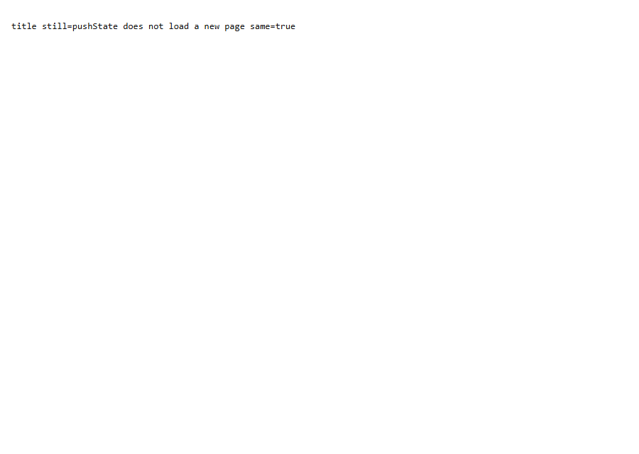

- [x] **Outcome:** `document.title` is unchanged after `pushState` — proof the document was not replaced.

<a id="js-history-example-10"></a>

### **Example 10: history.replaceState(state, "", url)**

- [x] `replaceState` **overwrites** the current entry — history length does not grow.
- [x] Useful to fix a URL without creating a Back step.
- [x] Same-origin rules still apply.

Sandbox: `code_sandbox/js-history/replace-state.html`

```html
let state = {name:"example", page: 2};
let url = "page2.html";
history.replaceState(state, "", url);
```


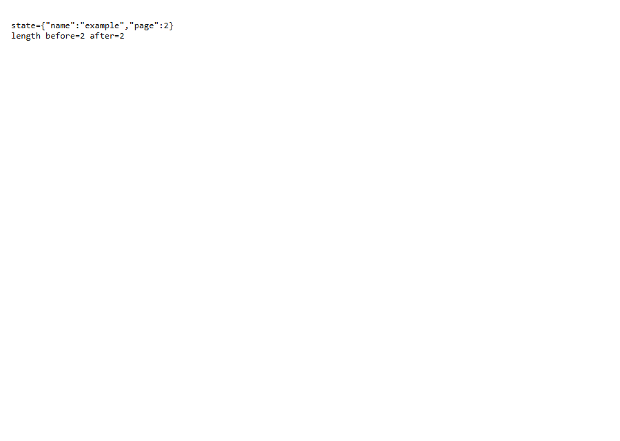

- [x] **Outcome:** `replaceState` sets `state.page` to **2**. Length does not increase because of this call.

<a id="js-history-example-11"></a>

### **Example 11: replaceState does not load a new page**

- [x] Like `pushState`, it only changes the **current** history slot.
- [x] You must still update the DOM if the UI should match the new URL.

Sandbox: `code_sandbox/js-history/replace-no-load.html`

```html
history.replaceState() method does not load a new page.
```


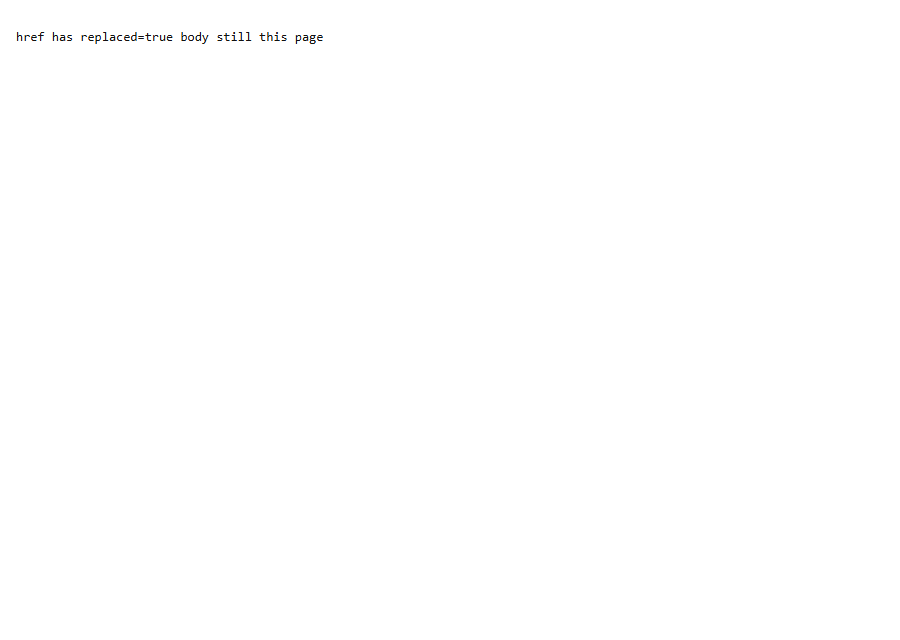

- [x] **Outcome:** The document is the same; only `history.state` / URL change.

<a id="js-history-example-12"></a>

### **Example 12: popstate fires on Back/Forward**

- [x] `popstate` runs when the **active** history entry changes via Back/Forward/`go`.
- [x] It does **not** fire for the `pushState`/`replaceState` call itself.
- [x] Listen on `window`.

Sandbox: `code_sandbox/js-history/popstate.html`

```html
window.addEventListener("popstate", function(event) {
  myDisplayer("Page changed");
});
```

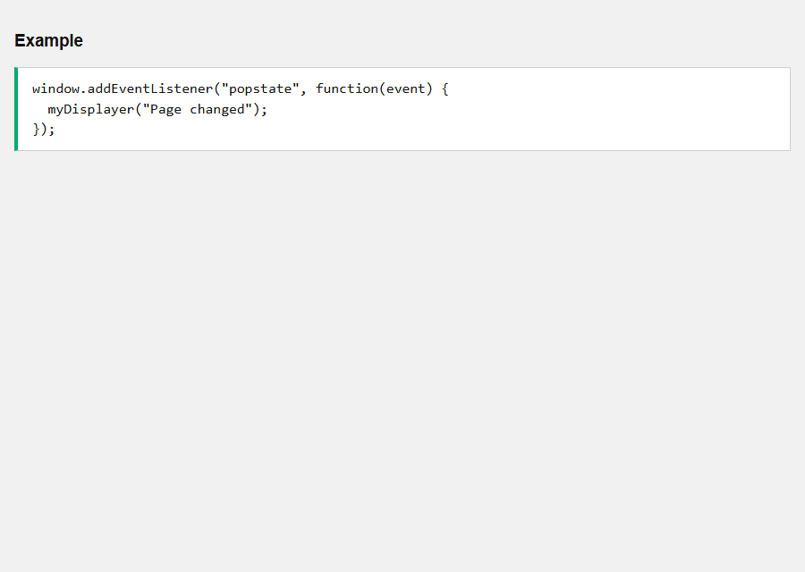


- [x] **Outcome:** After `pushState` then `history.back()`, the listener runs and prints **Page changed**.

<a id="js-history-example-13"></a>

### **Example 13: popstate event.state**

- [x] The event’s **`state`** is the object you stored with `pushState`.
- [x] It can be `null` for entries that were never given state.
- [x] Use it to restore the SPA view.

Sandbox: `code_sandbox/js-history/popstate-state.html`

```html
window.addEventListener("popstate", function(event) {
  if (event.state) {
    myDisplayer(event.state.page);
  }
});
```

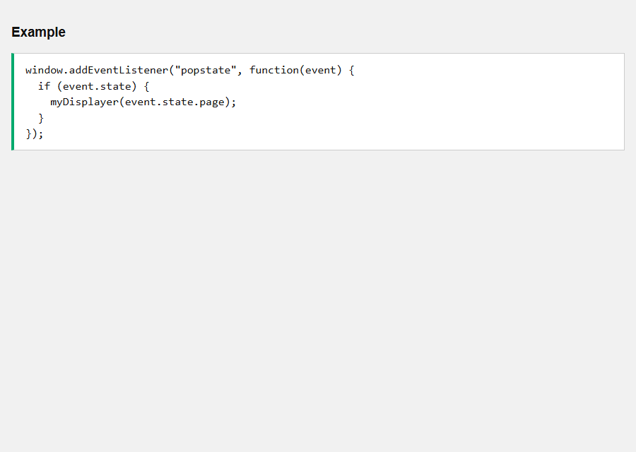


- [x] **Outcome:** Going back to the `about` state prints **about** from `event.state.page`.

<a id="js-history-example-14"></a>

### **Example 14: Simple History API example (Home / About)**

- [x] Buttons call `showPage`, which updates the paragraph **and** `pushState`.
- [x] `popstate` restores the paragraph when the user hits Back.
- [x] This is the SPA pattern in miniature.

Sandbox: `code_sandbox/js-history/spa-example.html`

```html
<button onclick="showPage('home')">Home</button>
<button onclick="showPage('about')">About</button>
<p id="out">Home</p>
<script>
function showPage(page) {
  myDisplayer(page);
  history.pushState({page: page}, "", "?page=" + page);
}
window.addEventListener("popstate", function(event) {
  if (event.state) { myDisplayer(event.state.page); }
});
</script>
```

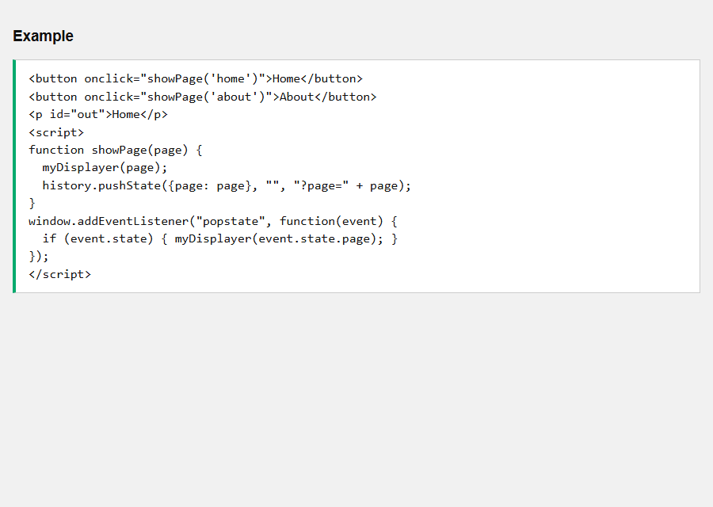


- [x] **Outcome:** After clicking **About**, the paragraph is **about** and the URL has `?page=about`.

<a id="js-history-example-15"></a>

### **Example 15: history.scrollRestoration**

- [x] `scrollRestoration` is **`"auto"`** (browser restores scroll) or **`"manual"`** (you restore it).
- [x] SPAs often set **`manual`** so Back does not jump to a leftover scroll position.
- [x] W3Schools: `history.scrollRestoration = "manual"`.

Sandbox: `code_sandbox/js-history/scroll-restoration.html`

```html
history.scrollRestoration = "manual";
```


- [x] **Outcome:** After assignment, `scrollRestoration` is **manual**.

<details>
  <summary>Terminal Commands</summary>

## Terminal Commands

```bash
# from Personal/Files/javascript/code_sandbox
py -3 -m http.server 8770 --bind 127.0.0.1
```

Then open `http://127.0.0.1:8770/js-history/`.

</details>

<details>
  <summary>Questions and Answers</summary>

## Questions and Answers

### Question 1: What is `history.back()` equal to?

<details>
<summary>Answer</summary>

- [x] The browser **Back** button, and `history.go(-1)`.

</details>

### Question 2: What does `go(0)` do?

<details>
<summary>Answer</summary>

- [x] **Reloads** the current page.

</details>

### Question 3: Does `pushState` fetch new HTML?

<details>
<summary>Answer</summary>

- [x] **No** — it only adds a history entry and may change the URL.

</details>

### Question 4: How is `replaceState` different?

<details>
<summary>Answer</summary>

- [x] It **changes the current** entry and does not add one.

</details>

### Question 5: When is `history.state` null?

<details>
<summary>Answer</summary>

- [x] Until you call **`pushState` or `replaceState`** (and for entries without state).

</details>

### Question 6: When does `popstate` fire?

<details>
<summary>Answer</summary>

- [x] On **Back / Forward / go**, not on the `pushState` call itself.

</details>

### Question 7: What is `event.state`?

<details>
<summary>Answer</summary>

- [x] The **object** you stored with that history entry.

</details>

### Question 8: What does `length` count?

<details>
<summary>Answer</summary>

- [x] Entries in **this tab’s** session history.

</details>

### Question 9: Why set `scrollRestoration = "manual"`?

<details>
<summary>Answer</summary>

- [x] So **you** control scroll when the user navigates history (common in SPAs).

</details>

### Question 10: Must `pushState` URLs be same-origin?

<details>
<summary>Answer</summary>

- [x] **Yes**.

</details>

### Question 11: In the Home/About demo, who updates the paragraph on Back?

<details>
<summary>Answer</summary>

- [x] The **`popstate`** listener reading `event.state.page`.

</details>


</details>

## Summary

Use back/forward/go for real navigation. Use pushState + popstate when the URL should change without a reload, and update the DOM yourself.

## References

- [JS History](https://www.w3schools.com/js/js_window_history.asp)
- [MDN History](https://developer.mozilla.org/en-US/docs/Web/API/History)

</details>

<details>
  <summary>JS Navigator</summary>

## Introduction

`navigator` reports cookies, language, and online state. Most of the old “what browser is this?” properties (`appName`, `userAgent`, `javaEnabled`, …) are compatibility lies — the page warns you on each one.

This section has **10** examples:

- [x] **Example 1:** navigator.cookieEnabled [View](#js-navigator-example-01)
- [x] **Example 2:** navigator.language — browser language [View](#js-navigator-example-02)
- [x] **Example 3:** navigator.onLine — is the browser online? [View](#js-navigator-example-03)
- [x] **Example 4:** navigator.appName — application name (do not trust) [View](#js-navigator-example-04)
- [x] **Example 5:** navigator.appCodeName — code name (do not trust) [View](#js-navigator-example-05)
- [x] **Example 6:** navigator.product — engine product (do not trust) [View](#js-navigator-example-06)
- [x] **Example 7:** navigator.appVersion — version string (do not trust) [View](#js-navigator-example-07)
- [x] **Example 8:** navigator.userAgent — UA header (do not trust) [View](#js-navigator-example-08)
- [x] **Example 9:** navigator.platform — OS/platform (do not trust) [View](#js-navigator-example-09)
- [x] **Example 10:** navigator.javaEnabled() always false [View](#js-navigator-example-10)

## Detailed Explanation

- [x] Useful-ish: cookieEnabled, language, onLine.
- [x] Do not sniff appName / appCodeName / product / appVersion / userAgent / platform.
- [x] javaEnabled() is always false.

<a id="js-navigator-example-01"></a>

### **Example 1: navigator.cookieEnabled**

- [x] `navigator` describes the **browser / user agent**.
- [x] `cookieEnabled` is **true** if cookies are enabled.
- [x] It does not tell you whether *your* cookie was stored — only the preference.
- [x] Can be written `window.navigator` or `navigator`.

Sandbox: `code_sandbox/js-navigator/cookie-enabled.html`

```html
document.getElementById("demo").innerHTML =
  "cookiesEnabled is " + navigator.cookieEnabled;
```

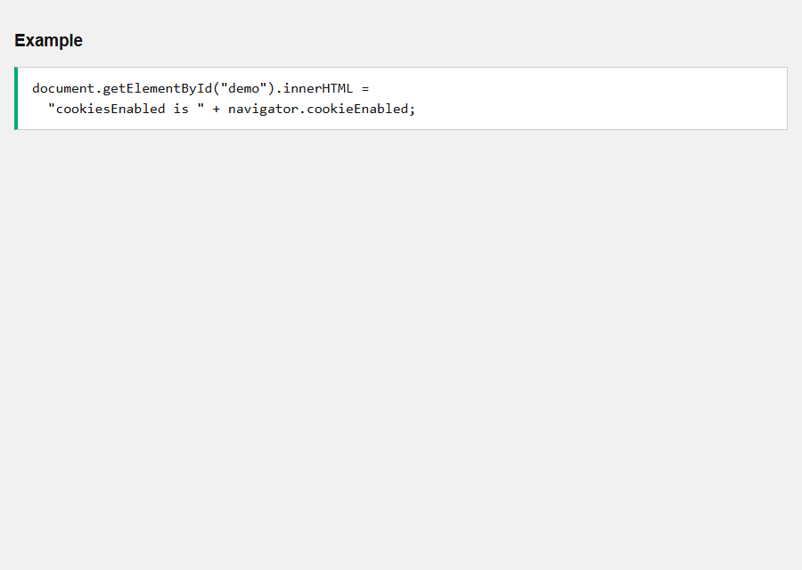


- [x] **Outcome:** **cookiesEnabled is true** (or false if cookies are off in this browser).

<a id="js-navigator-example-02"></a>

### **Example 2: navigator.language — browser language**

- [x] `language` is a BCP 47 tag such as `en-US` or `en`.
- [x] It is the UI/preferred language, not the page’s `<html lang>`.

Sandbox: `code_sandbox/js-navigator/language.html`

```html
document.getElementById("demo").innerHTML = navigator.language;
```


- [x] **Outcome:** The page prints the browser language tag (for example **en-US**).

<a id="js-navigator-example-03"></a>

### **Example 3: navigator.onLine — is the browser online?**

- [x] `onLine` is **true** if the browser thinks it has a network.
- [x] It can be **wrong** (captive portal, “online” but no internet).
- [x] Listen to `window` events `online` / `offline` for changes.

Sandbox: `code_sandbox/js-navigator/online.html`

```html
document.getElementById("demo").innerHTML = navigator.onLine;
```

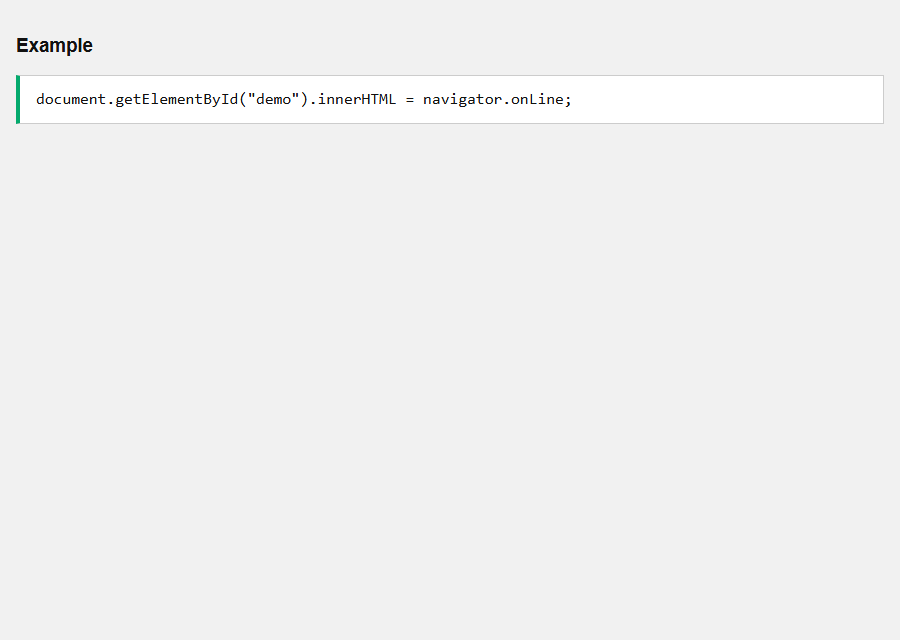


- [x] **Outcome:** `navigator.onLine` is **true** or **false** as a boolean (printed as such).

<a id="js-navigator-example-04"></a>

### **Example 4: navigator.appName — application name (do not trust)**

- [x] `appName` historically returned the browser product name.
- [x] **Warning (W3Schools + MDN):** it is unreliable. Chrome/Firefox often report **`Netscape`** for compatibility.
- [x] Do not use it for feature detection.

Sandbox: `code_sandbox/js-navigator/app-name.html`

```html
document.getElementById("demo").innerHTML =
  "navigator.appName is " + navigator.appName;
```


- [x] **Outcome:** **navigator.appName is** typically **Netscape** even in Chrome — which is why the page warns you.

<a id="js-navigator-example-05"></a>

### **Example 5: navigator.appCodeName — code name (do not trust)**

- [x] `appCodeName` is another frozen compatibility string, usually **`Mozilla`**.
- [x] The page warns: do not use it to identify the browser.

Sandbox: `code_sandbox/js-navigator/app-code-name.html`

```html
document.getElementById("demo").innerHTML =
  "navigator.appCodeName is " + navigator.appCodeName;
```

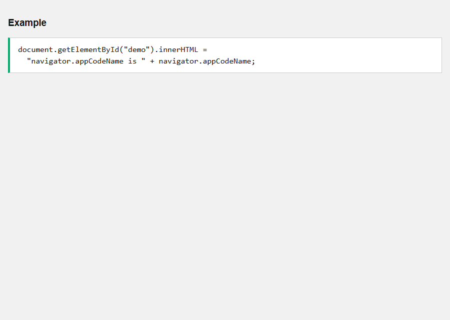


- [x] **Outcome:** **navigator.appCodeName is Mozilla** on almost every modern engine.

<a id="js-navigator-example-06"></a>

### **Example 6: navigator.product — engine product (do not trust)**

- [x] `product` is supposed to be the engine name; it is usually **`Gecko`** even in Chromium.
- [x] Same warning: **not** a real browser sniff.

Sandbox: `code_sandbox/js-navigator/product.html`

```html
document.getElementById("demo").innerHTML =
  "navigator.product is " + navigator.product;
```

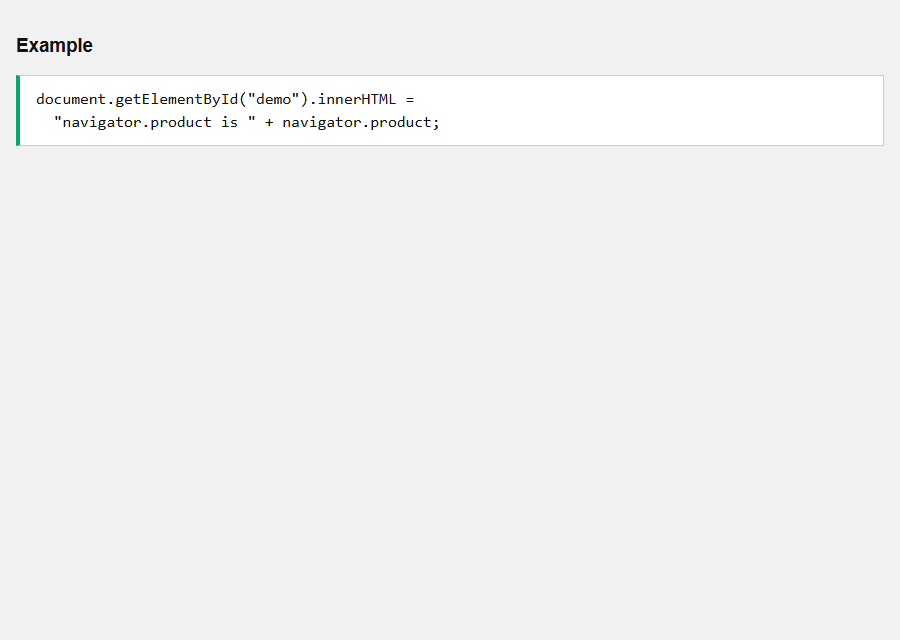


- [x] **Outcome:** **navigator.product is Gecko** on this engine (compatibility value).

<a id="js-navigator-example-07"></a>

### **Example 7: navigator.appVersion — version string (do not trust)**

- [x] `appVersion` is a long compatibility string, not a clean version number.
- [x] The page warns it does **not** return the correct browser version.
- [x] Use feature detection, not this string.

Sandbox: `code_sandbox/js-navigator/app-version.html`

```html
document.getElementById("demo").innerHTML = navigator.appVersion;
```

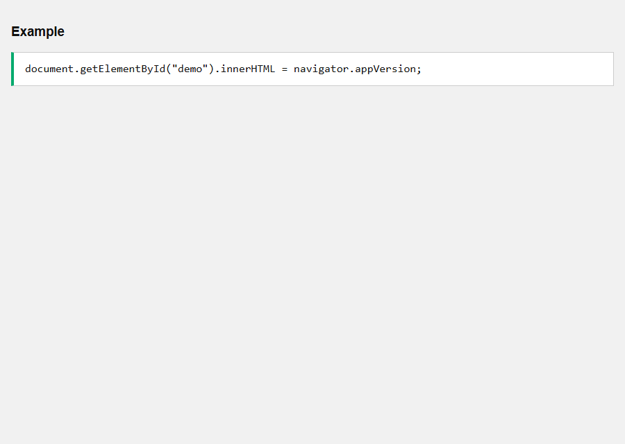

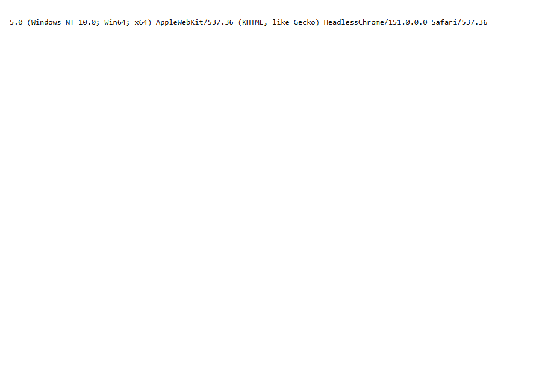

- [x] **Outcome:** `appVersion` prints a long UA-like string; do not parse it as “the version”.

<a id="js-navigator-example-08"></a>

### **Example 8: navigator.userAgent — UA header (do not trust)**

- [x] `userAgent` is what the browser sends as **User-Agent**.
- [x] It is spoofable, frozen in places, and a poor way to detect features.
- [x] The page still shows it because many tutorials mention it — then warns you.

Sandbox: `code_sandbox/js-navigator/user-agent.html`

```html
document.getElementById("demo").innerHTML = navigator.userAgent;
```


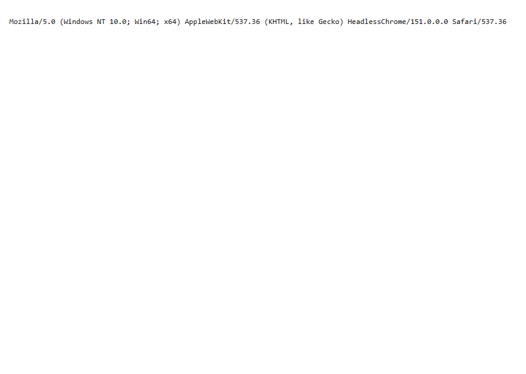

- [x] **Outcome:** The full user-agent string is printed. Treat it as **unreliable** for branching.

<a id="js-navigator-example-09"></a>

### **Example 9: navigator.platform — OS/platform (do not trust)**

- [x] `platform` was meant to be the OS (e.g. `Win32`).
- [x] The page warns it is **not** correct in all browsers (and some lie for privacy).
- [x] `userAgentData.platform` (where supported) is the newer hint — still not for capability checks.

Sandbox: `code_sandbox/js-navigator/platform.html`

```html
document.getElementById("demo").innerHTML = navigator.platform;
```

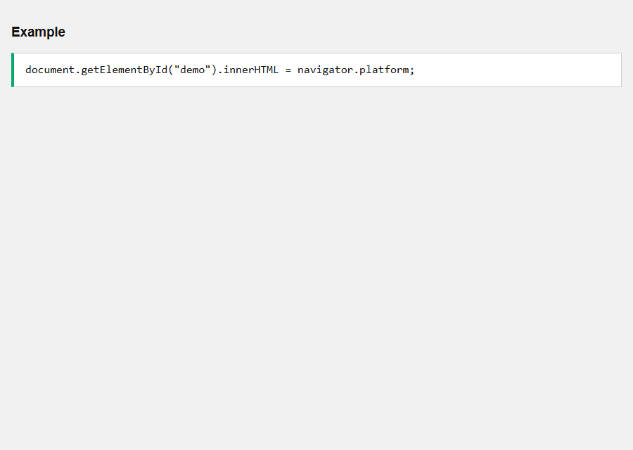


- [x] **Outcome:** `platform` prints a string such as **Win32**. Do not use it as a hard OS check.

<a id="js-navigator-example-10"></a>

### **Example 10: navigator.javaEnabled() always false**

- [x] `javaEnabled()` used to report whether **Java** (the plugin) was on.
- [x] W3Schools warning: it **always returns false** now — the plugin is gone.
- [x] Calling it is harmless; do not build logic on it.

Sandbox: `code_sandbox/js-navigator/java-enabled.html`

```html
document.getElementById("demo").innerHTML = navigator.javaEnabled();
```

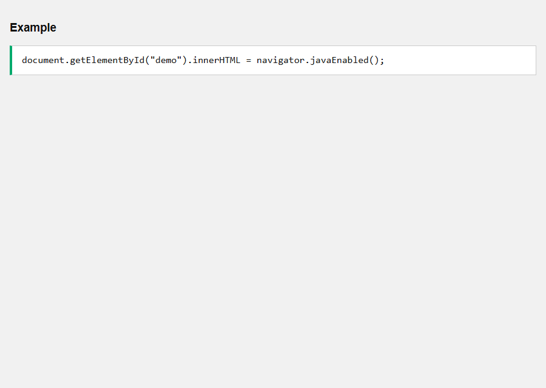


- [x] **Outcome:** `javaEnabled()` returns **false**.

<details>
  <summary>Terminal Commands</summary>

## Terminal Commands

```bash
# from Personal/Files/javascript/code_sandbox
py -3 -m http.server 8770 --bind 127.0.0.1
```

Then open `http://127.0.0.1:8770/js-navigator/`.

</details>

<details>
  <summary>Questions and Answers</summary>

## Questions and Answers

### Question 1: How do you know if cookies are enabled?

<details>
<summary>Answer</summary>

- [x] **`navigator.cookieEnabled`** (boolean).

</details>

### Question 2: What does `language` return?

<details>
<summary>Answer</summary>

- [x] A **language tag** such as `en-US`.

</details>

### Question 3: Is `onLine` a perfect network test?

<details>
<summary>Answer</summary>

- [x] **No** — it is the browser’s guess.

</details>

### Question 4: Why is `appName` useless?

<details>
<summary>Answer</summary>

- [x] Engines lie and often report **Netscape**.

</details>

### Question 5: What is a typical `appCodeName`?

<details>
<summary>Answer</summary>

- [x] **Mozilla**.

</details>

### Question 6: What is a typical `product`?

<details>
<summary>Answer</summary>

- [x] **Gecko** (even in Chrome).

</details>

### Question 7: Should you parse `userAgent` to detect Chrome?

<details>
<summary>Answer</summary>

- [x] **No** — use **feature detection**.

</details>

### Question 8: What does `javaEnabled()` return today?

<details>
<summary>Answer</summary>

- [x] Always **false**.

</details>

### Question 9: Can you omit `window.`?

<details>
<summary>Answer</summary>

- [x] **Yes** — `navigator` is a `window` property.

</details>

### Question 10: Name two navigator properties that are still somewhat useful.

<details>
<summary>Answer</summary>

- [x] **`cookieEnabled`**, **`language`**, **`onLine`** (with caveats).

</details>


</details>

## Summary

Trust cookieEnabled, language, and onLine (with caution). Ignore the legacy sniff properties and javaEnabled(). Detect features, not browsers.

## References

- [JS Navigator](https://www.w3schools.com/js/js_window_navigator.asp)
- [MDN Navigator](https://developer.mozilla.org/en-US/docs/Web/API/Navigator)

</details>

<details>
  <summary>JS Popup Alert</summary>

## Introduction

The BOM popup trio is `alert`, `confirm`, and `prompt`. They are modal, blocking, and unstyled. Use `\n` for line breaks. Native dialogs cannot appear in these snapshots, so the sandbox mirrors the text on the page.

This section has **4** examples:

- [x] **Example 1:** alert() — alert box [View](#js-popup-alert-example-01)
- [x] **Example 2:** confirm() — OK / Cancel [View](#js-popup-alert-example-02)
- [x] **Example 3:** prompt() — ask for text [View](#js-popup-alert-example-03)
- [x] **Example 4:** Line breaks in popup text with \n [View](#js-popup-alert-example-04)

## Detailed Explanation

- [x] alert — message.
- [x] confirm — true/false.
- [x] prompt — string or null.
- [x] `\n` for a new line.

<a id="js-popup-alert-example-01"></a>

### **Example 1: alert() — alert box**

- [x] `window.alert(text)` (or `alert`) shows a modal message with **OK**.
- [x] It **blocks** script until dismissed — avoid it in real UIs.
- [x] You may omit the `window.` prefix.
- [x] Headless Chrome cannot show a native dialog in the PNG, so the sandbox **mirrors** the message on the page (same approach as JS Output).

Sandbox: `code_sandbox/js-popup-alert/alert.html`

```html
alert("I am an alert box!");
```

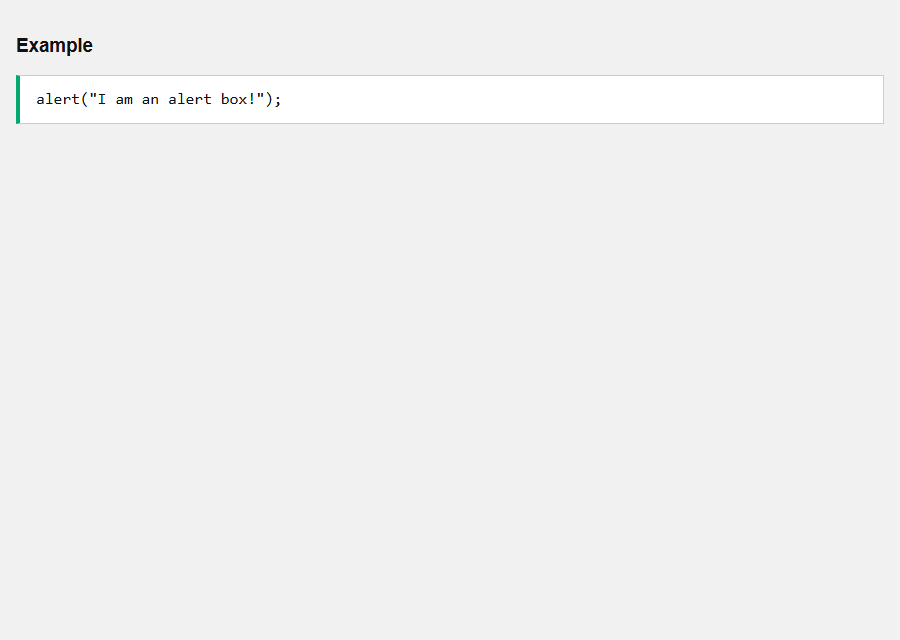


- [x] **Outcome:** The mirrored output is **alert: I am an alert box!**

<a id="js-popup-alert-example-02"></a>

### **Example 2: confirm() — OK / Cancel**

- [x] `confirm(text)` returns **`true`** for OK and **`false`** for Cancel.
- [x] Use the return value in an `if`.
- [x] Also modal and blocking — prefer a `<dialog>` for in-page UI.
- [x] The snapshot stubs `confirm` to return **true** (OK).

Sandbox: `code_sandbox/js-popup-alert/confirm.html`

```html
if (confirm("Press a button!")) {
  txt = "You pressed OK!";
} else {
  txt = "You pressed Cancel!";
}
```

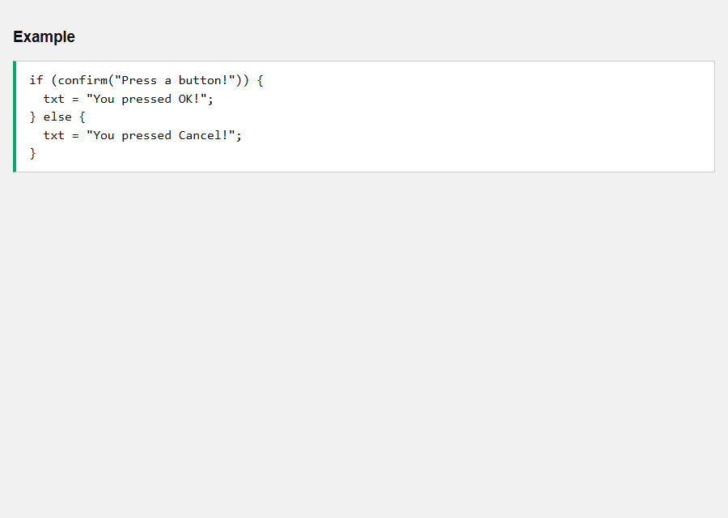

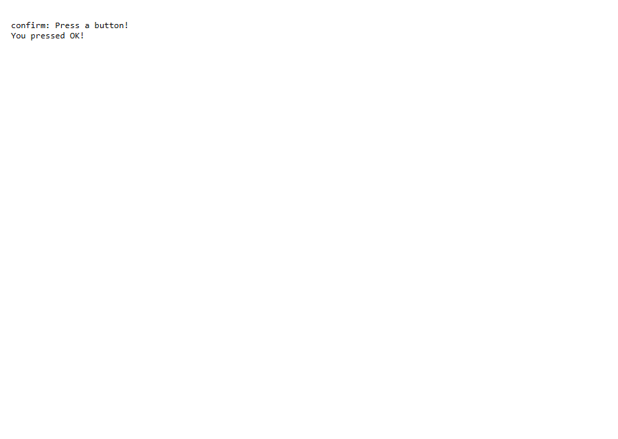

- [x] **Outcome:** With OK stubbed, `txt` is **You pressed OK!**

<a id="js-popup-alert-example-03"></a>

### **Example 3: prompt() — ask for text**

- [x] `prompt(message, defaultText)` returns the string, or **`null`** if cancelled.
- [x] Empty OK yields `""`. Always check `null` and `""`.
- [x] The W3Schools default is **Harry Potter**.
- [x] The snapshot returns that default (as if the user clicked OK).

Sandbox: `code_sandbox/js-popup-alert/prompt.html`

```html
let person = prompt("Please enter your name", "Harry Potter");
let text;
if (person == null || person == "") {
  text = "User cancelled the prompt.";
} else {
  text = "Hello " + person + "! How are you today?";
}
```

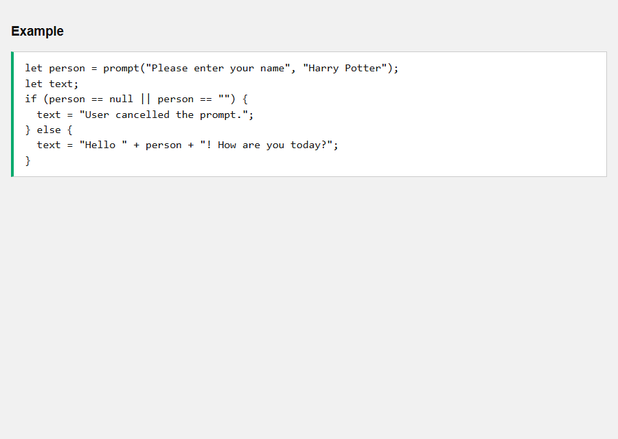

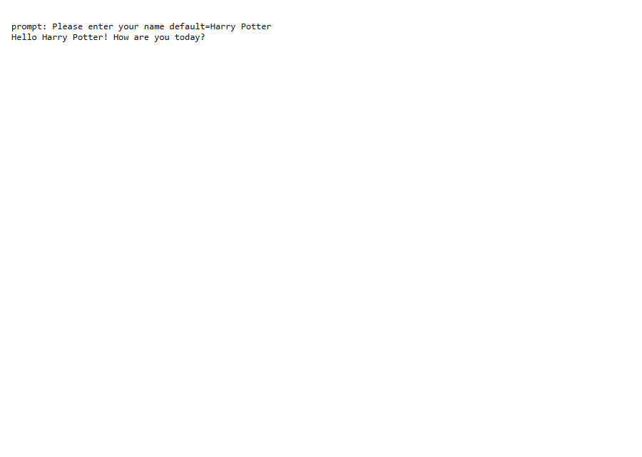

- [x] **Outcome:** With default **Harry Potter** accepted, the greeting is **Hello Harry Potter! How are you today?**

<a id="js-popup-alert-example-04"></a>

### **Example 4: Line breaks in popup text with \n**

- [x] Popup text is **plain text**, not HTML.
- [x] Use **`\n`** for a new line (`alert("Hello\nHow are you?")`).
- [x] `<br>` would show as those characters, not a break.

Sandbox: `code_sandbox/js-popup-alert/line-breaks.html`

```html
alert("Hello\nHow are you?");
```

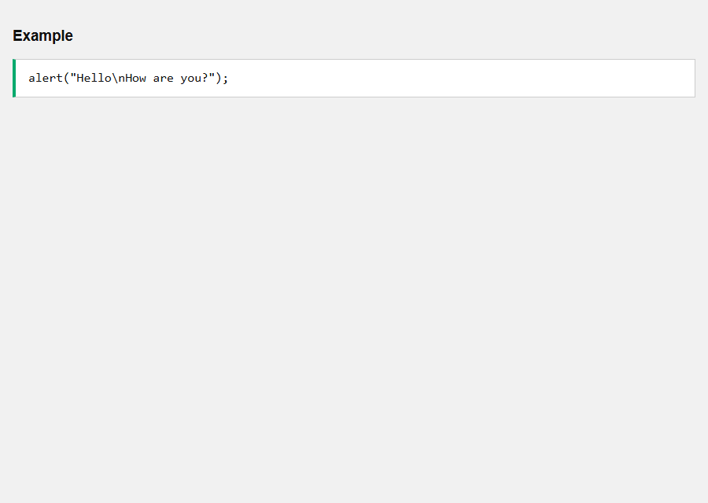


- [x] **Outcome:** The mirrored alert shows two lines: **Hello** then **How are you?**

<details>
  <summary>Terminal Commands</summary>

## Terminal Commands

```bash
# from Personal/Files/javascript/code_sandbox
py -3 -m http.server 8770 --bind 127.0.0.1
```

Then open `http://127.0.0.1:8770/js-popup-alert/`.

</details>

<details>
  <summary>Questions and Answers</summary>

## Questions and Answers

### Question 1: What does `alert` show?

<details>
<summary>Answer</summary>

- [x] A **modal** message with OK.

</details>

### Question 2: What does `confirm` return?

<details>
<summary>Answer</summary>

- [x] **`true`** (OK) or **`false`** (Cancel).

</details>

### Question 3: What does `prompt` return on Cancel?

<details>
<summary>Answer</summary>

- [x] **`null`**.

</details>

### Question 4: Can you omit `window.`?

<details>
<summary>Answer</summary>

- [x] **Yes** for `alert`, `confirm`, and `prompt`.

</details>

### Question 5: How do you put two lines in an alert?

<details>
<summary>Answer</summary>

- [x] A **`\n`** in the string.

</details>

### Question 6: Does `alert` accept HTML?

<details>
<summary>Answer</summary>

- [x] **No** — it is plain text.

</details>

### Question 7: Why avoid these in production UIs?

<details>
<summary>Answer</summary>

- [x] They **block** the thread and cannot be styled.

</details>

### Question 8: What is the W3Schools prompt default?

<details>
<summary>Answer</summary>

- [x] **Harry Potter**.

</details>

### Question 9: What text appears if confirm is cancelled?

<details>
<summary>Answer</summary>

- [x] **You pressed Cancel!** in their if/else.

</details>

### Question 10: What is a modern in-page alternative?

<details>
<summary>Answer</summary>

- [x] The HTML **`<dialog>`** element (or non-modal UI).

</details>


</details>

## Summary

alert/confirm/prompt still work but block the page. Prefer in-page UI. Remember confirm’s boolean and prompt’s null-on-cancel.

## References

- [JS Popup Alert](https://www.w3schools.com/js/js_popup.asp)
- [MDN Window.alert()](https://developer.mozilla.org/en-US/docs/Web/API/Window/alert)

</details>

<details>
  <summary>JS Cookies</summary>

## Introduction

Cookies are `document.cookie` name=value pairs. You create/change them by assignment, delete them with a past `expires`, and parse the read-back string with helpers (`setCookie`, `getCookie`, `checkCookie`).

This section has **11** examples:

- [x] **Example 1:** Create a cookie — document.cookie = name=value [View](#js-cookies-example-01)
- [x] **Example 2:** Cookie with expires date [View](#js-cookies-example-02)
- [x] **Example 3:** Cookie with path=/ [View](#js-cookies-example-03)
- [x] **Example 4:** Read cookies — let x = document.cookie [View](#js-cookies-example-04)
- [x] **Example 5:** Change a cookie by setting the same name [View](#js-cookies-example-05)
- [x] **Example 6:** Delete a cookie with an expired date [View](#js-cookies-example-06)
- [x] **Example 7:** Reading cookie returns only name=value pairs [View](#js-cookies-example-07)
- [x] **Example 8:** setCookie(cname, cvalue, exdays) [View](#js-cookies-example-08)
- [x] **Example 9:** getCookie(cname) — parse the cookie string [View](#js-cookies-example-09)
- [x] **Example 10:** checkCookie() — welcome or prompt [View](#js-cookies-example-10)
- [x] **Example 11:** All together — setCookie + getCookie + checkCookie on load [View](#js-cookies-example-11)

## Detailed Explanation

- [x] Write `name=value; expires=…; path=/`.
- [x] Read-back is only name=value pairs.
- [x] Match path when deleting.
- [x] The page’s 2013 sample expiry would delete a cookie today.

<a id="js-cookies-example-01"></a>

### **Example 1: Create a cookie — document.cookie = name=value**

- [x] A cookie is a small **name=value** string the browser stores for a site.
- [x] `document.cookie = "username=John Doe"` **adds** (or updates) that cookie.
- [x] Reading `document.cookie` later returns the name/value pairs, not the expires/path you wrote.
- [x] Must be served over **http(s)** — `file://` often will not store cookies.

Sandbox: `code_sandbox/js-cookies/create.html`

```html
document.cookie = "username=John Doe";
```

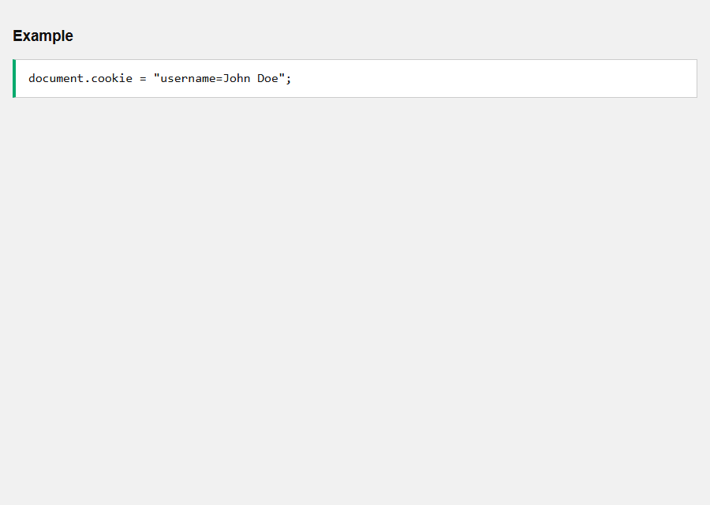


- [x] **Outcome:** After setting, `document.cookie` contains **username=John Doe** (among any others).

<a id="js-cookies-example-02"></a>

### **Example 2: Cookie with expires date**

- [x] Add **`expires=UTC-date`** so the cookie survives the session.
- [x] Without expires, it is often a **session** cookie (cleared when the browser closes).
- [x] The W3Schools sample date is in the **past** (`18 Dec 2013`) — that would **delete** the cookie today. The sandbox uses a **future** date so the create-with-expires idea actually sticks.

Sandbox: `code_sandbox/js-cookies/expires.html`

```html
document.cookie = "username=John Doe; expires=Thu, 18 Dec 2013 12:00:00 UTC";
```


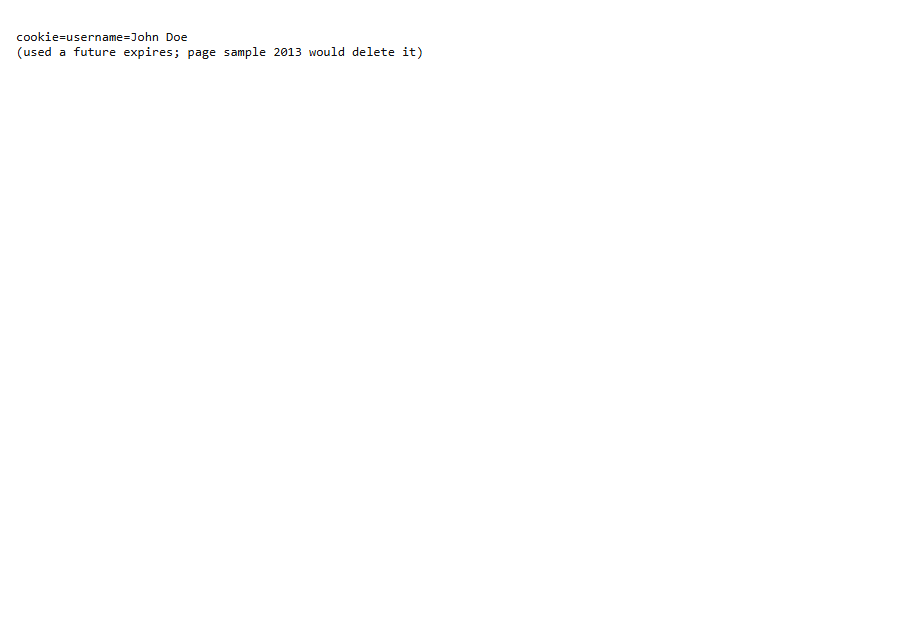

- [x] **Outcome:** With a future `expires`, the cookie is stored and `username=John Doe` is readable. A 2013 expiry (as on the page) would expire immediately.

<a id="js-cookies-example-03"></a>

### **Example 3: Cookie with path=/**

- [x] **`path=/`** makes the cookie available on the whole site, not only the current folder.
- [x] If you omit path, it defaults to the **current path**, which surprises people later.
- [x] Always set `path=/` unless you have a reason not to.

Sandbox: `code_sandbox/js-cookies/path.html`

```html
document.cookie = "username=John Doe; expires=Thu, 18 Dec 2013 12:00:00 UTC; path=/";
```

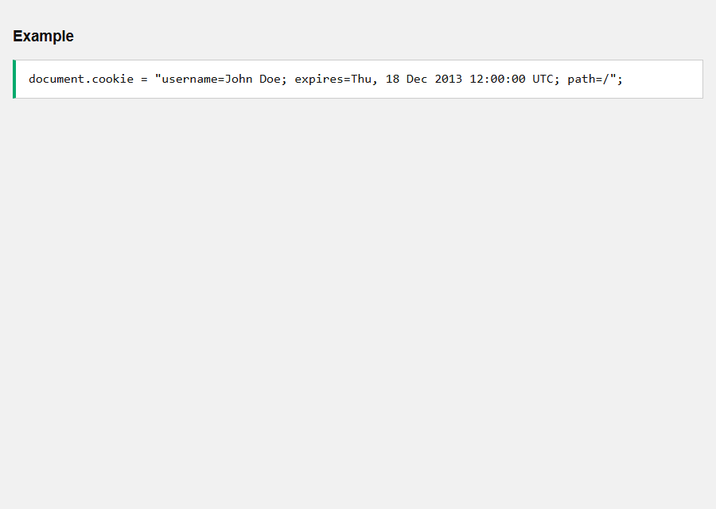


- [x] **Outcome:** The cookie is set with **path=/** and the name/value is visible on this path.

<a id="js-cookies-example-04"></a>

### **Example 4: Read cookies — let x = document.cookie**

- [x] Reading `document.cookie` returns **all** cookies as one string: `n=v; n2=v2`.
- [x] You do **not** get expires, path, or httpOnly flags.
- [x] `HttpOnly` cookies are invisible to JavaScript by design.

Sandbox: `code_sandbox/js-cookies/read.html`

```html
let x = document.cookie;
```


- [x] **Outcome:** `x` is the cookie string, including **username=…** after we set it.

<a id="js-cookies-example-05"></a>

### **Example 5: Change a cookie by setting the same name**

- [x] To change a cookie, **set it again** with the same name (and the same path).
- [x] `username=John Smith` replaces `username=John Doe`.
- [x] A different `path` looks like a different cookie.

Sandbox: `code_sandbox/js-cookies/change.html`

```html
document.cookie = "username=John Smith; expires=Thu, 18 Dec 2013 12:00:00 UTC; path=/";
```


- [x] **Outcome:** After the change, the stored username is **John Smith**.

<a id="js-cookies-example-06"></a>

### **Example 6: Delete a cookie with an expired date**

- [x] There is no `deleteCookie`. Set **`expires` in the past** (Unix epoch is conventional).
- [x] You must match **name + path** (and domain if you set one).
- [x] `username=; expires=Thu, 01 Jan 1970 …; path=/;`

Sandbox: `code_sandbox/js-cookies/delete.html`

```html
document.cookie = "username=; expires=Thu, 01 Jan 1970 00:00:00 UTC; path=/;";
```

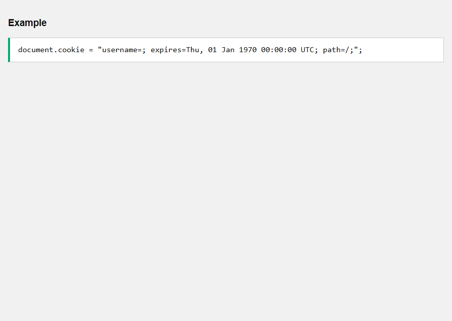


- [x] **Outcome:** After the epoch expiry, `getCookie("username")` is empty.

<a id="js-cookies-example-07"></a>

### **Example 7: Reading cookie returns only name=value pairs**

- [x] Even if you write `expires` and `path`, **read-back is only** `name=value` pairs.
- [x] Setting a **new** name **adds**; it does not wipe other cookies.
- [x] The page’s buttons (display / create 1 / create 2 / delete) are this idea.

Sandbox: `code_sandbox/js-cookies/cookie-string.html`

```html
document.cookie will return all cookies in one string much like:
cookie1=value; cookie2=value; cookie3=value;
```

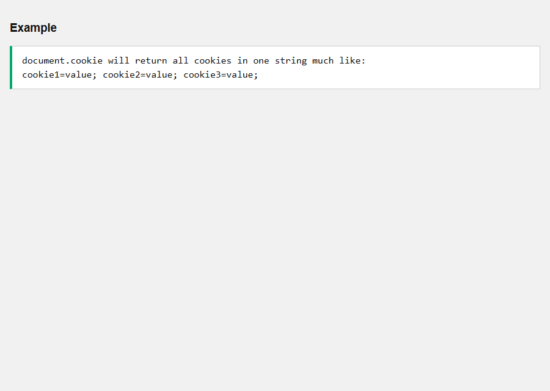


- [x] **Outcome:** After creating **c1=one** and **c2=two**, the read-back string contains both names and **no** expires text.

<a id="js-cookies-example-08"></a>

### **Example 8: setCookie(cname, cvalue, exdays)**

- [x] W3Schools helper: compute `expires` from **days**, then write `name=value;expires;path=/`.
- [x] `exdays * 24 * 60 * 60 * 1000` is milliseconds.
- [x] Always include **path=/** in the helper so later `getCookie` works site-wide.

Sandbox: `code_sandbox/js-cookies/set-cookie-fn.html`

```html
function setCookie(cname, cvalue, exdays) {
  const d = new Date();
  d.setTime(d.getTime() + (exdays * 24 * 60 * 60 * 1000));
  let expires = "expires="+d.toUTCString();
  document.cookie = cname + "=" + cvalue + ";" + expires + ";path=/";
}
```

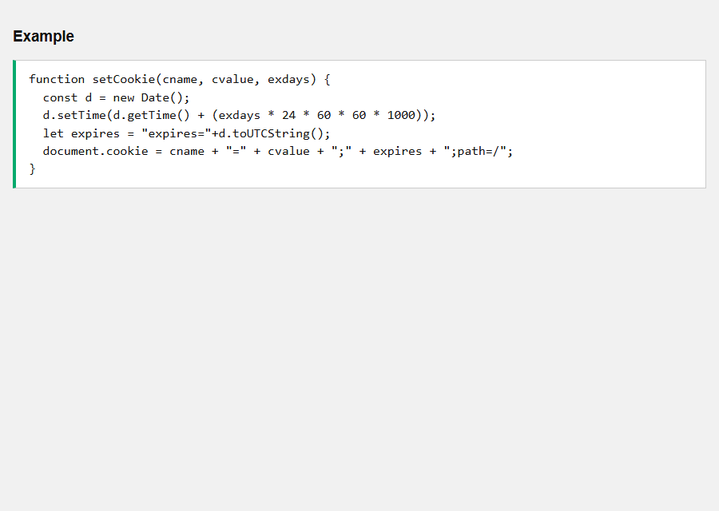


- [x] **Outcome:** `setCookie("username", "Ada", 1)` stores **Ada** for one day.

<a id="js-cookies-example-09"></a>

### **Example 9: getCookie(cname) — parse the cookie string**

- [x] Split `document.cookie` on **`;`**, trim spaces, find `name=`.
- [x] `decodeURIComponent` undoes encoding in values.
- [x] Return `""` if the name is missing — that is what `checkCookie` tests.

Sandbox: `code_sandbox/js-cookies/get-cookie-fn.html`

```html
function getCookie(cname) {
  let name = cname + "=";
  let decodedCookie = decodeURIComponent(document.cookie);
  let ca = decodedCookie.split(';');
  for(let i = 0; i <ca.length; i++) {
    let c = ca[i];
    while (c.charAt(0) == ' ') { c = c.substring(1); }
    if (c.indexOf(name) == 0) {
      return c.substring(name.length, c.length);
    }
  }
  return "";
}
```

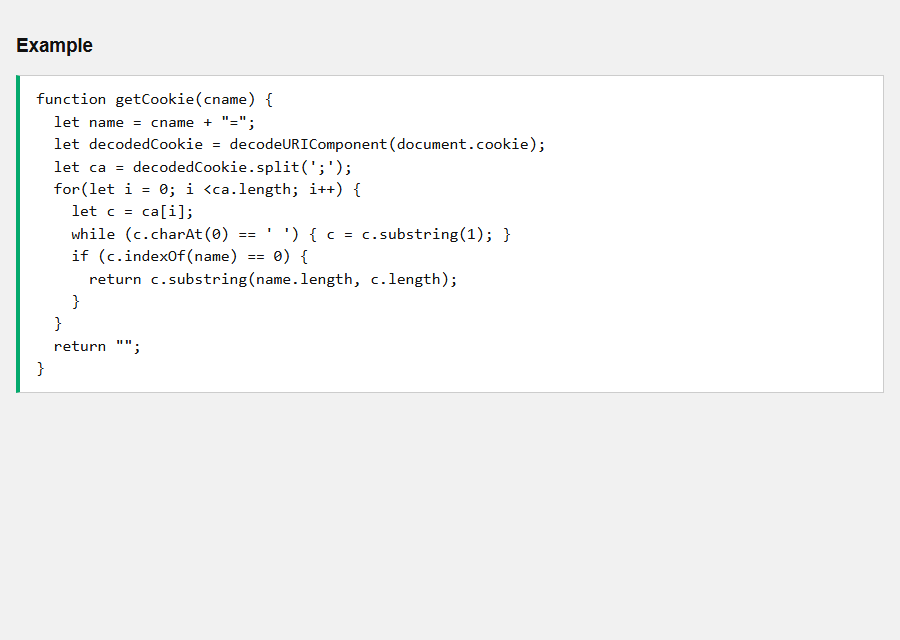


- [x] **Outcome:** `getCookie("username")` returns **Ada** after `setCookie`.

<a id="js-cookies-example-10"></a>

### **Example 10: checkCookie() — welcome or prompt**

- [x] If `getCookie("username")` is non-empty, **`alert("Welcome again " + username)`**.
- [x] Otherwise **`prompt`** for a name and `setCookie(..., 365)` if they typed one.
- [x] Native dialogs are stubbed in the snapshot: prompt returns **Sam**, then welcome can be shown on a second check.

Sandbox: `code_sandbox/js-cookies/check-cookie-fn.html`

```html
function checkCookie() {
  let username = getCookie("username");
  if (username != "") {
    alert("Welcome again " + username);
  } else {
    username = prompt("Please enter your name:", "");
    if (username != "" && username != null) {
      setCookie("username", username, 365);
    }
  }
}
```

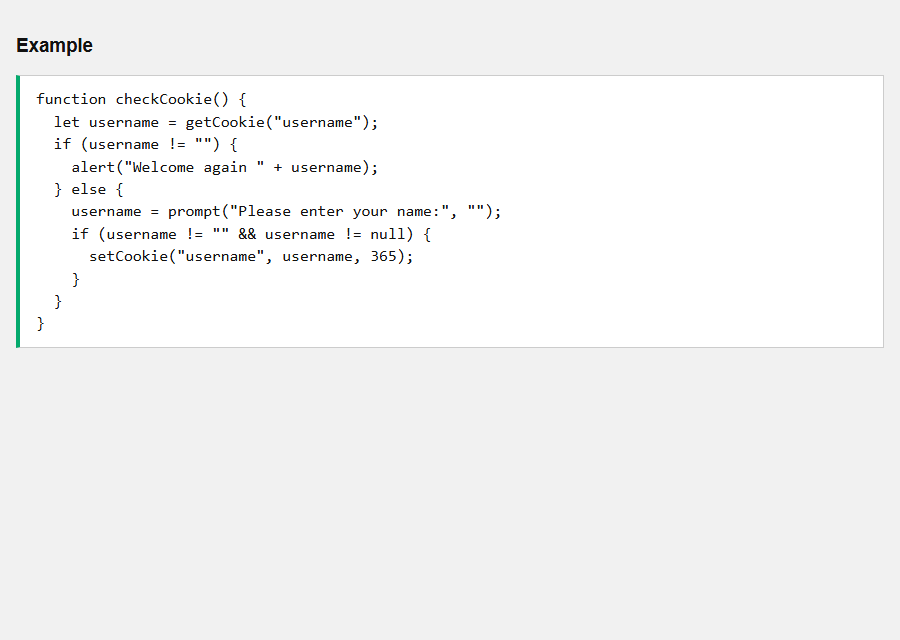


- [x] **Outcome:** With no cookie, the stub prompt returns **Sam**, `setCookie` runs, and a second `checkCookie` would welcome Sam. The snapshot prints the stored name.

<a id="js-cookies-example-11"></a>

### **Example 11: All together — setCookie + getCookie + checkCookie on load**

- [x] The full page example defines all three functions and runs **`checkCookie()`** when the page loads.
- [x] First visit: prompt. Later visits: welcome alert.
- [x] The snapshot pre-sets **username=Taylor** so load looks like a returning visitor.

Sandbox: `code_sandbox/js-cookies/all-together.html`

```html
function setCookie(cname, cvalue, exdays) { /* ... */ }
function getCookie(cname) { /* ... */ }
function checkCookie() {
  let user = getCookie("username");
  if (user != "") { alert("Welcome again " + user); }
  else {
    user = prompt("Please enter your name:", "");
    if (user != "" && user != null) { setCookie("username", user, 365); }
  }
}
checkCookie();
```

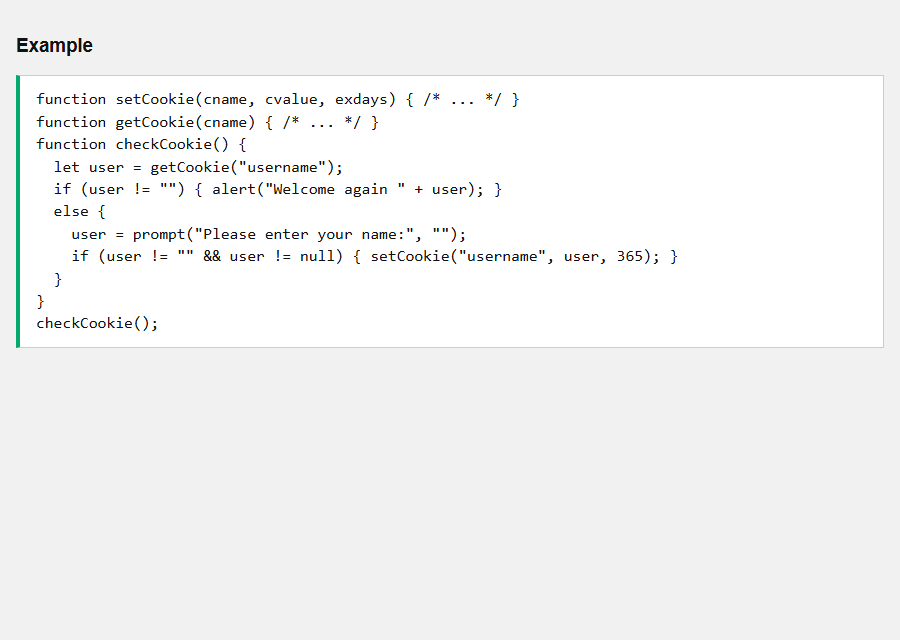

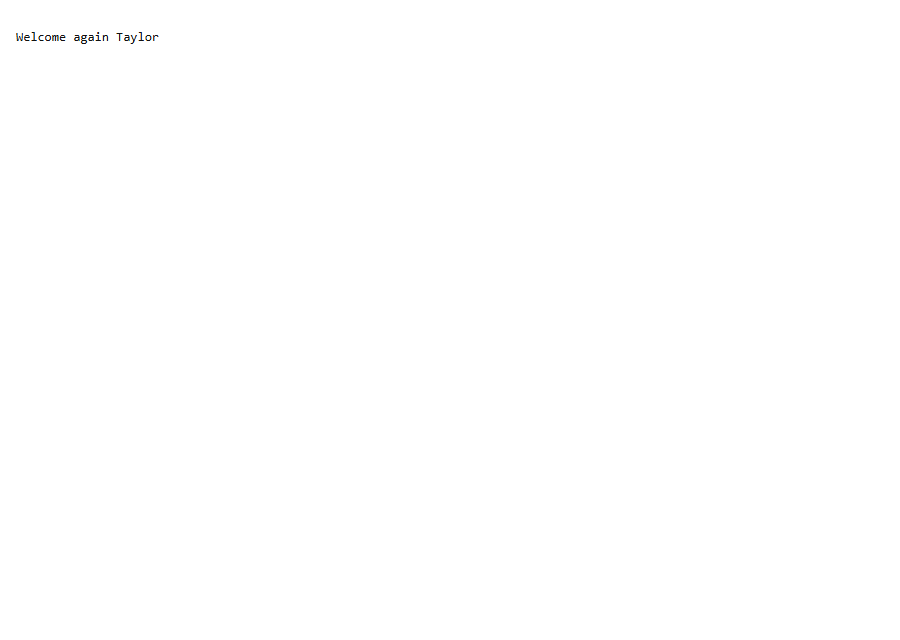

- [x] **Outcome:** On load with an existing cookie, the mirrored alert is **Welcome again Taylor**.

<details>
  <summary>Terminal Commands</summary>

## Terminal Commands

```bash
# from Personal/Files/javascript/code_sandbox
py -3 -m http.server 8770 --bind 127.0.0.1
```

Then open `http://127.0.0.1:8770/js-cookies/`.

</details>

<details>
  <summary>Questions and Answers</summary>

## Questions and Answers

### Question 1: How do you create a cookie?

<details>
<summary>Answer</summary>

- [x] Assign **`document.cookie = "name=value"`**.

</details>

### Question 2: Does a new assignment erase other cookies?

<details>
<summary>Answer</summary>

- [x] **No** — it **adds** or updates that **name** (same path).

</details>

### Question 3: How do you delete a cookie?

<details>
<summary>Answer</summary>

- [x] Set it again with **`expires` in the past** (1970) and the **same path**.

</details>

### Question 4: What do you see when you read `document.cookie`?

<details>
<summary>Answer</summary>

- [x] Only **name=value** pairs, not expires/path.

</details>

### Question 5: Why set `path=/`?

<details>
<summary>Answer</summary>

- [x] So the cookie is visible on **the whole site**, not just this folder.

</details>

### Question 6: What does `getCookie` return if the name is missing?

<details>
<summary>Answer</summary>

- [x] An **empty string**.

</details>

### Question 7: What does `checkCookie` do on a returning visitor?

<details>
<summary>Answer</summary>

- [x] **`alert("Welcome again " + username)`**.

</details>

### Question 8: What if `prompt` is cancelled?

<details>
<summary>Answer</summary>

- [x] It returns **`null`** — do not call `setCookie`.

</details>

### Question 9: Why did the page’s 2013 `expires` need a note?

<details>
<summary>Answer</summary>

- [x] That date is **in the past**, so it would **delete** the cookie today.

</details>

### Question 10: Can JS read `HttpOnly` cookies?

<details>
<summary>Answer</summary>

- [x] **No**.

</details>

### Question 11: Must examples run on http(s)?

<details>
<summary>Answer</summary>

- [x] **Yes** — `file://` often cannot store cookies.

</details>


</details>

## Summary

Set cookies with document.cookie and path=/. Parse with getCookie. Delete with a 1970 expires. Prefer Web Storage for non-secret client data; never store secrets in JS-visible cookies.

## References

- [JS Cookies](https://www.w3schools.com/js/js_cookies.asp)
- [MDN Document.cookie](https://developer.mozilla.org/en-US/docs/Web/API/Document/cookie)

</details>

<details>
  <summary>JS Fetch API</summary>

## Introduction

Fetch is the modern way to load a URL. You get a Response, then read it with text/json/blob/bytes/arrayBuffer. Always check `ok` — Fetch does not throw on 404. Work is asynchronous, so later lines run first unless you await.

This section has **17** examples:

- [x] **Example 1:** fetch().then — read a text file [View](#js-fetch-api-example-01)
- [x] **Example 2:** fetch with arrow functions [View](#js-fetch-api-example-02)
- [x] **Example 3:** async function loadText — await fetch [View](#js-fetch-api-example-03)
- [x] **Example 4:** The Response object [View](#js-fetch-api-example-04)
- [x] **Example 5:** response.ok [View](#js-fetch-api-example-05)
- [x] **Example 6:** response.status [View](#js-fetch-api-example-06)
- [x] **Example 7:** response.statusText [View](#js-fetch-api-example-07)
- [x] **Example 8:** response.url [View](#js-fetch-api-example-08)
- [x] **Example 9:** JavaScript continues while fetch is in flight [View](#js-fetch-api-example-09)
- [x] **Example 10:** Checking HTTP errors — if (!response.ok) [View](#js-fetch-api-example-10)
- [x] **Example 11:** response.json() — parse JSON body [View](#js-fetch-api-example-11)
- [x] **Example 12:** response.blob() — binary Blob [View](#js-fetch-api-example-12)
- [x] **Example 13:** response.bytes() — Uint8Array [View](#js-fetch-api-example-13)
- [x] **Example 14:** response.arrayBuffer() — ArrayBuffer [View](#js-fetch-api-example-14)
- [x] **Example 15:** Fetch vs XHR — Promise-based vs callback-based [View](#js-fetch-api-example-15)
- [x] **Example 16:** Fetch vs XHR — error handling [View](#js-fetch-api-example-16)
- [x] **Example 17:** Fetch vs XHR — streams [View](#js-fetch-api-example-17)

## Detailed Explanation

- [x] then / arrows / async await are the same two steps.
- [x] ok, status, statusText, url describe the Response.
- [x] HTTP errors need an explicit check.
- [x] Fetch is Promise-based and stream-capable vs XHR.

<a id="js-fetch-api-example-01"></a>

### **Example 1: fetch().then — read a text file**

- [x] `fetch(url)` returns a **Promise** of a **Response**.
- [x] The first `.then` receives the Response; **`response.text()`** is another Promise of the body string.
- [x] The second `.then` receives that string (W3Schools `myDisplayer(data)`).
- [x] Fetch needs **http(s)** — not `file://`.

Sandbox: `code_sandbox/js-fetch-api/then-text.html`

```javascript
fetch(file)
  .then(function(response) {
    return response.text();
  })
  .then(function(data) {
    myDisplayer(data);
  });
```

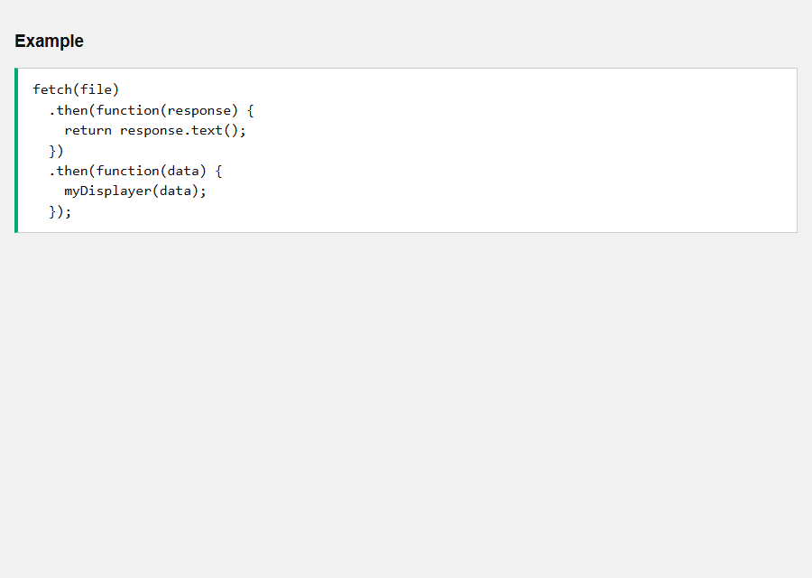


- [x] **Outcome:** The body of **fetch.txt** is displayed: **Hello Fetch API** on the first line.

<a id="js-fetch-api-example-02"></a>

### **Example 2: fetch with arrow functions**

- [x] Same flow, shorter: `response => response.text()` then `data => myDisplayer(data)`.
- [x] Arrows here are just functions — still two async steps.
- [x] Errors still need `.catch` or `try/catch` in `async`.

Sandbox: `code_sandbox/js-fetch-api/then-arrows.html`

```javascript
fetch(file)
  .then(response => response.text())
  .then(data => myDisplayer(data));
```

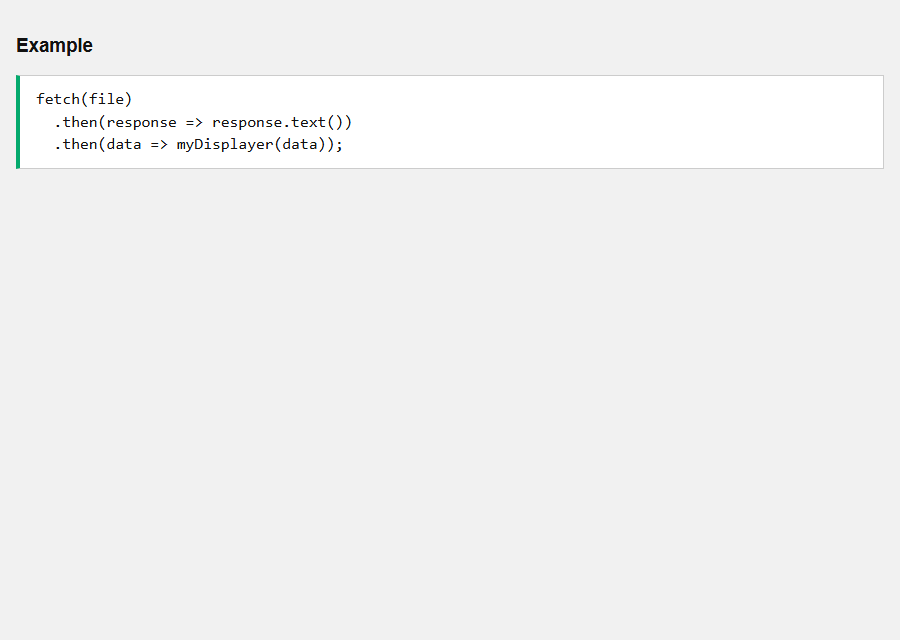


- [x] **Outcome:** Arrow-style fetch also prints the **fetch.txt** contents.

<a id="js-fetch-api-example-03"></a>

### **Example 3: async function loadText — await fetch**

- [x] `async function` lets you **`await fetch(file)`** then **`await response.text()`**.
- [x] This is the same two Promises, written as if they were sequential.
- [x] W3Schools `loadText` then calls `myDisplayer`.

Sandbox: `code_sandbox/js-fetch-api/async-fn.html`

```javascript
async function loadText(file) {
  const response = await fetch(file);
  myDisplayer(await response.text());
}
```

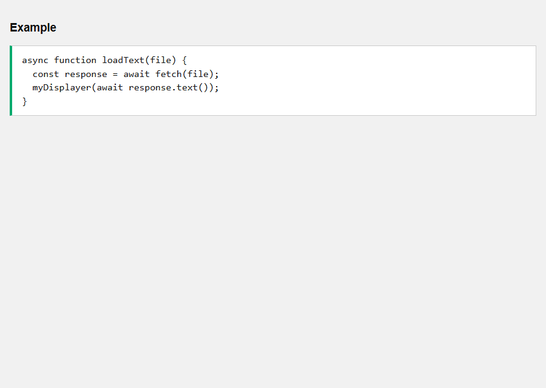


- [x] **Outcome:** `loadText("fetch.txt")` displays the file text.

<a id="js-fetch-api-example-04"></a>

### **Example 4: The Response object**

- [x] If you `myDisplayer(response)` without `.text()`, you get a **Response**, not the file contents.
- [x] Useful properties: `ok`, `status`, `statusText`, `url`.
- [x] `String(response)` is not the body — you must call a reader method.

Sandbox: `code_sandbox/js-fetch-api/response-object.html`

```javascript
async function loadText(file) {
  const response = await fetch(file);
  myDisplayer(response);
}
```

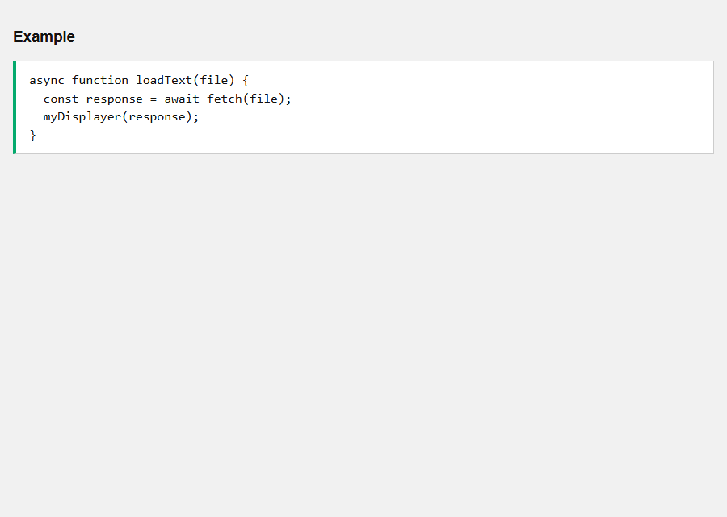


- [x] **Outcome:** `response` is an object; `ok` is **true** for fetch.txt. The default string is not the file body.

<a id="js-fetch-api-example-05"></a>

### **Example 5: response.ok**

- [x] `ok` is **true** for status **200–299**.
- [x] It is **false** for 404/500. Fetch **does not throw** on HTTP errors — check `ok`.
- [x] Network failure (offline, CORS) **does** reject the Promise.

Sandbox: `code_sandbox/js-fetch-api/ok.html`

```javascript
async function loadText(file) {
  const response = await fetch(file);
  myDisplayer(response.ok);
}
```


- [x] **Outcome:** `response.ok` is **true** for the existing file.

<a id="js-fetch-api-example-06"></a>

### **Example 6: response.status**

- [x] `status` is the **HTTP code**: 200, 404, 500, …
- [x] Pair it with `ok` when you log errors.

Sandbox: `code_sandbox/js-fetch-api/status.html`

```javascript
async function loadText(file) {
  const response = await fetch(file);
  myDisplayer(response.status);
}
```


- [x] **Outcome:** `status` is **200** for fetch.txt.

<a id="js-fetch-api-example-07"></a>

### **Example 7: response.statusText**

- [x] `statusText` is the reason phrase, e.g. **OK** or **Not Found**.
- [x] It can be empty in HTTP/2. Prefer `status` + `ok` for logic.

Sandbox: `code_sandbox/js-fetch-api/status-text.html`

```javascript
response.statusText
```


- [x] **Outcome:** For 200, `statusText` is typically **OK**.

<a id="js-fetch-api-example-08"></a>

### **Example 8: response.url**

- [x] `url` is the **final** URL after redirects.
- [x] Useful to see where the browser actually landed.

Sandbox: `code_sandbox/js-fetch-api/url.html`

```javascript
async function loadText(file) {
  const response = await fetch(file);
  myDisplayer(response.url);
}
```


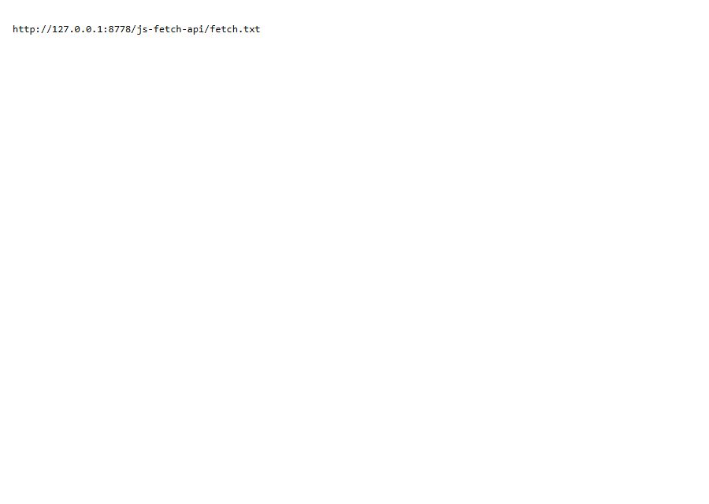

- [x] **Outcome:** `response.url` ends with **`/js-fetch-api/fetch.txt`**.

<a id="js-fetch-api-example-09"></a>

### **Example 9: JavaScript continues while fetch is in flight**

- [x] `loadText("fetch.txt")` starts work and **returns immediately**.
- [x] The next line `myDisplayer("JavaScript continues.")` runs **before** the file arrives.
- [x] That is why the page shows “continues” first, then the file — unless you `await loadText` at the top level.

Sandbox: `code_sandbox/js-fetch-api/async-continues.html`

```javascript
async function loadText(file) {
  const response = await fetch(file);
  myDisplayer(response.url);
}
loadText("fetch.txt");
myDisplayer("JavaScript continues.");
```

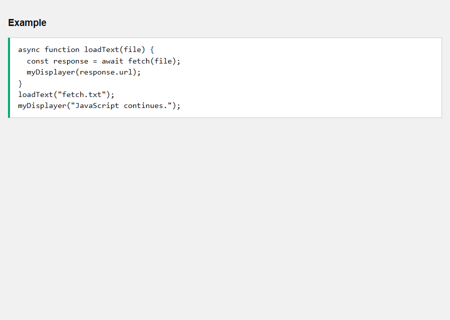


- [x] **Outcome:** The log order is **JavaScript continues.** first, then the response URL — proving fetch is asynchronous.

<a id="js-fetch-api-example-10"></a>

### **Example 10: Checking HTTP errors — if (!response.ok)**

- [x] Fetch **fulfills** on 404. You must **`if (!response.ok)`** and show `status + statusText`.
- [x] Then `return` so you do not parse an error page as success.
- [x] The sandbox fetches a missing file to force **404**.

Sandbox: `code_sandbox/js-fetch-api/http-error.html`

```javascript
async function loadText(file) {
  const response = await fetch(file);
  if (!response.ok) {
    myDisplayer(response.status + " " + response.statusText);
    return;
  }
  myDisplayer(await response.text());
}
```

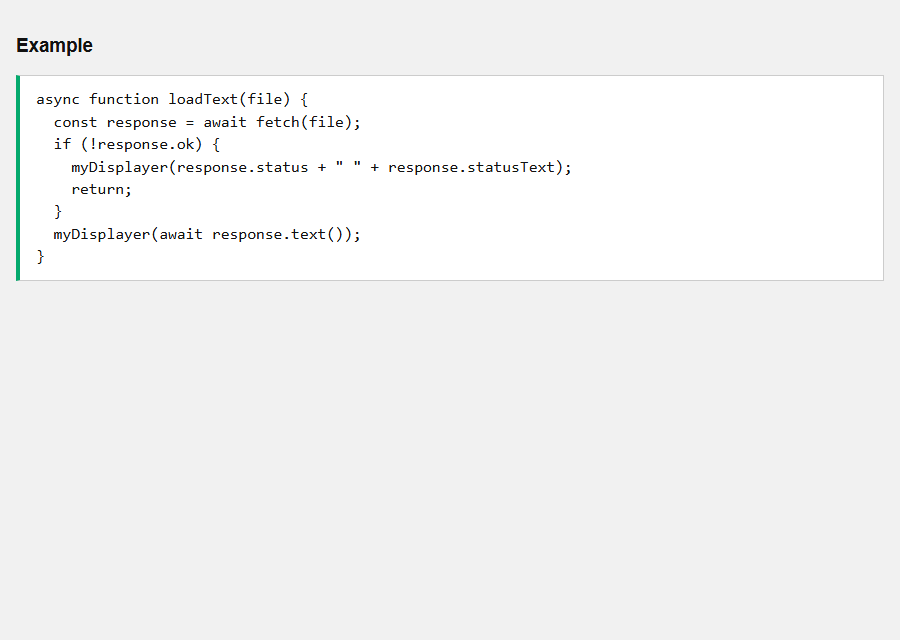


- [x] **Outcome:** Fetching a missing path prints **404** and a status text (often **Not Found**).

<a id="js-fetch-api-example-11"></a>

### **Example 11: response.json() — parse JSON body**

- [x] `json()` reads the body and **`JSON.parse`s** it.
- [x] Do **not** call `JSON.parse` again on the result.
- [x] Wrong Content-Type still often parses if the bytes are JSON.

Sandbox: `code_sandbox/js-fetch-api/json-method.html`

```javascript
const data = await response.json();
```


- [x] **Outcome:** `customer.json` parses to an object whose **name** is **John Doe**.

<a id="js-fetch-api-example-12"></a>

### **Example 12: response.blob() — binary Blob**

- [x] `blob()` is for files you might download or put in an `` via `URL.createObjectURL`.
- [x] The Blob has `size` and `type`.

Sandbox: `code_sandbox/js-fetch-api/blob-method.html`

```javascript
const data = await response.blob();
```


- [x] **Outcome:** `fetch.txt` as a Blob has a **size** > 0 and a MIME `type` (often `text/plain`).

<a id="js-fetch-api-example-13"></a>

### **Example 13: response.bytes() — Uint8Array**

- [x] `bytes()` is a newer method that returns a **Uint8Array**.
- [x] If missing, fall back to `new Uint8Array(await response.arrayBuffer())`.
- [x] W3Schools lists it on the Response methods table.

Sandbox: `code_sandbox/js-fetch-api/bytes-method.html`

```javascript
const data = await response.bytes();
```


- [x] **Outcome:** `bytes()` (or the ArrayBuffer fallback) yields a **Uint8Array** whose first bytes decode as **Hello**.

<a id="js-fetch-api-example-14"></a>

### **Example 14: response.arrayBuffer() — ArrayBuffer**

- [x] `arrayBuffer()` is the raw binary buffer (WebGL, WASM, manual parsing).
- [x] `byteLength` is the size in bytes.

Sandbox: `code_sandbox/js-fetch-api/array-buffer.html`

```javascript
const data = await response.arrayBuffer();
```


- [x] **Outcome:** `byteLength` is the file size in bytes (same as the Blob size).

<a id="js-fetch-api-example-15"></a>

### **Example 15: Fetch vs XHR — Promise-based vs callback-based**

- [x] Fetch is **Promise-based** (`then` / `await`).
- [x] XHR is **callback-based** (`onload`, `onerror`).
- [x] That is the first row of the comparison table.

Sandbox: `code_sandbox/js-fetch-api/xhr-syntax.html`

```html
fetch(url).then(r => r.text());
// vs
xhr.onload = function () { /* this.responseText */ };
```

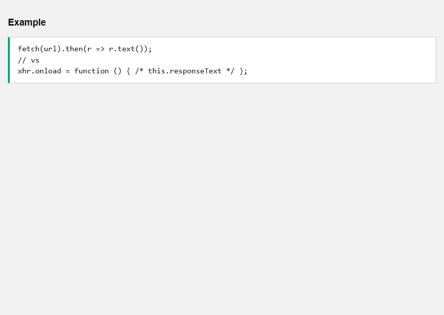


- [x] **Outcome:** The snapshot labels the two styles: **Promise-based** vs **callback-based**.

<a id="js-fetch-api-example-16"></a>

### **Example 16: Fetch vs XHR — error handling**

- [x] Fetch **rejects on network failure**, not on 404.
- [x] XHR needs **manual** `status` checks in `onload` plus `onerror`.
- [x] Always check `response.ok` with Fetch.

Sandbox: `code_sandbox/js-fetch-api/xhr-errors.html`

```html
if (!response.ok) { /* HTTP error */ }
// XHR: if (xhr.status >= 200 && xhr.status < 300)
```


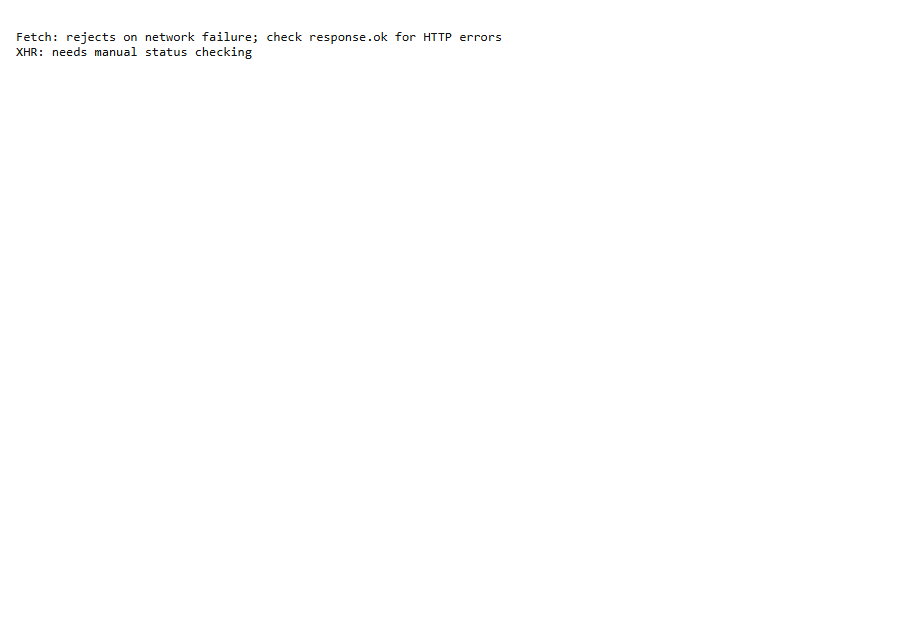

- [x] **Outcome:** The note prints: Fetch rejects on **network** failure; HTTP errors need **`ok`**.

<a id="js-fetch-api-example-17"></a>

### **Example 17: Fetch vs XHR — streams**

- [x] Fetch **supports streams** (`response.body` is a ReadableStream).
- [x] XHR **does not** give you that streaming body API.
- [x] Large downloads can be consumed chunk by chunk with Fetch.

Sandbox: `code_sandbox/js-fetch-api/xhr-streams.html`

```html
response.body // ReadableStream in Fetch
```


- [x] **Outcome:** `response.body` exists as a **ReadableStream** on this Response.

<details>
  <summary>Terminal Commands</summary>

## Terminal Commands

```bash
# from Personal/Files/javascript/code_sandbox
py -3 -m http.server 8770 --bind 127.0.0.1
```

Then open `http://127.0.0.1:8770/js-fetch-api/`.

</details>

<details>
  <summary>Questions and Answers</summary>

## Questions and Answers

### Question 1: What does `fetch` return?

<details>
<summary>Answer</summary>

- [x] A **Promise** that resolves to a **Response**.

</details>

### Question 2: How do you read a text body?

<details>
<summary>Answer</summary>

- [x] **`response.text()`** (another Promise).

</details>

### Question 3: Does Fetch throw on 404?

<details>
<summary>Answer</summary>

- [x] **No** — check **`response.ok`** or `status`.

</details>

### Question 4: What does `ok` mean?

<details>
<summary>Answer</summary>

- [x] Status is in **200–299**.

</details>

### Question 5: Why does “JavaScript continues” print first?

<details>
<summary>Answer</summary>

- [x] `fetch` is **asynchronous**; the next line runs before the response.

</details>

### Question 6: What is `response.url`?

<details>
<summary>Answer</summary>

- [x] The **final** URL after redirects.

</details>

### Question 7: How do you parse JSON?

<details>
<summary>Answer</summary>

- [x] **`await response.json()`** — do not `JSON.parse` that result again.

</details>

### Question 8: When does Fetch **reject**?

<details>
<summary>Answer</summary>

- [x] **Network** failure (and some CORS/abort cases), not HTTP 404.

</details>

### Question 9: Fetch vs XHR syntax?

<details>
<summary>Answer</summary>

- [x] Fetch is **Promise-based**; XHR is **callback-based**.

</details>

### Question 10: Does XHR support body streams like Fetch?

<details>
<summary>Answer</summary>

- [x] **No**.

</details>

### Question 11: Why serve these examples over http?

<details>
<summary>Answer</summary>

- [x] Browsers **block** `fetch` of local files from `file://`.

</details>


</details>

## Summary

Call fetch, await the Response, check ok, then read the body with the matching method. Remember that JavaScript continues while the request is in flight.

## References

- [JS Fetch API](https://www.w3schools.com/js/js_api_fetch.asp)
- [MDN fetch()](https://developer.mozilla.org/en-US/docs/Web/API/Window/fetch)

</details>

<details>
  <summary>JSON Intro</summary>

## Introduction

JSON is a language-independent **text** format. JavaScript converts it with `JSON.parse` and `JSON.stringify`. Objects and arrays are the two main structures.

This section has **11** examples:

- [x] **Example 1:** A JSON example — name, age, city [View](#json-intro-example-01)
- [x] **Example 2:** Same data as a JavaScript object [View](#json-intro-example-02)
- [x] **Example 3:** JSON is text [View](#json-intro-example-03)
- [x] **Example 4:** JSON.parse — JSON text to JavaScript [View](#json-intro-example-04)
- [x] **Example 5:** JSON.stringify — JavaScript to JSON text [View](#json-intro-example-05)
- [x] **Example 6:** JSON round trip — stringify then parse [View](#json-intro-example-06)
- [x] **Example 7:** JSON files — customer.json [View](#json-intro-example-07)
- [x] **Example 8:** JSON objects — firstName / lastName [View](#json-intro-example-08)
- [x] **Example 9:** JSON arrays — employees [View](#json-intro-example-09)
- [x] **Example 10:** JSON text built from concatenated strings [View](#json-intro-example-10)
- [x] **Example 11:** Display parsed employees[1] in HTML [View](#json-intro-example-11)

## Detailed Explanation

- [x] JSON is text until you parse it.
- [x] Property names are double-quoted.
- [x] The employees sample uses an array of objects.

<a id="json-intro-example-01"></a>

### **Example 1: A JSON example — name, age, city**

- [x] JSON is a **text** format for data: curly braces, quoted names, values.
- [x] This object has a string, a number, and a string.
- [x] JSON is **not** a JavaScript program — it is data you parse.

Sandbox: `code_sandbox/json-intro/json-example.html`

```html
{
  "name": "John",
  "age": 30,
  "city": "New York"
}
```

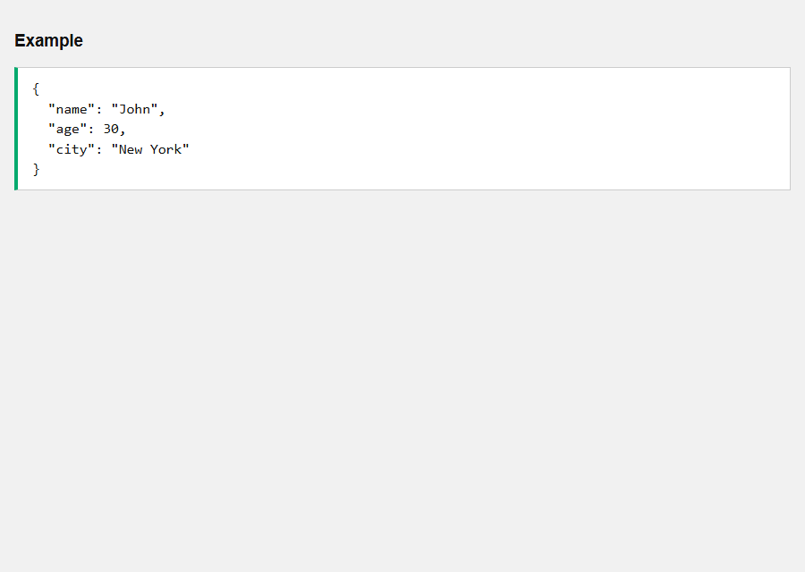


- [x] **Outcome:** `JSON.parse` of that text gives `name` **John** and `age` **30** (a number).

<a id="json-intro-example-02"></a>

### **Example 2: Same data as a JavaScript object**

- [x] In JavaScript, property names **may** be unquoted (`name: "John"`).
- [x] JSON **requires** double-quoted names.
- [x] The values can look similar; the rules are stricter in JSON.

Sandbox: `code_sandbox/json-intro/js-object.html`

```html
const person = {
  name: "John",
  age: 30,
  city: "New York"
};
```

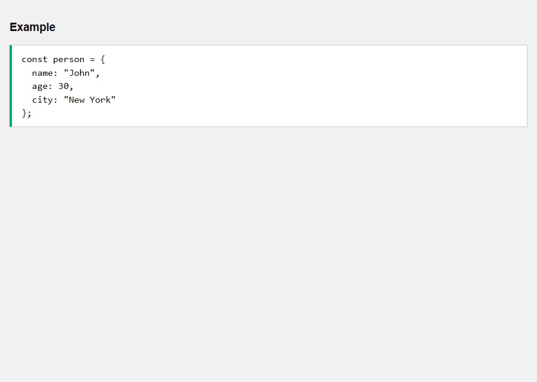


- [x] **Outcome:** The JS object prints **John 30 New York** without `JSON.parse`.

<a id="json-intro-example-03"></a>

### **Example 3: JSON is text**

- [x] A JSON document is a **string** until you parse it.
- [x] `typeof` of the raw payload is **`string`**.
- [x] After `JSON.parse`, `typeof person` is **`object`**.

Sandbox: `code_sandbox/json-intro/json-is-text.html`

```html
{
  "name": "John",
  "age": 30,
  "city": "New York"
}
```


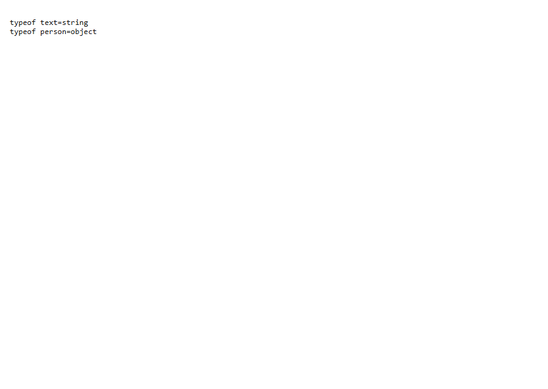

- [x] **Outcome:** Before parse: **string**. After parse: **object** with `name` John.

<a id="json-intro-example-04"></a>

### **Example 4: JSON.parse — JSON text to JavaScript**

- [x] `JSON.parse(text)` turns JSON **text** into a JS value.
- [x] Invalid JSON **throws** `SyntaxError`.
- [x] This is how APIs become objects you can use.

Sandbox: `code_sandbox/json-intro/parse.html`

```html
const text = '{"name":"John", "age":30, "city":"New York"}';
const person = JSON.parse(text);
```

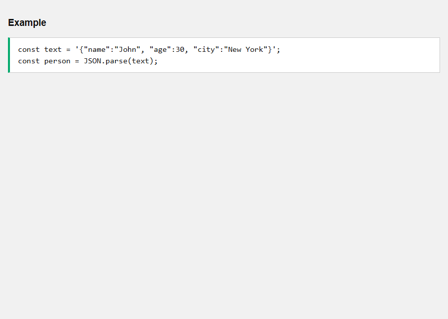


- [x] **Outcome:** `person.name` is **John** after parse.

<a id="json-intro-example-05"></a>

### **Example 5: JSON.stringify — JavaScript to JSON text**

- [x] `JSON.stringify(value)` does the reverse: JS value → **string**.
- [x] The W3Schools demo writes that string into the page.
- [x] Names become quoted; `undefined`/functions are dropped (later page).

Sandbox: `code_sandbox/json-intro/stringify.html`

```html
const person = { name: "John", age: 30, city: "New York" };
const text = JSON.stringify(person);
document.getElementById("demo").innerHTML = text;
```

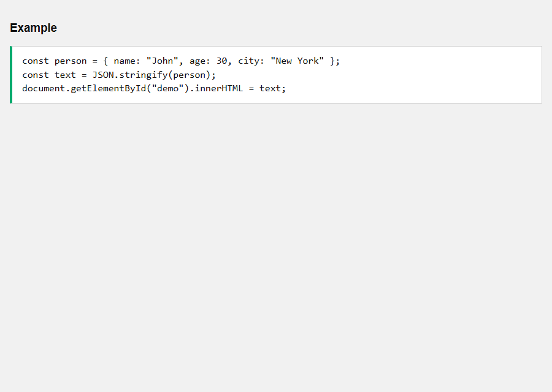


- [x] **Outcome:** The page shows JSON text like **`{"name":"John","age":30,"city":"New York"}`**.

<a id="json-intro-example-06"></a>

### **Example 6: JSON round trip — stringify then parse**

- [x] stringify → parse returns a **new** object with the same enumerable JSON data.
- [x] It is not `===` the original object.
- [x] Dates become strings unless you use a reviver (Parse page).

Sandbox: `code_sandbox/json-intro/round-trip.html`

```html
const person = { name: "John", age: 30 };
const text = JSON.stringify(person);
const copy = JSON.parse(text);
```

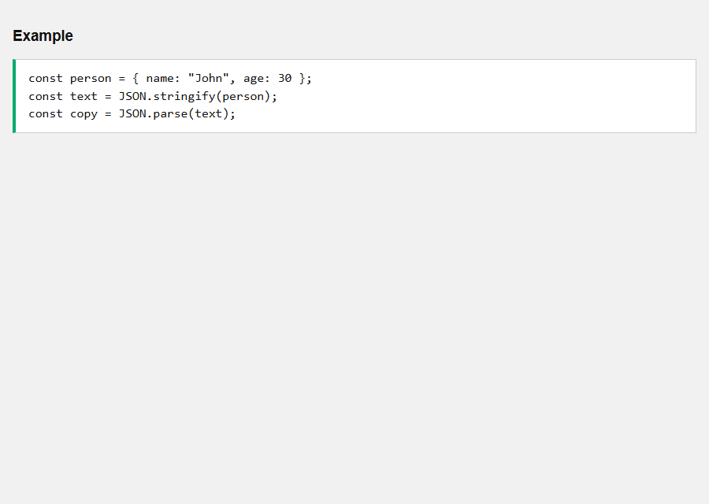


- [x] **Outcome:** `copy.name` is **John**, and `copy === person` is **false**.

<a id="json-intro-example-07"></a>

### **Example 7: JSON files — customer.json**

- [x] JSON often lives in a **`.json` file** on a server.
- [x] The sample has id, name, city, and boolean **member**.
- [x] Load it later with `fetch` + `response.json()`.

Sandbox: `code_sandbox/json-intro/customer-file.html`

```html
{
  "id": 101,
  "name": "John Doe",
  "city": "New York",
  "member": true
}
```

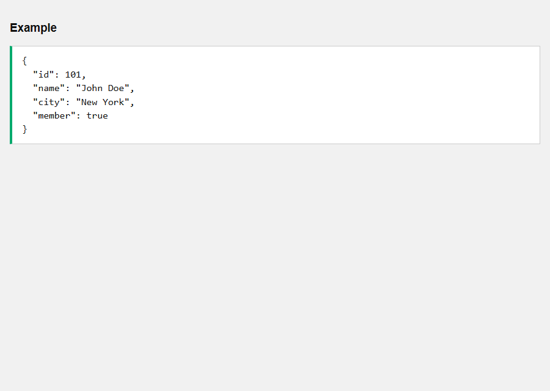


- [x] **Outcome:** Parsed `customer.json` has **id 101**, name **John Doe**, **member true**.

<a id="json-intro-example-08"></a>

### **Example 8: JSON objects — firstName / lastName**

- [x] A JSON **object** is `{ "key": value, ... }`.
- [x] Keys are strings in double quotes.
- [x] This tiny object is one employee.

Sandbox: `code_sandbox/json-intro/json-object.html`

```html
{"firstName":"John", "lastName":"Doe"}
```


- [x] **Outcome:** Parse gives **John Doe**.

<a id="json-intro-example-09"></a>

### **Example 9: JSON arrays — employees**

- [x] A JSON **array** is `[ value, value, ... ]`.
- [x] Here the value of `employees` is an array of objects.
- [x] Index **1** is Anna Smith in the W3Schools sample.

Sandbox: `code_sandbox/json-intro/json-array.html`

```html
"employees":[
  {"firstName":"John", "lastName":"Doe"},
  {"firstName":"Anna", "lastName":"Smith"},
  {"firstName":"Peter", "lastName":"Jones"}
]
```

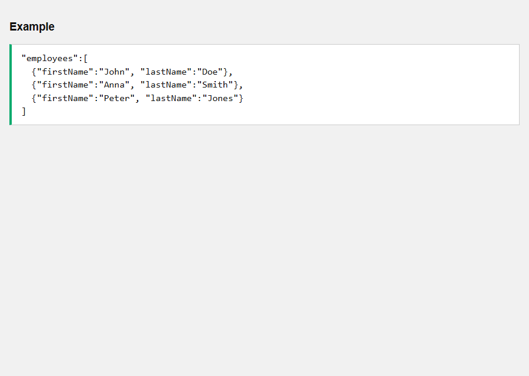


- [x] **Outcome:** `employees[1]` is **Anna Smith**.

<a id="json-intro-example-10"></a>

### **Example 10: JSON text built from concatenated strings**

- [x] Tutorials often build JSON with **string concatenation**.
- [x] That is easy to typo. Prefer a real `.json` file or `JSON.stringify`.
- [x] After concat, you still must **`JSON.parse`**.

Sandbox: `code_sandbox/json-intro/employees-text.html`

```html
let text = '{ "employees" : [' +
'{ "firstName":"John" , "lastName":"Doe" },' +
'{ "firstName":"Anna" , "lastName":"Smith" },' +
'{ "firstName":"Peter" , "lastName":"Jones" } ]}';
```

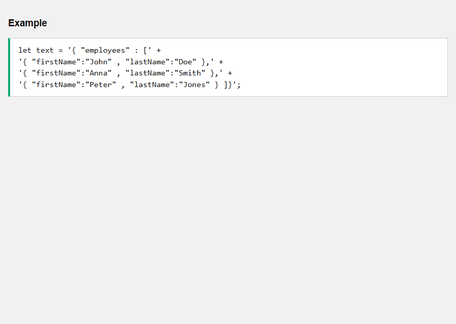


- [x] **Outcome:** `text` is a **string**; `JSON.parse(text)` succeeds and has **3** employees.

<a id="json-intro-example-11"></a>

### **Example 11: Display parsed employees[1] in HTML**

- [x] After parse, use **property access** like any JS object.
- [x] W3Schools writes `obj.employees[1].firstName` into `#demo`.
- [x] Index 1 is the **second** person (zero-based).

Sandbox: `code_sandbox/json-intro/display-anna.html`

```html
document.getElementById("demo").innerHTML =
  obj.employees[1].firstName + " " + obj.employees[1].lastName;
```

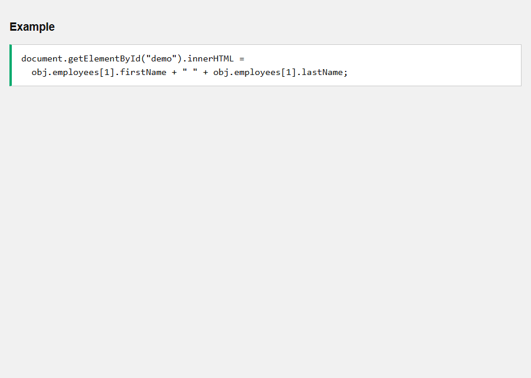


- [x] **Outcome:** The paragraph shows **Anna Smith**.

<details>
  <summary>Terminal Commands</summary>

## Terminal Commands

```bash
# from Personal/Files/javascript/code_sandbox
py -3 -m http.server 8770 --bind 127.0.0.1
```

Then open `http://127.0.0.1:8770/json-intro/`.

</details>

<details>
  <summary>Questions and Answers</summary>

## Questions and Answers

### Question 1: Is JSON a programming language?

<details>
<summary>Answer</summary>

- [x] **No** — it is a **text data** format.

</details>

### Question 2: Must JSON property names be quoted?

<details>
<summary>Answer</summary>

- [x] **Yes** — double quotes.

</details>

### Question 3: What does `JSON.parse` return?

<details>
<summary>Answer</summary>

- [x] A JavaScript **value** (object, array, string, number, boolean, or null).

</details>

### Question 4: What does `JSON.stringify` return?

<details>
<summary>Answer</summary>

- [x] A **string** of JSON text.

</details>

### Question 5: Who is `employees[1]` in the sample?

<details>
<summary>Answer</summary>

- [x] **Anna Smith**.

</details>

### Question 6: What is `typeof` of raw JSON text?

<details>
<summary>Answer</summary>

- [x] **string**.

</details>

### Question 7: Does stringify+parse keep the same object reference?

<details>
<summary>Answer</summary>

- [x] **No** — you get a **new** object.

</details>

### Question 8: What file extension is common?

<details>
<summary>Answer</summary>

- [x] **`.json`**.

</details>

### Question 9: Is JSON language-independent?

<details>
<summary>Answer</summary>

- [x] **Yes** — many languages parse it.

</details>

### Question 10: Can you use unquoted names in JSON?

<details>
<summary>Answer</summary>

- [x] **No** — that is only valid in **JavaScript** objects.

</details>


</details>

## Summary

Keep data as JSON text on the wire. Parse to use it, stringify to send or store it. Index 1 of the sample employees is Anna Smith.

## References

- [JSON Intro](https://www.w3schools.com/js/js_json.asp)
- [MDN JSON](https://developer.mozilla.org/en-US/docs/Web/JavaScript/Reference/Global_Objects/JSON)

</details>

<details>
  <summary>JSON Syntax</summary>

## Introduction

JSON syntax is stricter than JavaScript: quoted names, double-quoted strings, no trailing commas, no comments. Whitespace is optional.

This section has **21** examples:

- [x] **Example 1:** JSON object literal as text [View](#json-syntax-example-01)
- [x] **Example 2:** JSON array literal [View](#json-syntax-example-02)
- [x] **Example 3:** JSON array of strings (pretty) [View](#json-syntax-example-03)
- [x] **Example 4:** JSON array of numbers [View](#json-syntax-example-04)
- [x] **Example 5:** Property names must be double-quoted (valid) [View](#json-syntax-example-05)
- [x] **Example 6:** Unquoted property names are invalid JSON [View](#json-syntax-example-06)
- [x] **Example 7:** JSON strings use double quotes (valid) [View](#json-syntax-example-07)
- [x] **Example 8:** Single-quoted strings are invalid JSON [View](#json-syntax-example-08)
- [x] **Example 9:** Whitespace is optional — compact form [View](#json-syntax-example-09)
- [x] **Example 10:** Equivalent pretty JSON [View](#json-syntax-example-10)
- [x] **Example 11:** Trailing commas are invalid [View](#json-syntax-example-11)
- [x] **Example 12:** No trailing comma (correct) [View](#json-syntax-example-12)
- [x] **Example 13:** Comments are not allowed [View](#json-syntax-example-13)
- [x] **Example 14:** JSON value type — String [View](#json-syntax-example-14)
- [x] **Example 15:** JSON value type — Number [View](#json-syntax-example-15)
- [x] **Example 16:** JSON value type — Boolean [View](#json-syntax-example-16)
- [x] **Example 17:** JSON value type — Null [View](#json-syntax-example-17)
- [x] **Example 18:** JSON vs JS — unquoted names [View](#json-syntax-example-18)
- [x] **Example 19:** JSON vs JS — single-quoted strings [View](#json-syntax-example-19)
- [x] **Example 20:** JSON vs JS — trailing commas [View](#json-syntax-example-20)
- [x] **Example 21:** JSON vs JS — comments [View](#json-syntax-example-21)

## Detailed Explanation

- [x] Six value types.
- [x] Invalid JSON throws on parse.
- [x] JS object literals are not automatically JSON.

<a id="json-syntax-example-01"></a>

### **Example 1: JSON object literal as text**

- [x] A JSON object is `{ "name": value, ... }` inside a **string** if you parse it in JS.
- [x] Values may be string, number, boolean, null, object, or array.
- [x] `car` here is **null**.

Sandbox: `code_sandbox/json-syntax/object-literal.html`

```html
{"name":"John", "age":30, "car":null}
```


- [x] **Outcome:** Parse: **John**, age **30**, car **null**.

<a id="json-syntax-example-02"></a>

### **Example 2: JSON array literal**

- [x] Arrays use square brackets: `["Ford", "BMW", "Fiat"]`.
- [x] In JS you often keep that as a string then parse.

Sandbox: `code_sandbox/json-syntax/array-literal.html`

```html
["Ford", "BMW", "Fiat"]
```


- [x] **Outcome:** Parsed array length is **3**; index 0 is **Ford**.

<a id="json-syntax-example-03"></a>

### **Example 3: JSON array of strings (pretty)**

- [x] Whitespace between tokens is **allowed** and ignored.
- [x] Pretty-printed JSON is still the same data.

Sandbox: `code_sandbox/json-syntax/array-strings.html`

```html
[
  "Apple",
  "Banana",
  "Orange"
]
```

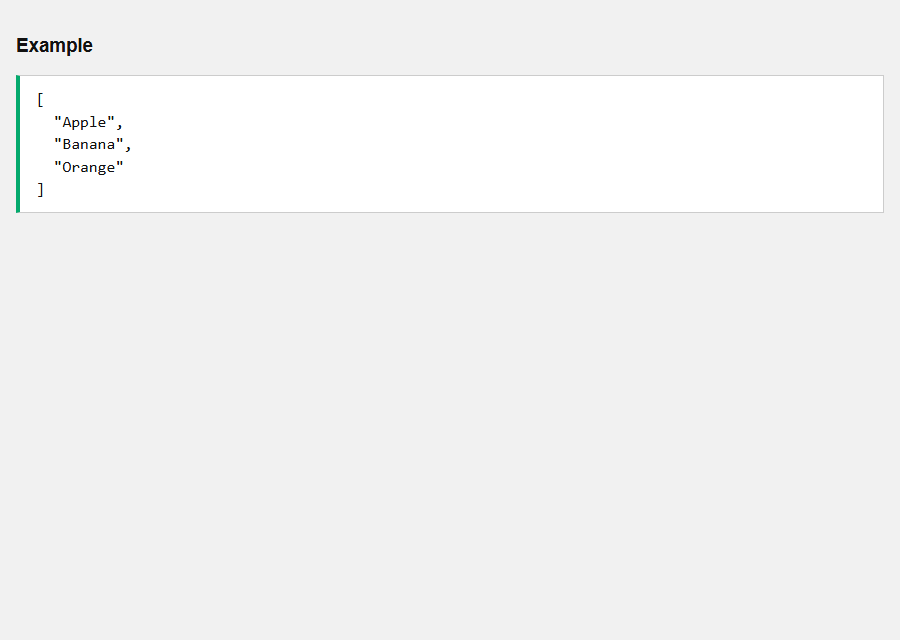


- [x] **Outcome:** Three fruits; index 1 is **Banana**.

<a id="json-syntax-example-04"></a>

### **Example 4: JSON array of numbers**

- [x] Numbers are **not** quoted.
- [x] `[1, 2, 3, 4, 5]` parses to actual numbers.

Sandbox: `code_sandbox/json-syntax/array-numbers.html`

```html
[1, 2, 3, 4, 5]
```


- [x] **Outcome:** `typeof a[0]` is **number** and the sum is **15**.

<a id="json-syntax-example-05"></a>

### **Example 5: Property names must be double-quoted (valid)**

- [x] Valid: `{ "name": "John" }`.
- [x] This is the JSON rule that bites JS developers first.

Sandbox: `code_sandbox/json-syntax/quoted-names-valid.html`

```html
{ "name": "John" }
```


- [x] **Outcome:** Parse succeeds; `name` is **John**.

<a id="json-syntax-example-06"></a>

### **Example 6: Unquoted property names are invalid JSON**

- [x] Invalid: `{ name: "John" }` — legal JS, **illegal JSON**.
- [x] `JSON.parse` throws **SyntaxError**.

Sandbox: `code_sandbox/json-syntax/unquoted-names-invalid.html`

```html
{ name: "John" }
```

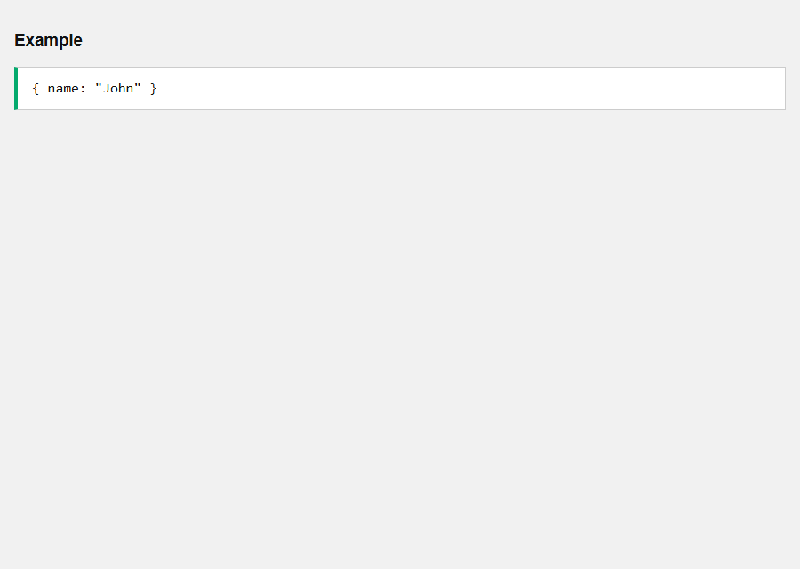


- [x] **Outcome:** Parse throws **SyntaxError**.

<a id="json-syntax-example-07"></a>

### **Example 7: JSON strings use double quotes (valid)**

- [x] Valid: `{ "city": "London" }`.
- [x] Only **double** quotes wrap strings.

Sandbox: `code_sandbox/json-syntax/double-quoted-string.html`

```html
{ "city": "London" }
```

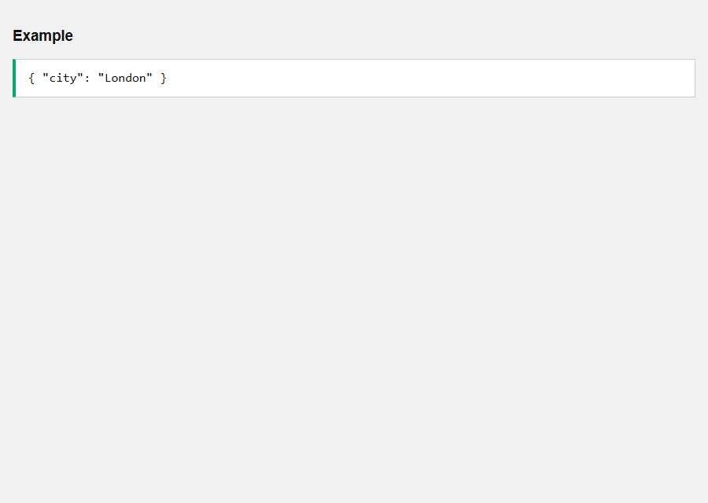

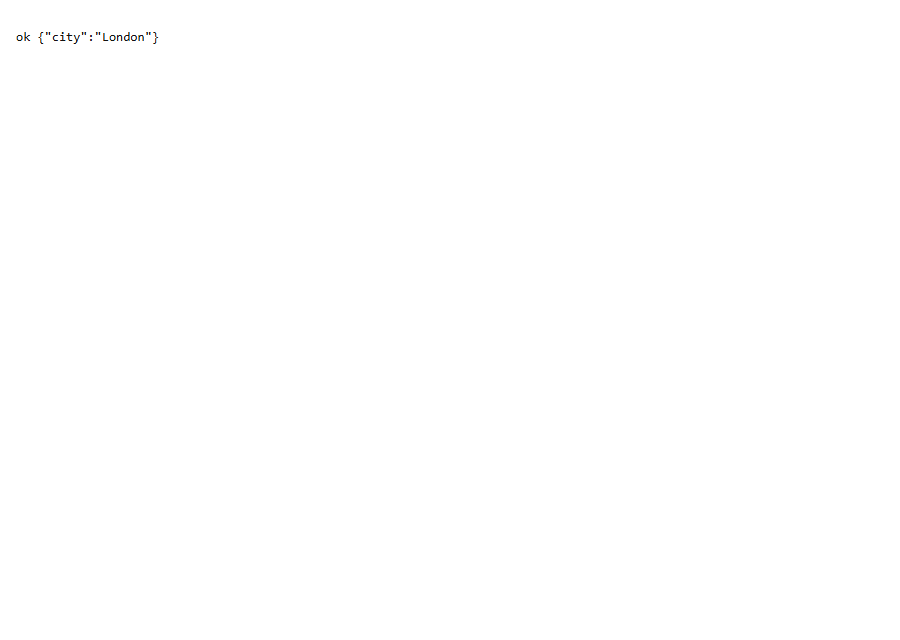

- [x] **Outcome:** Parse succeeds; city is **London**.

<a id="json-syntax-example-08"></a>

### **Example 8: Single-quoted strings are invalid JSON**

- [x] Invalid: `{ "city": 'London' }`.
- [x] JSON has no single-quoted strings.

Sandbox: `code_sandbox/json-syntax/single-quoted-string.html`

```html
{ "city": 'London' }
```


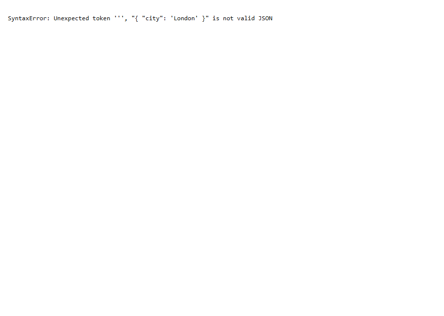

- [x] **Outcome:** Parse throws **SyntaxError**.

<a id="json-syntax-example-09"></a>

### **Example 9: Whitespace is optional — compact form**

- [x] `{"name":"John", "age":30}` is valid.
- [x] Spaces after colons/commas are optional.

Sandbox: `code_sandbox/json-syntax/whitespace-compact.html`

```html
{"name":"John", "age":30}
```


- [x] **Outcome:** Parse works; age is **30**.

<a id="json-syntax-example-10"></a>

### **Example 10: Equivalent pretty JSON**

- [x] The same object with newlines is **equivalent**.
- [x] Pretty print is for humans; parsers ignore the extra space.

Sandbox: `code_sandbox/json-syntax/whitespace-pretty.html`

```html
{
  "name": "John",
  "age": 30
}
```


- [x] **Outcome:** Pretty and compact parse to **equal** data (`age` 30).

<a id="json-syntax-example-11"></a>

### **Example 11: Trailing commas are invalid**

- [x] Wrong: `{ "name": "John", "age": 30, }` — comma after the last property.
- [x] JS objects allow trailing commas; **JSON does not**.

Sandbox: `code_sandbox/json-syntax/trailing-comma-wrong.html`

```html
{
  "name": "John",
  "age": 30,
}
```

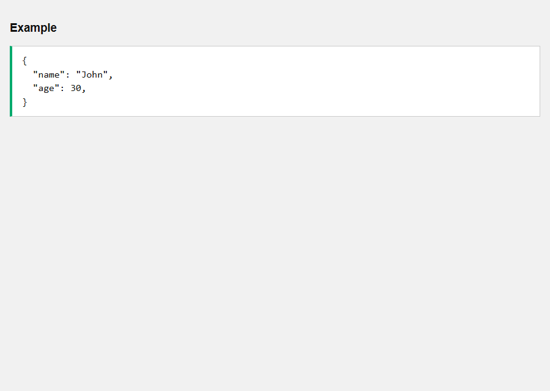

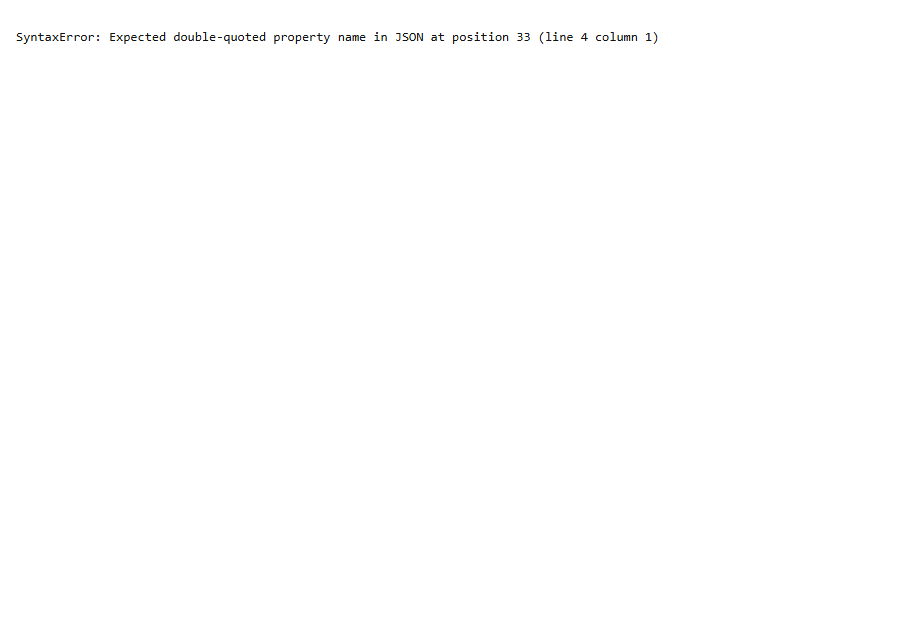

- [x] **Outcome:** Parse throws **SyntaxError** because of the trailing comma.

<a id="json-syntax-example-12"></a>

### **Example 12: No trailing comma (correct)**

- [x] Remove the last comma: `{ "name": "John", "age": 30 }`.

Sandbox: `code_sandbox/json-syntax/trailing-comma-correct.html`

```html
{
  "name": "John",
  "age": 30
}
```


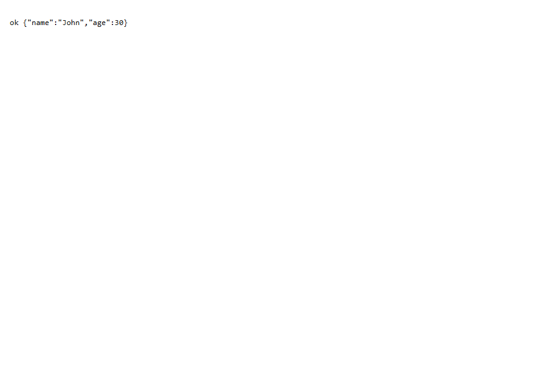

- [x] **Outcome:** Parse succeeds.

<a id="json-syntax-example-13"></a>

### **Example 13: Comments are not allowed**

- [x] Wrong: `// Customer name` inside JSON.
- [x] JSON has **no comments**. Put comments in docs, not in the payload.

Sandbox: `code_sandbox/json-syntax/comments-wrong.html`

```html
{
  // Customer name
  "name": "John"
}
```

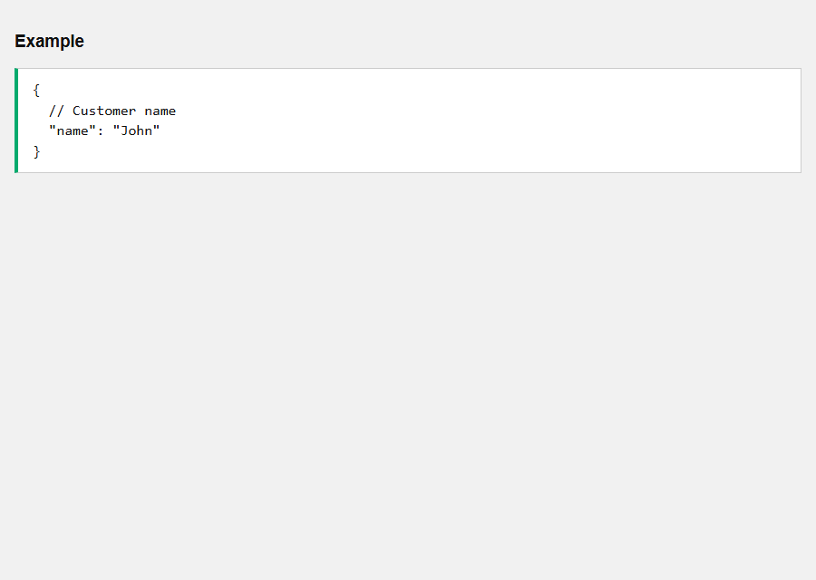


- [x] **Outcome:** Parse throws **SyntaxError** on the comment.

<a id="json-syntax-example-14"></a>

### **Example 14: JSON value type — String**

- [x] Allowed types include **String**: `"John"`.
- [x] Must use double quotes.

Sandbox: `code_sandbox/json-syntax/type-string.html`

```html
"John"
```

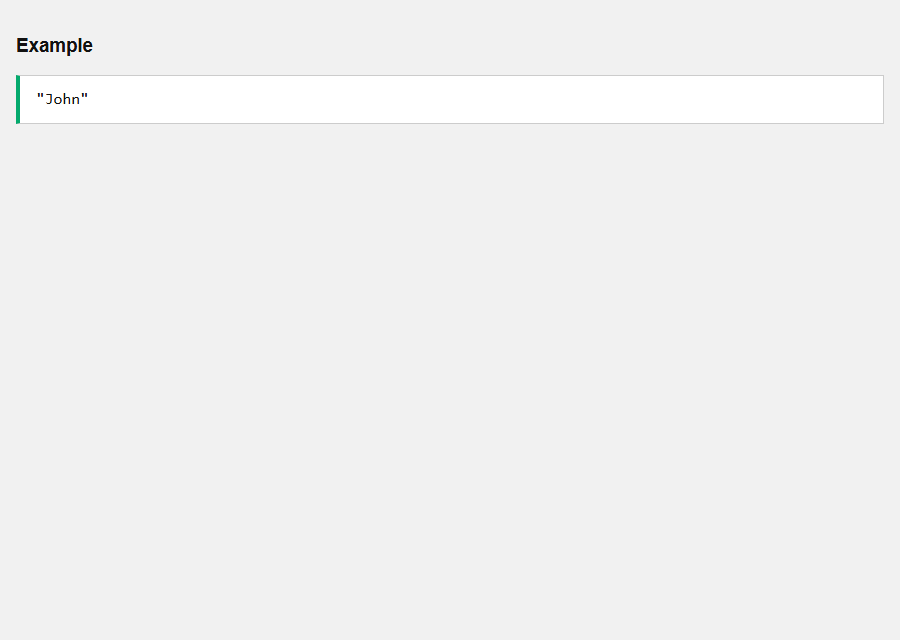


- [x] **Outcome:** `JSON.parse('"John"')` is the string **John**.

<a id="json-syntax-example-15"></a>

### **Example 15: JSON value type — Number**

- [x] **Number**: `42` with no quotes.
- [x] Quoted `"42"` would be a string.

Sandbox: `code_sandbox/json-syntax/type-number.html`

```html
42
```

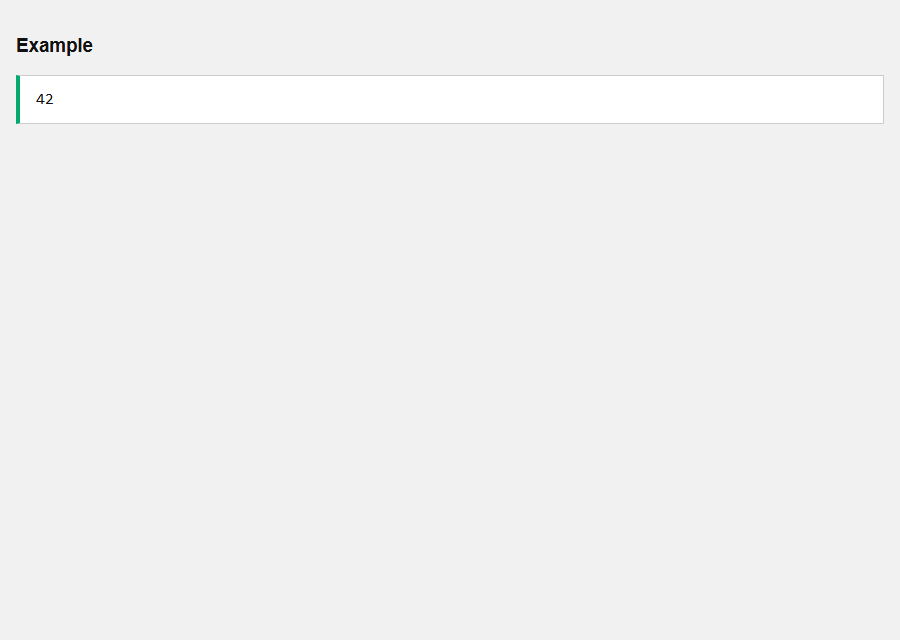


- [x] **Outcome:** `JSON.parse('42')` is number **42**.

<a id="json-syntax-example-16"></a>

### **Example 16: JSON value type — Boolean**

- [x] **Boolean**: `true` or `false` (lowercase).

Sandbox: `code_sandbox/json-syntax/type-boolean.html`

```html
true
```

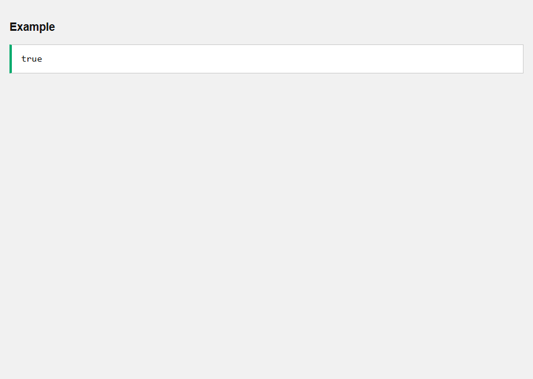


- [x] **Outcome:** `JSON.parse('true')` is boolean **true**.

<a id="json-syntax-example-17"></a>

### **Example 17: JSON value type — Null**

- [x] **Null**: the literal `null` (empty value).

Sandbox: `code_sandbox/json-syntax/type-null.html`

```html
null
```


- [x] **Outcome:** `JSON.parse('null')` is **null**.

<a id="json-syntax-example-18"></a>

### **Example 18: JSON vs JS — unquoted names**

- [x] JSON: **No**. JS: **Yes**.

Sandbox: `code_sandbox/json-syntax/vs-js-unquoted.html`

```html
JSON: { "name": "John" }
JS:   { name: "John" }
```

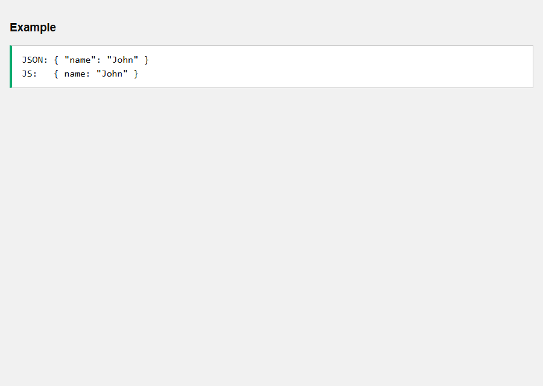


- [x] **Outcome:** JSON parse of unquoted names **fails**; a JS object literal works.

<a id="json-syntax-example-19"></a>

### **Example 19: JSON vs JS — single-quoted strings**

- [x] JSON: **No**. JS: **Yes**.

Sandbox: `code_sandbox/json-syntax/vs-js-single-quotes.html`

```html
JSON cannot use 'London'
```


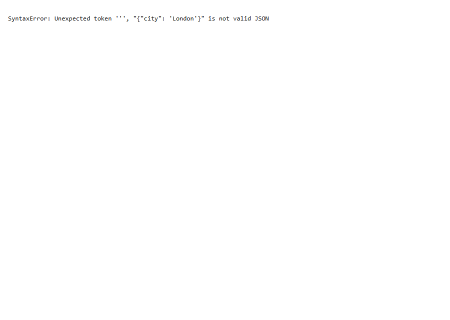

- [x] **Outcome:** JSON parse of single quotes **fails**.

<a id="json-syntax-example-20"></a>

### **Example 20: JSON vs JS — trailing commas**

- [x] JSON: **No**. JS: **Yes** (in modern engines).

Sandbox: `code_sandbox/json-syntax/vs-js-trailing.html`

```html
JSON forbids a comma after the last item
```


- [x] **Outcome:** Covered by the trailing-comma examples: JSON **SyntaxError**, JS objects allow it.

<a id="json-syntax-example-21"></a>

### **Example 21: JSON vs JS — comments**

- [x] JSON: **No**. JS: **Yes** (`//` and `/* */`).

Sandbox: `code_sandbox/json-syntax/vs-js-comments.html`

```html
// not legal in JSON
```

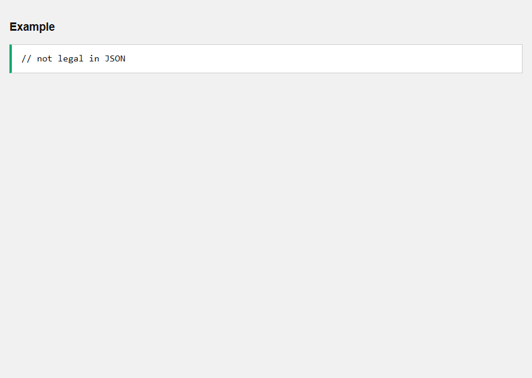

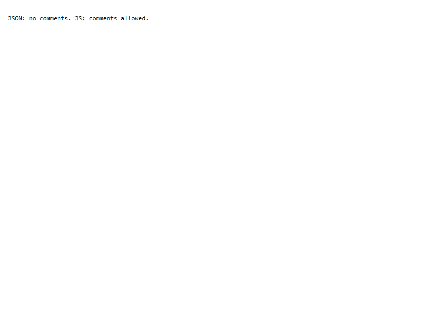

- [x] **Outcome:** JSON with a comment **throws**; JavaScript comments are fine in `.js` files.

<details>
  <summary>Terminal Commands</summary>

## Terminal Commands

```bash
# from Personal/Files/javascript/code_sandbox
py -3 -m http.server 8770 --bind 127.0.0.1
```

Then open `http://127.0.0.1:8770/json-syntax/`.

</details>

<details>
  <summary>Questions and Answers</summary>

## Questions and Answers

### Question 1: Must property names be quoted in JSON?

<details>
<summary>Answer</summary>

- [x] **Yes** — double quotes.

</details>

### Question 2: Can JSON use single-quoted strings?

<details>
<summary>Answer</summary>

- [x] **No**.

</details>

### Question 3: Are trailing commas allowed?

<details>
<summary>Answer</summary>

- [x] **No** — that is a SyntaxError.

</details>

### Question 4: Can JSON contain `//` comments?

<details>
<summary>Answer</summary>

- [x] **No**.

</details>

### Question 5: Is whitespace significant?

<details>
<summary>Answer</summary>

- [x] **No** — extra spaces/newlines between tokens are ignored.

</details>

### Question 6: Name the six JSON value types.

<details>
<summary>Answer</summary>

- [x] **String, Number, Boolean, Null, Object, Array**.

</details>

### Question 7: What does `JSON.parse('{ name: "John" }')` do?

<details>
<summary>Answer</summary>

- [x] **Throws SyntaxError** (unquoted name).

</details>

### Question 8: Is `{ name: "John" }` valid JavaScript?

<details>
<summary>Answer</summary>

- [x] **Yes** — JS object literals allow unquoted names.

</details>

### Question 9: What is `car` in the first example?

<details>
<summary>Answer</summary>

- [x] **null**.

</details>

### Question 10: Does pretty-printed JSON change the data?

<details>
<summary>Answer</summary>

- [x] **No** — it is equivalent.

</details>


</details>

## Summary

Write JSON with double quotes and no trailing commas or comments. Pretty printing does not change the data. Do not copy JS object syntax into a .json file.

## References

- [JSON Syntax](https://www.w3schools.com/js/js_json_syntax.asp)
- [MDN JSON](https://developer.mozilla.org/en-US/docs/Web/JavaScript/Reference/Global_Objects/JSON)

</details>

<details>
  <summary>JSON Values</summary>

## Introduction

JSON values are string, number, boolean, null, object, or array. Dates and functions are not types — store strings (or omit functions). undefined, NaN, Infinity, Symbol, and BigInt are not JSON.

This section has **24** examples:

- [x] **Example 1:** JSON object values [View](#json-values-example-01)
- [x] **Example 2:** Object as a property value [View](#json-values-example-02)
- [x] **Example 3:** Array as a property value [View](#json-values-example-03)
- [x] **Example 4:** JSON array values [View](#json-values-example-04)
- [x] **Example 5:** Nested object + array [View](#json-values-example-05)
- [x] **Example 6:** JSON string values [View](#json-values-example-06)
- [x] **Example 7:** JSON number values — integer, fraction, exponent [View](#json-values-example-07)
- [x] **Example 8:** Number error — quoted 42 is a string [View](#json-values-example-08)
- [x] **Example 9:** Number error — leading zeros [View](#json-values-example-09)
- [x] **Example 10:** Number error — leading plus [View](#json-values-example-10)
- [x] **Example 11:** Number error — NaN / Infinity [View](#json-values-example-11)
- [x] **Example 12:** Number error — hex / octal [View](#json-values-example-12)
- [x] **Example 13:** JSON boolean values [View](#json-values-example-13)
- [x] **Example 14:** Boolean rule — quotes make a string [View](#json-values-example-14)
- [x] **Example 15:** Boolean rule — True / FALSE are invalid [View](#json-values-example-15)
- [x] **Example 16:** Boolean rule — 1 and 0 are numbers, not booleans [View](#json-values-example-16)
- [x] **Example 17:** JSON null [View](#json-values-example-17)
- [x] **Example 18:** undefined is not a JSON value (wrong) [View](#json-values-example-18)
- [x] **Example 19:** Use null instead of undefined [View](#json-values-example-19)
- [x] **Example 20:** Dates are not a JSON type — store strings [View](#json-values-example-20)
- [x] **Example 21:** Functions are not JSON values [View](#json-values-example-21)
- [x] **Example 22:** Unsupported JS value — Symbol [View](#json-values-example-22)
- [x] **Example 23:** Unsupported JS value — BigInt throws [View](#json-values-example-23)
- [x] **Example 24:** Unsupported JS value — Infinity → null in objects [View](#json-values-example-24)

## Detailed Explanation

- [x] Nest objects and arrays.
- [x] Numbers have no leading zeros or plus signs.
- [x] Use null, not undefined.

<a id="json-values-example-01"></a>

### **Example 1: JSON object values**

- [x] Objects are `{ "key": value }`.
- [x] This one holds name, age, city.

Sandbox: `code_sandbox/json-values/object.html`

```html
{
  "name": "John",
  "age": 30,
  "city": "New York"
}
```


- [x] **Outcome:** Parsed **city** is **New York**.

<a id="json-values-example-02"></a>

### **Example 2: Object as a property value**

- [x] Values can be nested objects: `{ "employee": { ... } }`.

Sandbox: `code_sandbox/json-values/nested-employee.html`

```html
{ "employee":{"name":"John", "age":30, "city":"New York"} }
```


- [x] **Outcome:** `employee.name` is **John**.

<a id="json-values-example-03"></a>

### **Example 3: Array as a property value**

- [x] `employees` can be an array of strings.

Sandbox: `code_sandbox/json-values/array-property.html`

```html
{ "employees":["John", "Anna", "Peter"] }
```


- [x] **Outcome:** `employees[1]` is **Anna**.

<a id="json-values-example-04"></a>

### **Example 4: JSON array values**

- [x] A document may be an array at the **root**: `["Ford", ...]`.

Sandbox: `code_sandbox/json-values/array.html`

```html
["Ford", "Volvo", "BMW"]
```


- [x] **Outcome:** Index 0 is **Ford**.

<a id="json-values-example-05"></a>

### **Example 5: Nested object + array**

- [x] `address` is an object; `hobbies` is an array.
- [x] Path: `person.address.city` and `person.hobbies[1]`.

Sandbox: `code_sandbox/json-values/nested.html`

```html
{
  "name": "John",
  "age": 30,
  "address": { "city": "New York", "country": "USA" },
  "hobbies": ["Reading", "Cycling", "Photography"]
}
```


- [x] **Outcome:** City **New York**; hobby **Cycling**.

<a id="json-values-example-06"></a>

### **Example 6: JSON string values**

- [x] Strings: `""`, `"Hello World!"`, escaped quotes, Unicode `\u00A9`.
- [x] Always double-quoted.

Sandbox: `code_sandbox/json-values/strings.html`

```html
""
"Hello World!"
"He said, \"Hello!\""
"\u00A9 2026" 
```


- [x] **Outcome:** Empty string length **0**; copyright escape becomes **© 2026**.

<a id="json-values-example-07"></a>

### **Example 7: JSON number values — integer, fraction, exponent**

- [x] Integers: `-7`, `42`. Fractions: `-0.5`, `3.14`. Exponents: `2.997e8`.
- [x] No leading zeros (`05`), no `+42`, no `NaN`/`Infinity`.

Sandbox: `code_sandbox/json-values/numbers.html`

```html
{ "age": 30, "height": 1.82, "speed_of_light": 2.997e8 }
```


- [x] **Outcome:** age **30**, height **1.82**, speed **299700000**.

<a id="json-values-example-08"></a>

### **Example 8: Number error — quoted 42 is a string**

- [x] `"42"` is a **string**, not a number.

Sandbox: `code_sandbox/json-values/num-no-quotes.html`

```html
"42" 
```


- [x] **Outcome:** `typeof JSON.parse('"42"')` is **string**.

<a id="json-values-example-09"></a>

### **Example 9: Number error — leading zeros**

- [x] `05` is invalid JSON.

Sandbox: `code_sandbox/json-values/num-leading-zero.html`

```html
05
```


- [x] **Outcome:** Parse of `05` throws **SyntaxError**.

<a id="json-values-example-10"></a>

### **Example 10: Number error — leading plus**

- [x] `+42` is invalid JSON.

Sandbox: `code_sandbox/json-values/num-plus.html`

```html
+42
```


- [x] **Outcome:** Parse of `+42` throws **SyntaxError**.

<a id="json-values-example-11"></a>

### **Example 11: Number error — NaN / Infinity**

- [x] `NaN` and `Infinity` are **not** JSON numbers.

Sandbox: `code_sandbox/json-values/num-nan.html`

```html
NaN
```


- [x] **Outcome:** Parse of `NaN` throws **SyntaxError**.

<a id="json-values-example-12"></a>

### **Example 12: Number error — hex / octal**

- [x] `0x7A` is invalid JSON.

Sandbox: `code_sandbox/json-values/num-hex.html`

```html
0x7A
```


- [x] **Outcome:** Parse of `0x7A` throws **SyntaxError**.

<a id="json-values-example-13"></a>

### **Example 13: JSON boolean values**

- [x] Only lowercase **`true`** and **`false`**.
- [x] `"true"` would be a string. `True` is invalid.

Sandbox: `code_sandbox/json-values/booleans.html`

```html
{ "member": true, "student": false }
```


- [x] **Outcome:** member **true**, student **false**, both booleans.

<a id="json-values-example-14"></a>

### **Example 14: Boolean rule — quotes make a string**

- [x] `"true"` is a string.

Sandbox: `code_sandbox/json-values/bool-quoted.html`

```html
"true" 
```


- [x] **Outcome:** typeof is **string**.

<a id="json-values-example-15"></a>

### **Example 15: Boolean rule — True / FALSE are invalid**

- [x] JSON booleans are **lowercase only**.

Sandbox: `code_sandbox/json-values/bool-case.html`

```html
True
```


- [x] **Outcome:** Parse of `True` throws **SyntaxError**.

<a id="json-values-example-16"></a>

### **Example 16: Boolean rule — 1 and 0 are numbers, not booleans**

- [x] JSON does not treat `1`/`0` as booleans.

Sandbox: `code_sandbox/json-values/bool-numbers.html`

```html
1
```


- [x] **Outcome:** `JSON.parse('1')` is **number** 1, not `true`.

<a id="json-values-example-17"></a>

### **Example 17: JSON null**

- [x] `null` is an empty value.
- [x] Example: `middleName: null`.

Sandbox: `code_sandbox/json-values/null-value.html`

```html
{ "middleName": null }
```


- [x] **Outcome:** `middleName` is **null**.

<a id="json-values-example-18"></a>

### **Example 18: undefined is not a JSON value (wrong)**

- [x] `{ "city": undefined }` is **invalid JSON** (and even as JS, stringify would drop it).

Sandbox: `code_sandbox/json-values/undefined-wrong.html`

```html
{ "city": undefined }
```


- [x] **Outcome:** Parse throws **SyntaxError**.

<a id="json-values-example-19"></a>

### **Example 19: Use null instead of undefined**

- [x] Correct: `{ "city": null }`.

Sandbox: `code_sandbox/json-values/undefined-correct.html`

```html
{ "city": null }
```


- [x] **Outcome:** Parse succeeds; city is **null**.

<a id="json-values-example-20"></a>

### **Example 20: Dates are not a JSON type — store strings**

- [x] JSON has **no Date**. Store ISO strings, revive later.
- [x] Example: `"birth":"1986-12-14"`.

Sandbox: `code_sandbox/json-values/date-string.html`

```html
const text = '{"name":"John", "birth":"1986-12-14"}';
```


- [x] **Outcome:** `birth` is a **string**, not a Date, until you convert it.

<a id="json-values-example-21"></a>

### **Example 21: Functions are not JSON values**

- [x] `{ "greet": function() {return "Hello"} }` is invalid JSON.

Sandbox: `code_sandbox/json-values/function-wrong.html`

```html
{ "greet": function() {return "Hello"} }
```


- [x] **Outcome:** Parse throws **SyntaxError**.

<a id="json-values-example-22"></a>

### **Example 22: Unsupported JS value — Symbol**

- [x] **Symbol** is not a JSON type. `JSON.stringify({s: Symbol('x')})` omits it.

Sandbox: `code_sandbox/json-values/unsupported-symbol.html`

```html
JSON.stringify({ s: Symbol("x") })
```


- [x] **Outcome:** The object stringifies to **`{}`** (symbol omitted).

<a id="json-values-example-23"></a>

### **Example 23: Unsupported JS value — BigInt throws**

- [x] `JSON.stringify(1n)` throws **TypeError**.

Sandbox: `code_sandbox/json-values/unsupported-bigint.html`

```html
JSON.stringify(1n)
```


- [x] **Outcome:** The call throws **TypeError** (BigInt cannot be serialized).

<a id="json-values-example-24"></a>

### **Example 24: Unsupported JS value — Infinity → null in objects**

- [x] `Infinity` is not JSON. stringify turns it into **null** in objects/arrays.

Sandbox: `code_sandbox/json-values/unsupported-infinity.html`

```html
JSON.stringify({ n: Infinity })
```


- [x] **Outcome:** Result is **`{"n":null}`**.

<details>
  <summary>Terminal Commands</summary>

## Terminal Commands

```bash
# from Personal/Files/javascript/code_sandbox
py -3 -m http.server 8770 --bind 127.0.0.1
```

Then open `http://127.0.0.1:8770/json-values/`.

</details>

<details>
  <summary>Questions and Answers</summary>

## Questions and Answers

### Question 1: What types can JSON hold?

<details>
<summary>Answer</summary>

- [x] String, Number, Boolean, Null, Object, Array.

</details>

### Question 2: How do you nest data?

<details>
<summary>Answer</summary>

- [x] Objects and arrays as **values** of other objects/arrays.

</details>

### Question 3: Is `undefined` valid JSON?

<details>
<summary>Answer</summary>

- [x] **No** — use **null**.

</details>

### Question 4: Is `NaN` valid JSON?

<details>
<summary>Answer</summary>

- [x] **No**.

</details>

### Question 5: How should you store a date?

<details>
<summary>Answer</summary>

- [x] As an **ISO string**, then convert after parse.

</details>

### Question 6: What happens if you put a function in JSON text?

<details>
<summary>Answer</summary>

- [x] **SyntaxError** on parse.

</details>

### Question 7: What does stringify do with BigInt?

<details>
<summary>Answer</summary>

- [x] **Throws TypeError**.

</details>

### Question 8: What does stringify do with Infinity?

<details>
<summary>Answer</summary>

- [x] Converts to **null** in objects/arrays.

</details>

### Question 9: Is `True` a JSON boolean?

<details>
<summary>Answer</summary>

- [x] **No** — only lowercase **true** / **false**.

</details>

### Question 10: Is `05` a JSON number?

<details>
<summary>Answer</summary>

- [x] **No** — no leading zeros.

</details>

### Question 11: Quoted `"42"` is what type?

<details>
<summary>Answer</summary>

- [x] A **string**.

</details>


</details>

## Summary

Stick to the six types. Store dates as strings. Expect stringify to drop functions/undefined/symbols in objects, convert Infinity/NaN to null, and throw on BigInt.

## References

- [JSON Values](https://www.w3schools.com/js/js_json_datatypes.asp)
- [MDN JSON](https://developer.mozilla.org/en-US/docs/Web/JavaScript/Reference/Global_Objects/JSON)

</details>

<details>
  <summary>JSON Parse</summary>

## Introduction

`JSON.parse(text, reviver)` turns JSON text into JS values. Use a reviver to convert ages or dates. Always try/catch untrusted text. Do not parse objects or parse twice.

This section has **16** examples:

- [x] **Example 1:** JSON.parse(text, reviver) syntax [View](#json-parse-example-01)
- [x] **Example 2:** Parsing a JSON object [View](#json-parse-example-02)
- [x] **Example 3:** Parsing a JSON array [View](#json-parse-example-03)
- [x] **Example 4:** Parsing a JSON string value [View](#json-parse-example-04)
- [x] **Example 5:** Parsing a JSON number value [View](#json-parse-example-05)
- [x] **Example 6:** Parsing JSON true [View](#json-parse-example-06)
- [x] **Example 7:** Parsing JSON null [View](#json-parse-example-07)
- [x] **Example 8:** Common use — parse then show in HTML [View](#json-parse-example-08)
- [x] **Example 9:** Reviver — convert age to a number [View](#json-parse-example-09)
- [x] **Example 10:** Reviver — convert a date string to Date [View](#json-parse-example-10)
- [x] **Example 11:** Invalid JSON throws [View](#json-parse-example-11)
- [x] **Example 12:** Valid JSON object text [View](#json-parse-example-12)
- [x] **Example 13:** Invalid variants — single quotes, unquoted name, unquoted value [View](#json-parse-example-13)
- [x] **Example 14:** Handling parse errors with try/catch [View](#json-parse-example-14)
- [x] **Example 15:** Mistake — parsing a JavaScript object [View](#json-parse-example-15)
- [x] **Example 16:** Mistake — parsing JSON twice [View](#json-parse-example-16)

## Detailed Explanation

- [x] text + optional reviver.
- [x] SyntaxError on bad JSON.
- [x] Parse strings, not live objects.

<a id="json-parse-example-01"></a>

### **Example 1: JSON.parse(text, reviver) syntax**

- [x] First argument: the **JSON text** (a string).
- [x] Second: optional **reviver(key, value)** that can transform values.
- [x] Throws **SyntaxError** if the text is not JSON.

Sandbox: `code_sandbox/json-parse/syntax.html`

```html
JSON.parse(text, reviver)
```


- [x] **Outcome:** `JSON.parse` is a function of **2** parameters (`length` 2).

<a id="json-parse-example-02"></a>

### **Example 2: Parsing a JSON object**

- [x] Parse an object and read `person.name`.

Sandbox: `code_sandbox/json-parse/parse-object.html`

```html
const text = '{"name":"John","age":30,"city":"New York"}';
const person = JSON.parse(text);
let name = person.name;
```

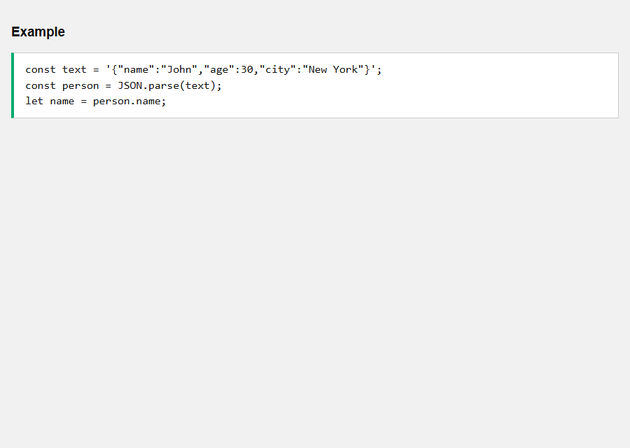


- [x] **Outcome:** **name** is **John**.

<a id="json-parse-example-03"></a>

### **Example 3: Parsing a JSON array**

- [x] A root array parses to a JS **Array**.
- [x] `cars[0]` is **Ford**.

Sandbox: `code_sandbox/json-parse/parse-array.html`

```html
const text = '["Ford","Volvo","BMW"]';
const cars = JSON.parse(text);
let name = cars[0];
```

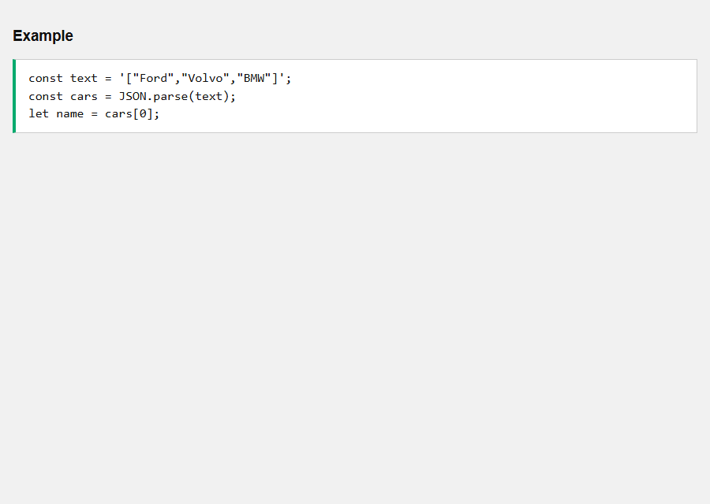


- [x] **Outcome:** **Ford** is at index 0.

<a id="json-parse-example-04"></a>

### **Example 4: Parsing a JSON string value**

- [x] `JSON.parse('"John"')` is the string John.

Sandbox: `code_sandbox/json-parse/parse-string.html`

```html
value = JSON.parse('"John"');
```


- [x] **Outcome:** Result is string **John**.

<a id="json-parse-example-05"></a>

### **Example 5: Parsing a JSON number value**

- [x] `JSON.parse('42')` is number 42.

Sandbox: `code_sandbox/json-parse/parse-number.html`

```html
value = JSON.parse('42');
```


- [x] **Outcome:** typeof **number**, value **42**.

<a id="json-parse-example-06"></a>

### **Example 6: Parsing JSON true**

- [x] `JSON.parse('true')` is boolean true.

Sandbox: `code_sandbox/json-parse/parse-true.html`

```html
value = JSON.parse('true');
```


- [x] **Outcome:** typeof **boolean**, value **true**.

<a id="json-parse-example-07"></a>

### **Example 7: Parsing JSON null**

- [x] `JSON.parse('null')` is **null** (and `typeof` is the quirky `'object'`).

Sandbox: `code_sandbox/json-parse/parse-null.html`

```html
value = JSON.parse('null');
```


- [x] **Outcome:** Value is **null**.

<a id="json-parse-example-08"></a>

### **Example 8: Common use — parse then show in HTML**

- [x] Typical pattern: parse, then `textContent` / `innerHTML` a property.

Sandbox: `code_sandbox/json-parse/display-name.html`

```html
document.getElementById("demo").innerHTML = person.name;
```


- [x] **Outcome:** The page shows **John**.

<a id="json-parse-example-09"></a>

### **Example 9: Reviver — convert age to a number**

- [x] If JSON stored age as `"30"` (string), a reviver can `return Number(value)` when `key == "age"`.
- [x] Other keys return `value` unchanged.
- [x] The reviver walks **from the inside out**.

Sandbox: `code_sandbox/json-parse/reviver-age.html`

```html
const person = JSON.parse(text, function(key, value) {
  if (key == "age") { return Number(value); }
  return value;
});
typeof person.age; // number
```

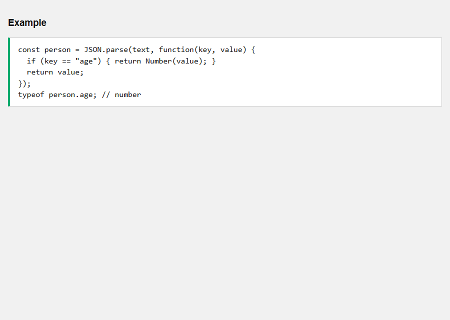


- [x] **Outcome:** `typeof person.age` is **number** (30).

<a id="json-parse-example-10"></a>

### **Example 10: Reviver — convert a date string to Date**

- [x] When `key === "date"`, `return new Date(value)`.
- [x] `typeof myObject.date` is **object** (Date).

Sandbox: `code_sandbox/json-parse/reviver-date.html`

```html
const myObject = JSON.parse(text, (key, value) => {
  if (key === "date") { return new Date(value); }
  return value;
});
typeof myObject.date; // object
```

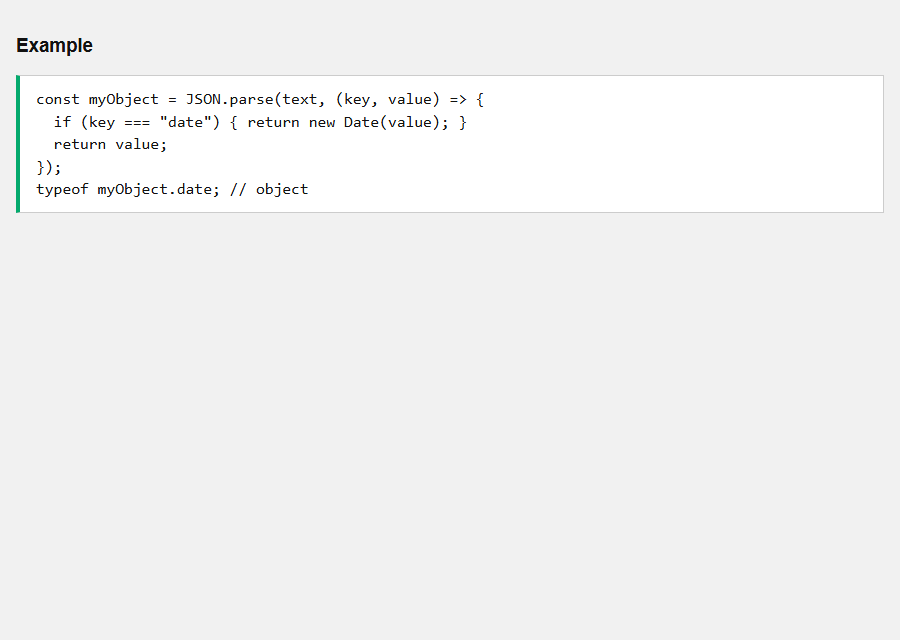


- [x] **Outcome:** `date` is a **Date** object; `getUTCFullYear()` is **2026**.

<a id="json-parse-example-11"></a>

### **Example 11: Invalid JSON throws**

- [x] `{name:'John'}` is not JSON.
- [x] Bare `JSON.parse` throws — always **try/catch** untrusted text.

Sandbox: `code_sandbox/json-parse/invalid-parse.html`

```html
const text = "{name:'John'}";
JSON.parse(text);
```

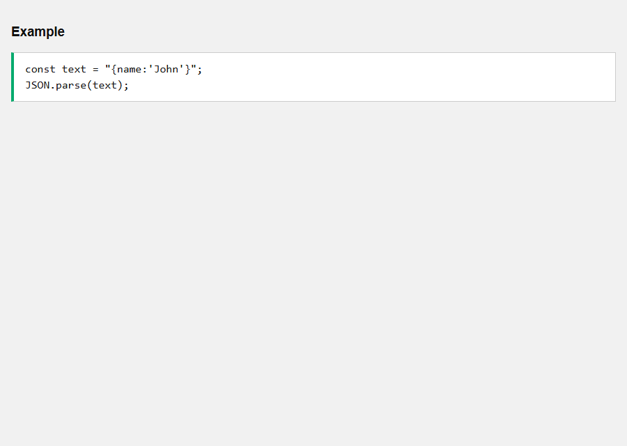


- [x] **Outcome:** Uncaught this would abort; the sandbox catches **SyntaxError**.

<a id="json-parse-example-12"></a>

### **Example 12: Valid JSON object text**

- [x] Valid: `{"name":"John"}`.

Sandbox: `code_sandbox/json-parse/valid-form.html`

```html
{"name":"John"}
```


- [x] **Outcome:** Parse succeeds.

<a id="json-parse-example-13"></a>

### **Example 13: Invalid variants — single quotes, unquoted name, unquoted value**

- [x] Invalid: `{'name':"John"}`, `{"name":'John'}`, `{name:"John"}`, `{"name":John}`.

Sandbox: `code_sandbox/json-parse/invalid-variants.html`

```html
{'name':"John"}
{"name":'John'}
{name:"John"}
{"name":John}
```

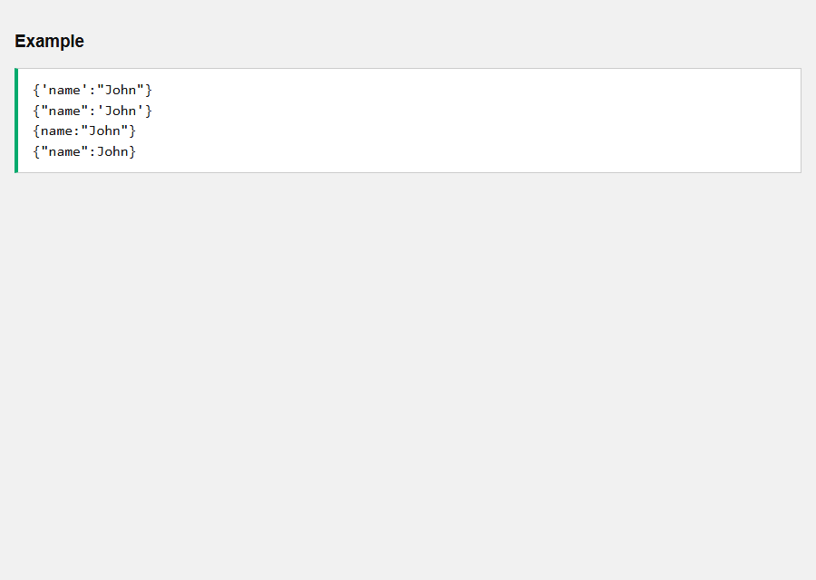


- [x] **Outcome:** Each variant throws **SyntaxError** (four errors counted).

<a id="json-parse-example-14"></a>

### **Example 14: Handling parse errors with try/catch**

- [x] Wrap `JSON.parse` in **try/catch** and display `err`.

Sandbox: `code_sandbox/json-parse/try-catch.html`

```html
try {
  const person = JSON.parse(text);
} catch(err) {
  myDisplayer(err);
}
```

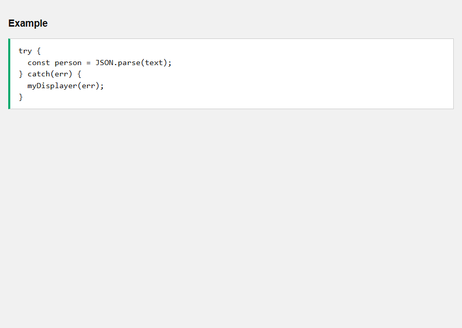


- [x] **Outcome:** The catch block receives a **SyntaxError** for `{name:'John'}`.

<a id="json-parse-example-15"></a>

### **Example 15: Mistake — parsing a JavaScript object**

- [x] `JSON.parse(person)` when `person` is already an object **coerces** it to `"[object Object]"`, which is not JSON.
- [x] That throws **SyntaxError**.

Sandbox: `code_sandbox/json-parse/parse-object-wrong.html`

```html
const person = {name: "John"};
const result = JSON.parse(person);
```

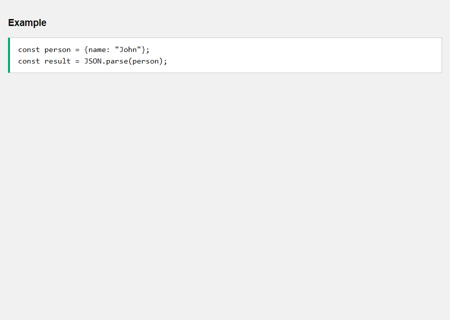

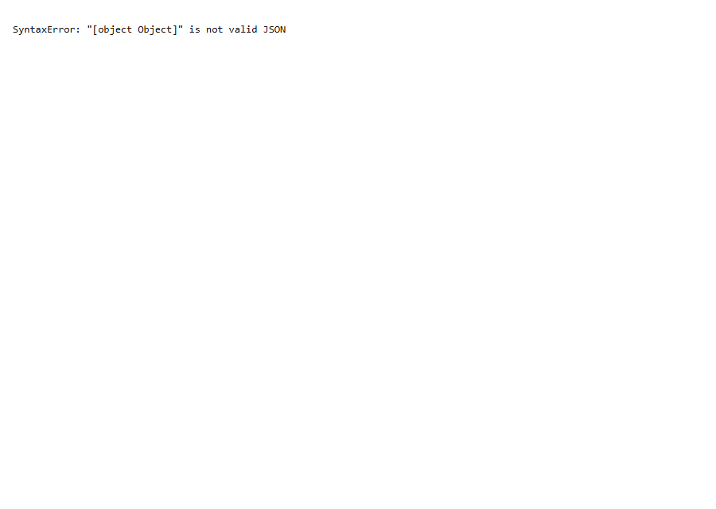

- [x] **Outcome:** The call throws **SyntaxError** (`[object Object]` is not JSON).

<a id="json-parse-example-16"></a>

### **Example 16: Mistake — parsing JSON twice**

- [x] After one parse you have an **object**. Parsing that object again fails the same way.
- [x] Or if you parse a string that is already a JS string value, a second parse of that string value may throw or return something else.
- [x] W3Schools: `JSON.parse(person)` after `person` is already parsed.

Sandbox: `code_sandbox/json-parse/parse-twice-wrong.html`

```html
const person = JSON.parse('{"name":"John"}');
const result = JSON.parse(person);
```

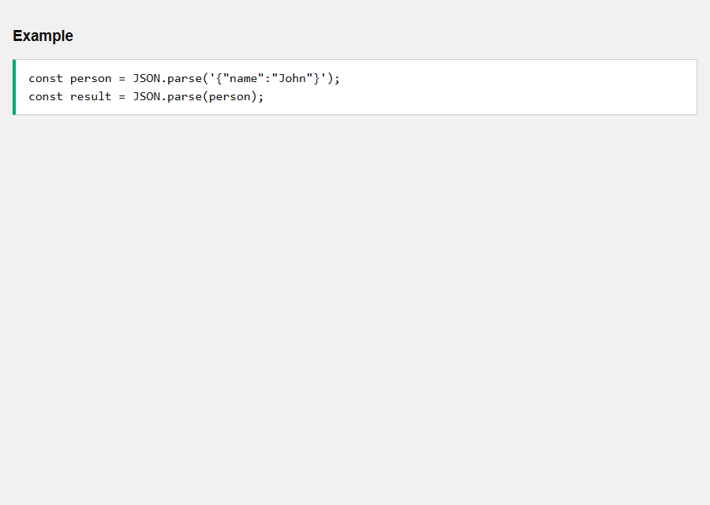


- [x] **Outcome:** The second parse throws **SyntaxError**.

<details>
  <summary>Terminal Commands</summary>

## Terminal Commands

```bash
# from Personal/Files/javascript/code_sandbox
py -3 -m http.server 8770 --bind 127.0.0.1
```

Then open `http://127.0.0.1:8770/json-parse/`.

</details>

<details>
  <summary>Questions and Answers</summary>

## Questions and Answers

### Question 1: What are the two `JSON.parse` parameters?

<details>
<summary>Answer</summary>

- [x] **text** and optional **reviver**.

</details>

### Question 2: What is `cars[0]` after parsing the cars array?

<details>
<summary>Answer</summary>

- [x] **Ford**.

</details>

### Question 3: What does a reviver receive?

<details>
<summary>Answer</summary>

- [x] **key** and **value** for each nested value.

</details>

### Question 4: How do you turn a date string into a Date?

<details>
<summary>Answer</summary>

- [x] In the reviver, `if (key === "date") return new Date(value)`.

</details>

### Question 5: What exception does bad JSON throw?

<details>
<summary>Answer</summary>

- [x] **SyntaxError**.

</details>

### Question 6: Should you parse a JS object?

<details>
<summary>Answer</summary>

- [x] **No** — parse **text** only.

</details>

### Question 7: What happens if you parse twice?

<details>
<summary>Answer</summary>

- [x] The second call gets an **object** and **throws**.

</details>

### Question 8: What is `JSON.parse('null')`?

<details>
<summary>Answer</summary>

- [x] **null**.

</details>

### Question 9: What is `JSON.parse('42')`?

<details>
<summary>Answer</summary>

- [x] The number **42**.

</details>

### Question 10: Why try/catch?

<details>
<summary>Answer</summary>

- [x] Untrusted or hand-written JSON may be **invalid**.

</details>


</details>

## Summary

Parse text once, optionally revive dates/numbers, and catch SyntaxError. Passing an already-parsed object is a common mistake.

## References

- [JSON Parse](https://www.w3schools.com/js/js_json_parse.asp)
- [MDN JSON](https://developer.mozilla.org/en-US/docs/Web/JavaScript/Reference/Global_Objects/JSON)

</details>

<details>
  <summary>JSON Stringify</summary>

## Introduction

`JSON.stringify(value, replacer, space)` builds JSON text. Replacer can pick keys or transform values. space pretty-prints. Functions/undefined/symbols are omitted in objects and become null in arrays. Circular objects and BigInt throw.

This section has **16** examples:

- [x] **Example 1:** JSON.stringify(value, replacer, space) [View](#json-stringify-example-01)
- [x] **Example 2:** Converting an object [View](#json-stringify-example-02)
- [x] **Example 3:** Converting an array [View](#json-stringify-example-03)
- [x] **Example 4:** Converting other values [View](#json-stringify-example-04)
- [x] **Example 5:** Selecting properties with a replacer array [View](#json-stringify-example-05)
- [x] **Example 6:** Transforming values with a replacer function [View](#json-stringify-example-06)
- [x] **Example 7:** Formatting JSON with space [View](#json-stringify-example-07)
- [x] **Example 8:** Functions and undefined are omitted from objects [View](#json-stringify-example-08)
- [x] **Example 9:** NaN and Infinity become null in objects [View](#json-stringify-example-09)
- [x] **Example 10:** In arrays, functions/undefined/NaN/Infinity become null [View](#json-stringify-example-10)
- [x] **Example 11:** Stringifying dates [View](#json-stringify-example-11)
- [x] **Example 12:** Storing JSON in localStorage [View](#json-stringify-example-12)
- [x] **Example 13:** Mistake — stringifying twice [View](#json-stringify-example-13)
- [x] **Example 14:** Circular objects throw TypeError [View](#json-stringify-example-14)
- [x] **Example 15:** BigInt throws TypeError [View](#json-stringify-example-15)
- [x] **Example 16:** Symbol omitted from objects, null in arrays [View](#json-stringify-example-16)

## Detailed Explanation

- [x] replacer array or function.
- [x] space for indent.
- [x] localStorage needs strings.

<a id="json-stringify-example-01"></a>

### **Example 1: JSON.stringify(value, replacer, space)**

- [x] **value** — what to convert.
- [x] **replacer** — a function or an array of keys to keep.
- [x] **space** — number or string for indentation.

Sandbox: `code_sandbox/json-stringify/syntax.html`

```html
JSON.stringify(value, replacer, space)
```

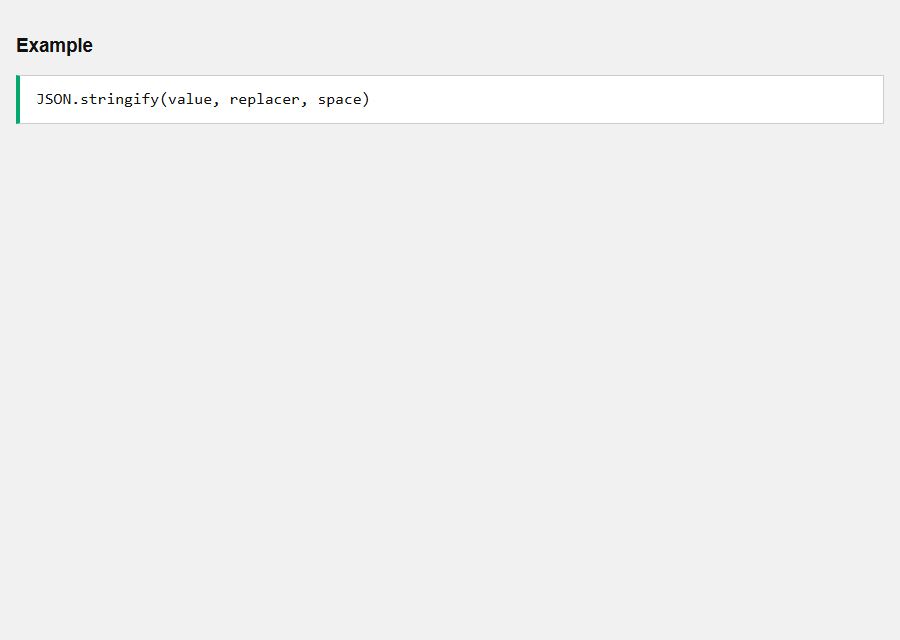


- [x] **Outcome:** `JSON.stringify.length` is **3**.

<a id="json-stringify-example-02"></a>

### **Example 2: Converting an object**

- [x] Stringify `{name, age, city}` to JSON text.

Sandbox: `code_sandbox/json-stringify/object.html`

```html
const person = { name: "John", age: 30, city: "New York" };
const text = JSON.stringify(person);
```

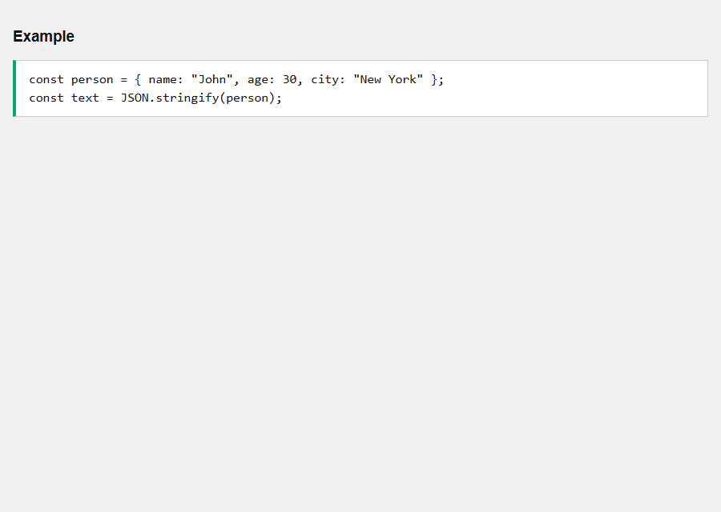

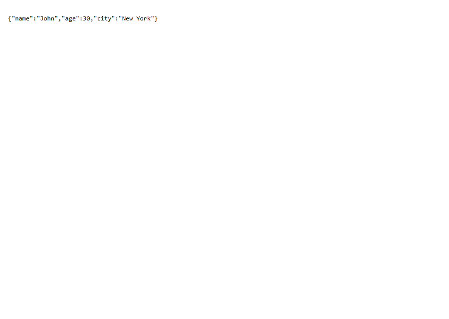

- [x] **Outcome:** Text contains **`"name":"John"`** and **`"age":30`**.

<a id="json-stringify-example-03"></a>

### **Example 3: Converting an array**

- [x] Arrays stringify to JSON arrays.

Sandbox: `code_sandbox/json-stringify/array.html`

```html
const cars = ["Ford", "Volvo", "BMW"];
const text = JSON.stringify(cars);
```

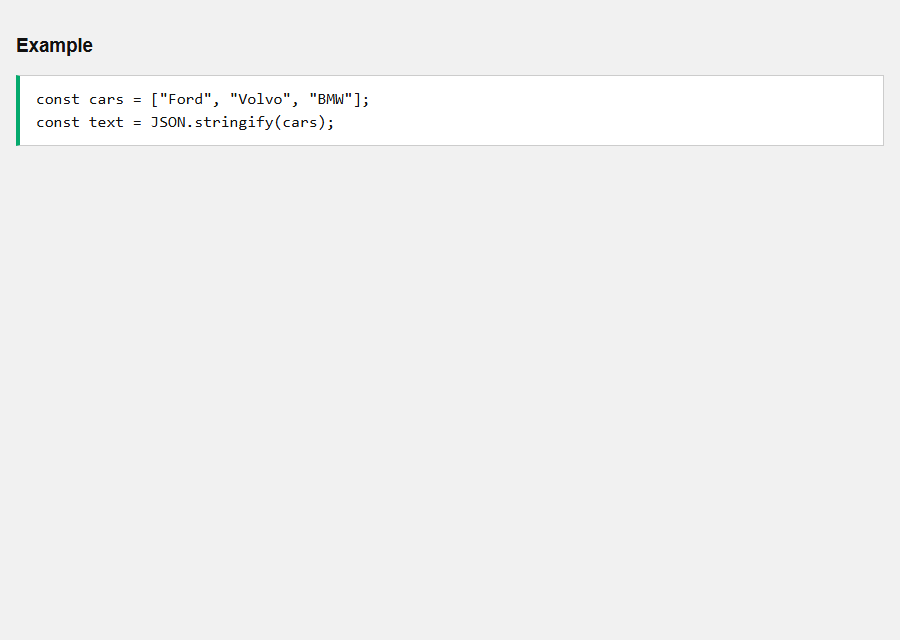

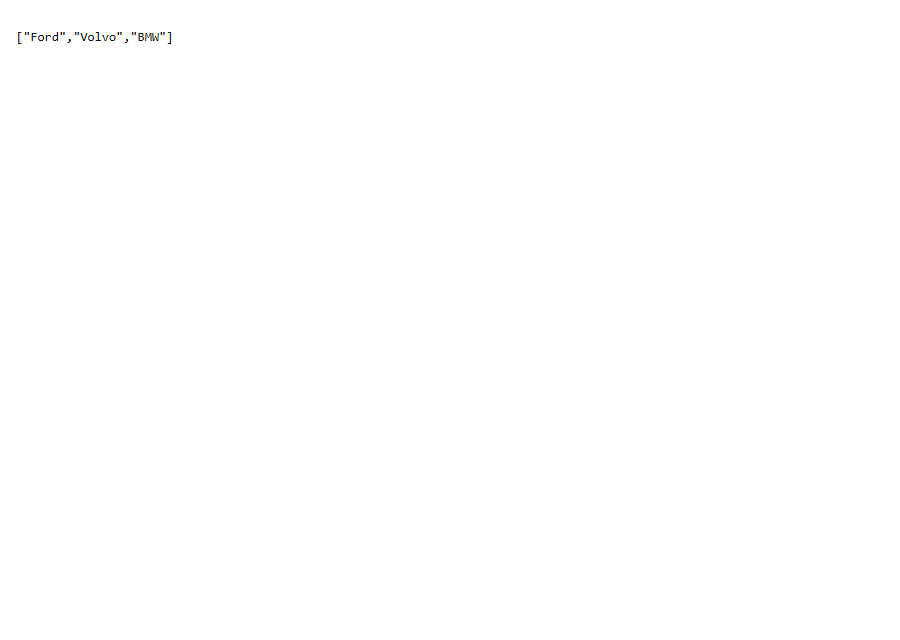

- [x] **Outcome:** Result is **`["Ford","Volvo","BMW"]`**.

<a id="json-stringify-example-04"></a>

### **Example 4: Converting other values**

- [x] The page stringifies a string, numbers, booleans, Boolean objects, undefined, null, NaN, Infinity.
- [x] `undefined` as a **root** value becomes `undefined` (the JS value), not a JSON text — `JSON.stringify(undefined)` returns **undefined**, so `String(...)` shows that.
- [x] `null`, `NaN`, `Infinity` become **`null`** as JSON text.

Sandbox: `code_sandbox/json-stringify/other-values.html`

```html
JSON.stringify("John");
JSON.stringify(42);
JSON.stringify(false);
JSON.stringify(Boolean(0));
JSON.stringify(true);
JSON.stringify(Boolean(1));
JSON.stringify(undefined);
JSON.stringify(null);
JSON.stringify(NaN);
JSON.stringify(Infinity);
```

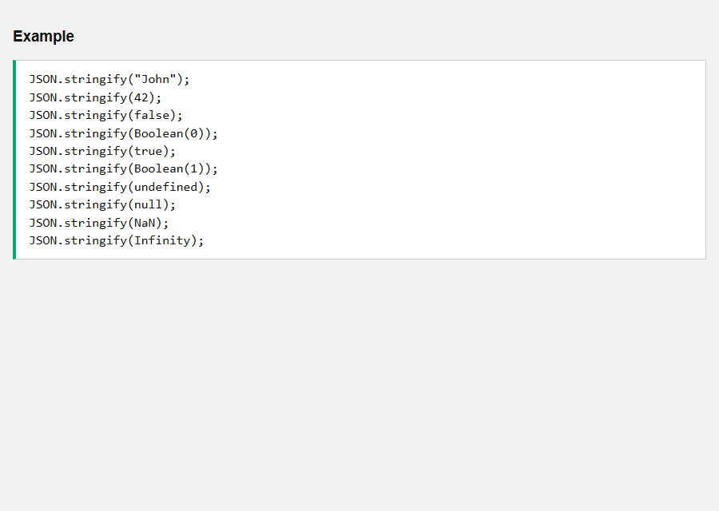


- [x] **Outcome:** Each call’s JSON text (or `undefined`) is listed. Null/NaN/Infinity are **`null`**.

<a id="json-stringify-example-05"></a>

### **Example 5: Selecting properties with a replacer array**

- [x] `JSON.stringify(person, ["name", "city"])` keeps **only** those keys.
- [x] `age` is omitted.

Sandbox: `code_sandbox/json-stringify/select-keys.html`

```html
let text = JSON.stringify(person, ["name", "city"]);
```


- [x] **Outcome:** JSON has **name** and **city**, not **age**.

<a id="json-stringify-example-06"></a>

### **Example 6: Transforming values with a replacer function**

- [x] If `key == "age"`, return `value + 1`.
- [x] Other keys return `value`.

Sandbox: `code_sandbox/json-stringify/replacer-fn.html`

```html
JSON.stringify(person, function(key, value) {
  if (key == "age") { return value + 1; }
  return value;
});
```

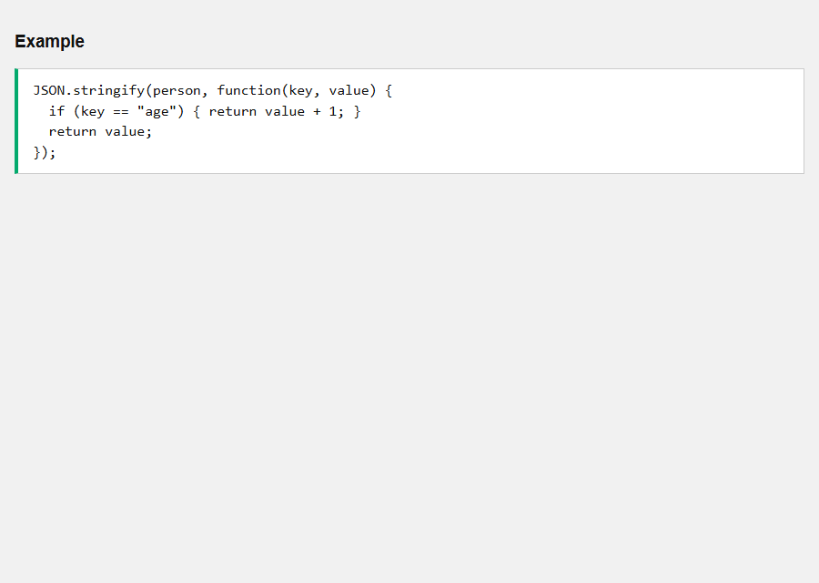


- [x] **Outcome:** Age in the JSON text is **31**.

<a id="json-stringify-example-07"></a>

### **Example 7: Formatting JSON with space**

- [x] `JSON.stringify(person, null, 1)` pretty-prints with **1** space indent.
- [x] `2` or `"\t"` are common.

Sandbox: `code_sandbox/json-stringify/space.html`

```html
let text = JSON.stringify(person, null, 1);
```

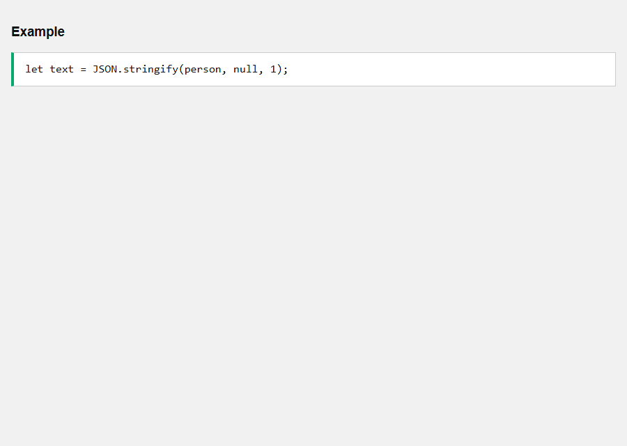

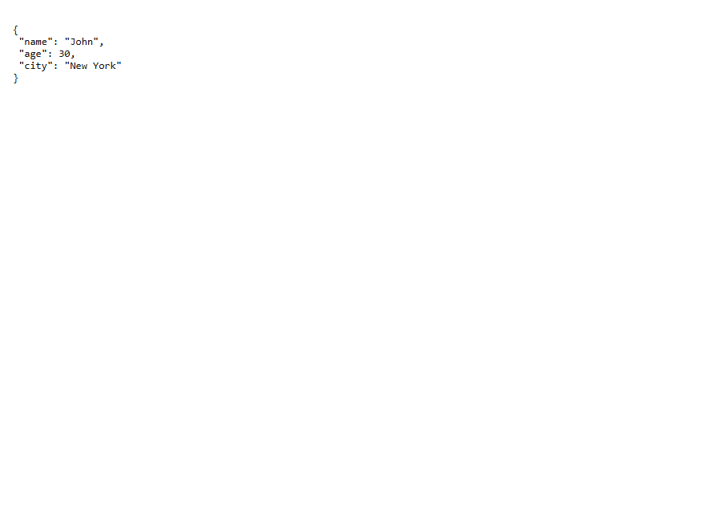

- [x] **Outcome:** The result contains **newlines** and indented `"name"`.

<a id="json-stringify-example-08"></a>

### **Example 8: Functions and undefined are omitted from objects**

- [x] `greet: function(){}` and `age: undefined` disappear.
- [x] Only **name** remains.

Sandbox: `code_sandbox/json-stringify/omit-fn-undef.html`

```html
JSON.stringify({ name: "John", greet: function() {}, age: undefined })
```

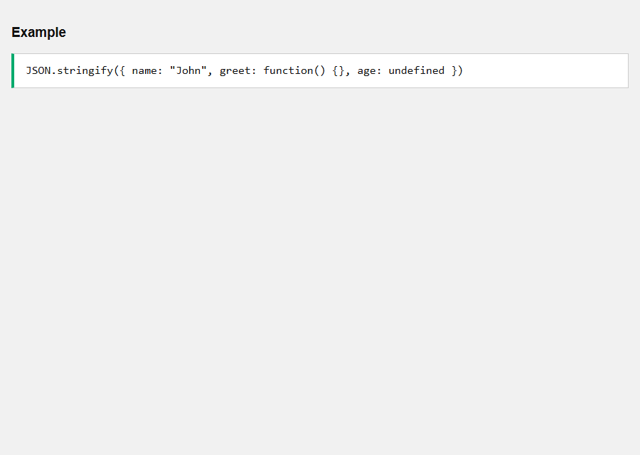


- [x] **Outcome:** Result is **`{"name":"John"}`**.

<a id="json-stringify-example-09"></a>

### **Example 9: NaN and Infinity become null in objects**

- [x] W3Schools writes `NAN` (typo). The real value is **`NaN`**.
- [x] Both stringify to **null**.

Sandbox: `code_sandbox/json-stringify/nan-infinity-obj.html`

```html
JSON.stringify({ name: "John", greet: NaN, age: Infinity })
```

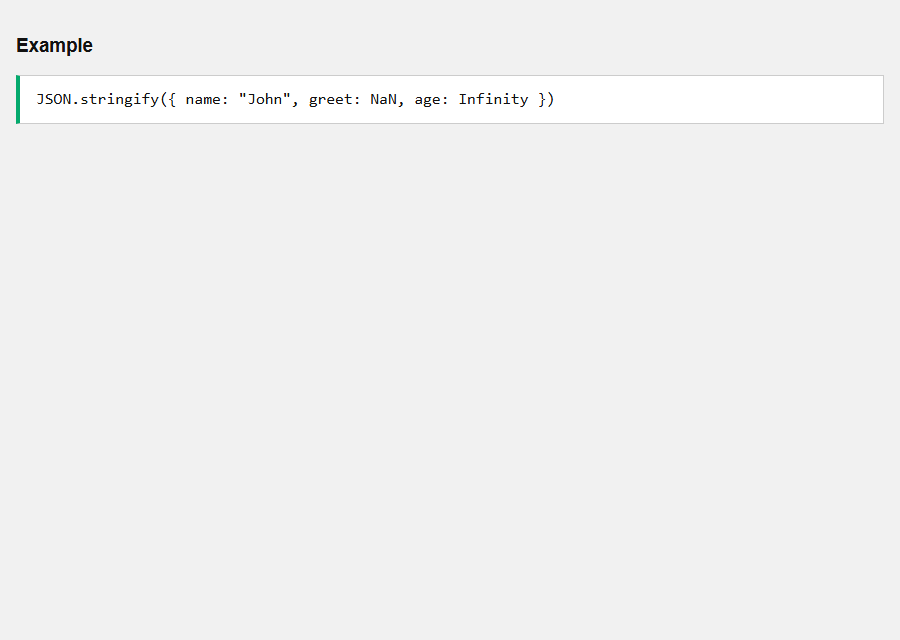

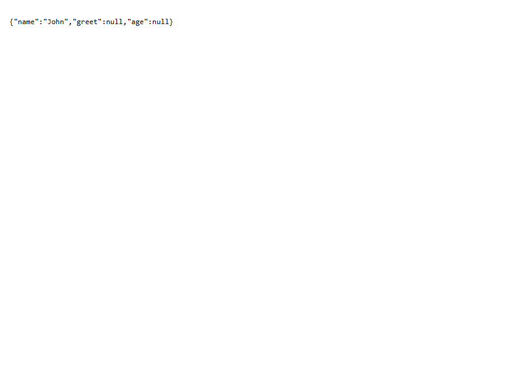

- [x] **Outcome:** JSON has **null** for both greet and age. (The page’s `NAN` identifier would be a ReferenceError — we use `NaN`.)

<a id="json-stringify-example-10"></a>

### **Example 10: In arrays, functions/undefined/NaN/Infinity become null**

- [x] Array stringify **keeps slots**: those values become **`null`**, they are not omitted.

Sandbox: `code_sandbox/json-stringify/array-holes.html`

```html
JSON.stringify(["Ford", "Volvo", function() {}, undefined, NaN, Infinity])
```


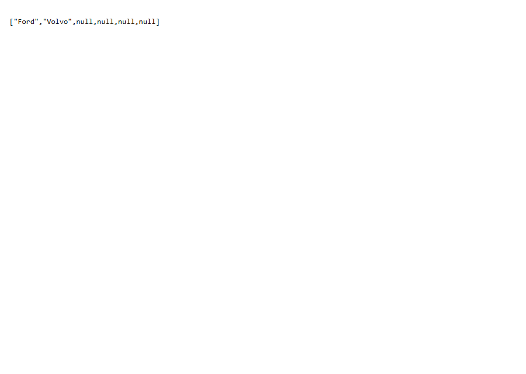

- [x] **Outcome:** Result includes **null** entries for the last four slots.

<a id="json-stringify-example-11"></a>

### **Example 11: Stringifying dates**

- [x] Date objects become **ISO strings** in JSON.
- [x] Parse will give a string unless you revive.

Sandbox: `code_sandbox/json-stringify/dates.html`

```html
const person = {name:"John", today:date, city:"New York"};
let text = JSON.stringify(person);
```

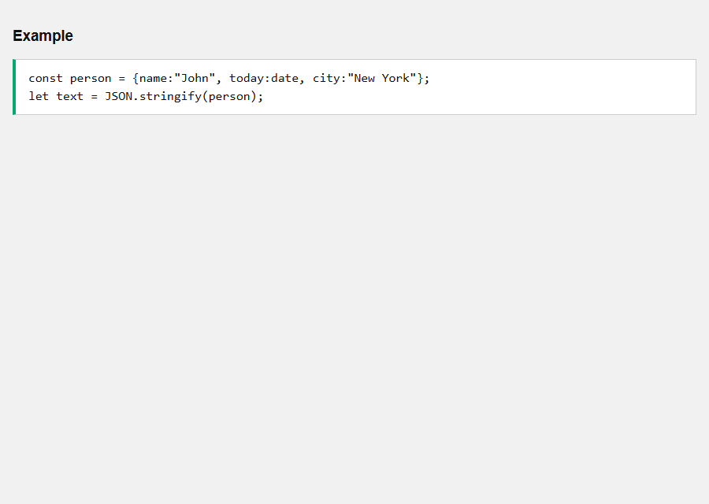

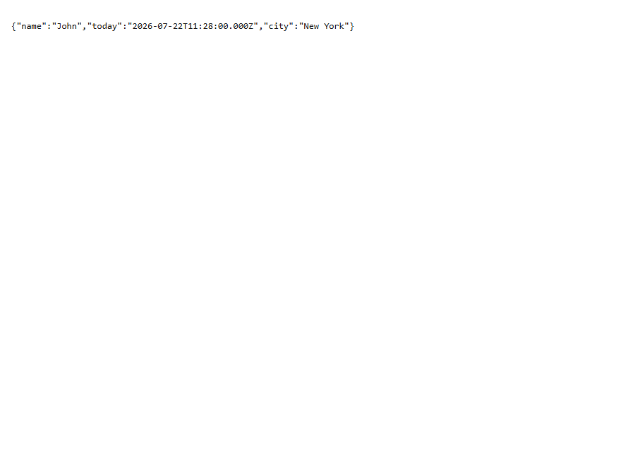

- [x] **Outcome:** `today` in the JSON is a string starting with **20** (ISO year).

<a id="json-stringify-example-12"></a>

### **Example 12: Storing JSON in localStorage**

- [x] stringify → `localStorage.setItem` → `getItem` → parse.
- [x] This is the standard “save object” pattern.
- [x] Storage is **string-only**.

Sandbox: `code_sandbox/json-stringify/local-storage.html`

```html
const myJSON = JSON.stringify(myObj);
localStorage.setItem("testJSON", myJSON);
let obj = JSON.parse(localStorage.getItem("testJSON"));
```

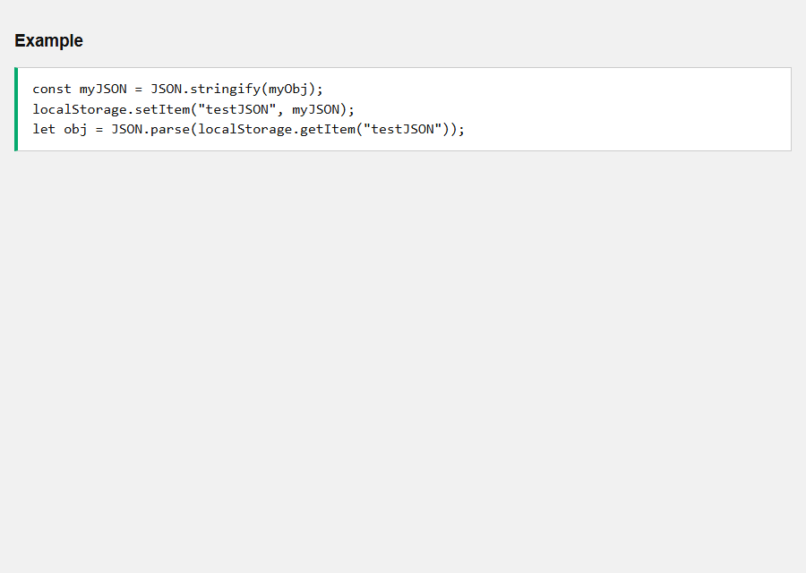


- [x] **Outcome:** Round-trip: **John**, age **31**, city **New York**.

<a id="json-stringify-example-13"></a>

### **Example 13: Mistake — stringifying twice**

- [x] Stringify of an object is a string. Stringify **that string** wraps it in extra quotes and escapes.
- [x] Parse once would still be a **string**, not an object.

Sandbox: `code_sandbox/json-stringify/double-stringify.html`

```html
const text = JSON.stringify(person);
const textAgain = JSON.stringify(text);
```

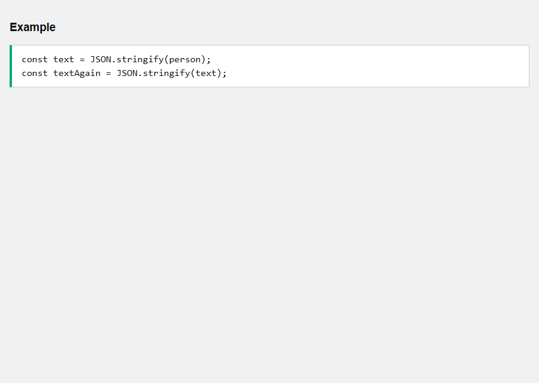


- [x] **Outcome:** `textAgain` starts with **`"`** and contains escaped quotes — it is JSON of a string.

<a id="json-stringify-example-14"></a>

### **Example 14: Circular objects throw TypeError**

- [x] `person.self = person` cannot be represented in JSON.
- [x] `JSON.stringify(person)` throws **TypeError**.

Sandbox: `code_sandbox/json-stringify/circular.html`

```html
person.self = person;
JSON.stringify(person);
```

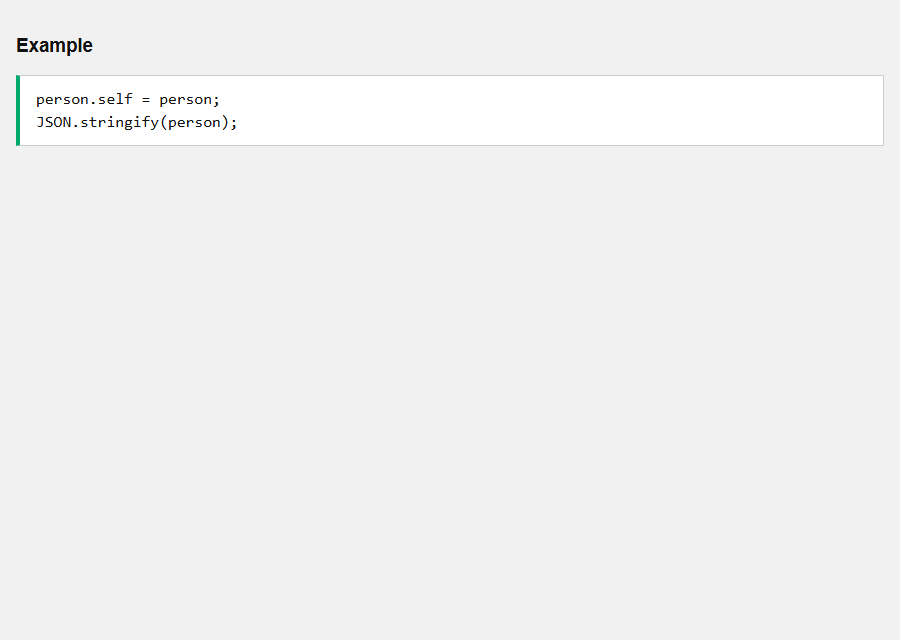

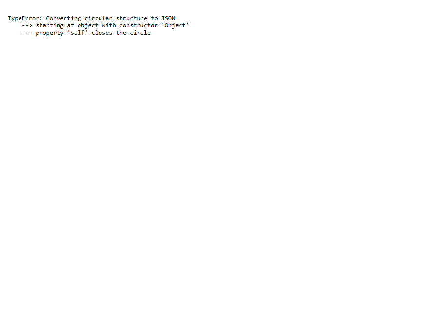

- [x] **Outcome:** The catch block reports **TypeError** (circular structure).

<a id="json-stringify-example-15"></a>

### **Example 15: BigInt throws TypeError**

- [x] Table row: BigInt cannot be serialized.

Sandbox: `code_sandbox/json-stringify/bigint-throws.html`

```html
JSON.stringify(10n)
```

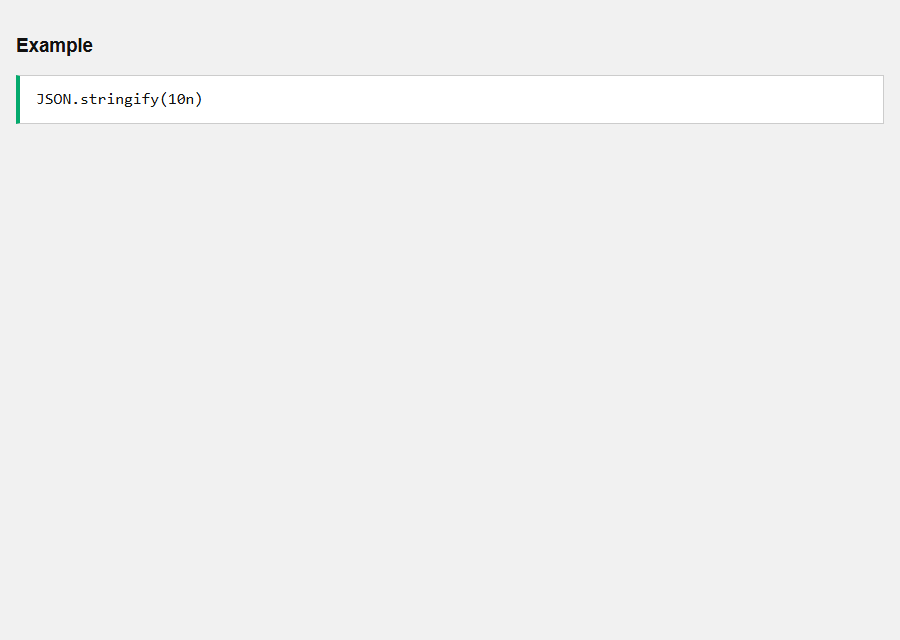


- [x] **Outcome:** **TypeError** is thrown.

<a id="json-stringify-example-16"></a>

### **Example 16: Symbol omitted from objects, null in arrays**

- [x] Table: Symbol is omitted in objects; in arrays it becomes **null**.

Sandbox: `code_sandbox/json-stringify/symbol-omit.html`

```html
JSON.stringify({ s: Symbol("x") })
JSON.stringify([Symbol("x")])
```

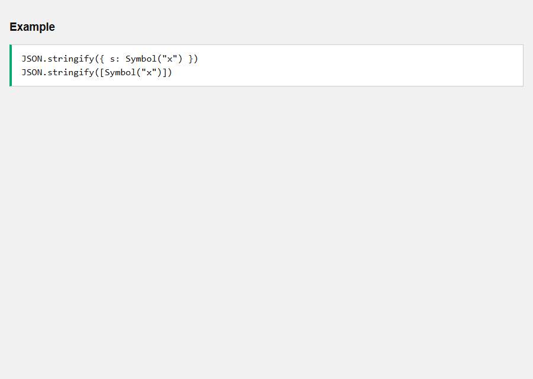


- [x] **Outcome:** Object → **`{}`**. Array → **`[null]`**.

<details>
  <summary>Terminal Commands</summary>

## Terminal Commands

```bash
# from Personal/Files/javascript/code_sandbox
py -3 -m http.server 8770 --bind 127.0.0.1
```

Then open `http://127.0.0.1:8770/json-stringify/`.

</details>

<details>
  <summary>Questions and Answers</summary>

## Questions and Answers

### Question 1: What are stringify’s three parameters?

<details>
<summary>Answer</summary>

- [x] **value**, **replacer**, **space**.

</details>

### Question 2: How do you keep only some keys?

<details>
<summary>Answer</summary>

- [x] Pass an **array of key names** as replacer.

</details>

### Question 3: How do you pretty-print?

<details>
<summary>Answer</summary>

- [x] Pass a **space** number or string as the third argument.

</details>

### Question 4: What happens to functions in objects?

<details>
<summary>Answer</summary>

- [x] They are **omitted**.

</details>

### Question 5: What happens to functions in arrays?

<details>
<summary>Answer</summary>

- [x] They become **null**.

</details>

### Question 6: What happens to `undefined` in objects?

<details>
<summary>Answer</summary>

- [x] **Omitted**.

</details>

### Question 7: What happens to Date objects?

<details>
<summary>Answer</summary>

- [x] They become **ISO strings**.

</details>

### Question 8: How do you save an object in localStorage?

<details>
<summary>Answer</summary>

- [x] **stringify**, `setItem`, later `getItem` + **parse**.

</details>

### Question 9: What does a circular object do?

<details>
<summary>Answer</summary>

- [x] **Throws TypeError**.

</details>

### Question 10: What does BigInt do?

<details>
<summary>Answer</summary>

- [x] **Throws TypeError**.

</details>

### Question 11: Why is double stringify a mistake?

<details>
<summary>Answer</summary>

- [x] You store a **string of a string**, not the object.

</details>


</details>

## Summary

Stringify once, pretty-print with space, and store with localStorage via stringify/parse. Do not stringify twice. Catch TypeError for cycles and BigInt.

## References

- [JSON Stringify](https://www.w3schools.com/js/js_json_stringify.asp)
- [MDN JSON](https://developer.mozilla.org/en-US/docs/Web/JavaScript/Reference/Global_Objects/JSON)

</details>

<details>
  <summary>JSON Fetch</summary>

## Introduction

Load JSON with `fetch` + `response.json()`. Check `ok`. POST with Content-Type application/json and a stringify body. Promise.all loads several files. XHR + JSON.parse is the older path. This sandbox uses local files; `/api/person` is mocked with result.json.

This section has **19** examples:

- [x] **Example 1:** A JSON file — customer.json [View](#json-fetch-example-01)
- [x] **Example 2:** Loading JSON with fetch + response.json() [View](#json-fetch-example-02)
- [x] **Example 3:** Loading a JSON array — products.json [View](#json-fetch-example-03)
- [x] **Example 4:** loadProducts — first name and price [View](#json-fetch-example-04)
- [x] **Example 5:** Checking response.ok and status [View](#json-fetch-example-05)
- [x] **Example 6:** Handling HTTP errors with throw [View](#json-fetch-example-06)
- [x] **Example 7:** Loading multiple JSON files with Promise.all [View](#json-fetch-example-07)
- [x] **Example 8:** Sending JSON — method, headers, body [View](#json-fetch-example-08)
- [x] **Example 9:** The Content-Type header [View](#json-fetch-example-09)
- [x] **Example 10:** The request body is JSON.stringify(person) [View](#json-fetch-example-10)
- [x] **Example 11:** Reading the server response as JSON [View](#json-fetch-example-11)
- [x] **Example 12:** Checking the POST response [View](#json-fetch-example-12)
- [x] **Example 13:** Complete sendPerson with try/catch [View](#json-fetch-example-13)
- [x] **Example 14:** Complete example — send name and age from inputs [View](#json-fetch-example-14)
- [x] **Example 15:** What response.json() can return [View](#json-fetch-example-15)
- [x] **Example 16:** Older pattern — stringify onto a query string [View](#json-fetch-example-16)
- [x] **Example 17:** Receiving data — JSON.parse a text payload [View](#json-fetch-example-17)
- [x] **Example 18:** JSON from a server with XMLHttpRequest [View](#json-fetch-example-18)
- [x] **Example 19:** Array as JSON via XHR [View](#json-fetch-example-19)

## Detailed Explanation

- [x] response.json() already parses.
- [x] 404 does not throw.
- [x] body must be a string.

<a id="json-fetch-example-01"></a>

### **Example 1: A JSON file — customer.json**

- [x] JSON on disk is just text with a **`.json`** name.
- [x] This file has id, name, city, member.

Sandbox: `code_sandbox/json-fetch/customer-file.html`

```javascript
{
  "id": 101,
  "name": "John Doe",
  "city": "New York",
  "member": true
}
```


- [x] **Outcome:** Fetched object: **John Doe** in **New York**.

<a id="json-fetch-example-02"></a>

### **Example 2: Loading JSON with fetch + response.json()**

- [x] `await fetch` then **`await response.json()`** — already parsed.
- [x] Do **not** `JSON.parse` the result of `.json()`.

Sandbox: `code_sandbox/json-fetch/load-json.html`

```javascript
async function loadJSON() {
  const response = await fetch("customer.json");
  const customer = await response.json();
  myDisplayer(customer.name);
}
loadJSON();
```

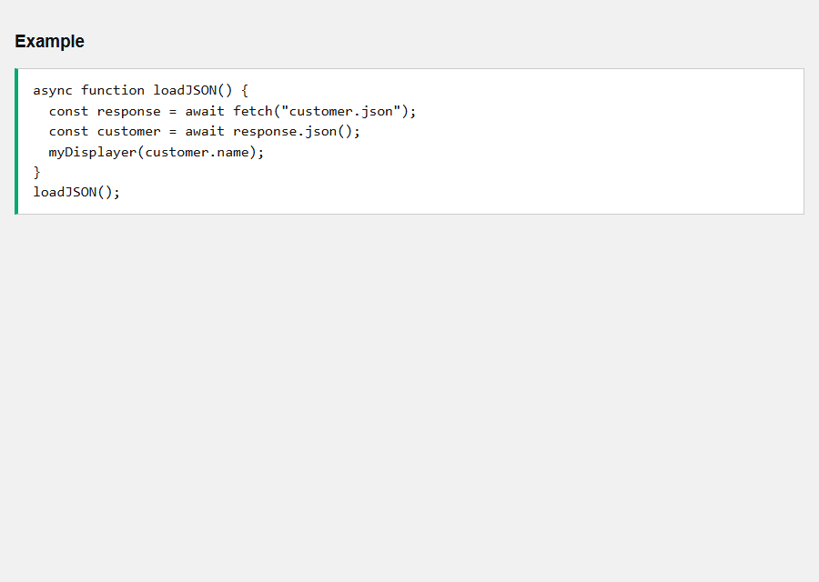


- [x] **Outcome:** Displayed name is **John Doe**.

<a id="json-fetch-example-03"></a>

### **Example 3: Loading a JSON array — products.json**

- [x] A file may be a **root array**.
- [x] `response.json()` then returns a JS array.

Sandbox: `code_sandbox/json-fetch/products-file.html`

```javascript
[
  {"name":"Laptop","price":899},
  {"name":"Mouse","price":29},
  {"name":"Keyboard","price":79}
]
```

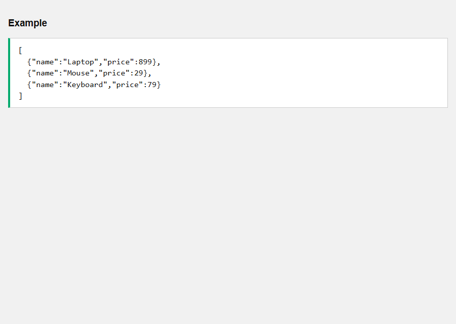


- [x] **Outcome:** First product is **Laptop** at **899**.

<a id="json-fetch-example-04"></a>

### **Example 4: loadProducts — first name and price**

- [x] W3Schools displays `products[0].name` and `.price`.

Sandbox: `code_sandbox/json-fetch/load-products.html`

```javascript
const products = await response.json();
myDisplayer(products[0].name);
myDisplayer(products[0].price);
```

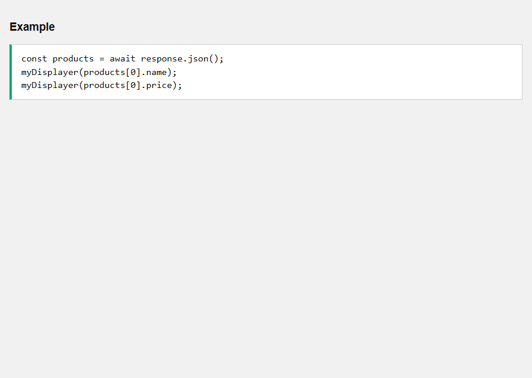


- [x] **Outcome:** **Laptop** and **899**.

<a id="json-fetch-example-05"></a>

### **Example 5: Checking response.ok and status**

- [x] Log `ok` and `status` before reading JSON.
- [x] 200 + true for a real file.

Sandbox: `code_sandbox/json-fetch/check-ok-status.html`

```javascript
myDisplayer(response.ok);
myDisplayer(response.status);
```

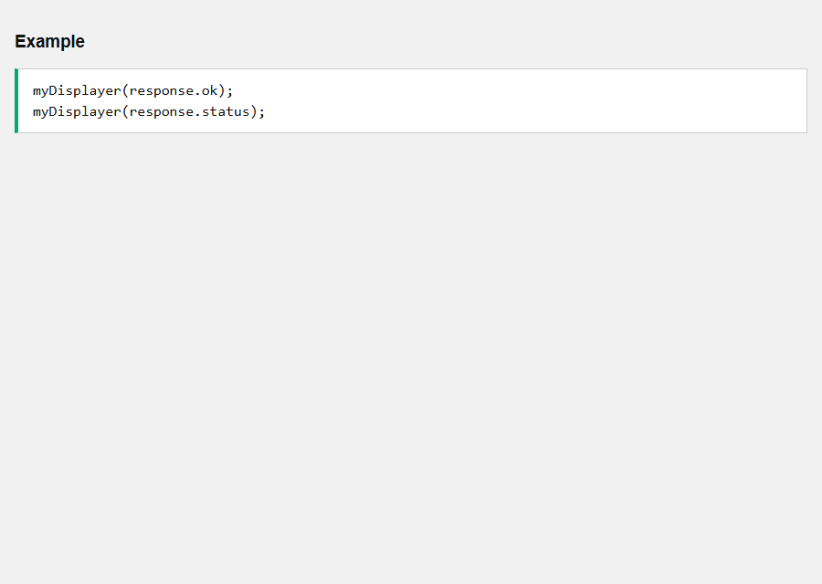


- [x] **Outcome:** **true** and **200**, then **John Doe**.

<a id="json-fetch-example-06"></a>

### **Example 6: Handling HTTP errors with throw**

- [x] If `!response.ok`, **throw** `HTTP error ` + status.
- [x] `catch` shows `err.message`.
- [x] Missing file → **HTTP error 404**.

Sandbox: `code_sandbox/json-fetch/http-error-throw.html`

```javascript
if (!response.ok) {
  throw new Error("HTTP error " + response.status);
}
```

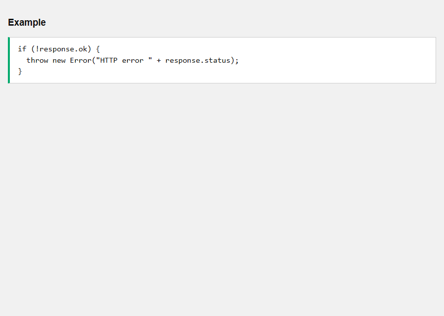


- [x] **Outcome:** Fetching a missing file prints **HTTP error 404**.

<a id="json-fetch-example-07"></a>

### **Example 7: Loading multiple JSON files with Promise.all**

- [x] `Promise.all([fetch(...), ...])` waits for **all**.
- [x] Then `.json()` each response.
- [x] W3Schools typo “Custome name” is kept in spirit as customer name.

Sandbox: `code_sandbox/json-fetch/promise-all.html`

```javascript
const [customerResponse, productsResponse, newsResponse] = await Promise.all([
  fetch("customer.json"),
  fetch("products.json"),
  fetch("news.json")
]);
```

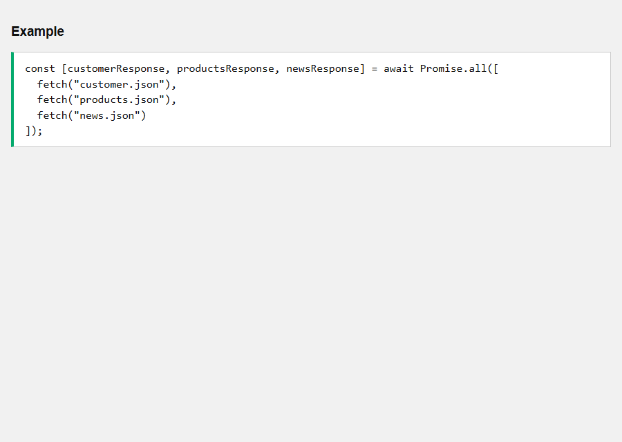


- [x] **Outcome:** Logs **John Doe**, **3 products**, **2 news items**.

<a id="json-fetch-example-08"></a>

### **Example 8: Sending JSON — method, headers, body**

- [x] POST options: **method**, **headers** `Content-Type: application/json`, **body** `JSON.stringify(person)`.
- [x] The live `/api/person` server is not in this sandbox. We still **build the same body** and read a local mock `result.json` for the reply shape.

Sandbox: `code_sandbox/json-fetch/post-options.html`

```javascript
const response = await fetch("/api/person", {
  method: "POST",
  headers: { "Content-Type": "application/json" },
  body: JSON.stringify(person)
});
```

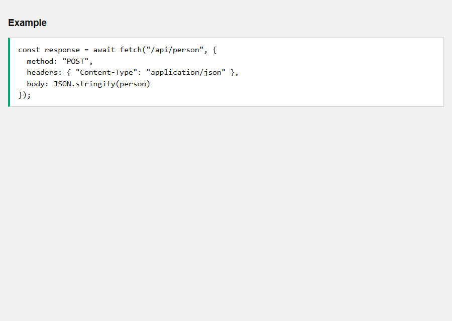


- [x] **Outcome:** The stringified body is **`{"name":"John","age":30}`**. Mock response message is **Person saved**.

<a id="json-fetch-example-09"></a>

### **Example 9: The Content-Type header**

- [x] Servers expect **`application/json`** when the body is JSON.
- [x] Missing this header is a common API 400.

Sandbox: `code_sandbox/json-fetch/content-type.html`

```html
headers: { "Content-Type": "application/json" }
```


- [x] **Outcome:** The header value is **application/json**.

<a id="json-fetch-example-10"></a>

### **Example 10: The request body is JSON.stringify(person)**

- [x] `body` must be a **string** (or stream). Pass **`JSON.stringify(person)`**, not the object.

Sandbox: `code_sandbox/json-fetch/request-body.html`

```html
body: JSON.stringify(person)
```


- [x] **Outcome:** `typeof` of the body is **string**.

<a id="json-fetch-example-11"></a>

### **Example 11: Reading the server response as JSON**

- [x] After POST, `const result = await response.json()` then show `result.message`.
- [x] Sandbox reads **result.json** as that response.

Sandbox: `code_sandbox/json-fetch/read-server.html`

```javascript
const result = await response.json();
document.getElementById("demo").textContent = result.message;
```

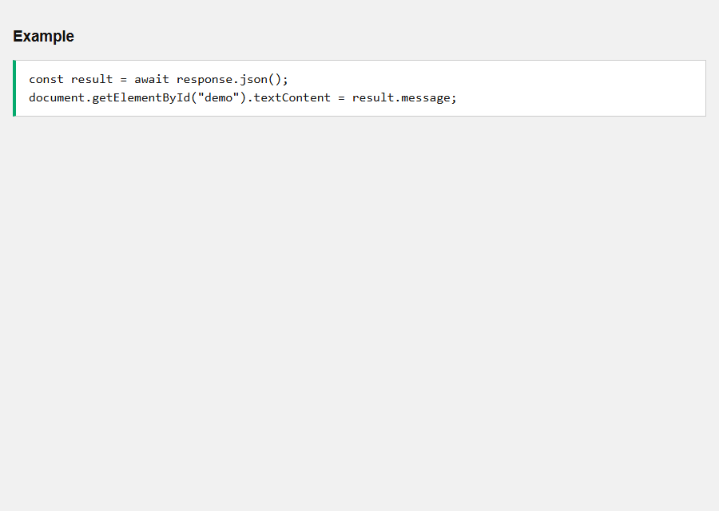


- [x] **Outcome:** Message is **Person saved**.

<a id="json-fetch-example-12"></a>

### **Example 12: Checking the POST response**

- [x] Still check **`response.ok`** after POST.
- [x] Then parse JSON.

Sandbox: `code_sandbox/json-fetch/check-post-ok.html`

```javascript
if (!response.ok) {
  throw new Error("HTTP error " + response.status);
}
const result = await response.json();
```

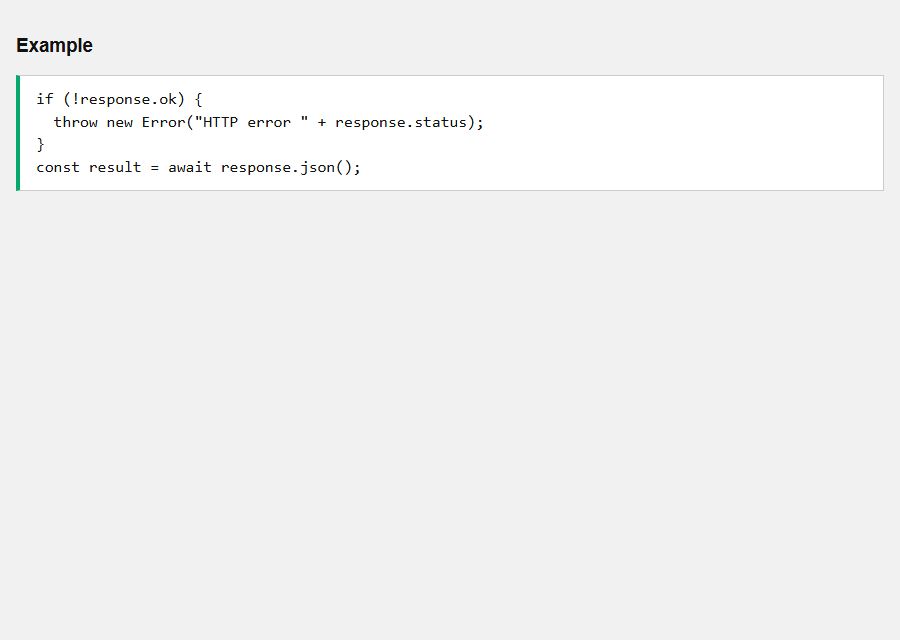


- [x] **Outcome:** Mock GET of result.json is **ok**; message **Person saved**. A real POST would use the same check.

<a id="json-fetch-example-13"></a>

### **Example 13: Complete sendPerson with try/catch**

- [x] Full pattern: build object, fetch POST, check ok, read JSON, catch errors.
- [x] Sandbox still uses a static mock for the response.

Sandbox: `code_sandbox/json-fetch/complete-post.html`

```javascript
async function sendPerson() {
  const person = { name: "John", age: 30 };
  try {
    const response = await fetch("/api/person", { method: "POST",
      headers: { "Content-Type": "application/json" },
      body: JSON.stringify(person) });
    if (!response.ok) { throw new Error("HTTP error " + response.status); }
    const result = await response.json();
    document.getElementById("demo").textContent = result.message;
  } catch (error) {
    document.getElementById("demo").textContent = error.message;
  }
}
```

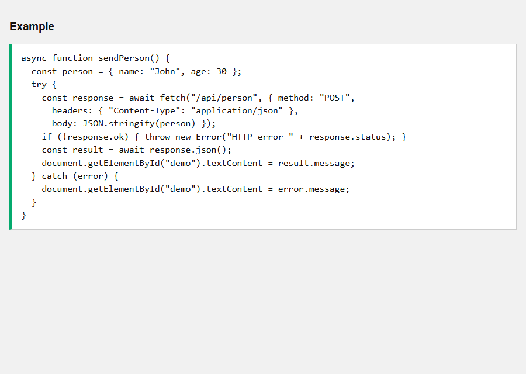

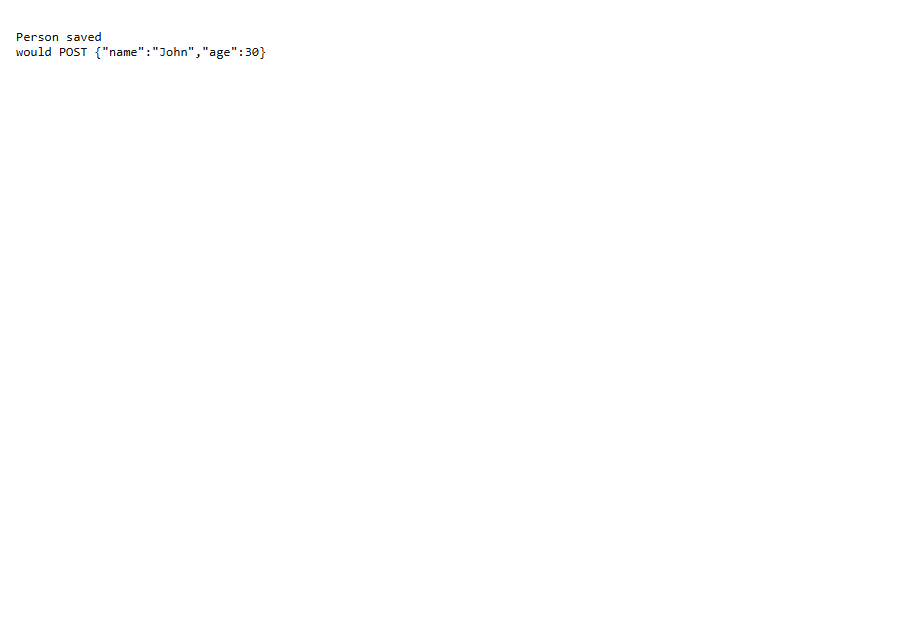

- [x] **Outcome:** Mock path prints **Person saved**. The **body** that would have been posted is shown too.

<a id="json-fetch-example-14"></a>

### **Example 14: Complete example — send name and age from inputs**

- [x] Read `#name` and `#age`, `Number(...)` the age, then the same POST pattern.
- [x] Inputs default to **John** / **30** like the page.

Sandbox: `code_sandbox/json-fetch/form-send.html`

```html
<input id="name" value="John">
<input id="age" type="number" value="30">
<button onclick="sendPerson()">Send</button>
```

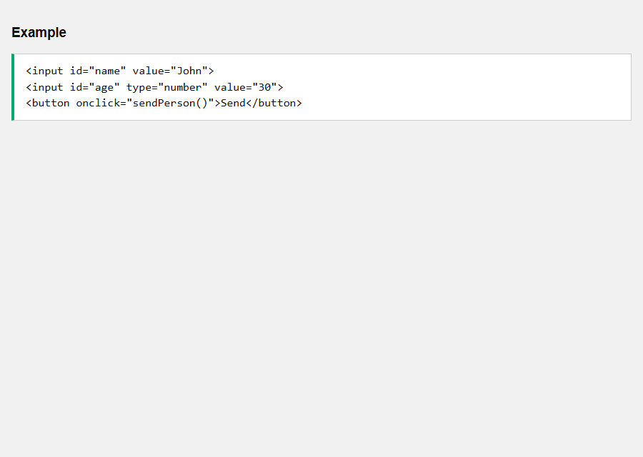

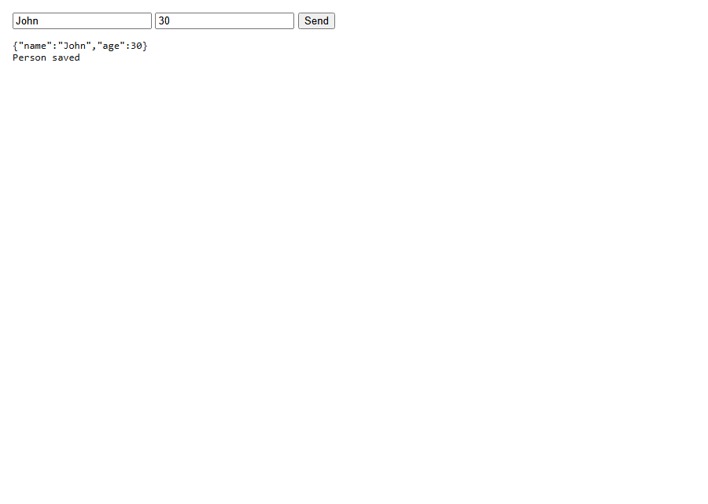

- [x] **Outcome:** The built person is **John** / **30**; mock reply **Person saved**.

<a id="json-fetch-example-15"></a>

### **Example 15: What response.json() can return**

- [x] `.json()` already parses. Result may be object, array, string, number, boolean, or null.
- [x] Do **not** pass it to `JSON.parse` again.

Sandbox: `code_sandbox/json-fetch/json-method-types.html`

```javascript
The response.json() method already parses the JSON.
```


- [x] **Outcome:** customer.json → **object**; products.json → **array**.

<a id="json-fetch-example-16"></a>

### **Example 16: Older pattern — stringify onto a query string**

- [x] Older W3Schools snippet: `window.location = "demo_json.php?x=" + myJSON`.
- [x] That **navigates** the page. Prefer `fetch` POST.
- [x] We show the URL that would be built, without leaving.

Sandbox: `code_sandbox/json-fetch/query-string-send.html`

```html
const myJSON = JSON.stringify(myObj);
window.location = "demo_json.php?x=" + myJSON;
```

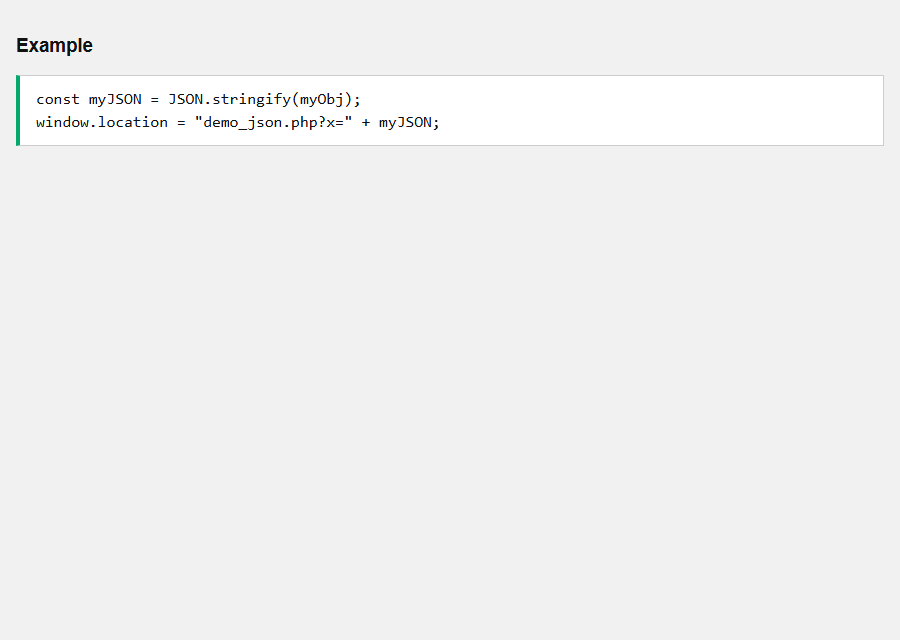


- [x] **Outcome:** The would-be URL contains **`x=`** and encoded/plain JSON with **John**.

<a id="json-fetch-example-17"></a>

### **Example 17: Receiving data — JSON.parse a text payload**

- [x] If you already have a JSON **string**, `JSON.parse` then `myObj.name`.

Sandbox: `code_sandbox/json-fetch/parse-received.html`

```html
const myObj = JSON.parse(myJSON);
document.getElementById("demo").innerHTML = myObj.name;
```

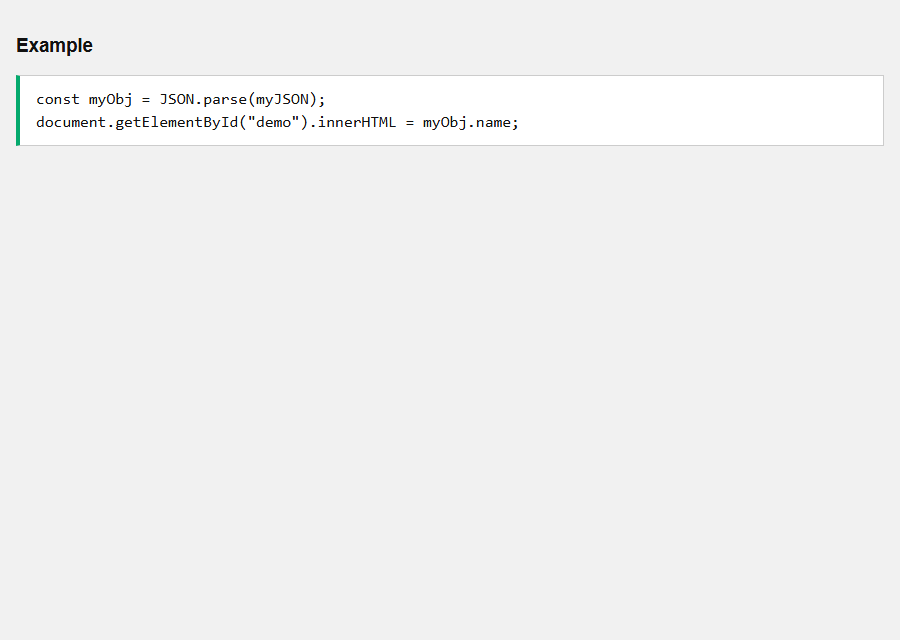


- [x] **Outcome:** **John**.

<a id="json-fetch-example-18"></a>

### **Example 18: JSON from a server with XMLHttpRequest**

- [x] Legacy: `XMLHttpRequest`, `onload`, `JSON.parse(this.responseText)`.
- [x] Prefer Fetch. This still works.
- [x] Sandbox GET `json_demo.txt`.

Sandbox: `code_sandbox/json-fetch/xhr-get.html`

```javascript
const xmlhttp = new XMLHttpRequest();
xmlhttp.onload = function() {
  const myObj = JSON.parse(this.responseText);
  document.getElementById("demo").innerHTML = myObj.name;
};
xmlhttp.open("GET", "json_demo.txt");
xmlhttp.send();
```

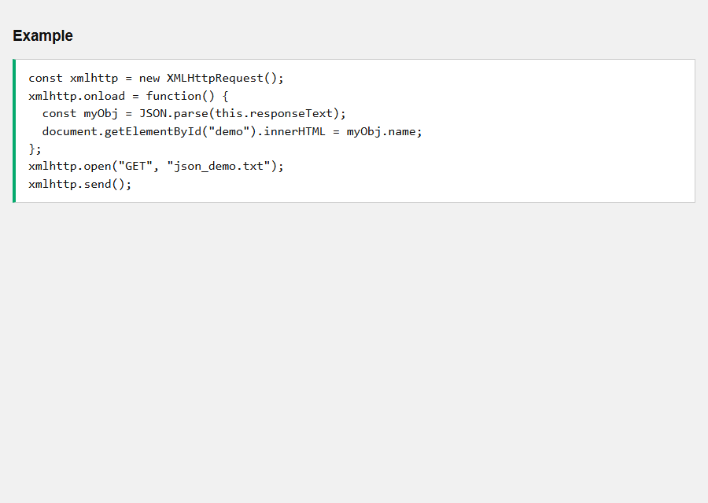


- [x] **Outcome:** XHR parse shows **John Doe**.

<a id="json-fetch-example-19"></a>

### **Example 19: Array as JSON via XHR**

- [x] Parsing JSON that is an array yields a **JS array** (`myArr[0]`).
- [x] File `json_demo_array.txt` is `["Ford",...]`.

Sandbox: `code_sandbox/json-fetch/xhr-array.html`

```javascript
const myArr = JSON.parse(this.responseText);
document.getElementById("demo").innerHTML = myArr[0];
```


- [x] **Outcome:** **Ford**.

<details>
  <summary>Terminal Commands</summary>

## Terminal Commands

```bash
# from Personal/Files/javascript/code_sandbox
py -3 -m http.server 8770 --bind 127.0.0.1
```

Then open `http://127.0.0.1:8770/json-fetch/`.

</details>

<details>
  <summary>Questions and Answers</summary>

## Questions and Answers

### Question 1: How do you load a .json file?

<details>
<summary>Answer</summary>

- [x] `fetch(url)` then **`response.json()`**.

</details>

### Question 2: Should you `JSON.parse` the result of `.json()`?

<details>
<summary>Answer</summary>

- [x] **No** — it is already parsed.

</details>

### Question 3: What is `products[0].name` in the sample?

<details>
<summary>Answer</summary>

- [x] **Laptop**.

</details>

### Question 4: Does fetch throw on 404?

<details>
<summary>Answer</summary>

- [x] **No** — check **`ok`** and throw yourself.

</details>

### Question 5: How do you load three files together?

<details>
<summary>Answer</summary>

- [x] **`Promise.all([fetch...])`** then `.json()` each.

</details>

### Question 6: What Content-Type do you send with JSON?

<details>
<summary>Answer</summary>

- [x] **`application/json`**.

</details>

### Question 7: What do you pass as `body`?

<details>
<summary>Answer</summary>

- [x] **`JSON.stringify(object)`**, not the raw object.

</details>

### Question 8: What can `.json()` return?

<details>
<summary>Answer</summary>

- [x] Object, array, string, number, boolean, or **null**.

</details>

### Question 9: What is `myArr[0]` for the array file?

<details>
<summary>Answer</summary>

- [x] **Ford**.

</details>

### Question 10: Is XHR required?

<details>
<summary>Answer</summary>

- [x] **No** — Fetch is the modern API; XHR is the older example.

</details>


</details>

## Summary

fetch the resource, check ok, then json(). For POST, set the JSON content type and stringify the body. Do not JSON.parse the result of response.json().

## References

- [JSON Fetch](https://www.w3schools.com/js/js_json_server.asp)
- [MDN fetch()](https://developer.mozilla.org/en-US/docs/Web/API/Window/fetch)

</details>

<details>
  <summary>JSON HTML</summary>

## Introduction

Show JSON in the page with textContent, lists, tables, and nested property paths. Stringify (optionally pretty) when you need the raw text. Prefer DOM APIs over innerHTML for untrusted values. Missing fields can use `??`.

This section has **18** examples:

- [x] **Example 1:** Displaying a property [View](#json-html-example-01)
- [x] **Example 2:** Displaying multiple properties [View](#json-html-example-02)
- [x] **Example 3:** Displaying an object without stringify [View](#json-html-example-03)
- [x] **Example 4:** Display an object via JSON.stringify [View](#json-html-example-04)
- [x] **Example 5:** Formatting JSON text in a <pre> [View](#json-html-example-05)
- [x] **Example 6:** Displaying a JSON array index [View](#json-html-example-06)
- [x] **Example 7:** Displaying all array values [View](#json-html-example-07)
- [x] **Example 8:** Displaying an array as a list [View](#json-html-example-08)
- [x] **Example 9:** Displaying an array of objects [View](#json-html-example-09)
- [x] **Example 10:** Displaying JSON in a table [View](#json-html-example-10)
- [x] **Example 11:** Displaying nested JSON [View](#json-html-example-11)
- [x] **Example 12:** Loading and displaying JSON [View](#json-html-example-12)
- [x] **Example 13:** Prefer textContent for untrusted data [View](#json-html-example-13)
- [x] **Example 14:** innerHTML is potentially unsafe [View](#json-html-example-14)
- [x] **Example 15:** Missing properties — nullish coalescing [View](#json-html-example-15)
- [x] **Example 16:** HTML table from JSON (local data stand-in for PHP) [View](#json-html-example-16)
- [x] **Example 17:** Dynamic table from a <select> [View](#json-html-example-17)
- [x] **Example 18:** HTML drop-down from JSON names [View](#json-html-example-18)

## Detailed Explanation

- [x] textContent over innerHTML for data.
- [x] createElement / insertRow.
- [x] `[object Object]` means you forgot stringify.

<a id="json-html-example-01"></a>

### **Example 1: Displaying a property**

- [x] Parse, then `textContent = person.name`.

Sandbox: `code_sandbox/json-html/one-prop.html`

```html
document.getElementById("demo").textContent = person.name;
```

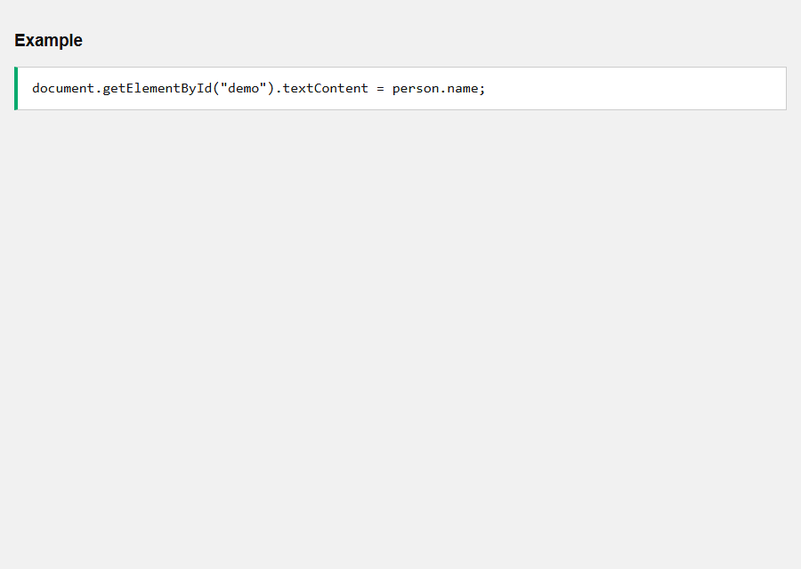


- [x] **Outcome:** The node shows **John**.

<a id="json-html-example-02"></a>

### **Example 2: Displaying multiple properties**

- [x] Concatenate name, age, city with commas.

Sandbox: `code_sandbox/json-html/multi-prop.html`

```html
person.name + ", " + person.age + ", " + person.city
```

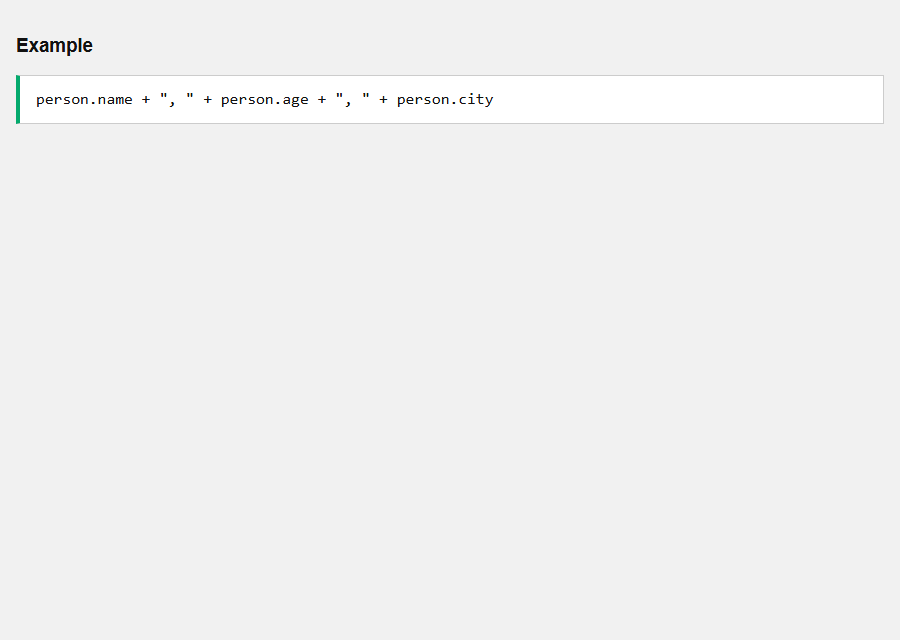


- [x] **Outcome:** **John, 30, New York**.

<a id="json-html-example-03"></a>

### **Example 3: Displaying an object without stringify**

- [x] `myDisplayer(person)` becomes **`[object Object]`**.
- [x] That is `ToString` on a plain object — not useful.

Sandbox: `code_sandbox/json-html/object-default.html`

```html
const person = {name: "John", age: 30};
myDisplayer(person);
```


- [x] **Outcome:** The output is **[object Object]**.

<a id="json-html-example-04"></a>

### **Example 4: Display an object via JSON.stringify**

- [x] Stringify first so humans can read the keys.

Sandbox: `code_sandbox/json-html/stringify-display.html`

```html
let text = JSON.stringify(person);
myDisplayer(text);
```

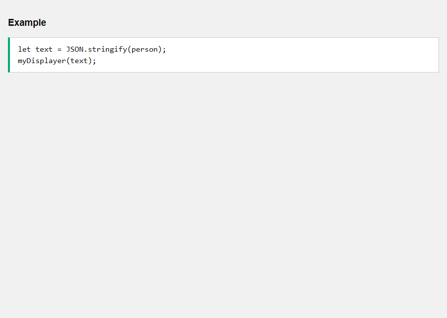


- [x] **Outcome:** JSON text with **John** and **30** is shown.

<a id="json-html-example-05"></a>

### **Example 5: Formatting JSON text in a <pre>**

- [x] `JSON.stringify(person, null, 2)` plus **`<pre>`** keeps indentation.

Sandbox: `code_sandbox/json-html/pretty.html`

```html
document.getElementById("demo").textContent =
  JSON.stringify(person, null, 2);
```

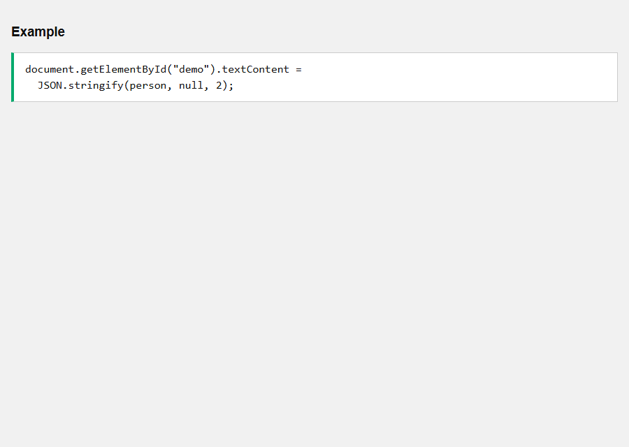

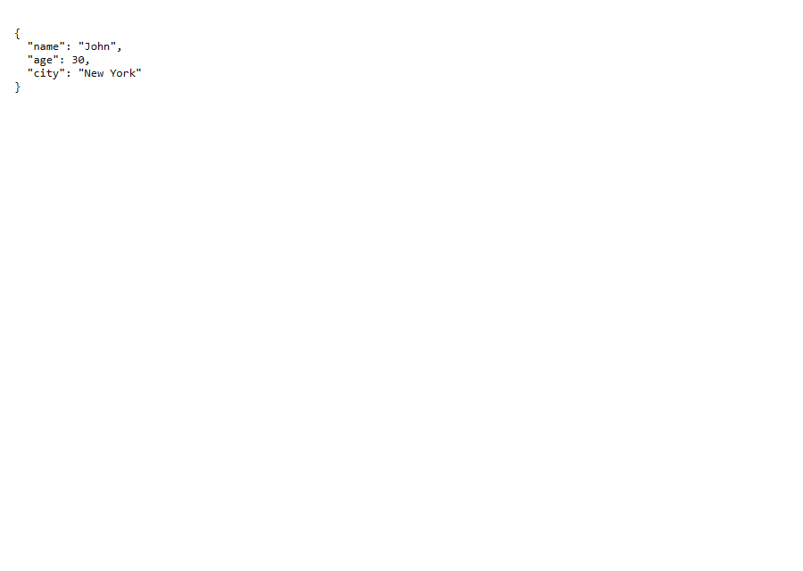

- [x] **Outcome:** Multi-line JSON with **2**-space indent is in the output.

<a id="json-html-example-06"></a>

### **Example 6: Displaying a JSON array index**

- [x] `cars[0]` after parse.

Sandbox: `code_sandbox/json-html/array-index.html`

```html
document.getElementById("demo").textContent = cars[0];
```


- [x] **Outcome:** **Ford**.

<a id="json-html-example-07"></a>

### **Example 7: Displaying all array values**

- [x] Loop `for (const car of cars)` and join with newlines.

Sandbox: `code_sandbox/json-html/array-loop.html`

```html
for (const car of cars) { output += car + "\n"; }
```


- [x] **Outcome:** Three lines: **Ford**, **Volvo**, **BMW**.

<a id="json-html-example-08"></a>

### **Example 8: Displaying an array as a list**

- [x] `createElement("li")`, `textContent`, `appendChild` — **safer** than innerHTML.

Sandbox: `code_sandbox/json-html/array-ul.html`

```html
const item = document.createElement("li");
item.textContent = car;
list.appendChild(item);
```

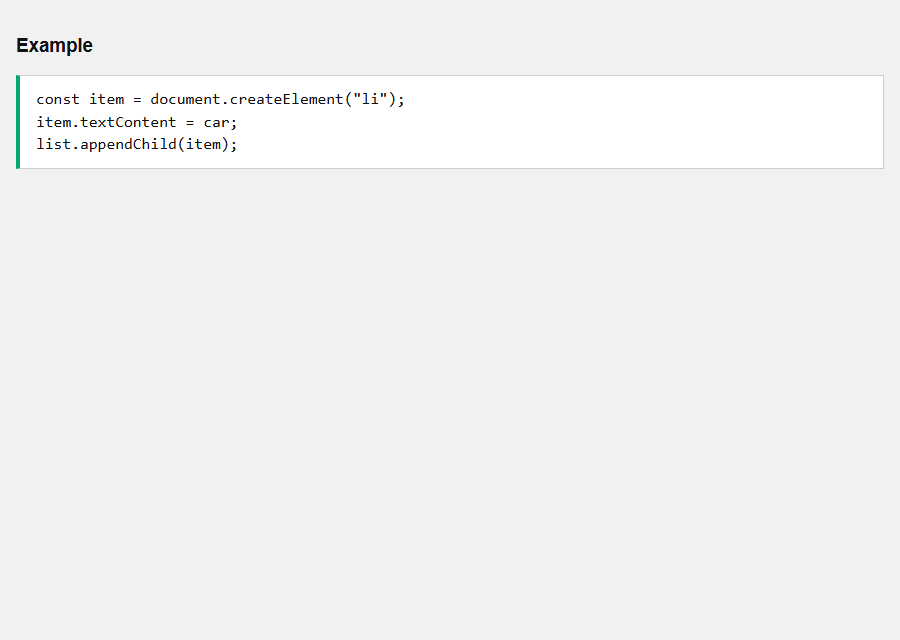


- [x] **Outcome:** The `<ul>` has **3** `<li>` nodes (Ford, Volvo, BMW).

<a id="json-html-example-09"></a>

### **Example 9: Displaying an array of objects**

- [x] Each product: `name + ": $" + price` in an `<li>`.

Sandbox: `code_sandbox/json-html/products-list.html`

```html
item.textContent = product.name + ": $" + product.price;
```


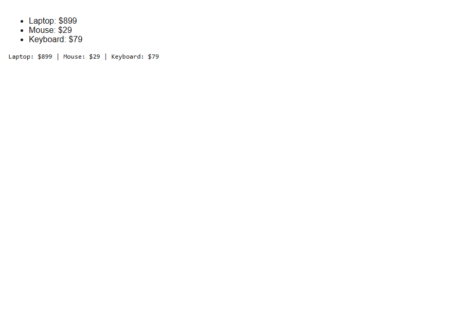

- [x] **Outcome:** List includes **Laptop: $899**.

<a id="json-html-example-10"></a>

### **Example 10: Displaying JSON in a table**

- [x] `insertRow` / `insertCell` / `textContent` — no HTML concatenation.

Sandbox: `code_sandbox/json-html/table.html`

```html
const row = table.insertRow();
nameCell.textContent = product.name;
priceCell.textContent = "$" + product.price;
```

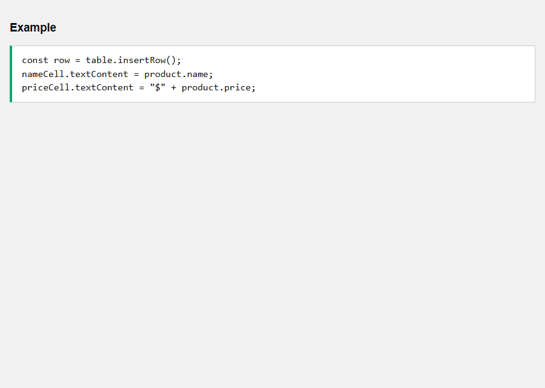


- [x] **Outcome:** The table has a header plus **3** data rows; first name **Laptop**.

<a id="json-html-example-11"></a>

### **Example 11: Displaying nested JSON**

- [x] `person.address.city` after parse.

Sandbox: `code_sandbox/json-html/nested-city.html`

```html
person.address.city
```


- [x] **Outcome:** **New York**.

<a id="json-html-example-12"></a>

### **Example 12: Loading and displaying JSON**

- [x] fetch customer.json, check ok, show `name + ", " + city`.

Sandbox: `code_sandbox/json-html/load-display.html`

```html
document.getElementById("demo").textContent =
  customer.name + ", " + customer.city;
```

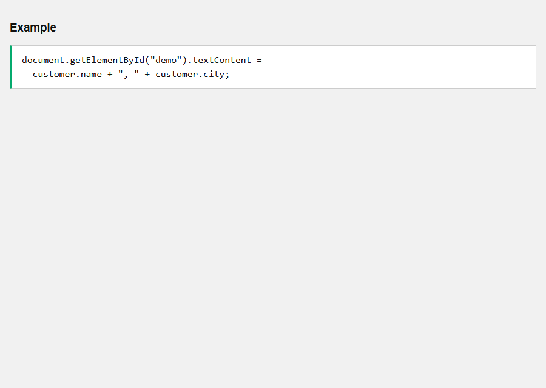


- [x] **Outcome:** **John Doe, New York**.

<a id="json-html-example-13"></a>

### **Example 13: Prefer textContent for untrusted data**

- [x] **Safer:** `element.textContent = customer.name`.
- [x] Values might contain HTML/script if you used innerHTML.

Sandbox: `code_sandbox/json-html/textcontent-safe.html`

```html
element.textContent = customer.name;
```

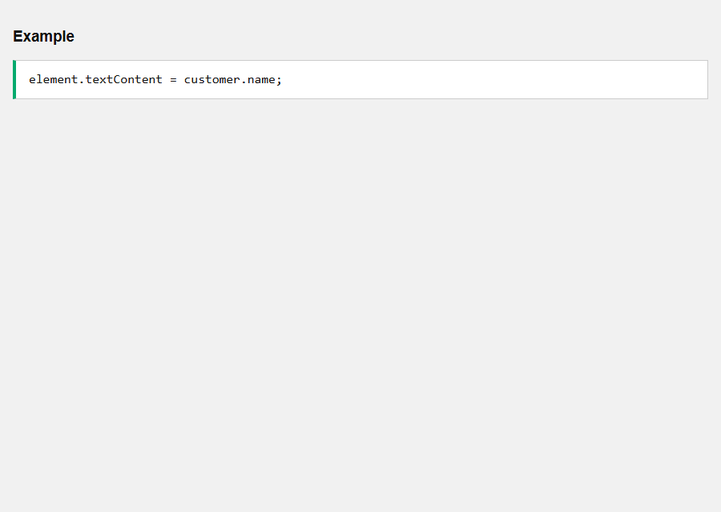


- [x] **Outcome:** `textContent` shows the name as **plain text** even if it contains `<` characters.

<a id="json-html-example-14"></a>

### **Example 14: innerHTML is potentially unsafe**

- [x] `innerHTML = customer.name` would **parse HTML**.
- [x] Only use it for HTML **your app** built, not API strings.

Sandbox: `code_sandbox/json-html/innerhtml-unsafe.html`

```html
element.innerHTML = customer.name;
```


- [x] **Outcome:** Setting innerHTML to `John <b>Doe</b>` creates a **`<b>`** element (`childElementCount` 1).

<a id="json-html-example-15"></a>

### **Example 15: Missing properties — nullish coalescing**

- [x] `person.city ?? "Unknown city"` when city is missing.

Sandbox: `code_sandbox/json-html/missing.html`

```html
person.city ?? "Unknown city" 
```


- [x] **Outcome:** With only `name`, the output is **Unknown city**.

<a id="json-html-example-16"></a>

### **Example 16: HTML table from JSON (local data stand-in for PHP)**

- [x] The page POSTs to `json_demo_html_table.php`. This sandbox builds the **same table** from a local array so the HTML pattern runs.
- [x] Prefer `textContent` in cells over string-built HTML.

Sandbox: `code_sandbox/json-html/html-table-xhr.html`

```html
let text = "<table border='1'>";
for (let x in myObj) {
  text += "<tr><td>" + myObj[x].name + "</td></tr>";
}
```

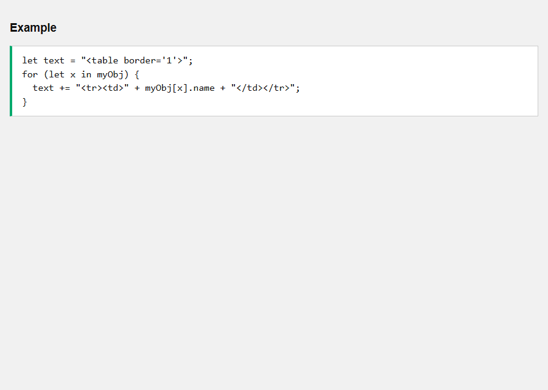


- [x] **Outcome:** A table of names includes **John** (and the other sample rows).

<a id="json-html-example-17"></a>

### **Example 17: Dynamic table from a <select>**

- [x] Changing the select would POST `{table, limit}` in the original.
- [x] Here, choosing **products** fills names from a local map — same UI idea.

Sandbox: `code_sandbox/json-html/dropdown-filter.html`

```html
<select id="myselect" onchange="change_myselect(this.value)">
```

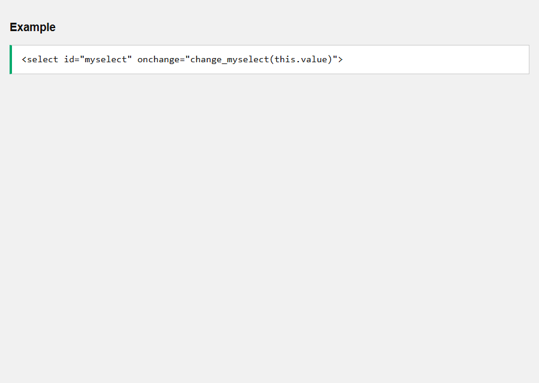


- [x] **Outcome:** After selecting **products**, the table lists **Laptop**, **Mouse**, **Keyboard**.

<a id="json-html-example-18"></a>

### **Example 18: HTML drop-down from JSON names**

- [x] Build `<option>` from each `myObj[x].name`.
- [x] Use `new Option(text)` instead of innerHTML when you can.

Sandbox: `code_sandbox/json-html/select-options.html`

```html
text += "<option>" + myObj[x].name + "</option>";
```


- [x] **Outcome:** The select has **3** options: John, Anna, Peter.

<details>
  <summary>Terminal Commands</summary>

## Terminal Commands

```bash
# from Personal/Files/javascript/code_sandbox
py -3 -m http.server 8770 --bind 127.0.0.1
```

Then open `http://127.0.0.1:8770/json-html/`.

</details>

<details>
  <summary>Questions and Answers</summary>

## Questions and Answers

### Question 1: How do you show one property?

<details>
<summary>Answer</summary>

- [x] Set **`textContent`** to `person.name`.

</details>

### Question 2: Why does logging an object show `[object Object]`?

<details>
<summary>Answer</summary>

- [x] Plain objects stringify via **ToString**, not JSON.

</details>

### Question 3: How do you pretty-print in the page?

<details>
<summary>Answer</summary>

- [x] **`JSON.stringify(obj, null, 2)`** inside a `<pre>`.

</details>

### Question 4: Safer than innerHTML for names?

<details>
<summary>Answer</summary>

- [x] **`textContent`** (or `createElement`).

</details>

### Question 5: What does `??` help with?

<details>
<summary>Answer</summary>

- [x] **Missing** properties — provide a fallback.

</details>

### Question 6: First product in the list example?

<details>
<summary>Answer</summary>

- [x] **Laptop: $899**.

</details>

### Question 7: Nested city path?

<details>
<summary>Answer</summary>

- [x] **`person.address.city`**.

</details>

### Question 8: Why not innerHTML for API strings?

<details>
<summary>Answer</summary>

- [x] They might contain **HTML/script**.

</details>

### Question 9: How many `<li>` for the three cars?

<details>
<summary>Answer</summary>

- [x] **3**.

</details>

### Question 10: How do you add a table row in the DOM?

<details>
<summary>Answer</summary>

- [x] **`insertRow` / `insertCell`** then `textContent`.

</details>


</details>

## Summary

Parse, then put values in the DOM with textContent or created nodes. Pretty-print with stringify(null, 2). Never innerHTML untrusted JSON strings.

## References

- [JSON HTML](https://www.w3schools.com/js/js_json_html.asp)
- [MDN JSON](https://developer.mozilla.org/en-US/docs/Web/JavaScript/Reference/Global_Objects/JSON)

</details>

<details>
  <summary>JSON vs XML</summary>

## Introduction

JSON and XML both store structured data. JSON maps to JS values and is compact. XML is a document language with elements, attributes, mixed content, comments, and namespaces, parsed with DOMParser.

This section has **17** examples:

- [x] **Example 1:** JSON example — employees array [View](#json-vs-xml-example-01)
- [x] **Example 2:** XML example — employee elements [View](#json-vs-xml-example-02)
- [x] **Example 3:** JSON uses objects and arrays — skills [View](#json-vs-xml-example-03)
- [x] **Example 4:** XML uses elements — skills [View](#json-vs-xml-example-04)
- [x] **Example 5:** Working with JSON — JSON.parse [View](#json-vs-xml-example-05)
- [x] **Example 6:** Working with JSON — JSON.stringify [View](#json-vs-xml-example-06)
- [x] **Example 7:** Working with XML — DOMParser [View](#json-vs-xml-example-07)
- [x] **Example 8:** JSON is more compact [View](#json-vs-xml-example-08)
- [x] **Example 9:** Equivalent XML is more verbose [View](#json-vs-xml-example-09)
- [x] **Example 10:** XML can represent documents (mixed content) [View](#json-vs-xml-example-10)
- [x] **Example 11:** XML attributes vs JSON fields [View](#json-vs-xml-example-11)
- [x] **Example 12:** Equivalent JSON for the product [View](#json-vs-xml-example-12)
- [x] **Example 13:** XML namespaces [View](#json-vs-xml-example-13)
- [x] **Example 14:** Difference — typed values vs text-only elements [View](#json-vs-xml-example-14)
- [x] **Example 15:** Difference — comments [View](#json-vs-xml-example-15)
- [x] **Example 16:** When to use JSON [View](#json-vs-xml-example-16)
- [x] **Example 17:** When to use XML [View](#json-vs-xml-example-17)

## Detailed Explanation

- [x] JSON.parse vs DOMParser.
- [x] JSON typed values vs XML text.
- [x] JSON for APIs; XML for documents.

<a id="json-vs-xml-example-01"></a>

### **Example 1: JSON example — employees array**

- [x] JSON uses **objects and arrays** with typed values.
- [x] Three employees with firstName/lastName.

Sandbox: `code_sandbox/json-vs-xml/json-employees.html`

```html
{ "employees": [
  {"firstName":"John", "lastName":"Doe"},
  {"firstName":"Anna", "lastName":"Smith"},
  {"firstName":"Peter", "lastName":"Jones"}
] }
```


- [x] **Outcome:** Parsed count is **3**; first lastName **Doe**.

<a id="json-vs-xml-example-02"></a>

### **Example 2: XML example — employee elements**

- [x] XML uses **elements**. The same three people as tags.
- [x] Content is **text** until you convert it.

Sandbox: `code_sandbox/json-vs-xml/xml-employees.html`

```html
<employees>
  <employee><firstName>John</firstName><lastName>Doe</lastName></employee>
</employees>
```


- [x] **Outcome:** `DOMParser` + `getElementsByTagName("firstName")` yields **John** as the first name.

<a id="json-vs-xml-example-03"></a>

### **Example 3: JSON uses objects and arrays — skills**

- [x] `skills` is a real **array** of strings.

Sandbox: `code_sandbox/json-vs-xml/json-skills.html`

```html
{ "name": "John", "skills": ["HTML", "CSS", "JavaScript"] }
```


- [x] **Outcome:** `skills[2]` is **JavaScript**; `Array.isArray(skills)` is **true**.

<a id="json-vs-xml-example-04"></a>

### **Example 4: XML uses elements — skills**

- [x] Each skill is an element. You **query the DOM**, not an array property.
- [x] An `id` attribute can live on the element.

Sandbox: `code_sandbox/json-vs-xml/xml-skills.html`

```html
<person id="101">
  <name>John</name>
  <skills><skill>HTML</skill></skills>
</person>
```


- [x] **Outcome:** Three `<skill>` nodes; first text **HTML**; id **101**.

<a id="json-vs-xml-example-05"></a>

### **Example 5: Working with JSON — JSON.parse**

- [x] One call maps JSON onto JS values.

Sandbox: `code_sandbox/json-vs-xml/json-parse.html`

```html
const person = JSON.parse(text);
```


- [x] **Outcome:** **John** / **30**.

<a id="json-vs-xml-example-06"></a>

### **Example 6: Working with JSON — JSON.stringify**

- [x] One call maps JS values onto JSON text.

Sandbox: `code_sandbox/json-vs-xml/json-stringify.html`

```html
const text = JSON.stringify(person);
```


- [x] **Outcome:** Text includes **"name":"John"**.

<a id="json-vs-xml-example-07"></a>

### **Example 7: Working with XML — DOMParser**

- [x] `new DOMParser().parseFromString(text, "text/xml")`.
- [x] Then **DOM methods** (`getElementsByTagName`).

Sandbox: `code_sandbox/json-vs-xml/xml-domparser.html`

```html
const parser = new DOMParser();
const xmlDoc = parser.parseFromString(text, "text/xml");
const name = xmlDoc.getElementsByTagName("name")[0].textContent;
```


- [x] **Outcome:** Extracted name is **John**.

<a id="json-vs-xml-example-08"></a>

### **Example 8: JSON is more compact**

- [x] `{"name":"John","age":30}` vs a multi-line XML tree.
- [x] Less markup for the same fields.

Sandbox: `code_sandbox/json-vs-xml/compact-json.html`

```html
{"name":"John","age":30}
```


- [x] **Outcome:** JSON length is **smaller** than the equivalent XML string.

<a id="json-vs-xml-example-09"></a>

### **Example 9: Equivalent XML is more verbose**

- [x] Each field is an element with open/close tags.

Sandbox: `code_sandbox/json-vs-xml/compact-xml.html`

```html
<person>
  <name>John</name>
  <age>30</age>
</person>
```


- [x] **Outcome:** Parser still reads **John** / **30**, with more characters on the wire.

<a id="json-vs-xml-example-10"></a>

### **Example 10: XML can represent documents (mixed content)**

- [x] XML can mix **text and child elements** (`Please read the <important>…`).
- [x] JSON objects are not a document markup language.

Sandbox: `code_sandbox/json-vs-xml/xml-mixed.html`

```html
<message>
  Please read the <important>safety instructions</important> before continuing.
</message>
```


- [x] **Outcome:** `important` text is **safety instructions**; the parent still has surrounding text.

<a id="json-vs-xml-example-11"></a>

### **Example 11: XML attributes vs JSON fields**

- [x] XML: `id` and `currency` as **attributes** plus child elements.
- [x] JSON: usually all fields are **object properties** (no separate attribute axis).

Sandbox: `code_sandbox/json-vs-xml/xml-attrs.html`

```html
<product id="101" currency="USD">
  <name>Laptop</name>
  <price>899</price>
</product>
```


- [x] **Outcome:** id **101**, currency **USD**, name **Laptop**.

<a id="json-vs-xml-example-12"></a>

### **Example 12: Equivalent JSON for the product**

- [x] Same data as properties: id, currency, name, price.

Sandbox: `code_sandbox/json-vs-xml/json-equiv-attrs.html`

```html
{ "id": 101, "currency": "USD", "name": "Laptop", "price": 899 }
```


- [x] **Outcome:** **Laptop** costs **899** **USD**.

<a id="json-vs-xml-example-13"></a>

### **Example 13: XML namespaces**

- [x] XML supports **xmlns** prefixes (`h:table` vs `f:table`).
- [x] JSON has **no namespaces** — collision is just a name clash.

Sandbox: `code_sandbox/json-vs-xml/namespaces.html`

```html
<root xmlns:h="http://www.w3.org/TR/html4/" xmlns:f="https://example.com/furniture">
  <h:table>...</h:table>
  <f:table>...</f:table>
</root>
```


- [x] **Outcome:** The parsed document element has **two** xmlns attributes (`h` and `f`).

<a id="json-vs-xml-example-14"></a>

### **Example 14: Difference — typed values vs text-only elements**

- [x] JSON has numbers/booleans/null. XML element content is **text** until you convert.
- [x] JSON `age:30` is already a number after parse.

Sandbox: `code_sandbox/json-vs-xml/table-types.html`

```html
JSON: { "age": 30 }
XML:  <age>30</age>
```


- [x] **Outcome:** JSON age `typeof` is **number**. XML age `textContent` `typeof` is **string**.

<a id="json-vs-xml-example-15"></a>

### **Example 15: Difference — comments**

- [x] JSON: **no comments**. XML: **yes** (`<!-- -->`).

Sandbox: `code_sandbox/json-vs-xml/table-comments.html`

```html
JSON: no comments
XML: <!-- comment -->
```


- [x] **Outcome:** XML comment nodes exist in the DOM (`COMMENT_NODE` is 8).

<a id="json-vs-xml-example-16"></a>

### **Example 16: When to use JSON**

- [x] APIs, JS apps, compact **data** interchange, typed values, `JSON.parse`.

Sandbox: `code_sandbox/json-vs-xml/when-json.html`

```html
Use JSON for application data.
```


- [x] **Outcome:** The snapshot lists the JSON-friendly jobs from the page.

<a id="json-vs-xml-example-17"></a>

### **Example 17: When to use XML**

- [x] Documents, mixed content, attributes, namespaces, existing XML tooling / validation (XSD).

Sandbox: `code_sandbox/json-vs-xml/when-xml.html`

```html
Use XML for documents and structured markup.
```


- [x] **Outcome:** The snapshot lists XML-friendly jobs from the page.

<details>
  <summary>Terminal Commands</summary>

## Terminal Commands

```bash
# from Personal/Files/javascript/code_sandbox
py -3 -m http.server 8770 --bind 127.0.0.1
```

Then open `http://127.0.0.1:8770/json-vs-xml/`.

</details>

<details>
  <summary>Questions and Answers</summary>

## Questions and Answers

### Question 1: Does JSON map directly to JS values?

<details>
<summary>Answer</summary>

- [x] **Yes** — `JSON.parse`.

</details>

### Question 2: How do you parse XML in JS?

<details>
<summary>Answer</summary>

- [x] **`DOMParser.parseFromString(..., "text/xml")`**.

</details>

### Question 3: Which is usually more compact?

<details>
<summary>Answer</summary>

- [x] **JSON**.

</details>

### Question 4: Can JSON represent mixed document text + tags?

<details>
<summary>Answer</summary>

- [x] **Not as markup** — that is XML’s strength.

</details>

### Question 5: Does JSON have namespaces?

<details>
<summary>Answer</summary>

- [x] **No**.

</details>

### Question 6: Does JSON have comments?

<details>
<summary>Answer</summary>

- [x] **No**.

</details>

### Question 7: What is XML element content typed as after parse?

<details>
<summary>Answer</summary>

- [x] **Text** (`textContent` is a string).

</details>

### Question 8: How are XML attributes modeled in JSON here?

<details>
<summary>Answer</summary>

- [x] As **ordinary object properties**.

</details>

### Question 9: When is JSON the better default?

<details>
<summary>Answer</summary>

- [x] **Application data** and JS APIs.

</details>

### Question 10: When is XML the better default?

<details>
<summary>Answer</summary>

- [x] **Documents**, mixed content, namespaces, XML schemas.

</details>


</details>

## Summary

Default to JSON for application data in JavaScript. Use XML when you need documents, attributes/namespaces, or mixed content, and parse it with the XML DOM.

## References

- [JSON vs XML](https://www.w3schools.com/js/js_json_xml.asp)
- [MDN DOMParser](https://developer.mozilla.org/en-US/docs/Web/API/DOMParser)

</details>

<details>
  <summary>APIs Intro</summary>

## Introduction

A Web API is an interface for the web. Browser APIs (DOM, Fetch, Storage, History, Geolocation) are built in. Third-party APIs (YouTube, Twitter, Facebook) are loaded from the network.

This section has **7** examples:

- [x] **Example 1:** What is a Web API? [View](#apis-intro-example-01)
- [x] **Example 2:** Browser API example — Geolocation coordinates [View](#apis-intro-example-02)
- [x] **Example 3:** The DOM API [View](#apis-intro-example-03)
- [x] **Example 4:** The Fetch API [View](#apis-intro-example-04)
- [x] **Example 5:** The Web Storage API [View](#apis-intro-example-05)
- [x] **Example 6:** The History API [View](#apis-intro-example-06)
- [x] **Example 7:** Third-party APIs [View](#apis-intro-example-07)

## Detailed Explanation

- [x] API = Application Programming Interface.
- [x] Geolocation is the intro’s concrete browser example.
- [x] Third-party APIs are not built in.

<a id="apis-intro-example-01"></a>

### **Example 1: What is a Web API?**

- [x] **API** = Application Programming Interface.
- [x] A **Web API** is an API for the web: browser APIs extend the **browser**; server APIs extend a **server**.
- [x] You call methods the environment provides — you do not download them for built-in APIs.

Sandbox: `code_sandbox/apis-intro/what.html`

```html
API = Application Programming Interface
A Browser API extends the browser.
A Server API extends a server.
```

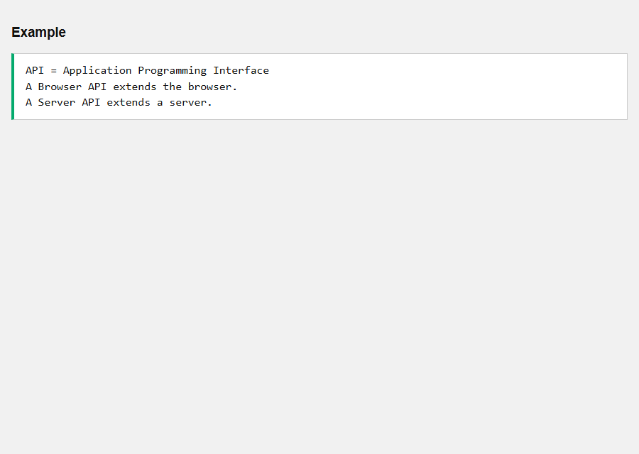

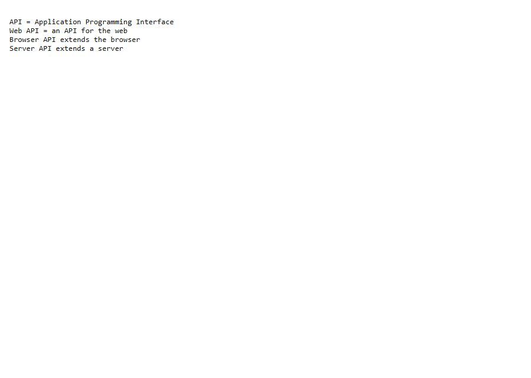

- [x] **Outcome:** The snapshot restates the three sentences from the page.

<a id="apis-intro-example-02"></a>

### **Example 2: Browser API example — Geolocation coordinates**

- [x] Browsers ship built-in APIs. Geolocation returns **coordinates**.
- [x] `navigator.geolocation.getCurrentPosition(success)` if supported.
- [x] Else show “not supported”.
- [x] Headless/permission-denied environments take the error path; we still prove the API object exists.

Sandbox: `code_sandbox/apis-intro/geo-example.html`

```html
const myElement = document.getElementById("demo");
function getLocation() {
  if (navigator.geolocation) {
    navigator.geolocation.getCurrentPosition(showPosition);
  } else {
    myElement.innerHTML = "Geolocation is not supported by this browser.";
  }
}
function showPosition(position) {
  myElement.innerHTML = "Latitude: " + position.coords.latitude +
    "<br>Longitude: " + position.coords.longitude;
}
```

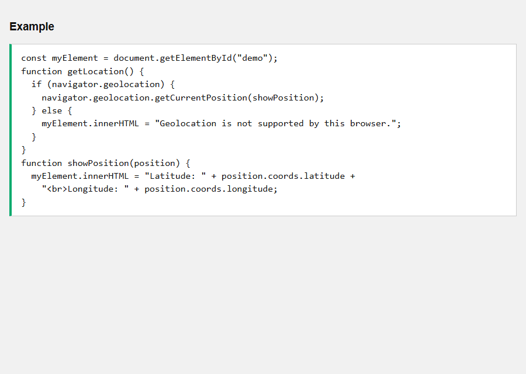


- [x] **Outcome:** `navigator.geolocation` exists (**true** here). The snapshot then either prints lat/long or a permission/unavailable message — both are valid outcomes of this API.

<a id="apis-intro-example-03"></a>

### **Example 3: The DOM API**

- [x] Listed as a **most important** API.
- [x] Structured representation of the page so JS can change elements, attributes, and content.
- [x] This is the HTML DOM chapters you already studied.

Sandbox: `code_sandbox/apis-intro/dom-api.html`

```html
document.getElementById("demo")
```

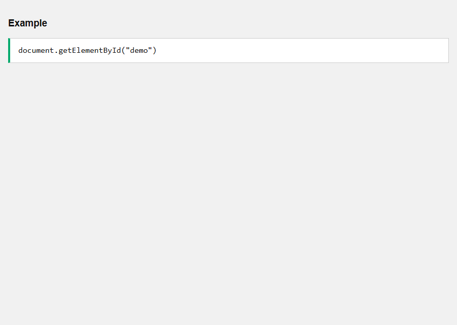


- [x] **Outcome:** `document` is the DOM API entry; `nodeType` **9** is the Document.

<a id="apis-intro-example-04"></a>

### **Example 4: The Fetch API**

- [x] The modern **networking** API (vs XMLHttpRequest).
- [x] Also listed as fundamental.

Sandbox: `code_sandbox/apis-intro/fetch-api.html`

```html
fetch(url)
```


- [x] **Outcome:** `typeof fetch` is **function**.

<a id="apis-intro-example-05"></a>

### **Example 5: The Web Storage API**

- [x] **localStorage** and **sessionStorage** — key/value in the browser, more straightforward than cookies for non-secret data.
- [x] Persists across reloads (local) or for one tab session (session).

Sandbox: `code_sandbox/apis-intro/web-storage.html`

```html
localStorage / sessionStorage
```


- [x] **Outcome:** `typeof localStorage.setItem` is **function**.

<a id="apis-intro-example-06"></a>

### **Example 6: The History API**

- [x] Manipulate **session history** so SPAs can change the URL without a full reload.
- [x] Linked from this intro to the History chapter.

Sandbox: `code_sandbox/apis-intro/history-api.html`

```html
history.pushState(state, "", url)
```


- [x] **Outcome:** `typeof history.pushState` is **function**.

<a id="apis-intro-example-07"></a>

### **Example 7: Third-party APIs**

- [x] **Not** built into the browser. You load their script/SDK from the web.
- [x] Examples on the page: **YouTube**, **Twitter**, **Facebook** display widgets.
- [x] You also need API keys and their terms of use.

Sandbox: `code_sandbox/apis-intro/third-party.html`

```html
YouTube API — display videos
Twitter API — display Tweets
Facebook API — display Facebook info
```

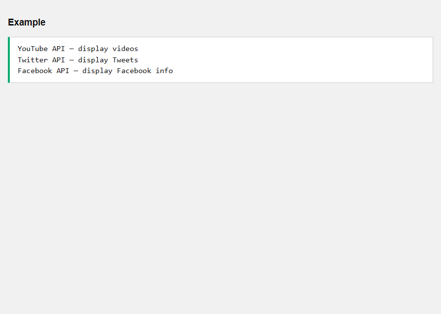

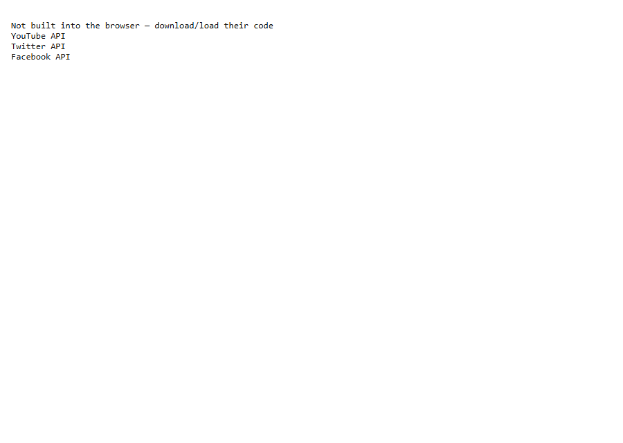

- [x] **Outcome:** The snapshot lists the three third-party examples from the page.

<details>
  <summary>Terminal Commands</summary>

## Terminal Commands

```bash
# from Personal/Files/javascript/code_sandbox
py -3 -m http.server 8770 --bind 127.0.0.1
```

Then open `http://127.0.0.1:8770/apis-intro/`.

</details>

<details>
  <summary>Questions and Answers</summary>

## Questions and Answers

### Question 1: What does API stand for?

<details>
<summary>Answer</summary>

- [x] **Application Programming Interface**.

</details>

### Question 2: What is a Browser API?

<details>
<summary>Answer</summary>

- [x] A built-in interface that **extends the browser** (DOM, Fetch, Geolocation, …).

</details>

### Question 3: Name the three “most important” APIs on the page.

<details>
<summary>Answer</summary>

- [x] **DOM**, **Fetch**, **Web Storage**.

</details>

### Question 4: What fourth API is also introduced?

<details>
<summary>Answer</summary>

- [x] The **History** API.

</details>

### Question 5: Are third-party APIs built in?

<details>
<summary>Answer</summary>

- [x] **No** — you load their code (YouTube, Twitter, Facebook examples).

</details>

### Question 6: How do you start Geolocation?

<details>
<summary>Answer</summary>

- [x] **`navigator.geolocation.getCurrentPosition(success)`** if the object exists.

</details>

### Question 7: What is Fetch for?

<details>
<summary>Answer</summary>

- [x] **Networking** — requesting resources from a server.

</details>

### Question 8: What does Web Storage store?

<details>
<summary>Answer</summary>

- [x] **Key/value** pairs (`localStorage` / `sessionStorage`).

</details>

### Question 9: Why do SPAs use History?

<details>
<summary>Answer</summary>

- [x] To change the **URL** without a full page reload.

</details>

### Question 10: Is Geolocation a third-party API?

<details>
<summary>Answer</summary>

- [x] **No** — it is a **browser** API.

</details>


</details>

## Summary

Use built-in browser APIs first (DOM, Fetch, Storage, History). Load third-party SDKs only when you need their service. Geolocation is permission-gated.

## References

- [APIs Intro](https://www.w3schools.com/js/js_api_intro.asp)
- [MDN Geolocation API](https://developer.mozilla.org/en-US/docs/Web/API/Geolocation_API)

</details>

<details>
  <summary>API Geolocation</summary>

## Introduction

The Geolocation API returns the user’s position (`getCurrentPosition`) or a stream of updates (`watchPosition`). Always handle permission, timeout, and unavailable errors. Success always includes latitude, longitude, and accuracy.

This section has **16** examples:

- [x] **Example 1:** getCurrentPosition — latitude and longitude [View](#api-geolocation-example-01)
- [x] **Example 2:** Error PERMISSION_DENIED [View](#api-geolocation-example-02)
- [x] **Example 3:** Error POSITION_UNAVAILABLE [View](#api-geolocation-example-03)
- [x] **Example 4:** Error TIMEOUT [View](#api-geolocation-example-04)
- [x] **Example 5:** Error UNKNOWN_ERROR [View](#api-geolocation-example-05)
- [x] **Example 6:** Displaying the result in a map URL [View](#api-geolocation-example-06)
- [x] **Example 7:** coords.latitude (always returned) [View](#api-geolocation-example-07)
- [x] **Example 8:** coords.longitude (always returned) [View](#api-geolocation-example-08)
- [x] **Example 9:** coords.accuracy (always returned) [View](#api-geolocation-example-09)
- [x] **Example 10:** coords.altitude (if available) [View](#api-geolocation-example-10)
- [x] **Example 11:** coords.altitudeAccuracy (if available) [View](#api-geolocation-example-11)
- [x] **Example 12:** coords.heading (if available) [View](#api-geolocation-example-12)
- [x] **Example 13:** coords.speed (if available) [View](#api-geolocation-example-13)
- [x] **Example 14:** position.timestamp [View](#api-geolocation-example-14)
- [x] **Example 15:** watchPosition() — keep updating [View](#api-geolocation-example-15)
- [x] **Example 16:** clearWatch(id) — stop watching [View](#api-geolocation-example-16)

## Detailed Explanation

- [x] Secure context + permission.
- [x] Error codes 1 / 2 / 3.
- [x] clearWatch stops a watch.
- [x] Map images need a real API key.

<a id="api-geolocation-example-01"></a>

### **Example 1: getCurrentPosition — latitude and longitude**

- [x] `navigator.geolocation.getCurrentPosition(success, error?, options?)`.
- [x] Success receives a **GeolocationPosition** with `coords.latitude` / `longitude`.
- [x] Must be **secure context** (https or localhost) and the user must **allow** permission.
- [x] The snapshot uses a 1.5s timeout so headless Chrome fails fast, then still prints whether the API exists.

Sandbox: `code_sandbox/api-geolocation/get-current.html`

```html
function getLocation() {
  if (navigator.geolocation) {
    navigator.geolocation.getCurrentPosition(showPosition);
  } else {
    x.innerHTML = "Geolocation is not supported by this browser.";
  }
}
function showPosition(position) {
  x.innerHTML = "Latitude: " + position.coords.latitude +
    "<br>Longitude: " + position.coords.longitude;
}
```

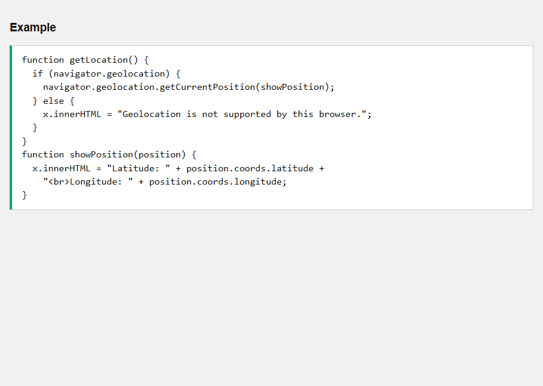

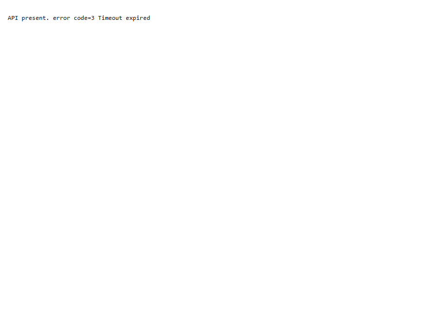

- [x] **Outcome:** Either **Latitude/Longitude** numbers appear (permission granted) or an error code is printed. `navigator.geolocation` is present in this browser.

<a id="api-geolocation-example-02"></a>

### **Example 2: Error PERMISSION_DENIED**

- [x] `error.code` **1** — the user (or browser policy) denied permission.
- [x] Show a clear message; do not retry in a loop.

Sandbox: `code_sandbox/api-geolocation/error-denied.html`

```html
case error.PERMISSION_DENIED:
  x.innerHTML = "User denied the request for Geolocation.";
```

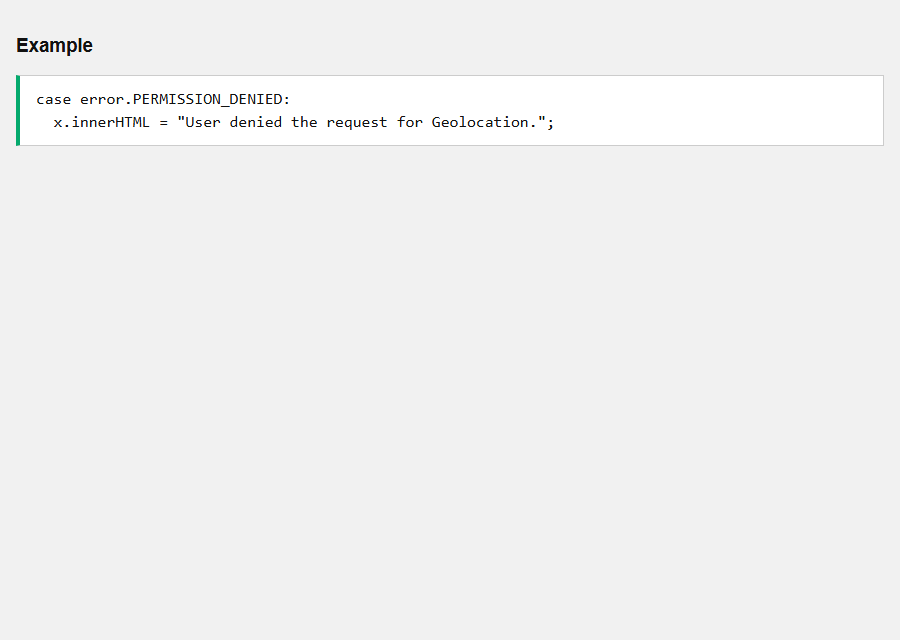

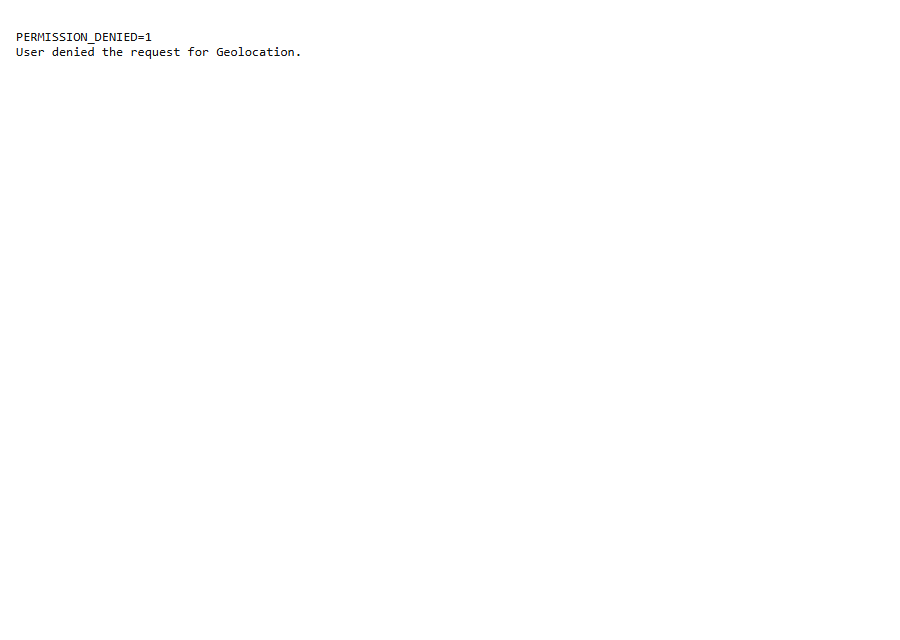

- [x] **Outcome:** `GeolocationPositionError.PERMISSION_DENIED` is **1**. The switch maps that to the W3Schools sentence.

<a id="api-geolocation-example-03"></a>

### **Example 3: Error POSITION_UNAVAILABLE**

- [x] Code **2** — location hardware/provider failed.

Sandbox: `code_sandbox/api-geolocation/error-unavailable.html`

```html
case error.POSITION_UNAVAILABLE:
  x.innerHTML = "Location information is unavailable.";
```

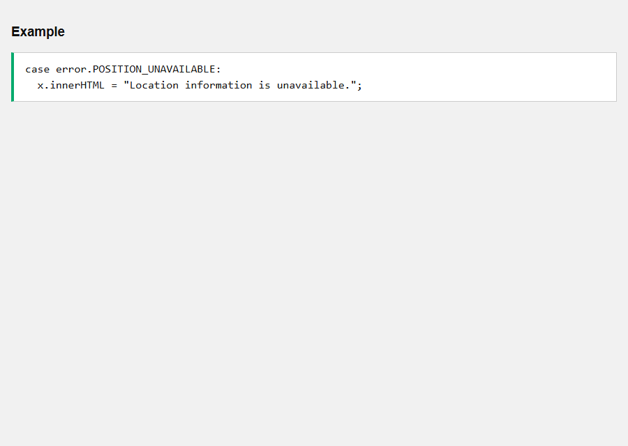


- [x] **Outcome:** **POSITION_UNAVAILABLE** is **2** with the page’s message.

<a id="api-geolocation-example-04"></a>

### **Example 4: Error TIMEOUT**

- [x] Code **3** — `options.timeout` elapsed.
- [x] The snapshot’s getCurrentPosition uses a short timeout to make this likely in headless.

Sandbox: `code_sandbox/api-geolocation/error-timeout.html`

```html
case error.TIMEOUT:
  x.innerHTML = "The request to get user location timed out.";
```

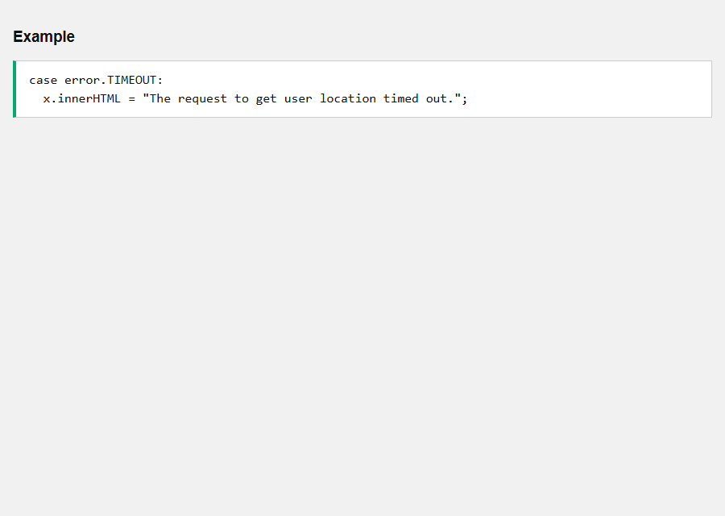

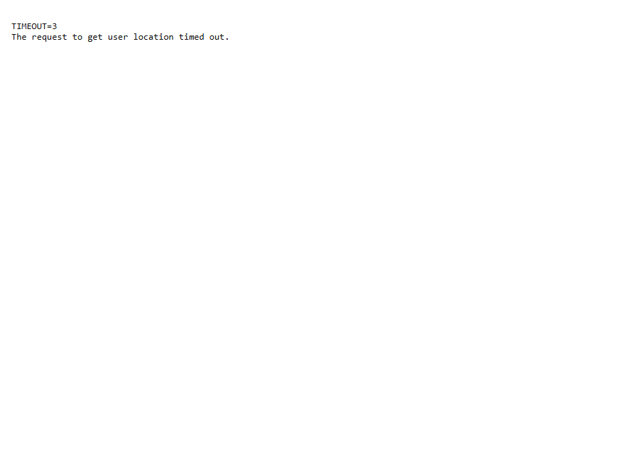

- [x] **Outcome:** **TIMEOUT** is **3**.

<a id="api-geolocation-example-05"></a>

### **Example 5: Error UNKNOWN_ERROR**

- [x] Code **0** in the spec is unused; some docs still mention UNKNOWN_ERROR.
- [x] W3Schools `default` / `UNKNOWN_ERROR` branch: “An unknown error occurred.”

Sandbox: `code_sandbox/api-geolocation/error-unknown.html`

```html
case error.UNKNOWN_ERROR:
  x.innerHTML = "An unknown error occurred.";
```

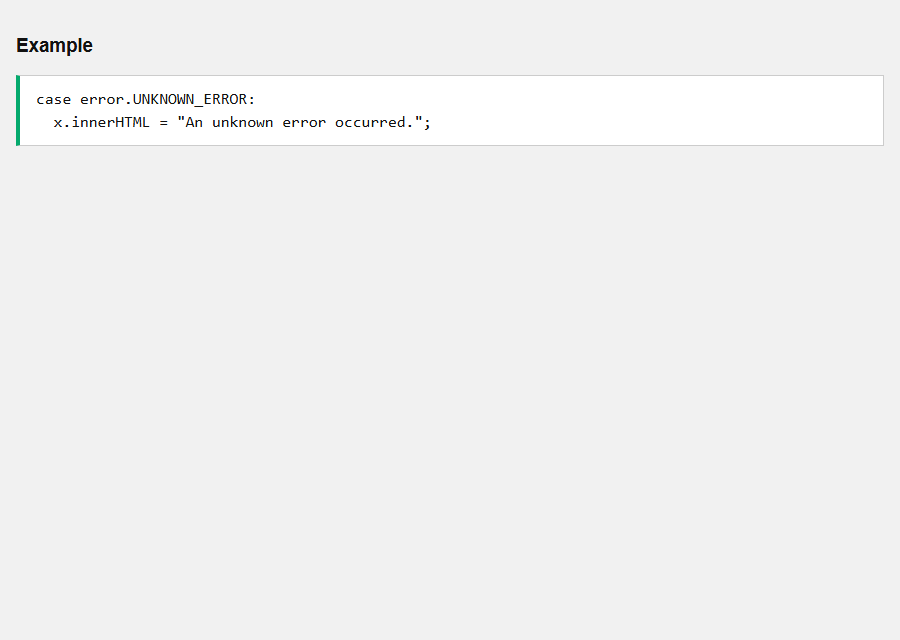


- [x] **Outcome:** The unknown-error message is printed for completeness.

<a id="api-geolocation-example-06"></a>

### **Example 6: Displaying the result in a map URL**

- [x] Build a lat,lon string and plug it into a **static map** image URL.
- [x] The page uses Google Static Maps with **`YOUR_KEY`** — you must supply a real key; we do **not** call Google here.
- [x] The snapshot shows the URL shape with sample coordinates.

Sandbox: `code_sandbox/api-geolocation/map-url.html`

```html
let latlon = position.coords.latitude + "," + position.coords.longitude;
let img_url = "https://maps.googleapis.com/maps/api/staticmap?center="
  + latlon + "&zoom=14&size=400x300&sensor=false&key=YOUR_KEY";
```

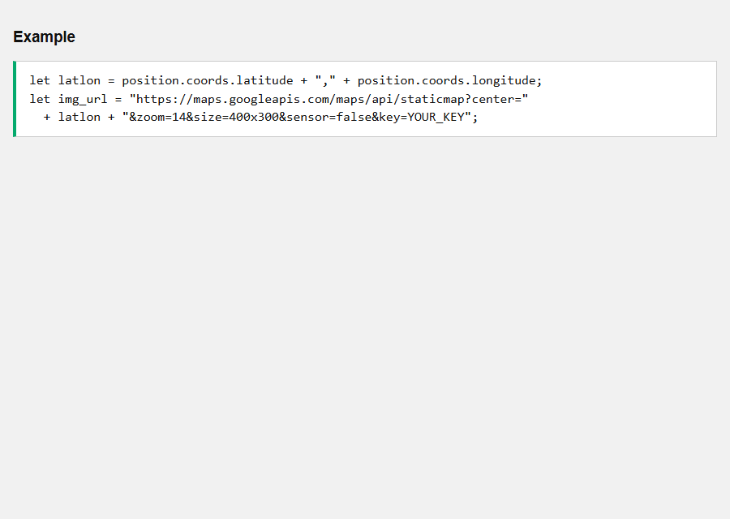

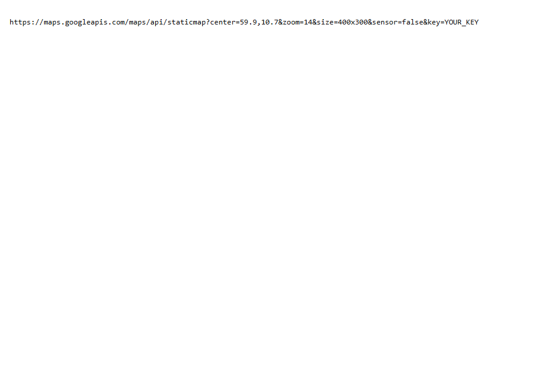

- [x] **Outcome:** The constructed URL contains **center=59.9,10.7** and **YOUR_KEY** as on the page (not fetched).

<a id="api-geolocation-example-07"></a>

### **Example 7: coords.latitude (always returned)**

- [x] Always present on a success Position.
- [x] Decimal degrees.

Sandbox: `code_sandbox/api-geolocation/coords-latitude.html`

```html
position.coords.latitude
```


- [x] **Outcome:** A mock Position-like object prints latitude **59.9** so you see the property shape without needing GPS.

<a id="api-geolocation-example-08"></a>

### **Example 8: coords.longitude (always returned)**

- [x] Decimal degrees, always on success.

Sandbox: `code_sandbox/api-geolocation/coords-longitude.html`

```html
position.coords.longitude
```


- [x] **Outcome:** **longitude=10.7** on the mock coords.

<a id="api-geolocation-example-09"></a>

### **Example 9: coords.accuracy (always returned)**

- [x] Accuracy of the position in **meters** (radius).

Sandbox: `code_sandbox/api-geolocation/coords-accuracy.html`

```html
position.coords.accuracy
```


- [x] **Outcome:** **accuracy=20** (meters) on the mock.

<a id="api-geolocation-example-10"></a>

### **Example 10: coords.altitude (if available)**

- [x] Meters above mean sea level. May be **null**.

Sandbox: `code_sandbox/api-geolocation/coords-altitude.html`

```html
position.coords.altitude
```


- [x] **Outcome:** Mock **altitude=null** (typical for a laptop without a barometer).

<a id="api-geolocation-example-11"></a>

### **Example 11: coords.altitudeAccuracy (if available)**

- [x] Accuracy of altitude; often **null**.

Sandbox: `code_sandbox/api-geolocation/coords-altitude-accuracy.html`

```html
position.coords.altitudeAccuracy
```


- [x] **Outcome:** **altitudeAccuracy=null** on the mock.

<a id="api-geolocation-example-12"></a>

### **Example 12: coords.heading (if available)**

- [x] Degrees clockwise from **north**. Null if stationary/unknown.

Sandbox: `code_sandbox/api-geolocation/coords-heading.html`

```html
position.coords.heading
```


- [x] **Outcome:** **heading=null** when not moving.

<a id="api-geolocation-example-13"></a>

### **Example 13: coords.speed (if available)**

- [x] Meters per second. Null if unknown.

Sandbox: `code_sandbox/api-geolocation/coords-speed.html`

```html
position.coords.speed
```


- [x] **Outcome:** **speed=null** on the mock.

<a id="api-geolocation-example-14"></a>

### **Example 14: position.timestamp**

- [x] Time of the response. Listed as “returned if available”; in the spec it is on the Position object.

Sandbox: `code_sandbox/api-geolocation/timestamp.html`

```html
position.timestamp
```


- [x] **Outcome:** A `Date.now()`-style timestamp is a **number** of milliseconds.

<a id="api-geolocation-example-15"></a>

### **Example 15: watchPosition() — keep updating**

- [x] `watchPosition(success, error?, options?)` returns a **watch id** (number).
- [x] Like GPS in a car: it keeps calling success as the device moves.
- [x] Do not start a watch you never clear.

Sandbox: `code_sandbox/api-geolocation/watch.html`

```html
navigator.geolocation.watchPosition(showPosition)
```


- [x] **Outcome:** `typeof watchPosition` is **function**. We do not leave a watch running in the snapshot.

<a id="api-geolocation-example-16"></a>

### **Example 16: clearWatch(id) — stop watching**

- [x] `clearWatch(id)` stops that watch.
- [x] Pass the number `watchPosition` returned.

Sandbox: `code_sandbox/api-geolocation/clear-watch.html`

```html
navigator.geolocation.clearWatch(id)
```


- [x] **Outcome:** `typeof clearWatch` is **function**.

<details>
  <summary>Terminal Commands</summary>

## Terminal Commands

```bash
# from Personal/Files/javascript/code_sandbox
py -3 -m http.server 8770 --bind 127.0.0.1
```

Then open `http://127.0.0.1:8770/api-geolocation/`.

</details>

<details>
  <summary>Questions and Answers</summary>

## Questions and Answers

### Question 1: Which method gets a one-shot position?

<details>
<summary>Answer</summary>

- [x] **`getCurrentPosition`**.

</details>

### Question 2: Which properties are always on success?

<details>
<summary>Answer</summary>

- [x] **latitude, longitude, accuracy** (and typically **timestamp**).

</details>

### Question 3: What is PERMISSION_DENIED’s code?

<details>
<summary>Answer</summary>

- [x] **1**.

</details>

### Question 4: What is TIMEOUT’s code?

<details>
<summary>Answer</summary>

- [x] **3**.

</details>

### Question 5: What does `watchPosition` return?

<details>
<summary>Answer</summary>

- [x] A numeric **watch id**.

</details>

### Question 6: How do you stop a watch?

<details>
<summary>Answer</summary>

- [x] **`clearWatch(id)`**.

</details>

### Question 7: Does the map example work without an API key?

<details>
<summary>Answer</summary>

- [x] **No** — `YOUR_KEY` must be a real Google key (we did not call the service).

</details>

### Question 8: What units is `speed` in?

<details>
<summary>Answer</summary>

- [x] **Meters per second**.

</details>

### Question 9: What units is `heading` in?

<details>
<summary>Answer</summary>

- [x] **Degrees** clockwise from north.

</details>

### Question 10: Why might this fail in the snapshot?

<details>
<summary>Answer</summary>

- [x] **Permission**, **insecure origin**, or **timeout** — all are real API outcomes.

</details>


</details>

## Summary

Call getCurrentPosition with success and error callbacks. Read coords.latitude/longitude/accuracy. Use watchPosition only if you will clearWatch. Do not ship YOUR_KEY placeholders to Google.

## References

- [API Geolocation](https://www.w3schools.com/js/js_api_geolocation.asp)
- [MDN Geolocation.getCurrentPosition()](https://developer.mozilla.org/en-US/docs/Web/API/Geolocation/getCurrentPosition)

</details>

<details>
  <summary>API Web Pointer</summary>

## Introduction

Pointer events unify mouse, pen, and touch. Names mirror mouse events (`pointerdown`, …). Extra properties include pointerId, pointerType, isPrimary, and pressure. CSS `pointer-events` is a separate targeting switch.

This section has **16** examples:

- [x] **Example 1:** pointerdown event [View](#api-web-pointer-example-01)
- [x] **Example 2:** pointerup event [View](#api-web-pointer-example-02)
- [x] **Example 3:** pointermove event [View](#api-web-pointer-example-03)
- [x] **Example 4:** pointerover event [View](#api-web-pointer-example-04)
- [x] **Example 5:** pointerout event [View](#api-web-pointer-example-05)
- [x] **Example 6:** pointerenter event [View](#api-web-pointer-example-06)
- [x] **Example 7:** pointerleave event [View](#api-web-pointer-example-07)
- [x] **Example 8:** pointercancel event [View](#api-web-pointer-example-08)
- [x] **Example 9:** pointerId property [View](#api-web-pointer-example-09)
- [x] **Example 10:** pointerType property [View](#api-web-pointer-example-10)
- [x] **Example 11:** isPrimary property [View](#api-web-pointer-example-11)
- [x] **Example 12:** pressure property [View](#api-web-pointer-example-12)
- [x] **Example 13:** setPointerCapture — keep receiving events while dragging [View](#api-web-pointer-example-13)
- [x] **Example 14:** CSS pointer-events: none [View](#api-web-pointer-example-14)
- [x] **Example 15:** CSS pointer-events: auto [View](#api-web-pointer-example-15)
- [x] **Example 16:** Unified model — one listener for mouse, pen, and touch [View](#api-web-pointer-example-16)

## Detailed Explanation

- [x] Replace mouse with pointer in the event name.
- [x] enter/leave do not bubble.
- [x] setPointerCapture for dragging.
- [x] pointer-events:none is CSS, not the JS API.

<a id="api-web-pointer-example-01"></a>

### **Example 1: pointerdown event**

- [x] **`pointerdown`** — pointer becomes active (button pressed / contact).
- [x] Pointer names match mouse events: replace **mouse** with **pointer**.
- [x] The sandbox dispatches a synthetic `PointerEvent` so the listener runs without a real mouse/touch.

Sandbox: `code_sandbox/api-web-pointer/pointerdown.html`

```html
el.addEventListener("pointerdown", handler);
```


- [x] **Outcome:** Dispatching `pointerdown` sets the log to **pointerdown**.

<a id="api-web-pointer-example-02"></a>

### **Example 2: pointerup event**

- [x] **`pointerup`** — pointer is no longer active (release / contact ended).
- [x] Pointer names match mouse events: replace **mouse** with **pointer**.
- [x] The sandbox dispatches a synthetic `PointerEvent` so the listener runs without a real mouse/touch.

Sandbox: `code_sandbox/api-web-pointer/pointerup.html`

```html
el.addEventListener("pointerup", handler);
```


- [x] **Outcome:** Dispatching `pointerup` sets the log to **pointerup**.

<a id="api-web-pointer-example-03"></a>

### **Example 3: pointermove event**

- [x] **`pointermove`** — pointer changes coordinates.
- [x] Pointer names match mouse events: replace **mouse** with **pointer**.
- [x] The sandbox dispatches a synthetic `PointerEvent` so the listener runs without a real mouse/touch.

Sandbox: `code_sandbox/api-web-pointer/pointermove.html`

```html
el.addEventListener("pointermove", handler);
```


- [x] **Outcome:** Dispatching `pointermove` sets the log to **pointermove**.

<a id="api-web-pointer-example-04"></a>

### **Example 4: pointerover event**

- [x] **`pointerover`** — pointer moves **into** an element (bubbles).
- [x] Pointer names match mouse events: replace **mouse** with **pointer**.
- [x] The sandbox dispatches a synthetic `PointerEvent` so the listener runs without a real mouse/touch.
- [x] Unlike mouseenter, **over** bubbles.

Sandbox: `code_sandbox/api-web-pointer/pointerover.html`

```html
el.addEventListener("pointerover", handler);
```


- [x] **Outcome:** Dispatching `pointerover` sets the log to **pointerover**.

<a id="api-web-pointer-example-05"></a>

### **Example 5: pointerout event**

- [x] **`pointerout`** — pointer moves **out** of an element (bubbles).
- [x] Pointer names match mouse events: replace **mouse** with **pointer**.
- [x] The sandbox dispatches a synthetic `PointerEvent` so the listener runs without a real mouse/touch.

Sandbox: `code_sandbox/api-web-pointer/pointerout.html`

```html
el.addEventListener("pointerout", handler);
```


- [x] **Outcome:** Dispatching `pointerout` sets the log to **pointerout**.

<a id="api-web-pointer-example-06"></a>

### **Example 6: pointerenter event**

- [x] **`pointerenter`** — like pointerover but **does not bubble**.
- [x] Pointer names match mouse events: replace **mouse** with **pointer**.
- [x] The sandbox dispatches a synthetic `PointerEvent` so the listener runs without a real mouse/touch.

Sandbox: `code_sandbox/api-web-pointer/pointerenter.html`

```html
el.addEventListener("pointerenter", handler);
```


- [x] **Outcome:** Dispatching `pointerenter` sets the log to **pointerenter**.

<a id="api-web-pointer-example-07"></a>

### **Example 7: pointerleave event**

- [x] **`pointerleave`** — like pointerout but **does not bubble**.
- [x] Pointer names match mouse events: replace **mouse** with **pointer**.
- [x] The sandbox dispatches a synthetic `PointerEvent` so the listener runs without a real mouse/touch.

Sandbox: `code_sandbox/api-web-pointer/pointerleave.html`

```html
el.addEventListener("pointerleave", handler);
```


- [x] **Outcome:** Dispatching `pointerleave` sets the log to **pointerleave**.

<a id="api-web-pointer-example-08"></a>

### **Example 8: pointercancel event**

- [x] **`pointercancel`** — the system **cancels** the interaction (OS UI, etc.).
- [x] Pointer names match mouse events: replace **mouse** with **pointer**.
- [x] The sandbox dispatches a synthetic `PointerEvent` so the listener runs without a real mouse/touch.

Sandbox: `code_sandbox/api-web-pointer/pointercancel.html`

```html
el.addEventListener("pointercancel", handler);
```


- [x] **Outcome:** Dispatching `pointercancel` sets the log to **pointercancel**.

<a id="api-web-pointer-example-09"></a>

### **Example 9: pointerId property**

- [x] **Unique id** per pointer — required for multi-touch.
- [x] Mouse is usually id **1**.

Sandbox: `code_sandbox/api-web-pointer/pointer-id.html`

```html
event.pointerId
```


- [x] **Outcome:** The synthetic event’s **pointerId** is **1**.

<a id="api-web-pointer-example-10"></a>

### **Example 10: pointerType property**

- [x] String: **`mouse`**, **`pen`**, or **`touch`**.
- [x] One listener can branch on hardware.

Sandbox: `code_sandbox/api-web-pointer/pointer-type.html`

```html
event.pointerType
```


- [x] **Outcome:** **pointerType=mouse** on the synthetic event.

<a id="api-web-pointer-example-11"></a>

### **Example 11: isPrimary property**

- [x] **true** for the primary pointer (first finger; the mouse).
- [x] Extra fingers are not primary.

Sandbox: `code_sandbox/api-web-pointer/is-primary.html`

```html
event.isPrimary
```


- [x] **Outcome:** **isPrimary=true** for this mouse-like event.

<a id="api-web-pointer-example-12"></a>

### **Example 12: pressure property**

- [x] Normalized **0–1**. Mouse often reports **0.5** when the button is down.
- [x] Pens can vary.

Sandbox: `code_sandbox/api-web-pointer/pressure.html`

```html
event.pressure
```


- [x] **Outcome:** **pressure=0.5** on the synthetic down event.

<a id="api-web-pointer-example-13"></a>

### **Example 13: setPointerCapture — keep receiving events while dragging**

- [x] `element.setPointerCapture(pointerId)` sends later events to **that element** even if the pointer leaves.
- [x] Useful for sliders.
- [x] `hasPointerCapture` confirms it.

Sandbox: `code_sandbox/api-web-pointer/capture.html`

```html
el.setPointerCapture(event.pointerId)
```


- [x] **Outcome:** After capture, `hasPointerCapture(1)` is **true**.

<a id="api-web-pointer-example-14"></a>

### **Example 14: CSS pointer-events: none**

- [x] **Separate** from the Pointer Events API: a CSS property.
- [x] `pointer-events: none` makes the element (and descendants) **not** a target.
- [x] Clicks “fall through” to whatever is underneath.

Sandbox: `code_sandbox/api-web-pointer/css-none.html`

```html
style="pointer-events: none;" 
```


- [x] **Outcome:** Computed `pointer-events` is **none**; `elementFromPoint` over the box is **not** the box itself.

<a id="api-web-pointer-example-15"></a>

### **Example 15: CSS pointer-events: auto**

- [x] `pointer-events: auto` restores **default** targeting.
- [x] Use it to re-enable a layer you had turned off.

Sandbox: `code_sandbox/api-web-pointer/css-auto.html`

```html
style="pointer-events: auto;" 
```


- [x] **Outcome:** Computed value is **auto**.

<a id="api-web-pointer-example-16"></a>

### **Example 16: Unified model — one listener for mouse, pen, and touch**

- [x] The page’s benefit: **one set of listeners** instead of mouse + touch + pen separately.
- [x] Also extra properties: tiltX, tiltY, width, height for pen/touch.
- [x] Recommended approach for modern interactive UI.

Sandbox: `code_sandbox/api-web-pointer/unified.html`

```html
el.addEventListener("pointerdown", onDown); // mouse, pen, and touch
```

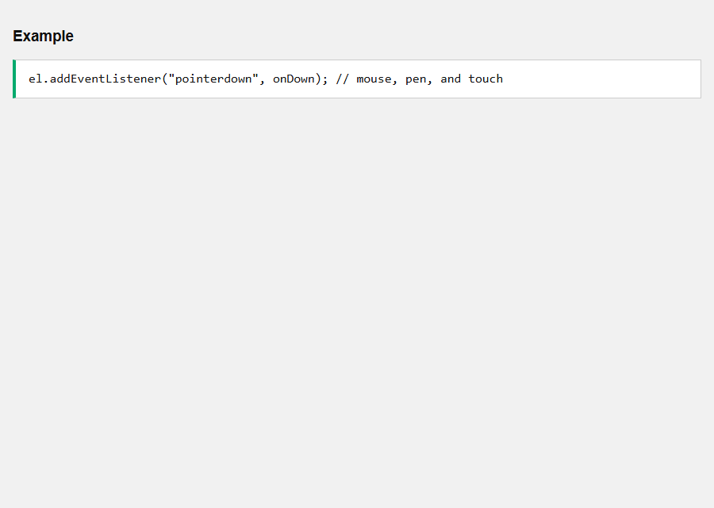

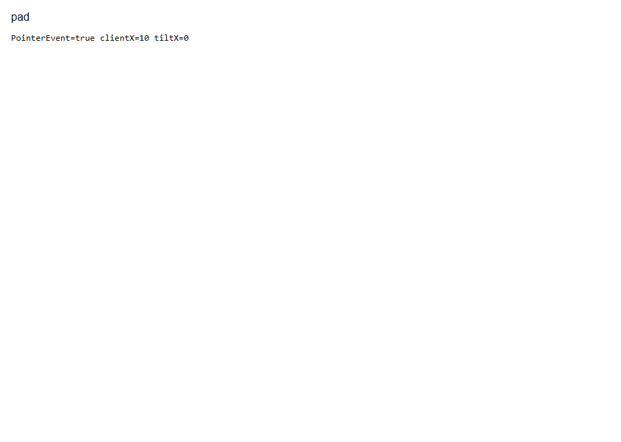

- [x] **Outcome:** `PointerEvent` exists and inherits mouse coordinates (`clientX` is a number on the synthetic event).

<details>
  <summary>Terminal Commands</summary>

## Terminal Commands

```bash
# from Personal/Files/javascript/code_sandbox
py -3 -m http.server 8770 --bind 127.0.0.1
```

Then open `http://127.0.0.1:8770/api-web-pointer/`.

</details>

<details>
  <summary>Questions and Answers</summary>

## Questions and Answers

### Question 1: How do pointer event names relate to mouse events?

<details>
<summary>Answer</summary>

- [x] Replace **mouse** with **pointer** (`mousedown` → `pointerdown`).

</details>

### Question 2: Which pair does **not** bubble?

<details>
<summary>Answer</summary>

- [x] **pointerenter** and **pointerleave**.

</details>

### Question 3: What is `pointerType`?

<details>
<summary>Answer</summary>

- [x] **`mouse`**, **`pen`**, or **`touch`**.

</details>

### Question 4: What is `pointerId` for?

<details>
<summary>Answer</summary>

- [x] Identifying each pointer in **multi-touch**.

</details>

### Question 5: What is `isPrimary`?

<details>
<summary>Answer</summary>

- [x] **true** for the main pointer (mouse / first finger).

</details>

### Question 6: Pressure range?

<details>
<summary>Answer</summary>

- [x] **0 to 1**.

</details>

### Question 7: What does `setPointerCapture` do?

<details>
<summary>Answer</summary>

- [x] The element **keeps** getting events if the pointer leaves it (dragging).

</details>

### Question 8: Is CSS `pointer-events` the same API?

<details>
<summary>Answer</summary>

- [x] **No** — it only controls whether the element can be a **target**.

</details>

### Question 9: What does `pointer-events: none` do?

<details>
<summary>Answer</summary>

- [x] The element is **not** a pointer target (clicks pass through).

</details>

### Question 10: Why prefer pointer events?

<details>
<summary>Answer</summary>

- [x] **One** listener model for mouse, pen, and touch.

</details>


</details>

## Summary

Listen for pointer* events instead of maintaining mouse + touch handlers. Use pointerId for multi-touch and setPointerCapture for drags. CSS pointer-events only changes hit-testing.

## References

- [API Web Pointer](https://www.w3schools.com/js/js_api_pointer_events.asp)
- [MDN Pointer events](https://developer.mozilla.org/en-US/docs/Web/API/Pointer_events)

</details>
